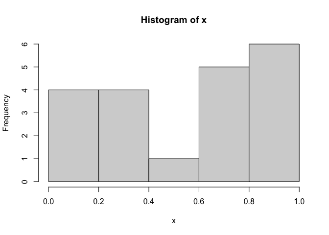

R语言基础学习（第一阶段）
================

- <a href="#1-r语言介绍" id="toc-1-r语言介绍">1 R语言介绍</a>
  - <a href="#11-r的使用" id="toc-11-r的使用">1.1 R的使用</a>
    - <a href="#111-工作空间" id="toc-111-工作空间">1.1.1 工作空间</a>
  - <a href="#12-包" id="toc-12-包">1.2 包</a>
    - <a href="#121-什么是包" id="toc-121-什么是包">1.2.1 什么是包</a>
    - <a href="#122-包的安装" id="toc-122-包的安装">1.2.2 包的安装</a>
    - <a href="#123-包的载入" id="toc-123-包的载入">1.2.3 包的载入</a>
    - <a href="#124-获取帮助" id="toc-124-获取帮助">1.2.4 获取帮助</a>
- <a href="#2-创建数据集" id="toc-2-创建数据集">2 创建数据集</a>
  - <a href="#21-数据集的概念" id="toc-21-数据集的概念">2.1 数据集的概念</a>
  - <a href="#22-数据结构" id="toc-22-数据结构">2.2 数据结构</a>
    - <a href="#221-向量" id="toc-221-向量">2.2.1 向量</a>
    - <a href="#222-矩阵" id="toc-222-矩阵">2.2.2 矩阵</a>

Source：

1.  《R语言实战（中文第二版）》

2.  [【B站】从零开始学 R
    语言，带你玩转医学统计学](https://www.bilibili.com/video/BV1JU4y1f7zg/?spm_id_from=333.1007.top_right_bar_window_custom_collection.content.click&vd_source=fa22bae99c47db3f7bc43573bd9b3ed3)

# 1 R语言介绍

## 1.1 R的使用

- R语句由函数和赋值构成。R使用\<-（快捷键：alt +
  -），而不是传统的=作为赋值符号。例如，以下语句：

``` r
> # 创建一个名为X的向量对象，它包含5个来自标准正态分布的随机偏差。
> x <- rnorm(5)
```

### 1.1.1 工作空间

- 当前的工作目录(working
  directory)是R用来读取文件和保存结果的默认目录。我们可以使用函数getwd(
  )来查看当前的工作目录，或使用函数setwd(
  )设定当前的工作目录。如果需要读入一个不在当前工作目录下的文件，则需在调用语句中写明完整的路径。
  记得使用引号闭合这些目录名和文件名。

- 用于管理工作空间的部分标准命令如下：

``` r
> # 显示当前的工作目录
> getwd()
[1] "/Users/liang.hanqing/Documents/Git-local/Github_Bioinformatics_Learning/R/Phase1_R_Basic_Learning"
> # 列出当前工作空间中的对象
> ls()
[1] "x"
```

    # 移除(删除)一个或多个对象
    rm(objectlist)
    # 显示可用选项的说明
    help(options)
    # 显示或设置当前选项
    options()

``` r
> # 创建了一个包含20个均匀分布随机变量的向量，生成了此数据的摘要统计量和直方图。
> options(digits=3) # 数字将被格式化,显示为具有小数点后三位有效数字的格式
> x <- runif(20) # 创建了一个包含20个均匀分布随机变量的向量
> summary(x) # 生成了此数据的摘要统计量
   Min. 1st Qu.  Median    Mean 3rd Qu.    Max. 
  0.028   0.228   0.395   0.410   0.550   0.890 
> hist(x) # 生成了此数据的直方图
```

<!-- -->

## 1.2 包

### 1.2.1 什么是包

- 包是R函数、数据、预编译代码以一种定义完善的格式组成的集合。计算机上存储包的目录称为库(library)。函数.libPaths(
  )能够显示库所在的位置，函数library( )则可以显示库中有哪些包。

### 1.2.2 包的安装

- 第一次安装一个包，使用命令`install.packages('packages_name')`即可。
- 使用命令`update.packages()`可以更新已经安装的包。
- 要查看已安装包的描述，可以使用`installed.packages()`命令，这将列出安装的包，以及它们的版本号、依赖关系等信息。

### 1.2.3 包的载入

- 要在R会话中使用它，还需要使用`library()`命令载入这个包。例如，要使用gclus包，执行命令`library(gclus)`即可。当然，在载入一个包之前必须已经安装了这个包。在一个会话中，包只需载入一次。

### 1.2.4 获取帮助

    ?foo 或 help('foo') # 查看函数 foo 的帮助
    ??foo 或 help.search('foo') # 以 foo 为关键词搜索本地帮助文档
    example('foo') # 函数 foo 的使用示例
    RSiteSearch('foo') # 以 foo 为关键词搜索在线文档和邮件列表存档
    apropos('foo',mode = 'function') # 列出名称中含有 foo 的所有可用函数
    data() # 列出当前已加载包中所含的所有可用示例数据集
    vignette() # 列出当前已安装包中所有可用的 vignette 文档
    vignette('foo') # 为主题 foo 显示指定的 vignette 文档

# 2 创建数据集

## 2.1 数据集的概念

- 数据集通常是由数据构成的一个矩形数组，**行表示观测(observation)，列表示变量(variable)
  。**

## 2.2 数据结构

- R拥有许多用于存储数据的对象类型，包括标量、向量、矩阵、数组、数据框和列表。
- 在R中，对象(object)是指可以赋值给变量的任何事物，包括常量、数据结构、函数，甚至图形。
- 因子(factor)是名义型变量或有序型变量。它们在R中被特殊地存储和处理。

### 2.2.1 向量

- 向量是用于存储数值型、字符型或逻辑型数据的一维数组。执行组合功能的函数c(
  )可用来创建向量。

``` r
> a <- c(1, 2, 5, 3, 6, -2, 4)  # a是数值型向量
> b <- c("one", "two", "three")  # b是字符型向量
> c <- c(TRUE, TRUE, TRUE, FALSE, TRUE, FALSE) # c是逻辑型向量
```

- **注意：单个向量中的数据必须拥有相同的类型或模式(数值型、字符型或逻辑型)。同一向量中无法混杂不同模式的数据。**
- **注意：标量是只含一个元素的向量，例如f \<- 3、g \<- “US”和h \<-
  TRUE。它们用于保存常量。**
- 索引：通过在方括号中给定元素所处位置的数值，可以访问向量中的元素。

``` r
> a <- c("k", "j", "h", "a", "c", "m") 
> a[3]
[1] "h"
```

``` r
> a[c(1, 3, 5)]
[1] "k" "h" "c"
```

``` r
> a[2:6]
[1] "j" "h" "a" "c" "m"
```

### 2.2.2 矩阵

- 矩阵是一个二维数组，只是每个元素都拥有相同的模式(数值型、字符型或逻辑型)
  。可通过函数matrix()创建矩阵。一般使用格式为：

<!-- -->

    my_matrix <- matrix(vector, nrow=number_of_rows, ncol=number_of_columns,
                         byrow=logical_value, dimnames=list(
                             char_vector_rownames, char_vector_colnames))

- 其中vector包含了矩阵的元素，nrow和ncol用以指定行和列的维数，dimnames包含了可选的、以字符型向量表示的行名和列名。选项byrow则表明矩阵应当按行填充(byrow=TRUE)还是按列填充(byrow=FALSE)，**默认情况下按列填充**。注意：这些元素的名字不可更改。

``` r
> # 创建一个5*4的矩阵
> y <- matrix(1:20, nrow=5, ncol=4)
> y
     [,1] [,2] [,3] [,4]
[1,]    1    6   11   16
[2,]    2    7   12   17
[3,]    3    8   13   18
[4,]    4    9   14   19
[5,]    5   10   15   20
```

``` r
> # 创建了一个2×2的含列名标签的矩阵并按 行 进行填充
> cells <- c(1,26,24,68)
> row_names <- c("R1", "R2")
> col_names <- c("C1", "C2")
> my_matrix_1 <- matrix(cells, nrow=2, ncol=2, byrow=TRUE, 
+                       dimnames=list(row_names, col_names))
> my_matrix_1
   C1 C2
R1  1 26
R2 24 68
```
