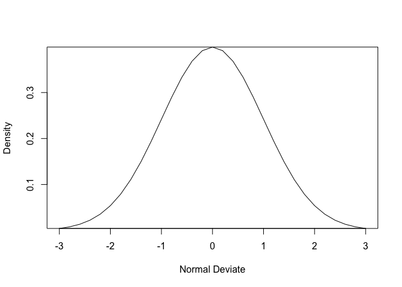

R语言基础学习（第一阶段）——数据管理
================

- <a href="#2_1-基本数据管理" id="toc-2_1-基本数据管理">2_1
  基本数据管理</a>
  - <a href="#2_11-创建新变量" id="toc-2_11-创建新变量">2_1.1 创建新变量</a>
  - <a href="#2_12-变量的重编码" id="toc-2_12-变量的重编码">2_1.2
    变量的重编码</a>
  - <a href="#2_13-变量的重命名" id="toc-2_13-变量的重命名">2_1.3
    变量的重命名</a>
  - <a href="#2_14-缺失值" id="toc-2_14-缺失值">2_1.4 缺失值</a>
  - <a href="#2_15-日期值" id="toc-2_15-日期值">2_1.5 日期值</a>
  - <a href="#2_16-类型转换" id="toc-2_16-类型转换">2_1.6 类型转换</a>
  - <a href="#2_17-数据排序" id="toc-2_17-数据排序">2_1.7 数据排序</a>
  - <a href="#2_18-数据集的合并" id="toc-2_18-数据集的合并">2_1.8
    数据集的合并</a>
    - <a href="#381-向数据框添加列" id="toc-381-向数据框添加列">3.8.1
      向数据框添加列</a>
    - <a href="#2_182-向数据框添加行" id="toc-2_182-向数据框添加行">2_1.8.2
      向数据框添加行</a>
  - <a href="#2_19-数据集取子集" id="toc-2_19-数据集取子集">2_1.9
    数据集取子集</a>
    - <a href="#2_191-选入保留变量" id="toc-2_191-选入保留变量">2_1.9.1
      选入(保留)变量</a>
    - <a href="#2_192-剔除丢弃变量" id="toc-2_192-剔除丢弃变量">2_1.9.2
      剔除(丢弃)变量</a>
    - <a href="#2_193-选入观测" id="toc-2_193-选入观测">2_1.9.3 选入观测</a>
    - <a href="#2_194-subset-函数" id="toc-2_194-subset-函数">2_1.9.4 subset(
      )函数</a>
    - <a href="#2_195-随机抽样" id="toc-2_195-随机抽样">2_1.9.5 随机抽样</a>
- <a href="#2_2-高级数据管理" id="toc-2_2-高级数据管理">2_2
  高级数据管理</a>
  - <a href="#2_21-数值和字符处理函数"
    id="toc-2_21-数值和字符处理函数">2_2.1 数值和字符处理函数</a>
    - <a href="#2_211-数学函数" id="toc-2_211-数学函数">2_2.1.1 数学函数</a>
    - <a href="#2_212-统计函数" id="toc-2_212-统计函数">2_2.1.2 统计函数</a>
    - <a href="#2_213-概率函数" id="toc-2_213-概率函数">2_2.1.3 概率函数</a>
    - <a href="#2_214-字符处理函数" id="toc-2_214-字符处理函数">2_2.1.4
      字符处理函数</a>
    - <a href="#2_215-其他实用函数" id="toc-2_215-其他实用函数">2_2.1.5
      其他实用函数</a>
    - <a href="#2_216-将函数应用于矩阵和数据框"
      id="toc-2_216-将函数应用于矩阵和数据框">2_2.1.6
      将函数应用于矩阵和数据框</a>
  - <a href="#2_22-数据处理难题的一套解决方案"
    id="toc-2_22-数据处理难题的一套解决方案">2_2.2
    数据处理难题的一套解决方案</a>
  - <a href="#2_23-控制流" id="toc-2_23-控制流">2_2.3 控制流</a>
    - <a href="#2_231-重复和循环" id="toc-2_231-重复和循环">2_2.3.1
      重复和循环</a>
    - <a href="#2_232-条件执行" id="toc-2_232-条件执行">2_2.3.2 条件执行</a>

Source：

1.  《R语言实战（中文第二版）》

2.  [【B站】从零开始学 R
    语言，带你玩转医学统计学](https://www.bilibili.com/video/BV1JU4y1f7zg/?spm_id_from=333.1007.top_right_bar_window_custom_collection.content.click&vd_source=fa22bae99c47db3f7bc43573bd9b3ed3)

# 2_1 基本数据管理

## 2_1.1 创建新变量

- 运算符

<!-- -->

    + # 加
    - # 减
    * # 乘
    / # 除
    ^或** # 求幂 
    x%%y # 求余数。例如，5%%2的余数为1（5/2结果为2余1）
    x%/%y # 整数除法。5%/%2的结果为2（5/2结果为2余1） 

- 案例：

``` r
> my_data <- data.frame(x1 = c(2, 2, 6, 4),                    
+                       x2 = c(3, 4, 2, 8))
> my_data <- transform(my_data,
+                     sumx=x1+x2,
+                     neanx=(x1+x2)/2)
> my_data
  x1 x2 sumx neanx
1  2  3    5   2.5
2  2  4    6   3.0
3  6  2    8   4.0
4  4  8   12   6.0
```

## 2_1.2 变量的重编码

- 重编码涉及根据同一个变量和/或其他变量的现有值创建新值的过程。

- 要重编码数据,可以使用R中的一个或多个逻辑运算符。逻辑运算符表达式可返回TRUE或FALSE。

- 逻辑运算符

<!-- -->

    < # 小于 
    <= # 小于或等于 
    > # 大于 
    >= # 大于或等于 
    == # 严格等于 
    != # 不等于 
    !x # 非x 
    x | y # x或y 
    x & y # x和y 
    isTRUE(x) # 测试x是否为TRUE

``` r
> # 创建leadership数据框
> manager <- c(1, 2, 3, 4, 5) 
> date <- c("10/24/08", "10/28/08", "10/1/08", "10/12/08", "5/1/09") 
> country <- c("US", "US", "UK", "UK", "UK") 
> gender <- c("M", "F", "F", "M", "F") 
> age <- c(32, 45, 25, 39, 99) 
> q1 <- c(5, 3, 3, 3, 2) 
> q2 <- c(4, 5, 5, 3, 2) 
> q3 <- c(5, 2, 5, 4, 1) 
> q4 <- c(5, 5, 5, NA, 2) 
> q5 <- c(5, 5, 2, NA, 1) 
> leadership <- data.frame(manager, date, country, gender, age,                          
+                          q1, q2, q3, q4, q5, stringsAsFactors=FALSE)
> leadership
  manager     date country gender age q1 q2 q3 q4 q5
1       1 10/24/08      US      M  32  5  4  5  5  5
2       2 10/28/08      US      F  45  3  5  2  5  5
3       3  10/1/08      UK      F  25  3  5  5  5  2
4       4 10/12/08      UK      M  39  3  3  4 NA NA
5       5   5/1/09      UK      F  99  2  2  1  2  1
```

- 假设希望将leadership数据集中经理人的连续型年龄变量age重编码为类别型变量agecat(Young、
  Middle Aged、Elder)。创建agecat变量：

``` r
> leadership <- within(leadership,{                      
+     agecat <- NA                       
+     agecat[age > 75]              <- "Elder"                      
+     agecat[age >= 55 & age <= 75] <- "Middle Aged"                      
+     agecat[age < 55]              <- "Young" })
> leadership
  manager     date country gender age q1 q2 q3 q4 q5 agecat
1       1 10/24/08      US      M  32  5  4  5  5  5  Young
2       2 10/28/08      US      F  45  3  5  2  5  5  Young
3       3  10/1/08      UK      F  25  3  5  5  5  2  Young
4       4 10/12/08      UK      M  39  3  3  4 NA NA  Young
5       5   5/1/09      UK      F  99  2  2  1  2  1  Elder
```

## 2_1.3 变量的重命名

- 假设你希望将变量名manager修改为managerID，并将date修改为testDate，那么可以使用语句：

<!-- -->

    fix(leadership)

- 若以编程方式，可以通过`names()`函数来重命名变量。例如：

``` r
> names(leadership)[2] <- "testDate"
> names(leadership)[6:10] <- c("item1", "item2", "item3", "item4", "item5")
> leadership
  manager testDate country gender age item1 item2 item3 item4 item5 agecat
1       1 10/24/08      US      M  32     5     4     5     5     5  Young
2       2 10/28/08      US      F  45     3     5     2     5     5  Young
3       3  10/1/08      UK      F  25     3     5     5     5     2  Young
4       4 10/12/08      UK      M  39     3     3     4    NA    NA  Young
5       5   5/1/09      UK      F  99     2     2     1     2     1  Elder
```

- plyr包中有一个`rename()`函数，可用于修改变量名。这个函数默认并没有被安装，所以你首先要使用命令`install.packages("plyr")`对之进行安装。

- `rename()`函数的使用格式为：

<!-- -->

    rename(dataframe, c(oldname="newname", oldname="newname",...))

- 示例：

``` r
> library(plyr) 
> leadership <- rename(leadership,                       
+                     c(manager="managerID", testDate="date"))
> leadership
  managerID     date country gender age item1 item2 item3 item4 item5 agecat
1         1 10/24/08      US      M  32     5     4     5     5     5  Young
2         2 10/28/08      US      F  45     3     5     2     5     5  Young
3         3  10/1/08      UK      F  25     3     5     5     5     2  Young
4         4 10/12/08      UK      M  39     3     3     4    NA    NA  Young
5         5   5/1/09      UK      F  99     2     2     1     2     1  Elder
```

## 2_1.4 缺失值

- 在R中，缺失值以符号NA(Not
  Available，不可用)表示。R提供了一些函数，用于识别包含缺失值的观测。函数`is.na()`允许检测缺失值是否存在。

``` r
> # 再次使用leadership数据框
> manager <- c(1, 2, 3, 4, 5) 
> date <- c("10/24/08", "10/28/08", "10/1/08", "10/12/08", "5/1/09") 
> country <- c("US", "US", "UK", "UK", "UK") 
> gender <- c("M", "F", "F", "M", "F") 
> age <- c(32, 45, 25, 39, 99) 
> q1 <- c(5, 3, 3, 3, 2) 
> q2 <- c(4, 5, 5, 3, 2) 
> q3 <- c(5, 2, 5, 4, 1) 
> q4 <- c(5, 5, 5, NA, 2) 
> q5 <- c(5, 5, 2, NA, 1) 
> leadership <- data.frame(manager, date, country, gender, age,                          
+                          q1, q2, q3, q4, q5, stringsAsFactors=FALSE)
> leadership
  manager     date country gender age q1 q2 q3 q4 q5
1       1 10/24/08      US      M  32  5  4  5  5  5
2       2 10/28/08      US      F  45  3  5  2  5  5
3       3  10/1/08      UK      F  25  3  5  5  5  2
4       4 10/12/08      UK      M  39  3  3  4 NA NA
5       5   5/1/09      UK      F  99  2  2  1  2  1
```

``` r
> is.na(leadership[,6:10])
        q1    q2    q3    q4    q5
[1,] FALSE FALSE FALSE FALSE FALSE
[2,] FALSE FALSE FALSE FALSE FALSE
[3,] FALSE FALSE FALSE FALSE FALSE
[4,] FALSE FALSE FALSE  TRUE  TRUE
[5,] FALSE FALSE FALSE FALSE FALSE
```

- 这里的`leadership[,6:10]`将数据框限定到第6列至第10列，接下来`is.na()`识别出了缺失值。

- 还可以使用赋值语句将某些值重编码为缺失值。在leadership示例中，缺失的年龄值被编码为99。在分析这一数据集之前，必须让R明白本例中的99表示缺失值(否则这些样本的平均年龄将会高得离谱)。可以通过重编码这个变量完成这项工作（**请确保所有的缺失数据已在分析之前被妥善地编码为缺失值，否则分析结果将失去意义。**）：

``` r
> # 任何等于99的年龄值都将被修改为NA
> leadership$age[leadership$age == 99] <- NA
> leadership
  manager     date country gender age q1 q2 q3 q4 q5
1       1 10/24/08      US      M  32  5  4  5  5  5
2       2 10/28/08      US      F  45  3  5  2  5  5
3       3  10/1/08      UK      F  25  3  5  5  5  2
4       4 10/12/08      UK      M  39  3  3  4 NA NA
5       5   5/1/09      UK      F  NA  2  2  1  2  1
```

- 确定了缺失值的位置以后，你需要在进一步分析数据之前以某种方式删除这些缺失值。多数的数值函数都拥有一个`na.rm=TRUE`选项，可以在计算之前移除缺失值并使用剩余值进行计算：

``` r
> x <- c(1, 2, NA, 3) 
> y <- sum(x, na.rm=TRUE)
> y
[1] 6
```

- 在使用函数处理不完整的数据时，请务必查阅它们的帮助文档(例如，help(sum))，检查这些函数是如何处理缺失数据的。

- 可以通过函数`na.omit()`移除所有含有缺失值的观测。`na.omit()`可以删除所有含有缺失数据的行。

``` r
> # 使用na.omit()删除不完整的观测
> newdata <- na.omit(leadership) 
> newdata
  manager     date country gender age q1 q2 q3 q4 q5
1       1 10/24/08      US      M  32  5  4  5  5  5
2       2 10/28/08      US      F  45  3  5  2  5  5
3       3  10/1/08      UK      F  25  3  5  5  5  2
```

## 2_1.5 日期值

- 日期值通常以字符串的形式输入到R中，然后转化为以数值形式存储的日期变量。函数`as.Date()`用于执行这种转化。其语法为`as.Date(x, "input_format")`，其中x是字符型数据，input_format则给出了用于读入日期的适当格式。

<!-- -->

    %d # 数字表示的日期(0~31) 01~31 
    %a # 缩写的星期名 Mon 
    %A # 非缩写星期名 Monday 
    %m # 月份(00~12) 00~12 
    %b # 缩写的月份 Jan 
    %B # 非缩写月份 January 
    %y # 两位数的年份 07 
    %Y # 四位数的年份 2007

- 有两个函数对于处理时间戳数据特别实用。`Sys.Date()`可以返回当天的日期，而`date()`则返回当前的日期和时间。

- 可以使用函数`format(x, format="output_format")`来输出指定格式的日期值，并且可以提取日期值中的某些部分，`format()`函数可接受一个参数(本例中是一个日期)并按某种格式输出结果：

``` r
> today <- Sys.Date() 
> format(today, format="%B %d %Y")
[1] "December 13 2022"
> format(today, format="%A")
[1] "Tuesday"
```

- R可以在日期值上执行算术运算。例如：

``` r
> startdate <- as.Date("2004-02-13") 
> enddate <- as.Date("2011-01-22")
> days <- enddate - startdate 
> days
Time difference of 2535 days
```

``` r
> today <- Sys.Date()
> dob <- as.Date("1956-10-12") 
> difftime(today, dob, units="weeks")
Time difference of 3452.571 weeks
```

## 2_1.6 类型转换

- R与其他统计编程语言有着类似的数据类型转换方式。举例来说，向一个数值型向量中添加一个字符串会将此向量中的所有元素转换为字符型。

- 判断类型：

<!-- -->

    is.numeric()
    is.character() 
    is.vector()
    is.matrix()
    is.data.frame() 
    is.factor()
    is.logical()

- 转换类型：

<!-- -->

    as.numeric()
    as.character()
    as.vector() 
    as.matrix() 
    as.data.frame() 
    as.factor() 
    as.logical()

- 名为`is.datatype()`这样的函数返回TRUE或FALSE,
  而`as.datatype()`这样的函数则将其参数转换为对应的类型。

- 案例：

``` r
> a <- c(1,2,3)  # a为数值型向量
> a
[1] 1 2 3
```

``` r
> is.numeric(a)
[1] TRUE
```

``` r
> is.vector(a)
[1] TRUE
```

``` r
> a <- as.character(a) # 将a转换为字符型向量
> a
[1] "1" "2" "3"
```

``` r
> is.numeric(a)
[1] FALSE
```

``` r
> is.vector(a)
[1] TRUE
```

``` r
> is.character(a)
[1] TRUE
```

## 2_1.7 数据排序

- 在R中，可以使用`order()`函数对一个数据框进行排序。默认的排序顺序是升序。在排序变量的前边加一个减号即可得到降序的排序结果。

``` r
> # 再次使用leadership数据框
> manager <- c(1, 2, 3, 4, 5) 
> date <- c("10/24/08", "10/28/08", "10/1/08", "10/12/08", "5/1/09") 
> country <- c("US", "US", "UK", "UK", "UK") 
> gender <- c("M", "F", "F", "M", "F") 
> age <- c(32, 45, 25, 39, 99) 
> q1 <- c(5, 3, 3, 3, 2) 
> q2 <- c(4, 5, 5, 3, 2) 
> q3 <- c(5, 2, 5, 4, 1) 
> q4 <- c(5, 5, 5, NA, 2) 
> q5 <- c(5, 5, 2, NA, 1) 
> leadership <- data.frame(manager, date, country, gender, age,                          
+                          q1, q2, q3, q4, q5, stringsAsFactors=FALSE)
> leadership
  manager     date country gender age q1 q2 q3 q4 q5
1       1 10/24/08      US      M  32  5  4  5  5  5
2       2 10/28/08      US      F  45  3  5  2  5  5
3       3  10/1/08      UK      F  25  3  5  5  5  2
4       4 10/12/08      UK      M  39  3  3  4 NA NA
5       5   5/1/09      UK      F  99  2  2  1  2  1
```

``` r
> # 创建了一个新的数据集,其中各行依经理人的年龄升序排序
> newdata <- leadership[order(leadership$age),]
> newdata
  manager     date country gender age q1 q2 q3 q4 q5
3       3  10/1/08      UK      F  25  3  5  5  5  2
1       1 10/24/08      US      M  32  5  4  5  5  5
4       4 10/12/08      UK      M  39  3  3  4 NA NA
2       2 10/28/08      US      F  45  3  5  2  5  5
5       5   5/1/09      UK      F  99  2  2  1  2  1
```

``` r
> # 将各行依女性到男性、同样性别中按年龄升序排序
> attach(leadership) 
> newdata <- leadership[order(gender, age),] 
> detach(leadership)
> newdata
  manager     date country gender age q1 q2 q3 q4 q5
3       3  10/1/08      UK      F  25  3  5  5  5  2
2       2 10/28/08      US      F  45  3  5  2  5  5
5       5   5/1/09      UK      F  99  2  2  1  2  1
1       1 10/24/08      US      M  32  5  4  5  5  5
4       4 10/12/08      UK      M  39  3  3  4 NA NA
```

``` r
> # 将各行依经理人的性别和年龄降序排序
> attach(leadership) 
> newdata <-leadership[order(gender, -age),] 
> detach(leadership)
> newdata
  manager     date country gender age q1 q2 q3 q4 q5
5       5   5/1/09      UK      F  99  2  2  1  2  1
2       2 10/28/08      US      F  45  3  5  2  5  5
3       3  10/1/08      UK      F  25  3  5  5  5  2
4       4 10/12/08      UK      M  39  3  3  4 NA NA
1       1 10/24/08      US      M  32  5  4  5  5  5
```

## 2_1.8 数据集的合并

- 如果数据分散在多个地方，你就需要在继续下一步之前将其合并。

### 3.8.1 向数据框添加列

- 要横向合并两个数据框(数据集)，请使用`merge()`函数。在多数情况下，两个数据框是通过一个或多个共有变量进行联结的(即一种内联结，inner
  join)。例如：

<!-- -->

    # 将dataframeA和dataframeB按照ID进行了合并
    total <- merge(dataframeA, dataframeB, by="ID")
    # 将两个数据框按照ID和Country进行了合并
    total <- merge(dataframeA, dataframeB, by=c("ID","Country"))

### 2_1.8.2 向数据框添加行

- 要纵向合并两个数据框(数据集)，请使用`rbind()`函数：

<!-- -->

    total <- rbind(dataframeA, dataframeB)

- 两个数据框必须拥有相同的变量，不过它们的顺序不必一定相同。如果dataframeA中拥有dataframeB中没有的变量，请在合并它们之前做以下某种处理：
  - 删除dataframeA中的多余变量。
  - 在dataframeB中创建追加的变量并将其值设为NA(缺失)。
- 纵向联结通常用于向数据框中添加观测。

## 2_1.9 数据集取子集

### 2_1.9.1 选入(保留)变量

- 从一个大数据集中选择有限数量的变量来创建一个新的数据集是常有的事。通过`dataframe[row indices, column indices]`这样的记号来访问选择变量。例如：

``` r
> newdata <- leadership[, c(6:10)]
> newdata
  q1 q2 q3 q4 q5
1  5  4  5  5  5
2  3  5  2  5  5
3  3  5  5  5  2
4  3  3  4 NA NA
5  2  2  1  2  1
```

- 案例：从leadership数据框中选择了变量q1、q2、q3、q4和q5，并将它们保存到了数据框newdata中。将行下标留空(,)表示默认选择所有行。

``` r
> # 实现了等价的变量选择。这里, (引号中的)变量名充当了列的下标,因此选择的列是相同的
> myvars <- c("q1", "q2", "q3", "q4", "q5")
> newdata <-leadership[myvars]
> newdata
  q1 q2 q3 q4 q5
1  5  4  5  5  5
2  3  5  2  5  5
3  3  5  5  5  2
4  3  3  4 NA NA
5  2  2  1  2  1
```

### 2_1.9.2 剔除(丢弃)变量

- 剔除变量的原因有很多。例如，如果某个变量中有很多缺失值，你可能就想在进一步分析之前将其丢弃。下面是一些剔除变量的方法。

``` r
> # 剔除变量q3和q4
> myvars <- names(leadership) %in% c("q3", "q4") 
> newdata <- leadership[!myvars] 
> newdata
  manager     date country gender age q1 q2 q5
1       1 10/24/08      US      M  32  5  4  5
2       2 10/28/08      US      F  45  3  5  5
3       3  10/1/08      UK      F  25  3  5  2
4       4 10/12/08      UK      M  39  3  3 NA
5       5   5/1/09      UK      F  99  2  2  1
```

### 2_1.9.3 选入观测

``` r
> # 选择第1行到第3行 (前三个观测）
> newdata <- leadership[1:3,]
> # 选择所有30岁以上的男性
> newdata <- leadership[leadership$gender=="M" &                               
+                       leadership$age > 30,]
> # 使用了attach()函数, 所以你就不必在变量名前加上数据框名称了
> attach(leadership)         
> newdata <- leadership[gender=='M' & age > 30,]          
> detach(leadership)
> newdata
  manager     date country gender age q1 q2 q3 q4 q5
1       1 10/24/08      US      M  32  5  4  5  5  5
4       4 10/12/08      UK      M  39  3  3  4 NA NA
```

### 2_1.9.4 subset( )函数

- 使用`subset()`函数大概是选择变量和观测最简单的方法了。

``` r
> # 选择所有age值大于等于35或age值小于24的行,保留了变量q1到q4
> newdata <- subset(leadership, age >= 35 | age < 24,                   
+                   select=c(q1, q2, q3, q4))
> newdata
  q1 q2 q3 q4
2  3  5  2  5
4  3  3  4 NA
5  2  2  1  2
```

``` r
> # 选择所有25岁以上的男性,并保留了变量gender到q4(gender、q4和其间所有列)
> newdata <- subset(leadership, gender=="M" & age > 25,                    
+                   select=gender:q4)
> newdata
  gender age q1 q2 q3 q4
1      M  32  5  4  5  5
4      M  39  3  3  4 NA
```

### 2_1.9.5 随机抽样

- `sample()`函数能够让你从数据集中(有放回或无放回地)抽取大小为n的一个随机样本。

``` r
> # 从leadership数据集中随机抽取一个大小为3的样本
> my_sample <- leadership[sample(1:nrow(leadership), 3, replace=FALSE),]
> my_sample
  manager     date country gender age q1 q2 q3 q4 q5
5       5   5/1/09      UK      F  99  2  2  1  2  1
2       2 10/28/08      US      F  45  3  5  2  5  5
4       4 10/12/08      UK      M  39  3  3  4 NA NA
```

- `sample()`函数中的**第一个参数是一个由要从中抽样的元素组成的向量。在这里，这个向量是1到数据框中观测的数量，第二个参数是要抽取的元素数量，第三个参数表示无放回抽样**。`sample()`函数会返回随机抽样得到的元素，之后即可用于选择数据框中的行。

# 2_2 高级数据管理

## 2_2.1 数值和字符处理函数

### 2_2.1.1 数学函数

<table>
<colgroup>
<col style="width: 29%" />
<col style="width: 70%" />
</colgroup>
<thead>
<tr class="header">
<th>函数</th>
<th>描述</th>
</tr>
</thead>
<tbody>
<tr class="odd">
<td>abs(x)</td>
<td>绝对值 abs(-4)，返回值为 4。</td>
</tr>
<tr class="even">
<td>sqrt(x)</td>
<td>平方根 sqrt(25)返回值为 5，和 25^(0.5)等价。</td>
</tr>
<tr class="odd">
<td>ceiling(x)</td>
<td>不小于 x 的最小整数，ceiling(3.475)返回值为 4。</td>
</tr>
<tr class="even">
<td>floor(x)</td>
<td>不大于 x 的最大整数，floor(3.475)返回值为 3。</td>
</tr>
<tr class="odd">
<td>trunc(x)</td>
<td>向 0 的方向截取的 x 中的整数部分，trunc(5.99)返回值为 5。</td>
</tr>
<tr class="even">
<td>round(x, digits=n)</td>
<td>将 x 舍入为指定位的<strong>小数</strong>，round(3.475,
digits=2)返回值为 3.48。</td>
</tr>
<tr class="odd">
<td>signif(x, digits=n)</td>
<td>将 x 舍入为指定的有效<strong>数字位数</strong>，signif(3.475,
digits=2)返回值为 3.5。</td>
</tr>
<tr class="even">
<td>cos(x)、sin(x)、tan(x)</td>
<td>余弦、正弦和正切，cos(2)返回值为–0.416。</td>
</tr>
<tr class="odd">
<td>acos(x)、asin(x)、atan(x)</td>
<td>反余弦、反正弦和反正切，acos(-0.416)返回值为 2。</td>
</tr>
<tr class="even">
<td>cosh(x)、sinh(x)、tanh(x)</td>
<td>双曲余弦、双曲正弦和双曲正切，sinh(2)返回值为 3.627。</td>
</tr>
<tr class="odd">
<td>acosh(x)、asinh(x)、atanh(x)</td>
<td>反双曲余弦、反双曲正弦和反双曲正切，asinh(3.627)返回值为 2。</td>
</tr>
<tr class="even">
<td><p>log(x,base=n)</p>
<p>log(x)</p>
<p>log10(x)</p></td>
<td><p>对 x 取以 n 为底的对数。为了方便起见：</p>
<p>• log(x)为自然对数</p>
<p>• log10(x)为常用对数</p>
<p>• log(10)返回值为 2.3026</p>
<p>• log10(10)返回值为 1</p></td>
</tr>
<tr class="odd">
<td>exp(x)</td>
<td>指数函数，exp(2.3026)返回值为 10。</td>
</tr>
</tbody>
</table>

- 当这些函数被应用于数值向量、矩阵或数据框时，它们会作用于每一个独立的值。例如：

``` r
> sqrt(c(4, 16, 25))
[1] 2 4 5
```

### 2_2.1.2 统计函数

| 函数                             | 描述                                                                                                                                                  |
|----------------------------------|-------------------------------------------------------------------------------------------------------------------------------------------------------|
| mean(x)                          | 平均数。mean(c(1,2,3,4))返回值为 2.5。mean(x, trim = 0.05, na.rm=TRUE)是截尾平均数，即丢弃了最大5%和最小5%的数据和所有缺失值后的算术平均数。          |
| median(x)                        | 中位数。median(c(1,2,3,4))返回值为 2.5。                                                                                                              |
| sd(x)                            | 标准差。sd(c(1,2,3,4))返回值为 1.29。                                                                                                                 |
| var(x)                           | 方差。var(c(1,2,3,4))返回值为 1.67。                                                                                                                  |
| mad(x)                           | 绝对中位差(median absolute deviation)。mad(c(1,2,3,4))返回值为 1.48。                                                                                 |
| quantile(x,probs)                | 求分位数。其中 x 为待求分位数的数值型向量，probs 为一个由\[0,1\]之间的概率值组成的数值向量。# 求 x 的 30%和 84%分位点，y \<- quantile(x, c(.3,.84))。 |
| range(x)                         | 求值域。x \<- c(1,2,3,4)，range(x)返回值为 c(1,4)，diff(range(x))返回值为 3。                                                                         |
| sum(x)                           | 求和。sum(c(1,2,3,4))返回值为 10。                                                                                                                    |
| diff(x, lag=n)                   | 滞后差分，lag 用以指定滞后几项。默认的 lag 值为 1 x\<- c(1, 5, 23, 29)，diff(x)返回值为 c(4, 18, 6)。                                                 |
| min(x)                           | 求最小值。min(c(1,2,3,4))返回值为 1。                                                                                                                 |
| max(x)                           | 求最大值。max(c(1,2,3,4))返回值为 4。                                                                                                                 |
| scale(x,center=TRUE, scale=TRUE) | 为数据对象 x 按列进行中心化(center=TRUE)或标准化(center=TRUE,scale=TRUE)。                                                                            |

- 均值和标准差的计算

``` r
> x <- c(1,2,3,4,5,6,7,8)
> mean(x)
[1] 4.5
> sd(x)
[1] 2.44949
```

### 2_2.1.3 概率函数

- 概率函数通常用来生成特征已知的模拟数据，以及在用户编写的统计函数中计算概率值。在R中，概率函数形如：

<!-- -->

    [dpqr]distribution_abbreviation()

- 其中第一个字母表示其所指分布的某一方面：d = 密度函数(density)，p =
  分布函数(distribution function)，q = 分位数函数(quantile function)，r
  = 生成随机数(随机偏差)。

| 分布名称         | 缩写   | 分布名称            | 缩写     |
|------------------|--------|---------------------|----------|
| Beta 分布        | beta   | Logistic 分布       | logis    |
| 二项分布         | binom  | 多项分布            | multinom |
| 柯西分布         | cauchy | 负二项分布          | nbinom   |
| (非中心)卡方分布 | chisq  | 正态分布            | norm     |
| 指数分布         | exp    | 泊松分布            | pois     |
| F 分布           | f      | Wilcoxon 符号秩分布 | signrank |
| Gamma 分布       | gamma  | t 分布              | t        |
| 几何分布         | geom   | 均匀分布            | unif     |
| 超几何分布       | hyper  | Weibull 分布        | weibull  |
| 对数正态分布     | lnorm  | Wilcoxon 秩和分布   | wilcox   |

- 如果不指定一个均值和一个标准差，则函数将假定其为标准正态分布(均值为0，标准差为1)。密度函数(dnorm)、分布函数(pnorm)、分位数函数(qnorm)和随机数生成函数(rnorm)的使用示例见下图（在区间\[–3,3\]上绘制标准正态曲线）：

``` r
> x <- pretty(c(-3,3), 30) 
> y <- dnorm(x) 
> plot(x, y,   
+      type = "l",    
+      xlab = "Normal Deviate",  
+      ylab = "Density",   
+      yaxs = "i" )
```

<!-- -->

``` r
> options(digits = 2)
> pnorm(1.96) # 位于 z=1.96 左侧的标准正态曲线下方面积是多少?
[1] 0.98
> options(digits = 5)
> qnorm(.9, mean=500, sd=100) # 均值为 500,标准差为 100 的正态分布的 0.9 分位点值为多少?
[1] 628.16
> options(digits = 4)
> rnorm(50, mean=50, sd=10) # 生成 50 个均值为 50,标准差为 10 的正态随机数
 [1] 56.21 34.75 63.40 73.66 54.85 40.22 44.52 42.49 59.11 29.80 43.73 56.79
[13] 43.71 32.41 37.41 46.81 67.76 43.98 43.73 56.63 41.85 50.22 70.13 35.90
[25] 54.79 62.15 46.62 60.14 57.77 41.52 46.25 51.26 42.31 66.57 34.54 65.97
[37] 62.71 44.53 58.41 32.06 33.22 76.36 48.24 48.98 59.66 57.24 61.20 43.60
[49] 44.56 60.96
```

#### 2_2.1.3.1 设定随机数种子

- 在每次生成伪随机数的时候，函数都会使用一个不同的种子，因此也会产生不同的结果。你可以通过函数set.seed()显式指定这个种子，让结果可以重现(reproducible)
  。

- 代码清单5-2
  生成服从正态分布的伪随机数（函数`runif()`用来生成0到1区间上服从均匀分布的伪随机数）

``` r
> runif(5)
[1] 0.4086 0.3341 0.9573 0.3048 0.5766
```

``` r
> runif(5)
[1] 0.61248 0.23805 0.07188 0.05631 0.17720
```

- 通过手动设定种子，就可以重现结果了。

``` r
> set.seed(1234)
> runif(5)
[1] 0.1137 0.6223 0.6093 0.6234 0.8609
```

``` r
> set.seed(1234)
> runif(5)
[1] 0.1137 0.6223 0.6093 0.6234 0.8609
```

#### 2_2.1.3.2 生成多元正态数据

- 在模拟研究和蒙特卡洛方法中，经常需要获取来自给定均值向量和协方差阵的多元正态分布的数据。MASS包中的`mvrnorm()`函数可以让这个问题变得很容易。其调用格式为:

<!-- -->

    mvrnorm(n, mean, sigma)

- 其中n是样本数，mean为均值向量，而sigma是方差-协方差矩阵(或相关矩阵) 。

- 案例：从一个参数如下所示的三元正态分布中抽取500个观测。

<table style="width:54%;">
<colgroup>
<col style="width: 15%" />
<col style="width: 13%" />
<col style="width: 12%" />
<col style="width: 12%" />
</colgroup>
<thead>
<tr class="header">
<th style="text-align: center;">均值向量</th>
<th style="text-align: center;">230.7</th>
<th style="text-align: center;">146.7</th>
<th style="text-align: center;">3.6</th>
</tr>
</thead>
<tbody>
<tr class="odd">
<td style="text-align: center;">协方差阵</td>
<td style="text-align: center;"><p>15360.8</p>
<p>6721.2</p>
<p>-47.1</p></td>
<td style="text-align: center;"><p>6721.2</p>
<p>4700.9</p>
<p>-16.5</p></td>
<td style="text-align: center;"><p>-47.1</p>
<p>-16.5</p>
<p>0.3</p></td>
</tr>
</tbody>
</table>

- 代码清单5-3 生成服从多元正态分布的数据

``` r
> library(MASS) 
> options(digits=3) 
> set.seed(1234)   # 设定随机数种子，这样就可以在之后重现结果
> # 指定均值向量、协方差阵
> mean <- c(230.7, 146.7, 3.6) 
> sigma <- matrix(c(15360.8, 6721.2, -47.1,                     
+                   6721.2, 4700.9, -16.5,                      
+                   -47.1,   -16.5,   0.3), nrow=3, ncol=3) 
> # 生成数据
> mydata <- mvrnorm(500, mean, sigma) 
> mydata <- as.data.frame(mydata)
> names(mydata) <- c("y","x1","x2")   
> # 查看结果
> dim(mydata) 
[1] 500   3
> head(mydata, n=10)
       y    x1   x2
1   98.8  41.3 3.43
2  244.5 205.2 3.80
3  375.7 186.7 2.51
4  -59.2  11.2 4.71
5  313.0 111.0 3.45
6  288.8 185.1 2.72
7  134.8 165.0 4.39
8  171.7  97.4 3.64
9  167.2 101.0 3.50
10 121.1  94.5 4.10
```

### 2_2.1.4 字符处理函数

- 字符处理函数可以从文本型数据中抽取信息，或者为打印输出和生成报告重设文本的格式。

| 函数                                                         | 描述                                                                                                                                         |
|--------------------------------------------------------------|----------------------------------------------------------------------------------------------------------------------------------------------|
| nchar(x)                                                     | 计算 x 中的字符数量。                                                                                                                        |
| substr(x, start, stop)                                       | 提取或替换一个字符向量中的子串。x \<- “abcdef”，substr(x, 2, 4)返回值为”bcd”。                                                               |
| grep(pattern, x, ignore.case=FALSE, fixed=FALSE)             | 在 x 中搜索某种模式。若 fixed=FALSE，则 pattern 为一个正则表达式。若fixed=TRUE，则 pattern 为一个文本字符串。                                |
| sub(pattern, replacement, x, ignore.case=FALSE, fixed=FALSE) | 在 x 中搜索 pattern，并以文本 replacement 将其替换。若 fixed=FALSE，则pattern 为一个正则表达式。若 fixed=TRUE，则 pattern 为一个文本字符串。 |
| strsplit(x, split, fixed=FALSE)                              | 在 split 处分割字符向量 x 中的元素。若 fixed=FALSE，则 pattern 为一个正则表达式。若 fixed=TRUE，则 pattern 为一个文本字符串。                |
| paste(…, sep=““)                                             | 连接字符串，分隔符为sep。paste(“x”, 1:3,sep=““)返回值为 c(”x1”, “x2”, “x3”)，paste(“x”,1:3,sep=“M”)返回值为 c(“xM1”,“xM2” “xM3”)。           |
| toupper(x)                                                   | 大写转换。                                                                                                                                   |
| tolower(x)                                                   | 小写转换。                                                                                                                                   |

### 2_2.1.5 其他实用函数

| 函数                                   | 描述                                                                                                                   |
|----------------------------------------|------------------------------------------------------------------------------------------------------------------------|
| length(x)                              | 对象 x 的长度。x \<- c(2, 5, 6, 9)，length(x)返回值为 4。                                                              |
| seq(from, to, by)                      | 生成一个序列。indices \<- seq(1,10,2)，indices 的值为 c(1, 3, 5, 7, 9)                                                 |
| rep(x, n)                              | 将 x 重复 n 次。                                                                                                       |
| cut(x, n)                              | 将连续型变量 x 分割为有着 n 个水平的因子。使用选项 ordered_result = TRUE 以创建一个有序型因子。                        |
| pretty(x, n)                           | 创建美观的分割点。通过选取 n+1 个等间距的取整值，将一个连续型变量 x 分割为 n 个区间。绘图中常用。                      |
| cat(… , file =“myfile”, append =FALSE) | 连接…中的对象，并将其输出到屏幕上或文件中(如果声明了一个的话)。firstname \<- c(“Jane”) ，cat(“Hello” ,firstname, “\n”) |

- `\n表示新行,\t为制表符,\' 为单引号,\b为退格`

``` r
> name <- "Bob" 
> cat( "Hello", name, "\b.\n", "Isn\'t R", "\t", "GREAT?\n")
Hello Bob .
 Isn't R     GREAT?
```

### 2_2.1.6 将函数应用于矩阵和数据框

- 代码清单5-4 将函数应用于数据对象

``` r
> a <- 5 
> sqrt(a)
[1] 2.24
```

``` r
> b <- c(1.243, 5.654, 2.99) 
> round(b)
[1] 1 6 3
```

``` r
> c <- matrix(runif(12), nrow=3) 
> c
       [,1]  [,2]  [,3]  [,4]
[1,] 0.9636 0.216 0.289 0.913
[2,] 0.2068 0.240 0.804 0.353
[3,] 0.0862 0.197 0.378 0.931
> log(c)
        [,1]  [,2]   [,3]    [,4]
[1,] -0.0371 -1.53 -1.241 -0.0912
[2,] -1.5762 -1.43 -0.218 -1.0402
[3,] -2.4511 -1.62 -0.972 -0.0710
> mean(c)
[1] 0.465
```

- R中提供了一个`apply()`函数，可将一个任意函数”应用”到矩阵、数组、数据框的任何维度上。`apply()`函数的使用格式为:

<!-- -->

    apply(x, MARGIN, FUN, ...)

- 其中，x为数据对象，MARGIN是维度的下标，FUN是由你指定的函数，而…则包括了任何想传递给FUN的参数。在矩阵或数据框中，**MARGIN=1表示行，MARGIN=2表示列**。

- 代码清单5-5 将一个函数应用到矩阵的所有行(列)

``` r
> # 生成数据
> mydata <- matrix(rnorm(30), nrow=6)    # 生成了一个包含正态随机数的6×5矩阵    
> mydata
       [,1]   [,2]   [,3]   [,4]   [,5]
[1,]  0.459  1.203  1.234  0.591 -0.281
[2,] -1.261  0.769 -1.891 -0.435  0.812
[3,] -0.527  0.238 -0.223 -0.251 -0.208
[4,] -0.557 -1.415  0.768 -0.926  1.451
[5,] -0.374  2.934  0.388  1.087  0.841
[6,] -0.604  0.935  0.609 -1.944 -0.866
> # 计算每行的均值
> apply(mydata, 1, mean)      # 计算了6行的均值
[1]  0.641 -0.401 -0.194 -0.136  0.975 -0.374
> # 计算每列的均值
> apply(mydata, 2, mean)      # 计算了5列的均值
[1] -0.478  0.777  0.148 -0.313  0.292
> # 计算每行的截尾均值
> apply(mydata, 2, mean, trim=0.2)   # 截尾均值基于中间60%的数据, 最高和最低20%的值均被忽略
[1] -0.516  0.786  0.386 -0.255  0.291
```

## 2_2.2 数据处理难题的一套解决方案

| Name | Math | Science | English |
|------|------|---------|---------|
| J D  | 502  | 95      | 25      |
| A W  | 600  | 99      | 22      |
| B M  | 412  | 80      | 18      |
| D J  | 358  | 82      | 15      |
| J M  | 495  | 75      | 20      |
| C C  | 512  | 85      | 28      |
| R Y  | 410  | 80      | 15      |
| G K  | 625  | 95      | 30      |
| J E  | 573  | 89      | 27      |
| M R  | 522  | 86      | 18      |

- 1、给所有学生确定一个单一的成绩衡量指标，需要将这些科目的成绩组合起来。2、将前20%的学生评定为A，接下来20%的学生评定为B，依次类推。3、按字母顺序对学生排序。

``` r
> options(digits=2)  # 限定了输出小数点后数字的位数
> Student <- c('J D','A W','B M','D J','J M','C C','R Y','G K','J E','M R')
> Math <- c(502, 600, 412, 358, 495, 512, 410, 625, 573, 522)
> Science <- c(95, 99, 80, 82, 75, 85, 80, 95, 89, 86)
> English <- c(25, 22, 18, 15, 20, 28, 15, 30, 27, 18)
> # roster（花名册），数据框可通过函数data.frame()创建
> roster <- data.frame(Student, Math, Science, English,           
+                      stringsAsFactors=FALSE) # 一个逻辑变量，标记处字符向量是否需要转化成因子。默认值是 TRUE，除非它被 colClases 所覆盖。在处理大型文本文件的时，设置成 stringsAsFactors=FALSE 可以提升处理速度
> # 计算综合得分
> z <- scale(roster[,2:4])    # 将变量进行标准化，这样每科考试的成绩就都是用单位标准差来表示，可以使用scale()函数来实现
> score <- apply(z, 1, mean)    
> roster <- cbind(roster, score) # 通过函数mean()来计算各行的均值以获得综合得分，并使用函数cbind()将其添加到花名册中
> y <- quantile(score, c(.8,.6,.4,.2))    # 给出了学生综合得分的百分位数
> roster$grade[score >= y[1]] <- "A"  # 将学生的百分位数排名重编码为一个新的类别型成绩变量，在数据框roster中创建了变量grade  
> roster$grade[score < y[1] & score >= y[2]] <- "B"   
> roster$grade[score < y[2] & score >= y[3]] <- "C"     
> roster$grade[score < y[3] & score >= y[4]] <- "D"     
> roster$grade[score < y[4]] <- "F"       
> #使用函数strsplit() 以空格为界把学生姓名拆分为姓氏和名字。把strsplit()应用到一个字符串组成的向量上会返回一个列表
> name <- strsplit((roster$Student), " ")
> # 抽取姓氏和名字：用函数sapply()提取列表中每个成分的第一个元素，放入一个储存名字的向量Firstname，并提取每个成分的第二个元素，放入一个储存姓氏的向量Lastname。"["是一个可以提取某个对象的一部分的函数——在这里它是用来提取列表name各成分中的第一个或第二个元素
> Lastname <- sapply(name, "[", 2)    
> Firstname <- sapply(name, "[", 1)     
> roster <- cbind(Firstname,Lastname, roster[,-1]) # 使用cbind()把它们添加到花名册
> # 根据姓氏和名字排序
> roster <- roster[order(Lastname,Firstname),]     # 使用函数order()依姓氏和名字对数据集进行排序 
> roster
   Firstname Lastname Math Science English score grade
6          C        C  512      85      28  0.35     C
1          J        D  502      95      25  0.56     B
9          J        E  573      89      27  0.70     B
4          D        J  358      82      15 -1.16     F
8          G        K  625      95      30  1.34     A
3          B        M  412      80      18 -0.86     D
5          J        M  495      75      20 -0.63     D
10         M        R  522      86      18 -0.18     C
2          A        W  600      99      22  0.92     A
7          R        Y  410      80      15 -1.05     F
```

## 2_2.3 控制流

- 为了理解贯穿本节的语法示例，请牢记以下概念：
  - 语句(statement)是一条单独的R语句或一组复合语句(包含在花括号{
    }中的一组R语句，使用分号分隔)；
  - 条件(cond)是一条最终被解析为真(TRUE)或假(FALSE)的表达式；
  - 表达式(expr)是一条数值或字符串的求值语句；
  - 序列(seq)是一个数值或字符串序列。

### 2_2.3.1 重复和循环

#### 2_2.3.1.1 for结构

- for循环重复地执行一个语句，直到某个变量的值不再包含在序列seq中为止。语法为：

<!-- -->

    for (var in seq) statement

#### 2_2.3.1.2 while结构

- while循环重复地执行一个语句，直到条件不为真为止。语法为：

<!-- -->

    while (cond) statement

- **注意：在处理大数据集中的行和列时，R中的循环可能比较低效费时。只要可能，最好联用R中的内建数值/字符处理函数和apply族函数。**

### 2_2.3.2 条件执行

- 条件执行结构包括if-else、ifelse和switch。

#### 2_2.3.2.1 if-else结构

- 控制结构if-else在某个给定条件为真时执行语句，也可以同时在条件为假时执行另外的语句。语法为:

<!-- -->

    if (cond) statement 
    if (cond) statement1 else statement2

#### 2_2.3.2.2 ifelse结构

- ifelse结构是if-else结构比较紧凑的向量化版本，其语法为:

<!-- -->

    ifelse(cond, statement1, statement2)

- 若cond为TRUE，则执行第一个语句；若cond为FALSE，则执行第二个语句。

#### 2_2.3.2.3 switch结构

- switch根据一个表达式的值选择语句执行。语法为：

<!-- -->

    switch(expr, ...)

- 其中的…表示与expr的各种可能输出值绑定的语句。

``` r
> feelings <- c("sad", "afraid") 
> for (i in feelings)     
+   print(        
+     switch(i,       
+            happy  = "I am glad you are happy",    
+            afraid = "There is nothing to fear",       
+            sad    = "Cheer up",   
+            angry  = "Calm down now"    
+            )     
+     )
[1] "Cheer up"
[1] "There is nothing to fear"
```
