R语言基础学习（第一阶段）——图形初阶
================

- <a href="#5-图形初阶" id="toc-5-图形初阶">5 图形初阶</a>
  - <a href="#51-使用图形图片的输出" id="toc-51-使用图形图片的输出">5.1
    使用图形（图片的输出）</a>
  - <a href="#52-一个简单的例子" id="toc-52-一个简单的例子">5.2
    一个简单的例子</a>
  - <a href="#53-图形参数" id="toc-53-图形参数">5.3 图形参数</a>
    - <a href="#531-符号与线条" id="toc-531-符号与线条">5.3.1 符号与线条</a>
    - <a href="#532-颜色" id="toc-532-颜色">5.3.2 颜色</a>
    - <a href="#533-文本属性" id="toc-533-文本属性">5.3.3 文本属性</a>
    - <a href="#534-图形尺寸与边界尺寸" id="toc-534-图形尺寸与边界尺寸">5.3.4
      图形尺寸与边界尺寸</a>
  - <a href="#54-添加文本自定义坐标轴的图例"
    id="toc-54-添加文本自定义坐标轴的图例">5.4
    添加文本、自定义坐标轴的图例</a>
    - <a href="#541-标题" id="toc-541-标题">5.4.1 标题</a>
    - <a href="#542-坐标轴" id="toc-542-坐标轴">5.4.2 坐标轴</a>
    - <a href="#543-参考线" id="toc-543-参考线">5.4.3 参考线</a>
    - <a href="#544-图例" id="toc-544-图例">5.4.4 图例</a>
    - <a href="#545-文本标注" id="toc-545-文本标注">5.4.5 文本标注</a>
  - <a href="#55-图形的组合" id="toc-55-图形的组合">5.5 图形的组合</a>
- <a href="#6-基本图形" id="toc-6-基本图形">6 基本图形</a>
  - <a href="#61-条形图" id="toc-61-条形图">6.1 条形图</a>
    - <a href="#611-简单的条形图" id="toc-611-简单的条形图">6.1.1
      简单的条形图</a>
    - <a href="#612-堆砌条形图和分组条形图"
      id="toc-612-堆砌条形图和分组条形图">6.1.2 堆砌条形图和分组条形图</a>
    - <a href="#613-均值条形图" id="toc-613-均值条形图">6.1.3 均值条形图</a>
    - <a href="#614-条形图的微调" id="toc-614-条形图的微调">6.1.4
      条形图的微调</a>
    - <a href="#615-棘状图" id="toc-615-棘状图">6.1.5 棘状图</a>
  - <a href="#62-饼图" id="toc-62-饼图">6.2 饼图</a>
  - <a href="#63-直方图" id="toc-63-直方图">6.3 直方图</a>
  - <a href="#64-核密度图" id="toc-64-核密度图">6.4 核密度图</a>
  - <a href="#65-箱线图" id="toc-65-箱线图">6.5 箱线图</a>
    - <a href="#651-使用并列箱线图进行跨组比较"
      id="toc-651-使用并列箱线图进行跨组比较">6.5.1
      使用并列箱线图进行跨组比较</a>
    - <a href="#652-小提琴图" id="toc-652-小提琴图">6.5.2 小提琴图</a>
  - <a href="#66-点图" id="toc-66-点图">6.6 点图</a>
  - <a href="#67-生存曲线" id="toc-67-生存曲线">6.7 生存曲线</a>

Source：

1.  《R语言实战（中文第二版）》

2.  [【B站】从零开始学 R
    语言，带你玩转医学统计学](https://www.bilibili.com/video/BV1JU4y1f7zg/?spm_id_from=333.1007.top_right_bar_window_custom_collection.content.click&vd_source=fa22bae99c47db3f7bc43573bd9b3ed3)

# 5 图形初阶

## 5.1 使用图形（图片的输出）

- R是一个惊艳的图形构建平台，可以通过逐条输入语句构建图形，逐渐完善图形特征，直至得到想要的效果。例如：

``` r
> attach(mtcars)   # 首句绑定了数据框mtcars
> plot(wt, mpg)   # 第二条语句打开了一个图形窗口并生成了一幅散点图,横轴表示车身重量,纵轴为每加仑汽油行驶的英里数
> abline(lm(mpg~wt))  # 第三句向图形添加了一条最优拟合曲线
> title("Regression of MPG on Weight")   # 第四句添加了标题
```

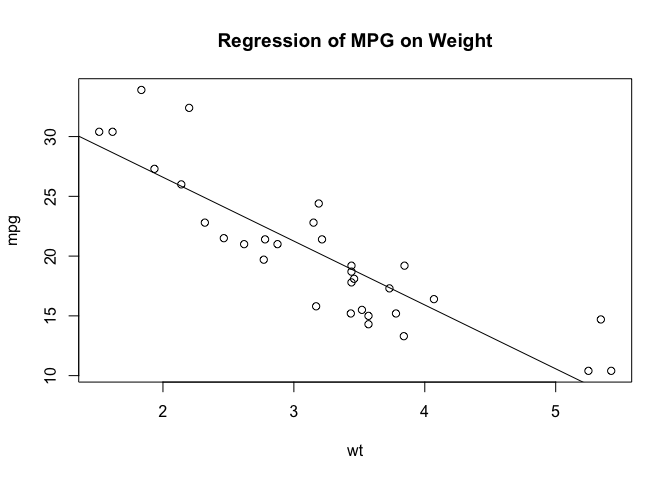<!-- -->

``` r
> detach(mtcars)  # 最后一句为数据框解除了绑定
```

- 可以通过代码或图形用户界面来保存图形。要通过代码保存图形，将绘图语句夹在开启目标图形设备的语句和关闭目标图形设备的语句之间即可。例如,
  以下代码会将图形保存到当前工作目录中名为mygraph.pdf的PDF文件中:

<!-- -->

    pdf("mygraph.pdf")  
    attach(mtcars)   
    plot(wt, mpg)  
    abline(lm(mpg~wt))  
    title("Regression of MPG on Weight")  
    detach(mtcars) 
    dev.off()

- 除了`pdf()`，还可以使用函数`win.metafile()`、`png()`、`jpeg()`、`bmp()`、`tiff()`、`xfig()`和`postscript()`将图形保存为其他格式。
  (注意，Windows图元文件格式仅在Windows系统中可用。)

## 5.2 一个简单的例子

| 剂量 | 对药物A的响应 | 对药物B的响应 |
|:----:|:-------------:|:-------------:|
|  20  |      16       |      15       |
|  30  |      20       |      18       |
|  40  |      27       |      25       |
|  45  |      40       |      31       |
|  60  |      60       |      40       |

- 根据表格信息，给以下变量赋值：

``` r
> dose <- c(20, 30, 40, 45, 60) 
> drugA <- c(16, 20, 27, 40, 60) 
> drugB <- c(15, 18, 25, 31, 40)
> # 创建一幅描述药物A的剂量和响应关系的图形
> plot(dose, drugA, type="b")
```

<!-- -->

- `plot()`是R中为对象作图的一个泛型函数
  (它的输出将根据所绘制对象类型的不同而变化)
  。本例中，`plot(x, y, type="b")`将x置于横轴，将y置于纵轴，绘制点集(x,y)，然后使用线段将其连接。选项type=“b”表示同时绘制点和线。使用`help(plot)`可以查看其他选项。

## 5.3 图形参数

- 可以通过修改称为图形参数的选项来自定义一幅图形的多个特征(字体、颜色、坐标轴、标签)。一种方法是通过函数`par()`来指定这些选项。以这种方式设定的参数值除非被再次修改，否则将在会话结束前一直有效。其调用格式为：

<!-- -->

    par(optionname=value, optionname=name,...)

- 不加参数地执行`par()`将生成一个含有当前图形参数设置的列表。添加参数`no.readonly=TRUE`可以生成一个可以修改的当前图形参数列表。

- 继续4.2的例子，假设使用实心三角而不是空心圆圈作为点的符号，并且想用虚线代替实线连接这些点。可以使用以下代码完成修改:

``` r
> opar <- par(no.readonly=TRUE)  # 首个语句复制了一份当前的图形参数设置
> par(lty=2, pch=17) # 第二句将默认的线条类型修改为虚线(lty=2) 并将默认的点符号改为了实心三角(pch=17) 。
> plot(dose, drugA, type="b")  
```

<!-- -->

``` r
> par(opar)
```

- 如仅需要对这一幅图本身生效，则可以使用以下代码来生成与上图相同的图形：

``` r
> plot(dose, drugA, type="b", lty=2, pch=17)
```

<!-- -->

### 5.3.1 符号与线条

| 参数 |                                 描述                                  |
|:----:|:---------------------------------------------------------------------:|
| pch  |                指定绘制点时使用的符号(见书P48图3-4)。                 |
| cex  | 指定符号的大小。cex是一个数值，表示绘图符号相对于默认大小的缩放倍数。 |
| lty  |                     指定线条类型(见书P48图3-5)。                      |
| lwd  |      指定线条宽度。lwd是以默认值的相对大小来表示的(默认值为1) 。      |

- 对于符号21\~25（空心圆形、三角、正方形等,你还可以指定边界颜色(col=)和填充色(bg=)。


- 综合以上选项，以下代码将绘制一幅图形：其线条类型为点线，宽度为默认宽度的3倍，点的符号为实心正方形，大小为默认符号大小的2倍。

``` r
> plot(dose, drugA, type="b", lty=3, lwd=3, pch=15, cex=2)
```

<!-- -->

### 5.3.2 颜色

| 参数     | 描述                                                                                                                                                                                               |
|:---------|:---------------------------------------------------------------------------------------------------------------------------------------------------------------------------------------------------|
| col      | 默认的绘图颜色。某些函数(如 lines 和 pie)可以接受一个含有颜色值的向量并自动循环使用。例如，如果设定 col=c(“red”, “blue”)并需要绘制三条线，则第一条线将为红色，第二条线为蓝色，第三条线又将为红色。 |
| col.axis | 坐标轴刻度文字的颜色。                                                                                                                                                                             |
| col.lab  | 坐标轴标签(名称)的颜色。                                                                                                                                                                           |
| col.main | 标题颜色。                                                                                                                                                                                         |
| col.sub  | 副标题颜色。                                                                                                                                                                                       |
| fg       | 图形的前景色。                                                                                                                                                                                     |
| bg       | 图形的背景色。                                                                                                                                                                                     |

- 对于创建吸引人的颜色配对，RColorBrewer特别受到欢迎。注意在第一次使用它之前先进行下载`(install.packages("RColorBrewer"))`。
  安装之后，使用函数`brewer.pal(n, name)`来创建一个颜色值的向量。比如说，以下代码：

``` r
> library(RColorBrewer) 
> n <- 7 
> mycolors <- brewer.pal(n, "Set1") 
> barplot(rep(1,n), col=mycolors)
```

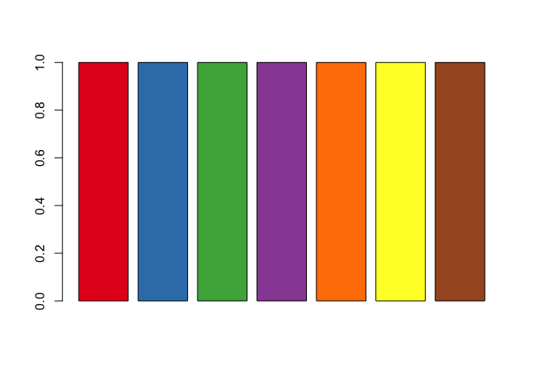<!-- -->

- R中也有多种用于创建连续型颜色向量的函数，包括`rainbow()`、`heat.colors()`、`terrain.colors()`、`topo.colors()`以及`cm.colors()`。举例来说，`rainbow(10)`可以生成10种连续的”彩虹型”颜色。

``` r
> n <- 10
> mycolors <- rainbow(n)
> pie(rep(1,n),labels = mycolors,col=rainbow(n))
```

<!-- -->

``` r
> mygrays <- gray(0:n/n)
> pie(rep(1,n),labels = mygrays,col=gray(0:n/n))
```

<!-- -->

### 5.3.3 文本属性

| 参数      | 描述                                                                                                         |
|:----------|--------------------------------------------------------------------------------------------------------------|
| cex       | 表示相对于默认大小缩放倍数的数值。 默认大小为 1，1.5 表示放大为默认值的 1.5 倍，0.5 表示缩小为默认值的 50%。 |
| cex.axis  | 坐标轴刻度文字的缩放倍数。                                                                                   |
| cex.lab   | 坐标轴标签(名称)的缩放倍数。                                                                                 |
| cex.main  | 标题的缩放倍数。                                                                                             |
| cex.sub   | 副标题的缩放倍数。                                                                                           |
| font      | 整数。用于指定绘图使用的字体样式。1=常规，2=粗体，3=斜体，4=粗斜体，5=符号字体(以 Adobe 符号编码表示)。      |
| font.axis | 坐标轴刻度文字的字体样。                                                                                     |
| font.lab  | 坐标轴标签(名称)的字体样式。                                                                                 |
| font.main | 标题的字体样式。                                                                                             |
| font.sub  | 副标题的字体样式。                                                                                           |
| ps        | 字体磅值(1 磅约为 1/72 英寸) 。文本的最终大小为 ps\*cex。                                                    |
| family    | 绘制文本时使用的字体族。标准的取值为 serif(衬线) 、sans(无衬线)和 mono(等宽)。                               |

- 创建的所有图形都将拥有斜体、1.5倍于默认文本大小的坐标轴标签(名称)，以及粗斜体、2倍于默认文本大小的标题：

<!-- -->

    par(font.lab=3, cex.lab=1.5, font.main=4, cex.main=2)

- 如果以PDF格式输出图形，则修改字体族会相对简单一些，可以使用`names(pdfFonts())`找出系统中有哪些字体是可用的，然后使用`pdf(file= "myplot.pdf", family="fontname")`来生成图形。

### 5.3.4 图形尺寸与边界尺寸

| 参数 | 描述                                                                                        |
|------|---------------------------------------------------------------------------------------------|
| pin  | 以英寸表示的图形尺寸(宽和高)。                                                              |
| mai  | 以数值向量表示的边界大小，顺序为”下、左、上、右”，单位为英寸。                              |
| mar  | 以数值向量表示的边界大小,顺序为”下、左、上、右” ,单位为英分。默认值为 c(5, 4, 4, 2) + 0.1。 |

- 以下代码可生成一幅4英寸宽、3英寸高、上下边界为1英寸、左边界为0.5英寸、右边界为0.2英寸的图形：

  par(pin=c(4,3), mai=c(1,.5, 1, .2))

- 代码清单3-1 使用图形参数控制图形外观

``` r
> dose  <- c(20, 30, 40, 45, 60) 
> drugA <- c(16, 20, 27, 40, 60) 
> drugB <- c(15, 18, 25, 31, 40)  
> opar <- par(no.readonly=TRUE) 
> par(pin=c(2, 3))   # 为2英寸宽、3英寸高
> par(lwd=2, cex=1.5)  # 线条的宽度将为默认宽度的两倍,符号将为默认大小的1.5倍
> par(cex.axis=.75, font.axis=3)  # 坐标轴刻度文本被设置为斜体、缩小为默认大小的75%
> plot(dose, drugA, type="b", pch=19, lty=2, col="red")  #使用红色实心圆圈和虚线创建了第一幅图
```

<!-- -->

``` r
> plot(dose, drugB, type="b", pch=23, lty=6, col="blue", bg="green")  # 使用绿色填充的绿色菱形加蓝色边框和蓝色虚线创建了第二幅图形
```

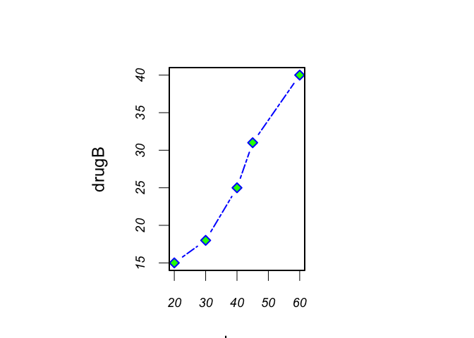<!-- -->

``` r
> par(opar)  # 还原了初始的图形参数设置
```

## 5.4 添加文本、自定义坐标轴的图例

- 通过以下代码在图形上添加了标题(main)、副标题(sub)、坐标轴标签(xlab、ylab)并指定了坐标轴范围(xlim、ylim)：

``` r
> plot(dose, drugA, type="b",       
+      col="red", lty=2, pch=2, lwd=2,      
+      main="Clinical Trials for Drug A",      
+      sub="This is hypothetical data",      
+      xlab="Dosage", ylab="Drug Response",      
+      xlim=c(0, 60), ylim=c(0, 70))
```

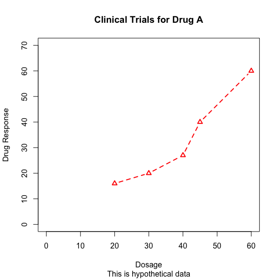<!-- -->

- **注意：并非所有函数都支持这些选项。请参考相应函数的帮助以了解其可以接受哪些选项。某些高级绘图函数已经包含了默认的标题和标签。可以通过在`plot()`语句或单独的`par()`语句中添加`ann=FALSE`来移除它们。**

### 5.4.1 标题

- 使用`title()`函数为图形添加标题和坐标轴标签。调用格式为:

<!-- -->

    title(main="main title", sub="subtitle",       
          xlab="x-axis label", ylab="y-axis label")

- 以下代码将生成红色的标题和蓝色的副标题，以及比默认大小小25%的绿色x轴、y轴标签：

<!-- -->

    title(main="My Title", col.main="red",        
          sub="My Subtitle", col.sub="blue",       
          xlab="My X label", ylab="My Y label",       
          col.lab="green", cex.lab=0.75)

- **注意：函数`title()`一般来说被用于添加信息到一个默认标题和坐标轴标签被`ann=FALSE`选项移除的图形中。**

### 5.4.2 坐标轴

- 可以使用函数`axis()`来创建自定义的坐标轴，而非使用R中的默认坐标轴。其格式为：

<!-- -->

    axis(side, at=, labels=, pos=, lty=, col=, las=, tck=, ...)

| 选项   | 描述                                                                                                                                     |
|--------|------------------------------------------------------------------------------------------------------------------------------------------|
| side   | 一个整数,表示在图形的哪边绘制坐标轴(1=下，2=左，3=上，4=右)。                                                                            |
| at     | 一个数值型向量，表示需要绘制刻度线的位置。                                                                                               |
| labels | 一个字符型向量，表示置于刻度线旁边的文字标签(如果为 NULL，则将直接使用 at 中的值)。                                                      |
| pos    | 坐标轴线绘制位置的坐标(即与另一条坐标轴相交位置的值)。                                                                                   |
| lty    | 线条类型。                                                                                                                               |
| col    | 线条和刻度线颜色。                                                                                                                       |
| las    | 标签是否平行于(=0)或垂直于(=2)坐标轴。                                                                                                   |
| tck    | 刻度线的长度，以相对于绘图区域大小的分数表示(负值表示在图形外侧，正值表示在图形内侧，0 表示禁用刻度，1 表示绘制网格线) ；默认值为–0.01。 |

- **注意：创建自定义坐标轴时，应当禁用高级绘图函数自动生成的坐标轴。参数`axes=FALSE`将禁用全部坐标轴(包括坐标轴框架线，除非你添加了参数`frame.plot=TRUE`)
  。参数xaxt=“n”和yaxt=“n”将分别禁用X轴或Y轴(会留下框架线，只是去除了刻度)
  。**

- 要创建次要刻度线,
  你需要使用Hmisc包中`的minor.tick()`函数。如果你尚未安装Hmisc包，请先安装它。使用以下代码来添加次要刻度线。其中nx和ny分别指定了X轴和Y轴**每两条**主刻度线之间(**即连续3条主刻度线之间**）通过次要刻度线划分得到的**区间个数**。`tick.ratio`表示次要刻度线相对于主刻度线的大小比例。当前的主刻度线长度可以使用`par("tck")`获取。

<!-- -->

    library(Hmisc) 
    minor.tick(nx=n, ny=n, tick.ratio=n)

- 举例来说，下列语句将在X轴的**每两条主刻度线**之间添加1条次要刻度线（分割得到2个区间），并在Y轴的**每两条主刻度线**之间添加2条次要刻度线（分割得到3个区间，次要刻度线的长度将是主刻度线的一半：

<!-- -->

    minor.tick(nx=2, ny=3, tick.ratio=0.5)

- 代码清单3-2 自定义坐标轴的示例

``` r
> # 生成数据
> x <- c(1:10) 
> y <- x  
> z <- 10/x 
> opar <- par(no.readonly=TRUE)  # 添加参数no.readonly=TRUE可以生成一个可以修改的当前图形参数列表
> 
> par(mar=c(5, 4, 4, 8) + 0.1)   # 增加边界大小，mar单位为英分，默认值为 c(5, 4, 4, 2) + 0.1
> # 绘制x对y的图形
> plot(x, y, type="b",   # 将x置于横轴，将y置于纵轴，绘制点集(x, y)，然后使用线段将其连接。选项type="b"表示同时绘制点和线     
+      pch=21, col="red",   # pch指定绘制点时使用的符号为21（空心圆），红色   
+      xaxt="n",yaxt="n", lty=3, ann=FALSE) # xaxt="n"和yaxt="n"将分别禁用X轴或Y轴(会留下框架线,只是去除了刻度) ，指定线条类型为3（点线），ann=FALSE移除默认标题和坐标轴标签
> # 添加x对1/x的直线
> lines(x, z, type="b", pch=22, col="blue", lty=2)  # pch指定绘制点时使用的符号为22（空心正方形），蓝色，指定线条类型为2（虚线）   
> # 绘制自定义的坐标轴
> axis(1, at=x, labels=x, col.axis="black", las=0)  # 底部坐标轴的设置
> axis(2, at=x, labels=x, col.axis="red", las=2)  # 2=在左边绘制坐标轴，刻度线在左轴上，左轴刻度上的文字（数字），线和刻度上数字为红色，刻度上的标签（这里是数字）垂直于坐标轴  
> axis(4, at=z, labels=round(z, digits=2),      
+      col.axis="blue", las=2, cex.axis=0.7, tck=-.01)   # 4=在右边绘制坐标轴，刻度线在右轴上，右轴刻度上的数字为10分别除以1-10内的整数，除不尽的结果取2位有效小数，线和刻度上数字为蓝色，刻度上的标签（这里是数字）垂直于坐标轴 
> # 添加标题和文本
> mtext("y=1/x", side=4, line=3, cex.lab=1, las=2, col="blue")  # mtext()将文本添加到图形上，cex.lab=1坐标轴标签(数字)的缩放1倍，且为蓝色
> title("An Example of Creative Axes",         
+       xlab="X values",       
+       ylab="Y=X")  # title()函数为图形添加标题和坐标轴标签
> library(Hmisc) 
> minor.tick(nx=4, ny=4, tick.ratio=0.5) # 在X轴和Y轴的每两条主刻度线之间(即1-3主刻度线之间）添加3条次要刻度线（分割得到4个区间），次要刻度线的长度将是主刻度线的一半
```

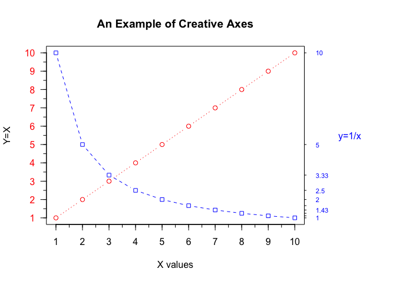<!-- -->

``` r
> par(opar)
```

### 5.4.3 参考线

- 函数`abline()`可以用来为图形添加参考线。其使用格式为：

<!-- -->

    abline(h=yvalues, v=xvalues)

- 函数`abline()`中也可以指定其他图形参数(如线条类型、颜色和宽度)
  。举例来说：

<!-- -->

    # 在y为1、5、7的位置添加了水平实线
    abline(h=c(1,5,7))
    # 在x为1、3、5、7、9的位置添加了垂直的蓝色虚线
    abline(v=seq(1, 10, 2), lty=2, col="blue")

### 5.4.4 图例

- 使用函数`legend()`来添加图例：

<!-- -->

    legend(location, title, legend, ...)

| 选项     | 描述                                                                                                                                                                                                                                                                                                                                           |
|----------|------------------------------------------------------------------------------------------------------------------------------------------------------------------------------------------------------------------------------------------------------------------------------------------------------------------------------------------------|
| location | 使用关键字 bottom、 bottomleft、 left、 topleft、 top、topright、right、bottomright 或 center 放置图例。                                                                                                                                                                                                                                       |
| title    | 图例标题的字符串(可选)。                                                                                                                                                                                                                                                                                                                       |
| legend   | 图例标签组成的字符型向量。                                                                                                                                                                                                                                                                                                                     |
| …        | 1、如果图例标示的是颜色不同的线条，需要指定 col=加上颜色值组成的向量。2、如果图例标示的是符号不同的点，则需指定 pch=加上符号的代码组成的向量。3、如果图例标示的是不同的线条宽度或线条类型，请使用 lwd=或 lty=加上宽度值或类型值组成的向量。4、要为图例创建颜色填充的盒形(常见于条形图、箱线图或饼图)，需要使用参数 fill=加上颜色值组成的向量。 |

- 其他常用的图例选项包括用于指定盒子样式的`bty`、指定背景色的`bg`、指定大小的`cex`，以及指定文本颜色的`text.col`。指定`horiz=TRUE`将会水平放置图例，而不是垂直放置。

- 代码清单3-3 依剂量对比药物A和药物B的响应情况

``` r
> dose  <- c(20, 30, 40, 45, 60)  
> drugA <- c(16, 20, 27, 40, 60) 
> drugB <- c(15, 18, 25, 31, 40)  
> opar <- par(no.readonly=TRUE)  
> # 增加线条、文本、符号、标签的宽度或大小
> par(lwd=2, cex=1.5, font.lab=2)
> # 绘制图形
> plot(dose, drugA, type="b",      
+      pch=15, lty=1, col="red", ylim=c(0, 60),       
+      main="Drug A vs. Drug B",      
+      xlab="Drug Dosage", ylab="Drug Response")   
> lines(dose, drugB, type="b",       
+       pch=17, lty=2, col="blue")  
> # 添加参考线
> abline(h=c(30), lwd=1.5, lty=2, col="gray")  
> # 添加次要刻度线
> library(Hmisc) 
> minor.tick(nx=3, ny=3, tick.ratio=0.5)   
> # 添加图例
> legend("topleft",inset=.05,title="Drug Type",c("A","B"),        
+        lty=c(1,2),pch=c(15, 17),col=c("red","blue"))   
```

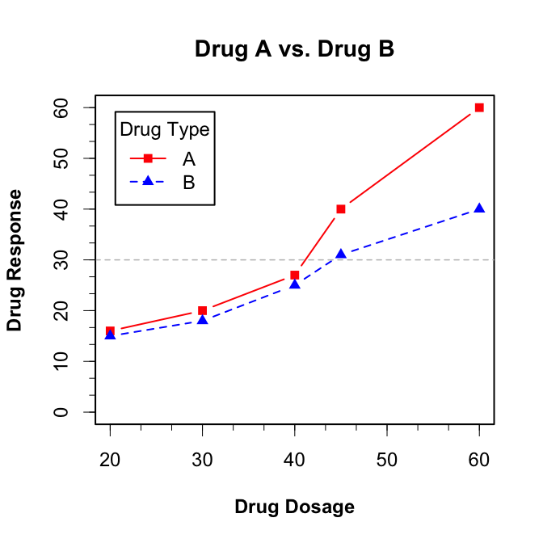<!-- -->

``` r
> par(opar)
```

### 5.4.5 文本标注

- 通过函数`text()`和`mtext()`将文本添加到图形上。`text()`可向绘图区域内部添加文本，而`mtext()`则向图形的四个边界之一添加文本。使用格式分别为:

<!-- -->

    text(location, "text to place", pos, ...) 
    mtext("text to place", side, line=n, ...)

| 选项     | 描述                                                                                                                                                                   |
|----------|------------------------------------------------------------------------------------------------------------------------------------------------------------------------|
| location | 文本的位置参数。可为一对 x、y 坐标，也可通过指定 location 为 locator(1)使用鼠标交互式地确定摆放位置。                                                                  |
| pos      | 文本相对于位置参数的方位。 1=下，2=左，3=上，4=右。 如果指定了 pos，就可以同时指定参数 offset= 作为偏移量，以相对于单个字符宽度的比例表示。                            |
| side     | 指定用来放置文本的边。1=下，2=左，3=上，4=右。你可以指定参数 line=来内移或外移文本，随着值的增加，文本将外移。也可使用 adj=0 将文本向左下对齐，或使用 adj=1 右上对齐。 |

- 其他常用的选项有`cex`、`col`和`font`(分别用来调整字号、颜色和字体样式)
  。

- 除了用来添加文本标注以外，**`text()`函数也通常用来标示图形中的点**。我们只需指定一系列的x、y坐标作为位置参数，同时以向量的形式指定要放置的文本。x、y和文本标签向量的长度应当相同。

``` r
> # 针对数据框mtcars提供的32种车型的车重和每加仑汽油行驶英里数绘制了散点图。
> attach(mtcars) 
> plot(wt, mpg,      
+      main="Mileage vs. Car Weight",      
+      xlab="Weight", ylab="Mileage",      
+      pch=18, col="blue") 
> # 函数text()被用来在各个数据点右侧添加车辆型号
> text(wt, mpg,      
+      row.names(mtcars),      
+      cex=0.6, pos=4, col="red")  # 各点的标签大小被缩小了40%, 颜色为红色
```

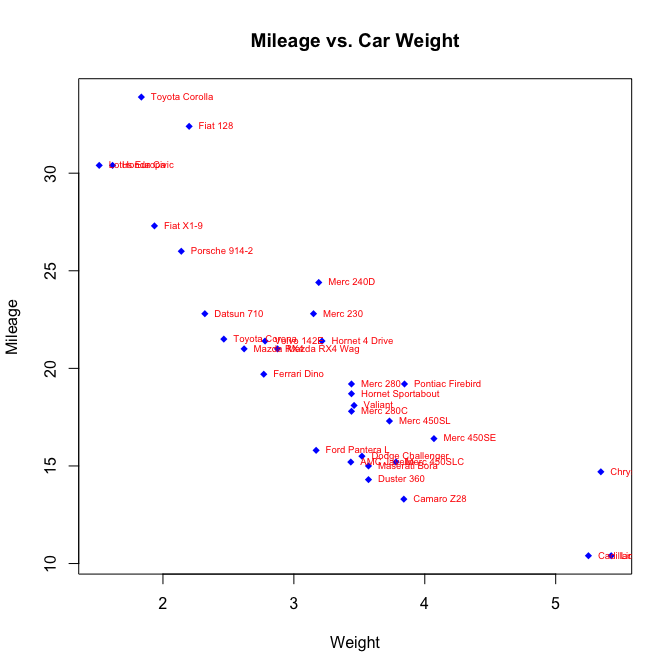<!-- -->

``` r
> detach(mtcars)
```

## 5.5 图形的组合

- 在R中使用函数`par()`或`layout()`可以容易地组合多幅图形为一幅总括图形。

- 可以在`par()`函数中使用图形参数`mfrow=c(nrows, ncols)`来创建按行填充的、行数为nrows、列数为ncols的图形矩阵。另外，可以使用`mfcol=c(nrows, ncols)`按列填充矩阵。

- 以下代码创建了四幅图形并将其排布在两行两列中：

``` r
> attach(mtcars) 
> opar <- par(no.readonly=TRUE) 
> par(mfrow=c(2,2))  # 两行两列
> plot(wt,mpg, main="Scatterplot of wt vs. mpg") 
> plot(wt,disp, main="Scatterplot of wt vs. disp") 
> hist(wt, main="Histogram of wt") 
> boxplot(wt, main="Boxplot of wt") 
```

<!-- -->

``` r
> par(opar) 
> detach(mtcars)
```

- 第二个示例，依三行一列排布三幅图形，代码如下:

``` r
> attach(mtcars) 
> opar <- par(no.readonly=TRUE) 
> par(mfrow=c(3,1)) #三行一列
> hist(wt)  # 请注意,高级绘图函数hist()包含了一个默认的标题(使用main=""可以禁用它,抑或使用ann=FALSE来禁用所有标题和标签)
> hist(mpg) 
> hist(disp) 
```

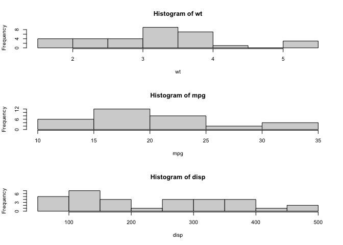<!-- -->

``` r
> par(opar) 
> detach(mtcars)
```

- 函数`layout()`的调用形式为`layout(mat)`，其中的mat是一个矩阵，它指定了所要组合的多个图形的所在位置。在以下代码中，一幅图被置于第1行，另两幅图则被置于第2行：

``` r
> attach(mtcars) 
> layout(matrix(c(1,1,2,3), 2, 2, byrow = TRUE)) 
> hist(wt) 
> hist(mpg) 
> hist(disp) 
```

<!-- -->

``` r
> detach(mtcars)
```

- 为了更精确地控制每幅图形的大小，可以有选择地在`layout()`函数中使用widths=和heights=两个参数。其形式为：widths
  = 各列宽度值组成的一个向量，heights = 各行高度值组成的一个向量。

- 相对宽度可以直接通过数值指定，绝对宽度(以厘米为单位)可以通过函数`lcm()`来指定。

- 对上图通过以下代码进行修改，第1行中图形的高度是第2行中图形高度的二分之一。除此之外，右下角图形的宽度是左下角图形宽度的三分之一：

``` r
> attach(mtcars) 
> layout(matrix(c(1, 1, 2, 3), 2, 2, byrow = TRUE),        
+        widths=c(3, 1), heights=c(1, 2)) 
> hist(wt) 
> hist(mpg) 
> hist(disp) 
```

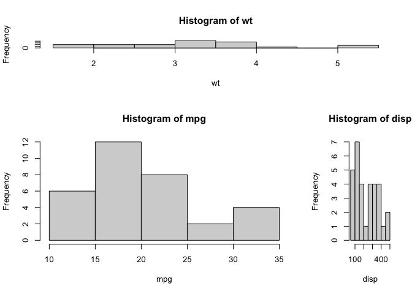<!-- -->

``` r
> detach(mtcars)
```

- 案例：图形布局的精细控制

- 通过排布或叠加若干图形来创建单幅的、有意义的图形，可以使用图形参数fig=完成这个任务。

``` r
> opar <- par(no.readonly=TRUE) 
> par(fig=c(0, 0.8, 0, 0.8))  # 第一个fig=将散点图设定为占据横向范围0~0.8,纵向范围0~0.8
> # 设置散点图
> plot(mtcars$wt, mtcars$mpg,      
+      xlab="Miles Per Gallon",      
+      ylab="Car Weight") 
> # 在上方添加箱线图
> par(fig=c(0, 0.8, 0.55, 1), new=TRUE)  # 上方的箱线图横向占据0~0.8,纵向0.55~1。右侧的箱线图横向占据0.65~1,纵向0~0.8
> boxplot(mtcars$wt, horizontal=TRUE, axes=FALSE)  
> # 在右侧添加箱线图
> par(fig=c(0.65, 1, 0, 0.8), new=TRUE) 
> boxplot(mtcars$mpg, axes=FALSE)
> mtext("Enhanced Scatterplot", side=3, outer=TRUE, line=-3)  
```

<!-- -->

``` r
> par(opar)
```

# 6 基本图形

## 6.1 条形图

### 6.1.1 简单的条形图

- 条形图通过垂直的或水平的条形展示了类别型变量的分布(频数)。函数`barplot()`的最简单用法是：`barplot(height)`，其中的height是一个向量或一个矩阵。若height是一个向量，则它的值就确定了各条形的高度，并将绘制一幅垂直的条形图。使用选项`horiz=TRUE`则会生成一幅水平条形图。选项main可添加一个图形标题，而选项xlab和ylab则会分别添加x轴和y轴标签。

- 在关节炎研究中，变量Improved记录了对每位接受了安慰剂或药物治疗的病人的治疗结果：

``` r
> library(vcd)
> counts <- table(Arthritis$Improved) 
> counts

  None   Some Marked 
    42     14     28 
> # 简单条形图
> barplot(counts,         
+         main="Simple Bar Plot",        
+         xlab="Improvement", ylab="Frequency") 
```

<!-- -->

``` r
> # 水平条形图
> barplot(counts,        
+         main="Horizontal Bar Plot",        
+         xlab="Frequency", ylab="Improvement",         
+         horiz=TRUE)
```

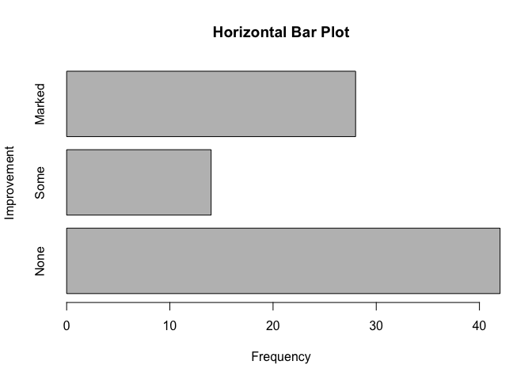<!-- -->

### 6.1.2 堆砌条形图和分组条形图

- 如果height是一个矩阵而不是一个向量，则绘图结果将是一幅堆砌条形图或分组条形图。若beside=FALSE(默认值)，则矩阵中的每一列都将生成图中的一个条形，各列中的值将给出堆砌的”子条”的高度。若beside=TRUE，则矩阵中的每一列都表示一个分组，各列中的值将并列而不是堆砌。考虑治疗类型和改善情况的列联表：

``` r
> library(vcd) 
> counts <- table(Arthritis$Improved, Arthritis$Treatment) 
> counts
        
         Placebo Treated
  None        29      13
  Some         7       7
  Marked       7      21
> # 堆砌条形图
> barplot(counts,      
+         main="Stacked Bar Plot",       
+         xlab="Treatment", ylab="Frequency",      
+         col=c("red", "yellow","green"),      
+         legend=rownames(counts)) 
```

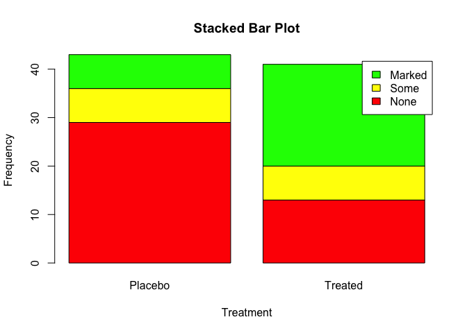<!-- -->

``` r
> # 分组条形图
> barplot(counts,      
+         main="Grouped Bar Plot",      
+         xlab="Treatment", ylab="Frequency",      
+         col=c("red", "yellow", "green"),      
+         legend=rownames(counts), beside=TRUE)
```

<!-- -->

### 6.1.3 均值条形图

- 条形图可以使用数据整合函数并将结果传递给`barplot()`函数，来创建表示均值、中位数、标准差等的条形图。

``` r
> states <- data.frame(state.region, state.x77) 
> means <- aggregate(states$Illiteracy, by=list(state.region), FUN=mean) 
> means
        Group.1   x
1     Northeast 1.0
2         South 1.7
3 North Central 0.7
4          West 1.0
> means <- means[order(means$x),]   # 将均值从小到大排序
> means
        Group.1   x
3 North Central 0.7
1     Northeast 1.0
4          West 1.0
2         South 1.7
> barplot(means$x, names.arg=means$Group.1)  
> title("Mean Illiteracy Rate")    # 添加标题
```

<!-- -->

### 6.1.4 条形图的微调

- 代码清单6-4 为条形图搭配标签

- `par()`函数能够让你对R的默认图形做出大量修改。

``` r
> par(mar=c(5,8,4,2))       # 增加y边界的大小
> par(las=2)     # 旋转条形的标签
> counts <- table(Arthritis$Improved) 
> barplot(counts,            
+         main="Treatment Outcome",            
+         horiz=TRUE,            
+         cex.names=0.8,    # 缩小字体大小,让标签更合适      
+         names.arg=c("No Improvement", "Some Improvement",                     
+                     "Marked Improvement"))   # 修改标签文本
```

<!-- -->

### 6.1.5 棘状图

- 棘状图对堆砌条形图进行了重缩放，这样每个条形的高度均为1，**每一段的高度即表示比例**。棘状图可由vcd包中的函数`spine()`绘制。以下代码可以生成一幅简单的棘状图：

``` r
> library(vcd) 
> attach(Arthritis) 
> counts <- table(Treatment, Improved) 
> spine(counts, main="Spinogram Example") 
```

<!-- -->

``` r
> detach(Arthritis)
```

- 上图所示：治疗组同安慰剂组相比，获得显著改善的患者比例明显更高。

## 6.2 饼图

- 饼图可由以下函数创建：`pie(x,labels)`。其中x是一个非负数值向量，表示每个扇形的面积，而labels则是表示各扇形标签的字符型向量。

``` r
> par(mfrow=c(2, 2))  # 将四幅图形组合为一幅
> slices <- c(10, 12,4, 16, 8)  
> lbls <- c("US", "UK", "Australia", "Germany", "France") 
> pie(slices, labels = lbls,     
+     main="Simple Pie Chart")  
> # 为饼图添加比例数值
> pct <- round(slices/sum(slices)*100) 
> lbls2 <- paste(lbls, "", pct, "%", sep="") 
> pie(slices, labels=lbls2, col=rainbow(length(lbls2)),  # 这里的rainbow(length(lbls2))将被解析为rainbow(5),即为图形提供了五种颜色    
+     main="Pie Chart with Percentages") 
> library(plotrix) 
> pie3D(slices, labels=lbls,explode=0.1,       
+       main="3D Pie Chart")  
> # 从表格创建饼图
> mytable <- table(state.region)  
> lbls3 <- paste(names(mytable), "\n", mytable, sep="") 
> pie(mytable, labels = lbls3,     
+     main="Pie Chart from a Table\n (with sample sizes)")
```

<!-- -->

- 扇形图 (Lemon & Tyagi,
  2009)提供了一种同时展示相对数量和相互差异的方法。在R中，扇形图是通过plotrix包中的`fan.plot()`函数实现的。

``` r
> library(plotrix) 
> slices <- c(10, 12,4, 16, 8) 
> lbls <- c("US", "UK", "Australia", "Germany", "France") 
> fan.plot(slices, labels = lbls, main="Fan Plot")
```

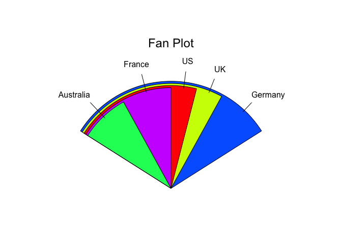<!-- -->

## 6.3 直方图

- 直方图通过在x轴上将值域分割为一定数量的组，在y轴上显示相应值的频数，展示了连续型变量的分布。可以使用如下函数创建直方图：`hist(x)`，其中的x是一个由数据值组成的数值向量。参数`freq=FALSE`表示根据概率密度而不是频数绘制图形。参数breaks用于控制组的数量。在定义直方图中的单元时，默认将生成等距切分。

``` r
> par(mfrow=c(2,2))   
> hist(mtcars$mpg)   # 简单直方图
> # 指定组数和颜色,将组数指定为12,使用红色填充条形
> hist(mtcars$mpg,      
+      breaks=12,      
+      col="red",      
+      xlab="Miles Per Gallon",      
+      main="Colored histogram with 12 bins")  
> # 添加轴须图：这条密度曲线是一个核密度估计,它为数据的分布提供了一种更加平滑的描述。使用lines()函数叠加了这条蓝色、双倍默认线条宽度的曲线。
> hist(mtcars$mpg,      
+      freq=FALSE,      
+      breaks=12,      
+      col="red",      
+      xlab="Miles Per Gallon",      
+      main="Histogram, rug plot, density curve")  
> rug(jitter(mtcars$mpg)) 
> lines(density(mtcars$mpg), col="blue", lwd=2)  
> # 添加正态密度曲线和外框
> x <- mtcars$mpg 
> h<-hist(x,         
+         breaks=12,         
+         col="red",         
+         xlab="Miles Per Gallon",         
+         main="Histogram with normal curve and box") 
> xfit<-seq(min(x), max(x), length=40) 
> yfit<-dnorm(xfit, mean=mean(x), sd=sd(x)) 
> yfit <- yfit*diff(h$mids[1:2])*length(x)  
> lines(xfit, yfit, col="blue", lwd=2) 
> box()
```

<!-- -->

## 6.4 核密度图

- 核密度估计是用于估计随机变量概率密度函数的一种非参数方法。从总体上讲，核密度图不失为一种用来观察**连续型变量分布**的有效方法。绘制密度图的方法(不叠加到另一幅图上方)为：`plot(density(x))`，其中的x是一个数值型向量。由于`plot()`函数会创建一幅新的图形，所以要向一幅已经存在的图形上叠加一条密度曲线，可以使用`lines()`函数(如代码清单6-6所示)。

``` r
> par(mfrow=c(2,1))       
> d <- density(mtcars$mpg)        
> plot(d)  # 完全使用默认设置创建最简图形       
> d <- density(mtcars$mpg)        
> plot(d, main="Kernel Density of Miles Per Gallon")   # 添加一个标题     
> polygon(d, col="red", border="blue")    # 将曲线修改为蓝色,并使用实心红色填充曲线下方的区域。polygon()函数根据顶点的x和y坐标(本例中由density()函数提供)绘制了多边形。    
> rug(mtcars$mpg, col="brown")  # 添加棕色的轴须图
```

<!-- -->

- 核密度图可用于比较组间差异。使用sm包中的`sm.density.compare()`函数可向图形叠加两组或更多的核密度图。使用格式为：`sm.density.compare(x,factor)`其中的x是一个数值型向量，factor是一个分组变量。请在第一次使用sm包之前安装它。

``` r
> library(sm)  
> attach(mtcars)  
> cyl.f <- factor(cyl, levels= c(4,6,8),               
+                 labels = c("4 cylinder", "6 cylinder",                           
+                            "8 cylinder"))  
> sm.density.compare(mpg, cyl, xlab="Miles Per Gallon") 
> title(main="MPG Distribution by Car Cylinders")  
> colfill<-c(2:(1+length(levels(cyl.f)))) 
> legend('topright', levels(cyl.f), fill=colfill)   
```

<!-- -->

``` r
> detach(mtcars)
```

## 6.5 箱线图

- 箱线图(又称盒须图)通过绘制连续型变量的五数总括，即最小值、下四分位数(第25百分位数)、中位数(第50百分位数)
  、上四分位数(第75百分位数)以及最大值，描述了连续型变量的分布。箱线图能够显示出可能为离群点(范围±1.5\*IQR以外的值，IQR表示四分位距，即上四分位数与下四分位数的差值)的观测。例如:

``` r
> boxplot(mtcars$mpg, main="Box plot", ylab="Miles per Gallon")
```

<!-- -->

``` r
> boxplot.stats(mtcars$mpg) # 输出用于构建图形的统计
$stats
[1] 10 15 19 23 34

$n
[1] 32

$conf
[1] 17 21

$out
numeric(0)
```

### 6.5.1 使用并列箱线图进行跨组比较

- 箱线图可以展示单个变量或分组变量。使用格式为：boxplot(formula,data=dataframe)，其中的formula是一个公式，dataframe代表提供数据的数据框(或列表)。

- 一个示例公式为y \~
  A，这将为类别型变量A的每个值并列地生成数值型变量y的箱线图。公式y\~A\*B则将为类别型变量A和B所有水平的两两组合生成数值型变量y的箱线图。

- 添加参数`varwidth=TRUE`将使箱线图的宽度与其样本大小的平方根成正比。参数`horizontal=TRUE`可以反转坐标轴的方向。

- 案例：研究四缸、六缸、八缸发动机对每加仑汽油行驶的英里数的影响

``` r
> boxplot(mpg ~ cyl, data=mtcars,         
+         main="Car Mileage Data",          
+         xlab="Number of Cylinders",         
+         ylab="Miles Per Gallon")
```

<!-- -->

- 箱线图灵活多变，通过添加`notch=TRUE`，可以得到含凹槽的箱线图。**若两个箱的凹槽互不重叠，则表明它们的中位数有显著差异**(Chambers
  et
  al.,1983,p. 62)。以下代码将为我们的车型油耗示例创建一幅含凹槽的箱线图：

``` r
> boxplot(mpg ~ cyl, data=mtcars,         
+         notch=TRUE,          
+         varwidth=TRUE,    # 使箱线图的宽度与它们各自的样本大小成正比     
+         col="red",         
+         main="Car Mileage Data",         
+         xlab="Number of Cylinders",         
+         ylab="Miles Per Gallon")
```

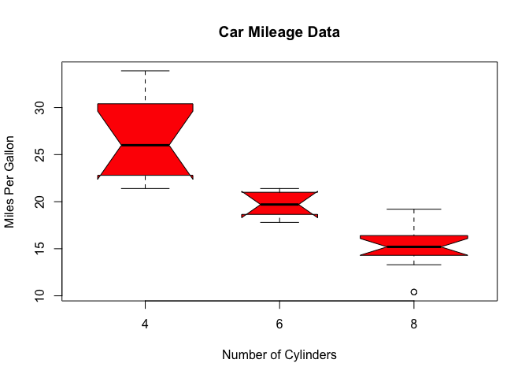<!-- -->

- 可以为多个分组因子绘制箱线图。代码清单6-9为不同缸数和不同变速箱类型的车型绘制了每加仑汽油行驶英里数的箱线图。同样地，这里使用参数col为箱线图进行了着色。请注意颜色的循环使用。在本例中，共有六幅箱线图和两种指定的颜色，所以颜色将重复使用三次。

- 代码清单6-9 两个交叉因子的箱线图

``` r
> # 创建汽缸数量的因子
> mtcars$cyl.f <- factor(mtcars$cyl,                       
+                        levels=c(4,6,8),                        
+                        labels=c("4","6","8"))  
> # 创建变速箱类型的因子
> mtcars$am.f <- factor(mtcars$am,                      
+                       levels=c(0,1),                      
+                       labels=c("auto", "standard"))   
> # 生成箱线图
> boxplot(mpg ~ am.f *cyl.f,        
+         data=mtcars,        
+         varwidth=TRUE,        
+         col=c("gold","darkgreen"),        
+         main="MPG Distribution by Auto Type",        
+         xlab="Auto Type", ylab="Miles Per Gallon")
```

<!-- -->

- 对于四缸和六缸车型，标准变速箱(standard)的油耗更高。但是对于八缸车型，油耗似乎没有差别。从箱线图的宽度看出,
  四缸标准变速箱的车型和八缸自动变速箱的车型在数据集中最常见。

### 6.5.2 小提琴图

- 小提琴图是箱线图与核密度图的结合。可以使用vioplot包中的`vioplot()`函数绘制它。请在第一次使用之前安装vioplot包。

- **注意，`vioplot()`函数要求你将要绘制的不同组分离到不同的变量中。**

- `vioplot()`函数的使用格式为：

<!-- -->

    vioplot(x1, x2, ... , names=, col=)

- 其中x1，x2，…表示要绘制的一个或多个数值向量(将为每个向量绘制一幅小提琴图)。参数names是小提琴图中标签的字符向量，而col是一个为每幅小提琴图指定颜色的向量：

``` r
> library(vioplot)  
> x1 <- mtcars$mpg[mtcars$cyl==4] 
> x2 <- mtcars$mpg[mtcars$cyl==6] 
> x3 <- mtcars$mpg[mtcars$cyl==8] 
> vioplot(x1, x2, x3,         
+         names=c("4 cyl", "6 cyl", "8 cyl"),         
+         col="gold")   
> title("Violin Plots of Miles Per Gallon", ylab="Miles Per Gallon",        
+       xlab="Number of Cylinders")
```

<!-- -->

- 小提琴图基本上是核密度图以镜像方式在箱线图上的叠加。在图中，白点是中位数，黑色盒型的范围是下四分位点到上四分位点，细黑线表示须。外部形状即为核密度估计。

## 6.6 点图

- 点图提供了一种在简单水平刻度上绘制大量有标签值的方法。可以使用`dotchart()`函数创建点图，格式为：

<!-- -->

    dotchart(x, labels=)

- 其中的x是一个数值向量，而labels则是由每个点的标签组成的向量。可以通过添加参数groups来选定一个因子，用以指定x中元素的分组方式。如果这样做，则参数gcolor可以控制不同组标签的颜色，cex可以控制标签的大小。

``` r
> dotchart(mtcars$mpg, labels=row.names(mtcars), cex=.7,          
+          main="Gas Mileage for Car Models",          
+          xlab="Miles Per Gallon")
```

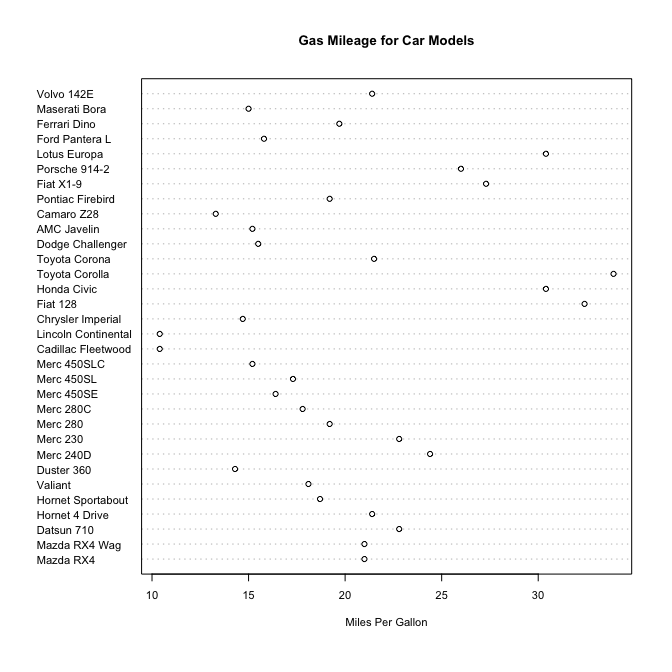<!-- -->

- 通常来说，点图在经过排序并且分组变量被不同的符号和颜色区分开的时候最有用。

``` r
> # 根据每加仑汽油行驶英里数(从最低到最高) 对数据框mtcars进行排序,结果保存为数据框x
> x <- mtcars[order(mtcars$mpg),]          
> x$cyl <- factor(x$cyl)   # 将数值向量 cyl 转换为一个因子        
> # 添加一个字符型向量(color)到数据框x中, 根据cyl的值, 它所含的值为"red"、"blue"或"darkgreen"
> x$color[x$cyl==4] <- "red"         
> x$color[x$cyl==6] <- "blue"         
> x$color[x$cyl==8] <- "darkgreen"         
> dotchart(x$mpg,                   
+          labels = row.names(x),  # 各数据点的标签取自数据框的行名(车辆型号)                 
+          cex=.7,                  
+          groups = x$cyl,       # 数据点根据汽缸数量分组           
+          gcolor = "black",    # 数字4、6和8以黑色显示              
+          color = x$color,      #  点和标签的颜色来自向量color            
+          pch=19,                 
+          main = "Gas Mileage for Car Models\ngrouped by cylinder",                  
+          xlab = "Miles Per Gallon")
```

<!-- -->

- 可以从点图中获得显著的洞察力，因为每个点都有标签，每个点的值都有其内在含义，并且这些点是以一种能够促进比较的方式排布的，但是随着数据点的增多，点图的实用性随之下降。

- 安装一些包：`install.packages(c("car", "scatterplot3d", "gclus", "hexbin", "IDPmisc", "Hmisc","corrgram", "vcd", "rld"))`。

``` r
> par(ask=TRUE)
> opar <- par(no.readonly=TRUE) # record current settings
> 
> # A scatter plot with best fit lines
> attach(mtcars)                                                     
> plot(wt, mpg, 
+      main="Basic Scatterplot of MPG vs. Weight",       
+      xlab="Car Weight (lbs/1000)", 
+      ylab="Miles Per Gallon ", pch=19)
> abline(lm(mpg ~ wt), col="red", lwd=2, lty=1)            
> lines(lowess(wt, mpg), col="blue", lwd=2, lty=2)
```

<!-- -->

``` r
> detach(mtcars)
```

``` r
> # Creating side by side scatter and line plots
> opar <- par(no.readonly=TRUE)
> par(mfrow=c(1,2))
> t1 <- subset(Orange, Tree==1)
> plot(t1$age, t1$circumference,
+      xlab="Age (days)",
+      ylab="Circumference (mm)",
+      main="Orange Tree 1 Growth")
> plot(t1$age, t1$circumference,
+      xlab="Age (days)",
+      ylab="Circumference (mm)",
+      main="Orange Tree 1 Growth",
+      type="b")
```

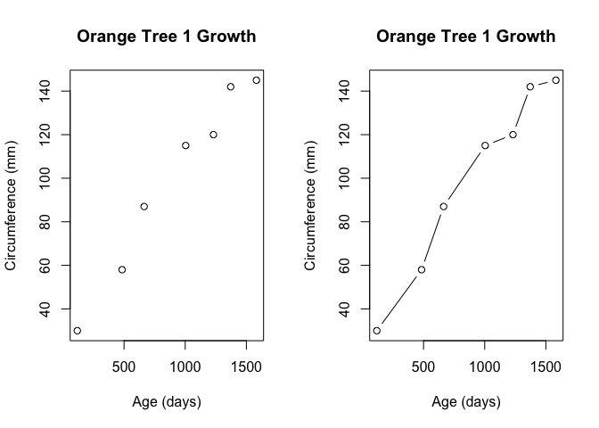<!-- -->

``` r
> par(opar)
```

## 6.7 生存曲线

- 先安装survival和survminer两个包。

``` r
> library(survival)
> library(survminer)
> fit <- survfit(Surv(time, status) ~ sex, data = lung)
> 
> ggsurvplot(fit,
+            pval = TRUE, #在图上添加log rank检验的p值
+            conf.int = TRUE,#添加置信区间
+            risk.table = TRUE, #在图下方添加风险表
+            risk.table.col = "strata", # 根据数据分组为风险表添加颜色
+            linetype = "strata", # 改变不同组别的生存曲线的线型
+            surv.median.line = "hv", # 标注出中位生存时间
+            ggtheme = theme_bw(), # 改变图形风格
+            palette = c("#E7B800", "#2E9FDF"))#图形颜色风格
```

<!-- -->

``` r
> ggsurvplot(
+   fit,                    
+   pval = TRUE,             
+   conf.int = TRUE,    
+   conf.int.style = "ribbon",  # 设置置信区间的风格
+   xlab = "Time in days",   # 设置x轴标签
+   break.time.by = 200,     # 将x轴按照200为间隔进行切分
+   ggtheme = theme_light(), # 设置图形风格
+   risk.table = "abs_pct",  # 在风险表中添加绝对数和相对数
+   risk.table.y.text.col = TRUE,# 设置风险表的文字颜色
+   risk.table.y.text = FALSE,# 以条柱展示风险表的标签，而非文字
+   ncensor.plot = TRUE,      # 展示随访过程中不同时间点死亡和删失的情况
+   surv.median.line = "hv",  # 添加中位生存时间
+   legend.labs = 
+     c("Male", "Female"),    # 改变图例标签
+   palette = 
+     c("#E7B800", "#2E9FDF") # 设置颜色
+ )
```

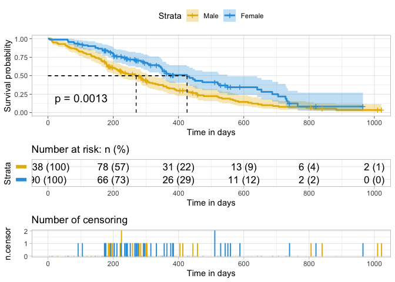<!-- -->
