R语言进阶学习（第二阶段）——基本统计分析
================

- <a href="#7-基本统计分析" id="toc-7-基本统计分析">7 基本统计分析</a>
  - <a href="#71-描述性统计分析" id="toc-71-描述性统计分析">7.1
    描述性统计分析</a>
    - <a href="#711-方法云集" id="toc-711-方法云集">7.1.1 方法云集</a>
    - <a href="#712-更多方法" id="toc-712-更多方法">7.1.2 更多方法</a>
    - <a href="#713-单组数据汇总统计量" id="toc-713-单组数据汇总统计量">7.1.3
      单组数据汇总统计量</a>
    - <a href="#714-单数据分布类型的图形描述"
      id="toc-714-单数据分布类型的图形描述">7.1.4 单数据分布类型的图形描述</a>
    - <a href="#715-分组计算描述性统计量"
      id="toc-715-分组计算描述性统计量">7.1.5 分组计算描述性统计量</a>
    - <a href="#716-分组计算的扩展" id="toc-716-分组计算的扩展">7.1.6
      分组计算的扩展</a>
    - <a href="#717-分组数据的图形描述" id="toc-717-分组数据的图形描述">7.1.7
      分组数据的图形描述</a>
  - <a href="#72-频数表和列联表" id="toc-72-频数表和列联表">7.2
    频数表和列联表</a>
    - <a href="#721-生成频数表" id="toc-721-生成频数表">7.2.1 生成频数表</a>
    - <a href="#722-独立性检验" id="toc-722-独立性检验">7.2.2 独立性检验</a>
    - <a href="#723-相关性的度量" id="toc-723-相关性的度量">7.2.3
      相关性的度量</a>
  - <a href="#73-相关" id="toc-73-相关">7.3 相关</a>
    - <a href="#731-相关的类型" id="toc-731-相关的类型">7.3.1 相关的类型</a>
    - <a href="#732-相关性的显著性检验" id="toc-732-相关性的显著性检验">7.3.2
      相关性的显著性检验</a>
  - <a href="#74-t-检验" id="toc-74-t-检验">7.4 t 检验</a>
    - <a href="#741-独立样本的-t-检验" id="toc-741-独立样本的-t-检验">7.4.1
      独立样本的 t 检验</a>
    - <a href="#742-非独立样本的-t-检验"
      id="toc-742-非独立样本的-t-检验">7.4.2 非独立样本的 t 检验</a>
  - <a href="#75-组间差异的非参数检验秩和检验"
    id="toc-75-组间差异的非参数检验秩和检验">7.5
    组间差异的非参数检验（秩和检验）</a>
    - <a href="#751-两组的比较" id="toc-751-两组的比较">7.5.1 两组的比较</a>
    - <a href="#752-多于两组的比较" id="toc-752-多于两组的比较">7.5.2
      多于两组的比较</a>

Source：

1.  《R语言实战（中文第二版）》

2.  [【B站】从零开始学 R
    语言，带你玩转医学统计学](https://www.bilibili.com/video/BV1JU4y1f7zg/?spm_id_from=333.1007.top_right_bar_window_custom_collection.content.click&vd_source=fa22bae99c47db3f7bc43573bd9b3ed3)

# 7 基本统计分析

## 7.1 描述性统计分析

- 本节中，关注分析连续型变量的中心趋势、变化性和分布形状的方法。使用(mtcars)数据集，关注焦点是每加仑汽油行驶英里数(mpg)、马力(hp)和车重(wt)。

``` r
> myvars <- c("mpg", "hp", "wt")  
> head(mtcars[myvars])  # head()函数查看前六种车
                   mpg  hp    wt
Mazda RX4         21.0 110 2.620
Mazda RX4 Wag     21.0 110 2.875
Datsun 710        22.8  93 2.320
Hornet 4 Drive    21.4 110 3.215
Hornet Sportabout 18.7 175 3.440
Valiant           18.1 105 3.460
```

### 7.1.1 方法云集

- 代码清单7-1 通过`summary()`计算描述性统计量

``` r
> myvars <- c("mpg", "hp", "wt") 
> summary(mtcars[myvars])
      mpg              hp              wt       
 Min.   :10.40   Min.   : 52.0   Min.   :1.513  
 1st Qu.:15.43   1st Qu.: 96.5   1st Qu.:2.581  
 Median :19.20   Median :123.0   Median :3.325  
 Mean   :20.09   Mean   :146.7   Mean   :3.217  
 3rd Qu.:22.80   3rd Qu.:180.0   3rd Qu.:3.610  
 Max.   :33.90   Max.   :335.0   Max.   :5.424  
```

- `summary()`函数提供了最小值、最大值、四分位数和数值型变量的均值，以及因子向量和逻辑型向量的频数统计。

- `apply()`函数或`sapply()`函数计算所选择的任意描述性统计量。对于`sapply()`函数，其使用格式为：

  `sapply(x, FUN, options)`

- 其中的x是数据框(或矩阵)，FUN为一个任意的函数。如果指定了options，它们将被传递给FUN。可以在这里插入的典型函数有`mean()`、`sd()`、`var()`、`min()`、`max()`、`median()`、`length()`、`range()`和`quantile()`。函数`fivenum()`可返回图基五数总括(Tukey’s
  five-number
  summary，即最小值、下四分位数、中位数、上四分位数和最大值)。

- 代码清单7-2 通过`sapply()`计算描述性统计量

``` r
> mystats <- function(x, na.omit=FALSE){         
+   if (na.omit)                     
+     x <- x[!is.na(x)]              
+   m <- mean(x)              
+   n <- length(x)            
+   s <- sd(x)               
+   skew <- sum((x-m)^3/s^3)/n       
+   kurt <- sum((x-m)^4/s^4)/n - 3          
+   return(c(n=n, mean=m, stdev=s, skew=skew, kurtosis=kurt))        
+   } 
> myvars <- c("mpg", "hp", "wt") 
> sapply(mtcars[myvars], mystats)
               mpg          hp          wt
n        32.000000  32.0000000 32.00000000
mean     20.090625 146.6875000  3.21725000
stdev     6.026948  68.5628685  0.97845744
skew      0.610655   0.7260237  0.42314646
kurtosis -0.372766  -0.1355511 -0.02271075
```

- 对于样本中的车型，每加仑汽油行驶英里数的平均值为20.1，标准差为6.0。分布呈现右偏(偏度+0.61)，并且较正态分布稍平(峰度–0.37)。

- **注意，如果你只希望单纯地忽略缺失值，那么应当使用`sapply(mtcars[myvars], mystats, na.omit=TRUE)`。**

### 7.1.2 更多方法

- Hmisc、pastecs和psych包提供了计算描述性统计量的函数，在首次使用之前先进行安装。

- Hmisc包中的`describe()`函数可返回变量和观测的数量、缺失值和唯一值的数目、平均值、分位，以及五个最大的值和五个最小的值。

- 代码清单7-3 通过Hmisc包中的`describe()`函数计算描述性统计量

``` r
> library(Hmisc) 
> myvars <- c("mpg", "hp", "wt") 
> describe(mtcars[myvars])
mtcars[myvars] 

 3  Variables      32  Observations
--------------------------------------------------------------------------------
mpg 
       n  missing distinct     Info     Mean      Gmd      .05      .10 
      32        0       25    0.999    20.09    6.796    12.00    14.34 
     .25      .50      .75      .90      .95 
   15.43    19.20    22.80    30.09    31.30 

lowest : 10.4 13.3 14.3 14.7 15.0, highest: 26.0 27.3 30.4 32.4 33.9
--------------------------------------------------------------------------------
hp 
       n  missing distinct     Info     Mean      Gmd      .05      .10 
      32        0       22    0.997    146.7    77.04    63.65    66.00 
     .25      .50      .75      .90      .95 
   96.50   123.00   180.00   243.50   253.55 

lowest :  52  62  65  66  91, highest: 215 230 245 264 335
--------------------------------------------------------------------------------
wt 
       n  missing distinct     Info     Mean      Gmd      .05      .10 
      32        0       29    0.999    3.217    1.089    1.736    1.956 
     .25      .50      .75      .90      .95 
   2.581    3.325    3.610    4.048    5.293 

lowest : 1.513 1.615 1.835 1.935 2.140, highest: 3.845 4.070 5.250 5.345 5.424
--------------------------------------------------------------------------------
```

- pastecs包中有一个名为`stat.desc()`的函数，它可以计算种类繁多的描述性统计量。使用格式为：

  `stat.desc(x, basic=TRUE, desc=TRUE, norm=FALSE, p=0.95)`

- 其中的x是一个数据框或时间序列。若`basic=TRUE`(默认值)，则计算其中所有值、空值、缺失值的数量，以及最小值、最大值、值域，还有总和。若`desc=TRUE`(同样也是默认值)，则计算中位数、平均数、平均数的标准误、平均数置信度为95%的置信区间、方差、标准差以及变异系数。最后，若`norm=TRUE`(不是默认的)，则返回正态分布统计量，包括偏度和峰度(以及它们的统计显著程度)和Shapiro-Wilk正态检验结果。这里使用了p值来计算平均数的置信区间(默认置信度为0.95)。

- 代码清单7-4 通过pastecs包中的`stat.desc()`函数计算描述性统计量

``` r
> library(pastecs)  
> myvars <- c("mpg", "hp", "wt") 
> stat.desc(mtcars[myvars])
                     mpg           hp          wt
nbr.val       32.0000000   32.0000000  32.0000000
nbr.null       0.0000000    0.0000000   0.0000000
nbr.na         0.0000000    0.0000000   0.0000000
min           10.4000000   52.0000000   1.5130000
max           33.9000000  335.0000000   5.4240000
range         23.5000000  283.0000000   3.9110000
sum          642.9000000 4694.0000000 102.9520000
median        19.2000000  123.0000000   3.3250000
mean          20.0906250  146.6875000   3.2172500
SE.mean        1.0654240   12.1203173   0.1729685
CI.mean.0.95   2.1729465   24.7195501   0.3527715
var           36.3241028 4700.8669355   0.9573790
std.dev        6.0269481   68.5628685   0.9784574
coef.var       0.2999881    0.4674077   0.3041285
```

- psych包（记得先安装）也拥有一个名为`describe()`的函数，它可以计算非缺失值的数量、平均数、标准差、中位数、截尾均值、绝对中位差、最小值、最大值、值域、偏度、峰度和平均值的标准误。

- 代码清单7-5 通过psych包中的`describe()`计算描述性统计量

``` r
> library(psych)  
> myvars <- c("mpg", "hp", "wt") 
> describe(mtcars[myvars])
    vars  n   mean    sd median trimmed   mad   min    max  range skew kurtosis
mpg    1 32  20.09  6.03  19.20   19.70  5.41 10.40  33.90  23.50 0.61    -0.37
hp     2 32 146.69 68.56 123.00  141.19 77.10 52.00 335.00 283.00 0.73    -0.14
wt     3 32   3.22  0.98   3.33    3.15  0.77  1.51   5.42   3.91 0.42    -0.02
       se
mpg  1.07
hp  12.12
wt   0.17
```

### 7.1.3 单组数据汇总统计量

- 均数、标准差、中位数、分位数计算。

- 统计描述过程中的缺失值处理。

- ISwR包中的juul数据集。

``` r
> library(ISwR) # 载入包
> attach(juul) #连接数据集
> mean(igf1,na.rm=TRUE) # 求均值，剔除缺失值
[1] 340.168
> sum(!is.na(igf1)) # 剔除缺失值后，求和
[1] 1018
> summary(igf1) 
   Min. 1st Qu.  Median    Mean 3rd Qu.    Max.    NA's 
   25.0   202.2   313.5   340.2   462.8   915.0     321 
> summary(juul)
      age            menarche          sex             igf1      
 Min.   : 0.170   Min.   :1.000   Min.   :1.000   Min.   : 25.0  
 1st Qu.: 9.053   1st Qu.:1.000   1st Qu.:1.000   1st Qu.:202.2  
 Median :12.560   Median :1.000   Median :2.000   Median :313.5  
 Mean   :15.095   Mean   :1.476   Mean   :1.534   Mean   :340.2  
 3rd Qu.:16.855   3rd Qu.:2.000   3rd Qu.:2.000   3rd Qu.:462.8  
 Max.   :83.000   Max.   :2.000   Max.   :2.000   Max.   :915.0  
 NA's   :5        NA's   :635     NA's   :5       NA's   :321    
     tanner        testvol      
 Min.   :1.00   Min.   : 1.000  
 1st Qu.:1.00   1st Qu.: 1.000  
 Median :2.00   Median : 3.000  
 Mean   :2.64   Mean   : 7.896  
 3rd Qu.:5.00   3rd Qu.:15.000  
 Max.   :5.00   Max.   :30.000  
 NA's   :240    NA's   :859     
> detach(juul) #剥离数据集
```

### 7.1.4 单数据分布类型的图形描述

- 直方图。

``` r
> x <- rnorm(50)
> hist(x)
```

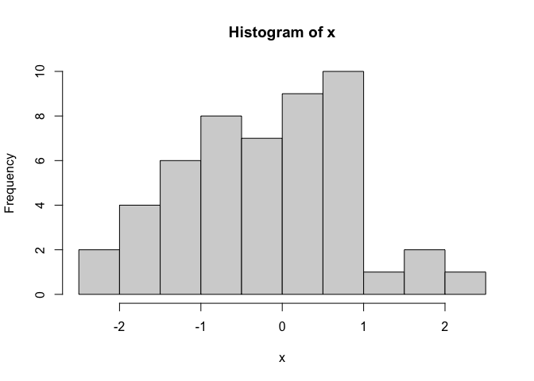<!-- -->

``` r
> mid.age <- c(2.5,7.5,13,16.5,17.5,19,22.5,44.5,70.5)
> acc.count <- c(28,46,58,20,31,64,149,316,103)
> age.acc <- rep(mid.age,acc.count)
> brk <- c(0,5,10,16,17,18,20,25,60,80)
> hist(age.acc,breaks=brk)
```

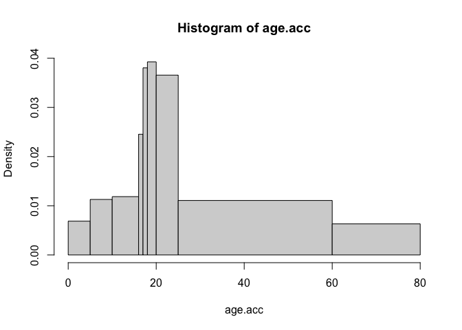<!-- -->

- 经验累积分布图形

``` r
> n <- length(x)
> plot(sort(x),(1:n)/n,type="s",ylim=c(0,1))
```

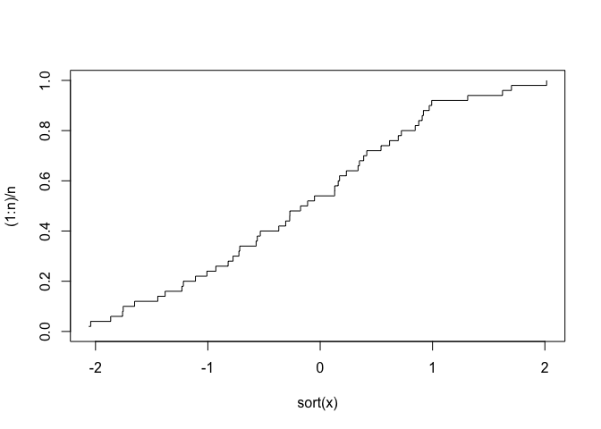<!-- -->

- Q-Q图

``` r
> qqnorm(x)
```

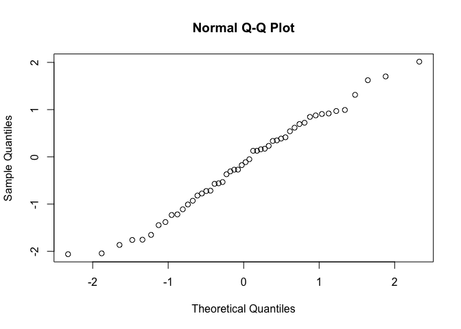<!-- -->

- 箱式图

``` r
> par(mfrow=c(1,2))
> boxplot(IgM)
> boxplot(log(IgM))
```

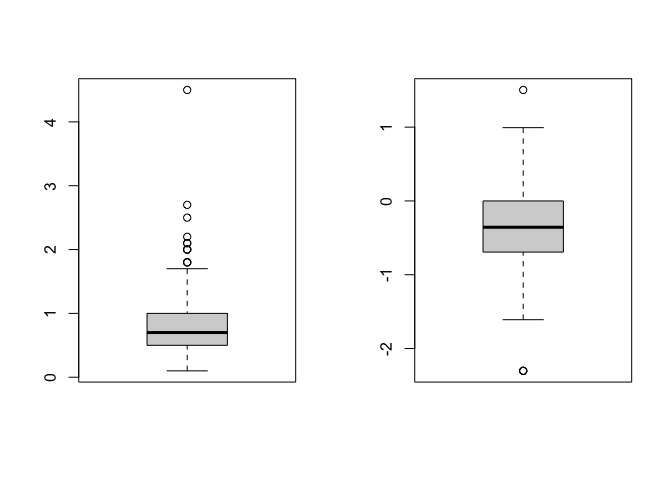<!-- -->

``` r
> par(mfrow=c(1,1))
```

### 7.1.5 分组计算描述性统计量

- **注意：年龄等连续变量有均值，但性别等分类变量没有均值，如需放在一起summary，则必须先将分类变量因子化。**

``` r
> # 因子化juul数据集（因子化方式参考 ?factor）
> juul$sex <- factor(juul$sex,labels=c("M","F"))
> juul$menarche <- factor(juul$menarche,labels=c("No","Yes"))
> juul$tanner <- factor(juul$tanner,
+                       labels=c("I","II","III","IV","V"))
> attach(juul)
> summary(juul)
      age         menarche     sex           igf1        tanner   
 Min.   : 0.170   No  :369   M   :621   Min.   : 25.0   I   :515  
 1st Qu.: 9.053   Yes :335   F   :713   1st Qu.:202.2   II  :103  
 Median :12.560   NA's:635   NA's:  5   Median :313.5   III : 72  
 Mean   :15.095                         Mean   :340.2   IV  : 81  
 3rd Qu.:16.855                         3rd Qu.:462.8   V   :328  
 Max.   :83.000                         Max.   :915.0   NA's:240  
 NA's   :5                              NA's   :321               
    testvol      
 Min.   : 1.000  
 1st Qu.: 1.000  
 Median : 3.000  
 Mean   : 7.896  
 3rd Qu.:15.000  
 Max.   :30.000  
 NA's   :859     
> detach(juul)
```

    #以下代码与上述5行代码等价
    juul <- transform(juul,
                      sex=factor(sex,labels=c("M","F")),
                      menarche=factor(menarche,labels=c("No","Yes")),
                      tanner=factor(tanner,labels=c("I","II","III","IV","V")))
    attach(juul)
    summary(juul)

- 分组数据汇总统计量

- tapply: 分组计算统计量

``` r
> attach(red.cell.folate)
> tapply(folate,ventilation,mean)
N2O+O2,24h  N2O+O2,op     O2,24h 
  316.6250   256.4444   278.0000 
> tapply(folate,ventilation,sd)
N2O+O2,24h  N2O+O2,op     O2,24h 
  58.71709   37.12180   33.75648 
> tapply(folate,ventilation,length)
N2O+O2,24h  N2O+O2,op     O2,24h 
         8          9          5 
> 
> xbar <- tapply(folate, ventilation, mean)
> s <- tapply(folate, ventilation, sd)
> n <- tapply(folate, ventilation, length)
> cbind(mean=xbar, std.dev=s, n=n)
               mean  std.dev n
N2O+O2,24h 316.6250 58.71709 8
N2O+O2,op  256.4444 37.12180 9
O2,24h     278.0000 33.75648 5
```

``` r
> juul <- transform(juul,
+                   sex=factor(sex,labels=c("M","F")),
+                   menarche=factor(menarche,labels=c("No","Yes")),
+                   tanner=factor(tanner,labels=c("I","II","III","IV","V")))
> attach(juul)
> tapply(igf1, tanner, mean, na.rm=TRUE) # 去除缺失值后
       I       II      III       IV        V 
207.4727 352.6714 483.2222 513.0172 465.3344 
```

- aggreate和by函数：分组计算统计量

``` r
> # aggregate方法一
> aggregate(juul[c("age","igf1")],
+           list(sex=juul$sex), mean, na.rm=T)
  sex      age     igf1
1   M 15.38436 310.8866
2   F 14.84363 368.1006
> # aggregate方法二
> aggregate(juul[c("age","igf1")], juul["sex"], mean, na.rm=T)
  sex      age     igf1
1   M 15.38436 310.8866
2   F 14.84363 368.1006
> # by函数
> by(juul, juul["sex"], summary)
sex: M
      age        menarche   sex          igf1        tanner       testvol      
 Min.   : 0.17   No  :  0   M:621   Min.   : 29.0   I   :291   Min.   : 1.000  
 1st Qu.: 8.85   Yes :  0   F:  0   1st Qu.:176.0   II  : 55   1st Qu.: 1.000  
 Median :12.38   NA's:621           Median :280.0   III : 34   Median : 3.000  
 Mean   :15.38                      Mean   :310.9   IV  : 41   Mean   : 7.896  
 3rd Qu.:16.77                      3rd Qu.:430.2   V   :124   3rd Qu.:15.000  
 Max.   :83.00                      Max.   :915.0   NA's: 76   Max.   :30.000  
                                    NA's   :145                NA's   :141     
------------------------------------------------------------ 
sex: F
      age        menarche   sex          igf1        tanner       testvol   
 Min.   : 0.25   No  :369   M:  0   Min.   : 25.0   I   :224   Min.   : NA  
 1st Qu.: 9.30   Yes :335   F:713   1st Qu.:233.0   II  : 48   1st Qu.: NA  
 Median :12.80   NA's:  9           Median :352.0   III : 38   Median : NA  
 Mean   :14.84                      Mean   :368.1   IV  : 40   Mean   :NaN  
 3rd Qu.:16.93                      3rd Qu.:483.0   V   :204   3rd Qu.: NA  
 Max.   :75.12                      Max.   :914.0   NA's:159   Max.   : NA  
                                    NA's   :176                NA's   :713  
```

- 代码清单7-6 使用`aggregate()`分组获取描述性统计量

``` r
> myvars <- c("mpg", "hp", "wt")  
> aggregate(mtcars[myvars], by=list(am=mtcars$am), mean)
  am      mpg       hp       wt
1  0 17.14737 160.2632 3.768895
2  1 24.39231 126.8462 2.411000
> aggregate(mtcars[myvars], by=list(am=mtcars$am), sd)
  am      mpg       hp        wt
1  0 3.833966 53.90820 0.7774001
2  1 6.166504 84.06232 0.6169816
```

- \*\*注意list(am=mtcars$am)的使用**。如果使用的是`list(mtcars$am)\`，则am列将被标注为Group.1而不是am。

- 如果有多个分组变量,
  可以使用`by=list(name1=groupvar1,name2=groupvar2,...,nameN=groupvarN)`这样的语句。

- 可以使用`by()`函数可以一次返回若干个统计量。格式为：

  `by(data, INDICES, FUN)`

- 其中data是一个数据框或矩阵，INDICES是一个因子或因子组成的列表，定义了分组，FUN是任意函数。

- 代码清单7-7 使用`by()`分组计算描述性统计量

``` r
> mystats <- function(x, na.omit=FALSE){         
+   if (na.omit)                     
+     x <- x[!is.na(x)]              
+   m <- mean(x)              
+   n <- length(x)            
+   s <- sd(x)               
+   skew <- sum((x-m)^3/s^3)/n       
+   kurt <- sum((x-m)^4/s^4)/n - 3          
+   return(c(n=n, mean=m, stdev=s, skew=skew, kurtosis=kurt))        
+   } 
> dstats <- function(x)sapply(x, mystats) 
> myvars <- c("mpg", "hp", "wt") 
> by(mtcars[myvars], mtcars$am, dstats)
mtcars$am: 0
                 mpg           hp         wt
n        19.00000000  19.00000000 19.0000000
mean     17.14736842 160.26315789  3.7688947
stdev     3.83396639  53.90819573  0.7774001
skew      0.01395038  -0.01422519  0.9759294
kurtosis -0.80317826  -1.20969733  0.1415676
------------------------------------------------------------ 
mtcars$am: 1
                 mpg          hp         wt
n        13.00000000  13.0000000 13.0000000
mean     24.39230769 126.8461538  2.4110000
stdev     6.16650381  84.0623243  0.6169816
skew      0.05256118   1.3598859  0.2103128
kurtosis -1.45535200   0.5634635 -1.1737358
```

- 这里的`dstats()`调用了代码清单7-2中的`mystats()`函数，将其应用于数据框的每一栏中。再通过`by()`函数则可得到am中每一水平的概括统计量。

### 7.1.6 分组计算的扩展

- doBy包和psych包也提供了分组计算描述性统计量的函数，它们未随基本安装发布，必须在首次使用前进行安装。doBy包中`summaryBy()`函数的使用格式为：

  `summaryBy(formula, data=dataframe, FUN=function)`

- 其中的formula接受以下的格式：

<!-- -->

    `var1 + var2 + var3 + ... + varN ~ groupvar1 + groupvar2 + ... + groupvarN`

- 在\~左侧的变量是需要分析的数值型变量,而右侧的变量是类别型的分组变量。function可为任何内建或用户自编的R函数。

- 代码清单7-8 使用doBy包中的`summaryBy()`分组计算概述统计量

``` r
> library(doBy) 
> summaryBy(mpg+hp+wt~am, data=mtcars, FUN=mystats)
  am mpg.n mpg.mean mpg.stdev   mpg.skew mpg.kurtosis hp.n  hp.mean hp.stdev
1  0    19 17.14737  3.833966 0.01395038   -0.8031783   19 160.2632 53.90820
2  1    13 24.39231  6.166504 0.05256118   -1.4553520   13 126.8462 84.06232
      hp.skew hp.kurtosis wt.n  wt.mean  wt.stdev   wt.skew wt.kurtosis
1 -0.01422519  -1.2096973   19 3.768895 0.7774001 0.9759294   0.1415676
2  1.35988586   0.5634635   13 2.411000 0.6169816 0.2103128  -1.1737358
```

- psych包中的`describeBy()`函数可计算和`describe()`相同的描述性统计量，只是按照一个或多个分组变量分层：

- 代码清单7-9 使用psych包中的`describeBy()`分组计算概述统计量

``` r
> library(psych) 
> myvars <- c("mpg", "hp", "wt") 
> describeBy(mtcars[myvars], list(am=mtcars$am))

 Descriptive statistics by group 
am: 0
    vars  n   mean    sd median trimmed   mad   min    max  range  skew
mpg    1 19  17.15  3.83  17.30   17.12  3.11 10.40  24.40  14.00  0.01
hp     2 19 160.26 53.91 175.00  161.06 77.10 62.00 245.00 183.00 -0.01
wt     3 19   3.77  0.78   3.52    3.75  0.45  2.46   5.42   2.96  0.98
    kurtosis    se
mpg    -0.80  0.88
hp     -1.21 12.37
wt      0.14  0.18
------------------------------------------------------------ 
am: 1
    vars  n   mean    sd median trimmed   mad   min    max  range skew kurtosis
mpg    1 13  24.39  6.17  22.80   24.38  6.67 15.00  33.90  18.90 0.05    -1.46
hp     2 13 126.85 84.06 109.00  114.73 63.75 52.00 335.00 283.00 1.36     0.56
wt     3 13   2.41  0.62   2.32    2.39  0.68  1.51   3.57   2.06 0.21    -1.17
       se
mpg  1.71
hp  23.31
wt   0.17
```

- 与前面的示例不同，`describeBy()`函数不允许指定任意函数，所以它的普适性较低。

### 7.1.7 分组数据的图形描述

- 直方图

``` r
> attach(energy)
> expend.lean <- expend[stature=="lean"]
> expend.obese <- expend[stature=="obese"] # energy 数据集中expend变量被分割成两个向量
> 
> par(mfrow=c(2,1))
> hist(expend.lean,breaks=10,xlim=c(5,13),ylim=c(0,4),col="white")
> hist(expend.obese,breaks=10,xlim=c(5,13),ylim=c(0,4),col="grey")
```

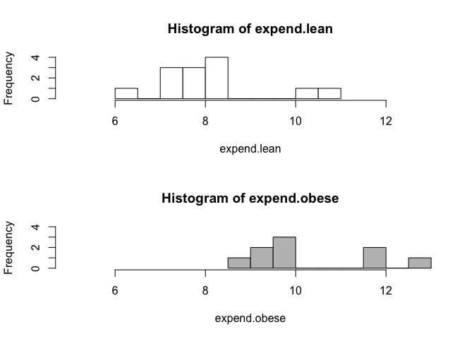<!-- -->

``` r
> par(mfrow=c(1,1)) # 关闭两行一列构图，不影响后面作图
```

- 并联箱式图

``` r
> boxplot(expend ~ stature)
```

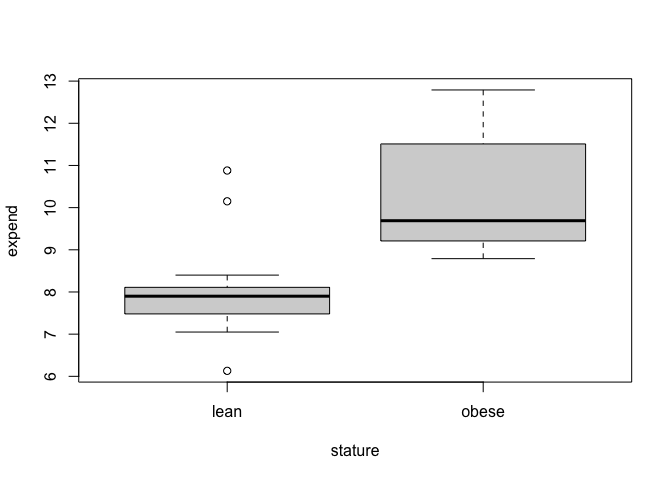<!-- -->

- 带状图

``` r
> opar <- par(mfrow=c(2,2), mex=0.8, mar=c(3,3,2,1)+.1)
> stripchart(expend ~ stature)
> stripchart(expend ~ stature, method="stack")
> stripchart(expend ~ stature, method="jitter")
> stripchart(expend ~ stature, method="jitter", jitter=.03)
```

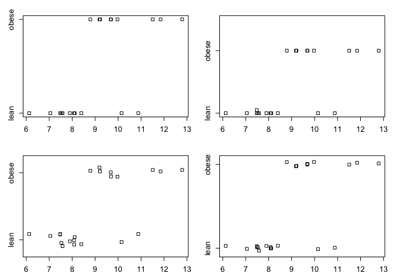<!-- -->

``` r
> par(opar)
```

## 7.2 频数表和列联表

- 安装vcd包和gmodels包。

- 本节中的数据来自vcd包中的Arthritis数据集。这份数据来自Kock &
  Edward(1988)，表示了一项风湿性关节炎新疗法的双盲临床实验的结果。前6个观测是这样的：

``` r
> library(vcd) 
> head(Arthritis)
  ID Treatment  Sex Age Improved
1 57   Treated Male  27     Some
2 46   Treated Male  29     None
3 77   Treated Male  30     None
4 17   Treated Male  32   Marked
5 36   Treated Male  46   Marked
6 23   Treated Male  58   Marked
```

### 7.2.1 生成频数表

| 函数                         | 描述                                                |
|------------------------------|-----------------------------------------------------|
| table(var1, var2, …, varN)   | 使用 N 个类别型变量(因子)创建一个 N 维列联表。      |
| xtabs(formula, data)         | 根据一个公式和一个矩阵或数据框创建一个 N 维列联表。 |
| prop.table(table, margins)   | 依 margins 定义的边际列表将表中条目表示为分数形式。 |
| margin.table(table, margins) | 依 margins 定义的边际列表计算表中条目的和。         |
| addmargins(table, margins)   | 将概述边 margins(默认是求和结果)放入表中。          |
| ftable(table)                | 创建一个紧凑的”平铺”式列联表。                      |

#### 7.2.1.1 一维列联表

- 可以使用`table()`函数生成简单的频数统计表。

``` r
> mytable <- with(Arthritis, table(Improved)) 
> mytable
Improved
  None   Some Marked 
    42     14     28 
```

- 可以用`prop.table()`将这些频数转化为比例值：

``` r
> prop.table(mytable)  
Improved
     None      Some    Marked 
0.5000000 0.1666667 0.3333333 
```

- 或使用`prop.table()*100`转化为百分比：

``` r
> prop.table(mytable)*100
Improved
    None     Some   Marked 
50.00000 16.66667 33.33333 
```

- 由此可知，有50%的研究参与者获得了一定程度或者显著的改善(16.7+33.3)。

#### 7.2.1.2 二维列联表

- 案例1：

``` r
> caff.marital <- matrix(c(652,1537,598,242,36,46,38,21,218
+                          ,327,106,67),
+                        nrow=3,byrow=T)
> caff.marital
     [,1] [,2] [,3] [,4]
[1,]  652 1537  598  242
[2,]   36   46   38   21
[3,]  218  327  106   67
```

``` r
> colnames(caff.marital) <- c("0","1-150","151-300",">300")
> rownames(caff.marital) <- c("Married","Prev.married","Single")
> caff.marital
               0 1-150 151-300 >300
Married      652  1537     598  242
Prev.married  36    46      38   21
Single       218   327     106   67
```

``` r
> names(dimnames(caff.marital)) <- c("marital","consumption")
> caff.marital
              consumption
marital          0 1-150 151-300 >300
  Married      652  1537     598  242
  Prev.married  36    46      38   21
  Single       218   327     106   67
> as.data.frame(as.table(caff.marital))
        marital consumption Freq
1       Married           0  652
2  Prev.married           0   36
3        Single           0  218
4       Married       1-150 1537
5  Prev.married       1-150   46
6        Single       1-150  327
7       Married     151-300  598
8  Prev.married     151-300   38
9        Single     151-300  106
10      Married        >300  242
11 Prev.married        >300   21
12       Single        >300   67
```

``` r
> attach(juul)
> table(sex) #juul dataset
sex
  M   F 
621 713 
> table(sex,menarche)
   menarche
sex  No Yes
  M   0   0
  F 369 335
> table(menarche,tanner)
        tanner
menarche   I  II III  IV   V
     No  221  43  32  14   2
     Yes   1   1   5  26 202
```

``` r
> xtabs(~ tanner + sex, data=juul)
      sex
tanner   M   F
   I   291 224
   II   55  48
   III  34  38
   IV   41  40
   V   124 204
```

``` r
> xtabs(~ dgn + diab + coma, data=stroke) # 用xtabs展示
, , coma = No

     diab
dgn    No Yes
  ICH  53   6
  ID  143  21
  INF 411  64
  SAH  38   0

, , coma = Yes

     diab
dgn    No Yes
  ICH  19   1
  ID   23   3
  INF  23   2
  SAH   9   0
```

``` r
> ftable(coma + diab ~ dgn, data=stroke) # 用ftable展示（适合2个以上维度的数据展示）
    coma  No     Yes    
    diab  No Yes  No Yes
dgn                     
ICH       53   6  19   1
ID       143  21  23   3
INF      411  64  23   2
SAH       38   0   9   0
```

``` r
> caff.marital
              consumption
marital          0 1-150 151-300 >300
  Married      652  1537     598  242
  Prev.married  36    46      38   21
  Single       218   327     106   67
> t(caff.marital) # t函数用来转置（行列互换）
           marital
consumption Married Prev.married Single
    0           652           36    218
    1-150      1537           46    327
    151-300     598           38    106
    >300        242           21     67
```

- 案例2：

- 对于二维列联表，`table()`函数的使用格式为：

  `mytable <- table(A, B)`

- 其中的A是行变量，B是列变量。除此之外，`xtabs()`函数还可使用公式风格的输入创建列联表，格式为：

  `mytable <- xtabs(~ A + B, data=mydata)`

  - 其中的mydata是一个矩阵或数据框。总的来说，要进行交叉分类的变量应出现在公式的右侧(即\~符号的右方)，以+作为分隔符。若某个变量写在公式的左侧，则其为一个频数向量(在数据已经被表格化时很有用)。

``` r
> mytable <- xtabs(~ Treatment+Improved, data=Arthritis) 
> mytable
         Improved
Treatment None Some Marked
  Placebo   29    7      7
  Treated   13    7     21
```

- 可以使用`margin.table()`和`prop.table()`函数分别生成边际频数和比例。行和与行比例可以这样计算（下标1指代`table()`语句中的第一个变量）：

``` r
> margin.table(mytable, 1)
Treatment
Placebo Treated 
     43      41 
```

``` r
> prop.table(mytable, 1)
         Improved
Treatment      None      Some    Marked
  Placebo 0.6744186 0.1627907 0.1627907
  Treated 0.3170732 0.1707317 0.5121951
```

- 观察表格可以发现，与接受安慰剂的个体中有显著改善的16%相比，接受治疗的个体中的51%的个体病情有了显著的改善。

- 列和与列比例可以这样计算（这里的下标2指代`table()`语句中的第二个变量）：

``` r
> margin.table(mytable, 2)
Improved
  None   Some Marked 
    42     14     28 
```

``` r
> prop.table(mytable, 2)
         Improved
Treatment      None      Some    Marked
  Placebo 0.6904762 0.5000000 0.2500000
  Treated 0.3095238 0.5000000 0.7500000
```

- 各单元格所占比例可用如下语句获取:

``` r
> prop.table(mytable)
         Improved
Treatment       None       Some     Marked
  Placebo 0.34523810 0.08333333 0.08333333
  Treated 0.15476190 0.08333333 0.25000000
```

- 可以使用`addmargins()`函数为这些表格添加边际和。例如，以下代码添加了各行的和与各列的和：

``` r
> addmargins(mytable)
         Improved
Treatment None Some Marked Sum
  Placebo   29    7      7  43
  Treated   13    7     21  41
  Sum       42   14     28  84
> addmargins(prop.table(mytable))
         Improved
Treatment       None       Some     Marked        Sum
  Placebo 0.34523810 0.08333333 0.08333333 0.51190476
  Treated 0.15476190 0.08333333 0.25000000 0.48809524
  Sum     0.50000000 0.16666667 0.33333333 1.00000000
```

- 在使用`addmargins()`时，默认行为是为表中所有的变量创建边际和。作为对照：

``` r
> addmargins(prop.table(mytable, 1), 2)
         Improved
Treatment      None      Some    Marked       Sum
  Placebo 0.6744186 0.1627907 0.1627907 1.0000000
  Treated 0.3170732 0.1707317 0.5121951 1.0000000
```

- 仅添加了各行的和。类似地，

``` r
> addmargins(prop.table(mytable, 2), 1)
         Improved
Treatment      None      Some    Marked
  Placebo 0.6904762 0.5000000 0.2500000
  Treated 0.3095238 0.5000000 0.7500000
  Sum     1.0000000 1.0000000 1.0000000
```

- 案例3：边际表格和频数

``` r
> attach(juul)
> tanner.sex <- table(tanner,sex)
> tanner.sex
      sex
tanner   M   F
   I   291 224
   II   55  48
   III  34  38
   IV   41  40
   V   124 204
> margin.table(tanner.sex,1) #1代表行
tanner
  I  II III  IV   V 
515 103  72  81 328 
> margin.table(tanner.sex,2) #2代表列
sex
  M   F 
545 554 
> prop.table(tanner.sex,1)  # 相对频数，也就是比例
      sex
tanner         M         F
   I   0.5650485 0.4349515
   II  0.5339806 0.4660194
   III 0.4722222 0.5277778
   IV  0.5061728 0.4938272
   V   0.3780488 0.6219512
> tanner.sex/sum(tanner.sex) #对上述结果计算百分比
      sex
tanner          M          F
   I   0.26478617 0.20382166
   II  0.05004550 0.04367607
   III 0.03093722 0.03457689
   IV  0.03730664 0.03639672
   V   0.11282985 0.18562329
```

``` r
> total.caff <- margin.table(caff.marital,2)
> total.caff
consumption
      0   1-150 151-300    >300 
    906    1910     742     330 
> barplot(total.caff, col="white")
```

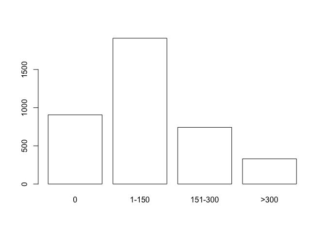<!-- -->

``` r
> par(mfrow=c(2,2))
> barplot(caff.marital, col="white")
> barplot(t(caff.marital), col="white")
> barplot(t(caff.marital), col="white", beside=T)
> barplot(prop.table(t(caff.marital),2), col="white", beside=T)
```

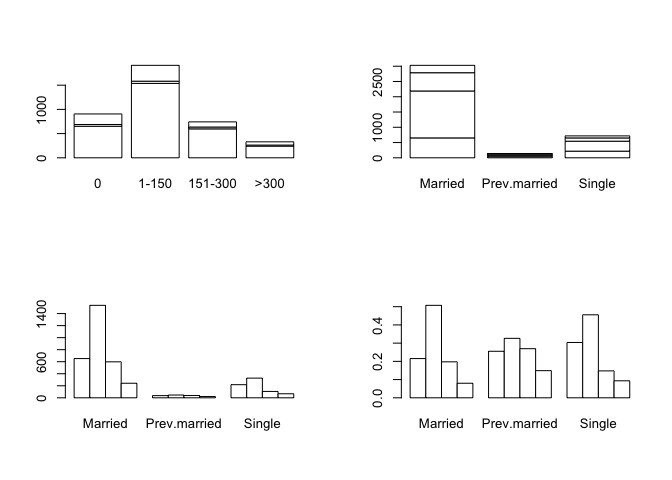<!-- -->

``` r
> par(mfrow=c(1,1))
```

``` r
> barplot(prop.table(t(caff.marital),2),beside=T,
+         legend.text=colnames(caff.marital),
+         col=c("white","grey80","grey50","black"))
```

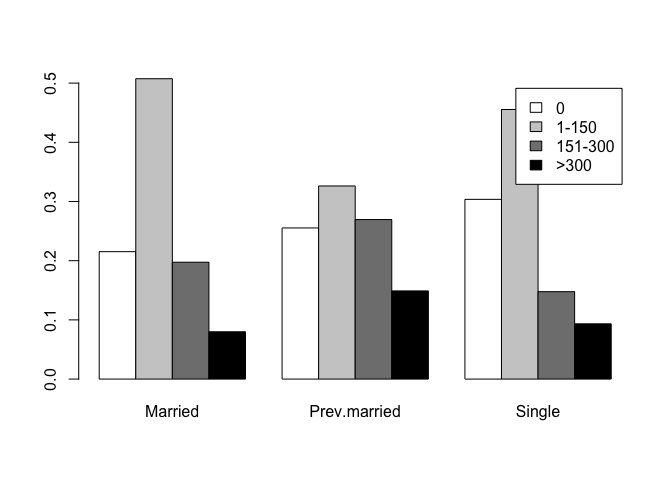<!-- -->

``` r
> dotchart(t(caff.marital), lcolor="black")
```

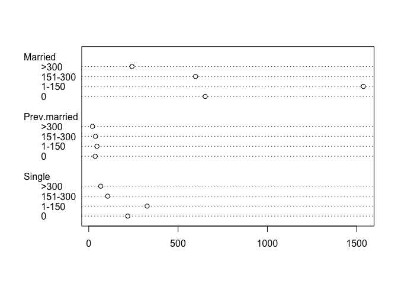<!-- -->

``` r
> opar <- par(mfrow=c(2,2),mex=0.8, mar=c(1,1,2,1))
> slices <- c("white","grey80","grey50","black")
> pie(caff.marital["Married",], main="Married", col=slices)
> pie(caff.marital["Prev.married",],
+     main="Previously married", col=slices)
> pie(caff.marital["Single",], main="Single", col=slices)
> par(opar)
```

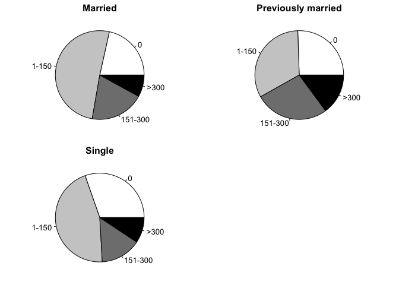<!-- -->

- 添加了各列的和。在表中可以看到，有显著改善患者中的25%是接受安慰剂治疗的。

- 代码清单7-10 使用CrossTable生成二维列联表

``` r
> library(gmodels) 
> CrossTable(Arthritis$Treatment, Arthritis$Improved)

 
   Cell Contents
|-------------------------|
|                       N |
| Chi-square contribution |
|           N / Row Total |
|           N / Col Total |
|         N / Table Total |
|-------------------------|

 
Total Observations in Table:  84 

 
                    | Arthritis$Improved 
Arthritis$Treatment |      None |      Some |    Marked | Row Total | 
--------------------|-----------|-----------|-----------|-----------|
            Placebo |        29 |         7 |         7 |        43 | 
                    |     2.616 |     0.004 |     3.752 |           | 
                    |     0.674 |     0.163 |     0.163 |     0.512 | 
                    |     0.690 |     0.500 |     0.250 |           | 
                    |     0.345 |     0.083 |     0.083 |           | 
--------------------|-----------|-----------|-----------|-----------|
            Treated |        13 |         7 |        21 |        41 | 
                    |     2.744 |     0.004 |     3.935 |           | 
                    |     0.317 |     0.171 |     0.512 |     0.488 | 
                    |     0.310 |     0.500 |     0.750 |           | 
                    |     0.155 |     0.083 |     0.250 |           | 
--------------------|-----------|-----------|-----------|-----------|
       Column Total |        42 |        14 |        28 |        84 | 
                    |     0.500 |     0.167 |     0.333 |           | 
--------------------|-----------|-----------|-----------|-----------|

 
```

- CrossTable()函数有很多选项，可以做许多事情：计算(行、列、单元格)的百分比；指定小数位数；进行卡方、Fisher和McNemar独立性检验；计算期望和(皮尔逊、标准化、调整的标准化)残差；将缺失值作为一种有效值；进行行和列标题的标注；生成SAS或SPSS风格的输出。参阅help(CrossTable)以了解详情。如果有两个以上的类别型变量，那么就是在处理多维列联表。

#### 7.2.1.3 多维列联表

- `table()`和`xtabs()`都可以基于三个或更多的类别型变量生成多维列联表。`margin.table()`、`prop.table()`和`addmargins()`函数可以自然地推广到高于二维的情况。另外，`ftable()`函数可以以一种紧凑而吸引人的方式输出多维列联表。

- 代码清单7-11 三维列联表

``` r
> mytable <- xtabs(~ Treatment+Sex+Improved, data=Arthritis)   # 各单元格的频数
> mytable
, , Improved = None

         Sex
Treatment Female Male
  Placebo     19   10
  Treated      6    7

, , Improved = Some

         Sex
Treatment Female Male
  Placebo      7    0
  Treated      5    2

, , Improved = Marked

         Sex
Treatment Female Male
  Placebo      6    1
  Treated     16    5
> ftable(mytable)
                 Improved None Some Marked
Treatment Sex                             
Placebo   Female            19    7      6
          Male              10    0      1
Treated   Female             6    5     16
          Male               7    2      5
```

``` r
> margin.table(mytable, 1) # 边际频数，由于使用公式~Treatement+Sex+Improve创建了这个表,所以Treatment需要通过下标1来引用,Sex通过下标2来引用,Improve通过下标3来引用。
Treatment
Placebo Treated 
     43      41 
> margin.table(mytable, 2)
Sex
Female   Male 
    59     25 
> margin.table(mytable, 3)
Improved
  None   Some Marked 
    42     14     28 
```

``` r
> margin.table(mytable, c(1, 3)) # 治疗情况(Treatment)×改善情况(Improved)的边际频数
         Improved
Treatment None Some Marked
  Placebo   29    7      7
  Treated   13    7     21
```

``` r
> ftable(prop.table(mytable, c(1, 2)))   # 治疗情况(Treatment)×性别(Sex)的各类改善情况比例
                 Improved       None       Some     Marked
Treatment Sex                                             
Placebo   Female          0.59375000 0.21875000 0.18750000
          Male            0.90909091 0.00000000 0.09090909
Treated   Female          0.22222222 0.18518519 0.59259259
          Male            0.50000000 0.14285714 0.35714286
```

``` r
> ftable(addmargins(prop.table(mytable, c(1, 2)), 3))
                 Improved       None       Some     Marked        Sum
Treatment Sex                                                        
Placebo   Female          0.59375000 0.21875000 0.18750000 1.00000000
          Male            0.90909091 0.00000000 0.09090909 1.00000000
Treated   Female          0.22222222 0.18518519 0.59259259 1.00000000
          Male            0.50000000 0.14285714 0.35714286 1.00000000
```

- 如果想得到百分比而不是比例，可以将结果表格乘以100。

``` r
> ftable(addmargins(prop.table(mytable, c(1, 2)), 3)) * 100
                 Improved       None       Some     Marked        Sum
Treatment Sex                                                        
Placebo   Female           59.375000  21.875000  18.750000 100.000000
          Male             90.909091   0.000000   9.090909 100.000000
Treated   Female           22.222222  18.518519  59.259259 100.000000
          Male             50.000000  14.285714  35.714286 100.000000
```

### 7.2.2 独立性检验

#### 7.2.2.1 卡方独立性检验

- 可以使用`chisq.test()`函数对二维表的行变量和列变量进行卡方独立性检验。

- 代码清单7-12 卡方独立性检验

``` r
> library(vcd)  
> mytable <- xtabs(~Treatment+Improved, data=Arthritis) 
> chisq.test(mytable)

    Pearson's Chi-squared test

data:  mytable
X-squared = 13.055, df = 2, p-value = 0.001463
```

- 以上结果表明：治疗情况和改善情况不独立（患者接受的治疗和改善的水平看上去存在着某种关系(p\<0.01)）。

``` r
> mytable <- xtabs(~Improved+Sex, data=Arthritis)
> chisq.test(mytable)

    Pearson's Chi-squared test

data:  mytable
X-squared = 4.8407, df = 2, p-value = 0.08889
```

- 以上结果表明：性别和改善情况独立（而患者性别和改善情况之间却不存在关系(p\>0.05)）。

- 由于p-value =
  0.09不够小，故没有足够的理由说明治疗结果和性别之间是不独立的。代码清单7-12中产生警告信息的原因是，表中的6个单元格之一(男性-一定程度上的改善)有一个小于5的值，这可能会使卡方近似无效。

#### 7.2.2.2 Fisher精确检验

- 可以使用`fisher.test()`函数进行Fisher精确检验。Fisher精确检验的原假设是：边界固定的列联表中行和列是相互独立的。其调用格式为`fisher.test(mytable)`，其中的mytable是一个二维列联表。

``` r
> mytable <- xtabs(~Treatment+Improved, data=Arthritis) 
> fisher.test(mytable)

    Fisher's Exact Test for Count Data

data:  mytable
p-value = 0.001393
alternative hypothesis: two.sided
```

- 这里的`fisher.test()`函数可以在任意行列数大于等于2的二维列联表上使用，但不能用于2×2的列联表。

#### 7.2.2.3 Cochran-Mantel-Haenszel检验

- `mantelhaen.test()`函数可用来进行`Cochran-Mantel-Haenszel`卡方检验，其原假设是，两个名义变量在第三个变量的每一层中都是条件独立的。下列代码可以检验治疗情况和改善情况在性别的每一水平下是否独立。此检验假设不存在三阶交互作用(治疗情况×改善情况×性别)。

``` r
> mytable <- xtabs(~Treatment+Improved+Sex, data=Arthritis) 
> mantelhaen.test(mytable)

    Cochran-Mantel-Haenszel test

data:  mytable
Cochran-Mantel-Haenszel M^2 = 14.632, df = 2, p-value = 0.0006647
```

- 结果表明，患者接受的治疗与得到的改善在性别的每一水平下并不独立(分性别来看，用药治疗的患者较接受安慰剂的患者有了更多的改善)。

### 7.2.3 相关性的度量

- vcd包中的`assocstats()`函数可以用来计算二维列联表的phi系数、列联系数和Cramer’s
  V系数。

``` r
> library(vcd) 
> mytable <- xtabs(~Treatment+Improved, data=Arthritis)
> assocstats(mytable)
                    X^2 df  P(> X^2)
Likelihood Ratio 13.530  2 0.0011536
Pearson          13.055  2 0.0014626

Phi-Coefficient   : NA 
Contingency Coeff.: 0.367 
Cramer's V        : 0.394 
```

- 总体来说，较大的值意味着较强的相关性。

## 7.3 相关

- 相关系数可以用来描述定量变量之间的关系。相关系数的符号(±)表明关系的方向(正相关或负相关)，其值的大小表示关系的强弱程度(完全不相关时为0，完全相关时为1)
  。

- 需要安装psych和ggm包。

- 使用R基础安装中的state.x77数据集，它提供了美国50个州在1977年的人口、收入、文盲率、预期寿命、谋杀率和高中毕业率数据，使用help(state.x77)了解数据集的更多信息。

### 7.3.1 相关的类型

#### 7.3.1.1 Pearson、Spearman和Kendall相关

- Pearson积差相关系数衡量了两个定量变量之间的线性相关程度（**这两个变量必须是符合正态分布的连续变量**）。Spearman等级相关系数则衡量分级定序变量之间的相关程度。Kendall’s
  Tau相关系数也是一种非参数的等级相关度量。

- `cor()`函数可以计算这三种相关系数，而`cov()`函数可用来计算协方差。两个函数的参数有很多，其中与相关系数的计算有关的参数可以简化为：`cor(x, use= , method= )`。

| 参数   | 描述                                                                                                                                                                                                                                       |
|--------|--------------------------------------------------------------------------------------------------------------------------------------------------------------------------------------------------------------------------------------------|
| x      | 矩阵或数据框。                                                                                                                                                                                                                             |
| use    | 指定缺失数据的处理方式。可选的方式为 all.obs(假设不存在缺失数据——遇到缺失数据时将报错) 、 everything (遇到缺失数据时, 相关系数的计算结果将被设为 missing) 、 complete.obs (行删除)以及 pairwise.complete.obs(成对删除,pairwise deletion)。 |
| method | 指定相关系数的类型。可选类型为 pearson、spearman 或 kendall。                                                                                                                                                                              |

- 默认参数为use=“everything”和method=“pearson”。

- 代码清单7-14 协方差和相关系数

``` r
> states<- state.x77[,1:6]  
> cov(states)  # 计算方差和协方差
              Population      Income   Illiteracy     Life Exp      Murder
Population 19931683.7588 571229.7796  292.8679592 -407.8424612 5663.523714
Income       571229.7796 377573.3061 -163.7020408  280.6631837 -521.894286
Illiteracy      292.8680   -163.7020    0.3715306   -0.4815122    1.581776
Life Exp       -407.8425    280.6632   -0.4815122    1.8020204   -3.869480
Murder         5663.5237   -521.8943    1.5817755   -3.8694804   13.627465
HS Grad       -3551.5096   3076.7690   -3.2354694    6.3126849  -14.549616
                HS Grad
Population -3551.509551
Income      3076.768980
Illiteracy    -3.235469
Life Exp       6.312685
Murder       -14.549616
HS Grad       65.237894
```

``` r
> cor(states) # 计算了Pearson积差相关系数
            Population     Income Illiteracy    Life Exp     Murder     HS Grad
Population  1.00000000  0.2082276  0.1076224 -0.06805195  0.3436428 -0.09848975
Income      0.20822756  1.0000000 -0.4370752  0.34025534 -0.2300776  0.61993232
Illiteracy  0.10762237 -0.4370752  1.0000000 -0.58847793  0.7029752 -0.65718861
Life Exp   -0.06805195  0.3402553 -0.5884779  1.00000000 -0.7808458  0.58221620
Murder      0.34364275 -0.2300776  0.7029752 -0.78084575  1.0000000 -0.48797102
HS Grad    -0.09848975  0.6199323 -0.6571886  0.58221620 -0.4879710  1.00000000
```

``` r
> cor(states, method="spearman") # 计算了Spearman等级相关系数
           Population     Income Illiteracy   Life Exp     Murder    HS Grad
Population  1.0000000  0.1246098  0.3130496 -0.1040171  0.3457401 -0.3833649
Income      0.1246098  1.0000000 -0.3145948  0.3241050 -0.2174623  0.5104809
Illiteracy  0.3130496 -0.3145948  1.0000000 -0.5553735  0.6723592 -0.6545396
Life Exp   -0.1040171  0.3241050 -0.5553735  1.0000000 -0.7802406  0.5239410
Murder      0.3457401 -0.2174623  0.6723592 -0.7802406  1.0000000 -0.4367330
HS Grad    -0.3833649  0.5104809 -0.6545396  0.5239410 -0.4367330  1.0000000
```

#### 7.3.1.2 偏相关

- 偏相关是指在控制一个或多个定量变量时，另外两个定量变量之间的相互关系。可以使用ggm包中的`pcor()`函数计算偏相关系数。

- 函数调用格式为：`pcor(u, S)`，其中的u是一个数值向量，前两个数值表示要计算相关系数的变量下标，其余的数值为条件变量(即要排除影响的变量)的下标。S为变量的协方差阵。

``` r
> library(ggm) 
> colnames(states)
[1] "Population" "Income"     "Illiteracy" "Life Exp"   "Murder"    
[6] "HS Grad"   
> pcor(c(1,5,2,3,6), cov(states))
[1] 0.3462724
```

- 本例中，在控制了收入、文盲率和高中毕业率的影响时，人口和谋杀率之间的相关系数为0.346。偏相关系数常用于社会科学的研究中。

### 7.3.2 相关性的显著性检验

- 可以使用`cor.test()`函数对单个的Pearson、Spearman和Kendall相关系数进行检验。简化后的使用格式为：

  `cor.test(x, y, alternative = , method = )`

  - 其中的x和y为要检验相关性的变量，alternative则用来指定进行双侧检验或单侧检验(取值为”two.side”、“less”或”greater”)，而method用以指定要计算的相关类型(“pearson”、“kendall”或”spearman”)。当研究的假设为总体的相关系数小于0时，请使用alternative=“less”。在研究的假设为总体的相关系数大于0时，应使用alternative=“greater”。在默认情况下，假设为alternative=“two.side”(总体相关系数不等于0)。

- 代码清单7-15 检验某种相关系数的显著性

``` r
> cor.test(states[,3], states[,5])

    Pearson's product-moment correlation

data:  states[, 3] and states[, 5]
t = 6.8479, df = 48, p-value = 1.258e-08
alternative hypothesis: true correlation is not equal to 0
95 percent confidence interval:
 0.5279280 0.8207295
sample estimates:
      cor 
0.7029752 
```

- 这段代码检验了预期寿命和谋杀率的Pearson相关系数为0的原假设。假设总体的相关度为0，则预计在一千万次中只会有少于一次的机会见到0.703这样大的样本相关度(即p=1.258e–08)。由于这种情况几乎不可能发生，所以可以拒绝原假设，从而支持了要研究的猜想，即预期寿命和谋杀率之间的总体相关度不为0。然而`cor.test()`每次只能检验一种相关关系。但psych包中提供的`corr.test()`函数可以为Pearson、Spearman或Kendall相关计算相关矩阵和显著性水平。

- 在多元正态性的假设下,
  psych包中的`pcor.test()`函数可以用来检验在控制一个或多个额外变量时两个变量之间的条件独立性。使用格式为：

  `pcor.test(r, q, n)`

  - 其中的r是由`pcor()`函数计算得到的偏相关系数，q为要控制的变量数(以数值表示位置)，n为样本大小。

- 代码清单7-16 通过corr.test计算相关矩阵并进行显著性检验

``` r
> library(psych) 
> corr.test(states, use="complete")
Call:corr.test(x = states, use = "complete")
Correlation matrix 
           Population Income Illiteracy Life Exp Murder HS Grad
Population       1.00   0.21       0.11    -0.07   0.34   -0.10
Income           0.21   1.00      -0.44     0.34  -0.23    0.62
Illiteracy       0.11  -0.44       1.00    -0.59   0.70   -0.66
Life Exp        -0.07   0.34      -0.59     1.00  -0.78    0.58
Murder           0.34  -0.23       0.70    -0.78   1.00   -0.49
HS Grad         -0.10   0.62      -0.66     0.58  -0.49    1.00
Sample Size 
[1] 50
Probability values (Entries above the diagonal are adjusted for multiple tests.) 
           Population Income Illiteracy Life Exp Murder HS Grad
Population       0.00   0.59       1.00      1.0   0.10       1
Income           0.15   0.00       0.01      0.1   0.54       0
Illiteracy       0.46   0.00       0.00      0.0   0.00       0
Life Exp         0.64   0.02       0.00      0.0   0.00       0
Murder           0.01   0.11       0.00      0.0   0.00       0
HS Grad          0.50   0.00       0.00      0.0   0.00       0

 To see confidence intervals of the correlations, print with the short=FALSE option
```

- 参数use=的取值可为”pairwise”或”complete”(分别表示对缺失值执行成对删除或行删除)。参数method=的取值可为”pearson”(默认值)、“spearman”或”kendall”。这里可以看到，人口数量和高中毕业率的相关系数(–0.10)并不显著地不为0(p=0.5)。

## 7.4 t 检验

- 案例1：

``` r
> daily.intake <- c(5260,5470,5640,6180,6390,6515,
+                   6805,7515,7515,8230,8770)
> mean(daily.intake)
[1] 6753.636
> sd(daily.intake)
[1] 1142.123
> quantile(daily.intake)
  0%  25%  50%  75% 100% 
5260 5910 6515 7515 8770 
```

``` r
> t.test(daily.intake,mu=7725) # mu是总体均数

    One Sample t-test

data:  daily.intake
t = -2.8208, df = 10, p-value = 0.01814
alternative hypothesis: true mean is not equal to 7725
95 percent confidence interval:
 5986.348 7520.925
sample estimates:
mean of x 
 6753.636 
```

- 案例2：

- 安装MASS包。

- 使用MASS包中的UScrime数据集。它包含了1960年美国47个州的刑罚制度对犯罪率影响的信息。我们感兴趣的结果变量为Prob(监禁的概率)、U1(14-24岁年龄段城市男性失业率)和U2(35-39岁年龄段城市男性失业率)。类别型变量So(指示该州是否位于南方的指示变量)将作为分组变量使用。

### 7.4.1 独立样本的 t 检验

- 比较的对象是南方和非南方各州，因变量为监禁的概率。一个针对两组的独立样本t检验可以用于检验两个总体的均值相等的假设。这里假设两组数据是独立的，并且是从正态总体中抽得。检验的调用格式为：

  `t.test(y ~ x, data)`

  - 其中的y是一个数值型变量，x是一个二分变量。调用格式或为：

  `t.test(y1, y2)`

  - 其中的y1和y2为数值型向量(即各组的结果变量)。可选参数data的取值为一个包含了这些变量的矩阵或数据框。与其他多数统计软件不同的是,
    这里的t检验默认假定方差不相等，并使用Welsh的修正自由度。你可以添加一个参数`var.equal=TRUE`以假定方差相等，并使用合并方差估计。默认的备择假设是双侧的(即均值不相等，但大小的方向不确定)。你可以添加一个参数`alternative="less"`或`alternative="greater"`来进行有方向的检验。

- 使用一个假设方差不等的双侧检验，比较了南方(group 1)和非南方(group
  0)各州的监禁概率：

- 方差齐性检验

``` r
> library(MASS)
> var.test(Prob ~ So, data=UScrime)

    F test to compare two variances

data:  Prob by So
F = 0.624, num df = 30, denom df = 15, p-value = 0.2646
alternative hypothesis: true ratio of variances is not equal to 1
95 percent confidence interval:
 0.2360299 1.4396653
sample estimates:
ratio of variances 
         0.6240006 
```

- p-value =
  0.3，大于0.05（**若P值\<于0.05，便拒绝方差整齐的假设**），说明方差具有齐性（相等）。

``` r
> t.test(Prob ~ So, data=UScrime,var.equal=TRUE)

    Two Sample t-test

data:  Prob by So
t = -4.2021, df = 45, p-value = 0.0001236
alternative hypothesis: true difference in means between group 0 and group 1 is not equal to 0
95 percent confidence interval:
 -0.03727856 -0.01312153
sample estimates:
mean in group 0 mean in group 1 
     0.03851265      0.06371269 
```

- 可以拒绝南方各州和非南方各州拥有相同监禁概率的假设(p\<0.001)。

### 7.4.2 非独立样本的 t 检验

- 案例1，问：较年轻(14-24岁)男性的失业率是否比年长(35-39岁)男性的失业率更高？在这种情况下，这两组数据并不独立。在两组的观测之间相关时，获得的是一个非独立组设计(dependent
  groups design)。前-后测设计(pre-post design)或重复测量设计(repeated
  measures
  design)同样也会产生非独立的组。非独立样本的t检验假定组间的差异呈正态分布。对于本例，检验的调用格式为：

  `t.test(y1, y2, paired=TRUE)`

  - 其中的y1和y2为两个非独立组的数值向量。结果如下：

``` r
> library(MASS)  
> sapply(UScrime[c("U1","U2")], function(x)(c(mean=mean(x),sd=sd(x))))
           U1       U2
mean 95.46809 33.97872
sd   18.02878  8.44545
```

``` r
> with(UScrime, t.test(U1, U2, paired=TRUE))

    Paired t-test

data:  U1 and U2
t = 32.407, df = 46, p-value < 2.2e-16
alternative hypothesis: true mean difference is not equal to 0
95 percent confidence interval:
 57.67003 65.30870
sample estimates:
mean difference 
       61.48936 
```

- 差异的均值(61.5)足够大，可以保证拒绝年长和年轻男性的平均失业率相同的假设。年轻男性的失业率更高。事实上，若总体均值相等，获取一个差异如此大的样本的概率小于2.2e–16。

- 案例2：两个配对样本的 t 检验

``` r
> library(ISwR)
> attach(intake)
> intake  # 查看数据集内容
    pre post
1  5260 3910
2  5470 4220
3  5640 3885
4  6180 5160
5  6390 5645
6  6515 4680
7  6805 5265
8  7515 5975
9  7515 6790
10 8230 6900
11 8770 7335
> post - pre # 绝经前后的差别
 [1] -1350 -1250 -1755 -1020  -745 -1835 -1540 -1540  -725 -1330 -1435
> t.test(pre, post, paired=T) # t.test(pre, post) #WRONG!这是两个独立样本的t检验

    Paired t-test

data:  pre and post
t = 11.941, df = 10, p-value = 3.059e-07
alternative hypothesis: true mean difference is not equal to 0
95 percent confidence interval:
 1074.072 1566.838
sample estimates:
mean difference 
       1320.455 
```

## 7.5 组间差异的非参数检验（秩和检验）

### 7.5.1 两组的比较

- 若两组数据独立，可以使用**Wilcoxon秩和检验**(更广为人知的名字是`Mann-Whitney U`检验)来评估观测是否是从相同的概率分布中抽得的(即，在一个总体中获得更高得分的概率是否比另一个总体要大)。调用格式为：

  `wilcox.test(y ~ x, data)`

  - 其中的y是数值型变量，而x是一个二分变量。调用格式或为：

  `wilcox.test(y1, y2)`

  - 其中的y1和y2为各组的结果变量。可选参数data的取值为一个包含了这些变量的矩阵或数据框。默认进行一个双侧检验。可以添加参数exact来进行精确检验，指定`alternative="less"`或`alternative="greater"`进行有方向的检验。

- 如果使用`Mann-Whitney U`检验回答上一节中关于监禁率的问题，将得到这些结果:

``` r
> with(UScrime, by(Prob, So, median))
So: 0
[1] 0.038201
------------------------------------------------------------ 
So: 1
[1] 0.055552
```

``` r
> wilcox.test(Prob ~ So, data=UScrime)

    Wilcoxon rank sum exact test

data:  Prob by So
W = 81, p-value = 8.488e-05
alternative hypothesis: true location shift is not equal to 0
```

- 可以再次拒绝南方各州和非南方各州监禁率相同的假设(p\<0.001) 。

- Wilcoxon符号秩检验是非独立样本t检验的一种非参数替代方法。**它适用于两组成对数据和无法保证正态性假设的情境**。调用格式与`Mann-Whitney U`检验完全相同，不过还可以添加参数`paired=TRUE`。

- 用它解答上一节中的失业率问题：

``` r
> sapply(UScrime[c("U1","U2")], median)
U1 U2 
92 34 
```

``` r
> with(UScrime, wilcox.test(U1, U2, paired=TRUE))  # 配对秩和检验

    Wilcoxon signed rank test with continuity correction

data:  U1 and U2
V = 1128, p-value = 2.464e-09
alternative hypothesis: true location shift is not equal to 0
```

- 再次得到了与配对t检验相同的结论。

- 在本例中，含参的t检验和与其作用相同的非参数检验得到了相同的结论。当t检验的假设合理时，参数检验的功效更强(更容易发现存在的差异)。而非参数检验在假设非常不合理时(如对于等级有序数据)更适用。

- 之前一个案例：

``` r
> wilcox.test(pre, post, paired=T) # 绝经前后的配对秩和检验

    Wilcoxon signed rank test with continuity correction

data:  pre and post
V = 66, p-value = 0.00384
alternative hypothesis: true location shift is not equal to 0
```

### 7.5.2 多于两组的比较

- 如果无法满足ANOVA设计的假设，那么可以使用非参数方法来评估组间的差异。如果各组独立，则Kruskal-Wallis检验将是一种实用的方法。如果各组不独立(如重复测量设计或随机区组设计)，那么Friedman检验会更合适。

- Kruskal-Wallis检验的调用格式为：

  `kruskal.test(y ~ A, data)`

  - 其中的y是一个数值型结果变量，A是一个拥有两个或更多水平的分组变量(grouping
    variable)。(若有两个水平,则它与Mann-Whitney U检验等价。)

- 而Friedman检验的调用格式为：

  `friedman.test(y ~ A | B, data)`

  - 其中的y是数值型结果变量，A是一个分组变量，而B是一个用以认定匹配观测的区组变量(blocking
    variable)。

- 在以上两例中：data皆为可选参数，它指定了包含这些变量的矩阵或数据框。

- 利用Kruskal-Wallis检验回答文盲率的问题。

- 首先，将地区的名称添加到数据集中，这些信息包含在随R基础安装分发的state.region数据集中。

``` r
> states <- data.frame(state.region, state.x77)
> kruskal.test(Illiteracy ~ state.region, data=states)

    Kruskal-Wallis rank sum test

data:  Illiteracy by state.region
Kruskal-Wallis chi-squared = 22.672, df = 3, p-value = 4.726e-05
```

- 显著性检验的结果意味着美国四个地区的文盲率各不相同(p\<0.001) 。

- 代码清单7-17 通过这个函数比较了美国四个区域的文盲率

- `从www.statmethods.net/RiA/wmc.txt`上下载到一个包含`wmc()`函数的文本文件

``` r
> source("/Users/liang.hanqing/Documents/Git-local/Github_Bioinformatics_Learning/R/Phase1_R_Basic_Learning/wmc.txt") 
> states <- data.frame(state.region, state.x77) 
> options(digits = 3)
> wmc(Illiteracy ~ state.region, data=states, method="holm")
Descriptive Statistics

         West North Central Northeast  South
n      13.000        12.000     9.000 16.000
median  0.600         0.700     1.100  1.750
mad     0.148         0.148     0.297  0.593

Multiple Comparisons (Wilcoxon Rank Sum Tests)
Probability Adjustment = holm

        Group.1       Group.2    W        p    
1          West North Central 88.0 8.67e-01    
2          West     Northeast 46.5 8.67e-01    
3          West         South 39.0 1.79e-02   *
4 North Central     Northeast 20.5 5.36e-02   .
5 North Central         South  2.0 8.05e-05 ***
6     Northeast         South 18.0 1.19e-02   *
---
Signif. codes:  0 '***' 0.001 '**' 0.01 '*' 0.05 '.' 0.1 ' ' 1
```

- `source()`函数下载并执行了定义`wmc()`函数的R脚本。函数的形式是`wmc(y ~ A,data,method)`，其中y是数值输出变量，A是分组变量，data是包含这些变量的数据框，method指定限制I类误差的方法。

- `wmc()`函数首先给出了样本量、样本中位数、每组的绝对中位差。其中，西部地区(West)的文盲率最低，南部地区(South)文盲率最高。然后,函数生成了六组统计比较(南部与中北部(North
  Central)、西部与东北部(Northeast)、西部与南部、中北部与东北部、中北部与南部、东北部与南部)。可以从双侧p值(p)看到，南部与其他三个区域有明显差别，但当显著性水平p\<0.05时，其他三个区域间并没有统计显著的差别。
