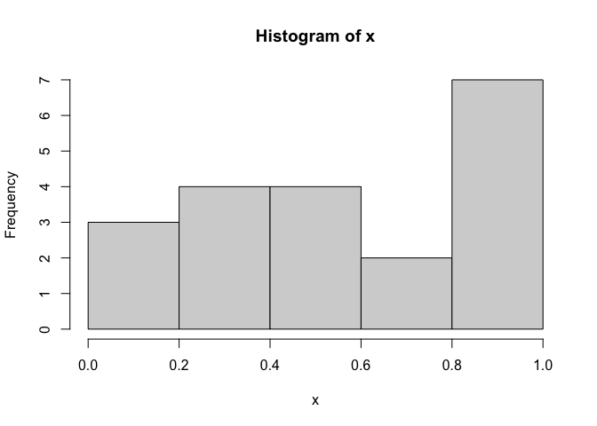

R语言基础学习（第一阶段）——初识R语言
================

- <a href="#1-r语言介绍" id="toc-1-r语言介绍">1 R语言介绍</a>
  - <a href="#11-r的使用" id="toc-11-r的使用">1.1 R的使用</a>
    - <a href="#111-工作空间" id="toc-111-工作空间">1.1.1 工作空间</a>
  - <a href="#12-包" id="toc-12-包">1.2 包</a>
    - <a href="#121-什么是包" id="toc-121-什么是包">1.2.1 什么是包</a>
    - <a href="#122-包的安装" id="toc-122-包的安装">1.2.2 包的安装</a>
    - <a href="#123-包的载入" id="toc-123-包的载入">1.2.3 包的载入</a>
    - <a href="#124-获取帮助" id="toc-124-获取帮助">1.2.4 获取帮助</a>
- <a href="#2-创建数据集" id="toc-2-创建数据集">2 创建数据集</a>
  - <a href="#21-数据集的概念" id="toc-21-数据集的概念">2.1 数据集的概念</a>
  - <a href="#22-数据结构" id="toc-22-数据结构">2.2 数据结构</a>
    - <a href="#221-向量" id="toc-221-向量">2.2.1 向量</a>
    - <a href="#222-矩阵" id="toc-222-矩阵">2.2.2 矩阵</a>
    - <a href="#223-数组" id="toc-223-数组">2.2.3 数组</a>
    - <a href="#224-数据框" id="toc-224-数据框">2.2.4 数据框</a>
    - <a href="#225-因子" id="toc-225-因子">2.2.5 因子</a>
    - <a href="#226-列表" id="toc-226-列表">2.2.6 列表</a>
  - <a href="#23-数据的输入" id="toc-23-数据的输入">2.3 数据的输入</a>
    - <a href="#231-导入带分隔符的文本文件"
      id="toc-231-导入带分隔符的文本文件">2.3.1 导入带分隔符的文本文件</a>
    - <a href="#232-导入spss文件" id="toc-232-导入spss文件">2.3.2
      导入SPSS文件</a>
  - <a href="#24-处理数据对象的实用函数"
    id="toc-24-处理数据对象的实用函数">2.4 处理数据对象的实用函数</a>
- <a href="#3-基本数据管理" id="toc-3-基本数据管理">3 基本数据管理</a>
  - <a href="#31-创建新变量" id="toc-31-创建新变量">3.1 创建新变量</a>
  - <a href="#32-变量的重编码" id="toc-32-变量的重编码">3.2 变量的重编码</a>
  - <a href="#33-变量的重命名" id="toc-33-变量的重命名">3.3 变量的重命名</a>
  - <a href="#34-缺失值" id="toc-34-缺失值">3.4 缺失值</a>
  - <a href="#35-日期值" id="toc-35-日期值">3.5 日期值</a>
  - <a href="#36-类型转换" id="toc-36-类型转换">3.6 类型转换</a>
  - <a href="#37-数据排序" id="toc-37-数据排序">3.7 数据排序</a>
  - <a href="#38-数据集的合并" id="toc-38-数据集的合并">3.8 数据集的合并</a>
    - <a href="#381-向数据框添加列" id="toc-381-向数据框添加列">3.8.1
      向数据框添加列</a>
    - <a href="#382-向数据框添加行" id="toc-382-向数据框添加行">3.8.2
      向数据框添加行</a>
  - <a href="#39-数据集取子集" id="toc-39-数据集取子集">3.9 数据集取子集</a>
    - <a href="#391-选入保留变量" id="toc-391-选入保留变量">3.9.1
      选入(保留)变量</a>
    - <a href="#392-剔除丢弃变量" id="toc-392-剔除丢弃变量">3.9.2
      剔除(丢弃)变量</a>
    - <a href="#393-选入观测" id="toc-393-选入观测">3.9.3 选入观测</a>
    - <a href="#394-subset-函数" id="toc-394-subset-函数">3.9.4 subset(
      )函数</a>
    - <a href="#395-随机抽样" id="toc-395-随机抽样">3.9.5 随机抽样</a>

Source：

1.  《R语言实战（中文第二版）》

2.  [【B站】从零开始学 R
    语言，带你玩转医学统计学](https://www.bilibili.com/video/BV1JU4y1f7zg/?spm_id_from=333.1007.top_right_bar_window_custom_collection.content.click&vd_source=fa22bae99c47db3f7bc43573bd9b3ed3)

# 1 R语言介绍

## 1.1 R的使用

- R语句由函数和赋值构成。R使用\<-（快捷键：alt +
  -），而不是传统的=作为赋值符号。例如，以下语句：

<!-- -->

    # 创建一个名为X的向量对象，它包含5个来自标准正态分布的随机偏差。
    x <- rnorm(5)

### 1.1.1 工作空间

- 当前的工作目录(working
  directory)是R用来读取文件和保存结果的默认目录。我们可以使用函数getwd(
  )来查看当前的工作目录，或使用函数setwd(
  )设定当前的工作目录。如果需要读入一个不在当前工作目录下的文件，则需在调用语句中写明完整的路径。
  记得使用引号闭合这些目录名和文件名。

- 用于管理工作空间的部分标准命令如下：

``` r
> # 显示当前的工作目录
> getwd()
[1] "/Users/liang.hanqing/Documents/Git-local/Github_Bioinformatics_Learning/R/Phase1_R_Basic_Learning"
> # 列出当前工作空间中的对象
> ls()
character(0)
```

    # 移除(删除)一个或多个对象
    rm(objectlist)
    # 显示可用选项的说明
    help(options)
    # 显示或设置当前选项
    options()

``` r
> # 创建了一个包含20个均匀分布随机变量的向量，生成了此数据的摘要统计量和直方图。
> options(digits=3) # 数字将被格式化,显示为具有小数点后三位有效数字的格式
> x <- runif(20) # 创建了一个包含20个均匀分布随机变量的向量
> summary(x) # 生成了此数据的摘要统计量
   Min. 1st Qu.  Median    Mean 3rd Qu.    Max. 
  0.035   0.334   0.542   0.544   0.820   0.998 
> hist(x) # 生成了此数据的直方图
```

<!-- -->

## 1.2 包

### 1.2.1 什么是包

- 包是R函数、数据、预编译代码以一种定义完善的格式组成的集合。计算机上存储包的目录称为库(library)。函数.libPaths(
  )能够显示库所在的位置，函数library( )则可以显示库中有哪些包。

### 1.2.2 包的安装

- 第一次安装一个包，使用命令`install.packages('packages_name')`即可。
- 使用命令`update.packages()`可以更新已经安装的包。
- 要查看已安装包的描述，可以使用`installed.packages()`命令，这将列出安装的包，以及它们的版本号、依赖关系等信息。

### 1.2.3 包的载入

- 要在R会话中使用它，还需要使用`library()`命令载入这个包。例如，要使用gclus包，执行命令`library(gclus)`即可。当然，在载入一个包之前必须已经安装了这个包。在一个会话中，包只需载入一次。

### 1.2.4 获取帮助

    ?foo 或 help('foo') # 查看函数 foo 的帮助
    ??foo 或 help.search('foo') # 以 foo 为关键词搜索本地帮助文档
    example('foo') # 函数 foo 的使用示例
    RSiteSearch('foo') # 以 foo 为关键词搜索在线文档和邮件列表存档
    apropos('foo',mode = 'function') # 列出名称中含有 foo 的所有可用函数
    data() # 列出当前已加载包中所含的所有可用示例数据集
    vignette() # 列出当前已安装包中所有可用的 vignette 文档
    vignette('foo') # 为主题 foo 显示指定的 vignette 文档

# 2 创建数据集

## 2.1 数据集的概念

- 数据集通常是由数据构成的一个矩形数组，**行表示观测(observation)，列表示变量(variable)
  。**

## 2.2 数据结构

- R拥有许多用于存储数据的对象类型，包括标量、向量、矩阵、数组、数据框和列表。
- 在R中，对象(object)是指可以赋值给变量的任何事物，包括常量、数据结构、函数，甚至图形。
- 因子(factor)是名义型变量或有序型变量。它们在R中被特殊地存储和处理。

### 2.2.1 向量

- 向量是用于存储数值型、字符型或逻辑型数据的一维数组。执行组合功能的函数c(
  )可用来创建向量。

``` r
> a <- c(1, 2, 5, 3, 6, -2, 4)  # a是数值型向量
> b <- c("one", "two", "three")  # b是字符型向量
> c <- c(TRUE, TRUE, TRUE, FALSE, TRUE, FALSE) # c是逻辑型向量
```

- **注意：单个向量中的数据必须拥有相同的类型或模式(数值型、字符型或逻辑型)。同一向量中无法混杂不同模式的数据。**
- **注意：标量是只含一个元素的向量，例如f \<- 3、g \<- “US”和h \<-
  TRUE。它们用于保存常量。**
- 索引：通过在方括号中给定元素所处位置的数值，可以访问向量中的元素。

``` r
> a <- c("k", "j", "h", "a", "c", "m") 
> a[3]
[1] "h"
```

``` r
> a[c(1, 3, 5)]
[1] "k" "h" "c"
```

``` r
> a[2:6]
[1] "j" "h" "a" "c" "m"
```

### 2.2.2 矩阵

- 矩阵是一个二维数组，只是每个元素都拥有相同的模式(数值型、字符型或逻辑型)
  。可通过函数matrix()创建矩阵。一般使用格式为：

<!-- -->

    my_matrix <- matrix(vector, nrow=number_of_rows, ncol=number_of_columns,
                         byrow=logical_value, dimnames=list(
                             char_vector_rownames, char_vector_colnames))

- 其中vector包含了矩阵的元素，nrow和ncol用以指定行和列的维数，dimnames包含了可选的、以字符型向量表示的行名和列名。选项byrow则表明矩阵应当按行填充(byrow=TRUE)还是按列填充(byrow=FALSE)，**默认情况下按列填充**。注意：这些元素的名字不可更改。

``` r
> # 创建一个5*4的矩阵
> y <- matrix(1:20, nrow=5, ncol=4)
> y
     [,1] [,2] [,3] [,4]
[1,]    1    6   11   16
[2,]    2    7   12   17
[3,]    3    8   13   18
[4,]    4    9   14   19
[5,]    5   10   15   20
```

``` r
> # 创建了一个2×2的含列名标签的矩阵并按 行 进行填充
> cells <- c(1,26,24,68)
> row_names <- c("R1", "R2")
> col_names <- c("C1", "C2")
> my_matrix_1 <- matrix(cells, nrow=2, ncol=2, byrow=TRUE, 
+                       dimnames=list(row_names, col_names))
> my_matrix_1
   C1 C2
R1  1 26
R2 24 68
```

``` r
> # 创建了一个2×2的矩阵并按 列 进行了填充
> my_matrix_2 <- matrix(cells, nrow=2, ncol=2, byrow=FALSE, 
+                       dimnames=list(row_names, col_names))
> my_matrix_2
   C1 C2
R1  1 24
R2 26 68
```

- 可以使用下标和`[方括号]`来选择矩阵中的行、列或元素。`X[i,]`指矩阵X中的第i行，`X[,j]`指第j列，`X[i, j]`指第i行第j个元素。选择多行或多列时，下标i和j可为数值型向量。

``` r
> x <- matrix(1:10, nrow=2)
> x
     [,1] [,2] [,3] [,4] [,5]
[1,]    1    3    5    7    9
[2,]    2    4    6    8   10
```

``` r
> x[2,]
[1]  2  4  6  8 10
```

``` r
> x[,2]
[1] 3 4
```

``` r
> x[1,4]
[1] 7
```

``` r
> x[1,c(4,5)]
[1] 7 9
```

### 2.2.3 数组

- 数组(array)与矩阵类似，但是维度可以大于2。数组可通过array函数创建，形式如下:

<!-- -->

    my_array <- array(vector, dimensions, dimnames)

- 其中vector包含了数组中的数据，dimensions是一个数值型向量，给出了各个维度下标的最大值，而dimnames是可选的、各维度名称标签的列表。

``` r
> # 创建一个数组
> dim1 <- c("A1", "A2")
> dim2 <- c("B1", "B2", "B3")
> dim3 <- c("C1", "C2", "C3", "C4")
> z <- array(1:24, c(2, 3, 4), dimnames=list(dim1, dim2, dim3))
> z
, , C1

   B1 B2 B3
A1  1  3  5
A2  2  4  6

, , C2

   B1 B2 B3
A1  7  9 11
A2  8 10 12

, , C3

   B1 B2 B3
A1 13 15 17
A2 14 16 18

, , C4

   B1 B2 B3
A1 19 21 23
A2 20 22 24
```

``` r
> z[1,2,3] # 表示在C3的第一行第二列
[1] 15
```

### 2.2.4 数据框

- 由于不同的列可以包含不同模式(数值型、字符型等)的数据，数据框的概念较矩阵来说更为一般，与通常在SAS、SPSS和Stata中的数据集类似。**数据框是R中最常处理的数据结构**。

- 数据框可通过函数`data.frame()`创建：

<!-- -->

    my_data <- data.frame(col1, col2, col3,...)

- 其中的列向量col1、col2、col3等可为任何类型(如字符型、数值型或逻辑型)
  。每一列的名称可由函数names指定。

``` r
> patientID <- c(1, 2, 3, 4)
> age <- c(25, 34, 28, 52)
> diabetes <- c("Type1", "Type2", "Type1", "Type1")
> status <- c("Poor", "Improved", "Excellent", "Poor")
> patientdata <- data.frame(patientID, age, diabetes, status)
> patientdata
  patientID age diabetes    status
1         1  25    Type1      Poor
2         2  34    Type2  Improved
3         3  28    Type1 Excellent
4         4  52    Type1      Poor
```

- 选取数据框中元素的方式有若干种。可以使用前述(如矩阵中的)下标记号，亦可直接指定列名。

``` r
> patientdata[1:2]
  patientID age
1         1  25
2         2  34
3         3  28
4         4  52
```

``` r
> patientdata[c("diabetes", "status")]
  diabetes    status
1    Type1      Poor
2    Type2  Improved
3    Type1 Excellent
4    Type1      Poor
```

``` r
> patientdata$age # 表示patientdata数据框中的变量age
[1] 25 34 28 52
```

- 如果想生成糖尿病类型变量diabetes和病情变量status的列联表，使用以下代码即可：

``` r
> table(patientdata$diabetes, patientdata$status)
       
        Excellent Improved Poor
  Type1         1        0    2
  Type2         0        1    0
```

- 可以联合使用函数attach( )和detach( )或**单独使用函数with(
  )来简化代码**。

- 实例标识符

  - 在病例数据中，病人编号(patientID)用于区分数据集中不同的个体。在R中，实例标识符(case
    identifier)可通过数据框操作函数中的rowname选项指定。例如，语句：

<!-- -->

    patientdata <- data.frame(patientID, age, diabetes,                           
                              status, row.names=patientID)

- 将patientID指定为R中标记各类打印输出和图形中实例名称所用的变量。

### 2.2.5 因子

- 变量可归结为名义型、有序型或连续型变量。

  - **名义型变量是没有顺序之分的类别变量**。糖尿病类型Diabetes(Type1、Type2)是名义型变量的一例。即使在数据中Type1编码为1而Type2编码为2，这也并不意味着二者是有序的。
  - **有序型变量表示一种顺序关系，而非数量关系**。病情Status(poor、improved、excellent)是顺序型变量的一个上佳示例。我们明白，病情为poor(较差)病人的状态不如improved(病情好转)的病人，但并不知道相差多少。
  - **连续型变量可以呈现为某个范围内的任意值，并同时表示了顺序和数量**。年龄Age就是一个连续型变量，它能够表示像14.5或22.8这样的值以及其间的其他任意值。很清楚，15岁的人比14岁的人年长一岁。

- 类别(名义型)变量和有序类别(有序型)变量在R中称为因子(factor)。因子在R中非常重要，因为它决定了数据的分析方式以及如何进行视觉呈现。

- 函数factor(
  )以一个整数向量的形式存储类别值，整数的取值范围是`[1...k]`(其中k是名义型变量中唯一值的个数)，同时一个由字符串(原始值)组成的内部向量将映射到这些整数上。举例来说，假设有向量：

<!-- -->

    diabetes <- c("Type1", "Type2", "Type1", "Type1")

- 语句`diabetes <- factor(diabetes)`将此向量存储为(1, 2, 1,
  1)，并在内部将其关联为1=Type1和2=Type2(具体赋值根据字母顺序而定)。针对向量diabetes进行的任何分析都会将其作为名义型变量对待，并自动选择适合这一测量尺度1的统计方法。
  要表示有序型变量，需要为函数`factor()`指定参数ordered=TRUE。给定向量：

<!-- -->

    status <- c("Poor", "Improved", "Excellent", "Poor")

- 语句`status <- factor(status, ordered=TRUE)`会将向量编码为(3, 2, 1,
  3)，并在内部将这些值关联为1=Excellent、2=Improved以及3=Poor。另外，针对此向量进行的任何分析都会将其作为有序型变量对待，并自动选择合适的统计方法。

- 对于字符型向量，因子的水平默认依字母顺序创建。这对于因子status是有意义的，因为”Excellent”、“Improved”、“Poor”的排序方式恰好与逻辑顺序相一致。如果”Poor”被编码为”Ailing”，会有问题，因为顺序将为”Ailing”、“Excellent”、“Improved”。如果理想中的顺序是”Poor”、“Improved”、“Excellent”，则会出现类似的问题。按默认的字母顺序排序的因子很少能够让人满意。可以通过指定levels选项来覆盖默认排序。例如:

<!-- -->

    status <- factor(status, order=TRUE,                  
                     levels=c("Poor", "Improved", "Excellent"))

- 各水平的赋值将为1=Poor、2=Improved、3=Excellent。请保证指定的水平与数据中的真实值相匹配，因为任何在数据中出现而未在参数中列举的数据都将被设为缺失值。

- 数值型变量可以用levels和labels参数来编码成因子。如果男性被编码成1，女性被编码成2，则以下语句：

<!-- -->

    sex <- factor(sex, levels=c(1, 2), labels=c("Male", "Female"))

- 把变量转换成一个无序因子。注意到标签的顺序必须和水平相一致。在这个例子中，性别将被当成类别型变量，标签”Male”和”Female”将替代1和2在结果中输出，而且所有不是1或2的性别变量将被设为缺失值。

- 案例：因子的使用

``` r
> patientID <- c(1, 2, 3, 4)
> age <- c(25, 34, 28, 52)
> diabetes <- c("Type1", "Type2", "Type1", "Type1") # 普通因子
> status <- c("Poor", "Improved", "Excellent", "Poor") # 有序因子
> # 以上为以向量形式输入数据
> diabetes <- factor(diabetes)
> status <- factor(status, order=TRUE)
> patientdata <- data.frame(patientID, age, diabetes, status)
> str(patientdata) # 显示对象的结构
'data.frame':   4 obs. of  4 variables:
 $ patientID: num  1 2 3 4
 $ age      : num  25 34 28 52
 $ diabetes : Factor w/ 2 levels "Type1","Type2": 1 2 1 1
 $ status   : Ord.factor w/ 3 levels "Excellent"<"Improved"<..: 3 2 1 3
```

``` r
> summary(patientdata) # 显示对象的统计概要
   patientID         age        diabetes       status 
 Min.   :1.00   Min.   :25.0   Type1:3   Excellent:1  
 1st Qu.:1.75   1st Qu.:27.2   Type2:1   Improved :1  
 Median :2.50   Median :31.0             Poor     :2  
 Mean   :2.50   Mean   :34.8                          
 3rd Qu.:3.25   3rd Qu.:38.5                          
 Max.   :4.00   Max.   :52.0                          
```

### 2.2.6 列表

- **列表(list)是R的数据类型中最为复杂的一种**。一般来说，列表就是一些对象(或成分，component)的有序集合。列表允许你整合若干(可能无关的)对象到单个对象名下。例如，某个列表中可能是若干向量、矩阵、数据框，甚至其他列表的组合。可以使用函数list(
  )创建列表：

<!-- -->

    my_list <- list(object1, object2, ...)

- 其中的对象可以是目前为止讲到的任何结构。你还可以为列表中的对象命名：

<!-- -->

    my_list <- list(name1=object1, name2=object2, ...)

- 案例：创建一个列表

``` r
> g <- "My First List"
> h <- c(25, 26, 18, 39)
> j <- matrix(1:10, nrow=5)
> k <- c("one", "two", "three")
> my_list <- list(title=g, ages=h, j, k)  # 创建列表
> my_list   # 输出整个列表
$title
[1] "My First List"

$ages
[1] 25 26 18 39

[[3]]
     [,1] [,2]
[1,]    1    6
[2,]    2    7
[3,]    3    8
[4,]    4    9
[5,]    5   10

[[4]]
[1] "one"   "two"   "three"
```

``` r
> # 输出第二个成分
> my_list[[2]]
[1] 25 26 18 39
```

## 2.3 数据的输入

- **如需直接处理Excel数据文件，建议使用rstudio导入。**

### 2.3.1 导入带分隔符的文本文件

- 你可以使用`read.table()`从带分隔符的文本文件中导入数据。此函数可读入一个表格格式的文件并将其保存为一个数据框。表格的每一行分别出现在文件中每一行。其语法如下：

<!-- -->

    my_dataframe <- read.table(file, options)

- 其中，file是一个带分隔符的ASCII文本文件，options是控制如何处理数据的选项，具体选项包括：

<!-- -->

    header # 一个表示文件是否在第一行包含了变量名的逻辑型变量
    sep # 分开数据值的分隔符。默认是 sep="",这表示了一个或多个空格、制表符、换行或回车。使用 sep=","来读取用逗号来分隔行内数据的文件,使用 sep="\t"来读取使用制表符来分割行内数据的文件
    row.names # 一个用于指定一个或多个行标记符的可选参数
    col.names # 如果数据文件的第一行不包括变量名 (header=FASLE) , 你可以用 col.names 去指定一个包含变量名的字符向量。 如果 header=FALSE 以及 col.names 选项被省略了, 变量会被分别命名为 V1、V2,以此类推
    na.strings # 可选的用于表示缺失值的字符向量。比如说,na.strings=c("-9", "?")把-9 和?值在读取数据的时候转换成 NA
    colClasses # 可选的分配到每一列的类向量。 比如说, colClasses=c("numeric", "numeric", "character", "NULL", "numeric")把前两列读取为数值型变量,把第三列读取为字符型向量,跳过第四列,把第五列读取为数值型向量。如果数据有多余五列,colClasses 的值会被循环。当你在读取大型文本文件的时候,加上 colClasses 选项可以可观地提升处理的速度
    quote # 用于对有特殊字符的字符串划定界限的自负床。默认值是双引号(")或单引号(')
    skip # 读取数据前跳过的行的数目。这个选项在跳过头注释的时候比较有用
    stringsAsFactors # 一个逻辑变量, 标记处字符向量是否需要转化成因子。 默认值是 TRUE, 除非它被 colClases 所覆盖。当你在处理大型文本文件的时候,设置成 stringsAsFactors=FALSE 可以提升处理速度
    text # 一个指定文字进行处理的字符串。如果 text 被设置了,file 应该被留空。

- 案例：读取studentgrades.csv的文本文件，它包含了学生在数学、科学、和社会学习的分数。

``` r
> grades <- read.table("studentgrades.csv", header=TRUE,     
+                      row.names="StudentID", sep=",")
> grades # print data frame
   First          Last Math Science Social.Studies
11   Bob         Smith   90      80             67
12  Jane         Weary   75      NA             80
10   Dan Thornton, III   65      75             70
40  Mary     "O'Leary"   90      95             92
```

``` r
> str(grades) # view data frame structure
'data.frame':   4 obs. of  5 variables:
 $ First         : chr  "Bob" "Jane" "Dan" "Mary"
 $ Last          : chr  "Smith" "Weary" "Thornton, III" "\"O'Leary\""
 $ Math          : int  90 75 65 90
 $ Science       : int  80 NA 75 95
 $ Social.Studies: int  67 80 70 92
```

### 2.3.2 导入SPSS文件

``` r
> library(foreign)
> my_data <- read.spss('pancerdata.sav')
> head(my_data)
$caseno
 [1]  1  2  3  4  5  6  7  9 10 11 12 14 15 16 17 18 19 20 21 22 23 24 25 26 28
[26] 30 33 35 36 37 38 39 40 41 42 43 44 45 46 47 48 49 50 51 53 54 55 56 58 62
[51] 63 64 65 66 67 68 69 70 71 72 73 74 75 76 77 78 79 80 81 83 84 85 86 87 88
[76] 89 90 91 92 93 94 95 96

$time
 [1]  2.4  1.7  0.1  1.0  4.8  6.4 10.8  5.1  1.1  0.5  0.8  4.0  4.0  4.0  8.5
[16]  3.6  6.9  6.2  1.0  6.2  4.3  3.1  8.3 12.7  4.9  2.7 10.6 18.2  1.4  5.8
[31]  3.0  1.5  2.4  2.0  1.1  2.5  5.4  4.4  4.8  3.1  5.6  3.1  1.3 11.5  3.8
[46]  2.9  2.2  1.7  3.5 11.3  9.0 12.5  6.8 10.8  3.0  1.8  5.0  8.0  6.8 11.1
[61]  9.4  3.9  2.1  4.3  9.3  8.8  2.4 21.6  5.6 11.4 18.3  9.2  4.5  8.2 15.0
[76]  6.9  3.5  2.1  3.1  3.2  1.9  2.1  7.0

$censor
 [1] 死亡 死亡 死亡 死亡 死亡 死亡 死亡 死亡 死亡 死亡 死亡 死亡 死亡 死亡 死亡
[16] 死亡 死亡 死亡 死亡 死亡 死亡 死亡 死亡 死亡 死亡 死亡 死亡 死亡 死亡 死亡
[31] 死亡 死亡 死亡 死亡 死亡 死亡 死亡 死亡 死亡 死亡 死亡 死亡 死亡 死亡 死亡
[46] 死亡 死亡 死亡 死亡 死亡 死亡 死亡 死亡 死亡 死亡 死亡 死亡 死亡 死亡 删失
[61] 死亡 死亡 死亡 死亡 死亡 死亡 死亡 死亡 死亡 死亡 死亡 死亡 死亡 死亡 死亡
[76] 死亡 死亡 死亡 死亡 死亡 死亡 死亡 死亡
Levels: 死亡 删失

$age
 [1] 66 69 48 73 65 38 62 59 53 70 71 61 69 41 49 56 59 53 72 57 49 74 43 60 55
[26] 70 63 69 66 58 67 74 77 70 75 65 71 50 56 68 65 65 43 83 65 63 47 75 63 54
[51] 56 50 62 53 63 59 66 62 72 54 68 63 68 48 68 75 49 62 56 56 59 59 48 64 60
[76] 75 46 53 62 47 62 55 80

$sex
 [1] 男 男 男 男 男 男 女 女 男 男 男 女 男 女 男 男 女 男 女 女 男 男 女 女 女
[26] 男 男 女 女 女 女 男 女 女 男 女 女 男 男 女 女 男 女 男 男 男 女 女 女 男
[51] 女 男 男 女 男 男 女 男 男 男 女 女 女 女 男 女 男 男 女 男 女 男 男 男 男
[76] 男 男 女 男 男 男 男 男
Levels: 男 女

$trt
 [1] 无术中放疗 无术中放疗 无术中放疗 无术中放疗 无术中放疗 无术中放疗
 [7] 无术中放疗 无术中放疗 无术中放疗 无术中放疗 无术中放疗 无术中放疗
[13] 无术中放疗 无术中放疗 无术中放疗 无术中放疗 无术中放疗 无术中放疗
[19] 无术中放疗 无术中放疗 无术中放疗 无术中放疗 有术中放疗 有术中放疗
[25] 有术中放疗 有术中放疗 有术中放疗 有术中放疗 有术中放疗 有术中放疗
[31] 有术中放疗 有术中放疗 有术中放疗 有术中放疗 有术中放疗 有术中放疗
[37] 有术中放疗 有术中放疗 有术中放疗 有术中放疗 有术中放疗 有术中放疗
[43] 有术中放疗 有术中放疗 有术中放疗 有术中放疗 有术中放疗 有术中放疗
[49] 有术中放疗 有术中放疗 有术中放疗 有术中放疗 有术中放疗 有术中放疗
[55] 有术中放疗 有术中放疗 有术中放疗 有术中放疗 有术中放疗 有术中放疗
[61] 有术中放疗 有术中放疗 有术中放疗 有术中放疗 有术中放疗 有术中放疗
[67] 有术中放疗 有术中放疗 有术中放疗 有术中放疗 有术中放疗 有术中放疗
[73] 有术中放疗 有术中放疗 有术中放疗 有术中放疗 有术中放疗 有术中放疗
[79] 有术中放疗 有术中放疗 有术中放疗 有术中放疗 有术中放疗
Levels: 无术中放疗 有术中放疗
```

## 2.4 处理数据对象的实用函数

    length(object) # 显示对象中元素/成分的数量 
    dim(object) # 显示某个对象的维度 
    str(object) # 显示某个对象的结构 
    class(object) # 显示某个对象的类或类型 
    mode(object) # 显示某个对象的模式 
    names(object) # 显示某对象中各成分的名称 
    c(object, object,...) # 将对象合并入一个向量 
    cbind(object, object, ...) # 按列合并对象 
    rbind(object, object, ...) # 按行合并对象 
    object # 输出某个对象 
    head(object) # 列出某个对象的开始部分 
    tail(object) # 列出某个对象的最后部分 
    ls() # 显示当前的对象列表
    rm(object, object, ...) # 删除一个或更多个对象。语句 rm(list = ls())将删除当前工作环境中的几乎所有对象
    newobject <- edit(object) # 编辑对象并另存为newobject 
    fix(object) # 直接编辑对象

# 3 基本数据管理

## 3.1 创建新变量

- 运算符

<!-- -->

    + # 加
    - # 减
    * # 乘
    / # 除
    ^或** # 求幂 
    x%%y # 求余数。例如，5%%2的余数为1（5/2结果为2余1）
    x%/%y # 整数除法。5%/%2的结果为2（5/2结果为2余1） 

- 案例：

``` r
> my_data <- data.frame(x1 = c(2, 2, 6, 4),                    
+                       x2 = c(3, 4, 2, 8))
> my_data <- transform(my_data,
+                     sumx=x1+x2,
+                     neanx=(x1+x2)/2)
> my_data
  x1 x2 sumx neanx
1  2  3    5   2.5
2  2  4    6   3.0
3  6  2    8   4.0
4  4  8   12   6.0
```

## 3.2 变量的重编码

- 重编码涉及根据同一个变量和/或其他变量的现有值创建新值的过程。

- 要重编码数据,可以使用R中的一个或多个逻辑运算符。逻辑运算符表达式可返回TRUE或FALSE。

- 逻辑运算符

<!-- -->

    < # 小于 
    <= # 小于或等于 
    > # 大于 
    >= # 大于或等于 
    == # 严格等于 
    != # 不等于 
    !x # 非x 
    x | y # x或y 
    x & y # x和y 
    isTRUE(x) # 测试x是否为TRUE

``` r
> # 创建leadership数据框
> manager <- c(1, 2, 3, 4, 5) 
> date <- c("10/24/08", "10/28/08", "10/1/08", "10/12/08", "5/1/09") 
> country <- c("US", "US", "UK", "UK", "UK") 
> gender <- c("M", "F", "F", "M", "F") 
> age <- c(32, 45, 25, 39, 99) 
> q1 <- c(5, 3, 3, 3, 2) 
> q2 <- c(4, 5, 5, 3, 2) 
> q3 <- c(5, 2, 5, 4, 1) 
> q4 <- c(5, 5, 5, NA, 2) 
> q5 <- c(5, 5, 2, NA, 1) 
> leadership <- data.frame(manager, date, country, gender, age,                          
+                          q1, q2, q3, q4, q5, stringsAsFactors=FALSE)
> leadership
  manager     date country gender age q1 q2 q3 q4 q5
1       1 10/24/08      US      M  32  5  4  5  5  5
2       2 10/28/08      US      F  45  3  5  2  5  5
3       3  10/1/08      UK      F  25  3  5  5  5  2
4       4 10/12/08      UK      M  39  3  3  4 NA NA
5       5   5/1/09      UK      F  99  2  2  1  2  1
```

- 假设希望将leadership数据集中经理人的连续型年龄变量age重编码为类别型变量agecat(Young、
  Middle Aged、Elder)。创建agecat变量：

``` r
> leadership <- within(leadership,{                      
+     agecat <- NA                       
+     agecat[age > 75]              <- "Elder"                      
+     agecat[age >= 55 & age <= 75] <- "Middle Aged"                      
+     agecat[age < 55]              <- "Young" })
> leadership
  manager     date country gender age q1 q2 q3 q4 q5 agecat
1       1 10/24/08      US      M  32  5  4  5  5  5  Young
2       2 10/28/08      US      F  45  3  5  2  5  5  Young
3       3  10/1/08      UK      F  25  3  5  5  5  2  Young
4       4 10/12/08      UK      M  39  3  3  4 NA NA  Young
5       5   5/1/09      UK      F  99  2  2  1  2  1  Elder
```

## 3.3 变量的重命名

- 假设你希望将变量名manager修改为managerID，并将date修改为testDate，那么可以使用语句：

<!-- -->

    fix(leadership)

- 若以编程方式，可以通过`names()`函数来重命名变量。例如：

``` r
> names(leadership)[2] <- "testDate"
> names(leadership)[6:10] <- c("item1", "item2", "item3", "item4", "item5")
> leadership
  manager testDate country gender age item1 item2 item3 item4 item5 agecat
1       1 10/24/08      US      M  32     5     4     5     5     5  Young
2       2 10/28/08      US      F  45     3     5     2     5     5  Young
3       3  10/1/08      UK      F  25     3     5     5     5     2  Young
4       4 10/12/08      UK      M  39     3     3     4    NA    NA  Young
5       5   5/1/09      UK      F  99     2     2     1     2     1  Elder
```

- plyr包中有一个`rename()`函数，可用于修改变量名。这个函数默认并没有被安装，所以你首先要使用命令`install.packages("plyr")`对之进行安装。

- `rename()`函数的使用格式为：

<!-- -->

    rename(dataframe, c(oldname="newname", oldname="newname",...))

- 示例：

``` r
> library(plyr) 
> leadership <- rename(leadership,                       
+                     c(manager="managerID", testDate="date"))
> leadership
  managerID     date country gender age item1 item2 item3 item4 item5 agecat
1         1 10/24/08      US      M  32     5     4     5     5     5  Young
2         2 10/28/08      US      F  45     3     5     2     5     5  Young
3         3  10/1/08      UK      F  25     3     5     5     5     2  Young
4         4 10/12/08      UK      M  39     3     3     4    NA    NA  Young
5         5   5/1/09      UK      F  99     2     2     1     2     1  Elder
```

## 3.4 缺失值

- 在R中，缺失值以符号NA(Not
  Available，不可用)表示。R提供了一些函数，用于识别包含缺失值的观测。函数`is.na()`允许检测缺失值是否存在。

``` r
> # 再次使用leadership数据框
> manager <- c(1, 2, 3, 4, 5) 
> date <- c("10/24/08", "10/28/08", "10/1/08", "10/12/08", "5/1/09") 
> country <- c("US", "US", "UK", "UK", "UK") 
> gender <- c("M", "F", "F", "M", "F") 
> age <- c(32, 45, 25, 39, 99) 
> q1 <- c(5, 3, 3, 3, 2) 
> q2 <- c(4, 5, 5, 3, 2) 
> q3 <- c(5, 2, 5, 4, 1) 
> q4 <- c(5, 5, 5, NA, 2) 
> q5 <- c(5, 5, 2, NA, 1) 
> leadership <- data.frame(manager, date, country, gender, age,                          
+                          q1, q2, q3, q4, q5, stringsAsFactors=FALSE)
> leadership
  manager     date country gender age q1 q2 q3 q4 q5
1       1 10/24/08      US      M  32  5  4  5  5  5
2       2 10/28/08      US      F  45  3  5  2  5  5
3       3  10/1/08      UK      F  25  3  5  5  5  2
4       4 10/12/08      UK      M  39  3  3  4 NA NA
5       5   5/1/09      UK      F  99  2  2  1  2  1
```

``` r
> is.na(leadership[,6:10])
        q1    q2    q3    q4    q5
[1,] FALSE FALSE FALSE FALSE FALSE
[2,] FALSE FALSE FALSE FALSE FALSE
[3,] FALSE FALSE FALSE FALSE FALSE
[4,] FALSE FALSE FALSE  TRUE  TRUE
[5,] FALSE FALSE FALSE FALSE FALSE
```

- 这里的`leadership[,6:10]`将数据框限定到第6列至第10列，接下来`is.na()`识别出了缺失值。

- 还可以使用赋值语句将某些值重编码为缺失值。在leadership示例中，缺失的年龄值被编码为99。在分析这一数据集之前，必须让R明白本例中的99表示缺失值(否则这些样本的平均年龄将会高得离谱)。可以通过重编码这个变量完成这项工作（**请确保所有的缺失数据已在分析之前被妥善地编码为缺失值，否则分析结果将失去意义。**）：

``` r
> # 任何等于99的年龄值都将被修改为NA
> leadership$age[leadership$age == 99] <- NA
> leadership
  manager     date country gender age q1 q2 q3 q4 q5
1       1 10/24/08      US      M  32  5  4  5  5  5
2       2 10/28/08      US      F  45  3  5  2  5  5
3       3  10/1/08      UK      F  25  3  5  5  5  2
4       4 10/12/08      UK      M  39  3  3  4 NA NA
5       5   5/1/09      UK      F  NA  2  2  1  2  1
```

- 确定了缺失值的位置以后，你需要在进一步分析数据之前以某种方式删除这些缺失值。多数的数值函数都拥有一个`na.rm=TRUE`选项，可以在计算之前移除缺失值并使用剩余值进行计算：

``` r
> x <- c(1, 2, NA, 3) 
> y <- sum(x, na.rm=TRUE)
> y
[1] 6
```

- 在使用函数处理不完整的数据时，请务必查阅它们的帮助文档(例如，help(sum))，检查这些函数是如何处理缺失数据的。

- 可以通过函数`na.omit()`移除所有含有缺失值的观测。`na.omit()`可以删除所有含有缺失数据的行。

``` r
> # 使用na.omit()删除不完整的观测
> newdata <- na.omit(leadership) 
> newdata
  manager     date country gender age q1 q2 q3 q4 q5
1       1 10/24/08      US      M  32  5  4  5  5  5
2       2 10/28/08      US      F  45  3  5  2  5  5
3       3  10/1/08      UK      F  25  3  5  5  5  2
```

## 3.5 日期值

- 日期值通常以字符串的形式输入到R中，然后转化为以数值形式存储的日期变量。函数`as.Date()`用于执行这种转化。其语法为`as.Date(x, "input_format")`，其中x是字符型数据，input_format则给出了用于读入日期的适当格式。

<!-- -->

    %d # 数字表示的日期(0~31) 01~31 
    %a # 缩写的星期名 Mon 
    %A # 非缩写星期名 Monday 
    %m # 月份(00~12) 00~12 
    %b # 缩写的月份 Jan 
    %B # 非缩写月份 January 
    %y # 两位数的年份 07 
    %Y # 四位数的年份 2007

- 有两个函数对于处理时间戳数据特别实用。`Sys.Date()`可以返回当天的日期，而`date()`则返回当前的日期和时间。

- 可以使用函数`format(x, format="output_format")`来输出指定格式的日期值，并且可以提取日期值中的某些部分，`format()`函数可接受一个参数(本例中是一个日期)并按某种格式输出结果：

``` r
> today <- Sys.Date() 
> format(today, format="%B %d %Y")
[1] "December 05 2022"
> format(today, format="%A")
[1] "Monday"
```

- R可以在日期值上执行算术运算。例如：

``` r
> startdate <- as.Date("2004-02-13") 
> enddate <- as.Date("2011-01-22")
> days <- enddate - startdate 
> days
Time difference of 2535 days
```

``` r
> today <- Sys.Date()
> dob <- as.Date("1956-10-12") 
> difftime(today, dob, units="weeks")
Time difference of 3451 weeks
```

## 3.6 类型转换

- R与其他统计编程语言有着类似的数据类型转换方式。举例来说，向一个数值型向量中添加一个字符串会将此向量中的所有元素转换为字符型。

- 判断类型：

<!-- -->

    is.numeric()
    is.character() 
    is.vector()
    is.matrix()
    is.data.frame() 
    is.factor()
    is.logical()

- 转换类型：

<!-- -->

    as.numeric()
    as.character()
    as.vector() 
    as.matrix() 
    as.data.frame() 
    as.factor() 
    as.logical()

- 名为`is.datatype()`这样的函数返回TRUE或FALSE,
  而`as.datatype()`这样的函数则将其参数转换为对应的类型。

- 案例：

``` r
> a <- c(1,2,3)  # a为数值型向量
> a
[1] 1 2 3
```

``` r
> is.numeric(a)
[1] TRUE
```

``` r
> is.vector(a)
[1] TRUE
```

``` r
> a <- as.character(a) # 将a转换为字符型向量
> a
[1] "1" "2" "3"
```

``` r
> is.numeric(a)
[1] FALSE
```

``` r
> is.vector(a)
[1] TRUE
```

``` r
> is.character(a)
[1] TRUE
```

## 3.7 数据排序

- 在R中，可以使用`order()`函数对一个数据框进行排序。默认的排序顺序是升序。在排序变量的前边加一个减号即可得到降序的排序结果。

``` r
> # 再次使用leadership数据框
> manager <- c(1, 2, 3, 4, 5) 
> date <- c("10/24/08", "10/28/08", "10/1/08", "10/12/08", "5/1/09") 
> country <- c("US", "US", "UK", "UK", "UK") 
> gender <- c("M", "F", "F", "M", "F") 
> age <- c(32, 45, 25, 39, 99) 
> q1 <- c(5, 3, 3, 3, 2) 
> q2 <- c(4, 5, 5, 3, 2) 
> q3 <- c(5, 2, 5, 4, 1) 
> q4 <- c(5, 5, 5, NA, 2) 
> q5 <- c(5, 5, 2, NA, 1) 
> leadership <- data.frame(manager, date, country, gender, age,                          
+                          q1, q2, q3, q4, q5, stringsAsFactors=FALSE)
> leadership
  manager     date country gender age q1 q2 q3 q4 q5
1       1 10/24/08      US      M  32  5  4  5  5  5
2       2 10/28/08      US      F  45  3  5  2  5  5
3       3  10/1/08      UK      F  25  3  5  5  5  2
4       4 10/12/08      UK      M  39  3  3  4 NA NA
5       5   5/1/09      UK      F  99  2  2  1  2  1
```

``` r
> # 创建了一个新的数据集,其中各行依经理人的年龄升序排序
> newdata <- leadership[order(leadership$age),]
> newdata
  manager     date country gender age q1 q2 q3 q4 q5
3       3  10/1/08      UK      F  25  3  5  5  5  2
1       1 10/24/08      US      M  32  5  4  5  5  5
4       4 10/12/08      UK      M  39  3  3  4 NA NA
2       2 10/28/08      US      F  45  3  5  2  5  5
5       5   5/1/09      UK      F  99  2  2  1  2  1
```

``` r
> # 将各行依女性到男性、同样性别中按年龄升序排序
> attach(leadership) 
> newdata <- leadership[order(gender, age),] 
> detach(leadership)
> newdata
  manager     date country gender age q1 q2 q3 q4 q5
3       3  10/1/08      UK      F  25  3  5  5  5  2
2       2 10/28/08      US      F  45  3  5  2  5  5
5       5   5/1/09      UK      F  99  2  2  1  2  1
1       1 10/24/08      US      M  32  5  4  5  5  5
4       4 10/12/08      UK      M  39  3  3  4 NA NA
```

``` r
> # 将各行依经理人的性别和年龄降序排序
> attach(leadership) 
> newdata <-leadership[order(gender, -age),] 
> detach(leadership)
> newdata
  manager     date country gender age q1 q2 q3 q4 q5
5       5   5/1/09      UK      F  99  2  2  1  2  1
2       2 10/28/08      US      F  45  3  5  2  5  5
3       3  10/1/08      UK      F  25  3  5  5  5  2
4       4 10/12/08      UK      M  39  3  3  4 NA NA
1       1 10/24/08      US      M  32  5  4  5  5  5
```

## 3.8 数据集的合并

- 如果数据分散在多个地方，你就需要在继续下一步之前将其合并。

### 3.8.1 向数据框添加列

- 要横向合并两个数据框(数据集)，请使用`merge()`函数。在多数情况下，两个数据框是通过一个或多个共有变量进行联结的(即一种内联结，inner
  join)。例如：

<!-- -->

    # 将dataframeA和dataframeB按照ID进行了合并
    total <- merge(dataframeA, dataframeB, by="ID")
    # 将两个数据框按照ID和Country进行了合并
    total <- merge(dataframeA, dataframeB, by=c("ID","Country"))

### 3.8.2 向数据框添加行

- 要纵向合并两个数据框(数据集)，请使用`rbind()`函数：

<!-- -->

    total <- rbind(dataframeA, dataframeB)

- 两个数据框必须拥有相同的变量，不过它们的顺序不必一定相同。如果dataframeA中拥有dataframeB中没有的变量，请在合并它们之前做以下某种处理：
  - 删除dataframeA中的多余变量。
  - 在dataframeB中创建追加的变量并将其值设为NA(缺失)。
- 纵向联结通常用于向数据框中添加观测。

## 3.9 数据集取子集

### 3.9.1 选入(保留)变量

- 从一个大数据集中选择有限数量的变量来创建一个新的数据集是常有的事。通过`dataframe[row indices, column indices]`这样的记号来访问选择变量。例如：

``` r
> newdata <- leadership[, c(6:10)]
> newdata
  q1 q2 q3 q4 q5
1  5  4  5  5  5
2  3  5  2  5  5
3  3  5  5  5  2
4  3  3  4 NA NA
5  2  2  1  2  1
```

- 案例：从leadership数据框中选择了变量q1、q2、q3、q4和q5，并将它们保存到了数据框newdata中。将行下标留空(,)表示默认选择所有行。

``` r
> # 实现了等价的变量选择。这里, (引号中的)变量名充当了列的下标,因此选择的列是相同的
> myvars <- c("q1", "q2", "q3", "q4", "q5")
> newdata <-leadership[myvars]
> newdata
  q1 q2 q3 q4 q5
1  5  4  5  5  5
2  3  5  2  5  5
3  3  5  5  5  2
4  3  3  4 NA NA
5  2  2  1  2  1
```

### 3.9.2 剔除(丢弃)变量

- 剔除变量的原因有很多。例如，如果某个变量中有很多缺失值，你可能就想在进一步分析之前将其丢弃。下面是一些剔除变量的方法。

``` r
> # 剔除变量q3和q4
> myvars <- names(leadership) %in% c("q3", "q4") 
> newdata <- leadership[!myvars] 
> newdata
  manager     date country gender age q1 q2 q5
1       1 10/24/08      US      M  32  5  4  5
2       2 10/28/08      US      F  45  3  5  5
3       3  10/1/08      UK      F  25  3  5  2
4       4 10/12/08      UK      M  39  3  3 NA
5       5   5/1/09      UK      F  99  2  2  1
```

### 3.9.3 选入观测

``` r
> # 选择第1行到第3行 (前三个观测）
> newdata <- leadership[1:3,]
> # 选择所有30岁以上的男性
> newdata <- leadership[leadership$gender=="M" &                               
+                       leadership$age > 30,]
> # 使用了attach()函数, 所以你就不必在变量名前加上数据框名称了
> attach(leadership)         
> newdata <- leadership[gender=='M' & age > 30,]          
> detach(leadership)
> newdata
  manager     date country gender age q1 q2 q3 q4 q5
1       1 10/24/08      US      M  32  5  4  5  5  5
4       4 10/12/08      UK      M  39  3  3  4 NA NA
```

### 3.9.4 subset( )函数

- 使用`subset()`函数大概是选择变量和观测最简单的方法了。

``` r
> # 选择所有age值大于等于35或age值小于24的行,保留了变量q1到q4
> newdata <- subset(leadership, age >= 35 | age < 24,                   
+                   select=c(q1, q2, q3, q4))
> newdata
  q1 q2 q3 q4
2  3  5  2  5
4  3  3  4 NA
5  2  2  1  2
```

``` r
> # 选择所有25岁以上的男性,并保留了变量gender到q4(gender、q4和其间所有列)
> newdata <- subset(leadership, gender=="M" & age > 25,                    
+                   select=gender:q4)
> newdata
  gender age q1 q2 q3 q4
1      M  32  5  4  5  5
4      M  39  3  3  4 NA
```

### 3.9.5 随机抽样

- `sample()`函数能够让你从数据集中(有放回或无放回地)抽取大小为n的一个随机样本。

``` r
> # 从leadership数据集中随机抽取一个大小为3的样本
> my_sample <- leadership[sample(1:nrow(leadership), 3, replace=FALSE),]
> my_sample
  manager     date country gender age q1 q2 q3 q4 q5
2       2 10/28/08      US      F  45  3  5  2  5  5
4       4 10/12/08      UK      M  39  3  3  4 NA NA
3       3  10/1/08      UK      F  25  3  5  5  5  2
```

- `sample()`函数中的**第一个参数是一个由要从中抽样的元素组成的向量。在这里，这个向量是1到数据框中观测的数量，第二个参数是要抽取的元素数量，第三个参数表示无放回抽样**。`sample()`函数会返回随机抽样得到的元素，之后即可用于选择数据框中的行。
