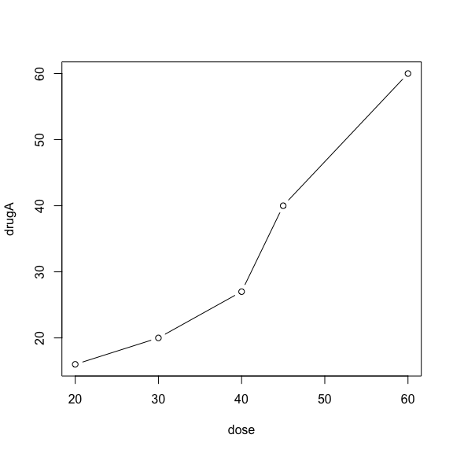
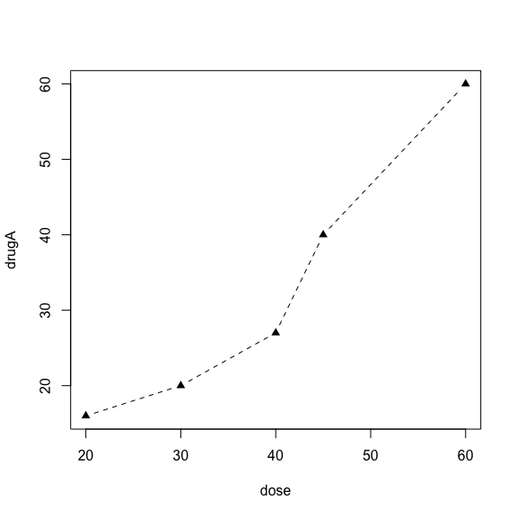
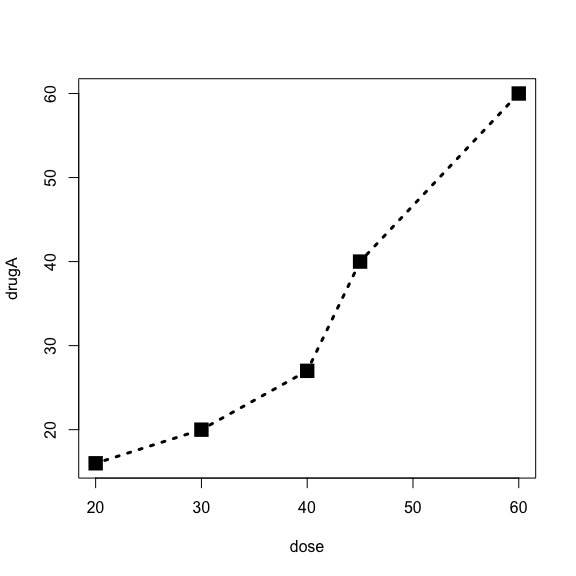
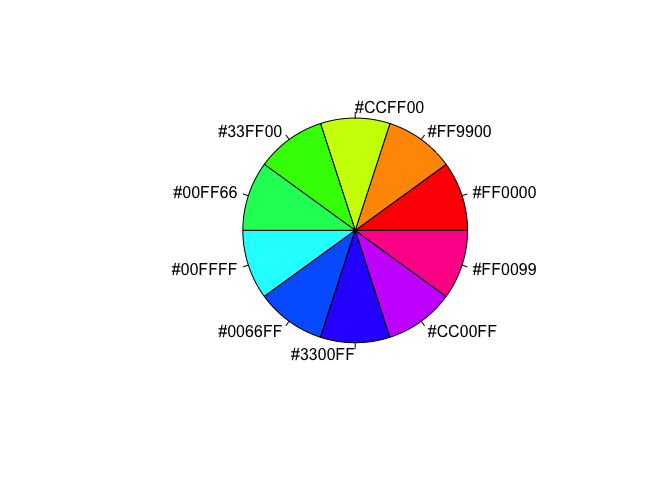
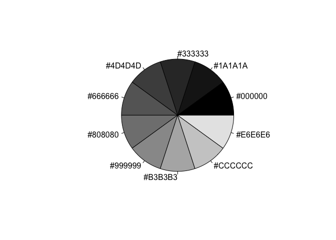

R语言基础学习（第一阶段）——初识R语言
================

- <a href="#4-图形初阶" id="toc-4-图形初阶">4 图形初阶</a>
  - <a href="#41-使用图形图片的输出" id="toc-41-使用图形图片的输出">4.1
    使用图形（图片的输出）</a>
  - <a href="#42-一个简单的例子" id="toc-42-一个简单的例子">4.2
    一个简单的例子</a>
  - <a href="#43-图形参数" id="toc-43-图形参数">4.3 图形参数</a>
    - <a href="#431-符号与线条" id="toc-431-符号与线条">4.3.1 符号与线条</a>
    - <a href="#432-颜色" id="toc-432-颜色">4.3.2 颜色</a>
    - <a href="#433-文本属性" id="toc-433-文本属性">4.3.3 文本属性</a>
    - <a href="#434-图形尺寸与边界尺寸" id="toc-434-图形尺寸与边界尺寸">4.3.4
      图形尺寸与边界尺寸</a>
  - <a href="#44-添加文本自定义坐标轴的图例"
    id="toc-44-添加文本自定义坐标轴的图例">4.4
    添加文本、自定义坐标轴的图例</a>
    - <a href="#441-标题" id="toc-441-标题">4.4.1 标题</a>
  - <a href="#图形的组合" id="toc-图形的组合">图形的组合</a>

Source：

1.  《R语言实战（中文第二版）》

2.  [【B站】从零开始学 R
    语言，带你玩转医学统计学](https://www.bilibili.com/video/BV1JU4y1f7zg/?spm_id_from=333.1007.top_right_bar_window_custom_collection.content.click&vd_source=fa22bae99c47db3f7bc43573bd9b3ed3)

# 4 图形初阶

## 4.1 使用图形（图片的输出）

- R是一个惊艳的图形构建平台，可以通过逐条输入语句构建图形，逐渐完善图形特征，直至得到想要的效果。例如：

``` r
> attach(mtcars)   # 首句绑定了数据框mtcars
> plot(wt, mpg)   # 第二条语句打开了一个图形窗口并生成了一幅散点图,横轴表示车身重量,纵轴为每加仑汽油行驶的英里数
> abline(lm(mpg~wt))  # 第三句向图形添加了一条最优拟合曲线
> title("Regression of MPG on Weight")   # 第四句添加了标题
```

<!-- -->

``` r
> detach(mtcars)  # 最后一句为数据框解除了绑定
```

- 可以通过代码或图形用户界面来保存图形。要通过代码保存图形,
  将绘图语句夹在开启目标图形设备的语句和关闭目标图形设备的语句之间即可。例如,
  以下代码会将图形保存到当前工作目录中名为mygraph.pdf的PDF文件中:

<!-- -->

    pdf("mygraph.pdf")  
    attach(mtcars)   
    plot(wt, mpg)  
    abline(lm(mpg~wt))  
    title("Regression of MPG on Weight")  
    detach(mtcars) 
    dev.off()

- 除了`pdf()`，还可以使用函数`win.metafile()`、`png()`、`jpeg()`、`bmp()`、`tiff()`、`xfig()`和`postscript()`将图形保存为其他格式。
  (注意，Windows图元文件格式仅在Windows系统中可用。)

## 4.2 一个简单的例子

| 剂量 | 对药物A的响应 | 对药物B的响应 |
|:----:|:-------------:|:-------------:|
|  20  |      16       |      15       |
|  30  |      20       |      18       |
|  40  |      27       |      25       |
|  45  |      40       |      31       |
|  60  |      60       |      40       |

- 根据表格信息，给以下变量赋值：

``` r
> dose <- c(20, 30, 40, 45, 60) 
> drugA <- c(16, 20, 27, 40, 60) 
> drugB <- c(15, 18, 25, 31, 40)
> # 创建一幅描述药物A的剂量和响应关系的图形
> plot(dose, drugA, type="b")
```

<!-- -->

## 4.3 图形参数

- 可以通过修改称为图形参数的选项来自定义一幅图形的多个特征
  (字体、颜色、坐标轴、标签)
  。一种方法是通过函数`par()`来指定这些选项。以这种方式设定的参数值除非被再次修改,
  否 则 将 在 会 话 结 束 前 一 直 有 效 。 其 调 用 格 式 为：

<!-- -->

    par(optionname=value, optionname=name,...)

- 不加参数地执行`par()`将生成一个含有当前图形参数设置的列表。
  添加参数`no.readonly=TRUE`可以生成一个可以修改的当前图形参数列表。

- 继续4.2的例子，假设使用实心三角而不是空心圆圈作为点的符号,
  并且想用虚线代替实线连接这些点。可以使用以下代码完成修改:

``` r
> opar <- par(no.readonly=TRUE)  # 首个语句复制了一份当前的图形参数设置
> par(lty=2, pch=17) # 第二句将默认的线条类型修改为虚线(lty=2) 并将默认的点符号改为了实心三角(pch=17) 。
> plot(dose, drugA, type="b")  
```

<!-- -->

``` r
> par(opar)
```

- 如仅需要对这一幅图本身生效，则可以使用以下代码来生成与上图相同的图形：

``` r
> plot(dose, drugA, type="b", lty=2, pch=17)
```

<!-- -->

### 4.3.1 符号与线条

| 参数 |                                 描述                                  |
|:----:|:---------------------------------------------------------------------:|
| pch  |                指定绘制点时使用的符号(见书P48图3-4)。                 |
| cex  | 指定符号的大小。cex是一个数值，表示绘图符号相对于默认大小的缩放倍数。 |
| lty  |                     指定线条类型(见书P48图3-5)。                      |
| lwd  |      指定线条宽度。lwd是以默认值的相对大小来表示的(默认值为1) 。      |

- 对于符号21\~25（空心圆形、三角、正方形等,你还可以指定边界颜色(col=)和填充色(bg=)
  。

- 综合以上选项,以下代码将绘制一幅图形：其线条类型为点线，宽度为默认宽度的3倍，点的符号为实心正方形，大小为默认符号大小的2倍。

``` r
> plot(dose, drugA, type="b", lty=3, lwd=3, pch=15, cex=2)
```

<!-- -->

### 4.3.2 颜色

| 参数     | 描述                                                                                                                                                                                               |
|:---------|:---------------------------------------------------------------------------------------------------------------------------------------------------------------------------------------------------|
| col      | 默认的绘图颜色。某些函数(如 lines 和 pie)可以接受一个含有颜色值的向量并自动循环使用。例如，如果设定 col=c(“red”, “blue”)并需要绘制三条线，则第一条线将为红色，第二条线为蓝色，第三条线又将为红色。 |
| col.axis | 坐标轴刻度文字的颜色。                                                                                                                                                                             |
| col.lab  | 坐标轴标签(名称)的颜色。                                                                                                                                                                           |
| col.main | 标题颜色。                                                                                                                                                                                         |
| col.sub  | 副标题颜色。                                                                                                                                                                                       |
| fg       | 图形的前景色。                                                                                                                                                                                     |
| bg       | 图形的背景色。                                                                                                                                                                                     |

- 对于创建吸引人的颜色配对，RColorBrewer特别受到欢迎。注意在第一次使用它之前先进行下载`(install.packages("RColorBrewer"))`。
  安装之后，使用函数`brewer.pal(n, name)`
  来创建一个颜色值的向量。比如说，以下代码：

``` r
> library(RColorBrewer) 
> n <- 7 
> mycolors <- brewer.pal(n, "Set1") 
> barplot(rep(1,n), col=mycolors)
```

<!-- -->

### 4.3.3 文本属性

| 参数      | 描述                                                                                                         |
|:----------|--------------------------------------------------------------------------------------------------------------|
| cex       | 表示相对于默认大小缩放倍数的数值。 默认大小为 1，1.5 表示放大为默认值的 1.5 倍，0.5 表示缩小为默认值的 50%。 |
| cex.axis  | 坐标轴刻度文字的缩放倍数。                                                                                   |
| cex.lab   | 坐标轴标签(名称)的缩放倍数。                                                                                 |
| cex.main  | 标题的缩放倍数。                                                                                             |
| cex.sub   | 副标题的缩放倍数。                                                                                           |
| font      | 整数。用于指定绘图使用的字体样式。1=常规，2=粗体，3=斜体，4=粗斜体，5=符号字体(以 Adobe 符号编码表示)。      |
| font.axis | 坐标轴刻度文字的字体样。                                                                                     |
| font.lab  | 坐标轴标签(名称)的字体样式。                                                                                 |
| font.main | 标题的字体样式。                                                                                             |
| font.sub  | 副标题的字体样式。                                                                                           |
| ps        | 字体磅值(1 磅约为 1/72 英寸) 。文本的最终大小为 ps\*cex。                                                    |
| family    | 绘制文本时使用的字体族。标准的取值为 serif(衬线) 、sans(无衬线)和 mono(等宽)。                               |

- 创建的所有图形都将拥有斜体、1.5倍于默认文本大小的坐标轴标签(名称)
  ，以及粗斜体、2倍于默认文本大小的标题：

<!-- -->

    par(font.lab=3, cex.lab=1.5, font.main=4, cex.main=2)

- 如果以PDF格式输出图形，则修改字体族会相对简单一些，可以使用`names(pdfFonts())`找出系统中有哪些字体是可用的，然后使用`pdf(file= "myplot.pdf", family="fontname")`来生成图形。

### 4.3.4 图形尺寸与边界尺寸

| 参数 | 描述                                                                                        |
|------|---------------------------------------------------------------------------------------------|
| pin  | 以英寸表示的图形尺寸(宽和高)。                                                              |
| mai  | 以数值向量表示的边界大小，顺序为”下、左、上、右”，单位为英寸。                              |
| mar  | 以数值向量表示的边界大小,顺序为”下、左、上、右” ,单位为英分。默认值为 c(5, 4, 4, 2) + 0.1。 |

以下代码可生成一幅4英寸宽、3英寸高、上下边界为1英寸、左边界为0.5英寸、右边界为0.2英寸的图形：

    par(pin=c(4,3), mai=c(1,.5, 1, .2))

- 代码清单3-1 使用图形参数控制图形外观

``` r
> dose  <- c(20, 30, 40, 45, 60) 
> drugA <- c(16, 20, 27, 40, 60) 
> drugB <- c(15, 18, 25, 31, 40)  
> opar <- par(no.readonly=TRUE) 
> par(pin=c(2, 3))   # 为2英寸宽、3英寸高
> par(lwd=2, cex=1.5)  # 线条的宽度将为默认宽度的两倍,符号将为默认大小的1.5倍
> par(cex.axis=.75, font.axis=3)  # 坐标轴刻度文本被设置为斜体、缩小为默认大小的75%
> plot(dose, drugA, type="b", pch=19, lty=2, col="red")  #使用红色实心圆圈和虚线创建了第一幅图
```

<!-- -->

``` r
> plot(dose, drugB, type="b", pch=23, lty=6, col="blue", bg="green")  # 使用绿色填充的绿色菱形加蓝色边框和蓝色虚线创建了第二幅图形
```

<!-- -->

``` r
> par(opar)  # 还原了初始的图形参数设置
```

## 4.4 添加文本、自定义坐标轴的图例

- 通过以下代码在图形上添加了标题(main) 、副标题(sub)
  、坐标轴标签(xlab、ylab)并指定了坐标轴范围(xlim、ylim)：

``` r
> plot(dose, drugA, type="b",       
+      col="red", lty=2, pch=2, lwd=2,      
+      main="Clinical Trials for Drug A",      
+      sub="This is hypothetical data",      
+      xlab="Dosage", ylab="Drug Response",      
+      xlim=c(0, 60), ylim=c(0, 70))
```

<!-- -->

- **注意：并非所有函数都支持这些选项。请参考相应函数的帮助以了解其可以接受哪些选项。某些高级绘图函数已经包含了默认的标题和标签。可以通过在`plot()`语句或单独的`par()`语句中添加`ann=FALSE`来移除它们。**

### 4.4.1 标题

## 图形的组合
