Source：

1.  《R语言实战（中文第二版）》

2.  [【B站】从零开始学 R 语言，带你玩转医学统计学](https://www.bilibili.com/video/BV1JU4y1f7zg/?spm_id_from=333.1007.top_right_bar_window_custom_collection.content.click&vd_source=fa22bae99c47db3f7bc43573bd9b3ed3)

# 6_1 聚类分析

-   本章需要的包：cluster、NbClust、flexclust、fMultivar、ggplot2和rattle。

## 6_1.1 聚类分析的一般步骤

-   

    (1) 选择合适的变量。

-   

    (2) 缩放数据。方法1（最常用）：是将每个变量标准化为均值为0和标准差为1的变量；方法2：每个变量被其最大值相除；方法3：该变量减去它的平均值并除以变量的平均绝对偏差。这三种方法能用下面的代码来解释：

```{=html}
<!-- -->
```
    df1 <- apply(mydata, 2, function(x){(x-mean(x))/sd(x)}) 
    df2 <- apply(mydata, 2, function(x){x/max(x)})
    df3 <- apply(mydata, 2, function(x){(x – mean(x))/mad(x)})

-   可以使用`scale()`函数来将变量标准化到均值为0和标准差为1的变量。这和第一个代码片段(df1)等价。

-   

    (3) 寻找异常点。可以通过outliers包中的函数来筛选(和删除)异常单变量离群点。mvoutlier包中包含了能识别多元变量的离群点的函数。

-   

    (4) 计算距离。通常需要计算被聚类的实体之间的距离。两个观测值之间最常用的距离量度是欧几里得距离，其他可选的量度包括曼哈顿距离、兰氏距离、非对称二元距离、最大距离和闵可夫斯基距离(可使用?dist查看详细信息)。在这一章中，计算距离时默认使用欧几里得距离。

-   

    (5) 选择聚类算法。

-   

    (6) 获得一种或多种聚类方法。这一步可以使用步骤(5)选择的方法。

-   

    (7) 确定类的数目。常用方法是尝试不同的类数(比如2\~K)并比较解的质量。在NbClust包中的`NbClust()`函数提供了30个不同的指标来帮助你进行选择(也表明这个问题有多么难解)。本章将多次使用这个包。

-   

    (8) 获得最终的聚类解决方案。

-   

    (9) 结果可视化。可视化可以帮助你判定聚类方案的意义和用处。层次聚类的结果通常表示为一个树状图。划分的结果通常利用可视化双变量聚类图来表示。

-   

    (10) 解读类。一旦聚类方案确定，就必须解释(或许命名)这个类。一个类中的观测值有何相似之处？不同的类之间的观测值有何不同？这一步通常通过获得类中每个变量的汇总统计来完成。对于连续数据，每一类中变量的均值和中位数会被计算出来。对于混合数据(数据中包含分类变量)，结果中将返回各类的众数或类别分布。

-   

    (11) 验证结果。验证聚类方案相当于问："这种划分并不是因为数据集或聚类方法的某种特性，而是确实给出了一个某种程度上有实际意义的结果吗？"如果采用不同的聚类方法或不同的样本，是否会产生相同的类？fpc、clv和clValid包包含了评估聚类解的稳定性的函数。

## 6_1.2 计算距离

-   聚类分析的第一步都是度量样本单元间的距离、相异性或相似性。

-   查看在flexclust包中的营养数据集，它包括对27种肉、鱼和禽的营养物质的测量。最初的几个观测值由下面的代码给出：


```r
> data(nutrient, package="flexclust") 
> head(nutrient, 4)
             energy protein fat calcium iron
BEEF BRAISED    340      20  28       9  2.6
HAMBURGER       245      21  17       9  2.7
BEEF ROAST      420      15  39       7  2.0
BEEF STEAK      375      19  32       9  2.6
```

-   R软件中自带的`dist()`函数能用来计算矩阵或数据框中所有行(观测值)之间的距离。格式是`dist(x,method=)`，这里的x表示输入数据，并且默认为欧几里得距离。函数默认返回一个下三角矩阵，但是`as.matrix()`函数可使用标准括号符号得到距离。对于营养数据集的数据框来说，前四行的距离为：


```r
> d <- dist(nutrient) 
> options(digits = 3)
> as.matrix(d)[1:4,1:4]
             BEEF BRAISED HAMBURGER BEEF ROAST BEEF STEAK
BEEF BRAISED          0.0      95.6       80.9       35.2
HAMBURGER            95.6       0.0      176.5      130.9
BEEF ROAST           80.9     176.5        0.0       45.8
BEEF STEAK           35.2     130.9       45.8        0.0
```

-   观测值之间的距离越大，异质性越大。观测值和它自己之间的距离是0。不出所料，`dist()`函数计算出的红烧牛肉和汉堡之间的距离与手算一致。

## 6_1.3 层次聚类分析

- 聚类就是每一次把两类聚成新的一类，直到所有的类聚成单个类为止，算法如下：

- (1) 定义每个观测值(行或单元)为一类；
- (2) 计算每类和其他各类的距离；
- (3) 把距离最短的两类合并成一类，这样类的个数就减少一个；
- (4) 重复步骤(2)和步骤(3)，直到包含所有观测值的类合并成单个的类为止。

-   在层次聚类算法中，主要的区别是它们对类的定义不同(步骤(2))。

| 聚类方法 | 两类之间的距离定义                                                         |
|----------|----------------------------------------------------------------------------|
| 单联动   | 一个类中的点和另一个类中的点的最小距离。                                   |
| 全联动   | 一个类中的点和另一个类中的点的最大距离。                                   |
| 平均联动 | 一个类中的点和另一个类中的点的平均距离(也称作UPGMA，即非加权对组平均)。    |
| 质心     | 两类中质心(变量均值向量)之间的距离。对单个的观测值来说，质心就是变量的值。 |
| Ward法   | 两个类之间所有变量的方差分析的平方和。                                     |

- 层次聚类方法可以用`hclust()`函数来实现，格式是hclust(d,method=)，其中d是通过`dist()`函数产生的距离矩阵，并且方法包括"single"、"complete"、"average"、"centroid"和"ward"。 

- 在本节中使用平均联动聚类方法处理27种食物的营养信息辨别其相似性、相异性并分组。

- 代码清单16-1 营养数据的平均联动聚类


```r
> data(nutrient, package="flexclust")  # 先载入数据
> row.names(nutrient) <- tolower(row.names(nutrient))  # 将行名改为小写
> nutrient.scaled <- scale(nutrient)  # 将变量值标准化为均值为0、方差为1
> d <- dist(nutrient.scaled)  # 27种食物之间的距离采用欧几里得距离
> fit.average <- hclust(d, method="average")  # 应用的方法是平均联动
> # 用树状图来展示。plot()函数中的hang命令展示观测值的标签(让它们在挂在0下面)。
> plot(fit.average, hang=-1, cex=.8, main="Average Linkage Clustering")
```

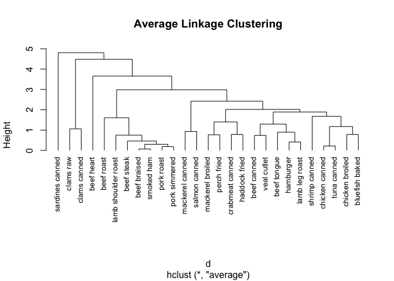<!-- -->

- 树状图应该从下往上读，它展示了这些条目如何被结合成类。每个观测值起初自成一类，然后相距最近的两类(beef braised和smoked ham)合并。其次，pork roast和pork simmered合并，chicken canned和tuna canned合并。再次，beef braised/smoked ham这一类和pork roast/pork simmered这一类合并(这个类目前包含四种食品)。合并继续进行下去，直到所有的观测值合并成一类。

- 高度刻度代表了该高度类之间合并的判定值。对于平均联动来说，标准是一类中的点和其他类中的点的距离平均值。 
- 如果最终目标是这些食品分配到的类(希望有意义的)较少，则需要额外的分析来选择聚类的适当个数。NbClust包提供了众多的指数来确定在一个聚类分析里类的最佳数目。不能保证这些指标得出的结果都一致。事实上，它们可能不一样。但是结果可用来作为选择聚类个数K值的一个参考。

- `NbClust()`函数的输入包括需要做聚类的矩阵或是数据框，使用的距离测度和聚类方法，并考虑最小和最大聚类的个数来进行聚类。它返回每一个聚类指数，同时输出建议聚类的最佳数目。

-代码清单16-2 选择聚类的个数


```r
> library(NbClust) 
> devAskNewPage(ask=TRUE)  
> nc <- NbClust(nutrient.scaled, distance="euclidean",              
+               min.nc=2, max.nc=15, method="average") 
```

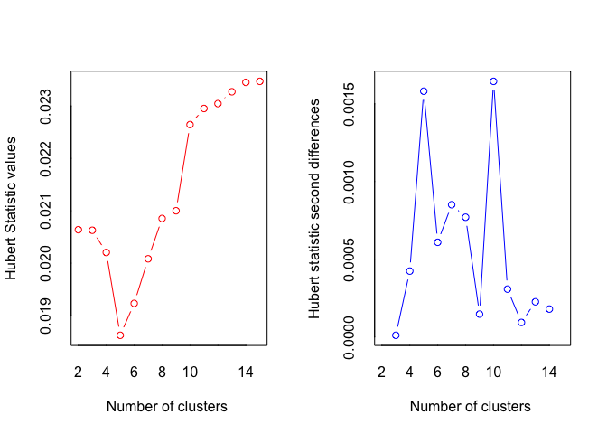<!-- -->

```
*** : The Hubert index is a graphical method of determining the number of clusters.
                In the plot of Hubert index, we seek a significant knee that corresponds to a 
                significant increase of the value of the measure i.e the significant peak in Hubert
                index second differences plot. 
 
```

<!-- -->

```
*** : The D index is a graphical method of determining the number of clusters. 
                In the plot of D index, we seek a significant knee (the significant peak in Dindex
                second differences plot) that corresponds to a significant increase of the value of
                the measure. 
 
******************************************************************* 
* Among all indices:                                                
* 4 proposed 2 as the best number of clusters 
* 4 proposed 3 as the best number of clusters 
* 2 proposed 4 as the best number of clusters 
* 4 proposed 5 as the best number of clusters 
* 1 proposed 9 as the best number of clusters 
* 1 proposed 10 as the best number of clusters 
* 2 proposed 13 as the best number of clusters 
* 1 proposed 14 as the best number of clusters 
* 4 proposed 15 as the best number of clusters 

                   ***** Conclusion *****                            
 
* According to the majority rule, the best number of clusters is  2 
 
 
******************************************************************* 
> table(nc$Best.n[1,])

 0  1  2  3  4  5  9 10 13 14 15 
 2  1  4  4  2  4  1  1  2  1  4 
```

```r
> barplot(table(nc$Best.n[1,]),          
+         xlab="Numer of Clusters", ylab="Number of Criteria",       
+         main="Number of Clusters Chosen by 26 Criteria")
```

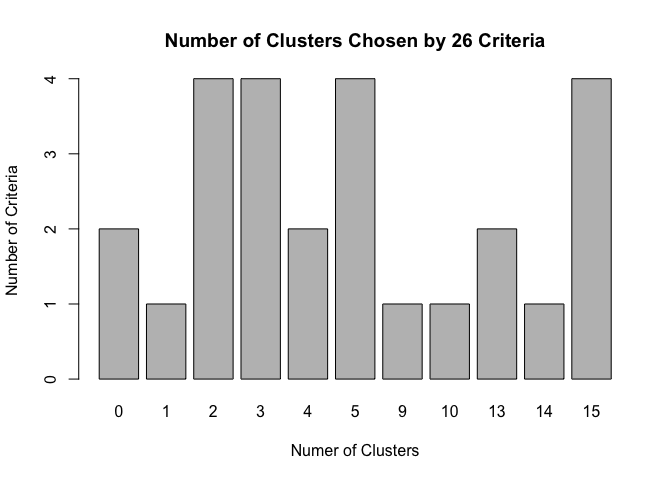<!-- -->
- 这里，四个评判准则赞同聚类个数为2，四个判定准则赞同聚类个数为3，等等从“投票”个数最多的聚类个数(2、3、5和15)中选择其中一个，使得解释最有意义。下面的代码清单展示了五类聚类的方案：

- 代码清单16-3 获取最终的聚类方案


```r
> clusters <- cutree(fit.average, k=5)  # 分配情况：cutree()函数用来把树状图分成五类
> table(clusters)
clusters
 1  2  3  4  5 
 7 16  1  2  1 
```

- 第一类有7个观测值，第二类有16个观测值，等等。


```r
> # 描述聚类：aggregate()函数用来获取每类的中位数,结果有原始度量和标准度量两种形式
> aggregate(nutrient, by=list(cluster=clusters), median) 
  cluster energy protein fat calcium iron
1       1  340.0      19  29       9 2.50
2       2  170.0      20   8      13 1.45
3       3  160.0      26   5      14 5.90
4       4   57.5       9   1      78 5.70
5       5  180.0      22   9     367 2.50
```

```r
> aggregate(as.data.frame(nutrient.scaled), by=list(cluster=clusters),      
+           median)
  cluster energy protein    fat calcium    iron
1       1  1.310   0.000  1.379  -0.448  0.0811
2       2 -0.370   0.235 -0.487  -0.397 -0.6374
3       3 -0.468   1.646 -0.753  -0.384  2.4078
4       4 -1.481  -2.352 -1.109   0.436  2.2709
5       5 -0.271   0.706 -0.398   4.140  0.0811
```

```r
> # 结果绘图：树状图被重新绘制,rect.hclust()函数用来叠加五类的解决方案
> plot(fit.average, hang=-1, cex=.8,      
+      main="Average Linkage Clustering\n5 Cluster Solution") 
> rect.hclust(fit.average, k=5)
```

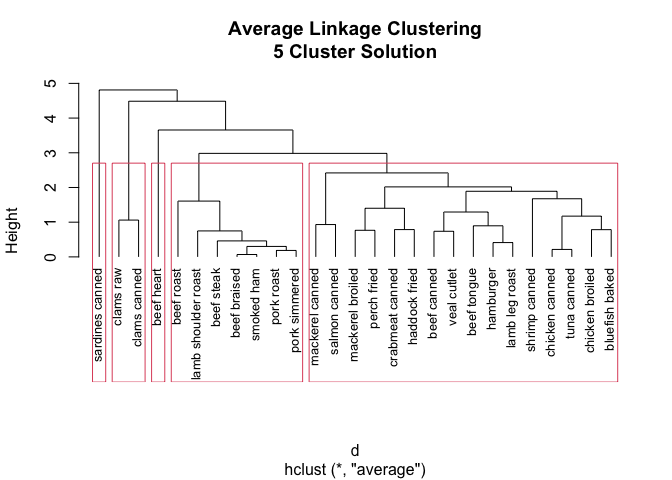<!-- -->

- sardines canned形成自己的类，因为钙比其他食物组要高得多。beef heart也是单独成类，是因为富含蛋白质和铁。clams类是低蛋白和高铁的。从beef roast到pork simmered的类中，所有项目都是高能量和高脂肪的。最后，最大的类(从mackerel canned到bluefish baked)含有相对较低的铁。 

- 当需要嵌套聚类和有意义的层次结构时，层次聚类或许特别有用。在生物科学中这种情况很常见。在某种意义上分层算法是贪婪的，一旦一个观测值被分配给一个类，它就不能在后面的过程中被重新分配。另外，**层次聚类难以应用到有数百甚至数千观测值的大样本中**。不过划分方法可以在大样本情况下做得很好。

## 6_1.4 划分聚类分析

- 在划分方法中，观测值被分为K组并根据给定的规则改组成最有粘性的类。

### 6_1.4.1 K 均值聚类

- 最常见的划分方法是K均值聚类分析。从概念上讲，K均值算法如下：

- (1) 选择K个中心点(随机选择K行)；
- (2) 把每个数据点分配到离它最近的中心点；
- (3) 重新计算每类中的点到该类中心点距离的平均值(也就说，得到长度为p的均值向量，这里的p是变量的个数)；
- (4) 分配每个数据到它最近的中心点；
- (5) 重复步骤(3)和步骤(4)直到所有的观测值不再被分配或是达到最大的迭代次数(R把10次作为默认迭代次数)。

- K均值聚类能处理比层次聚类更大的数据集。另外，观测值不会永远被分到一类中。均值的使用意味着所有的变量必须是连续的，并且这个方法很有可能被异常值影响。它在非凸聚类(例如U型)情况下也会变得很差。

- 在R中，K均值的函数格式是`kmeans(x,centers)`，这里x表示数值数据集(矩阵或数据框)，centers是要提取的聚类数目。函数返回类的成员、类中心、平方和(类内平方和、类间平方和、总平方和)和类大小。

- 由于K均值聚类在开始要随机选择k个中心点，在每次调用函数时可能获得不同的方案。使用`set.seed()`函数可以保证结果是可复制的。此外，聚类方法对初始中心值的选择也很敏感。`kmeans()`函数有一个nstart选项尝试多种初始配置并输出最好的一个。例如，加上nstart=25会生成25个初始配置。通常推荐使用这种方法。 

- 不像层次聚类方法，K均值聚类要求你事先确定要提取的聚类个数。同样，NbClust包可以用来作为参考。另外，在K均值聚类中，类中总的平方值对聚类数量的曲线可能是有帮助的。可根据图中的弯曲选择适当的类的数量。图像可以用下面的代码产生：

```
wssplot <- function(data, nc=15, seed=1234){       
  wss <- (nrow(data)-1)*sum(apply(data,2,var))      
  for (i in 2:nc){                  
    set.seed(seed)                
    wss[i] <- sum(kmeans(data, centers=i)$withinss)}      
  plot(1:nc, wss, type="b", xlab="Number of Clusters",       
       ylab="Within groups sum of squares")}
```

- data参数是用来分析的数值数据，nc是要考虑的最大聚类个数，而seed是一个随机数种子。

- 用K均值聚类来处理包含178种意大利葡萄酒中13种化学成分的数据集。该数据可以通过rattle包获得。在这个数据集里，观测值代表三种葡萄酒的品种，由第一个变量(类型)表示。

- 代码清单16-4 葡萄酒数据的K均值聚类


```r
> data(wine, package="rattle") 
> head(wine)
  Type Alcohol Malic  Ash Alcalinity Magnesium Phenols Flavanoids Nonflavanoids
1    1    14.2  1.71 2.43       15.6       127    2.80       3.06          0.28
2    1    13.2  1.78 2.14       11.2       100    2.65       2.76          0.26
3    1    13.2  2.36 2.67       18.6       101    2.80       3.24          0.30
4    1    14.4  1.95 2.50       16.8       113    3.85       3.49          0.24
5    1    13.2  2.59 2.87       21.0       118    2.80       2.69          0.39
6    1    14.2  1.76 2.45       15.2       112    3.27       3.39          0.34
  Proanthocyanins Color  Hue Dilution Proline
1            2.29  5.64 1.04     3.92    1065
2            1.28  4.38 1.05     3.40    1050
3            2.81  5.68 1.03     3.17    1185
4            2.18  7.80 0.86     3.45    1480
5            1.82  4.32 1.04     2.93     735
6            1.97  6.75 1.05     2.85    1450
> df <- scale(wine[-1]) # 标准化数据，因为变量值变化很大，所以在聚类前要将其标准化
> # 使用wssplot()和Nbclust()函数确定聚类的个数
> wssplot <- function(data, nc=15, seed=1234){       
+   wss <- (nrow(data)-1)*sum(apply(data,2,var))      
+   for (i in 2:nc){                  
+     set.seed(seed)                
+     wss[i] <- sum(kmeans(data, centers=i)$withinss)}      
+   plot(1:nc, wss, type="b", xlab="Number of Clusters",       
+        ylab="Within groups sum of squares")}
> wssplot(df) 
```

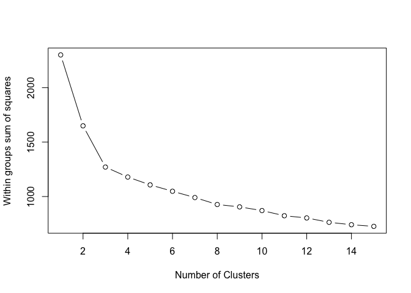<!-- -->

```r
> library(NbClust) 
> set.seed(1234) 
> devAskNewPage(ask=TRUE) 
> nc <- NbClust(df, min.nc=2, max.nc=15, method="kmeans")  
```

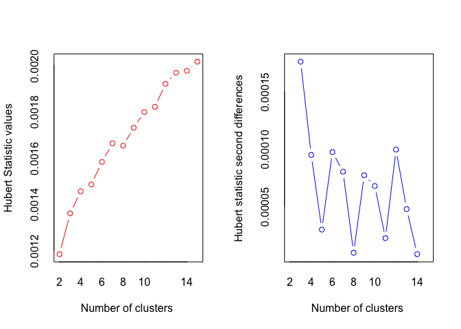<!-- -->

```
*** : The Hubert index is a graphical method of determining the number of clusters.
                In the plot of Hubert index, we seek a significant knee that corresponds to a 
                significant increase of the value of the measure i.e the significant peak in Hubert
                index second differences plot. 
 
```

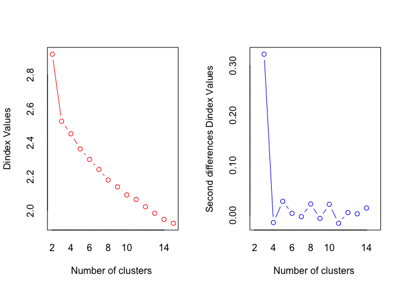<!-- -->

```
*** : The D index is a graphical method of determining the number of clusters. 
                In the plot of D index, we seek a significant knee (the significant peak in Dindex
                second differences plot) that corresponds to a significant increase of the value of
                the measure. 
 
******************************************************************* 
* Among all indices:                                                
* 2 proposed 2 as the best number of clusters 
* 19 proposed 3 as the best number of clusters 
* 1 proposed 14 as the best number of clusters 
* 1 proposed 15 as the best number of clusters 

                   ***** Conclusion *****                            
 
* According to the majority rule, the best number of clusters is  3 
 
 
******************************************************************* 
> table(nc$Best.n[1,])

 0  1  2  3 14 15 
 2  1  2 19  1  1 
```

- 图（number of clusters）表示从一类到三类变化时，组内的平方总和有一个明显的下降趋势。三类之后，下降的速度减弱，暗示着聚成三类可能对数据来说是一个很好的拟合。


```r
> barplot(table(nc$Best.n[1,]),       
+         xlab="Number of Clusters", ylab="Number of Criteria",     
+         main="Number of Clusters Chosen by 26 Criteria")  
```

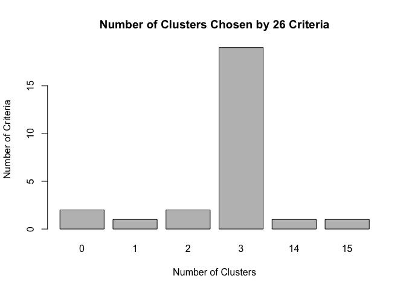<!-- -->

```r
> set.seed(1234) 
> # 进行K均值聚类分析，使用kmeans()函数得到的最终聚类中,聚类中心也被输出了
> fit.km <- kmeans(df, 3, nstart=25) 
> fit.km$size
[1] 62 65 51
```

- 在上图中，NbClust包中的26种指标中有19种建议使用类别数为三的聚类方案。需要注意的是并非30个指标都可以计算每个数据集。


```r
> options(digits = 2)
> fit.km$centers
  Alcohol Malic   Ash Alcalinity Magnesium Phenols Flavanoids Nonflavanoids
1    0.83 -0.30  0.36      -0.61     0.576   0.883      0.975        -0.561
2   -0.92 -0.39 -0.49       0.17    -0.490  -0.076      0.021        -0.033
3    0.16  0.87  0.19       0.52    -0.075  -0.977     -1.212         0.724
  Proanthocyanins Color   Hue Dilution Proline
1           0.579  0.17  0.47     0.78    1.12
2           0.058 -0.90  0.46     0.27   -0.75
3          -0.778  0.94 -1.16    -1.29   -0.41
```


```r
> # 因为输出的聚类中心是基于标准化的数据,所以可以使用aggregate()函数和类的成员来得到原始矩阵中每一类的变量均值
> aggregate(wine[-1], by=list(cluster=fit.km$cluster), mean)
  cluster Alcohol Malic Ash Alcalinity Magnesium Phenols Flavanoids
1       1      14   2.0 2.5         17       108     2.8       3.00
2       2      12   1.9 2.2         20        93     2.2       2.05
3       3      13   3.3 2.4         21        99     1.7       0.82
  Nonflavanoids Proanthocyanins Color  Hue Dilution Proline
1          0.29             1.9   5.5 1.07      3.2    1100
2          0.36             1.6   3.0 1.06      2.8     510
3          0.45             1.1   7.2 0.69      1.7     619
```

### 6_1.4.2 围绕中心点的划分

- 因为K均值聚类方法是基于均值的，所以它对异常值是敏感的。一个更稳健的方法是围绕中心点的划分(PAM)。与其用质心(变量均值向量)表示类，不如用一个最有代表性的观测值来表示(称为中心点)。K均值聚类一般使用欧几里得距离，而PAM可以使用任意的距离来计算。因此，PAM可以容纳混合数据类型，并且不仅限于连续变量。 

- PAM算法如下：

- (1) 随机选择K个观测值(每个都称为中心点)；
- (2) 计算观测值到各个中心的距离/相异性；
- (3) 把每个观测值分配到最近的中心点；
- (4) 计算每个中心点到每个观测值的距离的总和(总成本)；
- (5) 选择一个该类中不是中心的点,并和中心点互换；
- (6) 重新把每个点分配到距它最近的中心点；
- (7) 再次计算总成本；
- (8) 如果总成本比步骤(4)计算的总成本少，把新的点作为中心点；
- (9) 重复步骤(5)~(8)直到中心点不再改变。

- 可以使用cluster包中的`pam()`函数使用基于中心点的划分方法。格式是：
  
  `pam(x, k, metric="euclidean", stand=FALSE)`
  
  这里的x表示数据矩阵或数据框，k表示聚类的个数，metric表示使用的相似性/相异性的度量，而stand是一个逻辑值，表示是否有变量应该在计算该指标之前被标准化。下图列出了使用PAM方法处理葡萄酒的数据。

- 代码清单16-5 对葡萄酒数据使用基于质心的划分方法


```r
> library(cluster) 
> set.seed(1234) 
> fit.pam <- pam(wine[-1], k=3, stand=TRUE) # 聚类数据的的标准化
> fit.pam$medoids # 输出中心点
     Alcohol Malic Ash Alcalinity Magnesium Phenols Flavanoids Nonflavanoids
[1,]      13   1.8 2.4         20       100     2.7       2.98          0.26
[2,]      12   1.7 2.1         19        80     1.6       2.03          0.37
[3,]      13   3.9 2.5         23       102     1.8       0.75          0.43
     Proanthocyanins Color Hue Dilution Proline
[1,]             1.9   5.1 1.0      3.5     920
[2,]             1.6   3.4 1.0      3.2     510
[3,]             1.4   7.3 0.7      1.6     750
> clusplot(fit.pam, main="Bivariate Cluster Plot") # 画出聚类的方案
```

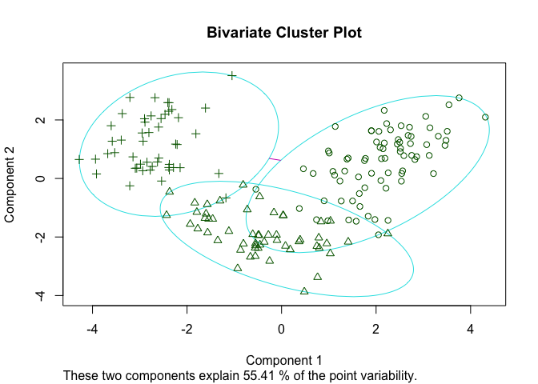<!-- -->

- 注意，这里得到的中心点是葡萄酒数据集中实际的观测值。每个类用包含其所有点的最小面积的椭圆表示。

- 可以用flexclust包中的兰德指数(Rand index)来量化类型变量和类之间的协议，PAM在如下例子中的表现不如K均值：

- K均值：


```r
> ct.km <- table(wine$Type, fit.km$cluster) 
> ct.km
   
     1  2  3
  1 59  0  0
  2  3 65  3
  3  0  0 48
> library(flexclust) 
> options(digits = 3)
> randIndex(ct.km)
  ARI 
0.897 
```

- PAM：


```r
> ct.pam <- table(wine$Type, fit.pam$clustering)
> randIndex(ct.pam)
  ARI 
0.699 
```

- 调整的兰德指数从(K均值的)0.9下降到了0.7。

- 调整的兰德指数为两种划分提供了一种衡量两个分区之间的协定，即调整后机会的量度。它的变化范围是从–1(不同意)到1 (完全同意)。K均值算出葡萄酒品种类型和类的解决方案之间的协定是0.9。

## 6_1.5 避免不存在的类


```r
> library(fMultivar) 
> set.seed(1234) 
> df1 <- rnorm2d(1000, rho=.5) 
> df1 <- as.data.frame(df1) 
> plot(df1, main="Bivariate Normal Distribution with rho=0.5")
```

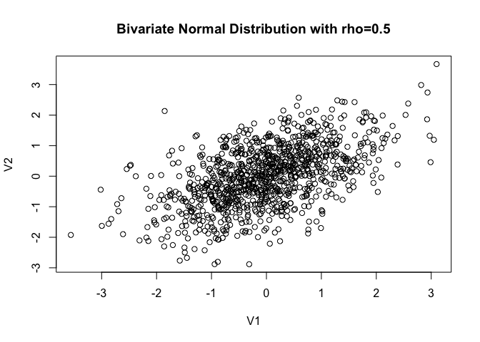<!-- -->

- fMultivar包中的`rnorm2d()`函数用来从相关系数为0.5的二元正态分布中抽取1000个观测值。所得的曲线显示在上图中。很显然，数据中没有类。

- 随后,使用`wssplot()`和`Nbclust()`函数来确定当前聚类的个数：


```r
> wssplot <- function(data, nc=15, seed=1234){       
+   wss <- (nrow(data)-1)*sum(apply(data,2,var))      
+   for (i in 2:nc){                  
+     set.seed(seed)                
+     wss[i] <- sum(kmeans(data, centers=i)$withinss)}      
+   plot(1:nc, wss, type="b", xlab="Number of Clusters",       
+        ylab="Within groups sum of squares")}
> wssplot(df1) 
```

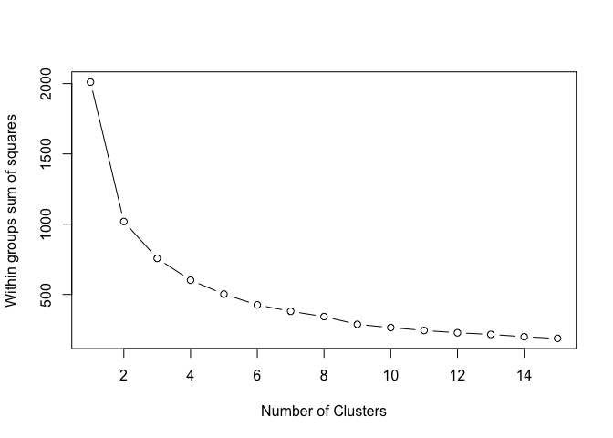<!-- -->

```r
> library(NbClust)
> nc <- NbClust(df1, min.nc=2, max.nc=15, method="kmeans")
```

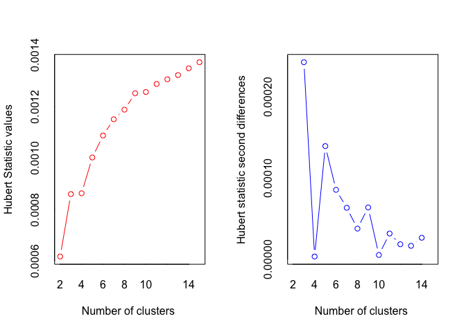<!-- -->

```
*** : The Hubert index is a graphical method of determining the number of clusters.
                In the plot of Hubert index, we seek a significant knee that corresponds to a 
                significant increase of the value of the measure i.e the significant peak in Hubert
                index second differences plot. 
 
```

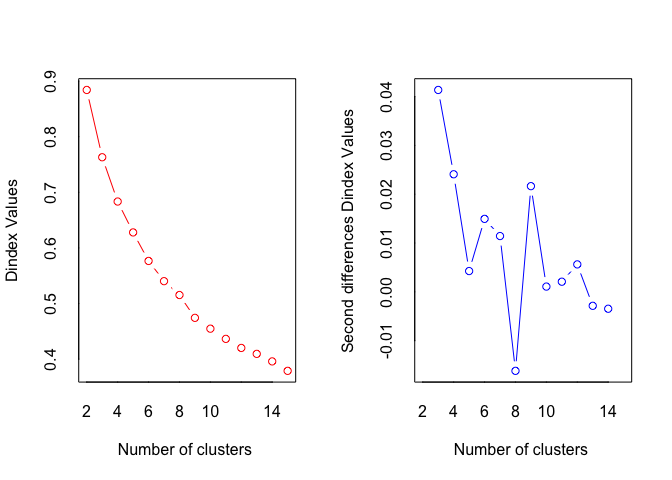<!-- -->

```
*** : The D index is a graphical method of determining the number of clusters. 
                In the plot of D index, we seek a significant knee (the significant peak in Dindex
                second differences plot) that corresponds to a significant increase of the value of
                the measure. 
 
******************************************************************* 
* Among all indices:                                                
* 8 proposed 2 as the best number of clusters 
* 4 proposed 3 as the best number of clusters 
* 1 proposed 4 as the best number of clusters 
* 1 proposed 5 as the best number of clusters 
* 4 proposed 9 as the best number of clusters 
* 1 proposed 10 as the best number of clusters 
* 1 proposed 13 as the best number of clusters 
* 3 proposed 15 as the best number of clusters 

                   ***** Conclusion *****                            
 
* According to the majority rule, the best number of clusters is  2 
 
 
******************************************************************* 
> dev.new()  
```


```r
> barplot(table(nc$Best.n[1,]),       
+         xlab="Number of Clusters", ylab="Number of Criteria",       
+         main="Number of Clusters Chosen by 26 Criteria")
```

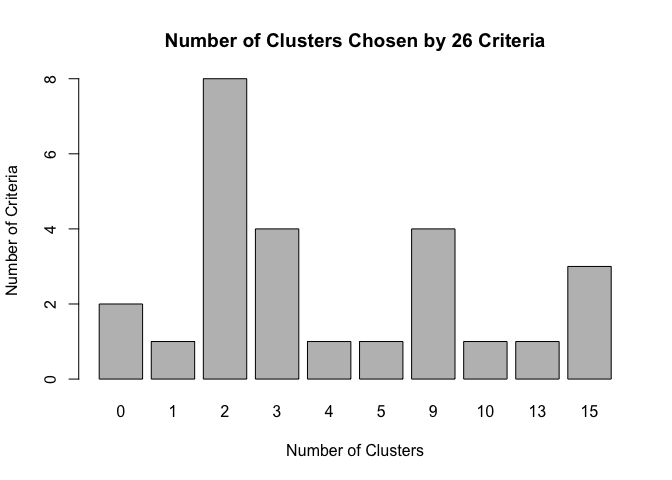<!-- -->

- `wssplot()`函数建议聚类的个数是2，然而NbClust函数返回的准则多数支持2类或3类。如果利用PAM法进行双聚类分析：


```r
> library(ggplot2)
> library(cluster) 
> fit <- pam(df1, k=2) 
> df1$clustering <- factor(fit$clustering)
> ggplot(data=df1, aes(x=V1, y=V2, color=clustering, shape=clustering)) +  
+   geom_point() + ggtitle("Clustering of Bivariate Normal Data")
```

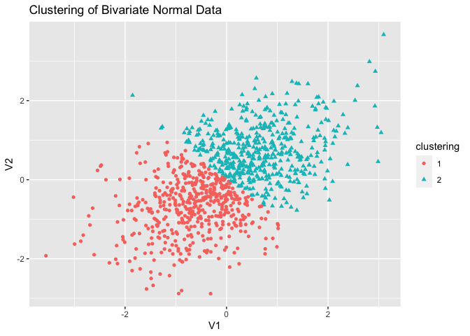<!-- -->

- 很明显划分是人为的。实际上在这里没有真实的类。那么如何避免这种错误呢？虽然并非万无一失，但在NbClust包中的立方聚类规则(Cubic Cluster Criteria,CCC)往往可以揭示不存在的结构。代码是：


```r
> plot(nc$All.index[,4], type="o", ylab="CCC",   
+      xlab="Number of clusters", col="blue")
```

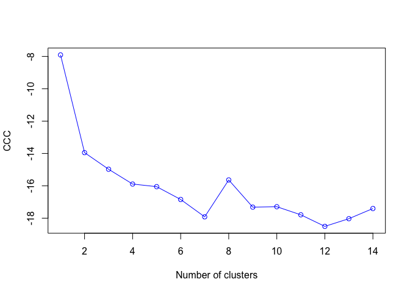<!-- -->

- 当CCC的值为负并且对于两类或是更多的类递减时，就是典型的单峰分布。 

- 聚类分析找到错误聚类的能力使得聚类分析的验证步骤很重要。如果你试图找出在某种意义上“真实的”类(而不是一个方便的划分)，就要确保结果是稳健的并且是可重复的。
