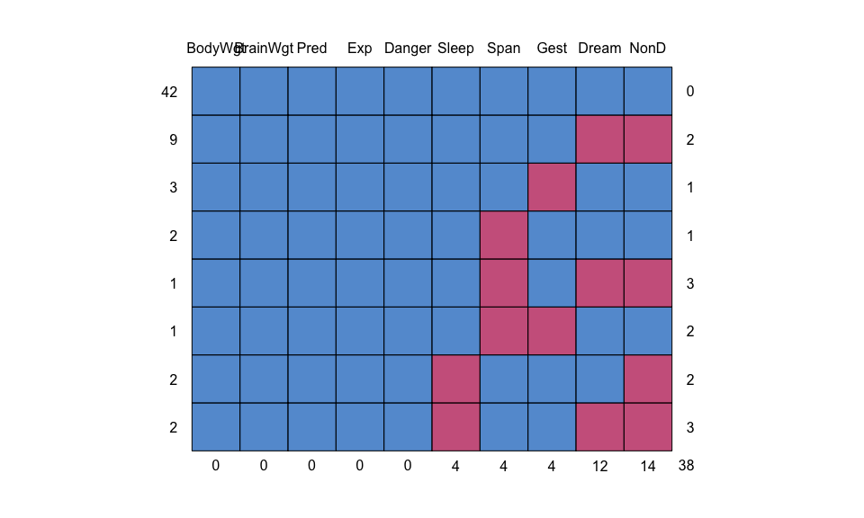
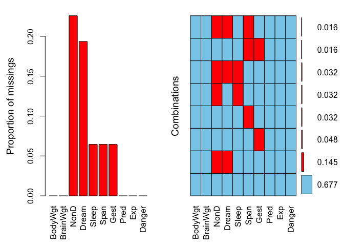
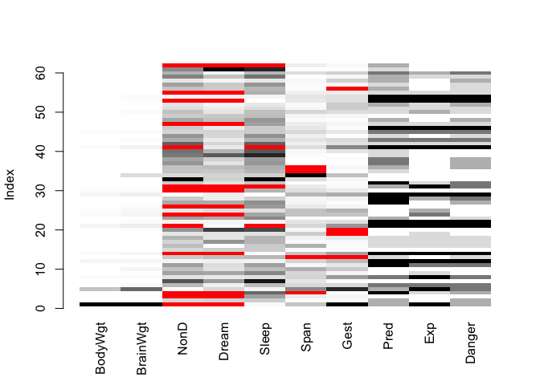
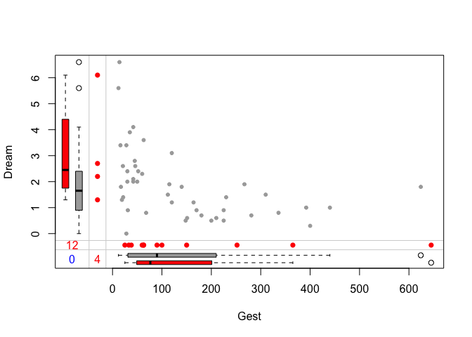

Source：

1.  《R语言实战（中文第二版）》

# 7_1 处理缺失数据的高级方法

-   大部分统计方法都假定处理的是完整矩阵、向量和数据框。但实际情况是，大部分情况下，在处理收集了真实数据的问题之前，你不得不消除缺失数据：(1)删除含有缺失数据的实例；(2)用合理的替代值替换缺失值。不管是哪种方法，最后的结果都是没有缺失值的数据集。

-   本章主要使用VIM和mice包来学习处理缺失数据的传统方法和现代方法。命令`install.packages(c("VIM","mice"))`可下载并安装这两个软件包。

-   本章使用VIM包提供的哺乳动物睡眠数据(sleep，注意不要将其与基础安装中描述药效的sleep数据集混淆)。数据来源于Allison和Chichetti(1976)的研究，他们研究了62种哺乳动物的睡眠、 生态学变量和体质变量间的关系。睡眠数据是因变量，生态学变量和体质变量是自变量或预测变量。

-   睡眠变量包含睡眠中做梦时长(Dream)、不做梦时长(NonD)以及它们的和(Sleep)。体质变量包含体重(BodyWgt，单位为千克)、脑重(BrainWgt，单位为克)、寿命(Span，单位为年)和妊娠期(Gest，单位为天)。生态学变量包含物种被捕食的程度(Pred)、睡眠时的暴露程度(Exp)和面临的总危险度(Danger)。生态学变量以从1(低)到5(高)的5分制进行测量。\

-   Allison和Chichetti的原作仅研究完整的数据，为了深入探究变量间的关系，本章将使用多重插补法对所有的62个物种进行分析。

## 7_1.1 处理缺失值的步骤

-   一个完整的处理方法通常包含以下几个步骤：

-   

    (1) 识别缺失数据；

-   

    (2) 检查导致数据缺失的原因；

-   

    (3) 删除包含缺失值的实例或用合理的数值代替(插补)缺失值。

-   缺失数据的分类：

-   

    (1) 完全随机缺失。若某变量的缺失数据与其他任何观测或未观测变量都不相关，则数据为完全随机缺失(MCAR)。若12种动物的做梦时长值缺失不是出于系统原因，那么可以认为数据是MCAR。**注意，如果每个有缺失值的变量都是MCAR，那么可以将数据完整的实例看作对更大数据集的一个简单随机抽样**。

-   

    (2) 随机缺失。若某变量上的缺失数据与其他观测变量相关，与它自己的未观测值不相关，则数据为随机缺失(MAR)。例如，如果体重较小的动物更可能有做梦时长的缺失值(可能因为较小的动物更难观察)，而且该"缺失"与动物的做梦时长无关，那么就可以认为该数据是MAR。此时，一旦控制了体重变量，做梦时长数据的缺失与出现将是随机的。

-   

    (3) 非随机缺失。若缺失数据不属于MCAR和MAR，则数据为非随机缺失(NMAR)。例如，做梦时长越短的动物更可能有做梦数据的缺失(可能由于难以测量时长较短的事件)，那么可认为数据是NMAR。

-   大部分处理缺失数据的方法都假定数据是MCAR或MAR。此时，可以忽略缺失数据的生成机制，并且(在替换或删除缺失数据后)可以直接对感兴趣的关系进行建模。

## 7_1.2 识别缺失值

-   R使用NA(不可得)代表缺失值，NaN(不是一个数)代表不可能值。另外，符号Inf和-Inf分别代表正无穷和负无穷。函数`is.na()`、`is.nan()`和`is.infinite()`可分别用来识别缺失值、不可能值和无穷值。每个返回结果都是TRUE或FALSE。

| x           | is.na(x) | is.nan(x) | is.infinite(x) |
|-------------|----------|-----------|----------------|
| x \<- NA    | TRUE     | FALSE     | FALSE          |
| x \<- 0 / 0 | TRUE     | TRUE      | FALSE          |
| x \<- 1 / 0 | FALSE    | FALSE     | TRUE           |

-   这些函数返回的对象与其自身参数的个数相同。若每个元素的类型检验通过，则由TRUE替换，否则用FALSE替换。例如，令y \<- c(1, 2, 3, NA)，则is.na(y)返回向量c(FALSE, FALSE, FALSE, TRUE)。

-   函数`complete.cases()`可以用来识别矩阵或数据框中没有缺失值的行。若每行都包含完整的实例，则返回TRUE的逻辑向量；若每行有一个或多个缺失值，则返回FALSE。以睡眠数据集为例：


```r
> # 加载数据集
> data(sleep, package="VIM")
> # 列出没有缺失值的行
> sleep[complete.cases(sleep),]
    BodyWgt BrainWgt NonD Dream Sleep  Span  Gest Pred Exp Danger
2     1.000     6.60  6.3   2.0   8.3   4.5  42.0    3   1      3
5  2547.000  4603.00  2.1   1.8   3.9  69.0 624.0    3   5      4
6    10.550   179.50  9.1   0.7   9.8  27.0 180.0    4   4      4
7     0.023     0.30 15.8   3.9  19.7  19.0  35.0    1   1      1
8   160.000   169.00  5.2   1.0   6.2  30.4 392.0    4   5      4
9     3.300    25.60 10.9   3.6  14.5  28.0  63.0    1   2      1
10   52.160   440.00  8.3   1.4   9.7  50.0 230.0    1   1      1
11    0.425     6.40 11.0   1.5  12.5   7.0 112.0    5   4      4
12  465.000   423.00  3.2   0.7   3.9  30.0 281.0    5   5      5
15    0.075     1.20  6.3   2.1   8.4   3.5  42.0    1   1      1
16    3.000    25.00  8.6   0.0   8.6  50.0  28.0    2   2      2
17    0.785     3.50  6.6   4.1  10.7   6.0  42.0    2   2      2
18    0.200     5.00  9.5   1.2  10.7  10.4 120.0    2   2      2
22   27.660   115.00  3.3   0.5   3.8  20.0 148.0    5   5      5
23    0.120     1.00 11.0   3.4  14.4   3.9  16.0    3   1      2
25   85.000   325.00  4.7   1.5   6.2  41.0 310.0    1   3      1
27    0.101     4.00 10.4   3.4  13.8   9.0  28.0    5   1      3
28    1.040     5.50  7.4   0.8   8.2   7.6  68.0    5   3      4
29  521.000   655.00  2.1   0.8   2.9  46.0 336.0    5   5      5
32    0.005     0.14  7.7   1.4   9.1   2.6  21.5    5   2      4
33    0.010     0.25 17.9   2.0  19.9  24.0  50.0    1   1      1
34   62.000  1320.00  6.1   1.9   8.0 100.0 267.0    1   1      1
37    0.023     0.40 11.9   1.3  13.2   3.2  19.0    4   1      3
38    0.048     0.33 10.8   2.0  12.8   2.0  30.0    4   1      3
39    1.700     6.30 13.8   5.6  19.4   5.0  12.0    2   1      1
40    3.500    10.80 14.3   3.1  17.4   6.5 120.0    2   1      1
42    0.480    15.50 15.2   1.8  17.0  12.0 140.0    2   2      2
43   10.000   115.00 10.0   0.9  10.9  20.2 170.0    4   4      4
44    1.620    11.40 11.9   1.8  13.7  13.0  17.0    2   1      2
45  192.000   180.00  6.5   1.9   8.4  27.0 115.0    4   4      4
46    2.500    12.10  7.5   0.9   8.4  18.0  31.0    5   5      5
48    0.280     1.90 10.6   2.6  13.2   4.7  21.0    3   1      3
49    4.235    50.40  7.4   2.4   9.8   9.8  52.0    1   1      1
50    6.800   179.00  8.4   1.2   9.6  29.0 164.0    2   3      2
51    0.750    12.30  5.7   0.9   6.6   7.0 225.0    2   2      2
52    3.600    21.00  4.9   0.5   5.4   6.0 225.0    3   2      3
54   55.500   175.00  3.2   0.6   3.8  20.0 151.0    5   5      5
57    0.900     2.60 11.0   2.3  13.3   4.5  60.0    2   1      2
58    2.000    12.30  4.9   0.5   5.4   7.5 200.0    3   1      3
59    0.104     2.50 13.2   2.6  15.8   2.3  46.0    3   2      2
60    4.190    58.00  9.7   0.6  10.3  24.0 210.0    4   3      4
61    3.500     3.90 12.8   6.6  19.4   3.0  14.0    2   1      1
> # 列出有一个或多个缺失值的行 
> sleep[!complete.cases(sleep),]
    BodyWgt BrainWgt NonD Dream Sleep Span Gest Pred Exp Danger
1  6654.000   5712.0   NA    NA   3.3 38.6  645    3   5      3
3     3.385     44.5   NA    NA  12.5 14.0   60    1   1      1
4     0.920      5.7   NA    NA  16.5   NA   25    5   2      3
13    0.550      2.4  7.6   2.7  10.3   NA   NA    2   1      2
14  187.100    419.0   NA    NA   3.1 40.0  365    5   5      5
19    1.410     17.5  4.8   1.3   6.1 34.0   NA    1   2      1
20   60.000     81.0 12.0   6.1  18.1  7.0   NA    1   1      1
21  529.000    680.0   NA   0.3    NA 28.0  400    5   5      5
24  207.000    406.0   NA    NA  12.0 39.3  252    1   4      1
26   36.330    119.5   NA    NA  13.0 16.2   63    1   1      1
30  100.000    157.0   NA    NA  10.8 22.4  100    1   1      1
31   35.000     56.0   NA    NA    NA 16.3   33    3   5      4
35    0.122      3.0  8.2   2.4  10.6   NA   30    2   1      1
36    1.350      8.1  8.4   2.8  11.2   NA   45    3   1      3
41  250.000    490.0   NA   1.0    NA 23.6  440    5   5      5
47    4.288     39.2   NA    NA  12.5 13.7   63    2   2      2
53   14.830     98.2   NA    NA   2.6 17.0  150    5   5      5
55    1.400     12.5   NA    NA  11.0 12.7   90    2   2      2
56    0.060      1.0  8.1   2.2  10.3  3.5   NA    3   1      2
62    4.050     17.0   NA    NA    NA 13.0   38    3   1      1
```

-   输出结果显示42个实例为完整数据，20个实例含一个或多个缺失值。

-   由于逻辑值TRUE和FALSE分别等价于数值1和0，可用`sum()`和`mean()`函数来获取关于缺失数据的有用信息。如：


```r
> sum(is.na(sleep$Dream))
[1] 12
> options(digits = 2)
> mean(is.na(sleep$Dream))
[1] 0.19
> mean(!complete.cases(sleep))
[1] 0.32
```

-   结果表明变量Dream有12个缺失值，19%的实例在此变量上有缺失值。另外，数据集中32%的实例包含一个或多个缺失值。

-   对于识别缺失值，有两点需要牢记：

-   第一，`complete.cases()`函数仅将NA和NaN识别为缺失值，无穷值`(Inf和-Inf)`被当作有效值。

-   第二，必须使用与本章中类似的缺失值函数来识别R数据对象中的缺失值。像`myvar == NA`这样的逻辑比较无法实现。

## 7_1.3 探索缺失值模式

### 7_1.3.1 列表显示缺失值

-   mice包中的`md.pattern()`函数可生成一个以矩阵或数据框形式展示缺失值模式的表格。将函数应用到sleep数据集，可得到：


```r
> library(mice)  
> data(sleep, package="VIM") 
> md.pattern(sleep)
```

<!-- -->

```
   BodyWgt BrainWgt Pred Exp Danger Sleep Span Gest Dream NonD   
42       1        1    1   1      1     1    1    1     1    1  0
9        1        1    1   1      1     1    1    1     0    0  2
3        1        1    1   1      1     1    1    0     1    1  1
2        1        1    1   1      1     1    0    1     1    1  1
1        1        1    1   1      1     1    0    1     0    0  3
1        1        1    1   1      1     1    0    0     1    1  2
2        1        1    1   1      1     0    1    1     1    0  2
2        1        1    1   1      1     0    1    1     0    0  3
         0        0    0   0      0     4    4    4    12   14 38
```

-   表中的1和0显示了缺失值模式：0表示变量的列中有缺失值，1则表示没有缺失值。

-   第1行表述了"无缺失值"的模式(所有元素都为1)。第4行表述了"除了Span之外无缺失值"的模式。第1列表示各缺失值模式的实例个数，最后一列表示各模式中有缺失值的变量的个数。此处可以看到，有42个实例没有缺失值，仅2个实例缺失了Span。9个实例同时缺失了NonD和Dream的值。数据集包含了总共(42×0)+(2×1)+...+(1×3)=38个缺失值。最后一行给出了每个变量中缺失值的数目。

### 7_1.3.2 图形探究缺失数据

-   虽然`md.pattern()`函数的表格输出非常简洁，但通常用图形展示模式更为清晰。VIM包提供了大量能可视化数据集中缺失值模式的函数，本节将学习其中几个：`aggr()`、`matrixplot()`和`scattMiss()`。

-   `aggr()`函数不仅绘制每个变量的缺失值数，还绘制每个变量组合的缺失值数。例如：


```r
> library("VIM")
> aggr(sleep, prop=FALSE, numbers=TRUE)
```

<!-- -->

-   可以看到，变量NonD有最大的缺失值数(14)，有2种哺乳动物缺失了NonD、Dream和Sleep的评分。42种动物没有缺失值。

-   代码`aggr(sleep, prop=TRUE,numbers=TRUE)`将生成相同的图形，但用比例代替了计数。选项`numbers=FALSE`(默认)删去数值型标签。


```r
> aggr(sleep, prop=TRUE,numbers=TRUE)
```

<!-- -->

-   `matrixplot()`函数可生成展示每个实例数据的图形。`matrixplot(sleep)`的图形如图18-3所示。此处，数值型数据被重新转换到[0, 1]区间，并用灰度来表示大小：浅色表示值小，深色表示值大。默认缺失值为红色。**注意，在下图中，红色经过手工阴影化处理，因此相对于灰色缺失值非常显眼**。可以自定义创建图形，让它与众不同。


```r
> matrixplot(sleep)
```

<!-- -->

```

Click in a column to sort by the corresponding variable.
To regain use of the VIM GUI and the R console, click outside the plot region.
```

-   上图可以交互，单击一列会按其对应的变量重排矩阵。上图中的行按BodyWgt降序排列。通过矩阵图，可以看出某些变量的缺失值模式是否与其他变量的真实值有关联。此图中可以看到，无缺失值的睡眠变量(Dream、NonD和Sleep)对应着较小的体重(BodyWgt)或脑重(BrainWgt)。

-   `marginplot()`函数可生成一幅散点图,在图形边界展示两个变量的缺失值信息。以做梦时长与哺乳动物妊娠期时长的关系为例，来看下列代码：


```r
> marginplot(sleep[c("Gest","Dream")], pch=c(20),   
+            col=c("darkgray", "red", "blue"))
```

<!-- -->

-   参数pch和col为可选项，控制绘图符号和使用的颜色。

-   图形的主体是Gest和Dream(两变量数据都完整)的散点图。左边界的箱线图展示的是包含(深灰色)与不包含(红色)Gest值的Dream变量分布。**注意，在灰度图上红色是更深的阴影**。四个红色的点代表缺失了Gest得分的Dream值。在底部边界上，Gest和Dream间的关系反过来了。可以看到，妊娠期和做梦时长呈负相关，缺失妊娠期数据时动物的做梦时长一般更长。两个变量均有缺失值的观测个数在两边界交叉处用蓝色输出(左下角的0)。

### 7_1.3.3 用相关性探索缺失值

-   还可以用指示变量替代数据集中的数据 (1表示缺失，0表示存在)，这样生成的矩阵有时被称作**影子矩阵**。求这些指示变量之间和它们与初始(可观测)变量之间的相关性，有助于观察哪些变量常一起缺失，以及分析变量"缺失"与其他变量间的关系。


```r
> x <- as.data.frame(abs(is.na(sleep)))
> head(sleep, n=5)
  BodyWgt BrainWgt NonD Dream Sleep Span Gest Pred Exp Danger
1 6654.00   5712.0   NA    NA   3.3 38.6  645    3   5      3
2    1.00      6.6  6.3   2.0   8.3  4.5   42    3   1      3
3    3.38     44.5   NA    NA  12.5 14.0   60    1   1      1
4    0.92      5.7   NA    NA  16.5   NA   25    5   2      3
5 2547.00   4603.0  2.1   1.8   3.9 69.0  624    3   5      4
```

-   若sleep的元素缺失，则数据框x对应的元素为1，否则为0。


```r
> head(x, n=5)
  BodyWgt BrainWgt NonD Dream Sleep Span Gest Pred Exp Danger
1       0        0    1     1     0    0    0    0   0      0
2       0        0    0     0     0    0    0    0   0      0
3       0        0    1     1     0    0    0    0   0      0
4       0        0    1     1     0    1    0    0   0      0
5       0        0    0     0     0    0    0    0   0      0
```

-   以下代码可提取含(但不全部是)缺失值的变量，而`cor(y)`可列出这些指示变量间的相关系数：


```r
> y <- x[which(apply(x,2,sum)>0)]
> cor(y)
        NonD  Dream  Sleep   Span   Gest
NonD   1.000  0.907  0.486  0.015 -0.142
Dream  0.907  1.000  0.204  0.038 -0.129
Sleep  0.486  0.204  1.000 -0.069 -0.069
Span   0.015  0.038 -0.069  1.000  0.198
Gest  -0.142 -0.129 -0.069  0.198  1.000
```

-   此时，可以看到Dream和NonD常常一起缺失(r=0.91)。相对可能性较小的是Sleep和NonD一起缺失(r=0.49)，以及Sleep和Dream(r=0.20)。

-   最后，可以看到含缺失值变量与其他可观测变量间的关系：


```r
> cor(sleep, y, use="pairwise.complete.obs")
           NonD  Dream   Sleep   Span   Gest
BodyWgt   0.227  0.223  0.0017 -0.058 -0.054
BrainWgt  0.179  0.163  0.0079 -0.079 -0.073
NonD         NA     NA      NA -0.043 -0.046
Dream    -0.189     NA -0.1890  0.117  0.228
Sleep    -0.080 -0.080      NA  0.096  0.040
Span      0.083  0.060  0.0052     NA -0.065
Gest      0.202  0.051  0.1597 -0.175     NA
Pred      0.048 -0.068  0.2025  0.023 -0.201
Exp       0.245  0.127  0.2608 -0.193 -0.193
Danger    0.065 -0.067  0.2089 -0.067 -0.204
```

-   在这个相关系数矩阵中，行为可观测变量，列为表示缺失的指示变量。可以忽略矩阵中的警告信息和NA值，这些都是方法中人为因素所导致的。

-   从相关系数矩阵的第一列可以看到：体重越大(r=0.227)、妊娠期越长(r=0.202)、睡眠暴露度越大(r=0.245)的动物无梦睡眠的评分更可能缺失。其他列的信息也可以按类似方式得出。

-   **注意，表中的相关系数并不特别大，表明数据是MCAR的可能性比较小，更可能为MAR。**

-   不过也绝不能排除数据是NMAR的可能性，因为并不知道缺失数据背后对应的真实数据是怎么样的。比如，不可能知道哺乳动物做梦时长与该变量数据缺失概率间的关系。当缺乏强力的外部证据时，通常假设数据是MCAR或者MAR。

## 7_1.4 理解缺失数据的来由和影响

-   识别缺失数据的数目、分布和模式有两个目的：

-   

    (1) 分析生成缺失数据的潜在机制；

-   

    (2) 评价缺失数据对回答实质性问题的影响。

-   如果缺失数据集中在几个相对不太重要的变量上，那么可以删除这些变量，然后再进行正常的数据分析。如果有一小部分数据(如小于10%)随机分布在整个数据集中(MCAR)，那么可以分析数据完整的实例，这样仍可以得到可靠且有效的结果。

## 7_1.5 理性处理不完整数据

-   案例1：在sleep数据集中，变量Sleep是Dream和NonD变量的和。若知道了它们中的任意两个变量，便可以推导出第三个。因此，如果一些观测缺失了这三个变量中的一个，便可以通过加减来恢复缺失值信息。

-   案例2：考察各代群体(依据出生年代区分,如沉默的一代、婴儿潮一代、婴儿潮后期一代、无名一代、千禧一代)在工作与生活间的平衡差异。调查对象都被问及了他们的出生日期和年龄，如果出生日期缺失，便可以根据他们的年龄和其完成调查时的日期来填补他们的出生年份(以及他们所属的年代群体)，这样便可使调查问卷完整。

-   案例3：通过逻辑关系来恢复缺失数据。数据来源于一系列的领导力研究，参与者被问及他们是否是经理(是/不是)和他们直接下属的个数(整数)。如果他们在是否是经理的问题上留白，但却告知他们有一个或多个直接下属，那么可以推断他们是经理。

-   案例4：性别研究。比较的是男女领导风格和效力间的差异。参与者会完整填写他们的名字(姓和名)、性别和关于他们领导方式和影响的详细评价。如果参与者在性别问题上留白，为了将他们包含在研究中，便需要插补这些缺失值。在最近一项对66000个经理的研究中，11000(17%)个人没有填写性别项。因此，将会按以下推理过程进行处理。首先，将姓和性别交叉制表。一些姓会与男性相联系，一些会与女性相联系，还有一些会与两种性别相联系。比如，"William"出现了417次，总是男性；相反，"Chris"出现了237次，但有时是男性(86%，"克里斯")，有时是女性(14%，"克丽丝") 。如果一个姓在数据集中出现超过20次，并总是与男性或者女性(不是同时与两者)相联系，便认为该姓代表着一个性别。利用该假设，可以创建了一个性别专有姓的性别查询表，查询这个表，便能恢复7000个实例(有缺失值经理人中的63%)。

## 7_1.6 完整实例分析(行删除)

-   在完整实例分析中，只有每个变量都包含了有效数据值的观测才会保留下来做进一步的分析。实际上，这样会导致包含一个或多个缺失值的任意一行都会被删除，因此常称作行删除法(listwise)、个案删除(case-wise)或剔除。大部分流行的统计软件包都默认采用行删除法来处理缺失值，因此许许多多的分析人员在使用诸如回归或者方差分析法来分析数据时, 都没有意识到有"缺失值问题"需要处理!

-   函数`complete.cases()`可以用来存储没有缺失值的数据框或者矩阵形式的实例(行)：

    `newdata <- mydata[complete.cases(mydata),]`

    同样的结果可以用na.omit函数获得：

    `newdata <- na.omit(mydata)`

    两行代码表示的意思都是：mydata中所有包含缺失数据的行都被删除，然后结果才存储到newdata中。

-   现假设对睡眠研究中变量间的关系很感兴趣。计算相关系数前，使用行删除法可删除所有含有缺失值的动物：


```r
> options(digits=1) 
> cor(na.omit(sleep))
         BodyWgt BrainWgt NonD Dream Sleep  Span  Gest  Pred  Exp Danger
BodyWgt     1.00     0.96 -0.4 -0.07  -0.3  0.47  0.71  0.10  0.4   0.26
BrainWgt    0.96     1.00 -0.4 -0.07  -0.3  0.63  0.73 -0.02  0.3   0.15
NonD       -0.39    -0.39  1.0  0.52   1.0 -0.37 -0.61 -0.35 -0.6  -0.53
Dream      -0.07    -0.07  0.5  1.00   0.7 -0.27 -0.41 -0.40 -0.5  -0.57
Sleep      -0.34    -0.34  1.0  0.72   1.0 -0.38 -0.61 -0.40 -0.6  -0.60
Span        0.47     0.63 -0.4 -0.27  -0.4  1.00  0.65 -0.17  0.3   0.01
Gest        0.71     0.73 -0.6 -0.41  -0.6  0.65  1.00  0.09  0.6   0.31
Pred        0.10    -0.02 -0.4 -0.40  -0.4 -0.17  0.09  1.00  0.6   0.93
Exp         0.41     0.32 -0.6 -0.50  -0.6  0.32  0.57  0.63  1.0   0.79
Danger      0.26     0.15 -0.5 -0.57  -0.6  0.01  0.31  0.93  0.8   1.00
```

-   表中的相关系数仅通过所有变量均为完整数据的42种动物计算得来。

-   注意代码`cor(sleep, use="complete.obs")`可生成同样的结果。


```r
> options(digits=1) 
> cor(sleep, use="complete.obs")
         BodyWgt BrainWgt NonD Dream Sleep  Span  Gest  Pred  Exp Danger
BodyWgt     1.00     0.96 -0.4 -0.07  -0.3  0.47  0.71  0.10  0.4   0.26
BrainWgt    0.96     1.00 -0.4 -0.07  -0.3  0.63  0.73 -0.02  0.3   0.15
NonD       -0.39    -0.39  1.0  0.52   1.0 -0.37 -0.61 -0.35 -0.6  -0.53
Dream      -0.07    -0.07  0.5  1.00   0.7 -0.27 -0.41 -0.40 -0.5  -0.57
Sleep      -0.34    -0.34  1.0  0.72   1.0 -0.38 -0.61 -0.40 -0.6  -0.60
Span        0.47     0.63 -0.4 -0.27  -0.4  1.00  0.65 -0.17  0.3   0.01
Gest        0.71     0.73 -0.6 -0.41  -0.6  0.65  1.00  0.09  0.6   0.31
Pred        0.10    -0.02 -0.4 -0.40  -0.4 -0.17  0.09  1.00  0.6   0.93
Exp         0.41     0.32 -0.6 -0.50  -0.6  0.32  0.57  0.63  1.0   0.79
Danger      0.26     0.15 -0.5 -0.57  -0.6  0.01  0.31  0.93  0.8   1.00
```

-   若想研究寿命和妊娠期对睡眠中做梦时长的影响，可应用行删除法的线性回归：


```r
> fit <- lm(Dream ~ Span + Gest, data=na.omit(sleep)) 
> summary(fit)

Call:
lm(formula = Dream ~ Span + Gest, data = na.omit(sleep))

Residuals:
   Min     1Q Median     3Q    Max 
-2.333 -0.915 -0.221  0.382  4.183 

Coefficients:
             Estimate Std. Error t value Pr(>|t|)    
(Intercept)  2.480122   0.298476    8.31  3.7e-10 ***
Span        -0.000472   0.013130   -0.04    0.971    
Gest        -0.004394   0.002081   -2.11    0.041 *  
---
Signif. codes:  0 '***' 0.001 '**' 0.01 '*' 0.05 '.' 0.1 ' ' 1

Residual standard error: 1 on 39 degrees of freedom
Multiple R-squared:  0.167,	Adjusted R-squared:  0.125 
F-statistic: 3.92 on 2 and 39 DF,  p-value: 0.0282
```

-   此处可以看到，动物妊娠期越短，做梦时长越长(控制寿命不变)；而控制妊娠期不变时，寿命与做梦时长不相关。整个分析基于有完整数据的42个实例。

## 7_1.7 多重插补

-   多重插补(MI)是一种基于重复模拟的处理缺失值的方法。在面对复杂的缺失值问题时，MI是最常选用的方法，它将从一个包含缺失值的数据集中生成一组完整的数据集(通常是3到10个)。每个模拟数据集中，缺失数据将用蒙特卡洛方法来填补。此时，标准的统计方法便可应用到每个模拟的数据集上，通过组合输出结果给出估计的结果，以及引入缺失值时的置信区间。R中可利用Amelia、mice和mi包来执行这些操作。本节将重点学习mice包(利用链式方程的多元插补)提供的方法。

-   函数`mice()`首先从一个包含缺失数据的数据框开始,然后返回一个包含多个(默认为5个)完整数据集的对象。每个完整数据集都是通过对原始数据框中的缺失数据进行插补而生成的。由于插补有随机的成分，因此每个完整数据集都略有不同。然后，`with()`函数可依次对每个完整数据集应用统计模型(如线性模型或广义线性模型)，最后，`pool()`函数将这些单独的分析结果整合为一组结果。最终模型的标准误和p值都将准确地反映出由于缺失值和多重插补而产生的不确定性。

-   基于mice包的分析通常符合以下分析过程：

```{=html}
<!-- -->
```
    library(mice)
    imp <- mice(data, m) 
    fit <- with(imp, analysis) 
    pooled <- pool(fit)
    summary(pooled)

-   data是一个包含缺失值的矩阵或数据框。

-   imp是一个包含m个插补数据集的列表对象，同时还含有完成插补过程的信息，默认m为5。analysis是一个表达式对象，用来设定应用于m个插补数据集的统计分析方法。方法包括做线性回归模型的`lm()`函数、做广义线性模型的`glm()`函数、做广义可加模型的`gam()`, 以及做负二项模型的`nbrm()`函数。表达式在函数的括号中，\~的左边是响应变量，右边是预测变量(用+符号分隔开)。 - fit是一个包含m个单独统计分析结果的列表对象。

-   pooled是一个包含这m个统计分析平均结果的列表对象。

-   现将多重插补法应用到sleep数据集上。此处我们将利用所有的62种动物。设定随机种子为1234：


```r
> library(mice)  
> data(sleep, package="VIM") 
> imp <- mice(sleep, seed=1234)

 iter imp variable
  1   1  NonD  Dream  Sleep  Span  Gest
  1   2  NonD  Dream  Sleep  Span  Gest
  1   3  NonD  Dream  Sleep  Span  Gest
  1   4  NonD  Dream  Sleep  Span  Gest
  1   5  NonD  Dream  Sleep  Span  Gest
  2   1  NonD  Dream  Sleep  Span  Gest
  2   2  NonD  Dream  Sleep  Span  Gest
  2   3  NonD  Dream  Sleep  Span  Gest
  2   4  NonD  Dream  Sleep  Span  Gest
  2   5  NonD  Dream  Sleep  Span  Gest
  3   1  NonD  Dream  Sleep  Span  Gest
  3   2  NonD  Dream  Sleep  Span  Gest
  3   3  NonD  Dream  Sleep  Span  Gest
  3   4  NonD  Dream  Sleep  Span  Gest
  3   5  NonD  Dream  Sleep  Span  Gest
  4   1  NonD  Dream  Sleep  Span  Gest
  4   2  NonD  Dream  Sleep  Span  Gest
  4   3  NonD  Dream  Sleep  Span  Gest
  4   4  NonD  Dream  Sleep  Span  Gest
  4   5  NonD  Dream  Sleep  Span  Gest
  5   1  NonD  Dream  Sleep  Span  Gest
  5   2  NonD  Dream  Sleep  Span  Gest
  5   3  NonD  Dream  Sleep  Span  Gest
  5   4  NonD  Dream  Sleep  Span  Gest
  5   5  NonD  Dream  Sleep  Span  Gest
```


```r
> fit <- with(imp, lm(Dream ~ Span + Gest)) 
> pooled <- pool(fit) 
> options(digits = 3)
> summary(pooled)
         term estimate std.error statistic   df  p.value
1 (Intercept)  2.59669   0.24861    10.445 52.0 2.29e-14
2        Span -0.00399   0.01169    -0.342 55.6 7.34e-01
3        Gest -0.00432   0.00146    -2.961 55.2 4.52e-03
```

-   可以通过检查分析过程所创建的对象来获取更多的插补信息。例如，来看imp对象的汇总信息：


```r
> imp
Class: mids
Number of multiple imputations:  5 
Imputation methods:
 BodyWgt BrainWgt     NonD    Dream    Sleep     Span     Gest     Pred 
      ""       ""    "pmm"    "pmm"    "pmm"    "pmm"    "pmm"       "" 
     Exp   Danger 
      ""       "" 
PredictorMatrix:
         BodyWgt BrainWgt NonD Dream Sleep Span Gest Pred Exp Danger
BodyWgt        0        1    1     1     1    1    1    1   1      1
BrainWgt       1        0    1     1     1    1    1    1   1      1
NonD           1        1    0     1     1    1    1    1   1      1
Dream          1        1    1     0     1    1    1    1   1      1
Sleep          1        1    1     1     0    1    1    1   1      1
Span           1        1    1     1     1    0    1    1   1      1
Number of logged events:  5 
  it im  dep meth   out
1  3  2 Span  pmm Sleep
2  3  2 Gest  pmm Sleep
3  4  2 Span  pmm Sleep
4  4  2 Gest  pmm Sleep
5  4  4 Span  pmm Sleep
```

-   从输出结果可以看到：五个数据集同时被创建，预测均值(pmm)匹配法被用来处理每个含缺失数据的变量。BodyWgt、BrainWgt、Pred、Exp和Danger没有进行插补("")，因为它们并没有缺失数据。VisitSequence从左至右展示了插补的变量，从NonD开始，以Gest结束。最后，预测变量矩阵(PredictorMatrix)展示了进行插补过程的含有缺失数据的变量，它们利用了数据集中其他变量的信息。(在矩阵中，行代表插补变量，列代表为插补提供信息的变量，1和0分别表示使用和未使用。) 通过提取imp对象的子成分，可以观测到实际的插补值。如：


```r
> imp$imp$Dream
     1   2   3   4   5
1  0.0 0.5 0.5 0.5 0.3
3  0.5 1.4 1.5 1.5 1.3
4  3.6 4.1 3.1 4.1 2.7
14 0.3 1.0 0.5 0.0 0.0
24 3.6 0.8 1.4 1.4 0.9
26 2.4 0.5 3.9 3.4 1.2
30 2.6 0.8 2.4 2.2 3.1
31 0.6 1.3 1.2 1.8 2.1
47 1.3 1.8 1.8 1.8 3.9
53 0.5 0.5 0.6 0.5 0.3
55 2.6 3.6 2.4 1.8 0.5
62 1.5 3.4 3.9 3.4 2.2
```

-   展示了在Dream变量上有缺失值的12种动物的5次插补值。检查该矩阵可以帮助你判断插补值是否合理。若睡眠时长出现了负值，插补将会停止(否则结果将会很糟糕) 。

-   利用`complete()`函数可以观察m个插补数据集中的任意一个。格式为：

    `complete(imp, action=#)`

    其中#指定m个完整数据集中的一个来展示，比如：


```r
> dataset3 <- complete(imp, action=3) 
> dataset3
    BodyWgt BrainWgt NonD Dream Sleep  Span  Gest Pred Exp Danger
1  6654.000  5712.00  3.2   0.5   3.3  38.6 645.0    3   5      3
2     1.000     6.60  6.3   2.0   8.3   4.5  42.0    3   1      3
3     3.385    44.50 11.0   1.5  12.5  14.0  60.0    1   1      1
4     0.920     5.70 13.2   3.1  16.5   7.0  25.0    5   2      3
5  2547.000  4603.00  2.1   1.8   3.9  69.0 624.0    3   5      4
6    10.550   179.50  9.1   0.7   9.8  27.0 180.0    4   4      4
7     0.023     0.30 15.8   3.9  19.7  19.0  35.0    1   1      1
8   160.000   169.00  5.2   1.0   6.2  30.4 392.0    4   5      4
9     3.300    25.60 10.9   3.6  14.5  28.0  63.0    1   2      1
10   52.160   440.00  8.3   1.4   9.7  50.0 230.0    1   1      1
11    0.425     6.40 11.0   1.5  12.5   7.0 112.0    5   4      4
12  465.000   423.00  3.2   0.7   3.9  30.0 281.0    5   5      5
13    0.550     2.40  7.6   2.7  10.3   3.5  42.0    2   1      2
14  187.100   419.00  3.2   0.5   3.1  40.0 365.0    5   5      5
15    0.075     1.20  6.3   2.1   8.4   3.5  42.0    1   1      1
16    3.000    25.00  8.6   0.0   8.6  50.0  28.0    2   2      2
17    0.785     3.50  6.6   4.1  10.7   6.0  42.0    2   2      2
18    0.200     5.00  9.5   1.2  10.7  10.4 120.0    2   2      2
19    1.410    17.50  4.8   1.3   6.1  34.0 210.0    1   2      1
20   60.000    81.00 12.0   6.1  18.1   7.0  14.0    1   1      1
21  529.000   680.00 12.0   0.3  12.5  28.0 400.0    5   5      5
22   27.660   115.00  3.3   0.5   3.8  20.0 148.0    5   5      5
23    0.120     1.00 11.0   3.4  14.4   3.9  16.0    3   1      2
24  207.000   406.00 10.6   1.4  12.0  39.3 252.0    1   4      1
25   85.000   325.00  4.7   1.5   6.2  41.0 310.0    1   3      1
26   36.330   119.50  9.5   3.9  13.0  16.2  63.0    1   1      1
27    0.101     4.00 10.4   3.4  13.8   9.0  28.0    5   1      3
28    1.040     5.50  7.4   0.8   8.2   7.6  68.0    5   3      4
29  521.000   655.00  2.1   0.8   2.9  46.0 336.0    5   5      5
30  100.000   157.00  8.4   2.4  10.8  22.4 100.0    1   1      1
31   35.000    56.00  7.4   1.2   8.3  16.3  33.0    3   5      4
32    0.005     0.14  7.7   1.4   9.1   2.6  21.5    5   2      4
33    0.010     0.25 17.9   2.0  19.9  24.0  50.0    1   1      1
34   62.000  1320.00  6.1   1.9   8.0 100.0 267.0    1   1      1
35    0.122     3.00  8.2   2.4  10.6   2.3  30.0    2   1      1
36    1.350     8.10  8.4   2.8  11.2   5.0  45.0    3   1      3
37    0.023     0.40 11.9   1.3  13.2   3.2  19.0    4   1      3
38    0.048     0.33 10.8   2.0  12.8   2.0  30.0    4   1      3
39    1.700     6.30 13.8   5.6  19.4   5.0  12.0    2   1      1
40    3.500    10.80 14.3   3.1  17.4   6.5 120.0    2   1      1
41  250.000   490.00 11.9   1.0  12.5  23.6 440.0    5   5      5
42    0.480    15.50 15.2   1.8  17.0  12.0 140.0    2   2      2
43   10.000   115.00 10.0   0.9  10.9  20.2 170.0    4   4      4
44    1.620    11.40 11.9   1.8  13.7  13.0  17.0    2   1      2
45  192.000   180.00  6.5   1.9   8.4  27.0 115.0    4   4      4
46    2.500    12.10  7.5   0.9   8.4  18.0  31.0    5   5      5
47    4.288    39.20 10.8   1.8  12.5  13.7  63.0    2   2      2
48    0.280     1.90 10.6   2.6  13.2   4.7  21.0    3   1      3
49    4.235    50.40  7.4   2.4   9.8   9.8  52.0    1   1      1
50    6.800   179.00  8.4   1.2   9.6  29.0 164.0    2   3      2
51    0.750    12.30  5.7   0.9   6.6   7.0 225.0    2   2      2
52    3.600    21.00  4.9   0.5   5.4   6.0 225.0    3   2      3
53   14.830    98.20  3.3   0.6   2.6  17.0 150.0    5   5      5
54   55.500   175.00  3.2   0.6   3.8  20.0 151.0    5   5      5
55    1.400    12.50  8.4   2.4  11.0  12.7  90.0    2   2      2
56    0.060     1.00  8.1   2.2  10.3   3.5  30.0    3   1      2
57    0.900     2.60 11.0   2.3  13.3   4.5  60.0    2   1      2
58    2.000    12.30  4.9   0.5   5.4   7.5 200.0    3   1      3
59    0.104     2.50 13.2   2.6  15.8   2.3  46.0    3   2      2
60    4.190    58.00  9.7   0.6  10.3  24.0 210.0    4   3      4
61    3.500     3.90 12.8   6.6  19.4   3.0  14.0    2   1      1
62    4.050    17.00  7.5   3.9  10.9  13.0  38.0    3   1      1
```

-   展示了多重插补过程中创建的第三个完整数据集。

## 7_1.8 处理缺失值的其他方法

-   R还支持其他一些处理缺失值的方法。

| 软 件 包                                | 描 述                                                      |
|-----------------------------------------|------------------------------------------------------------|
| mvnmle                                  | 对多元正态分布数据中缺失值的最大似然估计。                 |
| cat                                     | 对数线性模型中多元类别型变量的多重插补。                   |
| arrayImpute 、arrayMissPattern 和SeqKnn | 处理微阵列缺失数据的实用函数。                             |
| longitudinalData                        | 相关的函数列表，比如对时间序列缺失值进行插补的一系列函数。 |
| kmi                                     | 处理生存分析缺失值的Kaplan-Meier多重插补。                 |
| mix                                     | 一般位置模型中混合类别型和连续型数据的多重插补。           |
| pan                                     | 多元面板数据或聚类数据的多重插补。                         |

