R语言进阶学习（第二阶段）——中级绘图
================

- <a href="#8_1-中级绘图" id="toc-8_1-中级绘图">8_1 中级绘图</a>
  - <a href="#8_11-散点图" id="toc-8_11-散点图">8_1.1 散点图</a>
    - <a href="#8_111-散点图矩阵" id="toc-8_111-散点图矩阵">8_1.1.1
      散点图矩阵</a>
    - <a href="#8_112-高密度散点图" id="toc-8_112-高密度散点图">8_1.1.2
      高密度散点图</a>
    - <a href="#8_113-三维散点图" id="toc-8_113-三维散点图">8_1.1.3
      三维散点图</a>
    - <a href="#8_114-旋转三维散点图" id="toc-8_114-旋转三维散点图">8_1.1.4
      旋转三维散点图</a>
    - <a href="#8_115-气泡图" id="toc-8_115-气泡图">8_1.1.5 气泡图</a>
  - <a href="#8_12-折线图" id="toc-8_12-折线图">8_1.2 折线图</a>
  - <a href="#8_13-相关图" id="toc-8_13-相关图">8_1.3 相关图</a>
  - <a href="#8_14-马赛克图" id="toc-8_14-马赛克图">8_1.4 马赛克图</a>

Source：

1.  《R语言实战（中文第二版）》

# 8_1 中级绘图

## 8_1.1 散点图

- R中创建散点图的基础函数是plot(x,
  y)，其中，x和y是数值型向量，代表着图形中的(x, y)点。

- 代码清单11-1 添加了最佳拟合曲线的散点图

``` r
> attach(mtcars) 
> plot(wt, mpg,   
+      main="Basic Scatter plot of MPG vs. Weight",    
+      xlab="Car Weight (lbs/1000)", 
+      ylab="Miles Per Gallon ", pch=19) 
> abline(lm(mpg~wt), col="red", lwd=2, lty=1) 
> lines(lowess(wt,mpg), col="blue", lwd=2, lty=2)
```

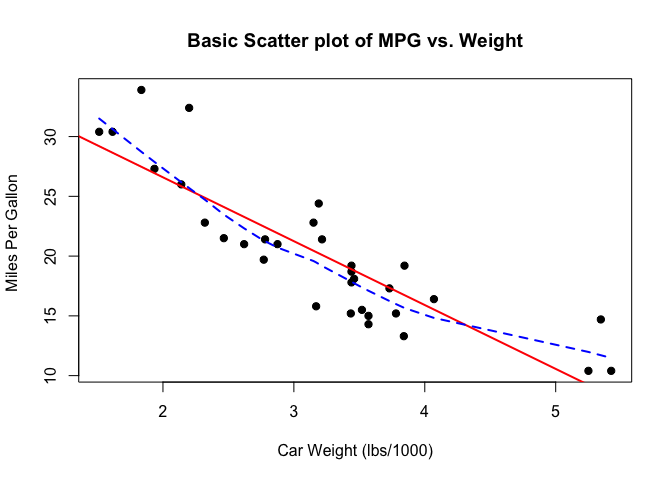<!-- -->

- 代码清单11-1中的代码加载了mtcars数据框，创建了一幅基本的散点图，图形的符号是实心圆圈。与预期结果相同，随着车重的增加，每加仑英里数减少，虽然它们不是完美的线性关系。`abline()`函数用来添加最佳拟合的线性直线，而`lowess()`函数则用来添加一条平滑曲线。该平滑曲线拟合是一种基于局部加权多项式回归的非参数方法。

- **注意：R有两个平滑曲线拟合函数：`lowess()`和`loess()`。`loess()`是基于`lowess()`表达式版本的更新和更强大的拟合函数。这两个函数的默认值不同，因此要小心使用，不要把它们弄混淆了。**

- car包中的`scatterplot()`函数增强了散点图的许多功能，它可以很方便地绘制散点图，并能添加拟合曲线、边界箱线图和置信椭圆，还可以按子集绘图和交互式地识别点。例如，以下代码可生成一个比之前图形更复杂的版本：

``` r
> library(car)  
> scatterplot(mpg ~ wt | cyl, data=mtcars, lwd=2, span=0.75,         
+             main="Scatter Plot of MPG vs. Weight by # Cylinders",        
+             xlab="Weight of Car (lbs/1000)",         
+             ylab="Miles Per Gallon",       
+             legend.plot=TRUE,          
+             boxplots="xy"
+ )
```

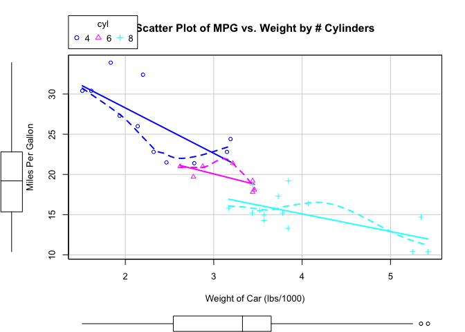<!-- -->

- 此处，`scatterplot()`函数用来绘制四缸、六缸和八缸汽车每加仑英里数对车重的图形。表达式`mpg ~ wt | cyl`表示按条件绘图(即按cyl的水平分别绘制mpg和wt的关系图)。默认地，各子集会通过颜色和图形符号加以区分，并同时绘制线性拟合和平滑拟合曲线。span参数控制loess曲线中的平滑量。它的参数值越大，拟合得就越好。此图中可以看到,给定Toyata
  Corolla和Fiat128的车重，通常每加仑燃油可行驶得更远。`legend.plot`选项表明在左上边界添加图例，而mpg和weight的边界箱线图可通过boxplots选项来绘制。总之，`scatterplot()`函数还有许多特性值得探究，比如本节未讨论的稳健性选项和数据集中度椭圆选项。更多细节可参见`help(scatterplot)`。

### 8_1.1.1 散点图矩阵

- `pairs()`函数可以创建基础的散点图矩阵。下面的代码生成了一个散点图矩阵，包含mpg、disp、drat和wt四个变量：

``` r
> pairs(~mpg+disp+drat+wt, data=mtcars,    
+       main="Basic Scatter Plot Matrix")
```

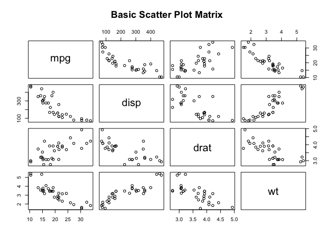<!-- -->

- 图中包含\~右边的所有变量。在上图中，可以看到所有指定变量间的二元关系。例如，mpg和disp的散点图可在两变量的行列交叉处找到。值得注意的是，主对角线的上方和下方的六幅散点图是相同的，这也是为了方便摆放图形的缘故。通过调整参数，可以只展示下三角或者上三角的图形。例如，选项`upper.panel = NULL`将只生成下三角的图形。

``` r
> pairs(~mpg+disp+drat+wt, data=mtcars,    
+       main="Basic Scatter Plot Matrix",
+       upper.panel = NULL)
```

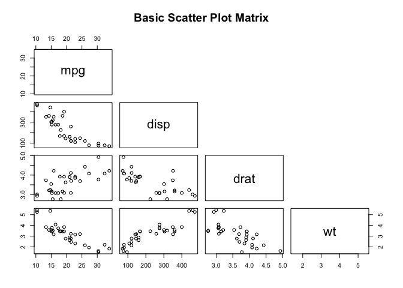<!-- -->

- car包中的`scatterplotMatrix()`函数也可以生成散点图矩阵，并有以下可选操作：

- 1、以某个因子为条件绘制散点图矩阵；

- 2、包含线性和平滑拟合曲线；

- 3、在主对角线放置箱线图、密度图或者直方图；

- 4、在各单元格的边界添加轴须图。

``` r
> library(car) 
> scatterplotMatrix(~ mpg + disp + drat + wt, data=mtcars,          
+                   spread=FALSE, smoother.args=list(lty=2),      
+                   main="Scatter Plot Matrix via car Package")
```

<!-- -->

- 可以看到线性和平滑(loess)拟合曲线被默认添加，主对角线处添加了核密度曲线和轴须图。`spread = FALSE`选项表示不添加展示分散度和对称信息的直线，`smoother.args=list(lty=2)`设定平滑(loess)拟合曲线使用虚线而不是实线。

- R提供了许多其他的方式来创建散点图矩阵。包括：glus包中的`cpars()`函数，TeachingDemos包中的`pairs2()`函数，HH包中的`xysplom()`函数，ResourceSelection包中的`kepairs()`函数和SMPracticals包中的`pairs.mod()`函数。每个包都加入了自己独特的曲线。

### 8_1.1.2 高密度散点图

- 当数据点重叠很严重时，用散点图来观察变量关系就显得”力不从心”了。下面是一个人为设计的例子，其中10000个观测点分布在两个重叠的数据群中：

``` r
> set.seed(1234) 
> n <- 10000 
> c1 <- matrix(rnorm(n, mean=0, sd=.5), ncol=2) 
> c2 <- matrix(rnorm(n, mean=3, sd=2), ncol=2) 
> mydata <- rbind(c1, c2) 
> mydata <- as.data.frame(mydata) 
> names(mydata) <- c("x", "y")
> # 生成一幅标准的散点图
> with(mydata,    
+      plot(x, y, pch=19, main="Scatter Plot with 10,000 Observations"))
```

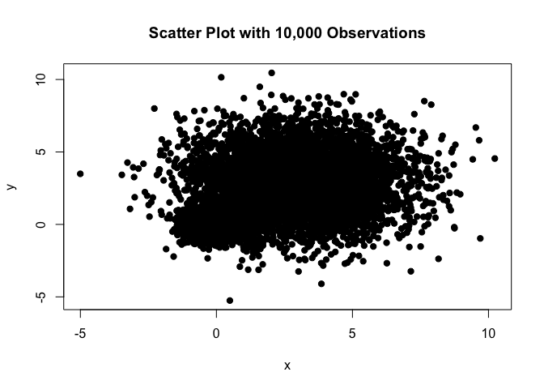<!-- -->

- 在上图中，数据点的重叠导致识别x与y间的关系变得异常困难。针对这种情况，可以使用封箱、颜色和透明度来指明图中任意点上重叠点的数目。`smoothScatter()`函数可利用核密度估计生成用颜色密度来表示点分布的散点图。代码如下：

``` r
> with(mydata,    
+      smoothScatter(x, y, main="Scatter Plot Colored by Smoothed Densities"))
```

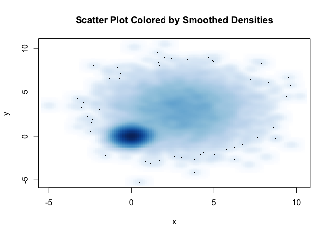<!-- -->

- 与上面的方法不同，hexbin包中的`hexbin()`函数将二元变量的封箱放到六边形单元格中(图形比名称更直观)。示例如下：

``` r
> library(hexbin) 
> with(mydata, {   
+   bin <- hexbin(x, y, xbins=50)   
+   plot(bin, main="Hexagonal Binning with 10,000 Observations")     
+   })
```

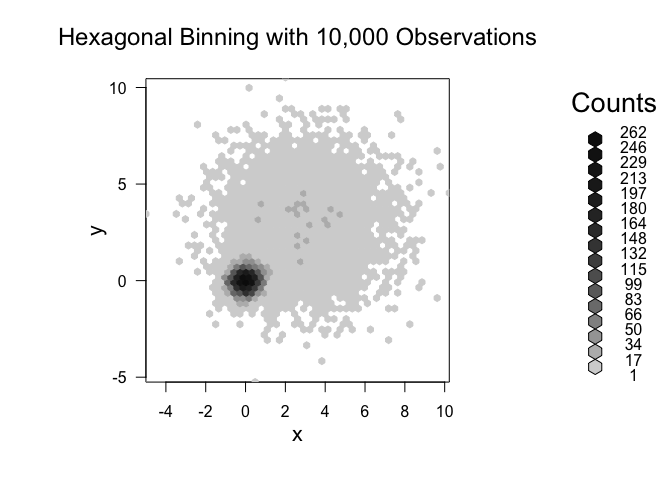<!-- -->

- 用六边形封箱图展示的各点上覆盖观测点数目的散点图。通过图例，数据的集中度很容易计算和观察。

- 综上可见，基础包中的`smoothScatter()`函数以及IDPmisc包中的`ipairs()`函数都可以对大数据集创建可读性较好的散点图矩阵。通过`?smoothScatter`和`?ipairs`可获得更多的示例。

### 8_1.1.3 三维散点图

- 散点图和散点图矩阵展示的都是二元变量关系。倘若想一次对三个定量变量的交互关系进行可视化，可以使用三维散点图。例如，想研究汽车英里数、车重和排量间的关系，可用scatterplot3d包中的`scatterplot3d()`函数来绘制它们的关系。格式如下：

  `scatterplot3d(x, y, z)`

  x被绘制在水平轴上，y被绘制在竖直轴上，z被绘制在透视轴上。继续之前的例子：

``` r
> library(scatterplot3d) 
> attach(mtcars) 
> scatterplot3d(wt, disp, mpg,    
+               main="Basic 3D Scatter Plot")
```

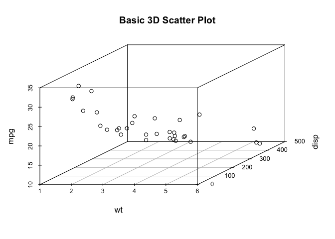<!-- -->

- `satterplot3d()`函数提供了许多选项，包括设置图形符号、轴、颜色、线条、网格线、突出显示和角度等功能。例如代码：

``` r
> library(scatterplot3d)
> attach(mtcars) 
> scatterplot3d(wt, disp, mpg,         
+               pch=16,            
+               highlight.3d=TRUE,    
+               type="h",           
+               main="3D Scatter Plot with Vertical Lines")
```

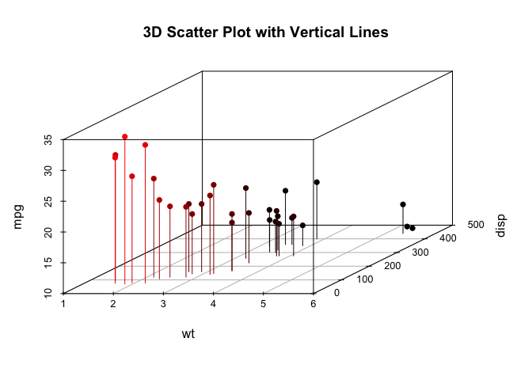<!-- -->

- 生成一幅突出显示效果的三维散点图，增强了纵深感，添加了连接点与水平面的垂直线。

- 在上图添加一个回归面。所需代码为：

``` r
> library(scatterplot3d)
> attach(mtcars)
> s3d <-scatterplot3d(wt, disp, mpg,   
+                     pch=16,  
+                     highlight.3d=TRUE, 
+                     type="h",  
+                     main="3D Scatter Plot with Vertical Lines and Regression Plane") 
> fit <- lm(mpg ~ wt+disp)
> s3d$plane3d(fit)
```

<!-- -->

- 图形利用多元回归方程，对通过车重和排量预测每加仑英里数进行了可视化处理。平面代表预测值，图中的点是实际值。平面到点的垂直距离表示残差值。若点在平面之上则表明它的预测值被低估了，而点在平面之下则表明它的预测值被高估了。

### 8_1.1.4 旋转三维散点图

- 安装rgl包

- 如果能对三维散点图进行交互式操作，那么图形将会更好解释。可用rgl包中的`plot3d()`函数创建可交互的三维散点图。能通过鼠标对图形进行旋转。函数格式为：

  `plot3d(x, y, z)`

  其中x、y和z是数值型向量，代表着各个点。还可以添加如col和size这类的选项来分别控制点的颜色和大小。继续上面的例子，使用代码：

<!-- -->

    library(rgl) 
    attach(mtcars) 
    plot3d(wt, disp, mpg, col="red", size=5)

- 也可以使用car包中类似的函数`scatter3d()`：

<!-- -->

    library(car) 
    with(mtcars,   
         scatter3d(wt, disp, mpg))

- `scatter3d()`函数可包含各种回归曲面，比如线性、二次、平滑和附加等类型。图形默认添加线性平面。另外，函数中还有可用于交互式识别点的选项。通过`help(scatter3d)`可获得函数的更多细节。

### 8_1.1.5 气泡图

- 气泡图(bubble
  plot)：先创建一个二维散点图，然后用点的大小来代表第三个变量的值。可用`symbols()`函数来创建气泡图。该函数可以在指定的(x,
  y)坐标上绘制圆圈图、方形图、星形图、温度计图和箱线图。以绘制圆圈图为例：

  `symbols(x, y, circle=radius)`

  其中x、y和radius是需要设定的向量，分别表示x、y坐标和圆圈半径。

- 如想用面积而不是半径来表示第三个变量，那么按照圆圈半径的公式变换即可：

  `symbols(x, y, circle=sqrt(z/pi))`

  z即第三个要绘制的变量。

- 现在把该方法应用到mtcars数据集上，x轴代表车重，y轴代表每加仑英里数，气泡大小代表发动机排量。代码如下：

``` r
> attach(mtcars) 
> r <- sqrt(disp/pi)
> symbols(wt, mpg, circle=r, inches=0.30,   # 选项inches是比例因子,控制着圆圈大小(默认最大圆圈为1英寸)   
+         fg="white", bg="lightblue",   
+         main="Bubble Plot with point size proportional to displacement",        
+         ylab="Miles Per Gallon",    
+         xlab="Weight of Car (lbs/1000)") 
> text(wt, mpg, rownames(mtcars), cex=0.6) # text()函数是可选函数,此处用来添加各个汽车的名称
```

<!-- -->

``` r
> detach(mtcars)
```

- 从图中可以看到，随着每加仑汽油所行驶里程的增加，车重和发动机排量都逐渐减少。

- 一般来说，统计人员使用R时都倾向于避免用气泡图，原因和避免使用饼图一样：相比对长度的判断，人们对体积/面积的判断通常更困难。

- 虽然散点图很简单，但是它们能以最直接的方式展示数据，发现可能会被忽略的隐藏关系。

## 8_1.2 折线图

- 如果将散点图上的点从左往右连接起来，就会得到一个折线图。以基础安装中的Orange数据集为例，它包含五种橘树的树龄和年轮数据。现要考察第一种橘树的生长情况，下方，左图为散点图，右图为折线图。可以看到，折线图是一个刻画变动的优秀工具。

- 代码清单11-2 创建散点图和折线图

``` r
> opar <- par(no.readonly=TRUE) 
> par(mfrow=c(1,2))  
> t1 <- subset(Orange, Tree==1) 
> plot(t1$age, t1$circumference,    
+      xlab="Age (days)",   
+      ylab="Circumference (mm)",    
+      main="Orange Tree 1 Growth") 
> plot(t1$age, t1$circumference,   
+      xlab="Age (days)",   
+      ylab="Circumference (mm)",    
+      main="Orange Tree 1 Growth",   
+      type="b")
```

<!-- -->

``` r
> par(opar)
```

- 上方两幅图的主要区别取决于参数type=“b”。折线图一般可用下列两个函数之一来创建：

  `plot(x, y, type=)`

  `lines(x, y, type=)`

  其中，x和y是要连接的(x, y)点的数值型向量。参数type=的可选值见下表：

| 类 型 | 图形外观                                           |
|-------|----------------------------------------------------|
| p     | 只有点。                                           |
| l     | 只有线。                                           |
| o     | 实心点和线(即线覆盖在点上)。                       |
| b、c  | 线连接点(c 时不绘制点)。                           |
| s、S  | 阶梯线。                                           |
| h     | 直方图式的垂直线。                                 |
| n     | 不生成任何点和线(通常用来为后面的命令创建坐标轴)。 |


- type=“p”生成了典型的散点图。type=“b”是最常见的折线图，b和c间的不同之处在于点是否出现或者线之间是否有空隙。type=“s”和type=“S”都生成阶梯线(阶梯函数)，但第一种类型是先横着画线,然后再上升,而第二种类型则是先上升，再横着画线。

- **注意，`plot()`和`lines()`函数工作原理并不相同。`plot()`函数是在被调用时创建一幅新图，而`lines()`函数则是在已存在的图形上添加信息，并不能自己生成图形**。因此，`lines()`函数通常是在`plot()`函数生成一幅图形后再被调用。如果对图形有要求，可以先通过`plot()`函数中的`type="n"`选项来创建坐标轴、标题和其他图形特征，然后再使用`lines()`函数添加各种需要绘制的曲线。

- 代码清单11-3 展示五种橘树随时间推移的生长状况的折线图

``` r
> Orange$Tree <- as.numeric(Orange$Tree) # 为方便起见,将因子转化为数值型
> ntrees <- max(Orange$Tree)  
> # 创建图形
> xrange <- range(Orange$age)
> yrange <- range(Orange$circumference) 
> plot(xrange, yrange,     
+      type="n",   
+      xlab="Age (days)", 
+      ylab="Circumference (mm)"  )  
> colors <- rainbow(ntrees) 
> linetype <- c(1:ntrees) 
> plotchar <- seq(18, 18+ntrees, 1) 
> # 添加线条
> for (i in 1:ntrees) {   
+   tree <- subset(Orange, Tree==i)   
+   lines(tree$age, tree$circumference,   
+         type="b",        
+         lwd=2,         
+         lty=linetype[i],    
+         col=colors[i],       
+         pch=plotchar[i]   
+         )
+   }  
> title("Tree Growth", "example of line plot")
> # 添加图例
> legend(xrange[1], yrange[2],   
+        1:ntrees,  
+        cex=0.8,       
+        col=colors,       
+        pch=plotchar,      
+        lty=linetype,       
+        title="Tree"  
+        )
```

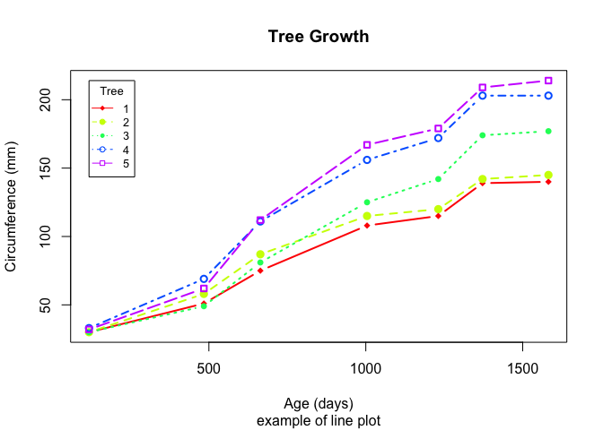<!-- -->

- `plot()`函数先用来创建空图形，只设定了轴标签和轴范围，并没有绘制任何数据点，每种橘树独有的折线和点都是随后通过`lines()`函数来添加的。可以看到，Tree
  4和Tree 5在整个时间段中一直保持着最快的生长速度，而且Tree
  5在大约664天的时候超过了Tree 4。

## 8_1.3 相关图

- 以mtcars数据框中的变量相关性为例，它含有11个变量，对每个变量都测量了32辆汽车。利用下面的代码，可以获得该数据的相关系数：

``` r
> options(digits=2)  
> cor(mtcars)
       mpg   cyl  disp    hp   drat    wt   qsec    vs     am  gear   carb
mpg   1.00 -0.85 -0.85 -0.78  0.681 -0.87  0.419  0.66  0.600  0.48 -0.551
cyl  -0.85  1.00  0.90  0.83 -0.700  0.78 -0.591 -0.81 -0.523 -0.49  0.527
disp -0.85  0.90  1.00  0.79 -0.710  0.89 -0.434 -0.71 -0.591 -0.56  0.395
hp   -0.78  0.83  0.79  1.00 -0.449  0.66 -0.708 -0.72 -0.243 -0.13  0.750
drat  0.68 -0.70 -0.71 -0.45  1.000 -0.71  0.091  0.44  0.713  0.70 -0.091
wt   -0.87  0.78  0.89  0.66 -0.712  1.00 -0.175 -0.55 -0.692 -0.58  0.428
qsec  0.42 -0.59 -0.43 -0.71  0.091 -0.17  1.000  0.74 -0.230 -0.21 -0.656
vs    0.66 -0.81 -0.71 -0.72  0.440 -0.55  0.745  1.00  0.168  0.21 -0.570
am    0.60 -0.52 -0.59 -0.24  0.713 -0.69 -0.230  0.17  1.000  0.79  0.058
gear  0.48 -0.49 -0.56 -0.13  0.700 -0.58 -0.213  0.21  0.794  1.00  0.274
carb -0.55  0.53  0.39  0.75 -0.091  0.43 -0.656 -0.57  0.058  0.27  1.000
```

- 利用corrgram包中的`corrgram()`函数，可以用图形的方式展示该相关系数矩阵：

- 安装corrgram包。

``` r
> library(corrgram) 
> corrgram(mtcars, order=TRUE, lower.panel=panel.shade,   
+          upper.panel=panel.pie, text.panel=panel.txt,   
+          main="Corrgram of mtcars intercorrelations")
```

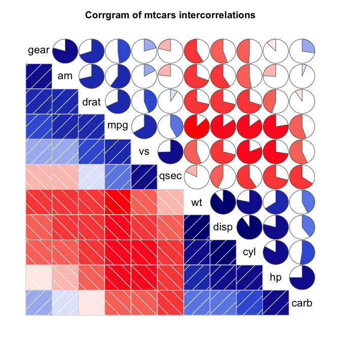<!-- -->

- 先从下三角单元格(在主对角线下方的单元格)开始解释这幅图形。默认地，蓝色和从左下指向右上的斜杠表示单元格中的两个变量呈正相关。反过来，红色和从左上指向右下的斜杠表示变量呈负相关。色彩越深，饱和度越高，说明变量相关性越大。相关性接近于0的单元格基本无色。本图为了将有相似相关模式的变量聚集在一起，对矩阵的行和列都重新进行了排序(使用主成分法)
  。从图中含阴影的单元格中可以看到：gear、am、drat和mpg相互间呈正相关，wt、disp、hp和carb相互间也呈正相关。但第一组变量与第二组变量呈负相关。还可以看到carb和am、vs和gear、vs和am以及drat和qsec四组变量间的相关性很弱。

- 上三角单元格用饼图展示了相同的信息。颜色的功能同上，但相关性大小由被填充的饼图块的大小来展示。正相关性将从12点钟处开始顺时针填充饼图，而负相关性则逆时针方向填充饼图。

- `corrgram()`函数的格式如下：

  `corrgram(x, order=, panel=, text.panel=, diag.panel=)`

  其中，x是一行一个观测的数据框。当order=TRUE时，相关矩阵将使用主成分分析法对变量重排序，这将使得二元变量的关系模式更为明显。选项panel设定非对角线面板使用的元素类型。可以通过选项`lower.panel`和`upper.panel`来分别设置主对角线下方和上方的元素类型。而`text.panel`和`diag.panel`选项控制着主对角线元素类型。可用的panel值见下表：

| 位 置    | 面板选项      | 描 述                              |
|----------|---------------|------------------------------------|
| 非对角线 | panel.pie     | 用饼图的填充比例来表示相关性大小。 |
|          | panel.shade   | 用阴影的深度来表示相关性大小。     |
|          | panel.ellipse | 画一个置信椭圆和平滑曲线。         |
|          | panel.pts     | 画一个散点图。                     |
|          | panel.conf    | 画出相关性及置信区间。             |
| 主对角线 | panel.txt     | 输出变量名。                       |
|          | panel.minmax  | 输出变量的最大最小值和变量名。     |
|          | panel.ednsity | 输出核密度曲线和变量名。           |

``` r
> library(corrgram) 
> corrgram(mtcars, order=TRUE, lower.panel=panel.ellipse,    
+          upper.panel=panel.pts, text.panel=panel.txt,   
+          diag.panel=panel.minmax,     
+          main="Corrgram of mtcars data using scatter plots         
+          and ellipses")
```

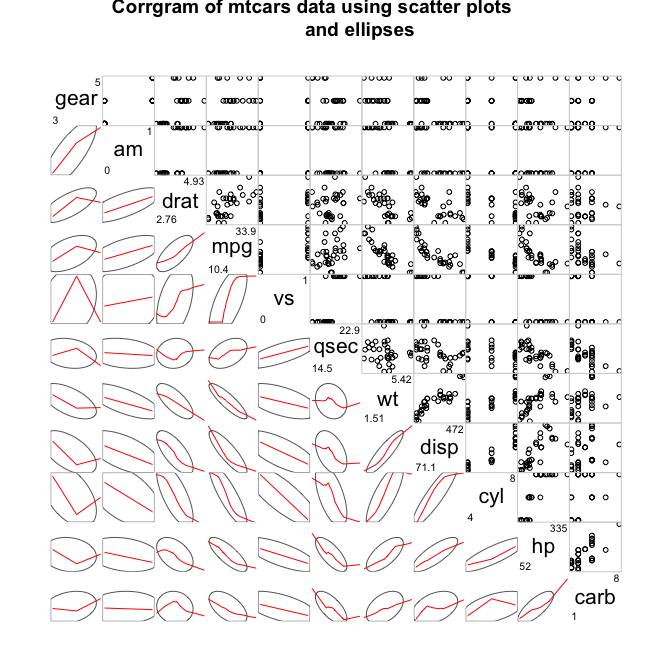<!-- -->

- 上图是mtcars数据框中变量的相关系数图。下三角区域包含平滑拟合曲线和置信椭圆，上三角区域包含散点图。主对角面板包含变量最小和最大值。矩阵的行和列利用主成分分析法进行了重排序。

``` r
> library(corrgram)  
> corrgram(mtcars, lower.panel=panel.shade,  
+          upper.panel=NULL, text.panel=panel.txt,    
+          main="Car Mileage Data (unsorted)")
```

<!-- -->

- 上图为mtcars数据框中变量的相关系数图。下三角区域的阴影代表相关系数的大小和正负，变量按初始顺序排列，上三角区域留白。

- 可自主控制`corrgram()`函数中使用的颜色。例如，在`col.corrgram()`函数中用`colorRampPallette()`函数来指定四种颜色：

``` r
> library(corrgram)
> cols <- colorRampPalette(c("darkgoldenrod4", "burlywood1",   
+                            "darkkhaki", "darkgreen")) 
> corrgram(mtcars, order=TRUE, col.regions=cols,   
+          lower.panel=panel.shade,        
+          upper.panel=panel.conf, text.panel=panel.txt,      
+          main="A Corrgram (or Horse) of a Different Color")
```

<!-- -->

## 8_1.4 马赛克图

- 在马赛克图中，嵌套矩形面积正比于单元格频率，其中该频率即多维列联表中的频率。颜色和/或阴影可表示拟合模型的残差值。

- vcd包中的`mosaic()`函数可以绘制马赛克图。(R基础安装中的`mosaicplot()`也可绘制马赛克图，但还是推荐vcd包，因为它具有更多扩展功能。)以基础安装中的Titanic数据集为例，它包含存活或者死亡的乘客数、乘客的船舱等级(一等、二等、三等和船员)、性别(男性、女性)，以及年龄层(儿童、成人)。这是一个被充分研究过的数据集。利用如下代码可以看到分类细节：

``` r
> ftable(Titanic)
                   Survived  No Yes
Class Sex    Age                   
1st   Male   Child            0   5
             Adult          118  57
      Female Child            0   1
             Adult            4 140
2nd   Male   Child            0  11
             Adult          154  14
      Female Child            0  13
             Adult           13  80
3rd   Male   Child           35  13
             Adult          387  75
      Female Child           17  14
             Adult           89  76
Crew  Male   Child            0   0
             Adult          670 192
      Female Child            0   0
             Adult            3  20
```

- `mosaic()`函数可按如下方式调用：

  `mosaic(table)`

  其中table是数组形式的列联表。另外，也可用：

  `mosaic(formula, data=)`

  其中formula是标准的R表达式，data设定一个数据框或者表格。添加选项`shade=TRUE`将根据拟合模型的皮尔逊残差值对图形上色，添加选项`legend=TRUE`将展示残差的图例。

- 例如使用下列代码：

``` r
> library(vcd) 
> mosaic(Titanic, shade=TRUE, legend=TRUE)
```

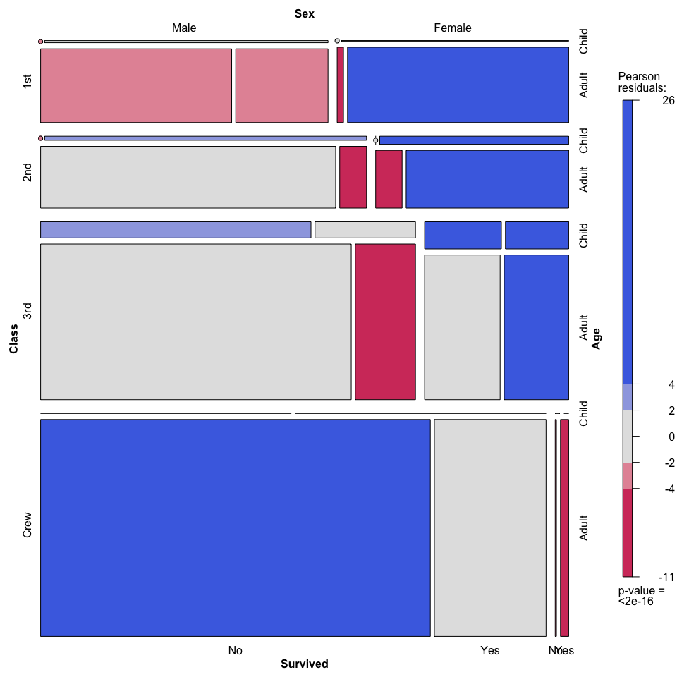<!-- -->

- 和：

``` r
> library(vcd) 
> mosaic(~Class+Sex+Age+Survived, data=Titanic, shade=TRUE, legend=TRUE)
```

<!-- -->

- 都将生成一样的图，但表达式版本的代码可对图形中变量的选择和摆放拥有更多的控制权。

- 马赛克图隐含着大量的数据信息。例如：

- (1)从船员到头等舱，存活率陡然提高；

- 2)  大部分孩子都处在三等舱和二等舱中；

- 3)  在头等舱中的大部分女性都存活了下来，而三等舱中仅有一半女性存活；

- 4)  船员中女性很少，导致该组的Survived标签重叠(图底部的No和Yes)。

- 扩展的马赛克图添加了颜色和阴影来表示拟合模型的残差值。在本例中，蓝色阴影表明，在假定生存率与船舱等级、性别和年龄层无关的条件下，该类别下的生存率通常超过预期值。红色阴影则含义相反。图形表明，在模型的独立条件下，头等舱女性存活数和男性船员死亡数超过模型预期值。如果存活数与船舱等级、性别和年龄层独立，三等舱男性的存活数比模型预期值低。运行`example(mosaic)`，可以了解更多马赛克图的细节。
