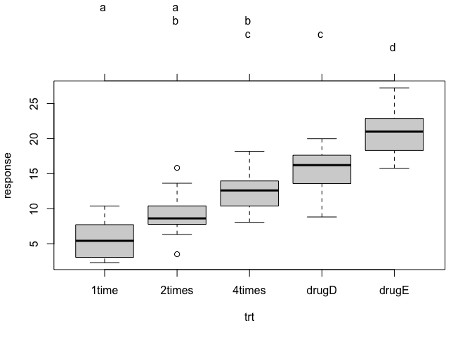
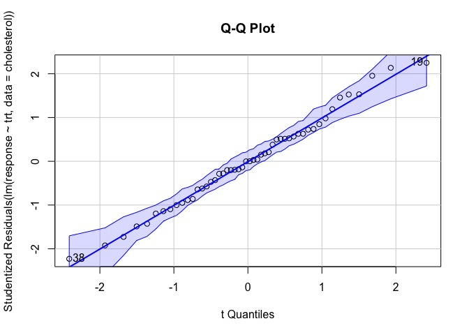
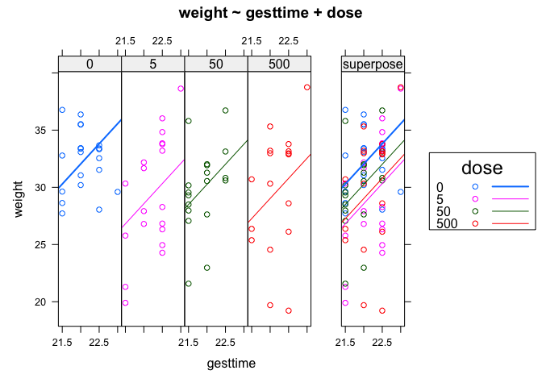
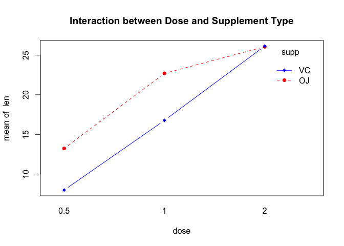
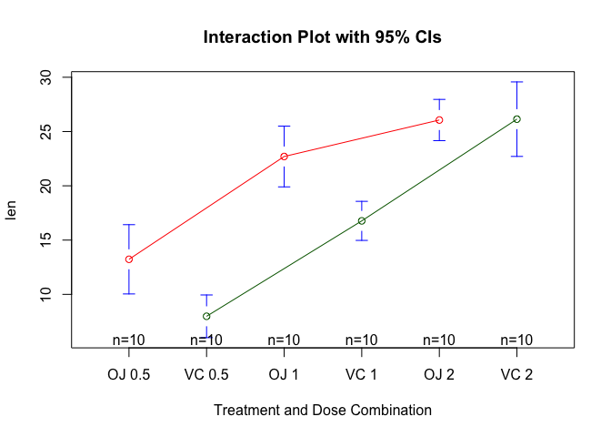
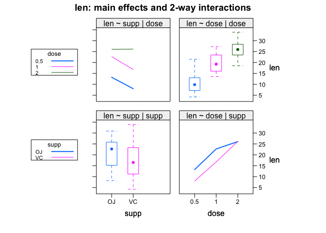
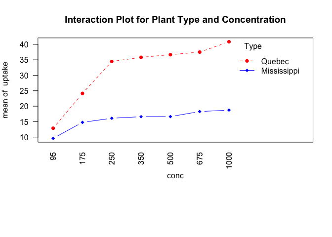
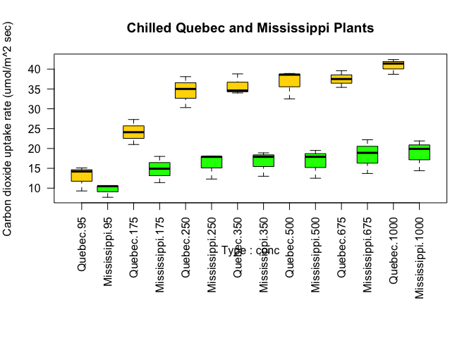

chapter04_方差分析与Kruskal-Wallis检验
================

- <a href="#4-方差分析与kruskal-wallis检验"
  id="toc-4-方差分析与kruskal-wallis检验">4
  方差分析与Kruskal-Wallis检验</a>
  - <a href="#41-方差分析用途" id="toc-41-方差分析用途">4.1 方差分析用途</a>
  - <a href="#42-方差分析应用条件" id="toc-42-方差分析应用条件">4.2
    方差分析应用条件</a>
  - <a href="#43-不满足方差分析应用条件时处理方法"
    id="toc-43-不满足方差分析应用条件时处理方法">4.3
    不满足方差分析应用条件时处理方法</a>
  - <a href="#44-多个样本均数的两两比较单因素方差分析"
    id="toc-44-多个样本均数的两两比较单因素方差分析">4.4
    多个样本均数的两两比较（单因素方差分析）</a>
    - <a href="#441-one-way-anova" id="toc-441-one-way-anova">4.4.1 One-way
      ANOVA</a>
    - <a href="#442-tukey-hsd-pairwise-group-comparisons"
      id="toc-442-tukey-hsd-pairwise-group-comparisons">4.4.2 Tukey HSD
      pairwise group comparisons</a>
    - <a href="#443-正态分布检验q-q图法"
      id="toc-443-正态分布检验q-q图法">4.4.3 正态分布检验（Q-Q图法）</a>
    - <a href="#444-方差齐性分析bartlett法"
      id="toc-444-方差齐性分析bartlett法">4.4.4 方差齐性分析（bartlett法）</a>
    - <a href="#445-one-way-ancova单因素协方差分析"
      id="toc-445-one-way-ancova单因素协方差分析">4.4.5 One-way
      ANCOVA（单因素协方差分析）</a>
    - <a href="#446-对用户定义的对照进行多重比较glht函数"
      id="toc-446-对用户定义的对照进行多重比较glht函数">4.4.6
      对用户定义的对照进行多重比较（glht函数）</a>
    - <a href="#447-评估检验的假设条件" id="toc-447-评估检验的假设条件">4.4.7
      评估检验的假设条件</a>
  - <a href="#45-双因素方差分析two-way-anova"
    id="toc-45-双因素方差分析two-way-anova">4.5 双因素方差分析（Two way
    ANOVA）</a>
    - <a href="#451-重复测量的方差分析" id="toc-451-重复测量的方差分析">4.5.1
      重复测量的方差分析</a>
  - <a href="#46-kruskal-wallisi检验和friedman检验"
    id="toc-46-kruskal-wallisi检验和friedman检验">4.6
    Kruskal-Wallisi检验和Friedman检验</a>
    - <a href="#461-kruskal-nallis检验" id="toc-461-kruskal-nallis检验">4.6.1
      Kruskal-.Nallis检验</a>
    - <a href="#462-friedman检验" id="toc-462-friedman检验">4.6.2
      Friedman检验</a>
    - <a href="#463-kruskaltest案例" id="toc-463-kruskaltest案例">4.6.3
      kruskal.test案例</a>
    - <a href="#464-friedman的两两比较" id="toc-464-friedman的两两比较">4.6.4
      Friedman的两两比较</a>

Source：

[【B站】从零开始学 R
语言，带你玩转医学统计学](https://www.bilibili.com/video/BV1JU4y1f7zg/?spm_id_from=333.1007.top_right_bar_window_custom_collection.content.click&vd_source=fa22bae99c47db3f7bc43573bd9b3ed3)

# 4 方差分析与Kruskal-Wallis检验

## 4.1 方差分析用途

- 检验两个或多个样本均数间的差异有无统计学意义；**注意：两个样本均数的比较可以采用t检验或F检验，两个以上样本均数的比较只能用F检验**。
- 回归方程的线性假设检验；
- 检验两个或多个因素间有无交互作用。

## 4.2 方差分析应用条件

- 各个样本是相互独立的随机样本；
- 各个样本来自正态总体；
- 各个处理组的总体方差方差相等，即方差齐。

## 4.3 不满足方差分析应用条件时处理方法

- 进行变量变换，以达到方差齐或正态的要求；
- 采用非参数法（秩和检验）；
- 使用近似F检验。

## 4.4 多个样本均数的两两比较（单因素方差分析）

- 由于涉及的对比组数大于2，就不能应用前面介绍的t检验。若仍用前述前述的t检验方法，对每两个对比组作比较，会使犯第类错误(拒绝了实际上成立的H0所犯的错误)的概率α增大，即可能把本来无差别的两个总体均数判为有差别。

### 4.4.1 One-way ANOVA

``` r
> par(ask=TRUE)
> opar <- par(no.readonly=TRUE) # save original parameters
> 
> library(multcomp)
> attach(cholesterol)
> table(trt)     
trt
 1time 2times 4times  drugD  drugE 
    10     10     10     10     10 
> aggregate(response, by=list(trt), FUN=mean) 
  Group.1        x
1   1time  5.78197
2  2times  9.22497
3  4times 12.37478
4   drugD 15.36117
5   drugE 20.94752
> aggregate(response, by=list(trt), FUN=sd) 
  Group.1        x
1   1time 2.878113
2  2times 3.483054
3  4times 2.923119
4   drugD 3.454636
5   drugE 3.345003
> fit <- aov(response ~ trt)                                  
> summary(fit)
            Df Sum Sq Mean Sq F value   Pr(>F)    
trt          4 1351.4   337.8   32.43 9.82e-13 ***
Residuals   45  468.8    10.4                     
---
Signif. codes:  0 '***' 0.001 '**' 0.01 '*' 0.05 '.' 0.1 ' ' 1
> 
> library(gplots)
> plotmeans(response ~ trt, xlab="Treatment", ylab="Response", 
+           main="Mean Plot\nwith 95% CI")
```

<!-- -->

``` r
> detach(cholesterol)
```

- `table()`函数可以查看每个因子水平组合的计数。

- `aggregate()`函数可以分组计算均数和标准差。

- 在进行方差分析时，最好赋值到一个对象fit，方便后面的直接使用。

- summary可以看出p值小于0.001，说明至少有两组数据均值之间存在差异。

### 4.4.2 Tukey HSD pairwise group comparisons

``` r
> TukeyHSD(fit)
  Tukey multiple comparisons of means
    95% family-wise confidence level

Fit: aov(formula = response ~ trt)

$trt
                  diff        lwr       upr     p adj
2times-1time   3.44300 -0.6582817  7.544282 0.1380949
4times-1time   6.59281  2.4915283 10.694092 0.0003542
drugD-1time    9.57920  5.4779183 13.680482 0.0000003
drugE-1time   15.16555 11.0642683 19.266832 0.0000000
4times-2times  3.14981 -0.9514717  7.251092 0.2050382
drugD-2times   6.13620  2.0349183 10.237482 0.0009611
drugE-2times  11.72255  7.6212683 15.823832 0.0000000
drugD-4times   2.98639 -1.1148917  7.087672 0.2512446
drugE-4times   8.57274  4.4714583 12.674022 0.0000037
drugE-drugD    5.58635  1.4850683  9.687632 0.0030633
> par(las=1)
> par(mar=c(5,8,4,2)) 
> plot(TukeyHSD(fit))
```

<!-- -->

``` r
> par(opar)
```

- 要注意图中95%的置信区间是否跨过了0刻度线，一旦跨过了，该两组之间比较则无意义。图中，2times-1time，4times-2times，drugD-4times这三组比较无意义。

- 多重比较的箱线图和标记字母法连用

``` r
> # Multiple comparisons the multcomp package
> library(multcomp)
> par(mar=c(5,4,6,2))
> tuk <- glht(fit, linfct=mcp(trt="Tukey"))
> plot(cld(tuk, level=.05),col="lightgrey")
```

<!-- -->

``` r
> par(opar)
```

### 4.4.3 正态分布检验（Q-Q图法）

``` r
> library(car)
> qqPlot(lm(response ~ trt, data=cholesterol), 
+        simulate=TRUE, main="Q-Q Plot", labels=FALSE)
```

<!-- -->

    [1] 19 38

- 所有的点都落在95%的置信区间内，说明符合正态分布。

### 4.4.4 方差齐性分析（bartlett法）

``` r
> bartlett.test(response ~ trt, data=cholesterol)

    Bartlett test of homogeneity of variances

data:  response by trt
Bartlett's K-squared = 0.57975, df = 4, p-value = 0.9653
```

- p值大于0.1，说明符合方差齐性假设。

- 方差齐性分析对离群点非常敏感。可利用car包中的`outlierTest()`函数来检测离群点：

``` r
> library(car)
> outlierTest(fit)
No Studentized residuals with Bonferroni p < 0.05
Largest |rstudent|:
   rstudent unadjusted p-value Bonferroni p
19 2.251149           0.029422           NA
```

- No Studentized residuals with Bonferroni p \< 0.05，说明未发现离群点。

### 4.4.5 One-way ANCOVA（单因素协方差分析）

``` r
> data(litter, package="multcomp")
> attach(litter)
> table(dose) 
dose
  0   5  50 500 
 20  19  18  17 
> aggregate(weight, by=list(dose), FUN=mean)
  Group.1        x
1       0 32.30850
2       5 29.30842
3      50 29.86611
4     500 29.64647
> fit <- aov(weight ~ gesttime + dose)                             
> summary(fit)
            Df Sum Sq Mean Sq F value  Pr(>F)   
gesttime     1  134.3  134.30   8.049 0.00597 **
dose         3  137.1   45.71   2.739 0.04988 * 
Residuals   69 1151.3   16.69                   
---
Signif. codes:  0 '***' 0.001 '**' 0.01 '*' 0.05 '.' 0.1 ' ' 1
```

- gesttime和dose的p值都小于0.05，说明两者与小鼠的体重之间都有关系。

- 由于使用了协变量，你可能想要获取调整的组均值，即去除协变量效应后的组均值。可使用effects包中的`effects()`函数来计算调整的均值：

``` r
> # Obtaining adjusted means
> library(effects)
> effect("dose", fit)

 dose effect
dose
       0        5       50      500 
32.35367 28.87672 30.56614 29.33460 
```

### 4.4.6 对用户定义的对照进行多重比较（glht函数）

``` r
> library(multcomp)
> contrast <- rbind("no drug vs. drug" = c(3, -1, -1, -1))
> summary(glht(fit, linfct=mcp(dose=contrast)))

     Simultaneous Tests for General Linear Hypotheses

Multiple Comparisons of Means: User-defined Contrasts


Fit: aov(formula = weight ~ gesttime + dose)

Linear Hypotheses:
                      Estimate Std. Error t value Pr(>|t|)  
no drug vs. drug == 0    8.284      3.209   2.581    0.012 *
---
Signif. codes:  0 '***' 0.001 '**' 0.01 '*' 0.05 '.' 0.1 ' ' 1
(Adjusted p values reported -- single-step method)
```

- 对照c(3,-1,-1,-1)设定第一组和其他三组的均值进行比较。假设检验的t统计量(2.581)在p\<0.05水平下显著，因此，可以得出未用药组比其他用药条件下的出生体重高的结论。其他对照可用`rbind()`函数添加。

### 4.4.7 评估检验的假设条件

- ANCOVA与ANOVA相同，都需要正态性和同方差性假设，可以用上节中相同的步骤来检验这些假设条件。另外，ANCOVA还假定回归斜率相同。本例中，假定四个处理组通过怀孕时间来预测出生体重的回归斜率都相同。ANCOVA模型包含怀孕时间×剂量的交互项时，可对回归斜率的同质性进行检验。交互效应若显著，则意味着时间和幼崽出生体重间的关系依赖于药物剂量的水平。

``` r
> library(multcomp)
> fit2 <- aov(weight ~ gesttime*dose, data=litter)
> summary(fit2)
              Df Sum Sq Mean Sq F value  Pr(>F)   
gesttime       1  134.3  134.30   8.289 0.00537 **
dose           3  137.1   45.71   2.821 0.04556 * 
gesttime:dose  3   81.9   27.29   1.684 0.17889   
Residuals     66 1069.4   16.20                   
---
Signif. codes:  0 '***' 0.001 '**' 0.01 '*' 0.05 '.' 0.1 ' ' 1
```

``` r
> # Visualizing a one-way ANCOVA
> library(HH)
> ancova(weight ~ gesttime + dose, data=litter)
Analysis of Variance Table

Response: weight
          Df  Sum Sq Mean Sq F value   Pr(>F)   
gesttime   1  134.30 134.304  8.0493 0.005971 **
dose       3  137.12  45.708  2.7394 0.049883 * 
Residuals 69 1151.27  16.685                    
---
Signif. codes:  0 '***' 0.001 '**' 0.01 '*' 0.05 '.' 0.1 ' ' 1
```

<!-- -->

## 4.5 双因素方差分析（Two way ANOVA）

- 双因素方差分析中，受试者被分配到两因子交叉类别组中。以基础安装包中的ToothGrowth数据集为例，随机分配60只豚鼠，分别采用两种喂食方法(橙汁或维生素C)，各喂食方法中抗坏血酸含量有三种水平（0.5mg、1mg或2mg），每种处理方式组合都被分配10只豚鼠。牙齿长度为因变量。

``` r
> attach(ToothGrowth)
> table(supp,dose)
    dose
supp 0.5  1  2
  OJ  10 10 10
  VC  10 10 10
> aggregate(len, by=list(supp,dose), FUN=mean)
  Group.1 Group.2     x
1      OJ     0.5 13.23
2      VC     0.5  7.98
3      OJ     1.0 22.70
4      VC     1.0 16.77
5      OJ     2.0 26.06
6      VC     2.0 26.14
> aggregate(len, by=list(supp,dose), FUN=sd)
  Group.1 Group.2        x
1      OJ     0.5 4.459709
2      VC     0.5 2.746634
3      OJ     1.0 3.910953
4      VC     1.0 2.515309
5      OJ     2.0 2.655058
6      VC     2.0 4.797731
> dose <- factor(dose) # 转变为因子变量
> fit3 <- aov(len ~ supp*dose) # fit3 <- aov(len~supp+dose+supp:dose)
> summary(fit3)
            Df Sum Sq Mean Sq F value   Pr(>F)    
supp         1  205.4   205.4  15.572 0.000231 ***
dose         2 2426.4  1213.2  92.000  < 2e-16 ***
supp:dose    2  108.3    54.2   4.107 0.021860 *  
Residuals   54  712.1    13.2                     
---
Signif. codes:  0 '***' 0.001 '**' 0.01 '*' 0.05 '.' 0.1 ' ' 1
```

- summary结果说明supp和dose都会影响牙齿长度，此外，supp:dose表明两者之间还有交互作用。

- 双因素方差分析（图示法）

- 有多种方式对结果进行可视化处理。此处可用`interaction.plot()`函数来展示双因素方差分析的交互效应。

``` r
> # plotting interactions
> interaction.plot(dose, supp, len, type="b", 
+                  col=c("red","blue"), pch=c(16, 18),
+                  main = "Interaction between Dose and Supplement Type")
```

<!-- -->

``` r
> library(gplots)
> plotmeans(len ~ interaction(supp, dose, sep=" "),
+           connect=list(c(1, 3, 5),c(2, 4, 6)), 
+           col=c("red","darkgreen"),
+           main = "Interaction Plot with 95% CIs", 
+           xlab="Treatment and Dose Combination")
```

<!-- -->

``` r
> library(HH)
> interaction2wt(len~supp*dose)
```

<!-- -->

### 4.5.1 重复测量的方差分析

- 一般来说，研究设计中考虑以下问题时应采用重复测量设计：

- 研究主要目的之一是考察某在不同时间的变化情况。

- 研究个体间变异很大，应用普通研究设计的方差分析时，方差分析表中的误差项值将很大，即计算F值时的分母很大，对反应变量有作用的因素常难以识别。

- 有的研究中研究对象很难征募到足够多的数量，此时可考虑对所征募到的对象在不同条件下的反应进行测量。

- 重复测量的方差分析应用条件

- 反应变量之间存在相关关系。

- 反应变量的均数向量服从多元正态分布。

- 对于自变量的各取值水平组合而言，反应变量的方差、协方差阵相等。

``` r
> CO2$conc <- factor(CO2$conc)
> w1b1 <- subset(CO2, Treatment=='chilled')
> fit4 <- aov(uptake ~ (conc*Type) + Error(Plant/(conc)), w1b1)
> summary(fit4)

Error: Plant
          Df Sum Sq Mean Sq F value  Pr(>F)   
Type       1 2667.2  2667.2   60.41 0.00148 **
Residuals  4  176.6    44.1                   
---
Signif. codes:  0 '***' 0.001 '**' 0.01 '*' 0.05 '.' 0.1 ' ' 1

Error: Plant:conc
          Df Sum Sq Mean Sq F value   Pr(>F)    
conc       6 1472.4  245.40   52.52 1.26e-12 ***
conc:Type  6  428.8   71.47   15.30 3.75e-07 ***
Residuals 24  112.1    4.67                     
---
Signif. codes:  0 '***' 0.001 '**' 0.01 '*' 0.05 '.' 0.1 ' ' 1
> 
> par(las=2)
> par(mar=c(10,4,4,2))
> with(w1b1, 
+      interaction.plot(conc,Type,uptake, 
+                       type="b", col=c("red","blue"), pch=c(16,18),
+                       main="Interaction Plot for Plant Type and Concentration"))
```

<!-- -->

``` r
> boxplot(uptake ~ Type*conc, data=w1b1, col=(c("gold","green")),
+         main="Chilled Quebec and Mississippi Plants", 
+         ylab="Carbon dioxide uptake rate (umol/m^2 sec)")
```

<!-- -->

``` r
> par(opar)
```

``` r
> # 重复测量方差分析案例2
> Example8_12  <- read.table ("example8_12.csv", header=TRUE, sep=",")
> attach(Example8_12)
> type <- factor(type, order=FALSE)
> time <- factor(time, order=FALSE)
> subject <- factor(subject, order=FALSE)
> fit5 <- aov(rate ~ type*time + Error(subject/time))
> summary(fit5)

Error: subject
          Df Sum Sq Mean Sq F value   Pr(>F)    
type       1 2.9371  2.9371   393.7 4.34e-08 ***
Residuals  8 0.0597  0.0075                     
---
Signif. codes:  0 '***' 0.001 '**' 0.01 '*' 0.05 '.' 0.1 ' ' 1

Error: subject:time
          Df Sum Sq Mean Sq F value   Pr(>F)    
time       3 0.8051 0.26835   51.37 1.35e-10 ***
type:time  3 0.5956 0.19853   38.01 2.82e-09 ***
Residuals 24 0.1254 0.00522                     
---
Signif. codes:  0 '***' 0.001 '**' 0.01 '*' 0.05 '.' 0.1 ' ' 1
> detach(Example8_12)
```

## 4.6 Kruskal-Wallisi检验和Friedman检验

- 如果无法满足ANOVA设计的假设，那么可以使用非参数方法来评估组间的差异。如果各组独立，则Kruskal-Wallis检验将是一种实用的方法。如果各组不独立（如重复测量设计或随机区组设计），那么Friedman检验会更合适。

### 4.6.1 Kruskal-.Nallis检验

- Kruskal-Wallis检验的调用格式为：

`kruskal.test(y~A,data)`

- 其中的y是一个数值型结果变量，A是一个拥有两个或更多水平的分组变量（若有两个水平，则它与Mann-Whitney
  U检验等价)。

### 4.6.2 Friedman检验

- Friedman检验的调用格式为：

`friedman.test(y~A|B,data)`

- 其中的y是数值型结果变量，A是一个分组变量，而B是一个用以认定匹配观测的区组变量(blocking
  variable)。在以上两例中，data皆为可选参数，它指定了包含这些变量的矩阵或数据框。

### 4.6.3 kruskal.test案例

``` r
> example14_11 <- read.table ("example14_11.csv", header=TRUE, sep=",")
> attach(example14_11)
> kruskal.test(rate ~ group)

    Kruskal-Wallis rank sum test

data:  rate by group
Kruskal-Wallis chi-squared = 9.74, df = 2, p-value = 0.007673
> library(nparcomp) # 非参数的多重比较
> nparcomp(rate ~ group, data=example14_11, alternative = "two.sided")

 #------Nonparametric Multiple Comparisons for relative contrast effects-----# 
 
 - Alternative Hypothesis:  True relative contrast effect p is not equal to 1/2 
 - Type of Contrast : Tukey 
 - Confidence level: 95 % 
 - Method = Logit - Transformation 
 - Estimation Method: Pairwise rankings 
 
 #---------------------------Interpretation----------------------------------# 
 p(a,b) > 1/2 : b tends to be larger than a 
 #---------------------------------------------------------------------------# 
 
$Data.Info
  Sample Size
1      1    5
2      2    5
3      3    5

$Contrast
       1  2 3
2 - 1 -1  1 0
3 - 1 -1  0 1
3 - 2  0 -1 1

$Analysis
  Comparison Estimator Lower Upper Statistic   p.Value
1 p( 1 , 2 )     0.080 0.004 0.645 -1.916213 0.1552858
2 p( 1 , 3 )     0.001 0.000 0.007 -8.450553 0.0000000
3 p( 2 , 3 )     0.160 0.016 0.690 -1.608396 0.2863168

$Overall
  Quantile p.Value
1 2.384814       0

$input
$input$formula
rate ~ group

$input$data
   group rate
1      1 32.5
2      2 16.0
3      3  6.5
4      1 35.5
5      2 20.5
6      3  9.0
7      1 40.5
8      2 22.5
9      3 12.5
10     1 46.0
11     2 29.0
12     3 18.0
13     1 49.0
14     2 36.0
15     3 24.0

$input$type
[1] "Tukey"

$input$conf.level
[1] 0.95

$input$alternative
[1] "two.sided"

$input$asy.method
[1] "logit"  "probit" "normal" "mult.t"

$input$plot.simci
[1] FALSE

$input$control
NULL

$input$info
[1] TRUE

$input$rounds
[1] 3

$input$contrast.matrix
NULL

$input$correlation
[1] FALSE

$input$weight.matrix
[1] FALSE


$text.Output
[1] "True relative contrast effect p is not equal to 1/2"

$connames
[1] "p( 1 , 2 )" "p( 1 , 3 )" "p( 2 , 3 )"

$AsyMethod
[1] "Logit - Transformation"

attr(,"class")
[1] "nparcomp"
> detach(example14_11)
```

### 4.6.4 Friedman的两两比较

``` r
> example14_18 <- read.table ("example14_18.csv", header=TRUE, sep=",")
> attach(example14_18)
> friedman.test (rate ~ treat|block)

    Friedman rank sum test

data:  rate and treat and block
Friedman chi-squared = 15.152, df = 3, p-value = 0.001691
> library(PMCMRplus)
> PMCMRplus::frdAllPairsNemenyiTest(rate,treat,block)
  1      2      3     
2 0.7675 -      -     
3 0.0732 0.4666 -     
4 0.0019 0.0443 0.6510
> detach(example14_18)
```
