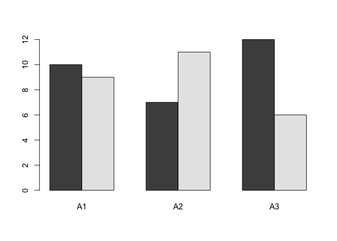
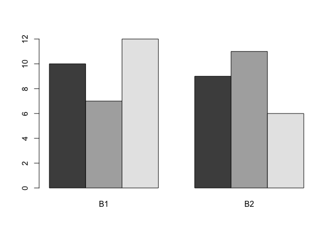
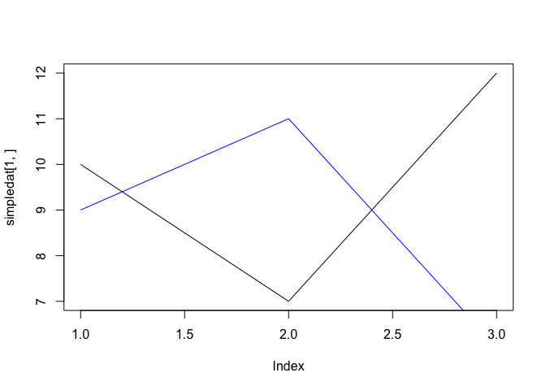
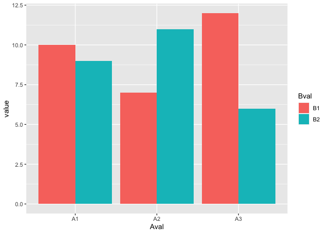
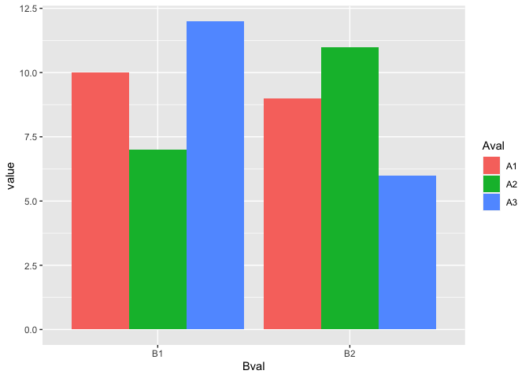
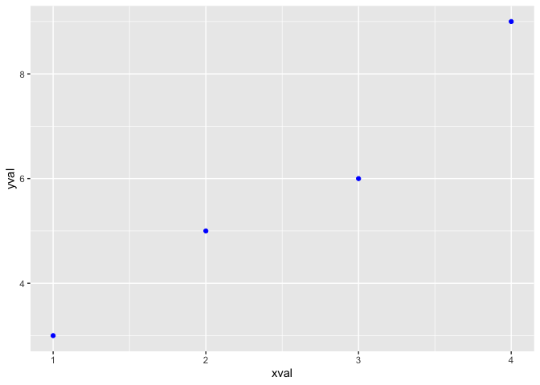
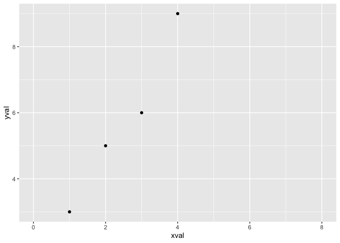
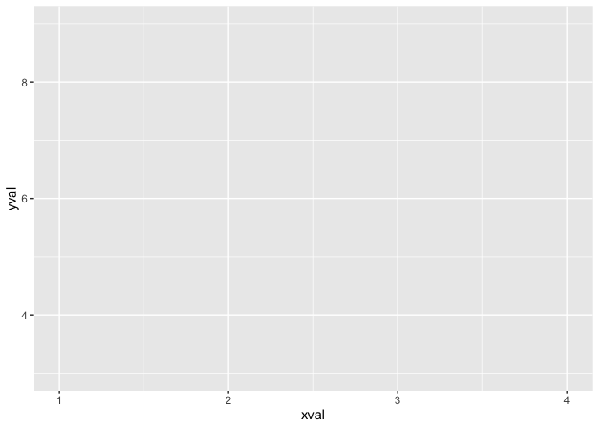

chapter01_R基础和ggplot2包介绍
================

- <a href="#1-r基础和ggplot2包介绍" id="toc-1-r基础和ggplot2包介绍">1
  R基础和ggplot2包介绍</a>
  - <a href="#11-安装包" id="toc-11-安装包">1.1 安装包</a>
  - <a href="#12-加载包" id="toc-12-加载包">1.2 加载包</a>
  - <a href="#13-加载分隔符式的文本文件excel文件spss文件"
    id="toc-13-加载分隔符式的文本文件excel文件spss文件">1.3
    加载分隔符式的文本文件、Excel文件、SPSS文件</a>
  - <a href="#14-ggplot2介绍" id="toc-14-ggplot2介绍">1.4 ggplot2介绍</a>
  - <a href="#15-若干术语和理论" id="toc-15-若干术语和理论">1.5
    若干术语和理论</a>
  - <a href="#16-构建一幅简单图形" id="toc-16-构建一幅简单图形">1.6
    构建一幅简单图形</a>
  - <a href="#17-打印输出" id="toc-17-打印输出">1.7 打印输出</a>
  - <a href="#18-统计变换" id="toc-18-统计变换">1.8 统计变换</a>
  - <a href="#19-主题" id="toc-19-主题">1.9 主题</a>

Source：

1.  《R数据可视化手册》，北京：人民邮电出版社，2014.5

# 1 R基础和ggplot2包介绍

- 安装了R后，除了ggplot2之外，还要安装gcookbook包(它包含了本书大多数例子的数据集)。

## 1.1 安装包

- 以安装ggplot2包为例，运行：

  `install.packages('ggplot2')`

## 1.2 加载包

- 使用library()函数，括号中写上要加载的包名。以加载ggplot2包为例，运行：

  `library (ggplot2)`

- 当然，必须确保要加载的包已经被安装了。

## 1.3 加载分隔符式的文本文件、Excel文件、SPSS文件

- 最简单的方式是从RStudio的File中的Import Dataset导入。

## 1.4 ggplot2介绍

- 相比R中的其他绘图包，ggplot2采取了一种不同的制图方式。它得名于
  LelandWilkinson的《Grammar of
  Graphics》(图形的语法)一书，这本书为描述数据类图形提供了一套形式化的、结构化的观点。

- 在R的基础绘图函数中，每种数据属性到视觉属性的映射都仅仅是单个函数本身的特例，而且映射的变更可能需要重构数据，或是键入完全不同的绘图命令，或者两者皆有。为了说明这一点，下面将会展示一幅根据gcookbook包中的simpledat数据集绘制的图形：

``` r
> library(gcookbook)
> simpledat
   A1 A2 A3
B1 10  7 12
B2  9 11  6
```

- 此数据可以绘制一幅简单的分组条形图，各A值沿x轴排布，条形依B值分组：

``` r
> barplot(simpledat, beside=TRUE)
```

<!-- -->

- 如需调换数据值的位置，使得B值沿x轴排布而A值用来分组，则需要转置矩阵以重构数据：

``` r
> t_simpledat <- t(simpledat)
```

- 使用重构后的数据创建条形图：

``` r
> t_simpledat <- t(simpledat)
> barplot(t_simpledat, beside=TRUE)
```

<!-- -->

- 另一方面，如想使用线条而不是条形来呈现数据，则需要使用一套完全不同的命令。首先，需要调用`plot()`来通知R创建一幅新图并为其中一行数据绘制一条线，然后使用lines()去绘制另一行数据：

``` r
> plot (simpledat[1,], type="l")
> lines(simpledat[2,], type="l", col="blue")
```

<!-- -->

- 结果图中有一些怪异的地方。第二条(蓝色)线的下部超出了可见范围，这是因为y轴的范围是在调用`plot()`函数时仅为第一条线设定的。另外，x轴是数值型而不是类别型。

- 现在来看看对应的ggplot2代码和图形。对于ggplot2来说，数据的结构是一成不变的：它要求的是“长”格式的数据框，而不是之前使用的相反的“宽”格式。当数据为长格式时，每行表示一个条目。其所属的分组不由它们在矩阵中的位置决定，而是在一个单独的列中指定。这是将simpledat转换为长格式的结果：

``` r
> simpledat_long
  Aval Bval value
1   A1   B1    10
2   A1   B2     9
3   A2   B1     7
4   A2   B2    11
5   A3   B1    12
6   A3   B2     6
```

- 这种格式使用了不同的结构，表示的却是相同的信息。长格式有利有弊，但总的来说，在处理复杂数据集的时候它能让事情变得简单一些。关于宽格式和长格式之间的转换方法，参见15.19节和15.20节。

- 要绘制一幅分组条形图，我们首先需要加载ggplot2包。然后使用`x=Aval`将Aval映射至x轴，使用`fill=Bval`将Bval映射为填充色。这样就使得各A值沿x轴分布，而让B值决定分组。还需要使用`y=value`将value映射到y的位置，即条形的高度。最后，使用`geom_bar()`来绘制条形：

``` r
> library(ggplot2)
> ggplot(simpledat_long, aes (x=Aval, y=value, fill=Bval)) +
+ geom_bar (stat="identity", position="dodge")
```

<!-- -->

- 要调换位置，令B值沿x轴排布而让A值决定分组，只需简单地交换映射参数，使得`x=Bval`且`fill=Aval`即可。与基础图形不同的是，这里无需修改数据，仅需修改绘图命令:

``` r
> library(ggplot2)
> ggplot(simpledat_long, aes (x=Bval, y=value, fill=Aval)) +
+ geom_bar (stat="identity", position="dodge")
```

<!-- -->

- \*\*注意：在ggplot2中，各个图形部件都是通过操作符+进行组合的。可以通过添加组件的方式来渐进式地构建一个ggplot对象，在做完以后，就可以打印出来了。

- 要将上图修改为折线图，需要把`geom_bar()`修改为`geom_line()`。同时使用参数colour将Bval映射为线条的颜色而非填充的颜色(注意参数名称的英式拼法一因为ggplot2的作者是新西兰人):

``` r
> ggplot (simpledat_long, aes (x=Aval, y=value, colour=Bval, group=Bval)) + 
+   geom_line()
```

<!-- -->

- 在结合基础图形将条形图改为折线图时，我们不得不使用完全不同的命令。但通过ggplot2，我们仅需将几何对象从条形改为线条。结果图也与基础图形版有着重要区别：由于所有的线条都是同时绘制而非每次绘制一条，所以y的范围已被自动调整以适应全体数据，且x轴仍保持为类别型而不会被转换为数值型。ggplot2图形还带有自动生成的图例。

## 1.5 若干术语和理论

- 在更进一步之前，先定义一些ggplot2中使用的术语会有所帮助。

- 数据(data)是我们想要可视化的对象。其中包含了变量(variable)，变量存储于数据框的每一列。

- 几何对象(geom)是用以呈现数据的几何图形对象，如条形、线条和点。

- 图形属性(aesthetic)是几何对象的视觉属性，如x坐标和y坐标、线条颜色、点的形状等。

- 数据的值和图形属性之间存在着某类映射(mapping)。

- 标度(scale)控制着数据空间的值到图形属性空间的值的映射。一个连续型的y标度会将较大的数值映射至空间中纵向更高的位置。

- 引导元素(guide)向看图者展示了如何将视觉属性映射回数据空间。最常用的引导元素是坐标轴上的刻度线和标签。

- 要了解一个典型的映射是如何工作的，可以来看一个例子。我们拥有数据，也就是一组数值或类别值。有几何对象来表示每个观测。我们有图形属性，如y(纵向)的位置。还有一种标度定义了从数据空间(数值)到图形属性空间(纵向位置)的映射。一个典型的线性y标度可将数值0映射到图形的基线，将5映射到中间，将10映射到顶端。一个对数型y标度则会以不同的方式放置它们。

- 以上并不是仅有的数据空间和图形属性空间。在抽象的图形语法层面，数据和图形属性可以是任何东西；在ggplot2的实现中，有一些预定义的数据和图形属性类型。常用的数据类型包括数值、类别值和字符串。一些常用的图形属性包括横纵位置、颜色、大小和形状。**要解读图形，看图者需要参考引导元素**。引导元素的一个例子是包含刻度线和标签的y轴。看图者参考这个引导元素，以解读某个点位于标度中间所表示的含义。图例则是另一类引导元素。一个图例可向人们展示环形或三角形的点所代表的含义，或者蓝色或红色的线条所代表的含义。

- 某些图形属性，如点的形状(三角形、环形、正方形等)，仅对类别型变量有效。某些图形属性则对类别型和连续型变量都有效，如x(横向)的位置。对于条形图，变量必须为类别型x轴上放一个连续型变量是毫无意义的。对于散点图，变量必须为数值型。这些数据类型(类别型和数值型)均可被映射到x位置的图形属性空间，但它们需要不同类型的标度。在ggplot2术语中，类别型变量被称为离散型变量，数值型变量则叫做连续型变量。这些术语可能并不总是与别处的用法相对应。

## 1.6 构建一幅简单图形

- ggplot2对数据结构的要求很简单：数据必须存储于数据框中，且每类被映射为某种图形属性的变量必须独立集中存储在一列。

- 在前文的simpledat示例中，我们首先将一个变量映射为图形属性x，将另一个变量映射为图形属性fill；然后改变了变量到图形属性的映射规则。

- 我们将在这里演练一个简单的示例。首先，创建一个含有一些样本数据的数据框：

``` r
> dat <- data.frame(xval=1:4, yval=c(3,5,6,9), group=c("A","B","A","B"))
> dat
  xval yval group
1    1    3     A
2    2    5     B
3    3    6     A
4    4    9     B
```

- 一个基本的`ggplot()`调用范式看起来就像这样：

  `ggplot(dat, aes (x=xval, y=yval))`

  这样就使用数据框dat创建了一个ggplot对象。同时也在`aes()`中指定了默认的图形属性映射：

  `x=xval`将列xval映射为x的位置。 `y=yval`将列yval映射为y的位置。

- 在我们赋给`ggplot()`数据框和图形属性映射后，还缺少一个关键的组件：我们需要通知它将哪种几何对象放在那里。此时，ggplot2尚不知道我们是希望将条形、线条、点还是其他东西绘制到图形上。我们将添加`geom_point()`来绘制点，得到的结果是一幅散点图:

``` r
> ggplot (dat, aes (x=xval, y=yval)) + geom_point ()
```

<!-- -->

- 如果想重用其中的一些组件，可以将其存储到变量中。我们可以把ggplot对象保存到p中，然后向它添加`geom_point()`。这样做的效果与之前的代码相同：

``` r
> p <- ggplot(dat,aes (x=xval,y=yval)) 
> p + geom_point()
```

<!-- -->

- 我们也可以通过将`aes()`放入`geompoint()`的调用中以将变量group映射为点的颜色，并指定`colour=group`：

``` r
> p + geom_point(aes(colour=group))
```

<!-- -->

- 这样做并不会改变我们之前在`ggplot(..)`内部定义的默认图形属性映射。这样只是为特定的几何对象，即`geom_point()`添加了一个图形属性映射。如果我们再添加其他的几何对象，此映射将不对它们适用。

- 与这种图形属性映射形成对比的是图形属性的设置。这次，我们不用`aes():`我们将直接设置co1our的值：

``` r
> p + geom_point(colour='blue')
```

<!-- -->

- 我们也可以修改标度，也就是从数据到视觉属性的映射。在此，我们将改变x标度使其拥有一个更大的范围：

``` r
> p + geom_point() + scale_x_continuous(limits = c(0,8))
```

<!-- -->

- 如果回顾一下colour=group映射的例子，我们也可以修改颜色标度：

``` r
> p + scale_colour_manual(values = c('red','blue'))
```

<!-- -->

- 注：实际正常输出图片“fig.1.6.png”到目录文件夹中。

- 每当我们修改了标度以后，引导元素也发生了变化。对于x标度，引导元素为x轴上的刻度线。对于颜色标度，引导元素则为图例。

- **注意：我们使用了+来将每部分连接到一起。在上例中，我们以+结束一行，然后在下一行添加更多内容。如果你要写多行，则必须将+放在每行的末尾，而不是放在下一行的开始。否则，R解析器将无法得知会有更多语句出现：它会认为表达式已经结束并对其求值。**

## 1.7 打印输出

- 在R基础图形中，绘图函数会告诉R将图形绘制到输出设备（屏幕或者文件）上。ggplot2略有不同：所用的命令并不直接将图形绘制到输出设备上。相反，函数用于构造图形对象，只有在像`print(object)`这样使用`print()`函数时图形才会被绘制。

- 在R中，当你在命令提示符下键入命令以后，实际上发生了两件事情：首先，这条命令得以执行，然后，针对这条命令的返回结果又执行了`print()`。

- 交互式R提示符下的表现与执行一个脚本或函数时的表现有所不同。在脚本中，命令不会被自动打印出来。函数的情况相同，但是有一个小陷阱：函数中最后一个命令的结果将被返回，所以如果你从R提示符中调用函数，最后一个命令的结果将被打印出来，因为它是整个函数的执行结果。

## 1.8 统计变换

- **在将数据映射到图形属性之前，有时必须对其先做变换或汇总**。例如对于直方图来说，样本点先被分组然后进行计数。每组的计数值用以指定一个条形的高度。有些几何对象，如`geom_histogram()`，会自动为你做好这些事情，但有些情况下你也会希望使用各种stat_xx函数来自己做这些事。

## 1.9 主题

- 图形外观的某些方面超出了图形语法的范围。其中包括绘图区的背景颜色和网格线、坐标轴标签和图形标题文字使用的字体。这些细节是通过`theme()`函数来控制的，将在第9章进行讨论。
