chapter06_描述数据分布
================

- <a href="#6-描述数据分布" id="toc-6-描述数据分布">6 描述数据分布</a>
  - <a href="#61-绘制简单直方图" id="toc-61-绘制简单直方图">6.1
    绘制简单直方图</a>
  - <a href="#62-基于分组数据绘制分组直方图"
    id="toc-62-基于分组数据绘制分组直方图">6.2
    基于分组数据绘制分组直方图</a>
  - <a href="#63-绘制密度曲线" id="toc-63-绘制密度曲线">6.3 绘制密度曲线</a>
  - <a href="#64-基于分组数据绘制分组密度曲线问题"
    id="toc-64-基于分组数据绘制分组密度曲线问题">6.4
    基于分组数据绘制分组密度曲线问题</a>
  - <a href="#65-绘制频数多边形" id="toc-65-绘制频数多边形">6.5
    绘制频数多边形</a>
  - <a href="#66-绘制基本箱线图" id="toc-66-绘制基本箱线图">6.6
    绘制基本箱线图</a>
  - <a href="#67-向箱线图添加槽口" id="toc-67-向箱线图添加槽口">6.7
    向箱线图添加槽口</a>
  - <a href="#68-向箱线图添加均值问题" id="toc-68-向箱线图添加均值问题">6.8
    向箱线图添加均值问题</a>
  - <a href="#69-绘制小提琴图" id="toc-69-绘制小提琴图">6.9 绘制小提琴图</a>
  - <a href="#610-绘制vilkinson点图" id="toc-610-绘制vilkinson点图">6.10
    绘制Vilkinson点图</a>
  - <a href="#611-基于分组数据绘制分组点图"
    id="toc-611-基于分组数据绘制分组点图">6.11 基于分组数据绘制分组点图</a>
  - <a href="#612-绘制二维数据的密度图"
    id="toc-612-绘制二维数据的密度图">6.12 绘制二维数据的密度图</a>

Source：

1.  《R数据可视化手册》，北京：人民邮电出版社，2014.5

# 6 描述数据分布

## 6.1 绘制简单直方图

- 运行`geom_histogram()`函数并映射一个连续型变量到参数x：

``` r
> library(ggplot2)
> ggplot(faithful, aes(x=waiting)) + 
+   geom_histogram()
```

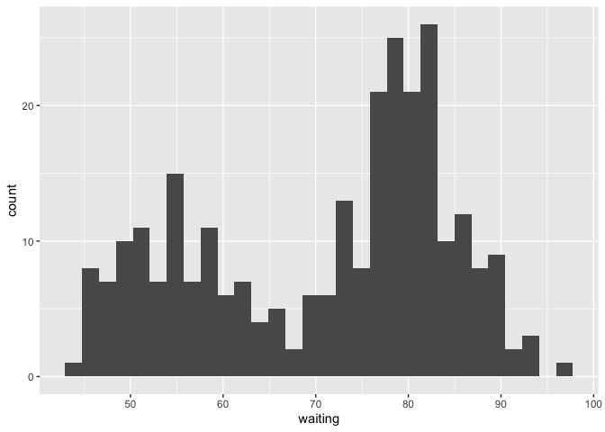<!-- -->

- `geom_histogram()`函数只需要数据框的其中一列或者一个单独的数据向量作为参数。以faithful数据集为例，该数据集包含了两列描述老忠实喷泉的信息:第一列eruptions，描述老忠实喷泉每次喷发的时长；第二列waiting，描述两次喷发之间的间隔。下面仅以列waiting为例：

``` r
> head(faithful)
  eruptions waiting
1     3.600      79
2     1.800      54
3     3.333      74
4     2.283      62
5     4.533      85
6     2.883      55
```

- 如果想快速地看一下未包含在数据框中的数据的直方图，可以在运行上述命令时，将数据框参数设定为NULL，同时，向`ggplot()`函数传递一个向量作为参数。下面的代码与之前的运行结果相同：

``` r
> # 将变量值保存为一个基本向量
> w <- faithful$waiting
> ggplot(NULL, aes(x=w)) + 
+   geom_histogram()
```

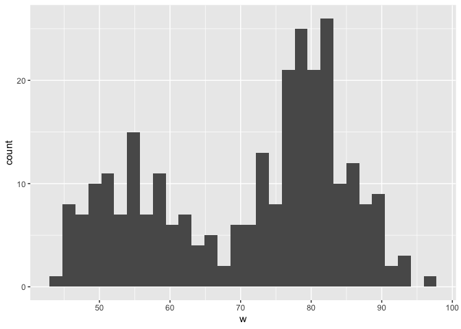<!-- -->

- 默认情况下，数据将被切分为30组，这样分组可能太过精细，也可能太过粗糙，这取决于数据的实际情况。我们可以通过组距(binwidth)参数来调整数据的分组数目，或者将数据切分为指定的分组数目。直方图默认的填充色是黑色且没有边框线，这使得我们难以看清各个条形对应的变量值，因此，可以调整一下直方图的颜色设置：

``` r
> # 设定组距为5
> ggplot(faithful, aes(x=waiting)) + 
+   geom_histogram(binwidth=5, fill="white", colour="black") 
```

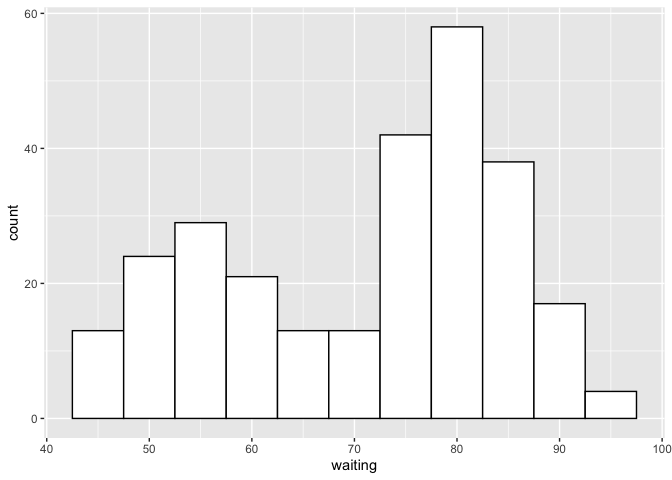<!-- -->

``` r
> # 将x的取值切分为15组
> binsize <- diff(range(faithful$waiting))/15
> ggplot(faithful, aes(x=waiting)) + 
+   geom_histogram(binwidth=binsize, fill="white", colour="black")
```

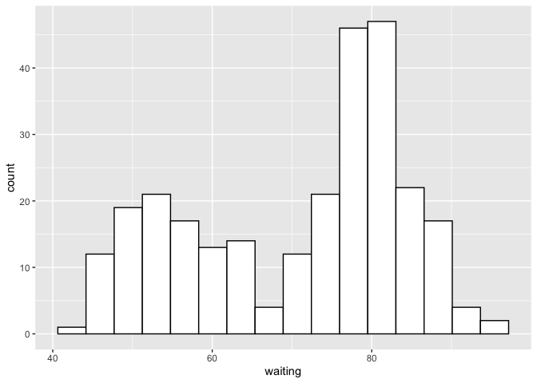<!-- -->

- 有时，直方图的外观会非常依赖于组距及组边界。下图中，我们将组距设定为8。同时设定分组原点(origin)参数令左图的组边界分别位于31、39、47等;右图中，对origin参数增加4，令组边界分别位于35、43、51等：

``` r
> h <- ggplot(faithful, aes(x=waiting)) # 将基本绘图结果存为变量以便于重复使用
> h + geom_histogram(binwidth=8, fill="white", colour="black", origin=31) 
```

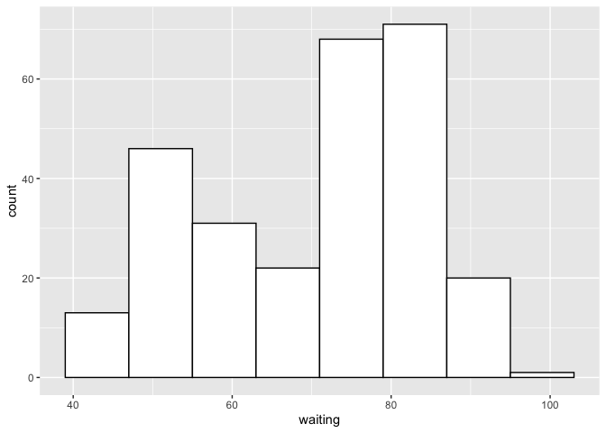<!-- -->

``` r
> h + geom_histogram(binwidth=8, fill="white", colour="black", origin=35)
```

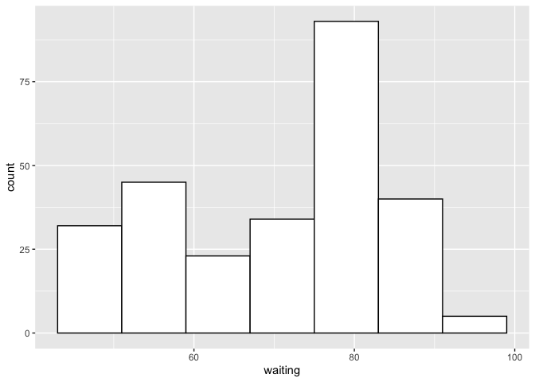<!-- -->

- 两图对应的分组数目相同，但绘图结果差异很大。本例中的的faithful数据集共包含272个观测值，数据量并不算少；当数据量较小时，对分组边界的影响将会更大。因此，绘制图形时，最好尝试一下不同的分组数目和分组边界。

- 当数据集包含离散型数据时，直方图的非对称性不可忽视。数据分组时，各分组区间左闭右开。比如，当分组边界为1、2、3等时，对应的分组区间为\[1,2)、\[2,3)、\[3,4)等。换言之，第一个分组区间包含1，但不包含2，第二个分组区间包含2，但不包含3。

- 绘制多个数据对应的分布时，频数多边形 (frequency
  polygon)是一个更佳的方案，因为，它避免了各个条形之间相互干扰。相关内容参见6.5节。

## 6.2 基于分组数据绘制分组直方图

- 运行`geom_histogram()`函数并使用分面绘图即可：

``` r
> library(MASS)  # 为了使用数据
> # 使用smoke作为分面变量
> ggplot(birthwt, aes(x=bwt)) + 
+   geom_histogram(fill="white",colour="black") + 
+   facet_grid(smoke~.)
```

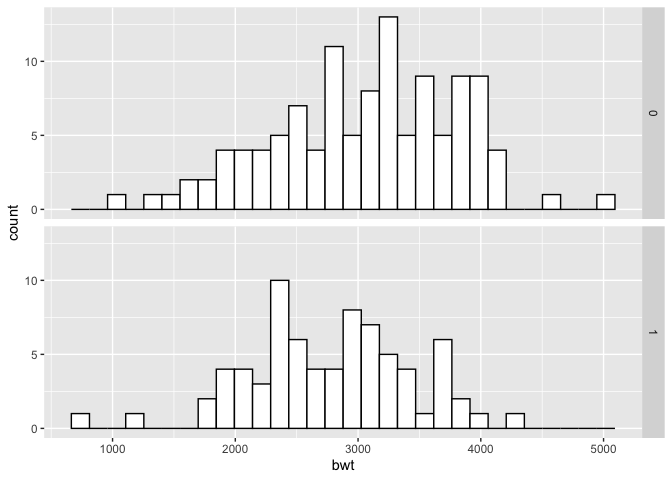<!-- -->

- 绘制上图时，要求所有用到的数据都包含在一个数据框里，且数据框其中一列是可用于分组的分类变量。这里以birthwt数据集为例。该数据集包含的是关于婴儿出生体重及一系列导致出生体重过低的危险因子的数据：

``` r
> head(birthwt)
   low age lwt race smoke ptl ht ui ftv  bwt
85   0  19 182    2     0   0  0  1   0 2523
86   0  33 155    3     0   0  0  0   3 2551
87   0  20 105    1     1   0  0  0   1 2557
88   0  21 108    1     1   0  0  1   2 2594
89   0  18 107    1     1   0  0  1   0 2600
91   0  21 124    3     0   0  0  0   0 2622
```

- 分面绘图有一个问题，即分面标签只有0和1，且没有指明这个标签是变量smoke的取值。想要修改标签，我们需要修改因子水平的名称。首先列出现有的因子水平，然后，依照相同的顺序向它们赋予新的名字：

``` r
> birthwt1 <- birthwt # 复制一个数据副本
> # 将smoke转化为因子
> birthwt1$smoke <- factor(birthwt1$smoke) 
> levels(birthwt1$smoke)
[1] "0" "1"
```

- 重新绘图，图形中为新的分面标签：

``` r
> library(plyr) #为了使用revalue()函数
> birthwt1$smoke <- revalue(birthwt1$smoke, c("0"="No Smoke", "1"="Smoke"))
> ggplot(birthwt1, aes(x=bwt)) + 
+   geom_histogram(fill="white", colour="black") + 
+   facet_grid(smoke~.)
```

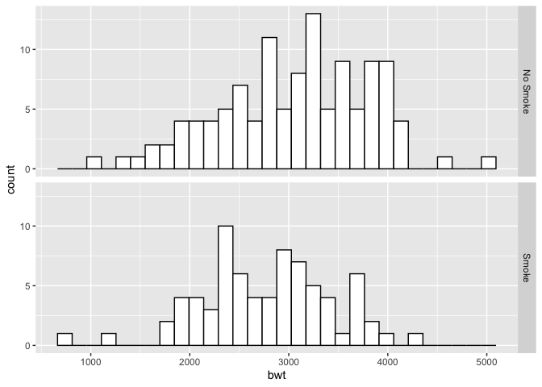<!-- -->

- 分面绘图时，各分面对应的y轴标度是相同的。当各组数据包含的样本数目不同时，可能会难以比较各组数据的分布形状。我们可以看看按照race对出生体重进行分组并分面绘图的结果：

``` r
> ggplot(birthwt, aes(x=bwt)) + 
+   geom_histogram(fill="white", colour="black") + 
+   facet_grid(race~.)
```

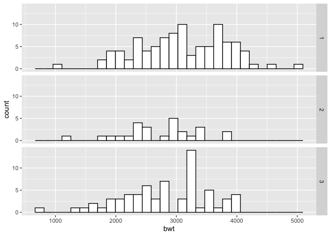<!-- -->

- 设置参数`scales="free"`可以单独设定各个分面的y轴标度。**注意:这种设置只适用于y轴标度，x轴的标度仍是固定的，因为各个分面的直方图是依照x轴进行对齐的**。

``` r
> ggplot(birthwt, aes(x=bwt)) + 
+   geom_histogram(fill="white", colour="black") + 
+   facet_grid(race ~ ., scales="free")
```

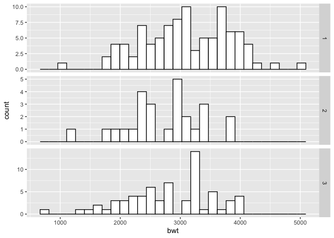<!-- -->

- 分组绘图的另一种做法是把分组变量映射给fill，如下图所示。此处的分组变量必须是因子型或者字符型的向量。对于birthwt数据集，变量smoke是合适的分组变量，由于其被存储为数值型，所以，我们使用前面创建的birthwt1数据集，该数据集中的smoke变量是因子型变量：

``` r
> # 把smoke转化为因子
> birthwt1$smoke <- factor(birthwt1$smoke)
> # 把smoke映射给fill，取消条形堆叠，并使图形半透明
> ggplot(birthwt1, aes(x=bwt, fill=smoke)) + 
+   geom_histogram(position="identity", alpha=0.4)
```

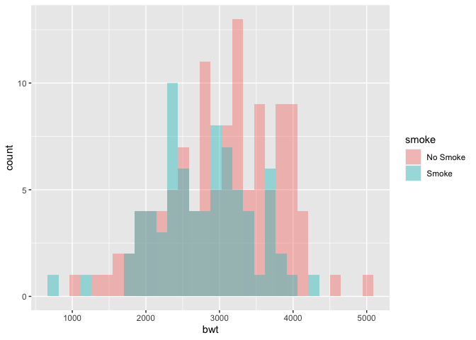<!-- -->

## 6.3 绘制密度曲线

- 运`行geom_density()`函数，并映射一个连续型变量到x：

``` r
> ggplot(faithful, aes(x=waiting)) + 
+   geom_density()
```

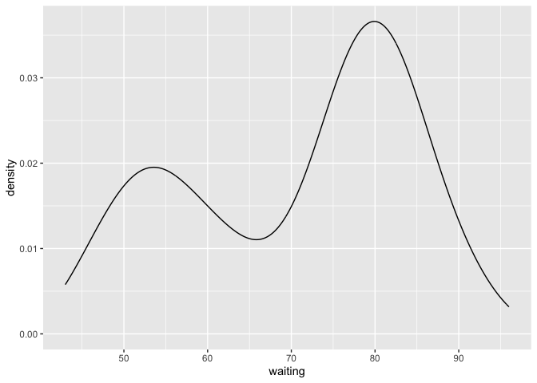<!-- -->

- 假如图形两侧和底部有线段，可以使用`geom_line(stat="density")`函数：

``` r
> # 使用expand_limits()函数扩大y轴范围以包含0点
> ggplot(faithful, aes(x=waiting)) + 
+   geom_line(stat="density") + 
+   expand_limits(y=0)
```

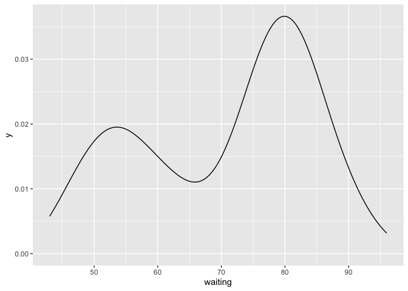<!-- -->

- 与`geom_histogram()`函数类似，`geom_density()`函数只需要数据框中的一列作为参数。以faithful数据集为例，该数据包含了两列关于老忠实喷泉的数据:一列是eruptions，表示喷泉喷发的时长；第二列是waiting，表示两次喷发之间的时间间隔。下面仅以waiting列为例：

``` r
> head(faithful)
  eruptions waiting
1     3.600      79
2     1.800      54
3     3.333      74
4     2.283      62
5     4.533      85
6     2.883      55
```

- 上面提到的第二种方法是使用`geom_line()`函数，并告诉其使用density统计变换。这种方法与第一种使用`geom_density()`函数的方法在本质上是相同的，只不过前者（旧版）绘制的是封闭的多边形。

- 与使用`geom_histogram()`函数类似，如果想快速地绘制未在数据框中的数据的直方图，可以在运行上述命令时，将数据框设定为NULL，同时，向`ggplot()`函数传递一个包含所需数据的向量作为参数。这与第一种解决方案的结果相同：

``` r
> # 将变量值保存在一个简单向量里
> w <- faithful$waiting
> ggplot(NULL, aes (x=w)) + 
+   geom_density()
```

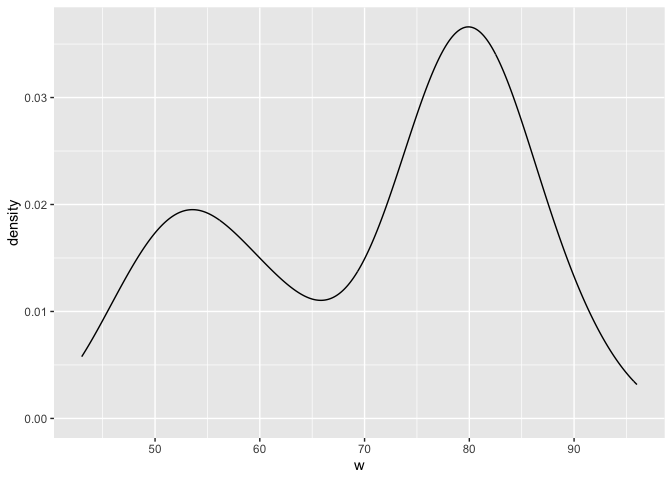<!-- -->

- 核密度曲线是基于样本数据对总体分布做出的一个估计。曲线的光滑程度取决于核函数的带宽：带宽越大，曲线越光滑。带宽可以通过adjust参数进行设置，其默认值为1。下图演示了当adjust更大或者更小时图形的展示效果：

``` r
> ggplot(faithful, aes(x=waiting)) + 
+   geom_line(stat="density", adjust=.25, colour="red") + 
+   geom_line(stat="density") + 
+   geom_line(stat="density", adjust=2, colour="blue")
```

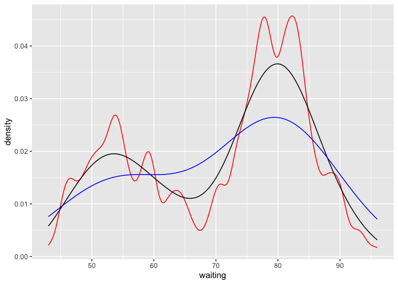<!-- -->

- 本例中，x轴的坐标范围是自动设定的，以使其能包含相应的数据，但这会导致曲线的边缘被裁剪。想要展示曲线的更多部分，可以手动设定x轴的范围。同时，设置alpha=.2使填充色的透明度为80%。

``` r
> ggplot(faithful, aes(x=waiting)) + 
+   geom_density(fill="blue", alpha=.2) + 
+   xlim(35,105)
```

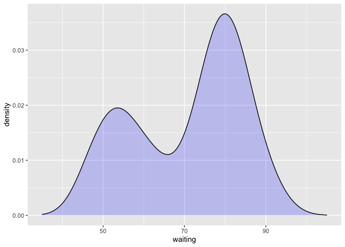<!-- -->

``` r
> # 这段代码与上面的等价。使用geom_density()函数绘制一个蓝色多边形，并在顶端添加一条实线
> # ggplot(faithful, aes(x=waiting)) + 
> #   geom_density(fill="blue", colour=NA, alpha=.2) + 
> #   geom_line(stat="density") + 
> #   xlim(35, 105)
```

- 如果数据集在绘图时发生了曲线边缘被裁剪的情况，那可能是因为相应的核密度曲线过于平滑一一如果核密度曲线的宽度超过相应的数据集的范围，则其可能并非最好的模型。当然，也可能是因为数据集太小了。

- 将密度曲线叠加到直方图上，可以对观测值的理论分布和实际分布进行比较。由于密度曲线对应的y轴坐标较小(曲线下的面积总是1)，如果将其叠加到未做任何变换的直方图上，曲线可能会很难看清楚。通过设置`y=after_stat(density)`可以减小直方图的标度以使其与密度曲线的标度相匹配。这里，我们先运行
  `geom_histogram()`函数绘制直方图，之后，运行geom_density()函数将密度曲线绘制到更上一层的图层上：

``` r
> ggplot(faithful, aes(x=waiting, y=after_stat(density))) + 
+   geom_histogram(fill="cornsilk", colour="grey60", size=.2) + 
+   geom_density() + 
+   xlim(35, 105)
```

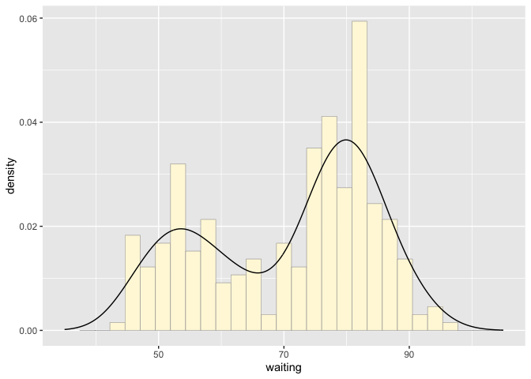<!-- -->

- 6.9节介绍了小提琴图的相关内容，小提琴图是另一种表示密度曲线的方法，其适合用来对多个分布进行比较。

## 6.4 基于分组数据绘制分组密度曲线问题

- 使用`geom_density()`函数，将分组变量映射给colour或fill等图形属性即可，如下图所示。分组变量必须是因子型或者字符串向量。数据集birthwt对应的最佳分组变量smoke被存储为数值型，所以，我们必须先将其转化为因子：

``` r
> library(MASS) # 为了使用数据
> # 复制数据的副本
> birthwt1 <- birthwt
> # 把变量smoke转化为因子
> birthwt1$smoke <- factor(birthwt1$smoke)
> # 把变量smoke映射给colour
> ggplot(birthwt1,aes(x=bwt,colour=smoke)) + 
+   geom_density() 
```

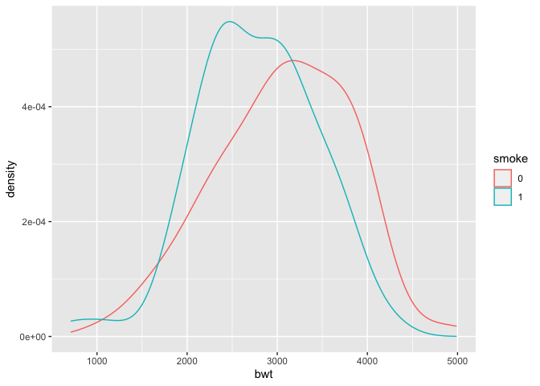<!-- -->

``` r
> # 把变量smoke映射给fill,设置alpha使填充色半透明
> ggplot(birthwt1,aes(x=bwt,fill=smoke)) + 
+   geom_density(alpha=.3)
```

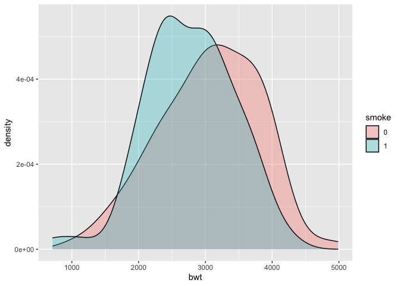<!-- -->

- 绘制上图时，要求所有用到的数据都包含在一个数据框里，且数据框的其中一列是可用于分组的分类变量。这里以birthwt数据集为例。该数据集包含的是关于婴儿出生体重及一系列导致出生体重过低的危险因子的数据：

``` r
> head(birthwt)
   low age lwt race smoke ptl ht ui ftv  bwt
85   0  19 182    2     0   0  0  1   0 2523
86   0  33 155    3     0   0  0  0   3 2551
87   0  20 105    1     1   0  0  0   1 2557
88   0  21 108    1     1   0  0  1   2 2594
89   0  18 107    1     1   0  0  1   0 2600
91   0  21 124    3     0   0  0  0   0 2622
```

- 观察一下变量smoke(抽烟与否)与变量bwt(出生体重，单位是克)的关系。变量smoke对应的取值是0和1，但由于其被存储为数值型向量，因而`ggplot()`函数不知道应当将其作为分类变量来处理。这时有两种方法可以选择：一是将数据框中相应的列转化为因子，二是通过在`aes()`函数内部使用命令`factor(smoke)`来告诉`ggplot()`函数把smoke当作因子来处理。本例中，我们将其转化为因子。

- 另一种对分组数据分布进行可视化的方法是使用分面(fact)，如下图所示。可以令各个分面竖直对齐或者水平对齐。下面，我们将各分面竖直对齐来对分面中的两个分布进行比较：

``` r
> ggplot(birthwt1,aes(x=bwt)) + 
+   geom_density() + 
+   facet_grid(smoke ~.)
```

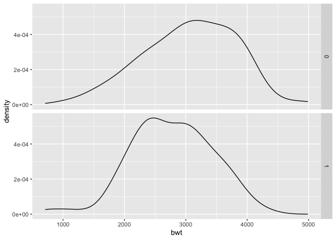<!-- -->

- 分面绘图有一个问题，即分面标签只有0和1，且没有指明这个标签是变量smoke的取值。想要修改标签，我们需要修改因子水平的名称。首先列出现有的因子水平，然后，依照相同的顺序向它们赋予新的名字，重新绘图，图形中为新的分面标签：

``` r
> levels(birthwt1$smoke)
[1] "0" "1"
> 
> library(plyr) # 为了使用revalue函数
> birthwt1$smoke <- revalue(birthwt1$smoke, c("0"="No Smoke", "1"="Smoke"))
> 
> ggplot(birthwt1, aes(x=bwt)) + 
+   geom_density() + 
+   facet_grid(smoke~.)
```

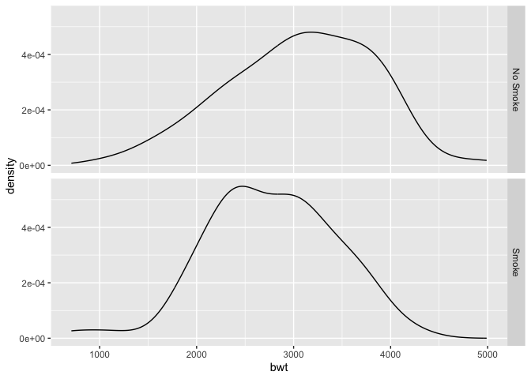<!-- -->

- 如果要将直方图和密度曲线绘制在一张图上，最佳方案是利用分面，这是因为将两个直方图绘制在同一张图上的其他方法都不易于解释。操作时，需设定`y=after_stat(density)`，这样系统会将直方图的y轴标度降到跟密度曲线相同。在本例中，通过修改直方图颜色使直方图的条形不那么突出：

``` r
> ggplot(birthwt1, aes(x=bwt, y=after_stat(density))) + 
+   geom_histogram(binwidth=200, fill="cornsilk", colour="grey60", size=.2) + 
+   geom_density() + 
+   facet_grid(smoke~.)
```

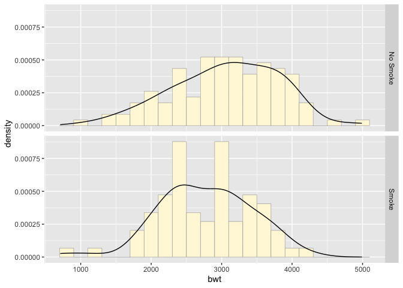<!-- -->

## 6.5 绘制频数多边形

- 使用`geom_freqpoly()`函数即可：

``` r
> ggplot(faithful, aes(x=waiting)) + 
+   geom_freqpoly()
```

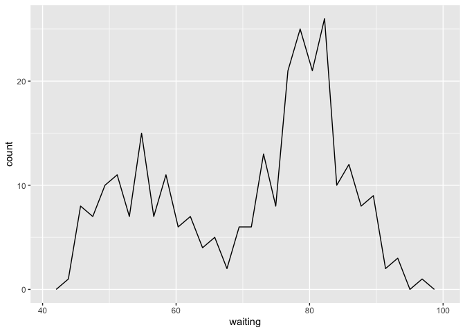<!-- -->

- 频数多边形看起来跟核密度估计曲线相似，但其传递的信息类似于直方图。它跟直方图都描述了数据本身的信息，而核密度曲线只是一个估计，且需要人为输入带宽参数。与直方图类似，可以通过binwidth参数控制频数多边形的组距：

``` r
> ggplot(faithful, aes (x=waiting)) + 
+   geom_freqpoly(binwidth=4)
```

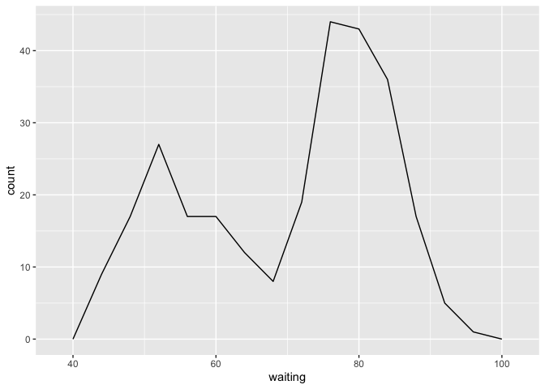<!-- -->

- 或者，通过直接设定每组组距将数据的x轴范围切分为特定数目的组：

``` r
> # 将组数设定为15
> binsize <- diff(range(faithful$waiting))/15
> ggplot(faithful, aes(x=waiting)) + 
+   geom_freqpoly(binwidth=binsize)
```

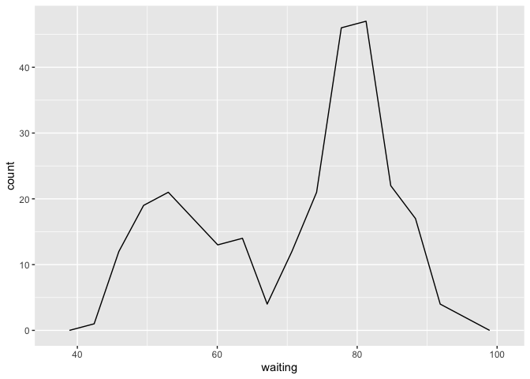<!-- -->

- 直方图与频数多边形传递的信息类似，只不过其以条形代替了直线。相关内容可参见6.1节。

## 6.6 绘制基本箱线图

- 使用`geom_boxplot()`函数，分别映射一个连续型变量和一个离散型变量到y和x即可：

``` r
> library(MASS) # 为了使用数据集
> # 使用factor()函数将数值型变量转化为离散型
> ggplot(birthwt,aes(x=factor(race),y=bwt)) + 
+   geom_boxplot()
```

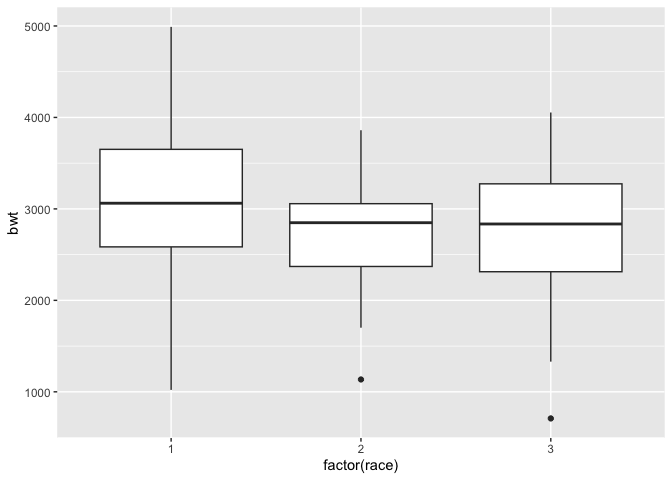<!-- -->

- 下面以MASS库中的birthwt数据集为例。该数据集包含的是关于婴儿出生体重及一系列导致出生体重过低的危险因子的数据：

``` r
> head(birthwt)
   low age lwt race smoke ptl ht ui ftv  bwt
85   0  19 182    2     0   0  0  1   0 2523
86   0  33 155    3     0   0  0  0   3 2551
87   0  20 105    1     1   0  0  0   1 2557
88   0  21 108    1     1   0  0  1   2 2594
89   0  18 107    1     1   0  0  1   0 2600
91   0  21 124    3     0   0  0  0   0 2622
```

- 上图中，系统按变量race将数据分为三组，我们对每组数据对应的bwt变量进行可视化。变量race对应的值为1、2、3，然而，由于其被存储为数值型向量，`ggplot()`不知道如何将其当作分组变量来处理。为了使`ggplot()`能将其作为分组变量来处理，我们可以调整数据框把变量race转化为因子，或者通过在`aes()`语句内部使用`factor(race)`告诉`ggplot()`函数把race当作因子来处理。在前面的例子中，用的是`factor(race)`。

-箱线图由箱和”须”(whisker)两部分组成。箱的范围是从数据的下四分位数到上四分位数，也就是常说的四分位距(IQR)。箱的中间有一条表示中位数，或者说50%分位数的线。须则是从箱子的边缘出发延伸至1.5倍四分位距内的最远的点。如果图中有超过须的数据点，则其被视为异常值，并以点来表示。下图使用偏态的数据展示了直方图、密度曲线和箱线图之间的关系。

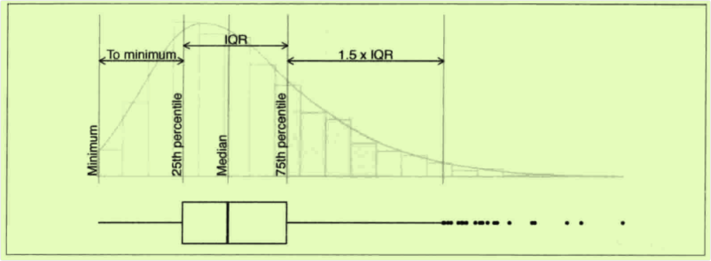

- 设定参数width可以修改箱线图的宽度：

``` r
> ggplot(birthwt,aes(x=factor(race),y=bwt)) + 
+   geom_boxplot(width=.5)
```

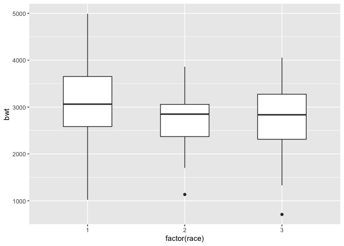<!-- -->

- 如果图中异常值较多且图形有重叠的话，可以通过设置`outlier.size`和`outlier.shape`参数修改异常点的大小和点形。异常点默认的大小是2，点形是16，即实心圆：

``` r
> ggplot(birthwt,aes(x=factor(race),y=bwt)) + 
+   geom_boxplot(outlier.size=1.5,outlier.shape=21)
```

<!-- -->

- 绘制单组数据的箱线图时，必须给x参数映射一个特定的取值，否则，`ggplot()`函数不知道箱线图对应的x轴坐标。本例中，我们将其设定为1，并移除x轴的刻度标记(tick
  marker)和标签：

``` r
> ggplot(birthwt,aes(x=,y=bwt)) + 
+   geom_boxplot() + 
+   scale_x_continuous(breaks=NULL) + 
+   theme(axis.title.x=element_blank())
```

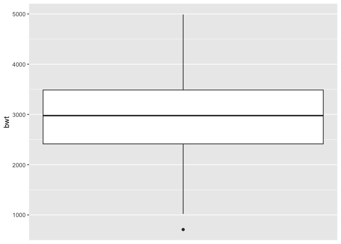<!-- -->

- 这里计算分位数的方法与R
  base包中的`boxplot()`函数所使用的计算方法略有不同。当样本量较小时，这个差异可能会比较明显。键入`?geomboxplot`命令可以查看这两种计算方法的差异。

## 6.7 向箱线图添加槽口

- 使用`geom_boxplot()`函数并设定参数`notch=TRUE`：

``` r
> library(MASS) # 为了使用数据
> ggplot(birthwt,aes(x=factor(race),y=bwt)) + 
+   geom_boxplot(notch=TRUE)
```

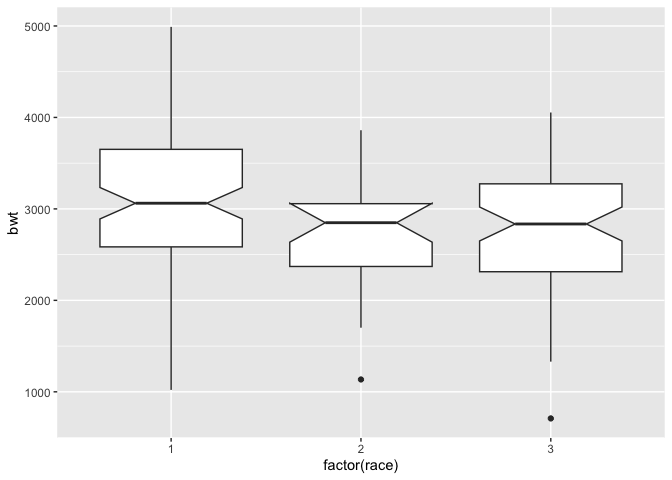<!-- -->

- 箱线图中的槽口用来帮助查看不同分布的中位数是否有差异。如果各箱线图的槽口互不重合，说明各中位数有差异。对于本数据集，你会看到如下信息：

  `Notch went outside hinges.Try setting notch=FALSE.`

这表明置信域（槽口）超过了某个箱子的边界。本例中，中间箱子对应的槽口的上边界溢出箱体，但由于溢出的距离较小，因此，在最终的绘图输出中几乎看不到。槽口溢出到箱体的边界并没有什么实质错误，只是在一些极端案例中会看起来很奇怪。

## 6.8 向箱线图添加均值问题

- 使用`stat_summary()`函数。**箱线图中的均值常以钻石形状来表示**，所以，下面用点形23且填充色为白色的点来表示。同时，通过设置参数size=3使用略大的点：

``` r
> library(MASS) # 为了使用数据
> ggplot(birthwt,aes(x=factor(race),y=bwt)) + 
+   geom_boxplot () + 
+   stat_summary(fun="mean",geom="point",shape=23,size=3,fill="white")
```

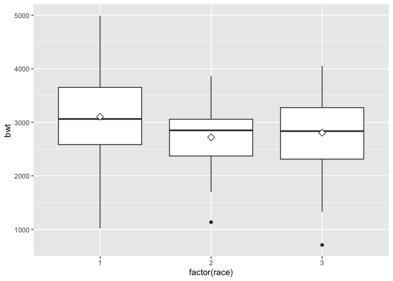<!-- -->

- 箱线图中间的水平线表示的是中位数，而不是均值。对于正态分布的数据，中位数与均值会比较接近，但对于偏态的数据它们将有所不同。

## 6.9 绘制小提琴图

- 使用`geom_violin()`函数即可：

``` r
> library(gcookbook) # 为了使用数据
> # 简单绘图
> p <- ggplot(heightweight,aes(x=sex,y=heightIn))
> 
> p + geom_violin()
```

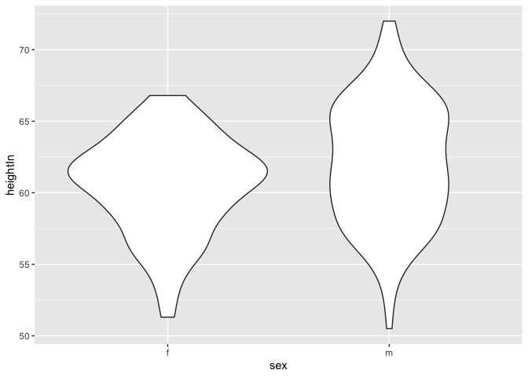<!-- -->

- 小提琴图是一种用来对多组数据的分布进行比较的方法。使用普通的密度曲线对多组数据进行可视化时，图中各曲线会彼此干扰，因而，不宜用来对多组数据的分布进行比较。而小提琴图是并排排列的，用它对多组数据的分布进行比较会更容易一些。

- 小提琴图也是核密度估计，但绘图时对核密度曲线取了镜像以使形状对称。传统画法中，小提琴图中间叠加了一个较窄的箱线图，同时，用一个白圆圈表示中位数。另外，通过设置`outlier.colour=NA`可以隐去箱线图中的异常点。

``` r
> p + geom_violin() + 
+   geom_boxplot(width=.1,fill="black",outlier.colour=NA) + 
+   stat_summary(fun=median,geom="point",fill="white",shape=21,size=2.5)
```

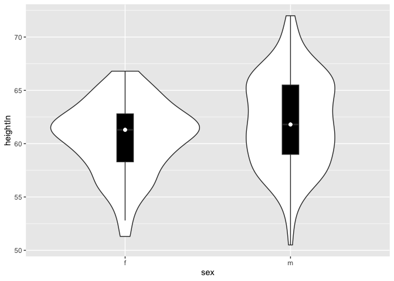<!-- -->

- 本例中，我们从下而上逐层绘制图形，先绘制小提琴图，再叠加箱线图，之后使用`stat_summary()`计算并绘制表示中位数的白圆圈。

- 小提琴图默认的坐标范围是数据的最小值到最大值，其扁平的尾部在这两个位置处截断。通过设置`trim=FALSE`可以保留小提琴的尾部：

``` r
> p + geom_violin(trim=FALSE)
```

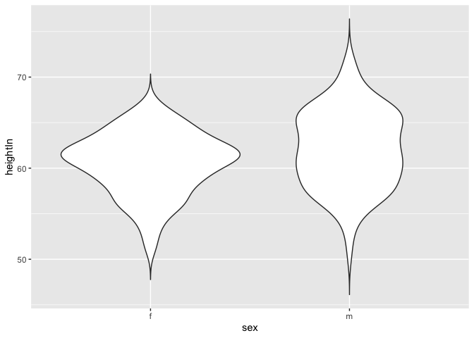<!-- -->

- 默认情况下，系统会对小提琴图进行标准化以使得各组数据对应的图的面积一样（如果`trim=TRUE`，对数据进行标准化时会包括尾部数据)。如果不想使各组数据对应的图的面积一样，可以通过设置`scale="count"`使得图的面积与每组观测值数目成正比。本例中，女性组数据比男性组数据略少，所以，f组的小提琴图看起来略窄：

``` r
> # 校准小提琴图的面积，令其与每组观测值的数目成正比
> p + geom_violin(scale="count")
```

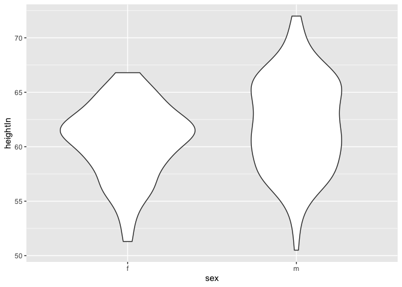<!-- -->

- 使用6.3节中介绍的adjust参数可以调整小提琴图的平滑程度。该参数的默认值是1：更大的值对应于更平滑的曲线，反之亦然：

``` r
> # 更平滑
> p + geom_violin(adjust=2)
```

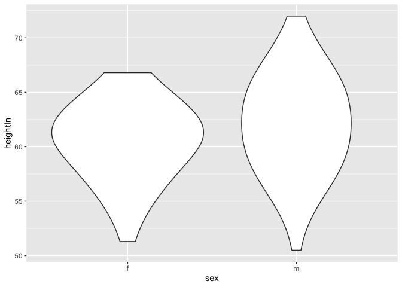<!-- -->

``` r
> # 欠平滑
> p + geom_violin(adjust=.5)
```

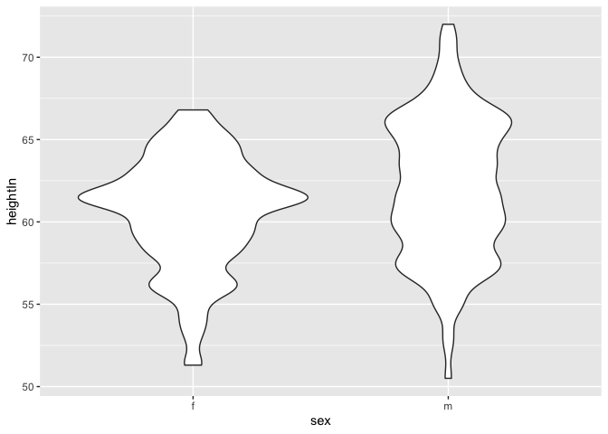<!-- -->

- 创建传统密度曲线，可参考6.3节的内容。

- 使用不同于默认设置的点形，可参考4.5节的内容。

## 6.10 绘制Vilkinson点图

- 使用`geom_dotplot()`函数。这里以数据集countries的子集为例：

``` r
> library(gcookbook) # 为了使用数据
> countries2009 <- subset(countries,Year==2009 & healthexp>2000)
> 
> p <- ggplot(countries2009,aes(x=infmortality))
> 
> p + geom_dotplot()
```

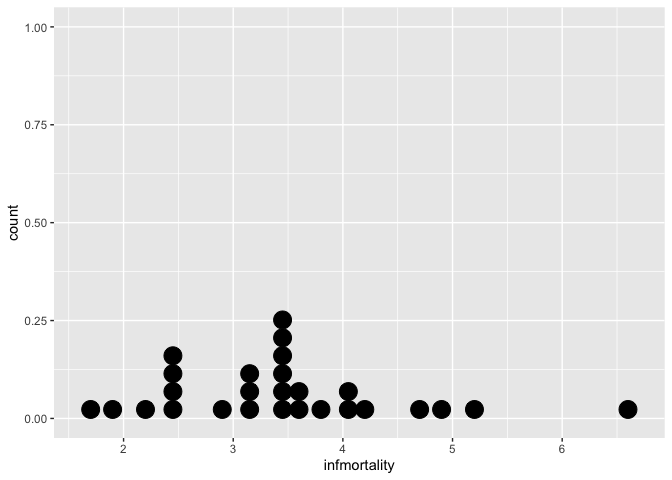<!-- -->

- 这种点图有时又叫Wilkinson点图。它与3.10节中提到的Cleveland点图不同。这种图中，点的分组和排列取决于数据，每个点的宽度对应了最大的组距。系统默认的最大组距是数据范围的1/30，我们可以通过binwidth参数对其进行调整。

- 默认情况下，`geom_dotplot()`函数沿着x轴方向对数据进行分组，并在y轴方向上对点进行堆积。图中各点看起来是堆积的，但受限于ggplot2的技术，图形上y轴的刻度线没有明确的含义。使用`scale_y_continuous()`函数可以移除y轴标签。本例中，我们还使用`geom_rug()`函数以标示数据点的具体位置：

``` r
> p + geom_dotplot(binwidth=.25) + 
+   geom_rug() + 
+   scale_y_continuous(breaks=NULL) + # 移除刻度线
+   theme(axis.title.y=element_blank()) # 移除坐标轴标签
```

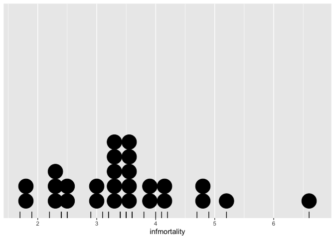<!-- -->

- 你可能会注意到数据堆在水平方向上不是均匀分布的。根据默认的dotdensity分组算法，每个数据堆都放置在它表示的数据点的中心位置。要使用像直方图那样的固定间距的分组算法，可以令`method="histodot"`。下图中，你将会发现图中的数据堆并不是居中放置的：

``` r
> p + geom_dotplot(method="histodot",binwidth=.25) + 
+   geom_rug() + 
+   scale_y_continuous(breaks=NULL) + 
+   theme(axis.title.y=element_blank())
```

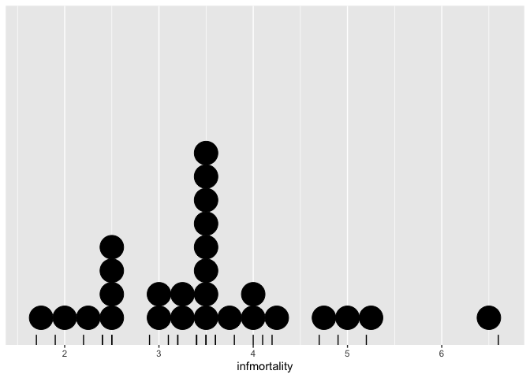<!-- -->

- 点图也能进行中心堆叠，或者采用一种奇数与偶数数量保持一致的中心堆叠方式。这可以通过设置`stackdir="center"`或者`stackdir="centerwhole"`来完成，如下图所示：

``` r
> p + geom_dotplot(binwidth=.25,stackdir="center") + 
+   scale_y_continuous(breaks=NULL) + 
+   theme(axis.title.y=element_blank())
```

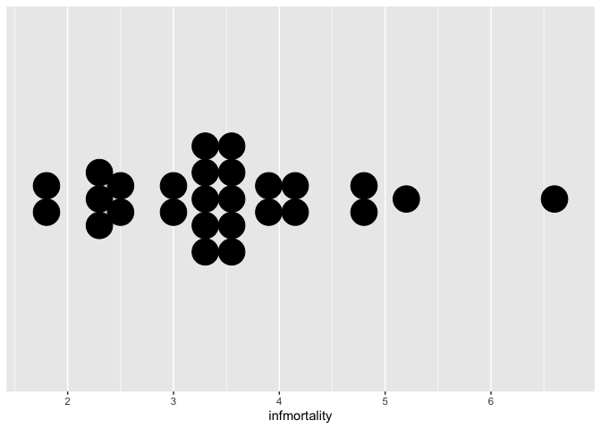<!-- -->

``` r
> 
> p + geom_dotplot(binwidth=.25,stackdir="centerwhole") + 
+   scale_y_continuous(breaks=NULL) + 
+   theme(axis.title.y=element_blank())
```

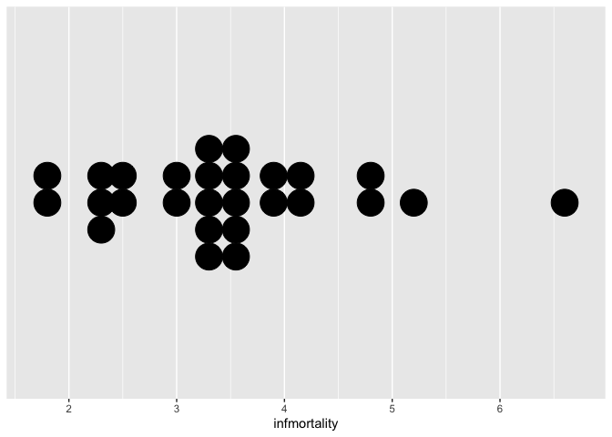<!-- -->

## 6.11 基于分组数据绘制分组点图

- 为了比较多组数据，可以通过设定`binaxis="y"`将数据点沿着y轴进行堆叠，并沿着x轴分组。本例中，我们将以heightWeight数据集为例：

``` r
> library(gcookbook) # 为了使用数据
> ggplot(heightweight,aes(x=sex,y=heightIn)) + 
+   geom_dotplot(binaxis="y",binwidth=.5,stackdir="center")
```

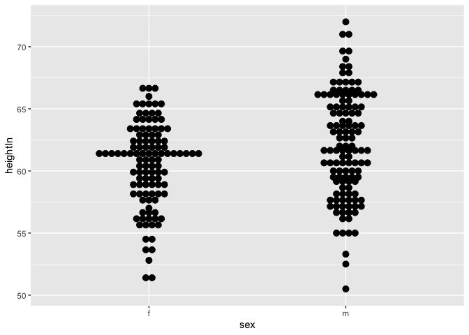<!-- -->

- 有时，我们会将点图叠加在箱线图上。这种情况下，应该将数据点变为空心，同时隐去箱线图上的异常点。这是因为异常点将作为点图的一部分展示出来：

``` r
> ggplot(heightweight,aes(x=sex,y=heightIn)) + 
+   geom_boxplot(outlier.colour=NA,width=.4) + 
+   geom_dotplot(binaxis="y",binwidth=.5,stackdir="center",fill=NA)
```

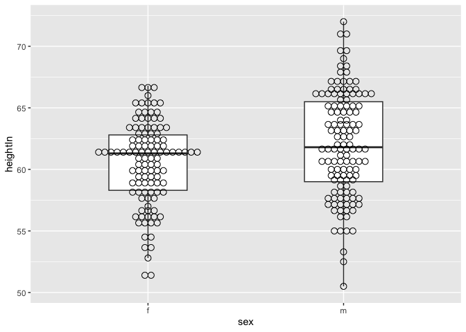<!-- -->

- 也可以将点图置于箱线图旁边，如下图所示。这需要用到一些技巧：通过将×变量视作数值型变量并对其加减一个微小的数值移动箱线图和点图的位置，使点图位于箱线图的左边。

- 当x变量被视为数值型变量时，必须同时指定group，否则，数据会被视为单独一组，从而，只绘制出一个箱线图和点图。最后，由于x轴被视为数值型，系统会默认展示x轴刻度标签的数值：必须通过`scale_x_continuous()`函数对其进行调整，以使得x轴的刻度标签显示为与因子水平相对应的文本：

``` r
> ggplot(heightweight,aes(x=sex,y=heightIn)) + 
+   geom_boxplot(aes(x=as.numeric(sex) + .2,group=sex),width=.25) + 
+   geom_dotplot(aes(x=as.numeric(sex) - .2,group=sex),binaxis="y",binwidth=.5,stackdir="center") + 
+   scale_x_continuous(breaks=1:nlevels(heightweight$sex),
+                      labels=levels(heightweight$sex))
```

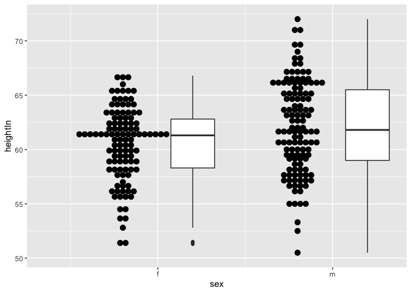<!-- -->

## 6.12 绘制二维数据的密度图

- 使用`stat_density.2d()`函数。该函数会给出一个基于数据的二维核密度估计。首先，我们绘制数据点和密度等高线图：

``` r
> # 基础图
> p <- ggplot(faithful,aes(x=eruptions,y=waiting))
> 
> p + geom_point() + 
+   stat_density2d()
```

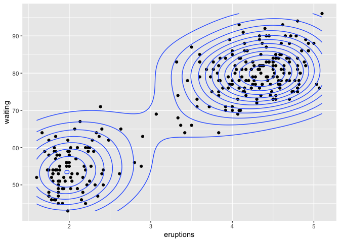<!-- -->

- 也可以使用`after_stat(level)`将密度曲面的高度映射给等高线的颜色：

``` r
> # 将height映射到颜色的等高线
> p + stat_density2d(aes(colour=after_stat(level)))
```

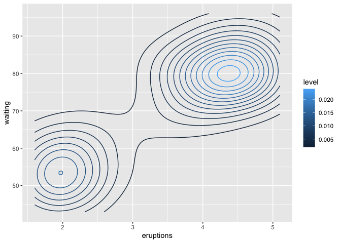<!-- -->

- 二维核密度估计类似于`stat_density()`函数生成的一维核密度估计，不过，前者展示图形的方法有所不同。系统默认使用等高线，也可以使用瓦片图(tile)将密度估计映射给填充色或者瓦片图的透明度：

``` r
> # 将密度估计映射给填充色
> p + stat_density2d(aes(fill=after_stat(density)),geom="raster",contour=FALSE)
```

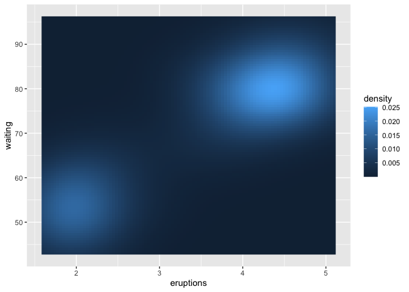<!-- -->

``` r
> # 带数据点，并将密度估计映射给alpha的瓦片图
> p + geom_point() + 
+   stat_density2d(aes(alpha=after_stat(density)),geom="tile",contour=FALSE)
```

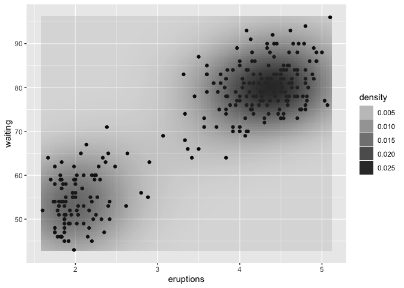<!-- -->

- 前面的第一个例子中我们使用了`geom="raster"`，而第二个例子中使用的是`geom="tile"`。两者的主要区别在于栅格几何对象能够比瓦片更有效地进行渲染。理论上，两者应该看起来一样，但实际中两者常常不同。如果输出是PDF文件，则图形的外观会依赖于打开PDF的浏览器类型。在一些浏览器上，当使用瓦片时，瓦片中间可能会有模糊的线；而当使用栅格时，瓦片的边沿可能会显示模糊（尽管在本例中不存在这个问题）。

- 与一维密度估计一样，可以对估计的带宽进行控制。传递一个指定x和y带宽的向量到h，这个参数会被传递给直接生成密度估计的函数`kde2d()`。本例中（见下图），我们将在x轴和y轴方向使用一个更小的带宽，以使得密度估计对数据的拟合程度更高（可能会有过度拟合）：

``` r
> p + stat_density2d(aes(fill=after_stat(density)),geom="raster", 
+                    contour=FALSE,h=c(.5,5))
```

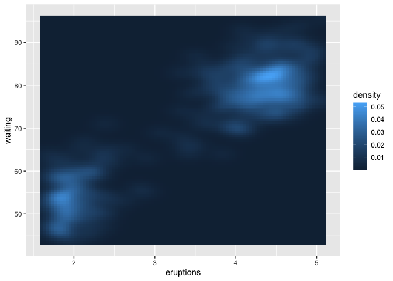<!-- -->

- `stat_density.2d()`函数和`stat_bin2d()`函数的关系与它们各自的一维情形，即密度曲线和直方图之间的关系类似。密度曲线是在特定假设下对分布的估计，而分组可视化则是直接表示观测值。更多关于数据分组的内容参见5.5节。

- 如果想使用不同的调色板，参见12.6节。

- `stat_density2d()`可将选项传递到`kde2d()`函数；输入`?kde2d`可以查看函数选项的信息。
