chapter07_注解
================

- <a href="#7-注解" id="toc-7-注解">7 注解</a>
  - <a href="#71-添加文本注解" id="toc-71-添加文本注解">7.1 添加文本注解</a>
  - <a href="#72-在注解中使用数学表达式"
    id="toc-72-在注解中使用数学表达式">7.2 在注解中使用数学表达式</a>
  - <a href="#73-添加直线" id="toc-73-添加直线">7.3 添加直线</a>
  - <a href="#74-添加线段和箭头" id="toc-74-添加线段和箭头">7.4
    添加线段和箭头</a>
  - <a href="#75-添加矩形阴影" id="toc-75-添加矩形阴影">7.5 添加矩形阴影</a>
  - <a href="#76-高亮某一元素" id="toc-76-高亮某一元素">7.6 高亮某一元素</a>
  - <a href="#77-添加误差线" id="toc-77-添加误差线">7.7 添加误差线</a>
  - <a href="#78-向独立分面添加注解" id="toc-78-向独立分面添加注解">7.8
    向独立分面添加注解</a>

Source：

1.  《R数据可视化手册》，北京：人民邮电出版社，2014.5

# 7 注解

## 7.1 添加文本注解

- 使用`annotate()`和一个文本类几何对象：

``` r
> library(ggplot2)
> library(gcookbook)
> p1 <- ggplot(faithful, aes(x=eruptions, y=waiting)) + 
+   geom_point()
> p1 + annotate("text", x=3, y=48, label="Group 1") + 
+   annotate("text", x=4.5, y=66, label="Group 2")
```

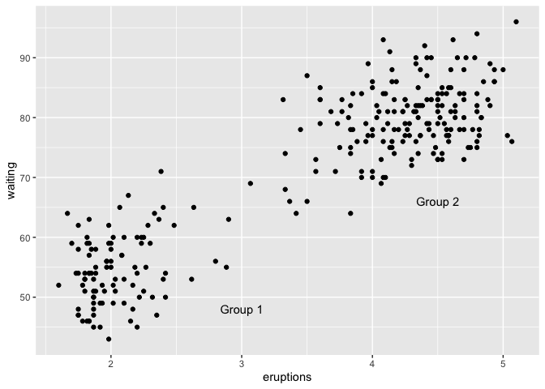<!-- -->

- 函数`annotate()`可以用于添加任意类型的几何对象。在本例中，我们使用的几何对象是`geom="text"`。我们也可指定其他文本属性，如下图所示：

``` r
> p1 + annotate("text", x=3, y=48, label="Group 1", family="serif",
+              fontface="italic", colour="darkred", size=3) + 
+   annotate("text", x=4.5, y=66, label="Group 2", family="serif",
+            fontface="italic", colour="darkred", size=3)
```

<!-- -->

- 当你希望添加独立的文本对象时，千万不要使用`geom_text()`。`annotate(geom="text")`会向图形添加一个单独的文本对象，而`geom_text()`却会根据数据创建许多的文本对象，如5.11
  节讨论过的那样。

- 如果使用`geom_text()`，文本会在相同的位置被严重地遮盖，每个数据点各重绘了一次：

``` r
> p1 + annotate("text",x=3,y=48, label=" Group 1", alpha=.1) + # 正常
+   geom_text(x=4.5,y=66, label="Group 2",alpha=.1) # 遮盖绘制
```

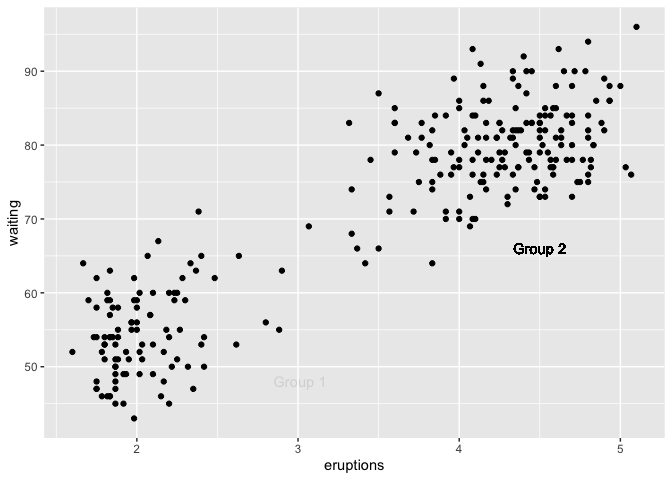<!-- -->

- 在上图中，每个文本标签都是90%透明的，这样就很清楚地显示出了哪一个被遮盖绘制了。在输出为点阵格式时，遮盖绘制问题可能会导致边缘走样(有锯齿)。

- 如果坐标轴是连续型的，你可以使用特殊值Inf和-Inf在绘图区域的边缘放置文本注解。同时，也需要使用hjust和vjust来调整文本相对于边角的位置一一如果你让它们留在默认值的位置上，这些文本就会居中于边界线之上。要将文本定位到理想的位置，可能需要进行一些尝试：

``` r
> p1 + annotate("text", x=-Inf, y=Inf, label="Upper left", hjust=-.2, vjust=2) + 
+   annotate("text", x=mean(range(faithful$eruptions)), y=-Inf, vjust=-0.4,
+            label="Bottom middle")
```

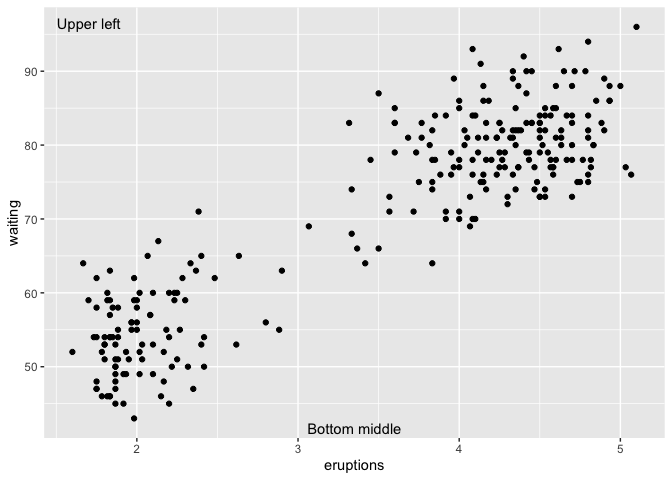<!-- -->

- 参见5.11 节以绘制带有文本的散点图。

- 关于控制文本外观的更多方法，参见9.2节。

## 7.2 在注解中使用数学表达式

- 使用`annotate(geom="text")`并设置`parse=TRUE`：

``` r
> # 一条正态曲线
> p2 <- ggplot(data.frame(x=c(-3,3)),aes(x=x)) + 
+   stat_function(fun = dnorm)
> 
> p2 + annotate('text',x=2,y=0.3,parse=TRUE,
+              label='frac(1,sqrt(2*pi))*e^(-x^2/2)')
```

<!-- -->

- 在ggplot2中使用`parse=TRUE`和文本类几何对象创建的数学表达式，和那些在R基础图形中利用plotmath和expression创建的数学表达式有着类似的格式，**唯一的区别是，前者以字符串的形式存储，而后者是表达式对象**。

- 要将常规文本融入表达式中，只需在双引号内使用单引号(或者反过来)标出纯文本的部分即可。通过内部引号闭合的每一块文本都将被作为数学表达式中的一个变量对待。切记，在R的数学表达式语法中，你不能简单地把一个变量直接放到另一个变量旁边却不在中间加上任何记号。如下图所示，要显示两个相邻的变量，需要在它们之间放置一个`*`操作符；在显示图形时，它会被当作一个不可见的乘号对待(要显示一个可见的乘号，需要使用%\*%)：

``` r
> p2 + annotate("text", x=0, y=0.05, parse=TRUE, size=4,
+              label="'Function: '*y==frac(1, sqrt(2*pi)) * e^(-x^2/2)")
```

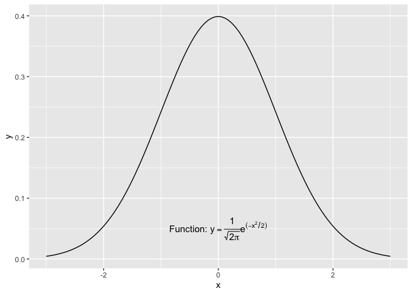<!-- -->

- 更多数学表达式的示例可见`?plotmath`，数学表达式的图示参见`?demo(plotmath)`。

- 参见5.9节以向图形添加回归系数。

- 要在数学表达式中使用其他字体，参见 14.6节。

## 7.3 添加直线

- 对于横线和竖线，使用`geom_hline()`和`geom_vline()`即可。对于有角度的直线，则使用`geom_abline()`。对于下例，我们将使用heightweight数据集：

``` r
> library(gcookbook) # 为了使用数据集
> p3 <- ggplot(heightweight, aes(x=ageYear, y=heightIn, colour=sex)) + 
+   geom_point() 
> # 添加横线和坚线
> p3 + geom_hline(yintercept=60) + geom_vline(xintercept=14)
```

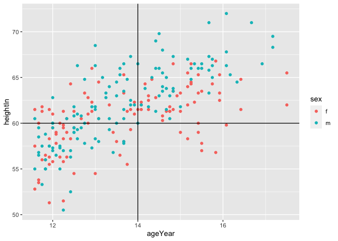<!-- -->

``` r
> # 添加有角度的直线
> p3 + geom_abline(intercept=37.4, slope=1.75)
```

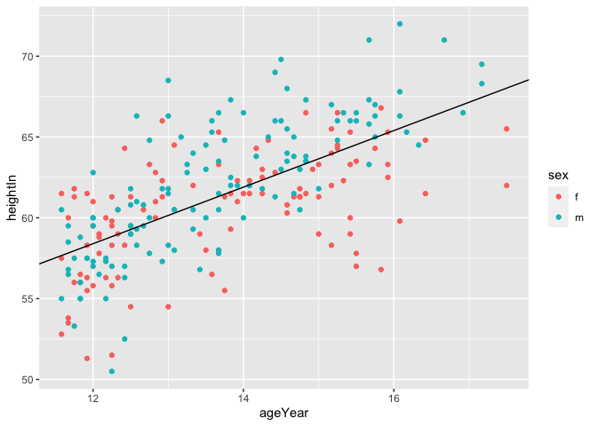<!-- -->

- 上例演示了手动设置直线位置的方法，效果是每添加一个几何对象绘制一条线。我们也可以将值从数据映射到xintercept、yintercept等之上，甚至是绘制另一个数据框中的值。我们将在这里计算男性和女性的平均身高，并将它们存储到一个数据框hw_means中。然后为每个均值绘制一条水平线，并手工设定linetype和linewidth：

``` r
> library(plyr)  # 为了使用ddply()函数
> hw_means <- ddply(heightweight, "sex", summarise, heightIn=mean(heightIn)) 
> hw_means
  sex heightIn
1   f 60.52613
2   m 62.06000
> 
> p3 + geom_hline(aes(yintercept=heightIn, colour=sex), data=hw_means,
+                linetype="dashed", linewidth=1)
```

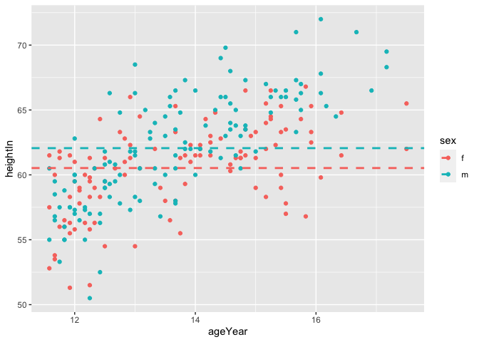<!-- -->

- 如果某个坐标轴是离散型而不是连续型的，不能以字符串的形式直接指定截距—必须仍以数字的形式指定它们。假设此坐标轴表示一个因子，那么第一个水平为数值1，第二个水平为数值2，依次类推。可以像下面这样手工指定数值型的截距，或者使用`which(levels(...))`计算所需数值：

``` r
> pg <- ggplot(PlantGrowth, aes(x=group, y=weight)) + 
+   geom_point() 
> pg + geom_vline(xintercept = 2)
```

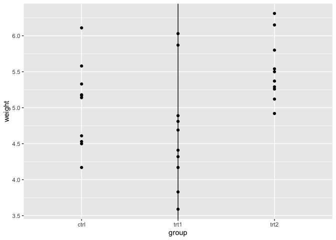<!-- -->

``` r
> pg + geom_vline(xintercept = which(levels(PlantGrowth$group)=="trt1"))
```

<!-- -->

- 要添加回归曲线，参见5.6节和5.7节。

- 线条经常用于显示数据的概要信息。参见15.17节以了解更多按照组计算数据概要的方法。

## 7.4 添加线段和箭头

- 使用`annotate("segment")`。在本例中，我们将使用climate数据集中数据来源为Berkeley的子集：

``` r
> library(gcookbook) # 为了使用数据集
> p4 <- ggplot(subset(climate, Source=="Berkeley"), aes(x=Year, y=Anomaly10y)) + 
+   geom_line()
> p4 + annotate("segment", x = 1950, xend = 1980, y = -.25, yend = -.25)
```

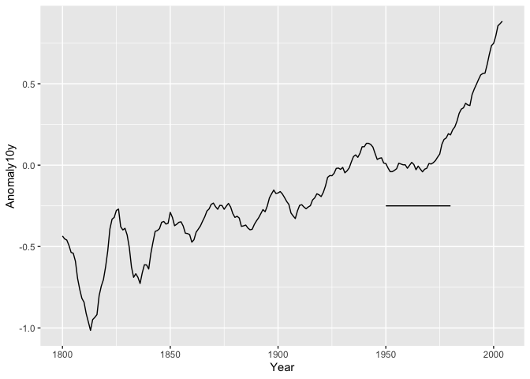<!-- -->

- 可以使用grid包中的`arrow()`函数向线段两端添加箭头或平头。在本例中，我们将一并演示：

``` r
> library(grid)
> p4 + annotate("segment", x=1850, xend=1820, y=-.6, yend=-.95, colour="blue",
+              linewidth=2, arrow=arrow()) + 
+   annotate("segment", x=1950, xend=1980, y=-.25, yend=-.25,
+   arrow=arrow(ends='both', angle=90, length=unit(.2,"cm")))
```

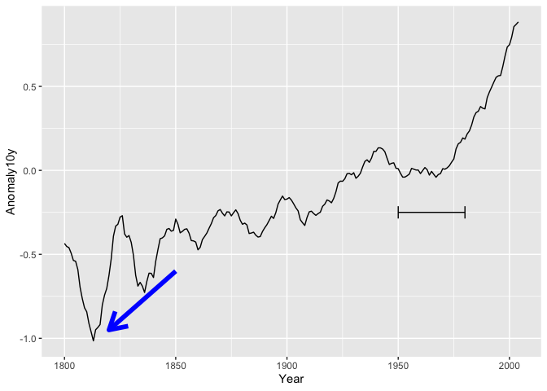<!-- -->

- 箭头线的默认角度(angle)为30度，默认长度(length)为0.2英寸(0.508厘米)。如果一个或多个坐标轴是离散型的，则x和y的位置即由拥有坐标值1,2,3等的类别项表示。

- 要了解关于绘制箭头所需参数的更多信息，请载入grid包后查看`?arrow`。

## 7.5 添加矩形阴影

- 使用`annotate("rect")`：

``` r
> library(gcookbook)  # 为了使用数据集
> p4 <- ggplot(subset(climate, Source=="Berkeley"), aes(x=Year, y=Anomaly10y)) + 
+   geom_line()
> p4 + annotate("rect", xmin=1950, xmax=1990, ymin=-1, ymax=1, alpha=.1,fill="blue")
```

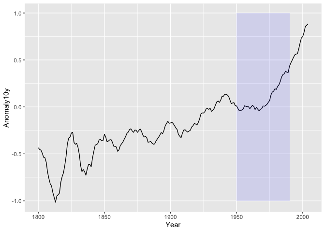<!-- -->

- 每一个图层都是按照添加到ggplot对象的先后顺序绘制的，所以上例中的矩形被绘制在了曲线上方。在这个例子中这不成问题，但是如果你想把曲线放在矩形上方，则要先添加矩形，再添加曲线。

- 只要传递了合适的参数，任意几何对象都可以配合`annotate()`使用。在本例中，`geom_rect()`所需的参数是x和y的最大值与最小值。

## 7.6 高亮某一元素

- 要高亮一个或多个元素，需要在数据中创建一个新列并将其映射为颜色。在本例中，我们将创建一个新列h1，并根据
  group的值来设定它的值，接下来使用手工指定的颜色画图，且不加图例：

``` r
> pg1 <- PlantGrowth # 复制一份PlantGrowth数据
> pg1$h1 <- "no" # 设定所有值为"no"
> pg1$h1[pg$group=="trt2"] <- "yes" # 如果group值为"trt2"，设定为"yes"
> 
> ggplot(pg1,aes(x=group, y=weight, fill=h1)) + 
+   geom_boxplot() + 
+   scale_fill_manual(values=c("grey85","#EFDDCC"), guide='none')
```

<!-- -->

- 参见第12章以了解关于如何指定颜色的更多信息。

- 关于移除图例的更多说明，参见10.1节。

## 7.7 添加误差线

- 使用geom_errorbar并将变量映射到ymin和ymax的值即可。对于条形图和折线图，添加误差线的方法相同(尽管条形图与折线图y的默认范围有所不同)：

``` r
> library(ggplot2)
> library(gcookbook) # 为了使用数据集
> # 为本例抽取cabbage_exp数据的一个子集
> ce <- subset(cabbage_exp, Cultivar=="c39")
> # 为条形图添加误差线
> ggplot(ce,aes(x=Date,y=Weight)) + 
+   geom_bar(stat='identity',fill="white",colour="black") + 
+   geom_errorbar(aes(ymin=Weight-se,ymax=Weight+se), width=.2)
```

<!-- -->

``` r
> # 为折线图添加误差线
> ggplot(ce,aes(x=Date,y=Weight)) + 
+   geom_line(aes(group=1)) + 
+   geom_point(size=4) + 
+   geom_errorbar(aes(ymin=Weight-se,ymax=Weight+se), width=.2)
```

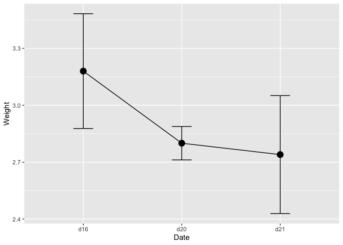<!-- -->

- 在本例中，数据已经包含了均值的标准误差(sd)，我们将利用它来绘制误差线(数据中也包含了标准差(sd)的数据，不过我们在这里用不着它)：

``` r
> ce
  Cultivar Date Weight        sd  n         se
1      c39  d16   3.18 0.9566144 10 0.30250803
2      c39  d20   2.80 0.2788867 10 0.08819171
3      c39  d21   2.74 0.9834181 10 0.31098410
```

- 为了获得ymax和ymin的值，我们取y值变量Weight加上和减去了se。

- 同样，我们使用width=.2指定了误差线的末端宽度。要找到看起来理想的值，最好进行一些试探。如果你不设置这个宽度，则误差线将会非常宽，横跨x轴上各项的全部空间。对于一幅分组的条形图，各误差线也必须被并列(dodged)；否则，它们会有完全相同的x坐标，无法与条形对齐(参见3.2节以了解关于分组条形图和并列的更多信息)。这次我们将利用完整的cabbage_exp数据集：

``` r
> cabbage_exp
  Cultivar Date Weight        sd  n         se
1      c39  d16   3.18 0.9566144 10 0.30250803
2      c39  d20   2.80 0.2788867 10 0.08819171
3      c39  d21   2.74 0.9834181 10 0.31098410
4      c52  d16   2.26 0.4452215 10 0.14079141
5      c52  d20   3.11 0.7908505 10 0.25008887
6      c52  d21   1.47 0.2110819 10 0.06674995
```

- `geom_bar()`的默认并列宽度为0.9，你必须让误差线的并列宽度与此相同。如果不指定并列宽度，则默认按误差线的宽度并列，而此宽度通常会小于条形的宽度：

``` r
> # 反例：未指定并列宽度
> ggplot(cabbage_exp, aes(x=Date, y=Weight, fill=Cultivar)) + 
+   geom_bar(stat='identity',position="dodge") + 
+   geom_errorbar(aes(ymin=Weight-se, ymax=Weight+se),
+                 position="dodge", width=.2)
```

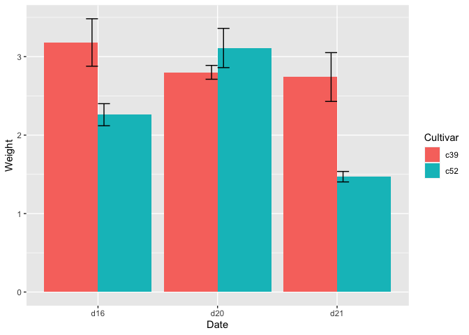<!-- -->

``` r
> # 正例：设定并列宽度与条形的相同(0.9)
> ggplot(cabbage_exp, aes(x=Date, y=Weight, fill=Cultivar)) + 
+   geom_bar(stat='identity',position="dodge") + 
+   geom_errorbar(aes(ymin=Weight-se, ymax=Weight+se),
+                 position=position_dodge(0.9), width=.2)
```

<!-- -->

- 注意我们在第一个版本中使用了`position="dodge"`，即`position=position_dodge()`的简写。但如果要传递一个特定值，我们必须把它完整地拼出，如`position_dodge(0.9)`。

- 对于折线图来说，如果误差线的颜色与线和点的颜色不同，则应先绘制误差线，这样它们就会位于点和线的下层了。否则，误差线将被绘制在点和线的上层，看起来会不太对。另外，你应当同时并列所有的几何元素，这样它们就会同误差线对齐：

``` r
> pd <- position_dodge(.3) # 保存井列参数，因为我们要重复使用它
> ggplot(cabbage_exp, aes(x=Date, y=Weight, colour=Cultivar, group=Cultivar)) + 
+   geom_errorbar(aes(ymin=Weight-se, ymax=Weight+se),
+                 width=.2, size=0.25, colour="black", position=pd) + 
+   geom_line(position=pd) + 
+   geom_point(position=pd, size=2.5)
```

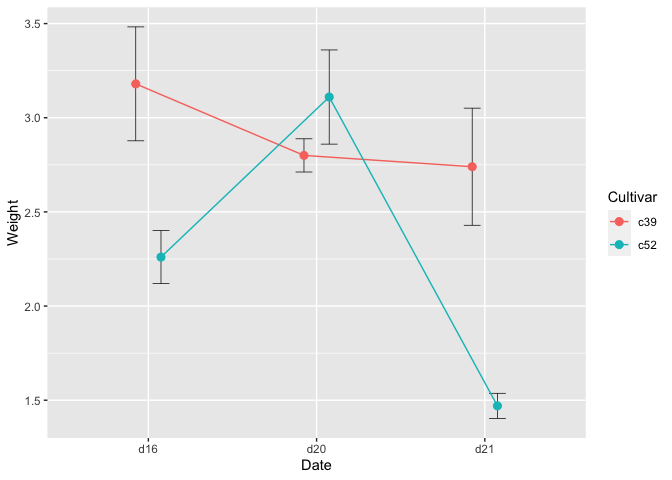<!-- -->

``` r
> #使用size=0.25绘制更细的误差线线条，使用size=2.5绘制更大的点
```

- 注意，我们设置了`colour="black”`以使误差线为黑色；否则它们将继承上方的colour值。我们也通过将Cultivar映射到group的方式来确保它被作为分组变量使用。

- 当一个离散型变量被映射到一个如colour或fill的图形属性时(如条形的例子)，此变量就会被用于对数据进行分组。但是通过设定误差线的colour属性，我们将使这个针对colour的变量并没用于分组，所以需要一些其他的途径来通知
  `ggplot()`在每个x位置的这两组数据属于不同的组，这样它们就可以被正确地并列了。

- 参见3.2节以了解更多关于创建分组条形图的信息，参见4.3节以了解如何创建含多条线的折线图。

- 参见15.18节以计算均值、标准差、标准误差和置信域等统计汇总。

- 参见4.9节以在数据沿x轴有更高密度时添加一个置信域。

## 7.8 向独立分面添加注解

- 使用分面变量创建一个新的数据框，并设定每个分面要绘制的值。然后配合新数据框使用`geom_text()`：

``` r
> # 基本图形
> p5 <- ggplot(mpg, aes(x=displ, y=hwy)) + 
+   geom_point() + 
+   facet_grid(.~ drv) 
> # 存有每个分面所需标签的数据框
> f_labels <- data.frame(drv = c("4","f","r"), label = c("4wd", "Front", "Rear"))
> 
> p5 + geom_text(x=6,y=40, aes(label=label), data=f_labels) 
```

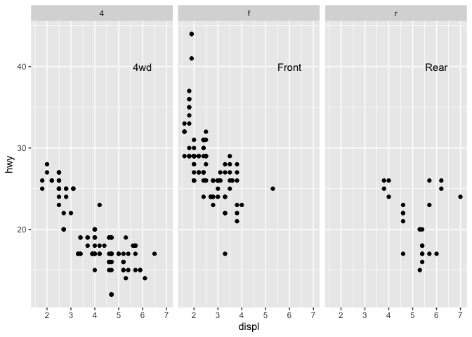<!-- -->

``` r
> 
> # 如果你使用annotate()，标签将在所有分面上出现
> p5 + annotate("text", x=6,y=42, label="label text")
```

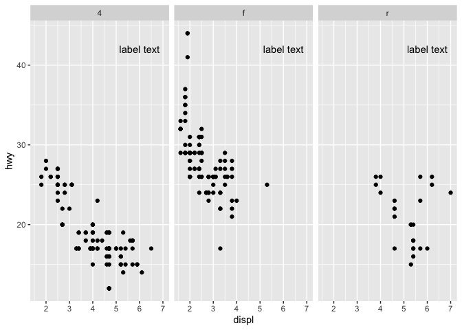<!-- -->

- 这种方法可以用于显示每个分面中关于数据的信息。举例来说，我们可以展示每个分面的线性回归曲线、每条曲线的回归公式，以及的值。要完成这件任务，我们将编写一个函数，它可以输入一个数据框并返回另外一个数据框，其中包含一个含有回归公式的字符串和一个含产值的字符串。然后我们使用`ddply()`将这个函数应用到每一组数据上：

``` r
> # 此函数返回一个数据框，其中的字符串
> # 表示回归公式和r^2值
> # 这些字符串将被认为是R中的数学表达式
> lm_labels <- function(dat) {
+   mod <- lm(hwy ~ displ, data=dat)
+   formula <- sprintf("italic(y) == %.2f %+.2f * italic(x)",
+                      round(coef(mod) [1], 2), round(coef(mod) [2], 2))
+ r <- cor(dat$displ, dat$hwy)
+ r2 <- sprintf("italic(R^2) == %.2f", r^2)
+ data.frame(formula=formula, r2=r2, stringsAsFactors=FALSE)
+ }
> 
> library(plyr) # 为了使用ddply()函数
> labels <- ddply(mpg, "drv", lm_labels)
> labels
  drv                              formula                  r2
1   4 italic(y) == 30.68 -2.88 * italic(x) italic(R^2) == 0.65
2   f italic(y) == 37.38 -3.60 * italic(x) italic(R^2) == 0.36
3   r italic(y) == 25.78 -0.92 * italic(x) italic(R^2) == 0.04
> 
> #绘制公式和R^2值
> p5 + geom_smooth(method=lm, se=FALSE) + 
+   geom_text(x=3, y=40, aes(label=formula), data=labels, parse=TRUE, hjust=0) + 
+   geom_text(x=3, y=35, aes(label=r2), data=labels, parse=TRUE, hjust=0)
```

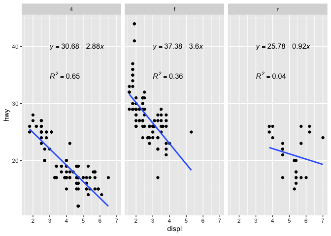<!-- -->

- 我们需要在这里编写自己的函数，是因为要生成线性模型并提取系数需要直接操作数据框中的每个子集。如果你仅仅想要展示产值，通过配合`ddply()`使用`summarise()`函数并传递附加参数给`summarise()`，完全可以做得更简单：

``` r
> # 计算每组的r^2值
> labels <- ddply(mpg, "drv", summarise, r2 = cor(displ, hwy)^2) 
> labels$r2 <- sprintf("italic(R^2) == %.2f", labels$r2)
```

- 文本类儿何对象并不是可向每个分面独立添加的唯一几何对象。只要输入的数据结构正确，我们可以使用任意几何对象。

- 参见7.2节以了解更多在图形中使用数学表达式的方法。

- 如果你不想让ggplot2使用`stat_smooth()`为你绘制预测曲线，而是希望使用自己的模型对象绘制，请参见5.8节。
