chapter08_坐标轴
================

- <a href="#8-坐标轴" id="toc-8-坐标轴">8 坐标轴</a>
  - <a href="#81-交换x轴和y轴" id="toc-81-交换x轴和y轴">8.1 交换x轴和y轴</a>
  - <a href="#82-设置连续型坐标轴的值域"
    id="toc-82-设置连续型坐标轴的值域">8.2 设置连续型坐标轴的值域</a>
  - <a href="#83-反转一条连续型坐标轴" id="toc-83-反转一条连续型坐标轴">8.3
    反转一条连续型坐标轴</a>
  - <a href="#84-修改类别型坐标轴上项目的顺序"
    id="toc-84-修改类别型坐标轴上项目的顺序">8.4
    修改类别型坐标轴上项目的顺序</a>
  - <a href="#85-设置x轴和y轴的缩放比例"
    id="toc-85-设置x轴和y轴的缩放比例">8.5 设置x轴和y轴的缩放比例</a>
  - <a href="#86-设置刻度线的位置" id="toc-86-设置刻度线的位置">8.6
    设置刻度线的位置</a>
  - <a href="#87-移除刻度线和标签" id="toc-87-移除刻度线和标签">8.7
    移除刻度线和标签</a>
  - <a href="#88-修改刻度标签的文本" id="toc-88-修改刻度标签的文本">8.8
    修改刻度标签的文本</a>

Source：

1.  《R数据可视化手册》，北京：人民邮电出版社，2014.5

# 8 坐标轴

## 8.1 交换x轴和y轴

- 使用`coord_flip()`来翻转坐标轴：

``` r
> library(ggplot2)
> ggplot(PlantGrowth, aes (x=group, y=weight)) + geom_boxplot ()
```

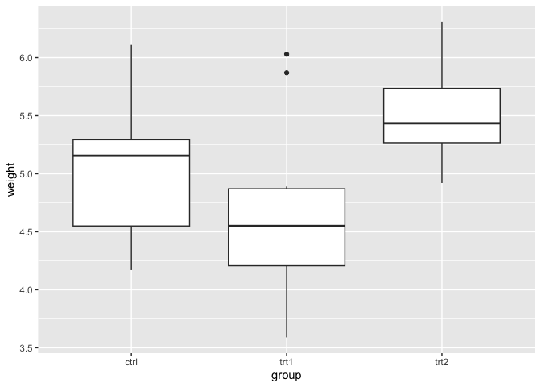<!-- -->

``` r
> ggplot(PlantGrowth, aes (x=group, y=weight)) + geom_boxplot() + coord_flip()
```

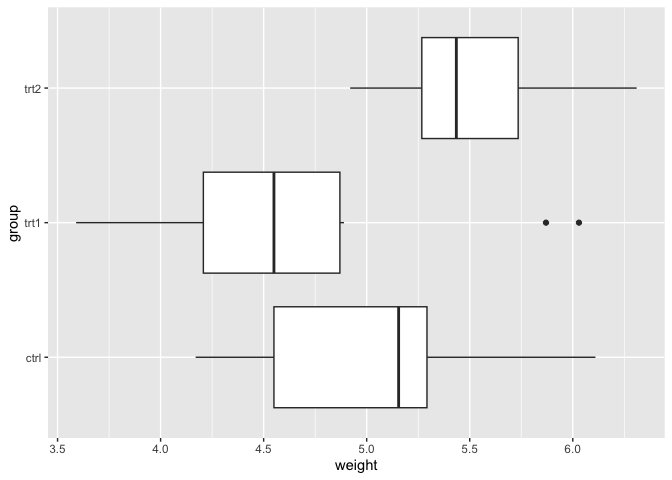<!-- -->

- 对于散点图来说，调换纵轴和横轴上显示的元素非常简单：仅仅交换映射到x和y的变量就可以了。但并不是所有ggplot2中的几何对象都会同等对待x轴和y轴。举例来说，箱线图依y轴对数据计算统计摘要，折线图中的线段只沿x轴移动，误差线只有一个单独的x值但具有若干y值，等等。如果你正在使用这些几何对象，并且希望在图形中交换它们的坐标轴，那么`coord_flip()`正是你所需要的。

- 有时在交换坐标轴后，各项的顺序可能正好与你想要的相反。在一幅有着标准x轴和y轴的图形上，与x对应的项目从左到右排列，这与正常从左到右的阅读方式一致。但是当你交换了坐标轴，各项仍是从原点开始向外排列，在这种情况下就是从下到上，与正常从上到下的阅读方式发生冲突。某些时候这是一个问题，某些时候又不是。如果x变量是一个因子型变量，则排列顺序可以通过使用`scale_x_discrete()`和参数`limits=rev(levels(...))`进行反转：

``` r
> ggplot(PlantGrowth, aes(x=group, y=weight)) + 
+   geom_boxplot() + 
+   coord_flip() + 
+   scale_x_discrete(limits=rev(levels(PlantGrowth$group)))
```

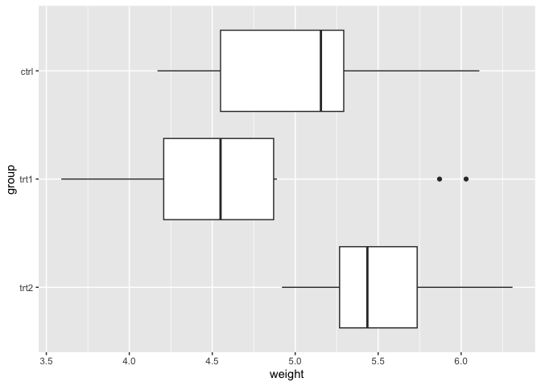<!-- -->

- 如果变量是连续型的，参见8.3节以反转其方向。

## 8.2 设置连续型坐标轴的值域

- 你可以使用`xlim()`或`ylim()`来设置一条连续型坐标轴的最小值和最大值。下图展示了一幅使用默认y轴范围的图形和另一幅手动设定y轴范围的图形：

``` r
> p1 <- ggplot(PlantGrowth, aes(x=group, y=weight)) + 
+   geom_boxplot() 
> # 显示基本图形
> p1
```

<!-- -->

``` r
> p1 + ylim(0, max(PlantGrowth$weight))
```

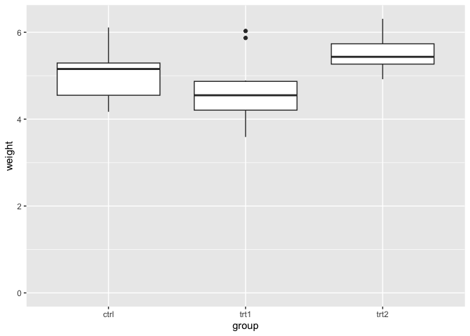<!-- -->

- 第二个示例将y轴的值域设置为从0到weight列的最大值，当然此处使用一个常数值(如10)作为最大值也无妨。

- 使用`ylim()`来设定范围是通过`scale_y_continuous()`来设定范围的简便写法(对于`xlim()`和`scale_x_continuous()`同理)。以下两种表达方式等价:

      ylim(0,10)

      scale_y_continuous (limits=c(0,10))

- 有时，你需要设定`scale_y_continuous()`的其他属性，在这些情况下同时使用`ylim()`和`scale_y_continuous()`可能会让程序产生一些不可预知的行为，这是因为只有命令中的后一条会生效。在以下两个示例中，`ylim(0,10)`应当设定y的值域为从0到10，而`scale_y_continuous(breaks=c(0,5,10))`应将刻度线放置到0、5、10的位置。但是在这两个例子中，仅有第二条命令生效：

``` r
> p1 + ylim(0, 10) + scale_y_continuous(breaks=c(0, 5,10))
```

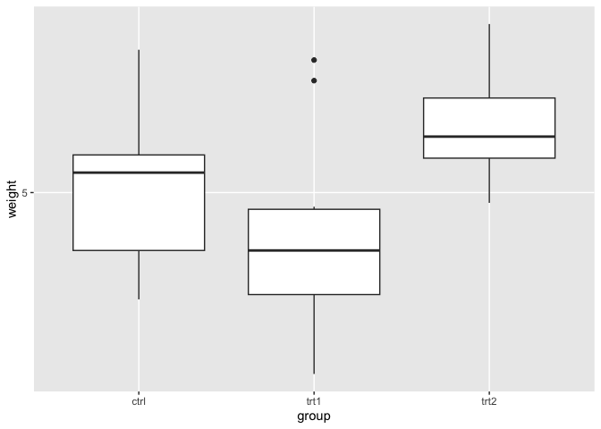<!-- -->

``` r
> p1 + scale_y_continuous(breaks=c(0, 5, 10)) + ylim(0,10)
```

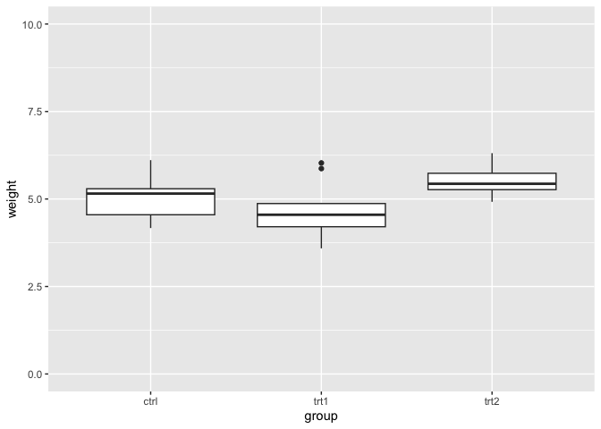<!-- -->

- 要让两项修改均生效，舍弃`ylim()`并直接在`scale_y_continuous()`中同时设定limits和breaks即可：

``` r
> p1 + scale_y_continuous(limits=c(0, 10), breaks=c(0, 5, 10))
```

<!-- -->

- ggplot2中有两种设置坐标轴值域的方式。第一种方式是修改标度，第二种方式是应用一个坐标变换。当你修改x标度和y标度的范围时，任何在范围以外的数据都会被移除，换言之，超出范围的数据不仅不会被展示，而且会被完全移出考虑处理的数据范围。

- 以上文的箱线图为例，如果你限制了y的值域，使得某些原始数据被剪除掉，则箱线图中统计量的计算都会基于修剪后的数据，而箱线的形状也会随之改变。

- 通过使用坐标变换，数据则不会被修剪；从本质上说，它只是将数据放大或缩小到指定的范围。下图展示了两种方式的区别：

``` r
> p1 + scale_y_continuous(limits = c(5,6.5)) # 与使用ylim()相间
```

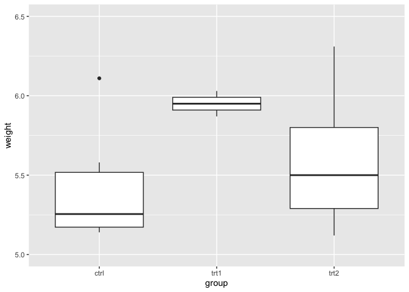<!-- -->

``` r
> p1 + coord_cartesian(ylim = c(5, 6.5))
```

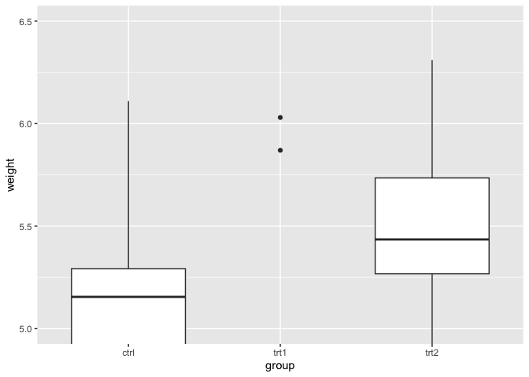<!-- -->

- 最后，通过使用`expand_limits()`来单向扩展值域也是可以的。不过，你不能使用它来缩减值域：

``` r
> p1 + expand_limits(y=0)
```

<!-- -->

## 8.3 反转一条连续型坐标轴

- 使用scale_y\_reverse或scale_x\_reverse。坐标轴的方向也可通过指定反序的范围来反转，先写最大值，再写最小值：

``` r
> ggplot(PlantGrowth, aes(x=group, y=weight)) + geom_boxplot() + scale_y_reverse() #通过指定反序的范围产生类似的效果
```

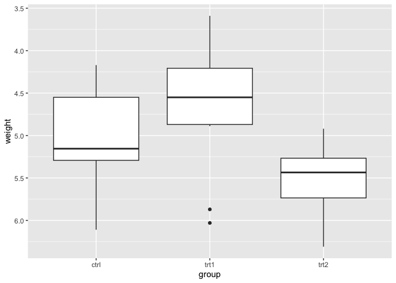<!-- -->

``` r
> ggplot(PlantGrowth, aes(x=group, y=weight)) + geom_boxplot() + ylim(6.5, 3.5)
```

<!-- -->

- 与`scale_y_continuous()`类似，`scale_y_reverse()`也无法与ylim配合工作(对x轴属性也一样)。如果你希望反转某条坐标轴并为它设定值域，则必须通过反序设定范围的方式，在`scale_y_reverse()`语句内完成：

``` r
> ggplot(PlantGrowth, aes(x=group, y=weight)) + geom_boxplot() + 
+   scale_y_reverse(limits=c(8, 0))
```

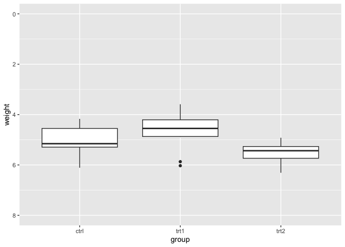<!-- -->

- 要反转离散型坐标轴项目的顺序，参见8.4节。

## 8.4 修改类别型坐标轴上项目的顺序

- 对于类别型(或者说离散型)坐标轴来说，会有一个因子型变量映射到它上面，坐标轴上项目的顺序可以通过设定`scale_x_discrete()`或`scale_y_discrete()`中的参数limits来修改。要手动设定坐标轴上项目的顺序，将一个依理想顺序排列的水平向量指定给limits即可。你也可以使用这个向量来忽略某些项目：

``` r
> p2 <- ggplot(PlantGrowth, aes(x=group, y=weight)) + 
+   geom_boxplot() 
> p2 + scale_x_discrete(limits=c("trt1", "ctrl", "trt2"))
```

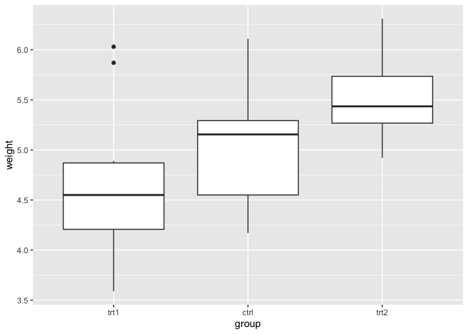<!-- -->

- 你也可以使用以上方法在坐标轴上展示项目的子集。使用以下语句将仅显示ctrl和trt1：

``` r
> p2 + scale_x_discrete(limits=c("ctrl","trt1"))
```

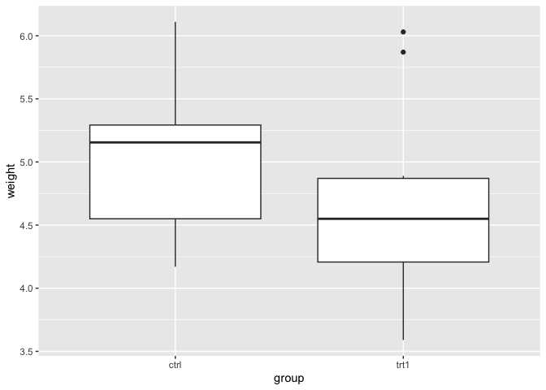<!-- -->

- 要反转项目顺序，设定`limits=rev(levels(...))`，将因子型变量放入括号中即可。以下语句将反转因子PlantGrowth\$group的顺序：

``` r
> p2 + scale_x_discrete(limits=rev(levels(PlantGrowth$group)))
```

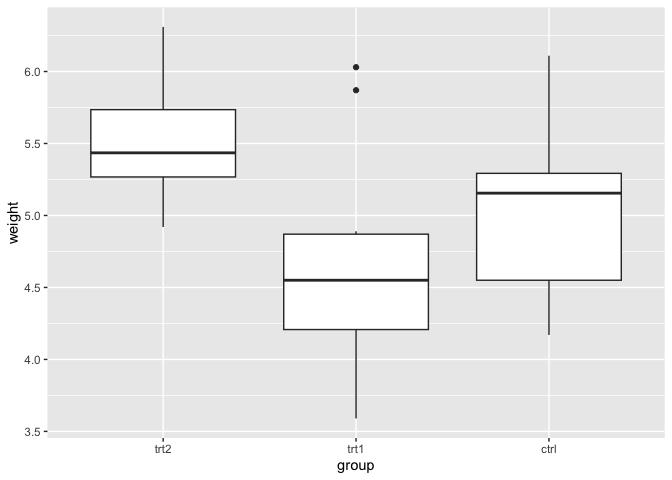<!-- -->

- 要根据另外一列数据的值对因子水平进行重排序，参见15.9节。

## 8.5 设置x轴和y轴的缩放比例

- 使用`coord_fixed()`。以下代码将得到x轴和y轴之间1:1的缩放结果：

``` r
> library(gcookbook)  # 为了使用数据集
> sp <- ggplot(marathon, aes(x=Half,y=Full)) + geom_point()
> sp + coord_fixed()
```

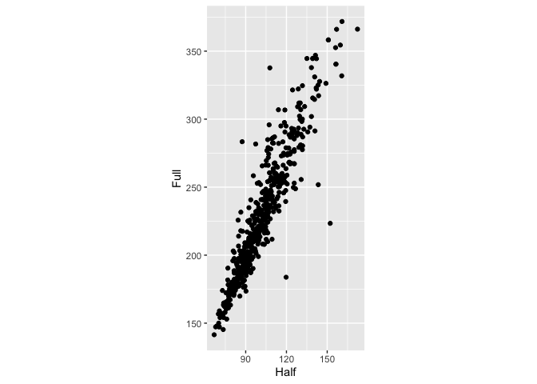<!-- -->

- marathon数据集中包含了跑步者的全程马拉松成绩和半程马拉松成绩。在这种情况下，强制相同的x轴和y轴缩放比例可能是有用的。

- 通过在`scale_y_continuous()`和`scale_x_continuous()`中调整参数breaks，从而将刻度间距设为相同，也会有所帮助：

``` r
> sp + coord_fixed() +  
+   scale_y_continuous(breaks=seq(0, 420,30)) + 
+   scale_x_continuous(breaks=seq(0, 420,30))
```

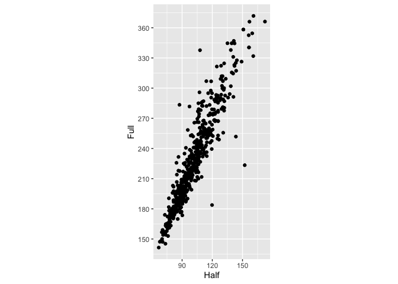<!-- -->

- 如果你希望为两个坐标轴之间指定其他的固定比例而非相同的比例，可以设置参数ratio。对于marathon数据集，我们可能想让对应半程马拉松时间的坐标轴被拉伸到全程马拉松时间坐标轴的两倍。我们也将在x轴上添加双倍的刻度线：

``` r
> sp + coord_fixed(ratio=1/2) + 
+   scale_y_continuous(breaks=seq(0,420,30)) + 
+   scale_x_continuous(breaks=seq(0,420,15))
```

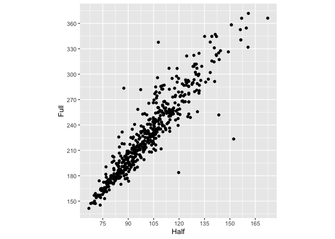<!-- -->

## 8.6 设置刻度线的位置

- 通常来说`ggplot()`会自动将刻度线摆放在合适的位置，但如果你希望改变它们的位置，设置标度中的参数breaks即可：

``` r
> ggplot(PlantGrowth, aes(x=group, y=weight)) + geom_boxplot()
```

<!-- -->

``` r
> ggplot(PlantGrowth, aes(x=group, y=weight)) + geom_boxplot() + scale_y_continuous(breaks=c(4, 4.25, 4.5, 5, 6, 8))
```

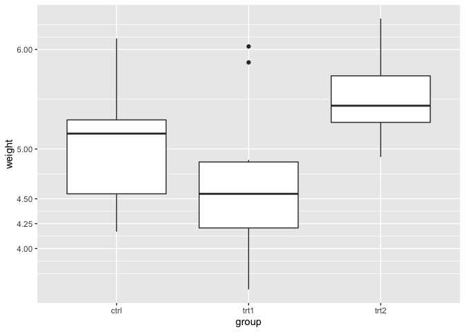<!-- -->

- 刻度线的位置决定了绘制主网格线的位置。如果该坐标轴表示一个连续型变量，那么颜色更暗且没有标签的次网格线将被默认绘制在每两个主网格线的正中间位置。

- 你也可以使用`seq()`函数或运算符`:`来生成刻度线的位置向量：

``` r
> seq(4, 7, by=.5)
[1] 4.0 4.5 5.0 5.5 6.0 6.5 7.0
> 5:10
[1]  5  6  7  8  9 10
```

- 如果坐标轴是离散型而不是连续型的，则默认会为每个项目生成一条刻度线。对于离散型坐标轴，你可以通过指定limits来修改项目的顺序或移除项目(参见8.4节)。设定breaks将会决定为哪些水平加上标签，但不会移除它们或是改变它们的顺序。下图展示了当你设定limits和breaks时将会发生的情况：

``` r
> # 为离散型坐标轴同时设定breaks和limits
> ggplot(PlantGrowth, aes(x=group, y=weight)) + 
+   geom_boxplot() + 
+   scale_x_discrete(limits=c("trt2", "ctrl"), breaks="ctrl")
```

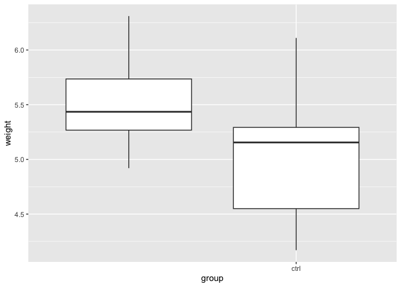<!-- -->

- 要从图中移除刻度线和刻度线标签(不修改数据)，参见8.7节。

## 8.7 移除刻度线和标签

- 要像下图一样仅移除刻度标签，使用`theme(axis.text.y =element_blank())`(也可对`axis.text.x`做相同处理)即可。这种方法对于连续型和离散型坐标轴均有效：

``` r
> p3 <- ggplot(PlantGrowth, aes(x=group, y=weight)) + 
+   geom_boxplot()
> 
> p3 + theme(axis.text.y = element_blank())
```

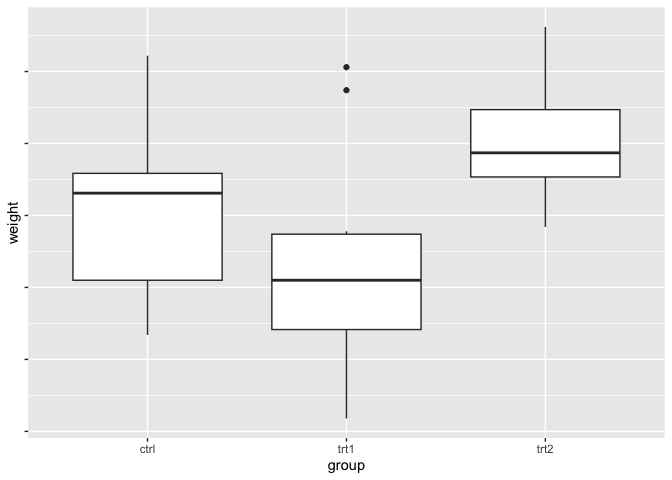<!-- -->

- 要移除刻度线，可使用`theme(axis.ticks=element_blank())`。这样将会同时移除两轴的刻度线(无法仅隐藏单个坐标轴的刻度线)。在本例中，我们将隐藏所有的刻度线和y轴的刻度标签：

``` r
> p3 + theme(axis.ticks = element_blank(), axis.text.y = element_blank())
```

<!-- -->

- 要移除刻度线、刻度标签和网格线，将breaks设置为NULL即可：

``` r
> p3 + scale_y_continuous(breaks=NULL)
```

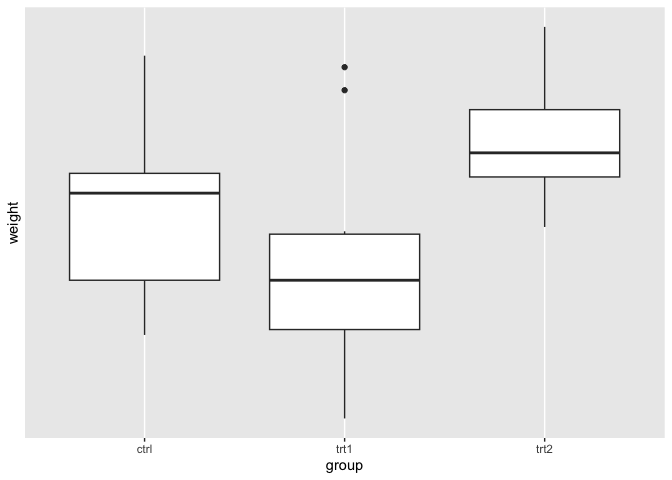<!-- -->

- 这种方法仅对连续型坐标轴有效；如果像8.4节中那样使用limits从类别型坐标轴上移除项目，则含有对应值的数据将完全不被显示。

- 事实上，共有三种项目可以控制：刻度标签、刻度线和网格线。对于连续型坐标轴，`ggplot()`通常会在每个breaks值的位置放置刻度线、刻度标签和主网格线。对于类别型坐标轴，这些元素则出现在每个limits值的位置。

- 我们可以独立控制每条坐标轴上的刻度标签。但是，刻度线和网格线必须同时控制。

## 8.8 修改刻度标签的文本

- 考虑下图中的散点图，身高(变量heightIn)是以英寸的数值表示的：

``` r
> library(gcookbook) # 为了使用数据集
> hwp <- ggplot(heightweight, aes(x=ageYear, y=heightIn)) + 
+   geom_point()
> hwp
```

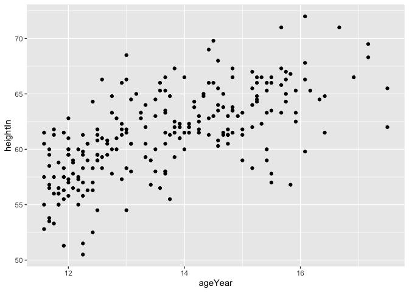<!-- -->

- 要像下图一样任意设定标签，在标度中为breaks和labels赋值即可。其中的个标签含有一个换行符()，意为让`ggplot()`在那里另起一行：

``` r
> hwp + scale_y_continuous(breaks=c(50,56,60,66,72),
+                          labels=c("Tiny","Really\nshort", "Short", "Medium", "Tallish"))
```

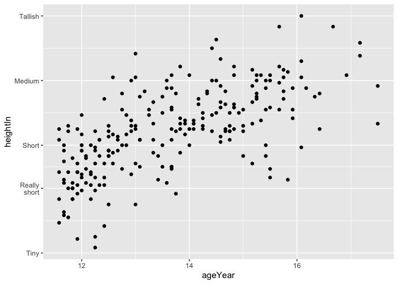<!-- -->

- 除了完全任意地设置标签以外，更常见的情况是数据以某种格式存储，而我们希望以另外一种格式显示标签。举例来说，我们可能想让身高变量显示为英尺和英寸的格式(像5’6’’这样)，而不是仅仅显示一个英寸数值。要完成这项任务，我们可以定义一个格式刷(formatter)函数，这样的函数可以读入数值并返回相应的字符串。例如，以下函数可将英寸数值转换为英尺加英寸的格式：

``` r
> footinch_formatter <- function(x){
+   foot <- floor(x/12)
+   inch <- x%%12
+   return(paste(foot, "'", inch,"\"", sep=""))
+          }
```

- 下面是此函数对输入值56\~64的返回结果(反斜杠是转义符，用来区分字符串中所含的引号和字符串本身的定界引号)：

``` r
> footinch_formatter(56:64)
[1] "4'8\""  "4'9\""  "4'10\"" "4'11\"" "5'0\""  "5'1\""  "5'2\""  "5'3\"" 
[9] "5'4\"" 
```

- 现在就可以使用参数labels把我们的函数传递给标度了：

``` r
> hwp + scale_y_continuous(labels=footinch_formatter)
```

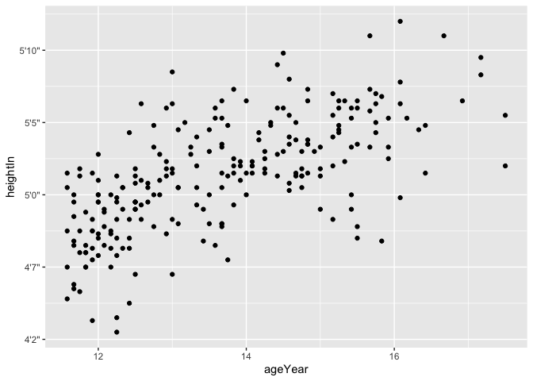<!-- -->

- 在图中，每隔五英寸放置了一个自动生成的刻度线，但是对于这个数据来说看起来有些古怪。我们可以通过指定参数breaks让`ggplot()`每隔四英寸设置一条刻度线取而代之：

``` r
> hwp + scale_y_continuous(breaks=seq(48,72,4), labels=footinch_formatter)
```

<!-- -->

- 另一项常见任务是将时间测度转换为HH:MM:SS(时:分:秒)或者其他类似的格式。以下函数可以读入分钟的数值并将它们转换为这种格式，同时舍入到最接近的秒数(也可以按照你的特殊需要来自定义)：

``` r
> timeHMS_formatter <- function(x) {
+   h <- floor (x/60)
+   m <- floor(x %% 60)
+   s<- round (60*(x %% 1)) # 舍入到最接近的秒数
+   lab <- sprintf("%02d:%02d:%02d", h, m,s)  # 格式化字符串为HH:MM:SS的格式
+   lab <- gsub("^00:", "", lab) # 如果开头存在00:则移除
+   lab <- gsub ("^0", "", lab) # 如果开头存在0则移除
+   return (lab)
+   }
```

- 使用一些示例数值运行它会得到：

``` r
> timeHMS_formatter(c(.33, 50,51.25,59.32,60, 60.1, 130.23))
[1] "0:20"    "50:00"   "51:15"   "59:19"   "1:00:00" "1:00:06" "2:10:14"
```

- 随ggplot2安装的scales包自带了一些内建的格式化函数：

  - `comma()`在千、百万、十亿等位置向数字添加逗号。
  - `dollar()`添加一个美元符号并舍入到最接近的美分。
  - `percent()`乘以100，舍入到最接近的整数值，并添加一个百分号。
  - `scientific()`对大数字和小数字给出科学记数法表示，如3.30e+05。

- 如果你希望使用这些函数，必须首先使用library(scales)加载scales包。
