chapter09_控制图形的整体外观
================

- <a href="#9-控制图形的整体外观" id="toc-9-控制图形的整体外观">9
  控制图形的整体外观</a>
  - <a href="#91-设置图形标题" id="toc-91-设置图形标题">9.1 设置图形标题</a>
  - <a href="#92-修改文本外观" id="toc-92-修改文本外观">9.2 修改文本外观</a>
  - <a href="#93-使用主题" id="toc-93-使用主题">9.3 使用主题</a>
  - <a href="#94-修改主题元素的外观" id="toc-94-修改主题元素的外观">9.4
    修改主题元素的外观</a>
  - <a href="#95-创建自定义主题" id="toc-95-创建自定义主题">9.5
    创建自定义主题</a>
  - <a href="#96-隐藏网格线" id="toc-96-隐藏网格线">9.6 隐藏网格线</a>

Source：

1.  《R数据可视化手册》，北京：人民邮电出版社，2014.5

# 9 控制图形的整体外观

## 9.1 设置图形标题

- 使用`ggtitle()`设置标题：

``` r
> library(ggplot2)
> library(gcookbook) # 为了使用数据集
> p1 <- ggplot(heightweight, aes(x=ageYear, y=heightIn)) + geom_point()
> p1 + ggtitle("Age and Height of Schoolchildren")
```

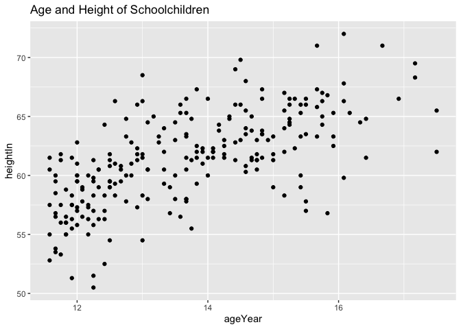<!-- -->

``` r
> # 使用\n来换行
> p1 + ggtitle("Age and Height\nof Schoolchildren")
```

<!-- -->

- 使用`ggtitle()`与使用`labs(title ="标题文本")`是等价的。

- 如果你希望将标题移动到绘图区域内部，可以使用以下两种方法之一，这两种方法都需要一点技巧。第一种方法是将一个负的vjust值与`ggtitle()`配合使用。**这种方法的缺点是在绘图区域的上方仍然会留有空白的空间**。

``` r
> # 移动标题到内部
> p1 + ggtitle("Age and Height of Schoolchildren") + 
+   theme(plot.title=element_text(vjust = -8.5))
```

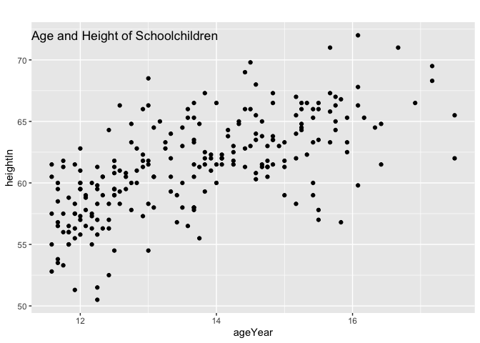<!-- -->

- 第二种方式则是使用一个文本注解，设定其x的位置为x值域的中间，y的位置为Inf，这样就会将其置于绘图区域的顶部。这种方法同时需要vjust为正值，以使文本完全落入绘图区域：

``` r
> # 或使用一个文本型注解
> p1 + annotate("text", x=mean(range(heightweight$ageYear)), y=Inf,
+               label="Age and Height of Schoolchildren", vjust=1.5, size=6)
```

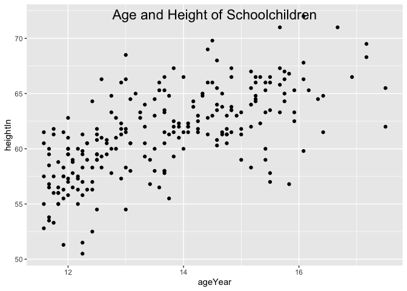<!-- -->

## 9.2 修改文本外观

- 要设置如标题、坐标轴标签和坐标轴刻度线等主题项目(theme
  item)的外观，使用`theme()`并通过`element_text()`设定对应项目的属性即可。举例来说，`axis.title.x`控制着x轴标签的外观，而`plot.title`则控制着标题文本的外观：

``` r
> library(gcookbook) # 为了使用数据集
> #基本图形
> p1 <- ggplot(heightweight, aes(x=ageYear, y=heightIn)) + geom_point()
> # 主题项目外观的控制
> p1 + theme(axis.title.x=element_text(size=16, lineheight=.9, family="Times",
+                                      face="bold.italic", colour="red"))
```

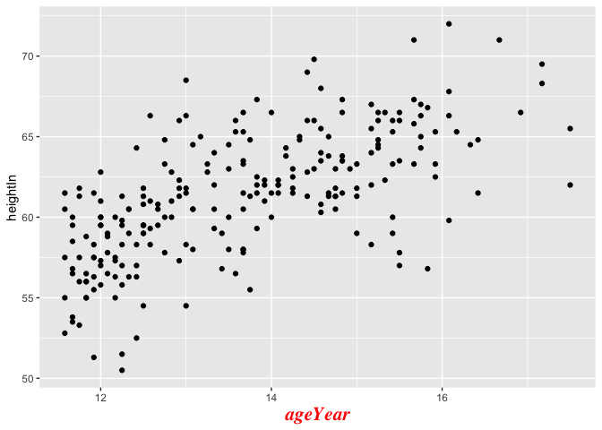<!-- -->

``` r
> p1 + ggtitle("Age and Height\nof Schoolchildren") + 
+   theme(plot.title=element_text(size=rel(1.5),lineheight=.9, family="Times",
+                                 face="bold.italic", colour="red"))
```

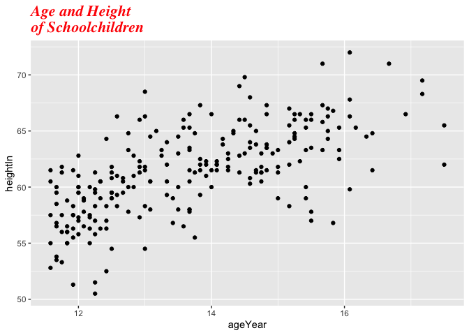<!-- -->

``` r
> # rel(1.5)表示字体大小将为当前主题基准字体大小的1.5倍
> # 对于主题元素来说，字体大小(size)的单位为磅(pt)
```

- 要设置文本几何对象(即在图形内部使用`geom_text()`或`annotate()`添加的文本)的外观，只需设置其文本属性即可：

``` r
> p1 + annotate("text", x=15, y=53, label="Some text", size = 7, family="Times",
+               fontface="bold.italic", colour="red")
```

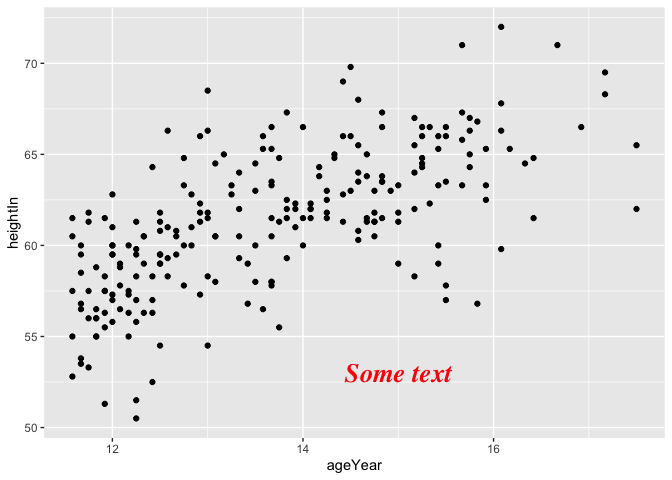<!-- -->

``` r
> p1 + geom_text(aes(label=weightLb), size=4, family="Times", colour="red") 
```

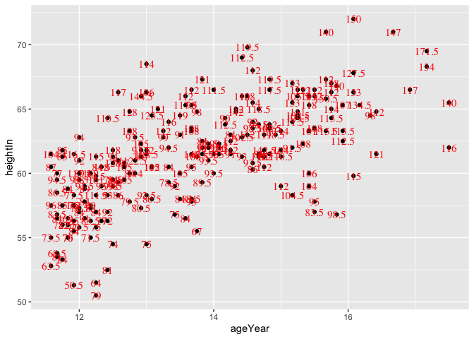<!-- -->

``` r
> # 对于文本几何对象，字体大小的单位为毫米(mm)
```

- 在ggplot2中，文本项目分为两类：主题元素和文本几何对象。主题元素包括图形中的所有非数据元素：如标题、图例和坐标轴。文本几何对象则属于图形本身的一部分。

- 控制两类文本项目属性的参数略有不同，如下表所示：

| 主题元素   | 文本几何对象 | 说明                                                                    |
|------------|--------------|-------------------------------------------------------------------------|
| family     | family       | Helvetica（无衬线)、Times（衬线)、Courier（等宽）。                     |
| face       | fontface     | plain （普通）、bold（粗体）、italic（斜体）、 bold. italic（粗斜体）。 |
| colour     | colour       | 文字颜色（颜色名称或”#RRGGBB”形式的十六进制颜色代码）。                 |
| size       | size         | 字体大小（主题元素的单位是磅，几何对象的单位是毫米）。                  |
| hjust      | hjust        | 横向对齐：0=左对齐，0.5=居中，1=右对齐。                                |
| vjust      | vjust        | 纵向对齐：0=底部对齐，0.5=居中，1=顶部对齐。                            |
| angle      | angle        | 旋转角度，单位为度。                                                    |
| lineheight | lineheight   | 行间距倍数。                                                            |

- 相应的主题元素已列于下表中，其中大多数理解起来都很简单直观。下图中展示了一部分。

| 元素名称     | 说明                 |
|--------------|----------------------|
| axis.title   | 双轴标签的外观。     |
| axis.title.x | x轴标签的外观。      |
| axis.title.y | y轴标签的外观。      |
| axis.ticks   | 双轴刻度标签的外观。 |
| axis.ticks.x | x轴刻度标签的外观。  |
| axis.ticks.y | y轴刻度标签的外观。  |
| leqend.title | 图例标题的外观。     |
| legend.text  | 图例项文本的外观。   |
| plot.title   | 图形总标题的外观。   |
| strip.text   | 双向分面标签的外观。 |
| strip.text.x | 横向分面标签的外观。 |
| strip.text.y | 纵向分面标签的外观。 |

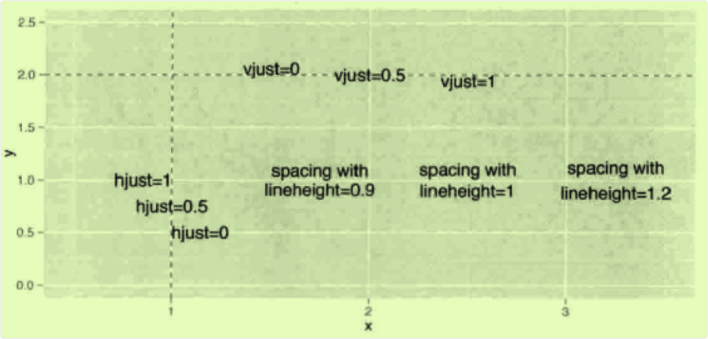

- 使用hjust 和 vjust 进行对齐，并使用lineheight调整行间距。

## 9.3 使用主题

- 要使用预制的主题，向图形添加`theme_bw()`或`theme_grey()`即可：

``` r
> library(gcookbook) # 为了使用数据集
> # 基本图形
> p1 <- ggplot (heightweight, aes(x=ageYear, y=heightIn)) + geom_point()
> # (默认的)灰色主题
> p1 + theme_grey()
```

<!-- -->

``` r
> # 黑白主题
> p1 + theme_bw()
```

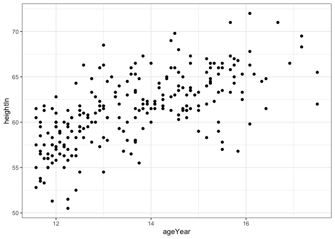<!-- -->

- ggplot2中主题元素的某些常用属性是通过`theme()`来控制的。其中的多数属性，如标题、图例和坐标轴，位于绘图区域的外部，**但另一些则位于绘图区域的内部，如网格线和背景色**。

- ggplot2的两套自带主题是`theme_grey()`和`theme_bw()`，不过你也可以创建自己的专属主题。

- 你可以自行设置两个内置主题的基本字体和字体大小(默认的基本字体为无衬线的Helvetica，默认大小为12)：

``` r
> p1 + theme_grey(base_size=16, base_family="Times")
```

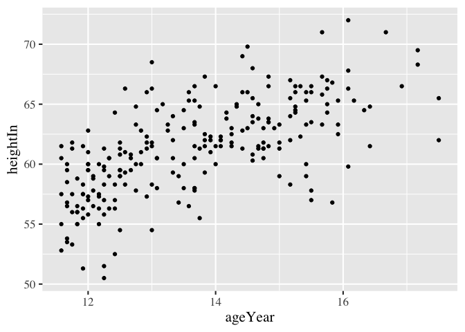<!-- -->

- 你可以使用`theme_set()`设置当前R会话下的默认主题：

``` r
> # 为当前会话设置默认主题
> theme_set(theme_bw())
> # 将使用theme_bw() 
> p1
```

<!-- -->

``` r
> #将默认主题重置回theme_grey() 
> theme_set(theme_grey())
> p1
```

<!-- -->

- 要修改一套主题，参见9.4节。

- 要创建一套自定义主题，参见9.5节。

- 查看`?theme`以了解所有可用的主题属性。

## 9.4 修改主题元素的外观

- 要修改一套主题，配合相应的`element_xx`对象添加`theme()`函数即可。`element_xx`对象包`括element_line`、`element_rect`以及`element_text`。下列代码展示了许多常用主题属性的修改方法：

``` r
> library(gcookbook) # 为了使用数据集
> # 基本图形
> p2 <- ggplot(heightweight, aes(x=ageYear, y=heightIn, colour=sex)) + geom_point()
> 
> # 绘制区域的选项
> p2 + theme(
+   panel.grid.major = element_line(colour="red"),
+   panel.grid.minor = element_line(colour="red", linetype="dashed", linewidth=0.2), 
+   panel.background = element_rect(fill="lightblue"),
+   panel.border = element_rect(colour="blue", fill=NA, size=2))
```

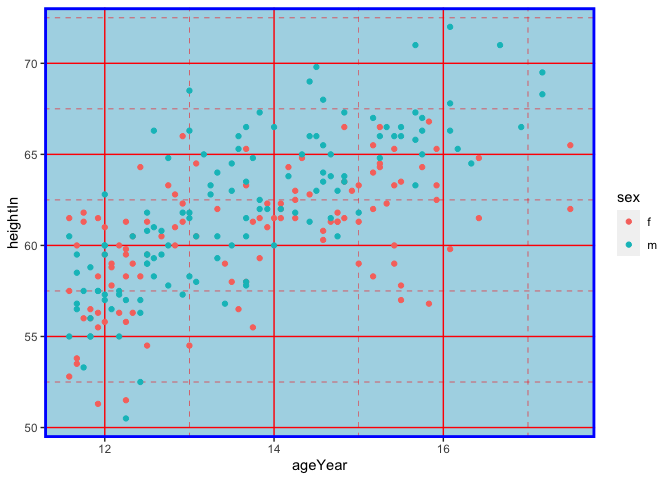<!-- -->

``` r
> # 文本项目的选项
> p2 + ggtitle("Plot title here") + 
+   theme(
+     axis.title.x = element_text(colour="red", size=14),
+     axis.text.x = element_text(colour="blue"),
+     axis.title.y = element_text(colour="red", size=14, angle = 90), 
+     axis.text.y = element_text(colour="blue"),
+     plot.title = element_text(colour="red", size=20, face="bold"))
```

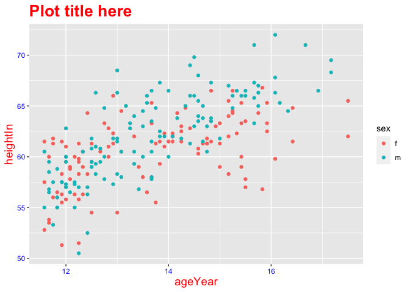<!-- -->

``` r
> # 图例选项
> p2 + theme(
+   legend.background = element_rect(fill="grey85", colour="red", size=1), 
+   legend.title = element_text(colour="blue", face="bold", size=14),
+   legend.text = element_text(colour="red"),
+   legend.key = element_rect(colour="blue", size=0.25))
```

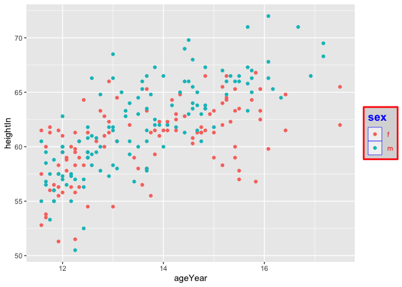<!-- -->

``` r
> # 分面选项
> p2 + facet_grid(sex~.) + theme(
+   strip.background = element_rect(fill="pink"),
+   strip.text.y = element_text(size=14, angle=-90, face="bold")) 
```

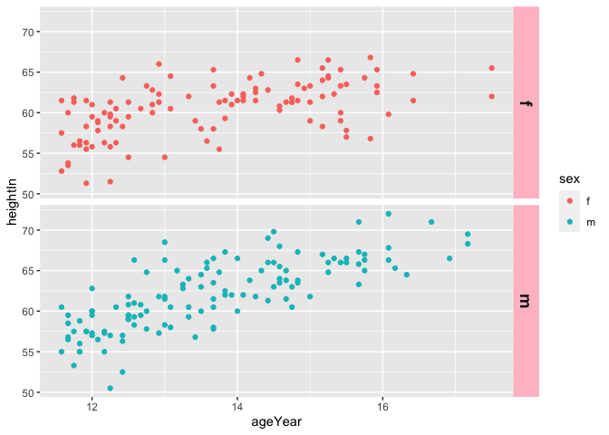<!-- -->

``` r
> # strip.text.x 同理，只不过是针对横向分面
```

- **如果你希望使用一套现成的主题并使用`theme()`微调其中的一些部分，则`theme()`必须接在指定主题的语句之后。否则，任何`theme()`的设定都将被你添加的主题所还原**：

``` r
> # 如果在添加一套完整的主题之前使用，theme()将没有效果
> p2 + theme (axis.title.x = element_text(colour="red")) + theme_bw()
```

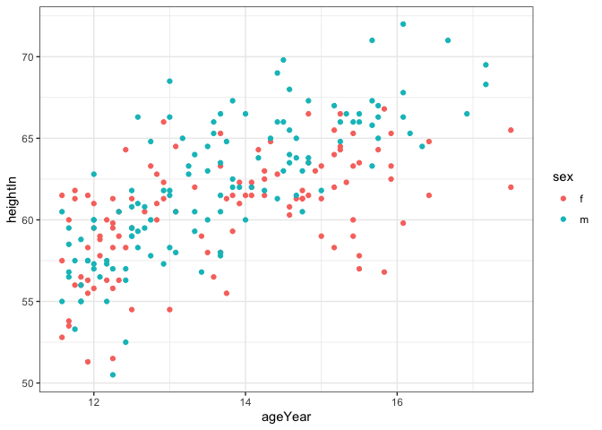<!-- -->

``` r
> # 在完整的主题后使用，theme()可以正常工作
> p2 + theme_bw() + theme(axis.title.x = element_text(colour="red", size=12))
```

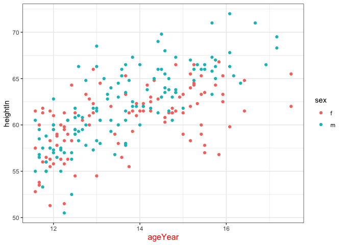<!-- -->

- 许多常用的主题属性列于下表中：

| 名称               | 说明                           | 元素类型                                                                                                                                              |
|--------------------|--------------------------------|-------------------------------------------------------------------------------------------------------------------------------------------------------|
| text               | 所有文本元素。                 | element_text()                                                                                                                                        |
| rect               | 所有矩形元素。                 | element_rect()                                                                                                                                        |
| line               | 所有线条元素。                 | element_line()                                                                                                                                        |
| axis.line          | 坐标轴线。                     | element_line()                                                                                                                                        |
| axis.title.        | 双轴标签的外观。               | element_text()                                                                                                                                        |
| axis.title.x       | x轴标签的外观。                | element_text()                                                                                                                                        |
| axis.title.y       | y轴标签的外观。                | element_text()                                                                                                                                        |
| axis.text          | 双轴刻度标签的外观。           | element_text()                                                                                                                                        |
| axis.text.x        | x轴刻度标签的外观。            | element_text()                                                                                                                                        |
| axis.text.y        | y轴刻度标签的外观。            | element_text()                                                                                                                                        |
| legend.background  | 图例的背景。                   | element_rect()                                                                                                                                        |
| legend.text        | 图例项文本的外观。             | element_text()                                                                                                                                        |
| legend.title       | 图例标题的外观。               | element_text()                                                                                                                                        |
| legend.position    | 图例的位置。                   | “left”(左侧)、“right”(右侧)、 “bottom”(下方)、“top”(上方)，若希望放置在绘图区域内部，则需指定一个双元素数值向量(关于放置图例的更多知识，参见10.2节)。 |
| panel.background   | 绘图区域背景。                 | element_rect()                                                                                                                                        |
| panel.border       | 绘图区域周围的边框。           | element_rect(linetype=‘dashed’)                                                                                                                       |
| panel.grid.major   | 主网格线。                     | element_line()                                                                                                                                        |
| panel.grid.major.x | 纵向主网格线。                 | element_line()                                                                                                                                        |
| panel.grid.major.y | 横向主网格线。                 | element_line()                                                                                                                                        |
| panel.grid.minor   | 次网格线。                     | element_line()                                                                                                                                        |
| panel.grid.minor.x | 纵向次网格线。                 | element_line()                                                                                                                                        |
| panel.grid.minor.y | 横向次网格线。                 | element_line()                                                                                                                                        |
| plot.background    | 整个图形的背景。               | element_rect(fill=‘white’,colour=NA)                                                                                                                  |
| plot.title         | 标题文本的外观。               | element_text()                                                                                                                                        |
| strip.background   | 分面标签的背景。               | element_rect()                                                                                                                                        |
| strip.text         | 纵向和横向分面标签的文本外观。 | element_text()                                                                                                                                        |
| strip.text.x       | 横向分面标签的文本外观。       | element_text()                                                                                                                                        |
| strip.text.y       | 纵向分面标签的文本外观。       | element_text()                                                                                                                                        |

## 9.5 创建自定义主题

- 你可以通过向一套现成主题添加元素的方式创建自定义主题：

``` r
> library(gcookbook) # 为了使用数据集
> # 从theme_bw()入手，修改一些细节
> mytheme <- theme_bw() + 
+   theme(text= element_text(colour="red"),
+         axis.title = element_text(size = rel(1.25)))
> # 基本图形
> p1 <- ggplot(heightweight, aes(x=ageYear, y=heightIn)) + geom_point()
> # 使用修改后的主题绘图
> p1 + mytheme
```

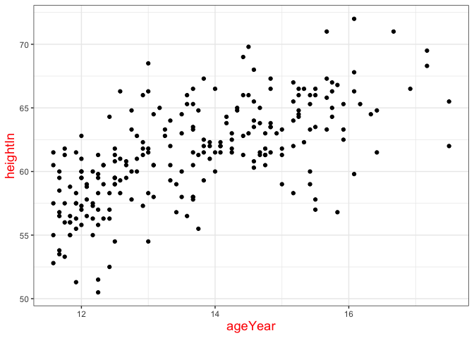<!-- -->

- 使用ggplot2，不仅可以直接利用默认主题，也可以修改这些主题以满足你的需求。可以添加新的主题元素或者修改现有的值，并将修改全部应用到多幅图形或者只应用到单幅图形上。

- 主题的可修改选项列于9.4节中。

## 9.6 隐藏网格线

- 主网格线(与刻度线对齐的那些)可通过`panel.grid.major`来控制，次网格线(位于主网格线之间的那些)则通过`panel.grid.minor`来控制。以下代码将二者同时隐藏，如下图所示：

``` r
> library(gcookbook) # 为了使用数据集
> p1 <- ggplot(heightweight, aes(x=ageYear, y=heightIn)) + geom_point()
> p1 + theme(panel.grid.major = element_blank(),
+            panel.grid.minor = element_blank())
```

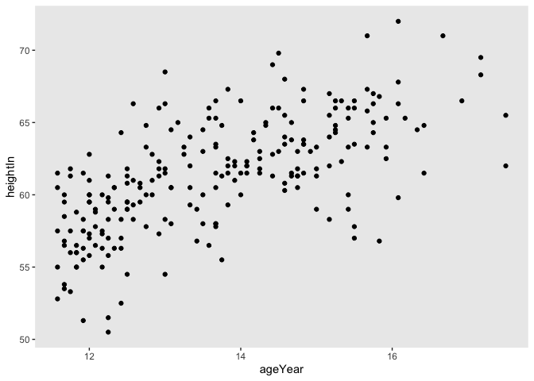<!-- -->

- 通过使用`panel.grid.major.x`、`panel.grid.major.y`、`panel.grid.minor.x`和`panel.grid.minor.y`，我们也可以只隐藏纵向或横向网格线：

``` r
> # 隐藏纵向网格线(与x轴交汇的那些)
> p1 + theme(panel.grid.major.x = element_blank(),
+            panel.grid.minor.x = element_blank())
```

<!-- -->

``` r
> # 隐藏横向网格线(与y轴交汇的那些)
> p1 + theme(panel.grid.major.y = element_blank(),
+            panel.grid.minor.y = element_blank())
```

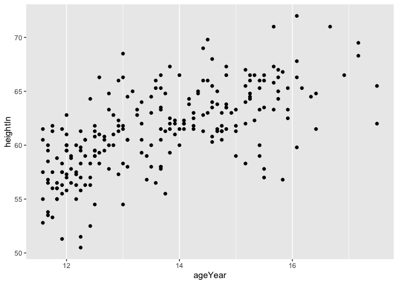<!-- -->
