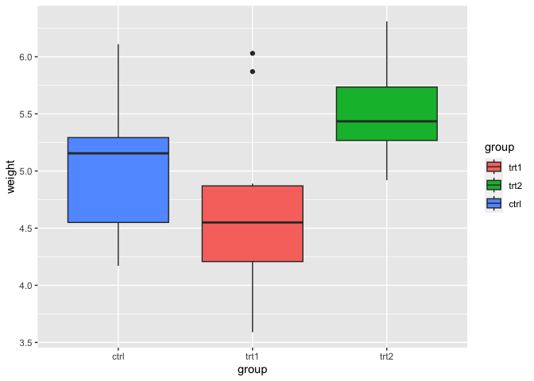

chapter10_图例
================

- <a href="#10-图例" id="toc-10-图例">10 图例</a>
  - <a href="#101-移除图例" id="toc-101-移除图例">10.1 移除图例</a>
  - <a href="#102-修改图例的位置" id="toc-102-修改图例的位置">10.2
    修改图例的位置</a>
  - <a href="#103-修改图例项目的顺序" id="toc-103-修改图例项目的顺序">10.3
    修改图例项目的顺序</a>
  - <a href="#104-反转图例项目的顺序" id="toc-104-反转图例项目的顺序">10.4
    反转图例项目的顺序</a>
  - <a href="#105-修改图例标题" id="toc-105-修改图例标题">10.5
    修改图例标题</a>
  - <a href="#106-修改图例标题的外观问题"
    id="toc-106-修改图例标题的外观问题">10.6 修改图例标题的外观问题</a>
  - <a href="#107-移除图例标题" id="toc-107-移除图例标题">10.7
    移除图例标题</a>
  - <a href="#108-修改图例标签" id="toc-108-修改图例标签">10.8
    修改图例标签</a>
  - <a href="#109-修改图例标签的外观" id="toc-109-修改图例标签的外观">10.9
    修改图例标签的外观</a>
  - <a href="#1010-使用含多行文本的标签"
    id="toc-1010-使用含多行文本的标签">10.10 使用含多行文本的标签</a>

Source：

1.  《R数据可视化手册》，北京：人民邮电出版社，2014.5

# 10 图例

## 10.1 移除图例

- 使用`guides()`，并指定需要移除图例的标度：

``` r
> library(ggplot2)
> # 基本图形(含图例)
> p1 <- ggplot(PlantGrowth, aes(x=group, y=weight, fill=group)) + geom_boxplot()
> p1
```

<!-- -->

``` r
> # 移除标度fill的图例
> p1 + guides(fill="none")
```

<!-- -->

- 移除某个图例的另一种方式是在对应标度中设置`guide="none"`。这样做得到的输出结果将与上述代码完全相同：

``` r
> # 移除标度fill的图例
> p1 + scale_fill_discrete(guide="none")
```

<!-- -->

- 还有一种移除图例的方法是使用主题系统。如果你有多于一种带有图例的图形属性映射(例如color和shape)，这样做将会移除所有图例：

``` r
> p1 + theme(legend.position="none")
```

<!-- -->

- 有些时候图例是冗余的，或者图例会在另一幅和当前图形共同展示的图形中提供。在这种情况下，从一幅图形中移除图例会比较有用。

- 在本例中，颜色提供了和x轴相同的信息，所以没有必要添加图例。还可以注意到，随着图例的移除，绘制数据的区域也随之变得更大。如果你希望得到与之前比例相同的绘图区域，则需要调整图形的整体尺寸。

- 当某个变量被映射到图形属性fill上时，默认使用的标度为`scale_fill_discrete()`(与`scale_fill_hue()`等价)，这会将不同的因子水平映射到色环上均匀分布的颜色值上。对于fill来说，也有其他的标度可用，如`scale_fill_manual()`。如果你要使用其他图形属性的标度，如colour(针对线和点)或shape(针对点)，则必须使用合适的对应标度。常用的标度包括：

      scale_fill_discrete() 
      scale_fill_hue()
      scale_fill_manual() 
      scale_fill_grey() 
      scale_fill_brewer()
      scale_colour_discrete() 
      scale_colour_hue()
      scale_colour_manual() 
      scale_colour_grey()
      scale_colour_brewer() 
      scale_shape_manual() 
      scale_linetype()

## 10.2 修改图例的位置

- 使用`theme(legend.position=...)`即可。通过指定位置参数为top、left、right或bottom，图例即可被放置在顶部、左侧、右侧或底部：

``` r
> p2 <- ggplot(PlantGrowth, aes(x=group, y=weight, fill=group)) + 
+   geom_boxplot() + 
+   scale_fill_brewer(palette="Pastel2")
> p2 + theme(legend.position="top")
```

<!-- -->

- 通过指定像`legend.position=c(1,0)`这样的位置坐标，图例亦可被置于绘图区域内部。坐标空间左下角为原点(0,0)，右上角为(1,1)。

``` r
> p2 + theme(legend.position=c(0.95,0.15))
```

<!-- -->

- 你也可以使用`legend.justification`来指定图例框的哪一部分被放置到`legend.position`所指定的位置上。默认情况下，图例的中心(0.5,
  0.5)被置于给定的坐标处，但是指定一个不同的点往往是有用的。

- 举例来说，以下代码将图例的右下角(1,0) 置于绘图区域的右下角(1,0)：

``` r
> p2 + theme(legend.position=c(1,0), legend.justification=c(1,0))
```

<!-- -->

- 而以下代码则会将图例的右上角置于绘图区域的右上角：

``` r
> p2 + theme(legend.position=c(1,1), legend.justification=c(1,1))
```

<!-- -->

- 在绘图区域内放置图例时，添加一个不透明的边界使其与图形分开可能会有所帮助：

``` r
> p2 + theme(legend.position=c(.85,.2)) + 
+   theme(legend.background=element_rect(fill = "white", colour="black"))
```

<!-- -->

- 你也可以移除图例元素周围的边界以使其融入图形：

``` r
> p2 + theme(legend.position=c(.85,.2)) + 
+   theme(legend.background=element_blank()) + # 移除整体的边框
+   theme(legend.key=element_blank()) # 移除每个图例项目周围的边框
```

<!-- -->

## 10.3 修改图例项目的顺序

- 将对应标度的参数limits设置为理想的顺序即可：

``` r
> # 基本图形
> p1 <- ggplot(PlantGrowth, aes(x=group, y=weight, fill=group)) + geom_boxplot() 
> p1
```

<!-- -->

``` r
> # 修改项目顺序
> p1 + scale_fill_discrete(limits=c("trt1", "trt2", "ctrl"))
```

<!-- -->

- 要注意的是，x轴上项目的顺序并没有改变。要修改这个顺序，需要设置`scale_x_discrete()`的limits参数(参见8.4节)，或者修改数据，使其拥有一个不同的因子水平顺序(参见15.8节)。

- 在上例中，变量group被映射到了图形属性fill上。默认情况下，这将会使用`scale_fill_discrete()`(与`scale_fill_hue()`的情况相同)，将不同的因子水平映射到色环上均匀分布的颜色值上。然而，我们也可以使用其他的不同标度
  `scale_fill_xxx()`。举例来说，我们可以使用灰度调色板：

``` r
> p1 + scale_fill_grey(start=.5, end=1, limits=c("trt1","trt2","ctrl"))
```

<!-- -->

- 或者使用RColorBrewer中的调色板：

``` r
> p1 + scale_fill_brewer(palette="Pastel2", limits=c("trt1","trt2","ctrl"))
```

<!-- -->

- 前述所有示例都是针对图形属性fill的。如果要使用其他图形属性的标度，如colour(针对线和点)或shape(针对点)，则必须使用合适的对应标度。常用的标度包括：

      scale_fill_discrete()
      scale_fill_hue()
      scale_fill_manual() 
      scale_fill_grey() 
      scale_fill_brewer()
      scale_colour_discrete() 
      scale_colour_hue()
      scale_colour_manual() 
      scale_colour_grey() 
      scale_colour_brewer() 
      scale_shape_manual() 
      scale_linetype()

- 默认情况下，使用`scale_fill_discrete()`与使用`scale_fill_hue()`是等价的，这对颜色标度也成立。

- 要反转图例顺序，参见10.4节。

- 要修改因子水平的顺序，参见15.8节。

- 要根据其他变量的值对图例项目进行排序，参见15.9节。

## 10.4 反转图例项目的顺序

- 添加`guides(fill=guide_legend(reverse=TRUE))`以反转图例的顺序，如下图所示(对于其他的图形属性，使用相应图形属性的名称，如colour或size替换fill即可)：

``` r
> # 基本图形
> p1 <- ggplot(PlantGrowth, aes(x=group, y=weight, fill=group)) + geom_boxplot() 
> p1
```

<!-- -->

``` r
> # 反转图例顺序
> p1 + guides(fill=guide_legend(reverse=TRUE))
```

<!-- -->

- 在设定标度的同时也可以控制图例，如下所示：

``` r
> p1 + scale_fill_hue(guide=guide_legend(reverse=TRUE))
```

<!-- -->

## 10.5 修改图例标题

- 使用函数`labs()`并设定fill、colour、shape或任何对于图例来说合适的图形属性的值：

``` r
> # 基本图形
> p1 <- ggplot(PlantGrowth, aes(x=group, y=weight, fill=group)) + geom_boxplot() 
> p1
```

<!-- -->

``` r
> # 设置图标题为"Condition"
> p1 + labs(fill="Condition")
```

<!-- -->

- 在设定标度时也可以设置图例标题。由于图例和坐标轴均为引导元素，这样做与设置x轴或y轴标题的原理是相同的。
  以下代码与上述代码效果相同：

``` r
> p1 + scale_fill_discrete(name="Condition")
```

<!-- -->

- 我们也可以使用函数`guides()`来控制图例标题。这样做虽然有点哕嗦，不过在你使用它来控制其他属性的时候会比较有用：

``` r
> p1 + guides(fill=guide_legend(title="Condition"))
```

<!-- -->

- 如果有多个变量被映射到带有图例的图形属性(即除x和y以外的图形属性)，可以分别设置每个图例的标题。在本例中，我们将使用`\n`向其中一个标题添加一个换行：

``` r
> library(gcookbook) # 为了使用数据集
> # 绘制基本图形
> hw1 <- ggplot(heightweight, aes(x=ageYear, y=heightIn, colour=sex)) + 
+   geom_point(aes(size=weightLb)) + 
+   scale_size_continuous(range=c(1,4))
> hw1
```

<!-- -->

``` r
> # 使用新的图例标题
> hw1 + labs(colour="Male/Female", size="Weight\n(pounds)")
```

<!-- -->

- 如果有一个变量被分别映射到两个图形属性，则默认会生成一个组合了两种情况的图例。例如，我们把sex同时映射到shape和weight上，将只会出现一个图例：

``` r
> hw2 <- ggplot(heightweight, aes(x=ageYear, y=heightIn, shape=sex, colour=sex)) + 
+   geom_point()
> hw2
```

<!-- -->

- 要修改图例标题，你需要同时设置二者的标题。如果只修改其中一个，则会得到两个分离的图例：

``` r
> # 仅修改shape的标题
> hw2 + labs(shape="Male/Female")
```

<!-- -->

``` r
> # 同时修改shape和colour的标题
> hw2 + labs(shape="Male/Female", colour="Male/Female")
```

<!-- -->

## 10.6 修改图例标题的外观问题

- 使用`theme(legend.title=element_text())`：

``` r
> p1 <- ggplot(PlantGrowth, aes(x=group, y=weight, fill=group)) + geom_boxplot() 
> p1 + theme(legend.title=element_text(face="italic", family="Times", colour="red",size=14))
```

<!-- -->

- 我们也可以通过`guides()`来指定图例标题的外观，但这种方式有点哕嗦。以下代码与上述代码效果相同：

``` r
> p1 + guides(fill=guide_legend(title.theme=element_text(face="italic", 
+                                                        family="Times", colour="red", size=14)))
```

<!-- -->

- 参见9.2节以了解更多关于如何控制文本外观的信息。

## 10.7 移除图例标题

- 添加语句`guides(fill=guide_legend(title=NULL))`可以从图例中移除标题，如下图所示(对于其他图形属性，只需将fill替换为相应图形属性的名称，如colour或size即可)：

``` r
> ggplot(PlantGrowth, aes(x=group, y=weight, fill=group)) +
+   geom_boxplot() + 
+   guides(fill=guide_legend(title=NULL))
```

<!-- -->

- 在设定标度的同时也可以控制图例标题。以下代码与前述代码效果相同：

``` r
> ggplot(PlantGrowth, aes(x=group, y=weight, fill=group)) +
+   geom_boxplot() + 
+   scale_fill_hue(guide = guide_legend(title=NULL))
```

<!-- -->

## 10.8 修改图例标签

- 设置标度中的labels参数即可：

``` r
> library(gcookbook) # 为了使用数据集
> # 基本图形
> p1 <- ggplot(PlantGrowth, aes(x=group, y=weight, fill=group)) + geom_boxplot()
> # 修改图例标签
> p1 + scale_fill_discrete(labels=c("Control","Treatment 1","Treatment 2"))
```

<!-- -->

- **注意，x轴的标签并没有改变。要修改它，需要设置`scale_x_discrete()`中的标签(参见8.10节)，或者修改数据让其拥有不同的因子水平名称(参见15.10节)。**

- 在上例中，变量group被映射到了图形属性fill上。默认情况下，这将会使用`scale_fill_discrete()`，以将不同的因子水平映射到色环上均匀分布的颜色值上(与`scale_fill_hue()`的情况相同)。我们也可以使用其他fill标度通过相同的原理设定标签。举例来说，要绘制下图，只需：

``` r
> p1 + scale_fill_grey(start=.5, end=1,labels=c("Control","Treatment 1","Treatment 2"))
```

<!-- -->

- 如果同时修改了图例项目的顺序，则标签会依照位置顺序与项目进行匹配。在本例中，我们将修改项目的顺序，并确保以相同的顺序设置标：

``` r
> p1 + scale_fill_discrete(limits=c("trt1","trt2","ctrl"),
+                          labels=c("Treatment 1", "Treatment 2","Control"))
```

<!-- -->

- 如果有一个变量被分别映射到两个图形属性，则默认会生成一个组合了两种情况的图例。如果希望修改图例标签，则必须同时修改两种标度中的标签；否则将得到两个分离的图例，如下图所示：

``` r
> # 基本图形
> p3 <- ggplot(heightweight, aes(x=ageYear, y=heightIn, shape=sex, colour=sex)) + geom_point()
> p3
```

<!-- -->

``` r
> # 修改一个标度中的标签
> p3 + scale_shape_discrete(labels=c("Female", "Male"))
```

<!-- -->

``` r
> # 同时修改两个标度中的标签
> p3 + scale_shape_discrete(labels=c("Female", "Male")) + 
+   scale_colour_discrete(labels=c("Female", "Male"))
```

<!-- -->

- 其他含有图例的常用标度包括：

      scale_fill_discrete() 
      scale_fill_hue()
      scale_fill_manual() 
      scale_fill_grey() 
      scale_fill_brewer()
      scale_colour_discrete() 
      scale_colour_hue()
      scale_colour_manual() 
      scale_colour_grey() 
      scale_colour_brewer()
      scale_shape_manual() 
      scale_linetype()

- 默认情况下，使用`scale_fill_discrete()`与使用`scale_fill_hue()`是等价的；这对颜色标度也成立。

## 10.9 修改图例标签的外观

- 使用theme(legend.text=element_text())：

``` r
> # 基本图形
> p1 <- ggplot(PlantGrowth, aes(x=group, y=weight, fill=group)) + geom_boxplot()
> # 修改图例标签的外观
> p1 + theme(legend.text=element_text(face="italic", family="Times", 
+                                     colour="red",size=14))
```

<!-- -->

- 我们也可以通过`guides()`来指定图例标签的外观，虽说这种方式有点笨拙。以下代码与上述代码效果相同：

``` r
> # 修改fill对应图例标签文本的外观
> p1 + guides(fill=guide_legend(label.theme=element_text(face="italic", 
+                                                        family="Times", colour="red", size=14)))
```

<!-- -->

- 参见9.2节以了解更多关于如何控制文本外观的信息。

## 10.10 使用含多行文本的标签

- 在相应标度中设置labels参数，使用`\n`来表示新行。在本例中，我们将使用`scale_fill_discrete()`来控制标度fill的图例：

``` r
> # 基本图形
> p1 <- ggplot(PlantGrowth, aes(x=group, y=weight, fill=group)) + geom_boxplot()
> 
> # 含有多于一行文本的标签
> p1 + scale_fill_discrete(labels=c("Control","Type 1\ntreatment","Type 2\ntreatment"))
```

<!-- -->

- 从上图可以看到，默认设置下，当使用多于一行文本的标签时，各行文本间距离很近。要处理这个问题，可以使用
  `theme()`增加图例说明的高度并减小各行的间距完成。要实现这个操作，需要使用grid包中的`unit()`函数来指定高度：

``` r
> library(grid)
> p1 + scale_fill_discrete(labels=c("Control", "Type 1\ntreatment","Type 2\ntreatment")) +
+   theme(legend.text=element_text(lineheight=.8),
+         legend.key.height=unit(1, "cm"))
```

<!-- -->
