chapter12_配色
================

- <a href="#12-配色" id="toc-12-配色">12 配色</a>
  - <a href="#121-设置对象的颜色" id="toc-121-设置对象的颜色">12.1
    设置对象的颜色</a>
  - <a href="#122-将变量映射到颜色上" id="toc-122-将变量映射到颜色上">12.2
    将变量映射到颜色上</a>
  - <a href="#123-对离散型变量使用不同的调色板"
    id="toc-123-对离散型变量使用不同的调色板">12.3
    对离散型变量使用不同的调色板</a>
  - <a href="#124-对离散型变量使用自定义调色板"
    id="toc-124-对离散型变量使用自定义调色板">12.4
    对离散型变量使用自定义调色板</a>
  - <a href="#125-使用色盲友好式的调色板"
    id="toc-125-使用色盲友好式的调色板">12.5 使用色盲友好式的调色板</a>
  - <a href="#126-对连续型变量使用自定义调色板"
    id="toc-126-对连续型变量使用自定义调色板">12.6
    对连续型变量使用自定义调色板</a>
  - <a href="#127-根据数值设定阴影颜色"
    id="toc-127-根据数值设定阴影颜色">12.7 根据数值设定阴影颜色</a>

Source：

1.  《R数据可视化手册》，北京：人民邮电出版社，2014.5

# 12 配色

## 12.1 设置对象的颜色

- 对于几何对象，设置colour或者fill参数的值：

``` r
> library(ggplot2)
> ggplot(mtcars, aes(x=wt, y=mpg)) + geom_point(colour="red")
```

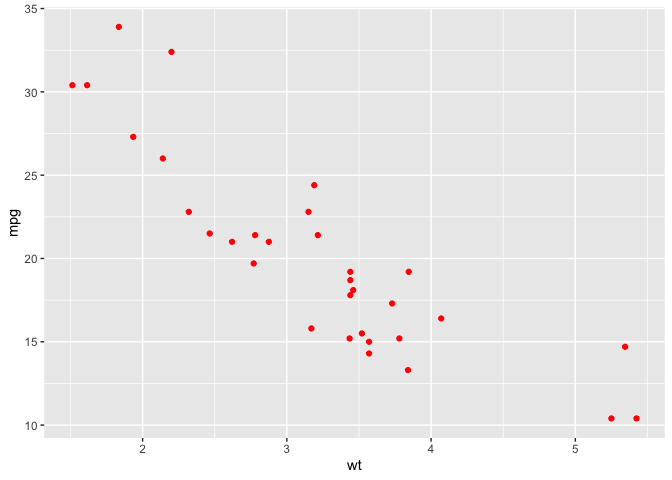<!-- -->

``` r
> library(MASS)  # 为了使用数据集
> ggplot(birthwt, aes(x=bwt)) + geom_histogram(fill="red", colour="black")
```

<!-- -->

- 在ggplot2中，设置和映射图形属性有非常重大的区别。在前面的例子中，我们将对象的颜色设置为”red”(红色)。一般而言，colour参数控制的是线条、多边形轮廓的颜色，而fill参数控制的是多边形的填充色。对于点形来说，情况略微有些不同。大多数的点形，整个点的颜色是由colour控制的，而不是fill。例外的情况是21-25号点，它们不仅有填充色，也有边界色。

- 关于不同形状的点的更多信息，参见4.5节。

- 关于设置颜色的更多信息，参见12.4节。

## 12.2 将变量映射到颜色上

- 对于几何对象，将colour或fill参数的值设置为数据中某一列的列名即可：

``` r
> library(gcookbook)  # 为了使用数据集
> 
> ggplot(cabbage_exp, aes(x=Date, y=Weight, fill=Cultivar)) + geom_bar(position="dodge", stat="identity", colour="black")
```

<!-- -->

``` r
> # 与上述方法效果相同
> #ggplot(cabbage_exp, aes(x=Date, y=Weight)) + geom_bar(aes(fill=Cultivar), stat="identity",colour="black",position="dodge") 
> ggplot(mtcars, aes (x=wt, y=mpg, colour=cyl)) + geom_point()
```

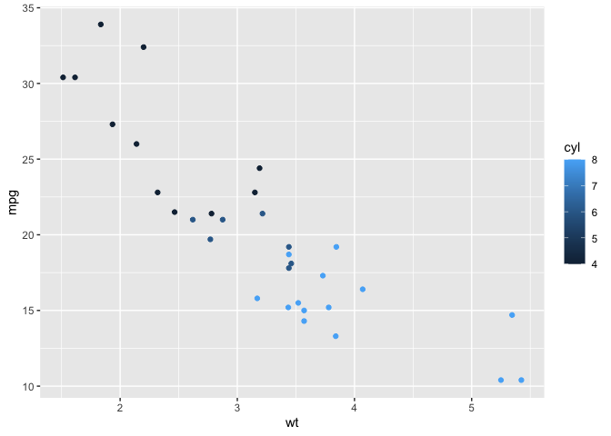<!-- -->

``` r
> # 与上述方法效果相同
> # ggplot(mtcars, aes (x=wt, y=mpg)) + geom_point(aes(colour=cyl))
```

- ggplot()函数中的映射使用的是默认映射(所有几何对象都由此继承)。通过在geom系列函数中的具体设置，可以覆盖默认映射。

- 在`cabbage_exp`的例子中，变量Cultivar映射到了fill。`cabbage_exp`数据集的列Cultivar是因子，因此ggplot2将它作为离散型变量处理。你可以输入`str()`来验证：

``` r
> str(cabbage_exp)
'data.frame':   6 obs. of  6 variables:
 $ Cultivar: Factor w/ 2 levels "c39","c52": 1 1 1 2 2 2
 $ Date    : Factor w/ 3 levels "d16","d20","d21": 1 2 3 1 2 3
 $ Weight  : num  3.18 2.8 2.74 2.26 3.11 1.47
 $ sd      : num  0.957 0.279 0.983 0.445 0.791 ...
 $ n       : int  10 10 10 10 10 10
 $ se      : num  0.3025 0.0882 0.311 0.1408 0.2501 ...
```

- 在mtcars的例子中，变量cyl是数值形式的，因此它被作为连续型变量来处理。正因为如此，尽管它的实际取值仅仅包含了4、6、8，图例中还是显示了中间值5和7。为了让`ggplot()`把cyl视为分类变量，我们可以在`ggplot()`函数中将其转化为因子，或者修改原数据让需要的列成为字符或因子类型。

``` r
> # 在ggplot()中因子化
> ggplot(mtcars, aes(x=wt, y=mpg, colour=factor(cyl))) + geom_point()
```

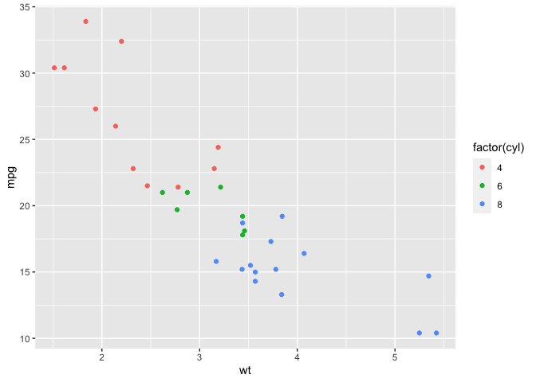<!-- -->

``` r
> # 另一个方法：在原数据中因子化
> # m <- mtcars  # 复制mtcars
> # m$cyl <- factor(m$cyl) # 将cyl转化为因子
> # ggplot(m, aes (x=wt, y=mpg, colour=cyl)) + geom_point()
```

- 你可能还需要改变在标度中使用的颜色。对于连续型数据，参见12.6节；对于离散型数据，参见12.3节或12.4节。

## 12.3 对离散型变量使用不同的调色板

- 使用下表中列出的一种标度。

| 填充色标度            | 轮廓色标度              | 描述                             |
|-----------------------|-------------------------|----------------------------------|
| scale_fill_discrete() | scale_colour_discrete() | 色轮周围均匀等距色(同hue)。      |
| scale_fill_hue()      | scale_colour_hue()      | 色轮周围均匀等距色(同discrete)。 |
| scale_fill_grey()     | scale_colour_grey()     | 灰度调色板。                     |
| scale_fill_brewer()   | scale_colour_brewer()   | ColorBrewer调色板。              |
| scale_fill_manual()   | scale_colour_manual()   | 自定义颜色。                     |

- 在本例中，我们将会使用默认调色板和ColorBrewer调色板：

``` r
> library(gcookbook) # 为了使用数据集
> # 基础图形
> p1 <- ggplot(uspopage, aes(x=Year, y=Thousands, fill=AgeGroup)) + geom_area()
> 
> # 这三种方法效果相同
> p1
```

<!-- -->

``` r
> #p1 + scale_fill_discrete()
> #p1 + scale_fill_hue()
> # ColorBrewer调色板
> p1 + scale_fill_brewer()
```

<!-- -->

- 修改调色板就是修改填充色标度(fill)或轮廓色标度(colour)：它会涉及从连续型或离散型变量到图形属性上映射的改变。在颜色上有两个类型的标度，填充色标度和轮廓色标度。

- 函数`scale_fill_hue()`中，颜色来自HCL色系(`hue-chroma-lightness`：色相-色度-亮度)的色轮，默认的亮度是65(取值为0\~100)。这很适合作为填充色，但对点、线条来说略微亮了些。为了使点、线条的颜色更深一点，可以设置亮度参数1值(luminance/lightness)来实现。

``` r
> # 基本的散点图
> h <- ggplot(heightweight, aes(x=ageYear, y=heightIn, colour=sex)) + geom_point()
> 
> # 默认亮度lightness = 65
> h
```

<!-- -->

``` r
> # 略微加深
> h + scale_colour_hue(l=45)
```

<!-- -->

- ColorBrewer包提供了很多调色板。你可以生成一张图来查看该包中所有调色板：

``` r
> library(RColorBrewer)
> display.brewer.all()
```

<!-- -->

- ColorBrewer调色板可以通过名称来选择。比如，这将使用橘黄色调色板：

``` r
> p1 + scale_fill_brewer(palette="Oranges")
```

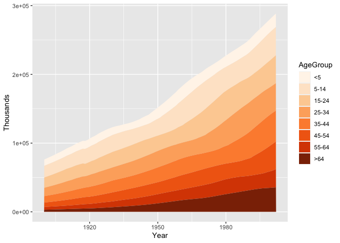<!-- -->

- 你还可以使用灰度调色板，它很适合黑白打印。标度范围是0<sub>1(其中0对应黑色，1对应白色)，灰度调色板的默认范围是0.2</sub>0.8，但这个可以更改。

``` r
> p1 + scale_fill_grey()
```

<!-- -->

``` r
> 
> # 倒转方向并且更改灰度范围
> p1 + scale_fill_grey(start=0.7, end=0)
```

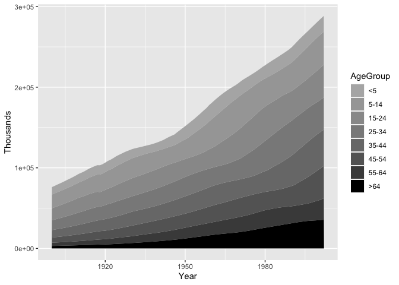<!-- -->

- 10.4节中讲述了倒转图例。

- 手动选择颜色，参见12.4节。

## 12.4 对离散型变量使用自定义调色板

- 在本例中，我们将用`scale_colour_manual()`函数来自定义颜色。其中的颜色可以是已命名的，也可以是RGB形式的。

``` r
> library(gcookbook) # 为了使用数据集
> # 基础图形
> h <- ggplot(heightweight, aes(x=ageYear, y=heightIn, colour=sex)) + geom_point() 
> 
> #使用颜色名
> h + scale_colour_manual(values=c("red", "blue"))
```

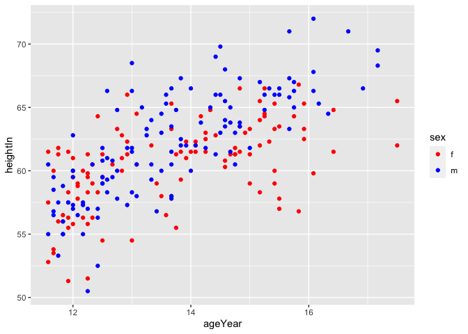<!-- -->

``` r
> 
> #使用RGB值
> h + scale_colour_manual(values=c("#CC6666","#7777DD"))
```

<!-- -->

- 对于填充色标度，使用`scale_fill_manual()`代替即可。

- 参数values向量中的元素顺序自动匹配离散标度对应因子水平的顺序。在前面的例子中，sex的顺序是先f后m，因此values的第一个值赋予f，第二个值赋予m。下面是如何查看因子顺序的方法：

``` r
> levels(heightweight$sex)
[1] "f" "m"
```

- 如果变量是字符型向量而非因子形式，那么它会被自动转化为因子；顺序也默认地按字母表排序。

- 如果想自定义颜色分配的顺序，可以使用带有名称的向量参数：

``` r
> h + scale_colour_manual(values=c(m="blue", f="red"))
```

<!-- -->

- 在R中有很多已经命名的颜色，你可以运行`colors()`命令来查看。知道一些基本的颜色名是很有用的，比如”white”、“black”、“grey80”、“red”、“blue”、“darkred”等。还有很多其他的颜色，但是它们的名字并不是很好理解(比如我就对”thistle3”、“seashel1”之类的毫无概念)，因此使用
  RGB值来定义颜色往往更容易些。

- RGB颜色是由六个数字构成(十六进制数)，形式如”#RRGGBB”。在十六进制中，数字先从0到9，然后紧接着是A到F，其中A对应十进制中的10，F对应十进制中的15。每一个颜色都由两个数字来表示，范围从00到FF((对应十进制中的255)。举个例子，颜色”#FF0099”中，255表示红色、0表示绿色、153表示蓝色，整体表示品红色。十六进制数中每个颜色通道常常重复同样的数字，因为这样更容易阅读并且第二个数字的精确值对外观的影响并不是很明显。

- 这里总结了一些设置、调整 RGB颜色的经验法则。

  - 在一般情况下，较大的数字更明亮，较小的数字更暗淡。
  - 如果要得到灰色，将三个颜色通道设置为相同的值。
  - 和RGB对立的是CMY(印刷三原色)：青(cyan)、品红(magenta)、黄(yellow)。红色通道值越高，颜色越红，越低则越青。同样的法则适用于另外两组颜色对：绿色-品红、蓝色-黄色。

## 12.5 使用色盲友好式的调色板

- 使用函数`scale_fill_manual()`，调色板(cb_palette)用自定义的：

``` r
> library(gcookbook) # 为了使用数据集
> # 基础图形
> p1 <- ggplot(uspopage, aes(x=Year, y=Thousands, fill=AgeGroup)) + geom_area()
> 
> # 加入灰色到调色板
> cb_palette <- c("#999999","#E69F00","#56B4E9","#009E73","#F0E442","#0072B2","#D55E00","#CC79A7")
> # 将其使用到图形中
> p1 + scale_fill_manual(values=cb_palette)
```

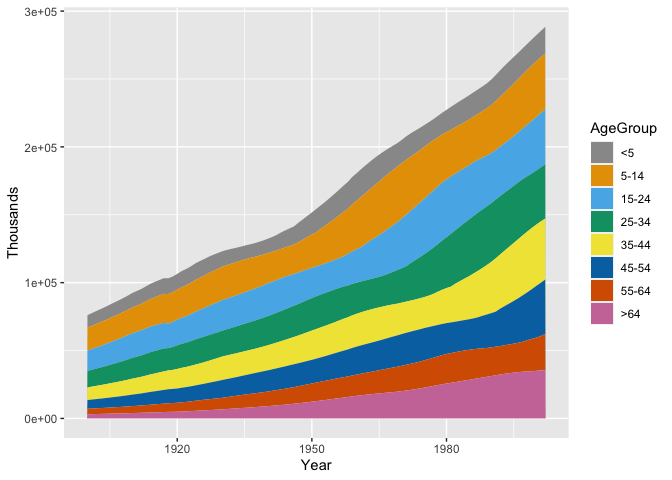<!-- -->

- 有时候使用黑色可能比灰色更好，此时将”#999999”替换为”#000000”或”black”即可：

``` r
> # 加入黑色到调色板
> cb_palette <- c("#000000","#E69F00","#56B4E9","#009E73","#F0E442","#0072B2","#D55E00","#CC79A7")
> # 将其使用到图形中
> p1 + scale_fill_manual(values=cb_palette)
```

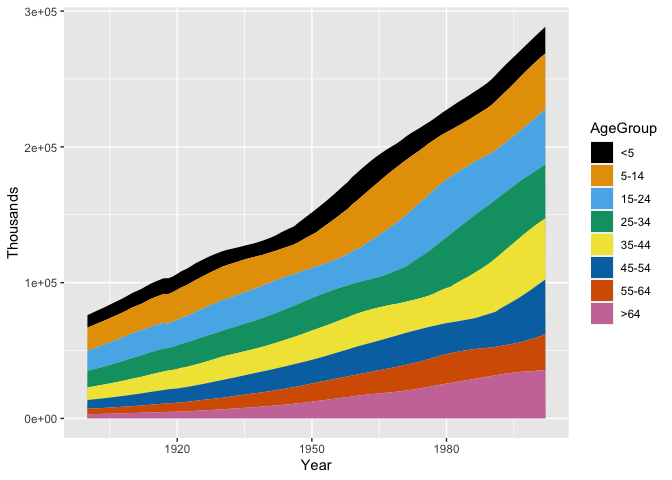<!-- -->

- 大约8%的男性、0.5%的女性存在某种形式的颜色识别缺陷，因此你的周围很可能就有这样的人。

- 色盲的形式多种多样，这里的调色板是经专门设计、能让所有常见的色觉缺陷人士区分的(Monochromacy，或全色盲，是非常罕见的。这种色盲人群只能区分亮度的差异)。

## 12.6 对连续型变量使用自定义调色板

- 在本例中，我们将会展示对连续型变量自定义渐变式的调色板。颜色可以用已命名的，也可以用RGB值来指定。

``` r
> library (gcookbook) # 为了使用数据集
> # 基础图形
> p2 <- ggplot(heightweight, aes(x=ageYear, y=heightIn, colour=weightLb)) + geom_point(size=3)
> p2
```

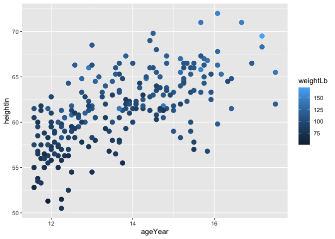<!-- -->

``` r
> # 使用两种颜色的渐变色
> p2 + scale_colour_gradient(low="black", high="white")
```

<!-- -->

``` r
> # 渐变色中间用白色划分
> library(scales)
> p2 + scale_colour_gradient2(low=muted("red"), mid="white", high=muted("blue"), midpoint=110)
```

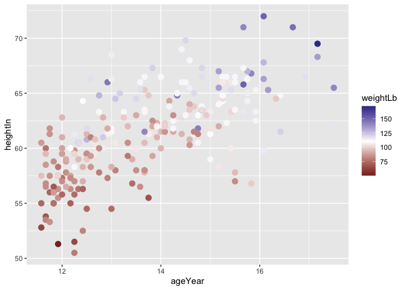<!-- -->

``` r
> # n个颜色的渐变色
> p2 + scale_colour_gradientn(colours = c("darkred", "orange", "yellow", "white"))
```

<!-- -->

- 对于填充色标度，使用`scale_fill_xxx()`替换即可，这里xxx是gradient、gradient2或gradientn中的一个。

- 将连续型变量映射到颜色标度上需要一组连续变化的颜色。下表列出了连续的填充色和轮廓色标度。

<table style="width:99%;">
<colgroup>
<col style="width: 30%" />
<col style="width: 33%" />
<col style="width: 34%" />
</colgroup>
<thead>
<tr class="header">
<th>填充色标度</th>
<th>轮廓色标度</th>
<th>述 描</th>
</tr>
</thead>
<tbody>
<tr class="odd">
<td>scale_fill_gradient()</td>
<td>scale_colour_gradient()</td>
<td>两色渐变。</td>
</tr>
<tr class="even">
<td>scale_fill_gradient2()</td>
<td>scale_colour_gradient2()</td>
<td><p>三色渐变，由中间色、两端</p>
<p>色渐变组成。</p></td>
</tr>
<tr class="odd">
<td>scale_fill_gradientn()</td>
<td>scale_colour_gradientn()</td>
<td>等间隔的n种颜色的渐变色。</td>
</tr>
</tbody>
</table>

- 请注意，我们在本例中使用了`muted()`函数。该函数来自scales包，它会针对输入的颜色输出一个饱和度较低的颜色(RGB格式)。

- 如果你不想用连续标度，而想使用离散(分类)标度，你可以将数据重新编码成分类值。参见15.14节。

## 12.7 根据数值设定阴影颜色

- 增加一列来对y进行划分，然后将该列映射到填充色标度上。在本例中，首先对数据进行正负划分。

``` r
> library(gcookbook) # 为了使用数据集
> cb <- subset(climate, Source=="Berkeley") 
> cb$valence[cb$Anomaly10y >= 0] <- "pos" 
> cb$valence[cb$Anomaly10y <0] <- "neg" 
> head(cb)
    Source Year Anomaly1y Anomaly5y Anomaly10y Unc10y valence
1 Berkeley 1800        NA        NA     -0.435  0.505     neg
2 Berkeley 1801        NA        NA     -0.453  0.493     neg
3 Berkeley 1802        NA        NA     -0.460  0.486     neg
4 Berkeley 1803        NA        NA     -0.493  0.489     neg
5 Berkeley 1804        NA        NA     -0.536  0.483     neg
6 Berkeley 1805        NA        NA     -0.541  0.475     neg
```

- 当我们对数据划分正负之后，我们就可以将valence变量映射到填充色上来作图了：

``` r
> ggplot(cb, aes(x=Year, y=Anomaly10y)) + 
+   geom_area(aes(fill=valence)) + 
+   geom_line() + 
+   geom_hline(yintercept=0)
```

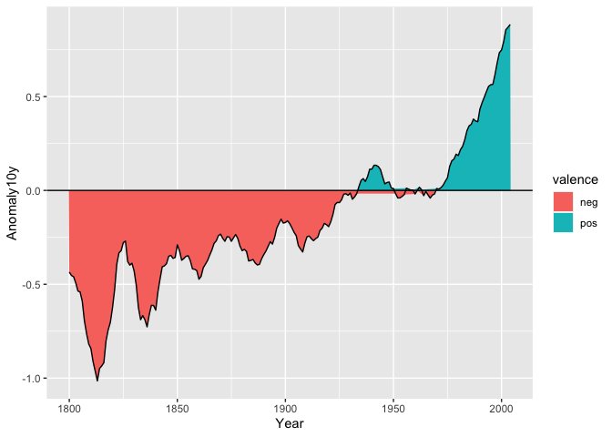<!-- -->

- 如果你仔细观察此图，会发现在0水平线附近有一些凌乱的阴影。这是因为两个颜色区域都是由各自的数据点多边形包围形成的，而这些数据点并不都在0上。为了解决这个问题，我们可以用`approx()`将数据插值到1000个点左右。

- 我们也可以让插值精确地通过零点，但显然这样会更复杂。在这里，`approx()`的效果已经很好了。

- 现在，我们重新绘制插值后的数据。这一次，我们还会做一些调整让阴影区域半透明、改变颜色、移除图例并删除填充区域左右两侧的空余：

``` r
> # approx()返回一个列表，包含x和y向量
> interp <- approx(cb$Year, cb$Anomaly10y, n=1000)
> # 放在一个数据框中并重新计算valence
> cbi <- data.frame(Year=interp$x, Anomaly10y=interp$y) 
> cbi$valence[cbi$Anomaly10y >= 0] <- "pos"
> cbi$valence[cbi$Anomaly10y <0] <- "neg"
> ggplot(cbi, aes(x=Year, y=Anomaly10y)) + 
+   geom_area(aes(fill=valence), alpha=.4) + 
+   geom_line() + 
+   geom_hline(yintercept=0) + 
+   scale_fill_manual(values=c("#CCEEFF", "#FFDDDD"), guide='none') + 
+   scale_x_continuous(expand=c(0, 0))
```

<!-- -->
