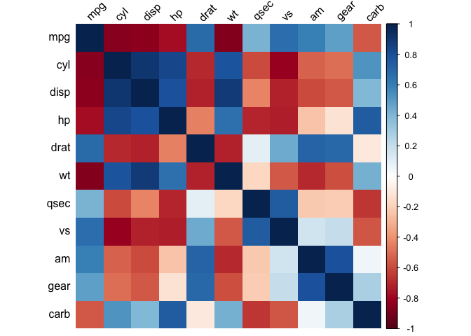
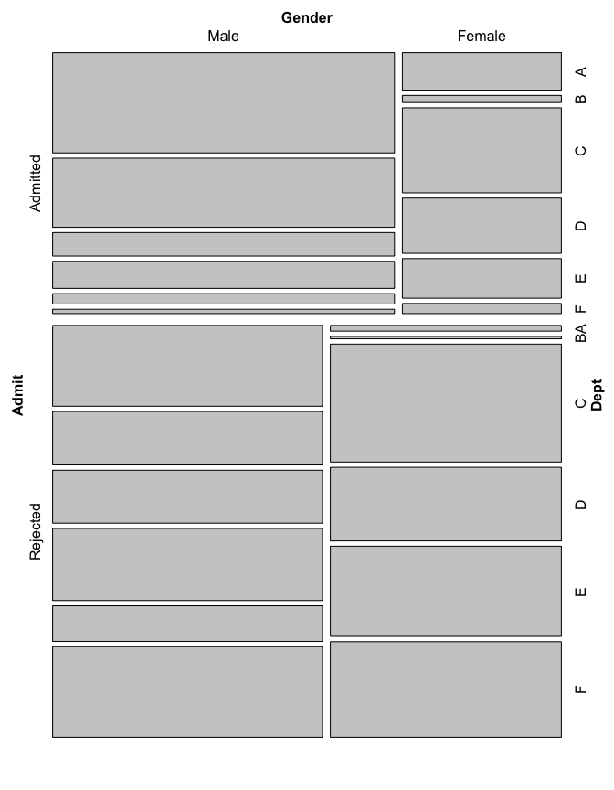

chapter13_其他图形
================

- <a href="#13-其他图形" id="toc-13-其他图形">13 其他图形</a>
  - <a href="#131-绘制相关矩阵图" id="toc-131-绘制相关矩阵图">13.1
    绘制相关矩阵图</a>
  - <a href="#132-绘制函数曲线" id="toc-132-绘制函数曲线">13.2
    绘制函数曲线</a>
  - <a href="#133-在函数曲线下添加阴影"
    id="toc-133-在函数曲线下添加阴影">13.3 在函数曲线下添加阴影</a>
  - <a href="#134-绘制网络图" id="toc-134-绘制网络图">13.4 绘制网络图</a>
  - <a href="#135-在网络图中使用文本标签"
    id="toc-135-在网络图中使用文本标签">13.5 在网络图中使用文本标签</a>
  - <a href="#136-如何绘制热图" id="toc-136-如何绘制热图">13.6
    如何绘制热图</a>
  - <a href="#137-绘制三维散点图" id="toc-137-绘制三维散点图">13.7
    绘制三维散点图</a>
  - <a href="#138-在三维图上添加预测曲面"
    id="toc-138-在三维图上添加预测曲面">13.8 在三维图上添加预测曲面</a>
  - <a href="#139-保存三维图" id="toc-139-保存三维图">13.9 保存三维图</a>
  - <a href="#1310-三维图动画" id="toc-1310-三维图动画">13.10 三维图动画</a>
  - <a href="#1311-绘制谱系图" id="toc-1311-绘制谱系图">13.11 绘制谱系图</a>
  - <a href="#1312-绘制向量场" id="toc-1312-绘制向量场">13.12 绘制向量场</a>
  - <a href="#1313-绘制qq图" id="toc-1313-绘制qq图">13.13 绘制QQ图</a>
  - <a href="#1314-绘制经验累积分布函数图"
    id="toc-1314-绘制经验累积分布函数图">13.14 绘制经验累积分布函数图</a>
  - <a href="#1315-创建马赛克图" id="toc-1315-创建马赛克图">13.15
    创建马赛克图</a>
  - <a href="#1316-绘制饼图" id="toc-1316-绘制饼图">13.16 绘制饼图</a>
  - <a href="#1317-创建地图" id="toc-1317-创建地图">13.17 创建地图</a>
  - <a href="#1318-绘制等值区域图" id="toc-1318-绘制等值区域图">13.18
    绘制等值区域图</a>
  - <a href="#1319-创建空白背景的地图"
    id="toc-1319-创建空白背景的地图">13.19 创建空白背景的地图</a>

Source：

1.  《R数据可视化手册》，北京：人民邮电出版社，2014.5

# 13 其他图形

## 13.1 绘制相关矩阵图

- 我们先来看看mtcars数据集：

``` r
> head(mtcars)
                   mpg cyl disp  hp drat    wt  qsec vs am gear carb
Mazda RX4         21.0   6  160 110 3.90 2.620 16.46  0  1    4    4
Mazda RX4 Wag     21.0   6  160 110 3.90 2.875 17.02  0  1    4    4
Datsun 710        22.8   4  108  93 3.85 2.320 18.61  1  1    4    1
Hornet 4 Drive    21.4   6  258 110 3.08 3.215 19.44  1  0    3    1
Hornet Sportabout 18.7   8  360 175 3.15 3.440 17.02  0  0    3    2
Valiant           18.1   6  225 105 2.76 3.460 20.22  1  0    3    1
```

- 首先，使用cor函数来计算相关矩阵，将会得到每两列之间的相关系数：

``` r
> mcor <- cor(mtcars)
> #输出mcor,保留两位小数
> round(mcor, digits=2)
       mpg   cyl  disp    hp  drat    wt  qsec    vs    am  gear  carb
mpg   1.00 -0.85 -0.85 -0.78  0.68 -0.87  0.42  0.66  0.60  0.48 -0.55
cyl  -0.85  1.00  0.90  0.83 -0.70  0.78 -0.59 -0.81 -0.52 -0.49  0.53
disp -0.85  0.90  1.00  0.79 -0.71  0.89 -0.43 -0.71 -0.59 -0.56  0.39
hp   -0.78  0.83  0.79  1.00 -0.45  0.66 -0.71 -0.72 -0.24 -0.13  0.75
drat  0.68 -0.70 -0.71 -0.45  1.00 -0.71  0.09  0.44  0.71  0.70 -0.09
wt   -0.87  0.78  0.89  0.66 -0.71  1.00 -0.17 -0.55 -0.69 -0.58  0.43
qsec  0.42 -0.59 -0.43 -0.71  0.09 -0.17  1.00  0.74 -0.23 -0.21 -0.66
vs    0.66 -0.81 -0.71 -0.72  0.44 -0.55  0.74  1.00  0.17  0.21 -0.57
am    0.60 -0.52 -0.59 -0.24  0.71 -0.69 -0.23  0.17  1.00  0.79  0.06
gear  0.48 -0.49 -0.56 -0.13  0.70 -0.58 -0.21  0.21  0.79  1.00  0.27
carb -0.55  0.53  0.39  0.75 -0.09  0.43 -0.66 -0.57  0.06  0.27  1.00
```

- 如果数据含有不能用来计算系数的任何列(比如一列姓名)，应该先将这些列剔除。如果在原始数据中存在缺失值(NA)，得到的相关矩阵中也会有缺失值。为了克服这个问题，你可以使用函数选项`use="complete.obs"`或者`use="pairwise.complete.obs"`。我们使用corrplot包来绘制相关矩阵图，第一次使用时用`install.packages("corrplot")`命令来安装该包：

``` r
> library(corrplot)
> corrplot(mcor)
```

<!-- -->

- `corrplot()`函数有相当多的选项。这里给出一个绘制相关矩阵图的例子，例图使用颜色方块和黑色文本标签，并且上边的文本标签呈45°右倾。

``` r
> corrplot(mcor, method="shade", shade.col=NA, tl.col="black", tl.srt=45)
```

<!-- -->

- 将相关系数展示在矩阵的每一个小方块上也是很有用的。在本例中，我们使用一个稍淡一点的调色板，这样会让系数更加可读；同时，我们也移除掉多余的颜色图例。此外，我们对矩阵重新排序，这样相近的变量在图中会更近，其中使用的参数是`order="AOE"`(前两个特征向量的角排序)。结果如下图所示。

``` r
> # 生成一个淡一点的调色板
> col <- colorRampPalette(c("#BB4444", "#EE9988", "#FFFFFF", "#77AADD", "#4477AA"))
> corrplot(mcor, method="shade", shade.col=NA, tl.col="black", tl.srt=45,
+          col=col(200), addCoef.col="black", cl.pos="n", order='AOE')
```

<!-- -->

- 和其他独立的绘图函数一样，`corrplot()`有很多自己的选项，这里无法一一列出，下表给出了一些最有用的参数。

| 选 项                               | 描 述                                                |
|-------------------------------------|------------------------------------------------------|
| type={“lower” \| “upper”}           | 仅使用下三角或上三角。                               |
| diag=FALSE                          | 是否展示对角线上的数值。                             |
| method=“shade”                      | 使用颜色方块图形。                                   |
| method=“ellipse”                    | 使用椭圆图形。                                       |
| addCoef.col=“color”                 | 在图形上添加相关系数的颜色。                         |
| tl.srt=“number”                     | 设定图形上方文本标签的倾斜角度。                     |
| tl.col=“color”                      | 设定文本标签颜色。                                   |
| order={“AOЕ” \| “FPС” I\| “hclust”} | 矩阵重排序，使用特征值角排序、第一主成分或层次聚类。 |

- 如果要生成散点图矩阵，参见5.13节。

- 关于更多数据取子集的方法，参见15.7节。

## 13.2 绘制函数曲线

- 使用`stat_function()`函数。为了得到合适的x的范围，必须给`ggplot()`函数传递一个“哑”数据框。在本例中，我们用正态分布的密度函数`dnorm()`来演示。

``` r
> library(ggplot2)
> # 这个数据框仅仅用于设定范围
> p1 <- ggplot(data.frame(x=c(-3,3)),aes(x=x))
> p1 + stat_function(fun = dnorm)
```

<!-- -->

- 某些函数需要设定额外的参数，比如t分布的密度函数`dt()`就需要一个参数来设定自由度。可以这样来设定额外的参数：先把它们放在一个列表(list)中，再传递给args。

``` r
> p1 + stat_function (fun=dt, args=list(df=2))
```

<!-- -->

- 我们也可以绘制自定义的函数。其中第一个参数必须是x轴的值，并且必须返回y轴的值。在本例中，我们绘制一个S型函数。

``` r
> myfun <- function(xvar){
+   1/(1 + exp(-xvar + 10)) 
+   }
> ggplot(data.frame(x=c(0, 20)), aes(x=x)) + 
+   stat_function(fun=myfun)
```

<!-- -->

- 计算函数值时默认使用给出的x范围内的101个点。但如果你的函数跳跃很大，画出来的图可能有一些支离破碎的线段。为了让曲线更加光滑，可以给`stat_function()`传递一个更大的n，比如`stat_function(fun=myfun, n=200)`。

- 绘制模型对象的预测值(如lm和glm)，参见5.7节。

## 13.3 在函数曲线下添加阴影

- 根据你的曲线函数定义一个新的函数，把x范围外对应的值替换为NA。

``` r
> # 在0<x<2时返回dnorm(x),其他时候返回NA
> dnorm_limit <- function(x){
+   y <- dnorm(x)
+   y[x<0 | x>2] <- NA
+   return(y)
+ }
> # ggplot()使用“哑”数据
> p1 <- ggplot(data.frame(x=c(-3, 3)), aes(x=x))
> 
> p1 + stat_function(fun=dnorm_limit, geom="area", fill="blue", alpha=0.2) + 
+   stat_function(fun=dnorm)
```

<!-- -->

- 记住，给这个函数传入的是一个向量，并不是一个单独的值。如果这个函数每次只操作一个元素，那么使用一个`if/else`语句来根据x的值确定返回值是更为合理的。但是那样做在这里却行不通，因为x是一个含有许多值的向量。

- R中有第一类函数，我们可以写一个函数来返回一个闭包。也就是说，我们可以编写一个能够编写函数的函数。

- 这个函数将允许你传递一个函数、一个最小值和一个最大值。定义域外对应的值域返回NA：

``` r
> limitRange <- function(fun, min, max){
+   function(x){
+     y <- fun(x)
+     y[x<min | x>max] <- NA
+     return(y)
+   }
+ }
```

- 现在我们可以调用这个函数来生成另一个函数了，这和之前使用`的dnorm_limit()`函数效果一样：

``` r
> # 返回一个函数
> dlimit <- limitRange(dnorm, 0,2)
> # 现在我们可以尝试新函数了一仅对0-2之间的输入返回输出值
> dlimit(-2:4)
[1]         NA         NA 0.39894228 0.24197072 0.05399097         NA         NA
```

- 我们使用`limitRange()`来生成函数，并传递给`stat_function()`：

``` r
> p1 + stat_function(fun = dnorm) + 
+   stat_function(fun = limitRange(dnorm, O, 2),
+                 geom="area", fill="blue", alpha=0.2)
```

<!-- -->

- `limitRange()`函数可以用来生成任何函数的“区间限制式”函数，不局限于`dnorm()`。之所以如此，是因为我们没有针对每一种情况来写不同的函数得到硬编码值，而是写了一个能够根据不同情况智能传递参数的函数。

- 如果你非常非常仔细地观察上2个图，可能会看见阴影区域并没有和我们给出的边界范围完全对齐。这是因为ggplot2在固定区间上计算函数值时做了个数值近似，并且这些区间没有完全落在指定的范围上。如13.2节所述，我们可以通过设置`stat_function(n=200)`以增加内插点数量的方式来提升近似的效果。

## 13.4 绘制网络图

- 安装并使用igraph包。要绘制网络图，首先给`graph()`函数传递一个包含所有边的向量，然后绘制结果对象：

``` r
> library(igraph)
> # 指定一个有向图的边
> gd <- graph(c(1,2,2,3,2,4, 1,4,5,5,3,6)) 
> plot(gd)
```

<!-- -->

``` r
> # 一个无向图
> gu <- graph(c(1,2,2,3,2,4,1,4, 5,5, 3,6), directed=FALSE) 
> # 不画标签
> plot(gu, vertex.label=NA)
```

<!-- -->

- 这是两个图对象的结构：

``` r
> str(gd)
Class 'igraph'  hidden list of 10
 $ : num 6
 $ : logi TRUE
 $ : num [1:6] 0 1 1 0 4 2
 $ : num [1:6] 1 2 3 3 4 5
 $ : num [1:6] 0 3 1 2 5 4
 $ : num [1:6] 0 1 3 2 4 5
 $ : num [1:7] 0 2 4 5 5 6 6
 $ : num [1:7] 0 0 1 2 4 5 6
 $ :List of 4
  ..$ : num [1:3] 1 0 1
  ..$ : Named list()
  ..$ : list()
  ..$ : list()
 $ :<environment: 0x7f7f213c4a18> 
> str(gu)
Class 'igraph'  hidden list of 10
 $ : num 6
 $ : logi FALSE
 $ : num [1:6] 1 2 3 3 4 5
 $ : num [1:6] 0 1 1 0 4 2
 $ : num [1:6] 0 1 3 2 4 5
 $ : num [1:6] 0 3 1 2 5 4
 $ : num [1:7] 0 0 1 2 4 5 6
 $ : num [1:7] 0 2 4 5 5 6 6
 $ :List of 4
  ..$ : num [1:3] 1 0 1
  ..$ : Named list()
  ..$ : list()
  ..$ : list()
 $ :<environment: 0x7f7f25fb4458> 
```

- 在网络图中，节点的位置并不是由所给数据确定的，它们是随机放置的。如果要让得到的图更可读，可以在绘图之前设置随机数种子。比如，可以尝试不同的随机数种子直到得到一个比较满意的结果：

``` r
> set.seed(229)
> plot(gu)
```

<!-- -->

- 也可以从数据框中直接生成图。使用数据框的前两列，并且每一列确定两个节点相连。在下一个例子中，我们将使用这种结构的数据集madmen2。我们还会使用Fruchterman-Reingold布局算法。该算法的主要思想是所有节点之间都有电磁斥力，但是连接节点的边像弹簧一样，会把相应的节点拉在一起：

``` r
> # 为了使用数据集      
> library(gcookbook)
> head(madmen2)
                 Name1        Name2
1          Abe Drexler  Peggy Olson
2              Allison   Don Draper
3          Arthur Case Betty Draper
4 Bellhop in Baltimore   Sal Romano
5     Bethany Van Nuys   Don Draper
6         Betty Draper   Don Draper
> 
> # 从数据集中生成图对象
> g1 <- graph.data.frame(madmen2, directed=TRUE)
> # 移除多余的空白边
> par(mar=c(0,0,0,0))
> plot(g1, layout=layout.fruchterman.reingold, vertex.size=8, edge.arrow.size=0.5, vertex.label=NA)
```

<!-- -->

- 也可以从数据框生成无向图。madmen数据集中一行就可以表示一条边，因为对于无向图来说方向是没有意义的。现在，我们使用圆圈布局：

``` r
> g2 <- graph.data.frame(madmen, directed=FALSE)
> par(mar=c(0,0,0,0)) # 移除多余的空白边
> plot(g2, layout=layout.circle, vertex.size=8, vertex.label=NA)
```

<!-- -->

- 更多关于图像输出参数的信息，参见`?plot.igraph`。关于布局选项的参数，参见`?igraph::layout`。

- igraph的一个替代选择是Rgraphviz，该包是Graphviz(一个绘制网络图的开源库)的前端。它的优点是能更方便地处理标签，而且也更容易控制布局。但是它比较难安装。Rgraphviz由Bioconductor系统库维护。

## 13.5 在网络图中使用文本标签

- 边和节点可能都有名字，但默认时这些名字可能没有被当作标签。为了设置标签，可以给`vertex.label`参数传递一个命名向量：

``` r
> library(igraph)
> library(gcookbook) # 为了使用数据集
> #复制madmen并删除偶数行
> m <- madmen[1:nrow(madmen) %% 2 == 1, ] 
> g3 <- graph.data.frame(m, directed=FALSE)
> # 输出节点名称
> V(g3)$name
 [1] "Betty Draper"      "Don Draper"        "Harry Crane"      
 [4] "Joan Holloway"     "Lane Pryce"        "Peggy Olson"      
 [7] "Pete Campbell"     "Roger Sterling"    "Sal Romano"       
[10] "Henry Francis"     "Allison"           "Candace"          
[13] "Faye Miller"       "Megan Calvet"      "Rachel Menken"    
[16] "Suzanne Farrell"   "Hildy"             "Franklin"         
[19] "Rebecca Pryce"     "Abe Drexler"       "Duck Phillips"    
[22] "Playtex bra model" "Ida Blankenship"   "Mirabelle Ames"   
[25] "Vicky"             "Kitty Romano"     
> 
> plot(g3, layout=layout.fruchterman.reingold,
+      vertex.size=4, # 让节点更小
+      vertex.label=V(g3)$name, # 设置标签
+      vertex.label.cex=0.8, # 小号字体
+      vertex.label.dist=0.4, # 标签和节点的位置错开
+      vertex.label.color = "black")
```

<!-- -->

- 另一种能得到相同效果的方法是修改绘图对象，这样就不用给`plot()`函数传递参数值了。此时，可以使用`V()$xxx<-`来代替`vertex.xxx`参数传递值。比如，下面的代码可以得到和之前代码相同的输出。

``` r
> # 这和之前的代码是等价的
> V(g3)$size <- 4
> V(g3)$label <- V(g3)$name
> V(g3)$label.cex <- 0.8
> V(g3)$label.dist <- 0.4
> V(g3)$label.color <- "black"
> # 设置整个图的属性
> g3$layout <- layout.fruchterman.reingold
> plot(g3)
```

<!-- -->

- 同样，也可以设置边的属性，使用`E()`函数或者给`edge.xxx`参数传递相应的值：

``` r
> # 查看边
> E(g3)
+ 20/20 edges from 6e8733e (vertex names):
 [1] Betty Draper  --Henry Francis     Don Draper    --Allison          
 [3] Betty Draper  --Don Draper        Don Draper    --Candace          
 [5] Don Draper    --Faye Miller       Don Draper    --Megan Calvet     
 [7] Don Draper    --Rachel Menken     Don Draper    --Suzanne Farrell  
 [9] Harry Crane   --Hildy             Joan Holloway --Franklin         
[11] Joan Holloway --Roger Sterling    Lane Pryce    --Rebecca Pryce    
[13] Peggy Olson   --Abe Drexler       Peggy Olson   --Duck Phillips    
[15] Peggy Olson   --Pete Campbell     Pete Campbell --Playtex bra model
[17] Roger Sterling--Ida Blankenship   Roger Sterling--Mirabelle Ames   
[19] Roger Sterling--Vicky             Sal Romano    --Kitty Romano     
> # 将几个边的名字赋值为"M"
> E(g3)[c(2,11,19)]$label <- "M"
> # 将所有边颜色设置为灰色，然后把其中几个变为红色
> E(g3)$color <- "grey70"
> E(g3)[c(2,11,19)]$color <- "red"
> plot(g3)
```

<!-- -->

- 查阅`?igraph.plotting`来获取igraph包中更多的绘图参数。

## 13.6 如何绘制热图

- 使用`geom_tile()`或者`geom_raster()`，并将一个连续变量映射到fill上。我们将使用presidents数据集，它是一个时间序列对象而不是数据框。

``` r
> presidents
     Qtr1 Qtr2 Qtr3 Qtr4
1945   NA   87   82   75
1946   63   50   43   32
1947   35   60   54   55
1948   36   39   NA   NA
1949   69   57   57   51
1950   45   37   46   39
1951   36   24   32   23
1952   25   32   NA   32
1953   59   74   75   60
1954   71   61   71   57
1955   71   68   79   73
1956   76   71   67   75
1957   79   62   63   57
1958   60   49   48   52
1959   57   62   61   66
1960   71   62   61   57
1961   72   83   71   78
1962   79   71   62   74
1963   76   64   62   57
1964   80   73   69   69
1965   71   64   69   62
1966   63   46   56   44
1967   44   52   38   46
1968   36   49   35   44
1969   59   65   65   56
1970   66   53   61   52
1971   51   48   54   49
1972   49   61   NA   NA
1973   68   44   40   27
1974   28   25   24   24
> str(presidents)
 Time-Series [1:120] from 1945 to 1975: NA 87 82 75 63 50 43 32 35 60 ...
```

- 我们首先将它转化为`ggplot()`可用的数据框格式，其中的列都是数值形式的。

``` r
> pres_rating <- data.frame(
+   rating = as.numeric(presidents),
+   year = as.numeric(floor(time(presidents))), 
+   quarter = as.numeric(cycle(presidents)))
> head(pres_rating)
  rating year quarter
1     NA 1945       1
2     87 1945       2
3     82 1945       3
4     75 1945       4
5     63 1946       1
6     50 1946       2
```

- 现在我们可以使用`geom_tile()`或`geom_raster()`来绘图。简单地将厂个变量分别映射到x、y和fill：

``` r
> # 基础图形
> p2 <- ggplot(pres_rating, aes(x=year, y=quarter, fill=rating)) 
> # 使用geom_tile()
> p2 + geom_tile()
```

<!-- -->

``` r
> # 使用geom_raster()看起来一样，但效率略高（推荐）
> p2 + geom_raster()
```

<!-- -->

- **`geom_tile()`和`geom_raster()`的结果看起来一样，但实际上，它们是有区别的。阅读6.12节来获取更多相关主题的信息。**

- 如果想使用不同的调色板，参见12.6节。

## 13.7 绘制三维散点图

- 我们使用rgl包，该包提供了OpenGL图形库的3D绘图接口。要画三维散点图，可以使用`plot3d()`函数。其输入参数可以是两种形式：(1)一个数据框，前三列分别表示x、y、z的坐标；(2)直接传递三个向量，分别表示x、y、z的坐标。

<!-- -->

    library(rgl)
    plot3d(mtcars$wt, mtcars$disp, mtcars$mpg, type="s", size=0.75, lit=FALSE)

- 读图者可以通过点击和拖动鼠标来旋转图形，滑动鼠标滚轮来缩放图形。

- 默认情况下，`plot3d()`函数使用立方体式的点，这不大适合保存为PDF。为了改进外观，我们使用`type="s"`来选择球形点，`size=0.75`让点变小一些，`lit=FALSE`来关闭3D灯光(否则点会闪闪发亮)。

- 三维散点图比较难解释，因此大多时候使用二维散点图可能会更好。这同样也意味着，还有很大改进空间可以让3D散点图更容易被理解。

- 在下图，我们添加数值线段来增强空间点的位置表达力度：

<!-- -->

    # 交错出现两个向量的值
    interleave <- function(v1, v2) as.vector(rbind(v1,v2))
    # 绘制点
    plot3d(mtcars$wt, mtcars$disp, mtcars$mpg,
           xlab="Weight", ylab="Displacement", zlab="MPG", 
           size=.75, type="s", lit=FALSE)
    # 添加线段
    segments3d(interleave(mtcars$wt, mtcars$wt),
               interleave (mtcars$disp, mtcars$disp),
               interleave(mtcars$mpg, min(mtcars$mpg)), alpha=0.4, col="blue")

- 可以微调图形的背景和坐标轴。在下图中，我们改变坐标轴刻度的数目、添加刻度值，并在指定的边添加坐标轴标签：

<!-- -->

    # 不画坐标轴刻度和标签
    plot3d(mtcars$wt, mtcars$disp, mtcars$mpg,
           xlab = "", ylab = "", zlab = "", axes = FALSE,
           size=.75, type="s", lit=FALSE)
    segments3d(interleave(mtcars$wt, mtcars$wt),
               interleave(mtcars$disp, mtcars$disp),
               interleave(mtcars$mpg, min(mtcars$mpg)), 
               alpha = 0.4, col = "blue")
    # 绘制盒子
    rgl.bbox (color="grey50",  # 表面颜色为grey60，黑色文本
              emission="grey50", # 光照颜色为grey50
              xlen=0, ylen=0, zlen=0) # 不添加刻度
    # 设置默认颜色为黑
    rgl.material(color="black")
    # 在指定边添加坐标轴标签。可能的值类似于 "x--","x-+","x+-"和"x++" 
    axes3d(edges=c("x--", "y+-", "z--"),
           ntick=6, # 每个轴上6个刻度线
           cex=.75) #较小的字体
    # 添加坐标标签。'line'指定标签和坐标轴的距离。
    mtext3d("Weight",edge="x--", line=2)
    mtext3d("Displacement", edge="y+-", line=3) 
    mtext3d ("MPG",edge="z--", line=3)

- 查阅`?plot3d`获取控制图形输出的更多选项。

## 13.8 在三维图上添加预测曲面

- 首先，我们需要定义一些功能函数来得到模型的预测值，然后利用这些定义好的功能性函数，我们可以对数据生成线性模型，然后利用`surface3d()`函数在原散点图上添加网格式的预测图：

<!-- -->

    # 给定一个模型，根据xvar和yvar预测zvar
    # 默认为变量x和y的范围，生成16x16的网格
    predictgrid <- function(model, xvar, yvar, zvar, res = 16, type = NULL){ 
      # 计算预测变量的范围。下面的代码对lm、glm以及其他模型方法都适用，
      # 但针对其他模型方法时可能需要适当调整。
      xrange <- range(model$model[[xvar]])
      yrange <- range(model$model[[yvar]])
      
      newdata <- expand.grid(x = seq(xrange[1], xrange[2], length.out = res),
                             y = seq (yrange[1], yrange[2], length.out = res))
      names (newdata) <- c(xvar, yvar)
      newdata[[zvar]] <- predict (model, newdata = newdata, type = type) 
      newdata
    }
    # 将长数据框中的x,y,z转化为列表，
    # 其中x,y为行列值，z为矩阵
    df2mat <- function(predictgrid, xvar = NULL, yvar = NULL, zvar = NULL) { 
      if(is.null(xvar)) xvar <- names (predictgrid) [1]
      if(is.null(yvar)) yvar <- names (predictgrid) [2]
      if(is.null(zvar)) zvar <- names (predictgrid) [3]
      
      x <- unique(predictgrid[[xvar]])
      y <- unique(predictgrid[[yvar]])
      z <- matrix(predictgrid[[zvar]], nrow = length(y), ncol = length(x)) 
      
      m <- list(x,y,z)
      
      names(m) <- c(xvar, yvar, zvar)
      
      m
    }

    # 交错出现两个向量的元素
    interleave <- function(v1, v2) as.vector(rbind(v1,v2))

    library(rgl)
    # 复制数据集
    m1 <- mtcars
    # 生成线性模型
    mod <- lm(mpg ~ wt + disp + wt:disp, data = m1)
    # 根据wt和disp，得到mpg的预测值
    m1$pred_mpg <- predict(mod)
    # 根据wt和disp的网格，得到mpg的预测值
    mpgrid_df <- predictgrid(mod, "wt", "disp", "mpg")
    mpgrid_list <- df2mat(mpgrid_df)
    # 根据数据点绘图
    plot3d(m1$wt,m1$disp,m1$mpg, type="s", size=0.5, lit=FALSE)
    # 添加预测点(较小)
    spheres3d(m1$wt,m1$disp, m1$pred_mpg, alpha=0.4, type="s", size=0.5, lit=FALSE) 
    # 添加表示误差的线段
    segments3d(interleave(m1$wt,m1$wt),
               interleave(m1$disp,m1$disp),
               interleave(m1$mpg,m1$pred_mpg),
               alpha=0.4, col="red")
    #添加预测点网榕
    surface3d(mpgrid_list$wt,mpgrid_list$disp, mpgrid_list$mpg,
               alpha=0.4, front="lines", back="lines")

- 我们可以调节图形的外观，如下图所示。我们还可以逐一添加图形的各个组件：

<!-- -->

    plot3d(mtcars$wt, mtcars$disp, mtcars$mpg,
           xlab = "", ylab ="", zlab ="",
           axes = FALSE,size=.5, type="s", lit=FALSE)
    # 添加预测点(较小)
    spheres3d(m1$wt,m1$disp, m1$pred_mpg, alpha=0.4, type="s", size=0.5, lit=FALSE) 
    # 添加误差线段
    segments3d(interleave(m1$wt,m1$wt),
               interleave(m1$disp, m1$disp),
               interleave(m1$mpg,m1$pred_mpg),
               alpha=0.4, col="red")
    # 添加预测值网格
    surface3d(mpgrid_list$wt,mpgrid_list$disp, mpgrid_list$mpg,
              alpha=0.4, front="lines", back="lines")
    # 绘制盒子
    rgl.bbox(color="grey60",  # 表面颜色为grey60，黑色文本
               emission="grey50", #光照颜色为grey50
                 xlen=0, ylen=0, zlen=0) # 不画刻度线
    # 对象默认色设置为黑色
    rgl.material(color="black")
    # 在指定边添加坐标轴标签。可能的值类似于"x--","x-+","x+-"和"x++"
    axes3d(edges=c("x--","y+-","z--"),
           ntick=6, # 每个轴上6个刻度线
           cex=.75) # 较小字体
    #添加坐标标签。'line’指定标签和坐标轴的距离
    mtext3d("Weight",edge="x--", line=2)
    mtext3d("Displacement", edge="y+-", line=3)
    mtext3d("MPG",edge="z--", line=3)

- 输入`?rgl.material`获取更多关于改变曲面图外观的信息。

## 13.9 保存三维图

- 可以使用`rgl.snapshot()`来保存rgl包绘制的位图。它会精确捕捉屏幕上的图形。

<!-- -->

    library(rgl)
    plot3d(mtcars$wt, mtcars$disp, mtcars$mpg, type="s", size=0.75, lit=FALSE)
    rgl.snapshot('3dplot-13.9.png', fmt='png')
    # 也可以使用`rgl.postscript()`保存为PostScript或PDF格式文件
    #rgl.postscript('3dplot-13.9.ps', 'ps')
    #rgl.postscript('3dplot-13.9.pdf', 'pdf')

- PostScript和PDF输出文件并不支持rgl依赖的OpenGL库的很多特性。比如，它们不支持透明度，并且点线等对象的大小可能和屏幕上表现出来的也不一致。

- 为了使得输出的图片更加可读，你可以保存当前的视角，之后再恢复。

<!-- -->

    # 保存当前视角
    view <- par3d("userMatrix")
    #恢复保存的视角
    par3d(userMatrix = view)

- 为了将视角保存为代码，你可以使用`dput()`函数，然后将输出复制粘贴到你的代码中：

<!-- -->

    dput (view)

- 一旦有了userMatrix的文本表达式，将下面的代码添加到你的脚本中即可：

<!-- -->

    view <- structure(c(1, 0, 0, 0, 0, 0.342020143325668, -0.939692620785909, 
    0, 0, 0.939692620785909, 0.342020143325668, 0, 0, 0, 0, 1), dim = c(4L, 
    4L))
    par3d(userMatrix = view)

## 13.10 三维图动画

- 旋转三维图能够更完整、多方位地观察数据。可以在`play3d()`中使用`spin3d()`来生成三维动画。默认地，图像会绕着z轴(竖直的轴)旋转，直到你给R发送一个停止的指令。你可以改变转轴、转速和持续时间：

<!-- -->

    library(rgl)
    plot3d(mtcars$wt, mtcars$disp, mtcars$mpg, type="s", size=0.75,lit=FALSE)
    # 绕x轴转动，每分钟4转，持续20秒钟
    play3d(spin3d(axis=c(l,0,0),rpm=4), duration=20)

- 可以使用`movie3d()`来保存动画，方法和`play3d()`一样。它将会生成一系列.png格式的图片文件，每个文件代表一帧，然后可以利用ImageMagick软件（需要单独安装）提供的convert命令将这些文件合并转化为gif动画文件。

- 这将会生成持续15秒，每秒50帧的动画：

<!-- -->

    # 绕z轴转动，每分钟4转，持续15秒
    movie3d(spin3d(axis=c(0,0,1),rpm=4), duration=15, fps=50)

- 输出的文件将会被存放在一个临时文件夹中，地址名会在R窗口中输出。

- 如果你不想利用ImageMagick将输出的图片转换为.gif，可以设置`convert=FALSE`，然后用其他软件将这一系列的.png文件转换为动画。

## 13.11 绘制谱系图

- 使用`hclust()`并画出它的结果。这可能需要一些数据预处理工作，在本例中，我们首先要从countries数据集中提取年份为2009年的子集，为简单起见，还要把包含NA的行全部删除，然后随机选择25行。

``` r
> library(gcookbook) # 为了使用数据集
> # 得到2009年的数据
> c2 <- subset(countries, Year==2009)
> # 去掉含有NA的行
> c2 <- c2[complete.cases(c2),]
> # 随机选择25个国家
> # (设定随机种子保证可重复性)
> set.seed (201)
> c2 <- c2[sample(1:nrow(c2),25),]
> head(c2)
                Name Code Year        GDP laborrate  healthexp infmortality
8261           Samoa  WSM 2009  2721.9439      57.5  205.00032         17.5
2702         Denmark  DNK 2009 55933.3545      65.4 6272.72868          3.4
8771 Slovak Republic  SVK 2009 16174.2284      59.5 1372.68818          7.0
8210          Rwanda  RWA 2009   510.3116      86.0   48.18416         62.7
7190     New Zealand  NZL 2009 29352.4540      68.6 2633.62461          4.9
5711           Libya  LBY 2009  9957.4904      52.8  416.74524         14.0
```

- 注意到行名(第一列)实质上是随机数，这是因为行是随机选择出来的。在画谱系图之前我们还需要再做一些事情。首先，我们需要设定行的名字一我们有叫做Name的列，但行名却是一些随机数(我们不是经常使用行名，但是对于`hclust()`函数，行名是必不可少的)。接下来，还要去掉在聚类中不需要的列，这些列是Name、Code
  和Year。

``` r
> rownames(c2) <- c2$Name
> c2 <- c2[,4:7]
> head(c2)
                       GDP laborrate  healthexp infmortality
Samoa            2721.9439      57.5  205.00032         17.5
Denmark         55933.3545      65.4 6272.72868          3.4
Slovak Republic 16174.2284      59.5 1372.68818          7.0
Rwanda            510.3116      86.0   48.18416         62.7
New Zealand     29352.4540      68.6 2633.62461          4.9
Libya            9957.4904      52.8  416.74524         14.0
```

- GDP的取值比infmortality大几个数量级，由于这个原因，infmortality在聚类中的作用相对于GDP来说就会变得可以忽略不计，这可能不是我们想要的。为了解决这个问题，要对数据进行标准化：

``` r
> c3 <- scale(c2)
> head(c3)
                         GDP  laborrate  healthexp infmortality
Samoa           -0.489209009 -0.8531924 -0.4114613   -0.6475665
Denmark          3.127234719 -0.1603244  3.3733961   -1.1037359
Slovak Republic  0.425057862 -0.6777828  0.3169055   -0.9872671
Rwanda          -0.639519701  1.6463947 -0.5092783    0.8147639
New Zealand      1.320698681  0.1203310  1.1034379   -1.0552072
Libya            0.002545416 -1.2654050 -0.2793815   -0.7608000
```

- `scale()`函数默认是将每一列相对于其标准差进行标准化，但也可以使用其他方法。

- 至此，我们已经做好了画谱系图的准备，结果如下图所示：

``` r
> hc <- hclust(dist(c3))
> # 画树状图
> plot(hc)
```

<!-- -->

``` r
> # 对齐文本
> plot(hc, hang = -1)
```

<!-- -->

- 聚类分析是在n维空间中把点分配到类的一种简单方法(在这个例子中是四维)。层次聚类分析则将每组分成两个更小的组，在这里可以用谱系展示。在层次聚类的过程中有很多可以控制的参数，可能有不止一种“正确”的方法可以用来分析你的数据。

- 首先，我们用`scale()`的默认设置标准化了数据。你可以用不同的方法标准化数据，或者不标准化(在这个数据集里面，不标准化数据会导致GDP相对于其他变量占主导地位，如下图所示)。

``` r
> hc1 <- hclust(dist(c2))
> # 对齐文本
> plot(hc1, hang = -1)
```

<!-- -->

- 对于距离的计算，我们使用的是默认的方法一”euclidean”，这个方法计算的是点与点之间的欧氏距离；还有其他的方法，比如”maximum”,
  “manhattan”,“canberra”, “binary”和”minkowski”。

- `hclust()`函数提供了几种做聚类分析的方法，默认的方法是”complete”；其他可用的方法包括”ward”,
  “single”, “average”, “mcquitty”, “median”和”centroid”。

- 输入`?hclust`来获取更多关于不同聚类方法的信息。

## 13.12 绘制向量场

- 使用`geom_segment()`函数。在这个例子中，我们用的是isabel数据集。

``` r
> library(gcookbook) # 为了使用数据集
> head(isabel)
    x        y     z vx vy vz  t speed
1 -83 41.70000 0.035 NA NA NA NA    NA
2 -83 41.55571 0.035 NA NA NA NA    NA
3 -83 41.41142 0.035 NA NA NA NA    NA
4 -83 41.26713 0.035 NA NA NA NA    NA
5 -83 41.12285 0.035 NA NA NA NA    NA
6 -83 40.97856 0.035 NA NA NA NA    NA
```

- x和y分别是经度和纬度，z是高度，单位是千米。Vx、vy、vz是风速分量在各个方向的取值，单位是米每秒，speed是风速。

- 高度(z)范围是0.03518.035 km。在本例中，只使用了最低高度的切片数据。

- 我们使`用geom_segment()`来绘制这些向量。每段都有一个起点和一个终点。我们用x和y值作为每段的起点，然后在此基础上分别加上vx和vy的一个比例，以此作为终点。如果不按比例缩小这些取值，线条就会变得很长：

``` r
> islice <- subset(isabel, z == min(z))
> 
> ggplot(islice, aes(x=x, y=y)) + 
+   geom_segment(aes(xend = x + vx/50, yend = y + vy/50),
+                linewidth =0.25) # 线段0.25mm粗
```

<!-- -->

- 这个向量场有两个问题：数据分辨率太高不容易阅读，而且每段没有箭头表示方向。为了降低数据的分辨率，定义一个函数`every_n()`，在数据的每n个值中保留一个，其他的去掉。

``` r
> # 选择z取值等于z的最小值的部分数据
> islice <- subset(isabel, z == min(z))
> # 向量x中每'by'个只里面保留一个 
> every_n <- function(x, by = 2){
+   x <- sort(x)
+   x[seq(1, length(x), by = by)] 
+ }
> # x和y每四个值保留一个
> keepx <- every_n(unique(isabel$x),by=4)
> keepy <- every_n(unique(isabel$y),by=4)
> # 保留那些x值在keepx中并且y值在keepy中的数据
> islicesub <- subset(islice,x %in% keepx & y %in% keepy)
```

- 现在我们已经得到了数据的一个子集，可以画出带箭头的图形：

``` r
> # 使用arrow()，需要加载grid包
> library(grid)
> # 用子集画图，箭头的长度为0.1cm
> ggplot(islicesub, aes(x=x, y=y)) + 
+   geom_segment(aes(xend = x+vx/50, yend = y+vy/50),
+                arrow = arrow(length = unit(0.1, "cm")), linewidth = 0.25)
```

<!-- -->

- 箭头的一个影响是，短的向量会表现得比它实际长度的比例更大，这会导致曲解数据，为了减轻这种影响，把速度映射到其他属性上可能是有用的，如linewidth(线的粗细)、alpha(透明度)或colour(颜色)。这里，把速度映射到透明度
  alpha上：

``` r
> # 'speed'列包含z的部分，计算水平速度
> islicesub$speedxy <- sqrt(islicesub$vx^2 + islicesub$vy^2)
> # 映射速度到透明度alpha
> ggplot(islicesub, aes(x=x, y=y)) + 
+   geom_segment(aes(xend = x+vx/50, yend = y+vy/50, alpha = speed),
+                arrow = arrow(length = unit(0.1,"cm")), linewidth = 0.6)
```

<!-- -->

- 下面，我们把速度映射到颜色colour上。我们还加入美国的部分地图并且使用`coord_cartesian()`(没有这部分，会展示整个美国地图)放大感兴趣的区域：

- 使用美国地图数据需要安装maps包。

``` r
> # 得到美国地图数据
> usa <- map_data("usa")
> # 把数据映射到颜色上，颜色从"grey80"到"darkred"
> ggplot(islicesub, aes(x=x, y=y)) + 
+   geom_segment(aes(xend = x+vx/50, yend = y+vy/50, colour = speed),
+                arrow = arrow(length = unit(0.1, "cm")), linewidth = 0.6) + 
+   scale_colour_continuous(low="grey80", high="darkred") + 
+   geom_path(aes(x=long, y=lat, group=group), data=usa) + 
+   coord_cartesian(xlim = range(islicesub$x), ylim = range(islicesub$y))
```

<!-- -->

- isabel数据集是一个三维数据，所以我们可以画一个分面的图形，如下图所示。因为每个分面都很小，所以要用比之前更稀疏的子集。

``` r
> # x和y中每5个值保留1个，z中每两个值保留一个 
> keepx <- every_n(unique(isabel$x), by=5) 
> keepy <- every_n(unique(isabel$y), by=5) 
> keepz <- every_n(unique(isabel$z), by=2)
> isub <- subset(isabel, x %in% keepx & y %in% keepy & z %in% keepz)
> 
> ggplot(isub, aes(x=x, y=y)) + 
+   geom_segment(aes(xend = x+vx/50, yend = y+vy/50, colour = speed),
+                arrow = arrow(length = unit(0.1, "cm")), linewidth = 0.5) + 
+   scale_colour_continuous(low="grey80", high="darkred") + 
+   facet_wrap( ~ z)
```

<!-- -->

- 如果你想用其他调色板，参见12.6节。

- 参阅8.2节获得更多关于扩大图形某部分的信息。

## 13.13 绘制QQ图

- 使用`qqnorm()`和正态分布比较。给`qqnorm()`一个数值向量，在此基础上用`qqline()`加上理论分布：

``` r
> library(gcookbook) # 为了使用数据集
> # height的QQ图
> qqnorm(heightweight$heightIn)
> qqline(heightweight$heightIn)
```

<!-- -->

``` r
> # age的QQ图
> qqnorm(heightweight$ageYear) 
> qqline(heightweight$ageYear)
```

<!-- -->

- 上图：height的QQ图，和正态分布很接近；右图：age的QQ图，不是正态分布。

- heightIn的点很接近理论线，这意味着它的分布很接近正态分布。相反，ageYear的点远离理论线，特别是在左面，这表明分布是有偏离的。此外，直方图在探索数据的分布上也是有帮助的。

- 查看`?qqplot`获得更多将数据和其他(非正态)理论分布进行比较的信息。

- ggplot2有一个`stat_qq()`函数，但是没有提供画QQ线的简单方法。

## 13.14 绘制经验累积分布函数图

- 使用`stat_ecdf()`：

``` r
> library(gcookbook) # 为了使用数据集
> # heightIn的ecdf
> ggplot(heightweight, aes(x=heightIn)) + 
+   stat_ecdf() 
```

<!-- -->

``` r
> # ageYear的ecdf
> ggplot(heightweight, aes(x=ageYear)) + 
+   stat_ecdf()
```

<!-- -->

- ECDF表明了在观测数据中，小于或等于给定x值的观测所占的比例。因为是经验的，所以累积分布线在每个有一个或者更多观测值的x值处产生一个阶梯。

## 13.15 创建马赛克图

- 使用ved包里的`mosaic()`函数。在这个例子中，我们使用的是UBAdmission数据集，这个数据集是一个三维的列联表。首先用不同的方法观察一下这个数据集：

``` r
> UCBAdmissions
, , Dept = A

          Gender
Admit      Male Female
  Admitted  512     89
  Rejected  313     19

, , Dept = B

          Gender
Admit      Male Female
  Admitted  353     17
  Rejected  207      8

, , Dept = C

          Gender
Admit      Male Female
  Admitted  120    202
  Rejected  205    391

, , Dept = D

          Gender
Admit      Male Female
  Admitted  138    131
  Rejected  279    244

, , Dept = E

          Gender
Admit      Male Female
  Admitted   53     94
  Rejected  138    299

, , Dept = F

          Gender
Admit      Male Female
  Admitted   22     24
  Rejected  351    317
> # 显示”平铺"后的列联表
> ftable(UCBAdmissions)
                Dept   A   B   C   D   E   F
Admit    Gender                             
Admitted Male        512 353 120 138  53  22
         Female       89  17 202 131  94  24
Rejected Male        313 207 205 279 138 351
         Female       19   8 391 244 299 317
> dimnames(UCBAdmissions)
$Admit
[1] "Admitted" "Rejected"

$Gender
[1] "Male"   "Female"

$Dept
[1] "A" "B" "C" "D" "E" "F"
```

- 三个维度分别是Admit、
  Gender和Dept。为了可视化这些变量之间的关系，使用`mosaic()`函数，输入的公式要包含在分割数据中使用的变量。

``` r
> # 可能需要先安装包，install.packages ("vcd") 
> library (vcd)
> #按照先Admit然后Gender再Dept的顺序分割数据
> mosaic(~ Admit + Gender + Dept, data=UCBAdmissions)
```

<!-- -->

- 注意，`mosaic()`是按照变量提供的顺序来分割数据的：首先是录取状态，然后是性别，最后是系。从图中可以看出，被拒绝的申请者明显比被录取的多。除此之外，在被录取的人中，男性比女性多，但在被拒绝的人中，男性和女性的比例差不多。但是很难比较每个系的情况。不同的分割数据的顺序可能会揭示不一样的有趣的信息。

- 另外一个观察数据的方式是按照系别、性别和录取状态的顺序分割数据，如下图所示。这时，录取状态是最后一个分离的变量，所以当按照系别和性别分离数据之后，每组中录取和拒绝的单元正好在彼此的旁边。

``` r
> mosaic( ~ Dept + Gender + Admit, data=UCBAdmissions,
+         highlighting="Admit", highlighting_fill=c("lightblue", "pink"), direction=c("v","h","v"))
```

<!-- -->

- 我们还使用颜色指定了高亮的变量(Admit)。

- 在前面的例子中我们还为每个分割的变量指定了方向。其中，第一个变量Dept是垂直分割的，第二个变量Gender
  是水平分割的，第三个变量Admit是垂直分割的。我们选择这三个方向的原因是在这个例子中，这样做会比较容易比较每个系里面男女的差别。

- 我们还可以使用不同的分割方向：

``` r
> # 另一种可能的分割方向
> mosaic(~ Dept + Gender + Admit, data=UCBAdmissions,
+        highlighting="Admit", highlighting_fill=c("lightblue", "pink"), direction=c("v", "v", "h"))
```

<!-- -->

``` r
> # 这个顺序比较男和女不是很容易
> mosaic(~ Dept + Gender + Admit, data=UCBAdmissions,
+        highlighting="Admit", highlighting_fill=c("lightblue", "pink"), direction=c("v", "h", "h"))
```

<!-- -->

- 这里展示的例子是辛普森悖论中的一个案例，把组合并的时候，每个子组中的变量的关系会改变(或者相反)！UCBerkeley表是加利福尼亚大学伯克利分校1973年的录取数据。总体来看，男性被录取的比率高于女性，由于这个原因，学校被起诉有性别偏见。但是当每个系分别检查的时候，发现男女的比率是差不多的。和总体录取比率不同的原因是女性更倾向于申请录取率低，竞争性强的系。

- 在上数第3和上数第2幅图中，你可以发现在每个系中，男女的录取比率差不多。你也可以发现录取比率高的系(A和B)其申请者的性别比率非常不平衡：申请的男性比女性多得多。正如你所看到的，以不同的顺序和方向分割数据会得到数据不同层面的展示。在上数第2幅图中，类似上数第3幅图，可以容易地比较每个系里和跨系之间男女的录取率。在上图中，把Dept垂直分割，Gender水平分割，Admit垂直分割，很难比较每个系里男女的录取比率，但是容易比较跨系的男女申请比率。

- 查看`?mosaicplot`可以得到另外一个画马赛克图的函数。

## 13.16 绘制饼图

- 使用`pie()`函数。在这个例子中，我们使用来自MASS库里面的survey数据集。

``` r
> library(MASS) # 为了使用数据集
> # 得到fold变量每个水平的频数
> fold <- table(survey$Fold)
> fold

 L on R Neither  R on L 
     99      18     120 
> # 画饼图
> pie(fold)
```

<!-- -->

- 我们在`pie()`中输入table类型的对象。我们也可以提供一个命名的向量，或者一个只有数值的向量和一个标签向量，如下所示：

``` r
> pie(c(99,18, 120), labels=c("L on R", "Neither", "R on I"))
```

<!-- -->

- 饼图的滥用是可视化专家经常指责的一个话题。如果你考虑使用饼图，不妨考虑使用条形图(或者堆积条形图)，它们也许可以更加有效地传达信息。尽管有缺点，但是饼图有一个非常重要的优点，就是每个人都能够读懂它。

## 13.17 创建地图

- 从maps包里面获取地图数据，用`geom_polygon()`(可以用颜色填充)或者`geom_path()`(不能填充)绘制。经度和纬度默认是画在直角坐标系中的，但是你可以用`coord_map()`指定一个投影。默认的投影是”mercator”(墨卡托投影)，和直角坐标系不一样，墨卡托投影中纬度线之间的距离会逐渐发生变化。

``` r
> library(maps) # 为了使用地图数据
> # 美国地图数据
> states_map <- map_data("state") # 必须载入ggplot2以使用map_data()
> 
> ggplot(states_map, aes(x=long, y=lat, group=group)) + 
+   geom_polygon(fill="white", colour="black")
```

<!-- -->

``` r
> 
> # geom_path(没有填充)和墨卡托投影
> ggplot(states_map, aes(x=long, y=lat, group=group)) + 
+   geom_path() + coord_map("mercator")
```

<!-- -->

- `map_data()`函数返回的是一个含有如下几列的数据框。

  - long:纬度。
  - lat:经度。
  - group:这是每个多边形的分组变量。一个区域或子区域可能有多个多边形，例如:
    如果它含有岛屿。
  - order:在一组里面每个点的连接顺序。
  - region:基本是国家和地区的名字，也有其他的对象(例如一些湖)。
  - subregion:一个区域中子区域的名字，可能包含多个组别。例如Alaska子区域包含很多岛屿，每个都是一组。

- 还有很多不同的地图，包括world、nz、france、italy、usa(美国的轮廓)、state(美国的每个州)和county(美国的每个郡)。例如，世界地图的数据如下所示：

``` r
> #世界地图数据
> world_map <- map_data("world")
> head(world_map)
       long      lat group order region subregion
1 -69.89912 12.45200     1     1  Aruba      <NA>
2 -69.89571 12.42300     1     2  Aruba      <NA>
3 -69.94219 12.43853     1     3  Aruba      <NA>
4 -70.00415 12.50049     1     4  Aruba      <NA>
5 -70.06612 12.54697     1     5  Aruba      <NA>
6 -70.05088 12.59707     1     6  Aruba      <NA>
```

- 如果你想画世界地图中某个没有单独地图数据的区域，可以首先查找区域的名字，如下所示：

``` r
> region6 <- sort(unique(world_map$region))
> head(region6)
[1] "Afghanistan"    "Albania"        "Algeria"        "American Samoa"
[5] "Andorra"        "Angola"        
> # 你可能发现地图有些过时了！
```

- 可以从世界地图中得到指定区域的地图数据：

``` r
> euro <- map_data("world", region=c("UK", "France", "Netherlands", "Belgium")) 
> # Map region to fill color
> ggplot(euro, aes(x=long, y=lat, group=group, fill=region)) + 
+   geom_polygon(colour="black") + 
+   scale_fill_brewer(palette="Set2") + 
+   scale_y_continuous(limits=c(40, 60))+ 
+   scale_x_continuous(limits=c(-25, 25))
```

<!-- -->

- 如果一个区域有单独的地图，如nz(新西兰)，那么地图数据就会比从世界地图中提取出的数据的分辨率高：

``` r
> # 从世界地图中得到新西兰地图数据
> nzl <- map_data("world", region="New Zealand")
> nzl <- subset(nzl, long > 0 & lat > -48) # 剔除岛屿
> ggplot(nzl, aes(x=long, y=lat, group=group)) + geom_path()
```

<!-- -->

``` r
> # 从新西兰(nz)地图中得到新西兰地图数据
> nz2 <- map_data("nz")
> ggplot(nz2, aes(x=long, y=lat, group=group)) + geom_path()
```

<!-- -->

- 查看mapdata包获得更多地图数据，还有高分辨率的世界地图worldHires。

- 查看`map()`函数，快速产生地图。

- 查看`?mapproject`获得地图的投影方法。

## 13.18 绘制等值区域图

- 把变量值和地图数据合并在一起，然后把一个变量映射到fill上。

``` r
> # 把USArrests数据集转换成正确的格式
> crimes <- data.frame(state = tolower(rownames(USArrests)), USArrests) 
> head(crimes)
                state Murder Assault UrbanPop Rape
Alabama       alabama   13.2     236       58 21.2
Alaska         alaska   10.0     263       48 44.5
Arizona       arizona    8.1     294       80 31.0
Arkansas     arkansas    8.8     190       50 19.5
California california    9.0     276       91 40.6
Colorado     colorado    7.9     204       78 38.7
> 
> library (maps) # 为了使用地图数据
> states_map <- map_data("state")
> 
> # 合并数据集
> crime_map <- merge(states_map, crimes, by.x="region", by.y="state")
> #合并之后，顺序发生了变化，可能会导致多边形位置不对，所以要对数据排序
> head(crime_map)
   region      long      lat group order subregion Murder Assault UrbanPop Rape
1 alabama -87.46201 30.38968     1     1      <NA>   13.2     236       58 21.2
2 alabama -87.48493 30.37249     1     2      <NA>   13.2     236       58 21.2
3 alabama -87.95475 30.24644     1    13      <NA>   13.2     236       58 21.2
4 alabama -88.00632 30.24071     1    14      <NA>   13.2     236       58 21.2
5 alabama -88.01778 30.25217     1    15      <NA>   13.2     236       58 21.2
6 alabama -87.52503 30.37249     1     3      <NA>   13.2     236       58 21.2
> 
> library(plyr) # 为了使用arrange()函数
> # 按照group.order排序
> crime_map <- arrange(crime_map, group, order)
> head(crime_map)
   region      long      lat group order subregion Murder Assault UrbanPop Rape
1 alabama -87.46201 30.38968     1     1      <NA>   13.2     236       58 21.2
2 alabama -87.48493 30.37249     1     2      <NA>   13.2     236       58 21.2
3 alabama -87.52503 30.37249     1     3      <NA>   13.2     236       58 21.2
4 alabama -87.53076 30.33239     1     4      <NA>   13.2     236       58 21.2
5 alabama -87.57087 30.32665     1     5      <NA>   13.2     236       58 21.2
6 alabama -87.58806 30.32665     1     6      <NA>   13.2     236       58 21.2
> 
> # 当数据的格式正确时，就可以画出图形，把其中一列数值映射到fill上
> ggplot(crime_map, aes(x=long, y=lat, group=group, fill=Assault)) + 
+   geom_polygon(colour="black") + 
+   coord_map("polyconic")
```

<!-- -->

- 前面的例子用的是默认的颜色标度，从深蓝渐变到浅蓝。如果你想展示变量值是如何从某个中点值向外发散的，可以用`scale_fill_gradient2()`：

``` r
> ggplot(crimes, aes(map_id = state, fill=Assault)) + 
+   geom_map(map = states_map, colour="black") + 
+   scale_fill_gradient2(low="#559999", mid="grey90", high="#BB650B",
+                        midpoint=median(crimes$Assault)) + 
+   expand_limits(x = states_map$long, y = states_map$lat) + 
+   coord_map("polyconic")
```

<!-- -->

- 前面的例子把连续取值映射到fill上，但是我们也可以用离散取值。有些时候离散的取值更容易解释。例如，我们可以把取值按照分位数进行分类。展示分位数，如下图所示：

``` r
> # 找到分位数的边界
> qa <- quantile(crimes$Assault, c(0, 0.2, 0.4, 0.6, 0.8, 1.0))
> qa
   0%   20%   40%   60%   80%  100% 
 45.0  98.8 135.0 188.8 254.2 337.0 
> 
> # 加入一个分位数类别的列
> crimes$Assault_q <- cut(crimes$Assault, qa,
+                         labels=c("0-20%", "20-408", "40-608", "60-808", "80-1008"), 
+                         include.lowest=TRUE)
> head(crimes)
                state Murder Assault UrbanPop Rape Assault_q
Alabama       alabama   13.2     236       58 21.2    60-808
Alaska         alaska   10.0     263       48 44.5   80-1008
Arizona       arizona    8.1     294       80 31.0   80-1008
Arkansas     arkansas    8.8     190       50 19.5    60-808
California california    9.0     276       91 40.6   80-1008
Colorado     colorado    7.9     204       78 38.7    60-808
> 
> # 产生一个有5个离散取值的调色板
> pal <- colorRampPalette(c("#559999","grey80","#BB650B"))(5)
> 
> ggplot(crimes, aes(map_id = state, fill=Assault_q)) + 
+   geom_map(map = states_map, colour="black") + 
+   scale_fill_manual(values=pal) + 
+   expand_limits(x = states_map$long, y= states_map$lat) + 
+   coord_map("polyconic") + 
+   labs(fill="Assault RatelnPercentile")
```

<!-- -->

- 另外一个画等值区域图(Choropleth
  Map)的方法是使用`geom_map()`，它不需要把变量取值和地图数据合并起来。因此，这个方法可以比之前描述的方法更快地生成地图。

- 在这个方法中，地图数据框中必须有lat(经度)、long(纬度)和region(区域)列。

- 在数值数据框中，必须有一列能够和地图数据框的region(区域)列匹配上，并且这一列要映射到`map_id`图形属性上。例如，下面的代码和前面的例子效果相同：

``` r
> # crimes中'state'列要和states_map中的'region'列匹配
> ggplot(crimes, aes(map_id = state, fill=Assault)) + 
+   geom_map(map = states_map) + 
+   expand_limits(x = states_map$long, y = states_map$lat) + 
+   coord_map("polyconic")
```

<!-- -->

注意，我们还需要用`expand_limits()`，这是因为和大多数几何对象不一样，`geom_map()`不能自动设定x和y的界限，使用`expand_limits()`可以使得经纬度包含x和y值(另外一种能够得到相同结果的方法是用`ylim()`和`xlim()`)。

- 将数据叠加在一个地图上的方法，参见13.12节。

- 更多使用连续颜色的方法，参见12.6节。

## 13.19 创建空白背景的地图

- 首先，保存下面的主题：

``` r
> # 创建一个去掉了很多背景元素的主题
> theme_clean <- function(base_size = 12) {
+   require(grid) # unit()函数需要
+   theme_grey(base_size) %+replace%
+     theme(
+       axis.title = element_blank(),
+       axis.text = element_blank(),
+       panel.background = element_blank(),
+       panel.grid = element_blank(),
+       axis.ticks.length = unit(0, "cm"),
+       axis.text.x = element_text(margin = margin(unit= "cm")),
+       panel.spacing = unit(0, "lines"),
+       plot.margin = unit(c(0, 0, 0, 0), "lines"),
+       complete = TRUE
+     )
+   }
```

- 然后把它加在地图。在这个例子中，我们把它加在了13.18节中创建的一个等值区域图上。

``` r
> ggplot(crimes, aes(map_id = state, fill=Assault_q)) + 
+   geom_map(map = states_map, colour="black") + 
+   scale_fill_manual(values=pal) + 
+   expand_limits(x = states_map$long, y = states_map$lat) + 
+   coord_map("polyconic") + 
+   labs(fill="Assault RatelnPercentile") + 
+   theme_clean()
```

<!-- -->

- 在有些地图中，包含前后相关的信息是很重要的，例如经度和纬度。在另外一些地图中，这些信息却不再重要了一它们反而会分散所传达的信息。在上图中，观察者可能不关心各个州的经度和纬度。他们可以通过形状和相对位置判断这些州，并且即使他们无法判断，经度和纬度也没有什么帮助。
