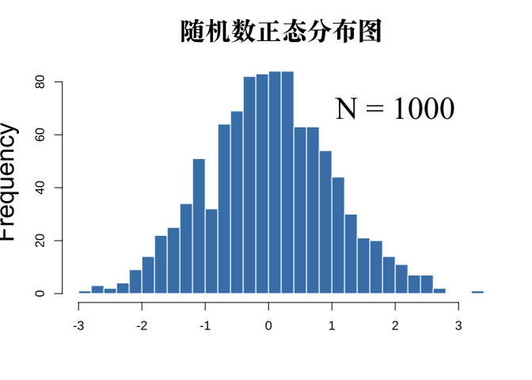

chapter14_输出图形用以展示
================

- <a href="#14-输出图形用以展示" id="toc-14-输出图形用以展示">14
  输出图形用以展示</a>
  - <a href="#141-输出为pdf矢量文件和点阵png文件"
    id="toc-141-输出为pdf矢量文件和点阵png文件">14.1
    输出为PDF矢量文件和点阵(PNG)文件</a>
  - <a href="#142-在pdf文件中设定字体" id="toc-142-在pdf文件中设定字体">14.2
    在PDF文件中设定字体</a>

Source：

1.  《R数据可视化手册》，北京：人民邮电出版社，2014.5

# 14 输出图形用以展示

## 14.1 输出为PDF矢量文件和点阵(PNG)文件

- 有两种方法输出PDF文件。一种方法是，使用`pdf()`打开PDF图形设备，绘制图形，然后使用`dev.off()`关闭图形设备。这种方法适用于R中的大多数图形，包括基础图形和基于网格的图形，如那些由ggplot2和lattice创建的图形：

``` r
> library(ggplot2)
> # width(宽度)和height(高度)的单位为英寸
> pdf("myplot-14.1.1.pdf", width=4, height=4)
> #绘制图形
> plot(mtcars$wt, mtcars$mpg)
> print(ggplot(mtcars, aes(x=wt, y=mpg)) + geom_point())
> dev.off()
quartz_off_screen 
                2 
```

- 如果你使用ggplot2创建图形，那么使用`ggsave()`会简单一些。此函数可以简单地保存使用`ggplot()`创建的最后一幅图形。你可以以英寸而不是以像素为单位指定图形的宽度和高度，并指定使用的ppi数值：

``` r
> ggplot(mtcars, aes(x=wt, y=mpg)) + geom_point()
```

<!-- -->

``` r
> # 默认单位为英寸，不过也可指定单位
> ggsave("myplot-14.1.2.pdf", width=8, height=8, units="cm",dpi = 300)
> ggsave("myplot-14.1.2.png", width=6, height=6)
```

- 虽然这个参数名为dpi，但它实际上控制的却是每英寸的像素数(pixelsper
  inch,ppi)，而非每英寸的点数(dots per
  inch，dpi)。在印刷中渲染一个灰色像素时，我们是使用许多黑色墨水的小点来输出它的，因此印刷输出拥有的每英寸点数要高于每英寸像素数。

- 当你的目的是输出到供打印的文档时，PDF文件通常是最佳选择。这种格式可以与LaTeX轻松配合，而且可以用于苹果Keynote软件创建的演示幻灯片中，但微软的软件可能难以导入这种格式的文件(参见14.3节以了解关于如何创建可被导入微软软件的矢量图形的细节)。

- PDF文件一般也比位图文件，如便携式网络图形(PNG)文件更小，因为PDF文件包含的是一系列的指令，如“从这里到那里画一条直线”，而不是关于每个像素的颜色信息。不过，也存在位图文件更小的情况。例如，如果你有一幅存在严重遮盖的散点图，则PDF文件可能会比PNG文件大得多一虽然大多数点都无法彼此分清，PDF文件却将仍然包含绘制每一个点的指令，反之，位图文件将不会包含这些冗余的信息。参见5.5
  节中的示例。

## 14.2 在PDF文件中设定字体

- 参考案例：[showtext: Using Fonts More Easily in R
  Graphs](https://cran.rstudio.com/web/packages/showtext/vignettes/introduction.html)。

- 安装showtext包。

``` r
> library(showtext)
> ## 加载macOS自带字体，打开启动台--其他--字体册app，找到目标字体，查看字体所在路径
> ## 中文：宋体-简
> font_add("Songti", "/System/Library/Fonts/Supplemental/Songti.ttc")
> ## 英文：Arial
> font_add("Arial", "/System/Library/Fonts/Supplemental/Arial.ttf")
> font_add("Times New Roman", "/System/Library/Fonts/Supplemental/Times New Roman.ttf")
> ## 如需全局使用showtext则可使用该函数
> showtext_auto()
> 
> set.seed(123)
> hist(rnorm(1000), breaks = 30, col = "steelblue", border = "white",
+      main = "", xlab = "", ylab = "")
> title("随机数正态分布图", family = "Songti", cex.main = 2)
> title(ylab = "Frequency", family = "Arial", cex.lab = 2)
> text(2, 70, "N = 1000", family = "Times New Roman", cex = 2.5)
```

<!-- -->

- 此示例应适用于大多数图形设备，包括`pdf()`、`png()`、`postscript()`。

- 如需部分使用showtext，则使用`showtext_begin()`和`showtext_end()`将目标代码包围：

``` r
> library(showtext)
> ## 英文斜体：Arial Italic
> font_add("Arial Italic", "/System/Library/Fonts/Supplemental/Arial Italic.ttf")
> 
> set.seed(123)
> pdf("Histogram of Normal Random Numbers-14.2.1.pdf", width=6, height=6) # 导出为PDF
> hist(rnorm(1000), breaks = 30, col = "steelblue", border = "white",
+      main = "Histogram of Normal Random Numbers", xlab = "", ylab = "Frequency")
> 
> showtext_begin()
> text(2, 70, "N = 1000", family = "Arial Italic", cex = 2.5)
> showtext_end()
> dev.off()
quartz_off_screen 
                2 
```

- 另一个案例：

``` r
> library(showtext)
> ## 宋体-简 for Chinese characters
> font_add("Songti", "/System/Library/Fonts/Supplemental/Songti.ttc")
> 
> ## Arial with regular and italic font faces
> font_add("Arial", "/System/Library/Fonts/Supplemental/Arial.ttf")
> 
> showtext_auto()
> 
> library(ggplot2)
> p = ggplot(NULL, aes(x = 1, y = 1)) + ylim(0.8, 1.2) +
+     theme(axis.title = element_blank(), axis.ticks = element_blank(),
+           axis.text = element_blank()) +
+     annotate("text", 1, 1.1, family = "Songti", size = 15,
+              label = "\u4F60\u597D\uFF0C\u4E16\u754C") +
+     annotate("text", 1, 0.9, label = 'Chinese for "Hello, world!"',
+              family = "Arial", fontface = "italic", size = 12)
> 
> print(p)
```

<!-- -->

``` r
> ## PNG device
> ggsave("Hello_world-14.2.2.pdf", width = 7, height = 4, dpi = 300)
> 
> ## turn off if no longer needed
> showtext_auto(FALSE)
```

- 在R_Markdown文档中使用showtext，有两点需要注意：

  - 1、可在文档开头的YAML中的输出格式中，设置`fig_retina = 1`；
  - 2、可在单个代码块的开头，设置`fig.showtext = TRUE`。

<!-- -->

    output:
        html_document:
            fig_retina: 1

    {r fig.showtext=TRUE}
    library(showtext)
    font_add_google("Lobster", "lobster")
    showtext_auto()
