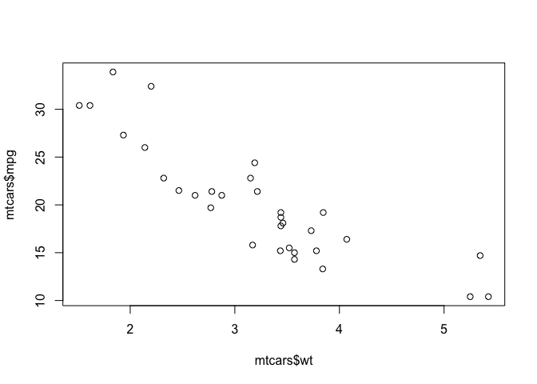
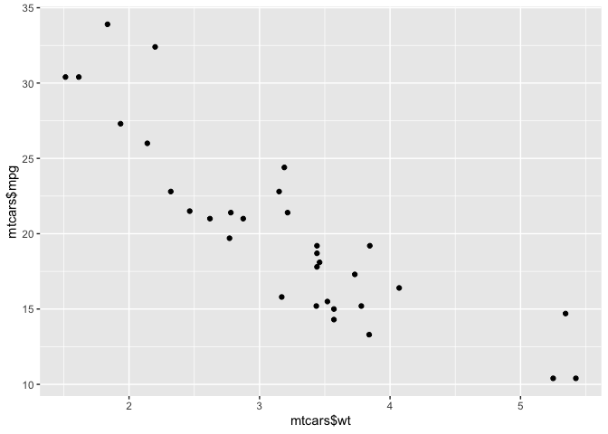
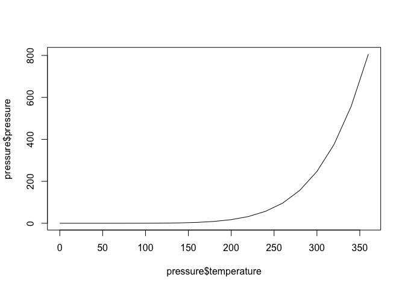
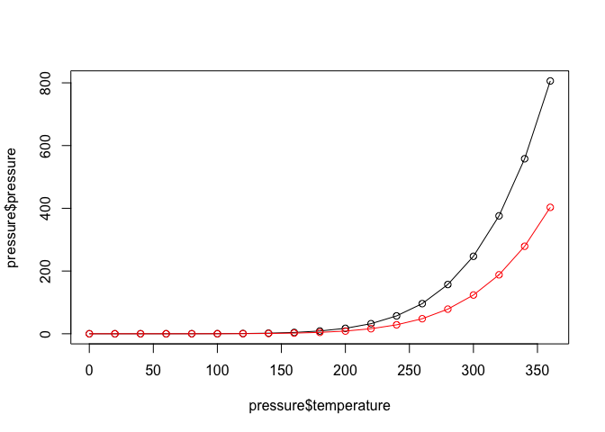

chapter2_快速探索数据
================

- <a href="#2-快速探索数据" id="toc-2-快速探索数据">2 快速探索数据</a>
  - <a href="#21-绘制散点图" id="toc-21-绘制散点图">2.1 绘制散点图</a>
  - <a href="#22-绘制折线图" id="toc-22-绘制折线图">2.2 绘制折线图</a>

Source：

1.  《R数据可视化手册》，北京：人民邮电出版社，2014.5

# 2 快速探索数据

## 2.1 绘制散点图

- 使用`plot()`函数可绘制散点图，运行命令时依次传递给`plot()`函数一个向量x和一个向量y。

``` r
> plot(mtcars$wt,mtcars$mpg)
```

<!-- -->

- 对于ggplot2系统，可用`qplot()`函数得到相同的绘图结果：

``` r
> library(ggplot2)
> qplot(mtcars$wt,mtcars$mpg)
```

<!-- -->

- 如果绘图所用的两个参数向量包含在同一个数据框内，则可以运行下面的命令：

``` r
> qplot(wt,mpg,data=mtcars)
```

<!-- -->

- 或者：

``` r
> ggplot(mtcars,aes(x=wt,y=mpg)) + geom_point()
```

<!-- -->

- 更多关于绘制散点图的详细内容可参见第5章。

## 2.2 绘制折线图

- 使用`plot()`函数绘制折线图时需向其传递一个包含x值的向量和一个包含y值的向量，并使用参数type=“l”：

``` r
> plot(pressure$temperature,pressure$pressure,type = 'l')
```

<!-- -->

- 如果要向图形中添加数据点或者多条折线，则需先用`plot()`函数绘制第一条折线，再通过`points()`函数和`lines()`函数分别添加数据点和更多折线：

``` r
> plot(pressure$temperature,pressure$pressure,type = 'l')
> points(pressure$temperature,pressure$pressure)
> lines(pressure$temperature,pressure$pressure/2,col = 'red')
> points(pressure$temperature,pressure$pressure/2,col = 'red')
```

<!-- -->
