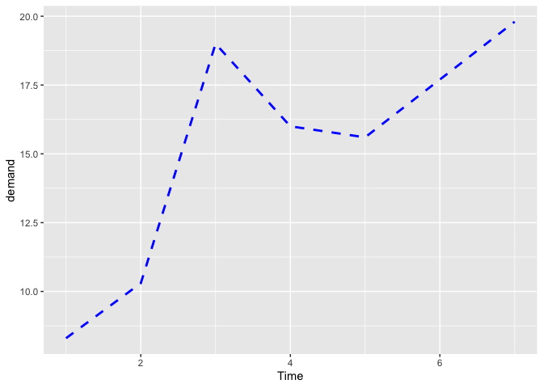

chapter4_折线图
================

- <a href="#4-折线图" id="toc-4-折线图">4 折线图</a>
  - <a href="#41-绘制简单折线图" id="toc-41-绘制简单折线图">4.1
    绘制简单折线图</a>
  - <a href="#42-向折线图添加数据标记" id="toc-42-向折线图添加数据标记">4.2
    向折线图添加数据标记</a>
  - <a href="#43-绘制多重折线图" id="toc-43-绘制多重折线图">4.3
    绘制多重折线图</a>
  - <a href="#44-修改线条样式" id="toc-44-修改线条样式">4.4 修改线条样式</a>
  - <a href="#45-修改数据标记样式" id="toc-45-修改数据标记样式">4.5
    修改数据标记样式</a>
  - <a href="#46-绘制面积图" id="toc-46-绘制面积图">4.6 绘制面积图</a>
  - <a href="#47-绘制堆积面积图" id="toc-47-绘制堆积面积图">4.7
    绘制堆积面积图</a>
  - <a href="#48-绘制百分比堆积面积图" id="toc-48-绘制百分比堆积面积图">4.8
    绘制百分比堆积面积图</a>
  - <a href="#49-添加置信域" id="toc-49-添加置信域">4.9 添加置信域</a>

Source：

1.  《R数据可视化手册》，北京：人民邮电出版社，2014.5

# 4 折线图

- 本章中的大部分案例用到的都是连续型变量x，在其中一个案例中，我们会将连续型变量转化为因子型变量，因此，它也可以看作是一个针对离散型变量绘制折线图的例子。

## 4.1 绘制简单折线图

- 运行`ggplot()`和`geom_line()`函数，并分别指定一个变量映射给x和y(见下图)。

``` r
> library(ggplot2)
> ggplot(BOD, aes(x=Time, y=demand)) + 
+   geom_line()
```

<!-- -->

-对于这个简单的数据框，x对应的变量Time和y对应的变量demand分别对应于数据框的两列数据：

``` r
> BOD
  Time demand
1    1    8.3
2    2   10.3
3    3   19.0
4    4   16.0
5    5   15.6
6    7   19.8
```

- 折线图的x轴既可以对应于离散型(分类)变量，也可以对应于连续型(数值型)变量。

- 本例中Time变量为连续型变量，但我们可以借助`factor()`函数将其转化为因子型变量，然后，将其当作分类变量来处理(见下图)。当x对应于因子型变量时，必须使用命令`aes(group=1)`以确保`ggplot()`知道这些数据点属于同一个分组，从而应该用一条折线连在一起(关于为什么因子型变量必须设定group的内容可以参见4.3节)。

``` r
> BOD1 <- BOD #将数据复制一份
> BOD1$Time <- factor(BOD1$Time)
> ggplot(BOD1, aes(x=Time, y=demand, group=1)) + geom_line()
```

<!-- -->

- 上图是x轴对应于分类变量的简单折线图(注意x轴上没有对应于水平6的取值)。

- 数据集BOD中没有对应于Time=6的数据点，因此当Time被转化为因子型变量时，它并没有6这个水平。因子型变量对应于分类值，这里的6只是其中一个可能的取值。因为数据集中恰好没有对应于该水平的数据点，所以，x轴上没有绘制相应的取值。默认情况下，ggplot2绘制的折线图的y轴范围刚好能容纳数据集中的y值。对于某些数据而言，我们将y轴的起点设定为0点会更合适。你可以运行`ylim()`设定y轴范围或者运行含一个参数的`expand_limit()`扩展y轴的范围。下面的命令将y轴的范围设定为0到BOD中demand变量的最大值。

``` r
> ggplot(BOD, aes(x=Time, y=demand)) + 
+   geom_line() + 
+   ylim(0, max(BOD$demand)) 
```

<!-- -->

``` r
> # 运行下面的命令得到的结果是相同的
> ggplot(BOD, aes(x=Time, y=demand)) + 
+   geom_line() + 
+   expand_limits(y=0)
```

<!-- -->

## 4.2 向折线图添加数据标记

- 在代码中加上`geom_point()`：

``` r
> ggplot(BOD, aes(x=Time, y=demand)) + 
+   geom_line() + 
+   geom_point()
```

<!-- -->

- 有时候，在折线图上添加数据标记很有用处。当数据点的密度较低或者数据采集频率不规则时尤其有用。比如，BOD数据集中没有与Time=6相对应的输入，然而，这在单独的一张折线图看起来并不明显(可比较一下上两张图)。

- worldpop数据集对应的采集时间间隔不是常数。时间距今较久远的数据采集频率比新近不久的数据采集频率低。折线图中的数据标记表明了数据的采集时间(见下图)：

``` r
> library(gcookbook) # 为了使用数据
> ggplot(worldpop, aes(x=Year, y=Population)) + 
+   geom_line() + 
+   geom_point() 
```

<!-- -->

``` r
> # 当y轴取对数时也一样
> ggplot(worldpop, aes(x=Year, y=Population)) + 
+   geom_line() + 
+   geom_point() + 
+   scale_y_log10()
```

<!-- -->

- 从对y轴取对数的折线图上可以看出：在过去数千年中人口增长率有所增加。公元元年之前的人口增长率接近常数，约每5000年增加10倍。从图中也可以看出，近年来的人口普查频率比以往更为频繁，数据也更为准确。

- 更多关于修改数据标记样式的内容可参见4.5节。

## 4.3 绘制多重折线图

- 在分别设定一个映射给x和y的基础上，再将另外一个(离散型)变量映射给颜色(colour)或者线型(linetype)即可：

``` r
> # 载入plyr包，便于我们使用ddply()函数创建样本数据集
> library(plyr)
> # 对ToothGrowth数据集进行汇总
> tg <- ddply(ToothGrowth, c("supp", "dose"), summarise, length=mean(len))
> # 将supp映射给颜色(colour)
> ggplot(tg, aes(x=dose, y=length, colour=supp)) + geom_line()
```

<!-- -->

``` r
> # supp映射给线型(linetype)
> ggplot(tg, aes(x=dose, y=length, linetype=supp)) + geom_line()
```

<!-- -->

- tg数据集共有三列，其中一列是我们映射给颜色(colour)和线型(linetype)的supp变量：

``` r
> tg
  supp dose length
1   OJ  0.5  13.23
2   OJ  1.0  22.70
3   OJ  2.0  26.06
4   VC  0.5   7.98
5   VC  1.0  16.77
6   VC  2.0  26.14
> str(tg)
'data.frame':   6 obs. of  3 variables:
 $ supp  : Factor w/ 2 levels "OJ","VC": 1 1 1 2 2 2
 $ dose  : num  0.5 1 2 0.5 1 2
 $ length: num  13.23 22.7 26.06 7.98 16.77 ...
```

- **注意：如果x变量是因子，你必须同时告诉`ggplot()`用来分组的变量，正如接下来要介绍的那样。**

- 折线图的x轴既可以对应于连续型变量也可以对应于离散型变量。有时候，映射给x的变量虽然被存储为数值型变量，但被看作分类变量来处理。

- 本例中，dose变量有三个取值：0.5、1.0和2。或许你更想将其当作分类变量而不是连续型变量来处理，那么运行`factor()`函数将其转化为因子：

``` r
> ggplot(tg, aes(x=factor(dose), y=length, colour=supp, group=supp)) + 
+   geom_line()
```

<!-- -->

- **注意：不可缺少`group=supp`语句，否则，`ggplot()`会不知如何将数据组合在一起绘制折线图，从而会报错**：

``` r
> ggplot(tg, aes(x=factor(dose), y=length, colour=supp)) + 
+   geom_line()
```

<!-- -->

- 当分组不正确时会遇见的另一种问题是，折线图会变成锯齿状：

``` r
> ggplot(tg, aes(x=dose, y=length)) + 
+   geom_line()
```

<!-- -->

- 导致这种情况的原因在于x在每个位置都对应于多个点，`ggplot()`误以为这些点属于同一组数据而将其用一根折线相连，结果形成了锯齿状折线图。如果将任意离散型变量映射给colour或者linetype，`ggplot()`会以其为分组变量对数据进行分组。如果你想借助其他变量对数据进行分组(未映射给图形属性)则需使用group。

- \*\*注意：有疑问时，或者如果你的折线图看起来不太合理，可以试着用group明确指定分组变量。这种问题十分常见，因为`ggplot()`不知道如何对折线图数据进行分组。

- 如果折线图上有数据标记，你也可以将分组变量映射给数据标记的属性，诸如shape和fill等：

``` r
> ggplot(tg, aes(x=dose, y=length, shape=supp)) + 
+   geom_line() + 
+   geom_point(size=4) # 更大的点
```

<!-- -->

``` r
> ggplot(tg, aes(x=dose, y=length, fill=supp)) + 
+   geom_line() + 
+   geom_point(size=4, shape=21) # 使用有填充色的点
```

<!-- -->

- 有时，数据标记会相互重叠。我们需要令其彼此错开。这意味着要将它们的位置左移或者右移。同时，需要相应地左移或者右移连接线以避免点线偏离。在这一过程中，必须指定数据标记的移动距离：

``` r
> ggplot(tg, aes(x=dose, y=length, shape=supp)) + 
+   geom_line(position=position_dodge(0.2)) + # 将连接线左右移动 0.2 
+   geom_point(position=position_dodge (0.2), size=4) # 将点的位置左右移动 0.2
```

<!-- -->

## 4.4 修改线条样式

- 通过设置线型(linetype)、线宽()和颜色(colour)参数可以分别修改折线的线型、线宽和颜色。通过将这些参数的值传递给`geom_line()`函数可以设置折线图的对应属性：

``` r
> ggplot(BOD, aes(x=Time, y=demand)) + 
+   geom_line(linetype="dashed", linewidth=1, colour="blue")
```

<!-- -->

- 对于多重折线图而言，设定图形属性会对图上的所有折线产生影响。而将变量映射给图形属性则会使图上的折线具有不同的外观，参见4.3节。折线图的默认颜色并不是很吸引眼球，所以，我们可能希望使用其他调色板为图形着色，可以调用`scale_colour_brewer()`和`scale_colour_manual()`函数完成上述操作：

``` r
> # 加载plyr包，便于调用ddply()函数创建例子所需的数据集
> library(plyr)
> # 对ToothGrowth数据集进行汇总
> tg <- ddply(ToothGrowth, c("supp", "dose"), summarise, length=mean(len)) 
> ggplot(tg, aes(x=dose, y=length, colour=supp)) + 
+   geom_line() + 
+   scale_colour_brewer(palette="Set1")
```

<!-- -->

- 在`aes()`函数外部设定颜色(colour)会将所有折线设定为同样的颜色。其他图形属性诸如线宽(linewidth)、线型(linetype)和点形(shape)与此类似，如下图所示。操作过程中可能需要指定分组变量。

``` r
> # 如果两条折线的图形属性相同，需要指定一个分组变量
> ggplot(tg, aes(x=dose, y=length, group=supp)) + 
+   geom_line(colour="darkgreen", linewidth=1.5)
```

<!-- -->

``` r
> # 因为变量supp被映射给了颜色(colour)属性，所以，它自动作为分组变量 
> ggplot(tg, aes(x=dose, y=length, colour=supp)) + 
+   geom_line(linetype="dashed") + 
+   geom_point(shape=22, size=3, fill="white")
```

<!-- -->

- 左图：单一颜色和宽度的折线图；右图：将变量supp映射给colour并添加数据标记的折线图。

- 更多关于使用颜色的内容可参见第12章。

## 4.5 修改数据标记样式

- 在函数`aes()`外部设定函数`geom_point()`的大小()、颜色(colour)
  和填充色(fill)即可。

``` r
> ggplot(BOD, aes (x=Time, y=demand)) + 
+   geom_line() + 
+   geom_point(size=4, shape=22, colour="darkred", fill="pink")
```

<!-- -->

- 数据标记默认的形状(shape)是实线圆圈，默认的大小()是2，默认的颜色(colour)是黑色(black)。填充色(fill)
  属性只适用于某些(标号21-25)具有独立边框线和填充颜色的点形(参见5.3节中的点形列表)。fill一般取空值或者NA。将填充色设定为白色可以得到一个空心圆，如下图所示。

``` r
> ggplot(BOD, aes (x=Time, y=demand)) + 
+   geom_line() + 
+   geom_point(size=4, shape=21, fill="white")
```

<!-- -->

- 如果要将数据标记和折线设定为不同的颜色，我们必须在折线绘制完毕后再行设定数据标记的颜色，此时，数据标记被绘制在更上面的图层，从而，避免被折线遮盖。

- 从4.3
  节可知，通过在`aes()`函数内部将分组变量映射给数据标记的图形属性可以将多条折线设定为不同的颜色。数据标记的默认颜色并不吸引眼球，因而，你可能想要调用别的调色板，`scale_colour_brewer()`函数和`scale_colour manual()`函数可以完成上述操作。在`aes()`函数外部设定shape和可以将数据标记设定为统一的形状和颜色。

``` r
> # 载入plyr包，以使用ddply()函数创建例子所需数据集
> library(plyr)
> # 对ToothGrowth数据集进行汇总
> tg <- ddply(ToothGrowth, c("supp", "dose"), summarise, length=mean(len)) 
> 
> # 保存错开(dodge)设置，接下来会多次用到
> pd <- position_dodge(0.2)
> 
> ggplot(tg, aes(x=dose, y=length, fill=supp)) + 
+   geom_line(position=pd) + 
+   geom_point(shape=21, size=3, position=pd) + 
+   scale_fill_manual(values=c("black","white"))
```

<!-- -->

- 上图将填充色手动设定为黑白两色，并轻微调整数据标记的位置。

- 更多关于使用点形的内容可以参见5.3节，更多关于使用颜色的内容可参见本书第12章。

## 4.6 绘制面积图

- 运行`geom_area()`函数即可绘制面积图。

``` r
> # 将sunspot.year数据集转化为数据框，便于本例使用
> sunspotyear <- data.frame(
+   Year = as.numeric(time(sunspot.year)),
+   Sunspots = as.numeric(sunspot.year))
>   
> ggplot(sunspotyear, aes(x=Year, y=Sunspots)) + geom_area()
```

<!-- -->

- 默认情况下，面积图的填充色为黑灰色且没有边框线，通过设定填充色(fill)可以修改面积图的填充色。接下来的例子中，我们将填充色设定为蓝色，并通过设定`alpha=0.2`将面积图的透明度设定为80%，此时，我们可以看到面积图的网格线，如下图所示。通过设置颜色(colour)可以为面积图添加边框线：

``` r
> ggplot(sunspotyear, aes (x=Year, y=Sunspots)) + 
+   geom_area(colour="black", fill="blue", alpha=.2)
```

<!-- -->

- 假如整个面积图添加边框线之后的效果并不十分令人满意，可能此时系统会在面积图的起点和终点位置分别绘制一套垂直线，且在底部绘制了一条横线。为了修正上述情况，可以先绘制不带边框线的面积图(不设定colour)，然后，添加新图层，并用`geom_line()`函数绘制轨迹线，如下图所示。

``` r
> ggplot(sunspotyear, aes(x=Year, y=Sunspots)) + 
+   geom_area(fill="blue", alpha=.2) + 
+   geom_line()
```

<!-- -->

- 更多关于使用颜色的内容可以参见第12章。

## 4.7 绘制堆积面积图

- 运行`geom_area()`函数，并映射一个因子型变量给填充色(fill)即可。

``` r
> library(gcookbook) #为了使用数据
> ggplot(uspopage, aes(x=Year, y=Thousands, fill=AgeGroup)) + 
+   geom_area()
```

<!-- -->

- 堆积面积图对应的基础数据通常为宽格式(wide
  format)，但ggplot2要求数据必须是长格式(long
  format)，在两种格式之间进行转换的内容可参见15.19节。

- 下面以uspopage数据集为例：

``` r
> uspopage
    Year AgeGroup Thousands
1   1900       <5      9181
2   1900     5-14     16966
3   1900    15-24     14951
4   1900    25-34     12161
5   1900    35-44      9273
6   1900    45-54      6437
7   1900    55-64      4026
8   1900      >64      3099
9   1901       <5      9336
10  1901     5-14     17158
11  1901    15-24     15242
12  1901    25-34     12442
13  1901    35-44      9504
14  1901    45-54      6606
15  1901    55-64      4122
16  1901      >64      3174
17  1902       <5      9502
18  1902     5-14     17360
19  1902    15-24     15555
20  1902    25-34     12737
21  1902    35-44      9745
22  1902    45-54      6788
23  1902    55-64      4220
24  1902      >64      3256
25  1903       <5      9645
26  1903     5-14     17524
27  1903    15-24     15858
28  1903    25-34     13019
29  1903    35-44      9974
30  1903    45-54      6964
31  1903    55-64      4313
32  1903      >64      3335
33  1904       <5      9791
34  1904     5-14     17697
35  1904    15-24     16178
36  1904    25-34     13315
37  1904    35-44     10211
38  1904    45-54      7150
39  1904    55-64      4410
40  1904      >64      3414
41  1905       <5      9944
42  1905     5-14     17888
43  1905    15-24     16526
44  1905    25-34     13631
45  1905    35-44     10461
46  1905    45-54      7350
47  1905    55-64      4517
48  1905      >64      3505
49  1906       <5     10092
50  1906     5-14     18067
51  1906    15-24     16864
52  1906    25-34     13952
53  1906    35-44     10705
54  1906    45-54      7554
55  1906    55-64      4621
56  1906      >64      3595
57  1907       <5     10220
58  1907     5-14     18240
59  1907    15-24     17184
60  1907    25-34     14257
61  1907    35-44     10945
62  1907    45-54      7755
63  1907    55-64      4724
64  1907      >64      3684
65  1908       <5     10364
66  1908     5-14     18440
67  1908    15-24     17526
68  1908    25-34     14585
69  1908    35-44     11202
70  1908    45-54      7974
71  1908    55-64      4840
72  1908      >64      3779
73  1909       <5     10509
74  1909     5-14     18670
75  1909    15-24     17871
76  1909    25-34     14923
77  1909    35-44     11471
78  1909    45-54      8204
79  1909    55-64      4964
80  1909      >64      3878
81  1910       <5     10671
82  1910     5-14     18950
83  1910    15-24     18212
84  1910    25-34     15274
85  1910    35-44     11759
86  1910    45-54      8454
87  1910    55-64      5101
88  1910      >64      3986
89  1911       <5     10796
90  1911     5-14     19214
91  1911    15-24     18355
92  1911    25-34     15530
93  1911    35-44     12003
94  1911    45-54      8657
95  1911    55-64      5234
96  1911      >64      4074
97  1912       <5     10915
98  1912     5-14     19503
99  1912    15-24     18477
100 1912    25-34     15772
101 1912    35-44     12252
102 1912    45-54      8875
103 1912    55-64      5372
104 1912      >64      4169
105 1913       <5     11082
106 1913     5-14     19904
107 1913    15-24     18649
108 1913    25-34     16070
109 1913    35-44     12562
110 1913    45-54      9135
111 1913    55-64      5542
112 1913      >64      4281
113 1914       <5     11244
114 1914     5-14     20316
115 1914    15-24     18796
116 1914    25-34     16370
117 1914    35-44     12875
118 1914    45-54      9398
119 1914    55-64      5711
120 1914      >64      4401
121 1915       <5     11347
122 1915     5-14     20660
123 1915    15-24     18844
124 1915    25-34     16580
125 1915    35-44     13130
126 1915    45-54      9618
127 1915    55-64      5866
128 1915      >64      4501
129 1916       <5     11442
130 1916     5-14     21008
131 1916    15-24     18872
132 1916    25-34     16776
133 1916    35-44     13388
134 1916    45-54      9846
135 1916    55-64      6026
136 1916      >64      4603
137 1917       <5     11527
138 1917     5-14     21369
139 1917    15-24     18836
140 1917    25-34     16913
141 1917    35-44     13647
142 1917    45-54     10068
143 1917    55-64      6194
144 1917      >64      4714
145 1918       <5     11606
146 1918     5-14     21732
147 1918    15-24     18071
148 1918    25-34     16445
149 1918    35-44     13879
150 1918    45-54     10293
151 1918    55-64      6356
152 1918      >64      4826
153 1919       <5     11536
154 1919     5-14     21849
155 1919    15-24     18465
156 1919    25-34     16912
157 1919    35-44     14008
158 1919    45-54     10402
159 1919    55-64      6456
160 1919      >64      4886
161 1920       <5     11631
162 1920     5-14     22158
163 1920    15-24     18821
164 1920    25-34     17416
165 1920    35-44     14382
166 1920    45-54     10505
167 1920    55-64      6619
168 1920      >64      4929
169 1921       <5     11879
170 1921     5-14     22515
171 1921    15-24     19140
172 1921    25-34     17747
173 1921    35-44     14665
174 1921    45-54     10721
175 1921    55-64      6791
176 1921      >64      5080
177 1922       <5     12031
178 1922     5-14     22788
179 1922    15-24     19402
180 1922    25-34     17924
181 1922    35-44     14823
182 1922    45-54     10899
183 1922    55-64      6951
184 1922      >64      5231
185 1923       <5     12119
186 1923     5-14     23089
187 1923    15-24     19798
188 1923    25-34     18231
189 1923    35-44     15066
190 1923    45-54     11068
191 1923    55-64      7165
192 1923      >64      5411
193 1924       <5     12269
194 1924     5-14     23358
195 1924    15-24     20314
196 1924    25-34     18557
197 1924    35-44     15337
198 1924    45-54     11278
199 1924    55-64      7387
200 1924      >64      5609
201 1925       <5     12316
202 1925     5-14     23614
203 1925    15-24     20691
204 1925    25-34     18720
205 1925    35-44     15576
206 1925    45-54     11521
207 1925    55-64      7605
208 1925      >64      5786
209 1926       <5     12189
210 1926     5-14     23906
211 1926    15-24     21037
212 1926    25-34     18867
213 1926    35-44     15847
214 1926    45-54     11786
215 1926    55-64      7805
216 1926      >64      5960
217 1927       <5     12111
218 1927     5-14     24152
219 1927    15-24     21430
220 1927    25-34     18948
221 1927    35-44     16172
222 1927    45-54     12092
223 1927    55-64      8003
224 1927      >64      6127
225 1928       <5     11978
226 1928     5-14     24320
227 1928    15-24     21811
228 1928    25-34     18953
229 1928    35-44     16540
230 1928    45-54     12430
231 1928    55-64      8178
232 1928      >64      6299
233 1929       <5     11734
234 1929     5-14     24470
235 1929    15-24     22151
236 1929    25-34     18941
237 1929    35-44     16921
238 1929    45-54     12761
239 1929    55-64      8315
240 1929      >64      6474
241 1930       <5     11372
242 1930     5-14     24631
243 1930    15-24     22487
244 1930    25-34     19039
245 1930    35-44     17270
246 1930    45-54     13096
247 1930    55-64      8477
248 1930      >64      6705
249 1931       <5     11179
250 1931     5-14     24629
251 1931    15-24     22617
252 1931    25-34     19242
253 1931    35-44     17412
254 1931    45-54     13296
255 1931    55-64      8735
256 1931      >64      6928
257 1932       <5     10903
258 1932     5-14     24614
259 1932    15-24     22716
260 1932    25-34     19484
261 1932    35-44     17504
262 1932    45-54     13481
263 1932    55-64      8992
264 1932      >64      7147
265 1933       <5     10612
266 1933     5-14     24531
267 1933    15-24     22820
268 1933    25-34     19750
269 1933    35-44     17569
270 1933    45-54     13684
271 1933    55-64      9249
272 1933      >64      7363
273 1934       <5     10331
274 1934     5-14     24402
275 1934    15-24     22963
276 1934    25-34     20022
277 1934    35-44     17640
278 1934    45-54     13933
279 1934    55-64      9502
280 1934      >64      7582
281 1935       <5     10170
282 1935     5-14     24213
283 1935    15-24     23130
284 1935    25-34     20275
285 1935    35-44     17712
286 1935    45-54     14208
287 1935    55-64      9739
288 1935      >64      7804
289 1936       <5     10044
290 1936     5-14     23942
291 1936    15-24     23309
292 1936    25-34     20505
293 1936    35-44     17783
294 1936    45-54     14495
295 1936    55-64      9949
296 1936      >64      8027
297 1937       <5     10009
298 1937     5-14     23564
299 1937    15-24     23487
300 1937    25-34     20723
301 1937    35-44     17866
302 1937    45-54     14785
303 1937    55-64     10132
304 1937      >64      8258
305 1938       <5     10176
306 1938     5-14     23146
307 1938    15-24     23655
308 1938    25-34     20953
309 1938    35-44     18001
310 1938    45-54     15077
311 1938    55-64     10310
312 1938      >64      8508
313 1939       <5     10418
314 1939     5-14     22701
315 1939    15-24     23819
316 1939    25-34     21176
317 1939    35-44     18178
318 1939    45-54     15336
319 1939    55-64     10487
320 1939      >64      8764
321 1940       <5     10579
322 1940     5-14     22363
323 1940    15-24     24033
324 1940    25-34     21446
325 1940    35-44     18422
326 1940    45-54     15555
327 1940    55-64     10694
328 1940      >64      9031
329 1941       <5     10850
330 1941     5-14     22089
331 1941    15-24     24074
332 1941    25-34     21691
333 1941    35-44     18692
334 1941    45-54     15759
335 1941    55-64     10959
336 1941      >64      9288
337 1942       <5     11301
338 1942     5-14     21823
339 1942    15-24     24093
340 1942    25-34     21911
341 1942    35-44     18950
342 1942    45-54     15976
343 1942    55-64     11220
344 1942      >64      9584
345 1943       <5     12016
346 1943     5-14     21699
347 1943    15-24     24065
348 1943    25-34     22194
349 1943    35-44     19226
350 1943    45-54     16199
351 1943    55-64     11472
352 1943      >64      9867
353 1944       <5     12524
354 1944     5-14     21573
355 1944    15-24     23999
356 1944    25-34     22511
357 1944    35-44     19505
358 1944    45-54     16419
359 1944    55-64     11719
360 1944      >64     10147
361 1945       <5     12979
362 1945     5-14     21599
363 1945    15-24     23705
364 1945    25-34     22734
365 1945    35-44     19787
366 1945    45-54     16642
367 1945    55-64     11988
368 1945      >64     10494
369 1946       <5     13244
370 1946     5-14     21844
371 1946    15-24     23382
372 1946    25-34     22954
373 1946    35-44     20073
374 1946    45-54     16820
375 1946    55-64     12244
376 1946      >64     10828
377 1947       <5     14406
378 1947     5-14     22257
379 1947    15-24     23122
380 1947    25-34     23236
381 1947    35-44     20421
382 1947    45-54     16970
383 1947    55-64     12528
384 1947      >64     11185
385 1948       <5     14919
386 1948     5-14     23089
387 1948    15-24     22866
388 1948    25-34     23494
389 1948    35-44     20794
390 1948    45-54     17107
391 1948    55-64     12824
392 1948      >64     11538
393 1949       <5     15607
394 1949     5-14     23770
395 1949    15-24     22570
396 1949    25-34     23729
397 1949    35-44     21187
398 1949    45-54     17260
399 1949    55-64     13145
400 1949      >64     11921
401 1950       <5     16331
402 1950     5-14     24477
403 1950    15-24     22260
404 1950    25-34     23932
405 1950    35-44     21557
406 1950    45-54     17400
407 1950    55-64     13364
408 1950      >64     12362
409 1951       <5     17252
410 1951     5-14     25055
411 1951    15-24     22018
412 1951    25-34     24085
413 1951    35-44     21833
414 1951    45-54     17623
415 1951    55-64     13654
416 1951      >64     12768
417 1952       <5     17228
418 1952     5-14     26656
419 1952    15-24     21796
420 1952    25-34     24197
421 1952    35-44     22109
422 1952    45-54     17881
423 1952    55-64     13918
424 1952      >64     13169
425 1953       <5     17548
426 1953     5-14     27880
427 1953    15-24     21658
428 1953    25-34     24233
429 1953    35-44     22359
430 1953    45-54     18171
431 1953    55-64     14135
432 1953      >64     13582
433 1954       <5     17962
434 1954     5-14     29092
435 1954    15-24     21641
436 1954    25-34     24233
437 1954    35-44     22571
438 1954    45-54     18501
439 1954    55-64     14350
440 1954      >64     14040
441 1955       <5     18467
442 1955     5-14     30248
443 1955    15-24     21667
444 1955    25-34     24175
445 1955    35-44     22818
446 1955    45-54     18824
447 1955    55-64     14586
448 1955      >64     14489
449 1956       <5     18895
450 1956     5-14     31423
451 1956    15-24     21869
452 1956    25-34     24015
453 1956    35-44     23160
454 1956    45-54     19143
455 1956    55-64     14815
456 1956      >64     14902
457 1957       <5     19379
458 1957     5-14     32515
459 1957    15-24     22311
460 1957    25-34     23737
461 1957    35-44     23496
462 1957    45-54     19513
463 1957    55-64     14973
464 1957      >64     15353
465 1958       <5     19768
466 1958     5-14     33322
467 1958    15-24     23162
468 1958    25-34     23430
469 1958    35-44     23693
470 1958    45-54     19857
471 1958    55-64     15139
472 1958      >64     15771
473 1959       <5     20175
474 1959     5-14     34564
475 1959    15-24     23988
476 1959    25-34     23169
477 1959    35-44     24023
478 1959    45-54     20262
479 1959    55-64     15401
480 1959      >64     16248
481 1960       <5     20341
482 1960     5-14     35735
483 1960    15-24     24576
484 1960    25-34     22919
485 1960    35-44     24221
486 1960    45-54     20578
487 1960    55-64     15625
488 1960      >64     16675
489 1961       <5     20522
490 1961     5-14     37031
491 1961    15-24     25242
492 1961    25-34     22692
493 1961    35-44     24392
494 1961    45-54     20875
495 1961    55-64     15847
496 1961      >64     17089
497 1962       <5     20469
498 1962     5-14     37435
499 1962    15-24     26909
500 1962    25-34     22494
501 1962    35-44     24519
502 1962    45-54     21124
503 1962    55-64     16131
504 1962      >64     17457
505 1963       <5     20342
506 1963     5-14     38124
507 1963    15-24     28223
508 1963    25-34     22410
509 1963    35-44     24584
510 1963    45-54     21346
511 1963    55-64     16436
512 1963      >64     17778
513 1964       <5     20165
514 1964     5-14     38783
515 1964    15-24     29519
516 1964    25-34     22396
517 1964    35-44     24562
518 1964    45-54     21580
519 1964    55-64     16758
520 1964      >64     18127
521 1965       <5     19824
522 1965     5-14     39426
523 1965    15-24     30773
524 1965    25-34     22465
525 1965    35-44     24447
526 1965    45-54     21839
527 1965    55-64     17077
528 1965      >64     18451
529 1966       <5     19208
530 1966     5-14     40051
531 1966    15-24     32012
532 1966    25-34     22725
533 1966    35-44     24276
534 1966    45-54     22125
535 1966    55-64     17408
536 1966      >64     18755
537 1967       <5     18563
538 1967     5-14     40496
539 1967    15-24     33196
540 1967    25-34     23156
541 1967    35-44     24038
542 1967    45-54     22440
543 1967    55-64     17752
544 1967      >64     19071
545 1968       <5     17913
546 1968     5-14     40772
547 1968    15-24     34090
548 1968    25-34     23990
549 1968    35-44     23731
550 1968    45-54     22758
551 1968    55-64     18088
552 1968      >64     19365
553 1969       <5     17376
554 1969     5-14     40884
555 1969    15-24     35236
556 1969    25-34     24681
557 1969    35-44     23383
558 1969    45-54     23047
559 1969    55-64     18390
560 1969      >64     19680
561 1970       <5     17166
562 1970     5-14     40772
563 1970    15-24     36535
564 1970    25-34     25323
565 1970    35-44     23150
566 1970    45-54     23317
567 1970    55-64     18682
568 1970      >64     20107
569 1971       <5     17244
570 1971     5-14     40490
571 1971    15-24     37948
572 1971    25-34     25958
573 1971    35-44     22978
574 1971    45-54     23519
575 1971    55-64     18963
576 1971      >64     20561
577 1972       <5     17101
578 1972     5-14     39946
579 1972    15-24     38449
580 1972    25-34     27623
581 1972    35-44     22859
582 1972    45-54     23687
583 1972    55-64     19211
584 1972      >64     21020
585 1973       <5     16851
586 1973     5-14     39309
587 1973    15-24     39240
588 1973    25-34     28939
589 1973    35-44     22810
590 1973    45-54     23807
591 1973    55-64     19428
592 1973      >64     21525
593 1974       <5     16487
594 1974     5-14     38716
595 1974    15-24     40017
596 1974    25-34     30225
597 1974    35-44     22826
598 1974    45-54     23809
599 1974    55-64     19713
600 1974      >64     22061
601 1975       <5     16121
602 1975     5-14     38240
603 1975    15-24     40812
604 1975    25-34     31471
605 1975    35-44     22831
606 1975    45-54     23756
607 1975    55-64     20045
608 1975      >64     22696
609 1976       <5     15617
610 1976     5-14     37759
611 1976    15-24     41520
612 1976    25-34     32759
613 1976    35-44     23093
614 1976    45-54     23622
615 1976    55-64     20386
616 1976      >64     23278
617 1977       <5     15564
618 1977     5-14     37034
619 1977    15-24     42039
620 1977    25-34     33998
621 1977    35-44     23563
622 1977    45-54     23370
623 1977    55-64     20780
624 1977      >64     23892
625 1978       <5     15735
626 1978     5-14     36220
627 1978    15-24     42442
628 1978    25-34     34963
629 1978    35-44     24437
630 1978    45-54     23174
631 1978    55-64     21112
632 1978      >64     24502
633 1979       <5     16063
634 1979     5-14     35392
635 1979    15-24     42699
636 1979    25-34     36203
637 1979    35-44     25176
638 1979    45-54     22942
639 1979    55-64     21448
640 1979      >64     25134
641 1980       <5     16451
642 1980     5-14     34839
643 1980    15-24     42497
644 1980    25-34     37429
645 1980    35-44     25805
646 1980    45-54     22743
647 1980    55-64     21754
648 1980      >64     25707
649 1981       <5     16893
650 1981     5-14     34360
651 1981    15-24     42204
652 1981    25-34     38900
653 1981    35-44     26394
654 1981    45-54     22580
655 1981    55-64     21913
656 1981      >64     26221
657 1982       <5     17228
658 1982     5-14     34103
659 1982    15-24     41644
660 1982    25-34     39418
661 1982    35-44     28030
662 1982    45-54     22425
663 1982    55-64     22030
664 1982      >64     26787
665 1983       <5     17547
666 1983     5-14     33922
667 1983    15-24     41020
668 1983    25-34     40208
669 1983    35-44     29267
670 1983    45-54     22356
671 1983    55-64     22112
672 1983      >64     27361
673 1984       <5     17695
674 1984     5-14     33788
675 1984    15-24     40460
676 1984    25-34     40962
677 1984    35-44     30503
678 1984    45-54     22386
679 1984    55-64     22155
680 1984      >64     27877
681 1985       <5     17842
682 1985     5-14     33692
683 1985    15-24     39992
684 1985    25-34     41696
685 1985    35-44     31691
686 1985    45-54     22460
687 1985    55-64     22135
688 1985      >64     28415
689 1986       <5     17963
690 1986     5-14     33572
691 1986    15-24     39557
692 1986    25-34     42372
693 1986    35-44     33009
694 1986    45-54     22659
695 1986    55-64     21994
696 1986      >64     29008
697 1987       <5     18052
698 1987     5-14     33807
699 1987    15-24     38890
700 1987    25-34     42841
701 1987    35-44     34227
702 1987    45-54     23096
703 1987    55-64     21751
704 1987      >64     29625
705 1988       <5     18195
706 1988     5-14     34255
707 1988    15-24     38151
708 1988    25-34     43130
709 1988    35-44     35181
710 1988    45-54     23949
711 1988    55-64     21513
712 1988      >64     30123
713 1989       <5     18508
714 1989     5-14     34714
715 1989    15-24     37391
716 1989    25-34     43236
717 1989    35-44     36415
718 1989    45-54     24633
719 1989    55-64     21241
720 1989      >64     30682
721 1990       <5     18856
722 1990     5-14     35290
723 1990    15-24     36922
724 1990    25-34     43216
725 1990    35-44     37783
726 1990    45-54     25207
727 1990    55-64     21102
728 1990      >64     31247
729 1991       <5     19208
730 1991     5-14     36037
731 1991    15-24     36504
732 1991    25-34     43224
733 1991    35-44     39329
734 1991    45-54     25820
735 1991    55-64     21046
736 1991      >64     31812
737 1992       <5     19528
738 1992     5-14     36677
739 1992    15-24     36434
740 1992    25-34     42997
741 1992    35-44     39976
742 1992    45-54     27548
743 1992    55-64     20998
744 1992      >64     32356
745 1993       <5     19729
746 1993     5-14     37367
747 1993    15-24     36464
748 1993    25-34     42653
749 1993    35-44     40912
750 1993    45-54     28864
751 1993    55-64     21028
752 1993      >64     32903
753 1994       <5     19777
754 1994     5-14     38026
755 1994    15-24     36532
756 1994    25-34     42330
757 1994    35-44     41819
758 1994    45-54     30153
759 1994    55-64     21159
760 1994      >64     33331
761 1995       <5     19627
762 1995     5-14     38645
763 1995    15-24     36674
764 1995    25-34     42052
765 1995    35-44     42711
766 1995    45-54     31480
767 1995    55-64     21320
768 1995      >64     33769
769 1996       <5     19408
770 1996     5-14     39296
771 1996    15-24     36797
772 1996    25-34     41809
773 1996    35-44     43552
774 1996    45-54     32800
775 1996    55-64     21590
776 1996      >64     34143
777 1997       <5     19233
778 1997     5-14     39855
779 1997    15-24     37308
780 1997    25-34     41345
781 1997    35-44     44229
782 1997    45-54     34178
783 1997    55-64     22099
784 1997      >64     34401
785 1998       <5     19145
786 1998     5-14     40335
787 1998    15-24     38007
788 1998    25-34     40757
789 1998    35-44     44748
790 1998    45-54     35232
791 1998    55-64     23011
792 1998      >64     34619
793 1999       <5     19136
794 1999     5-14     40819
795 1999    15-24     38676
796 1999    25-34     40178
797 1999    35-44     45077
798 1999    45-54     36578
799 1999    55-64     23778
800 1999      >64     34798
801 2000       <5     19212
802 2000     5-14     41077
803 2000    15-24     39357
804 2000    25-34     39857
805 2000    35-44     45154
806 2000    45-54     38052
807 2000    55-64     24436
808 2000      >64     35081
809 2001       <5     19364
810 2001     5-14     41118
811 2001    15-24     39982
812 2001    25-34     39815
813 2001    35-44     45141
814 2001    45-54     39228
815 2001    55-64     25315
816 2001      >64     35352
817 2002       <5     19609
818 2002     5-14     41037
819 2002    15-24     40590
820 2002    25-34     39928
821 2002    35-44     44917
822 2002    45-54     40084
823 2002    55-64     26602
824 2002      >64     35602
> head(uspopage)
  Year AgeGroup Thousands
1 1900       <5      9181
2 1900     5-14     16966
3 1900    15-24     14951
4 1900    25-34     12161
5 1900    35-44      9273
6 1900    45-54      6437
```

- 默认情况下图例的堆积顺序与面积图的堆积顺序是相同的。将调色板设定为蓝色渐变色，并在各个区域之间添加细线(linewidth=.2)。同时我们将填充区域设定为半透明(alpha=.4)，这样可以透过填充区域看见网格线。

``` r
> ggplot(uspopage, aes(x=Year, y=Thousands, fill=AgeGroup)) + 
+   geom_area(colour="black", linewidth=.2, alpha=.4) + 
+   scale_fill_brewer(palette="Blues")
```

<!-- -->

- 通过设定标度中的切分(breaks)参数可以翻转图例的堆积顺序。下图中的堆积面积图对图例的堆积顺序进行了反转。

``` r
> ggplot(uspopage, aes(x=Year, y=Thousands, fill=AgeGroup, order=desc(AgeGroup))) + 
+   geom_area(colour="black", linewidth=.2, alpha=.4) + 
+   scale_fill_brewer(palette="Blues", breaks=rev(levels(uspopage$AgeGroup)))
```

<!-- -->

- 因为堆积面积图中的各个部分是由多边形构成的，假如其具有左、右边框线，那绘图效果差强人意且可能产生误导效果。为了对此进行修正，我们可以先绘制一个不带边框线的堆积面积图(将colour设定为默认的NA值)，然后，在其顶部添加`geom_line()`：

``` r
> ggplot(uspopage, aes(x=Year, y=Thousands, fill=AgeGroup)) + 
+   geom_area(colour=NA, alpha=.4) + 
+   scale_fill_brewer(palette="Blues") + 
+   geom_line(position="stack", linewidth=.2)
```

<!-- -->

- 更多关于宽格式与长格式相互转换的内容，可参见15.3节。

- 更多关于重排因子水平顺序的内容，可参见15.8节。

- 更多关于选择图形颜色的内容，可参见第12章。

## 4.8 绘制百分比堆积面积图

- 首先，计算各组对应的百分比。本例中，我们调用`ddply()`函数按变量Year对uspopage进行分组，然后计算一个新的列，命名为Percent。该列每一行的值等于对应的Thousands值除以变量Year对应的各个组内的Thousands之和再乘以100%。计算得出百分比之后，剩余的绘图步骤与绘制普通堆积面积图的步骤一样。

``` r
> library (gcookbook) # 为了使用数据
> library(plyr) # 为了使用ddply()函数
> # 将Thousands转化为Percent
> uspopage_prop <- ddply(uspopage, "Year", transform,
+                        Percent = Thousands / sum(Thousands)* 100)
> ggplot(uspopage_prop, aes(x=Year, y=Percent, fill=AgeGroup)) + 
+   geom_area(colour="black", linewidth=.2, alpha=.4) + 
+   scale_fill_brewer(palette="Blues")
```

<!-- -->

- 如需将图中的堆积面积图和图例的堆积顺序同时进行反转，则对代码做如下修改：

``` r
> ggplot(uspopage_prop, aes(x=Year, y=Percent, fill=AgeGroup)) + 
+   geom_area(colour="black", linewidth=.2, alpha=.4, position = position_stack(reverse = TRUE)) + 
+   scale_fill_brewer(palette="Blues", breaks=rev(levels(uspopage$AgeGroup)))
```

<!-- -->

- 让我们更深入查看上面的数据，并探究一下数据的计算过程：

``` r
> uspopage
    Year AgeGroup Thousands
1   1900       <5      9181
2   1900     5-14     16966
3   1900    15-24     14951
4   1900    25-34     12161
5   1900    35-44      9273
6   1900    45-54      6437
7   1900    55-64      4026
8   1900      >64      3099
9   1901       <5      9336
10  1901     5-14     17158
11  1901    15-24     15242
12  1901    25-34     12442
13  1901    35-44      9504
14  1901    45-54      6606
15  1901    55-64      4122
16  1901      >64      3174
17  1902       <5      9502
18  1902     5-14     17360
19  1902    15-24     15555
20  1902    25-34     12737
21  1902    35-44      9745
22  1902    45-54      6788
23  1902    55-64      4220
24  1902      >64      3256
25  1903       <5      9645
26  1903     5-14     17524
27  1903    15-24     15858
28  1903    25-34     13019
29  1903    35-44      9974
30  1903    45-54      6964
31  1903    55-64      4313
32  1903      >64      3335
33  1904       <5      9791
34  1904     5-14     17697
35  1904    15-24     16178
36  1904    25-34     13315
37  1904    35-44     10211
38  1904    45-54      7150
39  1904    55-64      4410
40  1904      >64      3414
41  1905       <5      9944
42  1905     5-14     17888
43  1905    15-24     16526
44  1905    25-34     13631
45  1905    35-44     10461
46  1905    45-54      7350
47  1905    55-64      4517
48  1905      >64      3505
49  1906       <5     10092
50  1906     5-14     18067
51  1906    15-24     16864
52  1906    25-34     13952
53  1906    35-44     10705
54  1906    45-54      7554
55  1906    55-64      4621
56  1906      >64      3595
57  1907       <5     10220
58  1907     5-14     18240
59  1907    15-24     17184
60  1907    25-34     14257
61  1907    35-44     10945
62  1907    45-54      7755
63  1907    55-64      4724
64  1907      >64      3684
65  1908       <5     10364
66  1908     5-14     18440
67  1908    15-24     17526
68  1908    25-34     14585
69  1908    35-44     11202
70  1908    45-54      7974
71  1908    55-64      4840
72  1908      >64      3779
73  1909       <5     10509
74  1909     5-14     18670
75  1909    15-24     17871
76  1909    25-34     14923
77  1909    35-44     11471
78  1909    45-54      8204
79  1909    55-64      4964
80  1909      >64      3878
81  1910       <5     10671
82  1910     5-14     18950
83  1910    15-24     18212
84  1910    25-34     15274
85  1910    35-44     11759
86  1910    45-54      8454
87  1910    55-64      5101
88  1910      >64      3986
89  1911       <5     10796
90  1911     5-14     19214
91  1911    15-24     18355
92  1911    25-34     15530
93  1911    35-44     12003
94  1911    45-54      8657
95  1911    55-64      5234
96  1911      >64      4074
97  1912       <5     10915
98  1912     5-14     19503
99  1912    15-24     18477
100 1912    25-34     15772
101 1912    35-44     12252
102 1912    45-54      8875
103 1912    55-64      5372
104 1912      >64      4169
105 1913       <5     11082
106 1913     5-14     19904
107 1913    15-24     18649
108 1913    25-34     16070
109 1913    35-44     12562
110 1913    45-54      9135
111 1913    55-64      5542
112 1913      >64      4281
113 1914       <5     11244
114 1914     5-14     20316
115 1914    15-24     18796
116 1914    25-34     16370
117 1914    35-44     12875
118 1914    45-54      9398
119 1914    55-64      5711
120 1914      >64      4401
121 1915       <5     11347
122 1915     5-14     20660
123 1915    15-24     18844
124 1915    25-34     16580
125 1915    35-44     13130
126 1915    45-54      9618
127 1915    55-64      5866
128 1915      >64      4501
129 1916       <5     11442
130 1916     5-14     21008
131 1916    15-24     18872
132 1916    25-34     16776
133 1916    35-44     13388
134 1916    45-54      9846
135 1916    55-64      6026
136 1916      >64      4603
137 1917       <5     11527
138 1917     5-14     21369
139 1917    15-24     18836
140 1917    25-34     16913
141 1917    35-44     13647
142 1917    45-54     10068
143 1917    55-64      6194
144 1917      >64      4714
145 1918       <5     11606
146 1918     5-14     21732
147 1918    15-24     18071
148 1918    25-34     16445
149 1918    35-44     13879
150 1918    45-54     10293
151 1918    55-64      6356
152 1918      >64      4826
153 1919       <5     11536
154 1919     5-14     21849
155 1919    15-24     18465
156 1919    25-34     16912
157 1919    35-44     14008
158 1919    45-54     10402
159 1919    55-64      6456
160 1919      >64      4886
161 1920       <5     11631
162 1920     5-14     22158
163 1920    15-24     18821
164 1920    25-34     17416
165 1920    35-44     14382
166 1920    45-54     10505
167 1920    55-64      6619
168 1920      >64      4929
169 1921       <5     11879
170 1921     5-14     22515
171 1921    15-24     19140
172 1921    25-34     17747
173 1921    35-44     14665
174 1921    45-54     10721
175 1921    55-64      6791
176 1921      >64      5080
177 1922       <5     12031
178 1922     5-14     22788
179 1922    15-24     19402
180 1922    25-34     17924
181 1922    35-44     14823
182 1922    45-54     10899
183 1922    55-64      6951
184 1922      >64      5231
185 1923       <5     12119
186 1923     5-14     23089
187 1923    15-24     19798
188 1923    25-34     18231
189 1923    35-44     15066
190 1923    45-54     11068
191 1923    55-64      7165
192 1923      >64      5411
193 1924       <5     12269
194 1924     5-14     23358
195 1924    15-24     20314
196 1924    25-34     18557
197 1924    35-44     15337
198 1924    45-54     11278
199 1924    55-64      7387
200 1924      >64      5609
201 1925       <5     12316
202 1925     5-14     23614
203 1925    15-24     20691
204 1925    25-34     18720
205 1925    35-44     15576
206 1925    45-54     11521
207 1925    55-64      7605
208 1925      >64      5786
209 1926       <5     12189
210 1926     5-14     23906
211 1926    15-24     21037
212 1926    25-34     18867
213 1926    35-44     15847
214 1926    45-54     11786
215 1926    55-64      7805
216 1926      >64      5960
217 1927       <5     12111
218 1927     5-14     24152
219 1927    15-24     21430
220 1927    25-34     18948
221 1927    35-44     16172
222 1927    45-54     12092
223 1927    55-64      8003
224 1927      >64      6127
225 1928       <5     11978
226 1928     5-14     24320
227 1928    15-24     21811
228 1928    25-34     18953
229 1928    35-44     16540
230 1928    45-54     12430
231 1928    55-64      8178
232 1928      >64      6299
233 1929       <5     11734
234 1929     5-14     24470
235 1929    15-24     22151
236 1929    25-34     18941
237 1929    35-44     16921
238 1929    45-54     12761
239 1929    55-64      8315
240 1929      >64      6474
241 1930       <5     11372
242 1930     5-14     24631
243 1930    15-24     22487
244 1930    25-34     19039
245 1930    35-44     17270
246 1930    45-54     13096
247 1930    55-64      8477
248 1930      >64      6705
249 1931       <5     11179
250 1931     5-14     24629
251 1931    15-24     22617
252 1931    25-34     19242
253 1931    35-44     17412
254 1931    45-54     13296
255 1931    55-64      8735
256 1931      >64      6928
257 1932       <5     10903
258 1932     5-14     24614
259 1932    15-24     22716
260 1932    25-34     19484
261 1932    35-44     17504
262 1932    45-54     13481
263 1932    55-64      8992
264 1932      >64      7147
265 1933       <5     10612
266 1933     5-14     24531
267 1933    15-24     22820
268 1933    25-34     19750
269 1933    35-44     17569
270 1933    45-54     13684
271 1933    55-64      9249
272 1933      >64      7363
273 1934       <5     10331
274 1934     5-14     24402
275 1934    15-24     22963
276 1934    25-34     20022
277 1934    35-44     17640
278 1934    45-54     13933
279 1934    55-64      9502
280 1934      >64      7582
281 1935       <5     10170
282 1935     5-14     24213
283 1935    15-24     23130
284 1935    25-34     20275
285 1935    35-44     17712
286 1935    45-54     14208
287 1935    55-64      9739
288 1935      >64      7804
289 1936       <5     10044
290 1936     5-14     23942
291 1936    15-24     23309
292 1936    25-34     20505
293 1936    35-44     17783
294 1936    45-54     14495
295 1936    55-64      9949
296 1936      >64      8027
297 1937       <5     10009
298 1937     5-14     23564
299 1937    15-24     23487
300 1937    25-34     20723
301 1937    35-44     17866
302 1937    45-54     14785
303 1937    55-64     10132
304 1937      >64      8258
305 1938       <5     10176
306 1938     5-14     23146
307 1938    15-24     23655
308 1938    25-34     20953
309 1938    35-44     18001
310 1938    45-54     15077
311 1938    55-64     10310
312 1938      >64      8508
313 1939       <5     10418
314 1939     5-14     22701
315 1939    15-24     23819
316 1939    25-34     21176
317 1939    35-44     18178
318 1939    45-54     15336
319 1939    55-64     10487
320 1939      >64      8764
321 1940       <5     10579
322 1940     5-14     22363
323 1940    15-24     24033
324 1940    25-34     21446
325 1940    35-44     18422
326 1940    45-54     15555
327 1940    55-64     10694
328 1940      >64      9031
329 1941       <5     10850
330 1941     5-14     22089
331 1941    15-24     24074
332 1941    25-34     21691
333 1941    35-44     18692
334 1941    45-54     15759
335 1941    55-64     10959
336 1941      >64      9288
337 1942       <5     11301
338 1942     5-14     21823
339 1942    15-24     24093
340 1942    25-34     21911
341 1942    35-44     18950
342 1942    45-54     15976
343 1942    55-64     11220
344 1942      >64      9584
345 1943       <5     12016
346 1943     5-14     21699
347 1943    15-24     24065
348 1943    25-34     22194
349 1943    35-44     19226
350 1943    45-54     16199
351 1943    55-64     11472
352 1943      >64      9867
353 1944       <5     12524
354 1944     5-14     21573
355 1944    15-24     23999
356 1944    25-34     22511
357 1944    35-44     19505
358 1944    45-54     16419
359 1944    55-64     11719
360 1944      >64     10147
361 1945       <5     12979
362 1945     5-14     21599
363 1945    15-24     23705
364 1945    25-34     22734
365 1945    35-44     19787
366 1945    45-54     16642
367 1945    55-64     11988
368 1945      >64     10494
369 1946       <5     13244
370 1946     5-14     21844
371 1946    15-24     23382
372 1946    25-34     22954
373 1946    35-44     20073
374 1946    45-54     16820
375 1946    55-64     12244
376 1946      >64     10828
377 1947       <5     14406
378 1947     5-14     22257
379 1947    15-24     23122
380 1947    25-34     23236
381 1947    35-44     20421
382 1947    45-54     16970
383 1947    55-64     12528
384 1947      >64     11185
385 1948       <5     14919
386 1948     5-14     23089
387 1948    15-24     22866
388 1948    25-34     23494
389 1948    35-44     20794
390 1948    45-54     17107
391 1948    55-64     12824
392 1948      >64     11538
393 1949       <5     15607
394 1949     5-14     23770
395 1949    15-24     22570
396 1949    25-34     23729
397 1949    35-44     21187
398 1949    45-54     17260
399 1949    55-64     13145
400 1949      >64     11921
401 1950       <5     16331
402 1950     5-14     24477
403 1950    15-24     22260
404 1950    25-34     23932
405 1950    35-44     21557
406 1950    45-54     17400
407 1950    55-64     13364
408 1950      >64     12362
409 1951       <5     17252
410 1951     5-14     25055
411 1951    15-24     22018
412 1951    25-34     24085
413 1951    35-44     21833
414 1951    45-54     17623
415 1951    55-64     13654
416 1951      >64     12768
417 1952       <5     17228
418 1952     5-14     26656
419 1952    15-24     21796
420 1952    25-34     24197
421 1952    35-44     22109
422 1952    45-54     17881
423 1952    55-64     13918
424 1952      >64     13169
425 1953       <5     17548
426 1953     5-14     27880
427 1953    15-24     21658
428 1953    25-34     24233
429 1953    35-44     22359
430 1953    45-54     18171
431 1953    55-64     14135
432 1953      >64     13582
433 1954       <5     17962
434 1954     5-14     29092
435 1954    15-24     21641
436 1954    25-34     24233
437 1954    35-44     22571
438 1954    45-54     18501
439 1954    55-64     14350
440 1954      >64     14040
441 1955       <5     18467
442 1955     5-14     30248
443 1955    15-24     21667
444 1955    25-34     24175
445 1955    35-44     22818
446 1955    45-54     18824
447 1955    55-64     14586
448 1955      >64     14489
449 1956       <5     18895
450 1956     5-14     31423
451 1956    15-24     21869
452 1956    25-34     24015
453 1956    35-44     23160
454 1956    45-54     19143
455 1956    55-64     14815
456 1956      >64     14902
457 1957       <5     19379
458 1957     5-14     32515
459 1957    15-24     22311
460 1957    25-34     23737
461 1957    35-44     23496
462 1957    45-54     19513
463 1957    55-64     14973
464 1957      >64     15353
465 1958       <5     19768
466 1958     5-14     33322
467 1958    15-24     23162
468 1958    25-34     23430
469 1958    35-44     23693
470 1958    45-54     19857
471 1958    55-64     15139
472 1958      >64     15771
473 1959       <5     20175
474 1959     5-14     34564
475 1959    15-24     23988
476 1959    25-34     23169
477 1959    35-44     24023
478 1959    45-54     20262
479 1959    55-64     15401
480 1959      >64     16248
481 1960       <5     20341
482 1960     5-14     35735
483 1960    15-24     24576
484 1960    25-34     22919
485 1960    35-44     24221
486 1960    45-54     20578
487 1960    55-64     15625
488 1960      >64     16675
489 1961       <5     20522
490 1961     5-14     37031
491 1961    15-24     25242
492 1961    25-34     22692
493 1961    35-44     24392
494 1961    45-54     20875
495 1961    55-64     15847
496 1961      >64     17089
497 1962       <5     20469
498 1962     5-14     37435
499 1962    15-24     26909
500 1962    25-34     22494
501 1962    35-44     24519
502 1962    45-54     21124
503 1962    55-64     16131
504 1962      >64     17457
505 1963       <5     20342
506 1963     5-14     38124
507 1963    15-24     28223
508 1963    25-34     22410
509 1963    35-44     24584
510 1963    45-54     21346
511 1963    55-64     16436
512 1963      >64     17778
513 1964       <5     20165
514 1964     5-14     38783
515 1964    15-24     29519
516 1964    25-34     22396
517 1964    35-44     24562
518 1964    45-54     21580
519 1964    55-64     16758
520 1964      >64     18127
521 1965       <5     19824
522 1965     5-14     39426
523 1965    15-24     30773
524 1965    25-34     22465
525 1965    35-44     24447
526 1965    45-54     21839
527 1965    55-64     17077
528 1965      >64     18451
529 1966       <5     19208
530 1966     5-14     40051
531 1966    15-24     32012
532 1966    25-34     22725
533 1966    35-44     24276
534 1966    45-54     22125
535 1966    55-64     17408
536 1966      >64     18755
537 1967       <5     18563
538 1967     5-14     40496
539 1967    15-24     33196
540 1967    25-34     23156
541 1967    35-44     24038
542 1967    45-54     22440
543 1967    55-64     17752
544 1967      >64     19071
545 1968       <5     17913
546 1968     5-14     40772
547 1968    15-24     34090
548 1968    25-34     23990
549 1968    35-44     23731
550 1968    45-54     22758
551 1968    55-64     18088
552 1968      >64     19365
553 1969       <5     17376
554 1969     5-14     40884
555 1969    15-24     35236
556 1969    25-34     24681
557 1969    35-44     23383
558 1969    45-54     23047
559 1969    55-64     18390
560 1969      >64     19680
561 1970       <5     17166
562 1970     5-14     40772
563 1970    15-24     36535
564 1970    25-34     25323
565 1970    35-44     23150
566 1970    45-54     23317
567 1970    55-64     18682
568 1970      >64     20107
569 1971       <5     17244
570 1971     5-14     40490
571 1971    15-24     37948
572 1971    25-34     25958
573 1971    35-44     22978
574 1971    45-54     23519
575 1971    55-64     18963
576 1971      >64     20561
577 1972       <5     17101
578 1972     5-14     39946
579 1972    15-24     38449
580 1972    25-34     27623
581 1972    35-44     22859
582 1972    45-54     23687
583 1972    55-64     19211
584 1972      >64     21020
585 1973       <5     16851
586 1973     5-14     39309
587 1973    15-24     39240
588 1973    25-34     28939
589 1973    35-44     22810
590 1973    45-54     23807
591 1973    55-64     19428
592 1973      >64     21525
593 1974       <5     16487
594 1974     5-14     38716
595 1974    15-24     40017
596 1974    25-34     30225
597 1974    35-44     22826
598 1974    45-54     23809
599 1974    55-64     19713
600 1974      >64     22061
601 1975       <5     16121
602 1975     5-14     38240
603 1975    15-24     40812
604 1975    25-34     31471
605 1975    35-44     22831
606 1975    45-54     23756
607 1975    55-64     20045
608 1975      >64     22696
609 1976       <5     15617
610 1976     5-14     37759
611 1976    15-24     41520
612 1976    25-34     32759
613 1976    35-44     23093
614 1976    45-54     23622
615 1976    55-64     20386
616 1976      >64     23278
617 1977       <5     15564
618 1977     5-14     37034
619 1977    15-24     42039
620 1977    25-34     33998
621 1977    35-44     23563
622 1977    45-54     23370
623 1977    55-64     20780
624 1977      >64     23892
625 1978       <5     15735
626 1978     5-14     36220
627 1978    15-24     42442
628 1978    25-34     34963
629 1978    35-44     24437
630 1978    45-54     23174
631 1978    55-64     21112
632 1978      >64     24502
633 1979       <5     16063
634 1979     5-14     35392
635 1979    15-24     42699
636 1979    25-34     36203
637 1979    35-44     25176
638 1979    45-54     22942
639 1979    55-64     21448
640 1979      >64     25134
641 1980       <5     16451
642 1980     5-14     34839
643 1980    15-24     42497
644 1980    25-34     37429
645 1980    35-44     25805
646 1980    45-54     22743
647 1980    55-64     21754
648 1980      >64     25707
649 1981       <5     16893
650 1981     5-14     34360
651 1981    15-24     42204
652 1981    25-34     38900
653 1981    35-44     26394
654 1981    45-54     22580
655 1981    55-64     21913
656 1981      >64     26221
657 1982       <5     17228
658 1982     5-14     34103
659 1982    15-24     41644
660 1982    25-34     39418
661 1982    35-44     28030
662 1982    45-54     22425
663 1982    55-64     22030
664 1982      >64     26787
665 1983       <5     17547
666 1983     5-14     33922
667 1983    15-24     41020
668 1983    25-34     40208
669 1983    35-44     29267
670 1983    45-54     22356
671 1983    55-64     22112
672 1983      >64     27361
673 1984       <5     17695
674 1984     5-14     33788
675 1984    15-24     40460
676 1984    25-34     40962
677 1984    35-44     30503
678 1984    45-54     22386
679 1984    55-64     22155
680 1984      >64     27877
681 1985       <5     17842
682 1985     5-14     33692
683 1985    15-24     39992
684 1985    25-34     41696
685 1985    35-44     31691
686 1985    45-54     22460
687 1985    55-64     22135
688 1985      >64     28415
689 1986       <5     17963
690 1986     5-14     33572
691 1986    15-24     39557
692 1986    25-34     42372
693 1986    35-44     33009
694 1986    45-54     22659
695 1986    55-64     21994
696 1986      >64     29008
697 1987       <5     18052
698 1987     5-14     33807
699 1987    15-24     38890
700 1987    25-34     42841
701 1987    35-44     34227
702 1987    45-54     23096
703 1987    55-64     21751
704 1987      >64     29625
705 1988       <5     18195
706 1988     5-14     34255
707 1988    15-24     38151
708 1988    25-34     43130
709 1988    35-44     35181
710 1988    45-54     23949
711 1988    55-64     21513
712 1988      >64     30123
713 1989       <5     18508
714 1989     5-14     34714
715 1989    15-24     37391
716 1989    25-34     43236
717 1989    35-44     36415
718 1989    45-54     24633
719 1989    55-64     21241
720 1989      >64     30682
721 1990       <5     18856
722 1990     5-14     35290
723 1990    15-24     36922
724 1990    25-34     43216
725 1990    35-44     37783
726 1990    45-54     25207
727 1990    55-64     21102
728 1990      >64     31247
729 1991       <5     19208
730 1991     5-14     36037
731 1991    15-24     36504
732 1991    25-34     43224
733 1991    35-44     39329
734 1991    45-54     25820
735 1991    55-64     21046
736 1991      >64     31812
737 1992       <5     19528
738 1992     5-14     36677
739 1992    15-24     36434
740 1992    25-34     42997
741 1992    35-44     39976
742 1992    45-54     27548
743 1992    55-64     20998
744 1992      >64     32356
745 1993       <5     19729
746 1993     5-14     37367
747 1993    15-24     36464
748 1993    25-34     42653
749 1993    35-44     40912
750 1993    45-54     28864
751 1993    55-64     21028
752 1993      >64     32903
753 1994       <5     19777
754 1994     5-14     38026
755 1994    15-24     36532
756 1994    25-34     42330
757 1994    35-44     41819
758 1994    45-54     30153
759 1994    55-64     21159
760 1994      >64     33331
761 1995       <5     19627
762 1995     5-14     38645
763 1995    15-24     36674
764 1995    25-34     42052
765 1995    35-44     42711
766 1995    45-54     31480
767 1995    55-64     21320
768 1995      >64     33769
769 1996       <5     19408
770 1996     5-14     39296
771 1996    15-24     36797
772 1996    25-34     41809
773 1996    35-44     43552
774 1996    45-54     32800
775 1996    55-64     21590
776 1996      >64     34143
777 1997       <5     19233
778 1997     5-14     39855
779 1997    15-24     37308
780 1997    25-34     41345
781 1997    35-44     44229
782 1997    45-54     34178
783 1997    55-64     22099
784 1997      >64     34401
785 1998       <5     19145
786 1998     5-14     40335
787 1998    15-24     38007
788 1998    25-34     40757
789 1998    35-44     44748
790 1998    45-54     35232
791 1998    55-64     23011
792 1998      >64     34619
793 1999       <5     19136
794 1999     5-14     40819
795 1999    15-24     38676
796 1999    25-34     40178
797 1999    35-44     45077
798 1999    45-54     36578
799 1999    55-64     23778
800 1999      >64     34798
801 2000       <5     19212
802 2000     5-14     41077
803 2000    15-24     39357
804 2000    25-34     39857
805 2000    35-44     45154
806 2000    45-54     38052
807 2000    55-64     24436
808 2000      >64     35081
809 2001       <5     19364
810 2001     5-14     41118
811 2001    15-24     39982
812 2001    25-34     39815
813 2001    35-44     45141
814 2001    45-54     39228
815 2001    55-64     25315
816 2001      >64     35352
817 2002       <5     19609
818 2002     5-14     41037
819 2002    15-24     40590
820 2002    25-34     39928
821 2002    35-44     44917
822 2002    45-54     40084
823 2002    55-64     26602
824 2002      >64     35602
> head(uspopage)
  Year AgeGroup Thousands
1 1900       <5      9181
2 1900     5-14     16966
3 1900    15-24     14951
4 1900    25-34     12161
5 1900    35-44      9273
6 1900    45-54      6437
```

- 调用`ddply()`函数，按照变量Year将数据集拆分为多个独立的数据框，对所有数据框执行`transform()`函数并计算每个数据框对应的Percent。最后，调用`ddply()`函数将所有数据框重组在一起：

``` r
> uspopage_prop <- ddply(uspopage, "Year", transform,
+                        Percent = Thousands / sum(Thousands) * 100)
> head(uspopage_prop)
  Year AgeGroup Thousands   Percent
1 1900       <5      9181 12.065340
2 1900     5-14     16966 22.296107
3 1900    15-24     14951 19.648067
4 1900    25-34     12161 15.981549
5 1900    35-44      9273 12.186243
6 1900    45-54      6437  8.459274
```

- 更多关于分组计算数据的内容可参见15.17节。

## 4.9 添加置信域

- 运行`geom_ribbon()`，然后分别映射一个变量给ymin和ymax。

- climate数据集中的Anomaly10y变量表示了各年温度相对于1950-1980平均水平变异(以摄氏度衡量)的10年移动平均。变量Unc10y表示其95%置信水平下的置信区间。我们令ymax和ymin分别设定为Anomaly10y加减Unc10y：

``` r
> library(gcookbook)  # 为了使用数据
> # 抓取climate数据集的一个子集
> clim <- subset(climate, Source == "Berkeley",
+                select=c("Year", "Anomaly10y", "Unc10y"))
> head(clim)
  Year Anomaly10y Unc10y
1 1800     -0.435  0.505
2 1801     -0.453  0.493
3 1802     -0.460  0.486
4 1803     -0.493  0.489
5 1804     -0.536  0.483
6 1805     -0.541  0.475
> # 将置信域绘制为阴影
> ggplot(clim, aes(x=Year, y=Anomaly10y)) + 
+   geom_ribbon(aes(ymin=Anomaly10y-Unc10y, ymax=Anomaly10y+Unc10y),alpha=0.2) + 
+   geom_line()
```

<!-- -->

- 阴影部分的颜色实际上是黑灰色，但看起来几乎是透明的。这是因为我们通过设定alpha=0.2将阴影部分的透明度设定为80%。

- **注意，上面的绘图命令中`geom_ribbon()`函数的调用顺序在`geom_line()`函数之前，因而，折线被绘制在阴影区域上面的图层上。如果颠倒调用顺序的话，阴影区域的颜色有可能使折线模糊不清。在本例中，似乎这不成问题，这是因为本例中的阴影区域几乎是全透明的，但当阴影区域部分不透明时这个问题就很严重。**

- 除了使用阴影区域，我们还可以使用虚线来表示置信域的上下边界：

``` r
> # 使用虚线表示置信域的上下边界
> ggplot(clim, aes(x=Year, y=Anomaly10y)) + 
+   geom_line(aes(y=Anomaly10y-Unc10y), colour="grey50", linetype="dotted") + 
+   geom_line(aes(y=Anomaly10y+Unc10y), colour="grey50", linetype="dotted") + 
+   geom_line()
```

<!-- -->

- 除了表示置信域之外，阴影区域还可以用来表示其他内容，比如两个变量之间的差值等。在4.7节中的面积图中，阴影区域的y轴范围是0到y，而上图中y轴的范围是ymin到ymax。
