chapter03_条形图
================

- <a href="#3-条形图" id="toc-3-条形图">3 条形图</a>
  - <a href="#31-绘制简单条形图" id="toc-31-绘制简单条形图">3.1
    绘制简单条形图</a>
  - <a href="#32-绘制簇状条形图" id="toc-32-绘制簇状条形图">3.2
    绘制簇状条形图</a>
  - <a href="#33-绘制频数条形图" id="toc-33-绘制频数条形图">3.3
    绘制频数条形图</a>
  - <a href="#34-条形图着色" id="toc-34-条形图着色">3.4 条形图着色</a>
  - <a href="#35-对正负条形图分别着色" id="toc-35-对正负条形图分别着色">3.5
    对正负条形图分别着色</a>
  - <a href="#36-调整条形宽度和条形间距"
    id="toc-36-调整条形宽度和条形间距">3.6 调整条形宽度和条形间距</a>
  - <a href="#37-绘制堆积条形图" id="toc-37-绘制堆积条形图">3.7
    绘制堆积条形图</a>
  - <a href="#38-绘制百分比堆积条形图" id="toc-38-绘制百分比堆积条形图">3.8
    绘制百分比堆积条形图</a>
  - <a href="#39-添加数据标签" id="toc-39-添加数据标签">3.9 添加数据标签</a>
  - <a href="#310-绘制cleveland点图" id="toc-310-绘制cleveland点图">3.10
    绘制Cleveland点图</a>

Source：

1.  《R数据可视化手册》，北京：人民邮电出版社，2014.5

# 3 条形图

## 3.1 绘制简单条形图

- 使用`ggplot()`函数和`geom_bar(stat="identity")`绘制上述条形图，并分别指定与x轴和y轴对应的变量。

``` r
> library(ggplot2)
> library(gcookbook) # 为了使用数据
> ggplot(pg_mean,aes(x=group,y=weight)) + geom_bar(stat="identity")
```

<!-- -->

- 当x是连续型（数值型）变量时，条形图的结果与上图会略有不同。此时，ggplot不是只在实际取值处绘制条形，而将在x轴上介于最大值和最小值之间所有可能的取值处绘制条形。我们可以使用`factor()`函数将连续型变量转化为离散型变量。

``` r
> # 没有Time == 6的输入
> BOD
  Time demand
1    1    8.3
2    2   10.3
3    3   19.0
4    4   16.0
5    5   15.6
6    7   19.8
```

``` r
> # Time是数值型（连续型）变量
> str(BOD)
'data.frame':   6 obs. of  2 variables:
 $ Time  : num  1 2 3 4 5 7
 $ demand: num  8.3 10.3 19 16 15.6 19.8
 - attr(*, "reference")= chr "A1.4, p. 270"
```

``` r
> ggplot(BOD,aes(x=Time,y=demand)) + geom_bar(stat="identity")
```

<!-- -->

``` r
> # 使用factor()函数将Time转化为离散型（分类）变量
> ggplot(BOD,aes(x=factor(Time),y=demand)) + geom_bar(stat="identity")
```

<!-- -->

- 本例中，数据集中包含两列分别对应于x和y变量。如果你想让条形图的高度与每组变量的频数相对应，可参见3.3节的内容。

- 默认设置下，条形图的填充色为黑灰色且条形图没有边框线，我们可通过调整fill参数的值来改变条形图的填充色：可通过colour参数为条形图添加边框线。在下中，我们将填充色和边框线分别指定为浅蓝色和红色。

``` r
> ggplot(pg_mean,aes(x=group,y=weight)) + 
+   geom_bar(stat="identity",fill="lightblue",colour="red")
```

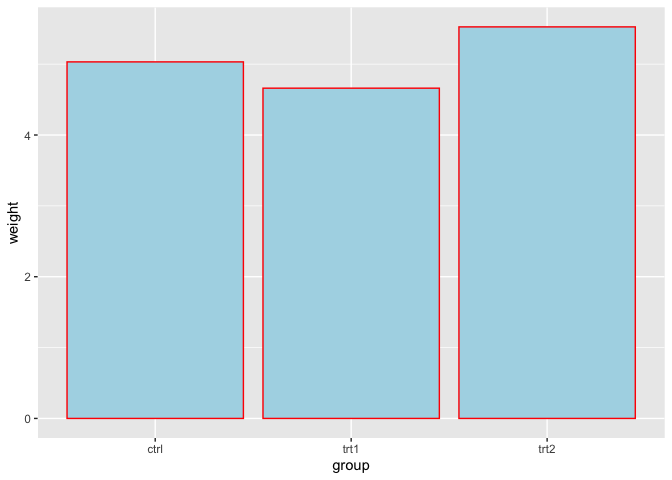<!-- -->

- 如果你想让条形图的高度对应于每组变量的频数，可参见3.3节的内容。

- 根据另一个变量值重排因子水平顺序的内容可参见15.9节。手动更改因子水平顺序的内容，可参见15.8节。

- 更多关于图形着色的内容，可参见第12章。

## 3.2 绘制簇状条形图

- 将分类变量映射到fill参数，并运行命令`geom_bar(position="dodge")`。

- 下面以cabbage_exp数据集为例演示一下绘图过程，cabbage_exp数据集包含两个分类变量Cultivar和Date及一个连续型变量Weight。

``` r
> library(gcookbook)#为了使用数据
> cabbage_exp
  Cultivar Date Weight        sd  n         se
1      c39  d16   3.18 0.9566144 10 0.30250803
2      c39  d20   2.80 0.2788867 10 0.08819171
3      c39  d21   2.74 0.9834181 10 0.31098410
4      c52  d16   2.26 0.4452215 10 0.14079141
5      c52  d20   3.11 0.7908505 10 0.25008887
6      c52  d21   1.47 0.2110819 10 0.06674995
```

- 我们分别将Date和Cultivar映射给x和fill，得到簇状条形图：

``` r
> ggplot(cabbage_exp,aes(x=Date,y=Weight,fill=Cultivar)) + 
+   geom_bar(position="dodge",stat="identity")
```

<!-- -->

- 最简单的条形图通常只对应一个绘制在x轴上的分类变量和一个绘制在y轴上的连续型变量。有时候，我们想额外添加一个分类变量跟x轴上的分类变量一起对数据进行分组。此时，可通过将该分类变量映射给fill参数来绘制簇状条形图，这里的fill参数用来指定条形的填充色。**在这一过程中必须令参数position=“dodge”以使得两组条形在水平方向上错开排列，否则，系统会输出堆积条形图（参见3.7节）**。

- 与映射给条形图x轴的变量类似，映射给条形填充色参数的变量应该是分类变量而不是连续型变量。我们可以通过将`geom_bar()`中的参数指定为colour=“black”为条形添加黑色边框线：可以通过`scale_fill_brewer()`或者`scale_fill_manual()`函数对图形颜色进行设置。在下图中，我们使用RColorBrewer包中的Pastel1调色盘对图形进行调色。

``` r
> ggplot(cabbage_exp, aes(x=Date, y=Weight, fill=Cultivar)) + 
+   geom_bar(position="dodge", stat="identity", colour="black") + 
+   scale_fill_brewer(palette="Pastel1")
```

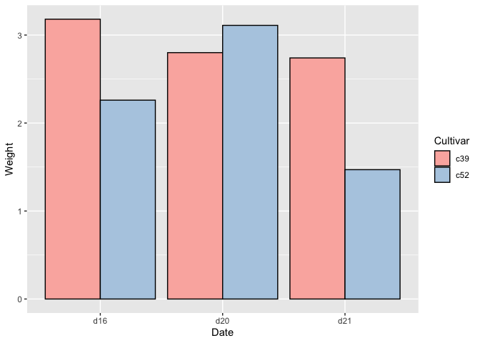<!-- -->

- 其他图形属性诸如颜色colour(指定条形图的边框线颜色)和线型(linestyle)也能用来对变量进行分组，不过，填充色(fill)也许是最合人心意的图形属性。

- \*\*注意，如果分类变量各水平的组合中有缺失项，那么，绘图结果中的条形则相应地略去不绘，同时，临近的条形将自动扩充到相应位置。删去上例数据中的最后一行后，可得到下图：

``` r
> #复制删除了最后一行的数据集      
> ce <- cabbage_exp[1:5,]
> ce
  Cultivar Date Weight        sd  n         se
1      c39  d16   3.18 0.9566144 10 0.30250803
2      c39  d20   2.80 0.2788867 10 0.08819171
3      c39  d21   2.74 0.9834181 10 0.31098410
4      c52  d16   2.26 0.4452215 10 0.14079141
5      c52  d20   3.11 0.7908505 10 0.25008887
```

``` r
> ggplot(ce, aes(x=Date, y=Weight, fill=Cultivar)) + 
+   geom_bar(position="dodge",stat="identity", colour="black") + 
+   scale_fill_brewer(palette="Pastel1")
```

<!-- -->

- 缺失条形的簇状条形图一临近的条形自动扩充到相应位置。

- 如果你的数据与上面类似，那么，你可以在分类变量组合缺失的那一项为变量y手动输入一个NA值。

- 更多关于条形图着色的内容，可参见3.4节。

- 根据另一个变量值重排因子水平顺序的内容可参见15.9节。

## 3.3 绘制频数条形图

- 使用`geom_bar()`函数，同时不要映射任何变量到y参数。

``` r
> ggplot(diamonds,aes(x=cut)) + geom_bar() # 等价于使用geom_bar(stat="bin")
```

<!-- -->

- diamonds数据集共有53940行数据，每行数据对应于一颗钻石的品质信息：

``` r
> head(diamonds)
# A tibble: 6 × 10
  carat cut       color clarity depth table price     x     y     z
  <dbl> <ord>     <ord> <ord>   <dbl> <dbl> <int> <dbl> <dbl> <dbl>
1  0.23 Ideal     E     SI2      61.5    55   326  3.95  3.98  2.43
2  0.21 Premium   E     SI1      59.8    61   326  3.89  3.84  2.31
3  0.23 Good      E     VS1      56.9    65   327  4.05  4.07  2.31
4  0.29 Premium   I     VS2      62.4    58   334  4.2   4.23  2.63
5  0.31 Good      J     SI2      63.3    58   335  4.34  4.35  2.75
6  0.24 Very Good J     VVS2     62.8    57   336  3.94  3.96  2.48
```

- `geom_bar()`函数在默认情况下将参数设定为stat=“bin”,该操作会自动计算每组（根据x轴上面的变量进行分组)变量对应的观测数。从上图中可以看到，切工精美的钻石大概有23000颗。

- 本例中，x轴对应的是离散型变量。当x轴对应于连续型变量时，我们会得到一张直方图：

``` r
> ggplot(diamonds,aes(x=carat)) + geom_bar()
```

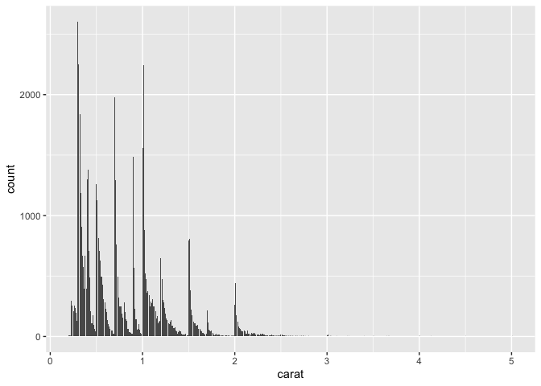<!-- -->

- 上图x轴对应于连续型变量的条形图，也即常说的直方图。

- 在这个例子中，使用`geom_bar()`和`geom_histogram()`具有相同的效果。

- 如果不想让`ggplot()`函数自动计算每组数据的行数绘制频数条形图，而是想通过数据框中的某列来指定y参数的话，可以参见3.1节的内容。

- 当然，也可以通过先计算出每组数据的行数，再将计算结果传递给`ggplot()`函数来绘制上图。更多关于数据描述的内容，可参见15.17节。

- 更多关于直方图的内容，可参见6.1节。

## 3.4 条形图着色

- 将合适的变量映射到填充色(fill)上即可。

- 这里以数据集uspopchange为例。该数据集描述了美国各州人口自2000年到2010年的变化情况。我们选取出人口增长最快的十个州进行绘图。图中会根据地区信息（东北部、南部、中北部、西部）对条形进行着色。

- 首先，选取出人口增长最快的十个州：

``` r
> library(gcookbook) # 为了使用数据
> upc <- subset(uspopchange,rank(Change)>40) 
> head(upc)
      State Abb Region Change
3   Arizona  AZ   West   24.6
6  Colorado  CO   West   16.9
10  Florida  FL  South   17.6
11  Georgia  GA  South   18.3
13    Idaho  ID   West   21.1
29   Nevada  NV   West   35.1
```

- 接下来，将Region映射到fill并绘制条形图：

``` r
> ggplot(upc,aes(x=Abb,y=Change,fill=Region))+geom_bar(stat="identity")
```

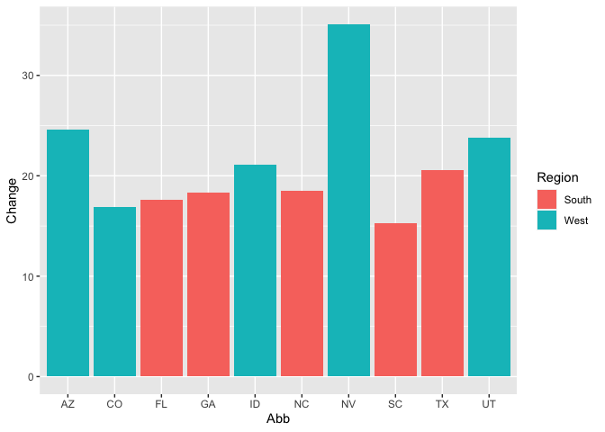<!-- -->

- 条形图的默认颜色不太吸引眼球，因此，可能需要借助函数`scale_fill_brewer()`或`scale_fill_manual()`重新设定图形颜色。这里我们调用后者。我们通过把参数指定为`colour="black"`将条形的边框线设定为黑色。**注意：颜色的映射设定是在`aes()`内部完成的，而颜色的重新设定是在`aes()`外部完成的**：

``` r
> ggplot(upc,aes(x=reorder(Abb,Change),y=Change,fill=Region)) + 
+   geom_bar(stat="identity",colour="black") + 
+   scale_fill_manual(values=c("#669933","#FFCC66")) + 
+   xlab("State")
```

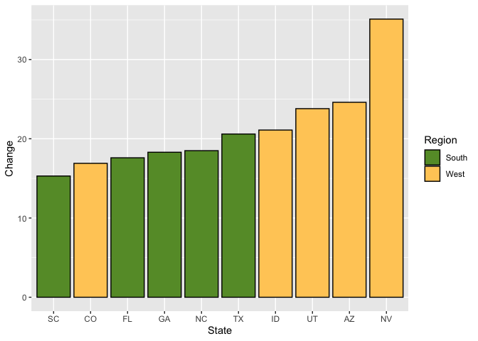<!-- -->

- 本例用到了`reorder()`函数。在本例中，根据条形图的高度进行排序比按照字母顺序对分类变量排序更有意义。

- 更多关于使用`reorder()`函数将因子根据另一个变量重新水平排序的内容，可参见15.9节。

- 更多关于图形着色的内容，参见第12章。

## 3.5 对正负条形图分别着色

- 下面以climate数据的一个子集为例。首先，创建一个对取值正负情况进行标示的变量pos：

``` r
> library(gcookbook) # 为了使用数据
> csub <- subset(climate,Source=="Berkeley"&Year>=1900)
> csub$pos <- csub$Anomaly10y>=0
> head(csub)
      Source Year Anomaly1y Anomaly5y Anomaly10y Unc10y   pos
101 Berkeley 1900        NA        NA     -0.171  0.108 FALSE
102 Berkeley 1901        NA        NA     -0.162  0.109 FALSE
103 Berkeley 1902        NA        NA     -0.177  0.108 FALSE
104 Berkeley 1903        NA        NA     -0.199  0.104 FALSE
105 Berkeley 1904        NA        NA     -0.223  0.105 FALSE
106 Berkeley 1905        NA        NA     -0.241  0.107 FALSE
```

- 上述过程准备完毕后，将pos映射给填充色参数(fill)并绘制条形图。**注意：这里条形图的参数设定为position=“identity”，可以避免系统因对负值绘制堆积条形而发出的警告信息**。

``` r
> ggplot(csub,aes(x=Year,y=Anomaly10y,fill=pos)) + 
+   geom_bar(stat="identity",position="identity")
```

<!-- -->

- 上面的绘图过程存在一些问题：

  - 1、首先，图形着色效果可能跟我们想要的相反，蓝色是冷色，通常对应于负值；红色是暖色，通常对应于正值。
  - 2、其次，图例显得多余且扰乱视觉。

- 我们可以通过`scale_fill_manual()`参数对图形颜色进行调整，设定参数`guide = "none"`可以删除图例，如下图所示。同时，我们通过设定边框颜色(colour)和边框线宽度(linewidth)为图形填加一个细黑色边框。其中，边框线宽度是用来控制边框线宽度的参数，单位是毫米：

- `It is now deprecated to specify guides(<scale> = FALSE) or scale_*(guide = FALSE) to remove a guide. Please use guides(<scale> = "none") or scale_*(guide = "none") instead.`

``` r
> ggplot(csub,aes(x=Year,y=Anomaly10y,fill=pos)) + 
+   geom_bar(stat="identity",position="identity",colour="black",linewidth=0.25) + 
+   scale_fill_manual(values=c("#CCEEFF","#FFDDDD"),guide = "none")
```

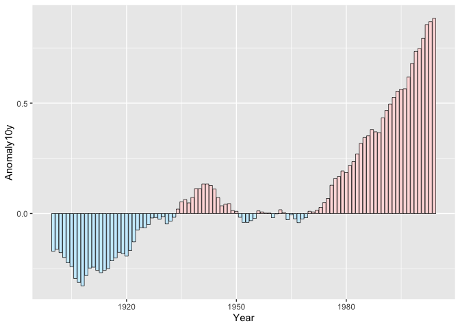<!-- -->

- 更多关于更改图形颜色的内容可参见12.3节和12.4节。

- 更多关于隐藏图例的内容可参见10.1节。

## 3.6 调整条形宽度和条形间距

- 通过设定`geom_bar()`函数的参数width可以使条形变得更宽或者更窄。该参数的默认值为0.9：更大的值将使绘制的条形更宽，反之则是更窄。例如：

``` r
> library(gcookbook) # 为了使用数据
> # 标准宽度的条形图
> ggplot(pg_mean,aes(x=group,y=weight)) + geom_bar(stat="identity")
```

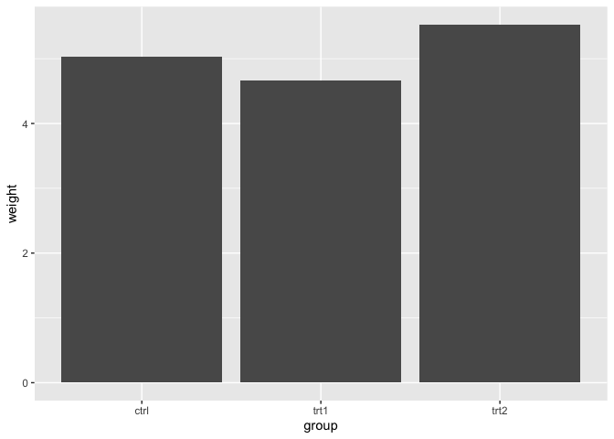<!-- -->

``` r
> # 窄些的条形图
> ggplot(pg_mean,aes(x=group,y=weight)) + geom_bar(stat="identity",width=0.5)
```

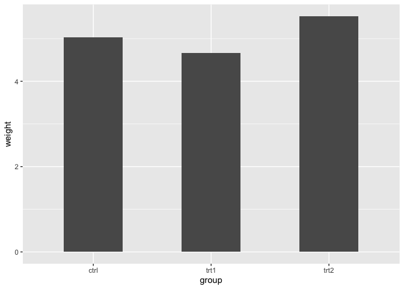<!-- -->

``` r
> # 宽些的条形图（条形图的最大宽度为1）
> ggplot(pg_mean,aes(x=group,y=weight)) + geom_bar(stat="identity",width=1)
```

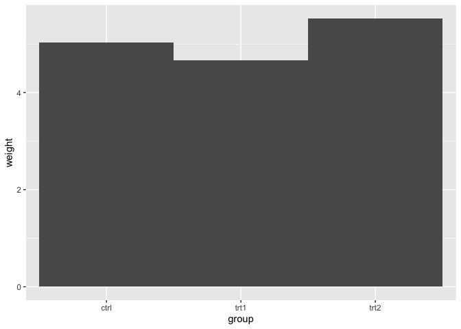<!-- -->

- 簇状条形图默认组内的条形间距为0。如果希望增加组内条形的间距，则可以通过将width设定得小一些，并令`position_dodge`的取值大于width：

``` r
> # 更窄的簇状条形图
> ggplot(cabbage_exp,aes(x=Date,y=Weight,fill=Cultivar)) + 
+   geom_bar(stat="identity",width=0.5,position="dodge")
```

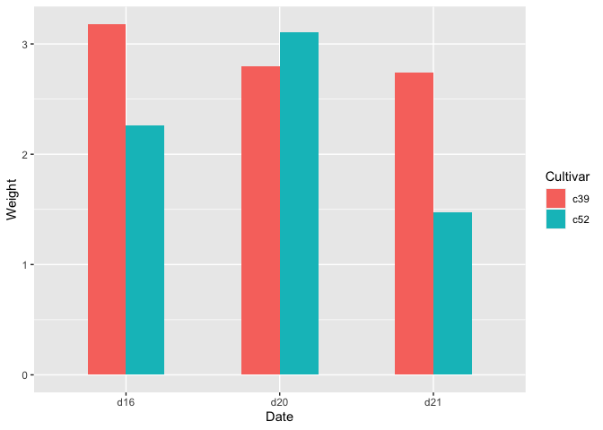<!-- -->

``` r
> # 添加条形组距
> ggplot(cabbage_exp,aes(x=Date,y=Weight,fill=Cultivar)) + 
+   geom_bar(stat="identity",width=0.5,position=position_dodge(0.7))
```

<!-- -->

- 第一幅图的绘图命令中用到了参数`position="dodge"`，第二幅图的绘图命令中用到的参数是`position=position_dodge()`。这是因为`position="dodge"`是参数默认为0.9的`position_dodge()`的简写。当我们需要单独指定该参数的时候，必须输入完整的命令。

- width参数的默认值是0.9，`position_dodge`函数中width参数的默认值也是0.9。更确切地说，`position_dodge`函数和`geom_bar()`函数中的width参数的取值是一样的。下面的四个命令是等价的：

``` r
> # geom_bar(position="dodge")
> # geom_bar(width=0.9,position=position_dodge()) 
> # geom_bar(position=position_dodge(0.9))
> # geom_bar(width=0.9,position=position_dodge(width=0.9))
```

- 条形图中，条形中心对应的x轴坐标分别是1、2、3等，但通常我们不会利用上这些数值。当用户运行命令geom_bar(width=0.9)时，每组条形将在x轴上占据0.9个单位宽度。运行命令position_dodge(width=0.9)时，ggplot2会自动调整条形位置，以使每个条形的中心恰好位于当每组条形宽度为0.9，且组内条形紧贴在一起时的位置，如下图所示。图中上下两部分都对应position_dodge(width=0.9)，只是上图对应于0.9的条形宽度，下图对应于0.2的条形宽度。虽然上下两部分对应的条形宽度不同，但两图的条形中心是上下对齐的。

``` r
> ggplot(cabbage_exp,aes(x=Date,y=Weight,fill=Cultivar)) + 
+   geom_bar(stat="identity",width=0.9,position="dodge")
```

<!-- -->

``` r
> ggplot(cabbage_exp,aes(x=Date,y=Weight,fill=Cultivar)) + 
+   geom_bar(stat="identity",width=0.2,position=position_dodge(0.7))
```

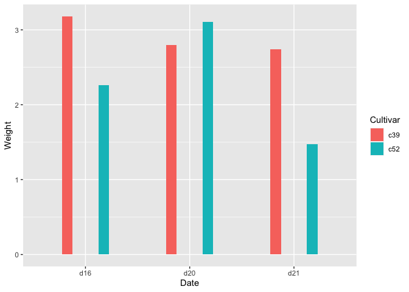<!-- -->

- 如果你将整幅图形进行伸缩，条形图也会依照相应的比例进行伸缩。要了解图形是怎样变化的，只需改变图形所在窗口的大小，然后，观察图形的变化即可。更多关于在输出图形文件时控制图片大小的内容可参见第14章。

## 3.7 绘制堆积条形图

- 使用`geom_bar()`函数，并映射一个变量给填充色参数(fill)即可。该命令会将Date对应到x轴上，并以Cultivar作为填充色。

``` r
> library(gcookbook) # 为了使用数据
> ggplot(cabbage_exp,aes(x=Date,y=Weight,fill=Cultivar)) + 
+   geom_bar(stat="identity")
```

<!-- -->

- 弄清楚图形对应的数据结构有助于理解图形的绘制过程。上例数据集中Date变量对应于三个水平、Cultivar变量对应于两个水平，两个变量不同水平的组合又分别与一个Weight变量相对应：

``` r
> cabbage_exp
  Cultivar Date Weight        sd  n         se
1      c39  d16   3.18 0.9566144 10 0.30250803
2      c39  d20   2.80 0.2788867 10 0.08819171
3      c39  d21   2.74 0.9834181 10 0.31098410
4      c52  d16   2.26 0.4452215 10 0.14079141
5      c52  d20   3.11 0.7908505 10 0.25008887
6      c52  d21   1.47 0.2110819 10 0.06674995
```

- 如果你想调整条形的堆叠顺序，可以通过指定`geom_bar()`中的参数`position = position_stack(reverse = TRUE)`来实现：

``` r
> library(ggplot2)
> library(gcookbook)
> ggplot(cabbage_exp,aes(x=Date,y=Weight,fill=Cultivar)) + 
+   geom_bar(stat="identity",position = position_stack(reverse = TRUE))
```

<!-- -->

- 假如条形的堆积顺序与图例顺序是相反的（上图）。我们可以通过`guides()`函数对图例顺序进行调整，并指定图例所对应的需要调整的图形属性，本例中对应的是填充色（fill)，如下图所示：

``` r
> ggplot(cabbage_exp,aes(x=Date,y=Weight,fill=Cultivar)) + 
+   geom_bar(stat="identity",position = position_stack(reverse = TRUE)) + 
+   guides(fill=guide_legend(reverse=TRUE))
```

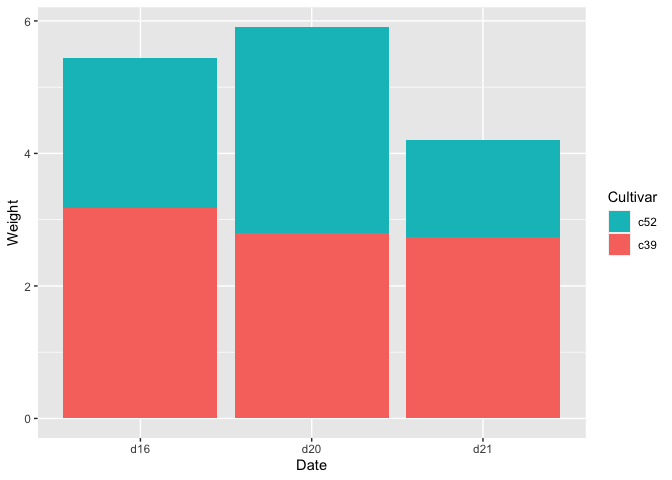<!-- -->

- **当然，也可以通过调整数据框中对应列的因子顺序来实现上述操作（参见15.8节），但需谨慎进行该操作，因为对数据进行修改可能导致其他分析结果也发生改变**。为了获得效果更好的条形图，我们保持逆序的图例顺序不变，同时，使用`scale_fill_brewer()`函数得到一个新的调色板，最后设定`colour="black"`为条形添加一个黑色边框线（如下图所示）：

``` r
> ggplot(cabbage_exp,aes(x=Date,y=Weight,fill=Cultivar)) + 
+   geom_bar(stat="identity",colour="black",position = position_stack(reverse = TRUE)) + 
+   guides(fill=guide_legend(reverse=TRUE)) + 
+   scale_fill_brewer(palette="Pastel1")
```

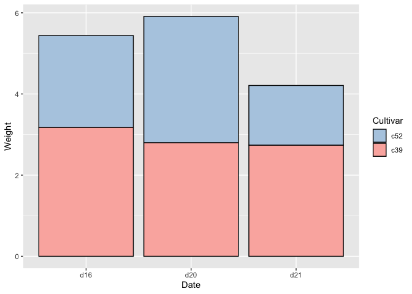<!-- -->

- 更多关于条形图着色的内容可参见3.4节。

- 将因子根据另一个变量重新排列水平顺序的内容可参见15.9节。手动更改因子水平顺序的内容，可参见15.8节。

## 3.8 绘制百分比堆积条形图

- 首先，通过plyr包中的`ddply()`函数和`transform()`函数将每组条形对应的数据标准化为100%格式，之后，针对计算得到的结果绘制堆积条形图即可，如下图所示：

``` r
> library(gcookbook) # 为了使用数据
> library(plyr)
> # 以Date为切割变量()对每组数据进行transform() 
> ce <- ddply(cabbage_exp,"Date",transform,
+             percent_weight=Weight/sum(Weight)*100)
> ggplot(ce,aes(x=Date,y=percent_weight,fill=Cultivar)) + 
+   geom_bar(stat="identity")
```

<!-- -->

- 我们用`ddply()`函数计算每组Date变量对应的百分比。本例中，`ddply()`函数根据指定的变量Date对数据框cabbage_exp进行分组，并对各组数据执行`transform()`函数(`ddply()`函数中设定的其他参数也会传递给该函数)。

- 下面是cabbage_exp数据，从中可以看出`ddply()`命令对其进行操作的过程。

``` r
> cabbage_exp
  Cultivar Date Weight        sd  n         se
1      c39  d16   3.18 0.9566144 10 0.30250803
2      c39  d20   2.80 0.2788867 10 0.08819171
3      c39  d21   2.74 0.9834181 10 0.31098410
4      c52  d16   2.26 0.4452215 10 0.14079141
5      c52  d20   3.11 0.7908505 10 0.25008887
6      c52  d21   1.47 0.2110819 10 0.06674995
```

``` r
> ce <- ddply(cabbage_exp,"Date",transform,
+             percent_weight=Weight/sum(Weight)*100)
> ce
  Cultivar Date Weight        sd  n         se percent_weight
1      c39  d16   3.18 0.9566144 10 0.30250803       58.45588
2      c52  d16   2.26 0.4452215 10 0.14079141       41.54412
3      c39  d20   2.80 0.2788867 10 0.08819171       47.37733
4      c52  d20   3.11 0.7908505 10 0.25008887       52.62267
5      c39  d21   2.74 0.9834181 10 0.31098410       65.08314
6      c52  d21   1.47 0.2110819 10 0.06674995       34.91686
```

- 计算出百分比之后，就可以按照绘制常规堆积条形图的方法来绘制百分比堆积条形图了。

- 跟常规堆积条形图一样，我们可以调整百分比堆积条形图的图例顺序、更换调色板及添加边框线，如下图所示：

``` r
> ggplot(ce, aes(x=Date, y=percent_weight, fill=Cultivar)) + 
+   geom_bar(stat='identity', colour='black',position = position_stack(reverse = TRUE)) + 
+   guides(fill=guide_legend(reverse=TRUE)) + 
+   scale_fill_brewer(palette='Pastel1')
```

<!-- -->

- 反转图例顺序，使用新调色板和黑色边线框的百分比堆积条形图.

- 更多关于分组对数据进行变换的内容可参见15.16节。

## 3.9 添加数据标签

- 在绘图命令中加上`geom_text()`即可为条形图添加数据标签。运行命令时，需要分别指定一个变量映射给×、y和标签本身。通过设定vjust(竖直调整数据标签位置)可以将标签位置移动至条形图顶端的上方或者下方：

``` r
> library(gcookbook) # 为了使用数据
> #在条形图顶端下方
> ggplot(cabbage_exp,aes(x=interaction(Date,Cultivar),y=Weight)) + 
+   geom_bar(stat="identity") + 
+   geom_text(aes(label=Weight),vjust=1.5,colour="white")
```

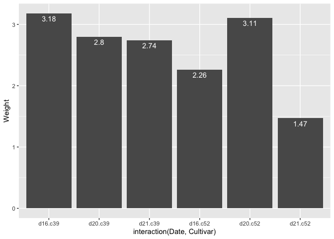<!-- -->

``` r
> # 在条形图顶端上方
> ggplot(cabbage_exp,aes(x=interaction(Date,Cultivar),y=Weight)) + 
+   geom_bar(stat="identity") + 
+   geom_text(aes(label=Weight),vjust=-0.2)
```

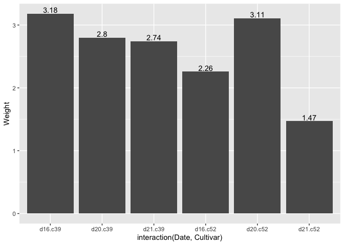<!-- -->

- **注意，当数据标签被置于条形图顶端时，它们可能会被遮挡。为了避免这个问题，可以参见8.2节的内容。**

- 在上图中，数据标签的y轴坐标位于每个条形的顶端中心位置：通过设定竖直调整(vjust)可以将数据标签置于条形图顶端的上方或者下方。**这种做法的不足之处在于当数据标签被置于条形图顶端上方时有可能使数据标签溢出绘图区域**。为了修正这个问题，我们可以手动设定y轴的范围，也可以保持竖直调整不变，而令数据标签的y轴坐标高于条形图顶端。后一种办法的不足之处在于，当你想将数据标签完全置于条形图顶端上方或者下方的时候，竖直方向调整的幅度依赖于y轴的数据范围：而更改vjust时，数据标签离条形顶端的距离会根据条形图的高度自动进行调整。

``` r
> #将y轴上限变大
> ggplot(cabbage_exp,aes(x=interaction(Date,Cultivar),y=Weight)) + 
+   geom_bar(stat="identity") + 
+   geom_text(aes(label="Weight"),vjust=-0.2) + 
+   ylim(0,max(cabbage_exp$Weight)*1.05)
```

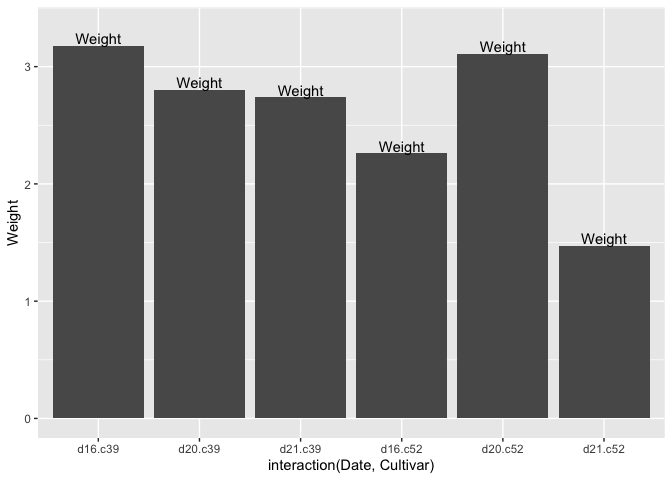<!-- -->

``` r
> #设定标签的y轴位置使其略高于条形图顶端----y轴范围会自动调整
> ggplot(cabbage_exp,aes(x=interaction(Date,Cultivar),y=Weight)) + 
+   geom_bar(stat="identity") + 
+   geom_text(aes(y=Weight+0.1,label=Weight))
```

<!-- -->

- 对于簇状条形图，需要设定`position=position_dodge()`并给其一个参数来设定分类间距。分类间距的默认值是0.9，因为簇状条形图的条形更窄，所以，需要使用字号(size)来缩小数据标签的字体大小以匹配条形宽度。数据标签的默认字号是5，这里我们将字号设定为3使其看起来更小。

``` r
> ggplot(cabbage_exp,aes(x=Date,y=Weight,fill=Cultivar)) + 
+   geom_bar(stat="identity",position="dodge") + 
+   geom_text(aes(label=Weight),vjust=1.5,colour="white", 
+             position=position_dodge(.9),size=3)
```

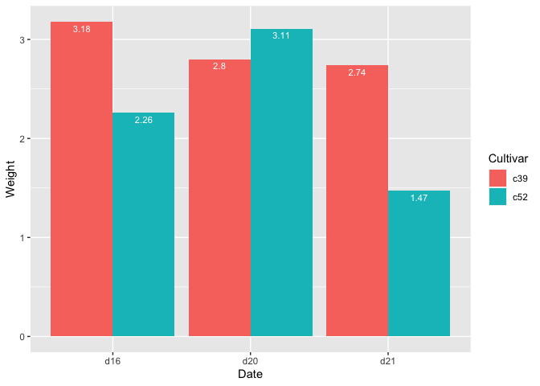<!-- -->

- 向堆积条形图添加数据标签之前，要先对每组条形对应的数据进行累积求和。**在进行本操作之前，须保证数据的合理排序，否则，可能计算出错误的累积和**。我们可以用plyr包中的`arrange()`函数完成上述操作，plyr包是一个随ggplot2包加载的软件包。确认数据合理排序之后，我们可以借助`ddply()`函数以Date为分组变量对数据进行分组，并分别计算每组数据对应的变量Weight的累积和。

``` r
> library(plyr)
> # 根据日期和性别对数据进行排序
> ce <- arrange(cabbage_exp,Date,Cultivar)
> # 计算累积和
> ce <- ddply(ce,"Date",transform,label_y=cumsum(Weight)) 
> ce
  Cultivar Date Weight        sd  n         se label_y
1      c39  d16   3.18 0.9566144 10 0.30250803    3.18
2      c52  d16   2.26 0.4452215 10 0.14079141    5.44
3      c39  d20   2.80 0.2788867 10 0.08819171    2.80
4      c52  d20   3.11 0.7908505 10 0.25008887    5.91
5      c39  d21   2.74 0.9834181 10 0.31098410    2.74
6      c52  d21   1.47 0.2110819 10 0.06674995    4.21
```

``` r
> ggplot(ce,aes(x=Date,y=Weight,fill=Cultivar)) + 
+   geom_bar(stat="identity",position = position_stack(reverse = TRUE)) + 
+   geom_text(aes(y=label_y,label=Weight),vjust=1.5,colour="white")
```

<!-- -->

- 如果想把数据标签置于条形中部，须对累计求和的结果加以调整，并同时略去`geom_bar()`函数中对y偏移量(offset)的设置：

``` r
> ce <- arrange(cabbage_exp,Date,Cultivar)
> # 计算y轴的位置，将数据标签置于条形中部
> ce <- ddply(ce,"Date",transform,label_y=cumsum(Weight)-0.5*Weight)
> ggplot(ce,aes(x=Date,y=Weight,fill=Cultivar)) + 
+   geom_bar(stat="identity",position = position_stack(reverse = TRUE)) + 
+   geom_text(aes(y=label_y,label=Weight),colour="White")
```

<!-- -->

- 为了得到效果更好的条形图，我们修改一下图例顺序和颜色，将数据标签置于条形中间，同时通过字号参数(size)缩小标签字号，并调用paste函数在标签后面添加“kg”，为了使得标签保留两位小数我们还需调用format函数：

``` r
> ggplot(ce,aes(x=Date,y=Weight,fill=Cultivar)) + 
+   geom_bar(stat="identity",colour="black",position = position_stack(reverse = TRUE)) + 
+   geom_text(aes(y=label_y,label=paste(format(Weight,nsmall=2),"kg")),size=4) + 
+   guides(fill=guide_legend(reverse=TRUE)) + 
+   scale_fill_brewer(palette="Pastel1")
```

<!-- -->

- 更多关于控制文本格式的内容可参见9.2节。

- 更多关于分组转换数据的内容可参见15.6节。

## 3.10 绘制Cleveland点图

- 有时人们会用Cleverland点图来替代条形图以减少图形造成的视觉混乱并使图形更具可读性。最简便的绘制Cleverland点图的方法是直接运行`geom_point()`命令：

``` r
> library(gcookbook) #为了使用数据
> tophit <- tophitters2001[1:25,] #取出tophitters数据集中的前25个数据
> ggplot(tophit,aes(x=avg,y=name)) + geom_point()
```

<!-- -->

- tophitters2001数据集包含很多列，这里我们只看其中前6列：

``` r
> tophit6 <- tophit[,c("name","lg","avg")]
> head(tophit6)
            name lg    avg
1   Larry Walker NL 0.3501
2  Ichiro Suzuki AL 0.3497
3   Jason Giambi AL 0.3423
4 Roberto Alomar AL 0.3357
5    Todd Helton NL 0.3356
6    Moises Alou NL 0.3314
```

- 上表中的名字是按字母先后顺序排列的，这种排列方式用处不大。通常，点图中会根据x轴对应的连续变量的大小取值对数据进行排序。

- 尽管tophit的行顺序恰好与avg的大小顺序一致，但这并不意味着在图中也是这样排序的。在点图的默认设置下，坐标轴上的变量通常会根据变量类型自动选取合适的排序方式。本例中变量name属于字符串类型，因此，点图根据字母先后顺序对其进行了排序。当变量是因子型变量时，点图会根据定义好的因子水平顺序对其进行排序。现在，我们想根据变量avg对变量name进行排序。

- 我们可以借助reorder(name,avg)函数实现这一过程。该命令会先将name转化为因子，然后，根据avg对其进行排序。为使图形效果更好，我们借助图形主题系统(Theming
  System)删除垂直网格线，并将水平网格线的线型修改为虚线：

``` r
> ggplot(tophit,aes(x=avg,y=reorder(name,avg))) + 
+   geom_point(size=3) + #使用更大的点
+   theme_bw() + 
+   theme(panel.grid.major.x=element_blank(),
+         panel.grid.minor.x=element_blank(),
+         panel.grid.major.y=element_line(colour="grey60",linetype="dashed"))
```

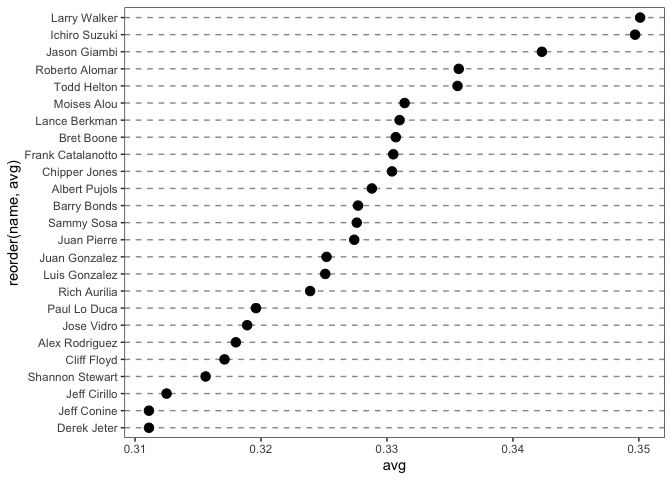<!-- -->

- 我们也可以将点图的x轴和y轴互换，互换后，x轴对应于姓名，y轴将对应于数值，如下图所示。我们也可以将数据标签旋转60”。

``` r
> ggplot(tophit, aes (x=reorder(name, avg), y=avg)) + 
+   geom_point(size=3) + # 使用更大的点
+   theme_bw() + 
+   theme(axis.text.x = element_text(angle=60, hjust=1),
+         panel.grid.major.y = element_blank(),
+         panel.grid.minor.y = element_blank(),
+         panel.grid.major.x = element_line(colour="grey60", linetype="dashed"))
```

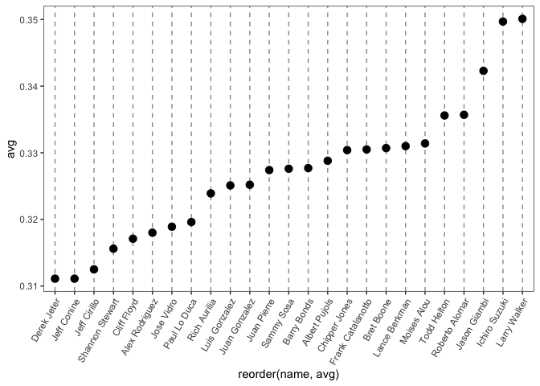<!-- -->

- 有时候，根据其他变量对样本进行分组很有用。这里我们根据因子lg对样本进行分组，因子lg对应有NL和AL两个水平，分别表示国家队(National
  League)和美国队 (American
  league)。我们依次根据lg和avg对变量进行排序。遗憾的是，`reorder()`函数只能根据一个变量对因子水平进行排序，所以我们只能手动实现上述过程。绘制点图时(见下图)，我们把lg变量映射到点的颜色属性上。借助`geom_segment()`函数用“以数据点为端点的线段”代替贯通全图的网格线。注意`geom_segment()`函数需要设定x、y、xend和yend四个参数：

``` r
> # 提取出name变量，依次根据变量lg和avg对其进行排序
> nameorder <- tophit$name[order(tophit$lg, tophit$avg)]
> #将name转化为因子，因子水平与nameorder一致
> tophit$name <- factor(tophit$name, levels=nameorder)
> ggplot(tophit, aes(x=avg, y=name)) + 
+   geom_segment(aes(yend=name), xend=0, colour="grey50") + 
+   geom_point(size=3, aes(colour=lg)) + 
+   scale_colour_brewer(palette="Set1", limits=c("NL","AL")) + 
+   theme_bw() + 
+   theme(panel.grid.major.y = element_blank(),  # 删除水平网格线
+         legend.position=c(1, 0.55),  # 将图例放置在绘图区域中
+         legend.justification=c(1, 0.5))
```

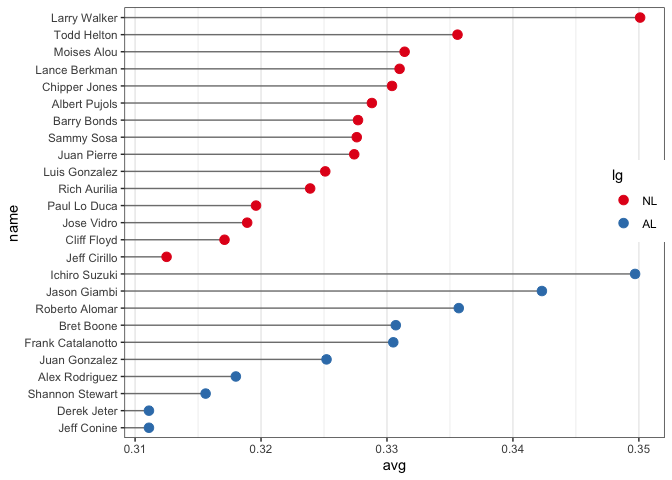<!-- -->

- 另外一种分组展示数据的方式是分面，如下图所示。分面条形图中的条形的堆叠顺序与上图中的堆叠顺序有所不同；要修改分面显示的堆叠顺序只有通过调整lg变量的因子水平来实现。

``` r
> ggplot(tophit, aes(x=avg, y=name)) + 
+   geom_segment(aes(yend=name), xend=0, colour="grey50") + 
+   geom_point(size=3, aes(colour=lg)) + 
+   scale_colour_brewer(palette="Set1", limits=c("NL","AL"), guide = "none") + 
+   theme_bw() + 
+   theme(panel.grid.major.y = element_blank()) + 
+   facet_grid(lg ~ ., scales="free_y", space="free_y")
```

<!-- -->

- 上图以队为分组变量进行分面绘图。

- 更多关于调整因子水平顺序的内容可参见15.8节。关于基于其他变量调整因子水平顺序的细节内容可参见15.9节。

- 更多关于调整图例位置的内容可参见10.2节。更多关于隐藏网格线的内容，可参见9.6节。
