chapter04_折线图
================

- <a href="#4-折线图" id="toc-4-折线图">4 折线图</a>
  - <a href="#41-绘制简单折线图" id="toc-41-绘制简单折线图">4.1
    绘制简单折线图</a>
  - <a href="#42-向折线图添加数据标记" id="toc-42-向折线图添加数据标记">4.2
    向折线图添加数据标记</a>
  - <a href="#43-绘制多重折线图" id="toc-43-绘制多重折线图">4.3
    绘制多重折线图</a>
  - <a href="#44-修改线条样式" id="toc-44-修改线条样式">4.4 修改线条样式</a>
  - <a href="#45-修改数据标记样式" id="toc-45-修改数据标记样式">4.5
    修改数据标记样式</a>
  - <a href="#46-绘制面积图" id="toc-46-绘制面积图">4.6 绘制面积图</a>
  - <a href="#47-绘制堆积面积图" id="toc-47-绘制堆积面积图">4.7
    绘制堆积面积图</a>
  - <a href="#48-绘制百分比堆积面积图" id="toc-48-绘制百分比堆积面积图">4.8
    绘制百分比堆积面积图</a>
  - <a href="#49-添加置信域" id="toc-49-添加置信域">4.9 添加置信域</a>

Source：

1.  《R数据可视化手册》，北京：人民邮电出版社，2014.5

# 4 折线图

- 本章中的大部分案例用到的都是连续型变量x，在其中一个案例中，我们会将连续型变量转化为因子型变量，因此，它也可以看作是一个针对离散型变量绘制折线图的例子。

## 4.1 绘制简单折线图

- 运行`ggplot()`和`geom_line()`函数，并分别指定一个变量映射给x和y(见下图)。

``` r
> library(ggplot2)
> ggplot(BOD, aes(x=Time, y=demand)) + 
+   geom_line()
```

<!-- -->

-对于这个简单的数据框，x对应的变量Time和y对应的变量demand分别对应于数据框的两列数据：

``` r
> BOD
  Time demand
1    1    8.3
2    2   10.3
3    3   19.0
4    4   16.0
5    5   15.6
6    7   19.8
```

- 折线图的x轴既可以对应于离散型(分类)变量，也可以对应于连续型(数值型)变量。

- 本例中Time变量为连续型变量，但我们可以借助`factor()`函数将其转化为因子型变量，然后，将其当作分类变量来处理(见下图)。当x对应于因子型变量时，必须使用命令`aes(group=1)`以确保`ggplot()`知道这些数据点属于同一个分组，从而应该用一条折线连在一起(关于为什么因子型变量必须设定group的内容可以参见4.3节)。

``` r
> BOD1 <- BOD #将数据复制一份
> BOD1$Time <- factor(BOD1$Time)
> ggplot(BOD1, aes(x=Time, y=demand, group=1)) + geom_line()
```

<!-- -->

- 上图是x轴对应于分类变量的简单折线图(注意x轴上没有对应于水平6的取值)。

- 数据集BOD中没有对应于Time=6的数据点，因此当Time被转化为因子型变量时，它并没有6这个水平。因子型变量对应于分类值，这里的6只是其中一个可能的取值。因为数据集中恰好没有对应于该水平的数据点，所以，x轴上没有绘制相应的取值。默认情况下，ggplot2绘制的折线图的y轴范围刚好能容纳数据集中的y值。对于某些数据而言，我们将y轴的起点设定为0点会更合适。你可以运行`ylim()`设定y轴范围或者运行含一个参数的`expand_limit()`扩展y轴的范围。下面的命令将y轴的范围设定为0到BOD中demand变量的最大值。

``` r
> ggplot(BOD, aes(x=Time, y=demand)) + 
+   geom_line() + 
+   ylim(0, max(BOD$demand)) 
```

<!-- -->

``` r
> # 运行下面的命令得到的结果是相同的
> ggplot(BOD, aes(x=Time, y=demand)) + 
+   geom_line() + 
+   expand_limits(y=0)
```

<!-- -->

## 4.2 向折线图添加数据标记

- 在代码中加上`geom_point()`：

``` r
> ggplot(BOD, aes(x=Time, y=demand)) + 
+   geom_line() + 
+   geom_point()
```

<!-- -->

- 有时候，在折线图上添加数据标记很有用处。当数据点的密度较低或者数据采集频率不规则时尤其有用。比如，BOD数据集中没有与Time=6相对应的输入，然而，这在单独的一张折线图看起来并不明显(可比较一下上两张图)。

- worldpop数据集对应的采集时间间隔不是常数。时间距今较久远的数据采集频率比新近不久的数据采集频率低。折线图中的数据标记表明了数据的采集时间(见下图)：

``` r
> library(gcookbook) # 为了使用数据
> ggplot(worldpop, aes(x=Year, y=Population)) + 
+   geom_line() + 
+   geom_point() 
```

<!-- -->

``` r
> # 当y轴取对数时也一样
> ggplot(worldpop, aes(x=Year, y=Population)) + 
+   geom_line() + 
+   geom_point() + 
+   scale_y_log10()
```

<!-- -->

- 从对y轴取对数的折线图上可以看出：在过去数千年中人口增长率有所增加。公元元年之前的人口增长率接近常数，约每5000年增加10倍。从图中也可以看出，近年来的人口普查频率比以往更为频繁，数据也更为准确。

- 更多关于修改数据标记样式的内容可参见4.5节。

## 4.3 绘制多重折线图

- 在分别设定一个映射给x和y的基础上，再将另外一个(离散型)变量映射给颜色(colour)或者线型(linetype)即可：

``` r
> # 载入plyr包，便于我们使用ddply()函数创建样本数据集
> library(plyr)
> # 对ToothGrowth数据集进行汇总
> tg <- ddply(ToothGrowth, c("supp", "dose"), summarise, length=mean(len))
> # 将supp映射给颜色(colour)
> ggplot(tg, aes(x=dose, y=length, colour=supp)) + geom_line()
```

<!-- -->

``` r
> # supp映射给线型(linetype)
> ggplot(tg, aes(x=dose, y=length, linetype=supp)) + geom_line()
```

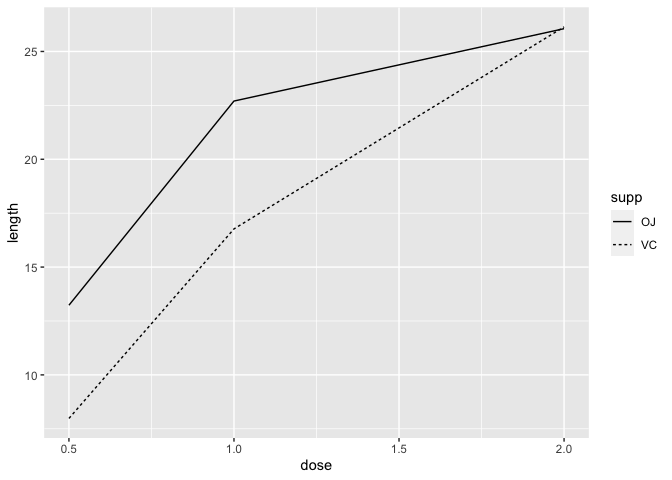<!-- -->

- tg数据集共有三列，其中一列是我们映射给颜色(colour)和线型(linetype)的supp变量：

``` r
> tg
  supp dose length
1   OJ  0.5  13.23
2   OJ  1.0  22.70
3   OJ  2.0  26.06
4   VC  0.5   7.98
5   VC  1.0  16.77
6   VC  2.0  26.14
> str(tg)
'data.frame':   6 obs. of  3 variables:
 $ supp  : Factor w/ 2 levels "OJ","VC": 1 1 1 2 2 2
 $ dose  : num  0.5 1 2 0.5 1 2
 $ length: num  13.23 22.7 26.06 7.98 16.77 ...
```

- **注意：如果x变量是因子，你必须同时告诉`ggplot()`用来分组的变量，正如接下来要介绍的那样。**

- 折线图的x轴既可以对应于连续型变量也可以对应于离散型变量。有时候，映射给x的变量虽然被存储为数值型变量，但被看作分类变量来处理。

- 本例中，dose变量有三个取值：0.5、1.0和2。或许你更想将其当作分类变量而不是连续型变量来处理，那么运行`factor()`函数将其转化为因子：

``` r
> ggplot(tg, aes(x=factor(dose), y=length, colour=supp, group=supp)) + 
+   geom_line()
```

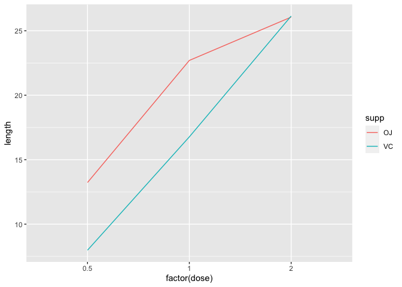<!-- -->

- **注意：不可缺少`group=supp`语句，否则，`ggplot()`会不知如何将数据组合在一起绘制折线图，从而会报错**：

``` r
> ggplot(tg, aes(x=factor(dose), y=length, colour=supp)) + 
+   geom_line()
```

<!-- -->

- 当分组不正确时会遇见的另一种问题是，折线图会变成锯齿状：

``` r
> ggplot(tg, aes(x=dose, y=length)) + 
+   geom_line()
```

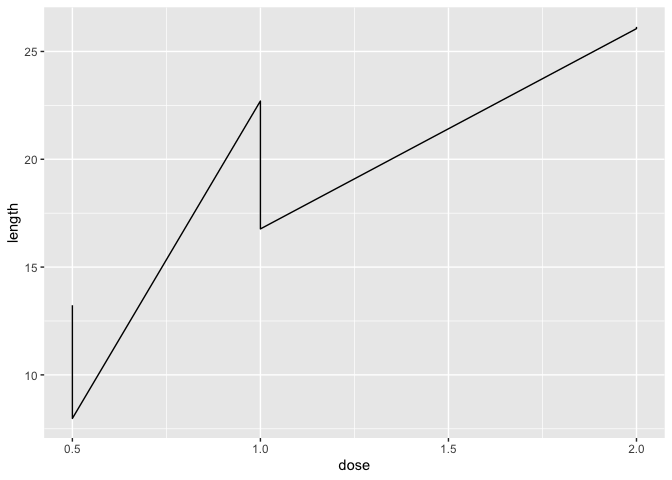<!-- -->

- 导致这种情况的原因在于x在每个位置都对应于多个点，`ggplot()`误以为这些点属于同一组数据而将其用一根折线相连，结果形成了锯齿状折线图。如果将任意离散型变量映射给colour或者linetype，`ggplot()`会以其为分组变量对数据进行分组。如果你想借助其他变量对数据进行分组(未映射给图形属性)则需使用group。

- \*\*注意：有疑问时，或者如果你的折线图看起来不太合理，可以试着用group明确指定分组变量。这种问题十分常见，因为`ggplot()`不知道如何对折线图数据进行分组。

- 如果折线图上有数据标记，你也可以将分组变量映射给数据标记的属性，诸如shape和fill等：

``` r
> ggplot(tg, aes(x=dose, y=length, shape=supp)) + 
+   geom_line() + 
+   geom_point(size=4) # 更大的点
```

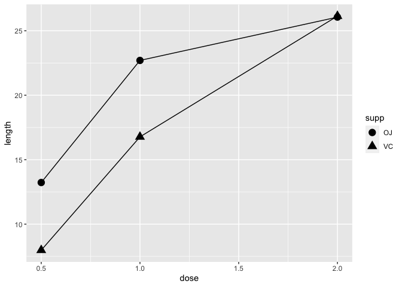<!-- -->

``` r
> ggplot(tg, aes(x=dose, y=length, fill=supp)) + 
+   geom_line() + 
+   geom_point(size=4, shape=21) # 使用有填充色的点
```

<!-- -->

- 有时，数据标记会相互重叠。我们需要令其彼此错开。这意味着要将它们的位置左移或者右移。同时，需要相应地左移或者右移连接线以避免点线偏离。在这一过程中，必须指定数据标记的移动距离：

``` r
> ggplot(tg, aes(x=dose, y=length, shape=supp)) + 
+   geom_line(position=position_dodge(0.2)) + # 将连接线左右移动 0.2 
+   geom_point(position=position_dodge (0.2), size=4) # 将点的位置左右移动 0.2
```

<!-- -->

## 4.4 修改线条样式

- 通过设置线型(linetype)、线宽()和颜色(colour)参数可以分别修改折线的线型、线宽和颜色。通过将这些参数的值传递给`geom_line()`函数可以设置折线图的对应属性：

``` r
> ggplot(BOD, aes(x=Time, y=demand)) + 
+   geom_line(linetype="dashed", linewidth=1, colour="blue")
```

<!-- -->

- 对于多重折线图而言，设定图形属性会对图上的所有折线产生影响。而将变量映射给图形属性则会使图上的折线具有不同的外观，参见4.3节。折线图的默认颜色并不是很吸引眼球，所以，我们可能希望使用其他调色板为图形着色，可以调用`scale_colour_brewer()`和`scale_colour_manual()`函数完成上述操作：

``` r
> # 加载plyr包，便于调用ddply()函数创建例子所需的数据集
> library(plyr)
> # 对ToothGrowth数据集进行汇总
> tg <- ddply(ToothGrowth, c("supp", "dose"), summarise, length=mean(len)) 
> ggplot(tg, aes(x=dose, y=length, colour=supp)) + 
+   geom_line() + 
+   scale_colour_brewer(palette="Set1")
```

<!-- -->

- 在`aes()`函数外部设定颜色(colour)会将所有折线设定为同样的颜色。其他图形属性诸如线宽(linewidth)、线型(linetype)和点形(shape)与此类似，如下图所示。操作过程中可能需要指定分组变量。

``` r
> # 如果两条折线的图形属性相同，需要指定一个分组变量
> ggplot(tg, aes(x=dose, y=length, group=supp)) + 
+   geom_line(colour="darkgreen", linewidth=1.5)
```

<!-- -->

``` r
> # 因为变量supp被映射给了颜色(colour)属性，所以，它自动作为分组变量 
> ggplot(tg, aes(x=dose, y=length, colour=supp)) + 
+   geom_line(linetype="dashed") + 
+   geom_point(shape=22, size=3, fill="white")
```

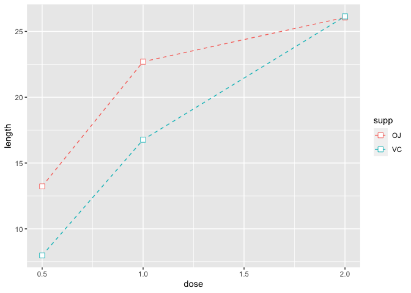<!-- -->

- 左图：单一颜色和宽度的折线图；右图：将变量supp映射给colour并添加数据标记的折线图。

- 更多关于使用颜色的内容可参见第12章。

## 4.5 修改数据标记样式

- 在函数`aes()`外部设定函数`geom_point()`的大小()、颜色(colour)
  和填充色(fill)即可。

``` r
> ggplot(BOD, aes (x=Time, y=demand)) + 
+   geom_line() + 
+   geom_point(size=4, shape=22, colour="darkred", fill="pink")
```

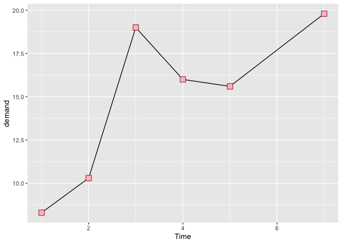<!-- -->

- 数据标记默认的形状(shape)是实线圆圈，默认的大小()是2，默认的颜色(colour)是黑色(black)。填充色(fill)
  属性只适用于某些(标号21-25)具有独立边框线和填充颜色的点形(参见5.3节中的点形列表)。fill一般取空值或者NA。将填充色设定为白色可以得到一个空心圆，如下图所示。

``` r
> ggplot(BOD, aes (x=Time, y=demand)) + 
+   geom_line() + 
+   geom_point(size=4, shape=21, fill="white")
```

<!-- -->

- 如果要将数据标记和折线设定为不同的颜色，我们必须在折线绘制完毕后再行设定数据标记的颜色，此时，数据标记被绘制在更上面的图层，从而，避免被折线遮盖。

- 从4.3
  节可知，通过在`aes()`函数内部将分组变量映射给数据标记的图形属性可以将多条折线设定为不同的颜色。数据标记的默认颜色并不吸引眼球，因而，你可能想要调用别的调色板，`scale_colour_brewer()`函数和`scale_colour manual()`函数可以完成上述操作。在`aes()`函数外部设定shape和可以将数据标记设定为统一的形状和颜色。

``` r
> # 载入plyr包，以使用ddply()函数创建例子所需数据集
> library(plyr)
> # 对ToothGrowth数据集进行汇总
> tg <- ddply(ToothGrowth, c("supp", "dose"), summarise, length=mean(len)) 
> 
> # 保存错开(dodge)设置，接下来会多次用到
> pd <- position_dodge(0.2)
> 
> ggplot(tg, aes(x=dose, y=length, fill=supp)) + 
+   geom_line(position=pd) + 
+   geom_point(shape=21, size=3, position=pd) + 
+   scale_fill_manual(values=c("black","white"))
```

<!-- -->

- 上图将填充色手动设定为黑白两色，并轻微调整数据标记的位置。

- 更多关于使用点形的内容可以参见5.3节，更多关于使用颜色的内容可参见本书第12章。

## 4.6 绘制面积图

- 运行`geom_area()`函数即可绘制面积图。

``` r
> # 将sunspot.year数据集转化为数据框，便于本例使用
> sunspotyear <- data.frame(
+   Year = as.numeric(time(sunspot.year)),
+   Sunspots = as.numeric(sunspot.year))
>   
> ggplot(sunspotyear, aes(x=Year, y=Sunspots)) + geom_area()
```

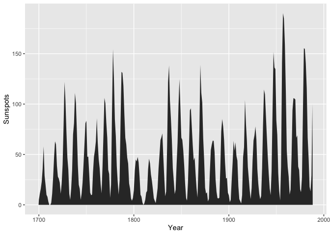<!-- -->

- 默认情况下，面积图的填充色为黑灰色且没有边框线，通过设定填充色(fill)可以修改面积图的填充色。接下来的例子中，我们将填充色设定为蓝色，并通过设定`alpha=0.2`将面积图的透明度设定为80%，此时，我们可以看到面积图的网格线，如下图所示。通过设置颜色(colour)可以为面积图添加边框线：

``` r
> ggplot(sunspotyear, aes (x=Year, y=Sunspots)) + 
+   geom_area(colour="black", fill="blue", alpha=.2)
```

<!-- -->

- 假如整个面积图添加边框线之后的效果并不十分令人满意，可能此时系统会在面积图的起点和终点位置分别绘制一套垂直线，且在底部绘制了一条横线。为了修正上述情况，可以先绘制不带边框线的面积图(不设定colour)，然后，添加新图层，并用`geom_line()`函数绘制轨迹线，如下图所示。

``` r
> ggplot(sunspotyear, aes(x=Year, y=Sunspots)) + 
+   geom_area(fill="blue", alpha=.2) + 
+   geom_line()
```

<!-- -->

- 更多关于使用颜色的内容可以参见第12章。

## 4.7 绘制堆积面积图

- 运行`geom_area()`函数，并映射一个因子型变量给填充色(fill)即可。

``` r
> library(gcookbook) #为了使用数据
> ggplot(uspopage, aes(x=Year, y=Thousands, fill=AgeGroup)) + 
+   geom_area()
```

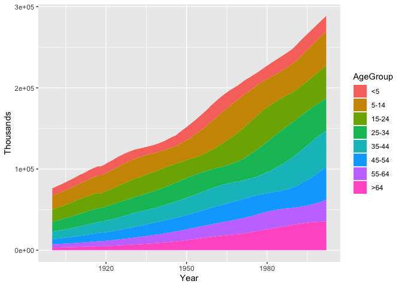<!-- -->

- 堆积面积图对应的基础数据通常为宽格式(wide
  format)，但ggplot2要求数据必须是长格式(long
  format)，在两种格式之间进行转换的内容可参见15.19节。

- 下面以uspopage数据集为例：

``` r
> uspopage6 <- uspopage
> head(uspopage6)
  Year AgeGroup Thousands
1 1900       <5      9181
2 1900     5-14     16966
3 1900    15-24     14951
4 1900    25-34     12161
5 1900    35-44      9273
6 1900    45-54      6437
```

- 默认情况下图例的堆积顺序与面积图的堆积顺序是相同的。将调色板设定为蓝色渐变色，并在各个区域之间添加细线(linewidth=.2)。同时我们将填充区域设定为半透明(alpha=.4)，这样可以透过填充区域看见网格线。

``` r
> ggplot(uspopage, aes(x=Year, y=Thousands, fill=AgeGroup)) + 
+   geom_area(colour="black", linewidth=.2, alpha=.4) + 
+   scale_fill_brewer(palette="Blues")
```

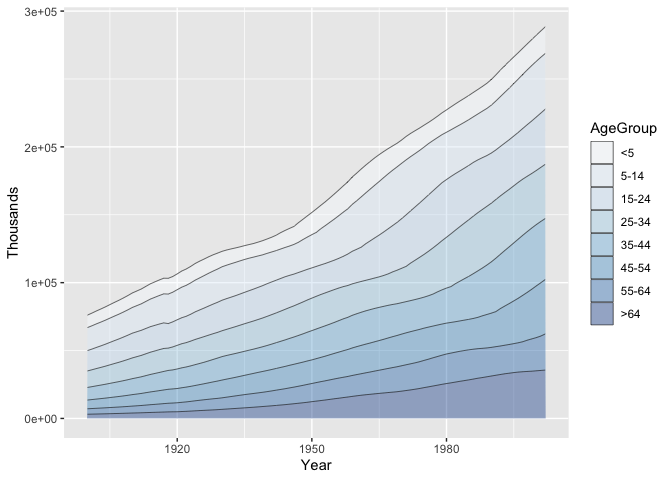<!-- -->

- 通过设定标度中的切分(breaks)参数可以翻转图例的堆积顺序。下图中的堆积面积图对图例的堆积顺序进行了反转。

``` r
> ggplot(uspopage, aes(x=Year, y=Thousands, fill=AgeGroup, order=desc(AgeGroup))) + 
+   geom_area(colour="black", linewidth=.2, alpha=.4) + 
+   scale_fill_brewer(palette="Blues", breaks=rev(levels(uspopage$AgeGroup)))
```

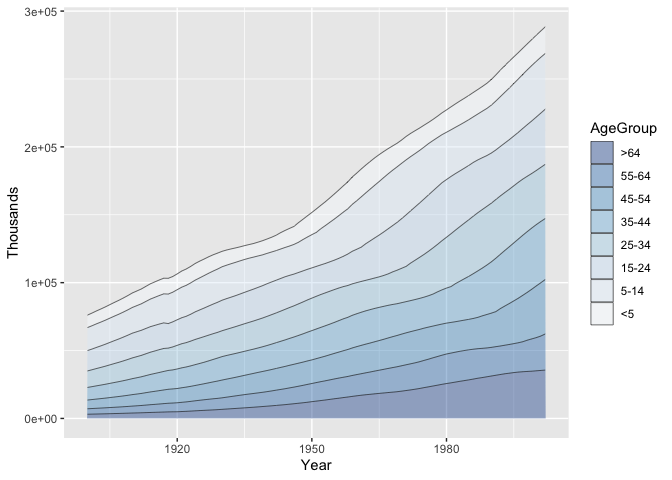<!-- -->

- 因为堆积面积图中的各个部分是由多边形构成的，假如其具有左、右边框线，那绘图效果差强人意且可能产生误导效果。为了对此进行修正，我们可以先绘制一个不带边框线的堆积面积图(将colour设定为默认的NA值)，然后，在其顶部添加`geom_line()`：

``` r
> ggplot(uspopage, aes(x=Year, y=Thousands, fill=AgeGroup)) + 
+   geom_area(colour=NA, alpha=.4) + 
+   scale_fill_brewer(palette="Blues") + 
+   geom_line(position="stack", linewidth=.2)
```

<!-- -->

- 更多关于宽格式与长格式相互转换的内容，可参见15.3节。

- 更多关于重排因子水平顺序的内容，可参见15.8节。

- 更多关于选择图形颜色的内容，可参见第12章。

## 4.8 绘制百分比堆积面积图

- 首先，计算各组对应的百分比。本例中，我们调用`ddply()`函数按变量Year对uspopage进行分组，然后计算一个新的列，命名为Percent。该列每一行的值等于对应的Thousands值除以变量Year对应的各个组内的Thousands之和再乘以100%。计算得出百分比之后，剩余的绘图步骤与绘制普通堆积面积图的步骤一样。

``` r
> library (gcookbook) # 为了使用数据
> library(plyr) # 为了使用ddply()函数
> # 将Thousands转化为Percent
> uspopage_prop <- ddply(uspopage, "Year", transform,
+                        Percent = Thousands / sum(Thousands)* 100)
> ggplot(uspopage_prop, aes(x=Year, y=Percent, fill=AgeGroup)) + 
+   geom_area(colour="black", linewidth=.2, alpha=.4) + 
+   scale_fill_brewer(palette="Blues")
```

<!-- -->

- 如需将图中的堆积面积图和图例的堆积顺序同时进行反转，则对代码做如下修改：

``` r
> ggplot(uspopage_prop, aes(x=Year, y=Percent, fill=AgeGroup)) + 
+   geom_area(colour="black", linewidth=.2, alpha=.4, position = position_stack(reverse = TRUE)) + 
+   scale_fill_brewer(palette="Blues", breaks=rev(levels(uspopage$AgeGroup)))
```

<!-- -->

- 让我们更深入查看上面的数据，并探究一下数据的计算过程：

``` r
> uspopage6 <- uspopage
> head(uspopage6)
  Year AgeGroup Thousands
1 1900       <5      9181
2 1900     5-14     16966
3 1900    15-24     14951
4 1900    25-34     12161
5 1900    35-44      9273
6 1900    45-54      6437
```

- 调用`ddply()`函数，按照变量Year将数据集拆分为多个独立的数据框，对所有数据框执行`transform()`函数并计算每个数据框对应的Percent。最后，调用`ddply()`函数将所有数据框重组在一起：

``` r
> uspopage_prop <- ddply(uspopage, "Year", transform,
+                        Percent = Thousands / sum(Thousands) * 100)
> head(uspopage_prop)
  Year AgeGroup Thousands   Percent
1 1900       <5      9181 12.065340
2 1900     5-14     16966 22.296107
3 1900    15-24     14951 19.648067
4 1900    25-34     12161 15.981549
5 1900    35-44      9273 12.186243
6 1900    45-54      6437  8.459274
```

- 更多关于分组计算数据的内容可参见15.17节。

## 4.9 添加置信域

- 运行`geom_ribbon()`，然后分别映射一个变量给ymin和ymax。

- climate数据集中的Anomaly10y变量表示了各年温度相对于1950-1980平均水平变异(以摄氏度衡量)的10年移动平均。变量Unc10y表示其95%置信水平下的置信区间。我们令ymax和ymin分别设定为Anomaly10y加减Unc10y：

``` r
> library(gcookbook)  # 为了使用数据
> # 抓取climate数据集的一个子集
> clim <- subset(climate, Source == "Berkeley",
+                select=c("Year", "Anomaly10y", "Unc10y"))
> head(clim)
  Year Anomaly10y Unc10y
1 1800     -0.435  0.505
2 1801     -0.453  0.493
3 1802     -0.460  0.486
4 1803     -0.493  0.489
5 1804     -0.536  0.483
6 1805     -0.541  0.475
> # 将置信域绘制为阴影
> ggplot(clim, aes(x=Year, y=Anomaly10y)) + 
+   geom_ribbon(aes(ymin=Anomaly10y-Unc10y, ymax=Anomaly10y+Unc10y),alpha=0.2) + 
+   geom_line()
```

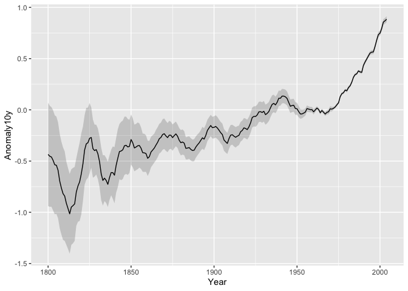<!-- -->

- 阴影部分的颜色实际上是黑灰色，但看起来几乎是透明的。这是因为我们通过设定alpha=0.2将阴影部分的透明度设定为80%。

- **注意，上面的绘图命令中`geom_ribbon()`函数的调用顺序在`geom_line()`函数之前，因而，折线被绘制在阴影区域上面的图层上。如果颠倒调用顺序的话，阴影区域的颜色有可能使折线模糊不清。在本例中，似乎这不成问题，这是因为本例中的阴影区域几乎是全透明的，但当阴影区域部分不透明时这个问题就很严重。**

- 除了使用阴影区域，我们还可以使用虚线来表示置信域的上下边界：

``` r
> # 使用虚线表示置信域的上下边界
> ggplot(clim, aes(x=Year, y=Anomaly10y)) + 
+   geom_line(aes(y=Anomaly10y-Unc10y), colour="grey50", linetype="dotted") + 
+   geom_line(aes(y=Anomaly10y+Unc10y), colour="grey50", linetype="dotted") + 
+   geom_line()
```

<!-- -->

- 除了表示置信域之外，阴影区域还可以用来表示其他内容，比如两个变量之间的差值等。在4.7节中的面积图中，阴影区域的y轴范围是0到y，而上图中y轴的范围是ymin到ymax。
