chapter05_散点图
================

- <a href="#5-散点图" id="toc-5-散点图">5 散点图</a>
  - <a href="#51-绘制基本散点图" id="toc-51-绘制基本散点图">5.1
    绘制基本散点图</a>
  - <a href="#52-使用点形和颜色属性并基于某变量对数据进行分组"
    id="toc-52-使用点形和颜色属性并基于某变量对数据进行分组">5.2
    使用点形和颜色属性，并基于某变量对数据进行分组</a>
  - <a href="#53-使用不同于默认设置的点形"
    id="toc-53-使用不同于默认设置的点形">5.3 使用不同于默认设置的点形</a>
  - <a href="#54-将连续型变量映射到点的颜色或大小属性上"
    id="toc-54-将连续型变量映射到点的颜色或大小属性上">5.4
    将连续型变量映射到点的颜色或大小属性上</a>
  - <a href="#55-处理图形重叠" id="toc-55-处理图形重叠">5.5 处理图形重叠</a>
  - <a href="#56-添加回归模型拟合线" id="toc-56-添加回归模型拟合线">5.6
    添加回归模型拟合线</a>
  - <a href="#57-根据已有模型向散点图添加拟合线"
    id="toc-57-根据已有模型向散点图添加拟合线">5.7
    根据已有模型向散点图添加拟合线</a>
  - <a href="#58-添加来自多个模型的拟合线"
    id="toc-58-添加来自多个模型的拟合线">5.8 添加来自多个模型的拟合线</a>
  - <a href="#59-向散点图添加模型系数" id="toc-59-向散点图添加模型系数">5.9
    向散点图添加模型系数</a>
  - <a href="#510-向散点图添加边际地毯"
    id="toc-510-向散点图添加边际地毯">5.10 向散点图添加边际地毯</a>
  - <a href="#511-向散点图添加标签" id="toc-511-向散点图添加标签">5.11
    向散点图添加标签</a>
  - <a href="#512-绘制气泡图" id="toc-512-绘制气泡图">5.12 绘制气泡图</a>
  - <a href="#513-绘制散点图矩阵问题" id="toc-513-绘制散点图矩阵问题">5.13
    绘制散点图矩阵问题</a>

Source：

1.  《R数据可视化手册》，北京：人民邮电出版社，2014.5

# 5 散点图

- 散点图通常用来刻画两个连续型变量之间的关系。绘制散点图时，数据集中的每一个观测值都由散点图中的一个点来表示。通常，人们还会向散点图中添加一些直线，以用来表示基于某些统计模型的预测值。当散点图中的数据趋势难以用肉眼识别时，这些直线对我们理解数据的特征很有帮助。上述这些操作在R和ggplot2中都是很容易做到的。当数据集很大时，散点图上的数据点会相互重叠，此时，很难在图上清楚地显示出所有的数据点。这时候，我们可以先对数据进行加工，再绘制散点图。

## 5.1 绘制基本散点图

- 运行`geom_point()`函数，分别映射一个变量到x和y。

- heightweight是个多列数据集，接下来的例子我们只用到其中两列。

``` r
> library(ggplot2)
> library(gcookbook) # 为了使用数据
> # 列出我们用到的列
> heightweight6 <- heightweight[, c("ageYear", "heightIn")]
> head(heightweight6)
  ageYear heightIn
1   11.92     56.3
2   12.92     62.3
3   12.75     63.3
4   13.42     59.0
5   15.92     62.5
6   14.25     62.5
> ggplot(heightweight, aes(x=ageYear, y=heightIn)) + 
+   geom_point()
```

<!-- -->

- 通过设定点形(shape)参数可以在散点图中绘制默认值以外的点形。比如，我们常用空心圈(点形21)代替实心圆(点形16)：

``` r
> ggplot(heightweight, aes(x=ageYear, y=heightIn)) + 
+   geom_point(shape=21)
```

<!-- -->

- 大小(size)参数可以控制图中点的大小。系统默认的大小(size)值等于2，下面我们将其设定为size=1.5，以得到更小的数据点：

``` r
> ggplot(heightweight, aes(x=ageYear, y=heightIn)) + 
+   geom_point(size=1.5)
```

<!-- -->

## 5.2 使用点形和颜色属性，并基于某变量对数据进行分组

- 将分组变量映射给点形(shape)和颜色(colour)属性。heightweight是个多列数据集，接下来的例子中，我们只用其中三列，通过将变量sex映射给colour或shape，我们可以按变量sex对数据点进行分组：

``` r
> library(gcookbook) # 为了使用数据
> #列出要用的三个列
> heightweight6 <- heightweight[, c("sex", "ageYear", "heightIn")]
> head(heightweight6)
  sex ageYear heightIn
1   f   11.92     56.3
2   f   12.92     62.3
3   f   12.75     63.3
4   f   13.42     59.0
5   f   15.92     62.5
6   f   14.25     62.5
> ggplot(heightweight, aes(x=ageYear, y=heightIn, colour=sex)) + 
+   geom_point() 
```

<!-- -->

``` r
> ggplot(heightweight, aes(x=ageYear, y=heightIn, shape=sex)) + 
+   geom_point()
```

<!-- -->

- 左图：按映射colour的变量对数据进行分组；右图：按映射给shape的变量对数据进行分组。

- 分组变量必须是分类变量，换言之，它必须是因子型或者字符串型的向量。如果分组变量以数值型变量进行存储，则需要将它转化为因子型变量之后，才能以其作为分组变量。可以将一个变量同时映射给shape和colour属性。当有多个分组变量时，可以将它们分别映射给这两个图形属性。下面，我们把sex变量同时映射给shape和colour属性：

``` r
> ggplot(heightweight, aes(x=ageYear, y=heightIn, shape=sex, colour=sex)) + 
+   geom_point()
```

<!-- -->

- 散点图默认的点形和颜色可能不是很吸引人，通过调用`scale_shape_manual()`函数可以使用其他点形；调用`scale_colour_brewer()`或者`scale_colour_manual()`函数可以使用其他调色板，系统会根据分组变量将分属各组的数据点设置为不同的点形和颜色。

``` r
> ggplot(heightweight, aes(x=ageYear, y=heightIn, shape=sex, colour=sex)) + 
+   geom_point() + 
+   scale_shape_manual(values=c(1,2)) + 
+   scale_colour_brewer(palette="Set1")
```

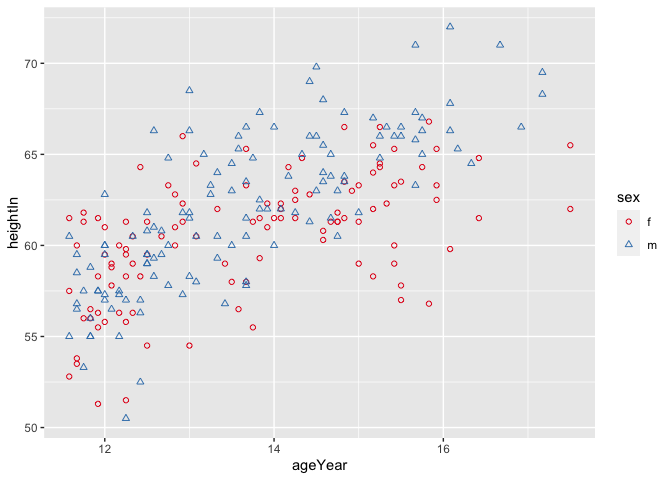<!-- -->

- 要使用不同于默认设置的点形，可参见5.3节的内容。要使用不同的绘图颜色，可参见第12章的内容。

## 5.3 使用不同于默认设置的点形

- 通过指定`geom_point()`函数中的点形(shape)参数可以设定散点图中所有数据点的点形：

``` r
> library(gcookbook) # 为了使用数据
> ggplot(heightweight, aes(x=ageYear, y=heightIn)) + 
+   geom_point(shape=3)
```

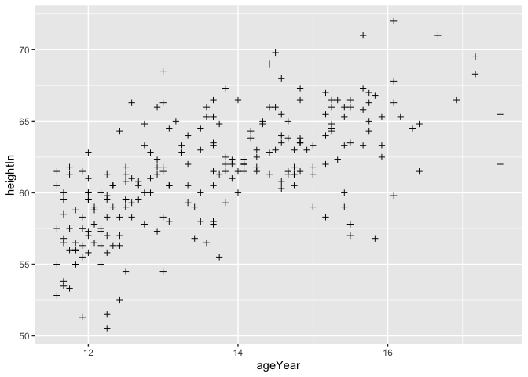<!-- -->

- 如果已将分组变量映射给shape，则可以调用`scale_shape_manual()`函数来修改点形：

``` r
> # 使用略大且自定义点形的数据点
> ggplot(heightweight, aes(x=ageYear, y=heightIn, shape=sex)) + 
+   geom_point(size=3) + 
+   scale_shape_manual(values=c(1, 4))
```

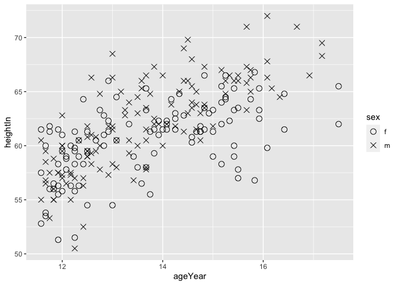<!-- -->

- 下图显示了R绘图中可调用的点形。其中一些点形只有边框线，一些只有实心区域，还有一些则是由可分离的边框线和具有填充色的实心区域共同组成(我们也可以用字符作点形)。

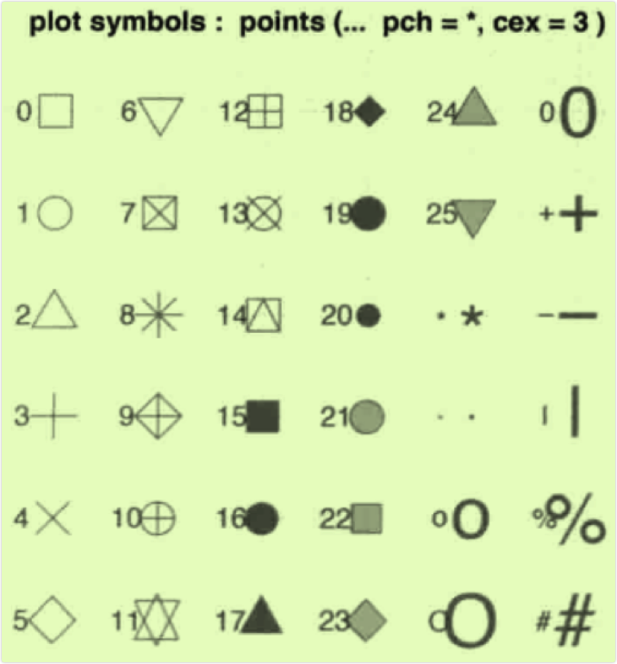

- 点形1-20的点的颜色，包括实心区域的颜色都可由colour参数来控制。对于点形21-25而言，边框线和实心区域的颜色则分别由colour和fill参数来控制。

- 我们可以用点形和填充色(空心或实心)属性分别表示两个不同的变量。但这一过程不太直接，我们要选择一个同时具有colour和fill属性的点形及一个包括NA和其他颜色的调色板(NA会生成一个空心的形状)。

- 下面以heightweight数据集为例，同时在数据集中增加一个用来标识儿童体重是否超过100磅的列：

``` r
> # 生成一个数据副本
> hw <- heightweight
> # 将数据按照是否大于100磅分为两组
> hw$weightGroup <- cut(hw$weightLb, breaks=c(-Inf, 100, Inf),
+                       labels=c("< 100", ">= 100"))
> # 使用具有颜色和填充色的点形及对应于空值(NA)和填充色的颜色
> ggplot(hw, aes(x=ageYear, y=heightIn, shape=sex, fill=weightGroup)) + 
+   geom_point(size=2.5) + 
+   scale_shape_manual(values=c(21, 24)) + 
+   scale_fill_manual(values=c(NA, "black"),
+                     guide=guide_legend(override.aes=list(shape=21)))
```

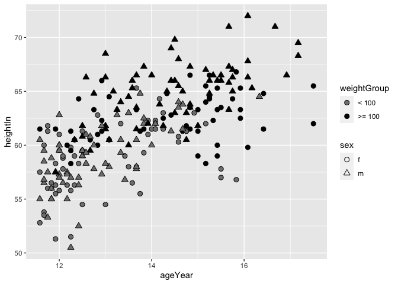<!-- -->

- 更多关于使用不同颜色的内容，可参见第12章。

- 更多关于将连续型变量重编码为分组变量的内容，可参见15.14节。

## 5.4 将连续型变量映射到点的颜色或大小属性上

- 将连续型变量映射到size或colour属性上即可。heigthweight数据集有很多列，下面的例子中只用其中四列，5.1节中的散点图刻画了两个连续型变量ageYear和heightIn的关系。如果想要表示第三个连续型变量WeightLb，必须将其映射给其他的图形属性，例如，colour和size。

``` r
> library(ggplot2)
> library (gcookbook) # 为了使用数据
> # 列出要用到的四列
> heightweight6 <- heightweight[, c("sex", "ageYear", "heightIn", "weightLb")]
> head(heightweight6)
  sex ageYear heightIn weightLb
1   f   11.92     56.3     85.0
2   f   12.92     62.3    105.0
3   f   12.75     63.3    108.0
4   f   13.42     59.0     92.0
5   f   15.92     62.5    112.5
6   f   14.25     62.5    112.0
> ggplot(heightweight, aes(x=ageYear, y=heightIn, colour=weightLb)) + 
+   geom_point() 
```

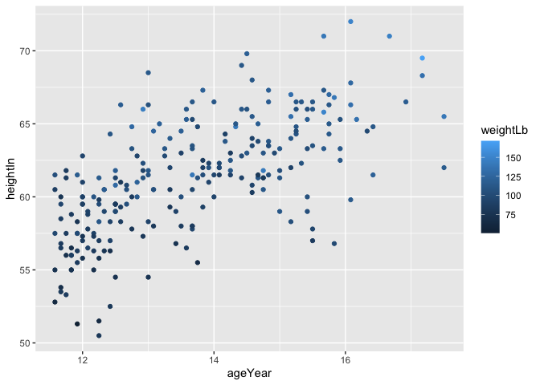<!-- -->

``` r
> ggplot(heightweight, aes(x=ageYear, y=heightIn, size=weightLb)) + 
+   geom_point()
```

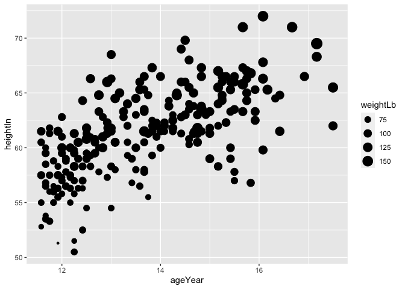<!-- -->

- 基本散点图通过将两个连续型变量分别映射给x轴和y轴来刻画它们之间的关系。当变量超过两个时，我们必须将它们映射到其他图形属性上，如数据点的大小和颜色。

- 人类对于感知空间位置的微小变化很擅长，因此，我们可以以较高的精度解释被映射到x轴和y轴上的变量。但我们对于图形颜色和大小的变化不太敏锐，所以，我们只能以较低的精度对映射到这些属性上的变量进行解释。**因此，只有当一个变量不需要高精度的解释时，它才适合被映射给图形的大小和颜色属性**。

- 当将变量映射给大小(size)属性时，绘制的图形结果常常具有误导性。比如在上图中，最大点对应的面积是最小点所对应面积的36倍，然而，前者对应的变量值仅为后者的3.5倍。如果点的大小正比于变量值对于图形展示很重要的话，则可以修改一下数据点大小的变化范围。默认情况下，点的大小为1<sub>6ms。运行`scale_size_continuous(range=c(2,5))`可以将其修改为2</sub>5ms。然而，由于点的大小与点的直径或者面积是非线性映射，所以，这个表示值依然不精确(使点的面积与变量值成正比的相关细节，可以参见5.12节的内容)。

- 对于颜色，实际上有两个相关的图形属性可以使用，即colour和fill。对于大多数点形，我们都是通过colour属性设定颜色。然而，点形21-25除了实心区域还有边框线，此时实心区域的颜色由fill来控制。当数据点颜色较浅时，带边框线的点形就显得非常有用，因为此时边框线可以将数据点与背景色区分开，如下图所示。本例中将色阶设定为由黑至白，同时增加数据点的大小，以便于看出填充色。

``` r
> ggplot(heightweight, aes(x=ageYear, y=heightIn, fill=weightLb)) + 
+   geom_point(shape=21, size=2.5) + 
+   scale_fill_gradient(low="black", high="white")
```

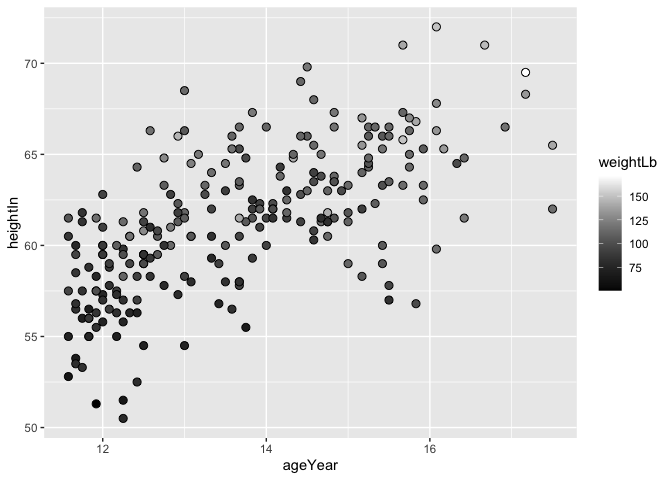<!-- -->

``` r
> # 使用guide_legend()函数以离散的图例代替色阶
> ggplot(heightweight, aes (x=ageYear, y=heightIn, fill=weightLb)) + 
+   geom_point(shape=21, size=2.5) + 
+   scale_fill_gradient(low="black", high="white", breaks=seq(70,170,by=20),
+                       guide=guide_legend())
```

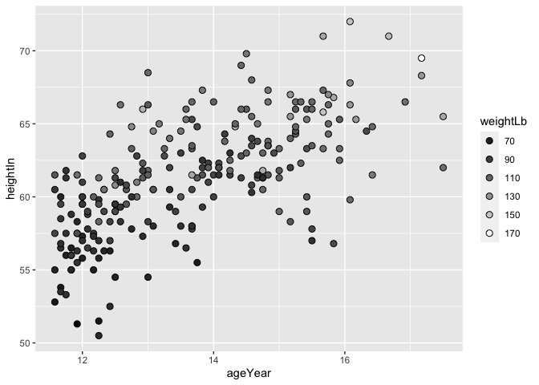<!-- -->

- 当我们把一个连续型变量映射给某个图形属性之后，这并不妨碍我们同时将分类变量映射给其他图形属性。下图中，我们将变量weightLb映射给点size属性，同时将变量sex映射给colour属性。图形中有很多重合的数据点，因此，我们设定alpha=.5将数据点设定为半透明。调用`scale_size_area()`函数使数据点的面积正比于变量值(参见5.12节)，同时，修改调色板使图形更吸引眼球：

``` r
> ggplot(heightweight, aes(x=ageYear, y=heightIn, size=weightLb, colour=sex)) + 
+   geom_point(alpha=.5) + 
+   scale_size_area() +  # 使数据点面积正比于变量值
+   scale_colour_brewer(palette="Set1")
```

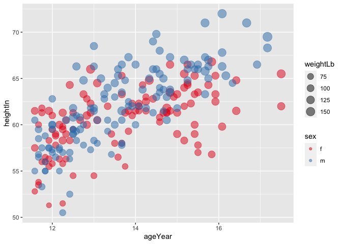<!-- -->

- 将某个变量映射给size属性时，最好避免将其他变量映射给shape属性。因为不同点形的点大小很难相互比较。比如，大小为4的三角形看起来比大小为3.5的圆形更小。同时，有些形状本身就具有不同的大小：点形16和点形19都是圆形，但无论点大小设定为多少，点形19的圆总是比点形16的圆看起来更大。

- 使用与默认设置不同的颜色，可参考12.6节的内容。

- 关于创建气泡图的内容可参见5.12节。

## 5.5 处理图形重叠

- 针对大数据集绘制散点图时，图中各个数据点会彼此遮盖，从而妨碍我们准确地评估数据的分布信息，这就是所谓的图形重叠(overplotting)。如果图形的重叠程度较低，我们可以通过使用较小的数据点或者使用不会遮盖其他数据点的点形(例如1号的空心圆)来避免数据重叠。5.1节中的图就对这两种解决方案都进行了演示。

- 如果图形的重叠程度较高，下面是一系列可行的解决方案：

  - 使用半透明的点；
  - 将数据分箱(bin)，并用矩形表示(适用于量化分析)；
  - 将数据分箱(bin)，并用六边形表示；
  - 使用箱线图。

- 下图中包含54000个数据点，各个数据点重叠严重，我们很难看清楚图中不同区域的数据点的相对密度：

``` r
> sp <- ggplot(diamonds, aes(x=carat, y=price))
> sp + geom_point()
```

<!-- -->

- 设定alpha参数可以使数据点半透明，如下图所示。通过设定alpha=.1和alpha=.01使数据点分别具有90%和99%的透明度：

``` r
> sp + geom_point(alpha=.1)
```

<!-- -->

``` r
> sp + geom_point(alpha=.01)
```

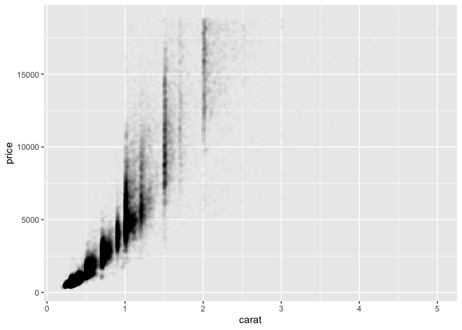<!-- -->

- 图中，变量carat的取值为整数和“0.5”的地方有很多垂直带，这意味着人们常按照这些尺寸切割钻石。不过，由于图中数据点过于致密，即使在数据点透明度为99%的情况下，图上的大部分区域依然显示为实心的黑色，且数据点的分布情况依然相当模糊。

- **对于大多数图形，在输出为矢量(如PDF、EPS和SVG)文件时比位图文件(如TIFF和PNG)要小。然而，在数据点非常多时，输出的矢量文件会非常大且渲染过程很慢，这里的具有99%透明度的散点图的大小是1.5MB！在这种情况下，高精度的位图文件会更小，且在电脑屏幕上的显示速度更快。更多信息可参见第14章。**

- 另外一个解决方案是将数据点分箱(bin)并以矩形来表示，同时将数据点的密度映射为矩形的填充色，在分箱绘图情况下，垂直带几乎看不见了。在下图中，左下方的数据点密度更大，这意味着大多数钻石都是比较小且廉价的。默认情况下，`stat_bin_2d()`函数分别在x轴和y轴方向上将数据分割为30个组，总计900个箱子。在第二个版本中，我们将箱数设定为bin=50。

``` r
> sp + stat_bin2d()
```

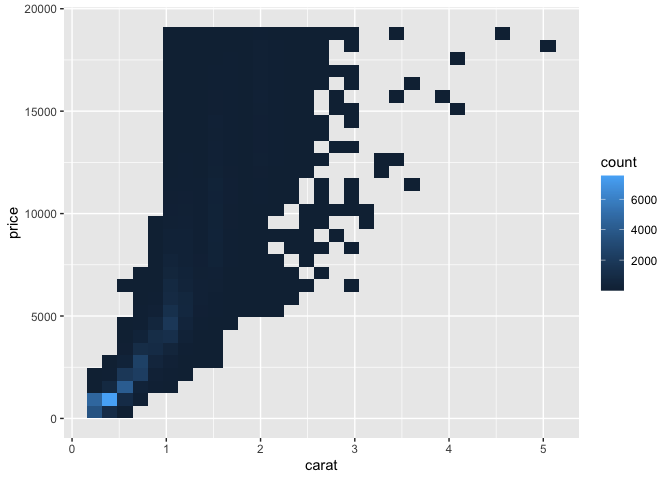<!-- -->

``` r
> sp + stat_bin2d(bins=50) + 
+   scale_fill_gradient(low="lightblue", high="red", limits=c(0, 6000))
```

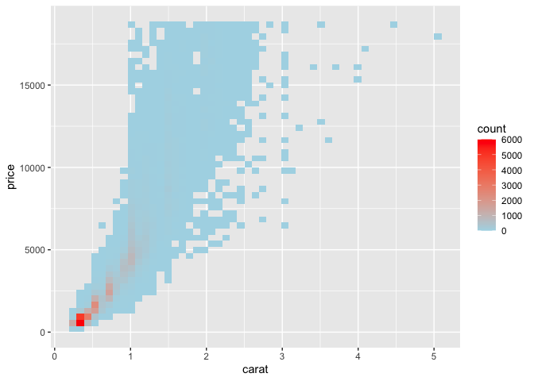<!-- -->

- 图中数据点的默认颜色看起来难以区分，这是因为它们的光度(luminosity)变化不大。在第二个版本中我们通过
  `scale_fill_gradient()`重新设定数据点的颜色，并指定颜色的最小色阶low和最大色阶high。默认情况下，图例中不包括最小值，这是因为颜色标度的范围不是从0开始的，而是以各箱中的最小非零值(本例中是1)为起始点的。如果想在图例中包括零值(见上图)，可以调用limits参数手动将范围设定为0到最大值6000。

- 如果不想将数据分箱并以矩形表示的话，可以调用`stat_binhex()`函数使用六边形代替。该函数的工作机制与`stat_bin2d()`类似。使用该函数之前，必须先运行`install.packages("hexbin")`命令安装hexbin包。

``` r
> library(hexbin)
> sp + stat_binhex() + 
+   scale_fill_gradient(low="lightblue",high="red",
+                       limits=c(0,8000))
```

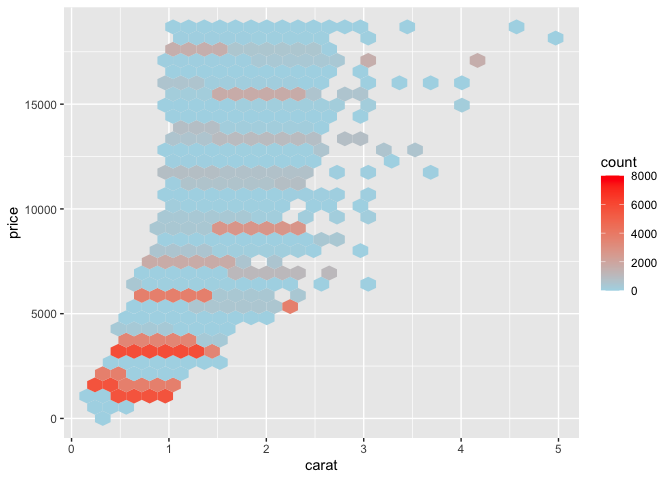<!-- -->

``` r
> 
> sp + stat_binhex() + scale_fill_gradient(low="lightblue",high="red",
+                                          breaks=c(0,250,500,1000,2000,4000,6000),
+                                          limits=c(0,6000))
```

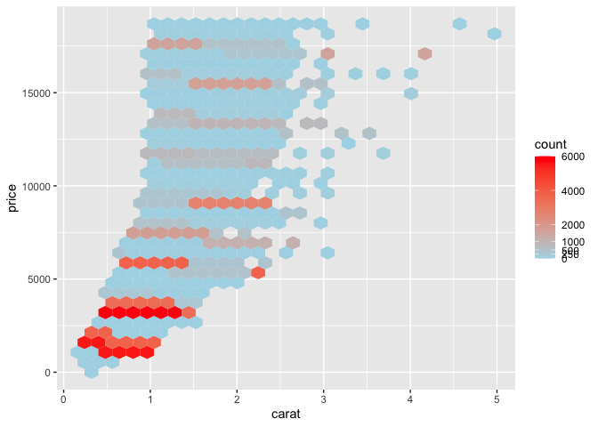<!-- -->

- 对于这两种方法，在手动设置分箱范围时，因为数据点太多或者太少，会出现一个落在分箱范围外的箱子，且这个箱子的颜色会显示为灰色，而不是最大值或最小值对应的颜色，如上图所示。

- 当散点图的其中一个数据轴或者两个数据轴都对应于离散型数据时，也会出现图形重叠的情况，如下图所示。这时候，可以调用`position_jitter()`函数给数据点增加随机扰动。默认情况下，该函数在每个方向上添加的扰动值为数据点最小精度的40%，不过，也可以通过width和height参数对该值进行调整。

``` r
> spl <- ggplot(ChickWeight,aes(x=Time,y=weight))
> spl + geom_point()
```

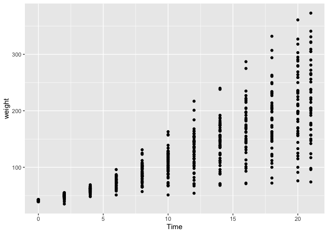<!-- -->

``` r
> spl + geom_point(position="jitter")  # 也可以调用geom_jitter()函数，两者是等价的
```

<!-- -->

``` r
> spl + geom_point(position=position_jitter(width=.5,height=0))
```

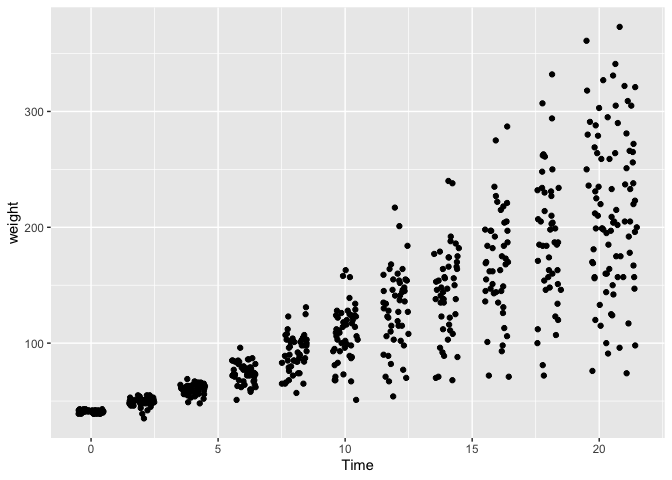<!-- -->

- 左图：变量x为离散型的数据集；中间：添加随机扰动；右图：只在水平方向添加随机扰动。

- 当数据集对应于一个离散型数据轴和一个连续型数据轴时，箱线图可能是一种较好的展示方式，如下图所示。箱线图所表现的信息与散点图略有不同，因为它很难反映出离散坐标轴上每个位置的数据点数量的信息。箱线图的绘制方式有时候是缺点，但有时候却是恰如其分的可视化方法。

- 对于ChickWeights数据集，其对应的x轴本质上是离散的，但其被存储为数值型向量，因此，`ggplot()`函数不知如何对该数据集进行分组。如果不告诉`ggplot()`函数如何对数据进行分组，会得到下图右图所示的结果。调用`aes(group=...)`可以告诉`ggplot()`如何对数据进行分组。下面，按Time变量的取值对数据进行分组：

``` r
> spl + geom_boxplot(aes(group=Time)) # 分组
```

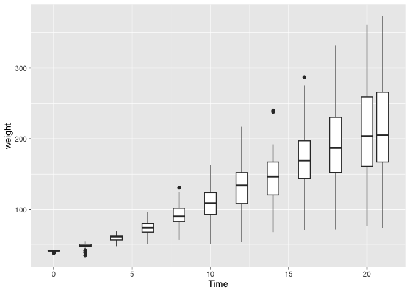<!-- -->

``` r
> spl + geom_boxplot() # 不分组
```

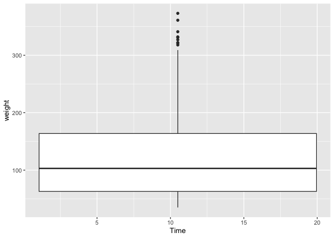<!-- -->

- 除了对数据进行分箱，我们还可以展示二维的密度估计。具体操作参见6.12节。

## 5.6 添加回归模型拟合线

- 运行`stat_smooth()`函数并设定`method=lm`即可向散点图中添加线性回归拟合线，这将调用`lm()`函数对数据拟合线性模型。首先，我们将基本绘图对象存储在对象sp中，然后，再添加更多的图形部件。**默认情况下，`stat_smooth()`函数会为回归拟合线添加95%的置信域**，置信域对应的置信水平可通过设置level参数来进行调整。设定参数`se=FALSE`时，系统将不会对回归拟合线添加置信域。拟合线的默认颜色是蓝色，可以通过设定co1our参数对其进行调整。与其他直线样，我们可以对拟合线的线型(linetype)和粗细(linewidth)进行设置。为了突出直线，可设置点的colour以使数据点不那么突出：

``` r
> library(gcookbook) # 为了使用数据
> #基本绘图对象
> sp <- ggplot(heightweight,aes(x=ageYear,y=heightIn))
> sp + geom_point() + stat_smooth(method=lm)
```

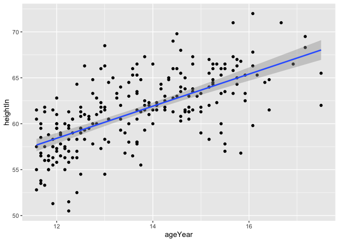<!-- -->

``` r
> # 99%置信域
> sp + geom_point() + stat_smooth(method=lm,level=0.99)
```

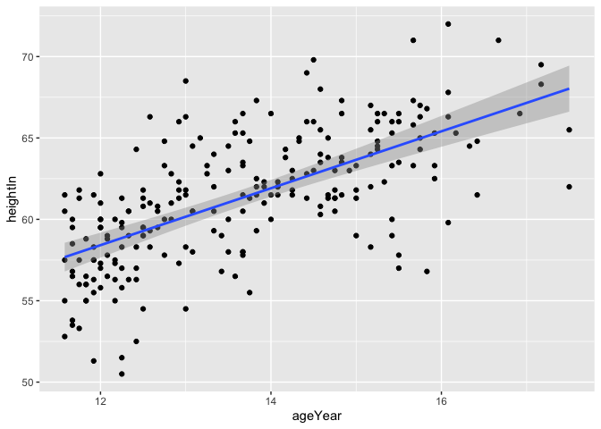<!-- -->

``` r
> # 没有置信域
> sp + geom_point() + stat_smooth(method=lm,se=FALSE)
```

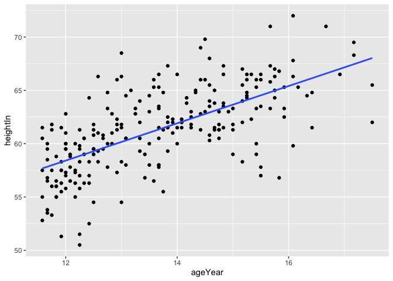<!-- -->

``` r
> # 数据点为灰色的黑色线性拟合线
> sp + geom_point(colour="grey60") + 
+   stat_smooth(method=lm,se=FALSE,colour="black")
```

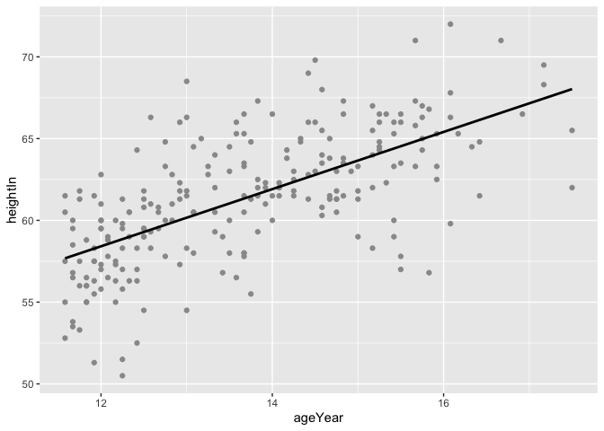<!-- -->

- 线性模型并不是唯一可对数据进行拟合的模型。事实上，它甚至不是默认的模型。如果在调用`stat_smooth()`函数时未指定模型类型，那么，该函数会对数据拟合loess曲线（局部加权多项式），如下图所示。下面两行命令的输出结果相同：

``` r
> sp + geom_point(colour="grey60") + stat_smooth() 
```

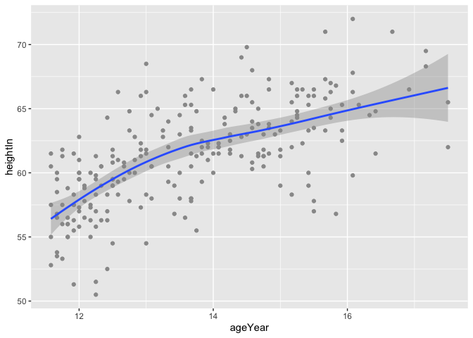<!-- -->

``` r
> # sp + geom_point(colour="grey60") + stat_smooth(method=loess)
```

- 通过将参数传递给`stat_smooth()`函数可以设定`loess()`函数中的其他附加参数。另一种常用的模型是Logistic回归。Logistic回归对heightweight数据集不适用，但对MASS包中的biopsy数据集拟合效果良好。该数据集包含9个与乳腺癌活检组织相关的指标以及肿瘤的分类，包括良性(benign)和恶性(malignant)两种。在预处理Logistic回归的数据时，我们必须将具有两个水平benign和malignant的因子型变量转化为具有0和1取值的向量。首先，为变量biopsy创建一个副本，接着将其重编码为数值型的变量并存储在列classn中：

``` r
> library(MASS) # 为了使用数据
> b <- biopsy
> b$classn[b$class=="benign"] <- 0
> b$classn[b$class=="malignant"] <- 1 
> head(b)
       ID V1 V2 V3 V4 V5 V6 V7 V8 V9     class classn
1 1000025  5  1  1  1  2  1  3  1  1    benign      0
2 1002945  5  4  4  5  7 10  3  2  1    benign      0
3 1015425  3  1  1  1  2  2  3  1  1    benign      0
4 1016277  6  8  8  1  3  4  3  7  1    benign      0
5 1017023  4  1  1  3  2  1  3  1  1    benign      0
6 1017122  8 10 10  8  7 10  9  7  1 malignant      1
```

-虽然，涉及的指标很多，但在本例中，我们只探寻变量V1(肿块厚度)和肿瘤类型的关系。图中数据点重叠程度严重，因此，需要向数据点添加一些扰动，同时，将数据点设置为半透明(alpha=.4)、点形设置为空心圆(shape=21)，并使用略小的数据点(size=1.5)。令`stat_smooth()`函数使用选项为`family=binomial`的`glm()`函数向散点图添加Logistic回归拟合线：

``` r
> ggplot(b,aes(x=V1,y=classn)) + 
+   geom_point(position=position_jitter(width=0.3,height=0.06),alpha=0.4,
+              shape=21,size=1.5) + 
+   stat_smooth(method=glm,family=binomial)
```

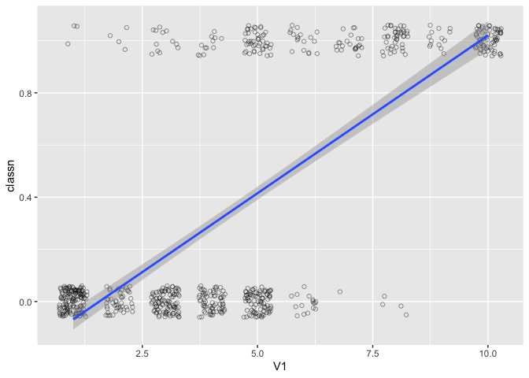<!-- -->

- 如果散点图对应的数据集按照某个因子型变量进行了分组，且已将分组变量映射给colour和shape属性，上述命令将针对各个组分别绘制模型拟合线。首先，创建一个基本绘图对象sps；然后，向其添加loess线；最后，将点的颜色设定为半透明(alpha=.4)以弱化数据点的显示。

``` r
> sps <- ggplot(heightweight,aes(x=ageYear,y=heightIn,colour=sex)) + 
+   geom_point() + 
+   scale_colour_brewer(palette="Set1")
> 
> sps + geom_smooth()
```

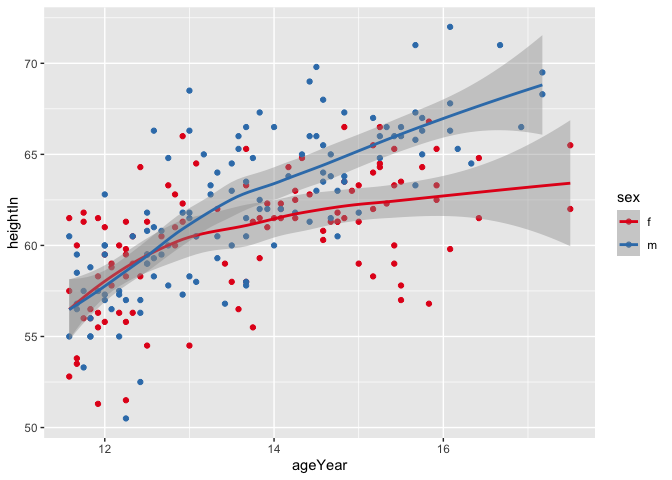<!-- -->

- 注意，男性分组的蓝色拟合线并没有绘制到图形的右边界。其中有两个原因：第一个原因在于，默认情况下`stat_smooth()`函数将预测值的范围限定在预测数据对应的范围内（对应于x轴）；第二个原因在于，即使对模型进行外推，`loess()`函数也只能根据整组数据对应的x轴的范围进行预测。

- 如果想基于数据集对拟合线进行外推，如图下图所示，必须保证绘图过程中能够调用的是支持外推的模型，比如lm()，并将选项`fullrange=TRUE`传递给`stat_smooth()`函数：

``` r
> sps + geom_smooth(method=lm,se=FALSE,fullrange=TRUE)
```

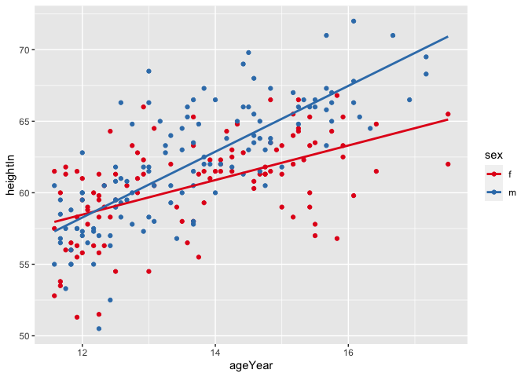<!-- -->

- 对于本例中的heightweight数据集而言，`stat_smooth()`函数默认的方法（不带外推的LOESS方法)比外推的线性预测更合理，因为人类的生长过程并非线性的，且人类也不会一直在生长。

## 5.7 根据已有模型向散点图添加拟合线

- 常用的向散点图添加模型拟合线的方法是调用`stat_smooth()`函数，这在5.6节中已有所介绍。然而，有时候我们想要建立自己的模型，再将模型拟合线添加到散点图上，这样做可以使所用的模型与图中所见保持一致。

- 本例中，我们使用`lm()`函数建立一个以ageYear为预测变量对heightIn进行预测的模型。然后，调用`predict()`函数计算预测变量ageYear各取值所对应的heightIn变量的预测值：

``` r
> library(gcookbook) # 为了使用数据
> model <- lm(heightIn ~ ageYear + I(ageYear^2),heightweight) 
> model

Call:
lm(formula = heightIn ~ ageYear + I(ageYear^2), data = heightweight)

Coefficients:
 (Intercept)       ageYear  I(ageYear^2)  
    -10.3136        8.6673       -0.2478  
```

``` r
> # 创建一个包含变量ageYear的列，并对其进行插值
> xmin <- min(heightweight$ageYear) 
> xmax <- max(heightweight$ageYear)
> predicted <- data.frame(ageYear=seq(xmin,xmax,length.out=100))
> # 计算变量heightIn的预测值
> predicted$heightIn <- predict(model,predicted) 
> head(predicted)
   ageYear heightIn
1 11.58000 56.82624
2 11.63980 57.00047
3 11.69960 57.17294
4 11.75939 57.34363
5 11.81919 57.51255
6 11.87899 57.67969
```

- 现在，我们可以将数据点和模型预测值一起绘制在图形上：

``` r
> sp <- ggplot(heightweight,aes(x=ageYear,y=heightIn)) + 
+   geom_point(colour="grey40")
> 
> sp + geom_line(data=predicted,size=1)
```

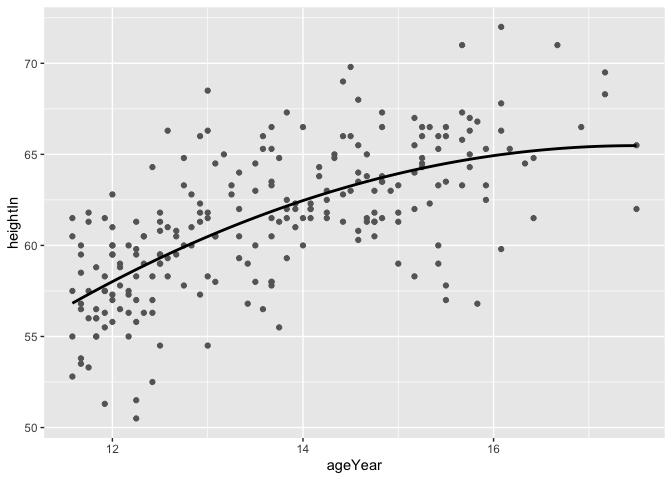<!-- -->

- 无论哪种模型，只要有对应的`predict()`方法，则其都可用来绘制拟合线。举个例子：`lm()`函数和`loess()`函数对应的`predict()`方法分别是`predict.lm()`和`predict. 1oess()`等，因此，这两个模型都可以用来绘制模型拟合线。

- 应用下面定义的`predictvals()`函数可以简化向散点图添加模型拟合线的过程。使用时，只需向其传递一个模型作为参数，该函数就会自动查询变量名、预测变量范围、并返回一个包含预测变量和模型预测值的数据框。将该数据框传递给`geomline()`函数即可绘制我们在前面看到的模型拟合线：

``` r
> # 根据模型和变量xvar预测变量yvar 
> # 仅支持单一预测变量的模型
> # xrange:×轴范围，当值为NULL时，等于模型对象中提取的×轴范围：当设定为包含两个数字的向量时，两个数字分别对应于×轴范围的上下限
> # sample:x轴上包含的样本数量
> # ...:可传递给predict()函数的其他参数
> predictvals <- function(model,xvar,yvar,xrange=NULL,samples=100,...){
+   # 如果xrange没有输入，则从模型对象中自动提取x轴范围作为参数
+   # 提取xrange参数的方法视模型而定
+   if(is.null(xrange)){
+     if (any(class(model) %in% c("lm","glm"))) 
+       xrange <- range(model$model[[xvar]]) 
+     else if(any(class(model) %in% "loess")) 
+       xrange <- range(model$x)
+   }
+   newdata <- data.frame(x=seq(xrange[1],xrange[2],length.out=samples)) 
+   names(newdata) <- xvar
+   newdata[[yvar]] <- predict(model,newdata=newdata,...) 
+   newdata
+ }
> # 调用`lm()`函数和`loess()`函数对数据集建立线性模型和LOESS模
> modlinear <- lm(heightIn ~ ageYear,heightweight)
> modloess <- loess(heightIn ~ ageYear,heightweight)
> # 针对两个模型分别调用predictvals()函数，并将得到的结果（数据框）传递给geomline()
> lm_predicted <- predictvals(modlinear,"ageYear","heightIn")
> loess_predicted <- predictvals(modloess,"ageYear","heightIn")
> 
> sp + geom_line(data=lm_predicted,colour="red",size=.8) + 
+   geom_line(data=loess_predicted,colour="blue",size=.8)
```

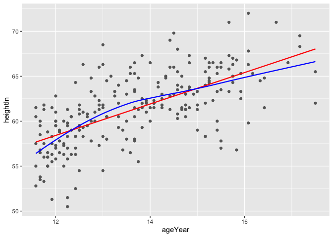<!-- -->

- 对于具有非线性连接函数的glm模型，需要将`predictvals()`函数的参数设定为`type="response"`。这样做的原因在于，默认情况下该函数返回的预测结果是基于线性项的，而不是基于响应变量(y)的。

- 以MASS包中的biopsy数据为例演示一下上述过程。与5.6节中一样，下面用变量V1来预测变量class。Logistic模型对应的值须是介于0到1之间的数值，这里变量class是因子型变量，因而，要先将变量class的取值转化为0和1，接着，建立Logistic回归模型，最后，绘制带扰动和fitlogistic线的散点图。通过指定RGB颜色值将直线设定为蓝色，同时，指定参数linewidth=1使线条更宽。

``` r
> library(MASS) # 为了使用数据
> b <- biopsy
> b$classn[b$class=="benign"] <- 0
> b$classn[b$class=="malignant"] <- 1
> 
> fitlogistic <- glm(classn ~ V1,b,family=binomial)
> 
> # 获取预测值
> glm_predicted <- predictvals(fitlogistic,"V1","classn",type="response")
> 
> ggplot(b,aes(x=V1,y=classn)) + 
+   geom_point(position=position_jitter(width=.3,height=.08),alpha=0.4,
+              shape=21,size=1.5) + 
+   geom_line(data=glm_predicted,colour="41177FF",linewidth=1)
```

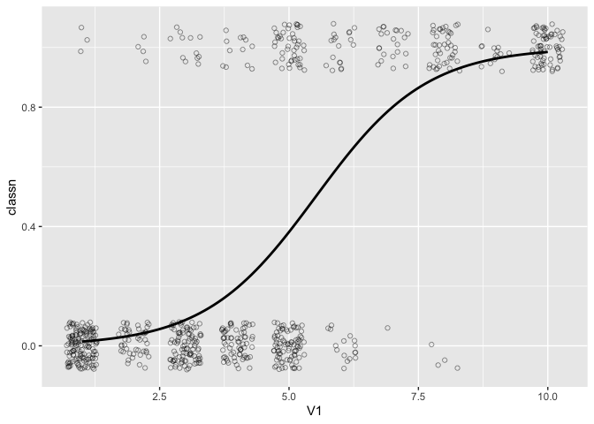<!-- -->

## 5.8 添加来自多个模型的拟合线

- 使用上文提到的`predictvals()`函数和来自plyr包的`dlply()`及`ldply()`函数即可。

- 根据变量sex的水平对heightweight数据集进行分组，调用`lm()`函数对每组数据分别建立线性模型，并将模型结果存放在一个列表内。随后，通过下面定义的`make_model()`函数建立模型。调用该函数时，向其输入一个数据框作为参数，该函数会返回一个lm对象。也可以根据数据集自定义模型：

  `make_model <- function(data){lm(heightIn ~ ageYear,data)}`

- 有了上面的函数之后，可以调用`dlply()`函数分别针对数据集的各个子集建立模型。在执行过程中，函数会根据分组变量sex将数据框切分为不同的子集，并对各个子集执行`make.model()`函数。本例中，heightweight数据集被切分为男性组和女性组，`make_model()`函数分别对两个组的数据建立模型。调用`dlply()`函数将模型结果输出到列表中，并返回列表：

``` r
> make_model <- function(data){lm(heightIn ~ ageYear,data)}
> library(gcookbook) # 为了使用数据
> library(plyr)
> models <- dlply(heightweight,"sex",.fun=make_model)
> # 打印出两个lm对象f和m组成的列表
> models
$f

Call:
lm(formula = heightIn ~ ageYear, data = data)

Coefficients:
(Intercept)      ageYear  
     43.963        1.209  


$m

Call:
lm(formula = heightIn ~ ageYear, data = data)

Coefficients:
(Intercept)      ageYear  
     30.658        2.301  


attr(,"split_type")
[1] "data.frame"
attr(,"split_labels")
  sex
1   f
2   m
```

- 得到模型对象之后，配合使用`ldply()`函数和`predictvals()`函数即可获取两个模型对应的预测值，最后，绘制带预测值的散点图。

``` r
> predvals <- ldply(models,.fun=predictvals,xvar="ageYear",yvar="heightIn") 
> head(predvals)
  sex  ageYear heightIn
1   f 11.58000 57.96250
2   f 11.63980 58.03478
3   f 11.69960 58.10707
4   f 11.75939 58.17936
5   f 11.81919 58.25165
6   f 11.87899 58.32394
> 
> ggplot(heightweight,aes(x=ageYear,y=heightIn,colour=sex)) + 
+   geom_point() + 
+   geom_line(data=predvals)
```

<!-- -->

- `dlply()`函数和`ldply()`函数的作用是切分数据，对各个部分执行某一函数，并对执行结果进行重组。

- 在前面的代码中，每组数据的预测值对应的x轴的范围与每组数据所对应的x轴的范围相同，并未向外延伸。男性组的预测值终止于男性组中年龄最大的点：女性组的预测值更靠右，终止于女性组中年龄最大的点。为了使两组预测线对应的x轴范围与整个数据集对应的x轴范围相同，可以像下面这样向其传递一个xrange参数，接下来的绘图操作与前面类似：

``` r
> predvals <- ldply(models,.fun=predictvals,xvar="ageYear",yvar="heightIn",
+                   xrange=range(heightweight$ageYear))
> 
> ggplot(heightweight,aes(x=ageYear,y=heightIn,colour=sex)) + 
+   geom_point() + 
+   geom_line(data=predvals)
```

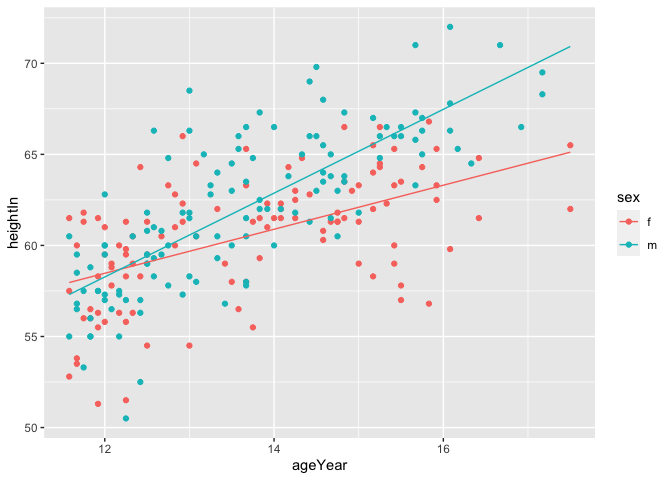<!-- -->

- 从上图可以看到，男性组的模型拟合线延伸到了女性组的右边界。谨记一点：外推拟合线并非总是适用的，其适用与否要视数据特性及模型假设而定。

## 5.9 向散点图添加模型系数

- 简单的文本以注释形式添加到图形上面即可。下面的例子中，我们会建立一个线性模型，并调用5.7节中定义的`predictval()`函数创建一条预测线。最后，向图形添加注释。

``` r
> library(gcookbook) # 为了使用数据
> model <- lm(heightIn ~ ageYear,heightweight) 
> summary(model)

Call:
lm(formula = heightIn ~ ageYear, data = heightweight)

Residuals:
    Min      1Q  Median      3Q     Max 
-8.3517 -1.9006  0.1378  1.9071  8.3371 

Coefficients:
            Estimate Std. Error t value Pr(>|t|)    
(Intercept)  37.4356     1.8281   20.48   <2e-16 ***
ageYear       1.7483     0.1329   13.15   <2e-16 ***
---
Signif. codes:  0 '***' 0.001 '**' 0.01 '*' 0.05 '.' 0.1 ' ' 1

Residual standard error: 2.989 on 234 degrees of freedom
Multiple R-squared:  0.4249,    Adjusted R-squared:  0.4225 
F-statistic: 172.9 on 1 and 234 DF,  p-value: < 2.2e-16
```

- 上面的结果表明模型的r^2值是0.4249。我们创建一个图形，并调用`annotate()`函数向其手动添加文本：

``` r
> #首先，生成预测值
> pred <- predictvals(model,"ageYear","heightIn")
> sp <- ggplot(heightweight,aes(x=ageYear,y=heightIn)) + 
+   geom_point() + 
+   geom_line(data=pred)
> 
> sp + annotate("text",label="r^2=0.42",x=16.5,y=52)
```

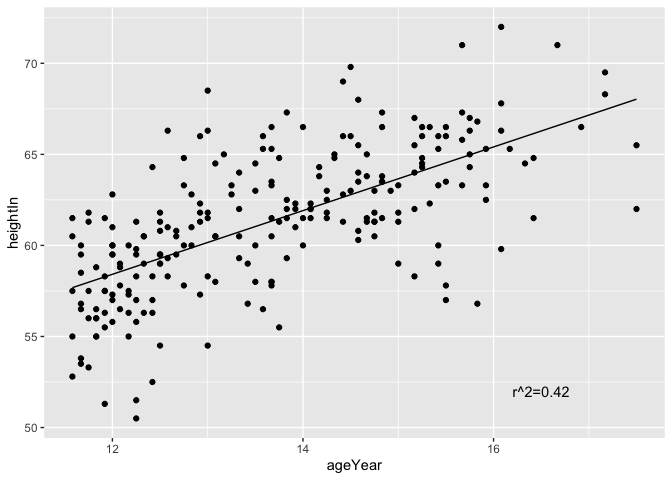<!-- -->

- 如果不想使用纯文本字符串当注释的话，可以通过设置`parse=TRUE`调用R的数学表达式语法来输入公式。

``` r
> sp + annotate("text",label="r^2 == 0.42",parse=TRUE,x=16.5,y=52)
```

<!-- -->

- ggplot2中的文本对象不能直接以表达式对象作为输入，其参数通常是一个字符串，接收字符串后，通过`parse(text="a+b")`函数将其转化为公式。

- 使用数学公式作为注释时，必须使用正确的语法才能保证系统输出一个合法的R表达式对象。把公式封装在`expression()`内部，检验其输出结果可以辅助判断R表达式的有效性(确保公式两边没有引号)。本例中==是公式中表达等号的合法字符，而=则是非法字符。

      expression(r^2==0,42) #合法公式

      expression(r2 ==0.42)

      expression(r^2=0.42) #非法公式

      Error:unexpected '=' in "expression(r^2 ="

- 还可以自动提取模型对象的值并创建一个引用这些值的公式。在接下来的例子中，我们创建一个字符串，对其进行解析后，会返回一个合法的公式：

``` r
> eqn <- as.character(as.expression(
+   substitute(italic(y)==a+b*italic(x) * "," ~~ italic(r)^2 ~ "=" ~ r2, 
+              list(a=format(coef(model)[1],digits=3),
+                   b=format(coef(model)[2],digits=3),
+                   r2=format(summary(model)$r.squared,digits=2)
+ ))))
> eqn
[1] "italic(y) == c(`(Intercept)` = \"37.4\") + c(ageYear = \"1.75\") * italic(x) * \",\" ~ ~italic(r)^2 ~ \"=\" ~ \"0.42\""
```

``` r
> parse(text=eqn) # 解析并返回一个表达式
expression(italic(y) == c(`(Intercept)` = "37.4") + c(ageYear = "1.75") * 
    italic(x) * "," ~ ~italic(r)^2 ~ "=" ~ "0.42")
```

- 有了字符串表达式之后，就可以将其添加到图形上了。下面设置x=Inf和y=-Inf将公式放置于图形的右下角，同时对其位置进行上下和左右调整，使其位于绘图区域内：

``` r
> sp + annotate("text",label=eqn,parse=TRUE,x=Inf,y=-Inf,hjust=1.1,vjust=-.5)
```

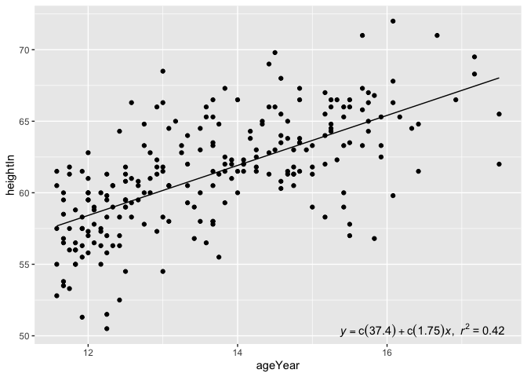<!-- -->

- R中数学表达式的语法可能需要花一些时间去学习，更多信息请参见7.2节。

## 5.10 向散点图添加边际地毯

- 调用`geom_rug()`函数即可。下面以faithful数据集为例，该数据集包含两列关于“老忠实喷泉”的信息：其中，一列是变量eruptions，记录的是喷泉每次喷发的时长：另一列是waiting，记录的是喷泉在两次喷发之间的时间间隔：

``` r
> ggplot(faithful,aes(x=eruptions,y=waiting)) + 
+   geom_point() + 
+   geom_rug()
```

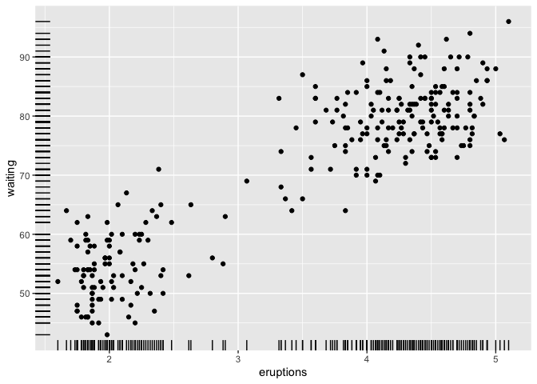<!-- -->

- 边际地毯图本质上是一个一维的散点图，它可被用于展示每个坐标轴上数据的分布情况。对于本例中的数据集，边际地毯传递的信息量十分有限。因为变量waiting的最小刻度是分钟，因此，图中相应的边际地毯线重叠严重。通过向边际地毯线的位置坐标添加扰动并设定size减小线宽可以减轻边际地毯线的重叠程度。上述操作有助于看清数据的分布情况：

``` r
> ggplot(faithful,aes(x=eruptions,y=waiting)) + 
+   geom_point() + 
+   geom_rug(position="jitter",size=.2)
```

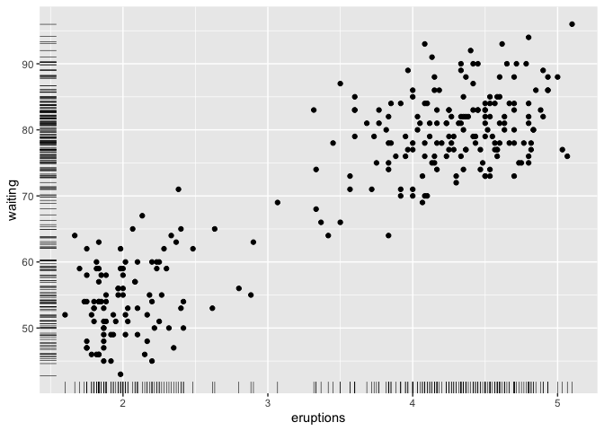<!-- -->

- 更多关于图形重叠的内容，可参见5.5节。

## 5.11 向散点图添加标签

- 调用`annotate()`函数或者`geom_text()`函数可以为一个或几个数据点添加标签。下面以countries数据集为例，对各国医疗保健支出与每千新生儿的婴儿死亡率之间的关系进行可视化。为了便于操作，选取人均支出大于2000美元的国家的数据子集进行分析：

``` r
> library(gcookbook) # 为了使用数据
> subset6 <- subset(countries,Year==2009&healthexp>2000)
> head(subset6)
          Name Code Year      GDP laborrate healthexp infmortality
254    Andorra  AND 2009       NA        NA  3089.636          3.1
560  Australia  AUS 2009 42130.82      65.2  3867.429          4.2
611    Austria  AUT 2009 45555.43      60.4  5037.311          3.6
968    Belgium  BEL 2009 43640.20      53.5  5104.019          3.6
1733    Canada  CAN 2009 39599.04      67.8  4379.761          5.2
2702   Denmark  DNK 2009 55933.35      65.4  6272.729          3.4
```

- 先将基本散点图对象保存在sp中，再向其添加其他元素。要手动添加注释，可调用`annotate()`函数，此时，需要指定标签坐标和标签文本。可能要尝试多次才能将注释调整到合适的位置。

``` r
> sp <- ggplot(subset(countries,Year==2009 & healthexp>2000),
+              aes(x=healthexp,y=infmortality)) + 
+   geom_point()
> 
> sp + annotate("text",x=4350,y=5.4,label="Canada") + 
+   annotate("text",x=7400,y=6.8,label="USA")
```

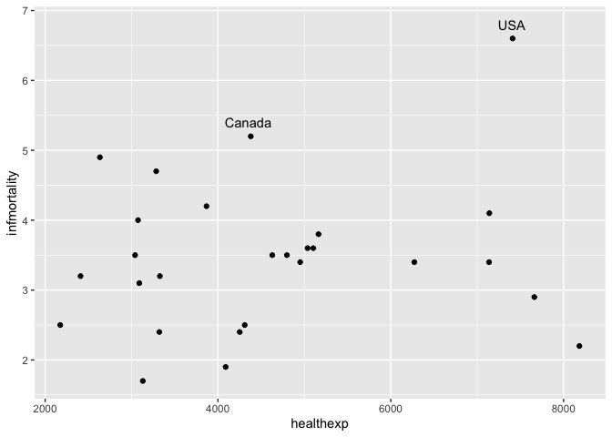<!-- -->

- 要根据数据集自动向散点图添加数据标签，可以使用`geom_text()`函数，此时，只需映射一个因子型或者字符串型的向量给标签(label)属性。本例中，我们把变量Name映射给label属性，同时为了避免数据点过于拥挤，我们使用略小一点的字号。默认的标签size属性为5，这个数值并不与字号直接对应。

``` r
> sp + geom_text(aes(label=Name),size=4)
```

<!-- -->

- 系统自动放置注释时会将其中心置于x坐标和y坐标的位置。不过，我们可以对文本位置进行上下或者左右调整，或者两者兼做。

- 设定vjust=0时，标签文本的基线会与数据点对齐：设定vjust=1时，标签文本的顶部会与数据点对齐。但有时这样还不够，我们还可以通过增加或者减少ⅴjust参数的值来调高或者调低文本标签的位置：也可以通过对y的映射增加或减小一个值得到相同的效果：

``` r
> sp + geom_text(aes(label=Name),size=4,vjust=0)
```

<!-- -->

``` r
> 
> # 增加一些y的取值
> sp + geom_text(aes(y=infmortality+.1,label=Name),size=4,vjust=0)
```

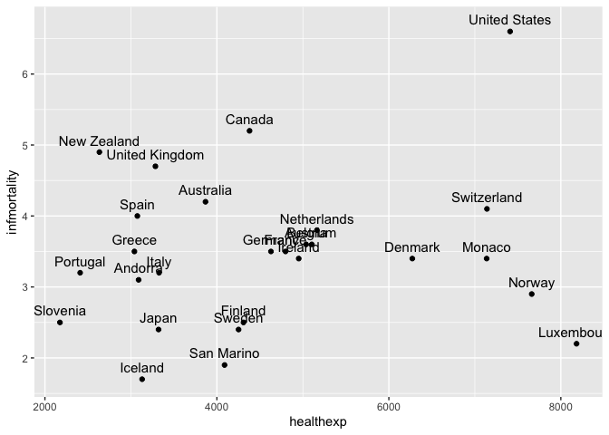<!-- -->

- 有时候，有必要根据数据点的位置令注释左对齐或右对齐。要左对齐，可设置hjust=0；要右对齐，可设定hjust=1。与调整vjust的情形类似，图中的标签会与数据点有所重叠。然而，这时候，我们最好不要通过增加或者减少hjust的值对此进行修正，因为调整hjust的值时，系统会按照文本标签长度的一定比例来移动文本标签的位置，这时候，较长的文本标签会比短文本标签移动的位置更大。此时，最好将hjust设定为0或者1，然后，通过对x增加或者减去一个值来调整文本标签的位置：

``` r
> sp + geom_text(aes(label=Name),size=4,hjust=0)
```

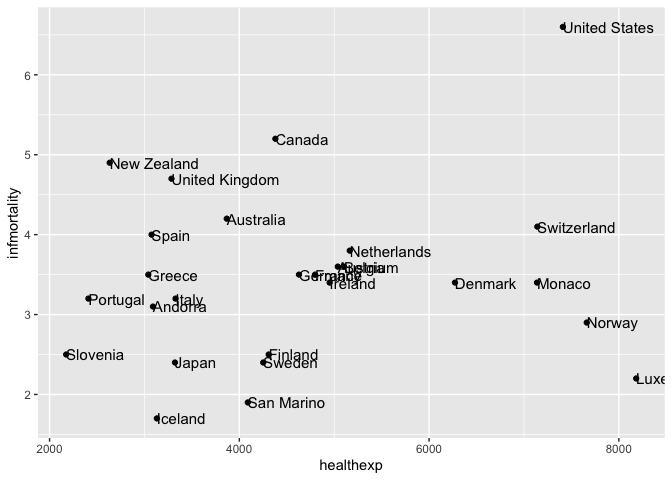<!-- -->

``` r
> 
> sp + geom_text(aes(x=healthexp+100,label=Name),size=4,hjust=0)
```

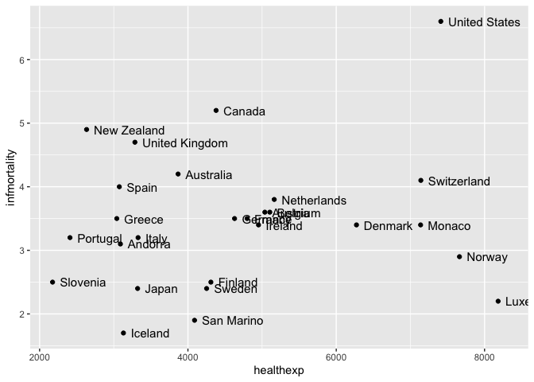<!-- -->

- **如果绘图时用的是对数坐标轴，要想将文本标签移动同样的位置，就不能通过增加x或y的数值来实现了。此时需要令x或者y乘以一个数值才行。**

- 如果只想给为数不多的几个点添加标签，但希望R自动设定标签位置的话，可以给数据框增加一个只包含拟使用的标签的新列。一个可行方案是：首先，将所用数据复制一个副本，并将列Name复制为Name1，接下来，用`%in%`运算符找出绘图时希望保有的标签所处的位置。本操作将返回一个逻辑向量，该向量标识了cdat\$Name1中哪些元素出现在第二个向量中，其中第二个向量指定的是我们希望标示出来的国家的名字：

``` r
> cdat <- subset(countries,Year==2009 & healthexp>2000)
> 
> cdat$Name1 <- cdat$Name
> 
> idx <- cdat$Name1 %in% c("Canada","Ireland","United Kingdom","United States",
+                          "New Zealand","Iceland","Japan","Luxembourg", 
+                          "Netherlands","Switzerland")
> idx
 [1] FALSE FALSE FALSE FALSE  TRUE FALSE FALSE FALSE FALSE FALSE  TRUE  TRUE
[13] FALSE  TRUE  TRUE FALSE  TRUE  TRUE FALSE FALSE FALSE FALSE FALSE FALSE
[25]  TRUE  TRUE  TRUE
```

- 根据上面的逻辑向量用NA重写变量Name1中的其他取值，得到的结果如下：

``` r
> cdat$Name1[!idx] <- NA
> head(cdat)
          Name Code Year      GDP laborrate healthexp infmortality  Name1
254    Andorra  AND 2009       NA        NA  3089.636          3.1   <NA>
560  Australia  AUS 2009 42130.82      65.2  3867.429          4.2   <NA>
611    Austria  AUT 2009 45555.43      60.4  5037.311          3.6   <NA>
968    Belgium  BEL 2009 43640.20      53.5  5104.019          3.6   <NA>
1733    Canada  CAN 2009 39599.04      67.8  4379.761          5.2 Canada
2702   Denmark  DNK 2009 55933.35      65.4  6272.729          3.4   <NA>
```

- 现在，可以绘制图形了。这次，增大x轴的范围使得文本标签可以漂亮地展示出来：

``` r
> ggplot(cdat,aes(x=healthexp,y=infmortality)) + 
+   geom_point() + 
+   geom_text(aes(x=healthexp+100,label=Name1),size=4,hjust=0) 
```

<!-- -->

``` r
> xlim(2000,10000)
<ScaleContinuousPosition>
 Range:  
 Limits: 2e+03 -- 1e+04
```

- 如果一些个别的位置需要调整，我们有两个选择：第一个选择是复制x轴坐标和y轴坐标对应的列，修改它们的数值并以此调整文本的位置。当然，绘制数据点所用的坐标必须是原始的数值！另一个选择是把图形输出为矢量格式，比如PDF或者SVG(参见14.1节和14.2节的内容)，再用Illustrator软件对其进行编辑。

- 更多关于控制文本样式的内容，可参见9.2节。

- 如果想手动编辑PDF或者SVG文件，可参见14.4节的内容。

## 5.12 绘制气泡图

- 调用`geom_point()`和`scale_size_area()`函数即可绘制气泡图。下面以countries数据集的子集为例：

``` r
> library(gcookbook) # 为了使用数据
> cdat <- subset(countries,Year==2009&Name %in% c("Canada","Ireland",
+                                                 "United Kingdom","United States",
+                                                 "New Zealand","Iceland","Japan",
+                                                 "Luxembourg","Netherlands","Switzerland"))
> head(cdat)
            Name Code Year       GDP laborrate healthexp infmortality
1733      Canada  CAN 2009  39599.04      67.8  4379.761          5.2
4436     Iceland  ISL 2009  37972.24      77.5  3130.391          1.7
4691     Ireland  IRL 2009  49737.93      63.6  4951.845          3.4
4946       Japan  JPN 2009  39456.44      59.5  3321.466          2.4
5864  Luxembourg  LUX 2009 106252.24      55.5  8182.855          2.2
7088 Netherlands  NLD 2009  48068.35      66.1  5163.740          3.8
```

- 如果只是将变量GDP映射给size属性，则GDP的值被映射给了点的半径，这并不是我们想要的结果；此外，当变量值增加一倍时，对应的点的面积会变为原来的四倍，因此，这种结果会对人们理解数据产生误导。我们更想将GDP映射给点的面积，可以调用`scale_size_area()`来完成这一操作：

``` r
> p <- ggplot(cdat,aes(x=healthexp,y=infmortality,size=GDP)) + 
+   geom_point(shape=21,colour="black",fill="cornsilk")
> # 将GDP映射给半径(scale_size_continuous的默认值) 
> p
```

<!-- -->

``` r
> # 将GDP映射给面积，得到一个略大的圆圈
> p + scale_size_area(max_size=15)
```

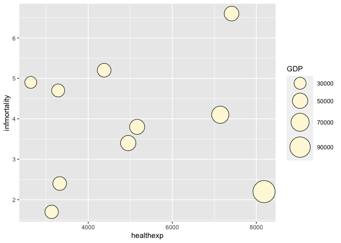<!-- -->

- 本例中的气泡图实际上还是散点图，但气泡图也有其他用法。比如，当x轴和y轴皆为分类变量时，气泡图可以用来表示网格点上的变量值：

- 安装reshape2包。

``` r
> # 对男性组和女性组求和
> hec <- HairEyeColor[,,"Male"] + HairEyeColor[,,"Female"]
> # 转化为长格式(long format)
> library(reshape2)
> hec <- melt(hec,value.name="count")
> 
> ggplot(hec,aes(x=Eye,y=Hair)) + 
+   geom_point(aes(size=count),shape=21,colour="black",fill="cornsilk") + 
+   scale_size_area(max_size=20,guide=FALSE) + 
+   geom_text(aes(y=as.numeric(Hair)-sqrt(count)/22,label=count),vjust=1,
+             colour="grey60",size=4)
```

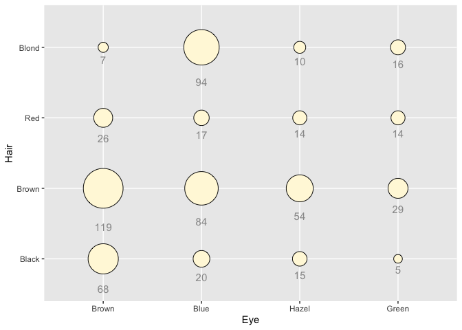<!-- -->

- 本例中，我们使用了一些小技巧来将文本标签置于圆圈正下方。首先，设定vjust=1，将文本标签顶端与数据点的y轴对应。接下来，调整y坐标，使其刚好位于每个圆圈的底部。这一过程涉及一些计算：提取Hair变量的数值，并将其减去一个与变量count有关的值。事实上，这需要计算count变量的平方根，因为圆圈的半径跟count变量的平方根线性相关。这里的除数是通过试错得出的（本例中等于22）：这个值取决于具体的数据值、圆圈半径及文本大小。

- 圆圈下面的文本颜色是灰色的。之所以这么做是为了削弱文本的突出性，避免影响圆圈的展示，但同时如果想知道圆圈对应的具体数值，文本也能够在图中观察得出。

- 为圆圈添加标签的内容可参见5.11节和7.1节。

- 在散点图中将变量映射给其他图形属性的方法可参见5.4节。

## 5.13 绘制散点图矩阵问题

- 散点图矩阵是一种对多个变量两两之间关系进行可视化的有效方法。调用R基础绘图系统中的`pairs()`函数可以绘制散点图矩阵。

- 这里以countries数据集的子集为例。我们从countries数据集中选取出2009年的数据且只保留几个相关列：

``` r
> library(gcookbook) # 为了使用数据
> c2009 <- subset(countries,Year==2009,
+                 select=c(Name,GDP,laborrate,healthexp,infmortality))
> head(c2009)
              Name      GDP laborrate  healthexp infmortality
50     Afghanistan       NA      59.8   50.88597        103.2
101        Albania 3772.605      59.5  264.60406         17.2
152        Algeria 4022.199      58.5  267.94653         32.0
203 American Samoa       NA        NA         NA           NA
254        Andorra       NA        NA 3089.63589          3.1
305         Angola 4068.576      81.3  203.80787         99.9
```

- 我们用第2-5列数据绘制散点图矩阵，对变量Name绘图的意义不大，而且会出现奇怪的结果：

``` r
> pairs(c2009[,2:5])
```

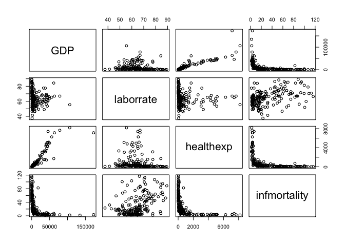<!-- -->

- 此处，我们没有使用ggplot2，是因为它不能绘制散点图矩阵（至少绘制的效果不佳）。上述绘图过程中也可以使用自定义的面板函数。我们定义一个panel.cor函数来展示变量两两之间的相关系数以代替默认的散点图。相关系数较大的位置将对应于较大的字体。现在暂时不需要关心函数的细节，先把代码粘贴到R会话或者脚本中：

``` r
> panel.cor <- function(x,y,digits=2,prefix="",cex.cor,...){
+ usr <- par("usr") 
+ on.exit(par(usr))
+ par(usr=c(0,1,0,1))
+ r <- abs(cor(x,y,use="complete.obs"))
+ txt <- format(c(r,0.123456789),digits=digits)[1] 
+ txt <- paste(prefix,txt,sep="")
+ if(missing(cex.cor))
+   cex.cor <- 0.8/strwidth(txt) 
+ text(0.5,0.5,txt,cex=cex.cor * (1+r)/2) 
+ }
```

- 为了在面板的对角线上展示各个变量的直方图，我们定义`panel.hist`函数：

``` r
> panel.hist <- function(x,...){
+   usr <- par("usr") 
+   on.exit(par(usr))
+   par(usr=c(usr[1:2],0,1.5))
+   h <- hist(x,plot=FALSE) 
+   breaks <- h$breaks 
+   nB <- length(breaks) 
+   y <- h$counts 
+   y <-y/max(y)
+   rect(breaks[-nB],0,breaks[-1],y,col="white",...)
+   }
```

- 上面的函数都取自于`pairs()`函数的帮助页面，为方便起见，也可以打开`pairs()`函数的帮助页面，复制、粘贴相关代码。不过，我们对这一版本的pane1.cor函数的最后一行进行了微小的修正，以使得散点矩阵图中的字体差异不像原始代码那么大。

- 定义了这些函数之后，我们可以调用它们来绘制散点图矩阵。令`pairs()`函数在面板的上三角执行`panel.cor`函数；在面板的对角线执行`panel.hist`函数。

- 绘图时也额外增加了一点东西：在面板的下三角执行`panel.smooth`函数。该函数将在散点图矩阵的下三角绘制散点图，并添加一个LOWESS平滑曲线(5.6节中介绍了LOESS，此处的LOWESS与LOESS略有不同，不过，对于这种初步
  的探索可视化方法而言，两者的区别并不重要)：

``` r
> pairs(c2009[,2:5], upper.panel=panel.cor,
+       diag.panel=panel.hist, 
+       lower.panel=panel.smooth)
```

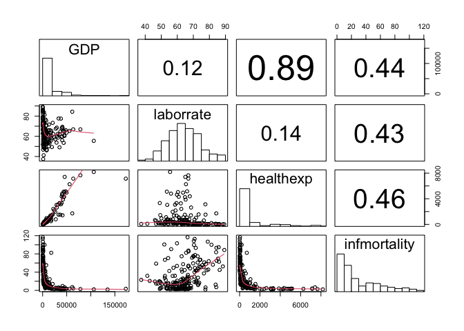<!-- -->

- 也许，我们会希望用线性模型代替LOWESS模型，`panel.lm`函数可以完成该操作（与前面的面板函数不同，这里的函数不在`pairs()`函数的帮助页面中)：

``` r
> panel.lm <- function(x,y,col=par("col"),bg=NA,pch=par("pch"),
+                      cex=1,col.smooth ="black",...){
+   points(x,y,pch=pch,col=col,bg=bg,cex=cex) 
+   abline(stats::lm(y~x),col=col.smooth,...)
+ }
```

- 这次，系统默认的线条颜色不再是红色，而是黑色。调用函数`pairs()`时（与函数`panel,smooth`配合使用)设定`col.smooth`参数可以对线条颜色进行修改。

- 为了便于辨认数据点，我们在图中使用更小一些的点。该操作可以通过设定`pch="."`来完成：

``` r
> pairs(c2009[,2:5],pch=".",
+       upper.panel=panel.cor,
+       diag.panel=panel.hist, 
+       lower.panel=panel.lm)
```

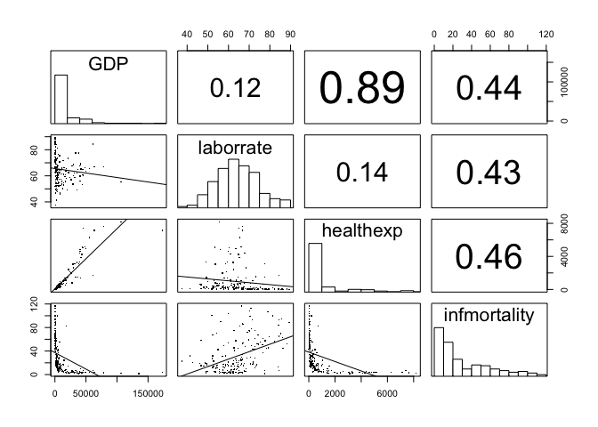<!-- -->

- cex参数可以控制图中点的大小。cex参数的默认值是1，其值越大，相应的数据点也越大，反之亦然。如果参数cex小于0.5，图形输出为PDF文件时可能无法很好地渲染。

- 关于创建相关系数矩阵的内容，可参见13.1节。

- GGally包中的`ggpairs()`函数也可以绘制散点图矩阵
