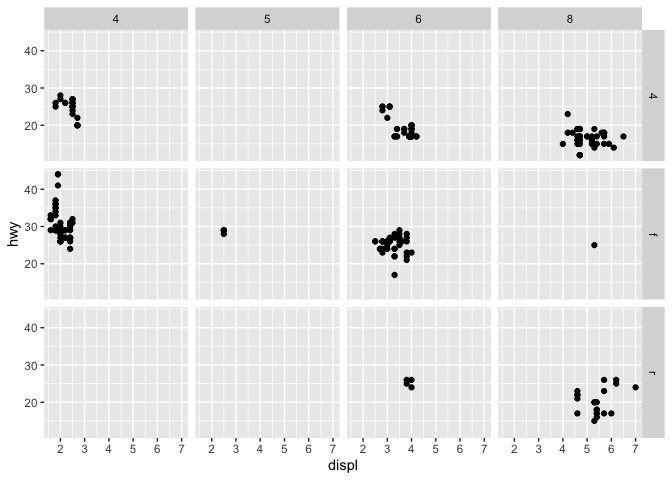
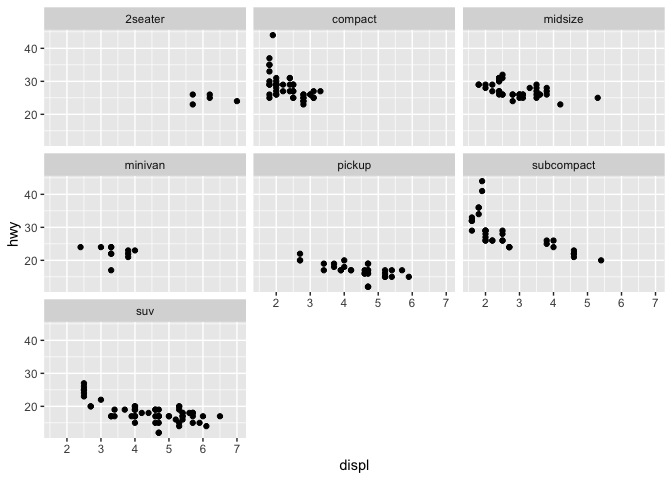
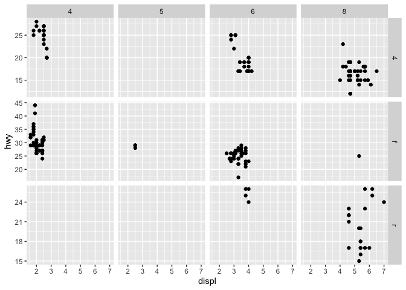
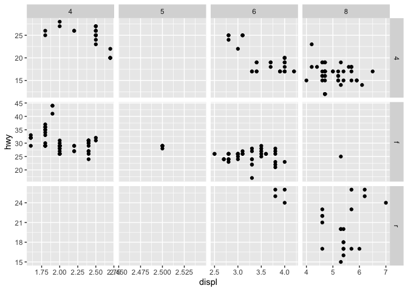
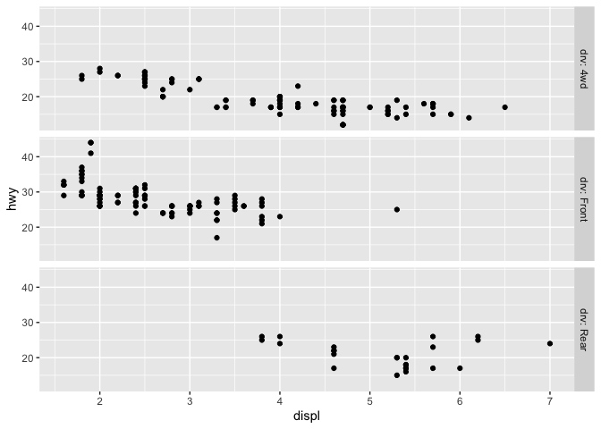
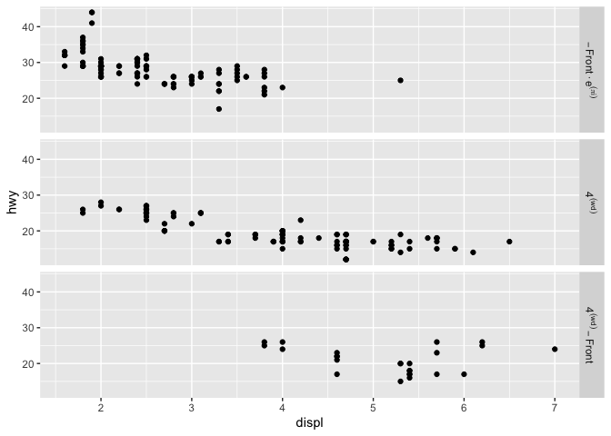
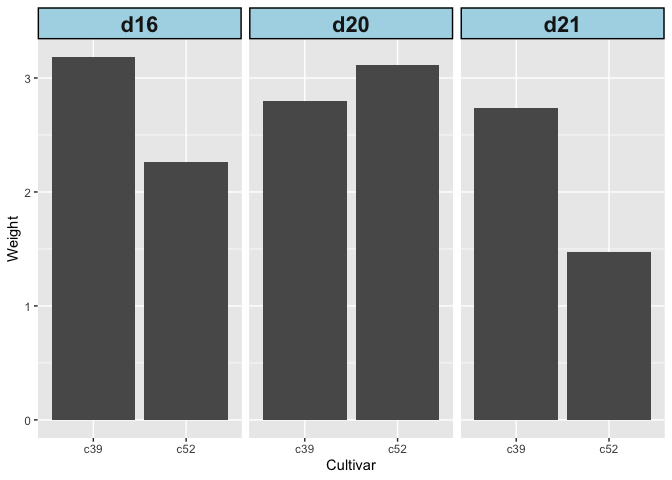

chapter11_分面
================

- <a href="#11-分面" id="toc-11-分面">11 分面</a>
  - <a href="#111-使用分面将数据分割绘制到子图中"
    id="toc-111-使用分面将数据分割绘制到子图中">11.1
    使用分面将数据分割绘制到子图中</a>
  - <a href="#112-在不同坐标轴下使用分面问题"
    id="toc-112-在不同坐标轴下使用分面问题">11.2
    在不同坐标轴下使用分面问题</a>
  - <a href="#113-修改分面的文本标签" id="toc-113-修改分面的文本标签">11.3
    修改分面的文本标签</a>
  - <a href="#114-修改分面标签和标题的外观"
    id="toc-114-修改分面标签和标题的外观">11.4 修改分面标签和标题的外观</a>

Source：

1.  《R数据可视化手册》，北京：人民邮电出版社，2014.5

# 11 分面

- 数据可视化中最实用的技术之一是将分组数据并列呈现，这样使得组间的比较变得轻而易举。使用ggplot2做这件事的方法之一是将一个离散型变量映射为一个图形属性，如x的位置、颜色或形状。另一种方法则是为每组数据创建一个子图，然后并排绘制这些子图。这类图形被称为格子(trellis)图形，它们已被lattice包和ggplot2包所实现。在ggplot2中，它们被称为分面(facet)。

## 11.1 使用分面将数据分割绘制到子图中

- 使用`facet_grid()`或`facet_wrap()`函数，并指定根据哪个变量来分割数据。

- 使用`facet_grid()`函数时，你可以指定一个变量作为纵向子面板分割的依据，并指定另外一个变量作为横向子面板分割的依据：

``` r
> library(ggplot2)
> # 基本图形
> p1 <- ggplot(mpg, aes(x=displ, y=hwy)) + geom_point()
> # 纵向排列的子面板根据drv分面
> p1 + facet_grid(drv ~.)
```

<!-- -->

``` r
> # 横向排列的子面板根据cyl分面
> p1 + facet_grid(.~ cyl)
```

<!-- -->

``` r
> # 同时根据drv(纵向)和cyl(横向)分割
> p1 + facet_grid(drv ~ cyl)
```

<!-- -->

- 使用`facet_wrap()`时，各子图将像纸上的文字一样被依次横向排布并换行，如下图所示：

``` r
> # 依class分面
> # 注意波浪线前没有任何字符
> p1 + facet_wrap(~ class)
```

<!-- -->

- 使用`facet_wrap()`时，默认使用相等数量的行和列。下图中共有7个分面，恰好可以嵌入一个3X3的“方阵”中。要对该方阵进行修改，可以通过向nrow或ncol赋值实现：

``` r
> # 两种方式的结果是相同的：3行3列的分面
> p1 + facet_wrap( ~ class, nrow=3)
```

<!-- -->

``` r
> # p1 + facet_wrap( ~ class, ncol=3)
```

- 分面方向的选择依赖于你更倾向于鼓励读图者进行哪种类型的比较。举例来说，如果你希望比较各条形的高度，让分面横向排布会更有用；如果你希望比较直方图的水平分布，那么纵向排布分面是明智的选择。

- 有时两类比较都很重要一所以对于哪种分面方向更好的问题，可能没有一个明确的答案。可能的结果是，通过将分组变量映射到某种如颜色之类的图形属性，在单一的图形中来展示分组，会比使用分面的效果更好。在这些情况下，只能依靠你自己的判断来决定使用哪种方式。

## 11.2 在不同坐标轴下使用分面问题

- 将标度设置为”free_x”、“free_y”或”free”：

``` r
> # 基本图形
> p1 <- ggplot(mpg, aes(x=displ, y=hwy)) + geom_point()
> 
> # 使用自由的y标度
> p1 + facet_grid(drv ~ cyl, scales="free_y")
```

<!-- -->

``` r
> 
> # 使用自由的x标度和y标度
> p1 + facet_grid(drv ~ cyl, scales="free")
```

<!-- -->

- 当使用自由的y标度时，各行子图都将拥有自己的y值域；当使用自由的x标度时，相同的原理也适用于各列子图。

- 你无法直接设置各行或各列的值域，但是可以通过丢弃不想要的数据(以缩减值域)或通过添加儿何对象`geom_blank()`(以扩展值域)的方式控制值域的大小。

- 参见3.10节中使用自由标度和离散型坐标轴分面的示例。

## 11.3 修改分面的文本标签

- 修改因子各水平的名称即可：

- 需要使用dplyr包中的`recode()`函数。

``` r
> library(ggplot2)
> library(dplyr)
> # 用dplyr包将原始数据内的分面变量drv的各个名称变量修改为目标要求，并存为新的数据用来做图
> mpg2 <- mpg %>%
+ # 将4修改为4wd、f为Front、r为Rear
+ mutate(drv = recode(drv, "4" = "4wd","f" = "Front","r" = "Rear"))
> # 使用新数据做图，观察右侧部分标签内容
> ggplot(mpg2, aes(x = displ, y = hwy)) + geom_point() + facet_grid(drv ~ .)
```

<!-- -->

- 要设置分面标签，必须修改数据本身的值，这在用法上与能够设置标签的标度有所不同。另外，在本书撰写之时，尚无将分面变量的名称作为各分面标题显示的方法，所以使用更有描述力的分面标签是比较有用的。

- 使用`facet_grid()`时(目前并不适用于`facet_wrap()`)，可以使用一个贴标函数(labeller
  function)来设置标签。以下贴标函数`label_both()`将在每个分面上同时打印出变量的名称和变量的值：

``` r
> ggplot(mpg2, aes(x=displ, y=hwy)) + geom_point () + facet_grid(drv ~ ., labeller = label_both)
```

<!-- -->

- 另一个实用贴标函数是`label_parsed()`，它可以读入字符串，并将其作为R数学表达式来解析：

``` r
> library(dplyr)
> # 用dplyr包将原始数据内的分面变量drv的各个名称变量修改为目标要求，并存为新的数据用来做图
> mpg3 <- mpg %>%
+ # 将4修改为4^(wd)、f为- Front %.% e^(pi*i)、r为4^(wd) - Front
+ mutate(drv = recode(drv, "4" = "4^(wd)","f" = "- Front %.% e^(pi*i)","r" = "4^(wd) - Front"))
> 
> ggplot(mpg3, aes(x=displ, y=hwy)) + geom_point() + 
+   facet_grid(drv ~ ., labeller = label_parsed)
```

<!-- -->

- 参见15.10节以了解更多因子水平重命名的知识。

- 如果分面变量不是一个因子而是一个字符型向量，修改方式会稍有不同。参考15.12节以了解字符型向量元素的重命名。

## 11.4 修改分面标签和标题的外观

- 使用主题系统，通过设置`strip.text`来控制文本的外观，设置`strip.background`以控制背景的外观：

``` r
> library(gcookbook)  # 为了使用数据集
> ggplot(cabbage_exp, aes(x=Cultivar, y=Weight)) + geom_bar(stat="identity") + facet_grid(. ~ Date) + 
+   theme(strip.text = element_text(face="bold", size=rel(1.5)),
+         strip.background = element_rect(fill="lightblue", colour="black",linewidth = 1))
```

<!-- -->

- rel(1.5)使得标签文本的大小为此主题下基准文本大小的1.5倍。

- 在背景设置中使用的linewidth=1使得分面标题背景轮廓线的粗细为1毫米。

- 关于主题系统工作原理的更多信息，参见9.3节和9.4节。
