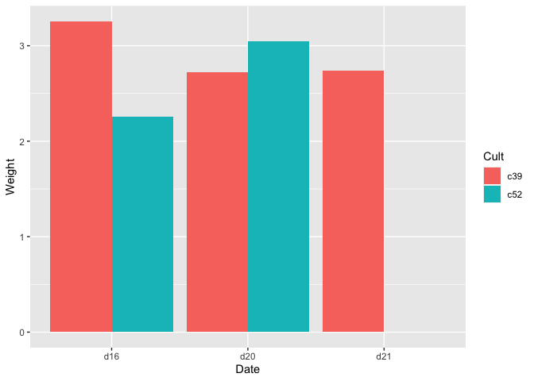

chapter15_数据塑形
================

- <a href="#15-数据塑形" id="toc-15-数据塑形">15 数据塑形</a>
  - <a href="#151-创建数据框" id="toc-151-创建数据框">15.1 创建数据框</a>
  - <a href="#152-从数据框中提取信息" id="toc-152-从数据框中提取信息">15.2
    从数据框中提取信息</a>
  - <a href="#153-向数据框添加列" id="toc-153-向数据框添加列">15.3
    向数据框添加列</a>
  - <a href="#154-从数据框中删除一列问题"
    id="toc-154-从数据框中删除一列问题">15.4 从数据框中删除一列问题</a>
  - <a href="#155-重命名数据框的列名" id="toc-155-重命名数据框的列名">15.5
    重命名数据框的列名</a>
  - <a href="#156-重排序数据框的列" id="toc-156-重排序数据框的列">15.6
    重排序数据框的列</a>
  - <a href="#157-从数据框提取子集" id="toc-157-从数据框提取子集">15.7
    从数据框提取子集</a>
  - <a href="#158-改变因子水平的顺序" id="toc-158-改变因子水平的顺序">15.8
    改变因子水平的顺序</a>
  - <a href="#159-根据数据的值改变因子水平的顺序"
    id="toc-159-根据数据的值改变因子水平的顺序">15.9
    根据数据的值改变因子水平的顺序</a>
  - <a href="#1510-改变因子水平的名称"
    id="toc-1510-改变因子水平的名称">15.10 改变因子水平的名称</a>
  - <a href="#1511-去掉因子中不再使用的水平"
    id="toc-1511-去掉因子中不再使用的水平">15.11
    去掉因子中不再使用的水平</a>
  - <a href="#1512-在字符向量中改变元素的名称"
    id="toc-1512-在字符向量中改变元素的名称">15.12
    在字符向量中改变元素的名称</a>
  - <a href="#1513-把一个分类变量转化成另一个分类变量"
    id="toc-1513-把一个分类变量转化成另一个分类变量">15.13
    把一个分类变量转化成另一个分类变量</a>
  - <a href="#1514-连续变量转变为分类变量"
    id="toc-1514-连续变量转变为分类变量">15.14 连续变量转变为分类变量</a>
  - <a href="#1515-变量转换" id="toc-1515-变量转换">15.15 变量转换</a>
  - <a href="#1516-按组转换数据" id="toc-1516-按组转换数据">15.16
    按组转换数据</a>
  - <a href="#1517-分组汇总数据" id="toc-1517-分组汇总数据">15.17
    分组汇总数据</a>
    - <a href="#15171-处理缺失值" id="toc-15171-处理缺失值">15.17.1
      处理缺失值</a>
    - <a href="#15172-组合缺失" id="toc-15172-组合缺失">15.17.2 组合缺失</a>
  - <a href="#1518-使用标准误差和置信区间来汇总数据"
    id="toc-1518-使用标准误差和置信区间来汇总数据">15.18
    使用标准误差和置信区间来汇总数据</a>
    - <a href="#15181-置信区间" id="toc-15181-置信区间">15.18.1 置信区间</a>
  - <a href="#1519-把数据框从宽变长" id="toc-1519-把数据框从宽变长">15.19
    把数据框从“宽”变“长”</a>
  - <a href="#1520-把数据框从长变宽" id="toc-1520-把数据框从长变宽">15.20
    把数据框从“长”变“宽”</a>
  - <a href="#1521-把时间序列数据对象拆分成时间和数据"
    id="toc-1521-把时间序列数据对象拆分成时间和数据">15.21
    把时间序列数据对象拆分成时间和数据</a>

Source：

1.  《R数据可视化手册》，北京：人民邮电出版社，2014.5

# 15 数据塑形

- R中的数据集常以数据框的形式存在。它们都是典型的二维数据结构，每行代表一个具体对象(case)，每列代表一个描述对象的变量。数据框本质上是由向量和因子组成的列表，其中每个向量或者因子代表了数据的一列。

- 下面是heightweight数据集：

``` r
> library(gcookbook) # 为了使用数据集
> head(heightweight)
  sex ageYear ageMonth heightIn weightLb
1   f   11.92      143     56.3     85.0
2   f   12.92      155     62.3    105.0
3   f   12.75      153     63.3    108.0
4   f   13.42      161     59.0     92.0
5   f   15.92      191     62.5    112.5
6   f   14.25      171     62.5    112.0
```

- 它一共五列，每行代表了一个具体对象(case)：某个人的一些信息。我们可以通过`str()`函数清楚地了解它的结构。

``` r
> str(heightweight)
'data.frame':   236 obs. of  5 variables:
 $ sex     : Factor w/ 2 levels "f","m": 1 1 1 1 1 1 1 1 1 1 ...
 $ ageYear : num  11.9 12.9 12.8 13.4 15.9 ...
 $ ageMonth: int  143 155 153 161 191 171 185 142 160 140 ...
 $ heightIn: num  56.3 62.3 63.3 59 62.5 62.5 59 56.5 62 53.8 ...
 $ weightLb: num  85 105 108 92 112 ...
```

- 数据的第一列sex，是一个两水平(“f”和”m”)的因子。其余四列都是数值型向量(其中的ageMonth是整型向量，但在此处，它与其他数值向量并无明显区别)。

- 因子和字符型向量在ggplot2中的处理方式相类似，主要区别在于，展示字符型向量代表的项目时，它们以字母表的顺序排列，而因子型的项目是按因子水平的顺序排列，这个顺序是可以由用户控制的。

## 15.1 创建数据框

- 你可以把向量放在`data.frame()`里面：

``` r
> # 从两个简单的向量开始
> g <- c("A","B", "C")
> x <- 1:3
> dat1 <- data.frame(g, x)
> dat1
  g x
1 A 1
2 B 2
3 C 3
```

- 数据框本质上是由一堆向量和因子构成的列表，其中每个向量或者因子代表了一列。如果你的向量在一个列表中，你可以用`as.data.frame()`函数直接将它们转化成数据框：

``` r
> l1 <- list(group = g, value = x) # 由向量组成的列表
> dat2 <- as.data.frame(l1)
> dat2
  group value
1     A     1
2     B     2
3     C     3
```

## 15.2 从数据框中提取信息

- 使用`str()`函数：

``` r
> str(ToothGrowth)
'data.frame':   60 obs. of  3 variables:
 $ len : num  4.2 11.5 7.3 5.8 6.4 10 11.2 11.2 5.2 7 ...
 $ supp: Factor w/ 2 levels "OJ","VC": 2 2 2 2 2 2 2 2 2 2 ...
 $ dose: num  0.5 0.5 0.5 0.5 0.5 0.5 0.5 0.5 0.5 0.5 ...
```

- 以上代码告诉你ToothGrowth由len、supp和dose三列组成，len和dose包含的是数值变量，而supp是一个有两个水平的因子。

- `str()`函数在提取数据框更多信息的时候很实用。一个常见的问题是，有时候一个数据框包含的向量是字符型向量而不是因子，反之亦然。这个问题会在分析和画图的时候给我们造成一些困扰。

- 当你想用常规的方式输出一个数据框时，只需要在提示符(\>)后面输入数据框的名称，然后敲下回车键。你会发现字符型向量和因子的输出效果一样，你无法分辨出哪个是字符型向量，哪个是因子。只有当你运行`str()`函数或者单独输出一列的时候，才能看出它们的区别：

``` r
> tg <- ToothGrowth
> tg$supp <- as.character(tg$supp)
> 
> str(tg)
'data.frame':   60 obs. of  3 variables:
 $ len : num  4.2 11.5 7.3 5.8 6.4 10 11.2 11.2 5.2 7 ...
 $ supp: chr  "VC" "VC" "VC" "VC" ...
 $ dose: num  0.5 0.5 0.5 0.5 0.5 0.5 0.5 0.5 0.5 0.5 ...
```

``` r
> # 直接输出列
> # 原始数据框(因子)
> ToothGrowth$supp
 [1] VC VC VC VC VC VC VC VC VC VC VC VC VC VC VC VC VC VC VC VC VC VC VC VC VC
[26] VC VC VC VC VC OJ OJ OJ OJ OJ OJ OJ OJ OJ OJ OJ OJ OJ OJ OJ OJ OJ OJ OJ OJ
[51] OJ OJ OJ OJ OJ OJ OJ OJ OJ OJ
Levels: OJ VC
```

``` r
> # 新数据框(字符串)
> tg$supp
 [1] "VC" "VC" "VC" "VC" "VC" "VC" "VC" "VC" "VC" "VC" "VC" "VC" "VC" "VC" "VC"
[16] "VC" "VC" "VC" "VC" "VC" "VC" "VC" "VC" "VC" "VC" "VC" "VC" "VC" "VC" "VC"
[31] "OJ" "OJ" "OJ" "OJ" "OJ" "OJ" "OJ" "OJ" "OJ" "OJ" "OJ" "OJ" "OJ" "OJ" "OJ"
[46] "OJ" "OJ" "OJ" "OJ" "OJ" "OJ" "OJ" "OJ" "OJ" "OJ" "OJ" "OJ" "OJ" "OJ" "OJ"
```

## 15.3 向数据框添加列

- 只需把值赋到新的列即可。

- 如果你把单个值赋到一个新的列，那么整个列都会被赋予这个值。下面的例子是增加一个新的列，值全部是NA：

<!-- -->

    data$newcol <- NA

- 你也可以把一个向量赋到新的一列：

<!-- -->

    data$newcol <- vec

- 如果该向量的长度比数据框的行数小，那么R会重复这个向量，直到所有的行被填充。

- 数据框的每一列都是一个向量或者因子。R在处理数据框的时候会和处理单独的向量时略有不同，因为在数据框中所有列的长度都是一样的。

## 15.4 从数据框中删除一列问题

- 把该列的值赋成NULL即可。

<!-- -->

    data$badcol <- NULL

- 你也可以使用`subset()`函数并将一个-(减号)置于待删除的列之前：

<!-- -->

    # 返回不包含badcol列的数据
    data <- subset(data, select = -badcol)
    # 排除badcol列和othercol列
    data <- subset(data, select = c(-badcol, -othercol))

- 更多关于获取数据框子集的信息，参见15.7节。

## 15.5 重命名数据框的列名

- 使用`names(dat) <-`函数即可：

<!-- -->

    names(dat) <- c("name1", "name2", "name3" )

- 如果你想通过列名重命名某一列：

``` r
> library(gcookbook) # 为了使用数据集
> names(anthoming)  # 输出列名
[1] "angle" "expt"  "ctrl" 
> 
> names(anthoming)[names(anthoming) == "ctrl"] <- c("Control")
> names(anthoming)[names(anthoming) == "expt"] <- c("Experimental") 
> names(anthoming)
[1] "angle"        "Experimental" "Control"     
```

- 你也可以通过名字的数值位置重命名：

``` r
> names(anthoming)[1] <- "Angle"
> names(anthoming)
[1] "Angle"        "Experimental" "Control"     
```

## 15.6 重排序数据框的列

    # 通过列的数值位置重排序
    dat <- dat[c(1,3,2)]
    # 通过列的名称重排序
    dat <- dat[c("col1", "col3", "col2")]

- 前面的例子用了一个列表形式的索引。数据框本质上是若干向量组成的列表，如果改变其索引，我们会得到另一个数据框。我们用矩阵形式的索引也能得到同样的效果：

``` r
> library(gcookbook) # 为了使用数据集
> anthoming
  Angle Experimental Control
1   -20            1       0
2   -10            7       3
3     0            2       3
4    10            0       3
5    20            0       1
> 
> anthoming[c(1,3,2)] # 列表风格的索引
  Angle Control Experimental
1   -20       0            1
2   -10       3            7
3     0       3            2
4    10       3            0
5    20       1            0
> 
> # 逗号之前的空白表示输出所有行
> anthoming[ , c(1,3,2)]# 矩阵风格的索引
  Angle Control Experimental
1   -20       0            1
2   -10       3            7
3     0       3            2
4    10       3            0
5    20       1            0
```

- 这种情况下，两种方法都会得到数据框。然而，当你检索单独一列的时候，列表风格的索引会得到数据框，而矩阵风格的索引得到的是向量，除非你加上参数`drop=FALSE`：

``` r
> anthoming[3] # 列表风格的索引
  Control
1       0
2       3
3       3
4       3
5       1
> 
> anthoming[ , 3]# 矩阵风格的索引
[1] 0 3 3 3 1
> 
> anthoming[, 3, drop=FALSE] #矩阵风格的索引，并添加参数drop=FALSE
  Control
1       0
2       3
3       3
4       3
5       1
```

## 15.7 从数据框提取子集

- 使用`subset()`函数。它可以筛选出符合一系列条件的行和选出特定的列。我们用climate数据集作为例子：

``` r
> library(gcookbook) # 为了使用数据集
> head(climate)
    Source Year Anomaly1y Anomaly5y Anomaly10y Unc10y
1 Berkeley 1800        NA        NA     -0.435  0.505
2 Berkeley 1801        NA        NA     -0.453  0.493
3 Berkeley 1802        NA        NA     -0.460  0.486
4 Berkeley 1803        NA        NA     -0.493  0.489
5 Berkeley 1804        NA        NA     -0.536  0.483
6 Berkeley 1805        NA        NA     -0.541  0.475
```

-下面的代码只会输出Source是”Berkeley”的行，并且选取名字为Year和Anomaly1Oy的列：

``` r
> s1 <- subset(climate, Source == "Berkeley", select = c(Year, Anomaly10y))
> head(s1)
  Year Anomaly10y
1 1800     -0.435
2 1801     -0.453
3 1802     -0.460
4 1803     -0.493
5 1804     -0.536
6 1805     -0.541
```

- 我们还可以通过使用\|(OR)和&(AND)操作符同时施加多种筛选条件。例如，下面的代码会筛选出Source是”Berkeley”并且Year在1900和2000之间的数据：

``` r
> s2 <- subset(climate, Source == "Berkeley" & Year >= 1900 & Year <= 2000,
+              select = c(Year, Anomaly10y))
> head(s2)
    Year Anomaly10y
101 1900     -0.171
102 1901     -0.162
103 1902     -0.177
104 1903     -0.199
105 1904     -0.223
106 1905     -0.241
```

- 你也可以在方括号里面加入索引来得到子数据框，虽然这种方法不是很优雅。下面的代码和上面用到的代码有同样的效果。方括号里面、逗号前面的部分提取行，逗号后面的部分提取列，如果用这种方式得到的结果只有一列，那么它会返回一个向量而不是一个数据框，除非你使用参数`drop=FALSE`：

``` r
> c1 <- climate[climate$Source=="Berkeley" & climate$Year >= 1900 & climate$Year <= 2000,
+               c("Year", "Anomaly10y"),drop=FALSE]
> head(c1)
    Year Anomaly10y
101 1900     -0.171
102 1901     -0.162
103 1902     -0.177
104 1903     -0.199
105 1904     -0.223
106 1905     -0.241
```

- 最后，我们还可以通过行和列的数值位置提取子数据框。下面代码得到的是前100行的第二和第五列：

``` r
> c2 <- climate[1:100, c(2,5)]
> head(c2)
  Year Anomaly10y
1 1800     -0.435
2 1801     -0.453
3 1802     -0.460
4 1803     -0.493
5 1804     -0.536
6 1805     -0.541
```

- 我建议尽可能地使用名称索引，避免使用数字索引。前者使代码更加易懂，尤其是你和其他人合作的时候或者在你完成代码几个月甚至几年以后回过头来再看的时候，也使得代码不容易因为数据框行和列的增减而得不到原先的效果。

## 15.8 改变因子水平的顺序

- 因子的水平可以由函数`factor()`具体设定。在下面这个例子中，我们创造了一个因子，但是它的因子水平的顺序是乱的：

``` r
> # 默认的因子水平的顺序是按字母排的
> s3 <- factor(c("small", "large", "large", "small", "medium"))
> s3
[1] small  large  large  small  medium
Levels: large medium small
> 
> # 改变因子水平的顺序
> s4 <- factor(s3, levels = c("small", "medium", "large"))
> s4
[1] small  large  large  small  medium
Levels: small medium large
```

- 因子的顺序也可以在第一次创建因子时通过levels参数来指定。

- R中有两种因子：顺序因子(orderer factor)和常规因子(regular
  factor)。在两种类型中，因子水平都是按某种顺序排列的；区别在于，对于顺序因子，因子水平的顺序是有意义的，而对于常规因子，因子水平的顺序却没有什么意义一它仅仅是反映了数据是如何存储的。对于用于画图的数据，两者的区别一般来说不太重要，因为处理它们的方式是一样的。

- 因子水平的顺序会影响图形输出。当一个因子变量被映射到ggplot2中的图形属性中，图形属性会采用因子水平的顺序。如果因子被映射到x轴，x轴的标签会按因子水平的顺序排列；如果因子被映射到颜色上，那么图例会按因子水平的顺序排序。

- 如果要颠倒因子水平的顺序，可以使用函数`rev(levels())`：

``` r
> s5 <- factor(s3, levels = rev(levels(s3)))
> s5
[1] small  large  large  small  medium
Levels: small medium large
```

- 如果要依据其他变量的值对因子水平排序，参见15.9节。

- 改变因子的顺序对控制坐标标签和图例的顺序很有用。参见8.3节和10.3节。

## 15.9 根据数据的值改变因子水平的顺序

- 使用函数`reorder()`，该函数有三个参数：因子，排序依据的数据和汇总数据的函数。

``` r
> # 复制一份数据，因为我们要修改它
> iss1 <- InsectSprays
> iss1$spray
 [1] A A A A A A A A A A A A B B B B B B B B B B B B C C C C C C C C C C C C D D
[39] D D D D D D D D D D E E E E E E E E E E E E F F F F F F F F F F F F
Levels: A B C D E F
> 
> iss2 <- reorder(iss1$spray, iss1$count, FUN=mean)
> iss2
 [1] A A A A A A A A A A A A B B B B B B B B B B B B C C C C C C C C C C C C D D
[39] D D D D D D D D D D E E E E E E E E E E E E F F F F F F F F F F F F
attr(,"scores")
        A         B         C         D         E         F 
14.500000 15.333333  2.083333  4.916667  3.500000 16.666667 
Levels: C E D A B F
> 
> iss3 <- reorder(iss1$spray, iss1$count, FUN=median)
> iss3
 [1] A A A A A A A A A A A A B B B B B B B B B B B B C C C C C C C C C C C C D D
[39] D D D D D D D D D D E E E E E E E E E E E E F F F F F F F F F F F F
attr(,"scores")
   A    B    C    D    E    F 
14.0 16.5  1.5  5.0  3.0 15.0 
Levels: C E D A F B
```

- 原始因子水平的顺序是ABCDEF，重排后的顺序是CEDABF。新的顺序是由`iss$spray`中每组`iss$count`的平均值决定的。

- 仅从简单的输出我们无法看出`reorder()`的作用。下面3幅图给我们展示了经过`reorder()`函数排序后的三个图形。在这些图形中，每一项出现的顺序是由它们的某些值决定的。图fig.15-1-2的箱线图是按照每组的平均值排序的。箱线图中箱子里的水平线表示了这一组的中位数。注意到这些中位数并不是从左到右严格递增的。这是因为根据均值和根据中位数排序得到的顺序是不一样的。为了使中位数线从左到右递增，就像图fig.15-1-3一样，我们必须按每组的中位数排序，于是在`reorder()`中，我们应该使用函数`median()`。

``` r
> library(ggplot2)
> p1 <- ggplot(iss1, aes(x=spray, y=count)) + geom_boxplot()
> p1 + labs(title = "fig.15-1-1")
```

<!-- -->

``` r
> p2 <- ggplot(iss1, aes(x=iss2, y=count)) + geom_boxplot()
> p2 + labs(title = "fig.15-1-2", x = "reorder(spray,count,FUN=mean)", y = "count")
```

<!-- -->

``` r
> p3 <- ggplot(iss1, aes(x=iss3, y=count)) + geom_boxplot()
> p3 + labs(title = "fig.15-1-3", x = "reorder(spray,count,FUN=median)", y = "count")
```

<!-- -->

- 改变因子的顺序对控制坐标标签的顺序和图例的顺序很有用，参见8.3节和10.3节。

## 15.10 改变因子水平的名称

- 使用plyr包中的`revalue()`函数或`mapvalues()`函数。

``` r
> library(plyr)
> # 默认的因子水平的顺序是按字母排的
> s3 <- factor(c("small", "large", "large", "small", "medium"))
> s3
[1] small  large  large  small  medium
Levels: large medium small
> 
> levels(s3)
[1] "large"  "medium" "small" 
> 
> # 通过函数revalue()，传递一组映射关系
> s5 <- revalue(s3, c(small="S", medium="M", large="L"))
> s5
[1] S L L S M
Levels: L M S
> 
> # 也可以使用引号，如果原因子水平名称中存在空格等特殊字符，这将很有用 
> s6 <- revalue(s3, c("small"="S", "medium"="M", "large"="L")) 
> s6
[1] S L L S M
Levels: L M S
> 
> # mapvalues()函数使用两组向量，而不是一组映射关系向量
> s7 <- mapvalues(s3, c("small", "medium", "large"),c("S", "M","L"))
> s7
[1] S L L S M
Levels: L M S
```

- 如果你要改变所有水平的名称，这里有一个更简单的方法。你可以给`levels()`传递一个list类型的参数：

``` r
> s3.1 <- s3
> levels(s3.1) <- list(S="small",M="medium",L="large")
> s3.1
[1] S L L S M
Levels: S M L
```

- 在这个方法中，所有的因子水平必须在一个list里面指定；如果这个list里面有任何的缺失，缺失的值最终会以NA
  代替。

- 如果需要改变字符向量的名称，参见15.12节。

## 15.11 去掉因子中不再使用的水平

- 有的时候，在你对一堆数据进行操作之后，会有一些因子包含了不再使用的因子水平。下面就有一个例子（删除了medium因子水平）：

``` r
> s3.2 <- s3
> s3.2 <- s3.2[1:3]
> s3.2
[1] small large large
Levels: large medium small
```

- 为了删除这些不需要的水平，可以使用`droplevels()`函数：

``` r
> s3.3 <- droplevels(s3.2)
> s3.3
[1] small large large
Levels: large small
```

- `droplevels()`函数保留了因子水平的顺序。另外，你可以使用except参数保留某个特定的水平。

## 15.12 在字符向量中改变元素的名称

- 用plyr包中的`revalue()`函数或者`mapvalues()`函数：

``` r
> s8 <- c("small", "large", "large", "small", "medium")
> s8
[1] "small"  "large"  "large"  "small"  "medium"
> 
> # 通过函数revalue()，传递一组映射关系
> s9 <- revalue(s8, c(small="S", medium="M", large="L"))
> s9
[1] "S" "L" "L" "S" "M"
> 
> # 也可以使用引号，如果原因子水平名称中存在空格等特殊字符，这将很有用
> s10 <- revalue(s8, c("small"="S", "medium"="M", "large"="L"))
> s10
[1] "S" "L" "L" "S" "M"
> 
> # mapvalues()函数使用两组向量，而不是一组映射关系向量
> s11 <- mapvalues(s8, c("small", "medium", "large"),c("S","M","L"))
> s11
[1] "S" "L" "L" "S" "M"
```

- 如果你要改变因子水平的名称，参见15.10节的方法。

## 15.13 把一个分类变量转化成另一个分类变量

- 如下面的例子，我们使用PlantGrowth数据集的一个子数据集：

``` r
> # 在PlantGrowth的一个子数据集上操作
> pg <- PlantGrowth[c(1,2,11,21,22), ]
> pg
   weight group
1    4.17  ctrl
2    5.58  ctrl
11   4.81  trt1
21   6.31  trt2
22   5.12  trt2
```

- 在这个例子中，我会把一个分类变量group编码到另一个分类变量treatment中。如果原先的值是”ctrl”，新的值就是”No”；如果原先的值是”trt1”或者”trt2”，新的值就是”Yes”。

- 这个可以用`match()`函数完成：

``` r
> pg1 <- pg
> oldvals <- c("ctrl", "trt1", "trt2")
> newvals <- factor(c("No", "Yes", "Yes"))
> pg1$treatment <- newvals[match(pg1$group, oldvals)]
> pg1$treatment
[1] No  No  Yes Yes Yes
Levels: No Yes
> 
> # 转化为因子
> pg1$treatment <- factor(pg1$treatment)
> pg1
   weight group treatment
1    4.17  ctrl        No
2    5.58  ctrl        No
11   4.81  trt1       Yes
21   6.31  trt2       Yes
22   5.12  trt2       Yes
```

- 这里，我们把两个因子水平组合起来然后把结果存到一个新的列里面。如果你仅仅是想对因子水平重命名，参见15.10节的方法。

- 通过使用&和\|操作符，编码准则同样可以基于多个列的取值：

``` r
> pg2 <- pg1
> pg2$newcol[pg2$group == "ctrl"& pg2$weight < 5] <- "no_small" 
> pg2$newcol[pg2$group == "ctrl"& pg2$weight >= 5] <- "no_large" 
> pg2$newcol[pg2$group == "trt1"] <- "yes"
> pg2$newcol[pg2$group == "trt2"] <- "yes"
> pg2$newcol <- factor(pg2$newcol) 
> pg2$weightcat[pg2$weight < 5] <- "small" 
> pg2$weightcat[pg2$weight >= 5] <- "large" 
> pg2$weightcat <- factor(pg2$weightcat) 
> pg2
   weight group treatment   newcol weightcat
1    4.17  ctrl        No no_small     small
2    5.58  ctrl        No no_large     large
11   4.81  trt1       Yes      yes     small
21   6.31  trt2       Yes      yes     large
22   5.12  trt2       Yes      yes     large
```

- 我们也可以使用`interaction()`函数把数据框中的两列组合成一列。该函数会在两个值的中间加上一个`.`符号。下面的例子把weightcat和treatment组合起来形成新的列weighttrt：

``` r
> pg3 <- pg2
> pg3$weighttrt <- interaction(pg3$weightcat, pg3$treatment)
> pg3
   weight group treatment   newcol weightcat weighttrt
1    4.17  ctrl        No no_small     small  small.No
2    5.58  ctrl        No no_large     large  large.No
11   4.81  trt1       Yes      yes     small small.Yes
21   6.31  trt2       Yes      yes     large large.Yes
22   5.12  trt2       Yes      yes     large large.Yes
```

- 对于更多关于改变因子水平名称的方法，参见15.10节。

- 对于把连续变量转变为分类变量，参见15.14节。

## 15.14 连续变量转变为分类变量

- 下面的例子，我们使用PlantGrowth数据集的一个子数据集。

``` r
> pg
   weight group
1    4.17  ctrl
2    5.58  ctrl
11   4.81  trt1
21   6.31  trt2
22   5.12  trt2
```

- 在这个例子中，我们使用`cut()`函数把一个连续变量weight转化为分类变量wtclass：

``` r
> pg4 <- pg
> pg4$wtclass <- cut(pg4$weight, breaks = c(0, 5, 6, Inf))
> pg4
   weight group wtclass
1    4.17  ctrl   (0,5]
2    5.58  ctrl   (5,6]
11   4.81  trt1   (0,5]
21   6.31  trt2 (6,Inf]
22   5.12  trt2   (5,6]
```

- 我们为三个类设定了四个边界值，边界值可以包括正无穷(Inf)和负无穷(-Inf)。如果个值落在我们规定的区间之外，它的类别将被定为NA(缺失值)。`cut()`函数的输出结果是一个因子，你可以从下面这个例子中看出：因子水平的名称是以生成的区间命名的。为了改变因子水平的名称，我们可以使用`cut()`中的labels参数：

``` r
> pg5 <- pg
> pg5$wtclass <- cut(pg5$weight, breaks = c(0, 5, 6, Inf),
+                    labels = c("small", "medium", "large"))
> pg5
   weight group wtclass
1    4.17  ctrl   small
2    5.58  ctrl  medium
11   4.81  trt1   small
21   6.31  trt2   large
22   5.12  trt2  medium
```

- `cut()`生成的区间是左开右闭的，换句话说，**它们不会包含最小值，但是它们包含了最大值**。对于值最小的一类，你可以通过设定参数`include.lowest=TRUE`使得它同时包含最小值和最大值。在这个例子中，这么做会使得0被包含到small类中；否则，0会被赋为NA。如果你想让生成的区间是左闭右开的，设定参数`right=FALSE`：

``` r
> pg6 <- pg
> pg6$wtclass <- cut(pg6$weight, breaks = c(0, 5, 6, Inf),right=FALSE)
> pg6
   weight group wtclass
1    4.17  ctrl   [0,5)
2    5.58  ctrl   [5,6)
11   4.81  trt1   [0,5)
21   6.31  trt2 [6,Inf)
22   5.12  trt2   [5,6)
```

- 对于如何把一个分类变量转化成另一个分类变量，参见15.13节。

## 15.15 变量转换

- 可以使用`$`操作符来引用新列并对其赋予新值。在本例中，我们将使用heightweight数据集的复制版本：

``` r
> library(gcookbook) # 为了使用数据集
> # 复制数据集
> hw1 <- heightweight
> head(hw1)
  sex ageYear ageMonth heightIn weightLb
1   f   11.92      143     56.3     85.0
2   f   12.92      155     62.3    105.0
3   f   12.75      153     63.3    108.0
4   f   13.42      161     59.0     92.0
5   f   15.92      191     62.5    112.5
6   f   14.25      171     62.5    112.0
```

- 这将会把heightIn的单位从英尺转换到厘米，然后存储到新的一列heightCm中：

``` r
> hw2 <- hw1
> hw2$heightCm <- hw2$heightIn * 2.54
> head(hw2)
  sex ageYear ageMonth heightIn weightLb heightCm
1   f   11.92      143     56.3     85.0  143.002
2   f   12.92      155     62.3    105.0  158.242
3   f   12.75      153     63.3    108.0  160.782
4   f   13.42      161     59.0     92.0  149.860
5   f   15.92      191     62.5    112.5  158.750
6   f   14.25      171     62.5    112.0  158.750
```

- 为了使代码更容易阅读，你可以使用`transform()`或plyr包中的`mutate()`函数。你仅需指定数据框一次，将其作为函数的第一个参数；它们提供了非常清晰的语法，尤其适合转换多个变量：

``` r
> hw3 <- hw1
> hw3 <- transform(hw1, heightCm = heightIn * 2.54, weightKg = weightLb / 2.204) 
> #library(plyr)
> #hw3 <- mutate(hw1, heightCm = heightIn * 2.54, weightKg - weightLb / 2.204) 
> head(hw3)
  sex ageYear ageMonth heightIn weightLb heightCm weightKg
1   f   11.92      143     56.3     85.0  143.002 38.56624
2   f   12.92      155     62.3    105.0  158.242 47.64065
3   f   12.75      153     63.3    108.0  160.782 49.00181
4   f   13.42      161     59.0     92.0  149.860 41.74229
5   f   15.92      191     62.5    112.5  158.750 51.04356
6   f   14.25      171     62.5    112.0  158.750 50.81670
```

- 也可以根据多个变量计算产生一个新的变量：

``` r
> # 这些功能都一样:
> hw4 <- hw3
> hw4 <- transform(hw3, bmi = weightKg / (heightCm / 100)^2)
> #hw4 <- mutate(hw1, bmi = weightKg / (heightCm / 100)^2)
> hw4$bmi <- hw4$weightKg /(hw4$heightCm/100)^2
> head(hw4)
  sex ageYear ageMonth heightIn weightLb heightCm weightKg      bmi
1   f   11.92      143     56.3     85.0  143.002 38.56624 18.85919
2   f   12.92      155     62.3    105.0  158.242 47.64065 19.02542
3   f   12.75      153     63.3    108.0  160.782 49.00181 18.95559
4   f   13.42      161     59.0     92.0  149.860 41.74229 18.58681
5   f   15.92      191     62.5    112.5  158.750 51.04356 20.25412
6   f   14.25      171     62.5    112.0  158.750 50.81670 20.16411
```

- **`transform()`和`mutate()`函数的最大区别是`transform()`会同时计算所有的新列，而`mutate()`将依次计算新列，这样在计算新列时就可以依赖之前的新列**。由于bmi是由heightCm和weightKg计算来的，因此用`transform()`不能同时计算出这些变量：首先得计算heightCm和weightKg，然后再计算bmi，如上面代码所示。

- 使用`mutate()`函数时，我们可以一次完成这些计算。

``` r
> hw5 <- hw3
> library(plyr)
> hw5 <- mutate(hw1, 
+               heightCm = heightIn * 2.54,
+               weightKg = weightLb / 2.204,
+               bmi = weightKg / (heightCm / 100)^2)
> head(hw5)
  sex ageYear ageMonth heightIn weightLb heightCm weightKg      bmi
1   f   11.92      143     56.3     85.0  143.002 38.56624 18.85919
2   f   12.92      155     62.3    105.0  158.242 47.64065 19.02542
3   f   12.75      153     63.3    108.0  160.782 49.00181 18.95559
4   f   13.42      161     59.0     92.0  149.860 41.74229 18.58681
5   f   15.92      191     62.5    112.5  158.750 51.04356 20.25412
6   f   14.25      171     62.5    112.0  158.750 50.81670 20.16411
```

- 参阅15.16节来学习如何对分组数据进行转换。

## 15.16 按组转换数据

- 使用plyr包中的`ddply()`函数，在参数中调用`transform()`，并指定运算：

``` r
> library(MASS) # 为了使用数据集
> library(plyr)
> cb1 <- ddply(cabbages, "Cult", transform, DevWt = HeadWt - mean(HeadWt))
> head(cb1)
  Cult Date HeadWt VitC      DevWt
1  c39  d16    2.5   51 -0.4066667
2  c39  d16    2.2   55 -0.7066667
3  c39  d16    3.1   45  0.1933333
4  c39  d16    4.3   42  1.3933333
5  c39  d16    2.5   53 -0.4066667
6  c39  d16    4.3   50  1.3933333
```

- 我们首先仔细观察cabbages数据集。它有两个分组变量(即因子)，一个是Cult，有两个水平c39和c52，另一个是Date，有三个水平：d16、d20和d21。它还有两个数值变量，HeadWt和VitC：

``` r
> c3 <- cabbages
> head(c3)
  Cult Date HeadWt VitC
1  c39  d16    2.5   51
2  c39  d16    2.2   55
3  c39  d16    3.1   45
4  c39  d16    4.3   42
5  c39  d16    2.5   53
6  c39  d16    4.3   50
```

- 假设我们想知道每种情况下HeadWt和其整体均值的偏差。我们需要做的就是计算整体均值，然后在各个情况下减去它：

``` r
> c4 <- transform(c3, DevWt = HeadWt - mean(HeadWt))
> head(c4)
  Cult Date HeadWt VitC       DevWt
1  c39  d16    2.5   51 -0.09333333
2  c39  d16    2.2   55 -0.39333333
3  c39  d16    3.1   45  0.50666667
4  c39  d16    4.3   42  1.70666667
5  c39  d16    2.5   53 -0.09333333
6  c39  d16    4.3   50  1.70666667
```

- 很多时候，我们想对每个分组进行单独处理，这里的组由一个或多个分组变量指定。比如说，我们可能想这样标准化数据：求各个组的组内均值，然后求组内偏差，其中组是由Cult变量指定的。对于这种例子，可以使用plyr包中的`ddply()`函数，在参数中调用`transform()`（参见之前的cb1）。

- 上面的代码首先会将cabbages数据根据Cult分割成几个独立的数据框。Cult有两个水平，c39和c52，因此也就是分割成两个。然后在这两个数据框上使用`transform()`函数，其他参数保持不变。

- 注意，`ddply()`函数和之前的`transform()`函数具有相同的参数列表。唯一的区别是`ddply()`略微调整了参数的位置，并且添加了分割变量(本例中是Cult)。

``` r
> # 标准化前
> ggplot(cb1, aes(x=Cult, y=HeadWt)) + geom_boxplot()
```

<!-- -->

``` r
> # 标准化后
> ggplot(cb1, aes(x=Cult, y=DevWt)) + geom_boxplot()
```

<!-- -->

- 你也可以根据多个变量来分组、切割数据框，同时也可以在多个变量上进行运算。本例中将会根据Cult和Date切割数据，形成两者组合得到的分组，然后计算HeadWt和vitC在各个组的偏差：

``` r
> cb2 <- ddply(c3, c("Cult","Date"), transform,
+              DevWt = HeadWt - mean(HeadWt), DevVitC = VitC - mean(VitC))
> head(cb2)
  Cult Date HeadWt VitC DevWt DevVitC
1  c39  d16    2.5   51 -0.68     0.7
2  c39  d16    2.2   55 -0.98     4.7
3  c39  d16    3.1   45 -0.08    -5.3
4  c39  d16    4.3   42  1.12    -8.3
5  c39  d16    2.5   53 -0.68     2.7
6  c39  d16    4.3   50  1.12    -0.3
```

- 汇总分组数据可以参阅15.17节。

## 15.17 分组汇总数据

- 配合`summarise()`函数使用plyr包中的`ddply()`函数，并指定要进行的操作即可：

``` r
> library(MASS) # 为了使用数据集
> library(plyr)
> 
> summarise1 <- ddply(c3, c("Cult","Date"), summarise,
+              Weight = mean(HeadWt), VitC = mean(VitC))
> summarise1
  Cult Date Weight VitC
1  c39  d16   3.18 50.3
2  c39  d20   2.80 49.4
3  c39  d21   2.74 54.8
4  c52  d16   2.26 62.5
5  c52  d20   3.11 58.9
6  c52  d21   1.47 71.8
```

- 我们先来仔细观察cabbages数据集。它有两个可以用来分组的因子：Cult，因子水平为c39和c52；Date，因子水平为d16、d20和d21。它还有两个数值变量：HeadWt和VitC：

``` r
> head(c3)
  Cult Date HeadWt VitC
1  c39  d16    2.5   51
2  c39  d16    2.2   55
3  c39  d16    3.1   45
4  c39  d16    4.3   42
5  c39  d16    2.5   53
6  c39  d16    4.3   50
```

- 计算HeadWt的整体平均值是很简单的。我们仅仅需要对相应的列套用`mean()`函数即可，但接下来我们会发现，有时使用`summarise()`会更合适：

``` r
> m1 <- summarise(c3, Weight = mean(HeadWt))
> m1
    Weight
1 2.593333
```

- 得到的结果是一行一列的数据框，列名为Weight。

- 我们经常会根据一个分组变量探索每个数据子集中的信息。比如，假设我们想找到每组Cult下的均值。为此，我们需要`在ddply()`中调用`summarise()`。在我们同时使用它们时，注意参数是如何变化的：

``` r
> summarise2 <- ddply(c3, "Cult", summarise, Weight = mean(HeadWt))
> summarise2
  Cult   Weight
1  c39 2.906667
2  c52 2.280000
```

- 上面的代码首先根据Cult的值将数据框cabbages切割成了几个小数据框。因子Cult有两个水平，c39和c52，因此也就有两个数据框。然后在每个数据框上套`用summarise()`函数，利用`mean()`函数计算每个数据框中HeadWt的均值并赋给新的列Weight。结果就得到了两个一行的数据框，然后`ddply()`将它们合并为一个，正如结果所示。

- 根据多个变量(即多个列)切割数据框然后汇总也是很简单的：用一个包含多个变量名的向量即可。同样，可以对多个可计算的列进行汇总。这里我们根据Cult和Date分组，得到HeadWt和VitC在各组的均值（结果参考summarise1）。

- 除了求均值，我们还可以做很多其他的事。比方说，你可能想计算各个组的标准差和频数；使用`sd()`来计算标准差，`length()`来计算频数：

``` r
> summarise3 <- ddply(c3, c("Cult", "Date"), summarise,
+                     Weight = mean(HeadWt),
+                     sd = sd(HeadWt),
+                     n = length(HeadWt))
> summarise3
  Cult Date Weight        sd  n
1  c39  d16   3.18 0.9566144 10
2  c39  d20   2.80 0.2788867 10
3  c39  d21   2.74 0.9834181 10
4  c52  d16   2.26 0.4452215 10
5  c52  d20   3.11 0.7908505 10
6  c52  d21   1.47 0.2110819 10
```

- 还有一些有用的函数也能够得到汇总统计量，包括`min()`、`max()`、`median()`等。

### 15.17.1 处理缺失值

- 一个可能的问题是：如果原数据中含有缺失值(NA)，会导致输出的结果中也有。我们看看如果在HeadWt引入几个缺失值会发生什么？

``` r
> c5 <- cabbages
> c5$HeadWt[c(1,20,45)] <- NA  #  某些数据值赋值为NA
> summarise4 <- ddply(c5, c("Cult", "Date"), summarise,
+                     Weight = mean (HeadWt),
+                     sd = sd(HeadWt),
+                     n = length(HeadWt))    
> summarise4
  Cult Date Weight        sd  n
1  c39  d16     NA        NA 10
2  c39  d20     NA        NA 10
3  c39  d21   2.74 0.9834181 10
4  c52  d16   2.26 0.4452215 10
5  c52  d20     NA        NA 10
6  c52  d21   1.47 0.2110819 10
```

- 这里有两个问题。第一个是如果任一输入值包含NA，`mean()`和`sd()`函数都会返回NA。幸运的是，这些函数都有一个参数来处理这个问题：设置`na.rm=TRUE`即可忽略缺失值。

- 第二个问题是`length()`函数并没有对缺失值进行特殊处理，而是将它们视为“正常值”，但是这些都意味着缺失数据，因此它们不应该被计算在频数中。`length()`函数并没有`na.rm`的选项，但是我们可以用`sum(!is.na(...))`达到相同的效果。`is.na()`返回一个逻辑向量：NA返回TRUE，非NA返回FALSE。用`!`取反后，再用`sum()`函数将TRUE的数量加起来。最终的结果就是非缺失值的频数：

``` r
> summarise5 <- ddply(c5, c("Cult", "Date"), summarise,
+                     Weight = mean(HeadWt, na.rm=TRUE), 
+                     sd = sd(HeadWt, na.rm=TRUE),
+                     n= sum(!is.na (HeadWt)))
> summarise5
  Cult Date   Weight        sd  n
1  c39  d16 3.255556 0.9824855  9
2  c39  d20 2.722222 0.1394433  9
3  c39  d21 2.740000 0.9834181 10
4  c52  d16 2.260000 0.4452215 10
5  c52  d20 3.044444 0.8094923  9
6  c52  d21 1.470000 0.2110819 10
```

### 15.17.2 组合缺失

- 如果在分组变量中有任何“空组合”，它们就不会出现在汇总的数据框中。缺失组合会给绘图带来麻烦。为了阐述这个问题，我们移除c52和d21的因子组合的所有样本点。下图图就以柱状图的形式展示了组合缺失时的后果：

``` r
> # 复制cabbages并移除同时包含c52和d21的行
> c6 <- subset(c5, !( Cult=="c52" & Date=="d21"))
> 
> c6a <- ddply(c6, c("Cult", "Date"), summarise, 
+              Weight = mean(HeadWt, na.rm=TRUE),
+              sd = sd(HeadWt, na.rm=TRUE),
+              n = sum(!is.na (HeadWt)))
> c6a
  Cult Date   Weight        sd  n
1  c39  d16 3.255556 0.9824855  9
2  c39  d20 2.722222 0.1394433  9
3  c39  d21 2.740000 0.9834181 10
4  c52  d16 2.260000 0.4452215 10
5  c52  d20 3.044444 0.8094923  9
> 
> # 绘图
> ggplot(c6a, aes(x=Date, fill=Cult, y=Weight)) + geom_bar(stat = "identity",position="dodge")
```

<!-- -->

- 为了填充缺失的组合，在`ddply()`函数中使用`.drop=FALSE`即可：

``` r
> c6b <- ddply(c6, c("Cult", "Date"), .drop=FALSE, summarise, 
+              Weight = mean(HeadWt, na.rm=TRUE),
+              sd = sd(HeadWt, na.rm=TRUE),
+              n = sum(!is.na (HeadWt)))
> c6b
  Cult Date   Weight        sd  n
1  c39  d16 3.255556 0.9824855  9
2  c39  d20 2.722222 0.1394433  9
3  c39  d21 2.740000 0.9834181 10
4  c52  d16 2.260000 0.4452215 10
5  c52  d20 3.044444 0.8094923  9
6  c52  d21      NaN        NA  0
> 
> # 绘图
> ggplot(c6b, aes(x=Date, fill=Cult, y=Weight)) + geom_bar(stat = "identity",position="dodge")
```

<!-- -->

- 如果你想计算标准误差和置信区间，参见15.18节。

- 6.8节给出了一个使用`stat_summary()`计算均值并将均值堆叠放在图上的例子。

- 要对数据进行分组转换，参见15.16节。

## 15.18 使用标准误差和置信区间来汇总数据

- 计算均值的标准误差包括两步：首先计算各组的标准差和频数，然后用这些值来计算得到标准误差。各组的标准误差就是标准差除以样本量的平方根。

``` r
> library(MASS) # 为了使用数据集
> library(plyr)
> c7 <- ddply(cabbages, c("Cult", "Date"), summarise, 
+             Weight = mean(HeadWt, na.rm=TRUE),
+             sd = sd(HeadWt, na.rm=TRUE),
+             n = sum(!is.na(HeadWt)),
+             se = sd/sqrt(n))
> c7
  Cult Date Weight        sd  n         se
1  c39  d16   3.18 0.9566144 10 0.30250803
2  c39  d20   2.80 0.2788867 10 0.08819171
3  c39  d21   2.74 0.9834181 10 0.31098410
4  c52  d16   2.26 0.4452215 10 0.14079141
5  c52  d20   3.11 0.7908505 10 0.25008887
6  c52  d21   1.47 0.2110819 10 0.06674995
```

### 15.18.1 置信区间

- 置信区间是通过均值的标准误差和自由度计算得到的。要计算置信区间，首先使用`qt()`函数得到分位数，然后和标准误差相乘即可。给定概率值和自由度，`qt()`函数会计算出对应t分布的分位数。对95%的置信区间来说，应该使用0.975的概率值；对钟形的t分布，这对应了曲线两端各2.5%的面积。自由度是样本量大小减去1。下面的代码将会计算每组标准误差的乘数。由于一共有6个组并且每组都有10个观测值，因此它们有相同的乘数。

``` r
> ciMult <- qt(.975, c7$n-1)
> ciMult
[1] 2.262157 2.262157 2.262157 2.262157 2.262157 2.262157
```

- 现在我们可以将上面的向量乘以标准误差来得到95%的置信区间：

``` r
> c7$ci <- c7$se * ciMult
> c7
  Cult Date Weight        sd  n         se        ci
1  c39  d16   3.18 0.9566144 10 0.30250803 0.6843207
2  c39  d20   2.80 0.2788867 10 0.08819171 0.1995035
3  c39  d21   2.74 0.9834181 10 0.31098410 0.7034949
4  c52  d16   2.26 0.4452215 10 0.14079141 0.3184923
5  c52  d20   3.11 0.7908505 10 0.25008887 0.5657403
6  c52  d21   1.47 0.2110819 10 0.06674995 0.1509989
```

- 我们可以一步完成上面的事情，如下：

``` r
> c8 <- c7
> c8$ci95 <- c8$se * qt(.975,c7$n)
> c8
  Cult Date Weight        sd  n         se        ci      ci95
1  c39  d16   3.18 0.9566144 10 0.30250803 0.6843207 0.6740299
2  c39  d20   2.80 0.2788867 10 0.08819171 0.1995035 0.1965034
3  c39  d21   2.74 0.9834181 10 0.31098410 0.7034949 0.6929158
4  c52  d16   2.26 0.4452215 10 0.14079141 0.3184923 0.3137028
5  c52  d20   3.11 0.7908505 10 0.25008887 0.5657403 0.5572327
6  c52  d21   1.47 0.2110819 10 0.06674995 0.1509989 0.1487282
```

- 对99%的置信区间，使用0.995的概率值。

- 误差条表示均值的标准误差，它和置信区间有相同的功能：给看图的人展示估计总体均值的好坏程度。标准误差是抽样分布的标准差。置信区间更容易解释。很粗略地来说，95%的置信区间意味着总体均值有95%的机率落在区间中(实际上，它的含义并不是这样，但是这貌似简单的话题很难在这里解释；如果你想深入了解，请阅读贝叶斯统计学)。

- 这个函数会一并计算标准差、频数、标准误差和置信区间。并且它还可以处理缺失值和空缺组合，此时只需设置`na.rm`和`.drop`选项即可。函数默认计算的是95%的置信区间，这个也可以通过`conf.interval`参数来改变。

``` r
> summarySE <- function(data=NULL, measurevar, groupvars=NULL,
+                       conf.interval=.95, na.rm=FALSE,.drop=TRUE){
+   require (plyr)
+   
+   # 新版本的length可以处理缺失值: 如果na.rm==T，则排除缺失值
+   length2 <- function(x, na.rm=FALSE){
+     if (na.rm) sum(!is.na(x))
+     else       length(x)
+   }
+   
+   # 汇总
+   datac <- ddply(data, groupvars, .drop=.drop,
+                  .fun = function(xx, col, na.rm){
+                    c(n = length2(xx[,col], na.rm=na.rm),
+                      mean = mean (xx[,col], na.rm-na.rm),
+                      sd = sd(xx[,col],na.rm=na.rm)
+                      )
+                    },
+                  measurevar, 
+                  na.rm
+                  )
+   
+   # 重命名"mean"列
+   datac <- rename(datac, c("mean" = measurevar))
+   
+   datac$se <- datac$sd / sqrt(datac$n)  # 计算均值的标准误差
+ 
+   # 标准误差的置信区间乘数
+   # 为置信区间计算t统计量
+   # 比如，如果conf.interval是.95，就使用.975 (上/下)，并且
+   # 使用df=n-1，或如果n==0，则df=0
+   ciMult1 <- qt(conf.interval/2+.5, datac$n-1)
+   datac$ci <- datac$se * ciMult1
+   
+   return(datac)
+ }
> 
> # 这里的应用例子计算99%的置信区间，并且可以处理缺失值和空缺组合
> 
> # 移除c52和d21对应的所有行
> c8 <- subset(cabbages,!(Cult=="c52" & Date=="d21"))
> 
> # 将一些值设置为NA
> c8$HeadWt[c(1,20,45)] <- NA
> summarySE(c8, "HeadWt",c("Cult", "Date"), conf.interval=.99,
+           na.rm=TRUE,.drop=FALSE)
  Cult Date  n HeadWt        sd         se        ci
1  c39  d16  9     NA 0.9824855 0.32749517 1.0988731
2  c39  d20  9     NA 0.1394433 0.04648111 0.1559621
3  c39  d21 10   2.74 0.9834181 0.31098410 1.0106472
4  c52  d16 10   2.26 0.4452215 0.14079141 0.4575489
5  c52  d20  9     NA 0.8094923 0.26983077 0.9053867
6  c52  d21  0    NaN        NA         NA        NA
```

- 有空缺组合的时候，程序会给出警告信息。这并不是一个问题，只是告诉我们它不能计算一个没有观测值的组的分位数。

- 使用这里计算的值并添加误差条到一个图上，参见7.7节。

## 15.19 把数据框从“宽”变“长”

- 使用reshape2包中的`melt()`函数。在anthoming数据集中，angle表示蚂蚁行走方向与家的方向的角度(正表示顺时针)，每个angle有两个度量变量(measurement)描述它，expt表示在实验条件下走这个方向的蚂蚁数量，ctrl表示在控制条件下走这个方向的蚂蚁数量：

``` r
> library(gcookbook) # 为了使用数据
> anthoming
  Angle Experimental Control
1   -20            1       0
2   -10            7       3
3     0            2       3
4    10            0       3
5    20            0       1
```

- 我们可以重塑该数据的结构，把两个度量变量都放在单独一列中。具体的做法是把这两列的值放在一列中并新增一列存放两列的名称：

``` r
> library(reshape2)
> melt(anthoming, id.vars="Angle", variable.name="condition", value.name="count")
   Angle    condition count
1    -20 Experimental     1
2    -10 Experimental     7
3      0 Experimental     2
4     10 Experimental     0
5     20 Experimental     0
6    -20      Control     0
7    -10      Control     3
8      0      Control     3
9     10      Control     3
10    20      Control     1
```

- 两个数据框包含了一样的信息，但是第二种组织方式在某些情况下更有利于我们分析。

- 在原数据中，有标识变量(ID variable)和度量变量(measure
  variable)。标识标量表明哪些值要汇集到一起，即哪些值是在描述同一个对象。在原数据中，第一行有两个度量变量来描述angle是-20的情况。在变换后的数据中，两个度量变量expt和ctrl不再出现在同一行中，但是我们仍然可以看出它们都在描述同一个angle，因为它们的angle值是一样的。

- 度量变量会被默认为除标识变量以外的所有变量。这些度量变量的名称会被放到一个叫`variable.name`的列中，而它们对应的取值则是放到一个名为`value.name`的列中。如果你不想用所有的非标识变量作为度量变量，可以指明哪些变量是你需要的(参数measure.vars)。例如，在drunk数据集中，我们可以只用0-29和30-39这两组：

``` r
> drunk
     sex 0-29 30-39 40-49 50-59 60+
1   male  185   207   260   180  71
2 female    4    13    10     7  10
```

``` r
> melt(drunk, id.vars="sex", measure.vars=c("0-29","30-39"),
+      variable.name="age", value.name="count")
     sex   age count
1   male  0-29   185
2 female  0-29     4
3   male 30-39   207
4 female 30-39    13
```

- 同样，也可以用多列作为标识变量：

``` r
> plum_wide
  length      time dead alive
1   long   at_once   84   156
2   long in_spring  156    84
3  short   at_once  133   107
4  short in_spring  209    31
> 
> melt(plum_wide, id.vars=c("length","time"), variable.name="survival",value.name="count")
  length      time survival count
1   long   at_once     dead    84
2   long in_spring     dead   156
3  short   at_once     dead   133
4  short in_spring     dead   209
5   long   at_once    alive   156
6   long in_spring    alive    84
7  short   at_once    alive   107
8  short in_spring    alive    31
```

- 有些数据集并不具备标识变量。例如，在corneas数据集中，每一行代表了一对度量变量，但是这里没有标识变量。没有标识变量，你无法知道哪些值是在描述同一个对象。这种情况下，你可以在用`melt()`函数之前给这个数据框添加一个标识变量。

``` r
> # 创造数据的一个副本
> co <- corneas
> co
  affected notaffected
1      488         484
2      478         478
3      480         492
4      426         444
5      440         436
6      410         398
7      458         464
8      460         476
> 
> # 添加标识列
> co$id <- 1:nrow(co)
> melt(co, id.vars="id", variable.name="eye", value.name="thickness")
   id         eye thickness
1   1    affected       488
2   2    affected       478
3   3    affected       480
4   4    affected       426
5   5    affected       440
6   6    affected       410
7   7    affected       458
8   8    affected       460
9   1 notaffected       484
10  2 notaffected       478
11  3 notaffected       492
12  4 notaffected       444
13  5 notaffected       436
14  6 notaffected       398
15  7 notaffected       464
16  8 notaffected       476
```

- 用数值作为标识变量可能会给后续分析带来问题，所以你可能要用`as.character()`函数把它转化成字符型的向量或者用`factor()`将其转化为因子。

- 从“长”到“宽”的转化，参见15.20节。

- `stack()`函数也可以把数据框从“宽”变“长”，请参见R的帮助文档。

## 15.20 把数据框从“长”变“宽”

- 使用reshape2包中的`dcast()`函数。在这个例子中，我们使用plum数据集，它是以长格式进行存储的。

``` r
> library(gcookbook) # 为了使用数据集
> plum
  length      time survival count
1   long   at_once     dead    84
2   long in_spring     dead   156
3  short   at_once     dead   133
4  short in_spring     dead   209
5   long   at_once    alive   156
6   long in_spring    alive    84
7  short   at_once    alive   107
8  short in_spring    alive    31
```

- 从“长”到“宽”的转化把一列中不重复的值提取出来并用它们作为新列的名称，然后用另一列作为新列的数据源。例如，我们可以把survival中的值放到表格顶端，然后用count中的值去进行填充：

``` r
> library(reshape2)
> dcast(plum, length + time ~ survival, value.var="count")
  length      time dead alive
1   long   at_once   84   156
2   long in_spring  156    84
3  short   at_once  133   107
4  short in_spring  209    31
```

- `dcast()`函数要求你指明标识变量(留下来的列)和可变变量(variable
  variable)(会转化成新生成列的变量)。这个步骤用公式完成，波浪线(\~)左边表示标识变量，右边表示可变变量。

- 前面的例子有两个标识变量和一个可变变量。下一个例子中只有一个标识变量但是有两个可变变量。当有多个可变变量时，生成的列名由下划线连接起来：

``` r
> dcast(plum, time ~ length + survival, value.var="count")
       time long_dead long_alive short_dead short_alive
1   at_once        84        156        133         107
2 in_spring       156         84        209          31
```

- 数据从“宽”变“长”，参见15.19节。

- `unstack()`函数也可以把数据框从“长”变“宽”，参见R的帮助文档。

## 15.21 把时间序列数据对象拆分成时间和数据

- `time()`函数可以得到每个观测的时间值，然后用`as.numeric()`函数将时间和该数据转化为数值形式：

``` r
> # 查看时间序列对象nhtemp
> nhtemp
Time Series:
Start = 1912 
End = 1971 
Frequency = 1 
 [1] 49.9 52.3 49.4 51.1 49.4 47.9 49.8 50.9 49.3 51.9 50.8 49.6 49.3 50.6 48.4
[16] 50.7 50.9 50.6 51.5 52.8 51.8 51.1 49.8 50.2 50.4 51.6 51.8 50.9 48.8 51.7
[31] 51.0 50.6 51.7 51.5 52.1 51.3 51.0 54.0 51.4 52.7 53.1 54.6 52.0 52.0 50.9
[46] 52.6 50.2 52.6 51.6 51.9 50.5 50.9 51.7 51.4 51.7 50.8 51.9 51.8 51.9 53.0
> 
> # 得到每次观测的时间
> as.numeric(time(nhtemp))
 [1] 1912 1913 1914 1915 1916 1917 1918 1919 1920 1921 1922 1923 1924 1925 1926
[16] 1927 1928 1929 1930 1931 1932 1933 1934 1935 1936 1937 1938 1939 1940 1941
[31] 1942 1943 1944 1945 1946 1947 1948 1949 1950 1951 1952 1953 1954 1955 1956
[46] 1957 1958 1959 1960 1961 1962 1963 1964 1965 1966 1967 1968 1969 1970 1971
> 
> # 得到每次观测的值
> as.numeric(nhtemp)
 [1] 49.9 52.3 49.4 51.1 49.4 47.9 49.8 50.9 49.3 51.9 50.8 49.6 49.3 50.6 48.4
[16] 50.7 50.9 50.6 51.5 52.8 51.8 51.1 49.8 50.2 50.4 51.6 51.8 50.9 48.8 51.7
[31] 51.0 50.6 51.7 51.5 52.1 51.3 51.0 54.0 51.4 52.7 53.1 54.6 52.0 52.0 50.9
[46] 52.6 50.2 52.6 51.6 51.9 50.5 50.9 51.7 51.4 51.7 50.8 51.9 51.8 51.9 53.0
> 
> # 把它们放进一个数据框中
> nht <- data.frame(year=as.numeric(time(nhtemp)), temp=as.numeric(nhtemp))
> head(nht)
  year temp
1 1912 49.9
2 1913 52.3
3 1914 49.4
4 1915 51.1
5 1916 49.4
6 1917 47.9
```

- 当观测时间是有规律的时间区间时，时间序列对象能有效地存储信息，但是为了使用ggplot2，它们需要被拆分成观测时间和观测数据。

- 有些时间序列对象是周期性的。例如，presidents数据集，每一年有四个观测，一个季度一次观测：

``` r
> presidents
     Qtr1 Qtr2 Qtr3 Qtr4
1945   NA   87   82   75
1946   63   50   43   32
1947   35   60   54   55
1948   36   39   NA   NA
1949   69   57   57   51
1950   45   37   46   39
1951   36   24   32   23
1952   25   32   NA   32
1953   59   74   75   60
1954   71   61   71   57
1955   71   68   79   73
1956   76   71   67   75
1957   79   62   63   57
1958   60   49   48   52
1959   57   62   61   66
1960   71   62   61   57
1961   72   83   71   78
1962   79   71   62   74
1963   76   64   62   57
1964   80   73   69   69
1965   71   64   69   62
1966   63   46   56   44
1967   44   52   38   46
1968   36   49   35   44
1969   59   65   65   56
1970   66   53   61   52
1971   51   48   54   49
1972   49   61   NA   NA
1973   68   44   40   27
1974   28   25   24   24
```

- 为了把它转化为有两列值的数据框，其中一列用分数表示年，其步骤和前面的一样：

``` r
> pres_rating <- data.frame(
+   year = as.numeric(time(presidents)),
+   rating  = as.numeric(presidents))
> head(pres_rating)
     year rating
1 1945.00     NA
2 1945.25     87
3 1945.50     82
4 1945.75     75
5 1946.00     63
6 1946.25     50
```

- zoo包在处理时间序列对象的时候也非常有用。
