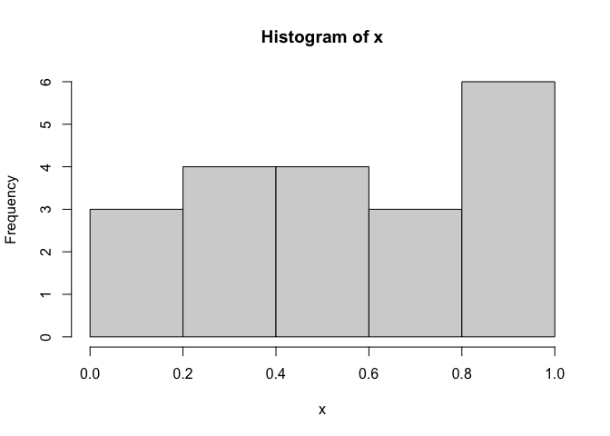
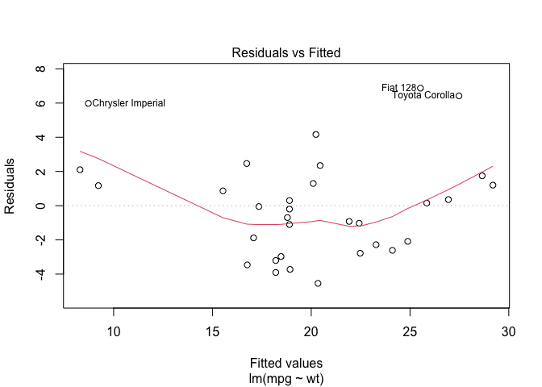
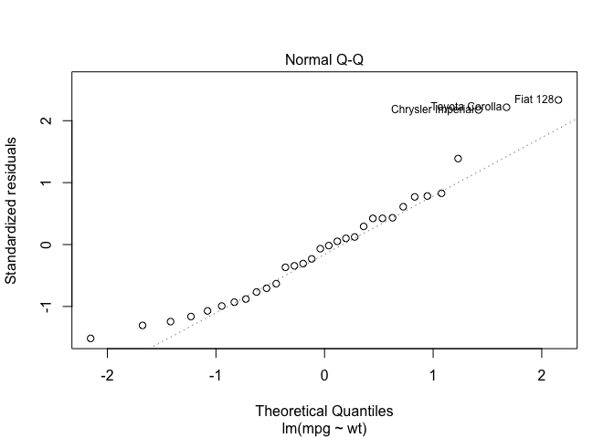
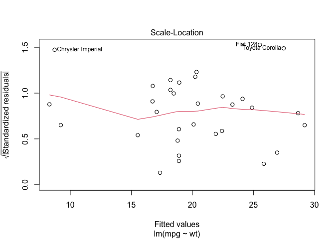
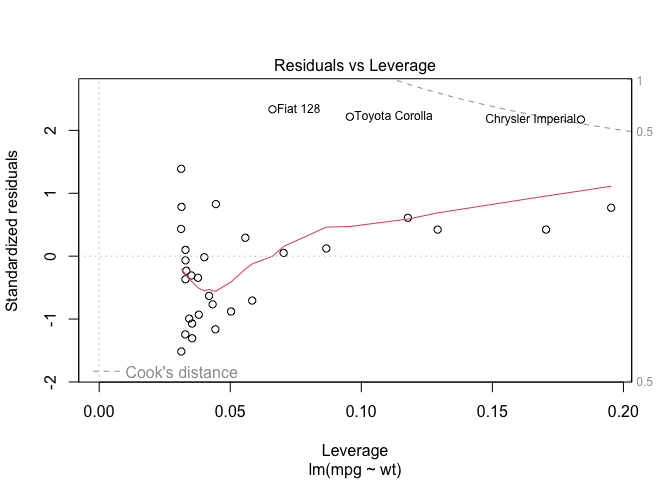
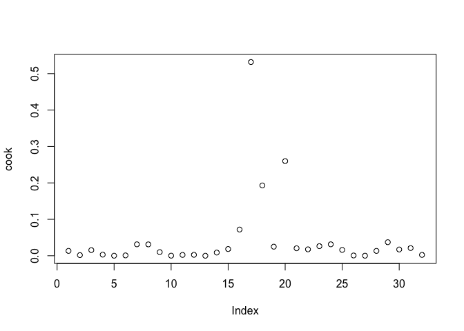

chapter01_R语言介绍
================

- <a href="#1-r语言介绍" id="toc-1-r语言介绍">1 R语言介绍</a>
  - <a href="#11-r的使用" id="toc-11-r的使用">1.1 R的使用</a>
    - <a href="#111-工作空间" id="toc-111-工作空间">1.1.1 工作空间</a>
  - <a href="#12-包" id="toc-12-包">1.2 包</a>
    - <a href="#121-什么是包" id="toc-121-什么是包">1.2.1 什么是包</a>
    - <a href="#122-包的安装" id="toc-122-包的安装">1.2.2 包的安装</a>
    - <a href="#123-包的载入" id="toc-123-包的载入">1.2.3 包的载入</a>
    - <a href="#124-获取帮助" id="toc-124-获取帮助">1.2.4 获取帮助</a>
  - <a href="#13-将输出用为输入结果的重用"
    id="toc-13-将输出用为输入结果的重用">1.3 将输出用为输入：结果的重用</a>

# 1 R语言介绍

## 1.1 R的使用

- R语句由函数和赋值构成。R使用\<-（快捷键：alt +
  -），而不是传统的=作为赋值符号。例如，以下语句：

<!-- -->

    # 创建一个名为X的向量对象，它包含5个来自标准正态分布的随机偏差。
    x <- rnorm(5)

### 1.1.1 工作空间

- 当前的工作目录(working
  directory)是R用来读取文件和保存结果的默认目录。我们可以使用函数`getwd()`来查看当前的工作目录，或使用函数`setwd()`设定当前的工作目录。如果需要读入一个不在当前工作目录下的文件，则需在调用语句中写明完整的路径。记得使用引号闭合这些目录名和文件名。

- 用于管理工作空间的部分标准命令如下：

``` r
> # 显示当前的工作目录
> getwd()
[1] "/Users/liang.hanqing/Documents/Git-local/Github_Bioinformatics_Learning/R/R_in_Action（R语言实战中文第2版）/chapter01_R语言介绍"
> # 列出当前工作空间中的对象
> ls()
character(0)
```

    # 移除(删除)一个或多个对象
    rm(objectlist)
    # 显示可用选项的说明
    help(options)
    # 显示或设置当前选项
    options()

``` r
> # 创建了一个包含20个均匀分布随机变量的向量，生成了此数据的摘要统计量和直方图。
> options(digits=3) # 数字将被格式化,显示为具有小数点后三位有效数字的格式
> x <- runif(20) # 创建了一个包含20个均匀分布随机变量的向量
> summary(x) # 生成了此数据的摘要统计量
   Min. 1st Qu.  Median    Mean 3rd Qu.    Max. 
  0.047   0.344   0.571   0.563   0.823   0.966 
> hist(x) # 生成了此数据的直方图
```

<!-- -->

## 1.2 包

### 1.2.1 什么是包

- 包是R函数、数据、预编译代码以一种定义完善的格式组成的集合。计算机上存储包的目录称为库(library)。函数`.libPaths( )`能够显示库所在的位置，函数`library()`则可以显示库中有哪些包。

### 1.2.2 包的安装

- 第一次安装一个包，使用命令`install.packages('packages_name')`即可。
- 使用命令`update.packages()`可以更新已经安装的包。
- 要查看已安装包的描述，可以使用`installed.packages()`命令，这将列出安装的包，以及它们的版本号、依赖关系等信息。
- 如把包下载到本地，可在工作区右侧的“Package”打开本地包进行安装。

### 1.2.3 包的载入

- 要在R会话中使用它，还需要使用`library()`命令载入这个包。例如，要使用gclus包，执行命令`library(gclus)`即可。当然，在载入一个包之前必须已经安装了这个包。**在一个会话中，包只需载入一次**。

### 1.2.4 获取帮助

    ?foo 或 help('foo') # 查看函数 foo 的帮助
    ??foo 或 help.search('foo') # 以 foo 为关键词搜索本地帮助文档
    example('foo') # 函数 foo 的使用示例
    RSiteSearch('foo') # 以 foo 为关键词搜索在线文档和邮件列表存档
    apropos('foo',mode = 'function') # 列出名称中含有 foo 的所有可用函数
    data() # 列出当前已加载包中所含的所有可用示例数据集
    vignette() # 列出当前已安装包中所有可用的 vignette 文档
    vignette('foo') # 为主题 foo 显示指定的 vignette 文档

## 1.3 将输出用为输入：结果的重用

- 首先，利用汽车数据mtcars执行一次简单线性回归，通过车身重量(wt)预测每加仑行驶的英里数(mpg)。可以通过以下语句实现：

``` r
> lm(mpg~wt, data=mtcars)

Call:
lm(formula = mpg ~ wt, data = mtcars)

Coefficients:
(Intercept)           wt  
      37.29        -5.34  
```

- 结果将显示在屏幕上，不会保存任何信息。

- 下一步，执行回归，区别是在一个对象中保存结果：

``` r
> lmfit <- lm(mpg~wt, data=mtcars)
```

- 以上赋值语句创建了一个名为lmfit的列表对象，其中包含了分析的大量信息(包括预测值、残差、回归系数等)。虽然屏幕上没有显示任何输出，但分析结果可在稍后被显示和继续使用。

``` r
> # 显示分析结果的统计概要
> summary(lmfit)

Call:
lm(formula = mpg ~ wt, data = mtcars)

Residuals:
   Min     1Q Median     3Q    Max 
-4.543 -2.365 -0.125  1.410  6.873 

Coefficients:
            Estimate Std. Error t value Pr(>|t|)    
(Intercept)   37.285      1.878   19.86  < 2e-16 ***
wt            -5.344      0.559   -9.56  1.3e-10 ***
---
Signif. codes:  0 '***' 0.001 '**' 0.01 '*' 0.05 '.' 0.1 ' ' 1

Residual standard error: 3.05 on 30 degrees of freedom
Multiple R-squared:  0.753, Adjusted R-squared:  0.745 
F-statistic: 91.4 on 1 and 30 DF,  p-value: 1.29e-10
> # 将生成回归诊断图形
> plot (lmfit)
```

<!-- --><!-- --><!-- --><!-- -->

``` r
> # 计算和保存影响度量统计量
> cook <- cooks.distance(lmfit)
> # 绘图
> plot(cook)
```

<!-- -->
