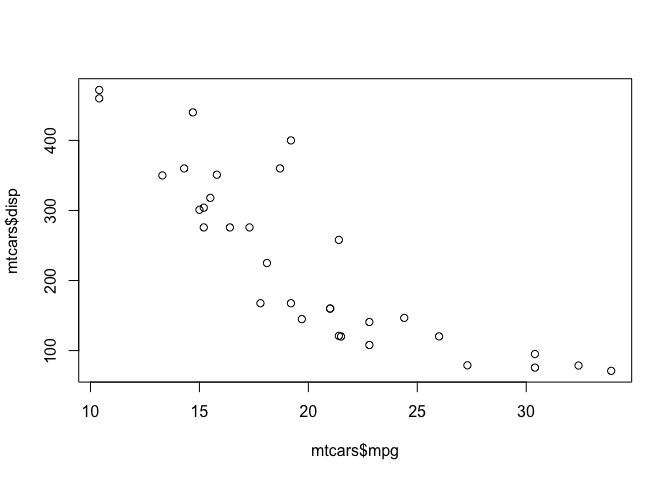
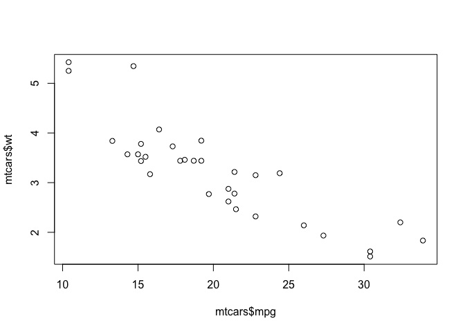
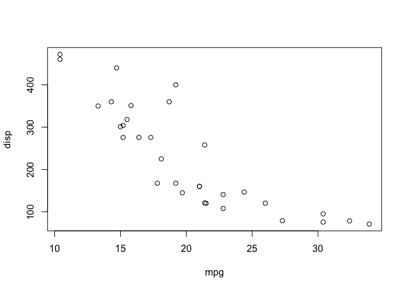
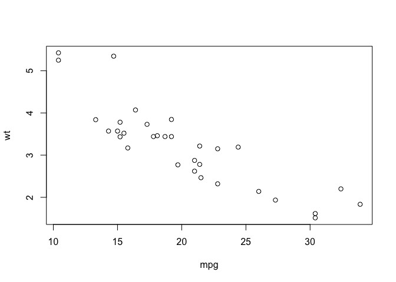

chapter02_创建数据集
================

- <a href="#2-创建数据集" id="toc-2-创建数据集">2 创建数据集</a>
  - <a href="#21-数据集的概念" id="toc-21-数据集的概念">2.1 数据集的概念</a>
  - <a href="#22-数据结构" id="toc-22-数据结构">2.2 数据结构</a>
    - <a href="#221-向量" id="toc-221-向量">2.2.1 向量</a>
    - <a href="#222-矩阵" id="toc-222-矩阵">2.2.2 矩阵</a>
    - <a href="#223-数组" id="toc-223-数组">2.2.3 数组</a>
    - <a href="#224-数据框" id="toc-224-数据框">2.2.4 数据框</a>
    - <a href="#225-因子" id="toc-225-因子">2.2.5 因子</a>
    - <a href="#226-列表" id="toc-226-列表">2.2.6 列表</a>
  - <a href="#23-数据的输入" id="toc-23-数据的输入">2.3 数据的输入</a>
    - <a href="#231-导入带分隔符的文本文件"
      id="toc-231-导入带分隔符的文本文件">2.3.1 导入带分隔符的文本文件</a>
    - <a href="#232-导入excel电子表格" id="toc-232-导入excel电子表格">2.3.2
      导入Excel电子表格</a>
    - <a href="#233-导入spss文件" id="toc-233-导入spss文件">2.3.3
      导入SPSS文件</a>
  - <a href="#24-数据的导出" id="toc-24-数据的导出">2.4 数据的导出</a>
    - <a href="#241-导出符号分隔文本文件"
      id="toc-241-导出符号分隔文本文件">2.4.1 导出符号分隔文本文件</a>
    - <a href="#242-导出excel电子表格" id="toc-242-导出excel电子表格">2.4.2
      导出Excel电子表格</a>
    - <a href="#243-导出给统计学程序" id="toc-243-导出给统计学程序">2.4.3
      导出给统计学程序</a>
  - <a href="#25-处理数据对象的实用函数"
    id="toc-25-处理数据对象的实用函数">2.5 处理数据对象的实用函数</a>

# 2 创建数据集

## 2.1 数据集的概念

- 数据集通常是由数据构成的一个矩形数组，**行表示观测(observation)，列表示变量(variable)**。

## 2.2 数据结构

- R拥有许多用于存储数据的对象类型，包括标量、向量、矩阵、数组、数据框和列表。
- 在R中，对象(object)是指可以赋值给变量的任何事物，包括常量、数据结构、函数，甚至图形。
- 因子(factor)是名义型变量或有序型变量。它们在R中被特殊地存储和处理。

### 2.2.1 向量

- 向量是用于存储数值型、字符型或逻辑型数据的一维数组。执行组合功能的函数`c()`可用来创建向量。

``` r
> a <- c(1, 2, 5, 3, 6, -2, 4)  # a是数值型向量
> b <- c("one", "two", "three")  # b是字符型向量
> c <- c(TRUE, TRUE, TRUE, FALSE, TRUE, FALSE) # c是逻辑型向量
```

- **注意：单个向量中的数据必须拥有相同的类型或模式(数值型、字符型或逻辑型)。同一向量中无法混杂不同模式的数据。**
- **注意：标量是只含一个元素的向量，例如f \<- 3、g \<- “US”和h \<-
  TRUE。它们用于保存常量。**
- 索引：通过在方括号中给定元素所处位置的数值，可以访问向量中的元素。

``` r
> a <- c("k", "j", "h", "a", "c", "m") 
> a[3]
[1] "h"
```

``` r
> a[c(1, 3, 5)]
[1] "k" "h" "c"
```

``` r
> a[2:6]
[1] "j" "h" "a" "c" "m"
```

### 2.2.2 矩阵

- 矩阵是一个二维数组，只是每个元素都拥有相同的模式(数值型、字符型或逻辑型)。可通过函数`matrix()`创建矩阵。一般使用格式为：

<!-- -->

    my_matrix <- matrix(vector, nrow=number_of_rows, ncol=number_of_columns,
                         byrow=logical_value, dimnames=list(
                             char_vector_rownames, char_vector_colnames))

- 其中vector包含了矩阵的元素，nrow和ncol用以指定行和列的维数，dimnames包含了可选的、以字符型向量表示的行名和列名。选项byrow则表明矩阵应当按行填充`(byrow=TRUE)`还是按列填充`(byrow=FALSE)`，**默认情况下按列填充**。注意：这些元素的名字不可更改。

- 代码清单2-1 创建矩阵

``` r
> # 创建一个5*4的矩阵
> y <- matrix(1:20, nrow=5, ncol=4)
> y
     [,1] [,2] [,3] [,4]
[1,]    1    6   11   16
[2,]    2    7   12   17
[3,]    3    8   13   18
[4,]    4    9   14   19
[5,]    5   10   15   20
```

``` r
> # 创建了一个2×2的含列名标签的矩阵并按 行 进行填充
> cells <- c(1,26,24,68)
> row_names <- c("R1", "R2")
> col_names <- c("C1", "C2")
> my_matrix_1 <- matrix(cells, nrow=2, ncol=2, byrow=TRUE, 
+                       dimnames=list(row_names, col_names))
> my_matrix_1
   C1 C2
R1  1 26
R2 24 68
```

``` r
> # 创建了一个2×2的矩阵并按 列 进行了填充
> my_matrix_2 <- matrix(cells, nrow=2, ncol=2, byrow=FALSE, 
+                       dimnames=list(row_names, col_names))
> my_matrix_2
   C1 C2
R1  1 24
R2 26 68
```

- 可以使用下标和`[方括号]`来选择矩阵中的行、列或元素。`X[i,]`指矩阵X中的第i行，`X[,j]`指第j列，`X[i, j]`指第i行第j个元素。选择多行或多列时，下标i和j可为数值型向量。

- 代码清单2-2 矩阵下标的使用

``` r
> x <- matrix(1:10, nrow=2)
> x
     [,1] [,2] [,3] [,4] [,5]
[1,]    1    3    5    7    9
[2,]    2    4    6    8   10
```

``` r
> x[2,]
[1]  2  4  6  8 10
```

``` r
> x[,2]
[1] 3 4
```

``` r
> x[1,4]
[1] 7
```

``` r
> x[1,c(4,5)]
[1] 7 9
```

### 2.2.3 数组

- 数组(array)与矩阵类似，但是维度可以大于2。数组可通过array函数创建，形式如下:

<!-- -->

    my_array <- array(vector, dimensions, dimnames)

- 其中vector包含了数组中的数据，dimensions是一个数值型向量，给出了各个维度下标的最大值，而dimnames是可选的、各维度名称标签的列表。

- 代码清单2-3 创建一个数组

``` r
> # 创建一个数组
> dim1 <- c("A1", "A2")
> dim2 <- c("B1", "B2", "B3")
> dim3 <- c("C1", "C2", "C3", "C4")
> z <- array(1:24, c(2, 3, 4), dimnames=list(dim1, dim2, dim3))
> z
, , C1

   B1 B2 B3
A1  1  3  5
A2  2  4  6

, , C2

   B1 B2 B3
A1  7  9 11
A2  8 10 12

, , C3

   B1 B2 B3
A1 13 15 17
A2 14 16 18

, , C4

   B1 B2 B3
A1 19 21 23
A2 20 22 24
```

``` r
> z[1,2,3] # 表示在C3的第一行第二列
[1] 15
```

### 2.2.4 数据框

- 由于不同的列可以包含不同模式(数值型、字符型等)的数据，数据框的概念较矩阵来说更为一般，与通常在SAS、SPSS和Stata中的数据集类似。**数据框是R中最常处理的数据结构**。

- 数据框可通过函数`data.frame()`创建：

<!-- -->

    my_data <- data.frame(col1, col2, col3,...)

- 其中的列向量col1、col2、col3等可为任何类型(如字符型、数值型或逻辑型)。每一列的名称可由函数names指定。

- 代码清单2-4 创建一个数据框

``` r
> patientID <- c(1, 2, 3, 4)
> age <- c(25, 34, 28, 52)
> diabetes <- c("Type1", "Type2", "Type1", "Type1")
> status <- c("Poor", "Improved", "Excellent", "Poor")
> patientdata <- data.frame(patientID, age, diabetes, status)
> patientdata
  patientID age diabetes    status
1         1  25    Type1      Poor
2         2  34    Type2  Improved
3         3  28    Type1 Excellent
4         4  52    Type1      Poor
```

- 选取数据框中元素的方式有若干种。可以使用前述(如矩阵中的)下标记号，亦可直接指定列名。

- 代码清单2-5 选取数据框中的元素

``` r
> patientdata[1:2]
  patientID age
1         1  25
2         2  34
3         3  28
4         4  52
```

``` r
> patientdata[c("diabetes", "status")]
  diabetes    status
1    Type1      Poor
2    Type2  Improved
3    Type1 Excellent
4    Type1      Poor
```

``` r
> patientdata$age # 表示patientdata数据框中的变量age
[1] 25 34 28 52
```

- 如果想生成糖尿病类型变量diabetes和病情变量status的列联表，使用以下代码即可：

``` r
> table(patientdata$diabetes, patientdata$status)
       
        Excellent Improved Poor
  Type1         1        0    2
  Type2         0        1    0
```

#### 2.2.4.1 `attach()`、 `detach()`和`with()`

- 可以联合使用函数`attach()`和`detach()`或**单独使用函数`with()`来简化代码**。

- 函数`attach()`可将数据框添加到R的搜索路径中。R在遇到一个变量名以后，将检查搜索路径中的数据框。以第1章中的mtcars数据框为例,可以使用以下代码获取每加仑行驶英里数(mpg)变量的描述性统计量，并分别绘制此变量与发动机排量(disp)和车身重量(wt)的散点图：

``` r
> summary(mtcars$mpg)
   Min. 1st Qu.  Median    Mean 3rd Qu.    Max. 
  10.40   15.43   19.20   20.09   22.80   33.90 
> plot(mtcars$mpg, mtcars$disp)
```

<!-- -->

``` r
> plot(mtcars$mpg, mtcars$wt)
```

<!-- -->

- 以上代码也可写成：

``` r
> attach(mtcars)
> summary(mpg)
   Min. 1st Qu.  Median    Mean 3rd Qu.    Max. 
  10.40   15.43   19.20   20.09   22.80   33.90 
> plot(mpg, disp)
```

<!-- -->

``` r
> plot(mpg, wt)
```

<!-- -->

``` r
> detach(mtcars)
```

- 函数`detach()`将数据框从捜索路径中移除。值得注意的是，`detach()`并不会对数据框本身做任何处理。这句是可以省略的，但其实它应当被例行地放入代码中，因为这是一个好的编程习惯。(接下来的几章中，为了保持代码片段的简约和简短，我可能会不时地忽略这条良训。)当名称相同的对象不止一个时，这种方法的局限性就很明显了。函数`attach()`和`detach()`最好在你分析一个单独的数据框，并且不太可能有多个同名对象时使用。任何情况下，都要当心那些告知某个对象已被屏蔽(masked)的警告。

- 除此之外，另一种方式是使用函数`with()`。可以这样重写上例：

``` r
> with(mtcars,{
+   print(summary (mpg))
+   plot(mpg, disp)
+   plot(mpg, wt)
+   })
   Min. 1st Qu.  Median    Mean 3rd Qu.    Max. 
  10.40   15.43   19.20   20.09   22.80   33.90 
```

<!-- --><!-- -->

- 在这种情况下，花括号`{}`之间的语句都针对数据框mtcars执行，这样就无需担心名称冲突了。如果仅有一条语句(例如`summary(mpg)`)，那么花括号`{}`可以省略。

#### 2.2.4.2 实例标识符

    -   在病例数据中，病人编号(patientID)用于区分数据集中不同的个体。在R中，实例标识符(case identifier)可通过数据框操作函数中的rowname选项指定。例如，语句：

<!-- -->

    patientdata <- data.frame(patientID, age, diabetes,                           
                              status, row.names=patientID)

- 将patientID指定为R中标记各类打印输出和图形中实例名称所用的变量。

### 2.2.5 因子

- 变量可归结为名义型、有序型或连续型变量。

  - **名义型变量是没有顺序之分的类别变量**。糖尿病类型Diabetes(Type1、Type2)是名义型变量的一例。即使在数据中Type1编码为1而Type2编码为2，这也并不意味着二者是有序的。
  - **有序型变量表示一种顺序关系，而非数量关系**。病情Status(poor、improved、excellent)是顺序型变量的一个上佳示例。我们明白，病情为poor(较差)病人的状态不如improved(病情好转)的病人，但并不知道相差多少。
  - **连续型变量可以呈现为某个范围内的任意值，并同时表示了顺序和数量**。年龄Age就是一个连续型变量，它能够表示像14.5或22.8这样的值以及其间的其他任意值。很清楚，15岁的人比14岁的人年长一岁。

- 类别(名义型)变量和有序类别(有序型)变量在R中称为因子(factor)。因子在R中非常重要，因为它决定了数据的分析方式以及如何进行视觉呈现。

- 函数`factor()`以一个整数向量的形式存储类别值，整数的取值范围是`[1...k]`(其中k是名义型变量中唯一值的个数)，同时一个由字符串(原始值)组成的内部向量将映射到这些整数上。举例来说，假设有向量：

<!-- -->

    diabetes <- c("Type1", "Type2", "Type1", "Type1")

- 语句`diabetes <- factor(diabetes)`将此向量存储为(1,2,1,1)，并在内部将其关联为1=Type1和2=Type2(具体赋值根据字母顺序而定)。针对向量diabetes进行的任何分析都会将其作为名义型变量对待，并自动选择适合这一测量尺度1的统计方法。要表示有序型变量，需要为函数`factor()`指定参数ordered=TRUE。给定向量：

<!-- -->

    status <- c("Poor", "Improved", "Excellent", "Poor")

- 语句`status <- factor(status, ordered=TRUE)`会将向量编码为(3,2,1,3)，并在内部将这些值关联为1=Excellent、2=Improved以及3=Poor。另外，针对此向量进行的任何分析都会将其作为有序型变量对待，并自动选择合适的统计方法。

- 对于字符型向量，因子的水平默认依字母顺序创建。这对于因子status是有意义的，因为”Excellent”、“Improved”、“Poor”的排序方式恰好与逻辑顺序相一致。如果”Poor”被编码为”Ailing”，会有问题，因为顺序将为”Ailing”、“Excellent”、“Improved”。如果理想中的顺序是”Poor”、“Improved”、“Excellent”，则会出现类似的问题。按默认的字母顺序排序的因子很少能够让人满意。可以通过指定levels选项来覆盖默认排序。例如:

<!-- -->

    status <- factor(status, order=TRUE,                  
                     levels=c("Poor", "Improved", "Excellent"))

- 各水平的赋值将为1=Poor、2=Improved、3=Excellent。请保证指定的水平与数据中的真实值相匹配，因为任何在数据中出现而未在参数中列举的数据都将被设为缺失值。

- 数值型变量可以用levels和labels参数来编码成因子。如果男性被编码成1，女性被编码成2，则以下语句：

<!-- -->

    sex <- factor(sex, levels=c(1, 2), labels=c("Male", "Female"))

- 把变量转换成一个无序因子。注意到标签的顺序必须和水平相一致。在这个例子中，性别将被当成类别型变量，标签”Male”和”Female”将替代1和2在结果中输出，而且所有不是1或2的性别变量将被设为缺失值。

- 代码清单2-6 因子的使用

``` r
> patientID <- c(1, 2, 3, 4)
> age <- c(25, 34, 28, 52)
> diabetes <- c("Type1", "Type2", "Type1", "Type1") # 普通因子
> status <- c("Poor", "Improved", "Excellent", "Poor") # 有序因子
> # 以上为以向量形式输入数据
> diabetes <- factor(diabetes)
> status <- factor(status, order=TRUE)
> patientdata <- data.frame(patientID, age, diabetes, status)
> str(patientdata) # 显示对象的结构
'data.frame':   4 obs. of  4 variables:
 $ patientID: num  1 2 3 4
 $ age      : num  25 34 28 52
 $ diabetes : Factor w/ 2 levels "Type1","Type2": 1 2 1 1
 $ status   : Ord.factor w/ 3 levels "Excellent"<"Improved"<..: 3 2 1 3
```

``` r
> summary(patientdata) # 显示对象的统计概要
   patientID         age         diabetes       status 
 Min.   :1.00   Min.   :25.00   Type1:3   Excellent:1  
 1st Qu.:1.75   1st Qu.:27.25   Type2:1   Improved :1  
 Median :2.50   Median :31.00             Poor     :2  
 Mean   :2.50   Mean   :34.75                          
 3rd Qu.:3.25   3rd Qu.:38.50                          
 Max.   :4.00   Max.   :52.00                          
```

### 2.2.6 列表

- **列表(list)是R的数据类型中最为复杂的一种**。一般来说，列表就是一些对象(或成分，component)的有序集合。列表允许你整合若干(可能无关的)对象到单个对象名下。例如，某个列表中可能是若干向量、矩阵、数据框，甚至其他列表的组合。可以使用函数`list()`创建列表：

<!-- -->

    my_list <- list(object1, object2, ...)

- 其中的对象可以是目前为止讲到的任何结构。你还可以为列表中的对象命名：

<!-- -->

    my_list <- list(name1=object1, name2=object2, ...)

- 代码清单2-7 创建一个列表

``` r
> g <- "My First List"
> h <- c(25, 26, 18, 39)
> j <- matrix(1:10, nrow=5)
> k <- c("one", "two", "three")
> my_list <- list(title=g, ages=h, j, k)  # 创建列表
> my_list   # 输出整个列表
$title
[1] "My First List"

$ages
[1] 25 26 18 39

[[3]]
     [,1] [,2]
[1,]    1    6
[2,]    2    7
[3,]    3    8
[4,]    4    9
[5,]    5   10

[[4]]
[1] "one"   "two"   "three"
```

``` r
> # 输出第二个成分
> my_list[[2]]
[1] 25 26 18 39
```

## 2.3 数据的输入

- **Excel数据文件、SPSS、SAS等文件，都可以使用rstudio的文件导入选项，直接将数据导入。**

### 2.3.1 导入带分隔符的文本文件

- 可以使用`read.table()`从带分隔符的文本文件中导入数据。此函数可读入一个表格格式的文件并将其保存为一个数据框。表格的每一行分别出现在文件中每一行。其语法如下：

<!-- -->

    my_dataframe <- read.table(file, options)

- 其中，file是一个带分隔符的ASCII文本文件，options是控制如何处理数据的选项，具体选项包括：

<!-- -->

    header # 一个表示文件是否在第一行包含了变量名的逻辑型变量
    sep # 分开数据值的分隔符。默认是 sep="",这表示了一个或多个空格、制表符、换行或回车。使用 sep=","来读取用逗号来分隔行内数据的文件,使用 sep="\t"来读取使用制表符来分割行内数据的文件
    row.names # 一个用于指定一个或多个行标记符的可选参数
    col.names # 如果数据文件的第一行不包括变量名 (header=FASLE) , 你可以用 col.names 去指定一个包含变量名的字符向量。 如果 header=FALSE 以及 col.names 选项被省略了, 变量会被分别命名为 V1、V2,以此类推
    na.strings # 可选的用于表示缺失值的字符向量。比如说,na.strings=c("-9", "?")把-9 和?值在读取数据的时候转换成 NA
    colClasses # 可选的分配到每一列的类向量。 比如说, colClasses=c("numeric", "numeric", "character", "NULL", "numeric")把前两列读取为数值型变量,把第三列读取为字符型向量,跳过第四列,把第五列读取为数值型向量。如果数据有多余五列,colClasses 的值会被循环。当你在读取大型文本文件的时候,加上 colClasses 选项可以可观地提升处理的速度
    quote # 用于对有特殊字符的字符串划定界限的自负床。默认值是双引号(")或单引号(')
    skip # 读取数据前跳过的行的数目。这个选项在跳过头注释的时候比较有用
    stringsAsFactors # 一个逻辑变量, 标记处字符向量是否需要转化成因子。 默认值是 TRUE, 除非它被 colClases 所覆盖。当你在处理大型文本文件的时候,设置成 stringsAsFactors=FALSE 可以提升处理速度
    text # 一个指定文字进行处理的字符串。如果 text 被设置了,file 应该被留空。

- 案例：读取studentgrades.csv的文本文件，它包含了学生在数学、科学、和社会学习的分数。

``` r
> grades <- read.table("studentgrades.csv", header=TRUE,     
+                      row.names="StudentID", sep=",")
> grades # print data frame
   First          Last Math Science Social.Studies
11   Bob         Smith   90      80             67
12  Jane         Weary   75      NA             80
10   Dan Thornton, III   65      75             70
40  Mary     "O'Leary"   90      95             92
```

``` r
> str(grades) # view data frame structure
'data.frame':   4 obs. of  5 variables:
 $ First         : chr  "Bob" "Jane" "Dan" "Mary"
 $ Last          : chr  "Smith" "Weary" "Thornton, III" "\"O'Leary\""
 $ Math          : int  90 75 65 90
 $ Science       : int  80 NA 75 95
 $ Social.Studies: int  67 80 70 92
```

- 也可以使用以下代码直接导入带分隔符的文本文件：

``` r
> library(readr)
> studentgrades <- read_csv("studentgrades.csv")
> studentgrades
# A tibble: 4 × 6
  StudentID First Last             Math Science `Social Studies`
      <dbl> <chr> <chr>           <dbl>   <dbl>            <dbl>
1        11 Bob   "Smith"            90      80               67
2        12 Jane  "Weary"            75      NA               80
3        10 Dan   "Thornton, III"    65      75               70
4        40 Mary  "\"O'Leary\""      90      95               92
```

### 2.3.2 导入Excel电子表格

- 使用`install.packages("readxl")`下载安装readxl包，紧接着通过`library("readxl")`加载该包，函数`read_excel()`导入一个工作表到一个数据框中。

``` r
> library(readxl)
> mydataframe <- read_excel("studentgrades.xlsx")
> mydataframe
# A tibble: 4 × 6
  StudentID First Last             Math Science `Social Studies`
      <dbl> <chr> <chr>           <dbl>   <dbl>            <dbl>
1        11 Bob   "Smith"            90      80               67
2        12 Jane  "Weary"            75      NA               80
3        10 Dan   "Thornton, III"    65      75               70
4        40 Mary  "\"O'Leary\""      90      95               92
```

- 在工作区右侧的Environment，可看到“mydataframe”，单击即可打开数据集。

### 2.3.3 导入SPSS文件

``` r
> library(foreign)
> my_data <- read.spss('pancerdata.sav')
> head(my_data)
$caseno
 [1]  1  2  3  4  5  6  7  9 10 11 12 14 15 16 17 18 19 20 21 22 23 24 25 26 28
[26] 30 33 35 36 37 38 39 40 41 42 43 44 45 46 47 48 49 50 51 53 54 55 56 58 62
[51] 63 64 65 66 67 68 69 70 71 72 73 74 75 76 77 78 79 80 81 83 84 85 86 87 88
[76] 89 90 91 92 93 94 95 96

$time
 [1]  2.4  1.7  0.1  1.0  4.8  6.4 10.8  5.1  1.1  0.5  0.8  4.0  4.0  4.0  8.5
[16]  3.6  6.9  6.2  1.0  6.2  4.3  3.1  8.3 12.7  4.9  2.7 10.6 18.2  1.4  5.8
[31]  3.0  1.5  2.4  2.0  1.1  2.5  5.4  4.4  4.8  3.1  5.6  3.1  1.3 11.5  3.8
[46]  2.9  2.2  1.7  3.5 11.3  9.0 12.5  6.8 10.8  3.0  1.8  5.0  8.0  6.8 11.1
[61]  9.4  3.9  2.1  4.3  9.3  8.8  2.4 21.6  5.6 11.4 18.3  9.2  4.5  8.2 15.0
[76]  6.9  3.5  2.1  3.1  3.2  1.9  2.1  7.0

$censor
 [1] 死亡 死亡 死亡 死亡 死亡 死亡 死亡 死亡 死亡 死亡 死亡 死亡 死亡 死亡 死亡
[16] 死亡 死亡 死亡 死亡 死亡 死亡 死亡 死亡 死亡 死亡 死亡 死亡 死亡 死亡 死亡
[31] 死亡 死亡 死亡 死亡 死亡 死亡 死亡 死亡 死亡 死亡 死亡 死亡 死亡 死亡 死亡
[46] 死亡 死亡 死亡 死亡 死亡 死亡 死亡 死亡 死亡 死亡 死亡 死亡 死亡 死亡 删失
[61] 死亡 死亡 死亡 死亡 死亡 死亡 死亡 死亡 死亡 死亡 死亡 死亡 死亡 死亡 死亡
[76] 死亡 死亡 死亡 死亡 死亡 死亡 死亡 死亡
Levels: 死亡 删失

$age
 [1] 66 69 48 73 65 38 62 59 53 70 71 61 69 41 49 56 59 53 72 57 49 74 43 60 55
[26] 70 63 69 66 58 67 74 77 70 75 65 71 50 56 68 65 65 43 83 65 63 47 75 63 54
[51] 56 50 62 53 63 59 66 62 72 54 68 63 68 48 68 75 49 62 56 56 59 59 48 64 60
[76] 75 46 53 62 47 62 55 80

$sex
 [1] 男 男 男 男 男 男 女 女 男 男 男 女 男 女 男 男 女 男 女 女 男 男 女 女 女
[26] 男 男 女 女 女 女 男 女 女 男 女 女 男 男 女 女 男 女 男 男 男 女 女 女 男
[51] 女 男 男 女 男 男 女 男 男 男 女 女 女 女 男 女 男 男 女 男 女 男 男 男 男
[76] 男 男 女 男 男 男 男 男
Levels: 男 女

$trt
 [1] 无术中放疗 无术中放疗 无术中放疗 无术中放疗 无术中放疗 无术中放疗
 [7] 无术中放疗 无术中放疗 无术中放疗 无术中放疗 无术中放疗 无术中放疗
[13] 无术中放疗 无术中放疗 无术中放疗 无术中放疗 无术中放疗 无术中放疗
[19] 无术中放疗 无术中放疗 无术中放疗 无术中放疗 有术中放疗 有术中放疗
[25] 有术中放疗 有术中放疗 有术中放疗 有术中放疗 有术中放疗 有术中放疗
[31] 有术中放疗 有术中放疗 有术中放疗 有术中放疗 有术中放疗 有术中放疗
[37] 有术中放疗 有术中放疗 有术中放疗 有术中放疗 有术中放疗 有术中放疗
[43] 有术中放疗 有术中放疗 有术中放疗 有术中放疗 有术中放疗 有术中放疗
[49] 有术中放疗 有术中放疗 有术中放疗 有术中放疗 有术中放疗 有术中放疗
[55] 有术中放疗 有术中放疗 有术中放疗 有术中放疗 有术中放疗 有术中放疗
[61] 有术中放疗 有术中放疗 有术中放疗 有术中放疗 有术中放疗 有术中放疗
[67] 有术中放疗 有术中放疗 有术中放疗 有术中放疗 有术中放疗 有术中放疗
[73] 有术中放疗 有术中放疗 有术中放疗 有术中放疗 有术中放疗 有术中放疗
[79] 有术中放疗 有术中放疗 有术中放疗 有术中放疗 有术中放疗
Levels: 无术中放疗 有术中放疗
```

## 2.4 数据的导出

### 2.4.1 导出符号分隔文本文件

- 可以用`write.table()`函数将R对象输出到符号分隔文件中。函数使用方法是：

<!-- -->

    write.table(x, outfile, sep=delimiter, quote=TRUE, na="NA")

- 其中x是要输出的对象，outfile是目标文件。例如，这条语句：

<!-- -->

    write.table(mydata, "mydata.txt", sep=",")

- 会将mydata数据集输出到当前目录下逗号分隔的mydata.txt文件中。用路径(例如c:/myprojects/mydata.txt)可以将输出文件保存到任何地方。用sep=“替换sep=”,“，数据就会保存到制表符分隔的文件中。默认情况下，字符串是放在引号(”“)中的，缺失值用NA表示。

### 2.4.2 导出Excel电子表格

- 安装writexl包：`install.packages("writexl")`，包中的`writexl::write_xlsx()`函数可以将R数据框写入到Excel文件中。使用方法是：

``` r
> library(writexl) 
> writexl::write_xlsx(grades,path = 'grades.xlsx')
```

- 在工作区目录下可找到grades.xlsx文件。

- 例如，这条语句：

<!-- -->

    library(xlsx) 
    write.xlsx(mydata, "mydata.xlsx")

- 会将mydata数据框保存到当前目录下的Excel文件mydata.xlsx的工作表(默认是Sheet1)中。默认情况下，数据集中的变量名称会被作为电子表格头部，行名称会放在电子表格的第一列。函数会覆盖已存在的mydata.xlsx文件。

### 2.4.3 导出给统计学程序

- foreign包中的`write.foreign()`可以将数据框导出到外部统计软件。这会创建两个文件，一个是保存数据的文本文件，另一个是指导外部统计软件导入数据的编码文件。使用方法如下：

<!-- -->

    write.foreign(dataframe, datafile, codefile, package=package)

- 例如，下面这段代码：

<!-- -->

    library(foreign) 
    write.foreign(mydata, "mydata.txt", "mycode.sps", package="SPSS")

- 会将mydata数据框导出到当前目录的纯文本文件mydata.txt中，同时还会生成一个用于读取该文本文件的SPSS程序mycode.sps。

## 2.5 处理数据对象的实用函数

    length(object) # 显示对象中元素/成分的数量 
    dim(object) # 显示某个对象的维度 
    str(object) # 显示某个对象的结构 
    class(object) # 显示某个对象的类或类型 
    mode(object) # 显示某个对象的模式 
    names(object) # 显示某对象中各成分的名称 
    c(object, object,...) # 将对象合并入一个向量 
    cbind(object, object, ...) # 按列合并对象 
    rbind(object, object, ...) # 按行合并对象 
    object # 输出某个对象 
    head(object) # 列出某个对象的开始部分 
    tail(object) # 列出某个对象的最后部分 
    ls() # 显示当前的对象列表
    rm(object, object, ...) # 删除一个或更多个对象。语句 rm(list = ls())将删除当前工作环境中的几乎所有对象
    newobject <- edit(object) # 编辑对象并另存为newobject 
    fix(object) # 直接编辑对象
