chapter03_图形初阶
================

- <a href="#3-图形初阶" id="toc-3-图形初阶">3 图形初阶</a>
  - <a href="#31-使用图形图片的输出" id="toc-31-使用图形图片的输出">3.1
    使用图形（图片的输出）</a>
  - <a href="#32-一个简单的例子" id="toc-32-一个简单的例子">3.2
    一个简单的例子</a>
  - <a href="#33-图形参数" id="toc-33-图形参数">3.3 图形参数</a>
    - <a href="#331-符号与线条" id="toc-331-符号与线条">3.3.1 符号与线条</a>
    - <a href="#332-颜色" id="toc-332-颜色">3.3.2 颜色</a>
    - <a href="#333-文本属性" id="toc-333-文本属性">3.3.3 文本属性</a>
    - <a href="#334-图形尺寸与边界尺寸" id="toc-334-图形尺寸与边界尺寸">3.3.4
      图形尺寸与边界尺寸</a>
  - <a href="#34-添加文本自定义坐标轴的图例"
    id="toc-34-添加文本自定义坐标轴的图例">3.4
    添加文本、自定义坐标轴的图例</a>
    - <a href="#341-标题" id="toc-341-标题">3.4.1 标题</a>
    - <a href="#342-坐标轴" id="toc-342-坐标轴">3.4.2 坐标轴</a>
    - <a href="#343-参考线" id="toc-343-参考线">3.4.3 参考线</a>
    - <a href="#344-图例" id="toc-344-图例">3.4.4 图例</a>
    - <a href="#345-文本标注" id="toc-345-文本标注">3.4.5 文本标注</a>
  - <a href="#35-图形的组合" id="toc-35-图形的组合">3.5 图形的组合</a>

# 3 图形初阶

## 3.1 使用图形（图片的输出）

- R是一个惊艳的图形构建平台，可以通过逐条输入语句构建图形，逐渐完善图形特征，直至得到想要的效果。例如：

``` r
> attach(mtcars)   # 首句绑定了数据框mtcars
> plot(wt, mpg)   # 第二条语句打开了一个图形窗口并生成了一幅散点图,横轴表示车身重量,纵轴为每加仑汽油行驶的英里数
> abline(lm(mpg~wt))  # 第三句向图形添加了一条最优拟合曲线
> title("Regression of MPG on Weight")   # 第四句添加了标题
```

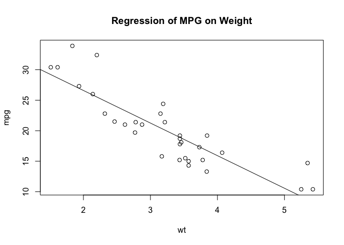<!-- -->

``` r
> detach(mtcars)  # 最后一句为数据框解除了绑定
```

- 可以通过代码或图形用户界面来保存图形。要通过代码保存图形，将绘图语句夹在开启目标图形设备的语句和关闭目标图形设备的语句之间即可。例如,
  以下代码会将图形保存到当前工作目录中名为mygraph.pdf的PDF文件中:

<!-- -->

    pdf("mygraph.pdf")  
    attach(mtcars)   
    plot(wt, mpg)  
    abline(lm(mpg~wt))  
    title("Regression of MPG on Weight")  
    detach(mtcars) 
    dev.off()

- 除了`pdf()`，还可以使用函数`win.metafile()`、`png()`、`jpeg()`、`bmp()`、`tiff()`、`xfig()`和`postscript()`将图形保存为其他格式。
  (注意，Windows图元文件格式仅在Windows系统中可用。)

## 3.2 一个简单的例子

| 剂量 | 对药物A的响应 | 对药物B的响应 |
|:----:|:-------------:|:-------------:|
|  20  |      16       |      15       |
|  30  |      20       |      18       |
|  40  |      27       |      25       |
|  45  |      40       |      31       |
|  60  |      60       |      40       |

- 根据表格信息，给以下变量赋值：

``` r
> dose <- c(20, 30, 40, 45, 60) 
> drugA <- c(16, 20, 27, 40, 60) 
> drugB <- c(15, 18, 25, 31, 40)
> # 创建一幅描述药物A的剂量和响应关系的图形
> plot(dose, drugA, type="b")
```

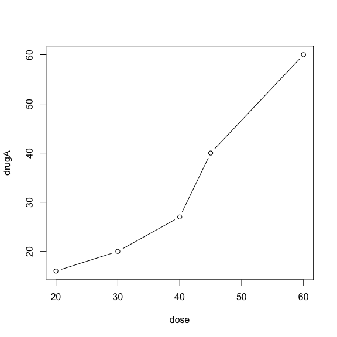<!-- -->

- `plot()`是R中为对象作图的一个泛型函数
  (它的输出将根据所绘制对象类型的不同而变化)
  。本例中，`plot(x, y, type="b")`将x置于横轴，将y置于纵轴，绘制点集(x,y)，然后使用线段将其连接。选项type=“b”表示同时绘制点和线。使用`help(plot)`可以查看其他选项。

## 3.3 图形参数

- 可以通过修改称为图形参数的选项来自定义一幅图形的多个特征(字体、颜色、坐标轴、标签)。一种方法是通过函数`par()`来指定这些选项。以这种方式设定的参数值除非被再次修改，否则将在会话结束前一直有效。其调用格式为：

<!-- -->

    par(optionname=value, optionname=name,...)

- 不加参数地执行`par()`将生成一个含有当前图形参数设置的列表。添加参数`no.readonly=TRUE`可以生成一个可以修改的当前图形参数列表。

- 继续例子，假设使用实心三角而不是空心圆圈作为点的符号，并且想用虚线代替实线连接这些点。可以使用以下代码完成修改:

``` r
> opar <- par(no.readonly=TRUE)  # 首个语句复制了一份当前的图形参数设置
> par(lty=2, pch=17) # 第二句将默认的线条类型修改为虚线(lty=2) 并将默认的点符号改为了实心三角(pch=17) 。
> plot(dose, drugA, type="b")  
```

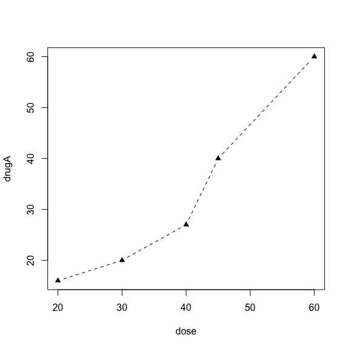<!-- -->

``` r
> par(opar)
```

- 如仅需要对这一幅图本身生效，则可以使用以下代码来生成与上图相同的图形：

``` r
> plot(dose, drugA, type="b", lty=2, pch=17)
```

<!-- -->

### 3.3.1 符号与线条

| 参数 |                                 描述                                  |
|:----:|:---------------------------------------------------------------------:|
| pch  |                指定绘制点时使用的符号(见书P48图3-4)。                 |
| cex  | 指定符号的大小。cex是一个数值，表示绘图符号相对于默认大小的缩放倍数。 |
| lty  |                     指定线条类型(见书P48图3-5)。                      |
| lwd  |      指定线条宽度。lwd是以默认值的相对大小来表示的(默认值为1) 。      |

- 对于符号21\~25（空心圆形、三角、正方形等,你还可以指定边界颜色(col=)和填充色(bg=)。


- 综合以上选项，以下代码将绘制一幅图形：其线条类型为点线，宽度为默认宽度的3倍，点的符号为实心正方形，大小为默认符号大小的2倍。

``` r
> plot(dose, drugA, type="b", lty=3, lwd=3, pch=15, cex=2)
```

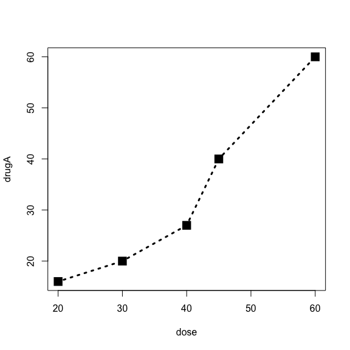<!-- -->

### 3.3.2 颜色

| 参数     | 描述                                                                                                                                                                                               |
|:---------|:---------------------------------------------------------------------------------------------------------------------------------------------------------------------------------------------------|
| col      | 默认的绘图颜色。某些函数(如 lines 和 pie)可以接受一个含有颜色值的向量并自动循环使用。例如，如果设定 col=c(“red”, “blue”)并需要绘制三条线，则第一条线将为红色，第二条线为蓝色，第三条线又将为红色。 |
| col.axis | 坐标轴刻度文字的颜色。                                                                                                                                                                             |
| col.lab  | 坐标轴标签(名称)的颜色。                                                                                                                                                                           |
| col.main | 标题颜色。                                                                                                                                                                                         |
| col.sub  | 副标题颜色。                                                                                                                                                                                       |
| fg       | 图形的前景色。                                                                                                                                                                                     |
| bg       | 图形的背景色。                                                                                                                                                                                     |

- 对于创建吸引人的颜色配对，RColorBrewer特别受到欢迎。注意在第一次使用它之前先进行下载`(install.packages("RColorBrewer"))`。
  安装之后，使用函数`brewer.pal(n, name)`来创建一个颜色值的向量。比如说，以下代码：

``` r
> library(RColorBrewer) 
> n <- 7 
> mycolors <- brewer.pal(n, "Set1") 
> barplot(rep(1,n), col=mycolors)
```

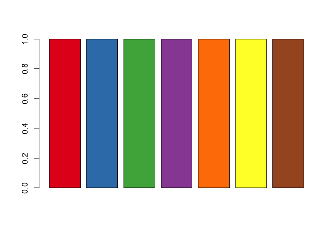<!-- -->

- R中也有多种用于创建连续型颜色向量的函数，包括`rainbow()`、`heat.colors()`、`terrain.colors()`、`topo.colors()`以及`cm.colors()`。举例来说，`rainbow(10)`可以生成10种连续的”彩虹型”颜色。

``` r
> n <- 10
> mycolors <- rainbow(n)
> pie(rep(1,n),labels = mycolors,col=rainbow(n))
```

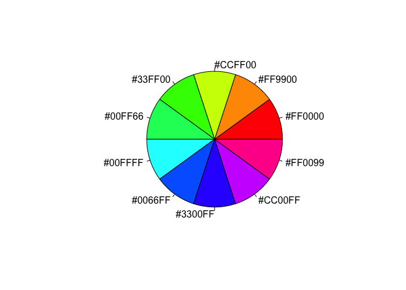<!-- -->

``` r
> mygrays <- gray(0:n/n)
> pie(rep(1,n),labels = mygrays,col=gray(0:n/n))
```

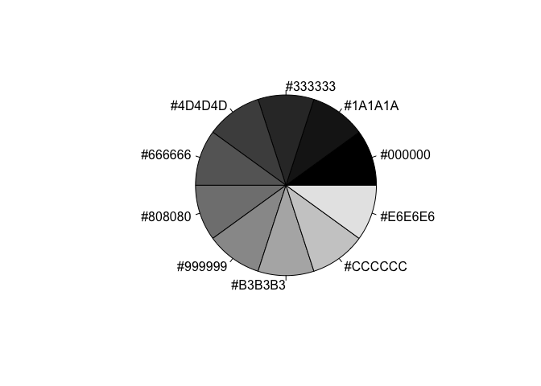<!-- -->

### 3.3.3 文本属性

| 参数      | 描述                                                                                                         |
|:----------|--------------------------------------------------------------------------------------------------------------|
| cex       | 表示相对于默认大小缩放倍数的数值。 默认大小为 1，1.5 表示放大为默认值的 1.5 倍，0.5 表示缩小为默认值的 50%。 |
| cex.axis  | 坐标轴刻度文字的缩放倍数。                                                                                   |
| cex.lab   | 坐标轴标签(名称)的缩放倍数。                                                                                 |
| cex.main  | 标题的缩放倍数。                                                                                             |
| cex.sub   | 副标题的缩放倍数。                                                                                           |
| font      | 整数。用于指定绘图使用的字体样式。1=常规，2=粗体，3=斜体，4=粗斜体，5=符号字体(以 Adobe 符号编码表示)。      |
| font.axis | 坐标轴刻度文字的字体样。                                                                                     |
| font.lab  | 坐标轴标签(名称)的字体样式。                                                                                 |
| font.main | 标题的字体样式。                                                                                             |
| font.sub  | 副标题的字体样式。                                                                                           |
| ps        | 字体磅值(1 磅约为 1/72 英寸) 。文本的最终大小为 ps\*cex。                                                    |
| family    | 绘制文本时使用的字体族。标准的取值为 serif(衬线) 、sans(无衬线)和 mono(等宽)。                               |

- 创建的所有图形都将拥有斜体、1.5倍于默认文本大小的坐标轴标签(名称)，以及粗斜体、2倍于默认文本大小的标题：

<!-- -->

    par(font.lab=3, cex.lab=1.5, font.main=4, cex.main=2)

- 如果以PDF格式输出图形，则修改字体族会相对简单一些，可以使用`names(pdfFonts())`找出系统中有哪些字体是可用的，然后使用`pdf(file= "myplot.pdf", family="fontname")`来生成图形。

### 3.3.4 图形尺寸与边界尺寸

| 参数 | 描述                                                                                        |
|------|---------------------------------------------------------------------------------------------|
| pin  | 以英寸表示的图形尺寸(宽和高)。                                                              |
| mai  | 以数值向量表示的边界大小，顺序为”下、左、上、右”，单位为英寸。                              |
| mar  | 以数值向量表示的边界大小,顺序为”下、左、上、右” ,单位为英分。默认值为 c(5, 4, 4, 2) + 0.1。 |

- 以下代码可生成一幅4英寸宽、3英寸高、上下边界为1英寸、左边界为0.5英寸、右边界为0.2英寸的图形：

  par(pin=c(4,3), mai=c(1,.5, 1, .2))

- 代码清单3-1 使用图形参数控制图形外观

``` r
> dose  <- c(20, 30, 40, 45, 60) 
> drugA <- c(16, 20, 27, 40, 60) 
> drugB <- c(15, 18, 25, 31, 40)  
> opar <- par(no.readonly=TRUE) 
> par(pin=c(2, 3))   # 为2英寸宽、3英寸高
> par(lwd=2, cex=1.5)  # 线条的宽度将为默认宽度的两倍,符号将为默认大小的1.5倍
> par(cex.axis=.75, font.axis=3)  # 坐标轴刻度文本被设置为斜体、缩小为默认大小的75%
> plot(dose, drugA, type="b", pch=19, lty=2, col="red")  #使用红色实心圆圈和虚线创建了第一幅图
```

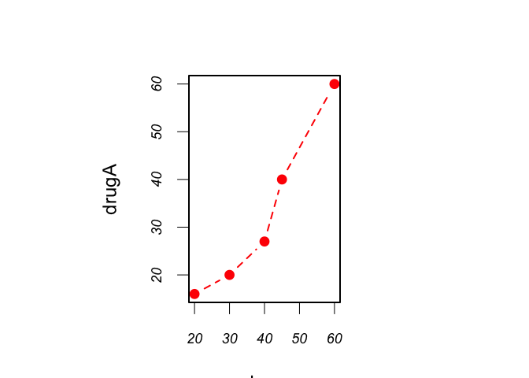<!-- -->

``` r
> plot(dose, drugB, type="b", pch=23, lty=6, col="blue", bg="green")  # 使用绿色填充的绿色菱形加蓝色边框和蓝色虚线创建了第二幅图形
```

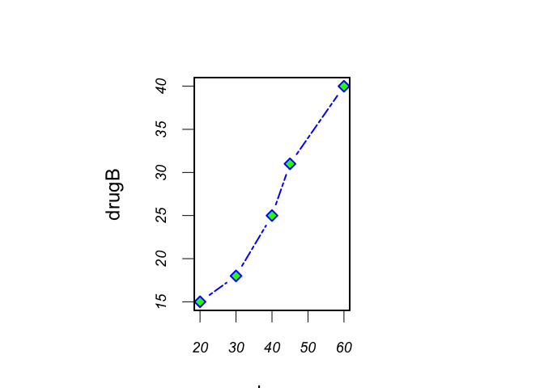<!-- -->

``` r
> par(opar)  # 还原了初始的图形参数设置
```

## 3.4 添加文本、自定义坐标轴的图例

- 通过以下代码在图形上添加了标题(main)、副标题(sub)、坐标轴标签(xlab、ylab)并指定了坐标轴范围(xlim、ylim)：

``` r
> plot(dose, drugA, type="b",       
+      col="red", lty=2, pch=2, lwd=2,      
+      main="Clinical Trials for Drug A",      
+      sub="This is hypothetical data",      
+      xlab="Dosage", ylab="Drug Response",      
+      xlim=c(0, 60), ylim=c(0, 70))
```

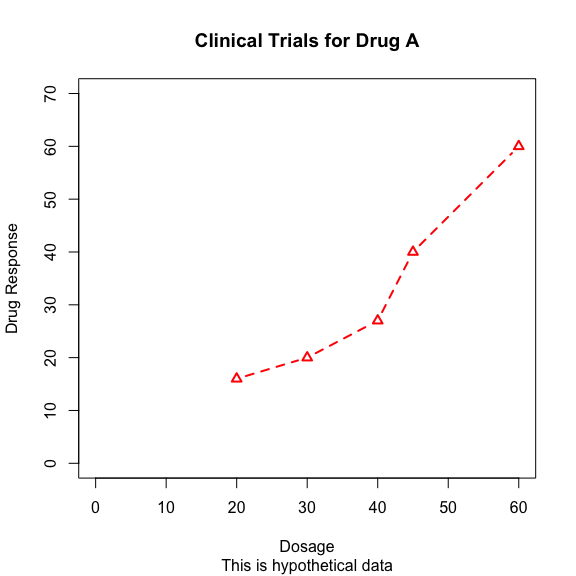<!-- -->

- **注意：并非所有函数都支持这些选项。请参考相应函数的帮助以了解其可以接受哪些选项。某些高级绘图函数已经包含了默认的标题和标签。可以通过在`plot()`语句或单独的`par()`语句中添加`ann=FALSE`来移除它们。**

### 3.4.1 标题

- 使用`title()`函数为图形添加标题和坐标轴标签。调用格式为:

<!-- -->

    title(main="main title", sub="subtitle",       
          xlab="x-axis label", ylab="y-axis label")

- 以下代码将生成红色的标题和蓝色的副标题，以及比默认大小小25%的绿色x轴、y轴标签：

<!-- -->

    title(main="My Title", col.main="red",        
          sub="My Subtitle", col.sub="blue",       
          xlab="My X label", ylab="My Y label",       
          col.lab="green", cex.lab=0.75)

- **注意：函数`title()`一般来说被用于添加信息到一个默认标题和坐标轴标签被`ann=FALSE`选项移除的图形中。**

### 3.4.2 坐标轴

- 可以使用函数`axis()`来创建自定义的坐标轴，而非使用R中的默认坐标轴。其格式为：

<!-- -->

    axis(side, at=, labels=, pos=, lty=, col=, las=, tck=, ...)

| 选项   | 描述                                                                                                                                     |
|--------|------------------------------------------------------------------------------------------------------------------------------------------|
| side   | 一个整数,表示在图形的哪边绘制坐标轴(1=下，2=左，3=上，4=右)。                                                                            |
| at     | 一个数值型向量，表示需要绘制刻度线的位置。                                                                                               |
| labels | 一个字符型向量，表示置于刻度线旁边的文字标签(如果为 NULL，则将直接使用 at 中的值)。                                                      |
| pos    | 坐标轴线绘制位置的坐标(即与另一条坐标轴相交位置的值)。                                                                                   |
| lty    | 线条类型。                                                                                                                               |
| col    | 线条和刻度线颜色。                                                                                                                       |
| las    | 标签是否平行于(=0)或垂直于(=2)坐标轴。                                                                                                   |
| tck    | 刻度线的长度，以相对于绘图区域大小的分数表示(负值表示在图形外侧，正值表示在图形内侧，0 表示禁用刻度，1 表示绘制网格线) ；默认值为–0.01。 |

- **注意：创建自定义坐标轴时，应当禁用高级绘图函数自动生成的坐标轴。参数`axes=FALSE`将禁用全部坐标轴(包括坐标轴框架线，除非你添加了参数`frame.plot=TRUE`)
  。参数xaxt=“n”和yaxt=“n”将分别禁用X轴或Y轴(会留下框架线，只是去除了刻度)
  。**

- 要创建次要刻度线,
  你需要使用Hmisc包中`的minor.tick()`函数。如果你尚未安装Hmisc包，请先安装它。使用以下代码来添加次要刻度线。其中nx和ny分别指定了X轴和Y轴**每两条**主刻度线之间(**即连续3条主刻度线之间**）通过次要刻度线划分得到的**区间个数**。`tick.ratio`表示次要刻度线相对于主刻度线的大小比例。当前的主刻度线长度可以使用`par("tck")`获取。

<!-- -->

    library(Hmisc) 
    minor.tick(nx=n, ny=n, tick.ratio=n)

- 举例来说，下列语句将在X轴的**每两条主刻度线**之间添加1条次要刻度线（分割得到2个区间），并在Y轴的**每两条主刻度线**之间添加2条次要刻度线（分割得到3个区间，次要刻度线的长度将是主刻度线的一半：

<!-- -->

    minor.tick(nx=2, ny=3, tick.ratio=0.5)

- 代码清单3-2 自定义坐标轴的示例

``` r
> # 生成数据
> x <- c(1:10) 
> y <- x  
> z <- 10/x 
> opar <- par(no.readonly=TRUE)  # 添加参数no.readonly=TRUE可以生成一个可以修改的当前图形参数列表
> 
> par(mar=c(5, 4, 4, 8) + 0.1)   # 增加边界大小，mar单位为英分，默认值为 c(5, 4, 4, 2) + 0.1
> # 绘制x对y的图形
> plot(x, y, type="b",   # 将x置于横轴，将y置于纵轴，绘制点集(x, y)，然后使用线段将其连接。选项type="b"表示同时绘制点和线     
+      pch=21, col="red",   # pch指定绘制点时使用的符号为21（空心圆），红色   
+      xaxt="n",yaxt="n", lty=3, ann=FALSE) # xaxt="n"和yaxt="n"将分别禁用X轴或Y轴(会留下框架线,只是去除了刻度) ，指定线条类型为3（点线），ann=FALSE移除默认标题和坐标轴标签
> # 添加x对1/x的直线
> lines(x, z, type="b", pch=22, col="blue", lty=2)  # pch指定绘制点时使用的符号为22（空心正方形），蓝色，指定线条类型为2（虚线）   
> # 绘制自定义的坐标轴
> axis(1, at=x, labels=x, col.axis="black", las=0)  # 底部坐标轴的设置
> axis(2, at=x, labels=x, col.axis="red", las=2)  # 2=在左边绘制坐标轴，刻度线在左轴上，左轴刻度上的文字（数字），线和刻度上数字为红色，刻度上的标签（这里是数字）垂直于坐标轴  
> axis(4, at=z, labels=round(z, digits=2),      
+      col.axis="blue", las=2, cex.axis=0.7, tck=-.01)   # 4=在右边绘制坐标轴，刻度线在右轴上，右轴刻度上的数字为10分别除以1-10内的整数，除不尽的结果取2位有效小数，线和刻度上数字为蓝色，刻度上的标签（这里是数字）垂直于坐标轴 
> # 添加标题和文本
> mtext("y=1/x", side=4, line=3, cex.lab=1, las=2, col="blue")  # mtext()将文本添加到图形上，cex.lab=1坐标轴标签(数字)的缩放1倍，且为蓝色
> title("An Example of Creative Axes",         
+       xlab="X values",       
+       ylab="Y=X")  # title()函数为图形添加标题和坐标轴标签
> library(Hmisc) 
> minor.tick(nx=4, ny=4, tick.ratio=0.5) # 在X轴和Y轴的每两条主刻度线之间(即1-3主刻度线之间）添加3条次要刻度线（分割得到4个区间），次要刻度线的长度将是主刻度线的一半
```

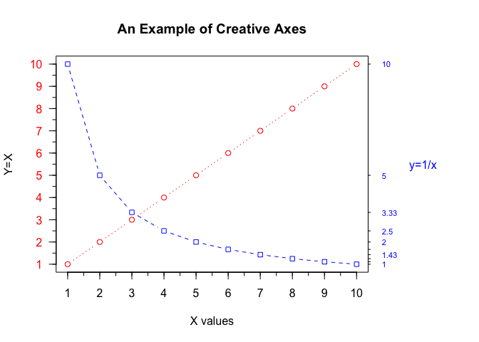<!-- -->

``` r
> par(opar)
```

### 3.4.3 参考线

- 函数`abline()`可以用来为图形添加参考线。其使用格式为：

<!-- -->

    abline(h=yvalues, v=xvalues)

- 函数`abline()`中也可以指定其他图形参数(如线条类型、颜色和宽度)
  。举例来说：

<!-- -->

    # 在y为1、5、7的位置添加了水平实线
    abline(h=c(1,5,7))
    # 在x为1、3、5、7、9的位置添加了垂直的蓝色虚线
    abline(v=seq(1, 10, 2), lty=2, col="blue")

### 3.4.4 图例

- 使用函数`legend()`来添加图例：

<!-- -->

    legend(location, title, legend, ...)

| 选项     | 描述                                                                                                                                                                                                                                                                                                                                           |
|----------|------------------------------------------------------------------------------------------------------------------------------------------------------------------------------------------------------------------------------------------------------------------------------------------------------------------------------------------------|
| location | 使用关键字 bottom、 bottomleft、 left、 topleft、 top、topright、right、bottomright 或 center 放置图例。                                                                                                                                                                                                                                       |
| title    | 图例标题的字符串(可选)。                                                                                                                                                                                                                                                                                                                       |
| legend   | 图例标签组成的字符型向量。                                                                                                                                                                                                                                                                                                                     |
| …        | 1、如果图例标示的是颜色不同的线条，需要指定 col=加上颜色值组成的向量。2、如果图例标示的是符号不同的点，则需指定 pch=加上符号的代码组成的向量。3、如果图例标示的是不同的线条宽度或线条类型，请使用 lwd=或 lty=加上宽度值或类型值组成的向量。4、要为图例创建颜色填充的盒形(常见于条形图、箱线图或饼图)，需要使用参数 fill=加上颜色值组成的向量。 |

- 其他常用的图例选项包括用于指定盒子样式的`bty`、指定背景色的`bg`、指定大小的`cex`，以及指定文本颜色的`text.col`。指定`horiz=TRUE`将会水平放置图例，而不是垂直放置。

- 代码清单3-3 依剂量对比药物A和药物B的响应情况

``` r
> dose  <- c(20, 30, 40, 45, 60)  
> drugA <- c(16, 20, 27, 40, 60) 
> drugB <- c(15, 18, 25, 31, 40)  
> opar <- par(no.readonly=TRUE)  
> # 增加线条、文本、符号、标签的宽度或大小
> par(lwd=2, cex=1.5, font.lab=2)
> # 绘制图形
> plot(dose, drugA, type="b",      
+      pch=15, lty=1, col="red", ylim=c(0, 60),       
+      main="Drug A vs. Drug B",      
+      xlab="Drug Dosage", ylab="Drug Response")   
> lines(dose, drugB, type="b",       
+       pch=17, lty=2, col="blue")  
> # 添加参考线
> abline(h=c(30), lwd=1.5, lty=2, col="gray")  
> # 添加次要刻度线
> library(Hmisc) 
> minor.tick(nx=3, ny=3, tick.ratio=0.5)   
> # 添加图例
> legend("topleft",inset=.05,title="Drug Type",c("A","B"),        
+        lty=c(1,2),pch=c(15, 17),col=c("red","blue"))   
```

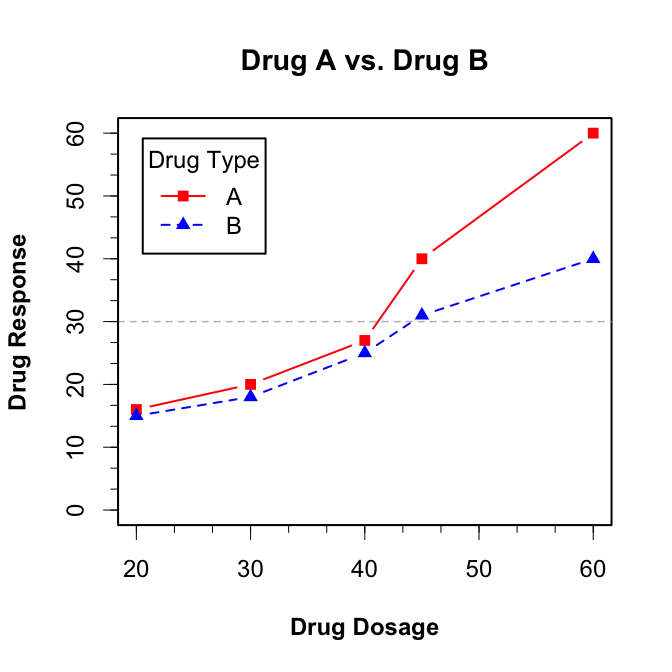<!-- -->

``` r
> par(opar)
```

### 3.4.5 文本标注

- 通过函数`text()`和`mtext()`将文本添加到图形上。`text()`可向绘图区域内部添加文本，而`mtext()`则向图形的四个边界之一添加文本。使用格式分别为:

<!-- -->

    text(location, "text to place", pos, ...) 
    mtext("text to place", side, line=n, ...)

| 选项     | 描述                                                                                                                                                                   |
|----------|------------------------------------------------------------------------------------------------------------------------------------------------------------------------|
| location | 文本的位置参数。可为一对 x、y 坐标，也可通过指定 location 为 locator(1)使用鼠标交互式地确定摆放位置。                                                                  |
| pos      | 文本相对于位置参数的方位。 1=下，2=左，3=上，4=右。 如果指定了 pos，就可以同时指定参数 offset= 作为偏移量，以相对于单个字符宽度的比例表示。                            |
| side     | 指定用来放置文本的边。1=下，2=左，3=上，4=右。你可以指定参数 line=来内移或外移文本，随着值的增加，文本将外移。也可使用 adj=0 将文本向左下对齐，或使用 adj=1 右上对齐。 |

- 其他常用的选项有`cex`、`col`和`font`(分别用来调整字号、颜色和字体样式)
  。

- 除了用来添加文本标注以外，**`text()`函数也通常用来标示图形中的点**。我们只需指定一系列的x、y坐标作为位置参数，同时以向量的形式指定要放置的文本。x、y和文本标签向量的长度应当相同。

``` r
> # 针对数据框mtcars提供的32种车型的车重和每加仑汽油行驶英里数绘制了散点图。
> attach(mtcars) 
> plot(wt, mpg,      
+      main="Mileage vs. Car Weight",      
+      xlab="Weight", ylab="Mileage",      
+      pch=18, col="blue") 
> # 函数text()被用来在各个数据点右侧添加车辆型号
> text(wt, mpg,      
+      row.names(mtcars),      
+      cex=0.6, pos=4, col="red")  # 各点的标签大小被缩小了40%, 颜色为红色
```

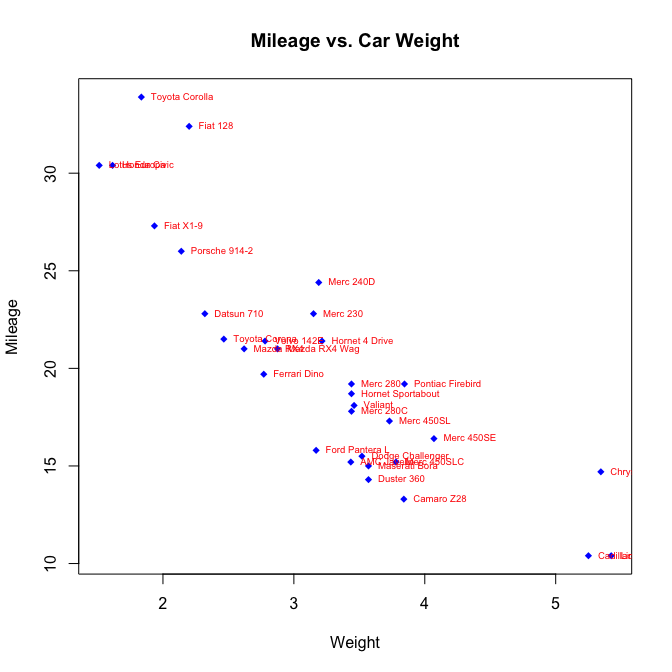<!-- -->

``` r
> detach(mtcars)
```

## 3.5 图形的组合

- 在R中使用函数`par()`或`layout()`可以容易地组合多幅图形为一幅总括图形。

- 可以在`par()`函数中使用图形参数`mfrow=c(nrows, ncols)`来创建按行填充的、行数为nrows、列数为ncols的图形矩阵。另外，可以使用`mfcol=c(nrows, ncols)`按列填充矩阵。

- 以下代码创建了四幅图形并将其排布在两行两列中：

``` r
> attach(mtcars) 
> opar <- par(no.readonly=TRUE) 
> par(mfrow=c(2,2))  # 两行两列
> plot(wt,mpg, main="Scatterplot of wt vs. mpg") 
> plot(wt,disp, main="Scatterplot of wt vs. disp") 
> hist(wt, main="Histogram of wt") 
> boxplot(wt, main="Boxplot of wt") 
```

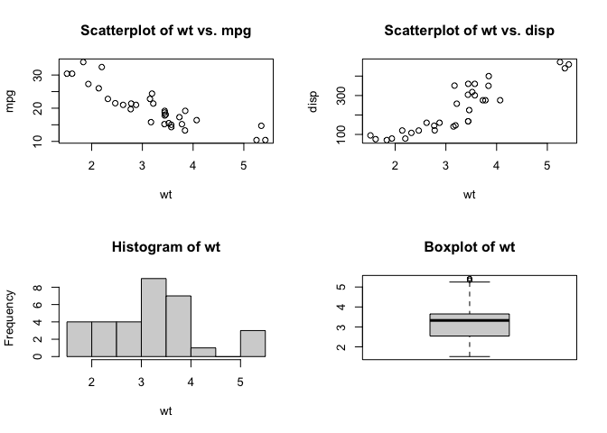<!-- -->

``` r
> par(opar) 
> detach(mtcars)
```

- 第二个示例，依三行一列排布三幅图形，代码如下:

``` r
> attach(mtcars) 
> opar <- par(no.readonly=TRUE) 
> par(mfrow=c(3,1)) #三行一列
> hist(wt)  # 请注意,高级绘图函数hist()包含了一个默认的标题(使用main=""可以禁用它,抑或使用ann=FALSE来禁用所有标题和标签)
> hist(mpg) 
> hist(disp) 
```

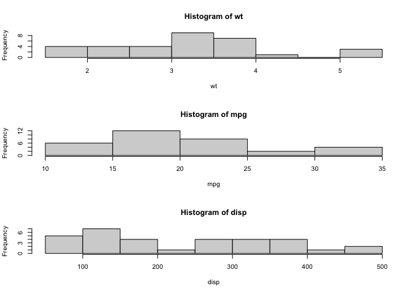<!-- -->

``` r
> par(opar) 
> detach(mtcars)
```

- 函数`layout()`的调用形式为`layout(mat)`，其中的mat是一个矩阵，它指定了所要组合的多个图形的所在位置。在以下代码中，一幅图被置于第1行，另两幅图则被置于第2行：

``` r
> attach(mtcars) 
> layout(matrix(c(1,1,2,3), 2, 2, byrow = TRUE)) 
> hist(wt) 
> hist(mpg) 
> hist(disp) 
```

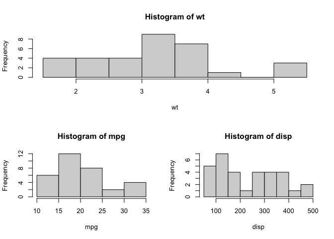<!-- -->

``` r
> detach(mtcars)
```

- 为了更精确地控制每幅图形的大小，可以有选择地在`layout()`函数中使用widths=和heights=两个参数。其形式为：widths
  = 各列宽度值组成的一个向量，heights = 各行高度值组成的一个向量。

- 相对宽度可以直接通过数值指定，绝对宽度(以厘米为单位)可以通过函数`lcm()`来指定。

- 对上图通过以下代码进行修改，第1行中图形的高度是第2行中图形高度的二分之一。除此之外，右下角图形的宽度是左下角图形宽度的三分之一：

``` r
> attach(mtcars) 
> layout(matrix(c(1, 1, 2, 3), 2, 2, byrow = TRUE),        
+        widths=c(3, 1), heights=c(1, 2)) 
> hist(wt) 
> hist(mpg) 
> hist(disp) 
```

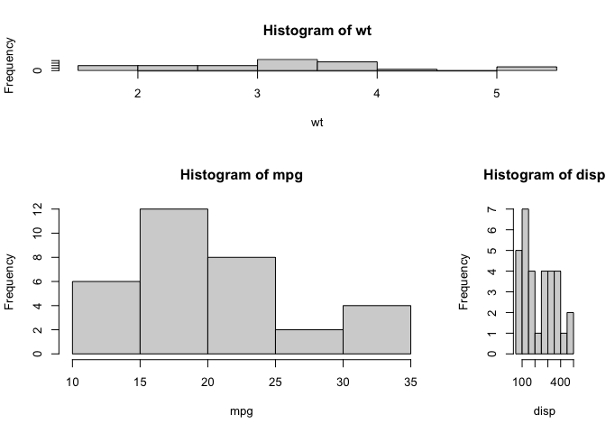<!-- -->

``` r
> detach(mtcars)
```

- 案例：图形布局的精细控制

- 通过排布或叠加若干图形来创建单幅的、有意义的图形，可以使用图形参数fig=完成这个任务。

``` r
> opar <- par(no.readonly=TRUE) 
> par(fig=c(0, 0.8, 0, 0.8))  # 第一个fig=将散点图设定为占据横向范围0~0.8,纵向范围0~0.8
> # 设置散点图
> plot(mtcars$wt, mtcars$mpg,      
+      xlab="Miles Per Gallon",      
+      ylab="Car Weight") 
> # 在上方添加箱线图
> par(fig=c(0, 0.8, 0.55, 1), new=TRUE)  # 上方的箱线图横向占据0~0.8,纵向0.55~1。右侧的箱线图横向占据0.65~1,纵向0~0.8
> boxplot(mtcars$wt, horizontal=TRUE, axes=FALSE)  
> # 在右侧添加箱线图
> par(fig=c(0.65, 1, 0, 0.8), new=TRUE) 
> boxplot(mtcars$mpg, axes=FALSE)
> mtext("Enhanced Scatterplot", side=3, outer=TRUE, line=-3)  
```

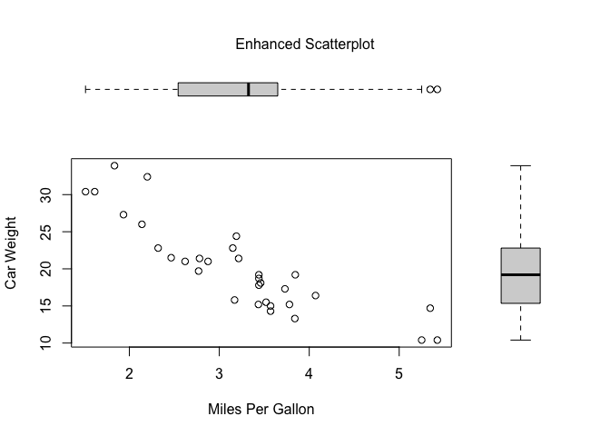<!-- -->

``` r
> par(opar)
```
