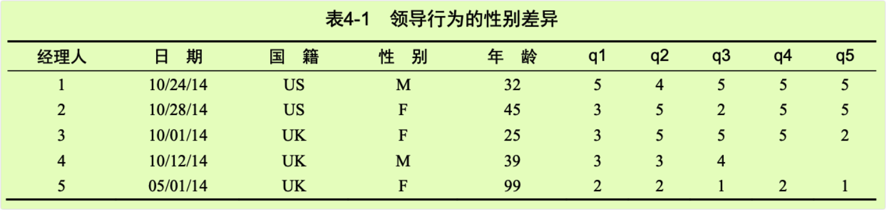

chapter04_基本数据管理
================

- <a href="#4-基本数据管理" id="toc-4-基本数据管理">4 基本数据管理</a>
  - <a href="#41-一个示例" id="toc-41-一个示例">4.1 一个示例</a>
  - <a href="#42-创建新变量" id="toc-42-创建新变量">4.2 创建新变量</a>
  - <a href="#43-变量的重编码" id="toc-43-变量的重编码">4.3 变量的重编码</a>
  - <a href="#44-变量的重命名" id="toc-44-变量的重命名">4.4 变量的重命名</a>
  - <a href="#45-缺失值" id="toc-45-缺失值">4.5 缺失值</a>
    - <a href="#451-重编码某些值为缺失值"
      id="toc-451-重编码某些值为缺失值">4.5.1 重编码某些值为缺失值</a>
    - <a href="#452-在分析中排除缺失值" id="toc-452-在分析中排除缺失值">4.5.2
      在分析中排除缺失值</a>
  - <a href="#46-日期值" id="toc-46-日期值">4.6 日期值</a>
  - <a href="#47-类型转换" id="toc-47-类型转换">4.7 类型转换</a>
  - <a href="#48-数据排序" id="toc-48-数据排序">4.8 数据排序</a>
  - <a href="#49-数据集的合并" id="toc-49-数据集的合并">4.9 数据集的合并</a>
    - <a href="#491-向数据框添加列" id="toc-491-向数据框添加列">4.9.1
      向数据框添加列</a>
    - <a href="#492-向数据框添加行" id="toc-492-向数据框添加行">4.9.2
      向数据框添加行</a>
    - <a href="#493-向数据框添加列" id="toc-493-向数据框添加列">4.9.3
      向数据框添加列</a>
  - <a href="#410-数据集取子集" id="toc-410-数据集取子集">4.10
    数据集取子集</a>
    - <a href="#4101-选入保留变量" id="toc-4101-选入保留变量">4.10.1
      选入(保留)变量</a>
    - <a href="#4102-剔除丢弃变量" id="toc-4102-剔除丢弃变量">4.10.2
      剔除(丢弃)变量</a>
    - <a href="#4103-选入观测" id="toc-4103-选入观测">4.10.3 选入观测</a>
    - <a href="#4104-subset-函数" id="toc-4104-subset-函数">4.10.4 subset(
      )函数</a>
    - <a href="#4105-随机抽样" id="toc-4105-随机抽样">4.10.5 随机抽样</a>

# 4 基本数据管理

## 4.1 一个示例



- 在这里，每位经理人的上司根据与服从权威相关的五项陈述（q1到q5)对经理人进行评分。例如，经理人1是一位在美国工作的32岁男性，上司对他的评价是惯于顺从，而经理人5是一位在英国工作的，年龄未知(99可能代表缺失)的女性，服从程度评分较低。日期一栏记录了进行评分的时间。

- 一个数据集中可能含有几十个变量和成千上万的观测，但为了简化示例，我们仅选取了5行10列的数据。另外，我们已将关于经理人服从行为的问题数量限制为5。在现实的研究中，你很可能会使用10到20个类似的问题来提高结果的可靠性和有效性。可以使用代码清单4-1中的代码创建一个包含表4-1中数据的数据框。

- 代码清单4-1 创建leadership数据框

``` r
> manager <- c(1,2,3,4,5)
> date <- c("10/24/08","10/28/08","10/1/08","10/12/08","5/1/09") 
> country <- c("US","US","UK","UK","UK") 
> gender <- c("M","F","F","M","F") 
> age <- c(32,45,25,39,99) 
> q1<-c(5,3,3,3,2)
> q2<-c(4,5,5,3,2)
> q3<-c(5,2,5,4,1)
> q4<-c(5,5,5,NA,2)
> q5<-c(5,5,2,NA,1)
> leadership <- data.frame(manager,date,country,gender,age,
+                          q1,q2,q3,q4,q5,stringsAsFactors=FALSE)
> leadership
  manager     date country gender age q1 q2 q3 q4 q5
1       1 10/24/08      US      M  32  5  4  5  5  5
2       2 10/28/08      US      F  45  3  5  2  5  5
3       3  10/1/08      UK      F  25  3  5  5  5  2
4       4 10/12/08      UK      M  39  3  3  4 NA NA
5       5   5/1/09      UK      F  99  2  2  1  2  1
```

## 4.2 创建新变量

- 运算符

<!-- -->

    + # 加
    - # 减
    * # 乘
    / # 除
    ^或** # 求幂 
    x%%y # 求余数。例如，5%%2的余数为1（5/2结果为2余1）
    x%/%y # 整数除法。5%/%2的结果为2（5/2结果为2余1） 

- 案例：

``` r
> my_data <- data.frame(x1 = c(2, 2, 6, 4),                    
+                       x2 = c(3, 4, 2, 8))
> my_data <- transform(my_data,
+                     sumx=x1+x2,
+                     neanx=(x1+x2)/2)
> my_data
  x1 x2 sumx neanx
1  2  3    5   2.5
2  2  4    6   3.0
3  6  2    8   4.0
4  4  8   12   6.0
```

## 4.3 变量的重编码

- 重编码涉及根据同一个变量和/或其他变量的现有值创建新值的过程。

- 要重编码数据,可以使用R中的一个或多个逻辑运算符。逻辑运算符表达式可返回TRUE或FALSE。

- 逻辑运算符

<!-- -->

    < # 小于 
    <= # 小于或等于 
    > # 大于 
    >= # 大于或等于 
    == # 严格等于 
    != # 不等于 
    !x # 非x 
    x | y # x或y 
    x & y # x和y 
    isTRUE(x) # 测试x是否为TRUE

``` r
> # 创建leadership数据框
> manager <- c(1, 2, 3, 4, 5) 
> date <- c("10/24/08", "10/28/08", "10/1/08", "10/12/08", "5/1/09") 
> country <- c("US", "US", "UK", "UK", "UK") 
> gender <- c("M", "F", "F", "M", "F") 
> age <- c(32, 45, 25, 39, 99) 
> q1 <- c(5, 3, 3, 3, 2) 
> q2 <- c(4, 5, 5, 3, 2) 
> q3 <- c(5, 2, 5, 4, 1) 
> q4 <- c(5, 5, 5, NA, 2) 
> q5 <- c(5, 5, 2, NA, 1) 
> leadership <- data.frame(manager, date, country, gender, age,                          
+                          q1, q2, q3, q4, q5, stringsAsFactors=FALSE)
> leadership
  manager     date country gender age q1 q2 q3 q4 q5
1       1 10/24/08      US      M  32  5  4  5  5  5
2       2 10/28/08      US      F  45  3  5  2  5  5
3       3  10/1/08      UK      F  25  3  5  5  5  2
4       4 10/12/08      UK      M  39  3  3  4 NA NA
5       5   5/1/09      UK      F  99  2  2  1  2  1
```

- 假设希望将leadership数据集中经理人的连续型年龄变量age重编码为类别型变量agecat(Young、
  Middle Aged、Elder)。创建agecat变量：

``` r
> leadership <- within(leadership,{                      
+     agecat <- NA                       
+     agecat[age > 75]              <- "Elder"                      
+     agecat[age >= 55 & age <= 75] <- "Middle Aged"                      
+     agecat[age < 55]              <- "Young" })
> leadership
  manager     date country gender age q1 q2 q3 q4 q5 agecat
1       1 10/24/08      US      M  32  5  4  5  5  5  Young
2       2 10/28/08      US      F  45  3  5  2  5  5  Young
3       3  10/1/08      UK      F  25  3  5  5  5  2  Young
4       4 10/12/08      UK      M  39  3  3  4 NA NA  Young
5       5   5/1/09      UK      F  99  2  2  1  2  1  Elder
```

## 4.4 变量的重命名

- 假设你希望将变量名manager修改为managerID，并将date修改为testDate，那么可以使用语句：

<!-- -->

    fix(leadership)

- 若以编程方式，可以通过`names()`函数来重命名变量。例如：

``` r
> names(leadership)[2] <- "testDate"
> names(leadership)[6:10] <- c("item1", "item2", "item3", "item4", "item5")
> leadership
  manager testDate country gender age item1 item2 item3 item4 item5 agecat
1       1 10/24/08      US      M  32     5     4     5     5     5  Young
2       2 10/28/08      US      F  45     3     5     2     5     5  Young
3       3  10/1/08      UK      F  25     3     5     5     5     2  Young
4       4 10/12/08      UK      M  39     3     3     4    NA    NA  Young
5       5   5/1/09      UK      F  99     2     2     1     2     1  Elder
```

- plyr包中有一个`rename()`函数，可用于修改变量名。这个函数默认并没有被安装，所以你首先要使用命令`install.packages("plyr")`对之进行安装。

- `rename()`函数的使用格式为：

<!-- -->

    rename(dataframe, c(oldname="newname", oldname="newname",...))

- 示例：

``` r
> library(plyr) 
> leadership <- rename(leadership,                       
+                     c(manager="managerID", testDate="date"))
> leadership
  managerID     date country gender age item1 item2 item3 item4 item5 agecat
1         1 10/24/08      US      M  32     5     4     5     5     5  Young
2         2 10/28/08      US      F  45     3     5     2     5     5  Young
3         3  10/1/08      UK      F  25     3     5     5     5     2  Young
4         4 10/12/08      UK      M  39     3     3     4    NA    NA  Young
5         5   5/1/09      UK      F  99     2     2     1     2     1  Elder
```

## 4.5 缺失值

- 在R中，缺失值以符号NA(Not
  Available，不可用)表示。R提供了一些函数，用于识别包含缺失值的观测。函数`is.na()`允许检测缺失值是否存在。

``` r
> # 再次使用leadership数据框
> manager <- c(1, 2, 3, 4, 5) 
> date <- c("10/24/08", "10/28/08", "10/1/08", "10/12/08", "5/1/09") 
> country <- c("US", "US", "UK", "UK", "UK") 
> gender <- c("M", "F", "F", "M", "F") 
> age <- c(32, 45, 25, 39, 99) 
> q1 <- c(5, 3, 3, 3, 2) 
> q2 <- c(4, 5, 5, 3, 2) 
> q3 <- c(5, 2, 5, 4, 1) 
> q4 <- c(5, 5, 5, NA, 2) 
> q5 <- c(5, 5, 2, NA, 1) 
> leadership <- data.frame(manager, date, country, gender, age,                          
+                          q1, q2, q3, q4, q5, stringsAsFactors=FALSE)
> leadership
  manager     date country gender age q1 q2 q3 q4 q5
1       1 10/24/08      US      M  32  5  4  5  5  5
2       2 10/28/08      US      F  45  3  5  2  5  5
3       3  10/1/08      UK      F  25  3  5  5  5  2
4       4 10/12/08      UK      M  39  3  3  4 NA NA
5       5   5/1/09      UK      F  99  2  2  1  2  1
```

``` r
> is.na(leadership[,6:10])
        q1    q2    q3    q4    q5
[1,] FALSE FALSE FALSE FALSE FALSE
[2,] FALSE FALSE FALSE FALSE FALSE
[3,] FALSE FALSE FALSE FALSE FALSE
[4,] FALSE FALSE FALSE  TRUE  TRUE
[5,] FALSE FALSE FALSE FALSE FALSE
```

- 这里的`leadership[,6:10]`将数据框限定到第6列至第10列，接下来`is.na()`识别出了缺失值。

### 4.5.1 重编码某些值为缺失值

- 还可以使用赋值语句将某些值重编码为缺失值。在leadership示例中，缺失的年龄值被编码为99。在分析这一数据集之前，必须让R明白本例中的99表示缺失值(否则这些样本的平均年龄将会高得离谱)。可以通过重编码这个变量完成这项工作（**请确保所有的缺失数据已在分析之前被妥善地编码为缺失值，否则分析结果将失去意义。**）：

``` r
> # 任何等于99的年龄值都将被修改为NA
> leadership$age[leadership$age == 99] <- NA
> leadership
  manager     date country gender age q1 q2 q3 q4 q5
1       1 10/24/08      US      M  32  5  4  5  5  5
2       2 10/28/08      US      F  45  3  5  2  5  5
3       3  10/1/08      UK      F  25  3  5  5  5  2
4       4 10/12/08      UK      M  39  3  3  4 NA NA
5       5   5/1/09      UK      F  NA  2  2  1  2  1
```

### 4.5.2 在分析中排除缺失值

- 确定了缺失值的位置以后，你需要在进一步分析数据之前以某种方式删除这些缺失值。多数的数值函数都拥有一个`na.rm=TRUE`选项，可以在计算之前移除缺失值并使用剩余值进行计算：

``` r
> x <- c(1, 2, NA, 3) 
> y <- sum(x, na.rm=TRUE)
> y
[1] 6
```

- 在使用函数处理不完整的数据时，请务必查阅它们的帮助文档(例如，help(sum))，检查这些函数是如何处理缺失数据的。

- 可以通过函数`na.omit()`移除所有含有缺失值的观测。`na.omit()`可以删除所有含有缺失数据的行。

``` r
> # 使用na.omit()删除不完整的观测
> newdata <- na.omit(leadership) 
> newdata
  manager     date country gender age q1 q2 q3 q4 q5
1       1 10/24/08      US      M  32  5  4  5  5  5
2       2 10/28/08      US      F  45  3  5  2  5  5
3       3  10/1/08      UK      F  25  3  5  5  5  2
```

## 4.6 日期值

- 日期值通常以字符串的形式输入到R中，然后转化为以数值形式存储的日期变量。函数`as.Date()`用于执行这种转化。其语法为`as.Date(x, "input_format")`，其中x是字符型数据，input_format则给出了用于读入日期的适当格式。

<!-- -->

    %d # 数字表示的日期(0~31) 01~31 
    %a # 缩写的星期名 Mon 
    %A # 非缩写星期名 Monday 
    %m # 月份(00~12) 00~12 
    %b # 缩写的月份 Jan 
    %B # 非缩写月份 January 
    %y # 两位数的年份 07 
    %Y # 四位数的年份 2007

- 有两个函数对于处理时间戳数据特别实用。`Sys.Date()`可以返回当天的日期，而`date()`则返回当前的日期和时间。

- 可以使用函数`format(x, format="output_format")`来输出指定格式的日期值，并且可以提取日期值中的某些部分，`format()`函数可接受一个参数(本例中是一个日期)并按某种格式输出结果：

``` r
> today <- Sys.Date() 
> format(today, format="%B %d %Y")
[1] "January 04 2023"
> format(today, format="%A")
[1] "Wednesday"
```

- R可以在日期值上执行算术运算。例如：

``` r
> startdate <- as.Date("2004-02-13") 
> enddate <- as.Date("2011-01-22")
> days <- enddate - startdate 
> days
Time difference of 2535 days
```

``` r
> today <- Sys.Date()
> dob <- as.Date("1956-10-12") 
> difftime(today, dob, units="weeks")
Time difference of 3455.714 weeks
```

## 4.7 类型转换

- R与其他统计编程语言有着类似的数据类型转换方式。举例来说，向一个数值型向量中添加一个字符串会将此向量中的所有元素转换为字符型。

- 判断类型：

<!-- -->

    is.numeric()
    is.character() 
    is.vector()
    is.matrix()
    is.data.frame() 
    is.factor()
    is.logical()

- 转换类型：

<!-- -->

    as.numeric()
    as.character()
    as.vector() 
    as.matrix() 
    as.data.frame() 
    as.factor() 
    as.logical()

- 名为`is.datatype()`这样的函数返回TRUE或FALSE,
  而`as.datatype()`这样的函数则将其参数转换为对应的类型。

- 案例：

``` r
> a <- c(1,2,3)  # a为数值型向量
> a
[1] 1 2 3
```

``` r
> is.numeric(a)
[1] TRUE
```

``` r
> is.vector(a)
[1] TRUE
```

``` r
> a <- as.character(a) # 将a转换为字符型向量
> a
[1] "1" "2" "3"
```

``` r
> is.numeric(a)
[1] FALSE
```

``` r
> is.vector(a)
[1] TRUE
```

``` r
> is.character(a)
[1] TRUE
```

## 4.8 数据排序

- 在R中，可以使用`order()`函数对一个数据框进行排序。默认的排序顺序是升序。在排序变量的前边加一个减号即可得到降序的排序结果。

``` r
> # 再次使用leadership数据框
> manager <- c(1, 2, 3, 4, 5) 
> date <- c("10/24/08", "10/28/08", "10/1/08", "10/12/08", "5/1/09") 
> country <- c("US", "US", "UK", "UK", "UK") 
> gender <- c("M", "F", "F", "M", "F") 
> age <- c(32, 45, 25, 39, 99) 
> q1 <- c(5, 3, 3, 3, 2) 
> q2 <- c(4, 5, 5, 3, 2) 
> q3 <- c(5, 2, 5, 4, 1) 
> q4 <- c(5, 5, 5, NA, 2) 
> q5 <- c(5, 5, 2, NA, 1) 
> leadership <- data.frame(manager, date, country, gender, age,                          
+                          q1, q2, q3, q4, q5, stringsAsFactors=FALSE)
> leadership
  manager     date country gender age q1 q2 q3 q4 q5
1       1 10/24/08      US      M  32  5  4  5  5  5
2       2 10/28/08      US      F  45  3  5  2  5  5
3       3  10/1/08      UK      F  25  3  5  5  5  2
4       4 10/12/08      UK      M  39  3  3  4 NA NA
5       5   5/1/09      UK      F  99  2  2  1  2  1
```

``` r
> # 创建了一个新的数据集,其中各行依经理人的年龄升序排序
> newdata <- leadership[order(leadership$age),]
> newdata
  manager     date country gender age q1 q2 q3 q4 q5
3       3  10/1/08      UK      F  25  3  5  5  5  2
1       1 10/24/08      US      M  32  5  4  5  5  5
4       4 10/12/08      UK      M  39  3  3  4 NA NA
2       2 10/28/08      US      F  45  3  5  2  5  5
5       5   5/1/09      UK      F  99  2  2  1  2  1
```

``` r
> # 将各行依女性到男性、同样性别中按年龄升序排序
> attach(leadership) 
> newdata <- leadership[order(gender, age),] 
> detach(leadership)
> newdata
  manager     date country gender age q1 q2 q3 q4 q5
3       3  10/1/08      UK      F  25  3  5  5  5  2
2       2 10/28/08      US      F  45  3  5  2  5  5
5       5   5/1/09      UK      F  99  2  2  1  2  1
1       1 10/24/08      US      M  32  5  4  5  5  5
4       4 10/12/08      UK      M  39  3  3  4 NA NA
```

``` r
> # 将各行依经理人的性别和年龄降序排序
> attach(leadership) 
> newdata <-leadership[order(gender, -age),] 
> detach(leadership)
> newdata
  manager     date country gender age q1 q2 q3 q4 q5
5       5   5/1/09      UK      F  99  2  2  1  2  1
2       2 10/28/08      US      F  45  3  5  2  5  5
3       3  10/1/08      UK      F  25  3  5  5  5  2
4       4 10/12/08      UK      M  39  3  3  4 NA NA
1       1 10/24/08      US      M  32  5  4  5  5  5
```

## 4.9 数据集的合并

- 如果数据分散在多个地方，你就需要在继续下一步之前将其合并。

### 4.9.1 向数据框添加列

- 要横向合并两个数据框(数据集)，请使用`merge()`函数。在多数情况下，两个数据框是通过一个或多个共有变量进行联结的(即一种内联结，inner
  join)。例如：

<!-- -->

    # 将dataframeA和dataframeB按照ID进行了合并
    total <- merge(dataframeA, dataframeB, by="ID")
    # 将两个数据框按照ID和Country进行了合并
    total <- merge(dataframeA, dataframeB, by=c("ID","Country"))

### 4.9.2 向数据框添加行

- 要纵向合并两个数据框(数据集)，请使用`rbind()`函数：

<!-- -->

    total <- rbind(dataframeA, dataframeB)

### 4.9.3 向数据框添加列

- 要横向合并两个数据框(数据集)，请使用`cbind()`函数：

  `total <- cbind(dataframeA, dataframeB)`

- 两个数据框必须拥有相同的变量，不过它们的顺序不必一定相同。如果dataframeA中拥有dataframeB中没有的变量，请在合并它们之前做以下某种处理：

  - 删除dataframeA中的多余变量。
  - 在dataframeB中创建追加的变量并将其值设为NA(缺失)。

- 纵向联结通常用于向数据框中添加观测。

## 4.10 数据集取子集

### 4.10.1 选入(保留)变量

- 从一个大数据集中选择有限数量的变量来创建一个新的数据集是常有的事。通过`dataframe[row indices, column indices]`这样的记号来访问选择变量。例如：

``` r
> newdata <- leadership[, c(6:10)]
> newdata
  q1 q2 q3 q4 q5
1  5  4  5  5  5
2  3  5  2  5  5
3  3  5  5  5  2
4  3  3  4 NA NA
5  2  2  1  2  1
```

- 案例：从leadership数据框中选择了变量q1、q2、q3、q4和q5，并将它们保存到了数据框newdata中。将行下标留空(,)表示默认选择所有行。

``` r
> # 实现了等价的变量选择。这里, (引号中的)变量名充当了列的下标,因此选择的列是相同的
> myvars <- c("q1", "q2", "q3", "q4", "q5")
> newdata <-leadership[myvars]
> newdata
  q1 q2 q3 q4 q5
1  5  4  5  5  5
2  3  5  2  5  5
3  3  5  5  5  2
4  3  3  4 NA NA
5  2  2  1  2  1
```

### 4.10.2 剔除(丢弃)变量

- 剔除变量的原因有很多。例如，如果某个变量中有很多缺失值，你可能就想在进一步分析之前将其丢弃。下面是一些剔除变量的方法。

``` r
> # 剔除变量q3和q4
> myvars <- names(leadership) %in% c("q3", "q4") 
> newdata <- leadership[!myvars] 
> newdata
  manager     date country gender age q1 q2 q5
1       1 10/24/08      US      M  32  5  4  5
2       2 10/28/08      US      F  45  3  5  5
3       3  10/1/08      UK      F  25  3  5  2
4       4 10/12/08      UK      M  39  3  3 NA
5       5   5/1/09      UK      F  99  2  2  1
```

### 4.10.3 选入观测

``` r
> # 选择第1行到第3行 (前三个观测）
> newdata <- leadership[1:3,]
> # 选择所有30岁以上的男性
> newdata <- leadership[leadership$gender=="M" &                               
+                       leadership$age > 30,]
> # 使用了attach()函数, 所以你就不必在变量名前加上数据框名称了
> attach(leadership)         
> newdata <- leadership[gender=='M' & age > 30,]          
> detach(leadership)
> newdata
  manager     date country gender age q1 q2 q3 q4 q5
1       1 10/24/08      US      M  32  5  4  5  5  5
4       4 10/12/08      UK      M  39  3  3  4 NA NA
```

### 4.10.4 subset( )函数

- 使用`subset()`函数大概是选择变量和观测最简单的方法了。

``` r
> # 选择所有age值大于等于35或age值小于24的行,保留了变量q1到q4
> newdata <- subset(leadership, age >= 35 | age < 24,                   
+                   select=c(q1, q2, q3, q4))
> newdata
  q1 q2 q3 q4
2  3  5  2  5
4  3  3  4 NA
5  2  2  1  2
```

``` r
> # 选择所有25岁以上的男性,并保留了变量gender到q4(gender、q4和其间所有列)
> newdata <- subset(leadership, gender=="M" & age > 25,                    
+                   select=gender:q4)
> newdata
  gender age q1 q2 q3 q4
1      M  32  5  4  5  5
4      M  39  3  3  4 NA
```

### 4.10.5 随机抽样

- `sample()`函数能够让你从数据集中(有放回或无放回地)抽取大小为n的一个随机样本。

``` r
> # 从leadership数据集中随机抽取一个大小为3的样本
> my_sample <- leadership[sample(1:nrow(leadership), 3, replace=FALSE),]
> my_sample
  manager     date country gender age q1 q2 q3 q4 q5
2       2 10/28/08      US      F  45  3  5  2  5  5
5       5   5/1/09      UK      F  99  2  2  1  2  1
1       1 10/24/08      US      M  32  5  4  5  5  5
```

- `sample()`函数中的**第一个参数是一个由要从中抽样的元素组成的向量。在这里，这个向量是1到数据框中观测的数量，第二个参数是要抽取的元素数量，第三个参数表示无放回抽样**。`sample()`函数会返回随机抽样得到的元素，之后即可用于选择数据框中的行。
