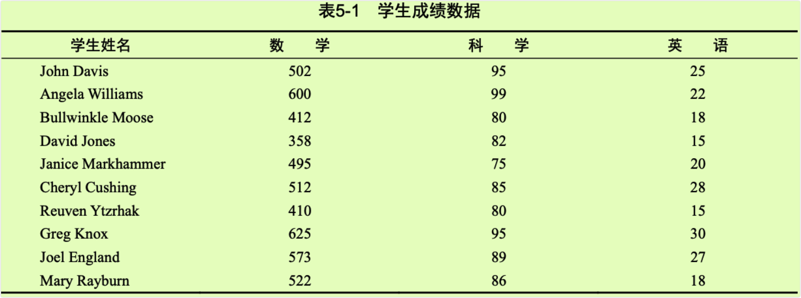
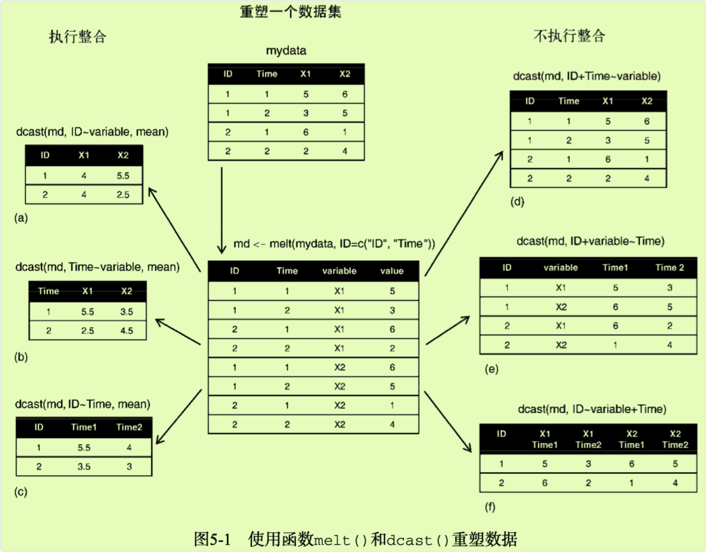

```{r setup, include=FALSE}
knitr::opts_chunk$set(prompt=TRUE,comment='',echo=TRUE,collapse=TRUE,message=FALSE,warning=FALSE)
```

# 5 高级数据管理

## 5.1 一个数据处理难题

-   要讨论数值和字符处理函数，让我们首先考虑一个数据处理问题。一组学生参加了数学、科学和英语考试。为了给所有学生确定一个单一的成绩衡量指标，需要将这些科目的成绩组合起来。另外，你还想将前20%的学生评定为A，接下来20%的学生评定为B，依次类推。最后，你希望按字母顺序对学生排序。数据如表5-1所示。



## 5.2 数值和字符处理函数

### 5.2.1 数学函数

+------------------------------+--------------------------------------------------------------------------+
| 函数                         | 描述                                                                     |
+==============================+==========================================================================+
| abs(x)                       | 绝对值 abs(-4)，返回值为 4。                                             |
+------------------------------+--------------------------------------------------------------------------+
| sqrt(x)                      | 平方根 sqrt(25)返回值为 5，和 25\^(0.5)等价。                            |
+------------------------------+--------------------------------------------------------------------------+
| ceiling(x)                   | 不小于 x 的最小整数，ceiling(3.475)返回值为 4。                          |
+------------------------------+--------------------------------------------------------------------------+
| floor(x)                     | 不大于 x 的最大整数，floor(3.475)返回值为 3。                            |
+------------------------------+--------------------------------------------------------------------------+
| trunc(x)                     | 向 0 的方向截取的 x 中的整数部分，trunc(5.99)返回值为 5。                |
+------------------------------+--------------------------------------------------------------------------+
| round(x, digits=n)           | 将 x 舍入为指定位的**小数**，round(3.475, digits=2)返回值为 3.48。       |
+------------------------------+--------------------------------------------------------------------------+
| signif(x, digits=n)          | 将 x 舍入为指定的有效**数字位数**，signif(3.475, digits=2)返回值为 3.5。 |
+------------------------------+--------------------------------------------------------------------------+
| cos(x)、sin(x)、tan(x)       | 余弦、正弦和正切，cos(2)返回值为--0.416。                                |
+------------------------------+--------------------------------------------------------------------------+
| acos(x)、asin(x)、atan(x)    | 反余弦、反正弦和反正切，acos(-0.416)返回值为 2。                         |
+------------------------------+--------------------------------------------------------------------------+
| cosh(x)、sinh(x)、tanh(x)    | 双曲余弦、双曲正弦和双曲正切，sinh(2)返回值为 3.627。                    |
+------------------------------+--------------------------------------------------------------------------+
| acosh(x)、asinh(x)、atanh(x) | 反双曲余弦、反双曲正弦和反双曲正切，asinh(3.627)返回值为 2。             |
+------------------------------+--------------------------------------------------------------------------+
| log(x,base=n)                | 对 x 取以 n 为底的对数。为了方便起见：                                   |
|                              |                                                                          |
| log(x)                       | • log(x)为自然对数                                                       |
|                              |                                                                          |
| log10(x)                     | • log10(x)为常用对数                                                     |
|                              |                                                                          |
|                              | • log(10)返回值为 2.3026                                                 |
|                              |                                                                          |
|                              | • log10(10)返回值为 1                                                    |
+------------------------------+--------------------------------------------------------------------------+
| exp(x)                       | 指数函数，exp(2.3026)返回值为 10。                                       |
+------------------------------+--------------------------------------------------------------------------+

-   当这些函数被应用于数值向量、矩阵或数据框时，它们会作用于每一个独立的值。例如：

```{r}
sqrt(c(4, 16, 25))
```

### 5.2.2 统计函数

+----------------------------------+-----------------------------------------------------------------------------------------------------------------------------------------------------+
| 函数                             | 描述                                                                                                                                                |
+==================================+=====================================================================================================================================================+
| mean(x)                          | 平均数。mean(c(1,2,3,4))返回值为 2.5。mean(x, trim = 0.05, na.rm=TRUE)是截尾平均数，即丢弃了最大5%和最小5%的数据和所有缺失值后的算术平均数。        |
+----------------------------------+-----------------------------------------------------------------------------------------------------------------------------------------------------+
| median(x)                        | 中位数。median(c(1,2,3,4))返回值为 2.5。                                                                                                            |
+----------------------------------+-----------------------------------------------------------------------------------------------------------------------------------------------------+
| sd(x)                            | 标准差。sd(c(1,2,3,4))返回值为 1.29。                                                                                                               |
+----------------------------------+-----------------------------------------------------------------------------------------------------------------------------------------------------+
| var(x)                           | 方差。var(c(1,2,3,4))返回值为 1.67。                                                                                                                |
+----------------------------------+-----------------------------------------------------------------------------------------------------------------------------------------------------+
| mad(x)                           | 绝对中位差(median absolute deviation)。mad(c(1,2,3,4))返回值为 1.48。                                                                               |
+----------------------------------+-----------------------------------------------------------------------------------------------------------------------------------------------------+
| quantile(x,probs)                | 求分位数。其中 x 为待求分位数的数值型向量，probs 为一个由[0,1]之间的概率值组成的数值向量。# 求 x 的 30%和 84%分位点，y \<- quantile(x, c(.3,.84))。 |
+----------------------------------+-----------------------------------------------------------------------------------------------------------------------------------------------------+
| range(x)                         | 求值域。x \<- c(1,2,3,4)，range(x)返回值为 c(1,4)，diff(range(x))返回值为 3。                                                                       |
+----------------------------------+-----------------------------------------------------------------------------------------------------------------------------------------------------+
| sum(x)                           | 求和。sum(c(1,2,3,4))返回值为 10。                                                                                                                  |
+----------------------------------+-----------------------------------------------------------------------------------------------------------------------------------------------------+
| diff(x, lag=n)                   | 滞后差分，lag 用以指定滞后几项。默认的 lag 值为 1 x\<- c(1, 5, 23, 29)，diff(x)返回值为 c(4, 18, 6)。                                               |
+----------------------------------+-----------------------------------------------------------------------------------------------------------------------------------------------------+
| min(x)                           | 求最小值。min(c(1,2,3,4))返回值为 1。                                                                                                               |
+----------------------------------+-----------------------------------------------------------------------------------------------------------------------------------------------------+
| max(x)                           | 求最大值。max(c(1,2,3,4))返回值为 4。                                                                                                               |
+----------------------------------+-----------------------------------------------------------------------------------------------------------------------------------------------------+
| scale(x,center=TRUE, scale=TRUE) | 为数据对象 x 按列进行中心化(center=TRUE)或标准化(center=TRUE,scale=TRUE)。                                                                          |
+----------------------------------+-----------------------------------------------------------------------------------------------------------------------------------------------------+

-   均值和标准差的计算

```{r}
x <- c(1,2,3,4,5,6,7,8)
mean(x)
sd(x)
```

### 5.2.3 概率函数

-   概率函数通常用来生成特征已知的模拟数据，以及在用户编写的统计函数中计算概率值。在R中，概率函数形如：

<!-- -->

    [dpqr]distribution_abbreviation()

-   其中第一个字母表示其所指分布的某一方面：d = 密度函数(density)，p = 分布函数(distribution function)，q = 分位数函数(quantile function)，r = 生成随机数(随机偏差)。

+------------------+---------------+---------------------+---------------+
| 分布名称         | 缩写          | 分布名称            | 缩写          |
+==================+===============+=====================+===============+
| Beta 分布        | beta          | Logistic 分布       | logis         |
+------------------+---------------+---------------------+---------------+
| 二项分布         | binom         | 多项分布            | multinom      |
+------------------+---------------+---------------------+---------------+
| 柯西分布         | cauchy        | 负二项分布          | nbinom        |
+------------------+---------------+---------------------+---------------+
| (非中心)卡方分布 | chisq         | 正态分布            | norm          |
+------------------+---------------+---------------------+---------------+
| 指数分布         | exp           | 泊松分布            | pois          |
+------------------+---------------+---------------------+---------------+
| F 分布           | f             | Wilcoxon 符号秩分布 | signrank      |
+------------------+---------------+---------------------+---------------+
| Gamma 分布       | gamma         | t 分布              | t             |
+------------------+---------------+---------------------+---------------+
| 几何分布         | geom          | 均匀分布            | unif          |
+------------------+---------------+---------------------+---------------+
| 超几何分布       | hyper         | Weibull 分布        | weibull       |
+------------------+---------------+---------------------+---------------+
| 对数正态分布     | lnorm         | Wilcoxon 秩和分布   | wilcox        |
+------------------+---------------+---------------------+---------------+

-   如果不指定一个均值和一个标准差，则函数将假定其为标准正态分布(均值为0，标准差为1)。密度函数(dnorm)、分布函数(pnorm)、分位数函数(qnorm)和随机数生成函数(rnorm)的使用示例见下图（在区间[--3,3]上绘制标准正态曲线）：

```{r}
x <- pretty(c(-3,3), 30) 
y <- dnorm(x) 
plot(x, y,   
     type = "l",    
     xlab = "Normal Deviate",  
     ylab = "Density",   
     yaxs = "i" )
options(digits = 2)
pnorm(1.96) # 位于 z=1.96 左侧的标准正态曲线下方面积是多少?
options(digits = 5)
qnorm(.9, mean=500, sd=100) # 均值为 500,标准差为 100 的正态分布的 0.9 分位点值为多少?
options(digits = 4)
rnorm(50, mean=50, sd=10) # 生成 50 个均值为 50,标准差为 10 的正态随机数
```

#### 5.2.3.1 设定随机数种子

-   在每次生成伪随机数的时候，函数都会使用一个不同的种子，因此也会产生不同的结果。你可以通过函数set.seed()显式指定这个种子，让结果可以重现(reproducible) 。

-   代码清单5-2 生成服从正态分布的伪随机数（函数`runif()`用来生成0到1区间上服从均匀分布的伪随机数）

```{r}
runif(5)
```

```{r}
runif(5)
```

-   通过手动设定种子，就可以重现结果了。

```{r}
set.seed(1234)
runif(5)
```

```{r}
set.seed(1234)
runif(5)
```

#### 5.2.3.2 生成多元正态数据

-   在模拟研究和蒙特卡洛方法中，经常需要获取来自给定均值向量和协方差阵的多元正态分布的数据。MASS包中的`mvrnorm()`函数可以让这个问题变得很容易。其调用格式为:

<!-- -->

    mvrnorm(n, mean, sigma)

-   其中n是样本数，mean为均值向量，而sigma是方差-协方差矩阵(或相关矩阵) 。

-   案例：从一个参数如下所示的三元正态分布中抽取500个观测。

+----------+---------+--------+--------+
| 均值向量 | 230.7   | 146.7  | 3.6    |
+:========:+:=======:+:======:+:======:+
| 协方差阵 | 15360.8 | 6721.2 | -47.1  |
|          |         |        |        |
|          | 6721.2  | 4700.9 | -16.5  |
|          |         |        |        |
|          | -47.1   | -16.5  | 0.3    |
+----------+---------+--------+--------+

-   代码清单5-3 生成服从多元正态分布的数据

```{r}
library(MASS) 
options(digits=3) 
set.seed(1234)   # 设定随机数种子，这样就可以在之后重现结果
# 指定均值向量、协方差阵
mean <- c(230.7, 146.7, 3.6) 
sigma <- matrix(c(15360.8, 6721.2, -47.1,                     
                  6721.2, 4700.9, -16.5,                      
                  -47.1,   -16.5,   0.3), nrow=3, ncol=3) 
# 生成数据
mydata <- mvrnorm(500, mean, sigma) 
mydata <- as.data.frame(mydata)
names(mydata) <- c("y","x1","x2")   
# 查看结果
dim(mydata) 
head(mydata, n=10)
```

### 5.2.4 字符处理函数

-   字符处理函数可以从文本型数据中抽取信息，或者为打印输出和生成报告重设文本的格式。

+--------------------------------------------------------------+----------------------------------------------------------------------------------------------------------------------------------------------+
| 函数                                                         | 描述                                                                                                                                         |
+==============================================================+==============================================================================================================================================+
| nchar(x)                                                     | 计算 x 中的字符数量。                                                                                                                        |
+--------------------------------------------------------------+----------------------------------------------------------------------------------------------------------------------------------------------+
| substr(x, start, stop)                                       | 提取或替换一个字符向量中的子串。x \<- "abcdef"，substr(x, 2, 4)返回值为"bcd"。                                                               |
+--------------------------------------------------------------+----------------------------------------------------------------------------------------------------------------------------------------------+
| grep(pattern, x, ignore.case=FALSE, fixed=FALSE)             | 在 x 中搜索某种模式。若 fixed=FALSE，则 pattern 为一个正则表达式。若fixed=TRUE，则 pattern 为一个文本字符串。                                |
+--------------------------------------------------------------+----------------------------------------------------------------------------------------------------------------------------------------------+
| sub(pattern, replacement, x, ignore.case=FALSE, fixed=FALSE) | 在 x 中搜索 pattern，并以文本 replacement 将其替换。若 fixed=FALSE，则pattern 为一个正则表达式。若 fixed=TRUE，则 pattern 为一个文本字符串。 |
+--------------------------------------------------------------+----------------------------------------------------------------------------------------------------------------------------------------------+
| strsplit(x, split, fixed=FALSE)                              | 在 split 处分割字符向量 x 中的元素。若 fixed=FALSE，则 pattern 为一个正则表达式。若 fixed=TRUE，则 pattern 为一个文本字符串。                |
+--------------------------------------------------------------+----------------------------------------------------------------------------------------------------------------------------------------------+
| paste(..., sep="")                                           | 连接字符串，分隔符为sep。paste("x", 1:3,sep="")返回值为 c("x1", "x2", "x3")，paste("x",1:3,sep="M")返回值为 c("xM1","xM2" "xM3")。           |
+--------------------------------------------------------------+----------------------------------------------------------------------------------------------------------------------------------------------+
| toupper(x)                                                   | 大写转换。                                                                                                                                   |
+--------------------------------------------------------------+----------------------------------------------------------------------------------------------------------------------------------------------+
| tolower(x)                                                   | 小写转换。                                                                                                                                   |
+--------------------------------------------------------------+----------------------------------------------------------------------------------------------------------------------------------------------+

### 5.2.5 其他实用函数

+------------------------------------------+---------------------------------------------------------------------------------------------------------------------------+
| 函数                                     | 描述                                                                                                                      |
+==========================================+===========================================================================================================================+
| length(x)                                | 对象 x 的长度。x \<- c(2, 5, 6, 9)，length(x)返回值为 4。                                                                 |
+------------------------------------------+---------------------------------------------------------------------------------------------------------------------------+
| seq(from, to, by)                        | 生成一个序列。indices \<- seq(1,10,2)，indices 的值为 c(1, 3, 5, 7, 9)                                                    |
+------------------------------------------+---------------------------------------------------------------------------------------------------------------------------+
| rep(x, n)                                | 将 x 重复 n 次。                                                                                                          |
+------------------------------------------+---------------------------------------------------------------------------------------------------------------------------+
| cut(x, n)                                | 将连续型变量 x 分割为有着 n 个水平的因子。使用选项 ordered_result = TRUE 以创建一个有序型因子。                           |
+------------------------------------------+---------------------------------------------------------------------------------------------------------------------------+
| pretty(x, n)                             | 创建美观的分割点。通过选取 n+1 个等间距的取整值，将一个连续型变量 x 分割为 n 个区间。绘图中常用。                         |
+------------------------------------------+---------------------------------------------------------------------------------------------------------------------------+
| cat(... , file ="myfile", append =FALSE) | 连接...中的对象，并将其输出到屏幕上或文件中(如果声明了一个的话)。firstname \<- c("Jane") ，cat("Hello" ,firstname, "\\n") |
+------------------------------------------+---------------------------------------------------------------------------------------------------------------------------+

-   `\n表示新行,\t为制表符,\' 为单引号,\b为退格`

```{r}
name <- "Bob" 
cat( "Hello", name, "\b.\n", "Isn\'t R", "\t", "GREAT?\n")
```

### 5.2.6 将函数应用于矩阵和数据框

-   代码清单5-4 将函数应用于数据对象

```{r}
a <- 5 
sqrt(a)
```

```{r}
b <- c(1.243, 5.654, 2.99) 
round(b)
```

```{r}
c <- matrix(runif(12), nrow=3) 
c
log(c)
mean(c)
```

-   R中提供了一个`apply()`函数，可将一个任意函数"应用"到矩阵、数组、数据框的任何维度上。`apply()`函数的使用格式为:

<!-- -->

    apply(x, MARGIN, FUN, ...)

-   其中，x为数据对象，MARGIN是维度的下标，FUN是由你指定的函数，而...则包括了任何想传递给FUN的参数。在矩阵或数据框中，**MARGIN=1表示行，MARGIN=2表示列**。

-   代码清单5-5 将一个函数应用到矩阵的所有行(列)

```{r}
# 生成数据
mydata <- matrix(rnorm(30), nrow=6)    # 生成了一个包含正态随机数的6×5矩阵    
mydata
# 计算每行的均值
apply(mydata, 1, mean)      # 计算了6行的均值
# 计算每列的均值
apply(mydata, 2, mean)      # 计算了5列的均值
# 计算每行的截尾均值
apply(mydata, 2, mean, trim=0.2)   # 截尾均值基于中间60%的数据, 最高和最低20%的值均被忽略
```

## 5.3 数据处理难题的一套解决方案

| Name | Math | Science | English |
|------|------|---------|---------|
| J D  | 502  | 95      | 25      |
| A W  | 600  | 99      | 22      |
| B M  | 412  | 80      | 18      |
| D J  | 358  | 82      | 15      |
| J M  | 495  | 75      | 20      |
| C C  | 512  | 85      | 28      |
| R Y  | 410  | 80      | 15      |
| G K  | 625  | 95      | 30      |
| J E  | 573  | 89      | 27      |
| M R  | 522  | 86      | 18      |

-   1、给所有学生确定一个单一的成绩衡量指标，需要将这些科目的成绩组合起来。2、将前20%的学生评定为A，接下来20%的学生评定为B，依次类推。3、按字母顺序对学生排序。

```{r}
options(digits=2)  # 限定了输出小数点后数字的位数
Student <- c('J D','A W','B M','D J','J M','C C','R Y','G K','J E','M R')
Math <- c(502, 600, 412, 358, 495, 512, 410, 625, 573, 522)
Science <- c(95, 99, 80, 82, 75, 85, 80, 95, 89, 86)
English <- c(25, 22, 18, 15, 20, 28, 15, 30, 27, 18)
# roster（花名册），数据框可通过函数data.frame()创建
roster <- data.frame(Student, Math, Science, English,           
                     stringsAsFactors=FALSE) # 一个逻辑变量，标记处字符向量是否需要转化成因子。默认值是 TRUE，除非它被 colClases 所覆盖。在处理大型文本文件的时，设置成 stringsAsFactors=FALSE 可以提升处理速度
# 计算综合得分
z <- scale(roster[,2:4])    # 将变量进行标准化，这样每科考试的成绩就都是用单位标准差来表示，可以使用scale()函数来实现
score <- apply(z, 1, mean)    
roster <- cbind(roster, score) # 通过函数mean()来计算各行的均值以获得综合得分，并使用函数cbind()将其添加到花名册中
y <- quantile(score, c(.8,.6,.4,.2))    # 给出了学生综合得分的百分位数
roster$grade[score >= y[1]] <- "A"  # 将学生的百分位数排名重编码为一个新的类别型成绩变量，在数据框roster中创建了变量grade  
roster$grade[score < y[1] & score >= y[2]] <- "B"   
roster$grade[score < y[2] & score >= y[3]] <- "C"     
roster$grade[score < y[3] & score >= y[4]] <- "D"     
roster$grade[score < y[4]] <- "F"       
#使用函数strsplit() 以空格为界把学生姓名拆分为姓氏和名字。把strsplit()应用到一个字符串组成的向量上会返回一个列表
name <- strsplit((roster$Student), " ")
# 抽取姓氏和名字：用函数sapply()提取列表中每个成分的第一个元素，放入一个储存名字的向量Firstname，并提取每个成分的第二个元素，放入一个储存姓氏的向量Lastname。"["是一个可以提取某个对象的一部分的函数——在这里它是用来提取列表name各成分中的第一个或第二个元素
Lastname <- sapply(name, "[", 2)    
Firstname <- sapply(name, "[", 1)     
roster <- cbind(Firstname,Lastname, roster[,-1]) # 使用cbind()把它们添加到花名册
# 根据姓氏和名字排序
roster <- roster[order(Lastname,Firstname),]     # 使用函数order()依姓氏和名字对数据集进行排序 
roster
```

## 5.4 控制流

-   为了理解贯穿本节的语法示例，请牢记以下概念：
    -   语句(statement)是一条单独的R语句或一组复合语句(包含在花括号{ }中的一组R语句，使用分号分隔)；
    -   条件(cond)是一条最终被解析为真(TRUE)或假(FALSE)的表达式；
    -   表达式(expr)是一条数值或字符串的求值语句；
    -   序列(seq)是一个数值或字符串序列。

### 5.4.1 重复和循环

#### 5.4.1.1 for结构

-   for循环重复地执行一个语句，直到某个变量的值不再包含在序列seq中为止。语法为：

<!-- -->

    for (var in seq) statement

#### 5.4.1.2 while结构

-   while循环重复地执行一个语句，直到条件不为真为止。语法为：

<!-- -->

    while (cond) statement

-   **注意：在处理大数据集中的行和列时，R中的循环可能比较低效费时。只要可能，最好联用R中的内建数值/字符处理函数和apply族函数。**

### 5.4.2 条件执行

-   条件执行结构包括if-else、ifelse和switch。

#### 5.4.2.1 if-else结构

-   控制结构if-else在某个给定条件为真时执行语句，也可以同时在条件为假时执行另外的语句。语法为:

<!-- -->

    if (cond) statement 
    if (cond) statement1 else statement2

#### 5.4.2.2 ifelse结构

-   ifelse结构是if-else结构比较紧凑的向量化版本，其语法为:

<!-- -->

    ifelse(cond, statement1, statement2)

-   若cond为TRUE，则执行第一个语句；若cond为FALSE，则执行第二个语句。

#### 5.4.2.3 switch结构

-   switch根据一个表达式的值选择语句执行。语法为：

<!-- -->

    switch(expr, ...)

-   其中的...表示与expr的各种可能输出值绑定的语句。

```{r}
feelings <- c("sad", "afraid") 
for (i in feelings)     
  print(        
    switch(i,       
           happy  = "I am glad you are happy",    
           afraid = "There is nothing to fear",       
           sad    = "Cheer up",   
           angry  = "Calm down now"    
           )     
    )
```

## 5.5 整合与重构

-   R中提供了许多用来整合(aggregate)和重塑(reshape)数据的强大方法。在整合数据时，往往将多组观测替换为根据这些观测计算的描述性统计量。在重塑数据时，则会通过修改数据的结构（行和列）来决定数据的组织方式。本节描述了用来完成这些任务的多种方式。

-   在接下来的两个小节中，我们将使用已包含在R基本安装中的数据框mtcars。这个数据集是从Motor Trend杂志(1974)提取的，它描述了34种车型的设计和性能特点（汽缸数、排量、马力、每加仑汽油行驶的英里数，等等)。要了解此数据集的更多信息，请参阅help(mtcars)。

### 5.5.1 转置

-   转置（反转行和列)也许是重塑数据集的众多方法中最简单的一个了。使用函数`t()`即可对一个矩阵或数据框进行转置。对于后者，行名将成为变量（列）名。代码清单5-9展示了一个例子。

-   代码清单5-9数据集的转置

```{r}
cars <- mtcars[1:5,1:4] 
cars
t(cars)
```

-   为了节约空间，代码清单5-9仅使用了mtcars数据集的一个子集。在本节稍后讲解reshape2包的时候，你将看到一种更为灵活的数据转置方式。

### 5.5.2 整合数据

-   在R中使用一个或多个by变量和一个预先定义好的函数来折叠(collapse)数据是比较容易的。调用格式为：

`aggregate(x,by,FUN)`

-   其中x是待折叠的数据对象，y是一个变量名组成的列表，这些变量将被去掉以形成新的观测，而FUN则测是用来计算描述性统计量的标量函数，它将被用来计算新观测中的值。

-   作为一个示例，我们将根据汽缸数和挡位数整合mtcars数据，并返回各个数值型变量的均值（见代码清单5-10)。

-   代码清单5-10 整合数据

```{r}
options(digits=3)
attach(mtcars)
aggdata <- aggregate(mtcars,by=list(cyl,gear),FUN=mean,na.rm=TRUE) 
aggdata
```

-   在结果中，Group.1表示汽缸数量(4、6或8)，Group.2代表挡位数(3、4或5)。举例来说，拥有4个汽缸和3个挡位车型的每加仑汽油行驶英里数（mpg）均值为21.5。

-   在使用`aggregate()`函数的时候，by中的变量必须在一个列表中(即使只有一个变量)。你可以在列表中为各组声明自定义的名称，例如`by=list(Group.cy1=cy1,Group.gears=gear)`。指定的函数可为任意的内建或自编函数，这就为整合命令赋予了强大的力量。但说到力量，没有什么可以比reshape2包更强。

### 5.5.3 reshape2包

-   reshape2包是一套重构和整合数据集的绝妙的万能工具。由于它的这种万能特性，可能学起来会有一点难度。我们将慢慢地梳理整个过程，并使用一个小型数据集作为示例，这样每一步发生了什么就很清晰了。由于reshape2包并未包含在R的标准安装中，在第一次使用它之前需要使用`install.packages("reshape2")`进行安装。

-   大致说来，你需要首先将数据融合(melt)，以使每一行都是唯一的标识符-变量组合。然后将数据重铸(cast)为你想要的任何形状。在重铸过程中，你可以使用任何函数对数据进行整合。将使用的数据集如表5-8所示。

-   表5-8原始数据集(mydata)

```{r}
ID <- c(1,1,2,2)
Time <- c(1,2,1,2)
X1 <- c(5,3,6,2)
X2 <- c(6,5,1,4)
mydata <- data.frame(ID,Time,X1,X2,stringsAsFactors=FALSE)
mydata
```

-   在这个数据集中，测量(measurement)是指最后两列中的值(5、6、3、5、6、1、2、4)。每个测量都能够被标识符变量(在本例中，标识符是指ID、Time以及观测属于X1还是X2)唯一地确定。举例来说，在知道ID为1、Time为1，以及属于变量X1之后，即可确定测量值为第一行中的5。

#### 5.5.3.1 融合

-   数据集的融合是将它重构为这样一种格式：每个测量变量独占一行，行中带有要唯一确定这个测量所需的标识符变量。要融合表5-8中的数据，可使用以下代码：

```{r}
library(reshape2)
md <-melt(mydata,id=c("ID","Time"))
md
```

-   注意，必须指定要唯一确定每个测量所需的变量(ID和Time)，而表示测量变量名的变量(X1或X2)将由程序为你自动创建。

-   既然已经拥有了融合后的数据，现在就可以使用`dcast()`函数将它重铸为任意形状了。

#### 5.5.3.2 重铸

-   `dcast()`函数读取已融合的数据，并使用你提供的公式和一个(可选的)用于整合数据的函数将其重塑。调用格式为：

`newdata <- dcast(md,formula,fun.aggregate)`

-   其中的md为已融合的数据，formula描述了想要的最后结果，而fun.aggregate是(可选的)数据整合函数。其接受的公式形如：

`rowvar1 + rowvar2 +..colvar1 + colvar2 + ...`

-   在这一公式中，rowvar1 + rowvar2 + ...定义了要划掉的变量集合，以确定各行的内容，而colvar1 + colvar2 + ...则定义了要划掉的、确定各列内容的变量集合。参见图5-1中的示例。



- 由于右侧(d、e和f)的公式中并未包括某个函数，所以数据仅被重塑了。反之，左侧的示例(a、b和c)中指定了mean作为整合函数，从而就对数据同时进行了重塑与整合。例如，示例(a)中给出了每个观测所有时刻中在X1和X2上的均值；示例(b)则给出了X1和X2在时刻1和时刻2的均值，对不同的观测进行了平均；在(c)中则是每个观测在时刻1和时刻2的均值，对不同的X1和X2进行了平均。

- 如你所见，函数`melt()`和`dcast()`提供了令人惊叹的灵活性。很多时候，你不得不在进行分析之前重塑或整合数据。举例来说，在分析重复测量数据（为每个观测记录了多个测量的数据）时，你通常需要将数据转化为类似于表5-9中所谓的**长格式**。示例参见9.6节。