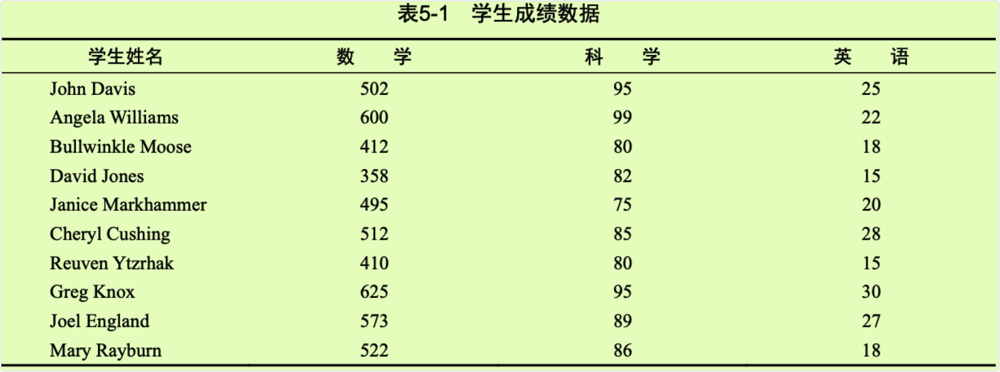
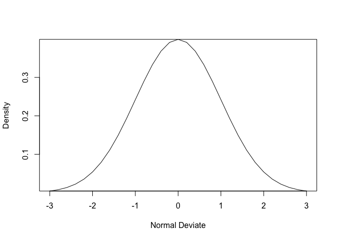
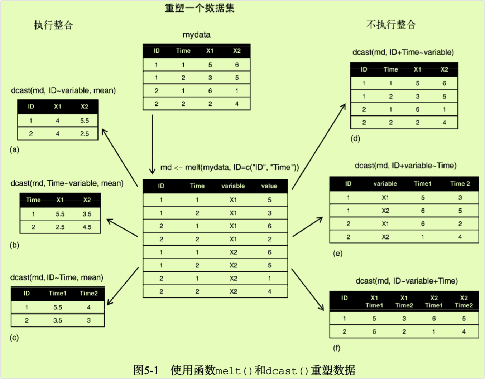

chapter05_高级数据管理
================

- <a href="#5-高级数据管理" id="toc-5-高级数据管理">5 高级数据管理</a>
  - <a href="#51-一个数据处理难题" id="toc-51-一个数据处理难题">5.1
    一个数据处理难题</a>
  - <a href="#52-数值和字符处理函数" id="toc-52-数值和字符处理函数">5.2
    数值和字符处理函数</a>
    - <a href="#521-数学函数" id="toc-521-数学函数">5.2.1 数学函数</a>
    - <a href="#522-统计函数" id="toc-522-统计函数">5.2.2 统计函数</a>
    - <a href="#523-概率函数" id="toc-523-概率函数">5.2.3 概率函数</a>
    - <a href="#524-字符处理函数" id="toc-524-字符处理函数">5.2.4
      字符处理函数</a>
    - <a href="#525-其他实用函数" id="toc-525-其他实用函数">5.2.5
      其他实用函数</a>
    - <a href="#526-将函数应用于矩阵和数据框"
      id="toc-526-将函数应用于矩阵和数据框">5.2.6 将函数应用于矩阵和数据框</a>
  - <a href="#53-数据处理难题的一套解决方案"
    id="toc-53-数据处理难题的一套解决方案">5.3
    数据处理难题的一套解决方案</a>
  - <a href="#54-控制流" id="toc-54-控制流">5.4 控制流</a>
    - <a href="#541-重复和循环" id="toc-541-重复和循环">5.4.1 重复和循环</a>
    - <a href="#542-条件执行" id="toc-542-条件执行">5.4.2 条件执行</a>
  - <a href="#55-整合与重构" id="toc-55-整合与重构">5.5 整合与重构</a>
    - <a href="#551-转置" id="toc-551-转置">5.5.1 转置</a>
    - <a href="#552-整合数据" id="toc-552-整合数据">5.5.2 整合数据</a>
    - <a href="#553-reshape2包" id="toc-553-reshape2包">5.5.3 reshape2包</a>

# 5 高级数据管理

## 5.1 一个数据处理难题

- 要讨论数值和字符处理函数，让我们首先考虑一个数据处理问题。一组学生参加了数学、科学和英语考试。为了给所有学生确定一个单一的成绩衡量指标，需要将这些科目的成绩组合起来。另外，你还想将前20%的学生评定为A，接下来20%的学生评定为B，依次类推。最后，你希望按字母顺序对学生排序。数据如表5-1所示。



## 5.2 数值和字符处理函数

### 5.2.1 数学函数

<table>
<colgroup>
<col style="width: 29%" />
<col style="width: 70%" />
</colgroup>
<thead>
<tr class="header">
<th>函数</th>
<th>描述</th>
</tr>
</thead>
<tbody>
<tr class="odd">
<td>abs(x)</td>
<td>绝对值 abs(-4)，返回值为 4。</td>
</tr>
<tr class="even">
<td>sqrt(x)</td>
<td>平方根 sqrt(25)返回值为 5，和 25^(0.5)等价。</td>
</tr>
<tr class="odd">
<td>ceiling(x)</td>
<td>不小于 x 的最小整数，ceiling(3.475)返回值为 4。</td>
</tr>
<tr class="even">
<td>floor(x)</td>
<td>不大于 x 的最大整数，floor(3.475)返回值为 3。</td>
</tr>
<tr class="odd">
<td>trunc(x)</td>
<td>向 0 的方向截取的 x 中的整数部分，trunc(5.99)返回值为 5。</td>
</tr>
<tr class="even">
<td>round(x, digits=n)</td>
<td>将 x 舍入为指定位的<strong>小数</strong>，round(3.475,
digits=2)返回值为 3.48。</td>
</tr>
<tr class="odd">
<td>signif(x, digits=n)</td>
<td>将 x 舍入为指定的有效<strong>数字位数</strong>，signif(3.475,
digits=2)返回值为 3.5。</td>
</tr>
<tr class="even">
<td>cos(x)、sin(x)、tan(x)</td>
<td>余弦、正弦和正切，cos(2)返回值为–0.416。</td>
</tr>
<tr class="odd">
<td>acos(x)、asin(x)、atan(x)</td>
<td>反余弦、反正弦和反正切，acos(-0.416)返回值为 2。</td>
</tr>
<tr class="even">
<td>cosh(x)、sinh(x)、tanh(x)</td>
<td>双曲余弦、双曲正弦和双曲正切，sinh(2)返回值为 3.627。</td>
</tr>
<tr class="odd">
<td>acosh(x)、asinh(x)、atanh(x)</td>
<td>反双曲余弦、反双曲正弦和反双曲正切，asinh(3.627)返回值为 2。</td>
</tr>
<tr class="even">
<td><p>log(x,base=n)</p>
<p>log(x)</p>
<p>log10(x)</p></td>
<td><p>对 x 取以 n 为底的对数。为了方便起见：</p>
<p>• log(x)为自然对数</p>
<p>• log10(x)为常用对数</p>
<p>• log(10)返回值为 2.3026</p>
<p>• log10(10)返回值为 1</p></td>
</tr>
<tr class="odd">
<td>exp(x)</td>
<td>指数函数，exp(2.3026)返回值为 10。</td>
</tr>
</tbody>
</table>

- 当这些函数被应用于数值向量、矩阵或数据框时，它们会作用于每一个独立的值。例如：

``` r
> sqrt(c(4, 16, 25))
[1] 2 4 5
```

### 5.2.2 统计函数

| 函数                             | 描述                                                                                                                                                  |
|----------------------------------|-------------------------------------------------------------------------------------------------------------------------------------------------------|
| mean(x)                          | 平均数。mean(c(1,2,3,4))返回值为 2.5。mean(x, trim = 0.05, na.rm=TRUE)是截尾平均数，即丢弃了最大5%和最小5%的数据和所有缺失值后的算术平均数。          |
| median(x)                        | 中位数。median(c(1,2,3,4))返回值为 2.5。                                                                                                              |
| sd(x)                            | 标准差。sd(c(1,2,3,4))返回值为 1.29。                                                                                                                 |
| var(x)                           | 方差。var(c(1,2,3,4))返回值为 1.67。                                                                                                                  |
| mad(x)                           | 绝对中位差(median absolute deviation)。mad(c(1,2,3,4))返回值为 1.48。                                                                                 |
| quantile(x,probs)                | 求分位数。其中 x 为待求分位数的数值型向量，probs 为一个由\[0,1\]之间的概率值组成的数值向量。# 求 x 的 30%和 84%分位点，y \<- quantile(x, c(.3,.84))。 |
| range(x)                         | 求值域。x \<- c(1,2,3,4)，range(x)返回值为 c(1,4)，diff(range(x))返回值为 3。                                                                         |
| sum(x)                           | 求和。sum(c(1,2,3,4))返回值为 10。                                                                                                                    |
| diff(x, lag=n)                   | 滞后差分，lag 用以指定滞后几项。默认的 lag 值为 1 x\<- c(1, 5, 23, 29)，diff(x)返回值为 c(4, 18, 6)。                                                 |
| min(x)                           | 求最小值。min(c(1,2,3,4))返回值为 1。                                                                                                                 |
| max(x)                           | 求最大值。max(c(1,2,3,4))返回值为 4。                                                                                                                 |
| scale(x,center=TRUE, scale=TRUE) | 为数据对象 x 按列进行中心化(center=TRUE)或标准化(center=TRUE,scale=TRUE)。                                                                            |

- 均值和标准差的计算

``` r
> x <- c(1,2,3,4,5,6,7,8)
> mean(x)
[1] 4.5
> sd(x)
[1] 2.44949
```

### 5.2.3 概率函数

- 概率函数通常用来生成特征已知的模拟数据，以及在用户编写的统计函数中计算概率值。在R中，概率函数形如：

<!-- -->

    [dpqr]distribution_abbreviation()

- 其中第一个字母表示其所指分布的某一方面：d = 密度函数(density)，p =
  分布函数(distribution function)，q = 分位数函数(quantile function)，r
  = 生成随机数(随机偏差)。

| 分布名称         | 缩写   | 分布名称            | 缩写     |
|------------------|--------|---------------------|----------|
| Beta 分布        | beta   | Logistic 分布       | logis    |
| 二项分布         | binom  | 多项分布            | multinom |
| 柯西分布         | cauchy | 负二项分布          | nbinom   |
| (非中心)卡方分布 | chisq  | 正态分布            | norm     |
| 指数分布         | exp    | 泊松分布            | pois     |
| F 分布           | f      | Wilcoxon 符号秩分布 | signrank |
| Gamma 分布       | gamma  | t 分布              | t        |
| 几何分布         | geom   | 均匀分布            | unif     |
| 超几何分布       | hyper  | Weibull 分布        | weibull  |
| 对数正态分布     | lnorm  | Wilcoxon 秩和分布   | wilcox   |

- 如果不指定一个均值和一个标准差，则函数将假定其为标准正态分布(均值为0，标准差为1)。密度函数(dnorm)、分布函数(pnorm)、分位数函数(qnorm)和随机数生成函数(rnorm)的使用示例见下图（在区间\[–3,3\]上绘制标准正态曲线）：

``` r
> x <- pretty(c(-3,3), 30) 
> y <- dnorm(x) 
> plot(x, y,   
+      type = "l",    
+      xlab = "Normal Deviate",  
+      ylab = "Density",   
+      yaxs = "i" )
```

<!-- -->

``` r
> options(digits = 2)
> pnorm(1.96) # 位于 z=1.96 左侧的标准正态曲线下方面积是多少?
[1] 0.98
> options(digits = 5)
> qnorm(.9, mean=500, sd=100) # 均值为 500,标准差为 100 的正态分布的 0.9 分位点值为多少?
[1] 628.16
> options(digits = 4)
> rnorm(50, mean=50, sd=10) # 生成 50 个均值为 50,标准差为 10 的正态随机数
 [1] 33.91 67.62 49.58 49.31 49.39 55.77 53.51 58.48 44.91 45.87 36.16 56.17
[13] 55.36 37.48 49.76 53.25 68.49 35.67 42.69 42.36 58.48 54.90 53.22 50.40
[25] 30.75 63.17 52.66 51.71 52.24 64.39 46.67 55.01 46.28 54.26 33.48 46.80
[37] 55.91 37.46 37.35 27.96 46.65 49.87 63.19 42.22 56.25 22.55 68.48 55.22
[49] 59.39 53.75
```

#### 5.2.3.1 设定随机数种子

- 在每次生成伪随机数的时候，函数都会使用一个不同的种子，因此也会产生不同的结果。你可以通过函数set.seed()显式指定这个种子，让结果可以重现(reproducible)
  。

- 代码清单5-2
  生成服从正态分布的伪随机数（函数`runif()`用来生成0到1区间上服从均匀分布的伪随机数）

``` r
> runif(5)
[1] 0.5890 0.3490 0.4062 0.8758 0.9345
```

``` r
> runif(5)
[1] 0.2550 0.3480 0.1608 0.0700 0.1799
```

- 通过手动设定种子，就可以重现结果了。

``` r
> set.seed(1234)
> runif(5)
[1] 0.1137 0.6223 0.6093 0.6234 0.8609
```

``` r
> set.seed(1234)
> runif(5)
[1] 0.1137 0.6223 0.6093 0.6234 0.8609
```

#### 5.2.3.2 生成多元正态数据

- 在模拟研究和蒙特卡洛方法中，经常需要获取来自给定均值向量和协方差阵的多元正态分布的数据。MASS包中的`mvrnorm()`函数可以让这个问题变得很容易。其调用格式为:

<!-- -->

    mvrnorm(n, mean, sigma)

- 其中n是样本数，mean为均值向量，而sigma是方差-协方差矩阵(或相关矩阵) 。

- 案例：从一个参数如下所示的三元正态分布中抽取500个观测。

<table style="width:54%;">
<colgroup>
<col style="width: 15%" />
<col style="width: 13%" />
<col style="width: 12%" />
<col style="width: 12%" />
</colgroup>
<thead>
<tr class="header">
<th style="text-align: center;">均值向量</th>
<th style="text-align: center;">230.7</th>
<th style="text-align: center;">146.7</th>
<th style="text-align: center;">3.6</th>
</tr>
</thead>
<tbody>
<tr class="odd">
<td style="text-align: center;">协方差阵</td>
<td style="text-align: center;"><p>15360.8</p>
<p>6721.2</p>
<p>-47.1</p></td>
<td style="text-align: center;"><p>6721.2</p>
<p>4700.9</p>
<p>-16.5</p></td>
<td style="text-align: center;"><p>-47.1</p>
<p>-16.5</p>
<p>0.3</p></td>
</tr>
</tbody>
</table>

- 代码清单5-3 生成服从多元正态分布的数据

``` r
> library(MASS) 
> options(digits=3) 
> set.seed(1234)   # 设定随机数种子，这样就可以在之后重现结果
> # 指定均值向量、协方差阵
> mean <- c(230.7, 146.7, 3.6) 
> sigma <- matrix(c(15360.8, 6721.2, -47.1,                     
+                   6721.2, 4700.9, -16.5,                      
+                   -47.1,   -16.5,   0.3), nrow=3, ncol=3) 
> # 生成数据
> mydata <- mvrnorm(500, mean, sigma) 
> mydata <- as.data.frame(mydata)
> names(mydata) <- c("y","x1","x2")   
> # 查看结果
> dim(mydata) 
[1] 500   3
> head(mydata, n=10)
       y    x1   x2
1   98.8  41.3 3.43
2  244.5 205.2 3.80
3  375.7 186.7 2.51
4  -59.2  11.2 4.71
5  313.0 111.0 3.45
6  288.8 185.1 2.72
7  134.8 165.0 4.39
8  171.7  97.4 3.64
9  167.2 101.0 3.50
10 121.1  94.5 4.10
```

### 5.2.4 字符处理函数

- 字符处理函数可以从文本型数据中抽取信息，或者为打印输出和生成报告重设文本的格式。

| 函数                                                         | 描述                                                                                                                                         |
|--------------------------------------------------------------|----------------------------------------------------------------------------------------------------------------------------------------------|
| nchar(x)                                                     | 计算 x 中的字符数量。                                                                                                                        |
| substr(x, start, stop)                                       | 提取或替换一个字符向量中的子串。x \<- “abcdef”，substr(x, 2, 4)返回值为”bcd”。                                                               |
| grep(pattern, x, ignore.case=FALSE, fixed=FALSE)             | 在 x 中搜索某种模式。若 fixed=FALSE，则 pattern 为一个正则表达式。若fixed=TRUE，则 pattern 为一个文本字符串。                                |
| sub(pattern, replacement, x, ignore.case=FALSE, fixed=FALSE) | 在 x 中搜索 pattern，并以文本 replacement 将其替换。若 fixed=FALSE，则pattern 为一个正则表达式。若 fixed=TRUE，则 pattern 为一个文本字符串。 |
| strsplit(x, split, fixed=FALSE)                              | 在 split 处分割字符向量 x 中的元素。若 fixed=FALSE，则 pattern 为一个正则表达式。若 fixed=TRUE，则 pattern 为一个文本字符串。                |
| paste(…, sep=““)                                             | 连接字符串，分隔符为sep。paste(“x”, 1:3,sep=““)返回值为 c(”x1”, “x2”, “x3”)，paste(“x”,1:3,sep=“M”)返回值为 c(“xM1”,“xM2” “xM3”)。           |
| toupper(x)                                                   | 大写转换。                                                                                                                                   |
| tolower(x)                                                   | 小写转换。                                                                                                                                   |

### 5.2.5 其他实用函数

| 函数                                   | 描述                                                                                                                   |
|----------------------------------------|------------------------------------------------------------------------------------------------------------------------|
| length(x)                              | 对象 x 的长度。x \<- c(2, 5, 6, 9)，length(x)返回值为 4。                                                              |
| seq(from, to, by)                      | 生成一个序列。indices \<- seq(1,10,2)，indices 的值为 c(1, 3, 5, 7, 9)                                                 |
| rep(x, n)                              | 将 x 重复 n 次。                                                                                                       |
| cut(x, n)                              | 将连续型变量 x 分割为有着 n 个水平的因子。使用选项 ordered_result = TRUE 以创建一个有序型因子。                        |
| pretty(x, n)                           | 创建美观的分割点。通过选取 n+1 个等间距的取整值，将一个连续型变量 x 分割为 n 个区间。绘图中常用。                      |
| cat(… , file =“myfile”, append =FALSE) | 连接…中的对象，并将其输出到屏幕上或文件中(如果声明了一个的话)。firstname \<- c(“Jane”) ，cat(“Hello” ,firstname, “\n”) |

- `\n表示新行,\t为制表符,\' 为单引号,\b为退格`

``` r
> name <- "Bob" 
> cat( "Hello", name, "\b.\n", "Isn\'t R", "\t", "GREAT?\n")
Hello Bob .
 Isn't R     GREAT?
```

### 5.2.6 将函数应用于矩阵和数据框

- 代码清单5-4 将函数应用于数据对象

``` r
> a <- 5 
> sqrt(a)
[1] 2.24
```

``` r
> b <- c(1.243, 5.654, 2.99) 
> round(b)
[1] 1 6 3
```

``` r
> c <- matrix(runif(12), nrow=3) 
> c
       [,1]  [,2]  [,3]  [,4]
[1,] 0.9636 0.216 0.289 0.913
[2,] 0.2068 0.240 0.804 0.353
[3,] 0.0862 0.197 0.378 0.931
> log(c)
        [,1]  [,2]   [,3]    [,4]
[1,] -0.0371 -1.53 -1.241 -0.0912
[2,] -1.5762 -1.43 -0.218 -1.0402
[3,] -2.4511 -1.62 -0.972 -0.0710
> mean(c)
[1] 0.465
```

- R中提供了一个`apply()`函数，可将一个任意函数”应用”到矩阵、数组、数据框的任何维度上。`apply()`函数的使用格式为:

<!-- -->

    apply(x, MARGIN, FUN, ...)

- 其中，x为数据对象，MARGIN是维度的下标，FUN是由你指定的函数，而…则包括了任何想传递给FUN的参数。在矩阵或数据框中，**MARGIN=1表示行，MARGIN=2表示列**。

- 代码清单5-5 将一个函数应用到矩阵的所有行(列)

``` r
> # 生成数据
> mydata <- matrix(rnorm(30), nrow=6)    # 生成了一个包含正态随机数的6×5矩阵    
> mydata
       [,1]   [,2]   [,3]   [,4]   [,5]
[1,]  0.459  1.203  1.234  0.591 -0.281
[2,] -1.261  0.769 -1.891 -0.435  0.812
[3,] -0.527  0.238 -0.223 -0.251 -0.208
[4,] -0.557 -1.415  0.768 -0.926  1.451
[5,] -0.374  2.934  0.388  1.087  0.841
[6,] -0.604  0.935  0.609 -1.944 -0.866
> # 计算每行的均值
> apply(mydata, 1, mean)      # 计算了6行的均值
[1]  0.641 -0.401 -0.194 -0.136  0.975 -0.374
> # 计算每列的均值
> apply(mydata, 2, mean)      # 计算了5列的均值
[1] -0.478  0.777  0.148 -0.313  0.292
> # 计算每行的截尾均值
> apply(mydata, 2, mean, trim=0.2)   # 截尾均值基于中间60%的数据, 最高和最低20%的值均被忽略
[1] -0.516  0.786  0.386 -0.255  0.291
```

## 5.3 数据处理难题的一套解决方案

| Name | Math | Science | English |
|------|------|---------|---------|
| J D  | 502  | 95      | 25      |
| A W  | 600  | 99      | 22      |
| B M  | 412  | 80      | 18      |
| D J  | 358  | 82      | 15      |
| J M  | 495  | 75      | 20      |
| C C  | 512  | 85      | 28      |
| R Y  | 410  | 80      | 15      |
| G K  | 625  | 95      | 30      |
| J E  | 573  | 89      | 27      |
| M R  | 522  | 86      | 18      |

- 1、给所有学生确定一个单一的成绩衡量指标，需要将这些科目的成绩组合起来。2、将前20%的学生评定为A，接下来20%的学生评定为B，依次类推。3、按字母顺序对学生排序。

``` r
> options(digits=2)  # 限定了输出小数点后数字的位数
> Student <- c('J D','A W','B M','D J','J M','C C','R Y','G K','J E','M R')
> Math <- c(502, 600, 412, 358, 495, 512, 410, 625, 573, 522)
> Science <- c(95, 99, 80, 82, 75, 85, 80, 95, 89, 86)
> English <- c(25, 22, 18, 15, 20, 28, 15, 30, 27, 18)
> # roster（花名册），数据框可通过函数data.frame()创建
> roster <- data.frame(Student, Math, Science, English,           
+                      stringsAsFactors=FALSE) # 一个逻辑变量，标记处字符向量是否需要转化成因子。默认值是 TRUE，除非它被 colClases 所覆盖。在处理大型文本文件的时，设置成 stringsAsFactors=FALSE 可以提升处理速度
> # 计算综合得分
> z <- scale(roster[,2:4])    # 将变量进行标准化，这样每科考试的成绩就都是用单位标准差来表示，可以使用scale()函数来实现
> score <- apply(z, 1, mean)    
> roster <- cbind(roster, score) # 通过函数mean()来计算各行的均值以获得综合得分，并使用函数cbind()将其添加到花名册中
> y <- quantile(score, c(.8,.6,.4,.2))    # 给出了学生综合得分的百分位数
> roster$grade[score >= y[1]] <- "A"  # 将学生的百分位数排名重编码为一个新的类别型成绩变量，在数据框roster中创建了变量grade  
> roster$grade[score < y[1] & score >= y[2]] <- "B"   
> roster$grade[score < y[2] & score >= y[3]] <- "C"     
> roster$grade[score < y[3] & score >= y[4]] <- "D"     
> roster$grade[score < y[4]] <- "F"       
> #使用函数strsplit() 以空格为界把学生姓名拆分为姓氏和名字。把strsplit()应用到一个字符串组成的向量上会返回一个列表
> name <- strsplit((roster$Student), " ")
> # 抽取姓氏和名字：用函数sapply()提取列表中每个成分的第一个元素，放入一个储存名字的向量Firstname，并提取每个成分的第二个元素，放入一个储存姓氏的向量Lastname。"["是一个可以提取某个对象的一部分的函数——在这里它是用来提取列表name各成分中的第一个或第二个元素
> Lastname <- sapply(name, "[", 2)    
> Firstname <- sapply(name, "[", 1)     
> roster <- cbind(Firstname,Lastname, roster[,-1]) # 使用cbind()把它们添加到花名册
> # 根据姓氏和名字排序
> roster <- roster[order(Lastname,Firstname),]     # 使用函数order()依姓氏和名字对数据集进行排序 
> roster
   Firstname Lastname Math Science English score grade
6          C        C  512      85      28  0.35     C
1          J        D  502      95      25  0.56     B
9          J        E  573      89      27  0.70     B
4          D        J  358      82      15 -1.16     F
8          G        K  625      95      30  1.34     A
3          B        M  412      80      18 -0.86     D
5          J        M  495      75      20 -0.63     D
10         M        R  522      86      18 -0.18     C
2          A        W  600      99      22  0.92     A
7          R        Y  410      80      15 -1.05     F
```

## 5.4 控制流

- 为了理解贯穿本节的语法示例，请牢记以下概念：
  - 语句(statement)是一条单独的R语句或一组复合语句(包含在花括号{
    }中的一组R语句，使用分号分隔)；
  - 条件(cond)是一条最终被解析为真(TRUE)或假(FALSE)的表达式；
  - 表达式(expr)是一条数值或字符串的求值语句；
  - 序列(seq)是一个数值或字符串序列。

### 5.4.1 重复和循环

#### 5.4.1.1 for结构

- for循环重复地执行一个语句，直到某个变量的值不再包含在序列seq中为止。语法为：

<!-- -->

    for (var in seq) statement

#### 5.4.1.2 while结构

- while循环重复地执行一个语句，直到条件不为真为止。语法为：

<!-- -->

    while (cond) statement

- **注意：在处理大数据集中的行和列时，R中的循环可能比较低效费时。只要可能，最好联用R中的内建数值/字符处理函数和apply族函数。**

### 5.4.2 条件执行

- 条件执行结构包括if-else、ifelse和switch。

#### 5.4.2.1 if-else结构

- 控制结构if-else在某个给定条件为真时执行语句，也可以同时在条件为假时执行另外的语句。语法为:

<!-- -->

    if (cond) statement 
    if (cond) statement1 else statement2

#### 5.4.2.2 ifelse结构

- ifelse结构是if-else结构比较紧凑的向量化版本，其语法为:

<!-- -->

    ifelse(cond, statement1, statement2)

- 若cond为TRUE，则执行第一个语句；若cond为FALSE，则执行第二个语句。

#### 5.4.2.3 switch结构

- switch根据一个表达式的值选择语句执行。语法为：

<!-- -->

    switch(expr, ...)

- 其中的…表示与expr的各种可能输出值绑定的语句。

``` r
> feelings <- c("sad", "afraid") 
> for (i in feelings)     
+   print(        
+     switch(i,       
+            happy  = "I am glad you are happy",    
+            afraid = "There is nothing to fear",       
+            sad    = "Cheer up",   
+            angry  = "Calm down now"    
+            )     
+     )
[1] "Cheer up"
[1] "There is nothing to fear"
```

## 5.5 整合与重构

- R中提供了许多用来整合(aggregate)和重塑(reshape)数据的强大方法。在整合数据时，往往将多组观测替换为根据这些观测计算的描述性统计量。在重塑数据时，则会通过修改数据的结构（行和列）来决定数据的组织方式。本节描述了用来完成这些任务的多种方式。

- 在接下来的两个小节中，我们将使用已包含在R基本安装中的数据框mtcars。这个数据集是从Motor
  Trend杂志(1974)提取的，它描述了34种车型的设计和性能特点（汽缸数、排量、马力、每加仑汽油行驶的英里数，等等)。要了解此数据集的更多信息，请参阅help(mtcars)。

### 5.5.1 转置

- 转置（反转行和列)也许是重塑数据集的众多方法中最简单的一个了。使用函数`t()`即可对一个矩阵或数据框进行转置。对于后者，行名将成为变量（列）名。代码清单5-9展示了一个例子。

- 代码清单5-9数据集的转置

``` r
> cars <- mtcars[1:5,1:4] 
> cars
                  mpg cyl disp  hp
Mazda RX4          21   6  160 110
Mazda RX4 Wag      21   6  160 110
Datsun 710         23   4  108  93
Hornet 4 Drive     21   6  258 110
Hornet Sportabout  19   8  360 175
> t(cars)
     Mazda RX4 Mazda RX4 Wag Datsun 710 Hornet 4 Drive Hornet Sportabout
mpg         21            21         23             21                19
cyl          6             6          4              6                 8
disp       160           160        108            258               360
hp         110           110         93            110               175
```

- 为了节约空间，代码清单5-9仅使用了mtcars数据集的一个子集。在本节稍后讲解reshape2包的时候，你将看到一种更为灵活的数据转置方式。

### 5.5.2 整合数据

- 在R中使用一个或多个by变量和一个预先定义好的函数来折叠(collapse)数据是比较容易的。调用格式为：

`aggregate(x,by,FUN)`

- 其中x是待折叠的数据对象，y是一个变量名组成的列表，这些变量将被去掉以形成新的观测，而FUN则测是用来计算描述性统计量的标量函数，它将被用来计算新观测中的值。

- 作为一个示例，我们将根据汽缸数和挡位数整合mtcars数据，并返回各个数值型变量的均值（见代码清单5-10)。

- 代码清单5-10 整合数据

``` r
> options(digits=3)
> attach(mtcars)
> aggdata <- aggregate(mtcars,by=list(cyl,gear),FUN=mean,na.rm=TRUE) 
> aggdata
  Group.1 Group.2  mpg cyl disp  hp drat   wt qsec  vs   am gear carb
1       4       3 21.5   4  120  97 3.70 2.46 20.0 1.0 0.00    3 1.00
2       6       3 19.8   6  242 108 2.92 3.34 19.8 1.0 0.00    3 1.00
3       8       3 15.1   8  358 194 3.12 4.10 17.1 0.0 0.00    3 3.08
4       4       4 26.9   4  103  76 4.11 2.38 19.6 1.0 0.75    4 1.50
5       6       4 19.8   6  164 116 3.91 3.09 17.7 0.5 0.50    4 4.00
6       4       5 28.2   4  108 102 4.10 1.83 16.8 0.5 1.00    5 2.00
7       6       5 19.7   6  145 175 3.62 2.77 15.5 0.0 1.00    5 6.00
8       8       5 15.4   8  326 300 3.88 3.37 14.6 0.0 1.00    5 6.00
```

- 在结果中，Group.1表示汽缸数量(4、6或8)，Group.2代表挡位数(3、4或5)。举例来说，拥有4个汽缸和3个挡位车型的每加仑汽油行驶英里数（mpg）均值为21.5。

- 在使用`aggregate()`函数的时候，by中的变量必须在一个列表中(即使只有一个变量)。你可以在列表中为各组声明自定义的名称，例如`by=list(Group.cy1=cy1,Group.gears=gear)`。指定的函数可为任意的内建或自编函数，这就为整合命令赋予了强大的力量。但说到力量，没有什么可以比reshape2包更强。

### 5.5.3 reshape2包

- reshape2包是一套重构和整合数据集的绝妙的万能工具。由于它的这种万能特性，可能学起来会有一点难度。我们将慢慢地梳理整个过程，并使用一个小型数据集作为示例，这样每一步发生了什么就很清晰了。由于reshape2包并未包含在R的标准安装中，在第一次使用它之前需要使用`install.packages("reshape2")`进行安装。

- 大致说来，你需要首先将数据融合(melt)，以使每一行都是唯一的标识符-变量组合。然后将数据重铸(cast)为你想要的任何形状。在重铸过程中，你可以使用任何函数对数据进行整合。将使用的数据集如表5-8所示。

- 表5-8原始数据集(mydata)

``` r
> ID <- c(1,1,2,2)
> Time <- c(1,2,1,2)
> X1 <- c(5,3,6,2)
> X2 <- c(6,5,1,4)
> mydata <- data.frame(ID,Time,X1,X2,stringsAsFactors=FALSE)
> mydata
  ID Time X1 X2
1  1    1  5  6
2  1    2  3  5
3  2    1  6  1
4  2    2  2  4
```

- 在这个数据集中，测量(measurement)是指最后两列中的值(5、6、3、5、6、1、2、4)。每个测量都能够被标识符变量(在本例中，标识符是指ID、Time以及观测属于X1还是X2)唯一地确定。举例来说，在知道ID为1、Time为1，以及属于变量X1之后，即可确定测量值为第一行中的5。

#### 5.5.3.1 融合

- 数据集的融合是将它重构为这样一种格式：每个测量变量独占一行，行中带有要唯一确定这个测量所需的标识符变量。要融合表5-8中的数据，可使用以下代码：

``` r
> library(reshape2)
> md <-melt(mydata,id=c("ID","Time"))
> md
  ID Time variable value
1  1    1       X1     5
2  1    2       X1     3
3  2    1       X1     6
4  2    2       X1     2
5  1    1       X2     6
6  1    2       X2     5
7  2    1       X2     1
8  2    2       X2     4
```

- 注意，必须指定要唯一确定每个测量所需的变量(ID和Time)，而表示测量变量名的变量(X1或X2)将由程序为你自动创建。

- 既然已经拥有了融合后的数据，现在就可以使用`dcast()`函数将它重铸为任意形状了。

#### 5.5.3.2 重铸

- `dcast()`函数读取已融合的数据，并使用你提供的公式和一个(可选的)用于整合数据的函数将其重塑。调用格式为：

`newdata <- dcast(md,formula,fun.aggregate)`

- 其中的md为已融合的数据，formula描述了想要的最后结果，而fun.aggregate是(可选的)数据整合函数。其接受的公式形如：

`rowvar1 + rowvar2 +..colvar1 + colvar2 + ...`

- 在这一公式中，rowvar1 + rowvar2 +
  …定义了要划掉的变量集合，以确定各行的内容，而colvar1 + colvar2 +
  …则定义了要划掉的、确定各列内容的变量集合。参见图5-1中的示例。



- 由于右侧(d、e和f)的公式中并未包括某个函数，所以数据仅被重塑了。反之，左侧的示例(a、b和c)中指定了mean作为整合函数，从而就对数据同时进行了重塑与整合。例如，示例(a)中给出了每个观测所有时刻中在X1和X2上的均值；示例(b)则给出了X1和X2在时刻1和时刻2的均值，对不同的观测进行了平均；在(c)中则是每个观测在时刻1和时刻2的均值，对不同的X1和X2进行了平均。

- 如你所见，函数`melt()`和`dcast()`提供了令人惊叹的灵活性。很多时候，你不得不在进行分析之前重塑或整合数据。举例来说，在分析重复测量数据（为每个观测记录了多个测量的数据）时，你通常需要将数据转化为类似于表5-9中所谓的**长格式**。示例参见9.6节。
