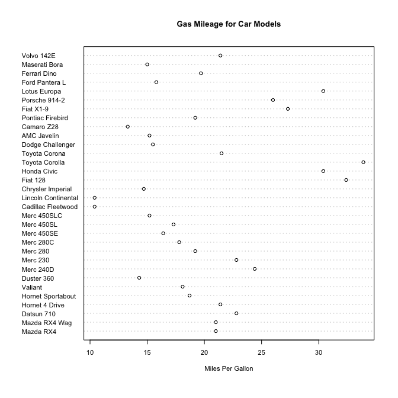

chapter06_基本图形
================

- <a href="#6-基本图形" id="toc-6-基本图形">6 基本图形</a>
  - <a href="#61-条形图" id="toc-61-条形图">6.1 条形图</a>
    - <a href="#611-简单的条形图" id="toc-611-简单的条形图">6.1.1
      简单的条形图</a>
    - <a href="#612-堆砌条形图和分组条形图"
      id="toc-612-堆砌条形图和分组条形图">6.1.2 堆砌条形图和分组条形图</a>
    - <a href="#613-均值条形图" id="toc-613-均值条形图">6.1.3 均值条形图</a>
    - <a href="#614-条形图的微调" id="toc-614-条形图的微调">6.1.4
      条形图的微调</a>
    - <a href="#615-棘状图" id="toc-615-棘状图">6.1.5 棘状图</a>
  - <a href="#62-饼图" id="toc-62-饼图">6.2 饼图</a>
  - <a href="#63-直方图" id="toc-63-直方图">6.3 直方图</a>
  - <a href="#64-核密度图" id="toc-64-核密度图">6.4 核密度图</a>
  - <a href="#65-箱线图" id="toc-65-箱线图">6.5 箱线图</a>
    - <a href="#651-使用并列箱线图进行跨组比较"
      id="toc-651-使用并列箱线图进行跨组比较">6.5.1
      使用并列箱线图进行跨组比较</a>
    - <a href="#652-小提琴图" id="toc-652-小提琴图">6.5.2 小提琴图</a>
  - <a href="#66-点图" id="toc-66-点图">6.6 点图</a>

# 6 基本图形

## 6.1 条形图

### 6.1.1 简单的条形图

- 条形图通过垂直的或水平的条形展示了类别型变量的分布(频数)。函数`barplot()`的最简单用法是：`barplot(height)`，其中的height是一个向量或一个矩阵。若height是一个向量，则它的值就确定了各条形的高度，并将绘制一幅垂直的条形图。使用选项`horiz=TRUE`则会生成一幅水平条形图。选项main可添加一个图形标题，而选项xlab和ylab则会分别添加x轴和y轴标签。

- 在关节炎研究中，变量Improved记录了对每位接受了安慰剂或药物治疗的病人的治疗结果：

``` r
> library(vcd)
> counts <- table(Arthritis$Improved) 
> counts

  None   Some Marked 
    42     14     28 
> # 简单条形图
> barplot(counts,         
+         main="Simple Bar Plot",        
+         xlab="Improvement", ylab="Frequency") 
```

<!-- -->

``` r
> # 水平条形图
> barplot(counts,        
+         main="Horizontal Bar Plot",        
+         xlab="Frequency", ylab="Improvement",         
+         horiz=TRUE)
```

<!-- -->

### 6.1.2 堆砌条形图和分组条形图

- 如果height是一个矩阵而不是一个向量，则绘图结果将是一幅堆砌条形图或分组条形图。若beside=FALSE(默认值)，则矩阵中的每一列都将生成图中的一个条形，各列中的值将给出堆砌的”子条”的高度。若beside=TRUE，则矩阵中的每一列都表示一个分组，各列中的值将并列而不是堆砌。考虑治疗类型和改善情况的列联表：

``` r
> library(vcd) 
> counts <- table(Arthritis$Improved, Arthritis$Treatment) 
> counts
        
         Placebo Treated
  None        29      13
  Some         7       7
  Marked       7      21
> # 堆砌条形图
> barplot(counts,      
+         main="Stacked Bar Plot",       
+         xlab="Treatment", ylab="Frequency",      
+         col=c("red", "yellow","green"),      
+         legend=rownames(counts)) 
```

<!-- -->

``` r
> # 分组条形图
> barplot(counts,      
+         main="Grouped Bar Plot",      
+         xlab="Treatment", ylab="Frequency",      
+         col=c("red", "yellow", "green"),      
+         legend=rownames(counts), beside=TRUE)
```

<!-- -->

### 6.1.3 均值条形图

- 条形图可以使用数据整合函数并将结果传递给`barplot()`函数，来创建表示均值、中位数、标准差等的条形图。

``` r
> states <- data.frame(state.region, state.x77) 
> means <- aggregate(states$Illiteracy, by=list(state.region), FUN=mean) 
> means
        Group.1        x
1     Northeast 1.000000
2         South 1.737500
3 North Central 0.700000
4          West 1.023077
> means <- means[order(means$x),]   # 将均值从小到大排序
> means
        Group.1        x
3 North Central 0.700000
1     Northeast 1.000000
4          West 1.023077
2         South 1.737500
> barplot(means$x, names.arg=means$Group.1)  
> title("Mean Illiteracy Rate")    # 添加标题
```

<!-- -->

### 6.1.4 条形图的微调

- 代码清单6-4 为条形图搭配标签

- `par()`函数能够让你对R的默认图形做出大量修改。

``` r
> par(mar=c(5,8,4,2))       # 增加y边界的大小
> par(las=2)     # 旋转条形的标签
> counts <- table(Arthritis$Improved) 
> barplot(counts,            
+         main="Treatment Outcome",            
+         horiz=TRUE,            
+         cex.names=0.8,    # 缩小字体大小,让标签更合适      
+         names.arg=c("No Improvement", "Some Improvement",                     
+                     "Marked Improvement"))   # 修改标签文本
```

<!-- -->

### 6.1.5 棘状图

- 棘状图对堆砌条形图进行了重缩放，这样每个条形的高度均为1，**每一段的高度即表示比例**。棘状图可由vcd包中的函数`spine()`绘制。以下代码可以生成一幅简单的棘状图：

``` r
> library(vcd) 
> attach(Arthritis) 
> counts <- table(Treatment, Improved) 
> spine(counts, main="Spinogram Example") 
```

<!-- -->

``` r
> detach(Arthritis)
```

- 上图所示：治疗组同安慰剂组相比，获得显著改善的患者比例明显更高。

## 6.2 饼图

- 饼图可由以下函数创建：`pie(x,labels)`。其中x是一个非负数值向量，表示每个扇形的面积，而labels则是表示各扇形标签的字符型向量。

``` r
> par(mfrow=c(2, 2))  # 将四幅图形组合为一幅
> slices <- c(10, 12,4, 16, 8)  
> lbls <- c("US", "UK", "Australia", "Germany", "France") 
> pie(slices, labels = lbls,     
+     main="Simple Pie Chart")  
> # 为饼图添加比例数值
> pct <- round(slices/sum(slices)*100) 
> lbls2 <- paste(lbls, "", pct, "%", sep="") 
> pie(slices, labels=lbls2, col=rainbow(length(lbls2)),  # 这里的rainbow(length(lbls2))将被解析为rainbow(5),即为图形提供了五种颜色    
+     main="Pie Chart with Percentages") 
> library(plotrix) 
> pie3D(slices, labels=lbls,explode=0.1,       
+       main="3D Pie Chart")  
> # 从表格创建饼图
> mytable <- table(state.region)  
> lbls3 <- paste(names(mytable), "\n", mytable, sep="") 
> pie(mytable, labels = lbls3,     
+     main="Pie Chart from a Table\n (with sample sizes)")
```

<!-- -->

- 扇形图 (Lemon & Tyagi,
  2009)提供了一种同时展示相对数量和相互差异的方法。在R中，扇形图是通过plotrix包中的`fan.plot()`函数实现的。

``` r
> library(plotrix) 
> slices <- c(10, 12,4, 16, 8) 
> lbls <- c("US", "UK", "Australia", "Germany", "France") 
> fan.plot(slices, labels = lbls, main="Fan Plot")
```

<!-- -->

## 6.3 直方图

- 直方图通过在x轴上将值域分割为一定数量的组，在y轴上显示相应值的频数，展示了连续型变量的分布。可以使用如下函数创建直方图：`hist(x)`，其中的x是一个由数据值组成的数值向量。参数`freq=FALSE`表示根据概率密度而不是频数绘制图形。参数breaks用于控制组的数量。在定义直方图中的单元时，默认将生成等距切分。

``` r
> par(mfrow=c(2,2))   
> hist(mtcars$mpg)   # 简单直方图
> # 指定组数和颜色,将组数指定为12,使用红色填充条形
> hist(mtcars$mpg,      
+      breaks=12,      
+      col="red",      
+      xlab="Miles Per Gallon",      
+      main="Colored histogram with 12 bins")  
> # 添加轴须图：这条密度曲线是一个核密度估计,它为数据的分布提供了一种更加平滑的描述。使用lines()函数叠加了这条蓝色、双倍默认线条宽度的曲线。
> hist(mtcars$mpg,      
+      freq=FALSE,      
+      breaks=12,      
+      col="red",      
+      xlab="Miles Per Gallon",      
+      main="Histogram, rug plot, density curve")  
> rug(jitter(mtcars$mpg)) 
> lines(density(mtcars$mpg), col="blue", lwd=2)  
> # 添加正态密度曲线和外框
> x <- mtcars$mpg 
> h<-hist(x,         
+         breaks=12,         
+         col="red",         
+         xlab="Miles Per Gallon",         
+         main="Histogram with normal curve and box") 
> xfit<-seq(min(x), max(x), length=40) 
> yfit<-dnorm(xfit, mean=mean(x), sd=sd(x)) 
> yfit <- yfit*diff(h$mids[1:2])*length(x)  
> lines(xfit, yfit, col="blue", lwd=2) 
> box()
```

<!-- -->

## 6.4 核密度图

- 核密度估计是用于估计随机变量概率密度函数的一种非参数方法。从总体上讲，核密度图不失为一种用来观察**连续型变量分布**的有效方法。绘制密度图的方法(不叠加到另一幅图上方)为：`plot(density(x))`，其中的x是一个数值型向量。由于`plot()`函数会创建一幅新的图形，所以要向一幅已经存在的图形上叠加一条密度曲线，可以使用`lines()`函数(如代码清单6-6所示)。

``` r
> par(mfrow=c(2,1))       
> d <- density(mtcars$mpg)        
> plot(d)  # 完全使用默认设置创建最简图形       
> d <- density(mtcars$mpg)        
> plot(d, main="Kernel Density of Miles Per Gallon")   # 添加一个标题     
> polygon(d, col="red", border="blue")    # 将曲线修改为蓝色,并使用实心红色填充曲线下方的区域。polygon()函数根据顶点的x和y坐标(本例中由density()函数提供)绘制了多边形。    
> rug(mtcars$mpg, col="brown")  # 添加棕色的轴须图
```

<!-- -->

- 核密度图可用于比较组间差异。使用sm包中的`sm.density.compare()`函数可向图形叠加两组或更多的核密度图。使用格式为：`sm.density.compare(x,factor)`其中的x是一个数值型向量，factor是一个分组变量。请在第一次使用sm包之前安装它。

``` r
> library(sm)  
> attach(mtcars)  
> cyl.f <- factor(cyl, levels= c(4,6,8),               
+                 labels = c("4 cylinder", "6 cylinder",                           
+                            "8 cylinder"))  
> sm.density.compare(mpg, cyl, xlab="Miles Per Gallon") 
> title(main="MPG Distribution by Car Cylinders")  
> colfill<-c(2:(1+length(levels(cyl.f)))) 
> legend('topright', levels(cyl.f), fill=colfill)   
```

<!-- -->

``` r
> detach(mtcars)
```

## 6.5 箱线图

- 箱线图(又称盒须图)通过绘制连续型变量的五数总括，即最小值、下四分位数(第25百分位数)、中位数(第50百分位数)
  、上四分位数(第75百分位数)以及最大值，描述了连续型变量的分布。箱线图能够显示出可能为离群点(范围±1.5\*IQR以外的值，IQR表示四分位距，即上四分位数与下四分位数的差值)的观测。例如:

``` r
> boxplot(mtcars$mpg, main="Box plot", ylab="Miles per Gallon")
```

<!-- -->

``` r
> boxplot.stats(mtcars$mpg) # 输出用于构建图形的统计
$stats
[1] 10.40 15.35 19.20 22.80 33.90

$n
[1] 32

$conf
[1] 17.11916 21.28084

$out
numeric(0)
```

### 6.5.1 使用并列箱线图进行跨组比较

- 箱线图可以展示单个变量或分组变量。使用格式为：boxplot(formula,data=dataframe)，其中的formula是一个公式，dataframe代表提供数据的数据框(或列表)。

- 一个示例公式为y \~
  A，这将为类别型变量A的每个值并列地生成数值型变量y的箱线图。公式y\~A\*B则将为类别型变量A和B所有水平的两两组合生成数值型变量y的箱线图。

- 添加参数`varwidth=TRUE`将使箱线图的宽度与其样本大小的平方根成正比。参数`horizontal=TRUE`可以反转坐标轴的方向。

- 案例：研究四缸、六缸、八缸发动机对每加仑汽油行驶的英里数的影响

``` r
> boxplot(mpg ~ cyl, data=mtcars,         
+         main="Car Mileage Data",          
+         xlab="Number of Cylinders",         
+         ylab="Miles Per Gallon")
```

<!-- -->

- 箱线图灵活多变，通过添加`notch=TRUE`，可以得到含凹槽的箱线图。**若两个箱的凹槽互不重叠，则表明它们的中位数有显著差异**(Chambers
  et
  al.,1983,p. 62)。以下代码将为我们的车型油耗示例创建一幅含凹槽的箱线图：

``` r
> boxplot(mpg ~ cyl, data=mtcars,         
+         notch=TRUE,          
+         varwidth=TRUE,    # 使箱线图的宽度与它们各自的样本大小成正比     
+         col="red",         
+         main="Car Mileage Data",         
+         xlab="Number of Cylinders",         
+         ylab="Miles Per Gallon")
```

<!-- -->

- 可以为多个分组因子绘制箱线图。代码清单6-9为不同缸数和不同变速箱类型的车型绘制了每加仑汽油行驶英里数的箱线图。同样地，这里使用参数col为箱线图进行了着色。请注意颜色的循环使用。在本例中，共有六幅箱线图和两种指定的颜色，所以颜色将重复使用三次。

- 代码清单6-9 两个交叉因子的箱线图

``` r
> # 创建汽缸数量的因子
> mtcars$cyl.f <- factor(mtcars$cyl,                       
+                        levels=c(4,6,8),                        
+                        labels=c("4","6","8"))  
> # 创建变速箱类型的因子
> mtcars$am.f <- factor(mtcars$am,                      
+                       levels=c(0,1),                      
+                       labels=c("auto", "standard"))   
> # 生成箱线图
> boxplot(mpg ~ am.f *cyl.f,        
+         data=mtcars,        
+         varwidth=TRUE,        
+         col=c("gold","darkgreen"),        
+         main="MPG Distribution by Auto Type",        
+         xlab="Auto Type", ylab="Miles Per Gallon")
```

<!-- -->

- 对于四缸和六缸车型，标准变速箱(standard)的油耗更高。但是对于八缸车型，油耗似乎没有差别。从箱线图的宽度看出,
  四缸标准变速箱的车型和八缸自动变速箱的车型在数据集中最常见。

### 6.5.2 小提琴图

- 小提琴图是箱线图与核密度图的结合。可以使用vioplot包中的`vioplot()`函数绘制它。请在第一次使用之前安装vioplot包。

- **注意，`vioplot()`函数要求你将要绘制的不同组分离到不同的变量中。**

- `vioplot()`函数的使用格式为：

<!-- -->

    vioplot(x1, x2, ... , names=, col=)

- 其中x1，x2，…表示要绘制的一个或多个数值向量(将为每个向量绘制一幅小提琴图)。参数names是小提琴图中标签的字符向量，而col是一个为每幅小提琴图指定颜色的向量：

``` r
> library(vioplot)  
> x1 <- mtcars$mpg[mtcars$cyl==4] 
> x2 <- mtcars$mpg[mtcars$cyl==6] 
> x3 <- mtcars$mpg[mtcars$cyl==8] 
> vioplot(x1, x2, x3,         
+         names=c("4 cyl", "6 cyl", "8 cyl"),         
+         col="gold")   
> title("Violin Plots of Miles Per Gallon", ylab="Miles Per Gallon",        
+       xlab="Number of Cylinders")
```

<!-- -->

- 小提琴图基本上是核密度图以镜像方式在箱线图上的叠加。在图中，白点是中位数，黑色盒型的范围是下四分位点到上四分位点，细黑线表示须。外部形状即为核密度估计。

## 6.6 点图

- 点图提供了一种在简单水平刻度上绘制大量有标签值的方法。可以使用`dotchart()`函数创建点图，格式为：

<!-- -->

    dotchart(x, labels=)

- 其中的x是一个数值向量，而labels则是由每个点的标签组成的向量。可以通过添加参数groups来选定一个因子，用以指定x中元素的分组方式。如果这样做，则参数gcolor可以控制不同组标签的颜色，cex可以控制标签的大小。

``` r
> dotchart(mtcars$mpg, labels=row.names(mtcars), cex=.7,          
+          main="Gas Mileage for Car Models",          
+          xlab="Miles Per Gallon")
```

<!-- -->

- 通常来说，点图在经过排序并且分组变量被不同的符号和颜色区分开的时候最有用。

``` r
> # 根据每加仑汽油行驶英里数(从最低到最高) 对数据框mtcars进行排序,结果保存为数据框x
> x <- mtcars[order(mtcars$mpg),]          
> x$cyl <- factor(x$cyl)   # 将数值向量 cyl 转换为一个因子        
> # 添加一个字符型向量(color)到数据框x中, 根据cyl的值, 它所含的值为"red"、"blue"或"darkgreen"
> x$color[x$cyl==4] <- "red"         
> x$color[x$cyl==6] <- "blue"         
> x$color[x$cyl==8] <- "darkgreen"         
> dotchart(x$mpg,                   
+          labels = row.names(x),  # 各数据点的标签取自数据框的行名(车辆型号)                 
+          cex=.7,                  
+          groups = x$cyl,       # 数据点根据汽缸数量分组           
+          gcolor = "black",    # 数字4、6和8以黑色显示              
+          color = x$color,      #  点和标签的颜色来自向量color            
+          pch=19,                 
+          main = "Gas Mileage for Car Models\ngrouped by cylinder",                  
+          xlab = "Miles Per Gallon")
```

<!-- -->

- 可以从点图中获得显著的洞察力，因为每个点都有标签，每个点的值都有其内在含义，并且这些点是以一种能够促进比较的方式排布的，但是随着数据点的增多，点图的实用性随之下降。
