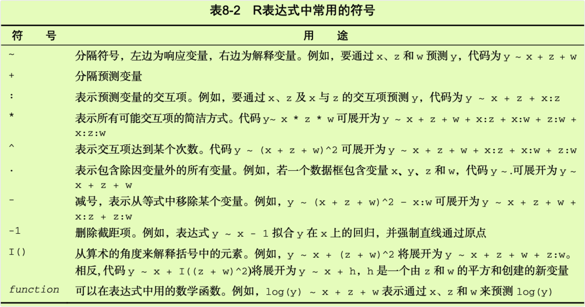
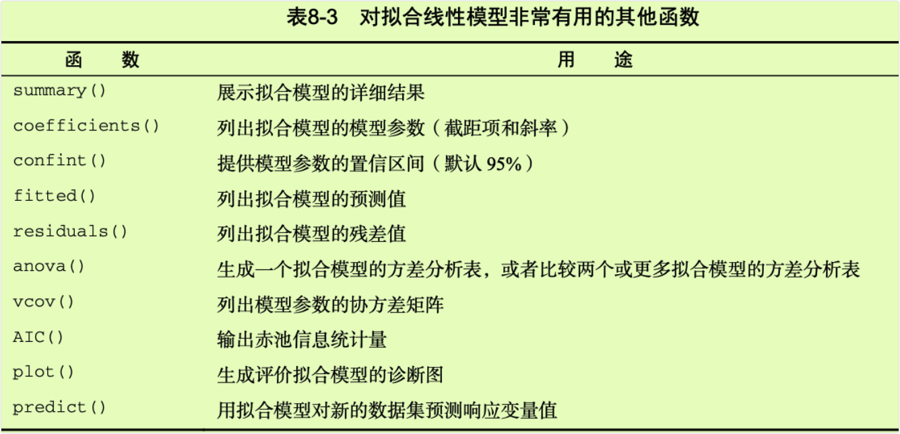
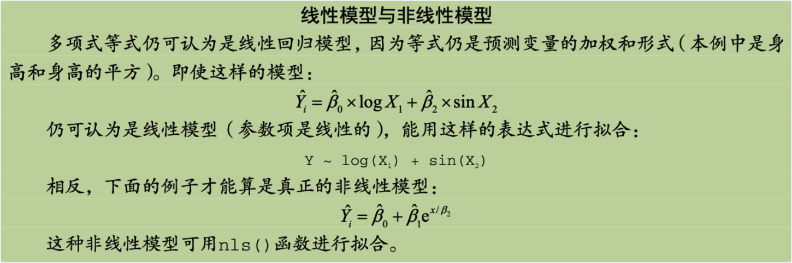
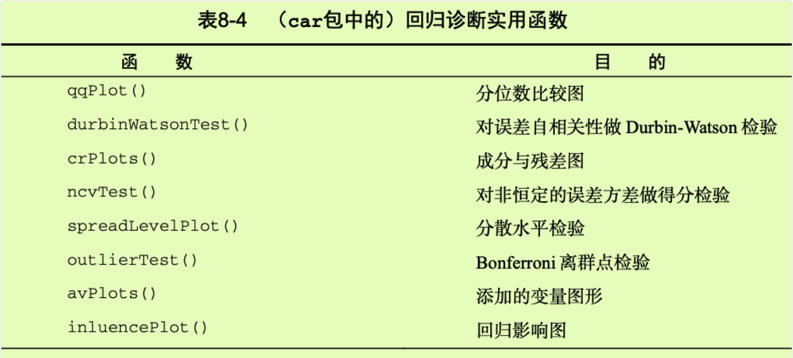
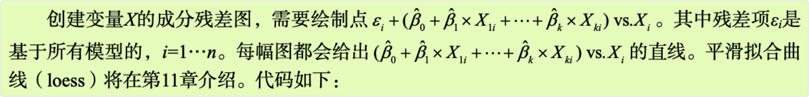
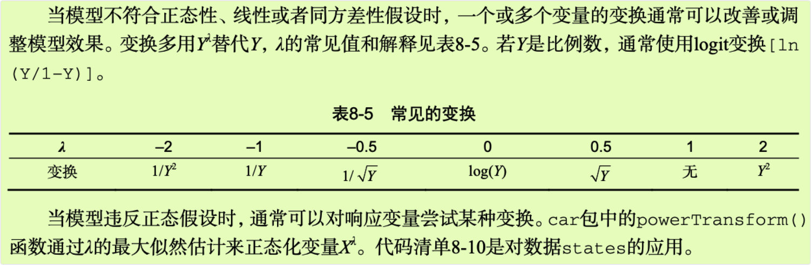

```{r setup, include=FALSE}
knitr::opts_chunk$set(prompt=TRUE,comment='',echo=TRUE,collapse=TRUE,message=FALSE,warning=FALSE)
```

# 8 回归

-   从许多方面来看，回归分析都是统计学的核心。它其实是一个广义的概念，通指那些用一个或多个预测变量（也称自变量或解释变量）来预测响应变量（也称因变量、效标变量或结果变量）的方法。通常，回归分析可以用来挑选与响应变量相关的解释变量，可以描述两者的关系，也可以生成一个等式，通过解释变量来预测响应变量。

-   例如，一位运动生理学家可通过回归分析获得一个等式，预测一个人在跑步机上锻炼时预期消耗的卡路里数。响应变量即消耗的卡路里数（可通过耗氧量计算获得），预测变量则可能包括锻炼的时间（分）、处于目标心率的时间比、平均速度（英里/小时）、年龄（年）、性别和身体质量指数(BMI)。

-   从理论的角度来看，回归分析可以帮助解答以下疑问。

-   锻炼时间与消耗的卡路里数是什么关系？是线性的还是曲线的？比如，卡路里消耗到某个点后，锻炼对卡路里的消耗影响会变小吗？

-   耗费的精力（处于目标心率的时间比，平均行进速度）将被如何计算在内？口这些关系对年轻人和老人、男性和女性、肥胖和苗条的人同样适用吗？从实际的角度来看，回归分析则可以帮助解答以下疑问。

-   一名30岁的男性，BMI为28.7，如果以每小时4英里的速度行走45分钟，并且80%的时间都在目标心率内，那么他会消耗多少卡路里？

-   为了准确预测一个人行走时消耗的卡路里数，你需要收集的变量最少是多少个？

-   预测的准确度可以达到多少？

-   由于回归分析在现代统计学中非常重要，本章将对其进行一些深度讲解。首先，我们将看一看如何拟合和解释回归模型，然后回顾一系列鉴别模型潜在问题的方法，并学习如何解决它们。其次，我们将探究变量选择问题。对于所有可用的预测变量，如何确定哪些变量包含在最终的模型中？再次，我们将讨论一般性问题。模型在现实世界中的表现到底如何？最后，我们再看看相对重要性问题。模型所有的预测变量中，哪个最重要，哪个第二重要，哪个最无关紧要？

-   正如你所看到的，我们会涵盖许多方面的内容。有效的回归分析本就是一个交互的、整体的、多步骤的过程，而不仅仅是一点技巧。为此，本书并不将它分散到多个章中进行讲解，而是用单独的一章来讨论。**因此，这一章将成为本书最长、最复杂的一章**。只要坚持到最后，我保证你一定可以掌握所有的工具，自如地处理许多研究性问题！

## 8.1 回归的多面性

-   回归是一个令人困惑的词，因为它有许多特殊变种（见表8-1）。对于回归模型的拟合，R提供的强大而丰富的功能和选项也同样令人困惑。例如，2005年Vito Riccit创建的列表表明，R中做回归分析的函数已超过了205个。


-   在这一章中，我们的重点是普通最小二乘（OLS）回归法，包括简单线性回归、多项式回归和多元线性回归。OLS回归是现今最常见的统计分析方法，其他回归模型(Logisticl回归和泊松回归)将在第13章介绍。

### 8.1.1 OLS回归的适用情境

-   OLS回归是通过预测变量的加权和来预测量化的因变量，其中权重是通过数据估计而得的参数。现在让我们一起看一个改编自Fwa（2006）的具体示例（此处没有任何含沙射影之意)。

-   一名工程师想找出跟桥梁退化有关的最重要的因素，比如使用年限、交通流量、桥梁设计、建造材料和建造方法、建造质量以及天气情况，并确定它们之间的数学关系。他从一个有代表性的桥梁样本中收集了这些变量的相关数据，然后使用OLS回归对数据进行建模。

-   这种方法的交互性很强。他拟合了一系列模型，检验它们是否符合相应的统计假设，探索了所有异常的发现，最终从许多可能的模型中选择了"最佳"的模型。如果成功，那么结果将会帮助他完成以下任务。

-   在众多变量中判断哪些对预测桥梁退化是有用的，得到它们的相对重要性，从而关注重要的变量。

-   根据回归所得的等式预测新的桥梁的退化情况（预测变量的值已知，但是桥梁退化程度未知），找出那些可能会有麻烦的桥梁。

-   利用对异常桥梁的分析，获得一些意外的信息。比如他发现某些桥梁的退化速度比预测的更快或更慢，那么研究这些"离群点"可能会有重大的发现，能够帮助理解桥梁退化的机制。

-   可能桥梁的例子并不能引起你的兴趣。而且我是从事临床心理学和统计的，对土木工程也是一无所知，但是这其中蕴含的一般性思想适用于物理、生物和社会科学的许多问题。以下问题都可以通过OLS方法进行处理。

-   铺路表面的面积与表面盐度有什么关系？

-   一个用户哪些方面的经历会导致他沉溺于大型多人在线角色扮演游戏？

-   教育环境中的哪些因素最能影响学生成绩得分？

-   血压、盐摄入量和年龄的关系是什么样的？对于男性和女性是相同的吗？

-   运动场馆和职业运动对大都市的发展有何影响？

-   哪些因素可以解释各州的啤酒价格差异？

我们主要的困难有三个：发现有趣的问题，设计一个有用的、可以测量的响应变量，以及收集合适的数据。

## 8.2 OLS回归

-   在本章大部分内容中，我们都是利用OLS法通过一系列的预测变量来预测响应变量（也可以说是在预测变量上"回归"响应变量一其名也因此而来)。OLS回归拟合模型的形式：


-   其中，n为观测的数目，k为预测变量的数目。（虽然我极力避免讨论公式，但这里探讨公式是简化问题的需要。）等式中相应部分的解释如下。


-   我们的目标是通过减少响应变量的真实值与预测值的差值来获得模型参数（截距项和斜率）。具体而言，即使得残差平方和最小。


-   为了能够恰当地解释OLS模型的系数，数据必须满足以下统计假设。

-   **正态性**对于固定的自变量值，因变量值成正态分布。

-   **独立性**Y值之间相互独立。

-   **线性**因变量与自变量之间为线性相关。

-   **同方差性**因变量的方差不随自变量的水平不同而变化。也可称作**不变方差**，但是说**同方差性**感觉上更犀利。

-   如果违背了以上假设，你的统计显著性检验结果和所得的置信区间就很可能不精确了。注意，OLS回归还假定自变量是固定的且测量无误差，但在实践中通常都放松了这个假设。

### 8.2.1 用`lm()`拟合回归模型

-   在R中，拟合线性模型最基本的函数就是`lm()`，格式为：

`myfit <- lm(formula,data)`

-   其中，formula指要拟合的模型形式，data是一个数据框，包含了用于拟合模型的数据。结果对象(本例中是myfit)存储在一个列表中，包含了所拟合模型的大量信息。表达式(formula)形式如下：

`Y ~ X1 + X2 + ... + Xk`

-   \~左边为响应变量，右边为各个预测变量，预测变量之间用+符号分隔。表8-2中的符号可以用不同方式修改这一表达式。



-   除了`lm()`，表8-3还列出了其他一些对做简单或多元回归分析有用的函数。拟合模型后，将这些函数应用于`lm()`返回的对象，可以得到更多额外的模型信息。



-   当回归模型包含一个因变量和一个自变量时，我们称为**简单线性回归**。当只有一个预测变量，但同时包含变量的幂(比如，X、X^2、X^3)时，我们称为**多项式回归**。当有不止一个预测变量时，则称为多元线性回归。现在，我们首先从一个简单的线性回归例子开始，然后逐步展示多项式回归和多元线性回归，最后还会介绍一个包含交互项的多元线性回归的例子。

### 8.2.2 简单线性回归

-   让我们通过一个回归示例来熟悉表8-3中的函数。基础安装中的数据集women提供了15个年龄在30\~39岁间女性的身高和体重信息，我们想通过身高来预测体重，获得一个等式可以帮助我们分辨出那些过重或过轻的个体。代码清单8-1提供了分析过程，图8-1展示了结果图形。

-   代码清单8-1 简单线性回归

```{r}
fit1 <- lm(weight ~ height,data=women) 
summary(fit1)

women$weight

fitted(fit1)

residuals(fit1)

plot(women$height,women$weight, xlab="Height (in inches)", ylab="Weight (in pounds)")
abline(fit1)
```

-   图8-1用身高预测体重的散点图以及回归线

-   通过输出结果，可以得到预测等式：

`Weight = -87.52 + 3.45*Height`

-   因为身高不可能为0，所以没必要给截距项一个物理解释，它仅仅是一个常量调整项。在Pr(\>\|t\|)栏，可以看到回归系数(3.45)显著不为0（p\<0.001)，表明身高每增高1英寸，体重将预期增加3.45磅。R平方项（0.991）表明模型可以解释体重99.1%的方差，它也是实际和预测值之间相关系数的平方。残差标准误（1.53 lbs）则可认为是模型用身高预测体重的平均误差。F统计量检验所有的预测变量预测响应变量是否都在某个几率水平之上。由于简单回归只有一个预测变量，此处F检验等同于身高回归系数的检验。

-   出于展示的需要，我们已经输出了真实值、预测值和残差值。显然，最大的残差值在身高矮和身高高的地方出现，这也可以从图8-1看出来。

-   图形表明你可以用含一个弯曲的曲线来提高预测的精度。多项式回归允许你用一个解释变量预测一个响应变量，它们关系的形式即次多项式。

### 8.2.3 多项式回归

-   图8-1表明，你可以通过添加一个二次项来提高回归的预测精度。如下代码可以拟合含二次项的等式：

`fit2 <- lm(weight ~ height + I(height^2),data=women)`

-   I(height\^2)表示向预测等式添加一个身高的平方项。I函数将括号的内容看作R的一个常规表达式。因为(参见表8-2)符号在表达式中有特殊的含义，会调用你并不需要的东西，所以此处必须要用这个函数。

-   代码清单8-2展示了拟合含二次项等式的结果。

-   代码清单8-2 多项式回归

```{r}
fit2 <- lm(weight ~ height + I(height^2),data=women) 
summary(fit2)

plot(women$height,women$weight, xlab="Height (in inches)", ylab="Weight (in lbs)") 
lines(women$height,fitted(fit2))
```

-   图8-2 用身高预测体重的二次回归

-   新的预测等式为：

`Weight = 261.88 - 7.35*Height + 0.083*Height^2`

-   在p\<0.001水平下，回归系数都非常显著。模型的方差解释率已经增加到了99.9%。二次项的显著性(t=13.89，p\<0.001)表明包含二次项提高了模型的拟合度。从图8-2也可以看出曲线确实拟合得较好。



-   一般来说，次多项式生成一个n-1个弯曲的曲线。拟合三次多项式，可用：

`fit3 <- lm(weight ~ height + I(height^2) + I(height^3),data=women)`

-   虽然更高次的多项式也可用，但我发现使用比三次更高的项几乎没有必要。

-   在继续下文之前，我还要提及car包中的`scatterplot()`函数，它可以很容易、方便地绘制二元关系图。以下代码能生成图8-3所示的图形：

```{r}
library(car)
scatterplot(weight ~ height,data=women, spread=FALSE,smoother.args=list(lty=2),pch=19, 
            main="Women Age 30-39", xlab="Height (inches)", ylab="Weight (1bs.)")
```

-   图8-3 身高与体重的散点图。直线为线性拟合，虚线为曲线平滑拟合，边界为箱线图

-   这个功能加强的图形，既提供了身高与体重的散点图、线性拟合曲线和平滑拟合(loss)曲线，还在相应边界展示了每个变量的箱线图。spread=FALSE选项删除了残差正负均方根在平滑曲线上的展开和非对称信息。smoother.args=list(lty=2)选项设置loess拟合曲线为虚线。pch=19选项设置点为实心圆（默认为空心圆）。粗略地看一下图8-3可知，两个变量基本对称，曲线拟合得比直线更好。

### 8.2.4 多元线性回归

-   当预测变量不止一个时，简单线性回归就变成了多元线性回归，分析也稍微复杂些。从技术上来说，多项式回归可以算是多元线性回归的特例：二次回归有两个预测变量(X和X^2)，三次回归有三个预测变量(X、X^2和X\^3)。现在让我们看一个更一般的例子。

-   以基础包中的state.x77数据集为例，我们想探究一个州的犯罪率和其他因素的关系，包括人口、文盲率、平均收入和结霜天数（温度在冰点以下的平均天数）。

-   因为`lm()`函数需要一个数据框(state.x77数据集是矩阵)，为了以后处理方便，你需要做如下转化：

```{r}
states <- as.data.frame(state.x77[,c("Murder","Population","Illiteracy","Income","Frost")])
head(states)
```

-   这行代码创建了一个名为states的数据框，包含了我们感兴趣的变量。本章的余下部分，我们都将使用这个新的数据框。

-   多元回归分析中，第一步最好检查一下变量间的相关性。`cor()`函数提供了二变量之间的相关系数，car包中`scatterplotMatrix()`函数则会生成散点图矩阵（参见代码清单8-3和图8-4）。

-   代码清单8-3 检测二变量关系

```{r}
states <- as.data.frame(state.x77[,c("Murder","Population","Illiteracy","Income","Frost")])
cor(states)

library(car)
scatterplotMatrix(states, spread=FALSE, smoother.args=list(lty=2),main="Scatter Plot Matrix")
```

-   图8-4 州府数据中因变量与自变量的散点图矩阵。（包含线性和平滑拟合曲线，以及相应的边际分布（核密度图和轴须图））

-   `scatterplotMatrix()`函数默认在非对角线区域绘制变量间的散点图，并添加平滑和线性拟合曲线。对角线区域绘制每个变量的密度图和轴须图。

-   从图中可以看到，谋杀率是双峰的曲线，每个预测变量都一定程度上出现了偏斜。谋杀率随着人口和文盲率的增加而增加，随着收入水平和结霜天数增加而下降。同时，越冷的州府文盲率越低，收入水平越高。

-   现在使用`lm()`函数拟合多元线性回归模型(参见代码清单8-4)。

-   代码清单8-4 多元线性回归

```{r}
states <- as.data.frame(state.x77[,c("Murder","Population","Illiteracy","Income","Frost")])
fit4 <- lm(Murder ~ Population + Illiteracy + Income + Frost,data=states)
summary(fit4)
```

-   当预测变量不止一个时，回归系数的含义为：一个预测变量增加一个单位，其他预测变量保持不变时，因变量将要增加的数量。例如本例中，文盲率的回归系数为4.14，表示控制人口、收入和温度不变时，文盲率上升1%，谋杀率将会上升4.14%，它的系数在p\<0.001的水平下显著不为0。相反，Frost的系数没有显著不为0（p=0.954），表明当控制其他变量不变时，Frost与Murder不呈线性相关。总体来看，所有的预测变量解释了各州谋杀率57%的方差。

-   以上分析中，我们没有考虑预测变量的交互项。在接下来的一节中，我们将考虑一个包含此因素的例子。

### 8.2.5 有交互项的多元线性回归

-   许多很有趣的研究都会涉及交互项的预测变量。以mtcars数据框中的汽车数据为例，若你对汽车重量和马力感兴趣，可以把它们作为预测变量，并包含交互项来拟合回归模型，参见代码清单8-5。

-   代码清单8-5 有显著交互项的多元线性回归

```{r}
fit5 <- lm(mpg ~ hp + wt + hp:wt,data=mtcars) 
summary(fit5)
```

-   你可以看到Pr(\>\|t\|)栏中，马力与车重的交互项是显著的，这意味着什么呢？若两个预测变量的交互项显著，说明响应变量与其中一个预测变量的关系依赖于另外一个预测变量的水平。因此此例说明，每加仑汽油行驶英里数与汽车马力的关系依车重不同而不同。

-   通过effects包中的`effect()`函数，你可以用图形展示交互项的结果。格式为：

`plot (effect(term,mod,,xlevels),multiline=TRUE)`

-   term即模型要画的项，mod为通过`lm()`拟合的模型，xlevels是一个列表，指定变量要设定的常量值，`multiline=TRUE`选项表示添加相应直线。对于上例，即：

```{r}
library(effects)
plot(effect("hp:wt",fit5,,list(wt=c(2.2,3.2,4.2))),multiline=TRUE)
```

-   图8-5 hp\*wt的交互项图形。图形展示了wt三种值时mpg和hp的关系

-   结果展示在图8-5中。从图中可以很清晰地看出，随着车重的增加，马力与每加仑汽油行驶英里数的关系减弱了。当wt=4.2时，直线几乎是水平的，表明随着hp的增加，mpg不会发生改变。

-   然而，拟合模型只不过是分析的第一步，一旦拟合了回归模型，在信心十足地进行推断之前，必须对方法中暗含的统计假设进行检验。这正是下节的主题。

## 8.3 回归诊断

-   在上一节中，你使用`lm()`函数来拟合OLS回归模型，通过`summary()`函数获取模型参数和相关统计量。但是，没有任何输出告诉你模型是否合适，你对模型参数推断的信心依赖于它在多大程度上满足OLS模型统计假设。虽然在代码清单8-4中`summary()`函数对模型有了整体的描述，但是它没有提供关于模型在多大程度上满足统计假设的任何信息。

-   为什么这很重要？因为数据的无规律性或者错误设定了预测变量与响应变量的关系，都将致使你的模型产生巨大的偏差。一方面，你可能得出某个预测变量与响应变量无关的结论，但事实上它们是相关的；另一方面，情况可能恰好相反。当你的模型应用到真实世界中时，预测效果可能很差，误差显著。

-   现在让我们通过`confint()`函数的输出来看看8.2.4节中states多元回归的问题。

```{r}
states <- as.data.frame(state.x77[,c("Murder","Population","Illiteracy","Income","Frost")])
fit4 <- lm(Murder ~ Population + Illiteracy + Income + Frost,data=states)
confint(fit4)
```

-   结果表明，文盲率改变1%，谋杀率就在95%的置信区间[2.38,5.90]中变化。另外，因为Frost的置信区间包含0，所以可以得出结论：当其他变量不变时，温度的改变与谋杀率无关。不过，你对这些结果的信念，都只建立在你的数据满足统计假设的前提之上。

-   回归诊断技术向你提供了评价回归模型适用性的必要工具，它能帮助发现并纠正问题。首先，我们探讨使用R基础包中函数的标准方法，然后再看看car包中改进了的新方法。

### 8.3.1 标准方法

-   R基础安装中提供了大量检验回归分析中统计假设的方法。最常见的方法就是对`lm()`函数返回的对象使用`plot()`函数，可以生成评价模型拟合情况的四幅图形。下面是简单线性回归的例子：

```{r}
fit6 <- lm(weight ~ height,data=women) 
par(mfrow=c(2,2)) 
plot(fit6)
```

-   图8-6 体重对身高回归的诊断图

-   生成图形见图8-6。`par(frow=c(2,2))`将`plot()`函数绘制的四幅图形组合在一个大的2×2的图中。`par()`函数的介绍可参见第3章。

-   为理解这些图形，我们来回顾一下OLS回归的统计假设。

-   **正态性** 当预测变量值固定时，因变量成正态分布，则残差值也应该是一个均值为0的正态分布。"正态Q-Q图"(Normal Q-Q,右上)是在正态分布对应的值下，标准化残差的概率图。若满足正态假设，那么图上的点应该落在呈45度角的直线上；若不是如此，那么就违反了正态性的假设。

-   **独立性** 你无法从这些图中分辨出因变量值是否相互独立，只能从收集的数据中来验证。上面的例子中，没有任何先验的理由去相信一位女性的体重会影响另外一位女性的体重。假若你发现数据是从一个家庭抽样得来的，那么可能必须要调整模型独立性的假设。

-   **线性** 若因变量与自变量线性相关，那么残差值与预测（拟合）值就没有任何系统关联。换句话说，除了白噪声，模型应该包含数据中所有的系统方差。在"残差图与拟合图"(Residuals vs Fitted,左上)中可以清楚地看到一个曲线关系，这暗示着你可能需要对回归模型加上一个二次项。

-   **同方差性** 若满足不变方差假设，那么在"位置尺度图"(Scale-Location Graph,左下)中，水平线周围的点应该随机分布。该图似乎满足此假设。

-   最后一幅"残差与杠杆图"（Residuals vs Leverage,右下)提供了你可能关注的单个观测点的信息。从图形可以鉴别出离群点、高杠杆值点和强影响点。下面来详细介绍。

-   一个观测点是离群点，表明拟合回归模型对其预测效果不佳（产生了巨大的或正或负的残差）。

-   一个观测点有很高的杠杆值，表明它是一个异常的预测变量值的组合。也就是说，在预测变量空间中，它是一个离群点。因变量值不参与计算一个观测点的杠杆值。

-   一个观测点是强影响点（influential observation），表明它对模型参数的估计产生的影响过大，非常不成比例。强影响点可以通过Cook距离即Cook's D统计量来鉴别。

-   不过老实说，我觉得残差一杠杆图的可读性差而且不够实用。在接下来的章节中，你将会看到对这一信息更好的呈现方法。

-   为了章节的完整性，让我们再看看二次拟合的诊断图。代码为：

```{r}
fit2 <- lm(weight ~ height + I(height^2),data=women) 
par(mfrow=c(2,2)) 
plot(fit2)
```

-   图8-7 体重对身高和身高平方的回归诊断图

-   结果见图8-7。这第二组图表明多项式回归拟合效果比较理想，基本符合了线性假设、残差正态性（除了观测点13）和同方差性（残差方差不变）。观测点15看起来像是强影响点（根据是它有较大的Cook距离值），删除它将会影响参数的估计。事实上，删除观测点13和15，模型会拟合得会更好。使用：

```{r}
newfit <- lm(weight ~ height + I(height^2),data=women[-c(13,15),]) 
par(mfrow=c(2,2)) 
plot(newfit)
```

-   即可拟合剔除点后的模型。但是对于删除数据，要非常小心，因为本应是你的模型去匹配数据，而不是反过来。

-   最后，我们再应用这个基本的方法，来看看states的多元回归问题。

```{r}
states <- as.data.frame(state.x77[,c("Murder","Population","Illiteracy","Income","Frost")])
fit4 <- lm(Murder ~ Population + Illiteracy + Income + Frost,data=states)
par(mfrow=c(2,2)) 
plot(fit4)
```

-   图8-8 谋杀率对州各因素的回归诊断图

-   结果展示在图8-8中。正如从图上看到的，除去Nevada一个离群点，模型假设得到了很好的满足。虽然这些标准的诊断图形很有用，但是R中还有更好的工具可用，相比plot(fit)方法，我更推荐它们。

### 8.3.2 改进的方法

-   car包提供了大量函数，大大增强了拟合和评价回归模型的能力(参见表8-4)。




-   值得注意的是，car包的2.x版本相对1.x版本作了许多改变，包括函数的名字和用法。本章基于2.x版本。

-   另外，gvlma包提供了对所有线性模型假设进行检验的方法。作为比较，我们将把它们应用到之前的多元回归例子中。

#### 8.3.2.1 正态性

-   与基础包中的`plot()`函数相比，`qqPlot()`函数提供了更为精确的正态假设检验方法，它画出了在n-p-1个自由度的t分布下的学生化残差（studentized residual，也称学生化删除残差或折叠化残差）图形，其中是样本大小，p是回归参数的数目（包括截距项）。代码如下：

```{r}
library(car)
states <- as.data.frame(state.x77[,c("Murder","Population","Illiteracy","Income","Frost")])
fit4 <- lm(Murder ~ Population + Illiteracy + Income + Frost,data=states)
qqPlot(fit4,labels=row.names(states),id.method="identify",simulate=TRUE,main="Q-Q Plot")
```

-   图8-9 学生化残差的Q-Q图

-   `qqPlot()`函数生成的概率图见图8-9。`id.method="identify"`选项能够交互式绘图待图形绘制后，用鼠标单击图形内的点，将会标注函数中labels选项的设定值。敲击Esc键，从图形下拉菜单中选择Stop,或者在图形上右击，都将关闭这种交互模式。此处，我已经鉴定出了Nevada异常。当simulate=TRUE时，95%的置信区间将会用参数自助法(自助法可参见第12章)生成。

-   除了Nevada，所有的点都离直线很近，并都落在置信区间内，这表明正态性假设符合得很好。但是你也必须关注Nevada，它有一个很大的正残差值（真实值-预测值），表明模型低估了该州的谋杀率。特别地：

```{r}
states["Nevada",]

fitted(fit4)["Nevada"]

residuals(fit4)["Nevada"]

rstudent(fit4)["Nevada"]
```

-   可以看到，Nevadal的谋杀率是11.5%，而模型预测的谋杀率为3.9%。

-   可视化误差还有其他方法，比如使用代码清单8-6中的代码。`residplot()`函数生成学生化残差柱状图（即直方图），并添加正态曲线、核密度曲线和轴须图。它不需要加载car包。

-   代码清单8-6 绘制学生化残差图的函数

```{r}
residplot <- function(fit4,nbreaks=10){
  z <- rstudent(fit4)
  hist(z,breaks=nbreaks,freq=FALSE,
       xlab="Studentized Residual", main="Distribution of Errors")
  rug(jitter(z),col="brown")
  curve(dnorm(x,mean=mean(z),sd=sd(z)),
        add=TRUE,col="blue",lwd=2)
  lines(density(z)$x,density(z)$y,
        col="red",lwd=2,lty=2)
  legend("topright",
         legend = c("Normal Curve","Kernel Density Curve"), 
         lty=1:2,col=c("blue","red"),cex=.7)
}
residplot(fit4)
```

-   图8-10 用`residplot()`函数绘制的学生化残差分布图

-   正如你所看到的，除了一个很明显的离群点，误差很好地服从了正态分布。虽然Q-Q图已经蕴藏了很多信息，但我总觉得从一个柱状图或者密度图测量分布的斜度比使用概率图更容易。因此为何不一起使用这两幅图呢？

#### 8.3.2.2 误差的独立性

-   之前章节提过，判断因变量值（或残差）是否相互独立，最好的方法是依据收集数据方式的先验知识。例如，时间序列数据通常呈现自相关性一相隔时间越近的观测相关性大于相隔越远的观测。car包提供了一个可做Durbin-Watson检验的函数，能够检测误差的序列相关性。在多元回归中，使用下面的代码可以做Durbin-Watson检验：

```{r}
durbinWatsonTest(fit4)
```

-   p值不显著(p=0.31)说明无自相关性，误差项之间独立。滞后项(lag=1)表明数据集中每个数据都是与其后一个数据进行比较的。该检验适用于时间独立的数据，对于非聚集型的数据并不适用。注意，`durbinWatsonTest()`函数使用自助法(参见第12章)来导出p值。如果添加了选项simulate=TRUE，则每次运行测试时获得的结果都将略有不同。

#### 8.3.2.3 线性

-   通过成分残差图(component plus residual plot)也称偏残差图(partial residual plot)，你可以看看因变量与自变量之间是否呈非线性关系，也可以看看是否有不同于已设定线性模型的系统偏差，图形可用car包中的`crPlots()`函数绘制。



```{r}
library(car) 
crPlots(fit4)
```

-   图8-11 谋杀率对州各因素回归的成分残差图

-   结果如图8-11所示。若图形存在非线性，则说明你可能对预测变量的函数形式建模不够充分，那么就需要添加一些曲线成分，比如多项式项，或对一个或多个变量进行变换（如用log(X)代替X），或用其他回归变体形式而不是线性回归。本章稍后会介绍变量变换。

-   从图8-11中可以看出，成分残差图证实了你的线性假设，线性模型形式对该数据集看似是合适的。

#### 8.3.2.4 同方差性

-   car包提供了两个有用的函数，可以判断误差方差是否恒定。`ncvTest()`函数生成一个计分检验，零假设为误差方差不变，备择假设为误差方差随着拟合值水平的变化而变化。若检验显著，侧说明存在异方差性（误差方差不恒定）。

-   `spreadLevelPlot()`函数创建一个添加了最佳拟合曲线的散点图，展示标准化残差绝对值与拟合值的关系。函数应用如代码清单8-7所示。

-   代码清单8-7 检验同方差性

```{r}
library(car) 
ncvTest(fit4)
spreadLevelPlot(fit4)
```

-   图8-12 评估不变方差的分布水平图

-   可以看到，计分检验不显著(p=0.2)，说明满足方差不变假设。你还可以通过分布水平图(图8-12)看到这一点，其中的点在水平的最佳拟合曲线周围呈水平随机分布。若违反了该假设，你将会看到一个非水平的曲线。代码结果建议幂次变换（suggested power transformation）的含义是，经过P次幂变换，非恒定的误差方差将会平稳。例如，若图形显示出了非水平趋势，建议幂次转换为0.5，在回归等式中用√Y代替Y，可能会使模型满足同方差性。若建议幂次为0，则使用对数变换。对于当前例子，异方差性很不明显，因此建议幂次接近1（不需要进行变换）。

### 8.3.3 线性模型假设的综合验证

-   最后，让我们一起学习gvlma包中的`gvlma()`函数。`gvlma()`函数由Pena和Slate(2006)编写，能对线性模型假设进行综合验证，同时还能做偏斜度、峰度和异方差性的评价。换句话说，它给模型假设提供了一个单独的综合检验（通过/不通过）。代码清单8-8是对states数据的检验。

-   代码清单8-8 线性模型假设的综合检验

```{r}
library(gvlma) 
gvmodel <- gvlma(fit4) 
summary(gvmodel)
```

-   从输出项(Global Stat中的文字栏)我们可以看到数据满足OLS回归模型所有的统计假设(p=0.597)。若Decision下的文字表明违反了假设条件(比如p\<0.05)，你可以使用前几节讨论的方法来判断哪些假设没有被满足。

### 8.3.4 多重共线性

-   在即将结束回归诊断这一节前，让我们来看一个比较重要的问题，它与统计假设没有直接关联，但是对于解释多元回归的结果非常重要。

-   假设你正在进行一项握力研究，自变量包括DOB（Date Of Birth，出生日期）和年龄。你用握力对DOB和年龄进行回归，F检验显著，p\<0.001。但是当你观察DOB和年龄的回归系数时，却发现它们都不显著（也就是说无法证明它们与握力相关）。到底发生了什么呢？

-   原因是DOB与年龄在四舍五入后相关性极大。回归系数测量的是当其他预测变量不变时，某个预测变量对响应变量的影响。那么此处就相当于假定年龄不变，然后测量握力与年龄的关系，这种问题就称作多重共线性(multicollinearity)。它会导致模型参数的置信区间过大，使单个系数解释起来很困难。

-   多重共线性可用统计量VF(Variance Inflation Factor，方差膨胀因子)进行检测。VIF的平方根表示变量回归参数的置信区间能膨胀为与模型无关的预测变量的程度（因此而得名）。car包中的`vif()`函数提供VIF值。一般原则下，√vif\>2就表明存在多重共线性问题。代码参见代码清单8-9，结果表明预测变量不存在多重共线性问题。

-   代码清单8-9 检测多重共线性

```{r}
library(car) 
vif(fit4)
sqrt(vif(fit4)) > 2 # problem?
```

## 8.4 异常观测值

-   一个全面的回归分析要覆盖对异常值的分析，包括离群点、高杠杆值点和强影响点。这些数据点需要更深入的研究，因为它们在一定程度上与其他观测点不同，可能对结果产生较大的负面影响。下面我们依次学习这些异常值。

### 8.4.1 离群点

-   离群点是指那些模型预测效果不佳的观测点。它们通常有很大的、或正或负的残差。正的残差说明模型低估了响应值，负的残差则说明高估了响应值。

-   你已经学习过一种鉴别离群点的方法：图8-9的Q-Q图，落在置信区间带外的点即可被认为是离群点。另外一个粗糙的判断准则：标准化残差值大于2或者小于-2的点可能是离群点，需要特别关注。

-   car包也提供了一种离群点的统计检验方法。`outlierTest()`函数可以求得最大标准化残差绝对值Bonferroni调整后的p值：

```{r}
library(car) 
outlierTest(fit4)
```

-   此处，你可以看到Nevada被判定为离群点(p=0.0475)。注意，该函数只是根据单个最大(或正或负)残差值的显著性来判断是否有离群点。若不显著，则说明数据集中没有离群点；若显著，则你必须删除该离群点，然后再检验是否还有其他离群点存在。

### 8.4.2 高杠杆值点

-   高杠杆值观测点，即与其他预测变量有关的离群点。换句话说，它们是由许多异常的预测变量值组合起来的，与响应变量值没有关系。

-   高杠杆值的观测点可通过帽子统计量(hat statistic)判断。对于一个给定的数据集，帽子均值为p/n，其中p是模型估计的参数数目（包含截距项），n是样本量。一般来说，若观测点的帽子值大于帽子均值的2或3倍，就可以认定为高杠杆值点。下面代码画出了帽子值的分布：

```{r}
hat.plot <- function(fit4){
  p <- length(coefficients(fit4)) 
  n <- length(fitted(fit4))
  plot(hatvalues(fit4), main="Index plot of Hat Values") 
  abline(h=c(2,3)*p/n,col="red",lty=2)
  identify(1:n,hatvalues(fit4), names(hatvalues(fit4)))
  }
hat.plot(fit4)
```

-   图8-13 用帽子值来判定高杠杆值点

-   水平线标注的即帽子均值2倍和3倍的位置。定位函数(locator function)能以交互模式绘图：单击感兴趣的点，然后进行标注，停止交互时，用户可按Esc键退出，或从图形下拉菜单中选择Stop，或直接右击图形。

-   此图中，可以看到Alaska和California非常异常，查看它们的预测变量值，与其他48个州进行比较发现：Alaskal收入比其他州高得多，而人口和温度却很低；California人口比其他州府多得多，但收入和温度也很高。

-   高杠杆值点可能是强影响点，也可能不是，这要看它们是否是离群点。

### 8.4.3 强影响点

-   强影响点，即对模型参数估计值影响有些比例失衡的点。例如，若移除模型的一个观测点时模型会发生巨大的改变，那么你就需要检测一下数据中是否存在强影响点了。

-   有两种方法可以检测强影响点：Cook距离，或称D统计量，以及变量添加图(added variable plot)。一般来说，Cook's D值大于4/(n-k-1)，则表明它是强影响点，其中n为样本量大小，k是预测变量数目。可通过如下代码绘制Cook's D图形（图8-14）：

```{r}
cutoff <- 4/(nrow(states) - length(fit4$coefficients)-2) 
plot(fit4,which=4,cook.levels=cutoff) 
abline(h=cutoff,lty=2,col="red")
```

-   图8-14 鉴别强影响点的Cook's D图

-   通过图形可以判断Alaska、Hawaiiz和Nevada是强影响点。若删除这些点，将会导致回归模型截距项和斜率发生显著变化。注意，虽然该图对搜寻强影响点很有用，但我逐渐发现以1为分割点比4/(n-k-1)更具一般性。若设定D=1为判别标准，则数据集中没有点看起来像是强影响点。

-   Cook's D图有助于鉴别强影响点，但是并不提供关于这些点如何影响模型的信息。变量添加图弥补了这个缺陷。对于一个响应变量和个预测变量，你可以如下图创建个变量添加图。

-   所渭变量添加图，即对于每个预测变量Xk，绘制Xk在其他k-1个预测变量上回归的残差值相对于响应变量在其他k-1个预测变量上回归的残差值的关系图。car包中的`avPlots()`函数可提供变量添加图：

```{r}
library(car)
avPlots(fit4,ask=FALSE,id.method="identify")
```

-   图8-15 评估强影响点影响效果的变量添加图

-   结果如图8-15所示。图形一次生成一个，用户可以通过单击点来判断强影响点。按下Esc，或从图形菜单中选择Stop，或右击，便可移动到下一个图形。我已在左下图中鉴别出Alaska为强影响点。

-   图中的直线表示相应预测变量的实际回归系数。你可以想象删除某些强影响点后直线的改变，以此来估计它的影响效果。例如，来看左下角的图("Murder\|others"vs."Income\|others")，若删除点Alaska，直线将往负向移动。事实上，删除Alaska，Income的回归系数将会从0.00006变为-0.00085。

-   当然，利用car包中的`influencePlot()`函数，你还可以将离群点、杠杆值和强影响点的信息整合到一幅图形中：

```{r}
library(car)
influencePlot(fit4,id.method="identify",main="Influence Plot",sub="Circle size is proportional to Cook's distance")
```

-   图8-16 影响图。纵坐标超过+2或小于-2的州可被认为是离群点，水平轴超过0.2或0.3的州有高杠杆值（通常为预测值的组合）。圆圈大小与影响成比例，圆圈很大的点可能是对模型参数的估计造成的不成比例影响的强影响点

-   图8-l6反映出Nevada和Rhode Island是离群点，New York、California、Hawaii和Washington有高杠杆值，Nevada、Alaskai和Hawaii为强影响点。

## 8.5 改进措施

-   我们已经花费了不少篇幅来学习回归诊断，你可能会问："如果发现了问题，那么能做些什么呢？"有四种方法可以处理违背回归假设的问题：

-   删除观测；

-   变量变换；

-   添加或删除变量；

-   使用其他回归方法。

### 8.5.1 删除观测点

-   删除离群点通常可以提高数据集对于正态假设的拟合度，而强影响点会干扰结果，通常也会被删除。删除最大的离群点或者强影响点后，模型需要重新拟合。若离群点或强影响点仍然存在，重复以上过程直至获得比较满意的拟合。

-   我对删除观测点持谨慎态度。若是因为数据记录错误，或是没有遵守规程，或是受试对象误解了指导说明，这种情况下的点可以判断为离群点，删除它们是十分合理的。

### 8.5.2 变量变换



- 代码清单8-10 Box-Cox正态变换

```{r}
library(car)
summary(powerTransform(states$Murder))
```

- 结果表明，你可以用Murder0.6来正态化变量Murder。由于0.6很接近0.5，你可以尝试用平方根变换来提高模型正态性的符合程度。但在本例中，lambda=1的假设也无法拒绝（p=0.1），因此没有强有力的证据表明本例需要变量变换，这与图8-9的Q-Q图结果一致。

- 当违反了线性假设时，对预测变量进行变换常常会比较有用。car包中的`boxTidwell()`函数通过获得预测变量幂数的最大似然估计来改善线性关系。下面的例子用州的人口和文盲率来预测谋杀率，对模型进行了Box-Tidwell变换：

```{r}
library(car)
boxTidwell(Murder~Population+Illiteracy,data = states)
```

- 结果显示，使用变换Population0.87和Illiteracy1.36能够大大改善线性关系。但是对Population(p=0.7)和Illiteracy(p=0.5)的计分检验又表明变量并不需要变换。这些结果与图8-11的成分残差图是一致的。

- 响应变量变换还能改善异方差性(误差方差非恒定)。在代码清单8-7中，你可以看到car包中`spreadLevelPlot()`函数提供的幂次变换应用，不过，states例子满足了方差不变性，不需要进行变量变换。

- 谨慎对待变量变换

- 统计学中流传着一个很老的笑话：如果你不能证明A，那就证明B，假装它就是A。（对于统计学家来说，这很滑稽好笑。）此处引申的意思是，如果你变换了变量，你的解释必须基于变换后的变量，而不是初始变量。如果变换得有意义，比如收入的对数变换、距离的逆变换，解释起来就会容易得多。但是若变换得没有意义，你就应该避免这样做。比如，你怎样解释自杀意念的频率与抑郁程度的立方根间的关系呢？

### 8.5.3 增删变量

- 改变模型的变量将会影响模型的拟合度。有时，添加一个重要变量可以解决我们已经讨论过的许多问题，删除一个冗余变量也能达到同样的效果。

- 删除变量在处理多重共线性时是一种非常重要的方法。如果你仅仅是做预测，那么多重共线性并不构成问题，但是如果还要对每个预测变量进行解释，那么就必须解决这个问题。最常见的方法就是删除某个存在多重共线性的变量（某个变量√vif>2)。另外一个可用的方法便是岭回归一多元回归的变体，专门用来处理多重共线性问题。

### 8.5.4 尝试其他方法

- 正如刚才提到的，处理多重共线性的一种方法是拟合一种不同类型的模型（本例中是岭回归）。其实，如果存在离群点和/或强影响点，可以使用稳健回归模型替代OLS回归。如果违背了正态性假设，可以使用非参数回归模型。如果存在显著的非线性，能尝试非线性回归模型。如果违背了误差独立性假设，还能用那些专门研究误差结构的模型，比如时间序列模型或者多层次回归模型。最后，你还能转向广泛应用的广义线性模型，它能适用于许多OLS回归假设不成立的情况。

- 在第13章中，我们将会介绍其中一些方法。至于什么时候需要提高OLS回归拟合度，什么时候需要换一种方法，这些判断是很复杂的，需要依靠你对主题知识的理解，判断出哪个模型提供最佳结果。既然提到最佳结果，现在我们就先讨论一下回归模型中的预测变量选择问题。

## 8.6 选择“最佳”的回归模型

- 尝试获取一个回归方程时，实际上你就面对着从众多可能的模型中做选择的问题。是不是所有的变量都要包括？还是去掉那个对预测贡献不显著的变量？是否需要添加多项式项和/或交互项来提高拟合度？最终回归模型的选择总是会涉及预测精度（模型尽可能地拟合数据）与模型简洁度（一个简单且能复制的模型）的调和问题。如果有两个几乎相同预测精度的模型，你肯定喜欢简单的那个。本节讨论的问题，就是如何在候选模型中进行筛选。注意，“最佳”是打了引号的，因为没有评价的唯一标准，最终的决定需要调查者的评判。（把它看作工作保障吧。)

### 8.6.1 模型比较

- 用基础安装中的`anova()`函数可以比较两个嵌套模型的拟合优度。所谓嵌套模型，即它的一些项完全包含在另一个模型中。在states的多元回归模型中，我们发现Income和Frost的回归系数不显著，此时你可以检验不含这两个变量的模型与包含这两项的模型预测效果是否一样好（见代码清单8-11）。

- 代码清单8-11 用`anova()`函数比较

```{r}
states <- as.data.frame(state.x77[,c("Murder","Population","Illiteracy","Income","Frost")])
fit4 <- lm(Murder ~ Population + Illiteracy + Income + Frost,data=states)
fit7 <- lm(Murder ~ Population + Illiteracy,data=states)
anova(fit7,fit4)
```

- 此处，模型4嵌套在模型7中。`anova()`函数同时还对是否应该添加Income和Frost到线性模型中进行了检验。由于检验不显著(p=0.99)，我们可以得出结论：不需要将这两个变量添加到线性模型中，可以将它们从模型中删除。

- AIC（Akaike Information Criterion，赤池信息准则）也可以用来比较模型，它考虑了模型的统计拟合度以及用来拟合的参数数目。AIC值较小的模型要优先选择，它说明模型用较少的参数获得了足够的拟合度。该准则可用`AIC()`函数实现（见代码清单8-12）。

- 代码清单8-12 用AIC来比较模型

```{r}
fit4 <- lm(Murder ~ Population + Illiteracy + Income + Frost,data=states)
fit7 <- lm(Murder ~ Population + Illiteracy,data=states)
AIC(fit4,fit7)
```

- 此处AIC值表明没有Income和Frost的模型更佳。注意，ANOVA需要嵌套模型，而AIC方法不需要。

- 比较两模型相对来说更为直接，但如果有4个、10个或者100个可能的模型该怎么办呢？这便是下节的主题。

### 8.6.2 变量选择

- 从大量候选变量中选择最终的预测变量有以下两种流行的方法：逐步回归法（stepwise method）和全子集回归（all-subsets regression）。

#### 8.6.2.1 逐步回归

- 逐步回归中，模型会一次添加或者删除一个变量，直到达到某个判停准则为止。例如，向前逐步回归(forward stepwise regression)每次添加一个预测变量到模型中，直到添加变量不会使模型有所改进为止。向后逐步回归(backward stepwise regression)从模型包含所有预测变量开始，一次删除一个变量直到会降低模型质量为止。而向前向后逐步回归(stepwise stepwise regression,通常称作逐步回归，以避免听起来太冗长)，结合了向前逐步回归和向后逐步回归的方法，变量每次进人一个，但是每一步中，变量都会被重新评价，对模型没有贡献的变量将会被删除，预测变量可能会被添加、删除好几次，直到获得最优模型为止。

- 逐步回归法的实现依据增删变量的准则不同而不同。MASS包中的`stepAIC()`函数可以实现逐步回归模型（向前、向后和向前向后），依据的是精确AIC准则。代码清单8-13中，我们应用的是向后回归。

- 代码清单8-13 向后回归

```{r}
library(MASS)
states <- as.data.frame(state.x77[,c("Murder","Population","Illiteracy","Income","Frost")])
fit4 <- lm(Murder ~ Population + Illiteracy + Income + Frost,data=states)
stepAIC(fit4,direction="backward")
```

- 开始时模型包含4个（全部）预测变量，然后每一步中，AIC列提供了删除一个行中变量后模型的AIC值，<none>中的AIC值表示没有变量被删除时模型的AIC。第一步，Frost被删除，AIC从97.75降低到95.75；第二步，Income被删除，AIC继续下降，成为93.76。然后再删除变量将会增加AIC，因此终止选择过程。

- 逐步回归法其实存在争议，虽然它可能会找到一个好的模型，但是不能保证模型就是最佳模型，因为不是每一个可能的模型都被评价了。为克服这个限制，便有了全子集回归法。

#### 8.6.2.2 全子集回归

- 顾名思义，全子集回归是指所有可能的模型都会被检验。分析员可以选择展示所有可能的结果，也可以展示n个不同子集大小（一个、两个或多个预测变量）的最佳模型。例如，若nbest=2，先展示两个最佳的单预测变量模型，然后展示两个最佳的双预测变量模型，以此类推，直到包含所有的预测变量。

- 全子集回归可用leaps包中的`regsubsets()`函数实现。你能通过R平方、调整R平方或Mallows Cp统计量等准则来选择“最佳”模型。

- R平方含义是预测变量解释响应变量的程度；调整R平方与之类似，但考虑了模型的参数数目。R平方总会随着变量数目的增加而增加。当与样本量相比，预测变量数目很大时，容易导致过拟合。R平方很可能会丢失数据的偶然变异信息，而调整R平方则提供了更为真实的R平方估计。另外，Mallows Cp统计量也用来作为逐步回归的判停规则。广泛研究表明，对于一个好的模型，它的Cp统计量非常接近于模型的参数数目（包括截距项)。

- 在代码清单8-14中，我们对states数据进行了全子集回归。结果可用leaps包中的`plot()`函数绘制（如图8-17所示）。

- 代码清单8-14 全子集回归

```{r}
library(leaps)
states <- as.data.frame(state.x77[,c("Murder","Population","Illiteracy","Income","Frost")])
leaps <- regsubsets(Murder ~ Population + Illiteracy + Income + Frost,data=states,nbest=4)
plot(leaps,scale="adjr2")
```

- 图8-17 基于调整R平方，不同子集大小的四个最佳模型

- 初看图8-17可能比较费解。第一行中（图底部开始），可以看到含intercept(截距项)和Income的模型调整R平方为0.33，含intercept和Population的模型调整R平方为0.1。跳至第12行，你会看到含ntercept、Population、Illiteracy和Income的模型调整R平方值为0.54，而仅含intercept、Population和Illiteracy的模型调整R平方为0.55。此处，你会发现含预测变量越少的模型调整R平方越大（对于非调整的R平方，这是不可能的）。图形表明，双预测变量模型(Population和Illiteracy)是最佳模型。

- 大部分情况中，全子集回归要优于逐步回归，因为考虑了更多模型。但是，当有大量预测变量时，全子集回归会很慢。一般来说，变量自动选择应该被看做是对模型选择的一种辅助方法，而不是直接方法。拟合效果佳而没有意义的模型对你毫无帮助，主题背景知识的理解才能最终指引你获得理想的模型。

## 8.7 深层次分析

- 让我们来结束本章对于回归模型的讨论，介绍评价模型泛化能力和变量相对重要性的方法。

### 8.7.1 交叉验证

- 上一节我们学习了为回归方程选择变量的方法。若你最初的目标只是描述性分析，那么只需要做回归模型的选择和解释。但当目标是预测时，你肯定会问：“这个方程在真实世界中表现如何呢？”提这样的问题也是无可厚非的。

- 从定义来看，回归方法本就是用来从一堆数据中获取最优模型参数。对于OLS回归，通过使得预测误差（残差）平方和最小和对响应变量的解释度（R平方）最大，可获得模型参数。由于等式只是最优化已给出的数据，所以在新数据集上表现并不一定好。

- 在本章开始，我们讨论了一个例子，生理学家想通过个体锻炼的时间和强度、年龄、性别与BMI来预测消耗的卡路里数。如果用OLS回归方程来拟合该数据，那么仅仅是对一个特殊的观测集最大化R平方，但是研究员想用该等式预测一般个体消耗的卡路里数，而不是原始数据。你知道该等式对于新观测样本表现并不一定好，但是预测的损失会是多少呢？你可能并不知道。通过交叉验证法，我们便可以评价回归方程的泛化能力。

- 所谓交叉验证，即将一定比例的数据挑选出来作为训练样本，另外的样本作保留样本，先在训练样本上获取回归方程，然后在保留样本上做预测。由于保留样本不涉及模型参数的选择，该样本可获得比新数据更为精确的估计。

- 在k重交叉验证中，样本被分为k个子样本，轮流将k-1个子样本组合作为训练集，另外1个子样本作为保留集。这样会获得k个预测方程，记录k个保留样本的预测表现结果，然后求其平均值。(当n是观测总数目，且k为n时，该方法又称作刀切法，jackknifing。)

- bootstrap包中的`crossval()`函数可以实现k重交叉验证。在代码清单8-15中，`shrinkage()`函数对模型的R平方统计量做了k重交叉验证。

- 代码清单8-15 R平方的k重交叉验证

```{r}
shrinkage <- function(fit,k=10){ 
  require(bootstrap)
  theta.fit <- function(x,y){lsfit(x,y)}
  theta.predict <- function(fit,x){cbind(1,x) %*% fit$coef}
  x <- fit$model[,2:ncol(fit$model)] 
  y <- fit$model[,1]
  
  results <- crossval(x,y,theta.fit,theta.predict,ngroup=k) 
  r2 <- cor(y,fit$fitted.values)^2 
  r2cv <- cor(y,results$cv.fit)^2 
  cat("Original R-square =",r2,"\n")
  cat(k,"Fold Cross-Validated R-square =",r2cv,"\n") 
  cat("Change =",r2-r2cv,"\n") 
  }
```

- 代码清单8-15中定义了`shrinkage()`函数，创建了一个包含预测变量和预测值的矩阵，可获得初始R平方以及交叉验证的R平方。（第12章会更详细地讨论自助法。）

- 对states数据所有预测变量进行回归，然后再用`shrinkage()`函数做10重交叉验证：

```{r}
states <- as.data.frame(state.x77[,c("Murder","Population","Illiteracy","Income","Frost")])
fit4 <- lm(Murder ~ Population + Illiteracy + Income + Frost,data=states)
shrinkage(fit4)
```

- 可以看到，基于初始样本的R平方(0.567)过于乐观了。对新数据更好的方差解释率估计是交叉验证后的R平方(0.457)。（注意，观测被随机分配到k个群组中，因此每次运行`shrinkage()`函数，得到的结果都会有少许不同。)

- 通过选择有更好泛化能力的模型，还可以用交叉验证来挑选变量。例如，含两个预测变量(Population和Illiteracy)的模型，比全变量模型R平方减少得更少(0.03vs.0.12)：

```{r}
fit7 <- lm(Murder ~ Population + Illiteracy,data=states)
shrinkage(fit7)
```

- 这使得双预测变量模型显得更有吸引力。

- 其他情况类似，基于大训练样本的回归模型和更接近于感兴趣分布的回归模型，其交叉验证效果更好。R平方减少得越少，预测则越精确。

### 8.7.2 相对重要性

- 本章我们一直都有一个疑问：“哪些变量对预测有用呢？”但你内心真正感兴趣的其实是：“哪些变量对预测最为重要？”潜台词就是想根据相对重要性对预测变量进行排序。这个问题很有实际用处。例如，假设你能对团队组织成功所需的领导特质依据相对重要性进行排序，那么就可以帮助管理者关注他们最需要改进的行为。

- 若预测变量不相关，过程就相对简单得多，你可以根据预测变量与响应变量的相关系数来进行排序。但大部分情况中，预测变量之间有一定相关性，这就使得评价变得复杂很多。

- 评价预测变量相对重要性的方法一直在涌现。最简单的莫过于比较标准化的回归系数，它表示当其他预测变量不变时，该预测变量一个标准差的变化可引起的响应变量的预期变化（以标准差单位度量）。在进行回归分析前，可用`scale()`函数将数据标准化为均值为0、标准差为1的数据集，这样用R回归即可获得标准化的回归系数。（注意，`scale()`函数返回的是一个矩阵，而`lm()`函数要求一个数据框，你需要用一个中间步骤来转换一下。）代码和多元回归的结果如下：

```{r}
states <- as.data.frame(state.x77[,c("Murder","Population","Illiteracy","Income","Frost")])
zstates <- as.data.frame(scale(states))
zfit <- lm(Murder ~ Population + Illiteracy + Income + Frost,data=zstates)
coef(zfit)
```

- 此处可以看到，当其他因素不变时，文盲率一个标准差的变化将增加0.68个标准差的谋杀率。根据标准化的回归系数，我们可认为Illiteracy是最重要的预测变量，而Frost是最不重要的。

- 还有许多其他方法可定量分析相对重要性。比如，可以将相对重要性看作每个预测变量（本身或与其他预测变量组合）对R平方的贡献。

- 相对权重(relative weight)是一种比较有前景的新方法，它是对所有可能子模型添加一个预测变量引起的R平方平均增加量的一个近似值(Johnson,2004;Johnson&Lebreton,2004;LeBreton&Tonidandel,2008)。代码清单8-l6提供了一个生成相对权重的函数。 

- 代码清单8-16 `relweights()`函数，计算预测变量的相对权重

```{r}
relweights <- function(fit,...){
  R <- cor(fit$model) 
  nvar <- ncol(R)
  rxx <- R[2:nvar,2:nvar] 
  rxy <- R[2:nvar,1] 
  svd <- eigen(rxx)
  evec <- svd$vectors 
  ev <- svd$values
  delta <- diag(sqrt(ev))
  lambda <- evec %*% delta %*% t(evec) 
  lambdasq <- lambda^2
  beta <- solve(lambda) %*% rxy
  rsquare <- colSums(beta ^2) 
  rawwgt <- lambdasq %*% beta^2 
  import <- (rawwgt / rsquare)*100 
  import <- as.data.frame(import)
  row.names(import) <- names(fit$model[2:nvar]) 
  names(import) <- "Weights"
  import <- import[order(import),1,drop=FALSE]
  dotchart(import$Weights,labels=row.names(import),
           xlab="% of R-Square",pch=19,main="Relative Importance of Predictor Variables",
           sub=paste("Total R-Square=",round(rsquare,digits=3)),...)
return(import) 
  }
```

- 现将代码清单8-17中的`relweights()`函数应用到states数据集。

- 代码清单8-17 `relweights()`函数的应用

```{r}
states <- as.data.frame(state.x77[,c("Murder","Population","Illiteracy","Income","Frost")])
fit4 <- lm(Murder ~ Population + Illiteracy + Income + Frost,data=states)
relweights(fit4,col="blue")
```

- 图8-19 states多元回归中各变量相对权重的点图。较大的权重表明这些预测变量相对而言更加重要。例如，Illiteracy解释了59%的R平方（0.567），Income解释了5.49%。因此在这个模型中Illiteracy比Income相对更重要

- 通过图8-19可以看到各个预测变量对模型方差的解释程度（R平方=0.567），Illiteracy解释了59%的R平方，Frost解释了20.79%，等等。根据相对权重法，Illiteracy有最大的相对重要性，余下依次是Frost、Population和Income。