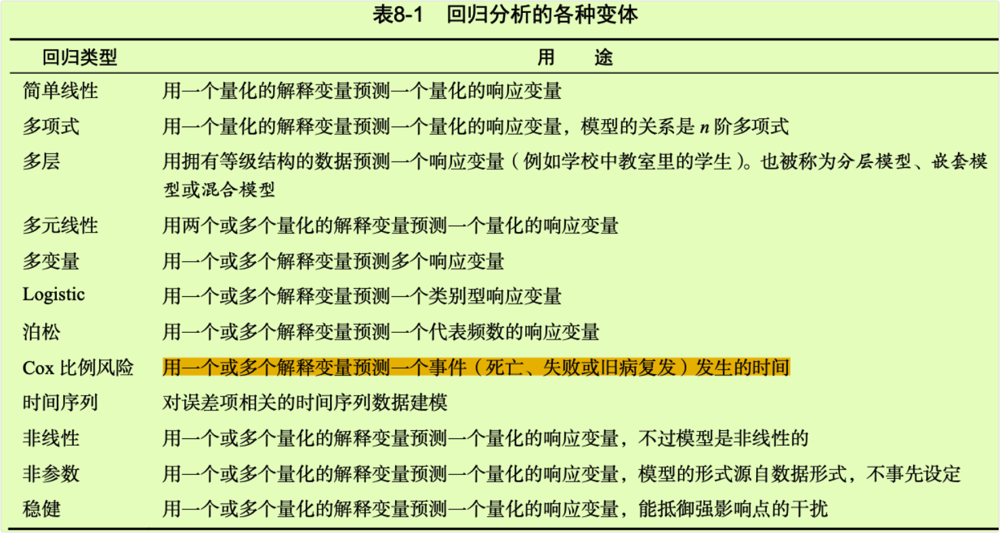
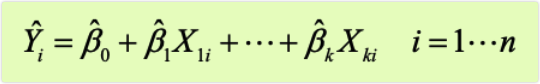
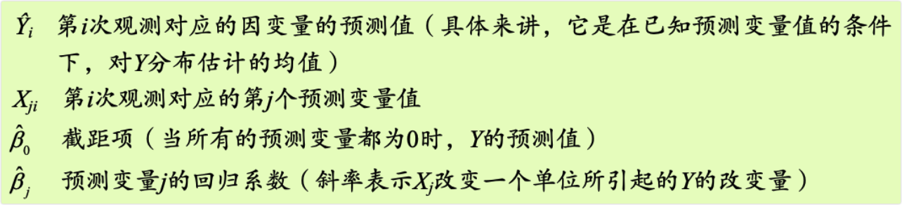
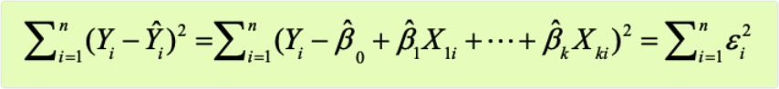

```{r setup, include=FALSE}
knitr::opts_chunk$set(prompt=TRUE,comment='',echo=TRUE,collapse=TRUE,message=FALSE,warning=FALSE)
```

# 8 回归

-   从许多方面来看，回归分析都是统计学的核心。它其实是一个广义的概念，通指那些用一个或多个预测变量（也称自变量或解释变量）来预测响应变量（也称因变量、效标变量或结果变量）的方法。通常，回归分析可以用来挑选与响应变量相关的解释变量，可以描述两者的关系，也可以生成一个等式，通过解释变量来预测响应变量。

-   例如，一位运动生理学家可通过回归分析获得一个等式，预测一个人在跑步机上锻炼时预期消耗的卡路里数。响应变量即消耗的卡路里数（可通过耗氧量计算获得），预测变量则可能包括锻炼的时间（分）、处于目标心率的时间比、平均速度（英里/小时）、年龄（年）、性别和身体质量指数(BMI)。

-   从理论的角度来看，回归分析可以帮助解答以下疑问。

-   锻炼时间与消耗的卡路里数是什么关系？是线性的还是曲线的？比如，卡路里消耗到某个点后，锻炼对卡路里的消耗影响会变小吗？

-   耗费的精力（处于目标心率的时间比，平均行进速度）将被如何计算在内？口这些关系对年轻人和老人、男性和女性、肥胖和苗条的人同样适用吗？从实际的角度来看，回归分析则可以帮助解答以下疑问。

-   一名30岁的男性，BMI为28.7，如果以每小时4英里的速度行走45分钟，并且80%的时间都在目标心率内，那么他会消耗多少卡路里？

-   为了准确预测一个人行走时消耗的卡路里数，你需要收集的变量最少是多少个？

-   预测的准确度可以达到多少？

-   由于回归分析在现代统计学中非常重要，本章将对其进行一些深度讲解。首先，我们将看一看如何拟合和解释回归模型，然后回顾一系列鉴别模型潜在问题的方法，并学习如何解决它们。其次，我们将探究变量选择问题。对于所有可用的预测变量，如何确定哪些变量包含在最终的模型中？再次，我们将讨论一般性问题。模型在现实世界中的表现到底如何？最后，我们再看看相对重要性问题。模型所有的预测变量中，哪个最重要，哪个第二重要，哪个最无关紧要？

-   正如你所看到的，我们会涵盖许多方面的内容。有效的回归分析本就是一个交互的、整体的、多步骤的过程，而不仅仅是一点技巧。为此，本书并不将它分散到多个章中进行讲解，而是用单独的一章来讨论。**因此，这一章将成为本书最长、最复杂的一章**。只要坚持到最后，我保证你一定可以掌握所有的工具，自如地处理许多研究性问题！

## 8.1 回归的多面性

-   回归是一个令人困惑的词，因为它有许多特殊变种（见表8-1）。对于回归模型的拟合，R提供的强大而丰富的功能和选项也同样令人困惑。例如，2005年Vito Riccit创建的列表表明，R中做回归分析的函数已超过了205个。



-   在这一章中，我们的重点是普通最小二乘（OLS）回归法，包括简单线性回归、多项式回归和多元线性回归。OLS回归是现今最常见的统计分析方法，其他回归模型(Logisticl回归和泊松回归)将在第13章介绍。

### 8.1.1 OLS回归的适用情境

-   OLS回归是通过预测变量的加权和来预测量化的因变量，其中权重是通过数据估计而得的参数。现在让我们一起看一个改编自Fwa（2006）的具体示例（此处没有任何含沙射影之意)。

-   一名工程师想找出跟桥梁退化有关的最重要的因素，比如使用年限、交通流量、桥梁设计、建造材料和建造方法、建造质量以及天气情况，并确定它们之间的数学关系。他从一个有代表性的桥梁样本中收集了这些变量的相关数据，然后使用OLS回归对数据进行建模。

-   这种方法的交互性很强。他拟合了一系列模型，检验它们是否符合相应的统计假设，探索了所有异常的发现，最终从许多可能的模型中选择了"最佳"的模型。如果成功，那么结果将会帮助他完成以下任务。

-   在众多变量中判断哪些对预测桥梁退化是有用的，得到它们的相对重要性，从而关注重要的变量。

-   根据回归所得的等式预测新的桥梁的退化情况（预测变量的值已知，但是桥梁退化程度未知），找出那些可能会有麻烦的桥梁。

-   利用对异常桥梁的分析，获得一些意外的信息。比如他发现某些桥梁的退化速度比预测的更快或更慢，那么研究这些"离群点"可能会有重大的发现，能够帮助理解桥梁退化的机制。

-   可能桥梁的例子并不能引起你的兴趣。而且我是从事临床心理学和统计的，对土木工程也是一无所知，但是这其中蕴含的一般性思想适用于物理、生物和社会科学的许多问题。以下问题都可以通过OLS方法进行处理。

-   铺路表面的面积与表面盐度有什么关系？

-   一个用户哪些方面的经历会导致他沉溺于大型多人在线角色扮演游戏？

-   教育环境中的哪些因素最能影响学生成绩得分？

-   血压、盐摄入量和年龄的关系是什么样的？对于男性和女性是相同的吗？

-   运动场馆和职业运动对大都市的发展有何影响？

-   哪些因素可以解释各州的啤酒价格差异？

我们主要的困难有三个：发现有趣的问题，设计一个有用的、可以测量的响应变量，以及收集合适的数据。

## 8.2 OLS回归

-   在本章大部分内容中，我们都是利用OLS法通过一系列的预测变量来预测响应变量（也可以说是在预测变量上"回归"响应变量一其名也因此而来)。OLS回归拟合模型的形式：



-   其中，n为观测的数目，k为预测变量的数目。（虽然我极力避免讨论公式，但这里探讨公式是简化问题的需要。）等式中相应部分的解释如下。



-   我们的目标是通过减少响应变量的真实值与预测值的差值来获得模型参数（截距项和斜率）。具体而言，即使得残差平方和最小。



- 为了能够恰当地解释OLS模型的系数，数据必须满足以下统计假设。

- **正态性**对于固定的自变量值，因变量值成正态分布。
- **独立性**Y值之间相互独立。
- **线性**因变量与自变量之间为线性相关。
- **同方差性**因变量的方差不随自变量的水平不同而变化。也可称作**不变方差**，但是说**同方差性**感觉上更犀利。

- 如果违背了以上假设，你的统计显著性检验结果和所得的置信区间就很可能不精确了。注意，OLS回归还假定自变量是固定的且测量无误差，但在实践中通常都放松了这个假设。

