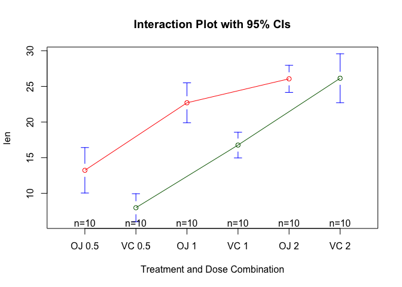
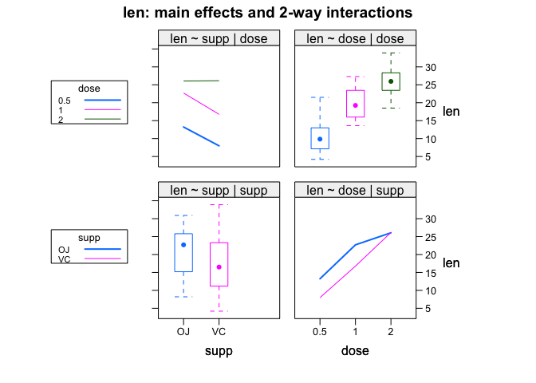

chapter09_方差分析
================

- <a href="#9-方差分析" id="toc-9-方差分析">9 方差分析</a>
  - <a href="#91-术语速成" id="toc-91-术语速成">9.1 术语速成</a>
  - <a href="#92-anova模型拟合" id="toc-92-anova模型拟合">9.2
    ANOVA模型拟合</a>
    - <a href="#921-aov函数" id="toc-921-aov函数">9.2.1
      <code>aov()</code>函数</a>
    - <a href="#922-表达式中各项的顺序" id="toc-922-表达式中各项的顺序">9.2.2
      表达式中各项的顺序</a>
  - <a href="#93-单因素方差分析" id="toc-93-单因素方差分析">9.3
    单因素方差分析</a>
    - <a href="#931-多重比较" id="toc-931-多重比较">9.3.1 多重比较</a>
    - <a href="#932-评估检验的假设条件" id="toc-932-评估检验的假设条件">9.3.2
      评估检验的假设条件</a>
  - <a href="#94-单因素协方差分析" id="toc-94-单因素协方差分析">9.4
    单因素协方差分析</a>
    - <a href="#941-评估检验的假设条件" id="toc-941-评估检验的假设条件">9.4.1
      评估检验的假设条件</a>
    - <a href="#942-结果可视化" id="toc-942-结果可视化">9.4.2 结果可视化</a>
  - <a href="#95-双因素方差分析" id="toc-95-双因素方差分析">9.5
    双因素方差分析</a>
  - <a href="#96-重复测量方差分析" id="toc-96-重复测量方差分析">9.6
    重复测量方差分析</a>
  - <a href="#97-多元方差分析" id="toc-97-多元方差分析">9.7 多元方差分析</a>
    - <a href="#971-评估假设检验" id="toc-971-评估假设检验">9.7.1
      评估假设检验</a>
    - <a href="#972-稳健多元方差分析" id="toc-972-稳健多元方差分析">9.7.2
      稳健多元方差分析</a>
  - <a href="#98-用回归来做anova" id="toc-98-用回归来做anova">9.8
    用回归来做ANOVA</a>

# 9 方差分析

- 本章需要使用car、gplots、HH、rrcov、multcomp、effects、MASS和mvoutlier包。运行后面的代码示例时，请确保已安装以上这些包。

## 9.1 术语速成

- 以焦虑症治疗为例，现有两种治疗方案：认知行为疗法 (CBT)
  和眼动脱敏再加工法 (EMDR)。

- 仅有一个类别型变量的统计设计，称为**单因素方差分析(one-way
  ANOVA)**，或进一步称为单因素组间方差分析。

- 由于在每种治疗方案下观测数相等，因此这种设计也称为均衡设计(balanced
  design)；若观测数不同，则称作非均衡设计(unbalanced design)。

- 当设计包含两个甚至更多的因子时，便是**因素方差分析**设计，比如两因子时称作双因素方差分析，三因子时称作三因素方差分析，以此类推。若因子设计包括组内和组间因子，又称作**混合模型方差分析**，比如，疗法(therapy)和时间(time)都作为因子时，我们既可分析疗法的影响(时间跨度上的平均)和时间的影响(疗法类型跨度上的平均)，又可分析疗法和时间的交互影响，前两个称作**主效应**，交互部分称作**交互效应**，这就是典型的双因素混合模型方差分析。

- 本例将做三次F检验：疗法因素一次，时间因素一次，两者交互因素一次。1、若疗法结果显著，说明CBT和EMDR对焦虑症的治疗效果不同；2、若时间结果显著，说明焦虑度从五周到六个月发生了变化；3、若两者交互效应显著，说明两种疗法随着时间变化对焦虑症治疗影响不同(也就是说，焦虑度从五周到六个月的改变程度在两种疗法间是不同的)。

- 对上面的实验设计稍微做些扩展。已知抑郁症对病症治疗有影响，而且**抑郁症和焦虑症常常同时出现**。抑郁症也可以解释因变量的组间差异，因此它常称为**混淆因素(confounding
  factor)**。由于对抑郁症不感兴趣，因此，它也被称作**干扰变数(nuisance
  variable)**。假设招募患者时使用抑郁症的自我评测报告（白氏抑郁症量表(BDI)）记录了他们的抑郁水平，那么可以在评测疗法类型的影响前，**对任何抑郁水平的组间差异进行统计性调整**。

- 本案例中，BDI为协变量，该设计为**协方差分析(ANCOVA)**。以上设计只记录了单个因变量情况(STAI)，为增强研究的有效性，可以对焦虑症进行其他的测量(比如家庭评分、医师评分,以及焦虑症对日常行为的影响评价)。当因变量不止一个时，设计被称作**多元方差分析(MANOVA)**，若协变量也存在，那么就叫**多元协方差分析(MANCOVA)**。

## 9.2 ANOVA模型拟合

### 9.2.1 `aov()`函数

- `aov()`函数的语法为`aov(formula,data=dataframe)`，下表列举了表达式中可以使用的特殊符号，y是因变量，字母A、B、C代表因子。

  | 符号 | 用法                                                                                                        |
  |------|-------------------------------------------------------------------------------------------------------------|
  | \~   | 分隔符号,左边为响应变量，右边为解释变量。例如，用 A、B 和 C 预测 y，代码为 y \~ A + B + C。                 |
  | :    | 表示变量的交互项。例如，用 A、B 和 A 与 B 的交互项来预测 y，代码为 y \~ A + B + A:B。                       |
  | \*   | 表示所有可能交互项。代码 y \~ A \* B \* C 可展开为 y \~ A + B + C + A:B + A:C + B:C + A:B:。                |
  | ^    | 表示交互项达到某个次数。代码 y \~ (A + B + C)^2 可展开为 y \~ A + B + C + A:B + A:C + B:C。                 |
  | .    | 表示包含除因变量外的所有变量。例如，若一个数据框包含变量 y、A、B 和 C，代码 y \~ .可展开为 y \~ A + B + C。 |

- 下表列举了一些常见的研究设计表达式，小写字母表示定量变量，大写字母表示组别因子，Subject是对被试者独有的标识变量。

  | 设计                                               | 表达式                         |
  |----------------------------------------------------|--------------------------------|
  | 单因素 ANOVA                                       | y \~ A                         |
  | 含单个协变量的单因素 ANCOVA                        | y \~ x + A                     |
  | 双因素 ANOVA                                       | y \~ A \* B                    |
  | 含两个协变量的双因素 ANCOVA                        | y \~ x1 + x2 + A\*B            |
  | 随机化区组                                         | y \~ B + A(B 是区组因子)       |
  | 单因素组内 ANOVA                                   | y \~ A + Error(Subject/A)      |
  | 含单个组内因子(W)和单个组间因子(B)的重复测量 ANOVA | y \~ B \* W + Error(Subject/W) |

### 9.2.2 表达式中各项的顺序

- 表达式中效应的顺序在两种情况下会造成影响：(a)因子不止一个，并且是非平衡设计；(b)存在协变量。

- R默认类型I(序贯型)方法计算ANOVA效应(参考补充内容P202”顺序很重要!“)。第一个模型可以这样写：y
  \~ A + B +
  A:B。R中的ANOVA表的结果将评价：1、A对y的影响；2、控制A时，B对y的影响；控制A和B的主效应时，A与B的交互效应。

- **基本的准则：若研究设计不是正交的(也就是说，因子和/或协变量相关)，一定要谨慎设置效应的顺序**。

- 请注意car包中的`Anova()`函数(不要与标准`anova()`函数混淆)提供了使用类型Ⅱ或类型Ⅲ方法的选项，而`aov()`函数使用的是类型I方法。若想使结果与其他软件(如SAS和SPSS)提供的结果保持一致，可以使用`Anova()`函数，细节可参考`help(Anova, package="car")`。

## 9.3 单因素方差分析

- 单因素方差分析比较的是：分类因子定义的两个或多个组别中的因变量均值。

- 以multcomp包中的cholesterol数据集为例(取自Westfall、Tobia、Rom、Hochberg,1999)，50个患者均接受降低胆固醇药物治疗(trt)五种疗法中的一种疗法。其中三种治疗条件使用药物相同，分别是20mg一天一次(1time)、10mg一天两次(2times)和5mg一天四次(4times)。剩下的两种方式(drugD和drugE)代表候选药物。哪种药物疗法降低胆固醇(响应变量)最多呢?

- 代码清单9-1 单因素方差分析

- 需要安装mvtnorm、survival、TH.data、MASS包。

``` r
> library(multcomp) # 加载包
> attach(cholesterol) # 加载数据集
> table(trt) # 各组样本大小
trt
 1time 2times 4times  drugD  drugE 
    10     10     10     10     10 
```

``` r
> options(digits = 3)
> aggregate(response, by=list(trt), FUN=mean) # 各组均值显示drugE降低胆固醇最多,而1time降低胆固醇最少
  Group.1     x
1   1time  5.78
2  2times  9.22
3  4times 12.37
4   drugD 15.36
5   drugE 20.95
```

``` r
> aggregate(response, by=list(trt), FUN=sd) # 各组标准差相对恒定,在2.88到3.48间浮动
  Group.1    x
1   1time 2.88
2  2times 3.48
3  4times 2.92
4   drugD 3.45
5   drugE 3.35
```

``` r
> fit <- aov(response ~ trt)  # 检验组间差异(ANOVA)，ANOVA对治疗方式(trt)的F检验非常显著(p<0.0001) ,说明五种疗法的效果不同
> summary(fit)
            Df Sum Sq Mean Sq F value  Pr(>F)    
trt          4   1351     338    32.4 9.8e-13 ***
Residuals   45    469      10                    
---
Signif. codes:  0 '***' 0.001 '**' 0.01 '*' 0.05 '.' 0.1 ' ' 1
```

``` r
> library(gplots) # 加载包
> # 绘制各组均值及其置信区间的图形
> plotmeans(response ~ trt, xlab="Treatment", ylab="Response",   
+           main="Mean Plot\nwith 95% CI")  
```

<!-- -->

``` r
> detach(cholesterol) # 卸载数据集
```

- gplots包中的`plotmeans()`可以用来绘制**带有置信区间的组均值图形**。上图展示了带有95%的置信区间的各疗法均值，可以清楚看到它们之间的差异。

### 9.3.1 多重比较

- 虽然ANOVA对各疗法的F检验表明五种药物疗法效果不同，但是并没有告诉你哪种疗法与其他疗法不同。多重比较可以解决这个问题。

``` r
> TukeyHSD(fit) # TukeyHSD()函数提供了对各组均值差异的成对检验
  Tukey multiple comparisons of means
    95% family-wise confidence level

Fit: aov(formula = response ~ trt)

$trt
               diff    lwr   upr p adj
2times-1time   3.44 -0.658  7.54 0.138
4times-1time   6.59  2.492 10.69 0.000
drugD-1time    9.58  5.478 13.68 0.000
drugE-1time   15.17 11.064 19.27 0.000
4times-2times  3.15 -0.951  7.25 0.205
drugD-2times   6.14  2.035 10.24 0.001
drugE-2times  11.72  7.621 15.82 0.000
drugD-4times   2.99 -1.115  7.09 0.251
drugE-4times   8.57  4.471 12.67 0.000
drugE-drugD    5.59  1.485  9.69 0.003
```

``` r
> par(las=2) # 第一个par语句用来旋转轴标签
> par(mar=c(5,8,4,2))  # 第二个用来增大左边界的面积，可使标签摆放更美观
> plot(TukeyHSD(fit))
```

<!-- -->

- 图形中置信区间包含0的疗法说明差异不显著(p\>0.5)。

- 【重点掌握】multcomp包中的`glht()`函数提供了多重均值比较更为全面的方法，既适用于线性模型(如本章各例)，也适用于广义线性模型。下面的代码重现了Tukey
  HSD检验，并用一个不同的图形对结果进行展示：

``` r
> library(multcomp) 
> par(mar=c(5,4,6,2)) 
> tuk <- glht(fit, linfct=mcp(trt="Tukey")) 
> plot(cld(tuk, level=.05),col="lightgrey")
```

<!-- -->

- 上面的代码中，为适合字母阵列摆放，par语句增大了顶部边界面积。cld()函数中的level选项设置了使用的显著水平(0.05，即本例中的95%的置信区间)。有相同字母的组(用箱线图表示)说明均值差异不显著。可以看到，1time和2times差异不显著(有相同的字母a)，2times和4times差异也不显著(有相同的字母b)，而1time和4times差异显著(它们没有共同的字母)。

- 从结果来看，使用降低胆固醇的药物时，一天四次5mg剂量比一天一次20mg剂量效果更佳，也优于候选药物drugD，但药物drugE比其他所有药物和疗法都更优。

### 9.3.2 评估检验的假设条件

- 在单因素方差分析中，假设因变量服从正态分布，各组方差相等。

- 可以使用Q-Q图来检验正态性假设：

``` r
> library(car) 
> # 注意qqPlot()要求用lm()拟合
> qqPlot(lm(response ~ trt, data=cholesterol),         
+        simulate=TRUE, main="Q-Q Plot", labels=FALSE)
```

<!-- -->

    [1] 19 38

- 数据落在95%的置信区间范围内，说明满足正态性假设。

- R提供了一些可用来做方差齐性检验的函数。例如，可以通过如下代码来做Bartlett检验：

``` r
> options(digits = 5)
> bartlett.test(response ~ trt, data=cholesterol)

    Bartlett test of homogeneity of variances

data:  response by trt
Bartlett's K-squared = 0.58, df = 4, p-value = 0.97
```

- Bartlett检验表明五组的方差并没有显著不同(p=0.97)。

- 不过，方差齐性分析对离群点非常敏感。可利用car包中的`outlierTest()`函数来检测离群点：

``` r
> library(car)  
> outlierTest(fit)
No Studentized residuals with Bonferroni p < 0.05
Largest |rstudent|:
   rstudent unadjusted p-value Bonferroni p
19   2.2511           0.029422           NA
```

- 从输出结果来看，并没有证据说明胆固醇数据中含有离群点(当p\>1时将产生NA)。因此根据Q-Q图、Bartlett检验和离群点检验，该数据似乎可以用ANOVA模型拟合得很好。

## 9.4 单因素协方差分析

- 单因素协方差分析(ANCOVA)扩展了单因素方差分析(ANOVA)，包含一个或多个定量的协变量。

- 下面的例子来自于multcomp包中的litter数据集(见Westfall et
  al.,1999)。怀孕小鼠被分为四个小组，每个小组接受不同剂量(0、5、50或500)的药物处理。产下幼崽的体重均值为因变量，怀孕时间为协变量。

- 代码清单9-3 单因素ANCOVA

``` r
> data(litter, package="multcomp")  
> attach(litter) 
> table(dose) # 利用table()函数,可以看到每种剂量下所产的幼崽数并不相同:0剂量时(未用药)产崽20个,500剂量时产崽17个
dose
  0   5  50 500 
 20  19  18  17 
```

``` r
> # 用aggregate()函数获得各组均值,可以发现未用药组幼崽体重均值最高(32.3) 
> options(digits = 3)
> aggregate(weight, by=list(dose), FUN=mean) 
  Group.1    x
1       0 32.3
2       5 29.3
3      50 29.9
4     500 29.6
```

``` r
> options(digits = 8)
> fit <- aov(weight ~ gesttime + dose) 
> summary(fit)
            Df  Sum Sq Mean Sq F value   Pr(>F)   
gesttime     1  134.30 134.304  8.0493 0.005971 **
dose         3  137.12  45.708  2.7394 0.049883 * 
Residuals   69 1151.27  16.685                    
---
Signif. codes:  0 '***' 0.001 '**' 0.01 '*' 0.05 '.' 0.1 ' ' 1
```

- ANCOVA的F检验表明：(a)怀孕时间与幼崽出生体重相关；(b)控制怀孕时间，药物剂量与出生体重相关。控制怀孕时间，确实发现每种药物剂量下幼崽出生体重均值不同。

- 由于使用了协变量，可能还想要获取调整的组均值，即去除协变量效应后的组均值。可使用effects包中的`effects()`函数来计算调整的均值：

``` r
> library(effects) 
> options(digits = 3)
> effect("dose", fit)

 dose effect
dose
   0    5   50  500 
32.4 28.9 30.6 29.3 
```

- 本例中，调整的均值与`aggregate()`函数得出的未调整的均值类似，但并非所有的情况都是如此。

- 总之，effects包为复杂的研究设计提供了强大的计算调整均值的方法，并能将结果可视化，更多细节可参考CRAN上的文档。

- 可以使用multcomp包来对所有均值进行成对比较。另外，multcomp包还可以用来检验用户自定义的均值假设。如想探究未用药条件与其他三种用药条件影响是否不同，可使用下列代码：

- 代码清单9-4 对用户定义的对照的多重比较

``` r
> library(multcomp)  
> contrast <- rbind("no drug vs. drug" = c(3, -1, -1, -1)) 
> options(digits = 7)
> summary(glht(fit, linfct=mcp(dose=contrast)))

     Simultaneous Tests for General Linear Hypotheses

Multiple Comparisons of Means: User-defined Contrasts


Fit: aov(formula = weight ~ gesttime + dose)

Linear Hypotheses:
                      Estimate Std. Error t value Pr(>|t|)  
no drug vs. drug == 0    8.284      3.209   2.581    0.012 *
---
Signif. codes:  0 '***' 0.001 '**' 0.01 '*' 0.05 '.' 0.1 ' ' 1
(Adjusted p values reported -- single-step method)
```

- 对照c(3, -1, -1,
  -1)设定第一组和其他三组的均值进行比较。假设检验的t统计量(2.581)在p\<0.05水平下显著，因此，可以得出未用药组比其他用药条件下的出生体重高的结论。其他对照可用`rbind()`函数添加(详见help(glht))。

### 9.4.1 评估检验的假设条件

- **ANCOVA与ANOVA相同，都需要正态性和同方差性假设。**

- 可以用8.3.2中相同的步骤来检验这些假设条件。另外，ANCOVA还假定回归斜率相同。

- 本例中，假定四个处理组通过怀孕时间来预测出生体重的回归斜率都相同。ANCOVA模型包含怀孕时间×剂量的交互项时，可对回归斜率的同质性进行检验。交互效应若显著，则意味着时间和幼崽出生体重间的关系依赖于药物剂量的水平。

- 代码清单9-5 检验回归斜率的同质性

``` r
> library(multcomp)  
> fit2 <- aov(weight ~ gesttime*dose, data=litter)
> options(digits = 6)
> summary(fit2)
              Df Sum Sq Mean Sq F value Pr(>F)   
gesttime       1    134   134.3    8.29 0.0054 **
dose           3    137    45.7    2.82 0.0456 * 
gesttime:dose  3     82    27.3    1.68 0.1789   
Residuals     66   1069    16.2                  
---
Signif. codes:  0 '***' 0.001 '**' 0.01 '*' 0.05 '.' 0.1 ' ' 1
```

- 可以看到交互效应不显著，支持了斜率相等的假设。若假设不成立，可以尝试变换协变量或因变量，或使用能对每个斜率独立解释的模型，或使用不需要假设回归斜率同质性的非参数ANCOVA方法。sm包中的`sm.ancova()`函数为后者提供了一个例子。

### 9.4.2 结果可视化

- HH包中的`ancova()`函数可以绘制因变量、协变量和因子之间的关系图。

``` r
> library(HH) 
> ancova(weight ~ gesttime + dose, data=litter)
Analysis of Variance Table

Response: weight
          Df Sum Sq Mean Sq F value  Pr(>F)   
gesttime   1  134.3  134.30   8.049 0.00597 **
dose       3  137.1   45.71   2.739 0.04988 * 
Residuals 69 1151.3   16.69                   
---
Signif. codes:  0 '***' 0.001 '**' 0.01 '*' 0.05 '.' 0.1 ' ' 1
```

<!-- -->

- 从图中可以看到，用怀孕时间来预测出生体重的回归线相互平行，只是截距项不同。随着怀孕时间增加，幼崽出生体重也会增加。另外，还可以看到0剂量组截距项最大，5剂量组截距项最小。由于上面的设置，直线会保持平行，若用`ancova(weight ~ gesttime*dose)`，生成的图形将允许斜率和截距项依据组别而发生变化，这对可视化那些违背回归斜率同质性的实例非常有用。

## 9.5 双因素方差分析

- 在双因素方差分析中，受试者被分配到两因子的交叉类别组中。以基础安装中的ToothGrowth数据集为例，随机分配60只豚鼠，分别采用两种喂食方法(橙汁或维生素C)，各喂食方法中抗坏血酸含量有三种水平(0.5mg、1mg或2mg)，每种处理方式组合都被分配10只豚鼠，牙齿长度为因变量。

- 代码清单9-6 双因素ANOVA

``` r
> attach(ToothGrowth)  
> table(supp, dose) # table语句的预处理表明该设计是均衡设计(各设计单元中样本大小都相同)
    dose
supp 0.5  1  2
  OJ  10 10 10
  VC  10 10 10
```

``` r
> aggregate(len, by=list(supp, dose), FUN=mean) # aggregate 语句处理可获得各单元的均值和标准差
  Group.1 Group.2     x
1      OJ     0.5 13.23
2      VC     0.5  7.98
3      OJ     1.0 22.70
4      VC     1.0 16.77
5      OJ     2.0 26.06
6      VC     2.0 26.14
```

``` r
> options(digits = 3)
> aggregate(len, by=list(supp, dose), FUN=sd)
  Group.1 Group.2    x
1      OJ     0.5 4.46
2      VC     0.5 2.75
3      OJ     1.0 3.91
4      VC     1.0 2.52
5      OJ     2.0 2.66
6      VC     2.0 4.80
```

``` r
> dose <- factor(dose) # dose变量被转换为因子变量, 这样aov()函数就会将它当做一个分组变量, 而不是一个数值型协变量
> fit <- aov(len ~ supp*dose) 
> summary(fit) # 用summary()函数得到方差分析表, 可以看到主效应(supp和dose)和交互效应都非常显著
            Df Sum Sq Mean Sq F value  Pr(>F)    
supp         1    205     205   15.57 0.00023 ***
dose         2   2426    1213   92.00 < 2e-16 ***
supp:dose    2    108      54    4.11 0.02186 *  
Residuals   54    712      13                    
---
Signif. codes:  0 '***' 0.001 '**' 0.01 '*' 0.05 '.' 0.1 ' ' 1
> detach(ToothGrowth)
```

- 有多种方式对结果进行可视化处理。此处可用`interaction.plot()`函数来展示双因素方差分析的交互效应。

``` r
> attach(ToothGrowth)  
> interaction.plot(dose, supp, len, type="b",         
+                  col=c("red","blue"), pch=c(16, 18),              
+                  main = "Interaction between Dose and Supplement Type")
```

<!-- -->

``` r
> detach(ToothGrowth)
```

- 上图展示了各种剂量喂食下豚鼠牙齿长度的均值。（喂食方法和剂量对牙齿生长的交互作用。用interaction.plot()函数绘制了牙齿长度的均值。）

- 还可以用gplots包中的`plotmeans()`函数来展示交互效应。

``` r
> library(gplots) 
> attach(ToothGrowth)  
> plotmeans(len ~ interaction(supp, dose, sep=" "),      
+           connect=list(c(1,3,5),c(2,4,6)),          
+           col=c("red", "darkgreen"),      
+           main = "Interaction Plot with 95% CIs",         
+           xlab="Treatment and Dose Combination")
```

<!-- -->

``` r
> detach(ToothGrowth)
```

- 上图展示了均值、误差棒(95%的置信区间)和样本大小。（喂食方法和剂量对牙齿生长的交互作用。用`plotmeans()`函数绘制的95%的置信区间的牙齿长度均值。）

- 最后，用HH包中的`interaction2wt()`函数来可视化结果，图形对任意顺序的因子设计的主效应和交互效应都会进行展示。

``` r
> library(HH)
> attach(ToothGrowth) 
> interaction2wt(len~supp*dose)
```

<!-- -->

``` r
> detach(ToothGrowth)
```

- 上面三幅图形都表明：
  - 1、随着橙汁和维生素C中的抗坏血酸剂量的增加，牙齿长度变长。
  - 2、对于0.5mg和1mg剂量，橙汁比维生素C更能促进牙齿生长。
  - 3、对于2mg剂量的抗坏血酸，两种喂食方法下牙齿长度增长相同。
- 三种绘图方法中更推荐HH包中的`interaction2wt()`函数，因为它能展示任意复杂度设计(双因素方差分析、三因素方差分析等)的主效应(箱线图)和交互效应。

## 9.6 重复测量方差分析

- **所谓重复测量方差分析, 即受试者被测量不止一次。**

- 本节重点关注含一个组内和一个组间因子的重复测量方差分析(这是一个常见的设计)。示例来源于生理生态学领域，研究方向是生命系统的生理和生化过程如何响应环境因素的变异(此为应对全球变暖的一个非常重要的研究领域)。

- 基础安装包中的CO2数据集包含了北方和南方牧草类植物Echinochloa
  crus-galli
  (Potvin、Lechowicz、Tardif,1990)的寒冷容忍度研究结果，在某浓度二氧化碳的环境中，对寒带植物与非寒带植物的光合作用率进行了比较。研究所用植物一半来自于加拿大的魁北克省(Quebec)，另一半来自美国的密西西比州(Mississippi)。

- 首先关注寒带植物。因变量是二氧化碳吸收量(uptake)，单位为ml/L，自变量是植物类型Type(魁北克VS.密西西比)
  和七种水平 (95\~1000 umol/m^2 sec)的二氧化碳浓度
  (conc)。另外，Type是组间因子，conc是组内因子。Type已经被存储为一个因子变量，但还需要先将conc转换为因子变量。

- 代码清单9-7 含一个组间因子和一个组内因子的重复测量方差分析

``` r
> CO2$conc <- factor(CO2$conc)
> w1b1 <- subset(CO2, Treatment=='chilled')
> fit <- aov(uptake ~ conc*Type + Error(Plant/(conc)), w1b1) 
> summary(fit)

Error: Plant
          Df Sum Sq Mean Sq F value Pr(>F)   
Type       1   2667    2667    60.4 0.0015 **
Residuals  4    177      44                  
---
Signif. codes:  0 '***' 0.001 '**' 0.01 '*' 0.05 '.' 0.1 ' ' 1

Error: Plant:conc
          Df Sum Sq Mean Sq F value  Pr(>F)    
conc       6   1472   245.4    52.5 1.3e-12 ***
conc:Type  6    429    71.5    15.3 3.7e-07 ***
Residuals 24    112     4.7                    
---
Signif. codes:  0 '***' 0.001 '**' 0.01 '*' 0.05 '.' 0.1 ' ' 1
```

``` r
> par(las=2) 
> par(mar=c(10,4,4,2)) 
> with(w1b1, interaction.plot(conc,Type,uptake,    
+                             type="b", col=c("red","blue"), pch=c(16,18),   
+                             main="Interaction Plot for Plant Type and Concentration")) 
```

<!-- -->

``` r
> boxplot(uptake ~ Type*conc, data=w1b1, col=(c("gold", "green")),     
+         main="Chilled Quebec and Mississippi Plants",      
+         ylab="Carbon dioxide uptake rate (umol/m^2 sec)",
+         xlab=" ")
```

<!-- -->

- 从以上任意一幅图都可以看出，魁北克省的植物比密西西比州的植物二氧化碳吸收率高，而且随着CO2浓度的升高，差异越来越明显。

## 9.7 多元方差分析

- 当因变量(结果变量)不止一个时，可用多元方差分析(MANOVA)对它们同时进行分析。以MASS包中的UScereal数据集为例(Venables,Ripley(1999))，我们将研究美国谷物中的卡路里、脂肪和糖含量是否会因为储存架位置的不同而发生变化；其中1代表底层货架，2代表中层货架，3代表顶层货架。卡路里、脂肪和糖含量是因变量，货架是三水平(1、2、3)的自变量。

- 代码清单9-8 单因素多元方差分析

``` r
> library(MASS)  
> attach(UScereal) 
> shelf <- factor(shelf) # 将shelf变量转换为因子变量, 从而使它在后续分析中能作为分组变量
> y <- cbind(calories, fat, sugars) # cbind() 函数将三个因变量(卡路里、脂肪和糖)合并成一个矩阵
> aggregate(y, by=list(shelf), FUN=mean) # aggregate()函数可获取货架的各个均值
  Group.1 calories   fat sugars
1       1      119 0.662    6.3
2       2      130 1.341   12.5
3       3      180 1.945   10.9
```

``` r
> options(digits = 3)
> cov(y) # cov()则输出各谷物间的方差和协方差
         calories   fat sugars
calories   3895.2 60.67  180.4
fat          60.7  2.71    4.0
sugars      180.4  4.00   34.1
```

``` r
> fit <- manova(y ~ shelf) # manova()函数能对组间差异进行多元检验。 
> summary(fit)
          Df Pillai approx F num Df den Df Pr(>F)    
shelf      2  0.402     5.12      6    122  1e-04 ***
Residuals 62                                         
---
Signif. codes:  0 '***' 0.001 '**' 0.01 '*' 0.05 '.' 0.1 ' ' 1
```

- 上面F值显著，说明三个组的营养成分测量值不同。注意shelf变量已经转成了因子变量，因此它可以代表一个分组变量。

``` r
> summary.aov(fit) # 输出单变量结果。由于多元检验是显著的，可以使用summary.aov()函数对每一个变量做单因素方差分析
 Response calories :
            Df Sum Sq Mean Sq F value  Pr(>F)    
shelf        2  50435   25218    7.86 0.00091 ***
Residuals   62 198860    3207                    
---
Signif. codes:  0 '***' 0.001 '**' 0.01 '*' 0.05 '.' 0.1 ' ' 1

 Response fat :
            Df Sum Sq Mean Sq F value Pr(>F)  
shelf        2   18.4    9.22    3.68  0.031 *
Residuals   62  155.2    2.50                 
---
Signif. codes:  0 '***' 0.001 '**' 0.01 '*' 0.05 '.' 0.1 ' ' 1

 Response sugars :
            Df Sum Sq Mean Sq F value Pr(>F)   
shelf        2    381     191    6.58 0.0026 **
Residuals   62   1798      29                  
---
Signif. codes:  0 '***' 0.001 '**' 0.01 '*' 0.05 '.' 0.1 ' ' 1
```

- 从上述结果可以看到，三组中每种营养成分的测量值都是不同的。另外，还可以用均值比较步骤(比如TukeyHSD)来判断对于每个因变量,哪种货架与其他货架都是不同的。

### 9.7.1 评估假设检验

- 单因素多元方差分析有两个前提假设，一个是多元正态性，一个是方差-协方差矩阵同质性。

- 第一个假设即指因变量组合成的向量服从一个多元正态分布。可以用Q-Q图来检验该假设条件(参见P218”理论补充”对其工作原理的统计解释)
  。

- 代码清单9-9 检验多元正态性

``` r
> center <- colMeans(y)
> n <- nrow(y)  
> p <- ncol(y) 
> cov <- cov(y) 
> d <- mahalanobis(y,center,cov) 
> coord <- qqplot(qchisq(ppoints(n),df=p),   
+                 d, main="Q-Q Plot Assessing Multivariate Normality",     
+                 ylab="Mahalanobis D2") 
> abline(a=0,b=1) 
```

<!-- -->

- 若数据服从多元正态分布，那么点将落在直线上。

``` r
> center <- colMeans(y)
> n <- nrow(y)  
> p <- ncol(y) 
> cov <- cov(y) 
> d <- mahalanobis(y,center,cov) 
> coord <- qqplot(qchisq(ppoints(n),df=p),   
+                 d, main="Q-Q Plot Assessing Multivariate Normality",     
+                 ylab="Mahalanobis D2") 
> abline(a=0,b=1) 
> text(coord$x, coord$y,    
+      row.names(UScereal),      
+      cex=1, pos=2, col="red")
```

<!-- -->

- 可以通过identify()函数(参见P176)交互性地对图中的点进行鉴别，也可以直接把点的名称直接标上。从图形上看，观测点”Wheaties
  Honey
  Gold”和”Wheaties”异常，数据集似乎违反了多元正态性。可以删除这两个点再重新分析。

- 最后，还可以使用mvoutlier包中的`ap.plot()`函数来检验多元离群点。

``` r
> library(mvoutlier) 
> outliers <- aq.plot(y) 
Projection to the first and second robust principal components.
Proportion of total variation (explained variance): 0.979
```

<!-- -->

``` r
> outliers
$outliers
 [1] FALSE FALSE FALSE FALSE FALSE FALSE FALSE FALSE FALSE FALSE  TRUE  TRUE
[13] FALSE FALSE FALSE FALSE FALSE  TRUE FALSE FALSE FALSE FALSE FALSE FALSE
[25] FALSE FALSE FALSE FALSE FALSE FALSE  TRUE  TRUE FALSE FALSE FALSE FALSE
[37] FALSE FALSE FALSE  TRUE FALSE FALSE FALSE  TRUE FALSE FALSE FALSE FALSE
[49] FALSE  TRUE FALSE FALSE FALSE FALSE FALSE FALSE FALSE FALSE FALSE FALSE
[61] FALSE FALSE FALSE FALSE FALSE
```

### 9.7.2 稳健多元方差分析

- 如果多元正态性或者方差-协方差均值假设都不满足，或者你担心多元离群点，那么可以考虑用稳健或非参数版本的MANOVA检验。稳健单因素MANOVA可通过rrcov包中的`Wilks.test()`函数实现。vegan包中的`adonis()`函数则提供了非参数MANOVA的等同形式。
  代码清单9-10是`wilks.test()`的应用。

- 代码清单9-10 稳健单因素MANOVA

``` r
> library(rrcov)
> Wilks.test(y,shelf,method="mcd")

    Robust One-way MANOVA (Bartlett Chi2)

data:  x
Wilks' Lambda = 0.5, Chi2-Value = 22, DF = 5, p-value = 4e-04
sample estimates:
  calories   fat sugars
1      120 0.701   5.66
2      128 1.185  12.54
3      161 1.652  10.35
```

- 从结果来看，稳健检验对离群点和违反MANOVA假设的情况不敏感，而且再一次验证了存储在货架顶部、中部和底部的谷物营养成分含量不同。

## 9.8 用回归来做ANOVA

- 在9.2节中，我们提到ANOVA和回归都是广义线性模型的特例。因此，本章所有的设计都可以用`lm()`函数来分析。但是，为了更好地理解输出结果，需要弄明白在拟合模型时，R是如何处理类别型变量的。

- 以9.3节的单因素ANOVA问题为例，即比较五种降低胆固醇药物疗法(trt)的影响。

``` r
> library(multcomp) 
> levels(cholesterol$trt)
[1] "1time"  "2times" "4times" "drugD"  "drugE" 
```

- 首先，用`aov()`函数拟合模型：

``` r
> fit.aov <- aov(response ~ trt,data=cholesterol) 
> summary(fit.aov)
            Df Sum Sq Mean Sq F value  Pr(>F)    
trt          4   1351     338    32.4 9.8e-13 ***
Residuals   45    469      10                    
---
Signif. codes:  0 '***' 0.001 '**' 0.01 '*' 0.05 '.' 0.1 ' ' 1
```

- 现在，用`lm()`函数拟合同样的模型。结果见代码清单9-11。

- 代码清单9-11 解决9.3节ANOVA问题的回归方法

``` r
> fit.lm <- lm(response ~ trt,data=cholesterol) 
> summary(fit.lm)

Call:
lm(formula = response ~ trt, data = cholesterol)

Residuals:
   Min     1Q Median     3Q    Max 
-6.542 -1.967 -0.002  1.890  6.601 

Coefficients:
            Estimate Std. Error t value Pr(>|t|)    
(Intercept)     5.78       1.02    5.67  9.8e-07 ***
trt2times       3.44       1.44    2.39    0.021 *  
trt4times       6.59       1.44    4.57  3.8e-05 ***
trtdrugD        9.58       1.44    6.64  3.5e-08 ***
trtdrugE       15.17       1.44   10.51  1.1e-13 ***
---
Signif. codes:  0 '***' 0.001 '**' 0.01 '*' 0.05 '.' 0.1 ' ' 1

Residual standard error: 3.23 on 45 degrees of freedom
Multiple R-squared:  0.742, Adjusted R-squared:  0.72 
F-statistic: 32.4 on 4 and 45 DF,  p-value: 9.82e-13
```

- 我们能发现什么？因为线性模型要求预测变量是数值型，当`lm()`函数碰到因子时，它会用一系列与因子水平相对应的数值型对照变量来代替因子。如果因子有个水平，将会创建k-1个对照变量。R提供了五种创建对照变量的内置方法（见表9-6)，你也可以自己重新创建（此处不做介绍)。默认情况下，对照处理用于无序因子，正交多项式用于有序因子。


- 以对照(treatment
  contrast)为例，因子的第一个水平变成了参考组，随后的变量都以它为标准。可以通过`contrasts()`函数查看它的编码过程。

``` r
> contrasts(cholesterol$trt)
       2times 4times drugD drugE
1time       0      0     0     0
2times      1      0     0     0
4times      0      1     0     0
drugD       0      0     1     0
drugE       0      0     0     1
```

- 若患者处于drugD条件下，变量drugD等于1，其他变量2times、4times和drugE都等于0。无需列出第一组的变量值，因为其他四个变量都为0，这已经说明患者处于1time条件。

- 在代码清单9-11中，变量trt2times表示水平1time和2times的一个对照。类似地，trt4times是1time和4times的一个对照，其余以此类推。从输出的概率值来看，各药物条件与第一组(1time)显著不同。

- 通过设定contrasts选项，可以修改`lm()`中默认的对照方法。例如，若使用Helmert对照：

`fit.lm <- lm(response ~ trt, data=cholesterol, contrasts="contr.helmert")`

- 还能通过`options()`函数修改R会话中的默认对照方法，例如，

`options (contrasts = c("contr.SAS", "contr.helmert"))`

- 设定无序因子的默认对比方法为contr.SAS，有序因子的默认对比方法为contr.helmert。虽然我们一直都是在线性模型范围中讨论对照方法的使用，但是在R中，你完全可以将其应用到其他模型中，包括第13章将会介绍的广义线性模型。
