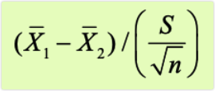
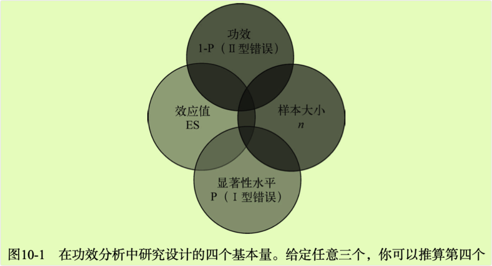
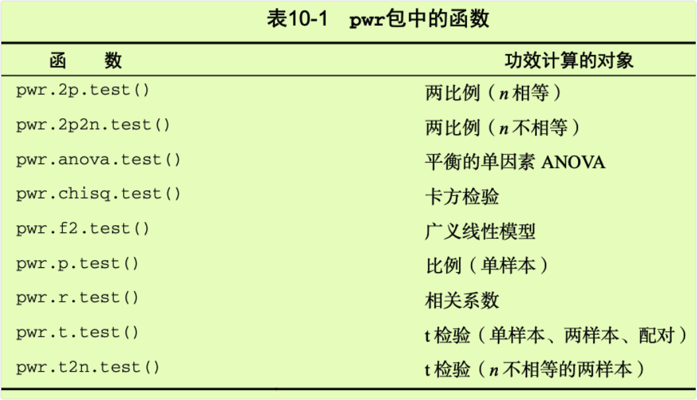
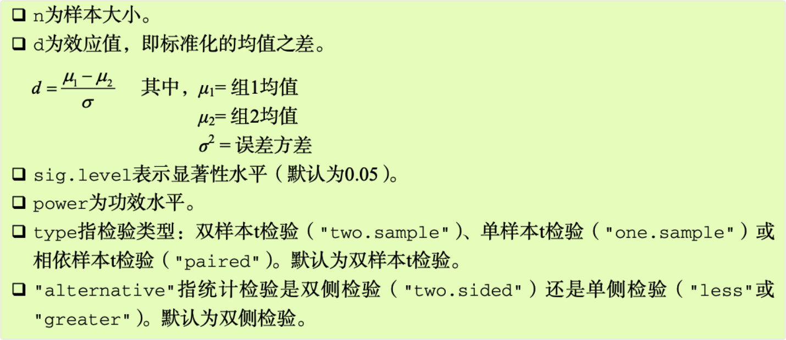
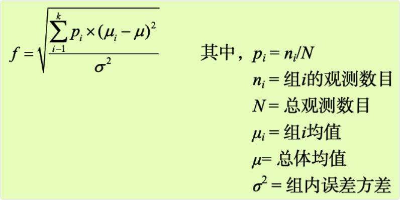
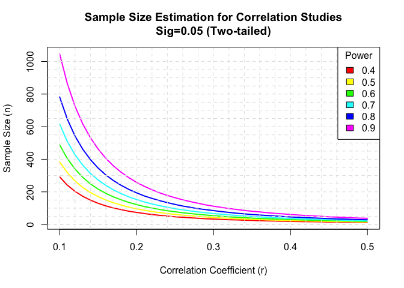
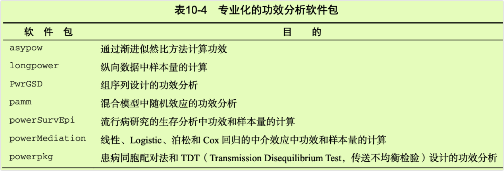

chapter10_功效分析
================

- <a href="#10-功效分析" id="toc-10-功效分析">10 功效分析</a>
  - <a href="#101-假设检验速览" id="toc-101-假设检验速览">10.1
    假设检验速览</a>
  - <a href="#102-用pwr包做功效分析" id="toc-102-用pwr包做功效分析">10.2
    用pwr包做功效分析</a>
    - <a href="#1021-t检验" id="toc-1021-t检验">10.2.1 t检验</a>
    - <a href="#1022-方差分析" id="toc-1022-方差分析">10.2.2 方差分析</a>
    - <a href="#1023-相关性" id="toc-1023-相关性">10.2.3 相关性</a>
    - <a href="#1024-线性模型" id="toc-1024-线性模型">10.2.4 线性模型</a>
    - <a href="#1025-比例检验" id="toc-1025-比例检验">10.2.5 比例检验</a>
    - <a href="#1026-卡方检验" id="toc-1026-卡方检验">10.2.6 卡方检验</a>
    - <a href="#1027-在新情况中选择合适的效应值"
      id="toc-1027-在新情况中选择合适的效应值">10.2.7
      在新情况中选择合适的效应值</a>
  - <a href="#103-绘制功效分析图形" id="toc-103-绘制功效分析图形">10.3
    绘制功效分析图形</a>
  - <a href="#104-其他软件包" id="toc-104-其他软件包">10.4 其他软件包</a>

# 10 功效分析

- 作为统计咨询师，我经常会被问到这样一个问题：“我的研究到底需要多少个受试者呢？”或者换个说法：“对于我的研究，现有x个可用的受试者，这样的研究值得做吗？”这类问题都可用通过功效分析(power
  analysis)来解决，它在实验设计中占有重要地位。

- 功效分析可以帮助在给定置信度的情况下，判断检测到给定效应值时所需的样本量。反过来，它也可以帮助你在给定置信度水平情况下，计算在某样本量内能检测到给定效应值的概率。如果概率低得难以接受，修改或者放弃这个实验将是一个明智的选择。

- 在本章中，你将学习如何对多种统计检验进行功效分析，包括比例检验、检验、卡方检验、平衡的单因素ANOVA、相关性分析，以及线性模型分析。由于功效分析针对的是假设检验，我们将首先简单回顾零假设显著性检验(NHST)过程，然后学习如何用R进行功效分析，主要关注pwr包。最后，我们还会学习R中其他可用的功效分析方法。

## 10.1 假设检验速览

- 为了帮助你逐步理解功效分析，我们将首先简要回顾统计假设检验的概念。如果你有统计学背景，可直接从10.2节开始阅读。

- 在统计假设检验中，首先要对总体分布参数设定一个假设(零假设，H0)，然后从总体分布中抽样，通过样本计算所得的统计量来对总体参数进行推断。假定零假设为真，如果计算获得观测样本的统计量的概率非常小，便可以拒绝原假设，接受它的对立面(称作备择假设或者研究假设，H1)。

- 下面通过一个例子来阐述整个过程。假设你想评价使用手机对驾驶员反应时间的影响，则零假设为H0:μ1-μ2=0，其中μ1是驾驶员使用手机时的反应时间均值，μ2是驾驶员不使用手机时的反应时间均值(此处，μ1-μ2即感兴趣的总体参数)。假如你拒绝该零假设，备择假设或研究假设就是H1:μ1-μ2≠0。这等同于μ1≠μ2，即两种条件下反应时间的均值不相等。

- 现挑选一个由不同个体构成的样本，将他们随机分配到任意一种情况中。第一种情况，参与者边打手机，边在一个模拟器中应对一系列驾驶挑战；第二种情况，参与者在一个模拟器中完成一系列相同的驾驶挑战，但不打手机。然后评估每个个体的总体反应时间。

- 基于样本数据，可计算如下统计量：



- 其中，X1和X2，分别表示两种情况下的反应时间均值。S是样本标准差，n是各条件下的参与者数目。如果零假设为真，那么可以假定反应时间呈正态分布，该样本统计量服从2n-2自由度的份分布。依据此事实，你能计算获得当前或更大样本统计量的概率。但如果概率(p)比预先设定的阈值小(如p\<0.05)，那么你便可以拒绝原假设接受备择假设。预先约定的阈值(0.05)称为检验的显著性水平(significance
  level)。

- 注意，这里是使用取自总体的样本数据来对总体做推断。你的零假设是所有打手机的驾驶员的反应时间均值不同于所有(而不仅仅是你样本中)不打手机的驾驶员的反应时间均值。你的判断有下列四种可能的结果。

- 如果零假设是错误的，统计检验也拒绝它，那么你便做了一个正确的判断。你可以断言使用手机影响反应时间。

- 如果零假设是真实的，你没有拒绝它，那么你再次做了一个正确的判断。说明反应时间不受打手机的影响。

- 如果零假设是真实的，但你却拒绝了它，那么你便犯了Ⅰ型错误。你会得到使用手机会影响反应时间的结论，而实际上不会。

- 如果零假设是错误的，而你没有拒绝它，那么你便犯了Ⅱ型错误。使用手机影响反应时间，但你却没有判断出来。

- 每种结果的解释见下表。


- 零假设显著性检验中的争论

- 零假设显著性检验并不是没有争议的，批评者早就提出了一大堆质疑，特别是有关它在心理学领域中的应用。他们指出对p值存在一个广泛的误解，它依赖的统计显著性比实际显著性大，因此事实上零假设永远不可能为真，对于足够大的样本也总是被拒绝，这会造成许多逻辑上的不一致。

- 在研究过程时，研究者通常关注四个量：样本大小、显著性水平、功效和效应值(见图10-1)。

- 样本大小指的是实验设计中每种条件/组中观测的数目。

- 显著性水平(也称为alpha)由I型错误的概率来定义。也可以把它看作发现效应不发生的概率。

- 功效通过1减去Ⅱ型错误的概率来定义。我们可以把它看作真实效应发生的概率。

- 效应值指的是在备择或研究假设下效应的量。效应值的表达式依赖于假设检验中使用的统计方法。



- 虽然研究者可以直接控制样本大小和显著性水平，但是对于功效和效应值的影响却是间接的。例如，放宽显著性水平时(换句话说，使得拒绝原假设更容易时)，检验的功效便会增加。类似地，样本量增加，功效也会增加。

- 通常来说，研究目标是维持一个可接受的显著性水平，尽量使用较少的样本，然后最大化统计检验的功效。也就是说，最大化发现真实效应的几率，并最小化发现错误效应的几率，同时把研究成本控制在合理的范围内。

- 四个量(样本大小、显著性水平、功效和效应值)紧密相关，给定其中任意三个量，便可推算第四个量。接下来，本章将利用这一点进行各种各样的功效分析。下一节将学习如何用R中的pwr包实现功效分析。随后，我们还会简要回顾一些专门在生物学和遗传学中使用的功效函数。

## 10.2 用pwr包做功效分析

- Stephane
  Champely开发的pwr包可以实现Cohen(1988)描述的功效分析。表10-1列出了一些非常重要的函数。对于每个函数,用户可以设定四个量(样本大小、显著性水平、功效和效应值)中的三个量，第四个量将由软件计算出来。



- 四个量中，效应值是最难规定的。计算效应值通常需要一些相关估计的经验和对过去研究知识的理解。但是如果在一个特定的研究中，你对需要的效应值一无所知，该怎么做呢？10.2.7节将会讨论这个难题。本节接下来介绍pwr包在常见统计检验中的应用。在调用以上函数时，请确定已经安装并载入pwr包。

### 10.2.1 t检验

- 对于检验，`pwr.t.test()`函数提供了许多有用的功效分析选项，格式为：

`pwr.t.test(n=, d=, sig.level=, power=, type=, alternative=)`

其中元素解释如下。



- 让我们举例说明函数的用法。仍继续10.1节使用手机与驾驶反应时间的实验，假定将使用双尾独立样本t检验来比较两种情况下驾驶员的反应时间均值。

- 如果你根据过去的经验知道反应时间有1.25s的标准偏差，并认定反应时间1s的差值是巨大的差异，那么在这个研究中，可设定要检测的效应值为d=1/1.25=0.8或者更大。另外，如果差异存在，你希望有90%的把握检测到它，由于随机变异性的存在，你也希望有95%的把握不会误报差异显著。这时，对于该研究需要多少受试者呢?

- 将这些信息输入`pwr.t.test()`函数中，形式如下：

``` r
> library(pwr)
> pwr.t.test(d=.8, sig.level=.05, power=.9, type="two.sample",alternative="two.sided")

     Two-sample t test power calculation 

              n = 33.82555
              d = 0.8
      sig.level = 0.05
          power = 0.9
    alternative = two.sided

NOTE: n is number in *each* group
```

- 结果表明，每组中你需要34个受试者(总共68人)，这样才能保证有90%的把握检测到0.8的效应值，并且最多5%的可能性会误报差异存在。

- 现在变化一下这个问题。假定在比较这两种情况时，你想检测到总体均值0.5个标准偏差的差异，并且将误报差异的几率限制在1%内。此外，你能获得的受试者只有40人。那么在该研究中，你能检测到这么大总体均值差异的概率是多少呢?
  假定每种情况下受试者数目相同，可以进行如下操作：

``` r
> pwr.t.test(n=20, d=.5, sig.level=.01, type="two.sample",alternative="two.sided" )

     Two-sample t test power calculation 

              n = 20
              d = 0.5
      sig.level = 0.01
          power = 0.1439551
    alternative = two.sided

NOTE: n is number in *each* group
```

- 结果表明，在0.01的先验显著性水平下，每组20个受试者，因变量的标准差为1.25s，有低于14%的可能性断言差值为0.625s或者不显著(d=0.5=0.625/1.25)。换句话说，你将有86%的可能性错过你要寻找的效应值。因此，可能需要慎重考虑要投入到该研究中的时间和精力。

- 上面的例子都是假定两组中样本大小相等，如果两组中样本大小不同，可用函数：

`pwr.t2n.test(n1=, n2=, d=, sig.level=, power=, alternative=)`

- 此处，n1和n2是两组的样本大小，其他参数含义与`pwr.t.test()`的相同。可以尝试改变`pwr.t2n.test()`函数中的参数值，看看输出的效应值如何变化。

### 10.2.2 方差分析

- `pwr.anova.test()`函数可以对平衡单因素方差分析进行功效分析。格式为：

`pwr.anova.test(k=,n=, f=, sig.level=, power=)`

- 其中，k是组的个数，n是各组中的样本大小。

- 对于单因素方差分析，效应值可通过f来衡量：



- 让我们举例说明函数用法。现对五个组做单因素方差分析，要达到0.8的功效，效应值为0.25，并选择0.05的显著性水平，计算各组需要的样本大小。代码如下：

``` r
> pwr.anova.test(k=5, f=.25, sig.level=.05, power=.8)

     Balanced one-way analysis of variance power calculation 

              k = 5
              n = 39.1534
              f = 0.25
      sig.level = 0.05
          power = 0.8

NOTE: n is number in each group
```

- 结果表明，总样本大小为5x39，即195。注意，本例中需要估计在同方差时五个组的均值。如果你对上述情况都一无所知，10.2.7节提供的方法可能会有所帮助。

### 10.2.3 相关性

- `pwr.r.test()`函数可以对相关性分析进行功效分析。格式如下：

`pwr.r.test(n=,r=, sig.level=, power=, alternative=)`

- 其中，n是观测数目，r是效应值(通过线性相关系数衡量)，sig.level是显著性水平，power是功效水平，alternative指定显著性检验是双边检验(“tow.sided”)还是单边检验(“less”或”greater”)。

- 假定正在研究抑郁与孤独的关系。你的零假设和研究假设为：


- 其中，p是两个心理变量的总体相关性大小。你设定显著性水平为0.05，而且如果H是错误的，你想有90%的信心拒绝H，那么研究需要多少观测呢?下面的代码给出了答案：

``` r
> pwr.r.test(r=.25, sig.level=.05, power=.90, alternative="greater")

     approximate correlation power calculation (arctangh transformation) 

              n = 133.2803
              r = 0.25
      sig.level = 0.05
          power = 0.9
    alternative = greater
```

- 因此，要满足以上要求，你需要134个受试者来评价抑郁与孤独的关系，以便在零假设为假的情况下有90%的信心拒绝它。

### 10.2.4 线性模型

- 对于线性模型(比如多元回归)，`pwr.f2.test()`函数可以完成相应的功效分析，格式为：

`pwr.f2.test(u=,V=, £2=, sig.level=, power=)`

- 其中，u和v分别是分子自由度和分母自由度，f2是效应值。


- 当要评价一组预测变量对结果的影响程度时，适宜用第一个公式来计算f2；当要评价一组预测变量对结果的影响超过第二组变量(协变量)多少时，适宜用第二个公式。

- 现假设你想研究老板的领导风格对员工满意度的影响，是否超过薪水和工作小费对员工满意度的影响。领导风格可用四个变量来评估，薪水和小费与三个变量有关。过去的经验表明，薪水和小费能够解释约30%的员工满意度的方差。而从现实出发，领导风格至少能解释35%的方差。假定显著性水平为0.05，那么在90%的置信度情况下，你需要多少受试者才能得到这样的方差贡献率呢?

- 此处，sig.level=0.05,
  power=0.90，u=3(总预测变量数减去集合B中的预测变量数)，效应值为f2=(0.35-0.30)/(1-0.35)=0.0769。将这些信息输入到函数中：

``` r
> pwr.f2.test(u=3, f2=0.0769, sig.level=0.05, power=0.90)

     Multiple regression power calculation 

              u = 3
              v = 184.2426
             f2 = 0.0769
      sig.level = 0.05
          power = 0.9
```

- 在多元回归中，分母的自由度等于N-k-1，N是总观测数，提是预测变量数。本例中，N-7-1=185，即需要样本大小N=185+7+1=193。

### 10.2.5 比例检验

- 当比较两个比例时，可使用`pwr.2p.test()`函数进行功效分析。格式为：

`pwr.2p.test(h=,n=, sig.level=, power=)`

- 其中，h是效应值，n是各组相同的样本量。效应值h定义如下：


- 可用ES.h(p1, p2)函数进行计算。

- 当各组中n不相同时，则使用函数：

`pwr.2p2n.test(h=,n1=,n2=, sig.level=, power=)`

- alternative=选项可以设定检验是双尾检验(“two.sided”)还是单尾检验(“less”或”greater”)。默认是双尾检验。

- 假定你对某流行药物能缓解60%使用者的症状感到怀疑。而一种更贵的新药如果能缓解65%使用者的症状，就会被投放到市场中。此时，在研究中你需要多少受试者才能够检测到两种药物存在这一特定的差异?

- 假设你想有90%的把握得出新药更有效的结论，并且希望有95%的把握不会误得结论。另外，你只对评价新药是否比标准药物更好感兴趣，因此只需用单边检验，代码如下：

``` r
> pwr.2p.test(h=ES.h(.65,.6), sig.level=.05, power=.9,alternative="greater")

     Difference of proportion power calculation for binomial distribution (arcsine transformation) 

              h = 0.1033347
              n = 1604.007
      sig.level = 0.05
          power = 0.9
    alternative = greater

NOTE: same sample sizes
```

- 根据结果可知，为满足以上要求，在本研究中需要1605个人试用新药，1605个人试用已有药物。

### 10.2.6 卡方检验

- 卡方检验常常用来评价两个类别型变量的关系。典型的零假设是变量之间独立，备择假设是不独立。`pwr.chisg.test()`函数可以评估卡方检验的功效、效应值和所需的样本大小。格式为：

`pwr.chisq.test (w=,N=,df=, sig.level=, power=)`

- 其中，w是效应值，n是总样本大小，df是自由度。此处，效应值w定义如下：


- 此处从1到m进行求和，连加号上的m指的是列联表中单元格的数目。函数ES.w2(P)可以计算双因素列联表中备择假设的效应值，是一个假设的双因素概率表。

- 举一个简单的例子，假设你想研究人种与工作晋升的关系。你预期样本中70%是白种人，10%是美国黑人，20%是西班牙裔人。而且，你认为相比30%的美国黑人和50%的西班牙裔人，60%的白种人更容易晋升。研究假设的晋升概率如表10-2所示。

- 表10-2 研究假设下预期晋升的人群比例

| 人种     | 晋升比例 | 未晋升者比例 |
|----------|----------|--------------|
| 白种人   | 0.42     | 0.28         |
| 美国黑人 | 0.03     | 0.07         |
| 西班牙裔 | 0.10     | 0.10         |

- 从表中看到，你预期总人数的42%是晋升的白种人(0.42=0.70x0.60)，总人数的7%是未晋升的美国黑人(0.07=0.10x0.70)。让我们取0.05的显著性水平和0.90的预期功效水平。双因素列联表的自由度为(r-1)(c-1)，是行数，c是列数。编写如下代码，你可以计算假设的效应值：

``` r
> prob <- matrix(c(.42, .28, .03, .07, .10, .10), byrow=TRUE, nrow=3)
> ES.w2(prob)
[1] 0.1853198
```

- 使用该信息，你又可以计算所需的样本大小：

``` r
> pwr.chisq.test(w=.1853,df=2, sig.level=.05, power=.9)

     Chi squared power calculation 

              w = 0.1853
              N = 368.5317
             df = 2
      sig.level = 0.05
          power = 0.9

NOTE: N is the number of observations
```

- 结果表明，在既定的效应值、功效水平和显著性水平下，该研究需要369个受试者才能检验人种与工作晋升的关系。

### 10.2.7 在新情况中选择合适的效应值

- 功效分析中，预期效应值是最难决定的参数。它通常需要你对主题有一定的了解，并有相应的测量经验。例如，过去研究中的数据可以用来计算效应值，这能为后面深层次的研究提供一些参考。

- 但是当面对全新的研究情况，没有任何过去的经验可借鉴时，你能做些什么呢？在行为科学领域，Cohen
  (1988)曾尝试提出一个基准，可为各种统计检验划分”小”“中”“大”三种效应值。表10-3列出了这些基准值。


- 当你对研究的效应值一无所知时，这个表可给你提供一些指引。例如，假如你想在0.05的显著性水平下，对5个组、每组25个受试者的设计进行单因素方差分析，那么拒绝错误零假设(也就是发现真实的效应值)的概率是多大呢？

- 使用`pwr.anova.test()`函数和表10-3中f的建议值，得到对于小效应值功效水平为0.118，中等效应值的为0.574，大效应值的为0.957。给定样本大小的限制，在大效应值时你才可能发现要研究的效应。

- 另外，你一定要牢记Cohen的基准值仅仅是根据许多社科类研究得出的一般性建议，对于特殊的研究领域可能并不适用。其他可选择的方法是改变研究参数，记录其对诸如样本大小和功效等方面的影响。仍以五个分组的单因素方差分析(显著性水平为0.05)为例，代码清单10-1计算了为检测一系列效应值所需的样本大小，结果见图10-2。

- 代码清单10-1 单因素ANOVA中检测显著效应所需的样本大小

``` r
> library(pwr)
> es <- seq(.1, .5, .01)
> nes <- length(es)
> samsize <- NULL
> for (i in 1:nes){
+   result <- pwr.anova.test(k=5, f=es[i], sig.level=.05, power=.9) 
+   samsize[i] <- ceiling(result$n)
+   }
> plot(samsize,es, type="l", lwd=2, col="red",ylab="Effect Size",xlab="Sample size (per cell)",
+      main="One Way ANOVA with Power=.90 and Alpha=.05")
```

<!-- -->

- 图10-2
  五分组的单因素ANOVA中检测显著效应所需的样本大小(假定0.90的功效和0.05的显著性水平)

- 实验设计中，这样的图形有助于估计不同条件时的影响值。例如，从图形可以看到各组样本量高于200个观测时，再增加样本已经效果不大了。下一节我们将看看其他图形示例。

## 10.3 绘制功效分析图形

- 结束pwr包的探讨前，我们再学习一个涉及面更广的绘图示例。假设对于相关系数统计显著性的检验，你想计算一系列效应值和功效水平下所需的样本量，此时可用`pwr.r.test()`函数和for循环来完成任务，参见代码清单10-2。

- 代码清单10-2 检验各种效应值下的相关性所需的样本量曲线

``` r
> # 生成一系列相关系数和功效值
> library (pwr)
> r <- seq(.1, .5,.01)
> nr <- length(r)
> p <- seq(.4,.9,.1)
> np <- length(p)
> 
> # 获取样本大小
> samsize <- array(numeric(nr*np), dim=c (nr,np)) 
> for (i in 1:np){
+   for (j in 1:nr){
+     result <- pwr.r.test(n = NULL, r=r[j], sig.level = .05, power = p[i],
+                          alternative = "two.sided")
+     samsize[j,i] <- ceiling(result$n)
+   }
+ }
> 
> # 创建图形
> xrange <- range(r)
> yrange <- round(range(samsize))
> colors <- rainbow(length(p))
> plot(xrange, yrange, type="n",xlab="Correlation Coefficient (r)", ylab="Sample Size (n)" )
> 
> # 添加功效曲线
> for (i in 1:np){
+   lines(r, samsize[,i],type="l",lwd=2, col=colors[i])
+   }
> 
> # 添加网格线
> abline(v=0, h=seq(0, yrange[2],50), lty=2, col="grey89")
> abline(h=0, v=seq(xrange [1],xrange [2],.02), lty=2, col="gray89")
> 
> # 添加注释
> title("Sample Size Estimation for Correlation Studies\nSig=0.05 (Two-tailed)")
> legend("topright", title="Power", as.character(p),fill=colors)
```

<!-- -->

- 图10-3 在不同功效水平下检测到显著的相关性所需的样本量

- 代码清单10-2使用seq函数来生成一系列的效应值r(H1时的相关系数)和功效水平p。然后，利用两个for循环来循环读取这些效应值和功效水平，并计算相应所需的样本大小，将其存储在数组samsize中。随后，创建图形，设置合适的水平轴和垂直轴以及标签。使用曲线形式(lines)而不是点形式(points)来添加功效曲线。最后，添加网格和图例，以使图形易于理解。结果见图10-3。

- 从图10-3中可以看到，在40%的置信度下，要检测到0.20的相关性，需要约75的样本量。在90%的置信度下，要检测到相同的相关性，需要大约185个额外的观测(n=260)。做少许改动，这个方法便可以用来对许多统计检验创建样本量和功效的曲线图。

- 最后，让我们来看一下功效分析可能会用到的其他R函数。

## 10.4 其他软件包

- 对于研究的规划阶段，R还提供了不少其他有用的软件包(见表10-4)。它们有的包含一般性的分析工具，而有的则可能是高度专业化的。最后5个包聚焦于基因研究中的功效分析。识别基因与可观测特征的关联性的研究称为全基因组关联研究(GWAS)。例如，它们可能关注为什么一些人会得某种特殊类型的心脏病。




- 最后，MBESS包也包含了可供各种形式功效分析所用的函数。这些函数主要供行为学、教育学和社会科学的研究者使用。
