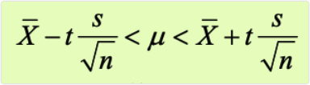

```{r setup, include=FALSE}
knitr::opts_chunk$set(prompt=TRUE,comment='',echo=TRUE,collapse=TRUE,message=FALSE,warning=FALSE)
```

# 12 重抽样与自助法

-   在第7章、第8章和第9章中，通过假定观测数据抽样自正态分布或者其他性质较好的理论分布，我们学习了假设检验和总体参数的置信区间估计等统计方法。但在许多实际情况中统计假设并不一定满足，比如数据抽样于未知或混合分布、样本量过小、存在离群点、基于理论分布设计合适的统计检验过于复杂且数学上难以处理等情况，这时基于随机化和重抽样的统计方法就可派上用场。

-   本章，我们将探究两种应用广泛的依据随机化思想的统计方法：置换检验和自助法。过去，这些方法只有娴熟的编程者和统计专家才有能力使用。而现在，R中有了对应该方法的软件包，更多受众也可以轻松将它们应用到数据分析中了。

-   我们将重温一些用传统方法(如检验、卡方检验、方差分析和回归)分析过的问题，看看如何用这些稳健的、计算机密集型的新方法来解决它们。为更好地理解12.2节，你最好首先回顾下第7章，而阅读12.3节则需要回顾第8章和第9章，本章其他各节可自由阅读。

## 12.1 置换检验

-   置换检验，也称随机化检验或重随机化检验，数十年前就已经被提出，但直到高速计算机的出现，该方法才有了真正的应用价值。

-   为理解置换检验的逻辑，考虑如下虚拟的问题。有两种处理条件的实验，十个受试者已经被随机分配到其中一种条件(A或B)中，相应的结果变量(score)也已经被记录。实验结果如表12-1所示。

| A处理 | B处理 |
|-------|-------|
| 40    | 57    |
| 57    | 64    |
| 45    | 55    |
| 55    | 62    |
| 58    | 65    |


-   图12-1以带状图形式展示了数据。此时，存在足够的证据说明两种处理方式的影响不同吗?

-   在参数方法中，你可能会假设数据抽样自等方差的正态分布，然后使用假设独立分组的双尾t检验来验证结果。此时，零假设为A处理的总体均值与B处理的总体均值相等，你根据数据计算了统计量，将其与理论分布进行比较，如果观测到的计量值十分极端，比如落在理论分布值的95%置信区间外，那么你将会拒绝零假设，断言在0.05的显著性水平下两组的总体均值不相等。

-   置换检验的思路与之不同。如果两种处理方式真的等价，那么分配给观测得分的标签(A处理或B处理)便是任意的。为检验两种处理方式的差异，我们可遵循如下步骤：

-   (1)与参数方法类似，计算观测数据的统计量，称为t0；

-   

    (2) 将10个得分放在一个组中；

-   

    (3) 随机分配五个得分到A处理中，并分配五个得分到B处理中；

-   

    (4) 计算并记录新观测的计量；

-   

    (5) 对每一种可能随机分配重复步骤(3)\~(4)，此处有252种可能的分配组合；

-   

    (6) 将252个统计量按升序排列，这便是基于(或以之为条件)样本数据的经验分布；

-   

    (7) 如果t0落在经验分布中间95%部分的外面，则在0.05的显著性水平下，拒绝两个处理组的总体均值相等的零假设。

-   注意，置换方法和参数方法都计算了相同的计量。但置换方法并不是将统计量与理论分布进行比较，而是将其与置换观测数据后获得的经验分布进行比较，根据统计量值的极端性判断是否有足够的理由拒绝零假设。这种逻辑可以延伸至大部分经典统计检验和线性模型上来。

-   在先前的例子中，经验分布依据的是数据所有可能的排列组合。此时的置换检验称作"精确"检验。随着样本量的增加，获取所有可能排列的时间开销会非常大。这种情况下，你可以使用蒙特卡洛模拟，从所有可能的排列中进行抽样，获得一个近似的检验。

-   假如你觉得假定数据成正态分布并不合适，或者担心离群点的影响，又或者感觉对于标准的参数方法来说数据集太小，那么置换检验便提供了一个非常不错的选择。

-   R目前有一些非常全面而复杂的软件包可以用来做置换检验。本节剩余部分将关注两个有用的包：coin和lmPerm包。coin包对于独立性问题提供了一个非常全面的置换检验的框架，而lmPerm包则专门用来做方差分析和回归分析的置换检验。我们将依次对其进行介绍，并在本节最后简述R中其他可用于置换检验的包。

-   设置随机数种子

-   在继续话题之前，请牢记：置换检验都是使用伪随机数来从所有可能的排列组合中进行抽样(当作近似检验时)。因此，每次检验的结果都有所不同。在R中设置随机数种子便可固定所生成的随机数。这样在你向别人分享自己的示例时，结果便可以重现。设定随机数种子为1234(即`set.seed(1234)`)，可以重现本章所有的结果。

## 12.2 用coin包做置换检验

-   对于独立性问题，coin包提供了一个进行置换检验的一般性框架。通过该包，你可以回答如下问题。

-   响应值与组的分配独立吗?

-   两个数值变量独立吗?

-   两个类别型变量独立吗?

-   使用包中提供的函数(见表12-2)，我们可以很便捷地进行置换检验，它们与第7章的大部分传统统计检验是等价的。


-   表12-2列出来的每个函数都是如下形式：

`function_name(formula, data, distribution=)`

-   其中：

-   formula描述的是要检验变量间的关系，示例可参见表12-2；

-   data是一个数据框；

-   distribution指定经验分布在零假设条件下的形式，可能值有exact、asymptotic和approximate。

-   若distribution="exact"，那么在零假设条件下，分布的计算是精确的(即依据所有可能的排列组合)。当然，也可以根据它的渐进分布(distribution="asymptotic")或蒙特卡洛重抽样(distribution="approxiamate(B=#)")来做近似计算，其中#指所需重复的次数。distribution="exact"当前仅可用于两样本问题。

-   **注意在coin包中，类别型变量和序数变量必须分别转化为因子和有序因子。另外，数据要以数据框形式存储。**

-   在本节余下部分，我们将把表12-2中的一些置换检验应用到在先前章节出现的问题中，这样你可以对传统的参数方法和非参数方法进行比较。本节最后，我们将通过一些高级拓展应用对coin包进行讨论。

### 12.2.1 独立两样本和K样本检验

-   首先，根据表12-2的虚拟数据，我们对独立样本检验和单因素精确检验进行比较。结果见代码清单12-1。

-   代码清单12-1 虚拟数据中的t检验与单因素置换检验

```{r}
library(coin)
score <- c(40, 57, 45, 55, 58, 57, 64, 55, 62, 65) 
treatment <- factor(c(rep("A",5), rep("B",5)))
mydata <- data.frame(treatment, score)
t.test(score~treatment, data=mydata, var.equal=TRUE)

oneway_test(score~treatment, data=mydata, distribution="exact")
```

-   传统检验表明存在显著性差异(p\<0.05)，而精确检验却表明差异并不显著(p\>0.072)。由于只有10个观测，我更倾向于相信置换检验的结果，在做出最后结论之前，还要多收集些数据。

-   现在来看Wilcoxon-Mann-Whitney U检验。第7章中，我们用`wilcox.test()`函数检验了美国南部监禁概率与非南部间的差异。现使用Wilcoxon秩和检验，可得：

```{r}
library(MASS)
UScrime <- transform(UScrime, So = factor(So))
wilcox_test(Prob ~ So, data=UScrime, distribution="exact")
```

-   结果表明监禁在南部可能更多。注意在上面的代码中，数值变量So被转化为因子，因为coin包规定所有的类别型变量都必须以因子形式编码。另外，聪明的读者可能会发现此处结果与第7章`wilcox.test()`计算结果一样，这是因为`wilcox.test()`默认计算的也是精确分布。

-   最后，探究K样本检验问题。在第9章，对于50个患者的样本，我们使用了单因素方差分析来评价五种药物疔法对降低胆固醇的效果。下面代码对其做了近似的K样本置换检验：

```{r}
library(multcomp)
set.seed(1234)
oneway_test(response~trt, data=cholesterol,distribution=approximate(B=9999))
```

-   此处，参考分布得自于数据9999次的置换。设定随机数种子可让结果重现。结果表明各组间病人的响应值显著不同。

### 12.2.2 列联表中的独立性

-   通过`chisg_test()`或`cmh_test()`函数，我们可用置换检验判断两类别型变量的独立性。当数据可根据第三个类别型变量进行分层时，需要使用后一个函数。若变量都是有序型，可使用`lbl_test()`函数来检验是否存在线性趋势。

-   第7章中，我们用卡方检验评价了关节炎的治疗(treatment)与效果(improvement)间的关系。治疗有两个水平(安慰剂、治疗)，效果有三个水平(无、部分、显著)，变量Improved以有序因子形式编码。

-   若想实施卡方检验的置换版本，可用如下代码：

```{r}
library(coin)
library(vcd)
Arthritis <- transform(Arthritis,Improved=as.factor(as.numeric(Improved))) 
set.seed(1234)
chisq_test(Treatment~Improved, data=Arthritis,distribution=approximate(B=9999))
```

-   此处经过9999次的置换，可获得一个近似的卡方检验。你可能会有疑问，为什么需要把变量Improved从一个有序因子变成一个分类因子?(好问题!)这是因为，如果你用有序因子，`coin()`将会生成一个线性与线性趋势检验，而不是卡方检验。虽然趋势检验在本例中是一个不错的选择，但是此处使用卡方检验可以同第7章所得的结果进行比较。

### 12.2.3 数值变量间的独立性

-   `spearman_test()`函数提供了两数值变量的独立性置换检验。第7章中，我们检验了美国文盲率与谋杀率间的相关性。如下代码可进行相关性的置换检验：

```{r}
states <- as.data.frame(state.x77)
set.seed(1234)
spearman_test(Illiteracy~Murder, data=states,distribution=approximate(B=9999))
```

-   基于9999次重复的近似置换检验可知：独立性假设并不被满足。注意，state.x77是一个矩阵，在coin包中，必须将其转化为一个数据框。

### 12.2.4 两样本和K样本相关性检验

-   当处于不同组的观测已经被分配得当，或者使用了重复测量时，样本相关检验便可派上用场。对于两配对组的置换检验，可使用`wilcoxsign_test()`函数；多于两组时，使用`friedman_test()`函数。

-   第7章中，我们比较了城市男性中14~24年龄段(U1)与35~39年龄段(U2)间的失业率差异。由于两个变量对于美国50个州都有记录，你便有了一个两依赖组设计(state是匹配变量)，可使用精确Wilcoxon符号秩检验来判断两个年龄段间的失业率是否相等：

```{r}
library(coin)
library(MASS)
wilcoxsign_test(U1~U2, data=UScrime, distribution="exact")
```

-   结果表明两者的失业率是不同的。

### 12.2.5 深入探究

-   coin包提供了一个置换检验的一般性框架，可以分析一组变量相对于其他任意变量，是否与第二组变量(可根据一个区组变量分层)相互独立。特别地，`independence_test()`函数可以让我们从置换角度来思考大部分传统检验，进而在面对无法用传统方法解决的问题时，使用户可以自己构建新的统计检验。当然，这种灵活性也是有门槛的：要正确使用该函数必须具备丰富的统计知识。更多函数细节请参阅包附带的文档(运行vignette("coin")即可)。

-   下一节，你将学习lmPerm包，它提供了线性模型的置换方法，包括回归和方差分析。

## 12.3 lmPerm包的置换检验

-   lmPerm包可做线性模型的置换检验。比如`lmp()`和`aovp()`函数即`lm()`和`aov()`函数的修改版，能够进行置换检验，而非正态理论检验。

-   `lmp()`和`aovp()`函数的参数与`lm()`和`aov()`函数类似，只额外添加了perm=参数。perm=选项的可选值有Exact、Prob或SPR。Exact根据所有可能的排列组合生成精确检验。Prob从所有可能的排列中不断抽样，直至估计的标准差在估计的p值0.1之下，判停准则由可选的Ca参数控制。SPR使用贯序概率比检验来判断何时停止抽样。注意，若观测数大于10， perm="Exact"将自动默认转为perm="Prob"，因为精确检验只适用于小样本问题。

-   为深人了解函数的工作原理，我们将对简单回归、多项式回归、多元回归、单因素方差分析、单因素协方差分析和双因素因子设计进行置换检验。

### 12.3.1 简单回归和多项式回归

-   第8章中，我们使用线性回归研究了15名女性的身高和体重间的关系。用`lmp()`代替`lm()`，可获得代码清单12-2中置换检验的结果。

-   代码清单12-2 简单线性回归的置换检验

```{r}
library (lmPerm)
set.seed (1234)
fit1 <- lmp(weight~height, data=women, perm="Prob")

summary(fit1)
```

-   要拟合二次方程，可使用代码清单12-3中的代码。

-   代码清单12-3 多项式回归的置换检验

```{r}
library(lmPerm)
set.seed (1234)
fit2 <- lmp (weight~height + I(height^2), data=women, perm="Prob")

summary(fit2)
```

-   可以看到，用置换检验来检验这些回归是非常容易的，修改一点代码即可。输出结果也与`lm()`函数非常相似。值得注意的是，增添的Iter栏列出了要达到判停准则所需的迭代次数。

### 12.3.2 多元回归

-   在第8章，多元回归被用来通过美国50个州的人口数、文盲率、收入水平和结霜天数预测犯罪率。将`lmp()`函数应用到此问题，结果参见代码清单12-4。

-   代码清单12-4 多元回归的置换检验

```{r}
library(lmPerm)
set.seed(1234)
states <- as.data.frame(state.x77)
fit3 <- lmp(Murder~Population + Illiteracy + Income + Frost, data=states, perm="Prob")

summary(fit3)
```

-   回顾第8章，正态理论中Population和Illiteracy均显著(p\<0.05)。而该置换检验中，Population不再显著。当两种方法所得结果不一致时，你需要更加谨慎地审视数据，这很可能是因为违反了正态性假设或者存在离群点。

### 12.3.3 单因素方差分析和协方差分析

-   第9章中任意一种方差分析设计都可进行置换检验。首先，让我们看看9.1节中的单因素方差分析问题：各种疗法对降低胆固醇的影响。代码和结果见代码清单12-5。

-   代码清单12-5 单因素方差分析的置换检验

```{r}
library(lmPerm)
library(multcomp)
set.seed(1234)
fit4 <- aovp(response~trt, data=cholesterol, perm="Prob")

anova(fit4)
```

-   结果表明各疗法的效果不全相同。

-   协方差分析的置换检验取自第9章的问题：当控制妊娠期时间相同时，观测四种药物剂量对鼠崽体重的影响。代码和结果参见代码清单12-6。

-   代码清单12-6 单因素协方差分析的置换检验

```{r}
library(lmPerm)
set.seed(1234)
fit5 <- aovp(weight ~ gesttime + dose, data=litter, perm="Prob")

anova(fit5)
```

-   依据p值可知，当控制妊娠期时间相同时，四种药物剂量对鼠崽的体重影响不相同。

### 12.3.4 双因素方差分析

-   本节最后，我们对析因实验设计进行置换检验。以第9章中的维生素C对豚鼠牙齿生长的影响为例，该实验两个可操作的因子是剂量(三水平)和喂食方式(两水平)。10只豚鼠分别被分配到每种处理组合中，形成一个3x2的析因实验设计。置换检验结果参见代码清单12-7。

-   代码清单12-7 双因素方差分析的置换检验

```{r}
library(lmPerm)
set.seed(1234)
fit6 <- aovp(len~supp*dose, data=ToothGrowth, perme="Prob")

anova(fit6)
```

-   在0.05的显著性水平下，三种效应都不等于0；在0.01的水平下，只有主效应显著。

-   值得注意的是，当将`aovp()`应用到方差分析设计中时，它默认使用唯一平方和法(也称为SAS类型皿平方和)。每种效应都会依据其他效应做相应调整。R中默认的参数化方差分析设计使用的是序贯平方和(SAS类型I平方和)。每种效应依据模型中先出现的效应做相应调整。对于平衡设计，两种方法结果相同，但是对于每个单元格观测数不同的不平衡设计，两种方法结果则不同。不平衡性越大，结果分歧越大。若在`aovp()`函数中设定seas=TRUE，可以生成你想要的序贯平方和。关于类型I和类型Ⅲ平方和的更多细节，请参考9.2节。

## 12.4 置换检验点评

-   除coin和lmPerm包外，R还提供了其他可做置换检验的包。perm包能实现coin包中的部分功能，因此可作为coin包所得结果的验证。corrperm包提供了有重复测量的相关性的置换检验。logregperm包提供了Logistic回归的置换检验。另外一个非常重要的包是glmperm，它涵盖了广义线性模型的置换检验。对于广义线性模型，请参见第13章。

-   依靠基础的抽样分布理论知识，置换检验提供了另外一个十分强大的可选检验思路。对于上面描述的每一种置换检验，我们完全可以在做统计假设检验时不理会正态分布、分布、F分布或者卡方分布。

-   你可能已经注意到，基于正态理论的检验与上面置换检验的结果非常接近。在这些问题中数据表现非常好，两种方法结果的一致性也验证了正态理论方法适用于上述示例。

-   当然，置换检验真正发挥功用的地方是处理非正态数据(如分布偏倚很大)、存在离群点、样本很小或无法做参数检验等情况。不过，如果初始样本对感兴趣的总体情况代表性很差，即使是置换检验也无法提高推断效果。

-   置换检验主要用于生成检验零假设的p值，它有助于回答"效应是否存在"这样的问题。不过，置换方法对于获取置信区间和估计测量精度是比较困难的。幸运的是，这正是自助法大显神通的地方。

## 12.5 自助法

-   所谓自助法，即从初始样本重复随机替换抽样，生成一个或一系列待检验统计量的经验分布。无需假设一个特定的理论分布，便可生成统计量的置信区间，并能检验统计假设。

-   举一个例子便可非常清楚地阐释自助法的思路。比如，你想计算一个样本均值95%的置信区间。样本现有10个观测，均值为40，标准差为5。如果假设均值的样本分布为正态分布，那么(1-a/2)%的置信区间计算如下：



-   其中，t是自由度为n-1的t分布的1-a上界值。对于95%的置信区间，可得40-2.262(5/3.163)\<μ\<40+2.262(5/3.162)或者36.424\<μ\<43.577。以这种方式创建的95%置信区间将会包含真实的总体均值。

-   倘若你假设均值的样本分布不是正态分布，该怎么办呢？可使用自助法。

-   (1)从样本中随机选择10个观测，抽样后再放回。有些观测可能会被选择多次，有些可能一直都不会被选中。

-   (2)计算并记录样本均值。

-   (3)重复1和2一千次。

-   (4)将1000个样本均值从小到大排序。

-   (5)找出样本均值2.5%和97.5%的分位点。此时即初始位置和最末位置的第25个数，它们就限定了95%的置信区间。

-   本例中，样本均值很可能服从正态分布，自助法优势不太明显。但在其他许多案例中，自助法优势会十分明显。比如，你想估计样本中位数的置信区间，或者两样本中位数之差，该怎么做呢？正态理论没有现成的简单公式可套用，而自助法此时却是不错的选择。即使潜在分布未知，或出现了离群点，或者样本量过小，再或者是没有可供选择的参数方法，自助法将是生成置信区间和做假设检验的一个利器。

## 12.6 boot包中的自助法

-   boot包扩展了自助法和重抽样的相关用途。你可以对一个统计量(如中位数)或一个统计量向量(如一列回归系数)使用自助法。

-   一般来说，自助法有三个主要步骤。

-   (1)写一个能返回待研究统计量值的函数。如果只有单个统计量(如中位数)，函数应该返回个数值；如果有一列统计量(如一列回归系数)，函数应该返回一个向量。

-   (2)为生成R中自助法所需的有效统计量重复数，使用`boot()`函数对上面所写的函数进行处理。

-   (3)使用`boot.ci()`函数获取步骤(2)生成的统计量的置信区间。

-   现在举例说明。

-   主要的自助法函数是`boot()`，它的格式为：

`bootobject <- boot(data=,statistic=,R=,...)`

-   参数描述见表12-3。


-   `boot()`函数调用统计量函数R次，每次都从整数1:nrow(data)中生成一列有放回的随机指标，这些指标被统计量函数用来选择样本。统计量将根据所选样本进行计算，结果存储在bootobject中。bootobject结构的描述见表12-4。


-   你可以`如bootobject$t0`和`bootobject$t`这样来获取这些元素。

-   一旦生成了自助样本，可通过`print()`和`plot()`来检查结果。如果结果看起来还算合理，使用`boot.ci()`函数获取统计量的置信区间。格式如下：

`boot.ci(bootobject, conf=, type=)`

-   参数见表12-5。


- type参数设定了获取置信区间的方法。perc方法(分位数)展示的是样本均值，bca将根据偏差对区间做简单调整。我发现bca在大部分情况中都是更可取的。参见Mooney & Duval(1993),他们对以上方法都有介绍。

- 本节接下来介绍如何对单个统计量和统计量向量使用自助法。

### 12.6.1 对单个统计量使用自助法

- 以1974年Motor Trend杂志中的mtcars数据集为例，它包含32辆汽车的信息。假设你正使用多元回归根据车重(1b/1000)和发动机排量(cu.in.，即立方英寸)来预测汽车每加仑行驶的英里数，除了标准的回归统计量，你还想获得95%的R平方值的置信区间(预测变量对响应变量可解释的方差比)，那么便可使用非参数的自助法来获取置信区间。

- 首要任务是写一个获取R平方值的函数：

```{r}
rsq <- function(formula, data, indices){
  d <- data[indices, ]
  fit <- lm(formula, data=d)
  return(summary(fit)$r.square)
  }
```

- 函数返回回归的R平方值。`d <- data[indices,]`必须声明，因为`boot()`要用其来选择样本。

- 你能做大量的自助抽样(比如1000)，代码如下：

```{r}
library(boot)
set.seed(1234)
results <- boot(data=mtcars, statistic=rsq,R=1000, formula=mpg~wt+disp)
# boot的对象可以输出
print(results)
```

- 也可用`plot(results)`来绘制结果，图形见图12-2。

```{r}
plot(results)
```

- 图12-2 自助法所得R平方值的均值

- 在图12-2中可以看到，自助的R平方值不呈正态分布。它的95%的置信区间可以通过如下代码获得：

```{r}
boot.ci(results, type=c("perc", "bca"))
```

- 从该例可以看到，生成置信区间的不同方法将会导致获得不同的区间。本例中的依偏差调整区间方法与分位数方法稍有不同。两例中，由于0都在置信区间外，零假设H0:R平方值=0都被拒绝。

- 本节中，我们估计了单个统计量的置信区间，下一节我们将估计多个统计量的置信区间。

### 12.6.2 多个统计量的自助法

- 在先前的例子中，自助法被用来估计单个统计量(R平方)的置信区间。继续该例，让我们获取一个统计量向量三个回归系数(截距项、车重和发动机排量)95%的置信区间。首先，创建一个返回回归系数向量的函数：

```{r}
bs <- function(formula, data, indices){
  d <- data[indices, ]
  fit <- lm(formula, data=d)
  return(coef(fit))
  }
# 然后使用该函数自助抽样1000次
library(boot)
set.seed(1234)
results <- boot(data=mtcars, statistic=bs,R=1000, formula=mpg~wt+disp)
print(results)
```

- 当对多个统计量自助抽样时，添加一个索引参数，指明`plot()`和`boot.ci()`函数所分析`bootobject$t`的列。在本例中，索引1指截距项，索引2指车重，索引3指发动机排量。如下代码即用于绘制车重结果：

```{r}
plot(results, index=2)
```

- 图12-3 自助法所得车重回归系数的分布

- 图形结果见图12-3。

- 为获得车重和发动机排量95％的置信区间，使用代码：

```{r}
boot.ci(results, type="bca", index=2)

boot.ci(results, type="bca", index=3)
```

- **注意：在先前的例子中，我们每次都对整个样本数据进行重抽样。如果假定预测变量有固定水平（如精心设计的实验），那么我们最好仅对残差项进行重抽样。参考Mooney&Duval(1993,pp.16-17)，其中有简单的解释和算法。**

- 在结束自助法介绍前，我们来关注两个常被提出的有价值的问题。

- 初始样本需要多大？
- 应该重复多少次？

- 对于第一个问题，我们无法给出简单的回答。有些人认为只要样本能够较好地代表总体，初始样本大小为20~30即可得到足够好的结果。从感兴趣的总体中随机抽样的方法可信度最高，它能够保证初始样本的代表性。对于第二个问题，我发现1000次重复在大部分情况下都可满足要求。由于计算机资源变得廉价，如果你愿意，也可以增加重复的次数。