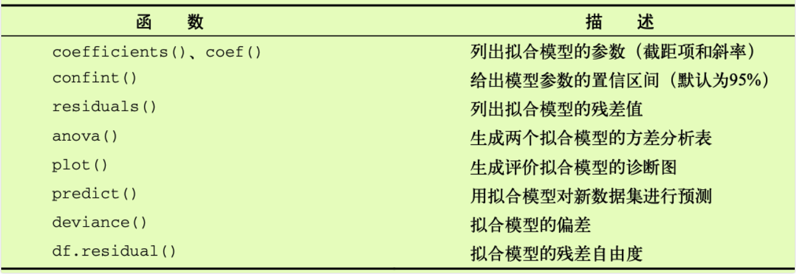
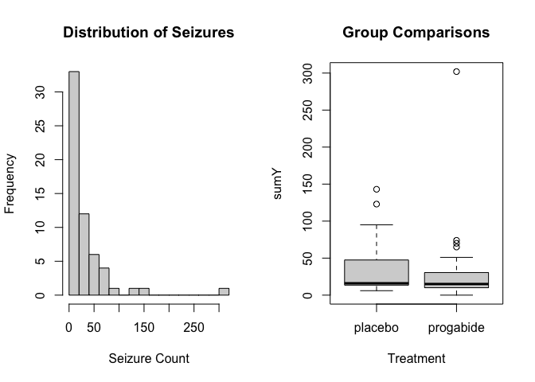
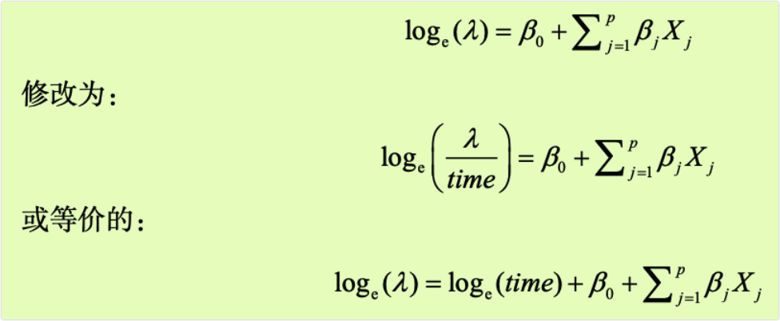

chapter13_广义线性模型
================

- <a href="#13-广义线性模型" id="toc-13-广义线性模型">13 广义线性模型</a>
  - <a href="#131-广义线性模型和glm函数"
    id="toc-131-广义线性模型和glm函数">13.1
    广义线性模型和<code>glm()</code>函数</a>
    - <a href="#1311-glm函数" id="toc-1311-glm函数">13.1.1
      <code>glm()</code>函数</a>
    - <a href="#1312-连用的函数" id="toc-1312-连用的函数">13.1.2
      连用的函数</a>
    - <a href="#1313-模型拟合和回归诊断"
      id="toc-1313-模型拟合和回归诊断">13.1.3 模型拟合和回归诊断</a>
  - <a href="#132-logistic回归" id="toc-132-logistic回归">13.2
    Logistic回归</a>
    - <a href="#1321-解释模型参数" id="toc-1321-解释模型参数">13.2.1
      解释模型参数</a>
    - <a href="#1322-评价预测变量对结果概率的影响"
      id="toc-1322-评价预测变量对结果概率的影响">13.2.2
      评价预测变量对结果概率的影响</a>
    - <a href="#1323-过度离势" id="toc-1323-过度离势">13.2.3 过度离势</a>
    - <a href="#1324-扩展" id="toc-1324-扩展">13.2.4 扩展</a>
  - <a href="#133-泊松回归" id="toc-133-泊松回归">13.3 泊松回归</a>
    - <a href="#1331-解释模型参数" id="toc-1331-解释模型参数">13.3.1
      解释模型参数</a>
    - <a href="#1332-过度离势" id="toc-1332-过度离势">13.3.2 过度离势</a>
    - <a href="#1333-扩展" id="toc-1333-扩展">13.3.3 扩展</a>

# 13 广义线性模型

- 第8章（回归）和第9章（方差分析）中，我们探究了线性模型，它们可以通过一系列连续型和/或类别型预测变量来预测正态分布的响应变量。但在许多情况下，假设因变量为正态分布（甚至连续型变量）并不合理，例如下面这几种情况。

- 结果变量可能是类别型的。二值变量（比如：是否、通过/未通过、活着死亡）和多分类变量（比如差/良好优秀）都显然不是正态分布。

- 结果变量可能是计数型的（比如，一周交通事故的数目，每日酒水消耗的数量）。这类变量都是非负的有限值，而且它们的均值和方差通常都是相关的（正态分布变量间不是如此，而是相互独立）。

- 广义线性模型扩展了线性模型的框架，它包含了非正态因变量的分析。

- 在本章中，我们将首先简要概述广义线性模型，并介绍如何使用`glm()`函数来进行估计。然后重点关注该框架中两种流行的模型：Logistic回归（因变量为类别型）和泊松回归（因变量为计数型）。

- 为了让讨论更有吸引力，我们将把广义线性模型应用到两个用标准线性模型无法轻易解决的问题上。

- 什么样的个人信息、人口统计信息和人际关系信息可以作为变量，用来预测婚姻出轨问题？此时，结果变量为二值型（出轨未出轨）。

- 药物治疗对于八周中所发生的癫痫次数有何影响？此时，结果变量为计数型（癫痫次数）。我们将利用Logistic回归来阐释第一个问题，用泊松回归阐释第二个问题。建模过程中，将还考虑对每种方法进行扩展。

## 13.1 广义线性模型和`glm()`函数


### 13.1.1 `glm()`函数

- R中可通过`glm()`函数（还可用其他专门的函数）拟合广义线性模型。它的形式与`lm()`类似，只是多了一些参数。函数的基本形式为：

`glm(formula,family=family(link=function),data=)`

- 表13-1列出了概率分布(family)和相应默认的连接函数(function)。


- `glm()`函数可以拟合许多流行的模型，比如Logisticl回归、泊松回归和生存分析（此处不考虑）。

- 下面对前两个模型进行阐述。假设你有一个响应变量(Y)、三个预测变量（X1、X2、X3)和一个包含数据的数据框(mydata)。

- Logistic回归适用于二值响应变量(0和1)。模型假设Y服从二项分布，线性模型的拟合形式为：


- 其中π=μy是Y的条件均值（即给定一系列X的值时Y=1的概率），（π/1-π）为Y=1时的优势比，log(π/1-π)为对数优势比，或logit。本例中，log(π/1-π)为连接函数，概率分布为二项分布，可用如下代码拟合Logisticl回归模型：

`glm(Y~X1+X2+X3,family=binomial(link="logit"),data=mydata)`

- Logisticl回归在13.2节有更详细的介绍。

- 泊松回归适用于在给定时间内响应变量为事件发生数目的情形。它假设服从泊松分布，线性模型的拟合形式为：


- 其中λ是Y的均值（也等于方差）。此时，连接函数为`log(λ)`，概率分布为泊松分布，可用如下代码拟合泊松回归模型：

`glm(Y~X1+X2+X3,family=poisson(link="log"),data=mydata)`

- 泊松回归在13.3节有介绍。

- 值得注意的是，标准线性模型也是广义线性模型的一个特例。如果令连接函数g(μY)=μY或恒等函数，并设定概率分布为正态（高斯）分布，那么：

`glm(Y~X1+X2+X3,family=gaussian(link="identity"),data=mydata)`

- 生成的结果与下列代码的结果相同：

`lm(Y~X1+X2+X3,data=mydata)`

- 总之，广义线性模型通过拟合响应变量的条件均值的一个函数（不是响应变量的条件均值），假设响应变量服从指数分布族中的某个分布（并不仅限于正态分布），极大地扩展了标准线性模型。模型参数估计的推导依据的是极大似然估计，而非最小二乘法。

### 13.1.2 连用的函数

- 与分析标准线性模型时`lm()`连用的许多函数在`glm()`中都有对应的形式，其中一些常见的函数见表13-2。




- 我们将在后面章节讲解这些函数的示例。在下一节中，我们将简要介绍模型适用性的评价。

### 13.1.3 模型拟合和回归诊断

- 与标准（OLS）线性模型一样，模型适用性的评价对于广义线性模型也非常重要。但遗憾的是，对于标准的评价过程，统计圈子仍莫衷一是。一般来说，你可以使用第8章中描述的方法，但要牢记以下建议。

- 当评价模型的适用性时，你可以绘制初始响应变量的预测值与残差的图形。例如，如下代码可绘制一个常见的诊断图：

<!-- -->

    plot(predict(model,type="response"), residuals(model,type="deviance"))

- 其中，model为`glm()`函数返回的对象。

- R将列出帽子值（hat
  value）人学生化残差值和Cook距离统计量的近似值。不过，对于识别异常点的阈值，现在并没统一答案，它们都是通过相互比较来进行判断。其中一个方法就是绘制各统计量的参考图，然后找出异常大的值。例如，如下代码可创建三幅诊断图：

<!-- -->

    plot(hatvalues(model)) 
    plot(rstudent(model)) 
    plot(cooks.distance(model))

- 你还可以用其他方法，代码如下：

<!-- -->

    library(car) 
    influenceplot(model)

- 它可以创建一个综合性的诊断图。在后面的图形中，横轴代表杠杆值，纵轴代表学生化残差值，而绘制的符号大小与Cook距离大小成正比。

- 当响应变量有许多值时，诊断图非常有用；而当响应变量只有有限个值时（比如Logistic回归），诊断图的功效就会降低很多。

- 若想更深入了解广义线性模型的回归诊断，可参考Fox(2008)和Faraway(2006)。本章后面几节将详细介绍两个最流行的广义线性模型：Logistic回归和泊松回归。

## 13.2 Logistic回归

- 当通过一系列连续型和/或类别型预测变量来预测二值型结果变量时，Logistic回归是一个非常有用的工具。以AER包中的数据框Affairs为例，我们将通过探究婚外情的数据来阐述Logistic回归的过程。首次使用该数据前，请确保已下载和安装了此软件包（使用install.packages(“AER”)）。

- 婚外情数据即著名的”Fair’s
  Affairs”，取自于1969年《今日心理》(Psychology
  Today)所做的一个非常有代表性的调查。该数据从601个参与者身上收集了9个变量，包括一年来婚外私通的频率以及参与者性别、年龄、婚龄、是否有小孩、宗教信仰程度（5分制，1分表示反对，5分表示非常信仰）、学历、职业（逆向编号的戈登7种分类），还有对婚姻的自我评分（5分制，1表示非常不幸福，5表示非常幸福）。

- 我们先看一些描述性的统计信息：

``` r
> library(AER)
> data(Affairs) 
> summary(Affairs)
    affairs          gender         age         yearsmarried    children 
 Min.   : 0.000   female:315   Min.   :17.50   Min.   : 0.125   no :171  
 1st Qu.: 0.000   male  :286   1st Qu.:27.00   1st Qu.: 4.000   yes:430  
 Median : 0.000                Median :32.00   Median : 7.000            
 Mean   : 1.456                Mean   :32.49   Mean   : 8.178            
 3rd Qu.: 0.000                3rd Qu.:37.00   3rd Qu.:15.000            
 Max.   :12.000                Max.   :57.00   Max.   :15.000            
 religiousness     education       occupation        rating     
 Min.   :1.000   Min.   : 9.00   Min.   :1.000   Min.   :1.000  
 1st Qu.:2.000   1st Qu.:14.00   1st Qu.:3.000   1st Qu.:3.000  
 Median :3.000   Median :16.00   Median :5.000   Median :4.000  
 Mean   :3.116   Mean   :16.17   Mean   :4.195   Mean   :3.932  
 3rd Qu.:4.000   3rd Qu.:18.00   3rd Qu.:6.000   3rd Qu.:5.000  
 Max.   :5.000   Max.   :20.00   Max.   :7.000   Max.   :5.000  
> table(Affairs$affairs)

  0   1   2   3   7  12 
451  34  17  19  42  38 
```

- 从这些统计信息可以看到，52%的调查对象是女性，72%的人有孩子，样本年龄的中位数为32岁。对于响应变量，72%的调查对象表示过去一年中没有婚外情（451/601），而婚外偷腥的最多次数为12（占了6%）。

- 虽然这些婚姻的轻率举动次数被记录下来，但此处我们感兴趣的是二值型结果（有过一次婚外情/没有过婚外情）。按照如下代码，你可将affairs转化为二值型因子ynaffair。

``` r
> Affairs$ynaffair[Affairs$affairs > 0] <- 1
> Affairs$ynaffair[Affairs$affairs ==0] <- 0
> Affairs$ynaffair <- factor(Affairs$ynaffair,levels=c(0,1),labels=c("No","Yes"))
> table(Affairs$ynaffair)

 No Yes 
451 150 
```

- 该二值型因子现可作为Logistic回归的结果变量：

``` r
> fit.full <- glm(ynaffair ~ gender + age + yearsmarried + children + religiousness + 
+                   education + occupation + rating, data=Affairs,family=binomial())
> summary(fit.full)

Call:
glm(formula = ynaffair ~ gender + age + yearsmarried + children + 
    religiousness + education + occupation + rating, family = binomial(), 
    data = Affairs)

Deviance Residuals: 
    Min       1Q   Median       3Q      Max  
-1.5713  -0.7499  -0.5690  -0.2539   2.5191  

Coefficients:
              Estimate Std. Error z value Pr(>|z|)    
(Intercept)    1.37726    0.88776   1.551 0.120807    
gendermale     0.28029    0.23909   1.172 0.241083    
age           -0.04426    0.01825  -2.425 0.015301 *  
yearsmarried   0.09477    0.03221   2.942 0.003262 ** 
childrenyes    0.39767    0.29151   1.364 0.172508    
religiousness -0.32472    0.08975  -3.618 0.000297 ***
education      0.02105    0.05051   0.417 0.676851    
occupation     0.03092    0.07178   0.431 0.666630    
rating        -0.46845    0.09091  -5.153 2.56e-07 ***
---
Signif. codes:  0 '***' 0.001 '**' 0.01 '*' 0.05 '.' 0.1 ' ' 1

(Dispersion parameter for binomial family taken to be 1)

    Null deviance: 675.38  on 600  degrees of freedom
Residual deviance: 609.51  on 592  degrees of freedom
AIC: 627.51

Number of Fisher Scoring iterations: 4
```

- 从回归系数的值（最后一栏）可以看到，性别、是否有孩子、学历和职业对方程的贡献都不显著（你无法拒绝参数为0的假设）。去除这些变量重新拟合模型，检验新模型是否拟合得好：

``` r
> fit.reduced <- glm(ynaffair ~ age + yearsmarried + religiousness + rating,data=Affairs,family=binomial())
> summary(fit.reduced)

Call:
glm(formula = ynaffair ~ age + yearsmarried + religiousness + 
    rating, family = binomial(), data = Affairs)

Deviance Residuals: 
    Min       1Q   Median       3Q      Max  
-1.6278  -0.7550  -0.5701  -0.2624   2.3998  

Coefficients:
              Estimate Std. Error z value Pr(>|z|)    
(Intercept)    1.93083    0.61032   3.164 0.001558 ** 
age           -0.03527    0.01736  -2.032 0.042127 *  
yearsmarried   0.10062    0.02921   3.445 0.000571 ***
religiousness -0.32902    0.08945  -3.678 0.000235 ***
rating        -0.46136    0.08884  -5.193 2.06e-07 ***
---
Signif. codes:  0 '***' 0.001 '**' 0.01 '*' 0.05 '.' 0.1 ' ' 1

(Dispersion parameter for binomial family taken to be 1)

    Null deviance: 675.38  on 600  degrees of freedom
Residual deviance: 615.36  on 596  degrees of freedom
AIC: 625.36

Number of Fisher Scoring iterations: 4
```

- 新模型的每个回归系数都非常显著（p\<0.05）。由于两模型嵌套(fit.reduced是fit.full的一个子集)，你可以使用`anova()`函数对它们进行比较，对于广义线性回归，可用卡方检验。

``` r
> anova(fit.reduced,fit.full,test="Chisq")
Analysis of Deviance Table

Model 1: ynaffair ~ age + yearsmarried + religiousness + rating
Model 2: ynaffair ~ gender + age + yearsmarried + children + religiousness + 
    education + occupation + rating
  Resid. Df Resid. Dev Df Deviance Pr(>Chi)
1       596     615.36                     
2       592     609.51  4   5.8474   0.2108
```

- 结果的卡方值不显著（p=0.21），表明四个预测变量的新模型与九个完整预测变量的模型拟合程度一样好。这使得你更加坚信添加性别、孩子、学历和职业变量不会显著提高方程的预测精度，因此可以依据更简单的模型进行解释。

### 13.2.1 解释模型参数

- 先看看回归系数：

``` r
> coef(fit.reduced)
  (Intercept)           age  yearsmarried religiousness        rating 
   1.93083017   -0.03527112    0.10062274   -0.32902386   -0.46136144 
```

- 在Logistic回归中，响应变量是Y=1的对数优势比(log)。回归系数的含义是当其他预测变量不变时，一单位预测变量的变化可引起的响应变量对数优势比的变化。

- 由于对数优势比解释性差，你可对结果进行指数化：

``` r
> exp(coef(fit.reduced))
  (Intercept)           age  yearsmarried religiousness        rating 
    6.8952321     0.9653437     1.1058594     0.7196258     0.6304248 
```

- 可以看到婚龄增加一年，婚外情的优势比将乘以1.106（保持年龄、宗教信仰和婚姻评定不变）：相反，年龄增加一岁，婚外情的的优势比则乘以0.965。因此，随着婚龄的增加和年龄、宗教信仰与婚姻评分的降低，婚外情优势比将上升。因为预测变量不能等于0，截距项在此处没有什么特定含义。

- 如果有需要，你还可使用`confint()`函数获取系数的置信区间。例如，`exp(confint(fit.reduced))`可在优势比尺度上得到系数95%的置信区间。

- 最后，预测变量一单位的变化可能并不是我们最想关注的。对于二值型Logisticl回归，某预测变量n单位的变化引起的较高值上优势比的变化为exp(βj)<sup>n，它反映的信息可能更为重要。比如，保持其他预测变量不变，婚龄增加一年，婚外情的优势比将乘以1.106，而如果婚龄增加10年，优势比将乘以1.106</sup>10，即2.7。

### 13.2.2 评价预测变量对结果概率的影响

- 对于我们大多数人来说，以概率的方式思考比使用优势比更直观。使用`predict()`函数，可以观察某个预测变量在各个水平时对结果概率的影响。首先创建一个包含你感兴趣预测变量值的虚拟数据集，然后对该数据集使用`predict()`函数，以预测这些值的结果概率。

- 现在我们使用该方法评价婚姻评分对婚外情概率的影响。首先，创建一个虚拟数据集，设定年龄、婚龄和宗教信仰为它们的均值，婚姻评分的范围为1\~5。

``` r
> testdata <- data.frame(rating=c(1,2,3,4,5),age=mean(Affairs$age),
+                        yearsmarried=mean (Affairs$yearsmarried),religiousness=mean(Affairs$religiousness))
> testdata
  rating      age yearsmarried religiousness
1      1 32.48752     8.177696      3.116473
2      2 32.48752     8.177696      3.116473
3      3 32.48752     8.177696      3.116473
4      4 32.48752     8.177696      3.116473
5      5 32.48752     8.177696      3.116473
```

- 接下来，使用测试数据集预测相应的概率：

``` r
> testdata$prob <- predict(fit.reduced,newdata=testdata,type="response") 
> testdata
  rating      age yearsmarried religiousness      prob
1      1 32.48752     8.177696      3.116473 0.5302296
2      2 32.48752     8.177696      3.116473 0.4157377
3      3 32.48752     8.177696      3.116473 0.3096712
4      4 32.48752     8.177696      3.116473 0.2204547
5      5 32.48752     8.177696      3.116473 0.1513079
```

- 从这些结果可以看到，当婚姻评分从1（很不幸福）变为5（非常幸福）时，婚外情概率从0.53降低到了0.15（假定年龄、婚龄和宗教信仰不变）。下面我们再看看年龄的影响：

``` r
> testdata <- data.frame(rating=mean(Affairs$rating),
+                        age=seq(17,57,10),yearsmarried=mean(Affairs$yearsmarried),
+                        religiousness=mean(Affairs$religiousness))
> testdata
   rating age yearsmarried religiousness
1 3.93178  17     8.177696      3.116473
2 3.93178  27     8.177696      3.116473
3 3.93178  37     8.177696      3.116473
4 3.93178  47     8.177696      3.116473
5 3.93178  57     8.177696      3.116473
> 
> testdata$prob <- predict(fit.reduced,newdata=testdata,type="response") 
> testdata
   rating age yearsmarried religiousness      prob
1 3.93178  17     8.177696      3.116473 0.3350834
2 3.93178  27     8.177696      3.116473 0.2615373
3 3.93178  37     8.177696      3.116473 0.1992953
4 3.93178  47     8.177696      3.116473 0.1488796
5 3.93178  57     8.177696      3.116473 0.1094738
```

- 此处可以看到，当其他变量不变，年龄从17增加到57时，婚外情的概率将从0.34降低到0.11。利用该方法，你可探究每一个预测变量对结果概率的影响。

### 13.2.3 过度离势

- 抽样于二项分布的数据的期望方差是σ^2=nπ(1-π)，n为观测数，π为属于Y=1组的概率。所谓过度离势，即观测到的响应变量的方差大于期望的二项分布的方差。过度离势会导致奇异的标准误检验和不精确的显著性检验。

- 当出现过度离势时，仍可使用`glm()`函数拟合Logistic回归，但此时需要将二项分布改为类二项分布（quasibinomial
  distribution）。

- 检测过度离势的一种方法是比较二项分布模型的残差偏差与残差自由度，如果比值：φ=(残差偏差/残差自由度)，比1大很多，你便可认为存在过度离势。回到婚外情的例子，可得：

``` r
> deviance(fit.reduced)/df.residual(fit.reduced)
[1] 1.03248
```

- 它非常接近于1，表明没有过度离势。

- 你还可以对过度离势进行检验。为此，你需要拟合模型两次，第一次使用family=“binomial”，第二次使用family=“quasibinomial”。假设第一次`glm()`返回对象记为fit，第二次返回对象记为fit.od，那么：

<!-- -->

    pchisq(summary(fit.od)$dispersion * fitsdf.residual, fit$df.residual,lower = F)

- 提供的p值即可对零假设H0:φ=1与备择假设H1:φ≠1进行检验。若p很小（小于0.05），你便可拒绝零假设。

- 将其应用到婚外情数据集，可得：

``` r
> fit <- glm(ynaffair ~ age + yearsmarried + religiousness + rating,family = binomial(),data = Affairs)
> fit.od <- glm(ynaffair ~ age + yearsmarried + religiousness + rating,
+               family = quasibinomial(),data = Affairs)
> pchisq(summary(fit.od)$dispersion * fit$df.residual,fit$df.residual,lower = F)
[1] 0.340122
```

- 此处值（0.34）显然不显著（p\>0.05），这更增强了我们认为不存在过度离势的信心。下节介绍泊松回归时，我们仍将对过度离势问题进行讨论。

### 13.2.4 扩展

- R中扩展的Logistic回归和变种如下所示。

- **稳健Logistic回归**
  robust包中的`glmRob()`函数可用来拟合稳健的广义线性模型，包括稳健Logistic回归。当拟合Logistic回归模型数据出现离群点和强影响点时，稳健Logistic回归便可派上用场。

- **多项分布回归**
  若响应变量包含两个以上的无序类别（比如，已婚/寡居/离婚），便可使用mlogit包中的`mlogit()`函数拟合多项Logistic回归。

- **序数Logistic回归**
  若响应变量是一组有序的类别（比如，信用风险为差/良/好），便可使用rms包中的`lrm()`函数拟合序数Logistic回归。

- 可对多类别的响应变量（无论是否有序）进行建模是非常重要的扩展，但它也面临着解释性更复杂的困难。同时，在这种情况下评价模型拟合优度和回归诊断也变得更为复杂。

- 在婚外情的例子中，婚外偷腥的次数被二值化为一个”是/否”的响应变量，这是因为我们最感兴趣的是在过去一年中调查对象是否有过一次婚外情。如果兴趣转移到量上（过去一年中婚外情的次数），便可直接对计数型数据进行分析。分析计数型数据的一种流行方法是泊松回归，这便是我们接下来的话题。

## 13.3 泊松回归

- 当通过一系列连续型和/或类别型预测变量来预测计数型结果变量时，泊松回归是一个非常有用的工具。为阐述泊松回归模型的拟合过程，并探讨一些可能出现的问题，我们将使用ro6ust包中的Breslow癫痫数据(Breslow,I993)。特别地，我们将讨论在治疗初期的八周内，抗癫痫药物对癫痫发病数的影响。继续下文前，请确定已安装robust包。

- 我们就遭受轻微或严重间歇性癫痫的病人的年龄和癫痫发病数收集了数据，包含病人被随机分配到药物组或者安慰剂组前八周和随机分配后八周两种情况。响应变量为sumY（随机化后八周内癫痫发病数），预测变量为治疗条件（Trt）、年龄（Age）和前八周内的基础癫痫发病数（Base）。之所以包含基础癫痫发病数和年龄，是因为它们对响应变量有潜在影响。在解释这些协变量后，我们感兴趣的是药物治疗是否能减少癫痫发病数。

- 首先，看看数据集的统计汇总信息：

``` r
> data(breslow.dat,package="robust") 
> names(breslow.dat)
 [1] "ID"    "Y1"    "Y2"    "Y3"    "Y4"    "Base"  "Age"   "Trt"   "Ysum" 
[10] "sumY"  "Age10" "Base4"
> 
> summary(breslow.dat[c(6,7,8,10)])
      Base             Age               Trt          sumY       
 Min.   :  6.00   Min.   :18.00   placebo  :28   Min.   :  0.00  
 1st Qu.: 12.00   1st Qu.:23.00   progabide:31   1st Qu.: 11.50  
 Median : 22.00   Median :28.00                  Median : 16.00  
 Mean   : 31.22   Mean   :28.34                  Mean   : 33.05  
 3rd Qu.: 41.00   3rd Qu.:32.00                  3rd Qu.: 36.00  
 Max.   :151.00   Max.   :42.00                  Max.   :302.00  
```

- 注意，虽然数据集有12个变量，但是我们只关注之前描述的四个变量。基础和随机化后的癫痫发病数都有很高的偏度。现在，我们更详细地考察响应变量。如下代码可生成的图形如图13-1所示。

``` r
> opar <- par(no.readonly=TRUE) 
> par(mfrow=c(1,2)) 
> attach(breslow.dat)
> hist(sumY,breaks=20,xlab="Seizure Count",main="Distribution of Seizures")
> boxplot(sumY ~ Trt,xlab="Treatment",main="Group Comparisons") 
```

<!-- -->

``` r
> par(opar)
```

- 图13-1 随机化后的癫痫发病数的分布情况（来源：Breslow癫痫数据）

- 从图13-1中可以清楚地看到因变量的偏倚特性以及可能的离群点。初看图形时，药物治疗下癫痫发病数似乎变小了，且方差也变小了（泊松分布中，较小的方差伴随着较小的均值）。与标准最小二乘回归不同，泊松回归并不关注方差异质性。

- 接下来拟合泊松回归：

``` r
> fit1 <-glm(sumY ~ Base + Age + Trt,data=breslow.dat,family=poisson()) 
> summary(fit1)

Call:
glm(formula = sumY ~ Base + Age + Trt, family = poisson(), data = breslow.dat)

Deviance Residuals: 
    Min       1Q   Median       3Q      Max  
-6.0569  -2.0433  -0.9397   0.7929  11.0061  

Coefficients:
               Estimate Std. Error z value Pr(>|z|)    
(Intercept)   1.9488259  0.1356191  14.370  < 2e-16 ***
Base          0.0226517  0.0005093  44.476  < 2e-16 ***
Age           0.0227401  0.0040240   5.651 1.59e-08 ***
Trtprogabide -0.1527009  0.0478051  -3.194   0.0014 ** 
---
Signif. codes:  0 '***' 0.001 '**' 0.01 '*' 0.05 '.' 0.1 ' ' 1

(Dispersion parameter for poisson family taken to be 1)

    Null deviance: 2122.73  on 58  degrees of freedom
Residual deviance:  559.44  on 55  degrees of freedom
AIC: 850.71

Number of Fisher Scoring iterations: 5
```

- 输出结果列出了偏差、回归参数、标准误和参数为0的检验。注意，此处预测变量在p\<0.05的水平下都非常显著。

### 13.3.1 解释模型参数

- 使用`coef()`函数可获取模型系数，或者调用`summary()`函数的输出结果中的Coefficients表格：

``` r
> coef(fit1)
 (Intercept)         Base          Age Trtprogabide 
  1.94882593   0.02265174   0.02274013  -0.15270095 
```

- 在泊松回归中，因变量以条件均值的对数形式loge(λ)来建模。年龄的回归参数为0.0227，表明保持其他预测变量不变，年龄增加一岁，癫痫发病数的对数均值将相应增加0.03。截距项即当预测变量都为0时，癫痫发病数的对数均值。由于不可能为0岁，且调查对象的基础癫痫发病数均不为0，因此本例中截距项没有意义。

- 通常在因变量的初始尺度（癫痫发病数，而非发病数的对数）上解释回归系数比较容易。为此，指数化系数：

``` r
> exp(coef(fit1))
 (Intercept)         Base          Age Trtprogabide 
   7.0204403    1.0229102    1.0230007    0.8583864 
```

- 现在可以看到，保持其他变量不变，年龄增加一岁，期望的癫痫发病数将乘以1.023。这意味着年龄的增加与较高的癫痫发病数相关联。更为重要的是，一单位Trt的变化（即从安慰剂到治疗组），期望的癫痫发病数将乘以0.86，也就是说，保持基础癫痫发病数和年龄不变，服药组相对于安慰剂组癫痫发病数降低了20%。

- 另外需要牢记的是，与Logistic回归中的指数化参数相似，泊松模型中的指数化参数对响应变量的影响都是成倍增加的，而不是线性相加。同样，你还需要评价泊松模型的过度离势。

### 13.3.2 过度离势

- 泊松分布的方差和均值相等。当响应变量观测的方差比依据泊松分布预测的方差大时，泊松回归可能发生过度离势。处理计数型数据时经常发生过度离势，且过度离势会对结果的可解释性造成负面影响，因此我们需要花些时间讨论该问题。

- 可能发生过度离势的原因有如下几个（Coxe et al.,2009）。

- 遗漏了某个重要的预测变量。

- 可能因为事件相关。在泊松分布的观测中，计数中每次事件都被认为是独立发生的。以癫痫数据为例，这意味着对于任何病人，每次癫痫发病的概率与其他癫痫发病的概率相互独立。但是这个假设通常都无法满足。对于某个病人，在已知他已经发生了39次癫痫时，第一次发生癫痫的概率不可能与第40次发生癫痫的概率相同。

- 在纵向数据分析中，重复测量的数据由于内在群聚特性可导致过度离势。此处并不讨论纵向泊松模型。

- 如果存在过度离势，在模型中你无法进行解释，那么可能会得到很小的标准误和置信区间，并且显著性检验也过于宽松（也就是说，你将会发现并不真实存在的效应）。

- 与Logisticl回归类似，此处如果残差偏差与残差自由度的比例远远大于1，那么表明存在过度离势。对于癫痫数据，它的比例为：

``` r
> deviance(fit1)/df.residual(fit1)
[1] 10.1717
```

- 很显然，比例远远大于1。

- qcc包提供了一个对泊松模型过度离势的检验方法。（在首次使用前，请确保已经下载和安装此包。）如下代码可进行癫痫数据过度离势的检验：

``` r
> library(qcc)
> qcc.overdispersion.test(breslow.dat$sumY,type="poisson")
                   
Overdispersion test Obs.Var/Theor.Var Statistic p-value
       poisson data          62.87013  3646.468       0
```

- 意料之中，显著性检验的值果然小于0.05，进一步表明确实存在过度离势。

- 通过用`family:="quasipoisson"`替换`family="poisson"`，你仍然可以使用`glm()`函数对该数据进行拟合。这与Logisticl回归处理过度离势的方法是相同的。

``` r
> fit.od <- glm(sumY ~ Base + Age + Trt,data=breslow.dat,family=quasipoisson())
> summary(fit.od)

Call:
glm(formula = sumY ~ Base + Age + Trt, family = quasipoisson(), 
    data = breslow.dat)

Deviance Residuals: 
    Min       1Q   Median       3Q      Max  
-6.0569  -2.0433  -0.9397   0.7929  11.0061  

Coefficients:
              Estimate Std. Error t value Pr(>|t|)    
(Intercept)   1.948826   0.465091   4.190 0.000102 ***
Base          0.022652   0.001747  12.969  < 2e-16 ***
Age           0.022740   0.013800   1.648 0.105085    
Trtprogabide -0.152701   0.163943  -0.931 0.355702    
---
Signif. codes:  0 '***' 0.001 '**' 0.01 '*' 0.05 '.' 0.1 ' ' 1

(Dispersion parameter for quasipoisson family taken to be 11.76075)

    Null deviance: 2122.73  on 58  degrees of freedom
Residual deviance:  559.44  on 55  degrees of freedom
AIC: NA

Number of Fisher Scoring iterations: 5
```

- 注意，使用类泊松（quasi–Poisson）方法所得的参数估计与泊松方法相同，但标准误变大了许多。此处，标准误越大将会导致Trt（和Age）的p值越大于0.05。当考虑过度离势，并控制基础癫痫数和年龄时，并没有充足的证据表明药物治疗相对于使用安慰剂能显著降低癫痫发病次数。

- 不过请记住，本例只是用于阐释泊松模型，它的结果并不能用来反映真实世界中的普罗加比(治疗癫痫)药效问题。我不是医生（至少不是一个药剂师），也未在电视中扮演过这类角色，数据只是用来阐释模型的。

- 最后，我们以探究泊松回归的一些重要变种和扩展结束本节。

### 13.3.3 扩展

- R提供了基本泊松回归模型的一些有用扩展，包括允许时间段变化、存在过多0时会自动修正的模型，以及当数据存在离群点和强影响点时有用的稳健模型。下面分别对它们进行介绍。

#### 13.3.3.1 时间段变化的泊松回归

- 对于泊松回归的讨论，我们一直将响应变量局限在一个固定长度时间段中进行测量（例如，八周内的癫痫发病数、过去一年内交通事故数、一天中亲近社会的举动次数），整个观测集中时间长度都是不变的。不过，你也可以拟合允许时间段变化的泊松回归模型。此处假设结果变量是一个比率。

- 为分析比率，必须包含一个记录每个观测的时间长度的变量（如time）。然后，将模型从：



- 为拟合新模型，你需要使用`glm()`函数中的offset选项。例如在Breslow癫痫研究中，假设病人随机分组后检测的时间长度在14天到60天间变化。你可以将癫痫发病率作为因变量（假设已记录了每个病人发病的时间），然后拟合模型：

`fit <- glm(sumY ~ Base + Age + Trt,data=breslow.dat,offset=log(time),family=poisson)`

- 其中sumY指随机化分组后在每个病人被研究期间其癫痫发病的次数。此处假定比率不随时间变化（比如，4天中发生2次癫痫与20天发生10次癫痫比率相同）。

#### 13.3.3.2 零膨胀的泊松回归

- 在一个数据集中，0计数的数目时常比用泊松模型预测的数目多。当总体的一个子群体无任何被计数的行为时，就可能发生这种问题。以Logisticl回归中的婚外情数据为例，初始结果变量(affairs)记录了调查对象在过去一年中的婚外偷腥次数。在整个调查期间，很有可能有一群对配偶忠诚的群体从未有过婚外情。这便称为结构零值（相对于调查中那群有婚外情的人）。

- 此时，你可以使用零膨胀的泊松回归(zero-inflated Poisson
  regression)分析该数据。它将同时拟合两个模型：一个用来预测哪些人又会发生婚外情，另外一个用来预测排除了婚姻忠诚者后的调查对象会发生多少次婚外情。你可以把该模型看作Logistic回归（预测结构零值）和泊松回归（预测无结构零值观测的计数）的组合。pscl包中的`zeroinfl()`函数可做零膨胀泊松回归。

#### 13.3.3.3 稳健泊松回归

- robust包中的`glmRob()`函数可以拟合稳健广义线性模型，包含稳健泊松回归。正如上文所提到的，当存在离群点和强影响点时，该方法会很有效。
