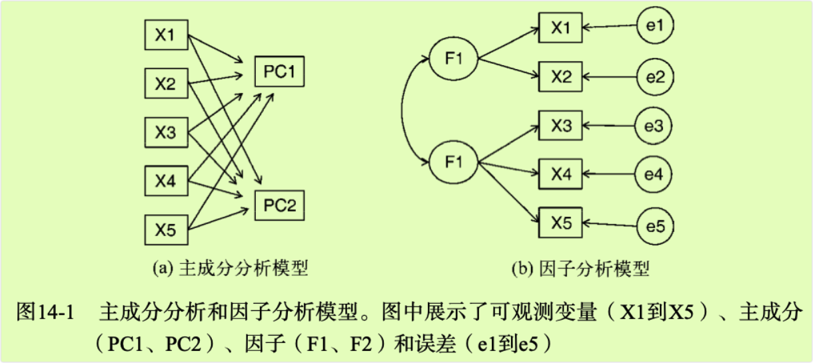
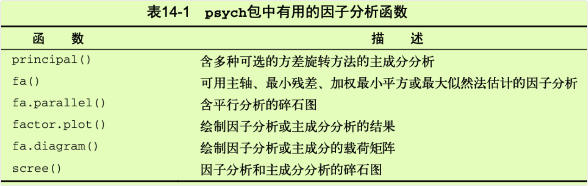
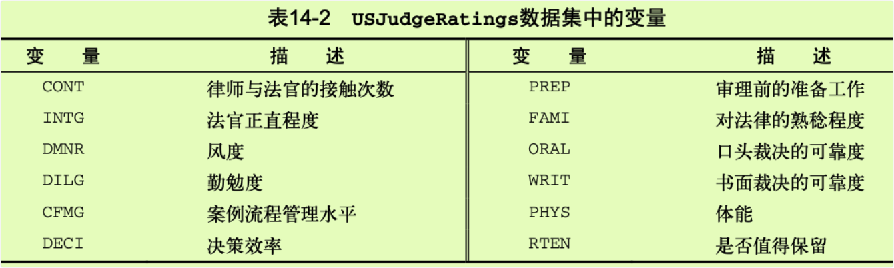
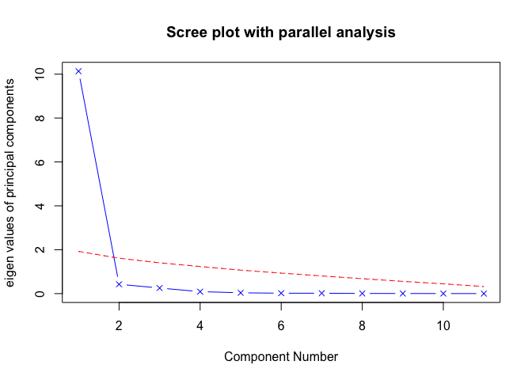
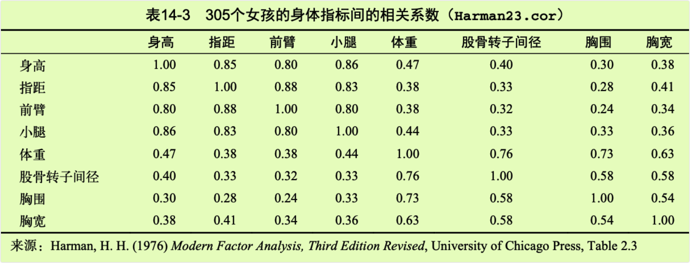
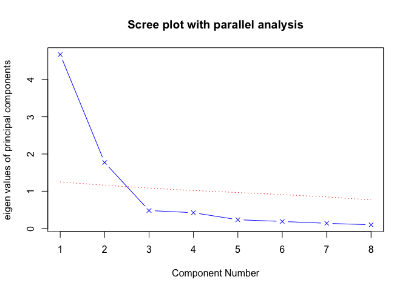
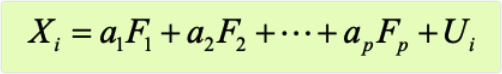
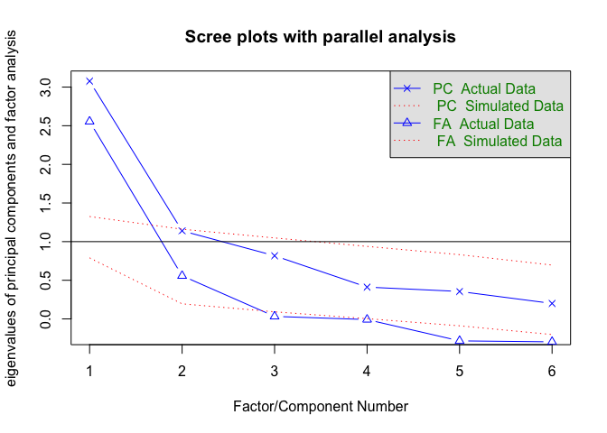
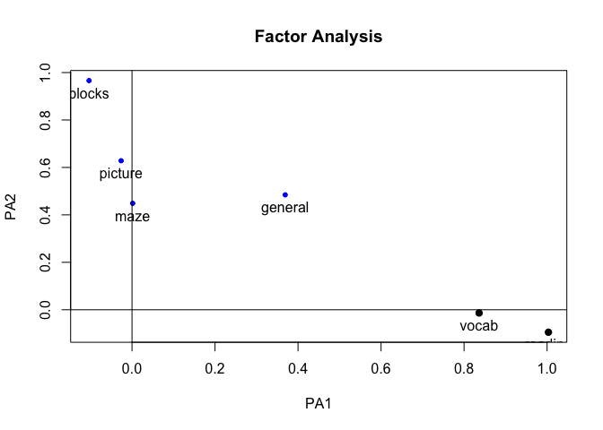
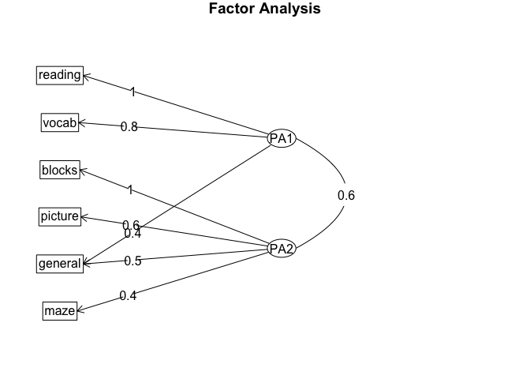

chapter14_主成分分析和因子分析
================

- <a href="#14-主成分分析和因子分析" id="toc-14-主成分分析和因子分析">14
  主成分分析和因子分析</a>
  - <a href="#141-r中的主成分和因子分析"
    id="toc-141-r中的主成分和因子分析">14.1 R中的主成分和因子分析</a>
  - <a href="#142-主成分分析" id="toc-142-主成分分析">14.2 主成分分析</a>
    - <a href="#1421-判断主成分的个数" id="toc-1421-判断主成分的个数">14.2.1
      判断主成分的个数</a>
    - <a href="#1422-提取主成分" id="toc-1422-提取主成分">14.2.2
      提取主成分</a>
    - <a href="#1423-主成分旋转" id="toc-1423-主成分旋转">14.2.3
      主成分旋转</a>
    - <a href="#1424-获取主成分得分" id="toc-1424-获取主成分得分">14.2.4
      获取主成分得分</a>
  - <a href="#143-探索性因子分析" id="toc-143-探索性因子分析">14.3
    探索性因子分析</a>
    - <a href="#1431-判断需提取的公共因子数"
      id="toc-1431-判断需提取的公共因子数">14.3.1 判断需提取的公共因子数</a>
    - <a href="#1432-提取公共因子" id="toc-1432-提取公共因子">14.3.2
      提取公共因子</a>
    - <a href="#1433-因子旋转" id="toc-1433-因子旋转">14.3.3 因子旋转</a>
    - <a href="#1434-因子得分" id="toc-1434-因子得分">14.3.4 因子得分</a>
    - <a href="#1435-其他与efa相关的包" id="toc-1435-其他与efa相关的包">14.3.5
      其他与EFA相关的包</a>
  - <a href="#144-其他潜变量模型" id="toc-144-其他潜变量模型">14.4
    其他潜变量模型</a>

# 14 主成分分析和因子分析

- 信息过度复杂是多变量数据最大的挑战之一。若数据集有100个变量，如何了解其中所有的交互关系呢？即使只有20个变量，当试图理解各个变量与其他变量的关系时，也需要考虑190对相互关系。主成分分析和探索性因子分析是两种用来探索和简化多变量复杂关系的常用方法，它们之间有联系也有区别。

- **主成分分析(PCA)**是一种数据降维技巧，它能将大量相关变量转化为一组很少的不相关变量，这些无关变量称为主成分。例如，使用PCA可将30个相关（很可能冗余）的环境变量转化为5个无关的成分变量，并且尽可能地保留原始数据集的信息。

- 相对而言，**探索性因子分析（EFA）**是一系列用来发现一组变量的潜在结构的方法。它通过寻找一组更小的、潜在的或隐藏的结构来解释已观测到的、显式的变量间的关系。例如，Harman74.cor包含了24个心理测验间的相互关系，受试对象为145个七年级或八年级的学生。假使应用EFA来探索该数据，结果表明276个测验间的相互关系可用四个学生能力的潜在因子（语言能力、反应速度、推理能力和记忆能力）来进行解释。

- PCA与EFA模型间的区别参见图14-1。主成分（PC1和PC2）是观测变量（X1到X5）的线性组合。形成线性组合的权重都是通过最大化各主成分所解释的方差来获得，同时还要保证各主成分间不相关。

- 相反，因子（F1和F2）被当作观测变量的结构基础或”原因”，而不是它们的线性组合。代表观测变量方差的误差（e1到e5）无法用因子来解释。图中的圆圈表示因子和误差无法直接观测，但是可通过变量间的相互关系推导得到。在本例中，因子间带曲线的箭头表示它们之间有相关性。在EFA模型中，相关因子是常见的，但并不是必需的。

- **本章介绍的两种方法都需要大样本来支撑稳定的结果**，但是多大样本量才足够也是一个复杂的问题。目前，数据分析师常使用经验法则：“因子分析需要5\~10倍于变量数的样本数。”最近研究表明，所需样本量依赖于因子数目、与各因子相关联的变量数，以及因子对变量方差的解释程度(Bandalos&Boehm-Kaufman,2009)。我冒险推测一下：如果你有几百个观测，样本量便已充足。本章中，为保证输出结果（和篇幅原因）可控性，我们将人为设定一些小问题。

- 首先，我们将回顾R中可用来做PCA或EFA的函数，并简略看一看相关分析流程。然后，逐步分析两个PCA示例，以及一个扩展的EFA示例。最后，本章简要列出R中其他拟合潜变量模型的软件包，包括用于验证性因子分析、结构方程模型、对应分析和潜在类别分析的软件包。



## 14.1 R中的主成分和因子分析

- R的基础安装包提供了PCA和EFA的函数，分别为`orincomp()`和`factanal()`。本章我们将重点介绍psych包中提供的函数。它们提供了比基础函数更丰富和有用的选项。另外，输出的结果形式也更为社会学家所熟悉，与其他统计软件如（SAS和SPSS）所提供的输出十分相似。

- 表14-1列出了psych包中相关度最高的函数。在使用这些函数前请确保已安装该软件包。



- 初学者常会对EFA（和自由度较少的PCA）感到困惑。因为它们提供了一系列应用广泛的方法，而且每种方法都需要一些步骤（和决策）才能获得最终结果。最常见的步骤如下。

- (1)数据预处理。PCA和EFA都根据观测变量间的相关性来推导结果。用户可以输入原始数据矩阵或者相关系数矩阵到`orincipal()`和`fa()`函数中。若输入初始数据，相关系数矩阵将会被自动计算，在计算前请确保数据中没有缺失值。

- (2)选择因子模型。判断是PCA（数据降维)还是EFA（发现潜在结构)更符合你的研究目标。如果选择EFA方法，你还需要选择一种估计因子模型的方法（如最大似然估计）。

- (3)判断要选择的主成分/因子数目。

- (4)选择主成分/因子。

- (5)旋转主成分/因子。

- (6)解释结果。

- (7)计算主成分或因子得分。

- 后面几节将从PCA开始，详细讨论分析的每一个步骤。本章最后，会给出一个详细的PCA/EFA分析流程图（图14-7）。结合相关材料，流程图能够进一步加深你对模型的理解。

## 14.2 主成分分析

- PCA的目标是用一组较少的不相关变量代替大量相关变量，同时尽可能保留初始变量的信息，这些推导所得的变量称为主成分，它们是观测变量的线性组合。如第一主成分为：

`PC1 = a1X1 + a2X2 + ... + akXk`

- 它是个观测变量的加权组合，对初始变量集的方差解释性最大。第二主成分也是初始变量的线性组合，对方差的解释性排第二，同时与第一主成分正交（不相关）。后面每一个主成分都最大化它对方差的解释程度，同时与之前所有的主成分都正交。理论上来说，你可以选取与变量数相同的主成分，但从实用的角度来看，我们都希望能用较少的主成分来近似全变量集。下面看一个简单的示例。

- 数据集USJudgeRatings包含了律师对美国高等法院法官的评分。数据框包含43个观测，12个变量。表14-2列出了所有的变量。



- 从实用的角度来看，你是否能够用较少的变量来总结这11个变量（从INTG到RTEN）评估的信息呢？如果可以，需要多少个？如何对它们进行定义呢？因为我们的目标是简化数据，所以可使用PCA。数据保持初始得分的格式，没有缺失值。因此，下一步便是判断需要多少个主成分。

### 14.2.1 判断主成分的个数

- 以下是一些可用来判断PCA中需要多少个主成分的准则：

- 根据先验经验和理论知识判断主成分数；

- 根据要解释变量方差的积累值的阈值来判断需要的主成分数；

- 通过检查变量间k\*k的相关系数矩阵来判断保留的主成分数。

- 最常见的是基于特征值的方法。每个主成分都与相关系数矩阵的特征值相关联，第一主成分与最大的特征值相关联，第二主成分与第二大的特征值相关联，依此类推。Kaiser-Harris准则建议保留特征值大于1的主成分，特征值小于1的成分所解释的方差比包含在单个变量中的方差更少。Cattell碎石检验则绘制了特征值与主成分数的图形。这类图形可以清晰地展示图形弯曲状况，在图形变化最大处之上的主成分都可保留。最后，你还可以进行模拟，依据与初始矩阵相同大小的随机数据矩阵来判断要提取的特征值。若基于真实数据的某个特征值大于一组随机数据矩阵相应的平均特征值，那么该主成分可以保留。该方法称作平行分析（详见Hayton、Allen和Scarpello”Factor
  Retention Decisions in Exploratory Factor Analysis:A Tutorial on
  Parallel Analysis”,2004)。

- 利用`fa.parallel()`函数，你可以同时对三种特征值判别准则进行评价。对于11种评分（删去了CONT变量)，代码如下：

``` r
> library(psych)
> fa.parallel(USJudgeRatings[,-1],fa="pc",n.iter=100,
+             show.legend=FALSE,main="Scree plot with parallel analysis")
```

<!-- -->

    Parallel analysis suggests that the number of factors =  NA  and the number of components =  1 

- 图14-2
  评价美国法官评分中要保留的主成分个数。碎石图（直线与x符号）、特征值大于1准则（水平线）和100次模拟的平行分析（虚线）都表明保留一个主成分即可

- 代码生成图形见图14-2，展示了基于观测特征值的碎石检验（由线段和x符号组成)、根据100个随机数据矩阵推导出来的特征值均值（虚线），以及大于1的特征值准则（y=1的水平线）。

- 三种准则表明选择一个主成分即可保留数据集的大部分信息。下一步是使用`orincipal()`函数挑选出相应的主成分。

### 14.2.2 提取主成分

- 之前已经介绍过，`principal()`函数可以根据原始数据矩阵或者相关系数矩阵做主成分分析。格式为：

`principal(r,nfactors=,rotate=,scores=)`

- 其中：

- 是相关系数矩阵或原始数据矩阵；

- nfactors设定主成分数（默认为1）；

- rotate指定旋转的方法（默认最大方差旋转（varimax），见14.2.3节）；

- scoresi设定是否需要计算主成分得分（默认不需要）。

- 使用代码清单14-1中的代码可获取第一主成分。

- 代码清单14-1 美国法官评分的主成分分析

``` r
> library(psych)
> pc1 <- principal(USJudgeRatings[,-1],nfactors=1) 
> pc1
Principal Components Analysis
Call: principal(r = USJudgeRatings[, -1], nfactors = 1)
Standardized loadings (pattern matrix) based upon correlation matrix
      PC1   h2     u2 com
INTG 0.92 0.84 0.1565   1
DMNR 0.91 0.83 0.1663   1
DILG 0.97 0.94 0.0613   1
CFMG 0.96 0.93 0.0720   1
DECI 0.96 0.92 0.0763   1
PREP 0.98 0.97 0.0299   1
FAMI 0.98 0.95 0.0469   1
ORAL 1.00 0.99 0.0091   1
WRIT 0.99 0.98 0.0196   1
PHYS 0.89 0.80 0.2013   1
RTEN 0.99 0.97 0.0275   1

                 PC1
SS loadings    10.13
Proportion Var  0.92

Mean item complexity =  1
Test of the hypothesis that 1 component is sufficient.

The root mean square of the residuals (RMSR) is  0.04 
 with the empirical chi square  6.21  with prob <  1 

Fit based upon off diagonal values = 1
```

- 此处，你输入的是没有CONT变量的原始数据，并指定获取一个未旋转（参见14.3.3节）的主成分。由于PCA只对相关系数矩阵进行分析，在获取主成分前，原始数据将会被自动转换为相关系数矩阵。

- PC1栏包含了成分载荷，指观测变量与主成分的相关系数。如果提取不止一个主成分，那么还将会有PC2、PC3等栏。成分载荷(component
  loadings)可用来解释主成分的含义。此处可以看到，第一主成分（PC1）与每个变量都高度相关，也就是说，它是一个可用来进行一般性评价的维度。

- h2栏指成分公因子方差，即主成分对每个变量的方差解释度。u2栏指成分唯一性，即方差无法被主成分解释的比例（1-h2）。例如，体能（PHYS）80%的方差都可用第一主成分来解释，20%不能。相比而言，PHYS是用第一主成分表示性最差的变量。

- SS
  loadings行包含了与主成分相关联的特征值，指的是与特定主成分相关联的标准化后的方差值（本例中，第一主成分的值为10）。最后，Proportion
  Var行表示的是每个主成分对整个数据集的解释程度。此处可以看到，第一主成分解释了11个变量92%的方差。

- 让我们再来看看第二个例子，它的结果不止一个主成分。Harman23.cor数据集包含305个女孩的8个身体测量指标。本例中，数据集由变量的相关系数组成，而不是原始数据集（见表14-3）。



- 同样地，我们希望用较少的变量替换这些原始身体指标。如下代码可判断要提取的主成分数。此处，你需要填入相关系数矩阵(Harman23.cor对象中的cov部分)，并设定样本大小(n.obs)：

``` r
> library(psych)
> fa.parallel(Harman23.cor$cov,n.obs=302,fa="pc",n.iter=100,show.legend=FALSE,main="Scree plot with parallel analysis")
```

<!-- -->

    Parallel analysis suggests that the number of factors =  NA  and the number of components =  2 

- 图14-3
  判断身体测量数据集所需的主成分数。碎石图（直线和x符号)、特征值大于1准则（水平线）和100次模拟（虚线）的平行分析建议保留两个主成分

- 与第一个例子类似，图形中的Kaiser-Harris准则、碎石检验和平行分析都建议选择两个主成分。但是三个准备并不总是相同，你可能需要依据实际情况提取不同数目的主成分，选择最优解决方案。代码清单清单14-2从相关系数矩阵中提取了前两个主成分。

- 代码清单14-2 身体测量指标的主成分分析

``` r
> library(psych)
> pc2 <-principal(Harman23.cor$cov,nfactors=2,rotate="none") 
> pc2
Principal Components Analysis
Call: principal(r = Harman23.cor$cov, nfactors = 2, rotate = "none")
Standardized loadings (pattern matrix) based upon correlation matrix
                PC1   PC2   h2    u2 com
height         0.86 -0.37 0.88 0.123 1.4
arm.span       0.84 -0.44 0.90 0.097 1.5
forearm        0.81 -0.46 0.87 0.128 1.6
lower.leg      0.84 -0.40 0.86 0.139 1.4
weight         0.76  0.52 0.85 0.150 1.8
bitro.diameter 0.67  0.53 0.74 0.261 1.9
chest.girth    0.62  0.58 0.72 0.283 2.0
chest.width    0.67  0.42 0.62 0.375 1.7

                       PC1  PC2
SS loadings           4.67 1.77
Proportion Var        0.58 0.22
Cumulative Var        0.58 0.81
Proportion Explained  0.73 0.27
Cumulative Proportion 0.73 1.00

Mean item complexity =  1.7
Test of the hypothesis that 2 components are sufficient.

The root mean square of the residuals (RMSR) is  0.05 

Fit based upon off diagonal values = 0.99
```

- 从代码清单14-2中的PC1和PC2栏可以看到，第一主成分解释了身体测量指标58%的方差，而第二主成分解释了22%，两者总共解释了81%的方差。对于高度变量，两者则共解释了其88%的方差。

- 载荷阵解释了成分和因子的含义。第一主成分与每个身体测量指标都正相关，看起来似乎是一个一般性的衡量因子；第二主成分与前四个变量(height、arm.span、forearm和lower.leg)负相关，与后四个变量(weight、bitro.diameter、chest.girth和chest.width)正相关，因此它看起来似乎是一个长度-容量因子。但理念上的东西都不容易构建，当提取了多个成分时，对它们进行旋转可使结果更具解释性，接下来我们便讨论该问题。

### 14.2.3 主成分旋转

- 旋转是一系列将成分载荷阵变得更容易解释的数学方法，它们尽可能地对成分去噪。旋转方法有两种：使选择的成分保持不相关（正交旋转），和让它们变得相关（斜交旋转）。旋转方法也会依据去噪定义的不同而不同。最流行的正交旋转是方差极大旋转，它试图对载荷阵的列进行去噪，使得每个成分只由一组有限的变量来解释（即载荷阵每列只有少数几个很大的载荷，其他都是很小的载荷）。对身体测量数据使用方差极大旋转，你可以得到如代码清单14-3所示的结果。14.4节将介绍斜交旋转的示例。

- 代码清单14-3 方差极大旋转的主成分分析

``` r
> rc1 <-principal(Harman23.cor$cov,nfactors=2,rotate="varimax") 
> rc1
Principal Components Analysis
Call: principal(r = Harman23.cor$cov, nfactors = 2, rotate = "varimax")
Standardized loadings (pattern matrix) based upon correlation matrix
                RC1  RC2   h2    u2 com
height         0.90 0.25 0.88 0.123 1.2
arm.span       0.93 0.19 0.90 0.097 1.1
forearm        0.92 0.16 0.87 0.128 1.1
lower.leg      0.90 0.22 0.86 0.139 1.1
weight         0.26 0.88 0.85 0.150 1.2
bitro.diameter 0.19 0.84 0.74 0.261 1.1
chest.girth    0.11 0.84 0.72 0.283 1.0
chest.width    0.26 0.75 0.62 0.375 1.2

                       RC1  RC2
SS loadings           3.52 2.92
Proportion Var        0.44 0.37
Cumulative Var        0.44 0.81
Proportion Explained  0.55 0.45
Cumulative Proportion 0.55 1.00

Mean item complexity =  1.1
Test of the hypothesis that 2 components are sufficient.

The root mean square of the residuals (RMSR) is  0.05 

Fit based upon off diagonal values = 0.99
```

- 列的名字都从PC变成了RC，以表示成分被旋转。观察RC1栏的载荷，你可以发现第一主成分主要由前四个变量来解释（长度变量）。RC2栏的载荷表示第二主成分主要由变量5到变量8来解释（容量变量）。注意两个主成分仍不相关，对变量的解释性不变，这是因为变量的群组没有发生变化。另外，两个主成分旋转后的累积方差解释性没有变化（81%），变的只是各个主成分对方差的解释度（成分1从58%变为44%，成分2从22%变为37%）。各成分的方差解释度趋同，准确来说，此时应该称它们为成分而不是主成分（因为单个主成分方差最大化性质没有保留）。

- 我们的最终目标是用一组较少的变量替换一组较多的相关变量，因此，你还需要获取每个观测在成分上的得分。

### 14.2.4 获取主成分得分

- 在美国法官评分例子中，我们根据原始数据中的11个评分变量提取了一个主成分。利用`principal()`函数，你很容易获得每个调查对象在该主成分上的得分（见代码清单14-4）。

- 代码清单14-4 从原始数据中获取成分得分

``` r
> library(psych)
> pc2 <- principal(USJudgeRatings[,-1],nfactors=1,score=TRUE) 
> head(pc2$scores)
                      PC1
AARONSON,L.H.  -0.1857981
ALEXANDER,J.M.  0.7469865
ARMENTANO,A.J.  0.0704772
BERDON,R.I.     1.1358765
BRACKEN,J.J.   -2.1586211
BURNS,E.B.      0.7669406
```

- 当scores=TRUE时，主成分得分存储在`principal()`函数返回对象的scores元素中。如果有需要，你还可以获得律师与法官的接触频数与法官评分间的相关系数：

``` r
> cor(USJudgeRatings$CONT,pc2$score)
              PC1
[1,] -0.008815895
```

- 显然，律师与法官的熟稔度与律师的评分毫无关联。

- 当主成分分析基于相关系数矩阵时，原始数据便不可用了，也不可能获取每个观测的主成分得分，但是你可以得到用来计算主成分得分的系数。

- 在身体测量数据中，你有各个身体测量指标间的相关系数，但是没有305个女孩的个体测量值。按照代码清单14-5，你可得到得分系数。

- 代码清单14-5 获取主成分得分的系数

``` r
> library(psych)
> rc2 <- principal(Harman23.cor$cov,nfactors=2,rotate="varimax") 
> round(unclass(rc2$weights),2)
                 RC1   RC2
height          0.28 -0.05
arm.span        0.30 -0.08
forearm         0.30 -0.09
lower.leg       0.28 -0.06
weight         -0.06  0.33
bitro.diameter -0.08  0.32
chest.girth    -0.10  0.34
chest.width    -0.04  0.27
```

- 利用如下公式可得到主成分得分：

<!-- -->

    PC1 = 0.28*height + 0.30*arm.span + 0.30*forearm + 0.29*lower.leg - 
      0.06*weight - 0.08*bitro.diameter - 0.10*chest.girth - 0.04*chest.width

    PC2 = -0.05*height - 0.08*arm.span - 0.09*forearm - 0.06*lower.leg + 
      0.33*weight + 0.32*bitro.diameter + 0.34*chest.girth + 0.27*chest.width

- 两个等式都假定身体测量指标都已标准化（mean=0,sd=1）。注意，体重在PC1上的系数约为0.3或0，对于PC2也是一样。从实际角度考虑，你可以进一步简化方法，将第一主成分看作前四个变量标准化得分的均值；类似地，将第二主成分看作后四个变量标准化得分的均值，这正是我通常在实际中采用的方法。

## 14.3 探索性因子分析

- EFA的目标是通过发掘隐藏在数据下的一组较少的、更为基本的无法观测的变量，来解释一组可观测变量的相关性。这些虚拟的、无法观测的变量称作因子。（每个因子被认为可解释多个观测变量间共有的方差，因此准确来说，它们应该称作公共因子。）

- 模型的形式为：



- 其中X是第个可观测变量（i=1…k），Fj是公共因子（j=1…p），并且p\<k。Ui是Xi变量独有的部分（无法被公共因子解释）。αi，可认为是每个因子对复合而成的可观测变量的贡献值。回到本章开头的Harman74.cor的例子，我们认为每个个体在24个心理学测验上的观测得分，是根据四个潜在心理学因素的加权能力值组合而成。

- 虽然PCA和EFA存在差异，但是它们的许多分析步骤都是相似的。为阐述EFA的分析过程，我们用它来对六个心理学测验间的相关性进行分析。112个人参与了六个测验，包括非语言的普通智力测验（general）、画图测验（picture）、积木图案测验（blocks）、迷宫测验（maze）、阅读测验（reading）和词汇测验（vocab）。我们如何用一组较少的、潜在的心理学因素来解释参与者的测验得分呢？

- 数据集ability.cov提供了变量的协方差矩阵，你可用`cov2cor()`函数将其转化为相关系数矩阵。数据集没有缺失值。

``` r
> options(digits=2)
> covariances <- ability.cov$cov
> correlations <- cov2cor(covariances) 
> correlations
        general picture blocks maze reading vocab
general    1.00    0.47   0.55 0.34    0.58  0.51
picture    0.47    1.00   0.57 0.19    0.26  0.24
blocks     0.55    0.57   1.00 0.45    0.35  0.36
maze       0.34    0.19   0.45 1.00    0.18  0.22
reading    0.58    0.26   0.35 0.18    1.00  0.79
vocab      0.51    0.24   0.36 0.22    0.79  1.00
```

- 因为要寻求用来解释数据的潜在结构，可使用EFA方法。与使用PCA相同，下一步工作为判断需要提取几个因子。

### 14.3.1 判断需提取的公共因子数

用`fa.parallel()`函数可判断需提取的因子数：

``` r
> library(psych)
> covariances <- ability.cov$cov
> correlations <- cov2cor(covariances)
> fa.parallel(correlations,n.obs=112,fa="both",n.iter=100,
+ main="Scree plots with parallel analysis")
```

<!-- -->

    Parallel analysis suggests that the number of factors =  2  and the number of components =  1 

- 图14-4
  判断心理学测验需要保留的因子数。图中同时展示了PCA和EFA的结果。PCA结果建议提取一个或者两个成分，EFA建议提取两个因子

- 结果见图14-4。注意，代码中使用了fa=“both”，因子图形将会同时展示主成分和公共因子分析的结果。

- 图形中有几个值得注意的地方。如果使用PCA方法，你可能会选择一个成分（碎石检验和平行分析）或者两个成分（特征值大于1）。当摇摆不定时，高估因子数通常比低估因子数的结果好，因为高估因子数一般较少曲解“真实”情况。

- 观察EFA的结果，显然需提取两个因子。碎石检验的前两个特征值（三角形）都在拐角处之上，并且大于基于100次模拟数据矩阵的特征值均值。对于EFA,Kaiser–Harris准则的特征值数大于0，而不是1。（大部分人都没有意识到这一点。）图形中该准则也建议选择两个因子。

### 14.3.2 提取公共因子

- 现在你决定提取两个因子，可以使用`fa()`函数获得相应的结果。`fa()`函数的格式如下：

`fa(r,nfactors=,n.obs=,rotate=,scores=,fm=)`

- 其中：

- 是相关系数矩阵或者原始数据矩阵；

- nfactorsi设定提取的因子数（默认为1）；

- n.obs是观测数（输入相关系数矩阵时需要填写）；

- rotate设定旋转的方法（默认互变异数最小法）；

- scores设定是否计算因子得分（默认不计算）；

- fm设定因子化方法（默认极小残差法）。

- 与PCA不同，提取公共因子的方法很多，包括最大似然法(ml)、主轴迭代法(pa)、加权最小二乘法(wls)、广义加权最小二乘法(gls)和最小残差法(minres)。统计学家青睐使用最大似然法，因为它有良好的统计性质。不过有时候最大似然法不会收敛，此时使用主轴迭代法效果会很好。欲了解更多提取公共因子的方法，可参阅Mulaik(2009)和Corsuch(1983)。

- 本例使用主轴迭代法（fm=“pa”）提取未旋转的因子。结果见代码清单14-6。

- 代码清单14-6 未旋转的主轴迭代因子法

``` r
> fa <-fa(correlations,nfactors=2,rotate="none",fm="pa") 
> fa
Factor Analysis using method =  pa
Call: fa(r = correlations, nfactors = 2, rotate = "none", fm = "pa")
Standardized loadings (pattern matrix) based upon correlation matrix
         PA1   PA2   h2    u2 com
general 0.75  0.07 0.57 0.432 1.0
picture 0.52  0.32 0.38 0.623 1.7
blocks  0.75  0.52 0.83 0.166 1.8
maze    0.39  0.22 0.20 0.798 1.6
reading 0.81 -0.51 0.91 0.089 1.7
vocab   0.73 -0.39 0.69 0.313 1.5

                       PA1  PA2
SS loadings           2.75 0.83
Proportion Var        0.46 0.14
Cumulative Var        0.46 0.60
Proportion Explained  0.77 0.23
Cumulative Proportion 0.77 1.00

Mean item complexity =  1.5
Test of the hypothesis that 2 factors are sufficient.

The degrees of freedom for the null model are  15  and the objective function was  2.5
The degrees of freedom for the model are 4  and the objective function was  0.07 

The root mean square of the residuals (RMSR) is  0.03 
The df corrected root mean square of the residuals is  0.06 

Fit based upon off diagonal values = 0.99
Measures of factor score adequacy             
                                                   PA1  PA2
Correlation of (regression) scores with factors   0.96 0.92
Multiple R square of scores with factors          0.93 0.84
Minimum correlation of possible factor scores     0.86 0.68
```

- 可以看到，两个因子解释了六个心理学测验60%的方差。不过因子载荷阵的意义并不太好解释，此时使用因子旋转将有助于因子的解释。

### 14.3.3 因子旋转

- 你可以使用正交旋转或者斜交旋转来旋转14.3.4节中两个因子的结果。现在我们同时尝试两种方法，看看它们的异同。
  首先使用正交旋转(见代码清单14-7)。

- 代码清单14-7 用正交旋转提取因子

``` r
> fa.varimax <- fa(correlations,nfactors=2,rotate="varimax",fm="pa") 
> fa.varimax
Factor Analysis using method =  pa
Call: fa(r = correlations, nfactors = 2, rotate = "varimax", fm = "pa")
Standardized loadings (pattern matrix) based upon correlation matrix
         PA1  PA2   h2    u2 com
general 0.49 0.57 0.57 0.432 2.0
picture 0.16 0.59 0.38 0.623 1.1
blocks  0.18 0.89 0.83 0.166 1.1
maze    0.13 0.43 0.20 0.798 1.2
reading 0.93 0.20 0.91 0.089 1.1
vocab   0.80 0.23 0.69 0.313 1.2

                       PA1  PA2
SS loadings           1.83 1.75
Proportion Var        0.30 0.29
Cumulative Var        0.30 0.60
Proportion Explained  0.51 0.49
Cumulative Proportion 0.51 1.00

Mean item complexity =  1.3
Test of the hypothesis that 2 factors are sufficient.

The degrees of freedom for the null model are  15  and the objective function was  2.5
The degrees of freedom for the model are 4  and the objective function was  0.07 

The root mean square of the residuals (RMSR) is  0.03 
The df corrected root mean square of the residuals is  0.06 

Fit based upon off diagonal values = 0.99
Measures of factor score adequacy             
                                                   PA1  PA2
Correlation of (regression) scores with factors   0.96 0.92
Multiple R square of scores with factors          0.91 0.85
Minimum correlation of possible factor scores     0.82 0.71
```

- 结果显示因子变得更好解释了。阅读和词汇在第一因子上载荷较大，画图、积木图案和迷宫在第二因子上载荷较大，非语言的普通智力测量在两个因子上载荷较为平均，这表明存在一个语言智力因子和一个非语言智力因子。

- 使用正交旋转将人为地强制两个因子不相关。如果想允许两个因子相关该怎么办呢？此时可以使用斜交转轴法，比如promax(见代码清单14-8)。

- 需要安装GPArotation包。

- 代码清单14-8 用斜交旋转提取因子

``` r
> fa.promax <- fa(correlations,nfactors=2,rotate="promax",fm="pa") 
> fa.promax
Factor Analysis using method =  pa
Call: fa(r = correlations, nfactors = 2, rotate = "promax", fm = "pa")
Standardized loadings (pattern matrix) based upon correlation matrix
          PA1   PA2   h2    u2 com
general  0.37  0.48 0.57 0.432 1.9
picture -0.03  0.63 0.38 0.623 1.0
blocks  -0.10  0.97 0.83 0.166 1.0
maze     0.00  0.45 0.20 0.798 1.0
reading  1.00 -0.09 0.91 0.089 1.0
vocab    0.84 -0.01 0.69 0.313 1.0

                       PA1  PA2
SS loadings           1.83 1.75
Proportion Var        0.30 0.29
Cumulative Var        0.30 0.60
Proportion Explained  0.51 0.49
Cumulative Proportion 0.51 1.00

 With factor correlations of 
     PA1  PA2
PA1 1.00 0.55
PA2 0.55 1.00

Mean item complexity =  1.2
Test of the hypothesis that 2 factors are sufficient.

The degrees of freedom for the null model are  15  and the objective function was  2.5
The degrees of freedom for the model are 4  and the objective function was  0.07 

The root mean square of the residuals (RMSR) is  0.03 
The df corrected root mean square of the residuals is  0.06 

Fit based upon off diagonal values = 0.99
Measures of factor score adequacy             
                                                   PA1  PA2
Correlation of (regression) scores with factors   0.97 0.94
Multiple R square of scores with factors          0.93 0.88
Minimum correlation of possible factor scores     0.86 0.77
```

- 根据以上结果，你可以看出正交旋转和斜交旋转的不同之处。对于正交旋转，因子分析的重点在于因子结构矩阵（变量与因子的相关系数），而对于斜交旋转，因子分析会考虑三个矩阵：因子结构矩阵、因子模式矩阵和因子关联矩阵。

- 因子模式矩阵即标准化的回归系数矩阵。它列出了因子预测变量的权重。因子关联矩阵即因子相关系数矩阵。

- 在代码清单14-8中，PA1和PA2栏中的值组成了因子模式矩阵。它们是标准化的回归系数，而不是相关系数。注意，矩阵的列仍用来对因子进行命名（虽然此处存在一些争论）。你同样可以得到一个语言因子和一个非语言因子。

- 因子关联矩阵显示两个因子的相关系数为0.57，相关性很大。如果因子间的关联性很低，你可能需要重新使用正交旋转来简化问题。

- 因子结构矩阵（或称因子载荷阵）没有被列出来，但你可以使用公式F=P\*Phi很轻松地得到它，其中F是因子载荷阵，P为因子模式矩阵，Phi为因子关联矩阵。下面的函数即可进行该乘法运算：

``` r
> fsm <-function (oblique){
+   if (class(oblique)[2]=="fa" & is.null(oblique$Phi)){
+     warning("Object doesn't look like oblique EFA")
+     } else {
+       P <- unclass(oblique$loading)
+       F <- P %*% oblique$Phi
+       colnames(F) <- c("PA1","PA2") 
+       return(F)
+     }
+   }
```

- 对上面的例子使用该函数，可得：

``` r
> fsm(fa.promax)
         PA1  PA2
general 0.64 0.69
picture 0.32 0.61
blocks  0.43 0.91
maze    0.25 0.45
reading 0.95 0.46
vocab   0.83 0.45
```

- 现在你可以看到变量与因子间的相关系数。将它们与正交旋转所得因子载荷阵相比，你会发现该载荷阵列的噪音比较大，这是因为之前你允许潜在因子相关。虽然斜交方法更为复杂，但模型将更符合真实数据。

- 使用`factor.plot()`或`fa.diagram()`函数，你可以绘制正交或者斜交结果的图形。来看以下代码：

``` r
> factor.plot(fa.promax,labels=rownames(fa.promax$loadings))
```

<!-- -->

- 图14-5
  数据集ability.cov中心理学测验的两因子图形。词汇和阅读在第一个因子(PA1)上载荷较大，而积木图案、画图和迷宫在第二个因子(PA2)上载荷较大。普通智力测验在两个因子上较为平均

- 代码：

``` r
> fa.diagram(fa.promax,simple=FALSE)
```

<!-- -->

- 图14-6 数据集ability.cov中心理学测验的两因子斜交旋转结果图

- 生成的图形见图14-6。若使simple=TUE，那么将仅显示每个因子下最大的载荷，以及因子间的相关系数。这类图形在有多个因子时十分实用。

- 当处理真实生活中的数据时，你不可能只对这么少的变量进行因子分析。此处只是为了操作方便，如果你想检测自己的能力，可尝试对Harman74.cor中的24个心理学测验进行因子分析。以下代码：

``` r
> library(psych)
> fa.24tests <- fa(Harman74.cor$cov,nfactors=4,rotate="promax")
```

- 应该是个不错的开头。

### 14.3.4 因子得分

- 相比PCA，EFA并不那么关注计算因子得分。在`fa()`函数中添加score=TRUE选项（原始数据可得时）便可很轻松地获得因子得分。另外还可以得到得分系数（标准化的回归权重），它在返回对象的weightsi元素中。

- 对于ability.cov数据集，通过二因子斜交旋转法便可获得用来计算因子得分的权重：

``` r
> fa.promax$weights
          PA1   PA2
general 0.078 0.211
picture 0.020 0.090
blocks  0.037 0.702
maze    0.027 0.035
reading 0.743 0.030
vocab   0.177 0.036
```

- 与可精确计算的主成分得分不同，因子得分只是估计得到的。它的估计方法有多种，`fa()`函数使用的是回归方法。若想更多地了解因子得分，可参阅DiStefano、Zhu和Mindrila的”Understanding
  and Using Factor Scores:Considerations for the Applied
  Researcher”(2009).

- 在继续下文之前，让我们简单了解其他用于探索性因子分析的实用R软件包。

### 14.3.5 其他与EFA相关的包

- R包含了其他许多对因子分析非常有用的软件包。FactoMineR包不仅提供了PCA和EFA方法，还包含潜变量模型。它有许多此处我们并没考虑的参数选项，比如数值型变量和类别型变量的使用方法。FAiR包使用遗传算法来估计因子分析模型，它增强了模型参数估计能力，能够处理不等式的约束条件，GPArotation包则提供了许多因子旋转方法。最后，还有nFactors包，它提供了用来判断因子数目的许多复杂方法。

## 14.4 其他潜变量模型

- EFA只是统计中一种应用广泛的潜变量模型。在结束本章之前，我们简要看看R中其他的潜变量模型，包括检验先验知识的模型、处理混合数据类型（数值型和类别型）的模型，以及仅基于类别型多因素表的模型。

- 在EFA中，你可以用数据来判断需要提取的因子数以及它们的含义。但是你也可以先从一些先验知识开始，比如变量背后有几个因子、变量在因子上的载荷是怎样的、因子间的相关性如何，然后通过收集数据检验这些先验知识。这种方法称作验证性因子分析(CFA)。

- CFA是结构方程模型（SEM）中的一种方法。SEM不仅可以假定潜在因子的数目以及组成，还能假定因子间的影响方式。你可以将SEM看做是验证性因子分析（对变量）和回归分析（对因子）的组合，它的结果输出包含统计检验和拟合度的指标。R中有几个可做CFA和SEM的非常优秀的软件包，如sem、openMx和lavaan。

- ltm包可以用来拟合测验和问卷中各项目的潜变量模型。该方法常用来创建大规模标准化测试，比如学术能力测验(SAT)和美国研究生入学考试(GRE)。

- 潜类别模型（潜在的因子被认为是类别型而非连续型）可通过FlexMix、lcmm、randomLCA和PoLCA包进行拟合。lcda包可做潜类别判别分析，而lsa可做潜在语义分析一一种自然语言处理中的方法。

- ca包提供了可做简单和多重对应分析的函数。利用这些函数，可以分别在二维列联表和多维列联表中探索类别型变量的结构。

- 最后，R中还包含了众多的多维标度法(MDS)计算工具。所谓MDS，即可用来发现解释相似性和可测对象（如国家）间距离的潜在维度。基础安装中的`cmdscale()`函数可做经典的MDS，而MASS包中的`isoMDS()`函数可做非线性MDS。vagan包则包含了可做两种MDS的函数。
