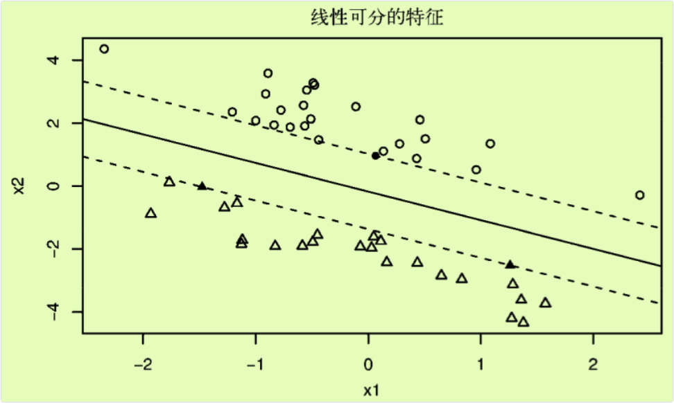
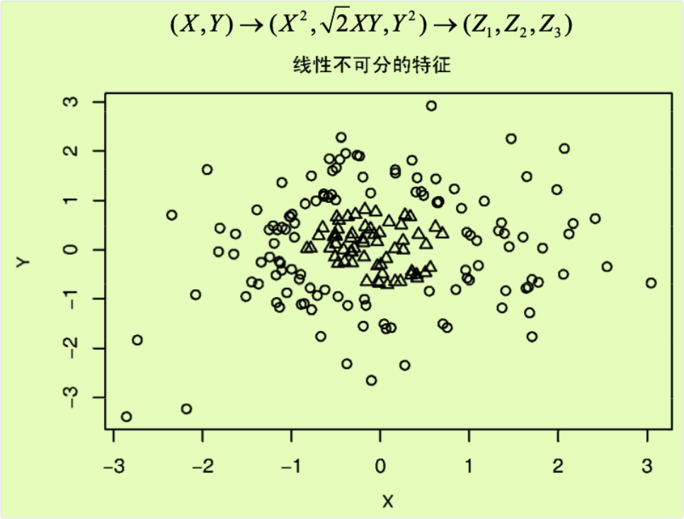
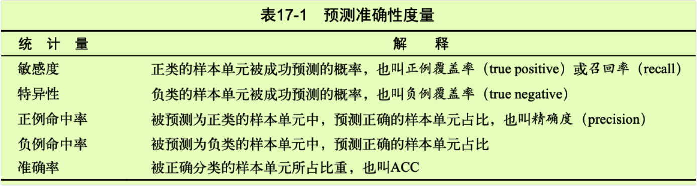

```{r setup, include=FALSE}
knitr::opts_chunk$set(prompt=TRUE,comment='',echo=TRUE,collapse=TRUE,message=FALSE,warning=FALSE)
```

# 17 分类

-   数据分析师经常需要基于一组预测变量预测一个分类结果，如：

-   根据个人信息和财务历史记录预测其是否会还贷；

-   根据重症病人的症状和生命体征判断其是否为心脏病发作；

-   根据关键词、图像、超文本、主题栏、来源等判别一封邮件是否为病毒邮件。

-   上述例子的共同点是根据一组预测变量（或特征）来预测相对应的二分类结果（无信用风险/有信用风险，心脏病发作/心脏病未发作，是病毒邮件/不是病毒邮件），日的是通过某种方法实现对新出现单元的准确分类。

-   有监督机器学习领域中包含许多可用于分类的方法，如逻辑回归、决策树、随机森林、支持向量机、神经网络等。本章将着重探讨前四种方法，神经网络超出了本书的范围。

-   有监督学习基于一组包含预测变量值和输出变量值的样本单元。将全部数据分为一个训练集和一个验证集，其中训练集用于建立预测模型，验证集用于测试模型的准确性。对训练集和验证集的划分尤其重要，因为任何分类技术都会最大化给定数据的预测效果。用训练集建立模型并测试模型会使得模型的有效性被过分夸大，而用单独的验证集来测试基于训练集得到的模型则可使得估计更准确、更切合实际。得到一个有效的预测模型后，就可以预测那些只知道预测变量值的样本单元对应的输出值了。

-   本章将通过rpart、rpart·plot和party包来实现决策树模型及其可视化，通过randomForest包拟合随机森林，通过e1071包构造支持向量机，通过R中的基本函数`glm()`实现逻辑回归。在正式开始前，请先确保计算机中已安装必备的程序包：

<!-- -->

    pkgs <-c("rpart","rpart.plot","party", "randomForest","e1071") 
    install.packages(pkgs,depend=TRUE)

-   本章的主要例子来源于UC机器学习数据库中的威斯康星州乳腺癌数据。数据分析的目的是根据细胞组织细针抽吸活检所反映的特征，来判断被检者是否患有乳腺癌（细胞组织样本单元由空心细针在皮下肿块中抽得）。

## 17.1 数据准备

-   威斯康星州乳腺癌数据集是一个由逗号分隔的txt文件，可在UCI机器学习数据库([http:/archive.ics.uci.edu/ml)中找到。本数据集包含699个细针抽吸活检的样本单元，其中458个(65.5%)为良性样本单元，241个(34.5%)为恶性样本单元。数据集中共有11个变量，表中未标明变量名。共有16个样本单元中有缺失数据并用问号](http:/archive.ics.uci.edu/ml)中找到。本数据集包含699个细针抽吸活检的样本单元，其中458个(65.5%)为良性样本单元，241个(34.5%)为恶性样本单元。数据集中共有11个变量，表中未标明变量名。共有16个样本单元中有缺失数据并用问号){.uri}(?)表示。

-   数据集中包含的变量包括：

-   ID

-   肿块厚度

-   细胞大小的均匀性

-   细胞形状的均匀性

-   边际附着力

-   单个上皮细胞大小

-   裸核

-   乏味染色体

-   正常核

-   有丝分裂

-   类别

-   第一个变量D不纳入数据分析，最后一个变量（类别）即输出变量（编码为良性=2，恶性=4）。

-   对于每一个样本来说，另外九个变量是与判别恶性肿瘤相关的细胞特征，并且得到了记录。这些细胞特征得分为1（最接近良性）至10（最接近病变）之间的整数。任一变量都不能单独作为判别良性或恶性的标准，建模的目的是找到九个细胞特征的某种组合，从而实现对恶性肿瘤的准确预测。Mangasarian和Wolberg在其1990年的文章中详细探讨了这个数据集。

-   下面给出R中数据准备流程。数据从UCI数据库中抽取，并随机分出训练集和验证集，其中训练集中包含499个样本单元（占70%），其中良性样本单元329个，恶性160个；验证集中包含210个样本单元（占30%），其中良性129个，恶性81个。

-   代码清单17-1 乳腺癌数据准备

```{r}
loc <- "http://archive.ics.uci.edu/ml/machine-learning-databases/" 
ds <- "breast-cancer-wisconsin/breast-cancer-wisconsin.data" 
url <- paste(loc,ds,sep="")

breast <- read.table(url,sep=",",header=FALSE,na.strings="?") 
names(breast) <- c("ID","clumpThickness","sizeUniformity","shapeUniformity","maginalAdhesion",
                   "singleEpithelialCellsize","bareNuclei","blandchromatin","normalNucleoli",
                   "mitosis","class")
df <- breast[-1]
df$class <- factor(df$class,levels=c(2,4),labels=c("benign","malignant"))

set.seed(1234)
train <- sample(nrow(df),0.7*nrow(df)) 
df.train <- df[train,]
df.validate <- df[-train,]
table(df.train$class) 
table(df.validate$class)
```

-   训练集将用于建立逻辑回归、决策树、条件推断树、随机森林、支持向量机等分类模型，测试集用于评估各个模型的有效性。本章采用相同的数据集，因此可以直接比较各个方法的结果。

## 17.2 逻辑回归

-   逻辑回归(logistic regression)是广义线性模型的一种，可根据一组数值变量预测二元输出(13.2节有详细介绍)。R中的基本函数`glm()`可用于拟合逻辑回归模型。`glm()`函数自动将预测变量中的分类变量编码为相应的虚拟变量。威斯康星乳腺癌数据中的全部预测变量都是数值变量，因此不必要对其编码。下面给出R中逻辑回归流程。

-   代码清单17-2 使用`glm()`进行逻辑回归

```{r}
# 拟合逻辑回归
fit.logit <- glm(class~.,data=df.train,family=binomial()) 
# 检查模型
summary(fit.logit)
# 对训练集集外样本单元分类
prob <- predict(fit.logit,df.validate,type="response") 
logit.pred <- factor(prob >.5,levels=c(FALSE,TRUE),labels=c("benign","malignant"))
# 评估预测准确性
logit.perf <- table(df.validate$class,logit.pred,dnn=c("Actual","Predicted"))
logit.perf
```

-   首先，以类别为响应变量，其余变量为预测变量。基于df.train数据框中的数据构造逻辑回归模型。接着给出了模型中的系数。系数解释见13.2节。

-   接着，采用基于df.train建立的模型来对df.validate数据集中的样本单元分类。`predict()`函数默认输出肿瘤为恶性的对数概率，指定参数type="response"即可得到预测肿瘤为恶性的概率。样本单元中，概率大于0.5的被分为恶性肿瘤类，概率小于等于0.5的被分为良性肿瘤类。

-   最后给出预测与实际情况对比的交叉表(即混淆矩阵，confusion matriⅸ)。模型正确判别了129个类别为良性的患者和69个类别为恶性的患者。另外，df.validate数据集中有10个样本单元因包含缺失数据而无法判别。

-   在验证集上，正确分类的模型(即准确率，accuracy)为(69+129)/205=96.6%，17.4节中将进一步探讨评估模型有效性的统计量。

-   同时要注意的是，模型中有三个预测变量(sizeUniformity、shapeUniformity和singleEpithelialCellSize)的系数未通过显著性检验（即p值大于0.1）。从预测的角度来说，我们一般不会将这些变量纳入最终模型。当这类不包含相关信息的变量特别多时，可以直接将其认定为模型中的噪声。

-   在这种情况下，可用逐步逻辑回归生成一个包含更少解释变量的模型，其目的是通过增加或移除变量来得到一个更小的AIC值。具体到这一案例，可通过：

`logit.fit.reduced <- step(fit.logit)`

-   来得到一个精简的模型。这样，上面提到的三个变量就从最终模型中移除，这种精简后的模型在验证集上的误差相对全变量模型更小。

## 17.3 决策树

-   决策树是数据挖掘领域中的常用模型。其基本思想是对预测变量进行二元分离，从而构造一棵可用于预测新样本单元所属类别的树。本节将介绍两类决策树：经典树和条件推断树。

### 17.3.1 经典决策树

-   经典决策树以一个二元输出变量（对应威斯康星州乳腺癌数据集中的良性/恶性）和一组预测变量（对应九个细胞特征）为基础。具体算法如下。

-   (1)选定一个最佳预测变量将全部样本单元分为两类，实现两类中的纯度最大化（即一类中良性样本单元尽可能多，另一类中恶性样本单元尽可能多）。如果预测变量连续，则选定一个分割点进行分类，使得两类纯度最大化；如果预测变量为分类变量（本例中未体现），则对各类别进行合并再分类。

-   (2)对每一个子类别继续执行步骤(1)。

-   (3)重复步骤(1)\~(2)，直到子类别中所含的样本单元数过少，或者没有分类法能将不纯度下降到一个给定阈值以下。最终集中的子类别即终端节，点（terminal node）。根据每一个终端节点中样本单元的类别数众数来判别这一终端节点的所属类别。

-   (4)对任一样本单元执行决策树，得到其终端节点，即可根据步骤3得到模型预测的所属类别。

-   不过，上述算法通常会得到一棵过大的树，从而出现过拟合现象。结果就是，对于训练集外单元的分类性能较差。为解决这一问题，可采用10折交叉验证法选择预测误差最小的树。这一剪枝后的树即可用于预测。

-   R中的rpart包支持`rpart()`函数构造决策树，`prune()`函数对决策树进行剪枝。下面给出判别细胞为良性或恶性的决策树算法实现。

-   代码清单17-3 使用`rpart()`函数创建分类决策树

```{r}
# 生成树
library(rpart)
set.seed(1234)
dtree <- rpart(class ~.,data=df.train,method="class",parms=list(split="information"))
dtree$cptable

plotcp(dtree)
```

-   图17-1 复杂度参数与交叉验证误差。虚线是基于一个标准差准则得到的上限(0.12+1×0.0264=0.146)。从图像来看，应选择虚线下最左侧cp值对应的树

```{r}
# 剪枝
dtree.pruned <- prune(dtree,cp=.0125)
library(rpart.plot)
prp(dtree.pruned,type = 2,extra = 104,fallen.leaves = TRUE,main="Decision Tree")
```

-   图17-2 用剪枝后的传统决策树预测癌症状态。从树的顶端开始，如果条件成立则从左枝往下，否则从右枝往下。当观测点到达终端节点时，分类结束。每一个节点处都有对应类别的概率以及样本单元的占比

```{r}
# 对训练集外样本单元分类
dtree.pred <- predict(dtree.pruned,df.validate,type="class") 
dtree.perf <- table(df.validate$class,dtree.pred,dnn=c("Actual","Predicted"))
dtree.perf
```

-   首先，`rpart()`函数可用于生成决策树。print(dtree)和summary(dtree)可用于观测所得模型，此时所得的树可能过大，需要剪枝。

-   `rpart()`返回的cptable值中包括不同大小的树对应的预测误差，因此可用于辅助设定最终的树的大小。其中，复杂度参数(cp)用于惩罚过大的树；树的大小即分支数(nsplit)，有n个分支的树将有n+1个终端节点；rel error栏即训练集中各种树对应的误差；交叉验证误差(xerror)即基于训练样本所得的10折交叉验证误差；xstd栏为交叉验证误差的标准差。

-   借助`plotcp()`函数可画出交叉验证误差与复杂度参数的关系图（如图17-1所示）。对于所有交叉验证误差在最小交叉验证误差一个标准差范围内的树，最小的树即最优的树。

-   本例中，最小的交叉验证误差为0.12，标准误差为0.0264，则最优的树为交叉验证误差在0.12±0.0264(0.094和0.146)之间的树。由代码清单17-3的cptable表可知，四个终端节点(即三次分割)的树满足要求(交叉验证误差为0.1588235)：根据图17-1也可以选得最优树，即三次分割(四个节点)对应的树。

-   在完整树的基础上，`prune()`函数根据复杂度参数剪掉最不重要的枝，从而将树的大小控制在理想范围内。从代码清单17-3的cptable中可以看到，三次分割对应的复杂度参数为0.0125，从而`prune(dtree,cp=0.0125)`可得到一个理想大小的树。

-   rpart·plot包中的`prp()`函数可用于画出最终的决策树，如图17-2所示。`prp()`函数中有许多可供选择的参数(详见？prp)，如type=2可画出每个节点下分割的标签，extra=104可画出每一类的概率以及每个节点处的样本占比，`fallen.leaves:=TRUE`可在图的底端显示终端节点。对观测点分类时，从树的顶端开始，若满足条件则从左枝往下，否则从右枝往下，重复这个过程直到碰到一个终端节点为止。该终端节点即为这一观测点的所属类别。

-   最后，`predict()`函数用来对验证集中的观测点分类3。代码清单17-3给出了实际类别与预测类别的交叉表。整体来看，验证集中的准确率达到了96%。与逻辑回归不同的是，验证集中的210个样本单元都可由最终树来分类。值得注意的是，对于水平数很多或缺失值很多的预测变量，决策树可能会有偏。

### 17.3.2 条件推断树

-   在介绍随机森林之前，我们先介绍传统决策树的一种重要变体，即条件推断树(conditionalinference tree)。条件推断树与传统决策树类似，但变量和分割的选取是基于显著性检验的，而不是纯净度或同质性一类的度量。显著性检验是置换检验(详见第12章)。

-   条件推断树的算法如下。

-   (1)对输出变量与每个预测变量间的关系计算值。

-   (2)选取p值最小的变量。

-   (3)在因变量与被选中的变量间尝试所有可能的二元分割（通过排列检验），并选取最显著的分割。

-   (4)将数据集分成两群，并对每个子群重复上述步骤。

-   (5)重复直至所有分割都不显著或已到达最小节点为止。

-   条件推断树可由party包中的`ctree()`函数获得。代码清单17-4对乳腺癌数据生成条件推断树。

-   代码清单17-4 使用`ctree()`函数创建条件推断树

```{r}
library(party)
fit.ctree <- ctree(class~.,data=df.train)
plot(fit.ctree,main="Conditional Inference Tree")

ctree.pred <- predict(fit.ctree,df.validate,type="response") 
ctree.perf <- table(df.validate$class,ctree.pred,dnn=c("Actual","Predicted"))
ctree.perf
```

-   图17-3 乳腺癌数据的条件推断树

-   值得注意的是，对于条件推断树来说，剪枝不是必需的，其生成过程相对更自动化一些。另外，party包也提供了许多图像参数。图17-3展示了一棵条件推断树，每个节点中的阴影区域代表这个节点对应的恶性肿瘤比例。

-   用形如`ctree()`的图展示`rpart()`生成的决策树

-   如果你通过`rpart()`函数得到一棵经典决策树，但想要以图17-3的形式展示这棵决策树，则可借助partykit包。安装并载入这个包后，可通过`plot(as,party(an.rpart.tree)`绘制想要的图。例如，可以尝试对代码清单17-3中生成的`dtree.pruned`画出类似于图17-3的图，并与图17-2中的结果对照。

-尽管在这个例子中，传统决策树和条件推断树的准确度比较相似，但有时它们可能会很不一样。下一节中，我们将生成并组合大量决策树，从而对样本单元进行分类。

## 17.4 随机森林

-   随机森林（random forest）是一种组成式的有监督学习方法。在随机森林中，我们同时生成多个预测模型，并将模型的结果汇总以提升分类准确率。Leo Breiman和Adele Cutler在（[http:/mng.bz/7Nul）上有关于随机森林的详尽介绍](http:/mng.bz/7Nul）上有关于随机森林的详尽介绍){.uri}。

-   随机森林的算法涉及对样本单元和变量进行抽样，从而生成大量决策树。对每个样本单元来说，所有决策树依次对其进行分类。所有决策树预测类别中的众数类别即为随机森林所预测的这一样本单元的类别。

-   假设训练集中共有N个样本单元，M个变量，则随机森林算法如下。

-   (1)从训练集中随机有放回地抽取N个样本单元，生成大量决策树。

-   (2)在每一个节点随机抽取m\<M个变量，将其作为分割该节点的候选变量。每一个节点处的变量数应一致。

-   (3)完整生成所有决策树，无需剪枝（最小节点为1）。

-   (4)终端节点的所属类别由节点对应的众数类别决定。

-   (5)对于新的观测点，用所有的树对其进行分类，其类别由多数决定原则生成。

-   生成树时没有用到的样本点所对应的类别可由生成的树估计，与其真实类别比较即可得到袋外预测（out-of-bag，OOB）误差。无法获得验证集时，这是随机森林的一大优势。随机森林算法可计算变量的相对重要程度，这将在下文中介绍。

-   randomForest包中的`candomForest()`函数可用于生成随机森林。函数默认生成500棵树，并且默认在每个节点处抽取sqrt(M)个变量，最小节点为1。

-   代码清单17-5给出了用随机森林算法对乳腺癌数据预测恶性类的代码和结果。

-   代码清单17-5 随机森林

```{r}
# 生成森林
library(randomForest) 
set.seed(1234)
fit.forest <- randomForest(class~.,data=df.train,na.action=na.roughfix, importance=TRUE)
fit.forest

# 给出变量重要性
importance(fit.forest,type=2)

# 对训练集外样本点分类
forest.pred <- predict(fit.forest,df.validate)
forest.perf <- table(df.validate$class,forest.pred,dnn=c("Actual","Predicted"))
forest.perf
```

-   首先，`randomForest()`函数从训练集中有放回地随机抽取489个观测点，在每棵树的每个节点随机抽取3个变量，从而生成了500棵传统决策树。`na.action=na.roughfix`参数可将数值变量中的缺失值替换成对应列的中位数，类别变量中的缺失值替换成对应列的众数类（若有多个众数则随机选一个）。

-   随机森林可度量变量重要性，通过设置`information=TRUE`参数得到，并通过`importance()`函数输出。由type=2参数得到的变量相对重要性就是分割该变量时节点不纯度（异质性）的下降总量对所有树取平均。节点不纯度由Gini系数定义。本例中，sizeUniformity是最重要的变量，mitosis是最不重要的变量。

-   最后，再通过随机森林算法对验证集中的样本单元进行分类，并计算预测准确率。分类时剔除验证集中有缺失值的单元。总体来看，对验证集的预测准确率高达98%。

-   randomForest包根据传统决策树生成随机森林，而party包中的`cforest()`函数则可基于条件推断树生成随机森林。当预测变量间高度相关时，基于条件推断树的随机森林可能效果更好。

-   相较于其他分类方法，随机森林的分类准确率通常更高。另外，随机森林算法可处理大规模问题（即多样本单元、多变量），可处理训练集中有大量缺失值的数据，也可应对变量远多于样本单元的数据。可计算袋外预测误差（00B error)、度量变量重要性也是随机森林的两个明显优势。

-   随机森林的一个明显缺点是分类方法（此例中相当于500棵决策树）较难理解和表达。另外，我们需要存储整个随机森林以对新样本单元分类。

-   下一节将讨论本章最后一个分类模型：支持向量机。

## 17.5 支持向量机

-   支持向量机（SVM）是一类可用于分类和回归的有监督机器学习模型。其流行归功于两个方面：一方面，他们可输出较准确的预测结果；另一方面，模型基于较优雅的数学理论。本章将介绍支持向量机在二元分类问题中的应用。

-   SVM旨在在多维空间中找到一个能将全部样本单元分成两类的最优平面，这一平面应使两类中距离最近的点的间距(margin)尽可能大，在间距边界上的点被称为支持向量(support vector，它们决定间距)，分割的超平面位于间距的中间。

-   对于一个W维空间（即N个变量）来说，最优超平面（即线性决策面，linear decision surface）为N-1维。当变量数为2时，曲面是一条直线；当变量数为3时，曲面是一个平面；当变量数为10时，曲面就是一个九维的超平面。当然，这并不是太好想象。

-   下面来看图17-4中的二维问题。圆圈和三角形分别代表两个不同类别，间距即两根虚线间的距离。虚线上的点（实心的圆圈和三角形）即支持向量。在二维问题中，最优超平面即间距中的黑色实线。在这个理想化案例中，这两类样本单元是线性可分的，即黑色实线可以无误差地准确区分两类。



-   图17-4 线性可分的二分类问题。对应的超平面即黑色实线，间距即黑色实线与两根虚线间的距离，实心圆圈和三角形是支持向量

-   最优超平面可由一个二次规划问题解得。二次规划问题限制一侧样本点的输出值为+1，另一侧的输出值为-1，在此基础上最优化间距。若样本点"几乎"可分（即并非所有样本点都集中在一侧），则在最优化中加入惩罚项以容许一定误差，从而生成"软"间隔。

-   不过有可能数据本身就是非线性的。比如图17-5中就不存在完全分开圆圈和三角形的线。在这种情况下，SVM通过核函数将数据投影到高维，使其在高维线性可分。可以想象对图17-5的数据投影，从而将圆圈从纸上分离出来，使其位于三角形上方的平面。一种方法是将二维数据投影到三维空间：



-   图17-5 当两类线性不可分时的分类问题，此时无法用一个超平面（即一条线）分开这两类

-   这样，我们就可以用一张硬纸片将三角形与圆圈分开（一个二维平面变成了一个三维空间）。SVM的数学解释比较复杂，不在本书的讨论范围内。Statnijov、Aliferis、Hardin和Guyon在2011年做了一个直观清晰的关于SVM的展示，介绍了SVM中一些概念性的细节，同时避免了复杂的数学推导。

-   SVM可以通过R中kernlab包的`ksvm()`函数和e1071包中的`svm()`函数实现。`ksvm()`功能更强大，但`sv()`相对更简单。代码清单17-6给出了通过`sv()`函数对威斯康星州乳腺癌数据建立SVM模型的一个示例。

-   代码清单17-6 支持向量机

```{r}
library(e1071) 
set.seed(1234)
fit.svm <- svm(class~.,data=df.train) 
fit.svm

svm.pred <- predict(fit.svm,na.omit(df.validate)) 
svm.perf <- table(na.omit (df.validate)$class,svm.pred,dnn=c("Actual","Predicted"))
svm.perf
```

-   由于方差较大的预测变量通常对SVM的生成影响更大，`svm()`函数默认在生成模型前对每个变量标准化，使其均值为0、标准差为1。从结果来看，SVM的预测准确率不错，但不如17.4节中介绍的随机森林方法。与随机森林算法不同的是，SVM在预测新样本单元时不允许有缺失值出现。

### 17.5.1 选择调和参数

-   `svm()`函数默认通过径向基函数(Radial Basis Function,RBF)将样本单元投射到高维空间。一般来说RBF核是一个比较好的选择，因为它是一种非线性投影，可以应对类别标签与预测变量间的非线性关系。

-   在用带RBF核的SVM拟合样本时，两个参数可能影响最终结果：gamma和成本(cost)。gamma是核函数的参数，控制分割超平面的形状。gamma越大，通常导致支持向量越多。我们也可将gamma看作控制训练样本"到达范围"的参数，即gamma越大意味着训练样本到达范围越广，而越小则意味着到达范围越窄。gamma必须大于0。

-   成本参数代表犯错的成本。一个较大的成本意味着模型对误差的惩罚更大，从而将生成一个更复杂的分类边界，对应的训练集中的误差也会更小，但也意味着可能存在过拟合问题，即对新样本单元的预测误差可能很大。较小的成本意味着分类边界更平滑，但可能会导致欠拟合。与gamma一样，成本参数也恒为正。

-   `svm()`函数默认设置gamma为预测变量个数的倒数，成本参数为1。不过gamma与成本参数的不同组合可能生成更有效的模型。在建模时，我们可以尝试变动参数值建立不同的模型，但利用格点搜索法可能更有效。可以通过`tune.svm()`对每个参数设置一个候选范围，`tune.svm()`函数对每一个参数组合生成一个SVM模型，并输出在每一个参数组合上的表现。代码清单17-7给出了一个示例。

-   代码清单17-7 带RBF核的SVM模型

```{r}
# 变换参数
set.seed(1234)
tuned <- tune.svm(class~.,data=df.train,gamma=10^(-6:1),cost=10^(-10:10))
tuned # 输出最优模型

# 用这些参数拟合模型
fit.svm <- svm(class~.,data=df.train,gamma=.01,cost=1)  

# 评估交叉验证表现
svm.pred <- predict(fit.svm,na.omit(df.validate))
svm.perf <- table(na.omit(df.validate)$class,svm.pred,dnn=c("Actual","Predicted"))
svm.perf
```

-   首先，对不同的gamma和成本拟合一个带RBF核的SVM模型。我们一共将尝试八个不同的gamma(从0.000001到10)以及21个成本参数（从0.01到1010）。总体来说，我们共拟合了168(8×21)个模型，并比较了其结果。训练集中10折交叉验证误差最小的模型所对应的参数为gamm=0.1，成本参数为1。

-   基于这一参数值组合，我们对全部训练样本拟合出新的SVM模型，然后用这一模型对验证集中的样本单元进行预测，并给出错分个数。在本例中，调和后的模型轻微减少了错分个数(从7减少到6)。一般来说，为SVM模型选取调和参数通常可以得到更好的结果。

-   如前所述，由于SVM适用面比较广，它目前是很流行的一种模型。SVM也可以应用于变量数远多于样本单元数的问题，而这类问题在生物医药行业很常见，因为在DNA微序列的基因表示中，变量数通常比可用样本量的个数高1\~2个量级。

-   与随森林类似，SVM的一大缺点是分类准则比较难以理解和表述。SVM从本质上来说是一个黑盒子。另外，SVM在对大量样本建模时不如随机森林，但只要建立了一个成功的模型，在对新样本分类时就没有问题了。

## 17.6 选择预测效果最好的解

-   在17.1\~17.3节中，我们通过几种有监督机器学习方法对细针抽吸活检细胞进行分类，但如何从中选出最准确的方法呢？首先需要在二分类情况下定义准确。

-   最常用的一个统计量是准确率(accuracy)，即分类器是否总能正确划分样本单元。不过，尽管准确率承载的信息量很大，这一指标仍不足以选出最准确的方法。我们还需要其他信息来评估各种分类方法的有效性。

-   假设我们现在需要判别一个人是否患有精神分裂症。精神分裂症是一种极少见的生理障碍，人群中的患病率约为1%。如果一种分类方法将全部人都判为未患病，则这一分类器的准确率将达到99%，但它会把所有患精神分裂症的人都判别成健康人。从这个角度来说它显然不是一个好的分类器。因此，在准确率之外，你一般还应该问问以下问题。

-   患有精神分裂症的人中有多大比例成功鉴别？

-   未患病的人中有多大比例成功鉴别？

-   如果一个人被鉴别为精神分裂症患者，这个判别有多大概率是准确的？

-   如果一个人被鉴别为未患病，这个判别又有多大概率是准确的？

-   上述问题涉及一个分类器的敏感度(sensitivity)、特异性(sensitivity)、正例命中率(positivepredictive power)和负例命中率(negative predictive power)。这四个概念的定义见表17-1。



- 下面给出计算这几个统计量的函数。

- 代码清单17-8 评估二分类准确性

```{r}
performance <- function(table,n=2){ 
  if(!all(dim(table)==c(2,2)))
    stop("Must be a 2 x 2 table")
  tn = table[1,1] 
  fp = table[1,2] 
  fn = table[2,1] 
  tp = table[2,2]
  sensitivity = tp/(tp+fn) 
  specificity = tn/(tn+fp) 
  ppp = tp/(tp+fp) 
  npp = tn/(tn+fn)
  hitrate = (tp+tn)/(tp+tn+fp+fn)
  result <- paste("Sensitivity =", round(sensitivity,n),"\nSpecificity = ",round(specificity,n),
                  "InPositive Predictive value = ", round(ppp,n), 
                  "\nNegative Predictive Value = ", round(npp,n), 
                  "\nAccuracy = ", round(hitrate,n),"\n",sep="")
  cat(result)
  }
```

- 给定真值（行）和预测值（列），`performance()`函数可给出这五个准确性度量的值。具体来说，函数首先提取出负类中正确的个数（良性组织被判别为良性）、负类中错分的个数（恶性组织被判为良性）、正类中错分的个数（良性组织被判为恶性）、正类中正确的个数（恶性组织被判为恶性）。这些计数即可用于计算敏感度、特性性、正例命中率、负例命中率和准确率。最后，函数将显示规范后的结果。

- 以下代码清单将`performance()`函数用于本章提到的五个分类器。

- 代码清单17-9 乳腺癌数据分类器的性能

```{r}
performance(logit.perf)

performance(dtree.perf)

performance(ctree.perf)

performance(forest.perf)

performance(svm.perf)
```

- 在这个案例中，这些分类器（逻辑回归、传统决策树、条件推断树、随机森林和支持向量机）都表现得相当不错。不过在现实中并不总是这样。

- 在这个案例中，随机森林的表现相对更好。不过各个分类器的差距较小，因此随机森林的优势可能具有一定的偶然性。随机森林成功鉴别了99%的恶性样本和98%的良性样本，总体来说预测准确率高达99%。96%被判为恶性组织的样本单元确实是恶性的（即4%正例错误率)，99%被判为良性组织的样本单元确实是良性的（即1%负例错误率）。从癌症诊断的角度来说，特异性（即成功鉴别恶性样本的概率）这一指标格外重要。

- 我们也可以从特异性和敏感度的权衡中提高分类的性能，但这不在本书的范围之内。在逻辑回归模型中，`predict()`函数可以估计一个样本单元为恶性组织的概率。如果这一概率值大于0.5，则分类器会把这一样本单元判为恶性。这个0.5即阈值（threshold）或门槛值（cutoff value）。通过变动这一阈值，我们可以通过牺牲分类器的特异性来增加其敏感度。这同样适用于决策树、随机森林和支持向量机（尽管语句写法上会有差别）。

- 变动阈值可能带来的影响可以通过ROC(Receiver Operating Characteristic)曲线来进一步观察。ROC曲线可对一个区间内的门槛值画出特异性和敏感度之间的关系，然后我们就能针对特定问题选择特异性和敏感度的最佳组合。许多R包都可以画ROC曲线，如ROCR、pROC等。这些R包中的函数能帮助我们在面对不同问题时，通过比较不同算法的ROC曲线选择最有效的算法。细节见Kuhn&Johnson(2013)，更详尽的讨论见Fawcett(2005)。