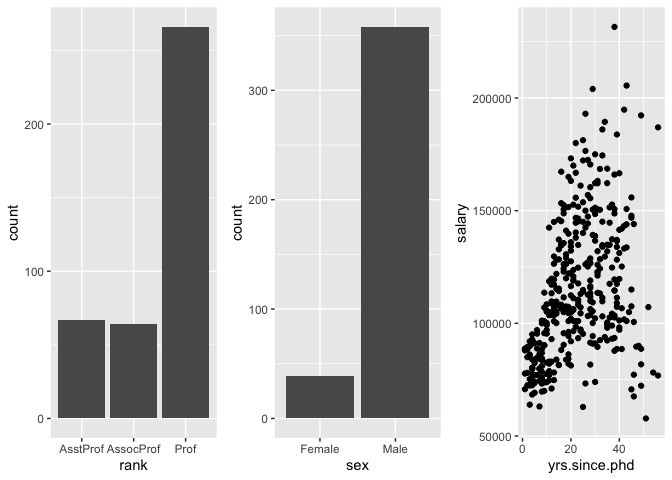

chapter19_ggplot2高级绘图
================

- <a href="#19-使用-ggplot2-进行高级绘图"
  id="toc-19-使用-ggplot2-进行高级绘图">19 使用 ggplot2 进行高级绘图</a>
  - <a href="#191-ggplot2-包介绍" id="toc-191-ggplot2-包介绍">19.1 ggplot2
    包介绍</a>
  - <a href="#192-用几何函数指定图的类型"
    id="toc-192-用几何函数指定图的类型">19.2 用几何函数指定图的类型</a>
  - <a href="#193-分组" id="toc-193-分组">19.3 分组</a>
  - <a href="#194-刻面" id="toc-194-刻面">19.4 刻面</a>
  - <a href="#195-添加光滑曲线" id="toc-195-添加光滑曲线">19.5
    添加光滑曲线</a>
  - <a href="#196-修改-ggplot2-图形的外观"
    id="toc-196-修改-ggplot2-图形的外观">19.6 修改 ggplot2 图形的外观</a>
    - <a href="#1961-坐标轴" id="toc-1961-坐标轴">19.6.1 坐标轴</a>
    - <a href="#1962-图例" id="toc-1962-图例">19.6.2 图例</a>
    - <a href="#1963-标尺" id="toc-1963-标尺">19.6.3 标尺</a>
    - <a href="#1964-主题" id="toc-1964-主题">19.6.4 主题</a>
    - <a href="#1965-多重图" id="toc-1965-多重图">19.6.5 多重图</a>
  - <a href="#197-保存图形" id="toc-197-保存图形">19.7 保存图形</a>

# 19 使用 ggplot2 进行高级绘图

- 在开始画图之前，必须确保在计算机上安装可ggplot2包和car包。同时也需要安装gridExtra包。这个包可以将多个ggplot2所绘图形放在一个图中。

## 19.1 ggplot2 包介绍

- 在ggplot2中，图是采用串联起来(+)号函数创建的。每个函数修改属于自己的部分。下面给出了一个最简单的例子：

``` r
> library(ggplot2) 
> ggplot(data=mtcars, aes(x=wt, y=mpg)) +    
+   geom_point() +    
+   labs(title="Automobile Data", x="Weight", y="Miles Per Gallon")
```

<!-- -->

- 分解作图的步骤：`ggplot()`初始化图形并且指顶要用到的数据来源(mtcars)和变量(wt、mpg)。`aes()`函数的功能是指定每个变量扮演的角色(aes代表aesthetics，即如何用视觉形式呈现信息)。在这里，变量wt的值映射到沿x轴的距离，变量mpg的值映射到沿y轴的距离。

- `ggplot()`函数设置图形但没有自己的视觉输出。使用一个或多个几何函数向图中添加了几何对象(简写为geom)，包括点、线、条、箱线图和阴影区域。在这个例子中，`geom_point()`函数在图形中画点，创建了一个散点图。`labs()`函数是可选的，可添加注释(包括轴标签和标题)。

- 在ggplot2中有很多的函数，并且大多数包含可选的参数。扩展一下前面的例子，代码如下：

``` r
> library(ggplot2) 
> ggplot(data=mtcars, aes(x=wt, y=mpg)) + 
+   geom_point(pch=17, color="blue", size=2) +  
+   geom_smooth(method="lm", color="red", linetype=2) +    
+   labs(title="Automobile Data", x="Weight", y="Miles Per Gallon")
```

<!-- -->

- 选用geom_point()函数来设置点的形状为三角形(pch=17)，点的大小加倍(size=2)，并使颜色为蓝色(color=“blue”)。geom_smooth()函数增加了一条”平滑”曲线。这里需要线性拟合(method=“lm”)，并且产生一条红色(color=“red”)虚线(linetype=2)，线条尺寸为1(size=1)。默认情况下，平滑的曲线包括在95%的置信区间(较暗带)内。

- ggplot2包提供了分组和小面化(faceting)的方法。分组指的是在一个图形中显示两组或多组观察结果。小面化指的是在单独、并排的图形上显示观察组。ggplot2包在定义组或面时使用因子。可以使用mtcars数据集来查看分组和面：

``` r
> # 首先，将am、vs和cyl变量转化为因子
> mtcars$am <- factor(mtcars$am, levels=c(0,1),    
+                     labels=c("Automatic", "Manual")) 
> mtcars$vs <- factor(mtcars$vs, levels=c(0,1),           
+                     labels=c("V-Engine", "Straight Engine")) 
> mtcars$cyl <- factor(mtcars$cyl)
> # 利用下面的代码绘图
> library(ggplot2) 
> ggplot(data=mtcars, aes(x=hp, y=mpg,
+       shape=cyl, color=cyl)) +      
+   geom_point(size=3) +    
+   facet_grid(am~vs) +      
+   labs(title="Automobile Data by Engine Type",       
+        x="Horsepower", y="Miles Per Gallon")
```

<!-- -->

- 上图为包含变速箱类型(自动对手动)和发动机装置(V型发动机与直列式发动机)每个组合的分离的散点图。每个点的颜色和形状表示该汽车发动机汽缸的数量。在本例中，am和vs是刻面变量，cyl是分组变量。

## 19.2 用几何函数指定图的类型

- `ggplot()`函数指定要绘制的数据源和变量，几何函数则指定这些变量如何在视觉上进行表示(使用点、条、线和阴影区)。下表列出了比较常见的几何函数，以及经常使用的选项。

| 函 数            | 添 加    | 选 项                                        |
|------------------|----------|----------------------------------------------|
| geom_bar()       | 条形图   | color、fill、alpha                           |
| geom_boxplot()   | 箱线图   | color、fill、alpha、notch、width             |
| geom_density()   | 密度图   | color、fill、alpha、linetype                 |
| geom_histogram() | 直方图   | color、fill、alpha、linetype、binwidth       |
| geom_hline()     | 水平线   | color、alpha、linetype、size                 |
| geom_jitter()    | 抖动点   | color、size、alpha、shape                    |
| geom_line()      | 线图     | colorvalpha、linetype、size                  |
| geom_point()     | 散点图   | color、alpha、shape、size                    |
| geom_rug()       | 地毯图   | color、side                                  |
| geom_smooth()    | 拟合曲线 | method、formula、color、fill、linetype、size |
| geom_text()      | 文字注解 | 很多,参见函数的”帮助”                        |
| geom_violin()    | 小提琴图 | color、fill、alpha、linetype                 |
| geom_vline()     | 垂线     | color、alpha、linetype、size                 |

| 选 项    | 详 述                                                                                                                                                                        |
|----------|------------------------------------------------------------------------------------------------------------------------------------------------------------------------------|
| color    | 对点、线和填充区域的边界进行着色。                                                                                                                                           |
| fill     | 对填充区域着色，如条形和密度区域。                                                                                                                                           |
| alpha    | 颜色的透明度，从0(完全透明)到1(不透明) 。                                                                                                                                    |
| linetype | 图案的线条(1=实线，2=虚线，3=点，4=点破折号，5=长破折号，6=双破折号)。                                                                                                       |
| size     | 点的尺寸和线的宽度。                                                                                                                                                         |
| shape    | 点的形状(和pch一样，0=开放的方形，1=开放的圆形，2=开放的三角形，等等) ，参见图3-4。                                                                                          |
| position | 绘制诸如条形图和点等对象的位置。对条形图来说，“dodge”将分组条形图并排，“stacked”堆叠分组条形图，“fill”垂直地堆叠分组条形图并规范其高度相等。对于点来说，“jitter”减少点重叠。 |
| binwidth | 直方图的宽度。                                                                                                                                                               |
| notch    | 表示方块图是否应为缺口(TRUE/FALSE)。                                                                                                                                         |
| sides    | 地毯图的安置(“b”=底部，“l”=左部，“t”=顶部，“r”=右部，“bl”=左下部，等等)。                                                                                                    |
| width    | 箱线图的宽度。                                                                                                                                                               |

- 生成直方图的代码：

``` r
> data(singer, package="lattice") 
> ggplot(singer, aes(x=height)) + geom_histogram()
```

<!-- -->

- 生成箱线图的代码：

``` r
> ggplot(singer, aes(x=voice.part, y=height)) + geom_boxplot()
```

<!-- -->

- 上图中，低音歌唱家比高音歌唱家身高更高。虽然性别没有测量在内，但是它也许起了很大的作用。

- **需要注意的是，创建直方图时只有变量x是指定的，但创建箱线图时变量x和y都需要指定。`geom_histgrom()`函数在y变量没有指定时默认对y轴变量计数。具体细节可以参阅每个函数的详细信息和更多示例文件。每个的几何函数具有一组可以用来修改它的表示的选项。**

- 使用Salaries数据集来验证这些选项的使用，代码如下：

``` r
> library(car)
> attach(Salaries)
> library(ggplot2) 
> ggplot(Salaries, aes(x=rank, y=salary)) +    
+   geom_boxplot(fill="cornflowerblue",    
+                color="black", notch=TRUE)+    
+   geom_point(position="jitter", color="blue", alpha=.5)+   
+   geom_rug(side="l", color="black")
```

<!-- -->

- 上图显示了不同学术地位对应薪水的缺口箱线图。实际的观察值(教师)是重叠的，因而给予一定的透明度以避免遮挡箱线图。它们还抖动以减少重叠。最后，一个地毯图设置在左侧以指示薪水的一般扩散。可以看到助理教授、副教授和教授的工资有显著的不同(有一个在箱形图槽口没有重叠)。此外，在薪水方面等级越高方差越大；教授的薪水变化很大。事实上，至少有一位教授的薪水低于副教授；有三位教授的工资非常高，成为了异常点(由教授箱线图的黑点可以看出)。

- 当几何函数组合形成新类型的图时，ggplot2包的真正力量就会得到展现。回到singer数据集中，运行如下代码：

``` r
> library(ggplot2) 
> data(singer, package="lattice") 
> ggplot(singer, aes(x=voice.part, y=height)) +   
+   geom_violin(fill="lightblue") +     
+   geom_boxplot(fill="lightgreen", width=.2)
```

<!-- -->

- 该代码把箱线图和小提琴图结合在一起形成一个新的图形(上图)。箱线图展示了在singer数据框中每个音部的25%、50%和75%分位数得分和任意的异常值。对于每个声部身高范围上的得分分布，小提琴图展示了更多视觉线索。

## 19.3 分组

- 为了理解数据，在一个图中画出两个或更多组的观察值通常是很有帮助的。在R中，组通常用分类变量的水平(因子)来定义。分组是通过ggplot2图将一个或多个带有诸如形状、颜色、填充、尺寸和线类型的视觉特征的分组变量来完成的。`ggplot()`声明中的`aes()`函数负责分配变量(图形的视觉特征)，所以这是一个分配分组变量的自然的地方。

- 用分组来探讨Salaries数据集。数据框包含的信息是在2008\~2009学年大学教授的薪水。变量包括rank(助理教授、副教授、教授)、sex(女性、男性)、yrs.since.phd(获得博士学位年数)、yrs.service(工龄)和salary(以美元计的九个月薪水)。首先，可以查看薪水是如何随学术等级变化的。代码：

``` r
> data(Salaries, package="car") 
> library(ggplot2)
> ggplot(data=Salaries, aes(x=salary, fill=rank)) +     
+   geom_density(alpha=.3)
```

<!-- -->

- 在同一幅图中画出了三条密度曲线(每条曲线代表一个学术等级)并用不同的颜色来区分。填充的设置有些透明度
  (alpha),
  使重叠曲线不掩盖彼此。颜色也相互结合来提高加入地区的可视化。值得注意的是图例是自动产生的。

- 薪水随着等级的增长而增长，但是重叠比较明显，比如一些助理教授与副教授或教授的薪水相同。随着学术等级的增长，薪水的范围也在扩大。对于教授而言尤其如此，他们的收入差距很大。把这三个分布放在同一幅图上方便了组间的比较。

- 接下来，通过性别和学术等级分组，绘制获得博士学位年数与薪水的关系：

``` r
> ggplot(Salaries, aes(x=yrs.since.phd, y=salary, color=rank,   
+                      shape=sex)) + geom_point()
```

<!-- -->

- 在上图中，学术等级用点的颜色来表示(红色代表助理教授,绿色代表副教授,蓝色代表教授)。除此之外，性别用点的形状来表示(圆形代表女性，三角形代表男性)。如果看到的是灰度图像，颜色差异可能很难看出来，最好尝试运行一下自己的代码。需要注意图例还是自动产生的。从图中可以看出，薪水随着毕业年数的增加而增加，但是它们之间的关系绝对不是线性的。

- 最后，可以用一个分组的条形图按学术等级和性别来可视化教授的人数。下面的代码提供了三个条形图的变化：

``` r
> ggplot(Salaries, aes(x=rank, fill=sex)) +     
+   geom_bar(position="stack") + labs(title='position="stack"')  
```

<!-- -->

``` r
> ggplot(Salaries, aes(x=rank, fill=sex)) +   
+   geom_bar(position="dodge") + labs(title='position="dodge"')  
```

<!-- -->

``` r
> ggplot(Salaries, aes(x=rank, fill=sex)) +      
+   geom_bar(position="fill") + labs(title='position="fill"')
```

<!-- -->

- 从前两个图中可以明显看出教授的人数大于其他学术等级的人数。除此之外，女性教授的人数比女性助理教授和副教授的人数要多。第三个图表示即使女性的总数更大，但是女性教授在教授中的比重远远小于其他两组。

- 值得注意的是，第三个图形中y轴的标签是错误的，它应该是比例(proportion)而不是数量(count)。可以通过添加y=“proportion”参数到`labs()`函数来解决。

``` r
> ggplot(Salaries, aes(x=rank, fill=sex)) +      
+   geom_bar(position="fill") + labs(title='position="fill"',y="proportion")
```

<!-- -->

- 选项可以通过不同的方式使用，这取决于它们发生在`aes()`函数的内部还是外部。

``` r
> ggplot(Salaries, aes(x=rank, fill=sex))+ geom_bar() 
```

<!-- -->

``` r
> ggplot(Salaries, aes(x=rank)) + geom_bar(fill="red") 
```

<!-- -->

``` r
> ggplot(Salaries, aes(x=rank, fill="red")) + geom_bar()
```

<!-- -->

- 在第一个例子中，sex变量通过条形图中的填充颜色来展示。在第二个例子中，每个条形图都用红色来填充。在第三个例子，ggplot2假定”red”是变量的名字，并且你得到一个意想不到(不希望)的结果。通常来说，变量应该设在`aes()`函数内，分配常数应该在`aes()`函数外。

## 19.4 刻面

- 如果组在图中并排出现而不是重叠为单一的图形,关系就是清晰的。可以使用`facet_wrap()`函数和`facet_grid()`函数创建网格图形(在ggplot2中也称刻面图)。下表给出了相关的语法，其中var、rowvar和colvar是因子。

| 语 法                      | 结 果                                                        |
|----------------------------|--------------------------------------------------------------|
| facet_wrap(\~var, ncol=n)  | 将每个var水平排列成n列的独立图。                             |
| facet_wrap(\~var, nrow=n)  | 将每个var水平排列成n行的独立图。                             |
| facet_grid(rowvar\~colvar) | rowvar和colvar组合的独立图，其中rowvar表示行，colvar表示列。 |
| facet_grid(rowvar\~.)      | 每个rowvar水平的独立图，配置成一个单列。                     |
| facet_grid(.\~colvar)      | 每个colvar水平的独立图，配置成一个单行。                     |

- 回头看一下合唱的例子，可以使用下面的代码创建一个刻面图：

``` r
> data(singer, package="lattice") 
> library(ggplot2)  
> ggplot(data=singer, aes(x=height)) +      
+   geom_histogram() +     
+   facet_wrap(~voice.part, nrow=4)
```

<!-- -->

- 上图展示了各声部歌手身高的分布。把八个分布分为并排的小图可以方便比较。

- 作为第二个例子，创建一个包含刻面和分组的图：

``` r
> library(ggplot2) 
> ggplot(Salaries, aes(x=yrs.since.phd, y=salary, color=rank,     
+                      shape=rank)) + geom_point() + facet_grid(.~sex)
```

<!-- -->

- 上图包含了相同的信息，但是独立的刻面图使其更容易理解。

- 最后，试着展示singer数据集中每个声部成员的身高分布，并利用核密度图水平排列。给每个声部分配不同的颜色。

``` r
> data(singer, package="lattice")  
> library(ggplot2) 
> ggplot(data=singer, aes(x=height, fill=voice.part)) +      
+   geom_density() +     
+   facet_grid(voice.part~.)
```

<!-- -->

- 上图为各声部歌手身高的刻面密度图。值得注意的是横向排列便于组间比较。虽然颜色不是必要的，但它们可以帮助区分图形。

## 19.5 添加光滑曲线

- 可以使用`geom_smooth()`函数来添加一系列的平滑曲线和和置信区域。

| 选 项     | 描 述                                                                                                                          |
|-----------|--------------------------------------------------------------------------------------------------------------------------------|
| method=   | 使用的平滑函数。允许的值包括lm、glm、smooth、rlm和gam,分别对应线性、广义线性、loess、健壮线性和广义相加模型。smooth是默认值。  |
| formula=  | 在光滑函数中使用的公式。例子包括y\~x(默认) ,y\~log(x),y\~poly(x,n)表示n次多项式拟合y\~ns(x,n)表示一个具有n个自由度的样条拟合。 |
| se        | 绘制置信区间(TRUE/FALSE) 。默认为TRUE。                                                                                        |
| level     | 使用的置信区间水平(默认为95%)。                                                                                                |
| fullrange | 指定拟合应涵盖全图(TRUE)或仅仅是数据(FALSE) 。 默认为FALSE。                                                                   |

- 使用Salaries数据集，我们先检验博士毕业年数和薪水之间的关系。在这个例子中，可以使用带有95%置信区间的非参数光滑曲线(loess)。暂时忽略性别和学术等级。

``` r
> data(Salaries, package="car")
> library(ggplot2)
> ggplot(data=Salaries, aes(x=yrs.since.phd, y=salary)) +     
+   geom_smooth() + geom_point()
```

<!-- -->

- 上图为博士毕业年数与目前薪水之间的关系，加上了一个带有95%置信区间的光滑曲线。图形显示经验和薪水之间不是线性的关系，至少在毕业时间很长的时候是这样。

- 下一步，按性别拟合一个二次多项式回归(一个弯曲)，置信界限被抑制(se=FALSE)来简化图，性别由颜色、符号形状和线条类型来区分：

``` r
> ggplot(data=Salaries, aes(x=yrs.since.phd, y=salary,   
+                           linetype=sex, shape=sex, color=sex)) +       
+   geom_smooth(method=lm, formula=y~poly(x,2),            
+               se=FALSE, size=1) +      
+   geom_point(size=2)
```

<!-- -->

- 上图为男性和女性博士毕业年数和薪水之间的散点图，带有二次拟合曲线。对男性来说，曲线从0增加至约30年然后下降。对女性来说，拟合曲线从0到40年一直呈上升趋势。在数据集中没有女性获得博士学位超过40年。对于数据集中的大部分范围，男性能拿到更高的薪水。

## 19.6 修改 ggplot2 图形的外观

### 19.6.1 坐标轴

- 用于自定义坐标轴的函数：

| 函 数                                        | 选 项                                                                                       |
|----------------------------------------------|---------------------------------------------------------------------------------------------|
| scale_x\_continuous()和scale_y\_continuous() | breaks=指定刻度标记，labels=指定刻度标记标签，limits=控制要展示的值的范围。                 |
| scale_x\_discrete()和scale_y\_discrete()     | breaks=对因子的水平进行放置和排序，labels=指定这些水平的标签，limits=表示哪些水平应该展示。 |
| coord_flip()                                 | 颠倒x轴和y轴。                                                                              |

- 可以看到，ggplot2的函数区分x轴和y轴，以及轴线是否代表一个连续或离散变量(因子)。将这些函数应用到一个分组箱线图中，其中包含按学术等级和性别分组的薪资水平，代码如下：

``` r
> data(Salaries,package="car") 
> library(ggplot2)
> ggplot(data=Salaries, aes(x=rank, y=salary, fill=sex)) +     
+   geom_boxplot() +      
+   scale_x_discrete(breaks=c("AsstProf", "AssocProf", "Prof"),           
+                    labels=c("Assistant\nProfessor",         
+                             "Associate\nProfessor",                               
+                             "Full\nProfessor")) +    
+   scale_y_continuous(breaks=c(50000, 100000, 150000, 200000),            
+                      labels=c("$50K", "$100K", "$150K", "$200K")) +    
+   labs(title="Faculty Salary by Rank and Sex", x="", y="")
```

<!-- -->

- 上图为按学术等级和性别分组的薪资水平的箱线图。坐标轴文本已经自定义。很明显，平均收入随着学术排名的上升而上升，在每个学术等级中男性的薪资水平高于女性。

### 19.6.2 图例

- 当更改图例的标题时，必须考虑图例是否基于颜色、填充、尺寸、形状或它们的组合。标题的位置由`theme()`函数中的`legend.position`选项控制。可能的值包括”left”、“top”、“right”(默认值)和”bottom”。也可以在图中给定的位置指定一个二元素向量。

- 调整上图中的图形，使图例出现在左上角并且将标题从sex变为Gender。可以通过下面的代码来完成这个任务：

``` r
> data(Salaries,package="car")
> library(ggplot2)
> ggplot(data=Salaries, aes(x=rank, y=salary, fill=sex)) +     
+   geom_boxplot() +     
+   scale_x_discrete(breaks=c("AsstProf", "AssocProf", "Prof"),           
+                    labels=c("Assistant\nProfessor",
+                             "Associate\nProfessor",                     
+                             "Full\nProfessor")) +     
+   scale_y_continuous(breaks=c(50000, 100000, 150000, 200000),      
+                      labels=c("$50K", "$100K", "$150K", "$200K")) +    
+   labs(title="Faculty Salary by Rank and Gender",         
+        x="", y="", fill="Gender") +    
+   theme(legend.position=c(.1,.8))
```

<!-- -->

- 在这个例子中，图例的左上角是分别距离左侧边缘10%和底部边缘80%的部分。如果想删除图例，可以使用`legend.position="none"`。

### 19.6.3 标尺

- ggplot2包使用标尺把数据空间的观察值映射到可视化的空间中。标尺既可以应用到连续的变量，也可以应用到离散的变量。连续型的标尺可以映射数值型的变量到图的其他特征。

``` r
> ggplot(mtcars, aes(x=wt, y=mpg, size=disp)) +   
+   geom_point(shape=21, color="black", fill="cornsilk") +        
+   labs(x="Weight", y="Miles Per Gallon",        
+        title="Bubble Chart", size="Engine\nDisplacement")
```

<!-- -->

- `aes()`函数的参数`size=disp`生成连续型变量disp(发动机排量)的标尺，并使用它来控制点的尺寸。结果见上图所示的气泡图。从该图中可以看出汽车里程随重量和发动机排量的降低而降低。

- 在这个离散的例子中，可以使用标尺将带有因子水平的视觉线索(如颜色、形状、线条类型、尺寸和透明度)关联起来。下列代码使用`scale_color_manual()`函数来设定三个学术等级的点的颜色，结果见下图：

``` r
> data(Salaries, package="car") 
> ggplot(data=Salaries, aes(x=yrs.since.phd, y=salary, color=rank)) +   
+   scale_color_manual(values=c("orange", "olivedrab", "navy")) +    
+   geom_point(size=2)
```

<!-- -->

- 上图为薪水与助理教授、副教授、教授经验对比的散点图。点的颜色是人为指定的如果是色弱(比如分不清橙色和紫色)，可以通过`scale_color_brewer()`和`scale_fill_brewer()`函数来预先指定分得清的颜色集。

``` r
> ggplot(data=Salaries, aes(x=yrs.since.phd, y=salary, color=rank)) +        scale_color_brewer(palette="Set1") + geom_point(size=2)
```

<!-- -->

- 把palette=“Set1”用其他的值(例如”Set2”、“Set3”、“Pastel1”、“Pastel2”、“Paired”、“Dark2”或”Accent”)来代替将会产生不同的颜色方案。为了得到可获得的颜色集，可以使用：

  `library(RColorBrewer)`

  `display.brewer.all()`

  来生成一个显示。

``` r
> library(RColorBrewer)
> display.brewer.all()
```

<!-- -->

### 19.6.4 主题

- `theme()`函数中的选项可以让我们调整字体、背景、颜色和网格线等。主题可以使用一次，也可以保存起来应用到多个图中。

``` r
> data(Salaries, package="car") 
> library(ggplot2)  
> mytheme <- theme(plot.title=element_text(face="bold.italic",    
+                                     size="14",color="brown"),
+                  axis.title=element_text(face="bold.italic",                 
+                                     size=10, color="brown"),
+                  axis.text=element_text(face="bold", size=9,             
+                                     color="darkblue"),      
+                  panel.background=element_rect(fill="white",     
+                                     color="darkblue"),  
+                  panel.grid.major.y=element_line(color="grey",    
+                                     linetype=1),          
+                  panel.grid.minor.y=element_line(color="grey",    
+                                     linetype=2),               
+                  panel.grid.minor.x=element_blank(),      
+                  legend.position="top") 
> 
> ggplot(Salaries, aes(x=rank, y=salary, fill=sex)) +  
+   geom_boxplot() +     
+   labs(title="Salary by Rank and Sex", x="Rank", y="Salary") +    
+   mytheme
```

<!-- -->

- 主题mytheme指定了图的标题应该为粗斜体的棕色14号字。轴的标题为粗斜体的棕色10号字。坐标轴标签应为加粗的深蓝色9号字。画图区域有白色的填充和深蓝色的边框。主水平网格应该是灰色的实线，次水平网格应该是灰色的虚线，垂直网格不输出，图例展示在图的顶部。`theme()`函数给了我们把控最后图形的控制权。可以参考`help(theme)`来查看更多关于选项的信息。

### 19.6.5 多重图

- 使用图形参数`mfrow`和基本函数`layout()`把两个或更多的基本图放到单个图形中，这种方法在ggplot2包中不适用。将多个ggplot2包的图形放到单个图形中最简单的方式是使用gridExtra包中的`grid.arrange()`函数。在使用前需要事先安装这个包`(install.packages("gridExtra"))`。

- 创建三个ggplot2图并把它们放在单个图形中：

``` r
> library(car)
> attach(Salaries)
> library(ggplot2) 
> p1 <- ggplot(data=Salaries, aes(x=rank)) + geom_bar() 
> p2 <- ggplot(data=Salaries, aes(x=sex)) + geom_bar() 
> p3 <- ggplot(data=Salaries, aes(x=yrs.since.phd, y=salary)) + geom_point()  
> # 用grid.arrange()函数保存到单个图形中
> library(gridExtra) 
> grid.arrange(p1, p2, p3, ncol=3)
```

<!-- -->

## 19.7 保存图形

- `ggsave()`函数能更方便地保存它。它的选项包括保存哪幅图形，保存在哪里和以什么形式保存。例如：

``` r
> myplot <- ggplot(data=mtcars, aes(x=mpg)) + geom_histogram() 
> ggsave(file="mygraph-19.7.png", plot=myplot, width=5, height=4)
```

- 在当前路径下将myplot保存为名为mygraph-19.7.png的5英寸×4英寸(12.7厘米×10.2厘米)PNG格式的图片。可以通过设定文件扩展名为ps、tex、jpeg、pdf、tiff、png、bmp、svg或wmf来保存为不同的格式。wmf文件仅限在装有Windows系统的计算机中保存。

- 如果忽略plot=选项，最近创建的图形会被保存。下列代码是有效的，并把图形保存到磁盘：

``` r
> ggplot(data=mtcars, aes(x=mpg)) + geom_histogram() 
```

<!-- -->

``` r
> ggsave(file="mygraph-19.7.pdf")
```
