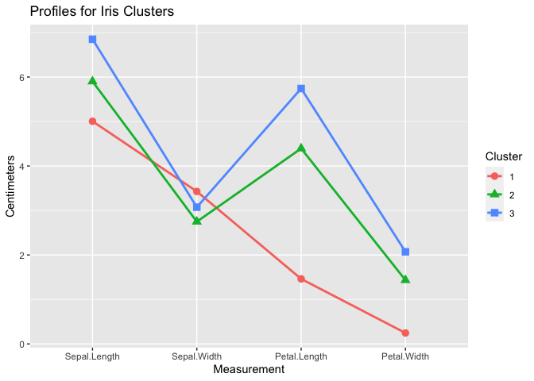
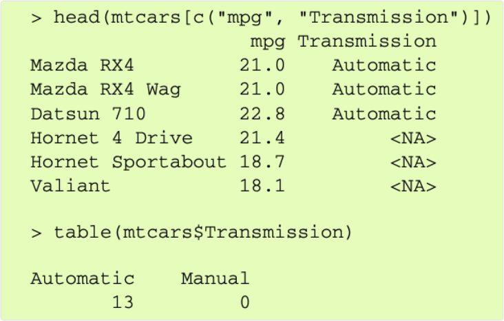
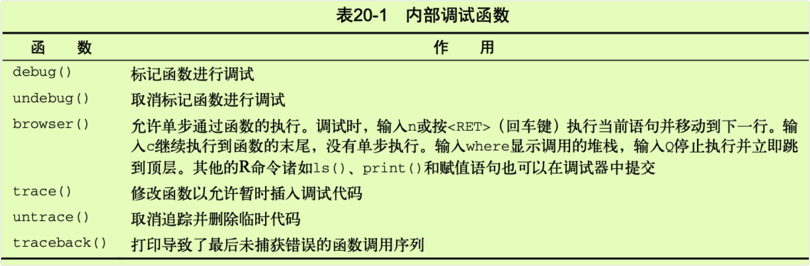

chapter20_高级编程
================

- <a href="#20-高级编程" id="toc-20-高级编程">20 高级编程</a>
  - <a href="#201-r语言回顾" id="toc-201-r语言回顾">20.1 R语言回顾</a>
    - <a href="#2011-数据类型" id="toc-2011-数据类型">20.1.1 数据类型</a>
    - <a href="#2012-控制结构" id="toc-2012-控制结构">20.1.2 控制结构</a>
    - <a href="#2013-创建函数" id="toc-2013-创建函数">20.1.3 创建函数</a>
  - <a href="#202-环境" id="toc-202-环境">20.2 环境</a>
  - <a href="#203-面向对象的编程" id="toc-203-面向对象的编程">20.3
    面向对象的编程</a>
    - <a href="#2031-泛型函数" id="toc-2031-泛型函数">20.3.1 泛型函数</a>
    - <a href="#2032-s3模型的限制" id="toc-2032-s3模型的限制">20.3.2
      S3模型的限制</a>
  - <a href="#204-编写有效的代码" id="toc-204-编写有效的代码">20.4
    编写有效的代码</a>
    - <a href="#2041-有效的数据输入" id="toc-2041-有效的数据输入">20.4.1
      有效的数据输入</a>
    - <a href="#2042-矢量化" id="toc-2042-矢量化">20.4.2 矢量化</a>
    - <a href="#2043-大小正确的对象" id="toc-2043-大小正确的对象">20.4.3
      大小正确的对象</a>
    - <a href="#2044-并行化" id="toc-2044-并行化">20.4.4 并行化</a>
  - <a href="#205-调试" id="toc-205-调试">20.5 调试</a>
    - <a href="#2051-常见的错误来源" id="toc-2051-常见的错误来源">20.5.1
      常见的错误来源</a>
    - <a href="#2052-调试工具" id="toc-2052-调试工具">20.5.2 调试工具</a>

# 20 高级编程

## 20.1 R语言回顾

- R是一种面向对象的、实用的数组编程语言，其中的对象是专门的数据结构，存储在RAM中，通过名称或符号访问。对象的名称由大小写字母、数字0\~9、句号和下划线组成。名称是区分大小写的，而且不能以数字开头；句号被视为没有特殊含义的简单字符。

- 不像C和C++语言，在R语言中不能直接得到内存的位置。可以被存储和命名的数据、函数和其他任何东西都是对象。另外，名称和符号本身是可以被操纵的对象。所有的对象在程序执行时都存储在RAM中，这对大规模数据分析有显著的影响。

- 每一个对象都有属性：元信息描述对象的特性。属性能通过`attributes()`函数罗列出来并能通过`attr()`函数进行设置。一个关键的属性是对象的类。R函数使用关于对象类的信息来确定如何处理对象。可以使用`class()`函数来读取和设置对象的类。在本章中会给出相关的例子。

### 20.1.1 数据类型

- 有两种最基本的数据类型：原子向量(atomic vector)和泛型向量(generic
  vector)。原子向量是包含单个数据类型的数组。泛型向量也称为列表，是原子向量的集合。列表是递归的，因为它们还可以包含其他列表。本节会详细讨论这两种类型。

- 与许多语言不同，在R中不必声明对象的数据类型或是分配的空间。数据的类型由对象的内容隐式地决定，并且空间的增大或缩小自动取决于对象包含的类型和元素的数目。

#### 20.1.1.1 原子向量

- 原子向量是包含单个数据类型（逻辑类型、实数、复数、字符串或原始类型）的数组。例如，下面的每个都是一维原子向量：

``` r
> passed <- c(TRUE,TRUE,FALSE, TRUE) 
> ages <- c(15,18,25,14,19)
> cmplxNums <- c(1+2i,0+1i,39+3i,12+2i) 
> names <- c("Bob","Ted","Carol","Alice")
```

- “raw”类型的向量包含原始字节，我们在这里不作讨论。

- 许多R的数据类型是带有特定属性的原子向量。例如，R没有标量型数据。标量是具有单一元素的原子向量，所以k
  \<- 2是k \<- c(2)的简写。

- 矩阵是一个具有维度属性(dim)的原子向量，包含两个元素(行数和列数)。例如，以一维的数字向量x开始：

``` r
> x <- c(1,2,3,4,5,6,7,8) 
> class(x)
[1] "numeric"
> print(x)
[1] 1 2 3 4 5 6 7 8
```

- 加上一个dim属性：

``` r
> attr(x,"dim") <- c(2,4)
> 
> # 对象x现在变成了matrix类的2×4矩阵
> print(x)
     [,1] [,2] [,3] [,4]
[1,]    1    3    5    7
[2,]    2    4    6    8
> 
> class(x)
[1] "matrix" "array" 
> attributes(x)
$dim
[1] 2 4
```

- 行名和列名可以通过加上一个dimnames，属性得到：

``` r
> attr(x,"dimnames") <- list (c("A1","A2"),c("B1","B2","B3","B4"))
> print(x)
   B1 B2 B3 B4
A1  1  3  5  7
A2  2  4  6  8
```

- 最后，矩阵可以通过去除dim属性来得到一维的向量：

``` r
> attr(x,"dim") <- NULL 
> class(x)
[1] "numeric"
> print(x)
[1] 1 2 3 4 5 6 7 8
```

- 数组是有一个具有dim属性的原子向量，其中包含三个或更多元素。同样，你可以用dim属性来设置维度，还可以为标签赋予dimnames属性。与一维向量一样，矩阵和数组可以是逻辑类型、实数、复数、字符串或原始类型，但是不能把不同的类型放到一个矩阵或数组中。

- `attr()`函数允许你创建任意属性并将其与对象相关联。属性存储关于对象的额外信息，函数能够用属性确定其处理方式。

- 有很多特定的函数可以用来设置属性，包括`dim()`、`dimnames()`、`names()`、`row.names()`、`class()`和`tsp()`。最后一个函数用来创建时间序列对象。这些特殊的函数对设置的取值范围有一定的限制。除非创建自定义属性，使用这些特殊函数在大部分情况下都是个好主意。它们的限制和产生的错误信息使得编码时出现错误的可能性变少，并且使错误更明显。

#### 20.1.1.2 泛型向量或列表

- 列表是原子向量和/或其他列表的集合。数据框是一种特殊的列表，集合中每个原子向量都有相同的长度。在安装R时自带iris数据框，这个数据框描述了150种植物的四种物理测度及其种类(setosa、versicolor或virginica)：

``` r
> head(iris)
  Sepal.Length Sepal.Width Petal.Length Petal.Width Species
1          5.1         3.5          1.4         0.2  setosa
2          4.9         3.0          1.4         0.2  setosa
3          4.7         3.2          1.3         0.2  setosa
4          4.6         3.1          1.5         0.2  setosa
5          5.0         3.6          1.4         0.2  setosa
6          5.4         3.9          1.7         0.4  setosa
```

- 这个数据框实际上是包含五个原子向量的列表。它有一个names属性(变量名的字符串向量)，一个row.names属性(识别单个植物的数字向量)和一个带有”data.frame”值的class属性。每个向量代表数据框中的一列(变量)。这可以很容易地使用`unclass()`打印数据框看到，并且可以用`attributes()`函数得到数据集的属性：

``` r
> unclass(iris) 
$Sepal.Length
  [1] 5.1 4.9 4.7 4.6 5.0 5.4 4.6 5.0 4.4 4.9 5.4 4.8 4.8 4.3 5.8 5.7 5.4 5.1
 [19] 5.7 5.1 5.4 5.1 4.6 5.1 4.8 5.0 5.0 5.2 5.2 4.7 4.8 5.4 5.2 5.5 4.9 5.0
 [37] 5.5 4.9 4.4 5.1 5.0 4.5 4.4 5.0 5.1 4.8 5.1 4.6 5.3 5.0 7.0 6.4 6.9 5.5
 [55] 6.5 5.7 6.3 4.9 6.6 5.2 5.0 5.9 6.0 6.1 5.6 6.7 5.6 5.8 6.2 5.6 5.9 6.1
 [73] 6.3 6.1 6.4 6.6 6.8 6.7 6.0 5.7 5.5 5.5 5.8 6.0 5.4 6.0 6.7 6.3 5.6 5.5
 [91] 5.5 6.1 5.8 5.0 5.6 5.7 5.7 6.2 5.1 5.7 6.3 5.8 7.1 6.3 6.5 7.6 4.9 7.3
[109] 6.7 7.2 6.5 6.4 6.8 5.7 5.8 6.4 6.5 7.7 7.7 6.0 6.9 5.6 7.7 6.3 6.7 7.2
[127] 6.2 6.1 6.4 7.2 7.4 7.9 6.4 6.3 6.1 7.7 6.3 6.4 6.0 6.9 6.7 6.9 5.8 6.8
[145] 6.7 6.7 6.3 6.5 6.2 5.9

$Sepal.Width
  [1] 3.5 3.0 3.2 3.1 3.6 3.9 3.4 3.4 2.9 3.1 3.7 3.4 3.0 3.0 4.0 4.4 3.9 3.5
 [19] 3.8 3.8 3.4 3.7 3.6 3.3 3.4 3.0 3.4 3.5 3.4 3.2 3.1 3.4 4.1 4.2 3.1 3.2
 [37] 3.5 3.6 3.0 3.4 3.5 2.3 3.2 3.5 3.8 3.0 3.8 3.2 3.7 3.3 3.2 3.2 3.1 2.3
 [55] 2.8 2.8 3.3 2.4 2.9 2.7 2.0 3.0 2.2 2.9 2.9 3.1 3.0 2.7 2.2 2.5 3.2 2.8
 [73] 2.5 2.8 2.9 3.0 2.8 3.0 2.9 2.6 2.4 2.4 2.7 2.7 3.0 3.4 3.1 2.3 3.0 2.5
 [91] 2.6 3.0 2.6 2.3 2.7 3.0 2.9 2.9 2.5 2.8 3.3 2.7 3.0 2.9 3.0 3.0 2.5 2.9
[109] 2.5 3.6 3.2 2.7 3.0 2.5 2.8 3.2 3.0 3.8 2.6 2.2 3.2 2.8 2.8 2.7 3.3 3.2
[127] 2.8 3.0 2.8 3.0 2.8 3.8 2.8 2.8 2.6 3.0 3.4 3.1 3.0 3.1 3.1 3.1 2.7 3.2
[145] 3.3 3.0 2.5 3.0 3.4 3.0

$Petal.Length
  [1] 1.4 1.4 1.3 1.5 1.4 1.7 1.4 1.5 1.4 1.5 1.5 1.6 1.4 1.1 1.2 1.5 1.3 1.4
 [19] 1.7 1.5 1.7 1.5 1.0 1.7 1.9 1.6 1.6 1.5 1.4 1.6 1.6 1.5 1.5 1.4 1.5 1.2
 [37] 1.3 1.4 1.3 1.5 1.3 1.3 1.3 1.6 1.9 1.4 1.6 1.4 1.5 1.4 4.7 4.5 4.9 4.0
 [55] 4.6 4.5 4.7 3.3 4.6 3.9 3.5 4.2 4.0 4.7 3.6 4.4 4.5 4.1 4.5 3.9 4.8 4.0
 [73] 4.9 4.7 4.3 4.4 4.8 5.0 4.5 3.5 3.8 3.7 3.9 5.1 4.5 4.5 4.7 4.4 4.1 4.0
 [91] 4.4 4.6 4.0 3.3 4.2 4.2 4.2 4.3 3.0 4.1 6.0 5.1 5.9 5.6 5.8 6.6 4.5 6.3
[109] 5.8 6.1 5.1 5.3 5.5 5.0 5.1 5.3 5.5 6.7 6.9 5.0 5.7 4.9 6.7 4.9 5.7 6.0
[127] 4.8 4.9 5.6 5.8 6.1 6.4 5.6 5.1 5.6 6.1 5.6 5.5 4.8 5.4 5.6 5.1 5.1 5.9
[145] 5.7 5.2 5.0 5.2 5.4 5.1

$Petal.Width
  [1] 0.2 0.2 0.2 0.2 0.2 0.4 0.3 0.2 0.2 0.1 0.2 0.2 0.1 0.1 0.2 0.4 0.4 0.3
 [19] 0.3 0.3 0.2 0.4 0.2 0.5 0.2 0.2 0.4 0.2 0.2 0.2 0.2 0.4 0.1 0.2 0.2 0.2
 [37] 0.2 0.1 0.2 0.2 0.3 0.3 0.2 0.6 0.4 0.3 0.2 0.2 0.2 0.2 1.4 1.5 1.5 1.3
 [55] 1.5 1.3 1.6 1.0 1.3 1.4 1.0 1.5 1.0 1.4 1.3 1.4 1.5 1.0 1.5 1.1 1.8 1.3
 [73] 1.5 1.2 1.3 1.4 1.4 1.7 1.5 1.0 1.1 1.0 1.2 1.6 1.5 1.6 1.5 1.3 1.3 1.3
 [91] 1.2 1.4 1.2 1.0 1.3 1.2 1.3 1.3 1.1 1.3 2.5 1.9 2.1 1.8 2.2 2.1 1.7 1.8
[109] 1.8 2.5 2.0 1.9 2.1 2.0 2.4 2.3 1.8 2.2 2.3 1.5 2.3 2.0 2.0 1.8 2.1 1.8
[127] 1.8 1.8 2.1 1.6 1.9 2.0 2.2 1.5 1.4 2.3 2.4 1.8 1.8 2.1 2.4 2.3 1.9 2.3
[145] 2.5 2.3 1.9 2.0 2.3 1.8

$Species
  [1] setosa     setosa     setosa     setosa     setosa     setosa    
  [7] setosa     setosa     setosa     setosa     setosa     setosa    
 [13] setosa     setosa     setosa     setosa     setosa     setosa    
 [19] setosa     setosa     setosa     setosa     setosa     setosa    
 [25] setosa     setosa     setosa     setosa     setosa     setosa    
 [31] setosa     setosa     setosa     setosa     setosa     setosa    
 [37] setosa     setosa     setosa     setosa     setosa     setosa    
 [43] setosa     setosa     setosa     setosa     setosa     setosa    
 [49] setosa     setosa     versicolor versicolor versicolor versicolor
 [55] versicolor versicolor versicolor versicolor versicolor versicolor
 [61] versicolor versicolor versicolor versicolor versicolor versicolor
 [67] versicolor versicolor versicolor versicolor versicolor versicolor
 [73] versicolor versicolor versicolor versicolor versicolor versicolor
 [79] versicolor versicolor versicolor versicolor versicolor versicolor
 [85] versicolor versicolor versicolor versicolor versicolor versicolor
 [91] versicolor versicolor versicolor versicolor versicolor versicolor
 [97] versicolor versicolor versicolor versicolor virginica  virginica 
[103] virginica  virginica  virginica  virginica  virginica  virginica 
[109] virginica  virginica  virginica  virginica  virginica  virginica 
[115] virginica  virginica  virginica  virginica  virginica  virginica 
[121] virginica  virginica  virginica  virginica  virginica  virginica 
[127] virginica  virginica  virginica  virginica  virginica  virginica 
[133] virginica  virginica  virginica  virginica  virginica  virginica 
[139] virginica  virginica  virginica  virginica  virginica  virginica 
[145] virginica  virginica  virginica  virginica  virginica  virginica 
Levels: setosa versicolor virginica

attr(,"row.names")
  [1]   1   2   3   4   5   6   7   8   9  10  11  12  13  14  15  16  17  18
 [19]  19  20  21  22  23  24  25  26  27  28  29  30  31  32  33  34  35  36
 [37]  37  38  39  40  41  42  43  44  45  46  47  48  49  50  51  52  53  54
 [55]  55  56  57  58  59  60  61  62  63  64  65  66  67  68  69  70  71  72
 [73]  73  74  75  76  77  78  79  80  81  82  83  84  85  86  87  88  89  90
 [91]  91  92  93  94  95  96  97  98  99 100 101 102 103 104 105 106 107 108
[109] 109 110 111 112 113 114 115 116 117 118 119 120 121 122 123 124 125 126
[127] 127 128 129 130 131 132 133 134 135 136 137 138 139 140 141 142 143 144
[145] 145 146 147 148 149 150
> attributes(iris)
$names
[1] "Sepal.Length" "Sepal.Width"  "Petal.Length" "Petal.Width"  "Species"     

$class
[1] "data.frame"

$row.names
  [1]   1   2   3   4   5   6   7   8   9  10  11  12  13  14  15  16  17  18
 [19]  19  20  21  22  23  24  25  26  27  28  29  30  31  32  33  34  35  36
 [37]  37  38  39  40  41  42  43  44  45  46  47  48  49  50  51  52  53  54
 [55]  55  56  57  58  59  60  61  62  63  64  65  66  67  68  69  70  71  72
 [73]  73  74  75  76  77  78  79  80  81  82  83  84  85  86  87  88  89  90
 [91]  91  92  93  94  95  96  97  98  99 100 101 102 103 104 105 106 107 108
[109] 109 110 111 112 113 114 115 116 117 118 119 120 121 122 123 124 125 126
[127] 127 128 129 130 131 132 133 134 135 136 137 138 139 140 141 142 143 144
[145] 145 146 147 148 149 150
```

- 理解列表是很重要的，因为R的函数通常返回列表作为值。让我们看一个使用了第16章中聚类分析技巧的例子。聚类分析使用一系列方法识别观测值的天然分组。

- 你可以使用K均值聚类分析(16.3.1节)来对iris数据进行聚类分析。假定数据中存在三类，观测这些观测值（行）是如何被分组的。你可以忽略种类变量(species
  variable)，仅仅使用每个植物的物理测度来聚类。所需的代码是：

``` r
> set.seed(1234)
> fit <- kmeans(iris[1:4],3)
```

- 对象fit中包含的信息是什么？`kmeans()`函数的帮助页面表明该函数返回一个包含七种成分的列表。`str()`函数展示了对象的结构，`unclass()`函数用来直接检查对象的内容。`length()`函数展示对象包含多少成分，`names()`函数提供了这些成分的名字。你可以使用`attributes()`函数来检查对象的属性。下面探讨通过`kmeans()`得到的对象内容：

``` r
> names(fit)
[1] "cluster"      "centers"      "totss"        "withinss"     "tot.withinss"
[6] "betweenss"    "size"         "iter"         "ifault"      
> 
> unclass(fit)
$cluster
  [1] 1 1 1 1 1 1 1 1 1 1 1 1 1 1 1 1 1 1 1 1 1 1 1 1 1 1 1 1 1 1 1 1 1 1 1 1 1
 [38] 1 1 1 1 1 1 1 1 1 1 1 1 1 2 2 3 2 2 2 2 2 2 2 2 2 2 2 2 2 2 2 2 2 2 2 2 2
 [75] 2 2 2 3 2 2 2 2 2 2 2 2 2 2 2 2 2 2 2 2 2 2 2 2 2 2 3 2 3 3 3 3 2 3 3 3 3
[112] 3 3 2 2 3 3 3 3 2 3 2 3 2 3 3 2 2 3 3 3 3 3 2 3 3 3 3 2 3 3 3 2 3 3 3 2 3
[149] 3 2

$centers
  Sepal.Length Sepal.Width Petal.Length Petal.Width
1     5.006000    3.428000     1.462000    0.246000
2     5.901613    2.748387     4.393548    1.433871
3     6.850000    3.073684     5.742105    2.071053

$totss
[1] 681.3706

$withinss
[1] 15.15100 39.82097 23.87947

$tot.withinss
[1] 78.85144

$betweenss
[1] 602.5192

$size
[1] 50 62 38

$iter
[1] 2

$ifault
[1] 0
```

- 执行`sapply(fit,class)`返回该类每个成分的对象：

``` r
> sapply(fit,class)
$cluster
[1] "integer"

$centers
[1] "matrix" "array" 

$totss
[1] "numeric"

$withinss
[1] "numeric"

$tot.withinss
[1] "numeric"

$betweenss
[1] "numeric"

$size
[1] "integer"

$iter
[1] "integer"

$ifault
[1] "integer"
```

- 在这个例子中，cluster是包含集群成员的整数向量，centers是包含聚类中心的矩阵(各个类中每个变量的均值)。size是包含三类中每一类植物的整数向量。要了解其他成分，参见help(kmeans)的Value部分。

#### 20.1.1.3 索引

- 学会理解列表中的信息是一个重要的R编程技巧。任何数据对象中的元素都可以通过索引来提取。在深入列表之前，让我们先看看如何提取原子向量中的元素。

- 提取元素可以使用`object[index]`，其中object是向量，index是一个整数向量。如果原子向量中的元素已经被命名，index也可以是这些名字中的字符串向量。**需要注意的是，R中的索引从1开始，而不是像其他语言一样从0开始**。

- 下面是一个例子，使用这种方法来分析没有命名的原子变量元素：

``` r
> x <- c(20,30,40)
> x[3]
[1] 40
> x[c(2,3)]
[1] 30 40
```

- 对于有命名的原子变量元素，可以使用：

``` r
> x <- c(A=20,B=30,C=40) 
> x[c(2,3)]
 B  C 
30 40 
> x[c("B","C")]
 B  C 
30 40 
```

- 对列表来说，可以使用object\[index\]来提取成分(原子向量或其他列表)，其中index，是一个整数向量。下面的例子使用了后面代码清单20-1中kmeans的fit对象：

``` r
> fit[c(2,7)]
$centers
  Sepal.Length Sepal.Width Petal.Length Petal.Width
1     5.006000    3.428000     1.462000    0.246000
2     5.901613    2.748387     4.393548    1.433871
3     6.850000    3.073684     5.742105    2.071053

$size
[1] 50 62 38
```

- 值得注意的是，返回的是以列表形式出现的成分。为了得到成分中的元素，使用`object[[integer]]`：

``` r
> fit[2]
$centers
  Sepal.Length Sepal.Width Petal.Length Petal.Width
1     5.006000    3.428000     1.462000    0.246000
2     5.901613    2.748387     4.393548    1.433871
3     6.850000    3.073684     5.742105    2.071053
> fit[[2]]
  Sepal.Length Sepal.Width Petal.Length Petal.Width
1     5.006000    3.428000     1.462000    0.246000
2     5.901613    2.748387     4.393548    1.433871
3     6.850000    3.073684     5.742105    2.071053
```

- 在第一个例子中，返回的是一个列表。在第二个例子中，返回的是一个矩阵。取决于你对结果的操作，这种区别是很重要的。如果想把得到的结果作为一个矩阵输入，应该使用双括号。

- 如果想获取单个的命名成分，可以使用`$`符号。在这种情况下，`object[integer]]`和`object$name`是等价的：

``` r
> fit$centers
  Sepal.Length Sepal.Width Petal.Length Petal.Width
1     5.006000    3.428000     1.462000    0.246000
2     5.901613    2.748387     4.393548    1.433871
3     6.850000    3.073684     5.742105    2.071053
```

- 这也解释了为什么`$`符号也可以在数据框中进行操作。查看iris的数据框，这个数据框是列表的一种特殊情况，在这里每个变量被看作一个成分。那就是为什么`iris$Sepal.Length`会返回150个元素向量的萼片长度。

- 可以组合这些符号以获得成分内的元素，例如：

``` r
> fit[[2]][1,]
Sepal.Length  Sepal.Width Petal.Length  Petal.Width 
       5.006        3.428        1.462        0.246 
```

- 提取了fit(均值矩阵)的第二个成分并且返回第一行(第一类中四个变量的均值)。

- 通过提取函数返回的成分和列表的元素，你可以获得结果并且继续深入。比如，你可以使用下面的代码画出聚类中心的线图。

- 代码清单20-1 画出K均值聚类分析的中心

``` r
> # 获取聚类均值
> set.seed(1234)
> fit1 <- kmeans(iris[1:4],3) 
> means <- fit1$centers
> # 重塑数据长表
> library(reshape2) 
> dfm <- melt(means)
> names(dfm) <- c("Cluster","Measurement","Centimeters") 
> dfm$Cluster <- factor(dfm$Cluster) 
> head(dfm)
  Cluster  Measurement Centimeters
1       1 Sepal.Length    5.006000
2       2 Sepal.Length    5.901613
3       3 Sepal.Length    6.850000
4       1  Sepal.Width    3.428000
5       2  Sepal.Width    2.748387
6       3  Sepal.Width    3.073684
> 
> # 绘制线图
> library(ggplot2)
> ggplot(data=dfm,aes(x=Measurement,y=Centimeters,group=Cluster)) +
+   geom_point(size=3,aes(shape=Cluster,color=Cluster)) + geom_line(size=1,aes(color=Cluster)) +
+   ggtitle("Profiles for Iris Clusters")
```

<!-- -->

- 图20-1 利用K均值聚类对Iris数据提取3类时的聚类中心（均值）曲线

- 首先，聚类中心的矩阵被提取出来(行是类，列是变量的均值)。然后矩阵通过reshape包被重塑成了长格式(参见5.6.2节)。最后，数据通过ggplot2包绘图（参见18.3节）。结果如图20-1所示。

- 出现这种类型的图形是可能的，因为所有的变量作图使用相同的测量单位(厘米)。如果聚类分析涉及不同尺度的变量，你需要在绘图前标准化数据，并标记轴为标准化得分。详情参见16.1节。在可以展示结构数据和分析结果之后，让我们来看看流量控制。

### 20.1.2 控制结构

- 当R解释器运行代码时，它按顺序逐行读取。如果一行不是一个完整的语句，它会读取附加行直到可以构造一个完全的语句。例如，如果你想计算3+2+5的和，可以运行代码：

``` r
> 3+2+5
[1] 10
```

- 也可以运行下列代码：

``` r
> 3 + 2 +
+ 5
[1] 10
```

- 有时你不需要按顺序处理代码。你想有条件的或是重复地执行一个或多个语句很多次。这一部分描述了三个控制流函数，这几个函数在书写函数中是十分有用的：`for()`、`if()`和`ifelse()`。

#### 20.1.2.1 for循环

- `for()`函数允许你重复执行语句。语法是：

`for(var in seq){statements}`

- 其中var是一个变量名，seq是计算向量的表达式。如果仅有一个语句，那么花括号是可省略的：

``` r
> for(i in 1:5)
+   print(1:i)
[1] 1
[1] 1 2
[1] 1 2 3
[1] 1 2 3 4
[1] 1 2 3 4 5
> 
> for(i in 5:1)
+   print (1:i)
[1] 1 2 3 4 5
[1] 1 2 3 4
[1] 1 2 3
[1] 1 2
[1] 1
```

- 值得注意的是，var直到函数退出才退出。退出时，i为1。

#### 20.1.2.2 `if()`和e1se

- `if()`函数允许你有条件地执行语句。`if()`结构的语法是：

`if(condition){statements}else{statements}`

- 运行的条件是一元逻辑向量(TRUE或FALSE)并且不能有缺失(NA)。else部分是可选的。如果仅有一个语句，花括号也是可以省略的。

- 下面的代码片段是一个例子：

<!-- -->

    if(interactive()){
      plot (x,y)
    } else {
      png("myplot png") 
      plot(x,y) 
      dev.off()
      }

- 如果代码交互运行，`interactive()`函数返回TRUE，同时输出一个曲线图。否则，曲线图被存在磁盘里。你可以使用第21章中的`if()`函数。

#### 20.1.2.3 `ifelse()`

- `ifelse()`是函数`if()`的量化版本。矢量化允许一个函数来处理没有明确循环的对象。`ifelse()`的格式是：

`ifelse(test,yes,no)`

- 其中test是已强制为逻辑模式的对象，yes返回test元素为真时的值，no返回test元素为假时的值。

- 比如你有一个值向量，是从包含六个统计检验的统计分析中提取出来的，并且你想要标记p\<0.05水平下的显著性检验。可以使用下面的代码：

``` r
> pvalues <- c(.0867,.0018,.0054,.1572,.0183,.5386)
> results <- ifelse(pvalues <.05,"Significant","Not Significant") 
> results
[1] "Not Significant" "Significant"     "Significant"     "Not Significant"
[5] "Significant"     "Not Significant"
```

- `ifelse()`函数通过pvalues向量循环并返回一个包括”Significant”或”Not
  significant” 的字符串。返回的结果依赖于pvalues返回的值是否大于0.05。

- 同样的结果可以使用显式循环完成：

``` r
> results <-vector(mode="character",length=length(pvalues)) 
> for(i in 1:length(pvalues)){
+   if(pvalues[i]<.05)
+     results[i] <- "Significant" 
+   else results [i] <- "Not Significant"
+   }
```

- 可以看出，向量化的版本更快且更有效。

- 有一些其他的控制结构，包括`while()`、`repeat()`和`switch()`，但是这里介绍的是最常用的。有了数据结构和控制结构，我们就可以讨论创建函数了。

### 20.1.3 创建函数

- 在R中处处是函数。算数运算符+、-、/和\*实际上也是函数。例如，2+2等价于”+“(2,2)。

- 本节将主要描述函数语法。语句环境将在20-2节描述。

#### 20.1.3.1 函数语法

- 函数的语法格式是：

<!-- -->

    functionname <- function(parameters){
      statements
      return(value)
      }

- 如果函数中有多个参数，那么参数之间用逗号隔开。

- 参数可以通过关键字和/或位置来传递。另外，参数可以有默认值。请看下面的函数：

``` r
> f <- function(x,y, z=1){
+   result <- x+(2*y)+(3*z) 
+   return(result)
+ }
> 
> f(2,3,4)
[1] 20
> f(2,3)
[1] 11
> f(x=2,y=3)
[1] 11
> f(z=4,y=2,3)
[1] 19
```

- 在第一个例子中，参数是通过位置(x=2,y=3,z=4)传递的。在第二个例子中，参数也是通过位置传递的，并且z默认为1。在第三个例子中，参数是通过关键字传递的，2也默认为1。在最后一个例子中，y和z是通过关键字传递的，并且x被假定为未明确指定的(这里x=3)第一个参数。参数是可选的，但即使没有值被传递也必须使用圆括号。`return()`函数返回函数产生的对象。它也是可选的；如果缺失，函数中最后一条语句的结果也会被返回。

- 你可以使用`args()`函数来观测参数的名字和默认值：

``` r
> args(f)
function (x, y, z = 1) 
NULL
```

- `args()`被设计用于交互式观测。如果你需要以编程方式获取参数名称和默认值，可以使用`formals()`函数。它返回含有必要信息的列表。

- 参数是按值传递的，而不是按地址传递。请看下面这个函数语句：

<!-- -->

    result <- lm(height ~ weight,data=women)

- women数据集不是直接得到的。需要形成一个副本然后传递给函数。如果women数据集很大的话，内存(RAM)可能被迅速用完。这可能成为处理大数据问题时的难题能需要使用特殊的技术(见附录G)。

#### 20.1.3.2 对象范围

- R中对象的范围(名称如何产生内容)是一个复杂的话题。在典型情况下，有如下几点。

- 在函数之外创建的对象是全局的（也适用于函数内部）。在函数之内创建的对象是局部的(仅仅适用于函数内部)。

- 局部对象在函数执行后被丢弃。只有那些通过`return()`函数(或使用算子\<\<-分配)传回的对象在函数执行之后可以继续使用。

- 全局对象在函数之内可被访问(可读)但是不会改变(除非使用\<\<-算子)。

- 对象可以通过参数传递到函数中，但是不会被函数改变。传递的是对象的副本而不是变量本身。

- 这里有一个简单的例子：

``` r
> x <- 2
> y <- 3
> z <- 4
> f1 <- function(w){
+   z <-2
+   x <- w*y*z 
+   return(x)
+ }
> 
> f1(x)
[1] 12
> x
[1] 2
> y
[1] 3
> z
[1] 4
```

- 在这个例子中，x的一个副本被传递到函数`f1()`中，但是初始的x不变。y的值通过环境得到。尽管z存在于环境中，但是在函数中设置的值被使用并不改变在环境中的值。

- 为了更好地理解范围的规则，我们需要讨论环境。

## 20.2 环境

- 在R中，环境包括框架和外壳。框架是符号一值(对象名称及其内容)的集合，外壳是指向封闭环境的一个指针。封闭环境也称为父环境。R允许人们在语言内部操作环境，以便达到对范围的细微控制以及函数和数据的分离。

- 在互动部分，当你第一次看到R的提示时，你处于全局环境。你可以通过`new.env()`函数创建一个新的环境并通过`assign()`函数在环境中创建任务。对象的值可以通过`get()`函数从环境中得到。这里有一个例子：

``` r
> x <- 5
> myenv <- new.env()
> assign("x","Homer",env=myenv)
> ls()
 [1] "ages"      "cmplxNums" "dfm"       "f"         "f1"        "fit"      
 [7] "fit1"      "i"         "means"     "myenv"     "names"     "passed"   
[13] "pvalues"   "results"   "x"         "y"         "z"        
> ls(myenv)
[1] "x"
> x
[1] 5
> get("x",env=myenv)
[1] "Homer"
```

- 在全局环境中存在一个称为x的对象，其值为5。一个称为x的对象还存在于myenv的环境中，其值为”Homer”。

- 另外使用`assign()`和`get()`函数时可以使用`$`符号。例如：

``` r
> myenv <- new.env()
> myenv$x <- "Homer"
> myenv$x
[1] "Homer"
```

- 产生同样的结果。

- `parent.env()`函数展示了父环境。继续这个例子，myenv的父环境就是全局环境：

``` r
> parent.env(myenv)
<environment: R_GlobalEnv>
```

- 全局环境的父环境是空环境。使用help(environment)查看详情。

- 因为函数是对象，所以它们也有环境。这在探讨函数闭包(function
  closure，以创建时状态被打包的函数)时非常重要。请看由另一个函数创建的函数：

``` r
> trim <- function(p){
+   trimit <-function(x){ 
+     n <- length(x)
+     lo <- floor(n*p) + 1
+     hi <- n + 1 - lo
+     x <- sort.int(x,partial = unique(c(lo,hi)))[lo:hi] 
+     }
+   trimit
+ }
```

- trim(p)函数返回一个函数，即从矢量中修剪掉高低值的p%:

``` r
> x <- 1:10
> trim10pct <- trim(.1) 
> y <- trim10pct(x)
> y
[1] 2 3 4 5 6 7 8 9
> 
> trim20pct <- trim(.2) 
> y <- trim20pct(x)
> y
[1] 3 4 5 6 7 8
```

- 这样做是因为p值在`trimit()`函数的环境中并被保存在函数中：

``` r
> ls(environment(trim10pct)) 
[1] "p"      "trimit"
> get("p",env=environment(trim10pct))
[1] 0.1
```

- 我们从这里得出的教训是，在R中函数一旦被创建里面的对象就存在在环境中。这一事实可以解释下面的做法：

``` r
> makeFunction <- function(k){ 
+   f <- function(x){ 
+     print(x + k) 
+   }
+ }
> 
> g <- makeFunction(10) 
> g(4)
[1] 14
> k <- 2
> g(5)
[1] 15
```

- 无论在全局环境中k的值是什么，`g()`函数使用k=3，因为当此函数被创建时k被赋值为3。同样地，你可以从下面看到这一点：

``` r
> ls(environment(g))
[1] "f" "k"
> environment(g)$k
[1] 10
```

- 一般情况下，对象的值是从本地环境中获得的。如果未在局部环境中找到对象，R会在父环境中搜索，然后是父环境的父环境，直到对象被发现。如果R搜索到空环境仍未搜索到对象，它会抛出一个错误。我们把它称为词法域(lexical
  scoping)。

## 20.3 面向对象的编程

- R是一个基于使用泛型函数的面向对象的编程语言。每个对象有一个类属性，这个类属性决定当对象的副本传递到类似于`print()`、`plot()`和`summary()`这些泛型函数时运行什么代码。

- R有两个分离的面向对象编程的模型。S3模型相对更老、更简单、结构更少。S4模型更新且更复杂。S3方法容易使用并且在R中有最多的应用。我们将主要集中讨论S3模型。本节最后将简单探讨S3模型的局限性和\$4模型如何试图解决这些问题。

### 20.3.1 泛型函数

- R使用对象的类来确定当一个泛型函数被调用时采取什么样的行动。考虑下面的代码：

``` r
> summary(women)
     height         weight     
 Min.   :58.0   Min.   :115.0  
 1st Qu.:61.5   1st Qu.:124.5  
 Median :65.0   Median :135.0  
 Mean   :65.0   Mean   :136.7  
 3rd Qu.:68.5   3rd Qu.:148.0  
 Max.   :72.0   Max.   :164.0  
> fit2 <- lm(weight ~ height,data=women) 
> summary(fit2)

Call:
lm(formula = weight ~ height, data = women)

Residuals:
    Min      1Q  Median      3Q     Max 
-1.7333 -1.1333 -0.3833  0.7417  3.1167 

Coefficients:
             Estimate Std. Error t value Pr(>|t|)    
(Intercept) -87.51667    5.93694  -14.74 1.71e-09 ***
height        3.45000    0.09114   37.85 1.09e-14 ***
---
Signif. codes:  0 '***' 0.001 '**' 0.01 '*' 0.05 '.' 0.1 ' ' 1

Residual standard error: 1.525 on 13 degrees of freedom
Multiple R-squared:  0.991, Adjusted R-squared:  0.9903 
F-statistic:  1433 on 1 and 13 DF,  p-value: 1.091e-14
```

- 在第一个例子中，`summary()`函数对women数据框中的每个变量都进行了描述性分析。在第二个例子中，`summary()`函数对该数据框的线性回归模型进行了描述。这是如何发生的呢？

- 让我们来看看`summary()`函数的代码：

``` r
> summary
function (object, ...) 
UseMethod("summary")
<bytecode: 0x7ff1ad70da70>
<environment: namespace:base>
```

- 现在让我们看看women数据框和fit对象的类：

``` r
> class(women) 
[1] "data.frame"
> class(fit2)
[1] "lm"
```

- 如果函数`summary.data.frame(women)`存在，`summary(women)`函数执行`summary.data.frame(women)`，否则执行`summary.default(women)`。同样，如果`summary.lm(fit)`存在，`summary(fit)`函数执行`summary.lm(fit)`，否则执行`summary.default(fit)`。`UseMethod()`函数将对象分派给一个泛型函数，前提是该泛型函数有扩展与对象的类匹配。

- 为了列出可获得的S3泛型函数，可以使用`methods()`函数：

``` r
> methods(summary)
 [1] summary,ANY-method                  summary,DBIObject-method           
 [3] summary.aov                         summary.aovlist*                   
 [5] summary.aspell*                     summary.check_packages_in_dir*     
 [7] summary.connection                  summary.data.frame                 
 [9] summary.Date                        summary.default                    
[11] summary.ecdf*                       summary.factor                     
[13] summary.ggplot*                     summary.glm                        
[15] summary.hcl_palettes*               summary.infl*                      
[17] summary.lm                          summary.loess*                     
[19] summary.manova                      summary.matrix                     
[21] summary.mlm*                        summary.nls*                       
[23] summary.packageStatus*              summary.POSIXct                    
[25] summary.POSIXlt                     summary.ppr*                       
[27] summary.prcomp*                     summary.princomp*                  
[29] summary.proc_time                   summary.rlang_error*               
[31] summary.rlang_message*              summary.rlang_trace*               
[33] summary.rlang_warning*              summary.rlang:::list_of_conditions*
[35] summary.srcfile                     summary.srcref                     
[37] summary.stepfun                     summary.stl*                       
[39] summary.table                       summary.tukeysmooth*               
[41] summary.vctrs_sclr*                 summary.vctrs_vctr*                
[43] summary.warnings                   
see '?methods' for accessing help and source code
```

- 返回的函数个数取决于机器上安装的包的个数。在我的电脑上，独立的`summary()`函数已经定义了71类！

- 你可以使用前面例子中用到的函数，通过去掉括号(summary.data.frame、summary.lm和summary.default)来查看这些函数的代码。不可见的函数（在方法列表中加星号的函数）不能通过这种方式查看代码。在这些情况下，可以使用`getAnyWhere()`函数来查看代码。要看到`summary.ecdf()`的代码，输入`getAnyWhere(summary.ecdf)`就可以了。查看现有的代码是你为自己的函数获取灵感的一种优秀方式。

- 你或许已经看到了诸如numeric、matrix、data.frame、array、lm、glm和table的类，但是对象的类可以是任意的字符串。另外，泛型函数不一定是`print()`、`plot()`和`summary()`。任意的函数都可以是泛型的。下面的代码清单定义了名为`mymethod()`的泛型函数。

- 代码清单20-2 一个任意的泛型函数的例子

``` r
> # 定义泛型函数
> mymethod <-function(x,...) UseMethod("mymethod") 
> mymethod.a <- function(x) print("Using A") 
> mymethod.b <-function(x) print("Using B")
> mymethod.default <- function(x) print("Using Default")
> 
> x <- 1:5
> y <- 6:10
> z <- 10:15 
> 
> # 给对象分配类
> class(x) <- "a"
> class(y) <- "b"
> 
> # 把泛型函数应用到对象中
> mymethod(x)
[1] "Using A"
> mymethod(y)
[1] "Using B"
> mymethod(z)
[1] "Using Default"
> 
> # 把泛型函数应用到包含两个类的对象中
> class(z) <- c("a","b") 
> mymethod(z)
[1] "Using A"
> 
> # 泛型函数没有默认为"c"的类
> class(z) <- c("c","a","b") 
> mymethod(z)
[1] "Using A"
```

- 在这个例子中，`mymethod()`泛型函数被定义为类a和类b的对象。`default()`函数也被定义了。对象x、y和z随后定义，而且一个类被分配到对象x和y上。接着，`mymethod()`函数被应用到每个对象中，相应的函数得到调用。默认的方法用于对象z，因为该对象有integer类而且没有已经被定义的`mymethod.integer()`函数。

- 一个对象可以被分配到一个以上的类（例如，building、residential和commercial)。在这种情况下R如何决定使用哪个泛型函数呢？当对象z被分配到两类时，第一类用来决定哪个泛型函数被调用。在最后一个例子中，没有`mymethod.c()`函数，因此下一个类(a)被使用。R从左到右搜索类的列表，寻找第一个可用的泛型函数。

### 20.3.2 S3模型的限制

- S3对象模型的主要限制是，任意的类能被分配到任意的对象上。没有完整性检验。在这个例子中，women数据框被分配到类lm，这是无意义的并会导致错误。

<!-- -->

    class(women) <- "lm"
    summary(women)

    Error in if (p == 0) { : argument is of length zero

- S4面向对象编程的模型更加正式、严格，旨在克服由S3方法的结构化程度较低引起的困难。在S4方法中，类被定义为具有包含特定类型信息（也就是输入的变量）的槽的抽象对象。对象和方法构造在强制执行的规则内被正式定义。不过使用S4模型编程更加复杂且互动更少。

## 20.4 编写有效的代码

- 在程序员中间流传着一句话：“优秀的程序员是花一个小时来调试代码而使得它的运算速度提高一秒的人。”R是一种鲜活的语言，大多数用户不用担心写不出高效的代码。加快代码运行速度最简单的方法就是加强你的硬件(RAM、处理器速度等)。作为一般规则，让代码易于理解、易于维护比优化它的速度更重要。但是当你使用大型数据集或处理高度重复的任务时，速度就成为一个问题了。

- 几种编码技术可以使你的程序更高效。

- 程序只读取需要的数据。

- 尽可能使用矢量化替代循环。

- 创建大小正确的对象，而不是反复调整。

- 使用并行来处理重复、独立的任务。

- 让我们依次看看每个技术。

### 20.4.1 有效的数据输入

- 使用`read.table()`函数从含有分隔符的文本文件中读取数据的时候，你可以通过指定所需的变量和它们的类型实现显著的速度提升。这可以通过包含colClasses参数的函数来实现。例如，假设你想在用逗号分隔的、每行10个变量的文件中获得3个数值变量和2个字符变量。数值变量的位置是1、2和5，字符变量的位置是3和7。在这种情况下，代码：

<!-- -->

    my.data.frame <- read.table(mytextfile,header=TRUE,sep=',',
                                colClasses=c("numeric","numeric","character",
                                             NULL,"numeric",NULL,"character",NULL,NULL,NULL))

- 将比下面的代码运行得更快：

<!-- -->

    my.data.frame <- read.table(mytextfile,header=TRUE,sep=',')

- 与NULL
  colClasses值相关的变量会被跳过。如果行和列的值在文本文件中增加，速度提升会变得更加显著。

### 20.4.2 矢量化

- 在有可能的情况下尽量使用矢量化，而不是循环。这里的矢量化意味着使用R中的函数，这些函数旨在以高度优化的方法处理向量。初始安装时自带的函数包括`ifelse()`、`colsums()`、`rowSums()`和`rowMeans()`。matrixStats包提供了很多进行其他计算的优化函数，包括计数、求和、乘积、集中趋势和分散性、分位数、等级和分级的措施。plyr、dplyr、reshape2和data.table等包也提供了高度优化的函数。

- 考虑一个1000000行10列的矩阵。让我们使用循环并且再次使用`colSums()`函数来计算列的和。首先，创建矩阵，然后创建一个`accum()`函数来使用for循环获得列的和：

``` r
> set.seed(1234)
> mymatrix <- matrix(rnorm(10000000),ncol=10)
> accum <- function(x){
+   sums <- numeric(ncol(x)) 
+   for (i in 1:ncol(x)){
+     for(j in 1:nrow(x)){
+       sums[i] <- sums[i] + x[j,i]
+     }
+   }
+ }
```

- `system.time()`函数可以用于确定CPU的数量和运行该函数所需的真实时间：

``` r
> system.time(accum(mymatrix))
   user  system elapsed 
  0.732   0.004   0.742 
```

- 使用`colSums()`函数计算和的时间：

``` r
> system.time(colSums(mymatrix))
   user  system elapsed 
  0.011   0.000   0.012 
```

### 20.4.3 大小正确的对象

- 与从一个较小的对象开始，然后通过附加值使其增大相比，初始化对象到所需的最终大小再填写值更加高效。比方说，向量x含有100000个数值，你想获得向量y，数值是这些值的平方：

``` r
> set.seed(1234) 
> k <- 100000
> x <- rnorm(k)
> # 一个方法如下
> y <- 0
> system.time(for (i in 1:length(x)) y[i] <- x[i]^2)
   user  system elapsed 
  0.027   0.004   0.032 
```

- y开始是一个单元素矢量，逐渐增长到含有100000个元素的向量，其中的值是x的平方。

- 如果先初始化y为含有100000个元素的向量：

``` r
> y <- numeric(length=k)
> system.time(for (i in 1:k) y[i] <- x[i]^2)
   user  system elapsed 
  0.008   0.001   0.008 
```

- 同样的计算耗费的时间不足一秒钟。这样就可以避免R不断调整对象而耗费相当长的时间。

- 如果你使用矢量化：

``` r
> y <- numeric(length=k) 
> system.time(y <- x^2)
   user  system elapsed 
      0       0       0 
```

- 这个过程会更快。需要注意的是，求幂、加法、乘法等操作也是向量化函数。

### 20.4.4 并行化

- 并行化包括分配一个任务，在两个或多个核同时运行组块，并把结果合在一起。这些内核可能是在同一台计算机上，也可能是在一个集群中不同的机器上。需要重复独立执行数字密集型函数的任务很可能从并行化中受益。这包括许多蒙特卡罗方法（Monte
  Carlo method），如自助法（bootstrapping）。

- R中的许多包支持并行化，参见Dirk Eddelbuettel的”CRAN Task
  View:High-Performance and Parallel Computing with
  R”（<http:/mng.bz/65sT>)。在本节中，你可以使用foreach和doParallel包在单机上并行化运行。foreach包支持foreach循环构建（遍历集合中的元素）同时便于并行执行循环。doParallel包为foreach包提供了一个平行的后端。

- 在主成分和因子分析中，关键的一步就是从数据中提取合适的成分或因子个数（参见14.2.1节）。一种方法是重复地执行相关矩阵的特征值分析，该矩阵来自具有与初始数据相同的行和列的随机数据。具体的分析展示在代码清单20-3中。在清单中，我们将并行和非并行版本进行了比较。为了执行代码，你需要安装foreach和doParallel包并且知道你的个人电脑有几个内核。

- 代码清单20-3 foreach和doParallel包的并行化

``` r
> # 加载包并登记内核数量
> library(foreach) 
> library(doParallel)
> registerDoParallel(cores=2)
> 
> # 定义函数
> eig <- function(n,p){
+   x <- matrix(rnorm(100000),ncol=100) 
+   r <- cor(x)
+   eigen(r)$values
+   }
> n <- 1000000
> p <- 100
> k <- 500
> 
> # 正常执行
> system.time(
+   x <- foreach(i=1:k,.combine=rbind) %do% eig(n,p)
+   )
   user  system elapsed 
  7.671   0.487   8.279 
> 
> # 并行执行
> system.time(
+   x <- foreach(i=1:k,.combine=rbind) %dopar% eig(n,p)
+   )
   user  system elapsed 
  7.957   0.624   4.419 
```

- 首先加载包并登记内核数量（我的计算机是2核）。其次定义特征分析函数。在这里分析100000×100的随机数据矩阵。使用foreach和`%do%`执行`eig()`函数500次。`%do%`操作符按顺序运行函数，`·combine=rbind`操作符追加对象x作为行。最后，函数使用`%dopar%`操作符进行并行运算。在这种情况下，并行执行的速度大约是顺序执行速度的2.5倍。

- 在这个例子中，`eig()`函数的每一次迭代都是数字密集型的，不需要访问其他迭代，而且没有涉及磁盘I/0。这种情况从并行化程序中受益最大。并行化的缺点是它可以降低代码的可移植性，也不能保证其他人都和你有一样的硬件配置。

- 本节描述的四种高效方法能帮助我们解决每天的编码问题；但是在处理真正的大数据集（例如，在TB级范围内的数据集）时，它们很难帮上忙。当你处理大数据集时，附录G中描述的方法可供使用。

- 当某个程序无法执行或给出无意义的结果时，提高效率是没有用的。因此下面我们将介绍揭示编程错误的问题。

## 20.5 调试

- 调试是寻找和减少一个程序中错误或缺陷数目的过程。程序在第一次运行时不出错是美好的，独角兽生活在我家附近也是美好的。除了最简单的程序，所有的程序中都会出现错误。确定这些错误的原因并进行修复是一个耗时的过程。在本节中，我们将看到常见的错误来源和帮助我们发现错误的工具。

### 20.5.1 常见的错误来源

-下面是几种在R中函数失效的常见原因。

- 对象名称拼写错误，或是对象不存在。

- 函数调用参数时设定错误。

- 对象的内容不是用户期望的结果。尤其是当把NULL或者含有NaN或NA值的对象传递给不能处理它们的函数时，错误经常发生。

- 第三个原因比你想象中更常见，原因在于R处理错误和警告的方法过于简洁。

- 请看下面的例子。对于在初始安装时自带的mtcars数据集来说，你想提供一个变量am（传输类型）并带有详细的标题和标签。接下来，你想比较使用自动变速器和手动变速器汽车的汽油里程：

<!-- -->

    mtcars$Transmission <- factor(mtcars$a,levels=c(1,2),labels=c("Automatic","Manual"))
    aov(mpg ~ Transmission,data=mtcars)

    Error in `contrasts<-`(`*tmp*`, value = contr.funs[1 + isOF[nn]]) :
    contrasts can be applied only to factors with 2 or more levels

- 哎呀！发生了什么？你没有看到”Object xxx not
  found”的错误，因此可能并没有拼错函数、数据框或是变量名。让我们来看看传递给`aov()`函数的数据：

<!-- -->

    head(mtcars[c("mpg","Transmission")])
    table(mtcars$Transmission)



- 没有手动变速器汽车的数据。返回来看原始数据集，变量am被编码为0=自动，1=手动（而不是1=自动，2=自动）。

- `factor()`函数很愉快地按照你的要求去做了，没有提醒或错误。它把所有的手动变速器汽车转化为自动变速器汽车，而把自动变速器汽车设为缺失。最后只有一组可用，方差分析因此失败。确认每个输入函数包含预期的数据可以为你节省数小时令人沮丧的检查工作。

### 20.5.2 调试工具

- 尽管检查对象名、函数参数和函数输入可以找到很多错误来源，但有时你还必须深入研究函数内部运作机制和调用函数的函数。在这些情况下，R自带的内部调试器将会发生作用。表20-1中是一些有用的调试函数。



- `debug()`函数标记一个函数进行调试。当执行函数时，`browser()`函数被调用并允许你单步每次调试一行函数。`undebug()`函数会关闭调试功能，让函数正常执行。你可以使用`crace()`函数临时在函数中插入调试代码。当调试由CRAN提供的且不能直接编辑的基础函数时，这是相当有用的。

- 如果一个函数调用其他函数，它很难确定错误发生在哪儿。在这种情况下，出现错误后立即执行`traceback()`函数将会列出导致错误的调用函数序列。最后一个调用就是产生错误的原因。

- 让我们来看一个例子。`mad()`函数计算一个数值向量的中位数绝对偏差。你可以使用`debug()`函数来探索该函数的工作原理。调试会话显示在下面的代码清单中。

- 代码清单20-4 一个简单的调试会话

``` r
> # 查看形式参数
> args(mad)
function (x, center = median(x), constant = 1.4826, na.rm = FALSE, 
    low = FALSE, high = FALSE) 
NULL
> function(x,center = median(x),constant = 1.4826,na.rm = FALSE,low = FALSE,high = FALSE)
+ NULL
function(x,center = median(x),constant = 1.4826,na.rm = FALSE,low = FALSE,high = FALSE)
NULL
> debug(mad)
> # 设置调试函数
> mad(1:10)
debugging in: mad(1:10)
debug: {
    if (na.rm) 
        x <- x[!is.na(x)]
    n <- length(x)
    constant * if ((low || high) && n%%2 == 0) {
        if (low && high) 
            stop("'low' and 'high' cannot be both TRUE")
        n2 <- n%/%2 + as.integer(high)
        sort(abs(x - center), partial = n2)[n2]
    }
    else median(abs(x - center))
}
debug: if (na.rm) x <- x[!is.na(x)]
debug: n <- length(x)
debug: constant * if ((low || high) && n%%2 == 0) {
    if (low && high) 
        stop("'low' and 'high' cannot be both TRUE")
    n2 <- n%/%2 + as.integer(high)
    sort(abs(x - center), partial = n2)[n2]
} else median(abs(x - center))
debug: median(abs(x - center))
exiting from: mad(1:10)
[1] 3.7065
```
