chapter02_从qplot开始入门
================

- <a href="#2-从-qplot-开始入门" id="toc-2-从-qplot-开始入门">2 从 qplot
  开始入门</a>
  - <a href="#21-简介" id="toc-21-简介">2.1 简介</a>
  - <a href="#22-数据集" id="toc-22-数据集">2.2 数据集</a>
  - <a href="#23-基本用法" id="toc-23-基本用法">2.3 基本用法</a>
  - <a href="#24-颜色大小形状和其他图形属性"
    id="toc-24-颜色大小形状和其他图形属性">2.4
    颜色、大小、形状和其他图形属性</a>
  - <a href="#25-几何对象" id="toc-25-几何对象">2.5 几何对象</a>
    - <a href="#251-向图中添加平滑曲线" id="toc-251-向图中添加平滑曲线">2.5.1
      向图中添加平滑曲线</a>
    - <a href="#252-箱线图和扰动点图" id="toc-252-箱线图和扰动点图">2.5.2
      箱线图和扰动点图</a>
    - <a href="#253-直方图和密度曲线图" id="toc-253-直方图和密度曲线图">2.5.3
      直方图和密度曲线图</a>
    - <a href="#254-条形图" id="toc-254-条形图">2.5.4 条形图</a>
    - <a href="#255-时间序列中的线条图和路径图"
      id="toc-255-时间序列中的线条图和路径图">2.5.5
      时间序列中的线条图和路径图</a>
  - <a href="#26-分面" id="toc-26-分面">2.6 分面</a>
  - <a href="#27-其他选项" id="toc-27-其他选项">2.7 其他选项</a>
  - <a href="#28-与plot函数的区别" id="toc-28-与plot函数的区别">2.8
    与plot函数的区别</a>

# 2 从 qplot 开始入门

## 2.1 简介

- 在本章中你将学习到：

- `qplot()`的基本用法。如果你已经对`plot()`很熟悉，那么这部分内容将很简单(2.3);

- 如何将变量映射到图形属性(如颜色、大小和形状)之上(2.4)；

- 如何通过指定不同的几何对象来创建不同类型的图形，以及如何将它们组合在一张图中(2.5)；

- 分面(或称为条件作图)的运用，将数据拆分为子集(2.6)；

- 如何通过设定基本的选项来调整图形的外观(2.7)；

- `qplot()`与`plot()`之间一些重要的区别(2.8)。

## 2.2 数据集

- 本章大部分的绘图都将只使用一个数据源，这样你可以更好地熟悉作图的细节，而不需要去熟悉各种不同的数据集。diamonds数据集包含了约54000颗钻石的价格和质量的信息，数据已经放在了ggplot2软件包中。这组数据涵盖了反映钻石质量的四个“C”一克拉重量(carat)、切工(cut)、颜色(color)和净度(clarity)，以及五个物理指标一深度(depth)、钻面宽度(table)、x、y和z。

``` r
> library(ggplot2)
> head(diamonds)
# A tibble: 6 × 10
  carat cut       color clarity depth table price     x     y     z
  <dbl> <ord>     <ord> <ord>   <dbl> <dbl> <int> <dbl> <dbl> <dbl>
1  0.23 Ideal     E     SI2      61.5    55   326  3.95  3.98  2.43
2  0.21 Premium   E     SI1      59.8    61   326  3.89  3.84  2.31
3  0.23 Good      E     VS1      56.9    65   327  4.05  4.07  2.31
4  0.29 Premium   I     VS2      62.4    58   334  4.2   4.23  2.63
5  0.31 Good      J     SI2      63.3    58   335  4.34  4.35  2.75
6  0.24 Very Good J     VVS2     62.8    57   336  3.94  3.96  2.48
```

- 这个数据集没有经过很好的整理，所以在展示钻石一些有趣的关系时，它会显示出一些数据质量的问题。我们将同时使用另一个数据集，dsmall，它是原始数据的一个容量为100的随机样本。我们将用这个数据集来进行小数据的作图展示。

``` r
> set.seed(1410) # 让样本可重复
> dsmall <- diamonds[sample(nrow(diamonds),100),]
```

## 2.3 基本用法

- 与plot类似，`qplot()`的前两个参数是x和y，分别代表图中所画对象的x坐标和y坐标。此外，还有一个可选的data参数，如果进行了指定，那么`qplot()`将会首先在该数据框内查找变量名，然后再在尺的工作空间中进行搜索。本书推荐使用data参数，因为将相关的数据放置在同一个数据框中是一个良好的习惯。如果你没有指定data参数，那么`qplot()`将会尝试建立一个，但这样做有可能会使程序在错误的地方查找变量。

- 下面是使用`qplot()`的一个简单的例子。它绘制了一张散点图，展现了钻石价格和重量之间的关系。

``` r
> qplot(carat, price, data = diamonds)
```

<!-- -->

- 这张图显示出了变量之间很强的相关关系，以及一些很明显的异常值，此外，可以看出在竖直方向上有一些有趣的条纹。这种相关关系似乎是指数型的，因此我们应该首先对变量进行一些变换。由于`qplot()`支持将变量的函数作为参数，因此我们可以画出`log(price)`对`log(carat)`的图形：

``` r
> qplot(log(carat), log(price), data = diamonds)
```

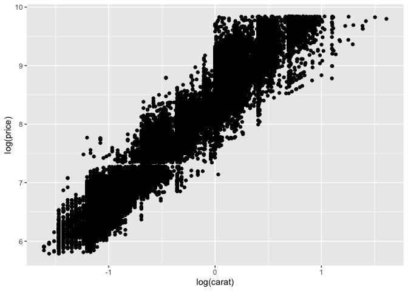<!-- -->

- 现在这种关系就接近于线性了。然而，由于图中的元素有很大的重叠，所以我们在下结论时需要小心。

- 函数的参数同样可以是已有变量的某种组合。例如，如果我们对钻石的体积(用`x*y*z`近似)和其重量之间的关系感兴趣，那么我们可以这样做：

``` r
> qplot(carat,x*y*z, data = diamonds)
```

<!-- -->

- 可以预期的是，钻石的密度(质量除以体积)应该是一个常数，因此体积与重量之间应该是线性的关系。从图中可以看出，大部分的钻石都落在同一条直线上，但依然存在一些大的异常点。

## 2.4 颜色、大小、形状和其他图形属性

- qplot与plot的第一个大的差别在于它们在给图中的点设定颜色(或大小、形状)时采用了不同的实现方式。在plot中，用户需要将数据中的一个分类变量(例如，“苹果”、“香蕉”、“桃子”)转换为plot可以理解的形式(例如,“red”、“yellow”、“green”)。而qplot可以将这个过程自动完成，并能够自动生成一张图例，用以展示数据取值与图形属性之间的对应关系。这使得向图中添加额外的信息非常简便。

- 在下一个例子中，我们向重量和价格的散点图添加了颜色和切工的信息，结果展示在图2.2中。

``` r
> qplot(carat, price, data = dsmall, colour = color)
```

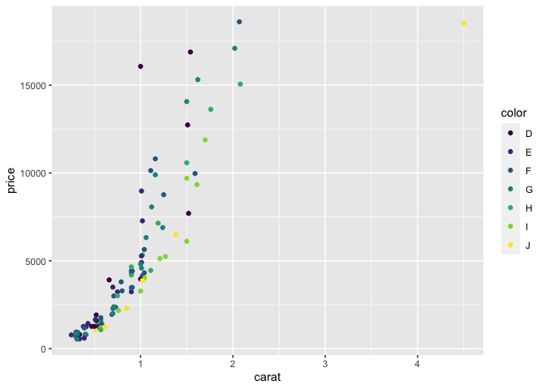<!-- -->

``` r
> qplot(carat, price, data = dsmall, shape = cut)
```

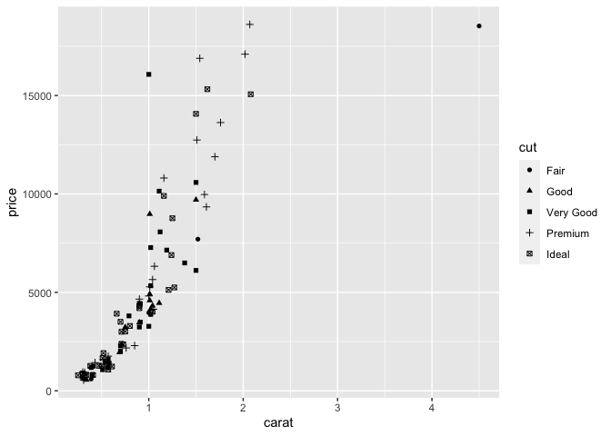<!-- -->

- 图2.2 将color变量映射到点的颜色(左), cut变量映射到点的形状(右)。

- 颜色、大小和形状是图形属性的具体例子，它们都是影响数据如何进行展示的视觉属性。每一个图形属性都对应了一个称为标度的函数，其作用是将数据的取值映射到该图形属性的有效取值。在ggplot2中，标度控制了点以及对应的图例的外观。例如，在上述图形中，颜色标度将J映射为紫色，将F映射为绿色。

- 你同样可以利用`I()`来手动设定图形属性，例如，`colour = I("red")`或`size = I(2)`。这与之前解释的映射不同，其中更详细的内容会在4.5.2节进行介绍。对于大数据(如本例中的钻石数据)而言，使用半透明的颜色可以有效减轻图形元素重叠的现象。要创建半透明的颜色，你可以使用alpha图形属性，其取值从0(完全透明)变动到1(完全不透明)。通常透明度可以用分数来进行表示，例如1/10或1/20，其分母表示经过多少次重叠之后颜色将变得不透明。

``` r
> qplot(carat, price, data = diamonds, alpha = I(1/10)) 
```

<!-- -->

``` r
> qplot(carat, price, data = diamonds, alpha = I(1/100)) 
```

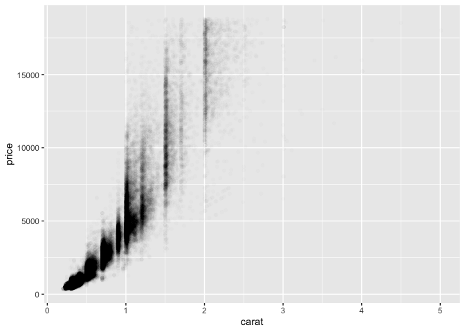<!-- -->

``` r
> qplot(carat, price, data = diamonds, alpha = I(1/200))
```

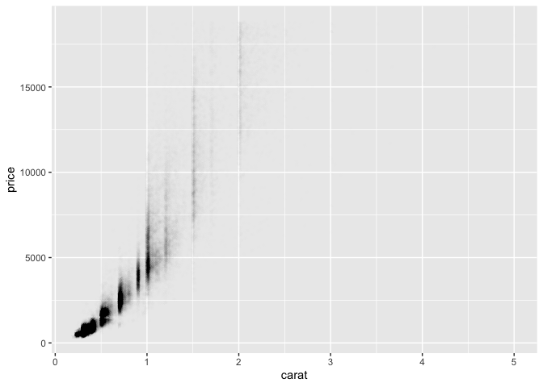<!-- -->

- 图2.3
  将alpha值从1/10(左)变动到1/100(中)再到1/200(右)，来看大部分的点在哪里进行重叠。

- 不同类型的变量有不同适用的图形属性。例如，颜色和形状适合于分类变量，而大小适合于连续变量。数据量的大小同样会有影响：如果数据量很大(如上图)，那么不同组的数据之间就很难进行区分。对此，一种可能的解决方案是利用分面，这在2.6节会有介绍。

## 2.5 几何对象

- qplot并非只能画散点图，通过改变几何对象(简写为geom)，它几乎可以画出任何一种类型的图形。几何对象描述了应该用何种对象来对数据进行展示，其中有些几何对象关联了相应的统计变换。例如，直方图就相当于分组计数再加上条形的几何对象。这些不同的图形部件将在下一章进行描述，在此，我们介绍最常用的几种，组织的方式是按照数据的维度进行划分。下面这些几何对象适用于考察二维的变量关系：

- geom =
  “point”可以绘制散点图。这是当你指定了x和y参数给`qplot()`时默认的设置；

- geom = “smooth”将拟合一条平滑曲线，并将曲线和标准误展示在图中(2.5.1)；

- geom =
  “boxplot”可以绘制箱线胡须图，用以概括一系列点的分布情况(2.5.2)；

- geom = “path”和 geom =
  “line”可以在数据点之间绘制连线。这类图传统的作用是探索时间和其他变量之间的关系，但连线同样可以用其他的方式将数据点连接起来。线条图只能创建从左到右的连线，而路径图则可以是任意的方向(2.5.5)。

- 对于一维的分布，几何对象的选择是由变量的类型指定的：

- 对于连续变量，geom = “histogram”绘制直方图，geom =
  “freqpoly”绘制频率多边形，geom =
  “density”绘制密度曲线(2.5.3)。如果只有x参数传递给`qplot()`，那么直方图几何对象就是默认的选择；

- 对于离散变量，geom = “bar”用来绘制条形图(2.5.4)。

### 2.5.1 向图中添加平滑曲线

- 如果在散点图中有非常多的数据点，那么数据展示的趋势可能并不明显，在这种情况下你应该在图中添加一条平滑曲线。这可以通过使用smooth几何对象加以完成，如图2.4所示。注意到我们利用了`c()`函数来将多个几何对象组成一个向量传递给geom。几何对象会按照指定的顺序进行堆叠。

``` r
> library(ggplot2)
> qplot(carat, price, data = dsmall, geom = c("point", "smooth"))
```

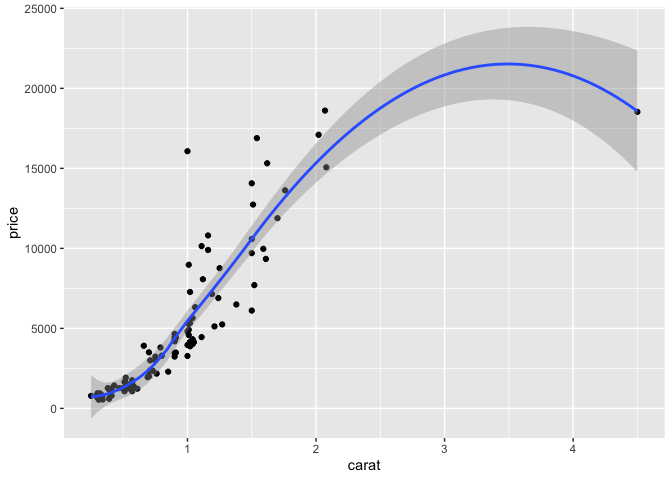<!-- -->

``` r
> qplot(carat, price, data = diamonds, geom = c("point", "smooth"))
```

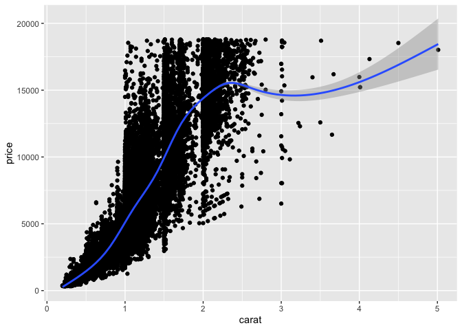<!-- -->

- 图2.4
  重量与价格的散点图中加人了平滑曲线。左图为dsmall数据集，右图为完整数据集。

- 尽管图形元素重叠严重，但我们关于价格和重量之间指数关系的猜想基本上是正确的。由于只有很少的钻石超过了3克拉，因此这种关系的不确定性程度也在逐渐加大，这与灰色部分的逐点置信区间的宽度变化是一致的。如果你不想绘制标准误，则可以使用se
  = FALSE。

- 利用method参数你可以选择许多不同的平滑器：

- method =
  “loess”，当n较小时是默认选项，使用的是局部回归的方法。关于这一算法的更多细节可以查阅帮助?loess。曲线的平滑程度是由span参数控制的，其取值范围是从0(很不平滑)到1(很平滑)，如图2.5所示。

``` r
> library(ggplot2)
> qplot(carat, price, data = dsmall, geom = c("point", "smooth"), span = 0.2)
```

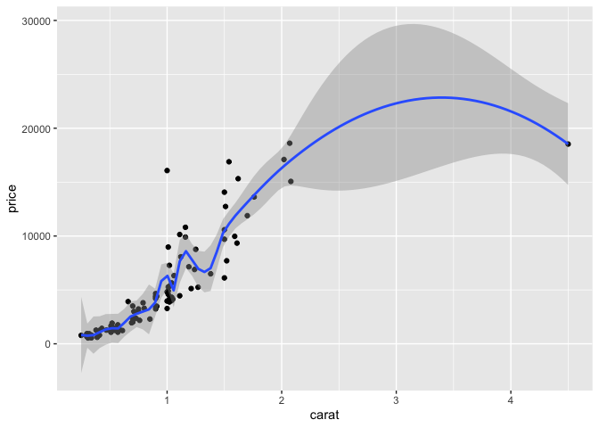<!-- -->

``` r
> qplot(carat, price, data = dsmall, geom = c("point", "smooth"), span = 1)
```

<!-- -->

- 图2.5 span参数的作用。左图是span = 0.2，右图是span = 1。

- Loess对于大数据并不十分适用(内存的消耗是O(n2))，因此当n超过1000时将默认采用另一种平滑算法。

- 你可以使用method = “gam”, formula = y \~
  s(x)来调用mgcv包拟合一个广义可加模型。这与在1m中使用样条相类似，但样条的阶数是通过数据估计得到的。对于大数据，请使用公式y
  \~ s(x, bs = “cs”)，这是数据量超过1000时默认使用的选项。

``` r
> library(mgcv)
> qplot(carat, price, data = dsmall, geom = c("point", "smooth"), method = "gam", formula =y ~ s(x))
```

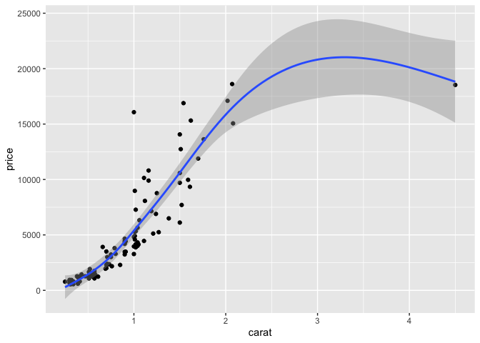<!-- -->

``` r
> qplot(carat, price, data = dsmall, geom = c("point", "smooth"), method = "gam", formula =y ~ s(x, bs = "cs"))
```

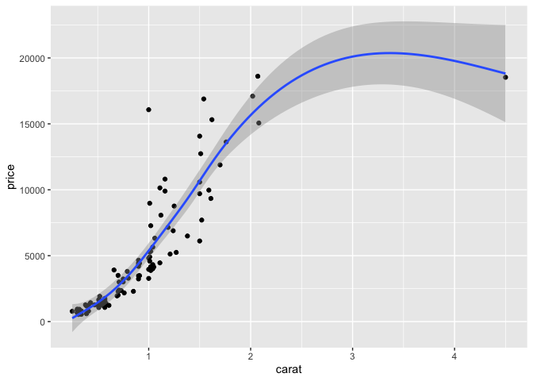<!-- -->

- 图2.6 在运用广义可加模型作为平滑器时formula参数的作用。左图是formula =
  y \~ s(x)，右图是formula = y \~ s(x，bs = “cs”)。

- method =
  “lm”拟合的是线性模型。默认情况下会拟合一条直线，但你可以通过指定formula
  = y \~
  poly(x,2)来拟合一个二次多项式或加载splines包以使用自然样条:formula = y
  \~
  ns(x,2)。第二个参数是自由度：自由度取值越大，曲线的波动也越大。你可以在公式中任意指定x和y的关系，图2.7展示了如下代码的例子。

``` r
> library(splines)
> library(ggplot2)
> qplot(carat, price, data = dsmall, geom = c("point", "smooth"), method = "lm")
```

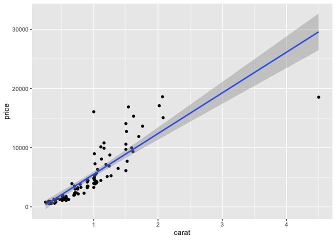<!-- -->

``` r
> qplot(carat, price, data = dsmall, geom = c("point", "smooth"), method = "lm", formula = y ~ ns(x, 5))
```

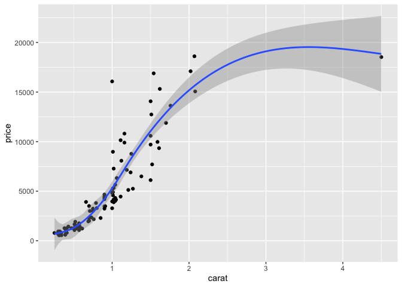<!-- -->

- 图2.7在运用线性模型作为平滑器时formula参数的作用。左图是formula = y \~
  x的默认值，右图是formula = y \~ ns(x,5)。

- method =
  “rlm”与lm类似，但采用了一种更稳健的拟合算法，使得结果对异常值不太敏感。这一方法是MASS包的一部分，因此需要先加载MASS包。

### 2.5.2 箱线图和扰动点图

- 如果一个数据集中包含了一个分类变量和一个或多个连续变量，那么你可能会想知道连续变量会如何随着分类变量水平的变化而变化。箱线图和扰动点图提供了各自的方法来达到这个目的，图2.8展示了钻石每克拉的价格随颜色的变化情况，左图的扰动点图使用的是geom
  = “jitter”，右图的箱线胡须图使用的是geom = “boxplot”。

``` r
> qplot(color, price / carat, data = diamonds, 
+       geom = "jitter")
```

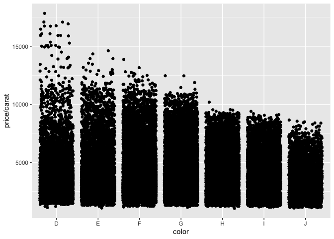<!-- -->

``` r
> qplot(color, price / carat, data = diamonds, 
+       geom = "boxplot")
```

<!-- -->

- 图2.8
  利用扰动点图(左)和箱线图(右)来考察以颜色为条件的每克拉价格的分布。随着颜色的改变(从左到右)，每克拉价格的跨度逐渐减小，但分布的中位数没有明显的变化。

- 每一种方法都有它的优势和不足。箱线图只用了5个数字对分布进行概括，而扰动点图可以将所有的点都绘制到图中(当然会有图形重叠的问题)。在本例中，两种图形都显示出每克拉价格的跨度与钻石颜色是相关的，但箱线图的信息更充分，它显示出分布的中位数和四分位数都没有太大的变化。

- 扰动点图中的图形重叠问题可以通过半透明颜色来部分解决，也就是使用alpha参数。图2.9展示了三种水平的透明度，这使得我们可以更清楚地看出数据集中的地方。这三张图是用如下的代码生成的：

``` r
> qplot(color, price / carat, data = diamonds, 
+       geom = "jitter", alpha = I(1 / 5))
```

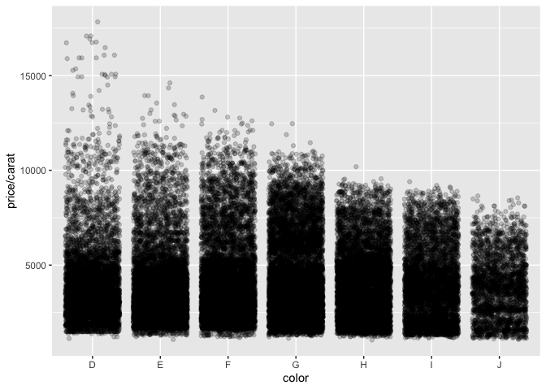<!-- -->

``` r
> qplot(color, price / carat, data = diamonds, 
+       geom = "jitter", alpha = I(1 / 50))
```

<!-- -->

``` r
> qplot(color, price / carat, data = diamonds, 
+       geom = "jitter", alpha = I(1 / 200))
```

<!-- -->

- 图2.9
  改变alpha的取值，从左到右分别为1/5，1/50和1/200。随着不透明度的降低，我们可以看出数据集中的地方。然而，箱线图依然是一个更好的选择。

- 扰动点图不能像箱线图那样显示出四分位数的位置，但它体现了箱线图所不能展示的其他一些分布特征。

- 对于扰动点图来说，qplot可以提供像一般的散点图那样对其他图形属性的控制，例如size,
  colour和shape。对于箱线图，你可以用colour控制外框线的颜色，用fill设置填充颜色，以及用size调节线的粗细。

- 另外一种考察条件分布的方法是用分面来作出分类变量的每一个水平下连续变量的直方图或密度曲线，这在2.6
  节中会进行介绍。

### 2.5.3 直方图和密度曲线图

- 直方图和密度曲线图可以展示单个变量的分布，相对于箱线图而言，它们提供了更多的关于单个分布的信息，但它们不太容易在不同组之间进行比较(尽管我们将会看到一种可行的办法)。图2.10展示了钻石重量的直方图和密度曲线图。

``` r
> qplot(carat, data = diamonds, geom = "histogram")
```

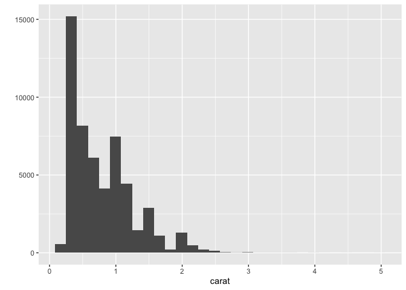<!-- -->

``` r
> qplot(carat, data = diamonds, geom = "density")
```

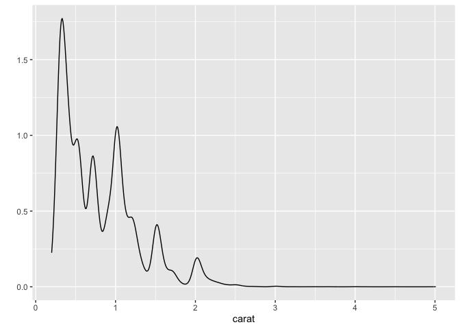<!-- -->

- 图2.10
  展示钻石重量的分布。左图使用的是geom=“histogram”，右图使用的是geom=“density”。

- 对于密度曲线图而言，adjust参数控制了曲线的平滑程度(adjust取值越大，曲线越平滑)。对于直方图，binwidth参数通过设定组距来调节平滑度。(切分位置同样可以通过breaks参数进行显式的指定。)绘制直方图或密度曲线时，对平滑程度进行试验非常重要。在直方图中，你应该尝试多种组距：当组距较大时，图形能反映数据的总体特征；当组距较小时，则能显示出更多的细节。

- 在图2.11
  中，我们尝试了三种binwidth的取值:1.0，0.1和0.01。只有在最小组距的图中(右)，我们能发现之前在散点图中出现的竖直方向的条纹，它们主要集中在“整0.5”的克拉数附近。完整的代码如下所示：

``` r
> qplot(carat, data = diamonds, geom = "histogram", binwidth = 1, xlim = c(0,3))
```

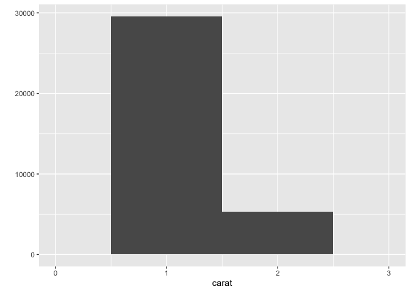<!-- -->

``` r
> qplot(carat, data = diamonds, geom = "histogram", binwidth = 0.1, xlim = c(0,3))
```

<!-- -->

``` r
> qplot(carat, data = diamonds, geom = "histogram", binvidth = 0.01, xlim = c(0,3))
```

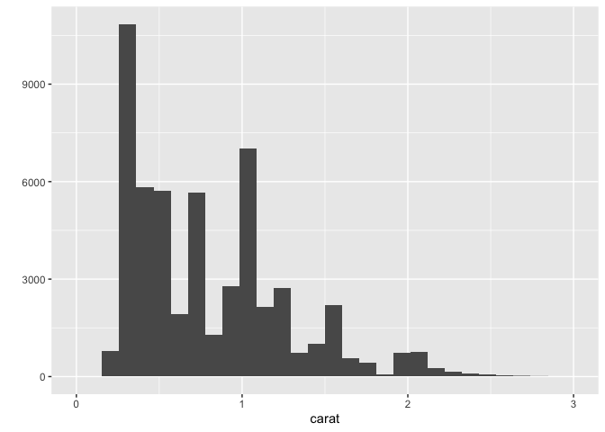<!-- -->

- 图2.11
  变动直方图的组距可以显示出有意思的模式。从左到右，组距分别为1，0.1和0.01。只有重量在0到3克拉之间的钻石显示在图中。

- 要在不同组之间对分布进行对比，只需要再加上一个图形映射，如下面的代码所示。

``` r
> qplot(carat, data = diamonds, geom = "density", colour = color) 
```

<!-- -->

``` r
> qplot(carat, data = diamonds, geom = "histogram", fill = color)
```

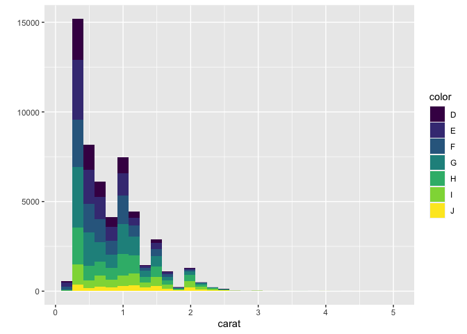<!-- -->

- 图2.12
  当一个分类变量被映射到某个图形属性上，几何对象会自动按这个变量进行拆分。左图是重叠的密度曲线图，右图是堆叠起来的直方图。

- 密度曲线图在第一眼看来更吸引人，因为它似乎很容易阅读，而且适于在不同的曲线之间进行比较。然而，要真正理解密度曲线的含义则比较困难，而且密度曲线有一些隐含的假设，例如曲线应该是无界、连续和平滑的，而这些假设不一定适用于真实的数据。

### 2.5.4 条形图

- 在离散变量的情形下，条形图与直方图相类似，绘制的方法是使用geom
  =“bar”。条形图几何对象会计算每一个水平下观测的数量，因此你不需要像在基础绘图系统的barchart中那样预先对数据进行汇总。如果数据已经进行了汇总，或者你想用其他的方式对数据进行分组处理(例如对连续变量进行分组求和)，那么你可以使用weight几何对象，如图2.13所示。左图是钻石颜色的普通条形图，右图是按重量加权的条形图。

``` r
> qplot(color, data = diamonds, geom = "bar")
```

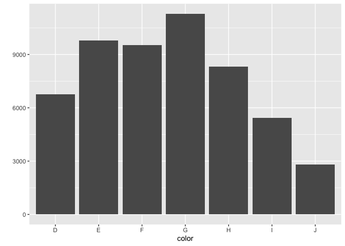<!-- -->

``` r
> qplot(color, data = diamonds, geom = "bar", weight = carat) + scale_y_continuous("carat")
```

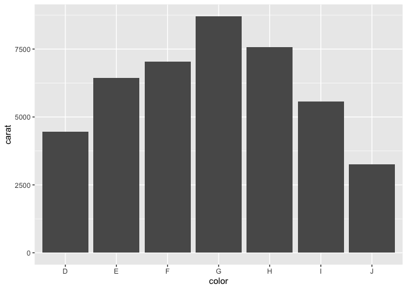<!-- -->

- 图2.13 钻石颜色的条形图。左图显示的是分组的计数，右图是按weight =
  carat进行加权，展示了每种颜色的钻石的总重量。

### 2.5.5 时间序列中的线条图和路径图

- 线条图和路径图常用于可视化时间序列数据。线条图将点从左到右进行连接，而路径图则按照点在数据集中的顺序对其进行连接(线条图就等价于将数据按照x取值进行排序，然后绘制路径图)。线条图的x轴一般是时间，它展示了单个变量随时间变化的情况。路径图则展示了两个变量随时间联动的情况，时间反映在点的顺序上。

- 由于钻石数据中没有包含时间变量，因此在这里我们使用economics数据集，它包含了美国过去40年的经济数据。图2.14展示了失业水平随时间变化的两张线条图，它们是用
  geom =
  “line”进行绘制的。第一张图显示了失业率的变化，第二张图是失业星期数的中位数。我们已经可以看出这两个变量之间的一些区别，例如在最后的一个峰值处，失业的比例要比前一个峰值低，但失业的时间却要更长。

``` r
> qplot(date, unemploy / pop, data = economics, geom = "line") 
```

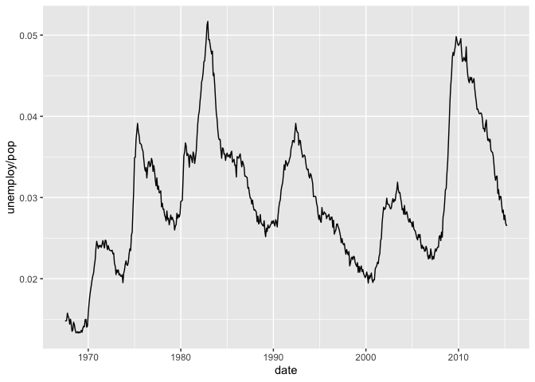<!-- -->

``` r
> qplot(date, uempmed, data = economics, geom = "line")
```

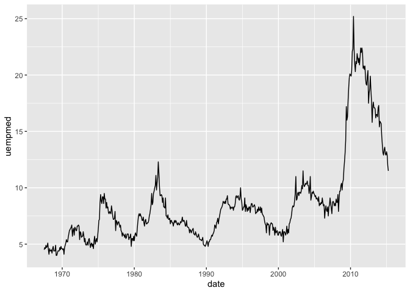<!-- -->

- 图2.14
  衡量失业程度的两张时序图。左图是失业人口的比例，右图是失业星期数的中位数。图形是用
  geom = “line”进行绘制的。

- 要考察这种关系的更多细节，我们可以将两个时间序列绘制在同一张图中。尽管我们可以用一张散点图来表示失业率和失业时间长度之间的关系，但我们并不能从中看出变量随时间的变化。对此，解决的办法是将临近时点的散点连接起来，形成一张路径图。

- 在下面我们画出了失业率和失业时间长度随时间变化的路径。由于线条有很多交叉，因此在第一张图中时间变化的方向并不明显。在第二张图中，我们将年份映射到了colour属性上，这让我们能更容易地看出时间的行进方向。

``` r
> year <- function(x) as.POSIXlt(x)$year + 1900 
> qplot(unemploy / pop, uempmed, data = economics, geom = c("point", "path"))
```

<!-- -->

``` r
> qplot(unemploy / pop, uempmed, data = economics, geom = "path", colour = year(date))
```

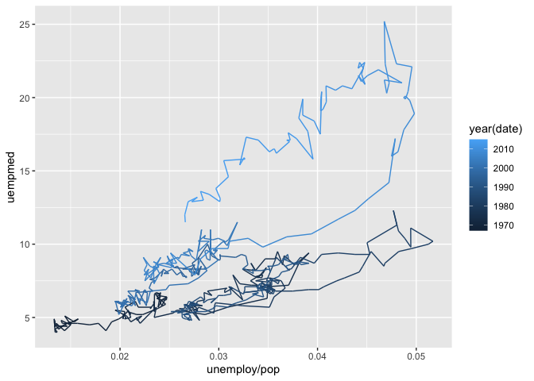<!-- -->

- 图2.15
  展示失业率和失业时间长度之间关系的路径图。左图是重叠在一起的的散点图和路径图，右图只有路径图，其中年份用颜色进行了展示。

- 我们可以看出来失业率和失业时间长度是高度相关的，尽管最近几年，失业时间长度与失业率相比有增长的趋势。

- 对于纵向数据，你可能想把多个时间序列画在同一张图中，每一个序列代表一个个体。要用`qplot()`实现这一想法，你需要将
  group图形属性映射到一个表示分组的变量之上。这一部分内容在4.5.3节有更深人的介绍。

## 2.6 分面

- 我们已经讨论了利用图形属性(颜色和形状)来比较不同分组的方法，它可以将所有的组绘制在同一张图中。分面是另外一种实现的方法：它将数据分割成若千子集，然后创建一个图形的矩阵，将每一个子集绘制到图形矩阵的窗格中。所有子图采用相同的图形类型，并进行了一定的设计，使得它们之间方便进行比较。7.2节详细讨论了分面，包括它相对于图形属性分组的优势和劣势(7.2.5节)。

- `qplot()`中默认的分面方法是将图形拆分成若干个窗格，这可以通过形如row_var
  \~
  col_var的表达式进行指定。你可以指定任意数量的行变量和列变量，但请注意当变量数超过两个时，生成的图形可能会非常大，以至于不适合在屏幕上显示。如果只想指定一行或一列，可以使用.作为占位符，例如row_var
  \~ .会创建一个单列多行的图形矩阵。

- 图2.16用了两张图来展示这个技巧，它们是以颜色为条件的重量的直方图。第二列的直方图绘制的是比例，这使得比较不同组的分布时不会受该组样本量大小的影响。左边一列直方图的y轴并不是原始数据的取值，而是将数据进行分组后的计数；..density..则是一个新的语法，它告诉ggplot2将密度而不是频数映射到y轴。

``` r
> qplot(carat, data = diamonds, facets = color ~ .,geom = "histogram", binvidth = 0.1, xlim = c(0, 3))
```

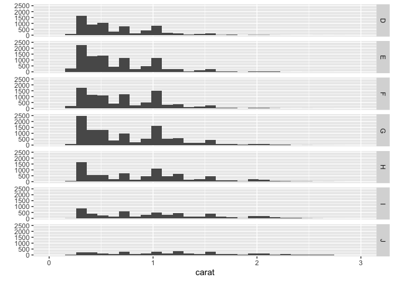<!-- -->

``` r
> qplot(carat, ..density.., data = diamonds, facets = color ~ ., geom = "histogram", binwidth = 0.1, xlim = c(0, 3))
```

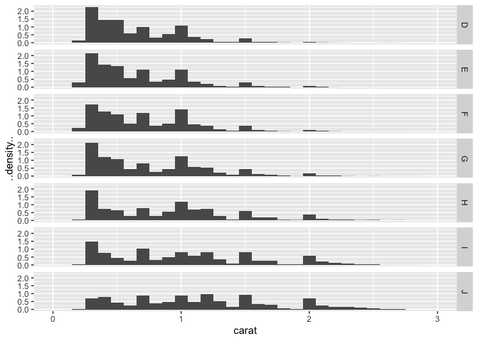<!-- -->

- 图2.16
  展示以颜色为条件的重量的直方图。左图展示的是频数，右图展示的是频率。频率图可以使得比较不同组的分布时不会受该组样本量大小的影响。高质量的钻石(颜色D)在小尺寸上的分布是偏斜的，而随着质量的下降，重量的分布会变得越来越平坦。

## 2.7 其他选项

- qplot中还有一些其他的选项用于控制图形的外观。这些参数与它们在plot中的作用相同：

- xlim,
  ylim：设置x轴和y轴的显示区间，它们的取值都是一个长度为2的数值向量，例如xlim
  = c(0，20)或ylim = c(-0.9,-0.5)；

- log：一个字符型向量，说明哪一个坐标轴(如果有的话)应该取对数。例如，log
  = “x”表示对x轴取对数，log = “xy”表示对x轴和y轴都取对数；

- main：图形的主标题，放置在图形的顶端中部，以大字号显示。该参数可以是一个字符串(例如，main
  = “plot title”)或一个表达式(例如main= expression(beta\[1\] ==
  1))。可以运行?plotmath命令来查看更多的数学表达式的例子；

- xlab,
  ylab：设置x轴和y轴的标签文字，与主标题一样，这两个参数的取值可以是字符串或数学表达式。

- 下面的例子展示了这些选项的实际操作。

``` r
> qplot(carat, price, data = dsmall,
+       xlab = "Price ($)", ylab = "Weight (carats)", main = "Price-veight relationship")
```

<!-- -->

``` r
> qplot(carat, price/carat, data = dsmall,
+       ylab = expression(frac(price, carat)), 
+       xlab = "Weight (carats)",
+       main = "Small diamonds",
+       xlim = c(.2, 1))
```

<!-- -->

``` r
> qplot(carat, price, data = dsmall, log = "xy")
```

<!-- -->

## 2.8 与plot函数的区别

- plot函数和qplot函数之间有一些重要的区别：

- qplot不是泛型函数：当你将不同类型的R对象传入qplot时，它并不会匹配默认的函数调用。需要注意的是，`ggplot()`是一个泛型函数，以它为起点，你可以对任意类型的R对象进行可视化操作。第9章对此有详细的描述；

- 一般而言，你可以将一个变量传递给你感兴趣的图形属性，这样该变量将进行标度转换并显示在图例上。如果你想对其进行赋值，比如让点的颜色变为红色，则可以使用`I()`函数:colour
  = I(“red”)。这部分内容在4.5.2节中有进一步的介绍；

- ggplot2中的图形属性名称(如colour,
  shape和size)比基础绘图系统中的名称(如col,
  pch和cex等)更直观，且更容易记忆；

- 在基础绘图系统中，你可以通过`points()`，`lines()`和`text()`函数来向已有的图形中添加更多的元素。而在ggplot2中，你需要在当前的图形中加入额外的图层，这将在下一章中进行介绍。
