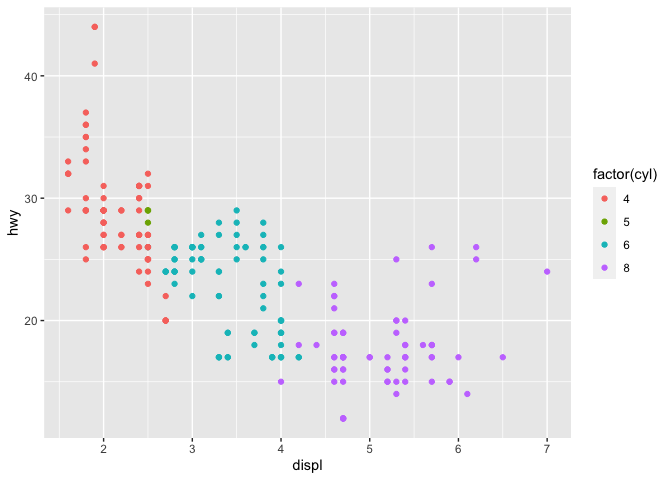
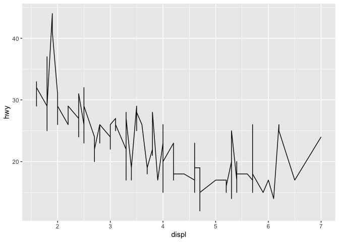

chapter03_语法突破
================

- <a href="#3-语法突破" id="toc-3-语法突破">3 语法突破</a>
  - <a href="#31-简介" id="toc-31-简介">3.1 简介</a>
  - <a href="#32-耗油量数据" id="toc-32-耗油量数据">3.2 耗油量数据</a>
  - <a href="#33-绘制散点图" id="toc-33-绘制散点图">3.3 绘制散点图</a>
    - <a href="#331-图形属性与数据的映射"
      id="toc-331-图形属性与数据的映射">3.3.1 图形属性与数据的映射</a>
  - <a href="#34-更复杂的图形示例" id="toc-34-更复杂的图形示例">3.4
    更复杂的图形示例</a>
  - <a href="#35-图层语法的组件" id="toc-35-图层语法的组件">3.5
    图层语法的组件</a>
    - <a href="#351-图层" id="toc-351-图层">3.5.1 图层</a>
    - <a href="#352-标度" id="toc-352-标度">3.5.2 标度</a>
    - <a href="#353-坐标系" id="toc-353-坐标系">3.5.3 坐标系</a>
    - <a href="#354-分面" id="toc-354-分面">3.5.4 分面</a>
  - <a href="#36-数据结构" id="toc-36-数据结构">3.6 数据结构</a>

# 3 语法突破

## 3.1 简介

- 本章首先详述了绘制简单图形的过程。然后，3.3节介绍了简单散点图的绘制方法，3.4节在此基础上又添加了光滑曲线和分面。在学习这些例子的同时，六种语法组件也会被先后提及。随后3.5节对它们作了更为精确的定义。最后，本章以3.6
  节作结，介绍了怎样将这些图形组件映射成尺的数据结构。

## 3.2 耗油量数据

``` r
> library(ggplot2)
> head(mpg)
# A tibble: 6 × 11
  manufacturer model displ  year   cyl trans      drv     cty   hwy fl    class 
  <chr>        <chr> <dbl> <int> <int> <chr>      <chr> <int> <int> <chr> <chr> 
1 audi         a4      1.8  1999     4 auto(l5)   f        18    29 p     compa…
2 audi         a4      1.8  1999     4 manual(m5) f        21    29 p     compa…
3 audi         a4      2    2008     4 manual(m6) f        20    31 p     compa…
4 audi         a4      2    2008     4 auto(av)   f        21    30 p     compa…
5 audi         a4      2.8  1999     6 auto(l5)   f        16    26 p     compa…
6 audi         a4      2.8  1999     6 manual(m5) f        18    26 p     compa…
```

- 该数据集隐含了许多有趣的问题。引擎大小和耗油量有什么关系?是不是某些制造商比其他的制造商更关注汽车的耗油量？耗油量在过去的十年中有没有明显的增加？我们将尝试回答第一个问题，并在此过程中学习更多关于绘制散点图的细节。

## 3.3 绘制散点图

- 观察图
  3.1，它是对上面问题的一个简单回答。这是一个含有两个连续型变量的散点图(发动机排量(engine
  displacement)和高速公路每加仑行驶的英里数(highway
  mpg))，图中点的颜色是由第三个变量(汽缸(cylinders)的数目)决定的。利用以前章节里学的知识，你应该知道如何使用`qplot()`来作这幅图。但是这背后的具体原理是怎样的呢？ggplot2是怎样作出这幅图的呢？

``` r
> qplot(displ, hwy, data = mpg, colour = factor(cyl))
```

<!-- -->

- 图3.1
  发动机排量(以升为单位，displ)对高速公路耗油量(英里每加仑，hwy)散点图。图中的点是根据汽缸的数目着色的。通过该图可以发现影响耗油量的一个重要因素：发动机的排量大小。

### 3.3.1 图形属性与数据的映射

- 我相信你已经见过许多的散点图，甚至还自己动手画过。但散点图的精确定义是什么呢？在散点图中，每一个观测数据都用一个点`(.)`来表示，点的位置由两个变量的值决定。每个点不仅有横坐标和纵坐标，还有大小、颜色和形状，这些属性我们称之为图形属性(aesthetics)。每个图形属性都可以映射为一个变量或者设定成一个常数。图3.1中变量displ控制点的水平位置，变量hwy控制点的竖直位置，变量cyl控制点的颜色，而点的大小和形状都没有指定映射的变量，使用的是默认值(常数)。

- 根据变量和图形属性的映射关系，我们可以新建一个记录这些信息的数据集。表3.2给出了图3.1所对应数据集的前10行数据。这个新数据集是在将图形属性映射到原数据集时产生的，利用该数据集我们可以作出许多不同种类的图。在散点图中，我们用点来表示每个观测，倘若用直线连接所有的观测，我们就会得到折线图。如果用条形来表示这些数据，我们便会得到条形图。对于该数据集，折线图和条形图是没有意义的，但是为了对比学习，我们也将其画出来，如图3.2所示。注意，在ggplot2中，我们可以作出很多没有意义但符合语法的图形，就好比在英语中，我们也可以写无语法错误但毫无意义的句子，比如“angry
  rock barked like a comma”(愤怒的石头像逗号般狂叫)。

``` r
> qplot(displ, hwy, data = mpg, geom = "line")
```

<!-- -->

- 图3.2
  除了用点来表示数据，我们还可以用其他的的几何对象，如直线。对于这个数据，用这两种几何对象所作的图形都没有什么意义，但在语法上是有效的。

- 点(points)、线(lines) 和条(bars)
  都是几何对象的具体形式，被称作geom。几何对象决定了图形的“类型”(type)。

## 3.4 更复杂的图形示例

- 我们先来看一个更复杂的图形(图3.6)。这幅图添加了三种新的组件：分面、多个图层和统计量。与上一节所讲的类似，分面和图层将原数据切割成多个小数据集，即每个图层的每个分面面板(facet
  panel)都含一个小数据集。你可以把它想象成一个三维矩阵：分面面板形成了一个2维网格，图层在第三维的方向上叠加。本例中所有图层的数据都是一样的，但是一般而言，我们可以在不同的图层里使用不同的数据集。

``` r
> qplot(displ, hwy, data = mpg, facets = .~year) + geom_smooth()      
```

<!-- -->

- 图3.6 一个含有分面和多个图层的复杂图形。

- 平滑曲线层与散点层的不同点在于它没有展示原数据，而是展示了统计变换后的数据。特别地，平滑曲线层拟合了一条穿过数据中间位置的平滑曲线。添加该图层需要在我们前面介绍过的流程里再添加一步：将数据映射到图形属性后，要对其进行统计变换(对数据进行有效的处理)。在本例中，统计变换首先用一条loess平滑曲线来拟合数据，然后在数据的范围内，利用等间隔的点，计算并返回点所对应的预测值。其他有用的统计变换包括1维和2维的封箱(binning)，求组平均
  (group means)，分位数回归(quantile regression)和等高线(contouring)。

- 因为添加了统计变换，所以在进行标度变换时需要添加额外的步骤。这是因为现在我们有多个数据集(对不同的分面和图层而言)，所以我们需要确保所有的变换在各个数据集里都是相同的。标度变换实际上出现在三个地方：标度转换(transforming)，标度训练(training)和标度映射(mapping)。我们之前还没有提到过变换，但是你可能已经在双对数(log-log)图中看到过了。在双对数图中，数据值不是线性映射到图形上的位置，而是先进行了对数变换。

- 标度转换先于统计变换，因此统计量都是基于标度变换后的数据计算的。这样可以确保log(x)对log(y)在线性尺度上的图与x对y在对数尺度上的图看起来一样。另外，还有其他不同的变换可以使用，包括取平方根、对数和倒数。详见6.4.2节；

- 计算完统计量之后，所有分面和图层的数据集中的每个标度都会被“训练”。标度训练将根据所有小数据集里数据的范围得到整体数据的范围。如果没有这一步，标度将只具有局部意义，当将不同的层叠加到一起时，它们的位置就会错乱。不过有些时候我们也需要得到不同分面间(绝不是图层间)标度有错位的图形，这种情况详见7.2.3节；

- 最后，标度映射将数据映射到图形属性中。这是一个局部操作：每个数据集里的变量都映射给相应的图形属性值，生成一个新的数据集后再用几何对象来渲染。

## 3.5 图层语法的组件

- 在上面的例子中，我们已经见到了一些组成图像的组件，诸如数据、图形属性映射、几何对象、统计变换、标度和分面。我们也接触过坐标系。一个还没有提及的组件是位置调整，它控制着图形对象的重叠。数据、映射、统计变换、几何形状和位置调整共同组成了一个图层。一个图形可能含有很多图层，比如前面的例子中，我们把一个平滑曲线层添加到一个散点图层上。总的来说，图层语法所定义的图由以下几部分组成：

- 一个默认的数据集和一组从变量到图形属性的映射；

- 一个或多个图层，每个都由一种几何对象、一种统计变换和一种位置调整组成，另外数据集和图形属性映射也是可选的；

- 标度，每个图形属性映射都对应一个标度；

- 一个坐标系统；

- 分面设定。

- 下几节将对每种图层语法的组件作更详细的介绍，并给出书中各部分所参考的位置。

### 3.5.1 图层

- 图层的作用是生成在图像上可以被人感知的对象。一个图层由4部分组成：

- 数据和图形属性映射；

- 一种统计变换；

- 一种几何对象；

- 一种位置调整方式。

- 图层的属性将在第4章介绍，而第5章则介绍应用它们进行数据可视化的方法。

### 3.5.2 标度

- 标度控制数据到图形属性的映射，并且图形上所用的每一个图形属性都对应着一个标度。每个标度都作用于图形中的所有数据，以确保从数据到图形属性映射的一致性。一些标度如图
  3.8所示。

- 一个标度就是一个含有一组参数的函数，它的逆也是如此。例如颜色梯度标度，它把一条实线的各部分映射成一条含不同颜色的路径。函数中的参数可规定该路径是直线还是曲线，决定选择哪个颜色空间(例如，LUV还是RGB)、起始和终止位置的颜色。

- 其逆函数被用来绘制参照对象，通过参照对象你才能读出图里隐含的信息。参照对象可以是坐标轴(位置标度)或者是图例(其他标度)。大多数的映射都有唯一的逆函数(也就是一对一映射)，但有些不是。逆映射的唯一性使得复原数据成为可能，但当我们只关注某个方面时，我们不会很在意它是不是一一映射。

### 3.5.3 坐标系

- 坐标系，或简称为coord，可将对象的位置映射到图形平面上。位置通常由两个坐标(x,y)决定，但是有时可能需要三个或更多(尽管目前还不能在ggplot2中实现)。笛卡尔坐标系是最常用的二维坐标系，极坐标系和各种地图投影则用得相对少一些。

- 坐标系可以同时影响所有的位置变量。与标度不同，坐标系还可以改变几何对象的外观。例如，在极坐标系中，条形看起来像扇形。另外，标度变换是在统计变换前执行的，而坐标变换是在此之后执行的。坐标变换的具体效果请见7.3.1节。

### 3.5.4 分面

- 分面在绘图时也非常有用，因此我们要把它加到图形的基本框架中。分面是条件绘图(conditioned
  plots)和网格绘图(trellised
  plots)的一般形式，通过它你可以方便地展示数据的不同子集。特别是当验证在不同条件下模型是否保持一致时，分面绘图是一个非常强大的工具。分面可以设定哪些变量可用来分割数据，以及设定是否应该对位置标度加以限制。关于分面的详细内容请见第7章。

## 3.6 数据结构

- ggplot2的图形语法通过一种非常简单直接的方法编码到尺的数据结构中。一个图形对象就是一个包含数据、映射(默认的图形属性映射)、图层、标度、坐标和分面的列表。图形对象还有一个目前我们还未讨论的组件：options。它专门用来存储特定的图形主题选项，详见第8章。

- 绘图有两种方式：一种是“一步到位”式，即利用前面学过的`qplot()`；另一种是“逐层叠加”式，即利用`ggplot()`函数和图层函数逐步作图，细节请见第4章。当我们得到一个图形对象时，可以对它进行如下处理：

- 用`print()`函数将其呈现到屏幕上。在交互式操作时`print()`会自动被调用，但是在循环或函数里，我们需要手动输入`print()`；

- 用`ggsave()`函数将其保存到磁盘，详见8.3节；

- 用`summary()`简单查看它的结构；

- 用`save()`函数把它的缓存副本保存到磁盘；这样可以保存一个图形对象的完整副本，你可以调用`load()`函数来重现该图。注意数据是储存在图形对象里的，所以如果你在图形对象外修改数据，然后重新读人已保存的图形对象，图像将不会更新。

- 下面的代码给出了这些工具的一些具体应用：

``` r
> p <- qplot(displ, hwy, data = mpg, colour = factor(cyl))
> summary(p)
data: manufacturer, model, displ, year, cyl, trans, drv, cty, hwy, fl,
  class [234x11]
mapping:  x = ~displ, y = ~hwy, colour = ~factor(cyl)
faceting: <ggproto object: Class FacetNull, Facet, gg>
    compute_layout: function
    draw_back: function
    draw_front: function
    draw_labels: function
    draw_panels: function
    finish_data: function
    init_scales: function
    map_data: function
    params: list
    setup_data: function
    setup_params: function
    shrink: TRUE
    train_scales: function
    vars: function
    super:  <ggproto object: Class FacetNull, Facet, gg>
-----------------------------------
geom_point: na.rm = FALSE
stat_identity: na.rm = FALSE
position_identity 
```

``` r
> # 保存图形对象
> save(p, file = "plot.rdata")
> # 读入图形对象
> load("plot.rdata")
> # 将图片保存成png格式
> ggsave("plot.png", width = 5, height = 5)
```
