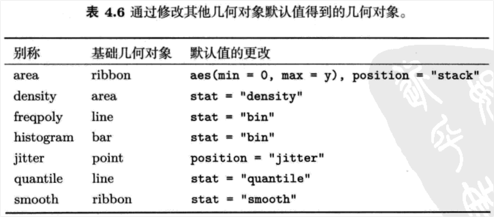

```{r setup, include=FALSE}
knitr::opts_chunk$set(prompt=TRUE,comment='',echo=TRUE,collapse=TRUE,message=FALSE,warning=FALSE)
```

# 4 用图层构建图像

## 4.1 简介

-   4.2节将教你如何手动创建一个图形对象，在这之前都是`qplot()`为我们完成这项任务。图形最初不会显示，直到至少一个图层被添加后图形才会显示出来，相关内容见4.3节。该节对图层进行了详细的说明并且给出了一些简洁的作图方法。在前面的章节里我们已经介绍过，一个图层由五个部分组成：

-   数据，必须是一个数据框(data frame)，在绘图结束后可以被修改。详见4.4；

-   一组图形属性映射，用来设定数据集中的变量如何映射到该图层的图形属性，详见4.5。该节涵盖了三方面内容：通过图层设定(setting)来改变默认绘图参数的方法，设定和映射之间的区别，以及重要的分组图形属性；几何对象，用来指定在图层中用哪种几何对象来绘图。几何对象决定了一组可用的图形属性，详见4.6；

-   统计变换，对原数据做一些有用的统计变换。统计变换返回一个包含新变量的数据框，这些新变量也可通过特殊的语法映射到图形属性中。详见4.7；

-   位置调整，通过调整元素位置来避免图形重合。详见4.8。

-   最后，4.9节对本章内容做了总结，讲解了如何结合本章所学的内容来绘制新颖的可视化图形，以及通过图形来挖掘数据所蕴涵的信息的方法。

## 4.2 创建绘图对象

-   当我们调`用qplot()`时，它其实为我们做了很多幕后工作：创建一个图形对象，添加图层并且展示结果。在整个过程中它使用了很多默认的绘图参数。如果想手动创建图形对象，就要用到`ggplot()`函数。该函数有两个主要的参数：数据和图形属性映射。这两个参数将被设为绘图的默认参数，只有在新添加的图层里设定了新参数时，默认值才会被修改。参数数据指定绘图所用的默认数据集(必须是数据框)；参数映射的设定方法与前面讲过的`qplot()`非常相似，只需要将图形属性和变量名放到函数`aes()`的括号里面即可。关于函数aes()的更多细节见4.5节，使用非常简单。下面的例子设定了一组默认映射:x为carat，y为price，colour为cut。

```{r}
library(ggplot2)
p1 <- ggplot(diamonds, aes(carat, price, colour = cut))
```

-   这个图形对象在加上图层之前无法显示，因此你现在什么也看不见。

## 4.3 图层

-   我们可以用快捷函数(short-cut)来简化代码。因为每一个几何对象都对应着一个默认的统计变换和位置参数，而每一个统计变换都对应着一个默认的几何对象参数，所以对于一个图层我们只需要设定stat或geom参数即可。

```{r}
p2 <- ggplot(diamonds, aes(x = carat)) 
p3 <- p2 + geom_histogram(binwidth = 2,fill = "steelblue")
p3
```

-   所有这类快捷函数都有相同的形式------以geom或者stat开头：

-   它们的参数定义了图层的各种组件：

-   mapping(可选)：一组图形属性映射，通过`aes()`函数来设定，详见4.5 节；

-   data(可选):一个数据集，它会修改默认的数据集。大部分情况下该参数被省略掉，默认数据集将被调用。详见4.4 节；

-   ...：geom或stat的参数，例如直方图的组距(binwidth)或者loess光滑曲线的带宽(bandwidth)。我们也可以用图形属性作为参数，这样该属性就被设定为一个固定的值，而不是被映射给数据集中的一个变量。上面的例子展示了如何将直方图的填充色设为"铁青色"。4.5.2节给出了更多的例子；

-   geom或stat(可选)：我们可以修改geom默认的stat值，或者stat所默认的geom值。它们是一组字符串，包含了将要使用的几何对象或统计变换的名称。使用默认值将会得到标准的图形；修改默认值会得到一些新奇的图形，详见4.9.1 节；

-   position(可选)：选择一种调整对象重合的方式，详见4.8节。

-   注意，参数data和mapping`在ggplot()`函数和图层函数中的位置是相反的。这是因为我们在图形对象中一般先设定数据集，而在图层函数中大多是设定图形属性而不是数据集。我建议尽量写清参数名而不要依赖参数的相对位置来设定参数，这样可以使得代码更具可读性，这也是本书遵循的原则之一。

-   图层可以被添加到`用ggplot()`或`qplot()`创建的图形对象上。实际上`qplot()`的绘图原理就是先创建图形对象然后再添加图层。下面的例子展示了这两种绘图方法的等价性。

```{r}
ggplot(msleep, aes(sleep_rem / sleep_total, awake)) + geom_point() 
# 等价于
#qplot(sleep_rem / sleep_total, awake, data = msleep)

# 也可以给qplot添加图层
qplot(sleep_rem / sleep_total, awake, data = msleep) + geom_smooth() 
# 等价于
#qplot(sleep_rem / sleep_total, awake, data = msleep, geom = с("point", "smooth"))
# 或
#ggplot(msleep, aes(sleep_rem / sleep_total, awake)) + geom_point() + geom_smooth()
```

-   你已经注意到图形对象可以存储到一个变量里。summary函数可以帮助我们查看图形对象的结构而不用直接绘制出图形，如下例所示。summary首先给出图形对象的默认设置，然后给出每个图层的信息。标度和分面将在第6章和第7章学习。

```{r}
p4 <- ggplot(msleep, aes(sleep_rem / sleep_total, awake))
summary(p4)
```

```{r}
p5 <- p4 + geom_point()
summary(p5)
```

-   图层是普通的R对象，所以可以存储到变量里去，这有利于代码避繁就简。例如，一组图形可以先用不同的数据来进行初始化，然后加上相同的图层，如果后面想改变图层，只需要修改一个地方即可。下面的例子创建了一个带有半透明深蓝色回归线的图层。

```{r}
library(scales)
bestfit <- geom_smooth(method = "lm", se = F,colour = alpha("steelblue", 0.5), size = 2)
qplot(sleep_rem, sleep_total, data = msleep) + bestfit 
qplot(awake, brainwt, data = msleep, log = "у") + bestfit 
qplot(bodywt, brainwt, data = msleep, log = "xу") + bestfit
```

-   下节将详细介绍数据和映射，然后继续介绍可用的几何对象、统计变换和位置调整。

## 4.4 数据

-   ggplot2对于数据集的要求很简单：必须是一个数据框(data frame)。这里对数据集的限制与R中其他绘图包的要求不同，例如Lattice函数可以选择性地指定数据框，或者直接利用全局环境里的向量。然而ggplot2对数据集的这种限制是有充分理由的。数据非常重要，我们最好要明确对数据都作了怎样的处理。ggplot2会从我们给定的数据框中提取绘图所需要的变量，并生成一个新的数据集，而不是直接在原数据上进行数据变换。关于数据变换的问题，你可以参考plyr和reshape(新出的reshape2)这两个非常有用的软件包。由于保存一个数据框要比保存多个向量方便得多，所以无论是向别人发送数据还是让别人重复运行自己的代码，使用数据框都会更方便。

-   这种限制也可以方便我们用相同的代码、不同的数据集绘图，只需要改变数据集即可。如下例所示，用`%+%`来添加新的数据集以代替原来的数据集(你可能会感到奇怪，为什么不像添加其他的图形元素一样用+呢？因为R语言的限制使得不能对数据直接用+。)

```{r}
p6 <- ggplot(mtcars, aes(mpg, wt, colour = cyl)) + geom_point() 
p6
mtcars <- transform(mtcars, mpg = mpg ^ 2)
p6 %+% mtcars
```

-   在更改数据集时，可以任意改变它的值和维数，但是如果将一个变量从离散型变成连续型或者从连续型变成离散型，那么也需要改变相应的默认标度，详见6.3节。

-   在不使用分面的时候不必设定默认的数据集；分面是一个全局操作(作用于所有的图层)，并且它需要一个定义了分面变量的默认数据集，详见7.2.4。如果没有给定默认的数据集，那么每个图层都要设定自己的数据集。

-   数据是以副本而不是引用的形式存储到图形对象中的。这样做有两个重要的好处：其一，如果你的数据改变了，绘图不会改变。其二，ggplot2的对象都是自含型的(self-contained)，所以它们可以被存储(`save()`)到磁盘上，并且之后可以被直接加载运行(`load()`)。

## 4.5 图形属性映射

-   `aes()`函数用来将数据变量映射到图形中，从而使变量成为可以被感知的图形属性。`aes()`函数里有一系列的图形属性参数：

```{r}
aes(x = weight, y = height, colour = age)
```

-   这里我们将x坐标映射到weight，y坐标映射到height，colour映射到age。前两个参数可以省略名字，weight和height会自动匹配到x和y，这和`qplot()`的用法是一致的。注意，你最好不要使用指定数据集以外的变量(例如diamonds\$carat)，因为这样无法将绘图所用的数据都封装到一个对象里。

```{r}
aes(weight, height, colour = sqrt(age))
```

-   注意也可以使用变量的函数值作为参数。

-   每个`aes()`函数里的变量都必须包含于默认数据集或者图层数据集中，这是保证ggplot2对象都是自含型的重要方式之一，这样方便存储和重复使用。

### 4.5.1 图和图层

-   如下例所示，默认的图形属性映射可以在图形对象初始化时设定，或者过后用+修改。

```{r}
p7 <- ggplot(mtcars)
summary(p7)
```

```{r}
p8 <- p7 + aes(wt, hp)
summary(p8)
```

-   用+修改图形属性映射的一个例子见4.9.3节。到目前为止，我们已经见过好几个用默认的参数映射来添加图层的例子：

```{r}
p9 <- ggplot(mtcars, aes(x = mpg,y = wt))
p9 + geom_point()
```

-   如下面代码所示，图形对象p9中默认的映射可以在新图层里进行扩充或修改，结果见图4.1。

```{r}
p9 + geom_point(aes(colour = factor(cyl)))
p9 + geom_point(aes(y = disp))
```

-   图4.1 修改图形属性。用factor(cyl)修改颜色(左)，用disp修改y坐标(右)。

-   具体的规则见表4.1。一个图层里设定的图形属性映射只对该图层起作用。因此，除非你修改默认的标度，否则坐标标签以及图例标题都会根据图形对象的默认设置而生成。关于坐标和图例的相关问题见6.5节。

-   表4.1图层映射和默认映射aes(mpg, wt)的结合法则。图层图形属性可以添加、修改和删除默认映射。

| 操作 | 层图形属性        | 结果                       |
|------|-------------------|----------------------------|
| 添加 | aes(colour = cyl) | aes(mpg，wt, colour = cyl) |
| 修改 | aes(y = disp)     | aes(mpg, disp)             |
| 删除 | aes(y = NULL)     | aes(mpg)                   |

### 4.5.2 设定和映射

-   除了可以将一个图形属性映射到一个变量，你也可以在图层的参数里将其设定为一个单一值(例如，colour = "red")。图形属性可以根据观测的不同而变化，但是参数则不行。下面的例子用图层里的colour参数设定了点的颜色：

```{r}
p9 + geom_point(colour = "darkblue")
```

-   这里将点的颜色设定为深蓝色。这和下面的例子有很大区别：

```{r}
p9 + geom_point(aes(colour ="darkblue"))
```

-   这里将colour映射到"darkblue"颜色。实际上是先创建了一个只含有"darkblue"字符的变量，然后将colour映射到这个新变量。因为这个新变量的值是离散型的，所以默认的颜色标度将用色轮上等间距的颜色，并且此处新变量只有一个值，因此这个颜色就是桃红色。图4.2展示了设定和映射的区别。在使用`qplot()`函数的时候，可以将某个值放到`I()`里来实现映射（例如，colour=I("darkblue"))。附录B介绍了如何为各种各样的图形属性设定合适的值。

### 4.5.3 分组

-   在ggplot2里，几何对象可以大致分为个体(individual)几何对象和群组(collective)几何对象两大类。个体几何对象对数据框的每一条数据绘制一个可以区别于其他个体的图形对象。例如，点几何对象用点来表示每一条观测。相反地，群组几何对象用来表示多条观测，它们可以是某个统计摘要的一个结果，或者是几何对象的基础展示，例如多边形。线条和路径介于这两者之间：每条线都由许多线段组成，而每条线段又代表两个点。我们该如何来控制哪些观测值用哪种图形元素呢？这就是分组(group)图形属性的工作。

-   图中所有离散型变量的交互作用被设为分组的默认值，通常这样可以正确地给数据分组，但是如果没能正确分组或者图中没有离散型变量，那么就需要自定义分组结构，即将group映射到一个在不同的组有不同取值的变量。当现有的单个变量不能够正确地分组，而两个变量的组合可以正确分组时，可以使用`interaction()`函数。

-   通常有三种情况是默认分组不能解决的，下面我们将一一介绍。在下面的例子里，我们将用nlme包里的一个简单的纵向数据集Oxboys。该数据记录了26名男孩(Subject)在9个不同时期(Occasion)所测定的的身高(height)和中心化后的年龄(age)。

#### 4.5.3.1 多个分组与单个图形属性

-   很多时候，我们都想将数据分成若干组，并用相同的方式对每个组进行渲染。当从总体上来查看数据时，我们通常希望区分每个个体而不是识别他们。这在含有多个个体的纵向数据中是很常见的，而这类图形也常被称为"细面图"(spaghetti plot).

-   图4.3的第一幅图是一个时间序列图，每条线代表一个男孩。通过这个图你可以看到每个男孩的成长轨迹，但是不能识别哪个男孩是哪条轨迹。生成这个图的代码是：

```{r}
library(nlme)
p10 <- ggplot(Oxboys,aes(age,height,group=Subject)) + geom_line()
p10
p11 <- ggplot(Oxboys,aes(age,height)) + geom_line()
p11
```

-   图4.3正确分组时（分组变量group=Subject)每个个体的折线图（左）。错误分组时连接所有观测点的折线图（右）。此处省略了分组图形属性，效果等同于group=1。

-   我们指定Subject为分组变量，每个男孩对应一条线。第二幅图没有指定分组变量，我们得到了一条通过每一个点的单一线条，从图中可以看到，这个图几乎毫无用处！这是典型的因为没有正确分组而生成的奇怪折线图。

#### 4.5.3.2 不同图层上的不同分组

-   有时我们想根据不同水平下的数据整合来对统计汇总信息(summary)进行图形绘制，从而不同的图层可能有不同的分组图形属性，因此，有的图层展示个体水平的数据，而有的图层则展示更大组群的统计信息。

-   在前面例子的基础上，假设我们想根据所有男孩的年龄和身高在图中添加一条光滑线条。如果还用和前面绘制折线图时同样的分组方式，我们将会得到图4.4的左图。这并不是我们想要的结果；我们无意间给每一个男孩添加了一条光滑线条。因此，新图层需要一个不同的分组图形属性，group=1，这样所绘出的线条才是基于整体数据的，效果见图4.4的右图。修改后的代码如下：

```{r}
p10 + geom_smooth(aes(group =Subject),method ="lm",se =F)
p10 + geom_smooth(aes(group =1),method ="lm",size = 2, se =F)
```

-   图4.4给Oxboys数据添加光滑曲线。左图用了和折线图同样的分组变量，得到了每个男孩的拟合直线。右图在平滑层里用了aes(group=1),得到了所有男孩的拟合直线。

-   注意，我们已经将第一幅图存储到变量p10中了，我们可以在此基础上添加第二个图层，而不需要重新输入第一个图层的代码。这样可以有效节省时间，更多细节请见第10章。

#### 4.5.3.3 修改默认分组

-   如果图像中含有离散型变量，而你却想绘制连接所有分组的线条，那么你可以采取绘制交互作用图、轮廓图以及平行坐标图时所用的策略。这里以绘制各个测量时期(Occasion)身高(height)的箱线图为例，如图4.5的左图所示。

-   这里没有必要设定组图形属性；因为0ccasion是一个离散型变量，所以默认的分组变量就是Occasion。要在此基础上添加个体轨迹，我们需要用aes(group=Subject)修改第一层的默认分组，如图4.5的右图所示。

```{r}
boysbox <- ggplot(Oxboys,aes(Occasion,height)) + geom_boxplot()
boysbox
boysbox + geom_line(aes(group=Subject),colour ="#3366FF")
```

-   图4.5 如果想用箱线图来查看每个时期的身高分布，默认的分组是正确的（左图）。如果想用`geom_line()`添加每个男孩的轨迹，就需要在新图层里设定aes(group=Subject)(右图)。

-   在第二个图层中，我们改变了线条的颜色以区别箱线图。这又是一个将某个图形属性设定为固定值的例子。此处颜色是一个渲染属性，在数据中没有相对应的变量。

### 4.5.4 匹配图形属性和图形对象

-   群组几何对象另一重要议题是，如何将个体的图形属性映射给整体的图形属性。对于个体几何对象而言这不是个问题，因为每一条观测都被一个单一的图形元素所表示。然而，高密度数据将会使得区别单个的点变得困难（或者不可能)，这也意味着如果单个点几何对象变成一个群组几何对象，就变成了一大团点。

-   线条和路径遵循差一原则：观测点比线段数目多一，第一条线段将使用第一条观测的图形属性，第二条线段将使用第二条观测的图形属性，依次类推。这意味着最后一条观测的图形属性将不会被用到，如图4.6所示。路径和线条的另一个限制是每个个体的线条类型必须是一个常数，因为R不能绘制不同线条类型相连接的线条。

## 4.6 几何对象

-   几何图形对象，简称为geom,它执行着图层的实际渲染，控制着生成的图像类型。例如，用点几何对象(point geom)将会生成散点图，而用线几何对象(line geom)会生成折线图。表4.2列出了ggplot2里所有可用的几何对象。

-   每个几何对象都有一组它能识别的图形属性和一组绘图所需的值。例如，一个点含有颜色、大小和形状等图形属性，以及×和y位置坐标。一个条形含有高度、条宽、边界颜色和填充颜色等图形属性值。表4.3列出了所有几何对象的图形属性值。

-   有些几何对象主要在它们参数化的方式上有所不同。例如，瓦块几何对象(tile geom)设定的是其中心位置、长和宽，而矩形几何对象(rect geom)设定的是它的上(ymax)、下(ymin)、左(xmin)和右(right)位置。实际上，矩形几何对象被看作一个多边形，它的参数是四个角的位置。这在非笛卡尔坐标系中是非常有用的，在第7章我们会详细介绍。

-   每一个几何对象都有一个默认的统计变换，并且每一个统计变换都有一个默认的几何对象。例如封箱(bin)统计变换默认使用条状几何对象(bar geom)来绘制直方图。这些默认值可参见表4.3。修改这些默认值虽然能生成符合语法的绘图，但是它们可能会违反一些绘图惯例。见4.9.1节中的例子。

## 4.7 统计变换

-   统计变换，简称为stat，即对数据进行统计变换，它通常以某种方式对数据信息进行汇总。例如，平滑(smoother)是一个很有用的统计变换，它能在一些限制条件的约束下计算给定x值时y的平均值。表4.4列出了目前可用的统计变换。为了阐明在图形中的意义，一个统计变换必须是一个位置尺度不变量，即f(x+a)=f(x)+a并且f(b·x)=b·f(x)。这样才能保证当改变图形的标度时，数据变换保持不变。

-   统计变换可将输人的数据集看做输入，将返回的数据集作为输出，因此统计变换可以向原数据集中插入新的变量。例如，常被用来绘制直方图的stat_bin统计变换会生成如下变量：

-   count，每个组里观测值的数目；

-   density，每个组里观测值的密度（占整体的百分数/组宽）；

-   x，组的中心位置。

-   这些生成变量(generated variable)可以被直接调用。例如，直方图默认将条形的高度赋值为观测值的频数(cout)，如果你更喜欢传统的直方图，你可以用密度(density)来代替。下面的例子给出了钻石数据集中的克拉(carat)的密度直方图。

```{r}
ggplot(diamonds,aes(carat)) + geom_histogram(aes(y =..density..),binwidth =0.1)
```

-   生成变量的名字必须要用..围起来。这样可以防止原数据集中的变量和生成变量重名时造成混淆，并且以后处理代码时，你可以很清晰得分辨出哪些变量是由统计变换生成的。每个统计变换的帮助文档里都列出了其生成变量的名称。

-   类似地，用`qplot()`生成该图像的代码如下：

```{r}
qplot(carat,..density..,data=diamonds,geom ="histogram", binwidth =0.1)
```

## 4.8 位置调整

-   所谓位置调整，即对该层中的元素位置进行微调。表4.5列出了ggplot2中所有可用的位置调整参数。位置调整一般多见于处理离散型数据，连续型数据一般很少出现完全重叠的问题，当出现了这类问题时（由于数据密度高），即使微调，如随机扰动，通常也无法解决问题。

-   表4.5五种位置调整参数。

| 名称     | 描述                          |
|----------|-------------------------------|
| dodge    | 避免重叠，并排放置            |
| fill     | 堆叠图形元素并将高度标准化为1 |
| identity | 不做任何调整                  |
| jitter   | 给点添加扰动避免重合          |
| stack    | 将图形元素堆叠起来            |

-   在条形图中可以很好地解释不同类型的位置调整。图4.8展示了堆叠(stacking)、填充(illing)和并列(dodging)三种类型。堆叠就是在相同的x坐标位置上将一个条形堆砌到另一个的上方；填充也是如此，但条形的高度被标准化为1；并列与分面非常相似。关于每种方法的利弊请见7.2.6节。要使这些操作都能正常运行，每个条形必须要有相同的宽度并且相互之间无重合。同一调整(identity adjustment)(也就是说不做任何处理)对于条形图不起作用，但作为参考，图4.9仍将它与用相同数据作出的折线图进行了比较。

## 4.9 整合

-   一旦熟悉了图层操作，就可以轻松作出复杂的图形。下面的例子将演示一些本章所介绍的图层功能。这些例子只是帮你起步，要想绘制更精妙的图形则需要你发挥无穷的想象力了！

### 4.9.1 结合几何对象和统计变换

-   将几何对象和不同的统计变换进行组合，你将可以轻松地绘制出新颖的图形。图4.10给出了直方图的三个"变体"。它们都应用了基于直方图的统计变换，但使用了不同的几何对象来展示结果：面积、点。

```{r}
d <- ggplot(diamonds,aes(carat)) + xlim(0,3)
d + stat_bin(aes(ymax =..count..),binwidth =0.1,geom ="area") 
d + stat_bin(aes(size =..density..),binwidth =0.1, geom="point",position="identity")
```

-   类似地，ggplot2中有大量的几何对象是基于其他几何对象衍生出来的，即修改某个已存在的几何对象的默认图形属性或统计变换。例如，扰动几何对象(jitter geom)就是将点的位置调整设置为随机打乱。当某种图形变体将被多次使用，或者在某种非常特殊的环境下使用时，你便可以创建一个新的几何对象。表4.6列出了一些几何对象的"别名"。



### 4.9.2 显示已计算过的统计量

- 如果你有已经汇总过的数据，并且想直接用它，而不进行其他的统计变换，可以使用`stat_identity()`，然后将合适的变量映射到相应的图形属性中。

### 4.9.3 改变图形属性和数据集

- ggplot2还有一个更强大的功能，将不同的数据画在不同的图层上。初看可能很奇怪：为什么要把不同的数据画到同一个图上呢？在实际应用中，你会经常遇到需要将相关数据集画到同一幅图上的情况。一个常见的例子即用拟合模型得出的预测值来扩充原数据集。虽然光滑曲线几何对象(smooth geom)可以向图中添加不同类型的光滑曲线，但是它不能替代外置的定量模型，无法总结出你对数据的理解。

- 我们再次回顾一下4.5.3节里用到过的Oxboys数据集。在图4.4里，我们给出了每个男孩的线性拟合曲线（简称之个体模型（左））和所有男孩的线性拟合曲线（简称之群体模型（右））。然而这两个模型都不完美：群体模型忽视了个体内的相关性；个体模型没能利用一般增长模型的信息，从而不能够精确地预测个体。实际上我们可以用混合模型来得到更好的结果。本节我们将探讨如何结合该模型输出的结果和原始数据来更深刻地理解数据和模型。

- 首先我们读入nlme包，然后拟合一个截距和斜率都包含随机效应的混合模型。（通过对个体模型的探索得知这个模型是合理的。）我们仍然要先建一个图形对象作为模板，这一步和图4.3的左图做法一致，然后我们利用从模型中导出的数据对模型进行渲染。

```{r}
require(nlme,quiet=TRUE,warn.conflicts=FALSE) 
model <- lme(height~age,data=Oxboys, random =~1+age | Subject)
oplot <- ggplot(Oxboys,aes(age,height,group=Subject)) + geom_line()
```

- 随后，我们对预测的生长轨迹和实际的生长轨迹进行对比。我们先建立一个包含有年龄(age)和个体(subjects)组合的网格数据框。对于这个简单的线性模型这么做虽然显得有点小题大做，但是仍作为例子放到这里，为以后处理更加复杂的模型提供参考。接下来我们把模型的预测值添加到刚刚生成的数据集中，变量名叫height。

```{r}
age_grid <- seq(-1,1,length =10) 
subjects <- unique(Oxboys$Subject)
preds <- expand.grid(age=age_grid,Subject=subjects) 
preds$height <- predict(model,preds)
```

- 得到预测值后，我们把它和原始数据绘制到同一张图上。因为在新数据集preds里，我们使用了与原始数据Oxboys相同的变量名，并且我们想使用相同的分组图形属性，所以我们不用修改任何图形属性，只需要修改默认的数据集即可。我们还设定了颜色和大小两个图形属性参数以便于图形的比较。

```{r}
oplot + geom_line(data=preds,colour ="#3366FF",size=0.4)
```

- 从图形上看，这个模型似乎很好地拟合了该数据更深层次的结构，但是仍然很难分辨细节。另一种比较模型拟合好坏的方法是观察残差，所以我们也演示一下这种方法。首先我们把拟合值(fitted)和残差(resid)都添加到原数据里去，然后更新数据集（用`%+%`），将默认的y图形属性改成resid，最后对整个数据添加一条光滑曲线。

```{r}
Oxboys$fitted <- predict(model)
Oxboys$resid <- with(Oxboys,fitted-height)

oplot %+% Oxboys + aes(y=resid) + geom_smooth(aes(group=1))
```

- 从图形可以看到残差并不是随机分布的，因此所建立的模型有缺陷。我们向模型中添加一个二次项，再次计算拟合值和残差并重新绘制残差图。这次没有明显的证据表明模型拟合得不好。

```{r}
model2 <- update(model,height~age + I(age^2))
Oxboys$fitted2 <- predict(model2)
Oxboys$resid2 <- with(Oxboys,fitted2 - height)

oplot %+% Oxboys + aes(y = resid2) + geom_smooth(aes(group=1))
```

- 值得注意的是，我们对图形对象的修改是非常容易的。我们更新了数据并且重新作了两次图却没有再次运行过oplot，这正是ggplot2图层功能所秉承的理念：使得反复拟合和评估模型变得轻松而自然。