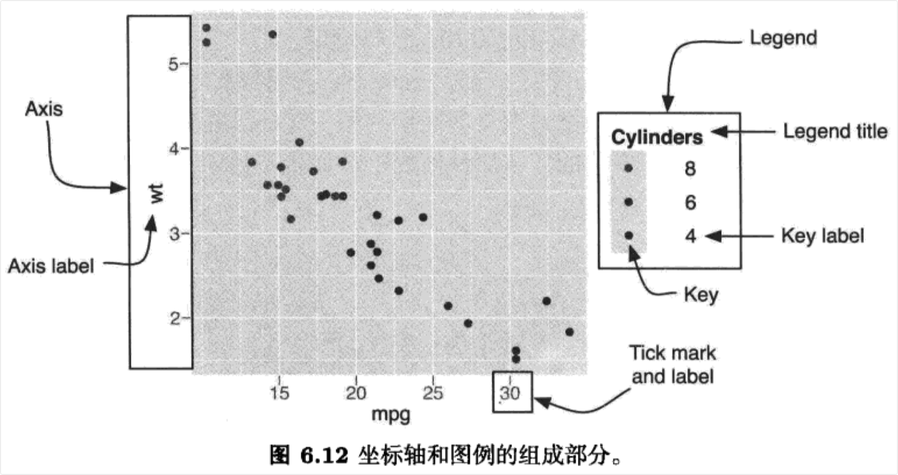

```{r setup, include=FALSE}
knitr::opts_chunk$set(prompt=TRUE,comment='',echo=TRUE,collapse=TRUE,message=FALSE,warning=FALSE)
```

# 6 标度、坐标轴和图例

## 6.1 简介

-   标度(scle)控制着数据到图形属性的映射。标度将我们的数据转化为视觉上可以感知的东西：例如大小、颜色、位置或形状。标度也为我们提供了读图时所使用的工具：坐标轴和图例（总的来说可称为引导元素）。

-   更准确地说，每一种标度都是从数据空间的某个区域（标度的定义域）到图形属性空间的某个区域（标度的值域）的一个函数。每种标度的定义域都对应着提供给这个标度的变量的取值范围，此定义域可以是连续型或离散型、有序型 或无序型。而标度的值域则包含了我们可以感知的、R能够理解的、实实在在的图形属性：位置、颜色、形状、大小和线条类型。可能你在读到标度能够将数据同时映射为位置和颜色时会表示不解，但这是正常现象。使用同一类对象映射数据到位置和符号的这种理念，对人的直觉是一个冲击。然而，在阅读本章的更多内容后，你将体会到这种理念背后的逻辑和力量所在。

-   执行标度的过程分为三步：变换(transformation)、训练(training)和映射(mapping)，具体将在6.2节中阐述。没有标度，就没有将数据转化为图形属性的途径，所以，图形中使用的每一个图形属性都需要一个标度。当然，如果我们每次使用一个新的图形属性时都去手动添加一个标度，又难免枯燥乏味，所以当有需要时，ggot2将自动添加一个默认的标度。我们确实可以在不了解标度运作原理的情况下画出许多图形，但理解标度并学会如何操纵它们则将赋予我们对图形更强的控制能力。关于默认标度以及修改它们的方法，详见6.3节。标度可以粗略地分为四类：位置标度、颜色标度、手动离散型标度以及同一型标度。常用选项和主要使用方法在6.4节进行了描述。这一节着重给出对可用选项的总体概览，而非深入地逐个展开细节。各参数的更多细节已记录于在线文档中。

-   标度的另一个重要角色，是生成一个允许读图者从图形属性空间到数据空间进行反向映射的引导元素(guide)，并从图中读出取值。对于位置型图形属性，引导元素是坐标轴；对于所有其他图形属性来说，引导元素是图例。与其他图形系统不同的是，在这里我们基本无法直接控制坐标轴和图例的细节一不存`在gglegend()`或者`ggaxis()`这种修改图例或坐标轴的函数。事实上，引导元素的外观皆由标度的参数控制。6.5节中讨论了坐标轴和图例。

-   6.6节征引了部分探讨图形属性赋值问题的学术著作，为本章作结。

## 6.2 标度的工作原理

-   要阐明标度的工作原理，首先需要了解标度的定义域（即数据空间）和标度的值域（即图形属性空间），然后说明两者之间进行映射的过程。

-   由于输入变量可能是离散型，也可能是连续型，所以标度的定义域要么是某些值组成的集合（以因子的形式存储，字符型因子或逻辑型因子），要么就是一个实值区间（以长度为2的数值型向量的形式存储）。以哺乳动物睡眠数据(msleep)为例，离散型变量vore的定义域为`{carni,herbi,omni}`，连续型变量bodywt的定义域为`[0.005,6654]`。我们通常会认为这些量是数据的"值域"，但在这里，我们关注的是它们作为标度输入的本质，一个函数的定义域。

-   标度的值域也可以是离散型或连续型的。对于离散型标度，它的值域是输入值对应的图形属性值组成的一个向量。对于连续型标度，它的值域是穿过某种更复杂空间的一条一维路径。例如，从一种颜色到另一种颜色进行线性插值得到的一组渐变颜色。标度的值域要么在其被创建时由用户指定，要么由这个标度自行指定。

-   将定义域映射到值域的过程包括以下阶段：

-   变换：（仅针对连续型的定义域）对数据进行变换后再进行展示往往是有益的，例如对数据取对数或开根号。6.4.2节对变换进行了更加深入地探讨。在变换完成后，将会基于变换后的数据计算每一层的统计摘要。此举保证了线性尺度上log(x)对log(y)的图形与对数尺度上x对y的图形看起来相同。

-   训练：在这个关键的阶段，将通过学习(learning)得到标度的定义域。有时，学习某个标度的定义域相当简单直接：在一个仅有一个图层且仅呈现原始数据的图形中，这个学习过程包括确定某个（变换后的）连续型变量的最小值和最大值，或者是列出某个类别型变量的所有水平。但是，标度的定义域往往必须在多个面板(panel)中反映出横跨多个数据集的多个图层。举例来说，试想这样一个标度，它将被用来创建一个坐标轴；而第一层的原始数据的最大最小值与第二层中的统计摘要有可能是不同的，但是它们最后必须都被绘制在图形上。如6.3节所述，定义域亦可通过手动设定控制标度值域的参数limits跳过训练过程而被直接指定。在此标度定义域外的任何值都将被映射为NA。

-   映射：我们现在已经了解了标度的定义域，并且在整个过程开始之前就已经了解了标度的值域，最后要做的一件事，就是执行这个映射数据到图形属性的函数。

-   简洁起见，我们在描述这个过程时省略了一些步骤。比如，我们没有讨论分面在训练过程中的角色，同时也忽略了对位置的调整。即使如此，这个概述还是很准确的，当你对各种标度在图形中的表现感到困惑时，你应该回过头来看看这个概述。

## 6.3 用法

-   每一种图形属性都拥有一个默认的标度，此标度将在我们每次使用这个图形属性时被自动添加到图形中。这些标度列于表6.1中。标度的种类依赖于变量的类型：标度可为连续型（变量为数值时）或离散型（变量为因子、逻辑值、字符时)。要修改默认的标度，参看8.2.1节中所述的函数`set_default_scale()`。

-   在我们初始化整个图形和增加新图层时，默认的标度将被自动添加。这意味着，如果我们在之后修改了底层数据或图形属性映射，变量类型和标度类型之间可能出现不匹配的情况。当这种情况发生时，我们需要自行添加正确的标度。下例演示了这个问题及其解决方法。

-   表6.1按图形属性和变量类型排列的各种标度。默认标度以粗体显示。默认的标度根据变量是连续型或是离散型而有所不同。形状(shape)和线条类型((line type)没有默认的连续型标度；大小(size)没有默认的离散型标度。

| 图形属性                   | 离散型                           | 连续型                       |
|----------------------------|----------------------------------|------------------------------|
| 颜色(colour)和填充色(fill) | brewer grey hue identity manual  | gradient gradient2 gradientn |
| 位置(position)(x,y)        | discrete                         | continuous date              |
| 形状(shape)                | shape identity manual            |                              |
| 线条类型(line type)        | linetype identity manual         |                              |
| 大小(size)                 | identity manual                  | size                         |

```{r}
library(ggplot2)
p1 <- qplot(cty,hwy,data = mpg) 
p1

# 这样做行不通是因为变量类型和默认标度不匹配
# p1 + aes(x = drv)

# 更正默认标度后解决了问题.
p1 + aes(x = drv) + scale_x_discrete()
```

-   如果要添加一个不同的标度或修改默认标度的某些特征，我们必须构造一个新的标度，然后使用+将其添加到图形上。所有的标度构建器(scale constructor)都拥有一套通用的命名方案。它们以scale开头，接下来是图形属性的名称（例如，colour-、shape_或x\_)，最后以标度的名称结尾（例如，gradient、hue或manual)。举例来说，离散型数据的颜色图形属性的默认标度名为`scale_colour_hue()`，填充色的Brewer配色标度名`scale_fill_brewer()`。

-   以下代码阐明了这个过程。我们以一个使用默认颜色标度的图形开始，然后修改其图例的外观，接着使用了一种不同的颜色标度。结果如图6.1所示。

```{r}
p2 <-qplot(sleep_total,sleep_cycle,data = msleep,colour = vore)
p2

# 显式添加默认标度
p2 + scale_colour_hue()

# 修改默认标度的参数，这里改变了图例的外观
p2 + scale_colour_hue("What does\nit eat?",
                     breaks = c("herbi","carni","omni",NA),
                     labels = c("plants","meat","both","don't know"))

# 使用一种不同的标度
p2 + scale_colour_brewer(palette = "Set1")
```

-   图6.1 调整标度默认参数的示例。（左上图）使用默认标度的图形。（右上图）手动添加默认标度，并未改变图形外观。（左下图）调整标度的参数以实现对图例的微调。（右下图)使用一种不同的颜色标度：ColorBrewer配色方案中的Set1。

## 6.4 标度详解

-   标度可大致分为四组：

-   位置标度，用于将连续型、离散型和日期一时间型变量映射到绘图区域，以及构造对应的坐标轴。

-   颜色标度，用于将连续型和离散型变量映射到颜色。

-   手动标度，用于将离散型变量映射到我们选择的符号大小、线条类型、形状或颜色，以及创建对应的图例。

-   同一型标度，用于直接将变量值绘制为图形属性，而不去映射它们。举例来说，假设我们想要将变量映射为符号的颜色，而此变量本身就是一个由颜色值组成的向量，那么我们就无须再将其映射为其他的颜色，直接渲染这些值本身即可。

### 6.4.1 通用参数

-   以下参数对所有标度通用。

-   name：设置坐标轴或图例上出现的标签。可以指定字符串（使用n换行）或数学表达式（语法如？plotmath所述）。由于经常需要微调这些标签，所以使用三个辅助函数`xlab()`，`ylab()`和`labs()`可以让我们减少部分键入。以下代码演示了它们的用法，结果见图6.2。

```{r}
p3 <- qplot(cty,hwy,data = mpg,colour = displ)
p3
p3 + scale_x_continuous("City mpg") 
p3 + xlab("City mpg") 
p3 + ylab("Highway mpg")
p3 + labs(x = "City mpg",y = "Highway",colour = "Displacement") 
p3 + xlab(expression(frac(miles,gallon)))
```

-   图6.2 图例名称可以接受不同形式的参数。

-   limits：固定标度的定义域。连续型标度接受一个长度为2的数值型向量；离散型标度接受一个字符型向量。一旦设定了limits，数据将不再进行任何训练。读者可直接跳到6.4.2节以了解更多。限制定义域可以帮助我们移除不想在图形上展示的数据（即设置比数据的完整范围更小的limits)，同时也可以保证要进行比较的多个图形中的绘制范围一致（即设置比默认范围大一些或小一些的limits)。任何不在此标度定义域内的值均将被丢弃：如果想要囊括图中的所有观测，其每个图形属性都必须位于每个标度的定义域中。丢弃过程发生在统计量的计算之前。

-   breaks和labels：breaks控制着显示在坐标轴或图例上的值，即，坐标轴上应该显示哪些刻度线的值，或一个连续型标度在一个图例中将被如何分段。labels指定了应在断点处显示的标签。若设置了labels，则必须同时指定breaks，只有这样，这两个参数才能被正确匹配。要区分breaks和limits，请牢记，breaks影响显示在坐标轴和图例上的元素，而limits影响显示在图形上的元素，见图6.3。图中第一列使用了breaks和limits的默认设置，即`limits=c(4,8)`和`breaks=4:8`。中间一列重新设置了`breaks:`绘图区域不变，但刻度和标签的位置都被移动了。最右列则重新定义了limits，相当多的数据落在了绘图区域之外。

```{r}
p4 <- qplot(cyl,wt,data = mtcars)
p4

p4 + scale_x_continuous(breaks = c(5.5,6.5)) 
p4 + scale_x_continuous(limits = c(5.5,6.5)) 

p5 <- qplot(wt,cyl,data = mtcars,colour = cyl)
p5

p5 + scale_colour_gradient(breaks = c(5.5,6.5)) 
p5 + scale_colour_gradient(limits = c(5.5,6.5))
```

-   图6.3 breaks和limits的区别。对x轴的影响（首行）以及彩色图例（次行）。（左栏）默认参数limits=c(4,8)，breaks=4:8的图形，（中栏）breaks=c(5.5,6.5)，(右栏)limits=c(5.5,6.5)。

-   formatter：如果未指定任何标签，则将在每个断点处自动调用格式刷(formatter)来格式化生成标签。对于连续型标度，可用的标签刷为：comma，percent，dollar和scientific；对于离散型标度，则为abbreviate。

### 6.4.2 位置标度

-   每幅图形一定拥有两个位置标度，一个指定水平位置(x标度)，另外一个指定竖直位置(y标度)。ggplot2提供了连续型、离散型(针对因子型、字符型和逻辑型向量)以及日期型标度。其中每种标度对数据作变换的方式稍有不同，并各自生成一个类型稍有不同的坐标轴。以下几节针对每种类型作了详述。

-   对所有的位置坐标来说，修改坐标轴的范围是一项常见任务。由于这项任务需要被经常执行，所以ggplot2提供了一对辅助函数`xlim()`和`ylim()`来减轻我们的工作量。这些辅助函数会检查它们的输入，然后创建合适的对应标度，如下所示：

-   xlim(10，20)：一个从10到20的连续型标度；

-   ylim(20，10)：一个从20到10的反转后连续型标度；

-   xlim("a","b","c")：一个离散型标度；

-   xlim(as.Date(c("2008-05-01"，"2008-08-01")))：一个从2008年5月1日到8月1日的日期型标度。

-   以上参数与R基础图形和lattice图形中的参数xlim和ylim的工作方式不同。在ggplot2中，为了保持与其他标度的一致性，任何在limits以外的数据都不会被绘制，也不会被包括在统计变换的过程中。这就意味着，通过设置limits所得结果与在视觉上放大一块绘图区域所得的结果是不同的。要实现后者，我们需要使用`coord_cartesian()`函数的参数xlim和ylim，在7.3.3节有论述。后一种方式单纯地对图形进行了视觉上的放大，而不影响底层的数据。

-   默认情况下，位置标度的limits会稍微超出数据的范围。这样就保证了数据与坐标轴不会发生重叠。我们可以使用参数expand来控制溢出量，此参数是长度为2的数值型向量。其中第一个元素给出的是乘式的溢出量，第二个参数给出的是加式的溢出量。如果你不想留任何多余的空间，就使用`expand = c(0,0)`。

#### 6.4.2.1 连续型

-   最常用的连续型位置标度是scale_x\_continuous和scale_y\_continuous，它们均将数据映射到x轴和y轴。而最有趣的变式是通过变换来生成的。每个连续型标度均可接受一个trans参数，允许指定若干种线性或非线性的变换。而每一种变换都是由所谓的"变换器"(transformer)来实现的，变换器描述了变换本身和对应的逆变换，以及如何去绘制标签。表6.2列出了部分较为常用的变换器。


-   变换通常被用来修改位置标度，所以对于x，y和z标度都是有简便写法的：`scale_x_log10()`与`scale_x_continuous(trans = "log10")`是等价的。参数trans对任意的连续型标度均有效，包括下文中描述的颜色梯度，但简便写法仅针对位置标度存在。

-   当然，我们也可以自行实施变换。举例来说，我们可以直接绘制`log10(x)`，而不去使用`scale_x_log()`。这两种做法将在绘图区域生成完全相同的结果，但坐标轴和刻度标签却是不同的。如果我们使用变换后的标度，坐标轴将依原始的数据空间进行标注。在这两种情况下，变换均在计算统计摘要之前发生。使用以下代码绘制的图6.4演示了两者的不同。

```{r}
qplot(log10(carat), log10(price), data = diamonds) 
qplot(carat, price, data = diamonds) + scale_x_log10(0) + scale_y_log10()
```

-   图6.4 钻石价格和重量的散点图。演示了对标度进行对数变换(左图)和对数据进行对数变换(右图)的异同。图形主体是完全相同的，但坐标轴上的标签是不同的。

-   变换器同样可以用在`coord_trans()`中，此时变换将在统计量计算完成后进行，因此将影响图形主体的外观。函数`coord_trans()`在7.3.3 节有详述。

#### 6.4.2.2 日期和时间

-   日期和时间值基本上属于连续型，但在标注坐标轴时有着特殊的处理方式。目前我们仅支持属于date类的日期值和属于POSIXct类的时间值。如果你的日期和时间值是其他格式的，则需使用`as.Date()`或`as.POSIXct()`对其进行转换。

-   对于日期坐标轴，有三个参数可用于控制其外观和刻度的位置：major、minor以及format。总体而言，此标度本身已经能够很好地选择默认值，不过如果你想对其进行微调，细节如下：

-   参数major和minor用以按照时间的单位，即年(year)、月(month)、周(week)、日(day)、时(hour)、分(minute)、秒(second)来指定主要和次要断点的位置，并且允许以这些单位的倍数出现。例如，major = "2 weeks"将在每隔两周的位置放置一个主刻度。如果未被指定，日期标度可以自动选出合适的默认值。

-   参数format指定了刻度标签的格式。表6.3列出了用以展示日期各个组成部分的特殊字符。例如，如果你想以14/10/1979的形式显示日期，就可以使用字符串"%d/%m/%y"。

-   表6.3 从strptime的文档中提取的常用数据格式编码。依时间从短到长排列。


-   我们通过绘制图6.5来演示部分参数的用法，代码如下。

```{r}
library(ggplot2)
library(scales)
p6 <- qplot(date, psavert, data = economics, geom = "line") + ylab("Personal savings rate") +
  geom_hline(xintercept = 0, yintercept=1, colour = "grey50")
p6

p6 + scale_x_date(breaks = date_breaks("10 years"))
p6 + scale_x_date(limits = as.Date(c("2004-01-01", "2005-01-01")),labels = date_format("%Y-%m-%d"))
```

-   图6.5 个人储蓄率的时间序列图形。(左图)默认外观，(中图)每隔10年为一断点，以及(右图)使用年月日的格式仅显示在2004年内的图形。测量值是在每月月末记录的。

#### 6.4.2.3 离散型

-   离散型位置标度将输入中的各水平映射为整数。结果的顺序可用参数breaks进行控制，不想要的水平可以使用limits(或使用`xlim()`或`ylim()`)进行丢弃。由于我们经常也会在图形的非整点位置放置标签和标注，所以离散型位置标度也可以接受连续型的值。如果你尚未调整breaks或limits，某个因子水平的所在位置的数值表示可以使用`as.numeric()`进行计算：以从1开始的整数表示。

### 6.4.3 颜色标度

-   除了位置标度以外，最常用的图形属性可能就是颜色了。有相当多的方法用来将值映射为颜色：对连续型值有三种基于渐变的方法，对离散型值有两种方法。但在我们研究每种方法的细节之前，先了解一点色彩学理论是很有帮助的。正因为人眼和大脑的底层生理学原理比较复杂，所以色彩学也较为复杂，下面的简介将着重强调那些相对重要的问题。

-   在物理层面，颜色是由不同波长的光混合而产生的。要完全了解一种颜色，我们需要了解全部的波长混合情况，但幸运的是，我们人类的眼球只有三种不同的颜色感受器，于是我们就可以仅用三个数字来表示任意颜色。你可能对于使用rgb编码的色彩空间已经很熟悉了，这种色彩空间使用红、绿、蓝三种光的光强来表示一种颜色。这个空间的一个问题在于，它在视觉感知上并不均匀：

-   两种间隔一个单位的颜色可能看上去非常相似，但又可能非常不同，这取决于它们在这个色彩空间中的位置。这使得创建一个从连续变量到一个颜色集的映射变得十分困难。在提出感知上更均匀的色彩空间方面已经有了很多尝试。我们在这里将使用一种名为hcl色彩空间的现代方案，它由三部分构成，分别是色相(hue)、彩度(chroma)和明度(luminance)：

-   色相(hue)是一个0和360之间的(角度)值，它将一种色彩赋以"颜色"属性：如蓝、红、橙等等。

-   明度(luminance) 指颜色的明暗程度。明度的高低，要看其接近白色或黑色的程度而定。明度为0为黑，明度为1为白。

-   彩度(chroma)指色彩的纯度。彩度为0是灰色，彩度的最大值随明度的变化而不同。

-   这三部分组合生成的空间形状并不简单。图6.6尝试展示了此色彩空间的三维形状。每个分面中的明度(亮度)是一个常数，色相被映射为角度，彩度被映射为半径。我们可以看到，每个分面的中心均为灰色，距离边缘越近，颜色也越浓烈。

-   另一个问题是，很多人(约为人群中的10%)不具有功能健全的颜色感受器，因而只能分辨出相对更少的颜色。简言之，最好避免使用红绿对比，并且要使用可以模拟色盲情形的系统来检查你的图形。Visicheck就是一种在线解决方案。另外一种选择是使用dichromat包(Lumley,2007)，它提供了模拟色盲情形的工具，并且自带了若干套已知对色盲人士亦可正常工作的配色方案。同样地，你还可以像帮助色盲人士一样帮助只拥有黑白打印机的人们：提供到其他图形属性(如大小、线条类型或形状)的冗余映射。

-   以下几节讨论的所有标度对边界色(colour) 图形属性和填充色(fill) 图形属性均有效。

#### 6.4.3.1 连续型

-   根据颜色梯度中的色彩数量划分，共有三类连续型颜色梯度(即渐变色)：

-   `scale_colour_gradient()`和`scale_fill_gradient()`：双色梯度。顺序为从低到高。参数low和high用以控制此梯度两端的颜色。

-   `scale_colour_gradient2()`和`scale_fill_gradient2()`：三色梯度。顺序为低一中一高。参数low和high作用同上，这两种标度还在中点处拥有一个中间色。中点的默认值为0，但也可使用参数midpoint将其设置为任意值。这个参数对生成发散型(diverging)配色方案特别有用。

-   `scale_colour_gradientn()`和`scale_fill_gradientn()`：自定义的n-色梯度。此标度需要赋给参数colours 一个颜色向量。不加其他参数的话，这些颜色将依照数据的范围均匀地分布。如果你需要让这些值不均匀地分布，则可以使用参数values。如果rescale的取值为TRUE(默认值)，则values应在0和1之间取值，如果rescale的取值为FALSE,则values应在数据范围内取值。

-   颜色梯度常被用来展示一个二维表面的高度。下面我们将以faithful数据集(Azzalini and Bowman, 1990)的一个二维核密度估计表面为例进行说明，此数据集记录了黄石公园的老忠实泉两次喷发的间隔时间以及每次喷发的持续时长。图6.7展示了应用于此数据的三种颜色梯度，绘图代码如下。注意limits的用法：此参数对所有标度都是通用的。

```{r}
f2d <- with(faithful, MASS::kde2d(eruptions, waiting,h= c(1, 10), n= 50))
df <- with(f2d, cbind(expand.grid(x, y), as.vector(z))) 
names(df) <- c("eruptions", "waiting", "density")
erupt <- ggplot(df, aes(waiting, eruptions, fill = density)) + geom_tile() + 
  scale_x_continuous(expand = c(0,0)) + 
  scale_y_continuous(expand = c(0, 0))
erupt + scale_fill_gradient(limits = c(0, 0.04))
erupt + scale_fill_gradient(limits = c(0, 0.04),low = "white", high = "black")
erupt + scale_fill_gradient2(limits = c(-0.04, 0.04),
midpoint = mean(df$density))
```

-   图6.7 温泉喷发时间数据密度估计的三种配色方案。(左图)默认的颜色梯度，(中图)自定义的黑白梯度以及(右图)中点设为密度均值的3点梯度。

#### 6.4.3.2 离散型

-   离散型数据有两种颜色标度。一种可以自动选择颜色，另一种可以轻松地从手工甄选的颜色集中选择颜色。

-   默认的配色方案，即`scale_colour_hue()`，可通过沿着hcl色轮选取均匀分布的色相来生成颜色。这种方案对多至约8种颜色时都能有较好的效果，但对于更多的颜色，要区分开不同的颜色就变得比较困难了。默认配色的另外一个缺点是，由于所有颜色都拥有相同的明度和彩度，所以当我们进行黑白打印时，它们就会成为几近相同的灰影。

-   除了这种基于计算的方案以外，另一种可选的方案是使用ColorBrewer配色。这些手工甄选的颜色可在很多情境下良好地运作，尽管它更专注于地图，这些颜色也因此在展示较大的面积时表现更佳。对于类别型数据中的点而言，我们最感兴趣的调色板是"Set1"和"Dark2，对面积而言则是"Set2"、"Pastel1"、"Pastel2"和"Accent"。使用`RColorBrewer::display.brewer.all`可列出所有的调色板。图6.9展示了应用于点和条形的三种调色板，代码如下。

```{r}
point <- qplot(brainwt, bodywt, data = msleep, log = "ху", colour = vore)
area <- qplot(log10(brainwt), data = msleep, fill = vore, binwidth = 1)
point + scale_colour_brewer(palette = "Set1") 
point + scale_colour_brewer(palette = "Set2") 
point + scale_colour_brewer(palette = "Pastel1") 
area + scale_fill_brewer(palette = "Set1")
area + scale_fill_brewer(palette = "Set2") 
area + scale_fill_brewer(palette = "Pastel1")
```

-   图6.9 三种 ColorBrewer 调色板，Set1(左图)，Set2(中图) 和Pastel1(右图)，分别应用于点(首行)和条形(次行)。更明亮的颜色对点效果良好，但对于条形来说过于刺眼。淡色对条形效果良好，但会让点看不清楚。

-   如果要用自制的离散型颜色标度，可使用下文所述的`scale_colour_manual()`。

### 6.4.4 手动离散型标度

-   离散型标度`scale_linetype()`，`scale_size_discrete()`和`scale_shape()`基本上没有选项(虽然对于形状标度，你可以选择点是空心可填充的或是实心的)。这些标度仅仅是按一定的顺序将因子的水平映射到一系列取值中。

-   如果你想要定制这些标度，你需要使用以下手动型标度创建新的标度：`scale_shape_manual()`，`scale_linetype_manual()`，`scale_colour_manual()`等等。手动型标度拥有一个重要参数values，你可以使用它来指定这个标度应该生成的值。如果这个向量中的元素是有名称的，则它将自动匹配输入和输出的值，否则它将按照离散型变量中水平的先后次序进行匹配。你需要了解一些可用的图形属性值，详见附录B。以下代码演示了`scale_manual()`的使用方法，结果见图6.10。

```{r}
p7 <- qplot(brainwt, bodywt, data = msleep, log = "xy")
p7 + aes(colour = vore) + scale_colour_manual(values = c("red", "orange", "yellow", "green", "blue"))
colours <- c(carni = "red", "NA" = "orange", insecti = "yellow", herbi = "green", omni = "blue")
p7 + aes(colour = vore) + scale_colour_manual(values = colours) 
p7 + aes(shape = vore) + scale_shape_manual(values = c(1, 2,6, 0,23))
```

-   图6.10 使用手动型标度创建自定义颜色标度(左图和中图)和自定义形状标度(右图)。

-   有时你可能想在同一幅图上展示多个变量并显示一个有用的图例，下例就展示了`scale_colour_manual()`在这种情况下的创意用法。在多数其他的图形系统中，你只需像下图一样把线上色，然后添加一个图例说明哪种颜色对应着哪个变量就可以了。这对于ggplot2不适用，因为图例是由标度负责绘制的，但标度并不知道要为线条添加何种标签。

```{r}
huron <- data.frame(year = 1875:1972, level = LakeHuron) 
ggplot(huron, aes(year)) +
geom_line(aes(y = level - 5), colour = "blue") +
geom_line(aes(y = level + 5), colour = "red")
```

-   你需要做的，就是通过创建从数据到颜色图形属性的一个映射，来告诉颜色标度这两条线的信息。此数据中并未出现变量，所以需要先创建一个：

```{r}
ggplot(huron, aes(year)) +
  geom_line(aes(y = level - 5, colour = "belov")) + 
  geom_line(aes(y = level + 5, colour = "above"))
```

-   这样基本得到了我们想要的效果，但图例标注不正确且颜色有误。可以使用scale_colour_manual进行修复：

```{r}
ggplot(huron, aes(year)) +
  geom_line(aes(y = level - 5, colour = "below")) + 
  geom_line(aes(y = level + 5, colour = "above")) + 
  scale_colour_manual("Direction",values = c("below" = "blue", "above" = "red"))
```

-   此问题的另一种解决方法参见9.2.1节。

### 6.4.5 同一型标度

-   当你的数据能被R中的绘图函数理解时，即数据空间和图形属性空间相同时，可以使用同一型标度(identity scale)。这就意味着此时无法仅从数据本身派生出有意义的图例，所以默认是不绘制图例的。如果你确实想要绘制一个，则仍然可以通过使用参数breaks和labels自行设定。

-   图6.11展示了一类适合使用scale_identity的数据。这里数据本身即为颜色值，我们也无法创造一个有意义的图例。同一型标度在手工将数据标度为图形属性的情况下也是有用的。在那种情况下，你将不得不自己考虑哪些断点和标签对你的数据来说是有意义的。

## 6.5 图例和坐标轴

-   坐标轴和坐标被共同称为引导元素，它们都是标度的逆函数：它们允许你在图中读出观测并将其映射回原始值。图6.12标出了引导元素和它们的组成部分。图例和坐标轴存在着天然的可比性：图例标题(legend title)和坐标轴名(axis label)是等价的，并且都由标度的名称参数(name)决定；图例标示(legend key)和刻度标签(tick label)皆由标度的断点参数(break)决定。



-   在ggplot2中，图例和坐标轴可根据你在图形中使用的标度和几何对象自动生成。这一点与其他图形系统中由你负责自行添加图例的机制不同。在ggplot2中，你几乎无法直接控制图例。乍一看，这似乎是一个很大的限制，但随着你逐渐适应这种方式，你将会发现这样可以节约大量的时间，并且(图例的)几乎所有方面都是可以控制的。

-   要绘制图例，图形必须收集每一种图形属性的使用信息：为何种数据以及为何种几何对象。标度的断点(breaks)被用来确定图例标示的值，使用了对应图形属性的一系列几何对象则被用来确定如何绘制这些标示。举例来说，如果你使用了点这个几何对象，那么你将在图例中得到点；如果你使用了线，你将会在图例中得到线。如果点和线都被使用了，那么点和线都会被绘制在图例中。图6.13阐明了这一点。


-   ggplot2会尝试生成最小数量的、能够精确表达图中使用图形属性的图例。当一个变量对应了多个图形属性时，ggplot2可以通过合并图例的办法来达到精简的目的。图6.14使用点来展示了一个这方面的例子：如果颜色和形状都被映射到相同的变量，那么用一个图例就足够了。被合并的图例必须拥有相同的名称(相同的图例标题)。因此，如果你修改了某个合并后的图例的名称，你将需要修改所有的相关名称。


-   图例和坐标轴的内容是由标度控制的，而渲染的细节是由主题系统控制的。以下列表包含了最常用的微调选项。

-   标度name控制着坐标轴名和图例标题，可为字符串或数学表达式，语法详见?plotmath所述。

-   本章早些时候介绍了，breaks 和labels是非常重要的标度函数参数，因为它们控制着哪些刻度标签出现在坐标轴上，以及哪些标示出现在图例上。如果默认选择的断点不合适(或是你想使用信息量更足的标签)时，设置这些参数即可调整图例标示和坐标刻度的外观。

-   主题设置`axis.*`和`legend.*`控制着坐标轴和图例的整体外观。要了解如何操纵这些选项，请参看8.1节。

-   内部网格线由主要断点和次要断点的参数控制。默认地，次要的网格线均匀地分布在原始的数据空间中：这就为对数一一对数图形赋予了通用的行为，即主要网格线是可乘的，而次要网格线是可加的。你可以使用参数minor_breaks覆盖掉次要网格线。网格线的外观是使用panel.grid.major和panel.grid.minor两个主题设置来控制的。

-   图例的位置和对齐是使用主题设置legend.position来控制的，其值可为right、left、top、bottom、none(不加图例)，或是一个表示位置的数值。这个数值型位置由legend.justification给定的相对边角位置表示(取0和1之间的值)，它是一个长度为2的数值型向量：右上角为c(1，1), 左下角为c(0,0)。
