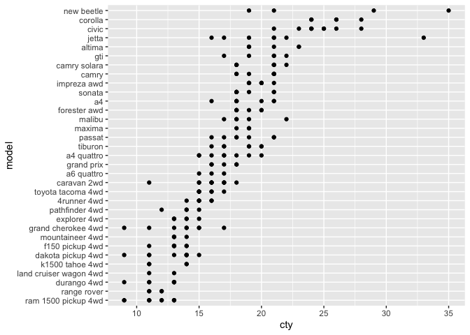
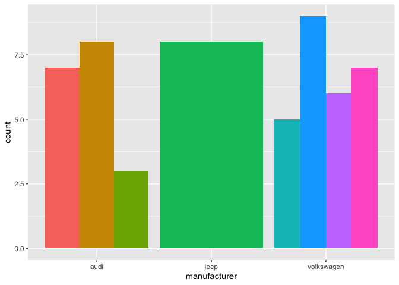
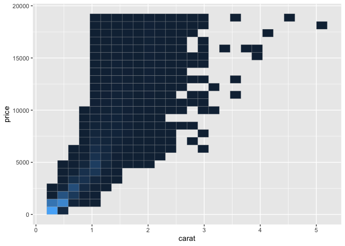
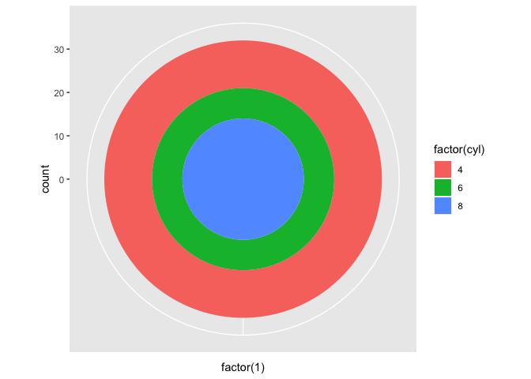

chapter07_定位
================

- <a href="#7-定位" id="toc-7-定位">7 定位</a>
  - <a href="#71-简介" id="toc-71-简介">7.1 简介</a>
  - <a href="#72-分面" id="toc-72-分面">7.2 分面</a>
    - <a href="#721-网格分面" id="toc-721-网格分面">7.2.1 网格分面</a>
    - <a href="#722-封装分面" id="toc-722-封装分面">7.2.2 封装分面</a>
    - <a href="#723-标度控制" id="toc-723-标度控制">7.2.3 标度控制</a>
    - <a href="#724-分面变量缺失" id="toc-724-分面变量缺失">7.2.4
      分面变量缺失</a>
    - <a href="#725-分组与分面" id="toc-725-分组与分面">7.2.5 分组与分面</a>
    - <a href="#726-并列与分面" id="toc-726-并列与分面">7.2.6 并列与分面</a>
    - <a href="#727-连续型变量" id="toc-727-连续型变量">7.2.7 连续型变量</a>
  - <a href="#73-坐标系" id="toc-73-坐标系">7.3 坐标系</a>
    - <a href="#731-变换" id="toc-731-变换">7.3.1 变换</a>
    - <a href="#732-统计量" id="toc-732-统计量">7.3.2 统计量</a>
    - <a href="#733-笛卡尔坐标系" id="toc-733-笛卡尔坐标系">7.3.3
      笛卡尔坐标系</a>
    - <a href="#734-非笛卡尔坐标系" id="toc-734-非笛卡尔坐标系">7.3.4
      非笛卡尔坐标系</a>

# 7 定位

## 7.1 简介

- 本章的主题是图形的定位，主要讲解了布局分面和坐标系如何工作两个问题。定位由四个部分组成，在之前与分面有关的篇章中，我们已经学习了其中的两个部分：

- **位置调整**调整每个图层中出现重叠的对象的位置，在4.8节有过介绍。该方法对条形图和其他有组距的几何对象非常有用，同时也可以用于其他的情形。

- **位置标度**控制数据到图形中位置的映射，在6.4.2小节有过介绍。常用的映射是线性和对数变换；当然，你也可以使用其他可逆的变换。

- 本章将对其余两部分进行讲解，同时也将展示如何对这四个组成部分进行综合应用：

- **分面**即在一个页面上自动摆放多幅图形的技法：先将数据划分为多个子集，然后将每个子集依次绘制到页面的不同面板中。这类图形也通常被称作小联号图(small
  multiples)，可参见本章7.2节。

- **坐标系**即通过控制两个独立的位置标度来生成一个2维的坐标系。最常见的是笛卡尔坐标系，在某些特定的情形中也可以使用其他种类的坐标系。

## 7.2 分面

- 在2.6节介绍函数`qplot()`时，你其实已经接触了分面的用法：切割数据生成一系列小联号图，每个小图表示不同的数据子集。对探索性数据分析来说，分面是一个强大有力的工具。它能帮你快速地分析出数据各子集模式的异同。本节将讨论如何较好地微调分面，特别是与位置标度相关的方法。

- ggplot2提供两种分面类型:网格型(facet_grid)和封装型(facet_wrap)。网格分面生成的是一个2维的面板网格，面板的行与列通过变量来定义；封装分面则先生成一个1维的面板条块，然后再封装到2维中。网格分面布局类似于R基础图形中的coplot布局，而封装分面则类似于lattice的面板布局。由图7.1我们可以清楚地看到两者的不同之处。


- 图7.1两种分面系统间差异的示意图。`facet_grid()`
  (左)本质上为2维，由两个独立的部分组成；`facet_wrap()`
  (右)本质上为1维，为节省空间而封装成2维。

- 分面系统有两个基本参数：一个是分面变量的设置，另一个是指定分面的位置标度是全局还是局部。两套分面系统在参数设定上略有不同，在后面的章节里我们将对两者分别进行讲解。

- 在`qplot()`中可以选择分面系统。2维分面(比如x<sub>y)使用facet_grid，1维分面(比如</sub>x)使用facet_wrap。

- 分面绘图通常会占用大量空间，因此本节使用mpg数据集的子集来进行展示。它有几个简单的水平：三种气缸(4,6,8)和两种驱动轮(4和f)。子集剔除了原数据中的29辆汽车。

``` r
> library(ggplot2)
> mpg2 <- subset(mpg, cyl != 5 & drv %in% c("4","f"))
```

### 7.2.1 网格分面

- 网格分面在2维网格中展示图形。输入分面表达式时，你需要设定哪些变量作为分面绘图的行，哪些变量作为列，规则如下：

- 不进行分面：即不使用函数facet_grid或加上命令`facet_null()`，此时，没有行或列被分面化，我们将得到一个单独的面板。

``` r
> # 和 qplot(cty, hwy, data = mpg2)效果一样
> qplot(cty, hwy, data = mpg2) + facet_null()
```

<!-- -->

- 一行多列：`".~a"`。电脑屏幕通常较宽，因此这个方向最适合数据的展示。另外，因为纵坐标轴相同，这个方向也有助于y位置的比较。

``` r
> qplot(cty, hwy, data = mpg2) + facet_grid(. ~ cyl)
```

<!-- -->

- 一列多行：`"b~."`。横坐标轴相同，利于x位置的比较，尤其是对数据分布的比较。

``` r
> qplot(cty, data = mpg2, geom = "histogram", binwidth = 2) + facet_grid(cyl ~ .)
```

<!-- -->

- 多行多列：`"a ~ b"`。我们通常都将因子水平数目最大的变量按列排放，这样可以充分利用屏幕的宽高比。

``` r
> qplot(cty, hwy, data = mpg2) + facet_grid(drv ~ cyl)
```

<!-- -->

- 多个变量的多个水平在行或者列上(或者同时)：`.~a+b`或`a+b~.`。一般来说此法不太实用，除非变量的因子水平个数比较少，或电脑屏幕很宽，或需要生成一个瘦长的海报的时候。

- 从以上图形我们可以看到，变量在某行或某列一起出现时，图形只会展示数据中出现的变量组合。而变量在行和列都出现时，图形将展示所有的变量组合，包括在原始数据中都没有出现的组合，不过这也可能会导致出现空白面板。

#### 7.2.1.1 边际图

- 切割图形就好比创建一个列联表。列联表可展示每个单元格的值以及边际和(一个行或列的总和)。这种模式对于绘图也非常有用，你可以使用参数margins来绘制边际图。

- 设定`margins = TRUE`可展示所有的边际图，或者如`margins = c("sex","age")`，列出你要展示的边际图的变量名称。另外，你也可以使用grand_row或grand_col来分别生成所有行或所有列的边际图。

- 如图7.2，左图没有边际图，右图展示了所有的边际图。列边际图和行边际图分别展示了所有的驱动轮和所有的汽缸，右下角的分面则展示了整个数据集的情况。从图中我们可以看到，随着气缸数增加，发动机排量将增加，燃油经济性将下降；相比前轮驱动的汽车，四轮驱动汽车有大致相同的排量，但燃油经济性较低。图形生成代码如下：

``` r
> p1 <- qplot(displ, hwy, data = mpg2) +
+   geom_smooth(method = "lm", se = F) 
> p1 + facet_grid(cyl ~ drv)
```

<!-- -->

``` r
> p1 + facet_grid(cyl ~ drv, margins = T)
```

<!-- -->

- 图7.2
  图形的边际图生成与列联表类似，提供给我们一个无依赖条件的数据观察视角。左图展示了根据气缸数和驱动器数生成的分面图形，右图补充了它们的边际图。

- 边际图的分组方式与其他面板中分组方式相同：默认使用图层中所有分类变量的交互作用(可以参见4.5.3小节)。下面的代码表示对每个驱动轮类型添加了彩色平滑线。

``` r
> qplot(displ, hwy, data = mpg2) +
+   geom_smooth(aes(colour = drv), method = "lm", se = F) + 
+   facet_grid(cyl ~ drv, margins = T)
```

<!-- -->

- 相对于屏幕展示，具有许多分面和边际图的图形更适合印刷，因为印刷有更高的分辨率(600dpi
  vs 72dpi)，这样你可对更多的数据子集进行比较。

### 7.2.2 封装分面

- 另一种分面形式是封装式的图形条块。facet_wrap并不是用两个或者更多的变量来生成一个2维网格，而是先生成一个长的面板条块(由任意数目的变量生成)，然后将它封装在2维中。在处理单个多水平变量时，这种处理方式非常有用，它可以有效地利用空间来安放图形。lattice中栅栏
  (Trellis) 图形也采取了这个方法。

- 分面变量的设置形式为`~a+b+c`。facet_wrap默认把图形面板尽可能摆放成方形，且更偏好于宽扁型的矩形。你可以通过设置ncol,
  nrow来更新默认设置，更多实例请参考文档。

### 7.2.3 标度控制

- 对于两种分面，你可以通过调整参数scales来控制面板的位置标度是相同(固定)还是允许变化(自由)：

- scales = “fixed”：x和y的标度在所有面板中都相同。

- scales = “free”：x和y的标度在每个面板都可以变化。

- scales = “free_x”：x的标度可变，y的尺度固定。

- scales = “free_y”：y的标度可变，x的尺度固定。

- 图7.4展示了固定标度与自由标度间的差异。

``` r
> p2 <- qplot(cty, hwy, data = mpg)
> p2 + facet_wrap(~ cyl)
```

<!-- -->

``` r
> p2 + facet_wrap(~ cyl, scales = "free")
```

<!-- -->

- 图7.4
  每个分面中固定标度即横纵坐标范围相同(左图)，而自由标度即横纵坐标范围可变(右图)。

- 固定标度可以让我们在相同的基准上对子集进行比较，观察在哪些地方各子集有相似的总体模式。而自由标度可以帮助我们发现更多细节，它在展示不同量纲的时间序列时非常有用。为展示自由标度的效果，我们首先需要把数据从”宽”变”长”，把不同的变量堆叠在一列中。图7.5为我们展示了一个示例，更多的细节在9.2小节将作更多的探讨。

``` r
> library(reshape2)
> em <- melt(economics, id = "date")
> # 0.9.0之后版本中melt()函数需要加载reshape2包
> qplot(date, value, data = em, geom = "line", group = variable) + facet_grid(variable ~., scale = "free_y")
```

<!-- -->

- 图7.5 自由标度在展示不同量纲的时间序列时非常有用。

- 使用网格分面时facet_grid有一个额外的限制：同列的面板必须有相同的x标度，同行的面板必须有相同的y标度。这是因为网格分面中，每列都共用一个x轴，每行都共用一个y轴。

- facet_grid还有一个额外的参数space，值可为”free”或”fixed”。当space设定为free时，每列(行)的宽度(高度)与该列(行)的标度范围成比例。这将使得所有面板的标度比例相同：每个面板中的1cm都映射为相同的数据范围(与lattice中的”sliced”轴的限制类似)。例如，若面板a有2个单位的范围，面板b有4个单位的范围，那么三份之一的空间将分配给a，其余的分配给b。这对分类标度非常有用，图7.6给出了具体的实例，代码如下。代码中的`reorder()`可使模型(model)和生厂商(manufacturer)
  按城市油耗(cty)重新排序。

``` r
> mpg3 <- within(mpg2,{
+   model <- reorder(model, cty)
+   manufacturer <- reorder(manufacturer, -cty) 
+   })
> models <- qplot(cty, model, data = mpg3)
> 
> models
```

<!-- -->

``` r
> models + facet_grid(manufacturer ~ ., scales = "free", space = "free") + theme(strip.text.y = element_text())
```

<!-- -->

- 图7.6
  每种小汽车的城市油耗英里数的点图。(左)车类型按mpg均值排序，(右)使用
  scales = “free_y”和space =
  “free”，按生产商进行分面。strip.text.y主题设置用来旋转分面标签。

### 7.2.4 分面变量缺失

- 假如我们想对一个含有多个数据集的图形使用分面，而其中一个数据集缺失了分面变量，那么图形将会出现什么情况呢？在对所有图形面板添加相同背景信息时，你会经常遇到这种问题。例如，你想对疾病的空间分布按性别进行分面绘图，但一个新添加的地图图层不包含性别变量，这时如何处理呢？ggplot2会按照你所期望的那样，给每个面板都添加地图，此时缺失的分面变量按包含该分面变量所有的值来处理。

### 7.2.5 分组与分面

- 与通过调整图形属性(比如颜色、形状或大小)来分组不同，分面提供了另外一种分组途径。依据子集相对位置的不同，这两种绘图技巧都有相应的优缺点。

- 在分面图形中，每个组别都在单独的面板中，相隔较远，组间无重叠。因此组与组之间重叠严重时，分面图形有一定的好处，不过这也会导致组间的细微差别难以发现。使用图形属性区分各组时，各组将会离得很近甚至可能重叠，不过细微的差别容易被发现。图7.7展示了两者优缺点的互补：在散点图中，仅使用颜色区分各组，我们可能还没意识到图形重叠了，但是回归线却可以让我们看到D、E和G被分组在一起，与J组相距较远。图形代码如下：

``` r
> xmaj <- c(0.3,0.5,1,3,5)
> xmin <- as.vector(outer(1:10, 10^c(-1, 0)))
> ymaj <- c(500, 1000, 5000, 10000)
> ymin <- as.vector(outer(1:10,10^c(2,3,4)))
> dplot <- ggplot(subset(diamonds, color %in% c("D","Е","G","J")), aes(carat, price, colour = color)) +
+   scale_x_log10(breaks = xmaj, labels = xmaj, minor = xmin) + 
+   scale_y_log10(breaks = ymaj, labels = ymaj, minor = ymin) + 
+   scale_colour_hue(limits = levels(diamonds$color)) + 
+   theme(legend.position = "none")
> dplot + geom_point()
```

<!-- -->

``` r
> dplot + geom_point() + facet_grid(. ~ color)
```

<!-- -->

``` r
> dplot + geom_smooth(method = lm, se = F, fullrange = T)
```

<!-- -->

``` r
> dplot + geom_smooth(method = lm, se =F, fullrange = T) + facet_grid(. ~ color)
```

<!-- -->

- 图7.7 分面与分组的差异：克拉与价格的双对数图，四种颜色标注。

- 当组别数很多时，分面也能较好处理。因为你可将它们划分到2个维度中，这时比较两个变量相对于比较两个不同图形属性会更为容易。分面还有其他的优势，比如数据子集若有不同的尺度范围，各个面板中标度可以作相应调整。

### 7.2.6 并列与分面

- 分面可绘制出与图形并列类似的图形效果。图7.8中，并列和分面绘制的图形看起来非常相似，它们主要的区别在于标注方式：分面图形在上方有颜色的标注，同时下面有切工的标注，而并列图形在下方有颜色标注，切工却没有清晰标注出来。在本例中，分面图形中的标签需要做一些调整，以增强可读性，具体细节参照如下代码：

``` r
> ggplot(data = diamonds, aes(x=color,fill = cut)) + geom_bar(position = "dodge")
```

<!-- -->

``` r
> qplot(cut, data = diamonds, geom = "bar", fill = cut) + facet_grid(. ~ color) +
+   theme(axis.text.x = element_text(angle = 90, hjust = 1, size = 8, colour = "grey50"))
```

<!-- -->

- 图7.8 并列(上)vs分面(下)对于水平完全交叉的变量对。

- 除标注方式外，当两个变量的因子水平几乎完全交叉，而部分变量组合缺失时，两种绘图方式也就会有所不同。此时，并列图形的用处不大，因为它只是对条形图做局部地分割，没有任何标签。而分面就实用得多，它能控制分割方式是局部的(scales
  = “free_x”, space = “free”)还是全局的(scales=
  “fixed”)。图7.9对两者效果进行了比较，数据来源于mpg数据集，变量model和manufacturer为嵌套类型，代码如下：

``` r
> mpg4 <- subset(mpg, manufacturer %in% c("audi", "volkswagen", "jeep"))
> mpg4$manufacturer <- as.character(mpg4$manufacturer) 
> mpg4$model <- as.character(mpg4$model)
> 
> base <- ggplot(mpg4, aes(fill = model)) + geom_bar(position = "dodge") + theme(legend.position = "none")
> 
> base + aes(x = model) + facet_grid(. ~ manufacturer)
```

<!-- -->

``` r
> last_plot() + facet_grid(. ~ manufacturer, scales = "free_x", space = "free") 
```

<!-- -->

``` r
> base + aes(x = manufacturer)
```

<!-- -->

- 图7.9
  对于嵌套型数据，分面(上，中)的优势相比并列(下)是明显的，它能控制图形并进行标注。此例中，上图不是很实用，但对于几乎交叉的数据非常有用，比如缺失了一个水平组合的情况。

- 总之，图形是选择分面还是并列，要视两变量间的关系而定：

- 水平完全交叉：分面和并列基本等同。

- 水平几乎交叉：有相同标度的分面保证了所有的水平组合可见，即使有些是空的。当存在非结构性的缺失组合时，绘制分面图形非常有用。

- 水平无交叉(嵌套)：标度自由的分面会对每个有较高水平的组别分配充足的作图空间，并对每个条目都进行标注。

### 7.2.7 连续型变量

- 对连续型变量进行分面，首先需要将其变换为离散型。有三种转化方法：

- 将数据分为n个长度相同的部分：用`cut_interval(x,n = 10)`控制划分数目，或用`cut_interval(x,length = 1)`控制每个部分的长度。控制划分数目会容易些，但划分区间的端点值可能不太”美观”。

- 将数据划分为n个有相同数目点的部分：`cut_number(x,n =10)`。这使得分面间进行对比会更容易(分面有相同数目的点)，但需要注意每个部分的标度范围是不同的。

- 下面的代码展示了三种转化方式，结果参见图7.10。

``` r
> mpg2$disp_ww <- cut_interval(mpg2$displ, length = 1) 
> mpg2$disp_wn <- cut_interval(mpg2$displ, n= 6)
> mpg2$disp_nn <- cut_number(mpg2$displ, n= 6)
> p3 <- qplot(cty, hwy, data = mpg2) + labs(x = NULL, y = NULL) 
> p3 + facet_wrap(~ disp_ww, nrow = 1)
```

<!-- -->

``` r
> p3 + facet_wrap(~ disp_wn, nrow = 1)
```

<!-- -->

``` r
> p3 + facet_wrap(~ disp_nn, nrow = 1)
```

<!-- -->

- 图7.10
  将连续变量离散化的三种方式。从上至下：面板长度为1；每个面板等长；每个面板包含数目的点相同。

- 注意：分面表达式只对包含在数据集中的变量有效果(不是变量的函数)，因此需在数据集中创建一个包含了离散化后的数据的新变量。

## 7.3 坐标系

- 坐标系是将两种位置标度结合在一起组成的2维定位系统。ggplot2包含了6种不同的坐标系，见表7.1。表中所有的坐标系都是2维的，不过我希望将来也能把3维图形添加进来。与ggplot2其他组成部分命名类似，坐标系命名规则为coord_加上坐标系的名字。比如大部分图形都默认为笛卡尔坐标系，即常见的x和y坐标组成的2维坐标系，命名为`coord_cartesian()`。

- 坐标系主要有两大功能：

- 将2个位置图形属性组合起来在图形中形成2维方位系统。位置图形属性分别被称为x和y，但将它们称作位置1和位置2可能会更合适，因为图形位置属性的名字会随着坐标系的不同而不同。比如极坐标系中将其称作角度和半径，而地图中则称作纬度和经度。

- 配合分面，坐标系将绘出坐标轴和面板背景。标度控制着坐标轴上出现的数值，并将数据映射到图形中的位置，然后通过坐标系将它们绘制出来。图形的外观随着坐标系的变化而变化，毕竟角度轴与x轴看起来是不同的。

- 表7.1
  ggplot2中可用的坐标系。coord_equal、coord_flip和coord_trans本质都是笛卡尔型的坐标系(维度正交)，coord_map和coord_polar则更为复杂。


### 7.3.1 变换

- 与数据变换和标度变换不同，坐标系变换将改变图形的几何形状：在极坐标系中，矩形变为圆环的一部分；在地图中，两点间的最短路径将不是直线。

- 坐标系变换分为两步。首先，几何形状的参数变化只依据定位，而不是定位和维度。例如，条形图由x位置(定位)、高度和宽度(两个维度)组成。但在一个非笛卡尔坐标系中，矩形则可能没有恒定的的高度和宽度，那么如何去解析高度和宽度呢？解决方案就是仅使用基于定位的方式来表示图形。获得矩形四个角的定位后，变换位置，然后将矩形转化成多边形。如此我们可以有效地把所有几何形状转化成点、线和多边形的组合。

- 将几何形状变为基于定位的表现形式后，下一步就是就是将每个位置转化到新的坐标系中。对于点的转化，由于点在任何坐标系中都是一个点，因此它的转化相对简单，但对于线和多边形就困难得多，这是因为直线在一个新的坐标系中并不一定是直线。为解决这个问题，我们先假定坐标系之间的变换是连续的，即所有的极短的直线变换后仍是很短的直线，这样，我们就可以将线和多边形切割为许多小的线段后再进行变换。这个过程被称为“分割再组合”(munching)，具体可参见图7.12：先通过两个端点使线条参数化，然后将线切割为多个很小的直线，每个都有两个端点，再将这些点转化到新的坐标系中并重新连接。在此例中，为便于看明白工作原理，分割的数目比较少，实际操作中，分割的数目非常多，这样才会使得转化结果看起来更光滑。

### 7.3.2 统计量

- 准确来说，原来统计变换(stat)使用的统计方法都依赖坐标系的选择。例如，在极坐标中，平滑曲线应使用环形回归，在3维中应返回一个2维平面而不是1维曲线。但是，许多统计方法都不是源自于非笛卡尔坐标系的，因此ggplot2仍是在笛卡尔坐标系中进行计算，这样虽然不够严格，但得出的结果一般也非常接近真实情况。

### 7.3.3 笛卡尔坐标系

- 有四种基于笛卡尔的坐标系：coord_cartesian，coord_equal，coord_flip和coord_trans，由于x和y的位置都是正交映射到图形的位置上，因此四种坐标系本质上仍是笛卡尔型的，它们之间有许多共同之处。

#### 7.3.3.1 设置范围

- coord_cartesian有两个参数xlim和ylim。回顾标度的章节，你可能会感到疑惑：为何此处我们还需要这些参数呢？标度中的范围参数不是已经可以控制图形外观了么？两者关键的不同之处在于范围参数的工作原理：当设定标度范围时，任何超出此范围的数据都会被删除；但当设定笛卡尔坐标系的范围时，我们使用的仍是所有的数据，只不过只展示一小片图形区域。设定坐标系范围就好比用放大镜观看图形一样。图7.13和图7.14展示了一个实例。

``` r
> p4 <- qplot(disp, wt, data = mtcars) + geom_smooth()
> p4
```

<!-- -->

``` r
> p4 + scale_x_continuous(limits = c(325, 500))
```

<!-- -->

``` r
> p4 + coord_cartesian(xlim = c(325, 500))
```

<!-- -->

- 图7.13
  坐标系的范围设置vs标度的范围设置。(左)完整的数据集；(中)x的标度范围设置为(325，500)；(右)坐标系x轴范围设置为(325,500)。坐标系的放缩就是图像的放缩，而标度的范围设置则是对数据取子集，然后再重新拟合曲线。

``` r
> d <- ggplot(diamonds, aes(carat, price)) + stat_bin2d(bins = 25, colour="grey70") +
+   theme(legend.position = "none")
> d
```

<!-- -->

``` r
> d + scale_x_continuous(limits = c(0, 2)) 
```

<!-- -->

``` r
> d + coord_cartesian(xlim = c(0, 2))
```

<!-- -->

- 图7.14
  坐标系的范围设置vs标度的范围设置。(左)完整的数据集；(中)x的标度范围设置为(0,2)；(右)坐标系的x轴设置为(0,2)。比较方块的大小：当设定标度范围时，方块自数目还是相同的，只是覆盖了更少数据的区域；当设定坐标系范围时，方块数目变少，但他们覆盖的区域没变。

#### 7.3.3.2 坐标轴翻转

- 大多数统计量和几何形状都假定你只对x条件下的y值感兴趣(比如，smooth，summary，boxlplot，line)，即大多数统计模型都假定x的值测量无误差。假如你也对y值条件下的x值感兴趣(或仅仅是想将图形翻转90度)，我们便可使用
  coord_flip调换x和y轴。图7.15对交换两变量在代码中的位置与翻转坐标轴这两种方式进行了比较。

``` r
> qplot(displ, cty, data = mpg) + geom_smooth()
```

<!-- -->

``` r
> qplot(cty, displ, data = mpg) + geom_smooth()
```

<!-- -->

``` r
> qplot(cty, displ, data = mpg) + geom_smooth() + coord_flip()
```

<!-- -->

- 图7.15
  (左)散点图和相应的平滑曲线，x轴代表发动机排量(displ)，y代表城市油耗(cty)。(中)互换两个变量cty
  和displ使图形旋转90度，平滑曲线拟合的是旋转后的变量。(右)
  coord_flip拟合初始数据，然后再翻转输出结果，就变成了以y为条件变量刻画x的曲线了。

#### 7.3.3.3 变换

- 与范围设置一样，我们在标度层面和坐标系层面上都可进行数据变换。coord_trans有x和y两个参数供坐标轴使用，它们都是字符串，被称作变换器(表6.2)。标度层面的变换发生在统计量计算之前，且不会改变对象的几何形状。但坐标系层面的变换却发生在统计量计算之后，会影响几何形状。若两种变换一起使用，我们可先在变换的尺度上建模，然后再反演到变换前的图形以便于解释，这是常见的分析模式。图7.16给出了一例。

``` r
> qplot(carat, price, data = diamonds, log = "xу") + geom_smooth(method = "lm") + 
+   scale_x_log10() + scale_y_log10()
```

<!-- -->

``` r
> # 译者注:原书中变换为"pow10"，0.9.0 之后版本为exp_trans(10)且需加载scales包
> library(scales)
> last_plot() + coord_trans(x = exp_trans(10), y = exp_trans(10))
```

<!-- -->

- 图7.16
  (左)克拉与价格对数变换后的散点图。直线为回归曲线：`log(y)= a+b*log(x)`。(右)将前面的图变换回去(`coord_trans(x = "pow10",y ="pow10")`)，标度还原，因此线性趋势变成指数形式，y=k\*c^x。图形很明显地揭示了克拉值大、价格贵的钻石是很稀少的。

#### 7.3.3.4 相同标度

- coord_equal保证了x轴和y轴有相同的标度：x轴上和y轴上的1cm代表相同的数据波动范围，默认值设定的是1:1，我们可以通过修改参数ratio来更改两者的尺度比例。横宽比的设定保证了不管图形输出设备的形状如何变化，映射都保持不变，更多细节可参考`coord_equal()`的文档。

### 7.3.4 非笛卡尔坐标系

- 非笛卡尔坐标系有两种：极坐标和地图投影。这些坐标系仍处于试验阶段，对坐标轴的布局标准比较少，因此你可以通过使用附录C的工具来对图形进行微调，以满足你的需要。

#### 7.3.4.1 极坐标

- 利用极坐标可生成饼图、玫瑰图(源自条状图)和雷达图(源自直线几何对象)。但由于角度在小的半径中比在大的半径中更难被感知，因此极坐标的视觉感官性并不太佳。极坐标常被用于环形数据，特别是时间和方向数据。参数theta决定了哪个变量被映射为角度(默认为x)，哪个被映射为半径。图7.17展示了通过改变坐标系，将条状图转变成饼图和牛眼图的过程，更多实例可参考函数文档。

``` r
> # 堆叠条状图
> p5 <- ggplot(mtcars, aes(x = factor(1), fill = factor(cyl))) + geom_bar(width = 1)
> p5
```

<!-- -->

``` r
> # 饼图
> p5 + coord_polar(theta = "y")
```

<!-- -->

``` r
> # 牛眼图
> p5 + coord_polar()
```

<!-- -->

- 图7.17
  (左)堆叠的条形图。(中)极坐标中堆叠的条形图，常被称为饼图，其中，x被映射成了半径，y被映射成了角度，`coord_polar(theta = "y")`。(右)映射的变量相反，`coord_polar(theta = "x")`，这个图常被称为牛眼图。
