chapter08_精雕细琢
================

- <a href="#8-精雕细琢" id="toc-8-精雕细琢">8 精雕细琢</a>
  - <a href="#81-主题" id="toc-81-主题">8.1 主题</a>
    - <a href="#811-内置主题" id="toc-811-内置主题">8.1.1 内置主题</a>
    - <a href="#812-主题元素和元素函数" id="toc-812-主题元素和元素函数">8.1.2
      主题元素和元素函数</a>
  - <a href="#82-自定义标度和几何对象" id="toc-82-自定义标度和几何对象">8.2
    自定义标度和几何对象</a>
    - <a href="#821-标度" id="toc-821-标度">8.2.1 标度</a>
    - <a href="#822-几何对象和统计变换" id="toc-822-几何对象和统计变换">8.2.2
      几何对象和统计变换</a>
  - <a href="#83-存储输出" id="toc-83-存储输出">8.3 存储输出</a>
  - <a href="#84-一页多图" id="toc-84-一页多图">8.4 一页多图</a>
    - <a href="#841-子图" id="toc-841-子图">8.4.1 子图</a>
    - <a href="#842-矩形网格" id="toc-842-矩形网格">8.4.2 矩形网格</a>

# 8 精雕细琢

## 8.1 主题

- 主题系统控制着图形中的非数据元素外观，它不会影响几何对象和标度等数据元素。主题不能改变图形的感官性质，但它可以使图形变得更具美感，满足整体一致性的要求。主题的控制包括标题、坐标轴标签、图例标签等文字调整，以及网格线、背景、轴须的颜色搭配。

- lattice和基础图形系统没有采用数据与非数据控制分离的方法，大部分函数都设定了许多参数来调整数据和非数据的外观，这很容易导致函数的复杂化，使得图形的学习变得更为困难。ggplot2则采用了不同的策略：绘图时，首先确定数据如何展示，然后再用主题系统对细节进行渲染。

- 与ggplot2其他部分类似，主题也可以通过对许多参数的控制使图形由粗糙变得美观：

- 使用内置主题，图形每个元素的效果保持着视觉的一致性，详见第8.1.1节。默认主题为灰色背景、白色网格线，另一个为白色背景、灰色网格线。

- 修改内置主题的某些元素，详见8.2节。每个主题都是由许多元素组成，它们都沿袭了内置主题中渲染元素的函数和参数。通过调整和组合这些参数，比如文本的大小和颜色、背景、网格线颜色、文本方向等，你便可以获得自己独有的主题。

- 一般来说，每种主题设置都可进行全局性的修改，使之应用到所有图形中，或者进行局部性的修改，使之应用到某幅图形中。余下章节将对这些操作进行介绍。

### 8.1.1 内置主题

- 内置主题有两种。默认的`theme_gray()`使用淡灰色背景和白色网格线，但由于对视觉的冲击效果小，我们也可以删除它。从印刷角度来说，灰色背景的图形与文本有相似的色调，显得比较和谐，不会有文本从白色背景中蹦出来的突兀感，因此这种色调的连续性会使图形看起来具有整体感。另一个固定主题`theme_bw()`为传统的白色背景和深灰色的网格线。图8.1展示了两个主题间的异同。

- 两个主题都由唯一的参数base_size来控制基础字体的大小。基础字体大小指的是轴标题的大小，图形标题比它大20%，轴须标签比它小20%。若你想对这些字体大小分别进行控制，下面的章节将会告诉你如何对它们进行修改。主题设置有两种方式：

- 全局性设置：`theme_set(theme_grey())`或`theme_set(theme_bw())`。`theme_set()`返回先前的主题，可储存以备后用。

- 局部性设置：只改变单个图形的主题，`qplot(...) + theme_grey()`。局部设置将会覆盖默认的全局性设置。

### 8.1.2 主题元素和元素函数

- 主题由控制图形外观的多个元素组成，见表8.1。有三个元素含有x和y的设置:axis.text、axis.title和strip.text。通过对水平和竖直方向元素的不同设置，我们可控制不同方向的文本外观，这些控制元素外观的函数被称为元素函数。


- 内置元素函数有四个基础类型：文本(text)、线条(lines)、矩形(rectangles)、空白(blank)。每个元素函数都有一系列控制外观的参数。

- `element_text()`绘制标签和标题，可控制字体的family、face、colour、size、hjust、vjust、angle、lineheight。下面的代码和图8.2展示了不同参数下图形的变化情况。角度的改变可能对轴须标签很有用，当改变角度时，需将hjust调整至0或1。

``` r
> library(ggplot2)
> hgram <- qplot(mpg, data=mtcars)
> hgramt <- hgram + labs(title = "This is a histogram")
> hgramt
```

<!-- -->

``` r
> hgramt + theme(plot.title = element_text(size = 20))
```

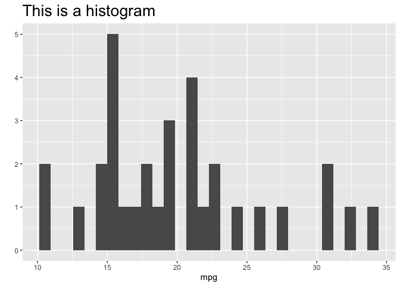<!-- -->

``` r
> hgramt + theme(plot.title = element_text(size = 20, colour = "red")) 
```

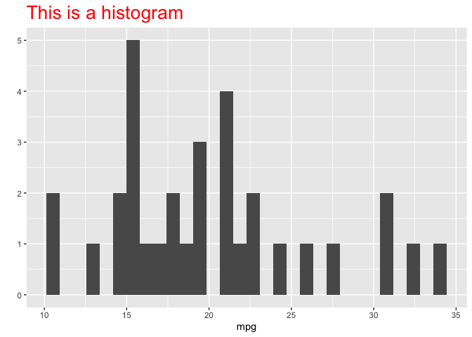<!-- -->

``` r
> hgramt + theme(plot.title = element_text(size = 20, hjust = 0))
```

<!-- -->

``` r
> hgramt + theme(plot.title = element_text(size = 20, face = "bold")) 
```

<!-- -->

``` r
> hgramt + theme(plot.title = element_text(size = 20, angle = 180))
```

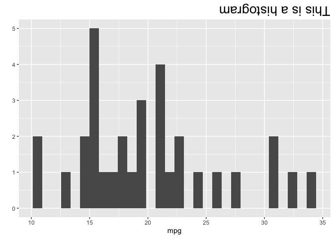<!-- -->

- `element_line()`绘制线条或线段，该元素函数可控制colour、size、linetype。图8.3展示了相应结果，代码如下所示。

``` r
> hgram + theme(panel.grid.major = element_line(colour = "red")) 
```

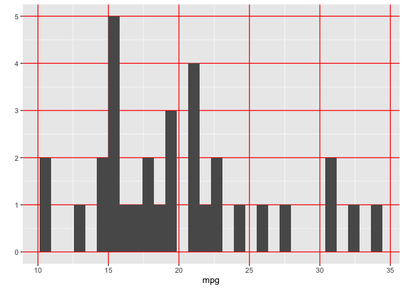<!-- -->

``` r
> hgram + theme (panel.grid.major = element_line(size = 2))
```

<!-- -->

``` r
> hgram + theme (panel.grid.major = element_line(linetype = "dotted"))
```

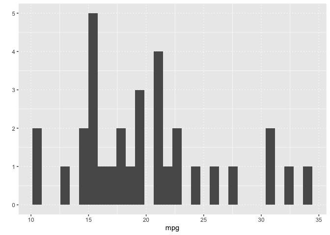<!-- -->

``` r
> hgram + theme(axis.line = element_line())
```

<!-- -->

``` r
> hgram + theme(axis.line = element_line(colour = "red"))
```

<!-- -->

``` r
> hgram + theme(axis.line = element_line(size = 0.5,linetype = "dashed"))
```

<!-- -->

- `element_rect()`绘制主要供背景使用的矩形。你可以控制填充颜色(fill)和边界的colour、size、linetype，实例如图8.4所示，代码如下。

``` r
> hgram + theme(plot.background = element_rect(fill = "grey80", colour = NA)) 
```

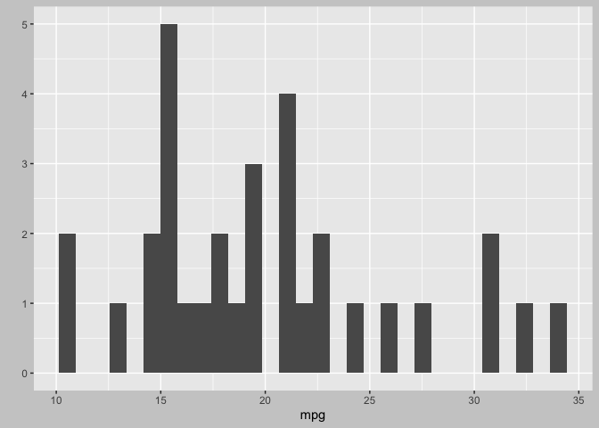<!-- -->

``` r
> hgram + theme(plot.background = element_rect(size = 2))
```

<!-- -->

``` r
> hgram + theme(plot.background = element_rect(colour = "red"))
```

<!-- -->

``` r
> hgram + theme (panel.background = element_rect())
```

<!-- -->

``` r
> hgram + theme(panel.background = element_rect(colour = NA))
```

<!-- -->

``` r
> hgram + theme(panel.background = element_rect(linetype = "dotted"))
```

<!-- -->

- `element_blank()`表示空主题，即对元素不分配相应的绘图空间。该函数可删去我们不感兴趣的绘图元素，如图8.5。使用之前的colour
  =NA, fill = NA让某些元素不可见，可达到相同的效果，但仍占绘图空间。

``` r
> hgramt
```

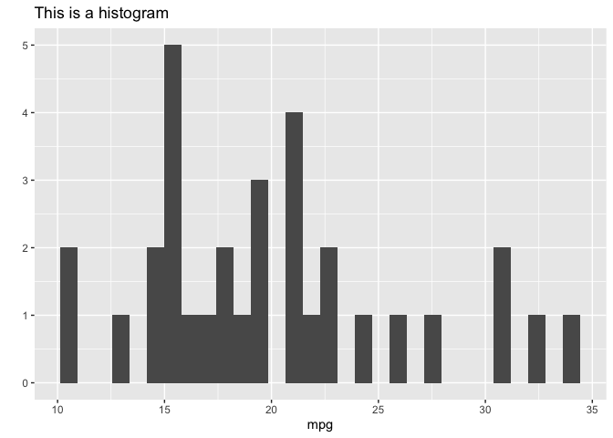<!-- -->

``` r
> last_plot() + theme(panel.grid.minor = element_blank()) 
```

<!-- -->

``` r
> last_plot() + theme(panel.grid.major = element_blank())
```

<!-- -->

``` r
> last_plot() + theme(panel.background = element_blank())
```

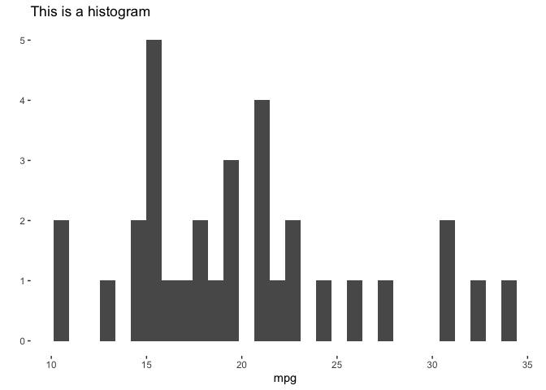<!-- -->

``` r
> last_plot() + theme(axis.title.x = element_blank(),axis.title.y = element_blank())
```

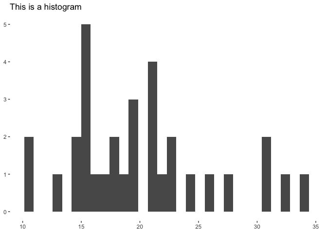<!-- -->

``` r
> last_plot() + theme(axis.line = element_line())
```

<!-- -->

- 使用`theme_get()`可得到当前主题的设置。`theme()`可在一幅图中对某些元素进行局部性地修改，`theme_update()`可为后面图形的绘制进行全局性地修改。图8.6展示了多个主题设置结合起来的效果。

``` r
> old_theme <- theme_update(
+   plot.background = element_rect(fill = "#3366FF"),
+   panel.background = element_rect(fill = "#003DF5"),
+   axis.text.x = element_text(colour = "#CCFF33"),
+   axis.text.y = element_text(colour = "#CCFF33", hjust = 1),
+   axis.title.x = element_text(colour = "#CCFF33", face = "bold"), 
+   axis.title.y = element_text(colour = "#CCFF33", face = "bold", angle = 90))
> qplot(cut, data = diamonds, geom = "bar")
```

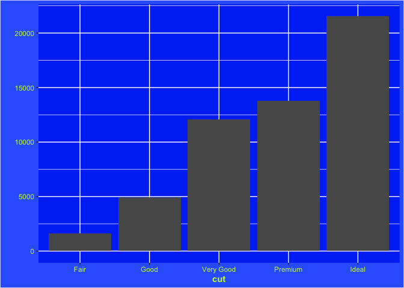<!-- -->

``` r
> qplot(cty, hwy, data = mpg)
```

<!-- -->

``` r
> theme_set(old_theme)
```

- 由于必须分别设置x和y元素，示例中的设置显得有些重复。但你想完全控制元素外观，必须承受这种繁琐。如果你想设定自己独有的主题，最好写一个函数来最小化这种重复。

## 8.2 自定义标度和几何对象

- 为保证新主题的整体连贯性，你可能需要调整一些标度和几何对象的默认设置。下文中的函数可避免每次添加标度或几何对象时都不得不手动设置参数的繁琐。

### 8.2.1 标度

- 如果需要改变默认标度的显示方法，请重新定义或者用ggplot2中已经定义的可选方法覆盖控制相应图形属性的标度函数。该函数的命名方法通常是scale_aesthetics_continuous或者scale_aesthetics_discrete，请将函数命名中的aesthetics替换成相应的图形属性，比如color、fill、size等等。示例如下：

``` r
> theme_set(theme_bw())
> p1 <- qplot(mpg,wt, data = mtcars, colour = factor(cyl))
> p1
```

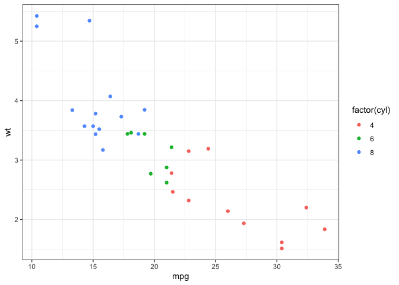<!-- -->

``` r
> 
> scale_colour_discrete <- scale_colour_brewer
> p1
```

<!-- -->

### 8.2.2 几何对象和统计变换

- 类似`update_geom_defaults()`和`update_stat_defaults()`，我们也可以自定义几何对象和统计变换。与其他的主题设置不同，此处设置只影响设置改变后新绘制的图形，而不是所有图形。下面例子展示了如何改变默认颜色和将默认直方图改变成密度直方图。

``` r
> update_geom_defaults("point", aes(colour = "darkblue")) 
> qplot(mpg, wt, data=mtcars)
```

<!-- -->

- 表8.2列出了所有常见的图形属性默认设置。如果你改变了一个几何对象的默认值，那么最好也要改变其他所有几何对象的默认值，以保持图形的整体一致性。附录B列出了所有颜色、曲线类型、形状和大小设置的细节，可参考它来调整参数。


## 8.3 存储输出

- 基本图形输出有两种类型：矢量型或光栅型。矢量图是过程化的，意味着图形可无限缩放而没有细节的损失。光栅图以像素阵列形式存储，具有固定的最优观测大小。

- 一般来说，矢量输出更受人喜爱，但对于包含数千个对象的图形，矢量谊染会变得很慢，此时最好转化为光栅输出。对于图形印刷，高分辨率(例如600dpi)可能是较好的折中方案，但是图形可能会很大。

- 你可使用R基础的图形设备或者ggplot2中特有的函数`ggsave()`来存储当前图形。`ggsave()`是为了图形交互而优化过的函数，它有如下重要的参数：

- path设定图形存储的路径，它会根据文件扩展名自动选择正确的图形设备。

- 三个控制输出尺寸的参数。若空白，则使用当前屏幕图形设备尺寸。width和height设置绝对尺寸大小，scale设置图形相对屏幕展示的尺寸大小。当最终图形绘制好后，最好设置width
  和 height，这样可精确控制输出尺寸。

- 对于光栅图形，dpi参数控制图形的分辨率，默认值为300，适合大部分打印设备，但是你可以修改为600，用于高分辨率输出，或者修改为72，用于屏幕(如网页)展示。

- 下面的代码展示了两种存储方法。若你想将两幅图形存储到一个文件中，你需要打开基于磁盘的图形设备(比如`png()`或`pdf()`)，打印图形，然后关闭图形设备`dev.off()`。

``` r
> qplot(mpg, wt, data = mtcars)
```

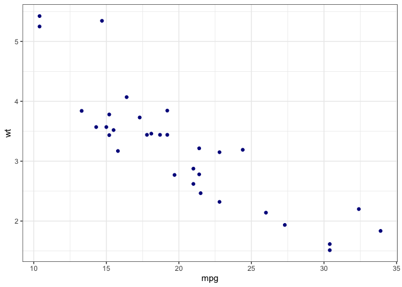<!-- -->

``` r
> ggsave(file = "output.pdf")
> pdf(file = "output.pdf", width = 6, height = 6)
> # 在脚本中，你需要明确使用print()来打印图形
> qplot(mpg, wt, data = mtcars)
> qplot(wt,mpg, data = mtcars)
> dev.off()
quartz_off_screen 
                2 
```

## 8.4 一页多图

- 若想绘制一页多图，你必须了解些grid(ggplot2中默认调用)的工作原理。其关键概念是视图窗口(viewport)：显示设备的一个矩形子区域。默认的视图窗口占据了整个绘图区域，通过设置视图窗口，你可以任意安排多幅图形的位置。

- 首先，我们绘制三幅测试图形。若想一页多图，最简单的方式是创建图形并将图形赋成变量，然后再绘制出来。这样你就只需关注图形的摆放而不是内容了。图8.8展示了下面的代码生成的图形。

``` r
> a <- qplot(date, unemploy, data = economics, geom = "line")
> a
```

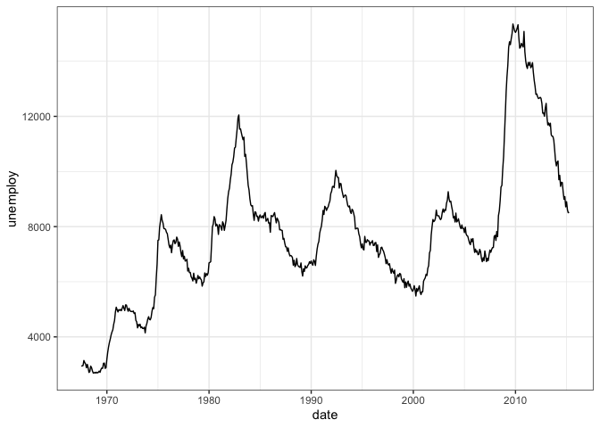<!-- -->

``` r
> b <- qplot(uempmed, unemploy, data = economics) + geom_smooth(se = F)
> b
```

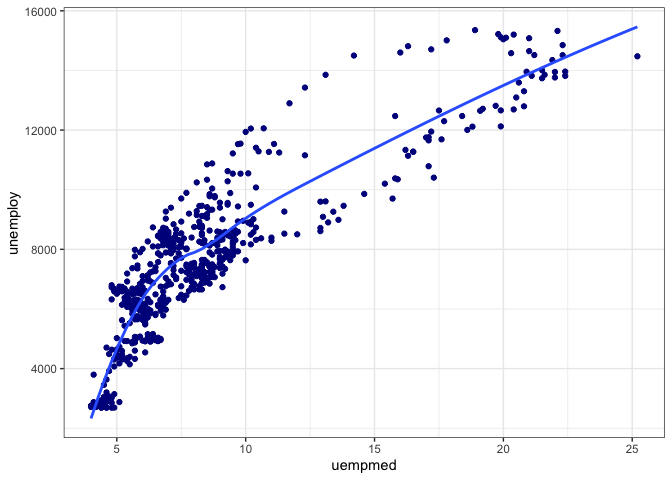<!-- -->

``` r
> c <- qplot(uempmed, unemploy, data = economics, geom="path")
> c
```

<!-- -->

- 图8.8 测试图形布局的三幅图形。

### 8.4.1 子图

- 把子图嵌入到主图的顶部是一种常见的图形布局。为达到这个效果，我们首先需要绘制主图，然后在更小的视图窗口绘制子图。`viewport()`函数可创建视图窗口，参数x，y，width，heigth控制视图窗口的大小和位置。默认的测量单位是“npc”，范围从0到1。(0,0)代表的位置是左下角，(1,1)代表右上角，(0.5,0.5)代表视图窗口的中心。如果这些单位不符合你的需求，你也可使用如unit(2,“cm”)或unit(1,“inch”)这样的绝对单位。

<!-- -->

    library(grid)
    # 一个占据整个图形设备的视图窗口
    vp1 <- viewport(width = 1, height = 1,x= 0.5,y = 0.5) 
    vp1 <- viewport()
    # 只占了图形设备一半的宽和高的视图窗口,
    # 定位在图形的中间位置
    vp2 <- viewport(width = 0.5, height = 0.5,x =0.5,y = 0.5) 
    vp2 <- viewport(width = 0.5, height = 0.5)
    # 一个 2cm x 3cm 的视图窗口，定位在图形设备中心
    vp3 <- viewport(width = unit(2, "cm"), height = unit(3, "cm"))

- 默认地，x和y参数控制着视图窗口的中心位置，若想调整图形位置，你需要通过just参数来控制将图形放置在哪个边角。

<!-- -->

    # 在右上角的视图窗口
    vp4 <- viewport(x = 1, y = 1, just = c("top", "right"))
    # 处在左下角
    vp5 <- viewport(x = 0, y = 0, just = c("bottom", "right"))

- 为了能在新的视图窗口中画图，我们还需要使用`print()`中的vp参数。通常在命令行上解析某些代码时会自动调用
  `print()`，但因为我们想自定义视图窗口，因此需要我们手动调用。图polishing-subplot-1展示了以下代码的结果。

``` r
> library(grid)
> pdf("polishing-subplot-1.pdf",width = 4,height = 4)
> subvp <- viewport(width = 0.4,height =0.4,x =0.75,y =0.35) 
> b
> print(c,vp = subvp) 
> dev.off()
quartz_off_screen 
                2 
```

- 这是我们预期的图形，不过仍需对图形的外观进行一些微调：文本应更小些，要移除轴标签，缩减图形边界。结果如图polishing-subplot-2，代码如下。

``` r
> library(grid)
> csmall <- c + theme_gray(9) + labs(x = NULL,y = NULL) + theme(plot.margin = unit(rep(0,4),"lines"))
> pdf("polishing-subplot-2.pdf",width =4,height =4) 
> b
> print(csmall,vp = subvp) 
> dev.off()
quartz_off_screen 
                2 
```

- 注意需要使用`pdf()`或`png()`将图形存储到磁盘中，因为`ggsave()`只能存储一幅图。

### 8.4.2 矩形网格

- 更复杂的情形是在矩形网格绘制大量图形。当然，你可以使用以上你学到的视窗图方法来解决，但大量的手工计算非常繁琐。一个更好的处理方式为`grid.layout()`，它设置了一个任意高和宽的视图窗口网格。虽然你仍需一个个创建视图窗口，但不用设置视图窗口的位置和大小，只需设置布局(layout)的行数和列数即可。

- 下面的例子阐释了网格法的工作原理。首先创建一个布局，如2×2网格，随后将它分配到一个视图窗口中，在视图窗口上构建绘图设备，然后在网格预期的位置上绘图。我们可按行向量或列向量将图形在多个单元格中展开，如图
  polishing-layout所示。

``` r
> pdf("polishing-layout.pdf",width = 8,height = 6) 
> grid.newpage()
> pushViewport(viewport(layout = grid.layout(2,2))) 
> vplayout <- function(x,y)viewport(layout.pos.row = x,layout.pos.col = y) 
> print(a,vp = vplayout(1,1:2)) 
> print(b,vp = vplayout(2,1)) 
> print(c,vp = vplayout(2,2)) 
> dev.off()
quartz_off_screen 
                2 
```

- 在默认的`grid.layout()`中，每个单元格的大小都相同，你可设置widths和heights参数使它们具有不同的大小。具体例子请参考`grid.layout()`的文档。
