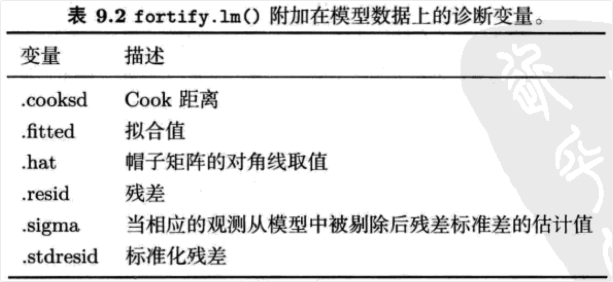

```{r setup, include=FALSE}
knitr::opts_chunk$set(prompt=TRUE,comment='',echo=TRUE,collapse=TRUE,message=FALSE,warning=FALSE)
```

# 9 数据操作

## 9.1 plyr包简介

-   使用分面(faceting)参数，ggplot2可以同时在数据的多个子集上作出相同的图。相应地，plyr包中的`ddply()`函数能够同时在数据的多个子集上作统计汇总。plyr包提供了一整套工具集来处理列表(list)、数组(array)和数据框(data.frame)，把复杂的数据分割成几个部分，分别对各个部分进行处理，最后把这些结果综合到一起。这里主要用到其中的`ddply()`函数。该函数能够根据行的取值，把数据框分解成几个子集，分别把各个子集输入某个函数，最后把结果综合在一个数据框内。函数基本用法是`ddply(.data,.variables,.fun,..)`，其中：

-   .data是用来作图的数据。

-   .variables是对数据取子集的分组变量，形式是.(var1,var2)。为了与图形保持一致，该变量必须包含所有在画图过程中用到的分组变量和分面变量(faceting variable，分面变量用来把数据分割成几个部分，每个部分分别画在一张小图里；而分组变量则是同一张图内的数据分成几个部分处理)。

-   .fun是要在各子集上运行的统计汇总函数。这个函数可以返回向量也可以返回数据框。注意这里不要求.fun的返回结果包含分组变量，如果需要的话分组变量会被自动加入到最终结果里。函数返回结果可以是高度概括的数据集（也许只是一个数），也可以是用修改或扩展之后的数据。

-   `subset()`用来对数据取子集的函数，选择数据中前（或后）n个（或x%的）观测值，或是在某个阈值之上或下的观测值：

```{r}
library(ggplot2)
library(plyr)
# 选取各个颜色里最小的钻石
f1 <- ddply(diamonds,.(color),subset,carat == min(carat)) 
head(f1)
# 选取最小的两颗钻石
f2 <- ddply(diamonds,.(color),subset,order(carat) <= 2) 
head(f2)
# 选取每组里大小为前1%的钻石
f3 <- ddply(diamonds,.(color),subset,carat > quantile(carat,0.99)) 
head(f3)
# 选出所有比组平均值大的钻石
f4 <- ddply(diamonds,.(color),subset,price > mean(price))
head(f4)
```

-   `transform()`是用来进行数据变换的函数，与`ddply()`一起可以计算分组统计量，例如各组的标准差，并且加到原数据上去。另外，9.21小节还介绍了这个函数的另一种用法---把几个时间序列数据调整到同一标度。

```{r}
# 把每个颜色组里钻石的价格标准化，使其均值为0，方差为1 
f5 <- ddply(diamonds,.(color),transform,price = scale(price))
head(f5)
# 减去组均值
f6 <- ddply(diamonds,.(color),transform,price = price-mean(price))
head(f6)
```

-   `colwise()`用来向量化一个普通函数，也就是说`colwise()`能把原本只接受向量输人的函数变成可以接受数据框输入的函数。要注意`colwise()`返回的是一个新的函数而不是函数运行结果。下面例子里函数`nmissing()`计算向量里缺失值的数目，用`colwise()`向量化后，可以应用到数据框上，计算数据框各列的缺失值数目。

```{r}
nmissing <- function(x)sum(is.na(x)) 
nmissing(msleep$name)
nmissing(msleep$brainwt)

nmissing_df <- colwise(nmissing) 
nmissing_df(msleep)

# 更便捷的方法
colwise(nmissing)(msleep)
```

-   `numcolwise()`是`colwise()`的一个特殊版本，功能类似，但`numcolwise()`只对数值类型的列操作。例如，`numcolwise(median)`对每个数值类型的列计算中位数，`numcolwise(quantile)`对每个数值类型的列计算分位数。有了`numcolwise()`，相应地就有`catcolwise()`，`catcolwise()`只对分类类型的列操作。

```{r}
msleep2 <- msleep[,-6] # 移除第六列
numcolwise(median)(msleep2,na.rm = T)
numcolwise(quantile)(msleep2,na.rm = T)
numcolwise(quantile)(msleep2,probs = c(0.25,0.75), na.rm = T)
```

-   以上这些函数与ddply一起可以对数据进行各种分组统计。

```{r}
ddply(msleep2,.(vore),numcolwise(median),na.rm = T)
ddply(msleep2,.(vore),numcolwise(mean),na.rm = T)
```

-   如果以上提供的函数不够用，读者可以编写自己的函数，只要它也能接收、输出数据框就可以。例如下面的函数用于计算价格和克拉的秩相关系数以及对数变换后的普通相关系数。

```{r}
my_summary <- function(df){
  with(df,data.frame(
    pc_cor = cor(price,carat,method = "spearman"), 
    lpc_cor = cor(log(price),log(carat))
  ))
  }
ddply(diamonds,.(cut),my_summary)
ddply(diamonds,.(color),my_summary)
```

-   注意，上面例子里的函数`my_summary()`里没有输出分组变量cut和color，但是最终输出里却自动包含了这些分组变量。

-   以上所有问题都有个共同点，就是这些操作对单独的子集很简单，也许只需要一行代码。但针对多个子集操作并且组合各个结果就相对来说麻烦些。有了`ddply()`，这些操作就可以直接完成了。

-   下面的这个案例介绍怎样用plyr完成ggplot2内置的统计功能。在某些情况下，例如需要把统计结果存到硬盘上或是想把这个方法用到其他数据集上的时候，这么做是很有必要的。而且这样还能够检查ggplot2的中间过程与我们的想法是否完全一致。

### 9.1.1 拟合多个模型

-   本节演示stat_smooth生成平滑数据(smoothed data)的过程("平滑"是指用一个函数来拟合数据间的关系，例如回归就是一种平滑过程。而"平滑数据"是指用平滑函数得到的预测值)。事实上，不仅仅是平滑数据，这个过程对任何其他统计量都是一样的，而且允许在ggplot2之外定制更复杂的方法。图9.1是以下代码生成的分组平滑结果。

```{r}
qplot(carat,price,data = diamonds,geom ="smooth", colour = color)
dense <- subset(diamonds,carat = 2)
qplot(carat,price,data = dense,geom ="smooth", colour = color,fullrange = TRUE)
```

-   图9.1 图中是不同颜色钻石price对carat的平滑趋势。左图是全部数据，可以看到重量大于2克拉后，标准差就激增，因为重量大于2克拉的钻石的个数较少。右图我们只画重量小于2克拉的钻石，重点关注数据较多的区域。

-   那么如何用plyr生成一模一样的图呢？首先读下`stat_smooth()`的文档，看看它内部用的是什么模型：对于大数据它用的是`gam(y ~ s(x, bs = "cs"))`。为了得到与`stat_smooth`同样的结果，先拟合这个模型，然后在一系列等距的点上求模型的预测值。这个过程是用下面代码中的`smooth()`函数实现的。有了这个函数，再结合`ddply()`就可以对不同颜色的钻石画出平滑曲线。

```{r}
library(mgcv)
smooth <- function(df){
  mod <- gam(price ~ s(carat,bs = "cs"),data = df) 
  grid <- data.frame(carat = seq(0.2,2,length = 50))
  pred <- predict(mod,grid,se =T)
  grid$price <- pred$fit
  grid$se <- pred$se.fit 
  grid
  }
smoothes <- ddply(dense,.(color),smooth)
qplot(carat,price,data = smoothes,colour = color, geom = "line")
qplot(carat,price,data = smoothes,colour = color, geom = "smooth",ymax = price + 2 * se,
      ymin = price - 2 * se)
```

-   如果分组变量也被纳入了平滑模型的话，那么用plyr完成这个过程可以更灵活些。例如以下模型把钻石的价格当作克拉数和颜色的非线性函数。当然这个模型很不理想，因为它可能会把某些小且劣质的钻石价格预测为负。

```{r}
mod <- gam(price ~s(carat,bs = "cs") + color,data =dense) 
grid <- with(diamonds,expand.grid( 
  carat = seq(0.2,2,length =50), color = levels(color)
  ))
grid$pred <- predict(mod,grid)
qplot(carat,pred,data = grid,colour = color,geom = "line")
```

-   组合多个模型的其他方法参见4.9.3节和5.8节。

## 9.2 把数据化"宽"为"长"

-   ggplot2进行数据分组时必须根据行，而不能根据列。例如可以把钻石根据颜色分组，却不能把钻石的克拉数和价格变量分成两组。所以在一张图中以每种颜色的钻石为一组，分别画价格曲线很容易，但想把价格和克拉数两个变量作为两组，分别画一条曲线就很难。本节介绍如何把"宽"的数据变成"长"的数据，也就是说变量不再是放在各个列上，而是排成一列，每个变量都分别占其中的几行。这样就能够根据行把每个变量分组，然后作图。

-   本节将会使用到reshape2包中的`melt()`函数。另外，reshape2包还提供了`cast()`函数，它能灵活地整理、综合数据。感兴趣的读者可以进行深人地了解。表9.1给出了一个例子。`melt()`函数有三个参数：

-   data：待变形的原数据。例如表9.1中左表的数据。

-   id.vars：依旧放在列上、位置保持不变的变量。id.vars通常是离散的，并且是预先给定的。用方差分析的角度来理解，id.vars好比是变量Yijk的下标；用数据库的角度来理解，id.vars好比是数据表的主键。例如表9.1中的date变量，变形后依旧单独占一列。

-   measure.vars：需要被放进同一列的变量。不同的变量放在同一列后，根据原变量名来分组，这样这些变量就可以同时画在一张图里。例如表9.1中变量pce和pop都被放在了value列里，用新增的variable用来记录每行数据原来属于哪一列。

-   如果读者熟悉Vilkinson的图形语法的话，可能想知道为什么其中的代数部分在ggplot2里没有。这是因为R里已经有很多的数据变形方法了，没有必要在ggplot2里增加这样的功能。ggplot2的理念之一就是把数据变形和可视化尽可能分开。

-   下面的几节更详细地讨论了"长"数据的两个重要应用：多重时间序列图和平行坐标图。你将会看到如何用`ddply()`来调整变量标度，并学习到在处理这类数据时ggplot2的几个有用特性。

### 9.2.1 多重时间序列

-   以下以economics数据为例。该数据包含诸如失业人数(unemploy)和失业周数的中位数(uempmed)等月度经济数据，我们预判这两个变量可能会相关。图9.3把两个变量画在两个单独的趋势图里，还有两者的散点图。但是如果想在一张图上同时画这两个时间序列的趋势图呢？

-   一种方法是用6.4.4节的方法，画图时把两个变量放在两个不同的图层上。但是如果有很多变量的话，这样做就很繁琐了。比较好的方法是，把数据变成一个"长"的格式，然后再可视化。在"长"数据里，时间序列值存在value变量里，然后用variable变量来区分。下面的代码就演示了这两种方法。如图9.4所示，两个方法画出来的图是一样的。

```{r}
ggplot(economics,aes(date)) + geom_line(aes(y = unemploy,colour = "unemploy")) + 
  geom_line(aes(y = uempmed,colour = "uempmed")) + scale_colour_hue("variable") 
require(reshape2)
emp <- melt(economics,id = "date",measure = c("unemploy","uempmed")) 
qplot(date,value,data = emp,geom = "line",colour = variable)
```

-   图9.4 两种方法都能把两个序列画在一张图上，并且结果一样。但是"长"的数据在处理多变量的时候更方便。由于两个序列取值不在一个数量级上，所以只能看到unemploy的变化形式。仔细看会发现在图形的底下还有条线，那就是uempmed的趋势线。

-   这些图都有一个共同的问题：两个变量取值差异太大，所以uempemed变量变成了图形底下一条平坦的线。ggplot2不允许画带两个不同坐标轴的图，因为这样的图具有误导性。ggplot2有两个比较直观的改进方法：把数据标度调整到相同的范围或使用自由标度的分面。这两个方法可以用下面的代码实现，结果如图9.5所示。

```{r}
range01 <- function(x){
  rng <- range(x,na.rm = TRUE)
  (x - rng[1])/diff(rng)
  }
emp2 <- ddply(emp,.(variable),transform,value = range01(value)) 
qplot(date,value,data = emp2,geom = "line",colour = variable,linetype = variable) 
qplot(date,value,data = emp,geom ="line") + facet_grid(variable ~.,scales = "free_y")
```

-   图9.5 当序列数据大小差异很大时，可以使用两种方法：左图，把数据调整到相同的尺度上；右图，把数据画在不同的分面图形上。

## 9.3 `ggplot()`方法

-   `ggplot()`是一个泛型函数，能根据不同的数据调用不同的方法。最常见的的数据类型是数据框，所以本章一直以数据框为例。`ggplot()`函数跟base和lattice系统一样，也可以接收其他数据类型，但是具体实现方法上有着本质的不同：ggplot2并不是像它们一样直接输入数据、输出图形，而只提供作图所需要的工具。

-   ggplot2需要借助`fortify()`来完成整个过程。`fortify()`能接收一个模型或对象，以及一个可选的原始数据作为第二参数，然后把它变成能输入到ggplot2的形式，比如数据框。fortify这个名称来自把模型和数据结合起来的想法：用模型预测、扩展数据，用数据修补、诊断模型，得到的结果既可以反映模型，又可以反映数据。在后面讨论线性模型增补方法时，这个概念会变得更具体一些。

-   本小节介绍`fortify()`的原理以及如何用它生成符合ggplot2理念的新方法。ggplot2最重要的理念之一就是数据变形和图形展示尽可能分开进行。这样做可以让用函数的人不必局限在函数作者设想的某种特殊场合里。比如在某些情况下数据变形过程不适用了，图形展示过程还可以继续使用。

-   `qplot()`只是把`ggplot()`进行了简单的包装，所以`qplot()`也可以接受不同类型的输入。

### 9.3.1 线性模型

-   ggplot2目前只有一种适合线性模型的fortify方法。下面我们说明一下这个方法的工作原理以及如何用它画出想要的图形。图9.9是一个很简单的模型用`plot.lm()`画出的结果。这些图都是由`plot.lm()`预先选定好的模型诊断图。它们也许对特定的问题很有用，但是却很死板：因为如果想改动其中任何一个地方能够都必须去修改`plot.lm()`的源代码。可是它的源代码很难看懂，因为它的数据变形和数据展示两个中间过程纠缠在一起分不开。

-   而ggplot2把数据整理和展示完全分离开了。`fortify()`方法负责数据变形，然后ggplot2负责画图。`fortify()`把表9.2中由模型产生的新变量加到原数据集中。这些变量都是`plot.lm()`在画图中需要产生的。为了避免与数据集中的变量名冲突，我们在变量名的前面都加了"."。



- 现在我们来拟合一个很简单的模型，画出图9.10。很显然这个模型对数据拟合得不理想，需要进行模型诊断寻找改进的方法。表9.3列出了fortify对这个模型的输出。我们没有提供原数据，所以它的输出结果在六个诊断变量之外自动包含了拟合模型所用的两个变量。这样就能够清晰地看到我们画图所用的数据，并且可以加入新的变量。

```{r}
qplot(displ,cty,data = mpg) + geom_smooth(method = "lm") 
mpgmod <- lm(cty ~ displ,data = mpg)
```

- 图9.10 一个拟合得不好的简单线性模型。

- 数据集增补后，我们可以画出比`plot.lm()`更美观、灵活的图，因为可以根据需要修改任何部分。下面的例子就演示了如何模仿并扩展plot.lm的第一幅图。在这些图的基础上，我们就可以进一步改进它：比如用标准化残差替代未标准化残差，或让点的大小代表Cook距离。结果如图9.11所示。

```{r}
mod <- lm(cty ~ displ,data = mpg)
basic <- ggplot(mod,aes(.fitted,.resid)) +
  geom_hline(yintercept = 0,colour ="grey50",size = 0.5) + geom_point() +
  geom_smooth(size =0.5,se = F)
basic
basic + aes(y = .stdresid)
basic + aes(size = .cooksd) + scale_size_area("Cook's distance")
```

- 图9.11 （左）基本的拟合值-残差图。（中）标准化的残差。（右）点大小与Cook距离成比例。只要有全部的数据就可以很容易地修改基本图形。

- 我们还可以继续增补数据集，把原数据中没有被放入回归模型的变量也添加到图中。这样有助于发现哪些变量能改进模型。图9.12给不同汽缸数的点标上不同的颜色，从图上可以看到按汽缸数分组后，各组内的点大致呈现线性，所以需要把这个变量加入模型。

```{r}
full <- basic %+% fortify(mod,mpg) 
full + aes(colour = factor(cyl)) 
full + aes(displ,colour = factor(cyl))
```

- 图9.12 把原数据中的变量加到当前模型里可能会产生新的发现。比如displ与cty之间似乎是曲线关系，但增加了气缸数量变量cyl后，可以看到只要给定了cyl，displ与cty之间其实是呈线性关系的。